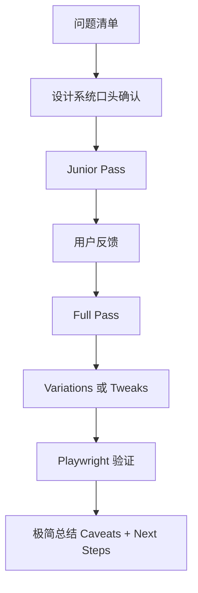

<details>
<summary>相关源文件</summary>

生成本页时使用的主要源文件：

- [SKILL.md](../../../project-repos/huashu-design/SKILL.md)
- [references/workflow.md](../../../project-repos/huashu-design/references/workflow.md)
- [references/content-guidelines.md](../../../project-repos/huashu-design/references/content-guidelines.md)
- [references/verification.md](../../../project-repos/huashu-design/references/verification.md)
- [test-prompts.json](../../../project-repos/huashu-design/test-prompts.json)
- [.gitignore](../../../project-repos/huashu-design/.gitignore)

</details>

# 工作流、质量门与测试提示

Huashu Design 的质量控制来自流程而不是事后修补：开工前问问题，提炼设计系统，Junior pass 展示 assumptions 和 placeholders，Full pass 填充与 variations，最后用 Playwright 验证。Sources: [references/workflow.md:5-18](../../../project-repos/huashu-design/references/workflow.md#L5-L18), [references/workflow.md:99-153](../../../project-repos/huashu-design/references/workflow.md#L99-L153), [SKILL.md:601-648](../../../project-repos/huashu-design/SKILL.md#L601-L648)

<details class="source-snippets">
<summary>引用源码</summary>

<!-- source-snippets:start -->

#### `references/workflow.md:5-18`

```markdown
## 问问题的艺术

大多数情况下，开工前要问至少10个问题。不是走过场，是真的要把需求摸清。

**什么时候必须问**：新任务、模糊任务、没有design context、用户只说了一句模糊的要求。

**什么时候可以不问**：小修小补、follow-up任务、用户已经给了明确PRD+截图+上下文。

**怎么问**：大部分 agent 环境没有结构化问题 UI，在对话里用 markdown 清单问即可。**一次性把问题列完让用户批量答**，不要一来一回一个个问——那会浪费用户时间、打断用户思路。

## 必问清单

每个设计任务都必须问清这5类问题：

```

#### `references/workflow.md:99-153`

````markdown
## Junior Designer模式

这是整个workflow最重要的环节。**不要接到任务就闷头冲**。步骤：

### Pass 1：Assumptions + Placeholders（5-15分钟）

HTML文件头部先写你的**assumptions+reasoning comments**，像junior给manager汇报：

```html
<!--
我的假设：
- 这是给XX受众看的
- 整体tone我理解为XX（基于用户说的"专业但不严肃"）
- 主要flow是A→B→C
- 色彩我想用品牌蓝+暖灰，不确定你想不想要accent色

未解的问题：
- 第3步的数据从哪里来？先用placeholder
- 背景图用抽象几何还是真照片？先占位

如果你看到这里觉得方向不对，现在是成本最低的时候改。
-->

<!-- 然后是带placeholder的结构 -->
<section class="hero">
  <h1>[主标题位 - 等用户提供]</h1>
  <p>[副标题位]</p>
  <div class="cta-placeholder">[CTA按钮]</div>
</section>
```

**保存 → show用户 → 等反馈再走下一步**。

### Pass 2：真实组件+Variations（主力工作量）

用户批准方向后，开始填充。这时：
- 写React组件替换placeholder
- 做variations（用design_canvas或Tweaks）
- 如果是幻灯片/动画，用starter components起手

**做到一半再show一次**——不要等全做完。设计方向错了，晚show等于白做。

### Pass 3：细节打磨

用户满意整体后，打磨：
- 字号/间距/对比度微调
- 动画timing
- 边界case
- Tweaks面板完善

### Pass 4：验证+交付

- 用Playwright截图（见`references/verification.md`）
- 打开浏览器肉眼确认
- 总结**极简**：只说caveats和next steps
````

#### `SKILL.md:601-648`

```markdown
## 工作流程

### 标准流程（用TaskCreate追踪）

1. **理解需求**：
   - 🔍 **0. 事实验证（涉及具体产品/技术时必做，优先级最高）**：任务涉及具体产品/技术/事件（DJI Pocket 4、Gemini 3 Pro、Nano Banana Pro、某新 SDK 等）时，**第一个动作**是 `WebSearch` 验证其存在性、发布状态、最新版本、关键规格。把事实写入 `product-facts.md`。详见「核心原则 #0」。**这步做在问 clarifying questions 之前**——事实错了问什么都歪。
   - 新任务或模糊任务必须问clarifying questions，详见 `references/workflow.md`。一次focused一轮问题通常够，小修小补跳过。
   - 🛑 **检查点1：问题清单一次性发给用户，等用户批量答完再往下走**。不要边问边做。
   - 🛑 **幻灯片/PPT 任务：HTML 聚合演示版永远是默认基础产物**（不管用户最终要什么格式）：
     - **必做**：每页独立 HTML + `assets/deck_index.html` 聚合（重命名为 `index.html`，编辑 MANIFEST 列所有页），浏览器里键盘翻页、全屏演讲——这是幻灯片作品的"源"
     - **可选导出**：额外询问是否需要 PDF（`export_deck_pdf.mjs`）或可编辑 PPTX（`export_deck_pptx.mjs`）作为衍生物
     - **只有要可编辑 PPTX 时**，HTML 必须从第一行就按 4 条硬约束写（见 `references/editable-pptx.md`）；事后补救会 2-3 小时返工
     - **≥ 5 页 deck 必须先做 2 页 showcase 定 grammar 再批量推**（见 `references/slide-decks.md` 的「批量制作前先做 showcase」章节）——跳过这步 = 方向错返工 N 次而非 2 次
     - 详见 `references/slide-decks.md` 开头「HTML 优先架构 + 交付格式决策树」
   - ⚡ **如果用户需求严重模糊（没参考、没明确风格、"做个好看的"类）→ 走「设计方向顾问（Fallback 模式）」大节，完成 Phase 1-4 选定方向后，再回到这里 Step 2**。
2. **探索资源 + 抽核心资产**（不只是抽色值）：读 design system、linked files、上传的截图/代码。**涉及具体品牌时必走 §1.a「核心资产协议」五步**（问→按类型搜→按类型下载 logo/产品图/UI→验证+提取→写 `brand-spec.md` 含所有资产路径）。
   - 🛑 **检查点2·资产自检**：开工前确认核心资产到位——实体产品要有产品图（不是 CSS 剪影）、数字产品要有 logo+UI 截图、色值从真实 HTML/SVG 抽取。缺了就停下补，不硬做。
   - 如果用户没给 context 且挖不出资产，先走设计方向顾问 Fallback，再按 `references/design-context.md` 的品位锚点兜底。
3. **先答四问，再规划系统**：**这一步的前半段比所有 CSS 规则更决定输出**。

   📐 **位置四问**（每个页面/屏幕/镜头开工前必答）：
   - **叙事角色**：hero / 过渡 / 数据 / 引语 / 结尾？（一页 deck 里每页都不一样）
   - **观众距离**：10cm 手机 / 1m 笔记本 / 10m 投屏？（决定字号和信息密度）
   - **视觉温度**：安静 / 兴奋 / 冷静 / 权威 / 温柔 / 悲伤？（决定配色和节奏）
   - **容量估算**：用纸笔画 3 个 5 秒 thumbnail 算一下内容塞得下吗？（防溢出 / 防挤压）

   四问答完再 vocalize 设计系统（色彩/字型/layout 节奏/component pattern）——**系统要服务于答案，不是先选系统再塞内容**。

   🛑 **检查点2：四问答案 + 系统口头说出来等用户点头，再动手写代码**。方向错了晚改比早改贵 100 倍。
4. **构建文件夹结构**：`项目名/` 下放主HTML、需要的assets拷贝（不要bulk copy >20个文件）。
5. **Junior pass**：HTML里写assumptions+placeholders+reasoning comments。
   🛑 **检查点3：尽早show给用户（哪怕只是灰色方块+标签），等反馈再写组件**。
6. **Full pass**：填placeholder，做variations，加Tweaks。做到一半再show一次，不要等全做完。
7. **验证**：用Playwright截图（见 `references/verification.md`），检查控制台错误，发给用户。
   🛑 **检查点4：交付前自己肉眼过一遍浏览器**。AI写的代码经常有interaction bug。
8. **总结**：极简，只说caveats和next steps。
9. **（默认）导出视频 · 必带 SFX + BGM**：动画 HTML 的**默认交付形态是带音频的 MP4**，不是纯画面。无声版本等于半成品——用户潜意识感知「画在动但没声音响应」，廉价感的根源就在这里。流水线：
   - `scripts/render-video.js` 录 25fps 纯画面 MP4（只是中间产物，**不是成品**）
   - `scripts/convert-formats.sh` 派生 60fps MP4 + palette 优化 GIF（视平台需要）
   - `scripts/add-music.sh` 加 BGM（6 首场景化配乐：tech/ad/educational/tutorial + alt 变体）
   - SFX 按 `references/audio-design-rules.md` 设计 cue 清单（时间轴 + 音效类型），用 `assets/sfx/<category>/*.mp3` 37 个预制资源，按配方 A/B/C/D 选密度（发布 hero ≈ 6个/10s，工具演示 ≈ 0-2个/10s）
   - **BGM + SFX 双轨制必须同时做**——只做 BGM 是 ⅓ 分完成度；SFX 占高频、BGM 占低频，频段隔离见 audio-design-rules.md 的 ffmpeg 模板
   - 交付前 `ffprobe -select_streams a` 确认有 audio stream，没有则不是成品
   - **跳过音频的条件**：用户明确说「不要音频」「纯画面」「我要自己配音」——否则默认带。
   - 参考完整流程见 `references/video-export.md` + `references/audio-design-rules.md` + `references/sfx-library.md`。
10. **（可选）专家评审**：用户若提「评审」「好不好看」「review」「打分」，或你对产出有疑问想主动质检，按 `references/critique-guide.md` 走 5 维度评审——哲学一致性 / 视觉层级 / 细节执行 / 功能性 / 创新性各 0-10 分，输出总评 + Keep（做得好的）+ Fix（严重程度 ⚠️致命 / ⚡重要 / 💡优化）+ Quick Wins（5 分钟能做的前 3 件事）。评审设计不评设计师。

**检查点原则**：碰到🛑就停下，明确告诉用户"我做了X，下一步打算Y，你确认吗？"然后真的**等**。不要说完自己就开始做。
```

<!-- source-snippets:end -->
</details>
## Junior Designer 关系

skill 将 agent 定义为用户的 junior designer，用户是 manager。它要求一次性列出问题让用户批量回答，不要一问一答；早期 HTML 要写 assumptions、reasoning 和 placeholders，并在成本最低时 show 给用户。Sources: [references/workflow.md:1-18](../../../project-repos/huashu-design/references/workflow.md#L1-L18), [references/workflow.md:70-130](../../../project-repos/huashu-design/references/workflow.md#L70-L130), [SKILL.md:298-305](../../../project-repos/huashu-design/SKILL.md#L298-L305)

<details class="source-snippets">
<summary>引用源码</summary>

<!-- source-snippets:start -->

#### `references/workflow.md:1-18`

```markdown
# Workflow：从接到任务到交付

你是用户的junior designer。用户是manager。按这个流程工作，能产出好设计的概率会显著提升。

## 问问题的艺术

大多数情况下，开工前要问至少10个问题。不是走过场，是真的要把需求摸清。

**什么时候必须问**：新任务、模糊任务、没有design context、用户只说了一句模糊的要求。

**什么时候可以不问**：小修小补、follow-up任务、用户已经给了明确PRD+截图+上下文。

**怎么问**：大部分 agent 环境没有结构化问题 UI，在对话里用 markdown 清单问即可。**一次性把问题列完让用户批量答**，不要一来一回一个个问——那会浪费用户时间、打断用户思路。

## 必问清单

每个设计任务都必须问清这5类问题：

```

#### `references/workflow.md:70-130`

````markdown
## 问题模板示例

遇到新任务时，可以抄这个结构在对话里问：

```markdown
开始前想跟你对齐几个问题，一次列齐你批量回答就行：

**Design Context**
1. 有设计系统/UI kit/品牌规范吗？如果有在哪？
2. 有可以参考的现有产品或竞品截图吗？
3. 项目里有codebase可以读吗？

**Variations**
4. 想要几种variations？在哪些维度上变（视觉/交互/色彩/...）？
5. 希望都是"接近答案"还是从保守到疯狂的一张地图？

**Fidelity**
6. 保真度：线框 / 半成品 / 带真数据full hi-fi？
7. Scope：一屏 / 一整个flow / 整个产品？

**Tweaks**
8. 希望做完后能实时调哪些参数？

**具体任务**
9. [任务专属问题1]
10. [任务专属问题2]
...
```

## Junior Designer模式

这是整个workflow最重要的环节。**不要接到任务就闷头冲**。步骤：

### Pass 1：Assumptions + Placeholders（5-15分钟）

HTML文件头部先写你的**assumptions+reasoning comments**，像junior给manager汇报：

```html
<!--
我的假设：
- 这是给XX受众看的
- 整体tone我理解为XX（基于用户说的"专业但不严肃"）
- 主要flow是A→B→C
- 色彩我想用品牌蓝+暖灰，不确定你想不想要accent色

未解的问题：
- 第3步的数据从哪里来？先用placeholder
- 背景图用抽象几何还是真照片？先占位

如果你看到这里觉得方向不对，现在是成本最低的时候改。
-->

<!-- 然后是带placeholder的结构 -->
<section class="hero">
  <h1>[主标题位 - 等用户提供]</h1>
  <p>[副标题位]</p>
  <div class="cta-placeholder">[CTA按钮]</div>
</section>
```

**保存 → show用户 → 等反馈再走下一步**。
````

#### `SKILL.md:298-305`

```markdown
### 2. Junior Designer模式：先展示假设，再执行

你是manager的junior designer。**不要一头扎进去闷头做大招**。HTML文件的开头先写下你的assumptions + reasoning + placeholders，**尽早show给用户**。然后：
- 用户确认方向后，再写React组件填placeholder
- 再show一次，让用户看进度
- 最后迭代细节

这个模式的底层逻辑是：**理解错了早改比晚改便宜100倍**。
```

<!-- source-snippets:end -->
</details>


Sources: [references/workflow.md:130-153](../../../project-repos/huashu-design/references/workflow.md#L130-L153), [references/workflow.md:197-216](../../../project-repos/huashu-design/references/workflow.md#L197-L216), [SKILL.md:630-648](../../../project-repos/huashu-design/SKILL.md#L630-L648)

<details class="source-snippets">
<summary>引用源码</summary>

<!-- source-snippets:start -->

#### `references/workflow.md:130-153`

```markdown
**保存 → show用户 → 等反馈再走下一步**。

### Pass 2：真实组件+Variations（主力工作量）

用户批准方向后，开始填充。这时：
- 写React组件替换placeholder
- 做variations（用design_canvas或Tweaks）
- 如果是幻灯片/动画，用starter components起手

**做到一半再show一次**——不要等全做完。设计方向错了，晚show等于白做。

### Pass 3：细节打磨

用户满意整体后，打磨：
- 字号/间距/对比度微调
- 动画timing
- 边界case
- Tweaks面板完善

### Pass 4：验证+交付

- 用Playwright截图（见`references/verification.md`）
- 打开浏览器肉眼确认
- 总结**极简**：只说caveats和next steps
```

#### `references/workflow.md:197-216`

````markdown
## 总结规则

交付时，summary **极短**：

```markdown
✅ 幻灯片已完成（10张），带Tweaks可切换"夜/日模式"。

注意：
- 第4页的数据是假的，等你提供真数据我替换
- 动画用了CSS transition，不需要JS

下一步建议：先你浏览器打开看一遍，有问题告诉我哪页哪处。
```

不要：
- 罗列每一页的内容
- 重复讲你用了什么技术
- 夸自己设计多好

Caveats + next steps，结束。
````

#### `SKILL.md:630-648`

```markdown
4. **构建文件夹结构**：`项目名/` 下放主HTML、需要的assets拷贝（不要bulk copy >20个文件）。
5. **Junior pass**：HTML里写assumptions+placeholders+reasoning comments。
   🛑 **检查点3：尽早show给用户（哪怕只是灰色方块+标签），等反馈再写组件**。
6. **Full pass**：填placeholder，做variations，加Tweaks。做到一半再show一次，不要等全做完。
7. **验证**：用Playwright截图（见 `references/verification.md`），检查控制台错误，发给用户。
   🛑 **检查点4：交付前自己肉眼过一遍浏览器**。AI写的代码经常有interaction bug。
8. **总结**：极简，只说caveats和next steps。
9. **（默认）导出视频 · 必带 SFX + BGM**：动画 HTML 的**默认交付形态是带音频的 MP4**，不是纯画面。无声版本等于半成品——用户潜意识感知「画在动但没声音响应」，廉价感的根源就在这里。流水线：
   - `scripts/render-video.js` 录 25fps 纯画面 MP4（只是中间产物，**不是成品**）
   - `scripts/convert-formats.sh` 派生 60fps MP4 + palette 优化 GIF（视平台需要）
   - `scripts/add-music.sh` 加 BGM（6 首场景化配乐：tech/ad/educational/tutorial + alt 变体）
   - SFX 按 `references/audio-design-rules.md` 设计 cue 清单（时间轴 + 音效类型），用 `assets/sfx/<category>/*.mp3` 37 个预制资源，按配方 A/B/C/D 选密度（发布 hero ≈ 6个/10s，工具演示 ≈ 0-2个/10s）
   - **BGM + SFX 双轨制必须同时做**——只做 BGM 是 ⅓ 分完成度；SFX 占高频、BGM 占低频，频段隔离见 audio-design-rules.md 的 ffmpeg 模板
   - 交付前 `ffprobe -select_streams a` 确认有 audio stream，没有则不是成品
   - **跳过音频的条件**：用户明确说「不要音频」「纯画面」「我要自己配音」——否则默认带。
   - 参考完整流程见 `references/video-export.md` + `references/audio-design-rules.md` + `references/sfx-library.md`。
10. **（可选）专家评审**：用户若提「评审」「好不好看」「review」「打分」，或你对产出有疑问想主动质检，按 `references/critique-guide.md` 走 5 维度评审——哲学一致性 / 视觉层级 / 细节执行 / 功能性 / 创新性各 0-10 分，输出总评 + Keep（做得好的）+ Fix（严重程度 ⚠️致命 / ⚡重要 / 💡优化）+ Quick Wins（5 分钟能做的前 3 件事）。评审设计不评设计师。

**检查点原则**：碰到🛑就停下，明确告诉用户"我做了X，下一步打算Y，你确认吗？"然后真的**等**。不要说完自己就开始做。
```

<!-- source-snippets:end -->
</details>
## 反 AI slop

`content-guidelines.md` 列出视觉、字体、色彩、layout 和内容层面的黑名单：激进紫色渐变、emoji 装饰、圆角卡片加左 border、SVG 手画 imagery、编造 stats/quote、过度 bento 和模板化 landing page。正向策略是使用真实素材、品牌色或已知配色系统、明确字体配对、CSS Grid 和可解释的系统。Sources: [references/content-guidelines.md:5-111](../../../project-repos/huashu-design/references/content-guidelines.md#L5-L111), [references/content-guidelines.md:112-149](../../../project-repos/huashu-design/references/content-guidelines.md#L112-L149), [SKILL.md:326-369](../../../project-repos/huashu-design/SKILL.md#L326-L369)

<details class="source-snippets">
<summary>引用源码</summary>

<!-- source-snippets:start -->

#### `references/content-guidelines.md:5-111`

````markdown
## AI Slop 完整黑名单

### 视觉陷阱

**❌ 激进渐变背景**
- 紫色 → 粉色 → 蓝色 全屏渐变（AI生成网页的典型味道）
- 任何方向的rainbow gradient
- Mesh gradient铺满背景
- ✅ 如果要用渐变：subtle、单色系、有意图地点缀（比如button hover）

**❌ 圆角卡片 + 左border accent色**
```css
/* 这是AI味卡片的典型签名 */
.card {
  border-radius: 12px;
  border-left: 4px solid #3b82f6;
  padding: 16px;
}
```
这种卡片在AI生成的Dashboard里泛滥。想做强调？用更有设计感的方式：背景色对比、字重/字号对比、plain分隔线、或者干脆不分卡片。

**❌ Emoji 装饰**
除非品牌本身使用emoji（比如Notion、Slack），否则不要在UI上放emoji。**尤其不要**：
- 标题前的 🚀 ⚡️ ✨ 🎯 💡
- Feature列表的 ✅
- CTA按钮里的 →（箭头单独出现OK，emoji箭头不行）

没图标用真icon库（Lucide/Heroicons/Phosphor），或者用placeholder。

**❌ SVG 画 imagery**
不要试图用SVG画：人物、场景、设备、物品、抽象艺术。AI画的SVG imagery一眼就是AI味，幼稚且廉价。**一个灰色矩形+"插画位 1200×800"的文字标签，比一个拙劣的SVG hero illustration强100倍**。

唯一可以用SVG的场景：
- 真正的icon（16×16到32×32级别）
- 几何图形做装饰元素
- Data viz的chart

**❌ 过多iconography**
不是每个标题/feature/section都需要icon。滥用icon会让界面像toy。Less is more。

**❌ "Data slop"**
编造的stats装饰：
- "10,000+ happy customers" （你都不知道有没有）
- "99.9% uptime" （没有真数据就别写）
- 用图标+数字+词组成的装饰"metric cards"
- Mock table里的假数据装点得花里胡哨

如果没真数据，留placeholder或问用户要。

**❌ "Quote slop"**
编造的用户评价、名人名言装饰页面。留placeholder问用户要真quote。

### 字体陷阱

**❌ 避免这些烂大街字体**：
- Inter（AI生成的网页默认）
- Roboto
- Arial / Helvetica
- 纯system font stack
- Fraunces（AI发现了这个就用滥了）
- Space Grotesk（最近AI的最爱）

**✅ 用有特点的display+body配对**。灵感方向：
- 衬线display + 无衬线body（editorial feel）
- Mono display + sans body（technical feel）
- Heavy display + light body（contrast）
- Variable font做hero的粗细动画

字体资源：
- Google Fonts的冷门好选项（Instrument Serif、Cormorant、Bricolage Grotesque、JetBrains Mono）
- 开源字体站（Fraunces的兄弟字体、Adobe Fonts）
- 不要凭空发明字体名

### 色彩陷阱

**❌ 凭空发明颜色**
不要从头设计一整套不熟悉的色彩。这通常不和谐。

**✅ 策略**：
1. 有品牌色 → 用品牌色，缺的color token用oklch插值
2. 没有品牌色但有参考 → 从参考产品截图吸色
3. 完全从零 → 选一个known的配色系统（Radix Colors / Tailwind默认palette / Anthropic brand），不要自己调

**oklch定义色彩**是最现代的做法：
```css
:root {
  --primary: oklch(0.65 0.18 25);      /* 温暖的terracotta */
  --primary-light: oklch(0.85 0.08 25); /* 同色系浅色 */
  --primary-dark: oklch(0.45 0.20 25);  /* 同色系深色 */
}
```
oklch能保证调整亮度时色相不漂移，比hsl好用。

**❌ 夜间模式随手加反色**
不是简单invert颜色。好的dark mode需要重新调整饱和度、对比度、accent色。不想做dark mode就别做。

### Layout陷阱

**❌ Bento grid 过度泛滥**
每个AI生成的landing page都想搞bento。除非你的信息structure确实适合bento，否则用其他layout。

**❌ 大hero + 3-column features + testimonials + CTA**
这个landing page模板被用烂了。想创新就真创新。

**❌ Card grid里每个card长一样**
Asymmetric、不同大小的cards、有的带image有的只有文字、有的跨列——这才像真设计师做的。

````

#### `references/content-guidelines.md:112-149`

````markdown
## 内容准则

### 1. Don't add filler content

每个元素都必须earn its place。空白是设计问题，用**构图**解决（对比、节奏、留白），**不是**靠内容填满。

**判断filler的问题**：
- 如果去掉这段内容，设计会变差吗？答案若是"不会"，就去掉。
- 这个元素解决了什么真问题？如果是"让页面不那么空"，删掉。
- 这个stats/quote/feature有真数据支持吗？没有就不要凭空写。

「One thousand no's for every yes」。

### 2. Ask before adding material

你觉得多加一段/一页/一个section会更好？先问用户，不要单方面加。

原因：
- 用户知道他的受众比你清楚
- 加内容有成本，用户可能不想要
- 单方面加内容违反了"junior designer汇报工作"的关系

### 3. Create a system up front

探索完design context后，**先口头说出你要用的系统**，让用户确认：

```markdown
我的设计系统：
- 色彩：#1A1A1A主体 + #F0EEE6背景 + #D97757 accent（来自你的品牌）
- 字型：Instrument Serif做display + Geist Sans做body
- 节奏：section title用full-bleed彩色背景 + 白字；普通section用白背景
- 图像：hero用full-bleed照片，feature section用placeholder等你提供
- 最多用2种背景色，避免杂乱

确认这个方向我就开始做。
```

用户确认后再动手。这个check-in能避免"做完一半发现方向错"。
````

#### `SKILL.md:326-369`

```markdown
### 6. 反AI slop（重要，必读）

#### 6.1 什么是 AI slop？为什么要反？

**AI slop = AI 训练语料里最常见的"视觉最大公约数"**。
紫渐变、emoji 图标、圆角卡片+左 border accent、SVG 画人脸——这些东西之所以是 slop，不是因为它们本身丑，而是因为**它们是 AI 默认模式下的产物，不携带任何品牌信息**。

**规避 slop 的逻辑链**：
1. 用户请你做设计，是要**他的品牌被认出来**
2. AI 默认产出 = 训练语料的平均 = 所有品牌混合 = **没有任何品牌被认出来**
3. 所以 AI 默认产出 = 帮用户把品牌稀释成"又一个 AI 做的页面"
4. 反 slop 不是审美洁癖，是**替用户保护品牌识别度**

这也是为什么 §1.a 品牌资产协议是 v1 最硬的约束——**服从规范是反 slop 的正向方式**（对的事），清单只是反 slop 的反向方式（不做错的事）。

#### 6.2 核心要规避的（带"为什么"）

| 元素 | 为什么是 slop | 什么情况可以用 |
|------|-------------|---------------|
| 激进紫色渐变 | AI 训练语料里"科技感"的万能公式，出现在 SaaS/AI/web3 每一个落地页 | 品牌本身用紫渐变（如 Linear 某些场景）、或任务就是讽刺/展示这类 slop |
| Emoji 作图标 | 训练语料里每个 bullet 都配 emoji，是"不够专业就用 emoji 凑"的病 | 品牌本身用（如 Notion），或产品受众是儿童/轻松场景 |
| 圆角卡片 + 左彩色 border accent | 2020-2024 Material/Tailwind 时期的烂大街组合，已成视觉噪音 | 用户明确要求、或这个组合在品牌 spec 里被保留 |
| SVG 画 imagery（人脸/场景/物品）| AI 画的 SVG 人物永远五官错位，比例诡异 | **几乎没有**——有图就用真图（Wikimedia/Unsplash/AI 生成），没图就留诚实 placeholder |
| **CSS 剪影/SVG 手画代替真实产品图** | 生成的就是「通用科技动画」——黑底+橙 accent+圆角长条，任何实体产品都长一样，品牌识别度归零（DJI Pocket 4 实测 2026-04-20）| **几乎没有**——先走核心资产协议找真实产品图；真没有时用 nano-banana-pro 以官方参考图为基底生成；实在不行标诚实 placeholder 告诉用户"产品图待补" |
| Inter/Roboto/Arial/system fonts 作 display | 太常见，读者看不出这是"有设计的产品"还是"demo 页" | 品牌 spec 明确用这些字体（Stripe 用 Sohne/Inter 变体，但是经过微调的） |
| 赛博霓虹 / 深蓝底 `#0D1117` | GitHub dark mode 美学的烂大街复制 | 开发者工具产品且品牌本身走这方向 |

**判断边界**：「品牌本身用」是唯一能合法破例的理由。品牌 spec 里明写了用紫渐变，那就用——此时它不再是 slop，是品牌签名。

#### 6.3 正向做什么（带"为什么"）

- ✅ `text-wrap: pretty` + CSS Grid + 高级 CSS：排版细节是 AI 分不清的"品味税"，会用这些的 agent 看起来像真设计师
- ✅ 用 `oklch()` 或 spec 里已有的色，**不凭空发明新颜色**：所有临场发明的色都会让品牌识别度下降
- ✅ 配图优先 AI 生成（Gemini / Flash / Lovart），HTML 截图仅在精确数据表格时用：AI 生成的图比 SVG 手画准确，比 HTML 截图有质感
- ✅ 文案用「」引号不用 ""：中文排印规范，也是"有审校过"的细节信号
- ✅ 一个细节做到 120%，其他做到 80%：品味 = 在合适的地方足够精致，不是均匀用力

#### 6.4 反例隔离（演示型内容）

当任务本身就要展示反设计（如本任务就是讲"什么是 AI slop"、或对比评测），**不要整页堆 slop**，而是用**诚实的 bad-sample 容器**隔离——加虚线边框 + "反例 · 不要这样做" 角标，让反例服务于叙事而不是污染页面主调。

这不是硬规则（不做成模板），是原则：**反例要看得出是反例，不是让页面真的变成 slop**。

完整清单见 `references/content-guidelines.md`。
```

<!-- source-snippets:end -->
</details>
## 异常处理

`SKILL.md` 为常见异常提供 fallback：用户拒绝回答就用 best judgment 做主方案加差异变体并标注 assumption；context 矛盾时停下让用户选择；Starter component 失败时查 `react-setup.md` 或降级纯 HTML/CSS；时间紧迫时跳过 Junior pass 但标注未经 early validation。Sources: [SKILL.md:658-672](../../../project-repos/huashu-design/SKILL.md#L658-L672)

<details class="source-snippets">
<summary>引用源码</summary>

<!-- source-snippets:start -->

#### `SKILL.md:658-672`

```markdown
## 异常处理

流程假设用户配合、环境正常。实操常遇以下异常，预定义fallback：

| 场景 | 触发条件 | 处理动作 |
|------|---------|---------|
| 需求模糊到无法着手 | 用户只给一句模糊描述（如"做个好看的页面"） | 主动列3个可能方向让用户选（如"落地页 / Dashboard / 产品详情页"），而不是直接问10个问题 |
| 用户拒绝回答问题清单 | 用户说"不要问了，直接做" | 尊重节奏，用best judgment做1个主方案+1个差异明显的变体，交付时**明确标注assumption**，方便用户定位要改哪里 |
| Design context矛盾 | 用户给的参考图和品牌规范打架 | 停下，指出具体矛盾（"截图里字体是衬线，规范说用sans"），让用户选一个 |
| Starter component加载失败 | 控制台404/integrity mismatch | 先查`references/react-setup.md`常见报错表；还不行降级纯HTML+CSS不用React，保证产出可用 |
| 时间紧迫要快交付 | 用户说"30分钟内要" | 跳过Junior pass直接Full pass，只做1个方案，交付时**明确标注"未经early validation"**，提醒用户质量可能打折 |
| SKILL.md体积超限 | 新写HTML>1000行 | 按`references/react-setup.md`的拆分策略拆成多jsx文件，末尾`Object.assign(window,...)`共享 |
| 克制原则 vs 产品所需密度冲突 | 产品核心卖点是 AI 智能 / 数据可视化 / 上下文感知（如番茄钟、Dashboard、Tracker、AI agent、Copilot、记账、健康监测）| 按「品位锚点」表格走**高密度型**信息密度：每屏 ≥ 3 处产品差异化信息。装饰性 icon 照样忌讳——加的是**有内容的**密度，不是装饰 |

**原则**：异常时**先告诉用户发生了什么**（1句话），再按表处理。不要静默决策。
```

<!-- source-snippets:end -->
</details>
## 清洁边界

`.gitignore` 忽略 `.video-tmp-*`、个人素材索引、验证截图和临时脚本，说明仓库预期生成中间产物，但不应把录制临时文件、个人隐私数据和验证残留纳入分发。Sources: [gitignore:1-23](../../../project-repos/huashu-design/gitignore#L1-L23)

<details class="source-snippets">
<summary>引用源码</summary>

<!-- source-snippets:start -->

#### `gitignore:1-23`

> 未找到引用文件：`gitignore`

<!-- source-snippets:end -->
</details>
## 相关页面

- [Skill 编排与主提示词](skill-orchestration.md)
- [原型、Tweaks 与验证闭环](prototypes-tweaks-verification.md)
- [仓库资产、分发边界与授权](repository-assets-license.md)
