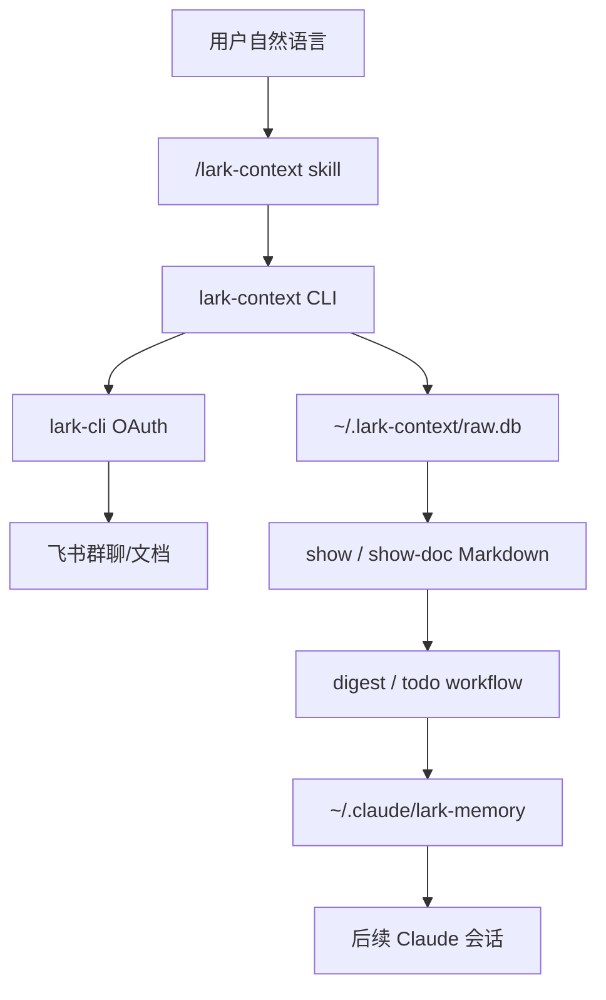

# lark-context DeepWiki

> **飞书群聊和文档到 Claude 本地长期记忆的 TypeScript CLI 与 skill 工作流解析。**

本 DeepWiki 面向要维护、审阅或扩展 `@tiktok-fe/lark-context` 的中文读者。它把仓库拆成 CLI 命令面、`lark-cli` 集成、SQLite 存储、消息/话题拉取、文档入库、Claude skill 记忆工作流和质量边界几条主线。

Sources: [README.md:1-10](../../project-repos/lark-context/README.md#L1-L10), [package.json:1-18](../../project-repos/lark-context/package.json#L1-L18), [skills/lark-context/SKILL.md:11-29](../../project-repos/lark-context/skills/lark-context/SKILL.md#L11-L29)

<details class="source-snippets">
<summary>引用源码</summary>

<!-- source-snippets:start -->

#### `README.md:1-10`

```markdown
# lark-context

把飞书（Lark）群聊和文档**持续沉淀**到本地，按 markdown 暴露给 Claude 使用。Claude 再按需把原始数据提炼成一套**两层记忆文件**，让后续任何对话都能默认带上这些上下文。

- **持续拉取**：指定飞书群的增量消息（经 OAuth 用户身份通过官方 `lark-cli` 读取）
- **手动喂文档**：粘贴飞书文档 URL，工具拉下来入库
- **提炼**：由 **Claude 自己**（通过 skill workflow）完成，工具不调任何外部 LLM API（工作数据不出网）
- **记忆结构**：`entities/`（稳定层：人 / 项目 / 术语 / 决策）+ `journal/`（流水层：按 ISO 周追加要点）
- **分发**：TS CLI 走 bnpm，skill 走 `npx skills`

```

#### `package.json:1-18`

```json
{
  "name": "@tiktok-fe/lark-context",
  "version": "0.1.0",
  "description": "Feishu context bridge for Claude Code — pull Lark chats + docs into local memory",
  "type": "module",
  "bin": {
    "lark-context": "./dist/cli.js"
  },
  "files": ["dist/*.js"],
  "engines": {
    "node": ">=18"
  },
  "scripts": {
    "build": "tsup",
    "test": "vitest run",
    "test:watch": "vitest",
    "typecheck": "tsc --noEmit",
    "prepublishOnly": "pnpm build && pnpm test"
```

#### `skills/lark-context/SKILL.md:11-29`

````markdown
# lark-context

把飞书群聊和文档**持续沉淀**到本地，由 Claude 按需提炼成长期记忆。**用户通过 `/lark-context <自然语言>` 调用**，本 skill 负责把意图路由到对应 workflow。

## 前置依赖

用户必须已安装两个 CLI：
- `lark-context` ≥ 0.1.0（本项目 CLI，`bnpm i -g @tiktok-fe/lark-context`）
- `lark-cli`（飞书官方 CLI，`bnpm i -g @larksuite/cli` + `lark-cli auth login`）

**版本自检**：在执行任何意图 workflow 前，第一步跑：

```bash
lark-context --version
```

若不达 `0.1.0` 起，提示用户：`bnpm i -g @tiktok-fe/lark-context@latest`，然后中止本次调用。

若 `lark-cli` 未安装或未登录，`lark-context init` / 其他命令会直接报错；**透传**错误 stderr 给用户，**不要**尝试替用户登录（需要浏览器交互）。
````

<!-- source-snippets:end -->
</details>

## 目录导航

| 分区 | 页面 | 重要性 | 内容简介 |
|------|------|--------|----------|
| 概览 | [项目概览](pages/overview.md) | high | 项目定位、核心能力、使用路径和仓库地图 |
| 系统架构 | [系统架构](pages/system-architecture.md) | high | 用户、skill、TS CLI、lark-cli、SQLite、记忆文件之间的关系 |
| 系统架构 | [CLI 命令面](pages/cli-command-surface.md) | high | Commander 注册的子命令、参数和错误出口 |
| 系统架构 | [lark-cli 集成](pages/lark-cli-integration.md) | medium | 官方 CLI 调用封装、JSON 协议和错误分类 |
| 数据管理与流程 | [配置与 SQLite 存储](pages/configuration-and-storage.md) | high | 配置优先级、群白名单、schema、迁移和 KV 状态 |
| 数据管理与流程 | [消息拉取与话题回复流水线](pages/pull-thread-pipeline.md) | high | 增量 pull、分页、thread reply、幂等和失败隔离 |
| 数据管理与流程 | [文档入库与 Markdown 输出](pages/document-ingestion-and-show.md) | high | doc token 解析、docs upsert、show/show-doc 渲染 |
| Agent 工作流 | [Skill 与记忆工作流](pages/skill-memory-workflows.md) | high | 自然语言意图路由、digest、TODO 和长期记忆写入规则 |
| 质量、发布与边界 | [测试、发布与边界](pages/testing-release-and-boundaries.md) | medium | Vitest、构建发布脚本、legacy Python 和 V1/V2 边界 |

## 仓库快照

```text
lark-context/
├── src/
│   ├── cli.ts
│   ├── config.ts
│   ├── db.ts
│   ├── lark.ts
│   ├── render.ts
│   └── commands/
│       ├── init.ts
│       ├── groups.ts
│       ├── listGroups.ts
│       ├── pull.ts
│       ├── ingestDoc.ts
│       └── show.ts
├── skills/lark-context/
│   ├── SKILL.md
│   └── references/
├── test/
├── docs/
├── legacy/python/
├── package.json
├── tsup.config.ts
└── vitest.config.ts
```

Sources: [00-repo-inventory.md:1-55](00-repo-inventory.md#L1-L55), [source-manifest.json:1-80](source-manifest.json#L1-L80)

<details class="source-snippets">
<summary>引用源码</summary>

<!-- source-snippets:start -->

#### `00-repo-inventory.md:1-55`

```markdown
# 00 - 仓库盘点

## Source

- Path: `/Users/bytedance/workspace/deepwiki/project-repos/lark-context`
- Remote: `git@code.byted.org:tiktok/lark-context.git`
- Branch: `master`
- Commit: `8099f2131ca597a21e77346ce2e272a5e0bf0554`

## File Summary

- Files scanned: 90
- Top-level directories: `docs`, `legacy`, `skills`, `src`, `test`

| Extension | Count |
|-----------|------:|
| `.py` | 30 |
| `.ts` | 26 |
| `.md` | 19 |
| `.json` | 11 |
| `[no extension]` | 2 |
| `.toml` | 1 |
| `.yaml` | 1 |

## Manifests and Build Files

- `legacy/python/pyproject.toml`
- `package.json`

## Documentation

- `README.md`
- `docs/slash-commands/lark-digest.md`
- `docs/superpowers/plans/2026-04-19-lark-context-v1.md`
- `docs/superpowers/plans/2026-04-20-lark-context-skillification.md`
- `docs/superpowers/plans/2026-04-20-lark-context-thread-replies.md`
- `docs/superpowers/specs/2026-04-19-lark-context-design.md`
- `docs/superpowers/specs/2026-04-20-lark-context-skillification-design.md`
- `docs/superpowers/specs/2026-04-20-lark-context-thread-replies-design.md`
- `docs/如何迁移电脑.md`
- `legacy/python/README.md`

## CI and Automation

- None detected

## Tests

- `legacy/python/tests/__init__.py`
- `legacy/python/tests/conftest.py`
- `legacy/python/tests/fixtures/lark_chats_list.json`
- `legacy/python/tests/fixtures/lark_docx_blocks.json`
- `legacy/python/tests/fixtures/lark_messages_page1.json`
- `legacy/python/tests/fixtures/lark_messages_page2.json`
- `legacy/python/tests/unit/__init__.py`
```

#### `source-manifest.json:1-80`

```json
{
  "source": {
    "path": "/Users/bytedance/workspace/deepwiki/project-repos/lark-context",
    "remote": "git@code.byted.org:tiktok/lark-context.git",
    "branch": "master",
    "commit": "8099f2131ca597a21e77346ce2e272a5e0bf0554"
  },
  "file_count": 87,
  "skipped_count": 3,
  "files": [
    {
      "path": "CLAUDE.md",
      "language": "markdown",
      "kind": "docs",
      "lines": 56,
      "symbols": []
    },
    {
      "path": "GETTING_STARTED.md",
      "language": "markdown",
      "kind": "docs",
      "lines": 126,
      "symbols": []
    },
    {
      "path": "README.md",
      "language": "markdown",
      "kind": "docs",
      "lines": 234,
      "symbols": []
    },
    {
      "path": "docs/slash-commands/lark-digest.md",
      "language": "markdown",
      "kind": "docs",
      "lines": 61,
      "symbols": []
    },
    {
      "path": "docs/superpowers/plans/2026-04-19-lark-context-v1.md",
      "language": "markdown",
      "kind": "docs",
      "lines": 2428,
      "symbols": []
    },
    {
      "path": "docs/superpowers/plans/2026-04-20-lark-context-skillification.md",
      "language": "markdown",
      "kind": "docs",
      "lines": 2441,
      "symbols": []
    },
    {
      "path": "docs/superpowers/plans/2026-04-20-lark-context-thread-replies.md",
      "language": "markdown",
      "kind": "docs",
      "lines": 1539,
      "symbols": []
    },
    {
      "path": "docs/superpowers/specs/2026-04-19-lark-context-design.md",
      "language": "markdown",
      "kind": "docs",
      "lines": 319,
      "symbols": []
    },
    {
      "path": "docs/superpowers/specs/2026-04-20-lark-context-skillification-design.md",
      "language": "markdown",
      "kind": "docs",
      "lines": 426,
      "symbols": []
    },
    {
      "path": "docs/superpowers/specs/2026-04-20-lark-context-thread-replies-design.md",
      "language": "markdown",
      "kind": "docs",
      "lines": 193,
      "symbols": []
    },
```

<!-- source-snippets:end -->
</details>

## 核心入口

| 源文件 | 角色 |
|---|---|
| `src/cli.ts` | 进程入口，注册 `init`、`list-groups`、`groups`、`pull`、`ingest-doc`、`show`、`show-doc` |
| `src/config.ts` | 解析默认路径、环境变量、YAML 配置和群白名单 |
| `src/db.ts` | SQLite schema、连接、迁移、KV 和初始化检查 |
| `src/lark.ts` | 对官方 `lark-cli` 的 JSON / NDJSON 调用封装 |
| `src/commands/pull.ts` | 核心消息拉取、分页、last_cursor 和话题回复刷新 |
| `src/commands/ingestDoc.ts` | 飞书文档 URL/token 解析和 docs 表 upsert |
| `src/commands/show.ts` | 从本地 DB 输出聊天窗口和已入库文档 |
| `skills/lark-context/SKILL.md` | Claude/agent 自然语言意图路由和工作流入口 |

Sources: [src/cli.ts:35-49](../../project-repos/lark-context/src/cli.ts#L35-L49), [src/config.ts:95-133](../../project-repos/lark-context/src/config.ts#L95-L133), [src/db.ts:5-41](../../project-repos/lark-context/src/db.ts#L5-L41), [src/lark.ts:8-35](../../project-repos/lark-context/src/lark.ts#L8-L35), [skills/lark-context/SKILL.md:31-48](../../project-repos/lark-context/skills/lark-context/SKILL.md#L31-L48)

<details class="source-snippets">
<summary>引用源码</summary>

<!-- source-snippets:start -->

#### `src/cli.ts:35-49`

```typescript
const program = new Command();
program
  .name("lark-context")
  .description("Feishu context bridge for Claude Code")
  .version(readPkgVersion());

registerInit(program);
registerListGroups(program);
registerGroups(program);
registerPull(program);
registerIngestDoc(program);
registerShow(program);
registerShowDoc(program);

program.parseAsync(process.argv);
```

#### `src/config.ts:95-133`

```typescript
export function loadConfig(opts: LoadConfigOptions = {}): Config {
  const configPath = opts.configPathOverride
    ? expandHome(opts.configPathOverride)
    : defaultConfigPath();
  let yamlData: Record<string, unknown> = {};
  if (existsSync(configPath)) {
    const parsed = YAML.parse(readFileSync(configPath, "utf8"));
    if (parsed && typeof parsed === "object" && !Array.isArray(parsed)) {
      yamlData = parsed as Record<string, unknown>;
    }
  }
  const pathsRaw = yamlData.paths;
  const pathsSection: Record<string, unknown> =
    pathsRaw && typeof pathsRaw === "object" && !Array.isArray(pathsRaw)
      ? (pathsRaw as Record<string, unknown>)
      : {};
  const memoryDir = resolvePath(
    opts.memoryDirOverride,
    ENV_MEMORY,
    typeof pathsSection.memory_dir === "string"
      ? pathsSection.memory_dir
      : undefined,
    "~/.claude/lark-memory",
  );
  const rawDir = resolvePath(
    opts.rawDirOverride,
    ENV_RAW,
    typeof pathsSection.raw_dir === "string"
      ? pathsSection.raw_dir
      : undefined,
    "~/.lark-context",
  );
  return {
    memoryDir,
    rawDir,
    groups: parseGroups(yamlData.groups),
    configPath,
  };
}
```

#### `src/db.ts:5-41`

```typescript
export const SCHEMA = `
CREATE TABLE IF NOT EXISTS chats (
  alias           TEXT PRIMARY KEY,
  chat_id         TEXT NOT NULL UNIQUE,
  name            TEXT,
  last_cursor     TEXT,
  last_pulled_at  TEXT,
  enabled         INTEGER DEFAULT 1
);
CREATE TABLE IF NOT EXISTS messages (
  id              TEXT PRIMARY KEY,
  chat_alias      TEXT NOT NULL REFERENCES chats(alias),
  sender_id       TEXT,
  sender_name     TEXT,
  msg_type        TEXT,
  content_json    TEXT NOT NULL,
  content_text    TEXT,
  reply_to        TEXT,
  create_time     TEXT NOT NULL,
  thread_id       TEXT,
  is_thread_reply INTEGER NOT NULL DEFAULT 0
);
CREATE INDEX IF NOT EXISTS idx_messages_chat_time
  ON messages(chat_alias, create_time);
CREATE TABLE IF NOT EXISTS docs (
  doc_token   TEXT PRIMARY KEY,
  url         TEXT NOT NULL,
  title       TEXT,
  content_md  TEXT NOT NULL,
  fetched_at  TEXT NOT NULL,
  source      TEXT
);
CREATE TABLE IF NOT EXISTS kv (
  key   TEXT PRIMARY KEY,
  value TEXT
);
`;
```

#### `src/lark.ts:8-35`

```typescript
async function invoke(args: string[]): Promise<string> {
  try {
    const r = await execa(BINARY, args, { reject: true });
    return r.stdout;
  } catch (err: unknown) {
    const e = err as { code?: string; exitCode?: number; stderr?: string };
    if (e?.code === "ENOENT") {
      throw new LarkNotFoundError(
        `\`${BINARY}\` binary not found on PATH. See https://github.com/larksuite/cli for install instructions.`,
      );
    }
    const stderr = (e?.stderr ?? "").toString().trim();
    throw new LarkCLIError(stderr || `lark exited ${e?.exitCode ?? "?"}`);
  }
}

export async function runJson(args: string[]): Promise<unknown> {
  const out = await invoke([...args, "--format", "json"]);
  return JSON.parse(out);
}

export async function* runNdjson(args: string[]): AsyncGenerator<unknown> {
  const out = await invoke([...args, "--format", "ndjson"]);
  for (const line of out.split("\n")) {
    const trimmed = line.trim();
    if (trimmed) yield JSON.parse(trimmed);
  }
}
```

#### `skills/lark-context/SKILL.md:31-48`

```markdown
## 意图路由

根据用户自然语言里的关键词选一条路径。**只路由一次**，不要在 references 之间来回跳。

| 触发关键词 | 意图 | 处理方式 |
|---|---|---|
| 沉淀 / 整理 / 记忆 / digest | **digest** | 读 [`references/digest.md`](references/digest.md) 执行 workflow |
| TODO / 待办 / 有啥事 / 该做啥 | **todo** | 读 [`references/todo.md`](references/todo.md) |
| 拉 / 同步 / pull / 更新 | **pull** | 读 [`references/pull.md`](references/pull.md) |
| 收下 / 入库 / 文档 URL（含 `/docx/` / `/wiki/` / `/docs/` / `/base/` / `/file/`） | **ingest-doc** | 读 [`references/ingest-doc.md`](references/ingest-doc.md) |
| 看看 / 最近聊了 / show | **show** | 读 [`references/show.md`](references/show.md) |
| 哪些群 / 列群 / 所有群 / 当前关注 | **list-groups / groups list** | 直接跑对应 CLI 命令，无需 reference |
| 关注 / 加群 / 取消关注 / alias | **groups add/rm** | 直接跑 CLI，无需 reference |

**意图不明**（用户说了一句模糊的话，比如"嗯嗯"或只贴一段描述）：不要猜。**反问**"你是想沉淀 / 拉消息 / 看 TODO / 看最近消息 / 管理群 中哪一项？"——用户澄清后再路由。

**多意图同时出现**（比如"拉一下最近消息然后沉淀"）：**分两步**——先执行第一个（pull），完成后再执行第二个（digest）。不要试图合并。

```

<!-- source-snippets:end -->
</details>

## 快速导航

- **想先看项目是什么？** 阅读 [项目概览](pages/overview.md)。
- **想追调用链？** 从 [系统架构](pages/system-architecture.md) 到 [CLI 命令面](pages/cli-command-surface.md)。
- **想改拉消息逻辑？** 阅读 [消息拉取与话题回复流水线](pages/pull-thread-pipeline.md)。
- **想改存储或迁移？** 阅读 [配置与 SQLite 存储](pages/configuration-and-storage.md)。
- **想改 skill 行为？** 阅读 [Skill 与记忆工作流](pages/skill-memory-workflows.md)，再看输出目录下的 [skills/lark-context](skills/lark-context/SKILL.md) 中文审阅副本。
- **想确认质量门槛？** 阅读 [测试、发布与边界](pages/testing-release-and-boundaries.md)。

## 一句话架构



Sources: [README.md:11-35](../../project-repos/lark-context/README.md#L11-L35), [README.md:69-94](../../project-repos/lark-context/README.md#L69-L94), [skills/lark-context/SKILL.md:75-93](../../project-repos/lark-context/skills/lark-context/SKILL.md#L75-L93)

<details class="source-snippets">
<summary>引用源码</summary>

<!-- source-snippets:start -->

#### `README.md:11-35`

````markdown
## 架构一眼

```
飞书 ── lark-cli (OAuth) ──▶ @tiktok-fe/lark-context (TS CLI)
                                   │
                                   ├─ SQLite: ~/.lark-context/raw.db
                                   └─ 暴露子命令给 Claude shell 调用
                                           │
                                           ▼
                                  /lark-context &lt;自然语言&gt;
                                 （skill 在 ~/.agents/skills/lark-context/）
                                           │
                                           ▼
                                  Claude 读原始数据 → 写记忆文件
                                           │
                                           ▼
                                  ~/.claude/lark-memory/
                                      ├─ MEMORY.md (索引)
                                      ├─ entities/（稳定层）
                                      └─ journal/ （流水层）
                                           ↓
                                  ~/.claude/CLAUDE.md 里用 @ 引用
                                           ↓
                                  所有 Claude 对话默认拿到这份记忆
```
````

#### `README.md:69-94`

````markdown
## 使用

全流程通过 Claude Code 对话触发，用自然语言就行：

```
You: /lark-context 看看我在哪些飞书群
→ lark-context list-groups

You: /lark-context 把「项目 Alpha 大群」加到关注
→ lark-context groups add oc_xxxxx --alias project_alpha --name "项目 Alpha 大群"

You: /lark-context 拉一下最近 3 天的消息
→ lark-context pull --since 3d

You: (粘贴飞书文档 URL) /lark-context 收下这个文档
→ lark-context ingest-doc &lt;url&gt;

You: /lark-context 沉淀一下
→ skill 走 references/digest.md workflow：读 show 输出 → 更新 ~/.claude/lark-memory/

You: /lark-context 我有啥 TODO
→ skill 走 references/todo.md workflow：从 show 原文 + journal 抽候选

You: 项目 Alpha 最近啥情况？
→ Claude 直接用已加载的记忆回答；必要时再 `lark-context show --chat project_alpha --since 1w`
```
````

#### `skills/lark-context/SKILL.md:75-93`

````markdown
## 存储布局

用户级别文件布局（skill 和 workflow 都假设这些路径已存在）：

```
~/.lark-context/
├── config.yaml          # alias 白名单 + 路径配置
└── raw.db               # SQLite：messages + docs + chats + kv(last_digest_at 等)

~/.claude/lark-memory/    # skill workflow 写这里
├── MEMORY.md             # 索引（总是被 @-load）
├── entities/
│   ├── people/&lt;slug&gt;.md
│   ├── projects/&lt;slug&gt;.md
│   ├── terms.md
│   └── decisions/&lt;slug&gt;.md
└── journal/
    └── &lt;ISO-week&gt;.md     # e.g. 2026-W16.md
```
````

<!-- source-snippets:end -->
</details>

## 可继续追问的主题

- `pull` 的幂等性：重点看 `src/commands/pull.ts` 和 `test/cmd-pull.test.ts`。
- 话题回复补齐策略：重点看 `thread_id`、`is_thread_reply`、重叠窗口和二阶段 `pullThreads`。
- 记忆文件写入边界：重点看 `skills/lark-context/references/digest.md` 和 `todo.md`。
- 配置迁移和多机器迁移：重点看 `src/config.ts`、`src/db.ts`、`docs/如何迁移电脑.md`。

## 生成物

- [00-repo-inventory.md](00-repo-inventory.md)：仓库盘点、语言和目录分布。
- [source-manifest.json](source-manifest.json)：源码文件清单。
- [wiki-structure.json](wiki-structure.json)：页面结构和依赖关系。
- [exports/full-wiki.md](exports/full-wiki.md)：合并版全文。
- [skills/](skills/)：仓库中 skill 的中文审阅副本。

## 来源

- Source path: `/Users/bytedance/workspace/deepwiki/project-repos/lark-context`
- Remote: `git@code.byted.org:tiktok/lark-context.git`
- Branch: `master`
- Commit: `8099f2131ca597a21e77346ce2e272a5e0bf0554`
