# lark-context DeepWiki - Full Wiki

## 生成信息

- Source: git@code.byted.org:tiktok/lark-context.git
- Clone path: /Users/bytedance/workspace/deepwiki/project-repos/lark-context
- Branch: master
- Commit: 8099f2131ca597a21e77346ce2e272a5e0bf0554
- Mode: comprehensive
- Language: zh-CN

## 目录

- [项目概览](#项目概览)
- [系统架构](#系统架构)
- [CLI 命令面](#cli-命令面)
- [lark-cli 集成](#lark-cli-集成)
- [配置与 SQLite 存储](#配置与-sqlite-存储)
- [消息拉取与话题回复流水线](#消息拉取与话题回复流水线)
- [文档入库与 Markdown 输出](#文档入库与-markdown-输出)
- [Skill 与记忆工作流](#skill-与记忆工作流)
- [测试、发布与边界](#测试、发布与边界)

---

<details>
<summary>相关源文件</summary>

生成本页时使用的主要源文件：

- [README.md](../../../project-repos/lark-context/README.md)
- [GETTING_STARTED.md](../../../project-repos/lark-context/GETTING_STARTED.md)
- [package.json](../../../project-repos/lark-context/package.json)
- [spec.md](../../../project-repos/lark-context/spec.md)
- [skills/lark-context/SKILL.md](../../../project-repos/lark-context/skills/lark-context/SKILL.md)

</details>

# 项目概览

`lark-context` 是一个把飞书群聊和文档持续沉淀到本地的上下文桥。它的核心输出不是网页或远端服务，而是本地 SQLite 原始数据和 `~/.claude/lark-memory/` 下的 Markdown 记忆文件，让 Claude 后续会话能带上长期背景。Sources: [README.md:1-10](../../../project-repos/lark-context/README.md#L1-L10), [README.md:148-175](../../../project-repos/lark-context/README.md#L148-L175)

<details class="source-snippets">
<summary>引用源码</summary>

<!-- source-snippets:start -->

#### `README.md:1-10`

```markdown
# lark-context

把飞书（Lark）群聊和文档**持续沉淀**到本地，按 markdown 暴露给 Claude 使用。Claude 再按需把原始数据提炼成一套**两层记忆文件**，让后续任何对话都能默认带上这些上下文。

- **持续拉取**：指定飞书群的增量消息（经 OAuth 用户身份通过官方 `lark-cli` 读取）
- **手动喂文档**：粘贴飞书文档 URL，工具拉下来入库
- **提炼**：由 **Claude 自己**（通过 skill workflow）完成，工具不调任何外部 LLM API（工作数据不出网）
- **记忆结构**：`entities/`（稳定层：人 / 项目 / 术语 / 决策）+ `journal/`（流水层：按 ISO 周追加要点）
- **分发**：TS CLI 走 bnpm，skill 走 `npx skills`

```

#### `README.md:148-175`

````markdown
## 记忆文件结构

沉淀后的文件（由 Claude 在 `/lark-context 沉淀…` 里维护）：

```
~/.claude/lark-memory/
├── MEMORY.md            # 始终加载的索引
├── entities/            # 稳定层，Claude 做增量 merge（保留手工写的段）
│   ├── people/<slug>.md
│   ├── projects/<slug>.md
│   ├── terms.md
│   └── decisions/<slug>.md
└── journal/             # 按 ISO 周的流水
    └── 2026-W16.md
```

每个实体文件带统一 frontmatter：

```yaml
---
name: 项目 Alpha
type: project | person | decision | terms
updated_at: 2026-04-19
source_hints:
  - chat:project_alpha
  - doc:docxxxxxxxxxxxxxx
---
```
````

<!-- source-snippets:end -->
</details>
## 解决的问题

仓库的原始需求很直接：用户在字节内部大量使用飞书群聊和文档，希望 AI 能持续从飞书获取上下文，自动沉淀长期记忆、短期记忆和 TODO，但只读取指定群聊。Sources: [spec.md:1-7](../../../project-repos/lark-context/spec.md#L1-L7)

<details class="source-snippets">
<summary>引用源码</summary>

<!-- source-snippets:start -->

#### `spec.md:1-7`

```markdown
我在字节跳动上班，我们用飞书办公，平时阅读和写很多飞书文档，以及使用公司内部的平台。
在飞书上，包括私聊和很多群聊。
我现在想让AI帮我开发一个context AI 工具，后续能让我通过claude code或者claude使用这个工具，持续地从我的飞书获取上下文，自动沉淀长期记忆和短期记忆，以及TODO，帮助我更高效地工作。
可使用的工具：
https://github.com/larksuite/cli

因为的账号有很多群聊，需要阅读的群聊是指定的。
```

<!-- source-snippets:end -->
</details>
README 把能力拆成五类：指定群增量拉取、手动喂飞书文档、由 Claude 本地提炼、`entities/` + `journal/` 两层记忆结构，以及通过 TS CLI 和 skill 分发。Sources: [README.md:5-10](../../../project-repos/lark-context/README.md#L5-L10)

<details class="source-snippets">
<summary>引用源码</summary>

<!-- source-snippets:start -->

#### `README.md:5-10`

```markdown
- **持续拉取**：指定飞书群的增量消息（经 OAuth 用户身份通过官方 `lark-cli` 读取）
- **手动喂文档**：粘贴飞书文档 URL，工具拉下来入库
- **提炼**：由 **Claude 自己**（通过 skill workflow）完成，工具不调任何外部 LLM API（工作数据不出网）
- **记忆结构**：`entities/`（稳定层：人 / 项目 / 术语 / 决策）+ `journal/`（流水层：按 ISO 周追加要点）
- **分发**：TS CLI 走 bnpm，skill 走 `npx skills`

```

<!-- source-snippets:end -->
</details>
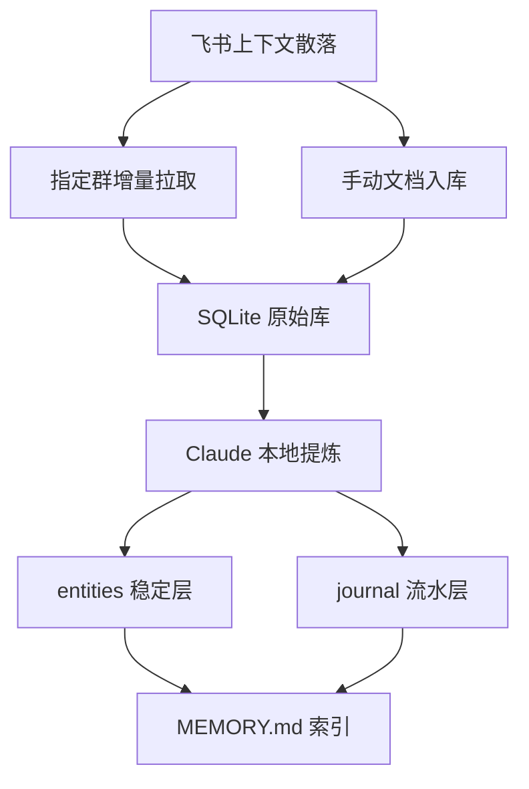
```mermaid
flowchart TD
  Need["飞书上下文散落"] --> Pull["指定群增量拉取"]
  Need --> Doc["手动文档入库"]
  Pull --> Raw["SQLite 原始库"]
  Doc --> Raw
  Raw --> Claude["Claude 本地提炼"]
  Claude --> Entities["entities 稳定层"]
  Claude --> Journal["journal 流水层"]
  Entities --> Memory["MEMORY.md 索引"]
  Journal --> Memory
```

Sources: [README.md:3-10](../../../project-repos/lark-context/README.md#L3-L10), [README.md:148-175](../../../project-repos/lark-context/README.md#L148-L175), [GETTING_STARTED.md:11-29](../../../project-repos/lark-context/GETTING_STARTED.md#L11-L29)

<details class="source-snippets">
<summary>引用源码</summary>

<!-- source-snippets:start -->

#### `README.md:3-10`

```markdown
把飞书（Lark）群聊和文档**持续沉淀**到本地，按 markdown 暴露给 Claude 使用。Claude 再按需把原始数据提炼成一套**两层记忆文件**，让后续任何对话都能默认带上这些上下文。

- **持续拉取**：指定飞书群的增量消息（经 OAuth 用户身份通过官方 `lark-cli` 读取）
- **手动喂文档**：粘贴飞书文档 URL，工具拉下来入库
- **提炼**：由 **Claude 自己**（通过 skill workflow）完成，工具不调任何外部 LLM API（工作数据不出网）
- **记忆结构**：`entities/`（稳定层：人 / 项目 / 术语 / 决策）+ `journal/`（流水层：按 ISO 周追加要点）
- **分发**：TS CLI 走 bnpm，skill 走 `npx skills`

```

#### `README.md:148-175`

````markdown
## 记忆文件结构

沉淀后的文件（由 Claude 在 `/lark-context 沉淀…` 里维护）：

```
~/.claude/lark-memory/
├── MEMORY.md            # 始终加载的索引
├── entities/            # 稳定层，Claude 做增量 merge（保留手工写的段）
│   ├── people/<slug>.md
│   ├── projects/<slug>.md
│   ├── terms.md
│   └── decisions/<slug>.md
└── journal/             # 按 ISO 周的流水
    └── 2026-W16.md
```

每个实体文件带统一 frontmatter：

```yaml
---
name: 项目 Alpha
type: project | person | decision | terms
updated_at: 2026-04-19
source_hints:
  - chat:project_alpha
  - doc:docxxxxxxxxxxxxxx
---
```
````

#### `GETTING_STARTED.md:11-29`

````markdown
## 怎么工作的

```
你在飞书讨论 / 分享文档
     ↓
lark-context 增量拉到本地 SQLite
     ↓
你说 "/lark-context 沉淀一下"
     ↓
Claude 提炼成 entities（人 / 项目 / 术语 / 决策）+ journal（按周流水）
     ↓
下一个会话自动带上这份记忆
```

三个关键特性：

- **全程不出网**：提炼由 Claude 本地完成，工具本身不调任何外部 LLM API
- **增量拉取**：只拿新消息，不重复拉历史
- **人工可审**：记忆文件是纯 markdown，随便看、随便改
````

<!-- source-snippets:end -->
</details>
## 使用者视角

常规路径是先安装官方 `lark-cli` 并 OAuth 登录，再安装 `@tiktok-fe/lark-context` 和全局 skill，执行 `lark-context init` 初始化配置、SQLite 和记忆目录。之后用户在 Claude 里用自然语言触发 `/lark-context`，由 skill 路由到对应 CLI 或引用工作流。Sources: [README.md:37-67](../../../project-repos/lark-context/README.md#L37-L67), [GETTING_STARTED.md:31-61](../../../project-repos/lark-context/GETTING_STARTED.md#L31-L61), [skills/lark-context/SKILL.md:13-29](../../../project-repos/lark-context/skills/lark-context/SKILL.md#L13-L29)

<details class="source-snippets">
<summary>引用源码</summary>

<!-- source-snippets:start -->

#### `README.md:37-67`

````markdown
## 安装

### 1. 装飞书官方 CLI（若未装）

```bash
bnpm i -g @larksuite/cli
lark-cli auth login            # 浏览器 OAuth 授权
```

### 2. 装本项目的 TS CLI + skill

```bash
bnpm i -g @tiktok-fe/lark-context     # 安装 lark-context 二进制
npx skills add <you>/lark-context -g -y   # 安装 /lark-context skill
```

替换 `<you>` 为实际的 GitHub 用户名 / 组织。

### 3. 初始化

```bash
lark-context init                 # 创建 ~/.lark-context/ + ~/.claude/lark-memory/
```

### 4.（可选）让记忆索引默认加载

```bash
echo '@~/.claude/lark-memory/MEMORY.md' >> ~/.claude/CLAUDE.md
```

这样每个 Claude Code 会话启动时就自动加载 `MEMORY.md` 作为背景知识。
````

#### `GETTING_STARTED.md:31-61`

````markdown
## 30 秒安装（4 步复制粘贴）

### 1. 飞书 CLI + OAuth 登录

```bash
bnpm i -g @larksuite/cli
lark-cli auth login             # 浏览器一次性授权
```

### 2. lark-context CLI

```bash
bnpm i -g @tiktok-fe/lark-context
lark-context init               # 初始化配置 + SQLite
```

### 3. Claude skill

```bash
npx skills add git@code.byted.org:tiktok/lark-context.git -g -y
```

全局装好后，Claude Code / Cursor / Codex / Gemini CLI 等 12 个 agent 都能直接用 `/lark-context`。

### 4. （强烈推荐）让记忆索引默认加载

```bash
echo '@~/.claude/lark-memory/MEMORY.md' >> ~/.claude/CLAUDE.md
```

这样每个 Claude 会话启动时自动带上你的记忆索引。
````

#### `skills/lark-context/SKILL.md:13-29`

````markdown
把飞书群聊和文档**持续沉淀**到本地，由 Claude 按需提炼成长期记忆。**用户通过 `/lark-context <自然语言>` 调用**，本 skill 负责把意图路由到对应 workflow。

## 前置依赖

用户必须已安装两个 CLI：
- `lark-context` ≥ 0.1.0（本项目 CLI，`bnpm i -g @tiktok-fe/lark-context`）
- `lark-cli`（飞书官方 CLI，`bnpm i -g @larksuite/cli` + `lark-cli auth login`）

**版本自检**：在执行任何意图 workflow 前，第一步跑：

```bash
lark-context --version
```

若不达 `0.1.0` 起，提示用户：`bnpm i -g @tiktok-fe/lark-context@latest`，然后中止本次调用。

若 `lark-cli` 未安装或未登录，`lark-context init` / 其他命令会直接报错；**透传**错误 stderr 给用户，**不要**尝试替用户登录（需要浏览器交互）。
````

<!-- source-snippets:end -->
</details>
| 阶段 | 用户动作 | 底层动作 |
|---|---|---|
| 安装 | 装 `@larksuite/cli` 与 `@tiktok-fe/lark-context` | 提供官方飞书访问和本项目二进制 |
| 初始化 | `lark-context init` | 创建配置、目录和 SQLite schema |
| 选群 | `list-groups` 后 `groups add` | 把目标群写入 YAML 白名单和 `chats` 表 |
| 拉取 | `pull --since 3d` | 调 `lark-cli` 拉消息并写入 `messages` |
| 展示 | `show --since 24h` | 从 SQLite 渲染 Markdown |
| 沉淀 | `/lark-context 沉淀一下` | Claude 更新 `journal/`、`entities/`、`MEMORY.md` |

Sources: [README.md:69-118](../../../project-repos/lark-context/README.md#L69-L118), [src/commands/init.ts:27-53](../../../project-repos/lark-context/src/commands/init.ts#L27-L53), [src/commands/groups.ts:31-58](../../../project-repos/lark-context/src/commands/groups.ts#L31-L58), [skills/lark-context/SKILL.md:31-48](../../../project-repos/lark-context/skills/lark-context/SKILL.md#L31-L48)

<details class="source-snippets">
<summary>引用源码</summary>

<!-- source-snippets:start -->

#### `README.md:69-118`

````markdown
## 使用

全流程通过 Claude Code 对话触发，用自然语言就行：

```
You: /lark-context 看看我在哪些飞书群
→ lark-context list-groups

You: /lark-context 把「项目 Alpha 大群」加到关注
→ lark-context groups add oc_xxxxx --alias project_alpha --name "项目 Alpha 大群"

You: /lark-context 拉一下最近 3 天的消息
→ lark-context pull --since 3d

You: (粘贴飞书文档 URL) /lark-context 收下这个文档
→ lark-context ingest-doc <url>

You: /lark-context 沉淀一下
→ skill 走 references/digest.md workflow：读 show 输出 → 更新 ~/.claude/lark-memory/

You: /lark-context 我有啥 TODO
→ skill 走 references/todo.md workflow：从 show 原文 + journal 抽候选

You: 项目 Alpha 最近啥情况？
→ Claude 直接用已加载的记忆回答；必要时再 `lark-context show --chat project_alpha --since 1w`
```

## CLI 命令一览

| 命令 | 作用 |
|---|---|
| `lark-context init` | 初始化配置、目录、SQLite 库；检查 lark-cli 是否可用 |
| `lark-context list-groups [--json]` | 列你所在的全部飞书群（chat_id + 名称 + 描述） |
| `lark-context groups add <chat_id> [--alias X] [--name "Y"]` | 把群加到关注白名单 |
| `lark-context groups list` / `groups rm <alias>` | 查看 / 移除白名单 |
| `lark-context pull [--chat <alias>\|all] [--since 3d] [--thread-window 7d] [--no-threads]` | 拉消息（增量）+ 刷新话题回复；不给 `--chat` 就拉所有 enabled 的群 |
| `lark-context ingest-doc <url-或-token>` | 拉单份飞书文档入库（支持 `/docx/` / `/wiki/` / `/docs/` 等） |
| `lark-context show [--chat <alias>\|all] [--since 24h]` | 输出 markdown：聊天记录 + 新入库文档 |
| `lark-context show-doc <token-或-url>` | 输出某份已入库文档的完整 markdown |

**`--since` 格式**：`24h` / `3d` / `1w` / `90m`。仅作为**首次拉取**的时间下限；后续 `pull` 会从"上次见过的最新消息"继续，忽略 `--since`。skill workflow 默认首次拉新群用 `90d`（见 `skills/lark-context/references/pull.md`）。

**`--chat all`** 等价于省略 `--chat`（遍历所有 enabled 的群）。

**话题回复（thread replies）**：`pull` 在拉完顶层消息后，会扫描"回看窗口"内所有带 `thread_id` 的顶层消息，逐个调用飞书 `im +threads-messages-list` 把话题下的回复（子消息）一并落库。窗口默认：

- 首次 pull 某群：与 effective `--since` 对齐（例如 `--since 180d` 则 thread window 也是 180d；不传默认 90d）
- 续拉：30d（`--since` 被忽略）

显式传 `--thread-window <duration>` 覆盖默认，或用 `--no-threads` 跳过该阶段（只拉顶层）。单个话题拉失败（权限 / 删除）不会 disable 整个群，stderr 打 warning 继续下一个。`show` 会把话题回复按 `  ↳ ` 缩进成组渲染在所属根消息下方。
````

#### `src/commands/init.ts:27-53`

```typescript
export async function runInit(opts: InitOpts = {}): Promise<void> {
  if (opts.checkLarkCli !== false) {
    const check = opts._pathCheck ?? defaultPathCheck;
    if (!(await check())) {
      throw new Error(
        "`lark-cli` binary not found on PATH. Install: `bnpm i -g @larksuite/cli` (or `npm i -g @larksuite/cli`), then `lark-cli auth login`.",
      );
    }
  }
  const cfg = loadConfig({
    configPathOverride: opts.configPathOverride,
    memoryDirOverride: opts.memoryDirOverride,
    rawDirOverride: opts.rawDirOverride,
  });
  mkdirSync(cfg.memoryDir, { recursive: true });
  mkdirSync(cfg.rawDir, { recursive: true });
  if (cfg.configPath && !existsSync(cfg.configPath)) {
    const fresh: Config = {
      memoryDir: cfg.memoryDir,
      rawDir: cfg.rawDir,
      groups: [],
      configPath: cfg.configPath,
    };
    saveConfig(fresh);
  }
  initSchema(join(cfg.rawDir, "raw.db"));
  process.stdout.write(`Initialized lark-context at ${cfg.configPath}\n`);
```

#### `src/commands/groups.ts:31-58`

```typescript
export async function runAdd(opts: AddOpts): Promise<void> {
  const cfg = loadConfig(opts);
  const dbPath = join(cfg.rawDir, "raw.db");
  ensureInitialized(dbPath);
  const name = opts.name ?? "";
  const resolvedAlias = opts.alias ?? slugify(name || opts.chatId);
  if (cfg.groups.some((g) => g.alias === resolvedAlias)) {
    throw new Error(`alias "${resolvedAlias}" already in use`);
  }
  const newGroup: GroupConfig = {
    alias: resolvedAlias,
    chatId: opts.chatId,
    name,
    enabled: true,
  };
  const next: Config = { ...cfg, groups: [...cfg.groups, newGroup] };
  saveConfig(next);
  const db = connect(dbPath);
  try {
    db.prepare(
      "INSERT INTO chats(alias, chat_id, name, enabled) VALUES (?, ?, ?, 1) " +
        "ON CONFLICT(alias) DO UPDATE SET chat_id=excluded.chat_id, name=excluded.name, enabled=1",
    ).run(resolvedAlias, opts.chatId, name);
  } finally {
    db.close();
  }
  process.stdout.write(`added ${resolvedAlias} -> ${opts.chatId}\n`);
}
```

#### `skills/lark-context/SKILL.md:31-48`

```markdown
## 意图路由

根据用户自然语言里的关键词选一条路径。**只路由一次**，不要在 references 之间来回跳。

| 触发关键词 | 意图 | 处理方式 |
|---|---|---|
| 沉淀 / 整理 / 记忆 / digest | **digest** | 读 [`references/digest.md`](references/digest.md) 执行 workflow |
| TODO / 待办 / 有啥事 / 该做啥 | **todo** | 读 [`references/todo.md`](references/todo.md) |
| 拉 / 同步 / pull / 更新 | **pull** | 读 [`references/pull.md`](references/pull.md) |
| 收下 / 入库 / 文档 URL（含 `/docx/` / `/wiki/` / `/docs/` / `/base/` / `/file/`） | **ingest-doc** | 读 [`references/ingest-doc.md`](references/ingest-doc.md) |
| 看看 / 最近聊了 / show | **show** | 读 [`references/show.md`](references/show.md) |
| 哪些群 / 列群 / 所有群 / 当前关注 | **list-groups / groups list** | 直接跑对应 CLI 命令，无需 reference |
| 关注 / 加群 / 取消关注 / alias | **groups add/rm** | 直接跑 CLI，无需 reference |

**意图不明**（用户说了一句模糊的话，比如"嗯嗯"或只贴一段描述）：不要猜。**反问**"你是想沉淀 / 拉消息 / 看 TODO / 看最近消息 / 管理群 中哪一项？"——用户澄清后再路由。

**多意图同时出现**（比如"拉一下最近消息然后沉淀"）：**分两步**——先执行第一个（pull），完成后再执行第二个（digest）。不要试图合并。

```

<!-- source-snippets:end -->
</details>
## 仓库形态

当前主实现是 TypeScript ESM CLI：`package.json` 声明包名 `@tiktok-fe/lark-context`、二进制 `lark-context`、Node `>=18`、构建用 `tsup`、测试用 `vitest`。`legacy/python/` 是 V1 前的冻结实现，用来对照但不再演进。Sources: [package.json:1-18](../../../project-repos/lark-context/package.json#L1-L18), [package.json:20-35](../../../project-repos/lark-context/package.json#L20-L35), [README.md:208-219](../../../project-repos/lark-context/README.md#L208-L219)

<details class="source-snippets">
<summary>引用源码</summary>

<!-- source-snippets:start -->

#### `package.json:1-18`

```json
{
  "name": "@tiktok-fe/lark-context",
  "version": "0.1.0",
  "description": "Feishu context bridge for Claude Code — pull Lark chats + docs into local memory",
  "type": "module",
  "bin": {
    "lark-context": "./dist/cli.js"
  },
  "files": ["dist/*.js"],
  "engines": {
    "node": ">=18"
  },
  "scripts": {
    "build": "tsup",
    "test": "vitest run",
    "test:watch": "vitest",
    "typecheck": "tsc --noEmit",
    "prepublishOnly": "pnpm build && pnpm test"
```

#### `package.json:20-35`

```json
  "dependencies": {
    "better-sqlite3": "^11.0.0",
    "commander": "^12.0.0",
    "execa": "^9.0.0",
    "yaml": "^2.4.0"
  },
  "devDependencies": {
    "@types/better-sqlite3": "^7.6.0",
    "@types/node": "^20.0.0",
    "tsup": "^8.0.0",
    "typescript": "^5.4.0",
    "vitest": "^1.5.0"
  },
  "pnpm": {
    "onlyBuiltDependencies": ["better-sqlite3"]
  }
```

#### `README.md:208-219`

````markdown
## `legacy/python/` 目录

V1 前的 Python 实现（97 文件 ~1850 行），**已冻结**、不再演进，保留作对照：

```bash
cd legacy/python
python3 -m venv .venv && . .venv/bin/activate
pip install -e '.[dev]'
pytest -q        # 应该 59 passed
```

V1 正式发布（`@tiktok-fe/lark-context` ≥ 0.1.0）后，可以删掉这个目录。
````

<!-- source-snippets:end -->
</details>
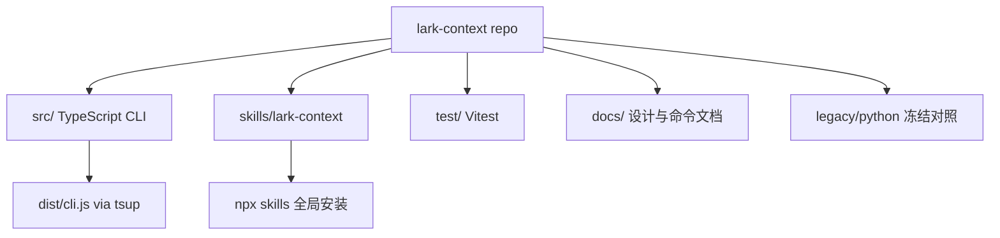
```mermaid
flowchart TD
  Repo["lark-context repo"] --> TS["src/ TypeScript CLI"]
  Repo --> Skill["skills/lark-context"]
  Repo --> Tests["test/ Vitest"]
  Repo --> Docs["docs/ 设计与命令文档"]
  Repo --> Legacy["legacy/python 冻结对照"]
  TS --> Dist["dist/cli.js via tsup"]
  Skill --> Agents["npx skills 全局安装"]
```

Sources: [package.json:1-18](../../../project-repos/lark-context/package.json#L1-L18), [tsup.config.ts:1-10](../../../project-repos/lark-context/tsup.config.ts#L1-L10), [README.md:186-219](../../../project-repos/lark-context/README.md#L186-L219)

<details class="source-snippets">
<summary>引用源码</summary>

<!-- source-snippets:start -->

#### `package.json:1-18`

```json
{
  "name": "@tiktok-fe/lark-context",
  "version": "0.1.0",
  "description": "Feishu context bridge for Claude Code — pull Lark chats + docs into local memory",
  "type": "module",
  "bin": {
    "lark-context": "./dist/cli.js"
  },
  "files": ["dist/*.js"],
  "engines": {
    "node": ">=18"
  },
  "scripts": {
    "build": "tsup",
    "test": "vitest run",
    "test:watch": "vitest",
    "typecheck": "tsc --noEmit",
    "prepublishOnly": "pnpm build && pnpm test"
```

#### `tsup.config.ts:1-10`

```typescript
import { defineConfig } from "tsup";

export default defineConfig({
  entry: { cli: "src/cli.ts" },
  format: ["esm"],
  target: "node18",
  clean: true,
  sourcemap: true,
  shims: true,
});
```

#### `README.md:186-219`

````markdown
## 开发

```bash
# 克隆 + 装依赖
git clone https://github.com/<you>/lark-context.git
cd lark-context
pnpm install

# 开发命令
pnpm build               # tsup → dist/cli.js
pnpm test                # vitest run
pnpm test:watch          # vitest dev mode
pnpm typecheck           # tsc --noEmit
```

本地调试 CLI：

```bash
pnpm build && node dist/cli.js --help
# 或 pnpm link --global 把 lark-context 临时塞到 PATH
```

## `legacy/python/` 目录

V1 前的 Python 实现（97 文件 ~1850 行），**已冻结**、不再演进，保留作对照：

```bash
cd legacy/python
python3 -m venv .venv && . .venv/bin/activate
pip install -e '.[dev]'
pytest -q        # 应该 59 passed
```

V1 正式发布（`@tiktok-fe/lark-context` ≥ 0.1.0）后，可以删掉这个目录。
````

<!-- source-snippets:end -->
</details>
## 项目边界

工具本身不调用外部 LLM API；它只通过官方 `lark-cli` 读取飞书数据，并把原始材料落在本地 SQLite。摘要、实体合并和 TODO 判断由 Claude 在 skill workflow 中本地完成。Sources: [README.md:5-8](../../../project-repos/lark-context/README.md#L5-L8), [GETTING_STARTED.md:25-29](../../../project-repos/lark-context/GETTING_STARTED.md#L25-L29), [skills/lark-context/SKILL.md:69-73](../../../project-repos/lark-context/skills/lark-context/SKILL.md#L69-L73)

<details class="source-snippets">
<summary>引用源码</summary>

<!-- source-snippets:start -->

#### `README.md:5-8`

```markdown
- **持续拉取**：指定飞书群的增量消息（经 OAuth 用户身份通过官方 `lark-cli` 读取）
- **手动喂文档**：粘贴飞书文档 URL，工具拉下来入库
- **提炼**：由 **Claude 自己**（通过 skill workflow）完成，工具不调任何外部 LLM API（工作数据不出网）
- **记忆结构**：`entities/`（稳定层：人 / 项目 / 术语 / 决策）+ `journal/`（流水层：按 ISO 周追加要点）
```

#### `GETTING_STARTED.md:25-29`

```markdown
三个关键特性：

- **全程不出网**：提炼由 Claude 本地完成，工具本身不调任何外部 LLM API
- **增量拉取**：只拿新消息，不重复拉历史
- **人工可审**：记忆文件是纯 markdown，随便看、随便改
```

#### `skills/lark-context/SKILL.md:69-73`

```markdown
## 错误处理

- **CLI 非零退出**：透传 stderr 给用户，**不编造解释**。若命中已知场景（lark-cli 未装 / 未 auth / chat 被踢出群），补一句操作建议；否则就是透传
- **`references/` 文件缺失**：说明 skill 装坏了。提示用户：`npx skills update lark-context` 或重新 `npx skills add <repo> -g -y`
- **网络错 / lark-cli 超时**：不自动重试（拉消息幂等但失败通常要手动判断），交给用户处理
```

<!-- source-snippets:end -->
</details>
当前 README 同时记录了 V1 边界：不自动调度、只读指定群聊、文档类型受 `lark-cli` 支持范围限制、工具本身不调 LLM API。README 的“已知限制”里还保留了“不拉回复线程”的旧描述，但当前代码已经实现 `thread_id`、`is_thread_reply` 和话题回复拉取；这说明该限制文本滞后于源码。Sources: [README.md:177-185](../../../project-repos/lark-context/README.md#L177-L185), [src/db.ts:14-28](../../../project-repos/lark-context/src/db.ts#L14-L28), [src/commands/pull.ts:123-145](../../../project-repos/lark-context/src/commands/pull.ts#L123-L145), [src/commands/pull.ts:240-290](../../../project-repos/lark-context/src/commands/pull.ts#L240-L290)

<details class="source-snippets">
<summary>引用源码</summary>

<!-- source-snippets:start -->

#### `README.md:177-185`

```markdown
## 已知限制 / V1 边界

- **不自动调度**：全手动，你在 Claude 对话里触发。cron / hook 在 V2
- **首次 pull 上限 200 页**（约 10k 条消息）：避免一下子拉爆。到上限会在 stderr 提示，再跑 `pull` 可续
- **只读指定群聊**：私聊、@你的消息、多维表格、日历留给 V2
- **文档仅支持新版 `/docx/` 等**：老版 `/docs/` 若被 lark-cli 拒绝（`Unsupported document type: Legacy document`），透传错误
- **不拉回复线程**：只拉主消息流
- **工具不调任何 LLM API**：提炼全部由 Claude Code 完成

```

#### `src/db.ts:14-28`

```typescript
CREATE TABLE IF NOT EXISTS messages (
  id              TEXT PRIMARY KEY,
  chat_alias      TEXT NOT NULL REFERENCES chats(alias),
  sender_id       TEXT,
  sender_name     TEXT,
  msg_type        TEXT,
  content_json    TEXT NOT NULL,
  content_text    TEXT,
  reply_to        TEXT,
  create_time     TEXT NOT NULL,
  thread_id       TEXT,
  is_thread_reply INTEGER NOT NULL DEFAULT 0
);
CREATE INDEX IF NOT EXISTS idx_messages_chat_time
  ON messages(chat_alias, create_time);
```

#### `src/commands/pull.ts:123-145`

```typescript
        // 飞书 `im/chat-messages-list` 在返回父消息时会把 thread replies 直接内嵌在
        // `thread_replies` 数组里。把它们作为 is_thread_reply=1 的行也写进来，避免
        // 依赖第二阶段 `pullThreads` —— 那里只扫 DB 里 thread_id 非空的 root，当时序
        // 错开（父消息首次拉时还没 reply）就会永久漏掉。
        if (Array.isArray(raw.thread_replies)) {
          for (const rep of raw.thread_replies) {
            const repSender = rep.sender ?? {};
            const rr = insMsg.run(
              rep.message_id,
              group.alias,
              repSender.id ?? "",
              repSender.name ?? "",
              rep.msg_type ?? "text",
              JSON.stringify(rep),
              rep.content ?? "",
              null,
              toIso(rep.create_time ?? ""),
              rep.thread_id ?? raw.thread_id ?? null,
              1,
            );
            inserted += rr.changes;
          }
        }
```

#### `src/commands/pull.ts:240-290`

```typescript
async function pullThreads(
  dbPath: string,
  group: GroupConfig,
  windowMs: number,
  now: Date,
): Promise<{ threadsScanned: number; inserted: number }> {
  const cutoff = new Date(now.getTime() - windowMs)
    .toISOString()
    .replace(/\.\d{3}Z$/, "");
  const db = connect(dbPath);
  let threadIds: string[];
  try {
    const rows = db
      .prepare(
        "SELECT DISTINCT thread_id FROM messages " +
          "WHERE chat_alias=? AND thread_id IS NOT NULL " +
          "AND is_thread_reply=0 AND create_time >= ?",
      )
      .all(group.alias, cutoff) as Array<{ thread_id: string }>;
    threadIds = rows.map((r) => r.thread_id);
  } finally {
    db.close();
  }

  let totalInserted = 0;
  for (const threadId of threadIds) {
    try {
      let pageToken: string | null = null;
      for (let page = 1; page <= MAX_PAGES; page++) {
        const { messages, nextToken, hasMore } = await pullThreadsPage(
          threadId,
          pageToken,
        );
        if (messages.length > 0) {
          totalInserted += writeThreadPage(dbPath, group.alias, threadId, messages);
        }
        if (!hasMore || !nextToken || nextToken === pageToken) break;
        pageToken = nextToken;
      }
    } catch (err) {
      if (err instanceof LarkNotFoundError) throw err;
      if (!(err instanceof LarkCLIError)) throw err;
      process.stderr.write(
        `  ${group.alias}: thread ${threadId} failed (${err.message}); skipped\n`,
      );
    }
  }
  process.stderr.write(
    `  ${group.alias}: threads +${threadIds.length} scanned, +${totalInserted} replies inserted\n`,
  );
  return { threadsScanned: threadIds.length, inserted: totalInserted };
```

<!-- source-snippets:end -->
</details>
## 阅读路线

1. 先读 [系统架构](system-architecture.md)，建立从自然语言到 SQLite 和记忆文件的主链路。
2. 再读 [CLI 命令面](cli-command-surface.md)，理解每个子命令的位置。
3. 改拉取行为时重点读 [消息拉取与话题回复流水线](pull-thread-pipeline.md)。
4. 改沉淀策略时重点读 [Skill 与记忆工作流](skill-memory-workflows.md)。

## 相关页面

- [系统架构](system-architecture.md)
- [CLI 命令面](cli-command-surface.md)
- [Skill 与记忆工作流](skill-memory-workflows.md)

---

<details>
<summary>相关源文件</summary>

生成本页时使用的主要源文件：

- [README.md](../../../project-repos/lark-context/README.md)
- [src/cli.ts](../../../project-repos/lark-context/src/cli.ts)
- [src/config.ts](../../../project-repos/lark-context/src/config.ts)
- [src/db.ts](../../../project-repos/lark-context/src/db.ts)
- [src/lark.ts](../../../project-repos/lark-context/src/lark.ts)
- [skills/lark-context/SKILL.md](../../../project-repos/lark-context/skills/lark-context/SKILL.md)

</details>

# 系统架构

系统由三层组成：用户-facing 的 `/lark-context` skill，负责本地数据操作的 TypeScript CLI，以及飞书官方 `lark-cli` 和本地 SQLite/Markdown 文件。CLI 是确定性工具层；长期记忆提炼发生在 Claude 的 skill workflow 中。Sources: [README.md:11-35](../../../project-repos/lark-context/README.md#L11-L35), [src/cli.ts:35-49](../../../project-repos/lark-context/src/cli.ts#L35-L49), [skills/lark-context/SKILL.md:31-48](../../../project-repos/lark-context/skills/lark-context/SKILL.md#L31-L48)

<details class="source-snippets">
<summary>引用源码</summary>

<!-- source-snippets:start -->

#### `README.md:11-35`

````markdown
## 架构一眼

```
飞书 ── lark-cli (OAuth) ──▶ @tiktok-fe/lark-context (TS CLI)
                                   │
                                   ├─ SQLite: ~/.lark-context/raw.db
                                   └─ 暴露子命令给 Claude shell 调用
                                           │
                                           ▼
                                  /lark-context <自然语言>
                                 （skill 在 ~/.agents/skills/lark-context/）
                                           │
                                           ▼
                                  Claude 读原始数据 → 写记忆文件
                                           │
                                           ▼
                                  ~/.claude/lark-memory/
                                      ├─ MEMORY.md (索引)
                                      ├─ entities/（稳定层）
                                      └─ journal/ （流水层）
                                           ↓
                                  ~/.claude/CLAUDE.md 里用 @ 引用
                                           ↓
                                  所有 Claude 对话默认拿到这份记忆
```
````

#### `src/cli.ts:35-49`

```typescript
const program = new Command();
program
  .name("lark-context")
  .description("Feishu context bridge for Claude Code")
  .version(readPkgVersion());

registerInit(program);
registerListGroups(program);
registerGroups(program);
registerPull(program);
registerIngestDoc(program);
registerShow(program);
registerShowDoc(program);

program.parseAsync(process.argv);
```

#### `skills/lark-context/SKILL.md:31-48`

```markdown
## 意图路由

根据用户自然语言里的关键词选一条路径。**只路由一次**，不要在 references 之间来回跳。

| 触发关键词 | 意图 | 处理方式 |
|---|---|---|
| 沉淀 / 整理 / 记忆 / digest | **digest** | 读 [`references/digest.md`](references/digest.md) 执行 workflow |
| TODO / 待办 / 有啥事 / 该做啥 | **todo** | 读 [`references/todo.md`](references/todo.md) |
| 拉 / 同步 / pull / 更新 | **pull** | 读 [`references/pull.md`](references/pull.md) |
| 收下 / 入库 / 文档 URL（含 `/docx/` / `/wiki/` / `/docs/` / `/base/` / `/file/`） | **ingest-doc** | 读 [`references/ingest-doc.md`](references/ingest-doc.md) |
| 看看 / 最近聊了 / show | **show** | 读 [`references/show.md`](references/show.md) |
| 哪些群 / 列群 / 所有群 / 当前关注 | **list-groups / groups list** | 直接跑对应 CLI 命令，无需 reference |
| 关注 / 加群 / 取消关注 / alias | **groups add/rm** | 直接跑 CLI，无需 reference |

**意图不明**（用户说了一句模糊的话，比如"嗯嗯"或只贴一段描述）：不要猜。**反问**"你是想沉淀 / 拉消息 / 看 TODO / 看最近消息 / 管理群 中哪一项？"——用户澄清后再路由。

**多意图同时出现**（比如"拉一下最近消息然后沉淀"）：**分两步**——先执行第一个（pull），完成后再执行第二个（digest）。不要试图合并。

```

<!-- source-snippets:end -->
</details>
## 端到端边界

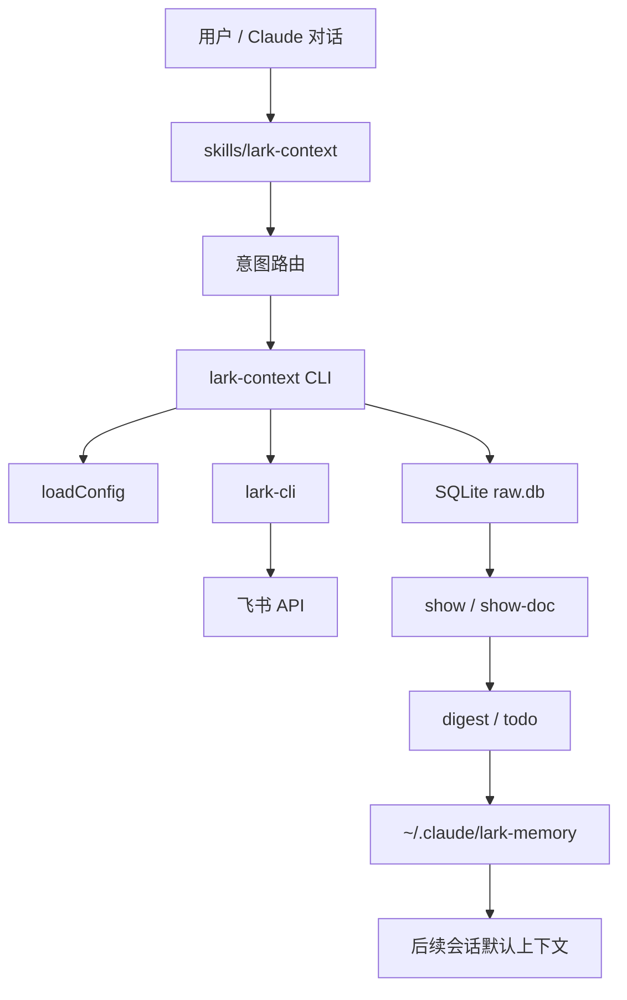
```mermaid
flowchart TD
  User["用户 / Claude 对话"] --> Skill["skills/lark-context"]
  Skill --> Route["意图路由"]
  Route --> CLI["lark-context CLI"]
  CLI --> Config["loadConfig"]
  CLI --> DB["SQLite raw.db"]
  CLI --> Lark["lark-cli"]
  Lark --> Feishu["飞书 API"]
  DB --> Show["show / show-doc"]
  Show --> Digest["digest / todo"]
  Digest --> Memory["~/.claude/lark-memory"]
  Memory --> Next["后续会话默认上下文"]
```

Sources: [README.md:13-35](../../../project-repos/lark-context/README.md#L13-L35), [src/config.ts:95-133](../../../project-repos/lark-context/src/config.ts#L95-L133), [src/db.ts:43-59](../../../project-repos/lark-context/src/db.ts#L43-L59), [src/lark.ts:8-35](../../../project-repos/lark-context/src/lark.ts#L8-L35), [skills/lark-context/SKILL.md:75-93](../../../project-repos/lark-context/skills/lark-context/SKILL.md#L75-L93)

<details class="source-snippets">
<summary>引用源码</summary>

<!-- source-snippets:start -->

#### `README.md:13-35`

````markdown
```
飞书 ── lark-cli (OAuth) ──▶ @tiktok-fe/lark-context (TS CLI)
                                   │
                                   ├─ SQLite: ~/.lark-context/raw.db
                                   └─ 暴露子命令给 Claude shell 调用
                                           │
                                           ▼
                                  /lark-context <自然语言>
                                 （skill 在 ~/.agents/skills/lark-context/）
                                           │
                                           ▼
                                  Claude 读原始数据 → 写记忆文件
                                           │
                                           ▼
                                  ~/.claude/lark-memory/
                                      ├─ MEMORY.md (索引)
                                      ├─ entities/（稳定层）
                                      └─ journal/ （流水层）
                                           ↓
                                  ~/.claude/CLAUDE.md 里用 @ 引用
                                           ↓
                                  所有 Claude 对话默认拿到这份记忆
```
````

#### `src/config.ts:95-133`

```typescript
export function loadConfig(opts: LoadConfigOptions = {}): Config {
  const configPath = opts.configPathOverride
    ? expandHome(opts.configPathOverride)
    : defaultConfigPath();
  let yamlData: Record<string, unknown> = {};
  if (existsSync(configPath)) {
    const parsed = YAML.parse(readFileSync(configPath, "utf8"));
    if (parsed && typeof parsed === "object" && !Array.isArray(parsed)) {
      yamlData = parsed as Record<string, unknown>;
    }
  }
  const pathsRaw = yamlData.paths;
  const pathsSection: Record<string, unknown> =
    pathsRaw && typeof pathsRaw === "object" && !Array.isArray(pathsRaw)
      ? (pathsRaw as Record<string, unknown>)
      : {};
  const memoryDir = resolvePath(
    opts.memoryDirOverride,
    ENV_MEMORY,
    typeof pathsSection.memory_dir === "string"
      ? pathsSection.memory_dir
      : undefined,
    "~/.claude/lark-memory",
  );
  const rawDir = resolvePath(
    opts.rawDirOverride,
    ENV_RAW,
    typeof pathsSection.raw_dir === "string"
      ? pathsSection.raw_dir
      : undefined,
    "~/.lark-context",
  );
  return {
    memoryDir,
    rawDir,
    groups: parseGroups(yamlData.groups),
    configPath,
  };
}
```

#### `src/db.ts:43-59`

```typescript
export function connect(dbPath: string): Database.Database {
  mkdirSync(dirname(dbPath), { recursive: true });
  const db = new Database(dbPath);
  db.pragma("foreign_keys = ON");
  db.pragma("journal_mode = WAL");
  return db;
}

export function initSchema(dbPath: string): void {
  const db = connect(dbPath);
  try {
    db.exec(SCHEMA);
    migrateMessagesColumns(db);
  } finally {
    db.close();
  }
}
```

#### `src/lark.ts:8-35`

```typescript
async function invoke(args: string[]): Promise<string> {
  try {
    const r = await execa(BINARY, args, { reject: true });
    return r.stdout;
  } catch (err: unknown) {
    const e = err as { code?: string; exitCode?: number; stderr?: string };
    if (e?.code === "ENOENT") {
      throw new LarkNotFoundError(
        `\`${BINARY}\` binary not found on PATH. See https://github.com/larksuite/cli for install instructions.`,
      );
    }
    const stderr = (e?.stderr ?? "").toString().trim();
    throw new LarkCLIError(stderr || `lark exited ${e?.exitCode ?? "?"}`);
  }
}

export async function runJson(args: string[]): Promise<unknown> {
  const out = await invoke([...args, "--format", "json"]);
  return JSON.parse(out);
}

export async function* runNdjson(args: string[]): AsyncGenerator<unknown> {
  const out = await invoke([...args, "--format", "ndjson"]);
  for (const line of out.split("\n")) {
    const trimmed = line.trim();
    if (trimmed) yield JSON.parse(trimmed);
  }
}
```

#### `skills/lark-context/SKILL.md:75-93`

````markdown
## 存储布局

用户级别文件布局（skill 和 workflow 都假设这些路径已存在）：

```
~/.lark-context/
├── config.yaml          # alias 白名单 + 路径配置
└── raw.db               # SQLite：messages + docs + chats + kv(last_digest_at 等)

~/.claude/lark-memory/    # skill workflow 写这里
├── MEMORY.md             # 索引（总是被 @-load）
├── entities/
│   ├── people/<slug>.md
│   ├── projects/<slug>.md
│   ├── terms.md
│   └── decisions/<slug>.md
└── journal/
    └── <ISO-week>.md     # e.g. 2026-W16.md
```
````

<!-- source-snippets:end -->
</details>
## 运行时模块

| 模块 | 责任 | 关键事实 |
|---|---|---|
| `src/cli.ts` | Commander 根入口 | 注册 7 个命令，并动态读取版本 |
| `src/config.ts` | 配置解析 | 支持 flag、环境变量、YAML、默认值优先级 |
| `src/db.ts` | 数据库 | 创建 `chats`、`messages`、`docs`、`kv`，并做 thread 字段迁移 |
| `src/lark.ts` | 飞书访问 | 调 `lark-cli`，统一追加 `--format json/ndjson` |
| `src/commands/*` | 业务命令 | 每个文件注册一个或一组 Commander 子命令 |
| `skills/lark-context` | Agent 工作流 | 把自然语言映射到 pull、show、digest、TODO 等路径 |

Sources: [src/cli.ts:22-49](../../../project-repos/lark-context/src/cli.ts#L22-L49), [src/config.ts:52-63](../../../project-repos/lark-context/src/config.ts#L52-L63), [src/db.ts:5-41](../../../project-repos/lark-context/src/db.ts#L5-L41), [src/lark.ts:24-35](../../../project-repos/lark-context/src/lark.ts#L24-L35), [skills/lark-context/SKILL.md:31-48](../../../project-repos/lark-context/skills/lark-context/SKILL.md#L31-L48)

<details class="source-snippets">
<summary>引用源码</summary>

<!-- source-snippets:start -->

#### `src/cli.ts:22-49`

```typescript
// 从 package.json 动态读版本，避免手动维护两份的漂移
function readPkgVersion(): string {
  try {
    const here = dirname(fileURLToPath(import.meta.url));
    const pkg = JSON.parse(
      readFileSync(join(here, "..", "package.json"), "utf8"),
    );
    return typeof pkg.version === "string" ? pkg.version : "0.0.0";
  } catch {
    return "0.0.0";
  }
}

const program = new Command();
program
  .name("lark-context")
  .description("Feishu context bridge for Claude Code")
  .version(readPkgVersion());

registerInit(program);
registerListGroups(program);
registerGroups(program);
registerPull(program);
registerIngestDoc(program);
registerShow(program);
registerShowDoc(program);

program.parseAsync(process.argv);
```

#### `src/config.ts:52-63`

```typescript
function resolvePath(
  flag: string | undefined,
  envVar: string,
  yamlValue: string | undefined,
  fallback: string,
): string {
  if (flag !== undefined) return expandHome(flag);
  const env = process.env[envVar];
  if (env) return expandHome(env);
  if (yamlValue) return expandHome(yamlValue);
  return expandHome(fallback);
}
```

#### `src/db.ts:5-41`

```typescript
export const SCHEMA = `
CREATE TABLE IF NOT EXISTS chats (
  alias           TEXT PRIMARY KEY,
  chat_id         TEXT NOT NULL UNIQUE,
  name            TEXT,
  last_cursor     TEXT,
  last_pulled_at  TEXT,
  enabled         INTEGER DEFAULT 1
);
CREATE TABLE IF NOT EXISTS messages (
  id              TEXT PRIMARY KEY,
  chat_alias      TEXT NOT NULL REFERENCES chats(alias),
  sender_id       TEXT,
  sender_name     TEXT,
  msg_type        TEXT,
  content_json    TEXT NOT NULL,
  content_text    TEXT,
  reply_to        TEXT,
  create_time     TEXT NOT NULL,
  thread_id       TEXT,
  is_thread_reply INTEGER NOT NULL DEFAULT 0
);
CREATE INDEX IF NOT EXISTS idx_messages_chat_time
  ON messages(chat_alias, create_time);
CREATE TABLE IF NOT EXISTS docs (
  doc_token   TEXT PRIMARY KEY,
  url         TEXT NOT NULL,
  title       TEXT,
  content_md  TEXT NOT NULL,
  fetched_at  TEXT NOT NULL,
  source      TEXT
);
CREATE TABLE IF NOT EXISTS kv (
  key   TEXT PRIMARY KEY,
  value TEXT
);
`;
```

#### `src/lark.ts:24-35`

```typescript
export async function runJson(args: string[]): Promise<unknown> {
  const out = await invoke([...args, "--format", "json"]);
  return JSON.parse(out);
}

export async function* runNdjson(args: string[]): AsyncGenerator<unknown> {
  const out = await invoke([...args, "--format", "ndjson"]);
  for (const line of out.split("\n")) {
    const trimmed = line.trim();
    if (trimmed) yield JSON.parse(trimmed);
  }
}
```

#### `skills/lark-context/SKILL.md:31-48`

```markdown
## 意图路由

根据用户自然语言里的关键词选一条路径。**只路由一次**，不要在 references 之间来回跳。

| 触发关键词 | 意图 | 处理方式 |
|---|---|---|
| 沉淀 / 整理 / 记忆 / digest | **digest** | 读 [`references/digest.md`](references/digest.md) 执行 workflow |
| TODO / 待办 / 有啥事 / 该做啥 | **todo** | 读 [`references/todo.md`](references/todo.md) |
| 拉 / 同步 / pull / 更新 | **pull** | 读 [`references/pull.md`](references/pull.md) |
| 收下 / 入库 / 文档 URL（含 `/docx/` / `/wiki/` / `/docs/` / `/base/` / `/file/`） | **ingest-doc** | 读 [`references/ingest-doc.md`](references/ingest-doc.md) |
| 看看 / 最近聊了 / show | **show** | 读 [`references/show.md`](references/show.md) |
| 哪些群 / 列群 / 所有群 / 当前关注 | **list-groups / groups list** | 直接跑对应 CLI 命令，无需 reference |
| 关注 / 加群 / 取消关注 / alias | **groups add/rm** | 直接跑 CLI，无需 reference |

**意图不明**（用户说了一句模糊的话，比如"嗯嗯"或只贴一段描述）：不要猜。**反问**"你是想沉淀 / 拉消息 / 看 TODO / 看最近消息 / 管理群 中哪一项？"——用户澄清后再路由。

**多意图同时出现**（比如"拉一下最近消息然后沉淀"）：**分两步**——先执行第一个（pull），完成后再执行第二个（digest）。不要试图合并。

```

<!-- source-snippets:end -->
</details>
## 数据落点

默认数据分两类：原始数据在 `~/.lark-context/raw.db`，给 Claude 读的长期记忆在 `~/.claude/lark-memory/`。路径可以通过 `LARK_CONTEXT_CONFIG`、`LARK_CONTEXT_RAW_DIR`、`LARK_CONTEXT_MEMORY_DIR` 覆盖。Sources: [README.md:120-128](../../../project-repos/lark-context/README.md#L120-L128), [src/config.ts:6-8](../../../project-repos/lark-context/src/config.ts#L6-L8), [src/config.ts:111-126](../../../project-repos/lark-context/src/config.ts#L111-L126)

<details class="source-snippets">
<summary>引用源码</summary>

<!-- source-snippets:start -->

#### `README.md:120-128`

```markdown
## 存储位置

| 东西 | 默认路径 | 覆盖方式 |
|---|---|---|
| 配置文件 | `~/.lark-context/config.yaml` | `LARK_CONTEXT_CONFIG` 环境变量 |
| 原始数据（SQLite） | `~/.lark-context/raw.db` | `LARK_CONTEXT_RAW_DIR` |
| 记忆文件（给 Claude 读） | `~/.claude/lark-memory/` | `LARK_CONTEXT_MEMORY_DIR` |

覆盖优先级（高 → 低）：CLI flag → 环境变量 → config.yaml → 默认值。
```

#### `src/config.ts:6-8`

```typescript
export const ENV_CONFIG = "LARK_CONTEXT_CONFIG";
export const ENV_MEMORY = "LARK_CONTEXT_MEMORY_DIR";
export const ENV_RAW = "LARK_CONTEXT_RAW_DIR";
```

#### `src/config.ts:111-126`

```typescript
  const memoryDir = resolvePath(
    opts.memoryDirOverride,
    ENV_MEMORY,
    typeof pathsSection.memory_dir === "string"
      ? pathsSection.memory_dir
      : undefined,
    "~/.claude/lark-memory",
  );
  const rawDir = resolvePath(
    opts.rawDirOverride,
    ENV_RAW,
    typeof pathsSection.raw_dir === "string"
      ? pathsSection.raw_dir
      : undefined,
    "~/.lark-context",
  );
```

<!-- source-snippets:end -->
</details>
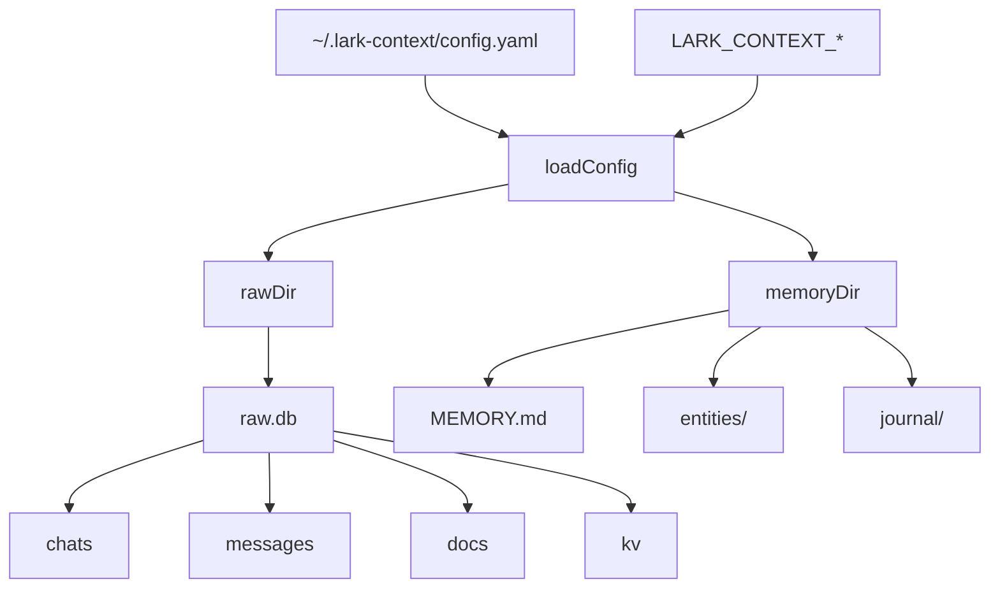
```mermaid
flowchart TD
  ConfigYaml["~/.lark-context/config.yaml"] --> CLI["loadConfig"]
  Env["LARK_CONTEXT_*"] --> CLI
  CLI --> RawDir["rawDir"]
  CLI --> MemoryDir["memoryDir"]
  RawDir --> DB["raw.db"]
  DB --> Chats["chats"]
  DB --> Messages["messages"]
  DB --> Docs["docs"]
  DB --> KV["kv"]
  MemoryDir --> Index["MEMORY.md"]
  MemoryDir --> Entities["entities/"]
  MemoryDir --> Journal["journal/"]
```

Sources: [src/config.ts:46-63](../../../project-repos/lark-context/src/config.ts#L46-L63), [src/config.ts:95-133](../../../project-repos/lark-context/src/config.ts#L95-L133), [src/db.ts:5-41](../../../project-repos/lark-context/src/db.ts#L5-L41), [skills/lark-context/SKILL.md:75-93](../../../project-repos/lark-context/skills/lark-context/SKILL.md#L75-L93)

<details class="source-snippets">
<summary>引用源码</summary>

<!-- source-snippets:start -->

#### `src/config.ts:46-63`

```typescript
function defaultConfigPath(): string {
  const env = process.env[ENV_CONFIG];
  if (env) return expandHome(env);
  return join(homedir(), ".lark-context", "config.yaml");
}

function resolvePath(
  flag: string | undefined,
  envVar: string,
  yamlValue: string | undefined,
  fallback: string,
): string {
  if (flag !== undefined) return expandHome(flag);
  const env = process.env[envVar];
  if (env) return expandHome(env);
  if (yamlValue) return expandHome(yamlValue);
  return expandHome(fallback);
}
```

#### `src/config.ts:95-133`

```typescript
export function loadConfig(opts: LoadConfigOptions = {}): Config {
  const configPath = opts.configPathOverride
    ? expandHome(opts.configPathOverride)
    : defaultConfigPath();
  let yamlData: Record<string, unknown> = {};
  if (existsSync(configPath)) {
    const parsed = YAML.parse(readFileSync(configPath, "utf8"));
    if (parsed && typeof parsed === "object" && !Array.isArray(parsed)) {
      yamlData = parsed as Record<string, unknown>;
    }
  }
  const pathsRaw = yamlData.paths;
  const pathsSection: Record<string, unknown> =
    pathsRaw && typeof pathsRaw === "object" && !Array.isArray(pathsRaw)
      ? (pathsRaw as Record<string, unknown>)
      : {};
  const memoryDir = resolvePath(
    opts.memoryDirOverride,
    ENV_MEMORY,
    typeof pathsSection.memory_dir === "string"
      ? pathsSection.memory_dir
      : undefined,
    "~/.claude/lark-memory",
  );
  const rawDir = resolvePath(
    opts.rawDirOverride,
    ENV_RAW,
    typeof pathsSection.raw_dir === "string"
      ? pathsSection.raw_dir
      : undefined,
    "~/.lark-context",
  );
  return {
    memoryDir,
    rawDir,
    groups: parseGroups(yamlData.groups),
    configPath,
  };
}
```

#### `src/db.ts:5-41`

```typescript
export const SCHEMA = `
CREATE TABLE IF NOT EXISTS chats (
  alias           TEXT PRIMARY KEY,
  chat_id         TEXT NOT NULL UNIQUE,
  name            TEXT,
  last_cursor     TEXT,
  last_pulled_at  TEXT,
  enabled         INTEGER DEFAULT 1
);
CREATE TABLE IF NOT EXISTS messages (
  id              TEXT PRIMARY KEY,
  chat_alias      TEXT NOT NULL REFERENCES chats(alias),
  sender_id       TEXT,
  sender_name     TEXT,
  msg_type        TEXT,
  content_json    TEXT NOT NULL,
  content_text    TEXT,
  reply_to        TEXT,
  create_time     TEXT NOT NULL,
  thread_id       TEXT,
  is_thread_reply INTEGER NOT NULL DEFAULT 0
);
CREATE INDEX IF NOT EXISTS idx_messages_chat_time
  ON messages(chat_alias, create_time);
CREATE TABLE IF NOT EXISTS docs (
  doc_token   TEXT PRIMARY KEY,
  url         TEXT NOT NULL,
  title       TEXT,
  content_md  TEXT NOT NULL,
  fetched_at  TEXT NOT NULL,
  source      TEXT
);
CREATE TABLE IF NOT EXISTS kv (
  key   TEXT PRIMARY KEY,
  value TEXT
);
`;
```

#### `skills/lark-context/SKILL.md:75-93`

````markdown
## 存储布局

用户级别文件布局（skill 和 workflow 都假设这些路径已存在）：

```
~/.lark-context/
├── config.yaml          # alias 白名单 + 路径配置
└── raw.db               # SQLite：messages + docs + chats + kv(last_digest_at 等)

~/.claude/lark-memory/    # skill workflow 写这里
├── MEMORY.md             # 索引（总是被 @-load）
├── entities/
│   ├── people/<slug>.md
│   ├── projects/<slug>.md
│   ├── terms.md
│   └── decisions/<slug>.md
└── journal/
    └── <ISO-week>.md     # e.g. 2026-W16.md
```
````

<!-- source-snippets:end -->
</details>
## 控制流与职责分离

`lark-context` 的 CLI 层不做 LLM 级判断。`pull`、`ingest-doc`、`show` 只读取/写入本地 DB；digest 和 TODO 的“值得记什么”“是否是待办”等判断写在 skill references 中，由 Claude 执行。Sources: [README.md:5-8](../../../project-repos/lark-context/README.md#L5-L8), [src/commands/pull.ts:401-440](../../../project-repos/lark-context/src/commands/pull.ts#L401-L440), [src/commands/show.ts:31-127](../../../project-repos/lark-context/src/commands/show.ts#L31-L127), [skills/lark-context/references/digest.md:42-78](../../../project-repos/lark-context/skills/lark-context/references/digest.md#L42-L78), [skills/lark-context/references/todo.md:21-34](../../../project-repos/lark-context/skills/lark-context/references/todo.md#L21-L34)

<details class="source-snippets">
<summary>引用源码</summary>

<!-- source-snippets:start -->

#### `README.md:5-8`

```markdown
- **持续拉取**：指定飞书群的增量消息（经 OAuth 用户身份通过官方 `lark-cli` 读取）
- **手动喂文档**：粘贴飞书文档 URL，工具拉下来入库
- **提炼**：由 **Claude 自己**（通过 skill workflow）完成，工具不调任何外部 LLM API（工作数据不出网）
- **记忆结构**：`entities/`（稳定层：人 / 项目 / 术语 / 决策）+ `journal/`（流水层：按 ISO 周追加要点）
```

#### `src/commands/pull.ts:401-440`

```typescript
export async function runPull(opts: PullOpts): Promise<number> {
  const cfg: Config = loadConfig(opts);
  const dbPath = join(cfg.rawDir, "raw.db");
  ensureInitialized(dbPath);
  const sinceParsed = opts.since ? parseDuration(opts.since) : null;
  const threadWindowParsed = opts.threadWindow
    ? parseDuration(opts.threadWindow)
    : null;
  const threadOpts: ThreadOpts = {
    enabled: !opts.noThreads,
    overrideWindow: threadWindowParsed,
    firstPullFallback: sinceParsed,
  };
  const effectiveAlias =
    opts.chatAlias === "all" || !opts.chatAlias ? null : opts.chatAlias;
  const targets = cfg.groups.filter(
    (g) => g.enabled && (!effectiveAlias || g.alias === effectiveAlias),
  );
  if (effectiveAlias && targets.length === 0) {
    throw new Error(`unknown chat alias "${opts.chatAlias}"`);
  }
  const now = (opts._now ?? (() => new Date()))();

  let grand = 0;
  for (const g of targets) {
    try {
      const n = await pullChat(dbPath, g, sinceParsed, threadOpts, now);
      process.stdout.write(`${g.alias}: pulled ${n} messages\n`);
      grand += n;
    } catch (err) {
      if (err instanceof LarkNotFoundError) throw err;
      if (err instanceof LarkCLIError) {
        disableChat(dbPath, g.alias, err.message);
        continue;
      }
      throw err;
    }
  }
  process.stdout.write(`done, total=${grand}\n`);
  return grand;
```

#### `src/commands/show.ts:31-127`

```typescript
export async function runShow(opts: ShowOpts): Promise<void> {
  const cfg = loadConfig(opts);
  const dbPath = join(cfg.rawDir, "raw.db");
  ensureInitialized(dbPath);
  const delta = parseDuration(opts.since ?? "24h");
  const now = (opts._now ?? (() => new Date()))();
  const cutoff = new Date(now.getTime() - delta.totalMs).toISOString();
  const effectiveAlias =
    opts.chatAlias === "all" || !opts.chatAlias ? null : opts.chatAlias;
  const targets = cfg.groups.filter(
    (g) => g.enabled && (!effectiveAlias || g.alias === effectiveAlias),
  );
  if (effectiveAlias && targets.length === 0) {
    throw new Error(`unknown chat alias "${opts.chatAlias}"`);
  }
  if (targets.length === 0) {
    throw new Error("no whitelisted chats");
  }

  const pieces: string[] = [];
  const db = connect(dbPath);
  try {
    const topStmt = db.prepare(
      "SELECT id, sender_name, content_text, create_time, thread_id " +
        "FROM messages WHERE chat_alias=? AND is_thread_reply=0 AND create_time >= ? " +
        "ORDER BY create_time",
    );
    const replyStmt = db.prepare(
      "SELECT sender_name, content_text, create_time " +
        "FROM messages WHERE chat_alias=? AND thread_id=? AND is_thread_reply=1 " +
        "ORDER BY create_time",
    );

    for (const g of targets) {
      const tops = topStmt.all(g.alias, cutoff) as Array<{
        id: string;
        sender_name: string;
        content_text: string;
        create_time: string;
        thread_id: string | null;
      }>;
      const messages: Array<{
        sender_name: string;
        content_text: string;
        create_time: string;
        is_thread_reply?: boolean;
      }> = [];
      for (const top of tops) {
        messages.push({
          sender_name: top.sender_name,
          content_text: top.content_text,
          create_time: top.create_time,
          is_thread_reply: false,
        });
        if (top.thread_id) {
          const replies = replyStmt.all(g.alias, top.thread_id) as Array<{
            sender_name: string;
            content_text: string;
            create_time: string;
          }>;
          for (const r of replies) {
            messages.push({
              sender_name: r.sender_name,
              content_text: r.content_text,
              create_time: r.create_time,
              is_thread_reply: true,
            });
          }
        }
      }
      pieces.push(
        renderChatWindow({
          chatName: g.name || g.alias,
          windowStart: cutoff.slice(0, 10),
          windowEnd: now.toISOString().slice(0, 10),
          messages,
        }),
      );
    }
    const docs = db
      .prepare(
        "SELECT doc_token, title, url FROM docs WHERE fetched_at >= ? ORDER BY fetched_at DESC",
      )
      .all(cutoff) as Array<{ doc_token: string; title: string; url: string }>;
    if (docs.length > 0) {
      pieces.push("### 近期入库的文档\n");
      for (const d of docs) {
        pieces.push(`- [${d.title || d.doc_token}](${d.url})  (token=\`${d.doc_token}\`)`);
      }
      pieces.push("");
    }
  } finally {
    db.close();
  }
  const write = opts.write ?? ((s: string) => process.stdout.write(s));
  write(pieces.join("\n") + "\n");
}
```

#### `skills/lark-context/references/digest.md:42-78`

````markdown
## Step 3 — 读原始材料

```bash
lark-context show [--chat <alias>] --since <window>
```

输出是本次沉淀的**唯一事实来源**。不要捏造、不要从记忆里补 show 里没出现的事。

若 `show` 输出为空（没有新消息）→ 告诉用户"窗口内没有新消息"，**不**写入任何文件，跳到 Step 7 但不更新时间戳（或更新时间戳但不生成实体，按执行判断）。

## Step 4 — 更新 journal（流水层）

目标文件：`~/.claude/lark-memory/journal/<ISO-week>.md`（例如 `2026-W16.md`）。

- 如果文件不存在，创建时带 YAML frontmatter（`name` / `description` / `type: journal` / `updated_at`）+ `# 2026-WNN` 一级标题
- 按日期追加子章节 `## 2026-MM-DD`
- 每条事件一行 bullet，格式 `- **#群名** 人 时间：内容简述（关键数字 / 链接 / 决策保留）`
- 只记"值得回看"的事；闲聊 / 表情回复不进 journal

## Step 5 — 增量 merge entities（稳定层）

对 show 输出里出现的每个**人 / 项目 / 术语 / 决策**，判断是否值得建/更新 entity：

1. 计算 slug：`zhang_san`（人）、`moy26_program`（项目）、`ttadk_claude_share`（决策）、术语并入 `entities/terms.md`
2. 读现有文件（若有）：
   - 人：`entities/people/<slug>.md`
   - 项目：`entities/projects/<slug>.md`
   - 决策：`entities/decisions/<slug>.md`
   - 术语：`entities/terms.md`（单文件多条目）
3. **增量 merge**：
   - 保留用户手工写的段落**原封不动**
   - 新事实追加到文件末尾（或相关章节），带日期标签
   - 如果新信息让 summary 过时，允许**改写** summary 段落
4. 更新 frontmatter 的 `updated_at`

**价值判断**：第一次看到的短暂提及不建新 entity。出现≥2 次、或用户说"记一下"、或是可执行决策 → 建。宁缺毋滥。

````

#### `skills/lark-context/references/todo.md:21-34`

```markdown
## Step 2 — 扫原文抽候选

从 show 输出里找这些模式（LLM 判断即可，不用正则硬匹）：

1. **直接点名**：`@当前用户` + 动作动词（做 / 看 / 跟进 / 对齐 / 确认 / 回复 / review / check 等）
2. **显式 ddl**：今天 / 今晚 / 明早 / 本周 / 下周一 / 周五前 / XX 月 XX 日
3. **@all 且含动作**：比如"大家这周内提 MR"——当前用户隐含要执行
4. **被问 + 未回**：消息里 `@我` 问了问题但没看到回复 → 候选

**不要**把这些当 TODO：
- 闲聊、表情回复、单纯告知
- 别人之间的对话（没 @ 到当前用户）
- 已经明确有别人接的（"X 我来处理"后面）

```

<!-- source-snippets:end -->
</details>
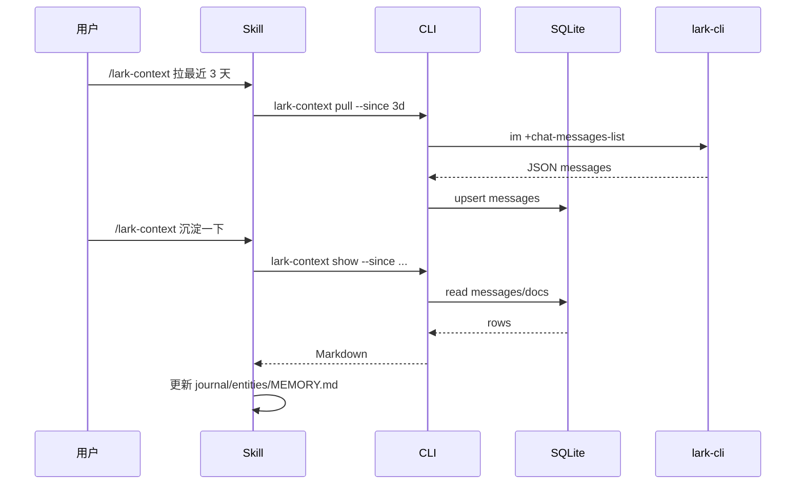
```mermaid
sequenceDiagram
  participant U as 用户
  participant S as Skill
  participant C as CLI
  participant D as SQLite
  participant L as lark-cli
  U->>S: /lark-context 拉最近 3 天
  S->>C: lark-context pull --since 3d
  C->>L: im +chat-messages-list
  L-->>C: JSON messages
  C->>D: upsert messages
  U->>S: /lark-context 沉淀一下
  S->>C: lark-context show --since ...
  C->>D: read messages/docs
  D-->>C: rows
  C-->>S: Markdown
  S->>S: 更新 journal/entities/MEMORY.md
```

Sources: [skills/lark-context/references/pull.md:12-20](../../../project-repos/lark-context/skills/lark-context/references/pull.md#L12-L20), [src/commands/pull.ts:345-386](../../../project-repos/lark-context/src/commands/pull.ts#L345-L386), [skills/lark-context/references/digest.md:42-97](../../../project-repos/lark-context/skills/lark-context/references/digest.md#L42-L97)

<details class="source-snippets">
<summary>引用源码</summary>

<!-- source-snippets:start -->

#### `skills/lark-context/references/pull.md:12-20`

```markdown
## 默认窗口

| 情况 | 用什么 |
|---|---|
| **首次拉某个 alias**（db 里没 `last_cursor`） | `--since 90d` |
| **已拉过的 alias**（增量） | 忽略 `--since`，自动从 `last_cursor` 续拉 |
| 用户说了具体窗口（"拉最近 3 天"） | 按用户说的 |

**90d 的由来**：首次拉的默认值是 skill 约定，不是 CLI 默认值。CLI 本身对首次无默认——所以 skill 必须显式传 `--since 90d`。
```

#### `src/commands/pull.ts:345-386`

```typescript
  for (pageNum = 1; pageNum <= MAX_PAGES; pageNum++) {
    const { messages, nextToken, hasMore } = await onePage(
      group.chatId,
      pageToken,
      pageNum === 1 ? startIso : null,
    );
    if (messages.length > 0) {
      const { inserted, newMax } = writePage(
        dbPath,
        group,
        messages,
        maxCreateTime,
        now,
      );
      maxCreateTime = newMax;
      totalInserted += inserted;
      process.stderr.write(
        `  ${group.alias}: page ${pageNum} +${inserted} (cumulative ${totalInserted})\n`,
      );
    }
    if (!hasMore || nextToken === null || nextToken === pageToken) {
      hitCap = false;
      break;
    }
    pageToken = nextToken;
  }
  if (hitCap) {
    process.stderr.write(
      `  ${group.alias}: hit MAX_PAGES=${MAX_PAGES} cap; re-run to continue\n`,
    );
  }

  if (threadOpts.enabled) {
    const isFirstPull = !lastSeen;
    const windowMs = threadOpts.overrideWindow
      ? threadOpts.overrideWindow.totalMs
      : isFirstPull
        ? (threadOpts.firstPullFallback?.totalMs ?? DEFAULT_THREAD_WINDOW_FIRST_MS)
        : DEFAULT_THREAD_WINDOW_INCR_MS;
    const threadRes = await pullThreads(dbPath, group, windowMs, now);
    totalInserted += threadRes.inserted;
  }
```

#### `skills/lark-context/references/digest.md:42-97`

````markdown
## Step 3 — 读原始材料

```bash
lark-context show [--chat <alias>] --since <window>
```

输出是本次沉淀的**唯一事实来源**。不要捏造、不要从记忆里补 show 里没出现的事。

若 `show` 输出为空（没有新消息）→ 告诉用户"窗口内没有新消息"，**不**写入任何文件，跳到 Step 7 但不更新时间戳（或更新时间戳但不生成实体，按执行判断）。

## Step 4 — 更新 journal（流水层）

目标文件：`~/.claude/lark-memory/journal/<ISO-week>.md`（例如 `2026-W16.md`）。

- 如果文件不存在，创建时带 YAML frontmatter（`name` / `description` / `type: journal` / `updated_at`）+ `# 2026-WNN` 一级标题
- 按日期追加子章节 `## 2026-MM-DD`
- 每条事件一行 bullet，格式 `- **#群名** 人 时间：内容简述（关键数字 / 链接 / 决策保留）`
- 只记"值得回看"的事；闲聊 / 表情回复不进 journal

## Step 5 — 增量 merge entities（稳定层）

对 show 输出里出现的每个**人 / 项目 / 术语 / 决策**，判断是否值得建/更新 entity：

1. 计算 slug：`zhang_san`（人）、`moy26_program`（项目）、`ttadk_claude_share`（决策）、术语并入 `entities/terms.md`
2. 读现有文件（若有）：
   - 人：`entities/people/<slug>.md`
   - 项目：`entities/projects/<slug>.md`
   - 决策：`entities/decisions/<slug>.md`
   - 术语：`entities/terms.md`（单文件多条目）
3. **增量 merge**：
   - 保留用户手工写的段落**原封不动**
   - 新事实追加到文件末尾（或相关章节），带日期标签
   - 如果新信息让 summary 过时，允许**改写** summary 段落
4. 更新 frontmatter 的 `updated_at`

**价值判断**：第一次看到的短暂提及不建新 entity。出现≥2 次、或用户说"记一下"、或是可执行决策 → 建。宁缺毋滥。

## Step 6 — 更新 MEMORY.md 索引

`~/.claude/lark-memory/MEMORY.md` 每个 entity 文件一行：

```
- [标题](relative/path/from/MEMORY.md.md) — 一句话 hook
```

- 新建文件 → 追加一行
- 改了 entity 的 summary → 更新这行的 hook
- 不删除行除非用户明确说"删掉这条"

MEMORY.md 前 200 行会被 `~/.claude/CLAUDE.md` 里的 `@~/.claude/lark-memory/MEMORY.md` 语法自动加载到每个会话，所以**超过 200 行会被截断**——如果快到上限，主动提示用户该折叠/归档。

## Step 7 — 写时间戳

```bash
sqlite3 ~/.lark-context/raw.db "INSERT INTO kv(key,value) VALUES('last_digest_at', datetime('now')) ON CONFLICT(key) DO UPDATE SET value=excluded.value"
```
````

<!-- source-snippets:end -->
</details>
## 设计取舍

- 使用官方 `lark-cli` 做 OAuth 和飞书 API 访问，避免在项目内重新实现认证和 API 客户端。Sources: [README.md:39-44](../../../project-repos/lark-context/README.md#L39-L44), [src/lark.ts:3-20](../../../project-repos/lark-context/src/lark.ts#L3-L20)

<details class="source-snippets">
<summary>引用源码</summary>

<!-- source-snippets:start -->

#### `README.md:39-44`

````markdown
### 1. 装飞书官方 CLI（若未装）

```bash
bnpm i -g @larksuite/cli
lark-cli auth login            # 浏览器 OAuth 授权
```
````

#### `src/lark.ts:3-20`

```typescript
export const BINARY = "lark-cli";

export class LarkCLIError extends Error {}
export class LarkNotFoundError extends Error {}

async function invoke(args: string[]): Promise<string> {
  try {
    const r = await execa(BINARY, args, { reject: true });
    return r.stdout;
  } catch (err: unknown) {
    const e = err as { code?: string; exitCode?: number; stderr?: string };
    if (e?.code === "ENOENT") {
      throw new LarkNotFoundError(
        `\`${BINARY}\` binary not found on PATH. See https://github.com/larksuite/cli for install instructions.`,
      );
    }
    const stderr = (e?.stderr ?? "").toString().trim();
    throw new LarkCLIError(stderr || `lark exited ${e?.exitCode ?? "?"}`);
```

<!-- source-snippets:end -->
</details>
- 使用 SQLite 存原始材料，Markdown 存提炼后的长期记忆，让数据可审、可迁移、可手工修改。Sources: [README.md:120-175](../../../project-repos/lark-context/README.md#L120-L175), [GETTING_STARTED.md:92-107](../../../project-repos/lark-context/GETTING_STARTED.md#L92-L107)

<details class="source-snippets">
<summary>引用源码</summary>

<!-- source-snippets:start -->

#### `README.md:120-175`

````markdown
## 存储位置

| 东西 | 默认路径 | 覆盖方式 |
|---|---|---|
| 配置文件 | `~/.lark-context/config.yaml` | `LARK_CONTEXT_CONFIG` 环境变量 |
| 原始数据（SQLite） | `~/.lark-context/raw.db` | `LARK_CONTEXT_RAW_DIR` |
| 记忆文件（给 Claude 读） | `~/.claude/lark-memory/` | `LARK_CONTEXT_MEMORY_DIR` |

覆盖优先级（高 → 低）：CLI flag → 环境变量 → config.yaml → 默认值。

## 配置文件示例

```yaml
paths:
  memory_dir: ~/.claude/lark-memory
  raw_dir: ~/.lark-context

groups:
  - alias: project_alpha
    chat_id: oc_xxxxxxxx
    name: 项目 Alpha 大群
    enabled: true
  - alias: infra_weekly
    chat_id: oc_yyyyyyyy
    name: 基础设施周会
    enabled: true
```

## 记忆文件结构

沉淀后的文件（由 Claude 在 `/lark-context 沉淀…` 里维护）：

```
~/.claude/lark-memory/
├── MEMORY.md            # 始终加载的索引
├── entities/            # 稳定层，Claude 做增量 merge（保留手工写的段）
│   ├── people/<slug>.md
│   ├── projects/<slug>.md
│   ├── terms.md
│   └── decisions/<slug>.md
└── journal/             # 按 ISO 周的流水
    └── 2026-W16.md
```

每个实体文件带统一 frontmatter：

```yaml
---
name: 项目 Alpha
type: project | person | decision | terms
updated_at: 2026-04-19
source_hints:
  - chat:project_alpha
  - doc:docxxxxxxxxxxxxxx
---
```
````

#### `GETTING_STARTED.md:92-107`

````markdown
## 记忆长啥样

```
~/.claude/lark-memory/
├── MEMORY.md                     # 总索引
├── entities/
│   ├── people/<slug>.md          # 每个同事一个文件
│   ├── projects/<slug>.md
│   ├── terms.md                  # 术语表
│   └── decisions/<slug>.md
└── journal/
    └── 2026-W17.md               # 每周一个流水文件
```

**全是 markdown，开 VSCode 随便改**。Claude 做增量 merge 时会保留你手工写的段落。

````

<!-- source-snippets:end -->
</details>
- 使用 skill 做自然语言路由和高层 workflow，避免 CLI 本身引入 LLM API 或复杂调度。Sources: [skills/lark-context/SKILL.md:31-48](../../../project-repos/lark-context/skills/lark-context/SKILL.md#L31-L48), [README.md:177-185](../../../project-repos/lark-context/README.md#L177-L185)

<details class="source-snippets">
<summary>引用源码</summary>

<!-- source-snippets:start -->

#### `skills/lark-context/SKILL.md:31-48`

```markdown
## 意图路由

根据用户自然语言里的关键词选一条路径。**只路由一次**，不要在 references 之间来回跳。

| 触发关键词 | 意图 | 处理方式 |
|---|---|---|
| 沉淀 / 整理 / 记忆 / digest | **digest** | 读 [`references/digest.md`](references/digest.md) 执行 workflow |
| TODO / 待办 / 有啥事 / 该做啥 | **todo** | 读 [`references/todo.md`](references/todo.md) |
| 拉 / 同步 / pull / 更新 | **pull** | 读 [`references/pull.md`](references/pull.md) |
| 收下 / 入库 / 文档 URL（含 `/docx/` / `/wiki/` / `/docs/` / `/base/` / `/file/`） | **ingest-doc** | 读 [`references/ingest-doc.md`](references/ingest-doc.md) |
| 看看 / 最近聊了 / show | **show** | 读 [`references/show.md`](references/show.md) |
| 哪些群 / 列群 / 所有群 / 当前关注 | **list-groups / groups list** | 直接跑对应 CLI 命令，无需 reference |
| 关注 / 加群 / 取消关注 / alias | **groups add/rm** | 直接跑 CLI，无需 reference |

**意图不明**（用户说了一句模糊的话，比如"嗯嗯"或只贴一段描述）：不要猜。**反问**"你是想沉淀 / 拉消息 / 看 TODO / 看最近消息 / 管理群 中哪一项？"——用户澄清后再路由。

**多意图同时出现**（比如"拉一下最近消息然后沉淀"）：**分两步**——先执行第一个（pull），完成后再执行第二个（digest）。不要试图合并。

```

#### `README.md:177-185`

```markdown
## 已知限制 / V1 边界

- **不自动调度**：全手动，你在 Claude 对话里触发。cron / hook 在 V2
- **首次 pull 上限 200 页**（约 10k 条消息）：避免一下子拉爆。到上限会在 stderr 提示，再跑 `pull` 可续
- **只读指定群聊**：私聊、@你的消息、多维表格、日历留给 V2
- **文档仅支持新版 `/docx/` 等**：老版 `/docs/` 若被 lark-cli 拒绝（`Unsupported document type: Legacy document`），透传错误
- **不拉回复线程**：只拉主消息流
- **工具不调任何 LLM API**：提炼全部由 Claude Code 完成

```

<!-- source-snippets:end -->
</details>
## 相关页面

- [项目概览](overview.md)
- [配置与 SQLite 存储](configuration-and-storage.md)
- [消息拉取与话题回复流水线](pull-thread-pipeline.md)

---

<details>
<summary>相关源文件</summary>

生成本页时使用的主要源文件：

- [src/cli.ts](../../../project-repos/lark-context/src/cli.ts)
- [src/commands/init.ts](../../../project-repos/lark-context/src/commands/init.ts)
- [src/commands/groups.ts](../../../project-repos/lark-context/src/commands/groups.ts)
- [src/commands/listGroups.ts](../../../project-repos/lark-context/src/commands/listGroups.ts)
- [src/commands/pull.ts](../../../project-repos/lark-context/src/commands/pull.ts)
- [src/commands/ingestDoc.ts](../../../project-repos/lark-context/src/commands/ingestDoc.ts)
- [src/commands/show.ts](../../../project-repos/lark-context/src/commands/show.ts)
- [README.md](../../../project-repos/lark-context/README.md)

</details>

# CLI 命令面

`src/cli.ts` 是二进制入口，使用 Commander 注册所有子命令，并在启动时从 `package.json` 读取版本。它还为 stdout/stderr 的 `EPIPE` 做静默退出，方便输出被 `head`、`less` 等管道截断。Sources: [src/cli.ts:1-14](../../../project-repos/lark-context/src/cli.ts#L1-L14), [src/cli.ts:22-49](../../../project-repos/lark-context/src/cli.ts#L22-L49)

<details class="source-snippets">
<summary>引用源码</summary>

<!-- source-snippets:start -->

#### `src/cli.ts:1-14`

```typescript
#!/usr/bin/env node
import { Command } from "commander";
import { readFileSync } from "node:fs";
import { fileURLToPath } from "node:url";
import { dirname, join } from "node:path";
import { registerGroups } from "./commands/groups.js";

// Silently exit on EPIPE (pipes to head/less etc.), matching Python's Click behavior.
for (const stream of [process.stdout, process.stderr]) {
  stream.on("error", (err: NodeJS.ErrnoException) => {
    if (err.code === "EPIPE") process.exit(0);
    throw err;
  });
}
```

#### `src/cli.ts:22-49`

```typescript
// 从 package.json 动态读版本，避免手动维护两份的漂移
function readPkgVersion(): string {
  try {
    const here = dirname(fileURLToPath(import.meta.url));
    const pkg = JSON.parse(
      readFileSync(join(here, "..", "package.json"), "utf8"),
    );
    return typeof pkg.version === "string" ? pkg.version : "0.0.0";
  } catch {
    return "0.0.0";
  }
}

const program = new Command();
program
  .name("lark-context")
  .description("Feishu context bridge for Claude Code")
  .version(readPkgVersion());

registerInit(program);
registerListGroups(program);
registerGroups(program);
registerPull(program);
registerIngestDoc(program);
registerShow(program);
registerShowDoc(program);

program.parseAsync(process.argv);
```

<!-- source-snippets:end -->
</details>
## 命令注册图

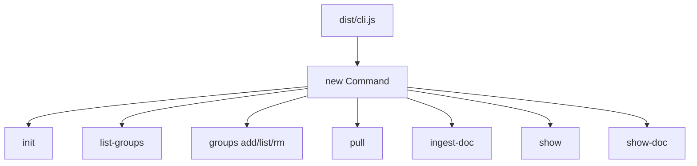
```mermaid
flowchart TD
  Bin["dist/cli.js"] --> Program["new Command"]
  Program --> Init["init"]
  Program --> ListGroups["list-groups"]
  Program --> Groups["groups add/list/rm"]
  Program --> Pull["pull"]
  Program --> Ingest["ingest-doc"]
  Program --> Show["show"]
  Program --> ShowDoc["show-doc"]
```

Sources: [src/cli.ts:35-49](../../../project-repos/lark-context/src/cli.ts#L35-L49)

<details class="source-snippets">
<summary>引用源码</summary>

<!-- source-snippets:start -->

#### `src/cli.ts:35-49`

```typescript
const program = new Command();
program
  .name("lark-context")
  .description("Feishu context bridge for Claude Code")
  .version(readPkgVersion());

registerInit(program);
registerListGroups(program);
registerGroups(program);
registerPull(program);
registerIngestDoc(program);
registerShow(program);
registerShowDoc(program);

program.parseAsync(process.argv);
```

<!-- source-snippets:end -->
</details>
## 命令职责

| 命令 | 注册位置 | 主要职责 | 外部依赖 |
|---|---|---|---|
| `init` | `src/commands/init.ts` | 检查 `lark-cli`、创建目录、保存初始 config、初始化 schema | `lark-cli --version` |
| `list-groups` | `src/commands/listGroups.ts` | 列当前用户所在飞书群，支持 `--json` | `lark-cli im chats list` |
| `groups add/list/rm` | `src/commands/groups.ts` | 管理关注白名单，并同步 `chats.enabled` | SQLite |
| `pull` | `src/commands/pull.ts` | 增量拉群消息和话题回复，写入 `messages` | `lark-cli im ...` |
| `ingest-doc` | `src/commands/ingestDoc.ts` | 拉飞书文档并 upsert 到 `docs` | `lark-cli docs +fetch` |
| `show` | `src/commands/show.ts` | 从 DB 渲染最近聊天和入库文档 | SQLite |
| `show-doc` | `src/commands/show.ts` | 输出单个已入库文档 Markdown | SQLite |

Sources: [README.md:96-118](../../../project-repos/lark-context/README.md#L96-L118), [src/commands/init.ts:56-67](../../../project-repos/lark-context/src/commands/init.ts#L56-L67), [src/commands/listGroups.ts:46-59](../../../project-repos/lark-context/src/commands/listGroups.ts#L46-L59), [src/commands/groups.ts:92-131](../../../project-repos/lark-context/src/commands/groups.ts#L92-L131), [src/commands/pull.ts:443-472](../../../project-repos/lark-context/src/commands/pull.ts#L443-L472), [src/commands/ingestDoc.ts:105-117](../../../project-repos/lark-context/src/commands/ingestDoc.ts#L105-L117), [src/commands/show.ts:156-184](../../../project-repos/lark-context/src/commands/show.ts#L156-L184)

<details class="source-snippets">
<summary>引用源码</summary>

<!-- source-snippets:start -->

#### `README.md:96-118`

```markdown
## CLI 命令一览

| 命令 | 作用 |
|---|---|
| `lark-context init` | 初始化配置、目录、SQLite 库；检查 lark-cli 是否可用 |
| `lark-context list-groups [--json]` | 列你所在的全部飞书群（chat_id + 名称 + 描述） |
| `lark-context groups add <chat_id> [--alias X] [--name "Y"]` | 把群加到关注白名单 |
| `lark-context groups list` / `groups rm <alias>` | 查看 / 移除白名单 |
| `lark-context pull [--chat <alias>\|all] [--since 3d] [--thread-window 7d] [--no-threads]` | 拉消息（增量）+ 刷新话题回复；不给 `--chat` 就拉所有 enabled 的群 |
| `lark-context ingest-doc <url-或-token>` | 拉单份飞书文档入库（支持 `/docx/` / `/wiki/` / `/docs/` 等） |
| `lark-context show [--chat <alias>\|all] [--since 24h]` | 输出 markdown：聊天记录 + 新入库文档 |
| `lark-context show-doc <token-或-url>` | 输出某份已入库文档的完整 markdown |

**`--since` 格式**：`24h` / `3d` / `1w` / `90m`。仅作为**首次拉取**的时间下限；后续 `pull` 会从"上次见过的最新消息"继续，忽略 `--since`。skill workflow 默认首次拉新群用 `90d`（见 `skills/lark-context/references/pull.md`）。

**`--chat all`** 等价于省略 `--chat`（遍历所有 enabled 的群）。

**话题回复（thread replies）**：`pull` 在拉完顶层消息后，会扫描"回看窗口"内所有带 `thread_id` 的顶层消息，逐个调用飞书 `im +threads-messages-list` 把话题下的回复（子消息）一并落库。窗口默认：

- 首次 pull 某群：与 effective `--since` 对齐（例如 `--since 180d` 则 thread window 也是 180d；不传默认 90d）
- 续拉：30d（`--since` 被忽略）

显式传 `--thread-window <duration>` 覆盖默认，或用 `--no-threads` 跳过该阶段（只拉顶层）。单个话题拉失败（权限 / 删除）不会 disable 整个群，stderr 打 warning 继续下一个。`show` 会把话题回复按 `  ↳ ` 缩进成组渲染在所属根消息下方。
```

#### `src/commands/init.ts:56-67`

```typescript
export function registerInit(program: Command): void {
  program
    .command("init")
    .description("Bootstrap config file, storage dirs, and SQLite schema")
    .action(async () => {
      try {
        await runInit();
      } catch (err) {
        process.stderr.write(`${(err as Error).message}\n`);
        process.exit(1);
      }
    });
```

#### `src/commands/listGroups.ts:46-59`

```typescript
export function registerListGroups(program: Command): void {
  program
    .command("list-groups")
    .description("List chats the current user is in")
    .option("--json", "Emit JSON array instead of text")
    .action(async (opts) => {
      try {
        await runListGroups({ json: Boolean(opts.json) });
      } catch (err) {
        process.stderr.write(`${(err as Error).message}\n`);
        process.exit(1);
      }
    });
}
```

#### `src/commands/groups.ts:92-131`

```typescript
export function registerGroups(program: Command): void {
  const g = program
    .command("groups")
    .description("Manage the whitelist of chats to pull");

  g.command("add <chat_id>")
    .description("Add a chat to the whitelist")
    .option("--alias <alias>", "Short name used in commands")
    .option("--name <name>", "Human-readable name")
    .action(async (chatId, opts) => {
      try {
        await runAdd({ chatId, alias: opts.alias, name: opts.name });
      } catch (err) {
        process.stderr.write(`${(err as Error).message}\n`);
        process.exit(1);
      }
    });

  g.command("list")
    .description("List whitelisted chats")
    .action(async () => {
      try {
        await runList();
      } catch (err) {
        process.stderr.write(`${(err as Error).message}\n`);
        process.exit(1);
      }
    });

  g.command("rm <alias>")
    .description("Remove an alias from the whitelist (soft-disable in DB)")
    .action(async (alias) => {
      try {
        await runRm({ alias });
      } catch (err) {
        process.stderr.write(`${(err as Error).message}\n`);
        process.exit(1);
      }
    });
}
```

#### `src/commands/pull.ts:443-472`

```typescript
export function registerPull(program: Command): void {
  program
    .command("pull")
    .description("Incrementally pull messages for one or all whitelisted chats")
    .option(
      "--chat <alias>",
      'Alias to pull; omit (or "all") for all enabled groups',
    )
    .option(
      "--since <duration>",
      "First-pull lower bound (e.g. 3d, 24h). Ignored on later runs.",
    )
    .option(
      "--thread-window <duration>",
      "Lookback window for thread-reply refresh. Default: matches --since on first pull, 30d on incremental pulls.",
    )
    .option("--no-threads", "Skip thread-reply refresh (phase 2)")
    .action(async (opts) => {
      try {
        await runPull({
          chatAlias: opts.chat,
          since: opts.since,
          threadWindow: opts.threadWindow,
          noThreads: opts.threads === false,
        });
      } catch (err) {
        process.stderr.write(`${(err as Error).message}\n`);
        process.exit(1);
      }
    });
```

#### `src/commands/ingestDoc.ts:105-117`

```typescript
export function registerIngestDoc(program: Command): void {
  program
    .command("ingest-doc <ref>")
    .description("Fetch a Feishu doc (by URL or token) and store its markdown")
    .action(async (ref) => {
      try {
        await runIngestDoc({ ref });
      } catch (err) {
        process.stderr.write(`${(err as Error).message}\n`);
        process.exit(1);
      }
    });
}
```

#### `src/commands/show.ts:156-184`

```typescript
export function registerShow(program: Command): void {
  program
    .command("show")
    .description("Print recent messages + newly-ingested docs as markdown")
    .option("--chat <alias>", "Alias to show; omit (or 'all') for all enabled")
    .option("--since <duration>", "Duration window, e.g. 3d", "24h")
    .action(async (opts) => {
      try {
        await runShow({ chatAlias: opts.chat, since: opts.since });
      } catch (err) {
        process.stderr.write(`${(err as Error).message}\n`);
        process.exit(1);
      }
    });
}

export function registerShowDoc(program: Command): void {
  program
    .command("show-doc <ref>")
    .description("Print the stored markdown for a doc, given its token or URL")
    .action(async (ref) => {
      try {
        await runShowDoc({ ref });
      } catch (err) {
        process.stderr.write(`${(err as Error).message}\n`);
        process.exit(1);
      }
    });
}
```

<!-- source-snippets:end -->
</details>
## 初始化命令

`runInit` 先检查 `lark-cli --version`，检查失败就提示安装官方 CLI 并登录；之后加载路径配置，创建 memory/raw 目录，在配置文件不存在时写入空白配置，最后初始化 `raw.db` schema。Sources: [src/commands/init.ts:18-34](../../../project-repos/lark-context/src/commands/init.ts#L18-L34), [src/commands/init.ts:36-53](../../../project-repos/lark-context/src/commands/init.ts#L36-L53)

<details class="source-snippets">
<summary>引用源码</summary>

<!-- source-snippets:start -->

#### `src/commands/init.ts:18-34`

```typescript
async function defaultPathCheck(): Promise<boolean> {
  try {
    await execa("lark-cli", ["--version"], { reject: true });
    return true;
  } catch {
    return false;
  }
}

export async function runInit(opts: InitOpts = {}): Promise<void> {
  if (opts.checkLarkCli !== false) {
    const check = opts._pathCheck ?? defaultPathCheck;
    if (!(await check())) {
      throw new Error(
        "`lark-cli` binary not found on PATH. Install: `bnpm i -g @larksuite/cli` (or `npm i -g @larksuite/cli`), then `lark-cli auth login`.",
      );
    }
```

#### `src/commands/init.ts:36-53`

```typescript
  const cfg = loadConfig({
    configPathOverride: opts.configPathOverride,
    memoryDirOverride: opts.memoryDirOverride,
    rawDirOverride: opts.rawDirOverride,
  });
  mkdirSync(cfg.memoryDir, { recursive: true });
  mkdirSync(cfg.rawDir, { recursive: true });
  if (cfg.configPath && !existsSync(cfg.configPath)) {
    const fresh: Config = {
      memoryDir: cfg.memoryDir,
      rawDir: cfg.rawDir,
      groups: [],
      configPath: cfg.configPath,
    };
    saveConfig(fresh);
  }
  initSchema(join(cfg.rawDir, "raw.db"));
  process.stdout.write(`Initialized lark-context at ${cfg.configPath}\n`);
```

<!-- source-snippets:end -->
</details>
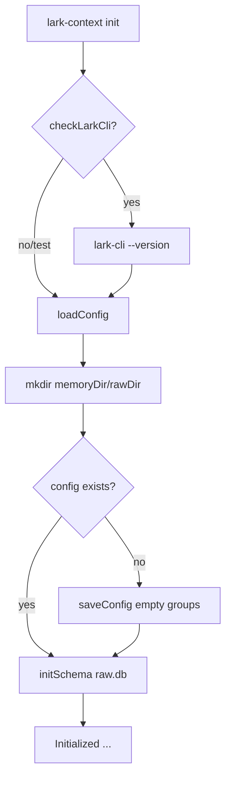
```mermaid
flowchart TD
  A["lark-context init"] --> B{"checkLarkCli?"}
  B -->|yes| C["lark-cli --version"]
  B -->|no/test| D["loadConfig"]
  C --> D
  D --> E["mkdir memoryDir/rawDir"]
  E --> F{"config exists?"}
  F -->|no| G["saveConfig empty groups"]
  F -->|yes| H["initSchema raw.db"]
  G --> H
  H --> I["Initialized ..."]
```

Sources: [src/commands/init.ts:27-53](../../../project-repos/lark-context/src/commands/init.ts#L27-L53)

<details class="source-snippets">
<summary>引用源码</summary>

<!-- source-snippets:start -->

#### `src/commands/init.ts:27-53`

```typescript
export async function runInit(opts: InitOpts = {}): Promise<void> {
  if (opts.checkLarkCli !== false) {
    const check = opts._pathCheck ?? defaultPathCheck;
    if (!(await check())) {
      throw new Error(
        "`lark-cli` binary not found on PATH. Install: `bnpm i -g @larksuite/cli` (or `npm i -g @larksuite/cli`), then `lark-cli auth login`.",
      );
    }
  }
  const cfg = loadConfig({
    configPathOverride: opts.configPathOverride,
    memoryDirOverride: opts.memoryDirOverride,
    rawDirOverride: opts.rawDirOverride,
  });
  mkdirSync(cfg.memoryDir, { recursive: true });
  mkdirSync(cfg.rawDir, { recursive: true });
  if (cfg.configPath && !existsSync(cfg.configPath)) {
    const fresh: Config = {
      memoryDir: cfg.memoryDir,
      rawDir: cfg.rawDir,
      groups: [],
      configPath: cfg.configPath,
    };
    saveConfig(fresh);
  }
  initSchema(join(cfg.rawDir, "raw.db"));
  process.stdout.write(`Initialized lark-context at ${cfg.configPath}\n`);
```

<!-- source-snippets:end -->
</details>
## 群白名单命令

`groups add` 会解析配置、要求 DB 已初始化、决定 alias、拒绝重复 alias、保存 YAML，并 upsert `chats` 表。`groups rm` 从 YAML 删除该 alias，同时把 DB 中对应 chat 标为 disabled，而不是删除历史消息。Sources: [src/commands/groups.ts:31-58](../../../project-repos/lark-context/src/commands/groups.ts#L31-L58), [src/commands/groups.ts:73-90](../../../project-repos/lark-context/src/commands/groups.ts#L73-L90)

<details class="source-snippets">
<summary>引用源码</summary>

<!-- source-snippets:start -->

#### `src/commands/groups.ts:31-58`

```typescript
export async function runAdd(opts: AddOpts): Promise<void> {
  const cfg = loadConfig(opts);
  const dbPath = join(cfg.rawDir, "raw.db");
  ensureInitialized(dbPath);
  const name = opts.name ?? "";
  const resolvedAlias = opts.alias ?? slugify(name || opts.chatId);
  if (cfg.groups.some((g) => g.alias === resolvedAlias)) {
    throw new Error(`alias "${resolvedAlias}" already in use`);
  }
  const newGroup: GroupConfig = {
    alias: resolvedAlias,
    chatId: opts.chatId,
    name,
    enabled: true,
  };
  const next: Config = { ...cfg, groups: [...cfg.groups, newGroup] };
  saveConfig(next);
  const db = connect(dbPath);
  try {
    db.prepare(
      "INSERT INTO chats(alias, chat_id, name, enabled) VALUES (?, ?, ?, 1) " +
        "ON CONFLICT(alias) DO UPDATE SET chat_id=excluded.chat_id, name=excluded.name, enabled=1",
    ).run(resolvedAlias, opts.chatId, name);
  } finally {
    db.close();
  }
  process.stdout.write(`added ${resolvedAlias} -> ${opts.chatId}\n`);
}
```

#### `src/commands/groups.ts:73-90`

```typescript
export async function runRm(opts: RmOpts): Promise<void> {
  const cfg = loadConfig(opts);
  const dbPath = join(cfg.rawDir, "raw.db");
  ensureInitialized(dbPath);
  const remaining = cfg.groups.filter((g) => g.alias !== opts.alias);
  if (remaining.length === cfg.groups.length) {
    throw new Error(`alias "${opts.alias}" not in whitelist`);
  }
  const next: Config = { ...cfg, groups: remaining };
  saveConfig(next);
  const db = connect(dbPath);
  try {
    db.prepare("UPDATE chats SET enabled=0 WHERE alias=?").run(opts.alias);
  } finally {
    db.close();
  }
  process.stdout.write(`removed ${opts.alias}\n`);
}
```

<!-- source-snippets:end -->
</details>
`list-groups` 则不读本地白名单，它调用官方 CLI 列出用户所在群，默认输出表格，`--json` 输出原始 items 数组。Sources: [src/commands/listGroups.ts:9-44](../../../project-repos/lark-context/src/commands/listGroups.ts#L9-L44)

<details class="source-snippets">
<summary>引用源码</summary>

<!-- source-snippets:start -->

#### `src/commands/listGroups.ts:9-44`

```typescript
export async function runListGroups(opts: ListGroupsOpts): Promise<void> {
  const write = opts.write ?? ((s: string) => process.stdout.write(s));
  const response = await runJson([
    "im",
    "chats",
    "list",
    "--page-all",
    "--page-limit",
    "0",
  ]);
  if (!response || typeof response !== "object") {
    throw new Error(`unexpected lark response: ${JSON.stringify(response)}`);
  }
  const data = (response as { data?: unknown }).data;
  const items: Array<{ chat_id?: string; name?: string; description?: string }> =
    data && typeof data === "object" && Array.isArray((data as any).items)
      ? (data as any).items
      : [];

  if (opts.json) {
    write(JSON.stringify(items, null, 2) + "\n");
    return;
  }
  if (items.length === 0) {
    write("(no chats)\n");
    return;
  }
  write(`${"chat_id".padEnd(40)} 名称 / 描述\n`);
  for (const c of items) {
    const chatId = (c.chat_id ?? "").padEnd(40);
    const name = c.name ?? "";
    const desc = c.description ?? "";
    const suffix = desc ? `  [${desc}]` : "";
    write(`${chatId} ${name}${suffix}\n`);
  }
}
```

<!-- source-snippets:end -->
</details>
## 数据命令的错误出口

每个注册函数都把命令体包在 `try/catch` 中，出错时写 stderr 并 `process.exit(1)`。业务函数本身用抛错表达错误，这让测试能直接断言 `runXxx` 的异常，而 CLI 运行时能转成标准非零退出。Sources: [src/commands/init.ts:60-66](../../../project-repos/lark-context/src/commands/init.ts#L60-L66), [src/commands/groups.ts:101-129](../../../project-repos/lark-context/src/commands/groups.ts#L101-L129), [src/commands/pull.ts:460-470](../../../project-repos/lark-context/src/commands/pull.ts#L460-L470), [src/commands/show.ts:162-181](../../../project-repos/lark-context/src/commands/show.ts#L162-L181)

<details class="source-snippets">
<summary>引用源码</summary>

<!-- source-snippets:start -->

#### `src/commands/init.ts:60-66`

```typescript
    .action(async () => {
      try {
        await runInit();
      } catch (err) {
        process.stderr.write(`${(err as Error).message}\n`);
        process.exit(1);
      }
```

#### `src/commands/groups.ts:101-129`

```typescript
    .action(async (chatId, opts) => {
      try {
        await runAdd({ chatId, alias: opts.alias, name: opts.name });
      } catch (err) {
        process.stderr.write(`${(err as Error).message}\n`);
        process.exit(1);
      }
    });

  g.command("list")
    .description("List whitelisted chats")
    .action(async () => {
      try {
        await runList();
      } catch (err) {
        process.stderr.write(`${(err as Error).message}\n`);
        process.exit(1);
      }
    });

  g.command("rm <alias>")
    .description("Remove an alias from the whitelist (soft-disable in DB)")
    .action(async (alias) => {
      try {
        await runRm({ alias });
      } catch (err) {
        process.stderr.write(`${(err as Error).message}\n`);
        process.exit(1);
      }
```

#### `src/commands/pull.ts:460-470`

```typescript
    .action(async (opts) => {
      try {
        await runPull({
          chatAlias: opts.chat,
          since: opts.since,
          threadWindow: opts.threadWindow,
          noThreads: opts.threads === false,
        });
      } catch (err) {
        process.stderr.write(`${(err as Error).message}\n`);
        process.exit(1);
```

#### `src/commands/show.ts:162-181`

```typescript
    .action(async (opts) => {
      try {
        await runShow({ chatAlias: opts.chat, since: opts.since });
      } catch (err) {
        process.stderr.write(`${(err as Error).message}\n`);
        process.exit(1);
      }
    });
}

export function registerShowDoc(program: Command): void {
  program
    .command("show-doc <ref>")
    .description("Print the stored markdown for a doc, given its token or URL")
    .action(async (ref) => {
      try {
        await runShowDoc({ ref });
      } catch (err) {
        process.stderr.write(`${(err as Error).message}\n`);
        process.exit(1);
```

<!-- source-snippets:end -->
</details>
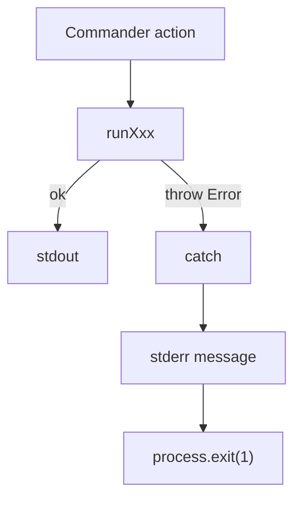
```mermaid
flowchart TD
  Cmd["Commander action"] --> Run["runXxx"]
  Run -->|ok| Stdout["stdout"]
  Run -->|throw Error| Catch["catch"]
  Catch --> Stderr["stderr message"]
  Stderr --> Exit["process.exit(1)"]
```

Sources: [src/commands/ingestDoc.ts:109-115](../../../project-repos/lark-context/src/commands/ingestDoc.ts#L109-L115), [src/commands/show.ts:176-181](../../../project-repos/lark-context/src/commands/show.ts#L176-L181)

<details class="source-snippets">
<summary>引用源码</summary>

<!-- source-snippets:start -->

#### `src/commands/ingestDoc.ts:109-115`

```typescript
    .action(async (ref) => {
      try {
        await runIngestDoc({ ref });
      } catch (err) {
        process.stderr.write(`${(err as Error).message}\n`);
        process.exit(1);
      }
```

#### `src/commands/show.ts:176-181`

```typescript
    .action(async (ref) => {
      try {
        await runShowDoc({ ref });
      } catch (err) {
        process.stderr.write(`${(err as Error).message}\n`);
        process.exit(1);
```

<!-- source-snippets:end -->
</details>
## 相关页面

- [系统架构](system-architecture.md)
- [lark-cli 集成](lark-cli-integration.md)
- [文档入库与 Markdown 输出](document-ingestion-and-show.md)

---

<details>
<summary>相关源文件</summary>

生成本页时使用的主要源文件：

- [src/lark.ts](../../../project-repos/lark-context/src/lark.ts)
- [src/commands/listGroups.ts](../../../project-repos/lark-context/src/commands/listGroups.ts)
- [src/commands/pull.ts](../../../project-repos/lark-context/src/commands/pull.ts)
- [src/commands/ingestDoc.ts](../../../project-repos/lark-context/src/commands/ingestDoc.ts)
- [src/commands/init.ts](../../../project-repos/lark-context/src/commands/init.ts)
- [test/lark.test.ts](../../../project-repos/lark-context/test/lark.test.ts)

</details>

# lark-cli 集成

项目没有直接实现飞书 OpenAPI 客户端，而是把官方 `lark-cli` 当作唯一飞书访问层。`src/lark.ts` 负责执行二进制、统一追加输出格式、解析 JSON/NDJSON，并把“二进制不存在”和“CLI 非零退出”分成不同错误类型。Sources: [src/lark.ts:1-7](../../../project-repos/lark-context/src/lark.ts#L1-L7), [src/lark.ts:8-35](../../../project-repos/lark-context/src/lark.ts#L8-L35)

<details class="source-snippets">
<summary>引用源码</summary>

<!-- source-snippets:start -->

#### `src/lark.ts:1-7`

```typescript
import { execa } from "execa";

export const BINARY = "lark-cli";

export class LarkCLIError extends Error {}
export class LarkNotFoundError extends Error {}

```

#### `src/lark.ts:8-35`

```typescript
async function invoke(args: string[]): Promise<string> {
  try {
    const r = await execa(BINARY, args, { reject: true });
    return r.stdout;
  } catch (err: unknown) {
    const e = err as { code?: string; exitCode?: number; stderr?: string };
    if (e?.code === "ENOENT") {
      throw new LarkNotFoundError(
        `\`${BINARY}\` binary not found on PATH. See https://github.com/larksuite/cli for install instructions.`,
      );
    }
    const stderr = (e?.stderr ?? "").toString().trim();
    throw new LarkCLIError(stderr || `lark exited ${e?.exitCode ?? "?"}`);
  }
}

export async function runJson(args: string[]): Promise<unknown> {
  const out = await invoke([...args, "--format", "json"]);
  return JSON.parse(out);
}

export async function* runNdjson(args: string[]): AsyncGenerator<unknown> {
  const out = await invoke([...args, "--format", "ndjson"]);
  for (const line of out.split("\n")) {
    const trimmed = line.trim();
    if (trimmed) yield JSON.parse(trimmed);
  }
}
```

<!-- source-snippets:end -->
</details>
## 封装层

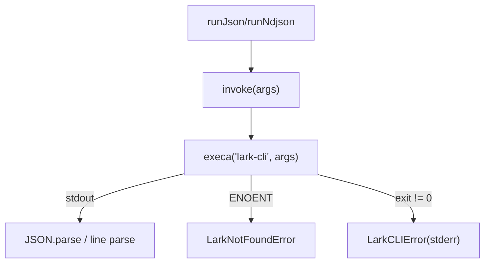
```mermaid
flowchart TD
  Call["runJson/runNdjson"] --> Invoke["invoke(args)"]
  Invoke --> Execa["execa('lark-cli', args)"]
  Execa -->|stdout| Parse["JSON.parse / line parse"]
  Execa -->|ENOENT| NotFound["LarkNotFoundError"]
  Execa -->|exit != 0| CLIError["LarkCLIError(stderr)"]
```

Sources: [src/lark.ts:8-35](../../../project-repos/lark-context/src/lark.ts#L8-L35), [test/lark.test.ts:20-71](../../../project-repos/lark-context/test/lark.test.ts#L20-L71)

<details class="source-snippets">
<summary>引用源码</summary>

<!-- source-snippets:start -->

#### `src/lark.ts:8-35`

```typescript
async function invoke(args: string[]): Promise<string> {
  try {
    const r = await execa(BINARY, args, { reject: true });
    return r.stdout;
  } catch (err: unknown) {
    const e = err as { code?: string; exitCode?: number; stderr?: string };
    if (e?.code === "ENOENT") {
      throw new LarkNotFoundError(
        `\`${BINARY}\` binary not found on PATH. See https://github.com/larksuite/cli for install instructions.`,
      );
    }
    const stderr = (e?.stderr ?? "").toString().trim();
    throw new LarkCLIError(stderr || `lark exited ${e?.exitCode ?? "?"}`);
  }
}

export async function runJson(args: string[]): Promise<unknown> {
  const out = await invoke([...args, "--format", "json"]);
  return JSON.parse(out);
}

export async function* runNdjson(args: string[]): AsyncGenerator<unknown> {
  const out = await invoke([...args, "--format", "ndjson"]);
  for (const line of out.split("\n")) {
    const trimmed = line.trim();
    if (trimmed) yield JSON.parse(trimmed);
  }
}
```

#### `test/lark.test.ts:20-71`

```typescript
describe("runJson", () => {
  it("appends --format json and parses JSON stdout", async () => {
    mockExeca.mockResolvedValueOnce({
      stdout: '{"a":1,"b":[2,3]}',
      stderr: "",
      exitCode: 0,
    } as any);

    const out = await runJson(["im", "+chat-messages-list"]);

    expect(out).toEqual({ a: 1, b: [2, 3] });
    const call = mockExeca.mock.calls[0];
    expect(call[0]).toBe(BINARY);
    expect(call[1]).toEqual([
      "im",
      "+chat-messages-list",
      "--format",
      "json",
    ]);
  });

  it("throws LarkNotFoundError when binary missing (ENOENT)", async () => {
    mockExeca.mockRejectedValue(
      Object.assign(new Error("spawn ENOENT"), { code: "ENOENT" }),
    );

    await expect(runJson(["x"])).rejects.toBeInstanceOf(LarkNotFoundError);
    await expect(runJson(["x"])).rejects.toThrow(/lark-cli.*not found/i);
  });

  it("throws LarkCLIError on non-zero exit with stderr", async () => {
    mockExeca.mockRejectedValueOnce(
      Object.assign(new Error("failed"), {
        exitCode: 1,
        stderr: "permission denied",
      }),
    );

    const err = (await runJson(["x"]).catch((e) => e)) as Error;
    expect(err).toBeInstanceOf(LarkCLIError);
    expect(err.message).toBe("permission denied");
  });

  it("LarkCLIError falls back when stderr empty", async () => {
    mockExeca.mockRejectedValueOnce(
      Object.assign(new Error("failed"), { exitCode: 2, stderr: "" }),
    );

    const err = (await runJson(["x"]).catch((e) => e)) as Error;
    expect(err).toBeInstanceOf(LarkCLIError);
    expect(err.message).toMatch(/exited 2/);
  });
```

<!-- source-snippets:end -->
</details>
`runJson` 会在参数末尾追加 `--format json`，`runNdjson` 追加 `--format ndjson` 并逐行解析非空行。测试明确覆盖了追加格式参数、JSON 解析、空行跳过、ENOENT 和 stderr 透传。Sources: [src/lark.ts:24-35](../../../project-repos/lark-context/src/lark.ts#L24-L35), [test/lark.test.ts:20-39](../../../project-repos/lark-context/test/lark.test.ts#L20-L39), [test/lark.test.ts:74-101](../../../project-repos/lark-context/test/lark.test.ts#L74-L101)

<details class="source-snippets">
<summary>引用源码</summary>

<!-- source-snippets:start -->

#### `src/lark.ts:24-35`

```typescript
export async function runJson(args: string[]): Promise<unknown> {
  const out = await invoke([...args, "--format", "json"]);
  return JSON.parse(out);
}

export async function* runNdjson(args: string[]): AsyncGenerator<unknown> {
  const out = await invoke([...args, "--format", "ndjson"]);
  for (const line of out.split("\n")) {
    const trimmed = line.trim();
    if (trimmed) yield JSON.parse(trimmed);
  }
}
```

#### `test/lark.test.ts:20-39`

```typescript
describe("runJson", () => {
  it("appends --format json and parses JSON stdout", async () => {
    mockExeca.mockResolvedValueOnce({
      stdout: '{"a":1,"b":[2,3]}',
      stderr: "",
      exitCode: 0,
    } as any);

    const out = await runJson(["im", "+chat-messages-list"]);

    expect(out).toEqual({ a: 1, b: [2, 3] });
    const call = mockExeca.mock.calls[0];
    expect(call[0]).toBe(BINARY);
    expect(call[1]).toEqual([
      "im",
      "+chat-messages-list",
      "--format",
      "json",
    ]);
  });
```

#### `test/lark.test.ts:74-101`

```typescript
describe("runNdjson", () => {
  it("appends --format ndjson and yields one object per line", async () => {
    mockExeca.mockResolvedValueOnce({
      stdout: '{"a":1}\n{"a":2}\n{"a":3}\n',
      stderr: "",
      exitCode: 0,
    } as any);

    const out: unknown[] = [];
    for await (const row of runNdjson(["list"])) out.push(row);

    expect(out).toEqual([{ a: 1 }, { a: 2 }, { a: 3 }]);
    const call = mockExeca.mock.calls[0];
    expect(call[1]).toEqual(["list", "--format", "ndjson"]);
  });

  it("skips empty lines", async () => {
    mockExeca.mockResolvedValueOnce({
      stdout: '{"a":1}\n\n{"a":2}\n   \n',
      stderr: "",
      exitCode: 0,
    } as any);

    const out: unknown[] = [];
    for await (const row of runNdjson(["x"])) out.push(row);

    expect(out).toEqual([{ a: 1 }, { a: 2 }]);
  });
```

<!-- source-snippets:end -->
</details>
## 调用点

| 业务 | 调用参数 | 返回处理 |
|---|---|---|
| 列用户所在群 | `im chats list --page-all --page-limit 0` | 读取 `data.items` |
| 拉群消息 | `im +chat-messages-list --chat-id ... --sort asc --page-size 50` | 读取 `data.messages/page_token/has_more` |
| 拉话题回复 | `im +threads-messages-list --thread ... --sort asc --page-size 50` | 同样分页读取 messages |
| 拉文档 | `docs +fetch --doc <ref>` | 读取 `data.title/content/markdown/text/body` |

Sources: [src/commands/listGroups.ts:11-27](../../../project-repos/lark-context/src/commands/listGroups.ts#L11-L27), [src/commands/pull.ts:47-77](../../../project-repos/lark-context/src/commands/pull.ts#L47-L77), [src/commands/pull.ts:171-196](../../../project-repos/lark-context/src/commands/pull.ts#L171-L196), [src/commands/ingestDoc.ts:65-83](../../../project-repos/lark-context/src/commands/ingestDoc.ts#L65-L83)

<details class="source-snippets">
<summary>引用源码</summary>

<!-- source-snippets:start -->

#### `src/commands/listGroups.ts:11-27`

```typescript
  const response = await runJson([
    "im",
    "chats",
    "list",
    "--page-all",
    "--page-limit",
    "0",
  ]);
  if (!response || typeof response !== "object") {
    throw new Error(`unexpected lark response: ${JSON.stringify(response)}`);
  }
  const data = (response as { data?: unknown }).data;
  const items: Array<{ chat_id?: string; name?: string; description?: string }> =
    data && typeof data === "object" && Array.isArray((data as any).items)
      ? (data as any).items
      : [];

```

#### `src/commands/pull.ts:47-77`

```typescript
async function onePage(
  chatId: string,
  pageToken: string | null,
  startIso: string | null,
): Promise<PageResult> {
  const args: string[] = [
    "im",
    "+chat-messages-list",
    "--chat-id",
    chatId,
    "--sort",
    "asc",
    "--page-size",
    "50",
  ];
  if (pageToken) args.push("--page-token", pageToken);
  if (startIso) args.push("--start", startIso);
  const response = (await runJson(args)) as any;
  if (!response || typeof response !== "object") {
    throw new Error(`unexpected lark response: ${JSON.stringify(response)}`);
  }
  const data = response.data ?? {};
  if (!data || typeof data !== "object") {
    return { messages: [], nextToken: null, hasMore: false };
  }
  return {
    messages: Array.isArray(data.messages) ? data.messages : [],
    nextToken: data.page_token ?? null,
    hasMore: Boolean(data.has_more),
  };
}
```

#### `src/commands/pull.ts:171-196`

```typescript
async function pullThreadsPage(
  threadId: string,
  pageToken: string | null,
): Promise<PageResult> {
  const args: string[] = [
    "im",
    "+threads-messages-list",
    "--thread",
    threadId,
    "--sort",
    "asc",
    "--page-size",
    "50",
  ];
  if (pageToken) args.push("--page-token", pageToken);
  const response = (await runJson(args)) as any;
  if (!response || typeof response !== "object") {
    throw new Error(`unexpected threads response: ${JSON.stringify(response)}`);
  }
  const data = response.data ?? {};
  return {
    messages: Array.isArray(data.messages) ? data.messages : [],
    nextToken: data.page_token ? String(data.page_token) : null,
    hasMore: Boolean(data.has_more),
  };
}
```

#### `src/commands/ingestDoc.ts:65-83`

```typescript
  const response = (await runJson(["docs", "+fetch", "--doc", opts.ref])) as
    | Record<string, unknown>
    | null;
  if (!response || typeof response !== "object") {
    throw new Error(`unexpected lark response: ${JSON.stringify(response)}`);
  }
  if (response.ok === false) {
    const err = response.error;
    const msg =
      err && typeof err === "object" && err !== null && "message" in err
        ? String((err as { message: unknown }).message)
        : String(err ?? response);
    throw new Error(`docs +fetch failed: ${msg}`);
  }
  let data = response.data;
  if (!data || typeof data !== "object") {
    data = { content: String(data ?? "") };
  }
  const { title, body } = extractContent(data as Record<string, unknown>);
```

<!-- source-snippets:end -->
</details>
## 初始化检查

`init` 不通过 `src/lark.ts`，而是直接执行 `lark-cli --version` 做 PATH 检查。失败时提示安装 `@larksuite/cli` 并执行 `lark-cli auth login`。这是一种启动前置检查，而不是业务调用。Sources: [src/commands/init.ts:18-34](../../../project-repos/lark-context/src/commands/init.ts#L18-L34), [skills/lark-context/SKILL.md:15-29](../../../project-repos/lark-context/skills/lark-context/SKILL.md#L15-L29)

<details class="source-snippets">
<summary>引用源码</summary>

<!-- source-snippets:start -->

#### `src/commands/init.ts:18-34`

```typescript
async function defaultPathCheck(): Promise<boolean> {
  try {
    await execa("lark-cli", ["--version"], { reject: true });
    return true;
  } catch {
    return false;
  }
}

export async function runInit(opts: InitOpts = {}): Promise<void> {
  if (opts.checkLarkCli !== false) {
    const check = opts._pathCheck ?? defaultPathCheck;
    if (!(await check())) {
      throw new Error(
        "`lark-cli` binary not found on PATH. Install: `bnpm i -g @larksuite/cli` (or `npm i -g @larksuite/cli`), then `lark-cli auth login`.",
      );
    }
```

#### `skills/lark-context/SKILL.md:15-29`

````markdown
## 前置依赖

用户必须已安装两个 CLI：
- `lark-context` ≥ 0.1.0（本项目 CLI，`bnpm i -g @tiktok-fe/lark-context`）
- `lark-cli`（飞书官方 CLI，`bnpm i -g @larksuite/cli` + `lark-cli auth login`）

**版本自检**：在执行任何意图 workflow 前，第一步跑：

```bash
lark-context --version
```

若不达 `0.1.0` 起，提示用户：`bnpm i -g @tiktok-fe/lark-context@latest`，然后中止本次调用。

若 `lark-cli` 未安装或未登录，`lark-context init` / 其他命令会直接报错；**透传**错误 stderr 给用户，**不要**尝试替用户登录（需要浏览器交互）。
````

<!-- source-snippets:end -->
</details>
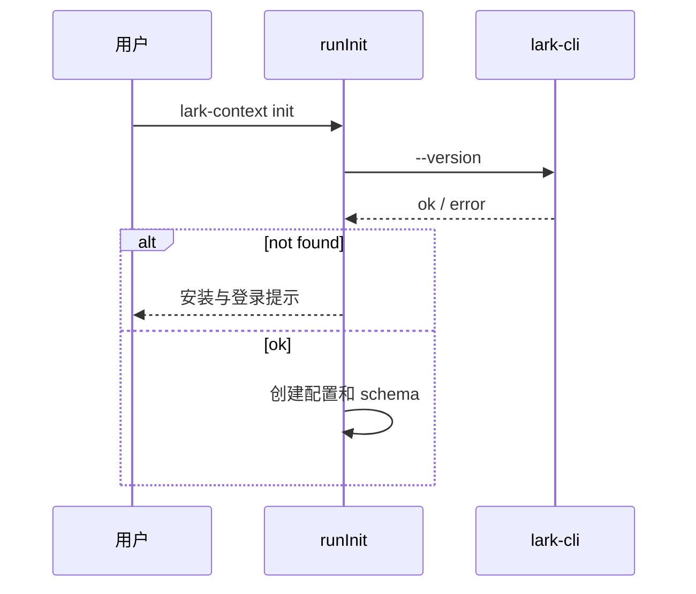
```mermaid
sequenceDiagram
  participant User as 用户
  participant Init as runInit
  participant CLI as lark-cli
  User->>Init: lark-context init
  Init->>CLI: --version
  CLI-->>Init: ok / error
  alt not found
    Init-->>User: 安装与登录提示
  else ok
    Init->>Init: 创建配置和 schema
  end
```

Sources: [src/commands/init.ts:18-34](../../../project-repos/lark-context/src/commands/init.ts#L18-L34), [src/commands/init.ts:36-53](../../../project-repos/lark-context/src/commands/init.ts#L36-L53)

<details class="source-snippets">
<summary>引用源码</summary>

<!-- source-snippets:start -->

#### `src/commands/init.ts:18-34`

```typescript
async function defaultPathCheck(): Promise<boolean> {
  try {
    await execa("lark-cli", ["--version"], { reject: true });
    return true;
  } catch {
    return false;
  }
}

export async function runInit(opts: InitOpts = {}): Promise<void> {
  if (opts.checkLarkCli !== false) {
    const check = opts._pathCheck ?? defaultPathCheck;
    if (!(await check())) {
      throw new Error(
        "`lark-cli` binary not found on PATH. Install: `bnpm i -g @larksuite/cli` (or `npm i -g @larksuite/cli`), then `lark-cli auth login`.",
      );
    }
```

#### `src/commands/init.ts:36-53`

```typescript
  const cfg = loadConfig({
    configPathOverride: opts.configPathOverride,
    memoryDirOverride: opts.memoryDirOverride,
    rawDirOverride: opts.rawDirOverride,
  });
  mkdirSync(cfg.memoryDir, { recursive: true });
  mkdirSync(cfg.rawDir, { recursive: true });
  if (cfg.configPath && !existsSync(cfg.configPath)) {
    const fresh: Config = {
      memoryDir: cfg.memoryDir,
      rawDir: cfg.rawDir,
      groups: [],
      configPath: cfg.configPath,
    };
    saveConfig(fresh);
  }
  initSchema(join(cfg.rawDir, "raw.db"));
  process.stdout.write(`Initialized lark-context at ${cfg.configPath}\n`);
```

<!-- source-snippets:end -->
</details>
## 错误传播策略

`LarkNotFoundError` 在 `pullThreads` 中会继续向上抛；`LarkCLIError` 在单个 thread 失败时只跳过该 thread，写 warning 后继续。对群级 `pull` 来说，`LarkCLIError` 会把该 chat disable，并继续处理其他群。Sources: [src/commands/pull.ts:279-285](../../../project-repos/lark-context/src/commands/pull.ts#L279-L285), [src/commands/pull.ts:391-399](../../../project-repos/lark-context/src/commands/pull.ts#L391-L399), [src/commands/pull.ts:424-437](../../../project-repos/lark-context/src/commands/pull.ts#L424-L437)

<details class="source-snippets">
<summary>引用源码</summary>

<!-- source-snippets:start -->

#### `src/commands/pull.ts:279-285`

```typescript
    } catch (err) {
      if (err instanceof LarkNotFoundError) throw err;
      if (!(err instanceof LarkCLIError)) throw err;
      process.stderr.write(
        `  ${group.alias}: thread ${threadId} failed (${err.message}); skipped\n`,
      );
    }
```

#### `src/commands/pull.ts:391-399`

```typescript
function disableChat(dbPath: string, alias: string, reason: string): void {
  const db = connect(dbPath);
  try {
    db.prepare("UPDATE chats SET enabled=0 WHERE alias=?").run(alias);
  } finally {
    db.close();
  }
  process.stderr.write(`${alias}: DISABLED (${reason})\n`);
}
```

#### `src/commands/pull.ts:424-437`

```typescript
  let grand = 0;
  for (const g of targets) {
    try {
      const n = await pullChat(dbPath, g, sinceParsed, threadOpts, now);
      process.stdout.write(`${g.alias}: pulled ${n} messages\n`);
      grand += n;
    } catch (err) {
      if (err instanceof LarkNotFoundError) throw err;
      if (err instanceof LarkCLIError) {
        disableChat(dbPath, g.alias, err.message);
        continue;
      }
      throw err;
    }
```

<!-- source-snippets:end -->
</details>
测试覆盖了群级 `LarkCLIError` 会禁用失败群但保留其他群，也覆盖了单 thread 权限错误不会禁用 chat，非 Lark 错误不会被吞掉。Sources: [test/cmd-pull.test.ts:240-265](../../../project-repos/lark-context/test/cmd-pull.test.ts#L240-L265), [test/cmd-pull.test.ts:908-963](../../../project-repos/lark-context/test/cmd-pull.test.ts#L908-L963), [test/cmd-pull.test.ts:998-1033](../../../project-repos/lark-context/test/cmd-pull.test.ts#L998-L1033)

<details class="source-snippets">
<summary>引用源码</summary>

<!-- source-snippets:start -->

#### `test/cmd-pull.test.ts:240-265`

```typescript
  it("LarkCLIError on one chat disables it; other chats still pulled", async () => {
    await setup();
    await runAdd({
      configPathOverride: configPath,
      chatId: "oc_bbb",
      alias: "bravo",
    });
    mockRunJson.mockImplementation(async (args: string[]) => {
      const chatId = args[args.indexOf("--chat-id") + 1];
      if (chatId === "oc_aaa") throw new LarkCLIError("permission denied");
      return EMPTY;
    });
    await runPull({});
    const cfg = loadConfig();
    const db = connect(join(cfg.rawDir, "raw.db"));
    try {
      const rows = db
        .prepare("SELECT alias, enabled FROM chats ORDER BY alias")
        .all() as Array<{ alias: string; enabled: number }>;
      const byAlias = Object.fromEntries(rows.map((r) => [r.alias, r.enabled]));
      expect(byAlias.alpha).toBe(0);
      expect(byAlias.bravo).toBe(1);
    } finally {
      db.close();
    }
  });
```

#### `test/cmd-pull.test.ts:908-963`

```typescript
  it("a single thread failing does not disable the chat; other threads continue", async () => {
    await setup();
    const cfg = loadConfig();
    const db = connect(join(cfg.rawDir, "raw.db"));
    try {
      db.prepare(
        "INSERT INTO messages(id,chat_alias,content_json,create_time,thread_id,is_thread_reply) " +
          "VALUES ('a','alpha','{}','2026-04-18T09:00:00','omt_good',0)," +
          "('b','alpha','{}','2026-04-18T09:05:00','omt_bad',0)," +
          "('c','alpha','{}','2026-04-18T09:10:00','omt_other',0)",
      ).run();
    } finally {
      db.close();
    }

    mockRunJson.mockImplementation(async (args: string[]) => {
      if (args.includes("+chat-messages-list")) {
        return { ok: true, data: { has_more: false, messages: [] } };
      }
      if (args.includes("+threads-messages-list")) {
        const t = args[args.indexOf("--thread") + 1];
        if (t === "omt_bad") throw new LarkCLIError("permission denied on thread");
        return {
          ok: true,
          data: {
            has_more: false,
            messages: [
              {
                message_id: `r_${t}`,
                msg_type: "text",
                content: "ok",
                create_time: "2026-04-18 10:00",
                thread_id: t,
                sender: { id: "ou_x", name: "X", sender_type: "user" },
              },
            ],
          },
        };
      }
      throw new Error(`unexpected: ${args.join(" ")}`);
    });

    await runPull({ chatAlias: "alpha", threadWindow: "365d" });

    const db2 = connect(join(cfg.rawDir, "raw.db"));
    try {
      const enabled = (db2.prepare("SELECT enabled FROM chats WHERE alias='alpha'").get() as any).enabled;
      expect(enabled).toBe(1);
      const replies = db2
        .prepare("SELECT id FROM messages WHERE is_thread_reply=1 ORDER BY id")
        .all() as Array<{ id: string }>;
      expect(replies.map((r) => r.id).sort()).toEqual(["r_omt_good", "r_omt_other"]);
    } finally {
      db2.close();
    }
  });
```

#### `test/cmd-pull.test.ts:998-1033`

```typescript
  it("non-Lark errors from thread fetch propagate (don't get swallowed)", async () => {
    await setup();
    const cfg = loadConfig();
    const db = connect(join(cfg.rawDir, "raw.db"));
    try {
      db.prepare(
        "INSERT INTO messages(id,chat_alias,content_json,create_time,thread_id,is_thread_reply) " +
          "VALUES ('x','alpha','{}','2026-04-18T09:00:00','omt_boom',0)",
      ).run();
    } finally {
      db.close();
    }

    mockRunJson.mockImplementation(async (args: string[]) => {
      if (args.includes("+chat-messages-list")) {
        return { ok: true, data: { has_more: false, messages: [] } };
      }
      if (args.includes("+threads-messages-list")) {
        throw new Error("boom");
      }
      throw new Error(`unexpected: ${args.join(" ")}`);
    });

    await expect(
      runPull({ chatAlias: "alpha", threadWindow: "365d" }),
    ).rejects.toThrow(/boom/);

    // Chat was not disabled — generic Error isn't a LarkCLIError
    const db2 = connect(join(cfg.rawDir, "raw.db"));
    try {
      const enabled = (db2.prepare("SELECT enabled FROM chats WHERE alias='alpha'").get() as any).enabled;
      expect(enabled).toBe(1);
    } finally {
      db2.close();
    }
  });
```

<!-- source-snippets:end -->
</details>
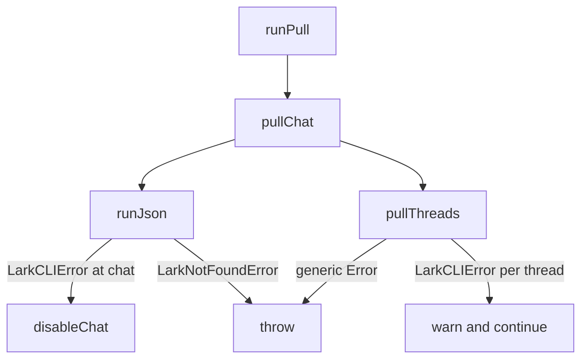
```mermaid
flowchart TD
  Pull["runPull"] --> Chat["pullChat"]
  Chat --> LarkCall["runJson"]
  LarkCall -->|LarkCLIError at chat| Disable["disableChat"]
  LarkCall -->|LarkNotFoundError| Fatal["throw"]
  Chat --> Threads["pullThreads"]
  Threads -->|LarkCLIError per thread| Skip["warn and continue"]
  Threads -->|generic Error| Fatal
```

Sources: [src/commands/pull.ts:240-290](../../../project-repos/lark-context/src/commands/pull.ts#L240-L290), [src/commands/pull.ts:391-440](../../../project-repos/lark-context/src/commands/pull.ts#L391-L440)

<details class="source-snippets">
<summary>引用源码</summary>

<!-- source-snippets:start -->

#### `src/commands/pull.ts:240-290`

```typescript
async function pullThreads(
  dbPath: string,
  group: GroupConfig,
  windowMs: number,
  now: Date,
): Promise<{ threadsScanned: number; inserted: number }> {
  const cutoff = new Date(now.getTime() - windowMs)
    .toISOString()
    .replace(/\.\d{3}Z$/, "");
  const db = connect(dbPath);
  let threadIds: string[];
  try {
    const rows = db
      .prepare(
        "SELECT DISTINCT thread_id FROM messages " +
          "WHERE chat_alias=? AND thread_id IS NOT NULL " +
          "AND is_thread_reply=0 AND create_time >= ?",
      )
      .all(group.alias, cutoff) as Array<{ thread_id: string }>;
    threadIds = rows.map((r) => r.thread_id);
  } finally {
    db.close();
  }

  let totalInserted = 0;
  for (const threadId of threadIds) {
    try {
      let pageToken: string | null = null;
      for (let page = 1; page <= MAX_PAGES; page++) {
        const { messages, nextToken, hasMore } = await pullThreadsPage(
          threadId,
          pageToken,
        );
        if (messages.length > 0) {
          totalInserted += writeThreadPage(dbPath, group.alias, threadId, messages);
        }
        if (!hasMore || !nextToken || nextToken === pageToken) break;
        pageToken = nextToken;
      }
    } catch (err) {
      if (err instanceof LarkNotFoundError) throw err;
      if (!(err instanceof LarkCLIError)) throw err;
      process.stderr.write(
        `  ${group.alias}: thread ${threadId} failed (${err.message}); skipped\n`,
      );
    }
  }
  process.stderr.write(
    `  ${group.alias}: threads +${threadIds.length} scanned, +${totalInserted} replies inserted\n`,
  );
  return { threadsScanned: threadIds.length, inserted: totalInserted };
```

#### `src/commands/pull.ts:391-440`

```typescript
function disableChat(dbPath: string, alias: string, reason: string): void {
  const db = connect(dbPath);
  try {
    db.prepare("UPDATE chats SET enabled=0 WHERE alias=?").run(alias);
  } finally {
    db.close();
  }
  process.stderr.write(`${alias}: DISABLED (${reason})\n`);
}

export async function runPull(opts: PullOpts): Promise<number> {
  const cfg: Config = loadConfig(opts);
  const dbPath = join(cfg.rawDir, "raw.db");
  ensureInitialized(dbPath);
  const sinceParsed = opts.since ? parseDuration(opts.since) : null;
  const threadWindowParsed = opts.threadWindow
    ? parseDuration(opts.threadWindow)
    : null;
  const threadOpts: ThreadOpts = {
    enabled: !opts.noThreads,
    overrideWindow: threadWindowParsed,
    firstPullFallback: sinceParsed,
  };
  const effectiveAlias =
    opts.chatAlias === "all" || !opts.chatAlias ? null : opts.chatAlias;
  const targets = cfg.groups.filter(
    (g) => g.enabled && (!effectiveAlias || g.alias === effectiveAlias),
  );
  if (effectiveAlias && targets.length === 0) {
    throw new Error(`unknown chat alias "${opts.chatAlias}"`);
  }
  const now = (opts._now ?? (() => new Date()))();

  let grand = 0;
  for (const g of targets) {
    try {
      const n = await pullChat(dbPath, g, sinceParsed, threadOpts, now);
      process.stdout.write(`${g.alias}: pulled ${n} messages\n`);
      grand += n;
    } catch (err) {
      if (err instanceof LarkNotFoundError) throw err;
      if (err instanceof LarkCLIError) {
        disableChat(dbPath, g.alias, err.message);
        continue;
      }
      throw err;
    }
  }
  process.stdout.write(`done, total=${grand}\n`);
  return grand;
```

<!-- source-snippets:end -->
</details>
## 与 skill 的契约

skill 文档要求 CLI 非零退出时透传 stderr，不编造解释；命中已知场景时才补操作建议。`pull.md` 还列出了 scope、chat_not_found、ENOENT、自动 disable 等常见错误的用户建议。Sources: [skills/lark-context/SKILL.md:69-73](../../../project-repos/lark-context/skills/lark-context/SKILL.md#L69-L73), [skills/lark-context/references/pull.md:38-46](../../../project-repos/lark-context/skills/lark-context/references/pull.md#L38-L46)

<details class="source-snippets">
<summary>引用源码</summary>

<!-- source-snippets:start -->

#### `skills/lark-context/SKILL.md:69-73`

```markdown
## 错误处理

- **CLI 非零退出**：透传 stderr 给用户，**不编造解释**。若命中已知场景（lark-cli 未装 / 未 auth / chat 被踢出群），补一句操作建议；否则就是透传
- **`references/` 文件缺失**：说明 skill 装坏了。提示用户：`npx skills update lark-context` 或重新 `npx skills add <repo> -g -y`
- **网络错 / lark-cli 超时**：不自动重试（拉消息幂等但失败通常要手动判断），交给用户处理
```

#### `skills/lark-context/references/pull.md:38-46`

```markdown
## 常见错误（透传 + 操作建议）

| CLI stderr 特征 | 原因 | 给用户的建议 |
|---|---|---|
| `permission_violations` / `required scope` | lark-cli auth 缺 scope | `lark-cli auth login --scope "im:message im:chat"`（具体 scope 按错误信息给） |
| `chat_not_found` | 用户被踢出群了 | `lark-context groups rm <alias>` 或留着忽略 |
| `ENOENT` / `lark-cli not found` | lark-cli 没装 | `bnpm i -g @larksuite/cli` |
| 某个 chat 被 CLI 自动 disable（`<alias>: DISABLED`） | 单群失败不中断全流程；其他群继续 | 看 stderr 哪个 alias 被禁，解决后 `groups add` 重加（重加会把 enabled 翻回 1） |

```

<!-- source-snippets:end -->
</details>
## 相关页面

- [CLI 命令面](cli-command-surface.md)
- [消息拉取与话题回复流水线](pull-thread-pipeline.md)
- [文档入库与 Markdown 输出](document-ingestion-and-show.md)

---

<details>
<summary>相关源文件</summary>

生成本页时使用的主要源文件：

- [src/config.ts](../../../project-repos/lark-context/src/config.ts)
- [src/db.ts](../../../project-repos/lark-context/src/db.ts)
- [src/commands/init.ts](../../../project-repos/lark-context/src/commands/init.ts)
- [src/commands/groups.ts](../../../project-repos/lark-context/src/commands/groups.ts)
- [README.md](../../../project-repos/lark-context/README.md)
- [test/config.test.ts](../../../project-repos/lark-context/test/config.test.ts)
- [test/db.test.ts](../../../project-repos/lark-context/test/db.test.ts)

</details>

# 配置与 SQLite 存储

配置层负责把用户目录、环境变量、YAML 和命令参数解析成统一 `Config`。存储层负责创建和迁移 `raw.db`，其中 `chats` 是关注群状态，`messages` 是原始聊天，`docs` 是手动入库文档，`kv` 保存 workflow 状态。Sources: [src/config.ts:18-36](../../../project-repos/lark-context/src/config.ts#L18-L36), [src/db.ts:5-41](../../../project-repos/lark-context/src/db.ts#L5-L41)

<details class="source-snippets">
<summary>引用源码</summary>

<!-- source-snippets:start -->

#### `src/config.ts:18-36`

```typescript
export interface GroupConfig {
  alias: string;
  chatId: string;
  name: string;
  enabled: boolean;
}

export interface Config {
  memoryDir: string;
  rawDir: string;
  groups: GroupConfig[];
  configPath: string | null;
}

export interface LoadConfigOptions {
  configPathOverride?: string;
  memoryDirOverride?: string;
  rawDirOverride?: string;
}
```

#### `src/db.ts:5-41`

```typescript
export const SCHEMA = `
CREATE TABLE IF NOT EXISTS chats (
  alias           TEXT PRIMARY KEY,
  chat_id         TEXT NOT NULL UNIQUE,
  name            TEXT,
  last_cursor     TEXT,
  last_pulled_at  TEXT,
  enabled         INTEGER DEFAULT 1
);
CREATE TABLE IF NOT EXISTS messages (
  id              TEXT PRIMARY KEY,
  chat_alias      TEXT NOT NULL REFERENCES chats(alias),
  sender_id       TEXT,
  sender_name     TEXT,
  msg_type        TEXT,
  content_json    TEXT NOT NULL,
  content_text    TEXT,
  reply_to        TEXT,
  create_time     TEXT NOT NULL,
  thread_id       TEXT,
  is_thread_reply INTEGER NOT NULL DEFAULT 0
);
CREATE INDEX IF NOT EXISTS idx_messages_chat_time
  ON messages(chat_alias, create_time);
CREATE TABLE IF NOT EXISTS docs (
  doc_token   TEXT PRIMARY KEY,
  url         TEXT NOT NULL,
  title       TEXT,
  content_md  TEXT NOT NULL,
  fetched_at  TEXT NOT NULL,
  source      TEXT
);
CREATE TABLE IF NOT EXISTS kv (
  key   TEXT PRIMARY KEY,
  value TEXT
);
`;
```

<!-- source-snippets:end -->
</details>
## 路径优先级

README 写明路径覆盖优先级是 CLI flag、环境变量、config.yaml、默认值。源码中的 `resolvePath` 与 `loadConfig` 实现了这个顺序，并支持 `~` 展开。Sources: [README.md:120-128](../../../project-repos/lark-context/README.md#L120-L128), [src/config.ts:38-63](../../../project-repos/lark-context/src/config.ts#L38-L63), [src/config.ts:95-133](../../../project-repos/lark-context/src/config.ts#L95-L133)

<details class="source-snippets">
<summary>引用源码</summary>

<!-- source-snippets:start -->

#### `README.md:120-128`

```markdown
## 存储位置

| 东西 | 默认路径 | 覆盖方式 |
|---|---|---|
| 配置文件 | `~/.lark-context/config.yaml` | `LARK_CONTEXT_CONFIG` 环境变量 |
| 原始数据（SQLite） | `~/.lark-context/raw.db` | `LARK_CONTEXT_RAW_DIR` |
| 记忆文件（给 Claude 读） | `~/.claude/lark-memory/` | `LARK_CONTEXT_MEMORY_DIR` |

覆盖优先级（高 → 低）：CLI flag → 环境变量 → config.yaml → 默认值。
```

#### `src/config.ts:38-63`

```typescript
function expandHome(p: string): string {
  if (p === "~") return homedir();
  if (p.startsWith("~/") || p.startsWith(`~${sep}`)) {
    return join(homedir(), p.slice(2));
  }
  return p;
}

function defaultConfigPath(): string {
  const env = process.env[ENV_CONFIG];
  if (env) return expandHome(env);
  return join(homedir(), ".lark-context", "config.yaml");
}

function resolvePath(
  flag: string | undefined,
  envVar: string,
  yamlValue: string | undefined,
  fallback: string,
): string {
  if (flag !== undefined) return expandHome(flag);
  const env = process.env[envVar];
  if (env) return expandHome(env);
  if (yamlValue) return expandHome(yamlValue);
  return expandHome(fallback);
}
```

#### `src/config.ts:95-133`

```typescript
export function loadConfig(opts: LoadConfigOptions = {}): Config {
  const configPath = opts.configPathOverride
    ? expandHome(opts.configPathOverride)
    : defaultConfigPath();
  let yamlData: Record<string, unknown> = {};
  if (existsSync(configPath)) {
    const parsed = YAML.parse(readFileSync(configPath, "utf8"));
    if (parsed && typeof parsed === "object" && !Array.isArray(parsed)) {
      yamlData = parsed as Record<string, unknown>;
    }
  }
  const pathsRaw = yamlData.paths;
  const pathsSection: Record<string, unknown> =
    pathsRaw && typeof pathsRaw === "object" && !Array.isArray(pathsRaw)
      ? (pathsRaw as Record<string, unknown>)
      : {};
  const memoryDir = resolvePath(
    opts.memoryDirOverride,
    ENV_MEMORY,
    typeof pathsSection.memory_dir === "string"
      ? pathsSection.memory_dir
      : undefined,
    "~/.claude/lark-memory",
  );
  const rawDir = resolvePath(
    opts.rawDirOverride,
    ENV_RAW,
    typeof pathsSection.raw_dir === "string"
      ? pathsSection.raw_dir
      : undefined,
    "~/.lark-context",
  );
  return {
    memoryDir,
    rawDir,
    groups: parseGroups(yamlData.groups),
    configPath,
  };
}
```

<!-- source-snippets:end -->
</details>
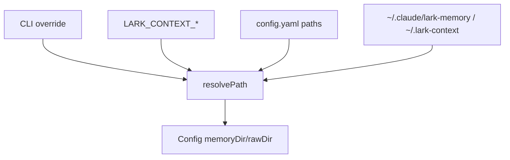
```mermaid
flowchart TD
  Flag["CLI override"] --> Resolve["resolvePath"]
  Env["LARK_CONTEXT_*"] --> Resolve
  YAML["config.yaml paths"] --> Resolve
  Default["~/.claude/lark-memory / ~/.lark-context"] --> Resolve
  Resolve --> Config["Config memoryDir/rawDir"]
```

Sources: [src/config.ts:6-8](../../../project-repos/lark-context/src/config.ts#L6-L8), [src/config.ts:46-63](../../../project-repos/lark-context/src/config.ts#L46-L63), [test/config.test.ts:44-91](../../../project-repos/lark-context/test/config.test.ts#L44-L91)

<details class="source-snippets">
<summary>引用源码</summary>

<!-- source-snippets:start -->

#### `src/config.ts:6-8`

```typescript
export const ENV_CONFIG = "LARK_CONTEXT_CONFIG";
export const ENV_MEMORY = "LARK_CONTEXT_MEMORY_DIR";
export const ENV_RAW = "LARK_CONTEXT_RAW_DIR";
```

#### `src/config.ts:46-63`

```typescript
function defaultConfigPath(): string {
  const env = process.env[ENV_CONFIG];
  if (env) return expandHome(env);
  return join(homedir(), ".lark-context", "config.yaml");
}

function resolvePath(
  flag: string | undefined,
  envVar: string,
  yamlValue: string | undefined,
  fallback: string,
): string {
  if (flag !== undefined) return expandHome(flag);
  const env = process.env[envVar];
  if (env) return expandHome(env);
  if (yamlValue) return expandHome(yamlValue);
  return expandHome(fallback);
}
```

#### `test/config.test.ts:44-91`

```typescript
  it("returns defaults when file missing", () => {
    const cfg = loadConfig();
    expect(cfg.memoryDir).toBe(join(tmpHome, ".claude", "lark-memory"));
    expect(cfg.rawDir).toBe(join(tmpHome, ".lark-context"));
    expect(cfg.groups).toEqual([]);
  });

  it("yaml paths + groups are parsed", () => {
    writeYaml(join(tmpHome, ".lark-context", "config.yaml"), {
      paths: {
        memory_dir: join(tmpHome, "mem"),
        raw_dir: join(tmpHome, "raw"),
      },
      groups: [
        {
          alias: "alpha",
          chat_id: "oc_aaa",
          name: "Alpha",
          enabled: true,
        },
      ],
    });
    const cfg = loadConfig();
    expect(cfg.memoryDir).toBe(join(tmpHome, "mem"));
    expect(cfg.rawDir).toBe(join(tmpHome, "raw"));
    expect(cfg.groups).toEqual<GroupConfig[]>([
      { alias: "alpha", chatId: "oc_aaa", name: "Alpha", enabled: true },
    ]);
  });

  it("env var beats yaml", () => {
    writeYaml(join(tmpHome, ".lark-context", "config.yaml"), {
      paths: {
        memory_dir: join(tmpHome, "mem"),
        raw_dir: join(tmpHome, "raw"),
      },
    });
    process.env.LARK_CONTEXT_MEMORY_DIR = join(tmpHome, "env-mem");
    const cfg = loadConfig();
    expect(cfg.memoryDir).toBe(join(tmpHome, "env-mem"));
    expect(cfg.rawDir).toBe(join(tmpHome, "raw"));
  });

  it("flag beats env", () => {
    process.env.LARK_CONTEXT_MEMORY_DIR = join(tmpHome, "env-mem");
    const cfg = loadConfig({ memoryDirOverride: join(tmpHome, "flag-mem") });
    expect(cfg.memoryDir).toBe(join(tmpHome, "flag-mem"));
  });
```

<!-- source-snippets:end -->
</details>
## YAML 配置模型

`groups` 在 YAML 中使用 `chat_id`，进入 TypeScript 后映射为 `chatId`。`parseGroups` 要求 `groups` 必须是列表，每个 entry 至少有 `alias` 和 `chat_id`，并拒绝重复 alias；`enabled` 缺省为 `true`。Sources: [src/config.ts:65-93](../../../project-repos/lark-context/src/config.ts#L65-L93), [test/config.test.ts:51-72](../../../project-repos/lark-context/test/config.test.ts#L51-L72), [test/config.test.ts:140-148](../../../project-repos/lark-context/test/config.test.ts#L140-L148)

<details class="source-snippets">
<summary>引用源码</summary>

<!-- source-snippets:start -->

#### `src/config.ts:65-93`

```typescript
function parseGroups(raw: unknown): GroupConfig[] {
  if (raw === null || raw === undefined) return [];
  if (!Array.isArray(raw)) throw new Error("'groups' must be a list");
  const seen = new Set<string>();
  const out: GroupConfig[] = [];
  for (const entry of raw) {
    if (
      !entry ||
      typeof entry !== "object" ||
      !("alias" in entry) ||
      !("chat_id" in entry)
    ) {
      throw new Error(`bad group entry: ${JSON.stringify(entry)}`);
    }
    const e = entry as Record<string, unknown>;
    const alias = String(e.alias);
    if (seen.has(alias)) {
      throw new Error(`duplicate alias "${alias}" in groups`);
    }
    seen.add(alias);
    out.push({
      alias,
      chatId: String(e.chat_id),
      name: typeof e.name === "string" ? e.name : "",
      enabled: e.enabled === undefined ? true : Boolean(e.enabled),
    });
  }
  return out;
}
```

#### `test/config.test.ts:51-72`

```typescript
  it("yaml paths + groups are parsed", () => {
    writeYaml(join(tmpHome, ".lark-context", "config.yaml"), {
      paths: {
        memory_dir: join(tmpHome, "mem"),
        raw_dir: join(tmpHome, "raw"),
      },
      groups: [
        {
          alias: "alpha",
          chat_id: "oc_aaa",
          name: "Alpha",
          enabled: true,
        },
      ],
    });
    const cfg = loadConfig();
    expect(cfg.memoryDir).toBe(join(tmpHome, "mem"));
    expect(cfg.rawDir).toBe(join(tmpHome, "raw"));
    expect(cfg.groups).toEqual<GroupConfig[]>([
      { alias: "alpha", chatId: "oc_aaa", name: "Alpha", enabled: true },
    ]);
  });
```

#### `test/config.test.ts:140-148`

```typescript
  it("rejects duplicate alias", () => {
    writeYaml(join(tmpHome, ".lark-context", "config.yaml"), {
      groups: [
        { alias: "a", chat_id: "oc_1" },
        { alias: "a", chat_id: "oc_2" },
      ],
    });
    expect(() => loadConfig()).toThrow(/duplicate alias/);
  });
```

<!-- source-snippets:end -->
</details>
保存配置时，`saveConfig` 会把 HOME 下路径收缩回 `~/...`，并把 `chatId` 写回 `chat_id`。测试覆盖了 HOME 内路径收缩和 HOME 外绝对路径保留。Sources: [src/config.ts:135-164](../../../project-repos/lark-context/src/config.ts#L135-L164), [test/config.test.ts:93-138](../../../project-repos/lark-context/test/config.test.ts#L93-L138)

<details class="source-snippets">
<summary>引用源码</summary>

<!-- source-snippets:start -->

#### `src/config.ts:135-164`

```typescript
function contractHome(p: string): string {
  const home = homedir();
  if (p === home) return "~";
  if (!isAbsolute(p)) return p;
  const rel = relative(home, p);
  // If relative escapes home (starts with ..) or is empty/absolute, leave unchanged.
  if (!rel || rel.startsWith("..") || isAbsolute(rel)) return p;
  // Normalize separators to forward slash for portability in yaml.
  const normalized = rel.split(sep).join("/");
  return `~/${normalized}`;
}

export function saveConfig(cfg: Config): void {
  if (!cfg.configPath) {
    throw new Error("Config.configPath required for saveConfig");
  }
  mkdirSync(dirname(cfg.configPath), { recursive: true });
  const data = {
    paths: {
      memory_dir: contractHome(cfg.memoryDir),
      raw_dir: contractHome(cfg.rawDir),
    },
    groups: cfg.groups.map((g) => ({
      alias: g.alias,
      chat_id: g.chatId,
      name: g.name,
      enabled: g.enabled,
    })),
  };
  writeFileSync(cfg.configPath, YAML.stringify(data));
```

#### `test/config.test.ts:93-138`

```typescript
  it("save/load round-trip", () => {
    const cfg: Config = {
      memoryDir: join(tmpHome, "mem"),
      rawDir: join(tmpHome, "raw"),
      groups: [{ alias: "a", chatId: "oc_1", name: "A", enabled: true }],
      configPath: join(tmpHome, ".lark-context", "config.yaml"),
    };
    saveConfig(cfg);
    const reloaded = loadConfig();
    expect(reloaded.groups[0].alias).toBe("a");
    expect(reloaded.memoryDir).toBe(join(tmpHome, "mem"));
  });

  it("saves ~/path for dirs under HOME", () => {
    const cfg: Config = {
      memoryDir: join(tmpHome, ".claude", "lark-memory"),
      rawDir: join(tmpHome, ".lark-context"),
      groups: [],
      configPath: join(tmpHome, ".lark-context", "config.yaml"),
    };
    saveConfig(cfg);
    const text = readFileSync(
      join(tmpHome, ".lark-context", "config.yaml"),
      "utf8",
    );
    expect(text).toContain("memory_dir: ~/.claude/lark-memory");
    expect(text).toContain("raw_dir: ~/.lark-context");
    expect(text).not.toContain(tmpHome);
  });

  it("keeps /var/... absolute", () => {
    const outOfHome = "/var/fake_mem";
    const cfg: Config = {
      memoryDir: outOfHome,
      rawDir: outOfHome,
      groups: [],
      configPath: join(tmpHome, ".lark-context", "config.yaml"),
    };
    saveConfig(cfg);
    const text = readFileSync(
      join(tmpHome, ".lark-context", "config.yaml"),
      "utf8",
    );
    expect(text).toContain("/var/fake_mem");
    expect(text).not.toContain("~");
  });
```

<!-- source-snippets:end -->
</details>
## SQLite schema

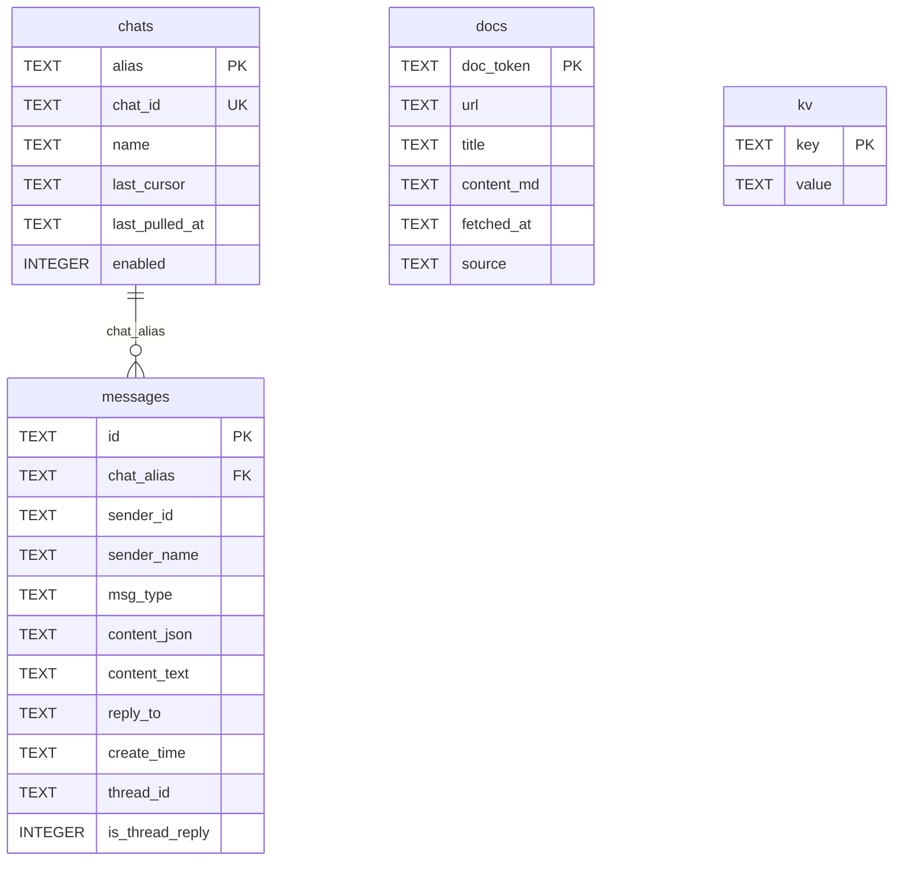
```mermaid
erDiagram
  chats {
    TEXT alias PK
    TEXT chat_id UK
    TEXT name
    TEXT last_cursor
    TEXT last_pulled_at
    INTEGER enabled
  }
  messages {
    TEXT id PK
    TEXT chat_alias FK
    TEXT sender_id
    TEXT sender_name
    TEXT msg_type
    TEXT content_json
    TEXT content_text
    TEXT reply_to
    TEXT create_time
    TEXT thread_id
    INTEGER is_thread_reply
  }
  docs {
    TEXT doc_token PK
    TEXT url
    TEXT title
    TEXT content_md
    TEXT fetched_at
    TEXT source
  }
  kv {
    TEXT key PK
    TEXT value
  }
  chats ||--o{ messages : chat_alias
```

Sources: [src/db.ts:5-41](../../../project-repos/lark-context/src/db.ts#L5-L41)

<details class="source-snippets">
<summary>引用源码</summary>

<!-- source-snippets:start -->

#### `src/db.ts:5-41`

```typescript
export const SCHEMA = `
CREATE TABLE IF NOT EXISTS chats (
  alias           TEXT PRIMARY KEY,
  chat_id         TEXT NOT NULL UNIQUE,
  name            TEXT,
  last_cursor     TEXT,
  last_pulled_at  TEXT,
  enabled         INTEGER DEFAULT 1
);
CREATE TABLE IF NOT EXISTS messages (
  id              TEXT PRIMARY KEY,
  chat_alias      TEXT NOT NULL REFERENCES chats(alias),
  sender_id       TEXT,
  sender_name     TEXT,
  msg_type        TEXT,
  content_json    TEXT NOT NULL,
  content_text    TEXT,
  reply_to        TEXT,
  create_time     TEXT NOT NULL,
  thread_id       TEXT,
  is_thread_reply INTEGER NOT NULL DEFAULT 0
);
CREATE INDEX IF NOT EXISTS idx_messages_chat_time
  ON messages(chat_alias, create_time);
CREATE TABLE IF NOT EXISTS docs (
  doc_token   TEXT PRIMARY KEY,
  url         TEXT NOT NULL,
  title       TEXT,
  content_md  TEXT NOT NULL,
  fetched_at  TEXT NOT NULL,
  source      TEXT
);
CREATE TABLE IF NOT EXISTS kv (
  key   TEXT PRIMARY KEY,
  value TEXT
);
`;
```

<!-- source-snippets:end -->
</details>
连接数据库时会创建父目录、开启外键和 WAL；`initSchema` 执行 schema 后还会运行 `migrateMessagesColumns`。Sources: [src/db.ts:43-59](../../../project-repos/lark-context/src/db.ts#L43-L59)

<details class="source-snippets">
<summary>引用源码</summary>

<!-- source-snippets:start -->

#### `src/db.ts:43-59`

```typescript
export function connect(dbPath: string): Database.Database {
  mkdirSync(dirname(dbPath), { recursive: true });
  const db = new Database(dbPath);
  db.pragma("foreign_keys = ON");
  db.pragma("journal_mode = WAL");
  return db;
}

export function initSchema(dbPath: string): void {
  const db = connect(dbPath);
  try {
    db.exec(SCHEMA);
    migrateMessagesColumns(db);
  } finally {
    db.close();
  }
}
```

<!-- source-snippets:end -->
</details>
## thread 字段迁移

`migrateMessagesColumns` 会检查 `messages` 表字段，补 `thread_id` 和 `is_thread_reply`；对旧数据，它从 `content_json` 的 `$.thread_id` 回填缺失的 `thread_id`，然后创建 `(chat_alias, thread_id, create_time)` 索引。Sources: [src/db.ts:61-91](../../../project-repos/lark-context/src/db.ts#L61-L91)

<details class="source-snippets">
<summary>引用源码</summary>

<!-- source-snippets:start -->

#### `src/db.ts:61-91`

```typescript
function migrateMessagesColumns(db: Database.Database): void {
  const cols = db
    .prepare("PRAGMA table_info(messages)")
    .all() as Array<{ name: string }>;
  const have = new Set(cols.map((c) => c.name));
  if (!have.has("thread_id")) {
    db.exec("ALTER TABLE messages ADD COLUMN thread_id TEXT");
  }
  if (!have.has("is_thread_reply")) {
    db.exec(
      "ALTER TABLE messages ADD COLUMN is_thread_reply INTEGER NOT NULL DEFAULT 0",
    );
  }
  // Backfill thread_id from the stored raw JSON for rows that pre-date
  // the thread_id column. Safe to run repeatedly — only touches rows
  // where thread_id is still NULL.
  db.exec(
    "UPDATE messages " +
      "SET thread_id = json_extract(content_json, '$.thread_id') " +
      "WHERE thread_id IS NULL " +
      "AND json_valid(content_json) " +
      "AND json_extract(content_json, '$.thread_id') IS NOT NULL",
  );
  // Cannot live in SCHEMA: legacy messages tables lack thread_id, so the CREATE
  // INDEX would fail there even with IF NOT EXISTS (that clause checks the
  // index name, not column validity).
  db.exec(
    "CREATE INDEX IF NOT EXISTS idx_messages_chat_thread " +
      "ON messages(chat_alias, thread_id, create_time)",
  );
}
```

<!-- source-snippets:end -->
</details>
测试覆盖了新 schema 中字段和索引存在、旧 schema 原地迁移、JSON 回填、坏 JSON 不崩溃以及重复迁移幂等。Sources: [test/db.test.ts:48-80](../../../project-repos/lark-context/test/db.test.ts#L48-L80), [test/db.test.ts:82-145](../../../project-repos/lark-context/test/db.test.ts#L82-L145), [test/db.test.ts:147-206](../../../project-repos/lark-context/test/db.test.ts#L147-L206)

<details class="source-snippets">
<summary>引用源码</summary>

<!-- source-snippets:start -->

#### `test/db.test.ts:48-80`

```typescript
  it("messages table has thread_id and is_thread_reply columns", () => {
    const dbPath = join(tmp, "raw.db");
    initSchema(dbPath);
    const db = connect(dbPath);
    try {
      const cols = db
        .prepare("PRAGMA table_info(messages)")
        .all() as Array<{ name: string; type: string; dflt_value: unknown }>;
      const byName = Object.fromEntries(cols.map((c) => [c.name, c]));
      expect(byName.thread_id).toBeDefined();
      expect(byName.thread_id.type).toBe("TEXT");
      expect(byName.is_thread_reply).toBeDefined();
      expect(byName.is_thread_reply.type).toBe("INTEGER");
    } finally {
      db.close();
    }
  });

  it("creates idx_messages_chat_thread index", () => {
    const dbPath = join(tmp, "raw.db");
    initSchema(dbPath);
    const db = connect(dbPath);
    try {
      const idx = db
        .prepare(
          "SELECT name FROM sqlite_master WHERE type='index' AND name='idx_messages_chat_thread'",
        )
        .get() as { name: string } | undefined;
      expect(idx?.name).toBe("idx_messages_chat_thread");
    } finally {
      db.close();
    }
  });
```

#### `test/db.test.ts:82-145`

```typescript
  it("migrates legacy schema (no thread_id column) in place", () => {
    const dbPath = join(tmp, "raw.db");
    const db = connect(dbPath);
    try {
      db.exec(`
        CREATE TABLE chats (
          alias TEXT PRIMARY KEY, chat_id TEXT NOT NULL UNIQUE, name TEXT,
          last_cursor TEXT, last_pulled_at TEXT, enabled INTEGER DEFAULT 1
        );
        CREATE TABLE messages (
          id TEXT PRIMARY KEY,
          chat_alias TEXT NOT NULL REFERENCES chats(alias),
          sender_id TEXT, sender_name TEXT, msg_type TEXT,
          content_json TEXT NOT NULL, content_text TEXT,
          reply_to TEXT, create_time TEXT NOT NULL
        );
        INSERT INTO chats(alias, chat_id, name) VALUES ('alpha', 'oc_a', 'Alpha');
        INSERT INTO messages(id, chat_alias, content_json, create_time)
          VALUES ('legacy1', 'alpha', '{}', '2026-01-01T00:00:00');
      `);
    } finally {
      db.close();
    }

    initSchema(dbPath);

    const db2 = connect(dbPath);
    try {
      const cols = db2
        .prepare("PRAGMA table_info(messages)")
        .all() as Array<{ name: string }>;
      expect(cols.map((c) => c.name)).toEqual(
        expect.arrayContaining(["thread_id", "is_thread_reply"]),
      );
      const row = db2
        .prepare(
          "SELECT id, thread_id, is_thread_reply FROM messages WHERE id='legacy1'",
        )
        .get() as { id: string; thread_id: string | null; is_thread_reply: number };
      expect(row.id).toBe("legacy1");
      expect(row.thread_id).toBeNull();
      expect(row.is_thread_reply).toBe(0);
    } finally {
      db2.close();
    }

    // re-run initSchema on already-migrated DB must be idempotent
    expect(() => initSchema(dbPath)).not.toThrow();
    const db3 = connect(dbPath);
    try {
      const cols = db3
        .prepare("PRAGMA table_info(messages)")
        .all() as Array<{ name: string }>;
      expect(cols.map((c) => c.name)).toEqual(
        expect.arrayContaining(["thread_id", "is_thread_reply"]),
      );
      const count = (
        db3.prepare("SELECT COUNT(*) as n FROM messages").get() as { n: number }
      ).n;
      expect(count).toBe(1);
    } finally {
      db3.close();
    }
  });
```

#### `test/db.test.ts:147-206`

```typescript
  it("backfills thread_id from content_json during migration", () => {
    const dbPath = join(tmp, "raw.db");
    const db = connect(dbPath);
    try {
      db.exec(`
        CREATE TABLE chats (
          alias TEXT PRIMARY KEY, chat_id TEXT NOT NULL UNIQUE, name TEXT,
          last_cursor TEXT, last_pulled_at TEXT, enabled INTEGER DEFAULT 1
        );
        CREATE TABLE messages (
          id TEXT PRIMARY KEY,
          chat_alias TEXT NOT NULL REFERENCES chats(alias),
          sender_id TEXT, sender_name TEXT, msg_type TEXT,
          content_json TEXT NOT NULL, content_text TEXT,
          reply_to TEXT, create_time TEXT NOT NULL
        );
        INSERT INTO chats(alias, chat_id) VALUES ('alpha', 'oc_a');
      `);
      // Row with thread_id in JSON
      db.prepare(
        "INSERT INTO messages(id, chat_alias, content_json, create_time) VALUES (?, ?, ?, ?)",
      ).run(
        "m_with_thread",
        "alpha",
        JSON.stringify({ message_id: "m_with_thread", thread_id: "omt_abc" }),
        "2026-04-18T09:00:00",
      );
      // Row without thread_id in JSON
      db.prepare(
        "INSERT INTO messages(id, chat_alias, content_json, create_time) VALUES (?, ?, ?, ?)",
      ).run(
        "m_no_thread",
        "alpha",
        JSON.stringify({ message_id: "m_no_thread" }),
        "2026-04-18T09:05:00",
      );
      // Row with malformed JSON
      db.prepare(
        "INSERT INTO messages(id, chat_alias, content_json, create_time) VALUES (?, ?, ?, ?)",
      ).run("m_bad_json", "alpha", "not-json", "2026-04-18T09:10:00");
    } finally {
      db.close();
    }

    initSchema(dbPath);

    const db2 = connect(dbPath);
    try {
      const rows = db2
        .prepare("SELECT id, thread_id FROM messages ORDER BY id")
        .all() as Array<{ id: string; thread_id: string | null }>;
      expect(rows).toEqual([
        { id: "m_bad_json", thread_id: null },
        { id: "m_no_thread", thread_id: null },
        { id: "m_with_thread", thread_id: "omt_abc" },
      ]);
    } finally {
      db2.close();
    }
  });
```

<!-- source-snippets:end -->
</details>
## 白名单与 DB 同步

`groups add` 同时写 YAML 和 `chats` 表；`groups rm` 从 YAML 中移除，并把 DB 中的 chat 设为 disabled。这样历史消息仍保留，但后续 `pull`/`show` 默认不会遍历 disabled 群。Sources: [src/commands/groups.ts:31-58](../../../project-repos/lark-context/src/commands/groups.ts#L31-L58), [src/commands/groups.ts:73-90](../../../project-repos/lark-context/src/commands/groups.ts#L73-L90), [test/cmd-groups.test.ts:43-81](../../../project-repos/lark-context/test/cmd-groups.test.ts#L43-L81), [test/cmd-groups.test.ts:103-123](../../../project-repos/lark-context/test/cmd-groups.test.ts#L103-L123)

<details class="source-snippets">
<summary>引用源码</summary>

<!-- source-snippets:start -->

#### `src/commands/groups.ts:31-58`

```typescript
export async function runAdd(opts: AddOpts): Promise<void> {
  const cfg = loadConfig(opts);
  const dbPath = join(cfg.rawDir, "raw.db");
  ensureInitialized(dbPath);
  const name = opts.name ?? "";
  const resolvedAlias = opts.alias ?? slugify(name || opts.chatId);
  if (cfg.groups.some((g) => g.alias === resolvedAlias)) {
    throw new Error(`alias "${resolvedAlias}" already in use`);
  }
  const newGroup: GroupConfig = {
    alias: resolvedAlias,
    chatId: opts.chatId,
    name,
    enabled: true,
  };
  const next: Config = { ...cfg, groups: [...cfg.groups, newGroup] };
  saveConfig(next);
  const db = connect(dbPath);
  try {
    db.prepare(
      "INSERT INTO chats(alias, chat_id, name, enabled) VALUES (?, ?, ?, 1) " +
        "ON CONFLICT(alias) DO UPDATE SET chat_id=excluded.chat_id, name=excluded.name, enabled=1",
    ).run(resolvedAlias, opts.chatId, name);
  } finally {
    db.close();
  }
  process.stdout.write(`added ${resolvedAlias} -> ${opts.chatId}\n`);
}
```

#### `src/commands/groups.ts:73-90`

```typescript
export async function runRm(opts: RmOpts): Promise<void> {
  const cfg = loadConfig(opts);
  const dbPath = join(cfg.rawDir, "raw.db");
  ensureInitialized(dbPath);
  const remaining = cfg.groups.filter((g) => g.alias !== opts.alias);
  if (remaining.length === cfg.groups.length) {
    throw new Error(`alias "${opts.alias}" not in whitelist`);
  }
  const next: Config = { ...cfg, groups: remaining };
  saveConfig(next);
  const db = connect(dbPath);
  try {
    db.prepare("UPDATE chats SET enabled=0 WHERE alias=?").run(opts.alias);
  } finally {
    db.close();
  }
  process.stdout.write(`removed ${opts.alias}\n`);
}
```

#### `test/cmd-groups.test.ts:43-81`

```typescript
describe("groups add", () => {
  it("writes yaml + upserts chats row", async () => {
    await freshInit();
    await runAdd({ chatId: "oc_aaa", alias: "alpha", name: "Alpha" });
    const cfg = loadConfig();
    expect(cfg.groups.map((g) => g.alias)).toEqual(["alpha"]);
    expect(cfg.groups[0].chatId).toBe("oc_aaa");
    const db = connect(join(cfg.rawDir, "raw.db"));
    try {
      const rows = db.prepare("SELECT alias, chat_id, enabled FROM chats").all();
      expect(rows).toEqual([{ alias: "alpha", chat_id: "oc_aaa", enabled: 1 }]);
    } finally {
      db.close();
    }
  });

  it("rejects duplicate alias", async () => {
    await freshInit();
    await runAdd({ chatId: "oc_aaa", alias: "alpha" });
    await expect(
      runAdd({ chatId: "oc_bbb", alias: "alpha" }),
    ).rejects.toThrow(/alpha/);
  });

  it("auto-slugifies alias from name when --alias absent", async () => {
    await freshInit();
    await runAdd({ chatId: "oc_x", name: "Project Alpha 大群" });
    const cfg = loadConfig();
    // Only [a-z0-9] survive; 大群 collapses with other non-ascii to _
    // Expected something like "project_alpha" (trailing _ stripped).
    expect(cfg.groups[0].alias).toMatch(/^project_alpha/);
  });

  it("errors before init with friendly 'run init' hint", async () => {
    // Don't call freshInit — db doesn't exist
    await expect(
      runAdd({ chatId: "oc_x", alias: "x" }),
    ).rejects.toThrow(/init/i);
  });
```

#### `test/cmd-groups.test.ts:103-123`

```typescript
describe("groups rm", () => {
  it("removes from config and sets enabled=0 in db", async () => {
    await freshInit();
    await runAdd({ chatId: "oc_aaa", alias: "alpha" });
    await runRm({ alias: "alpha" });
    const cfg = loadConfig();
    expect(cfg.groups).toEqual([]);
    const db = connect(join(cfg.rawDir, "raw.db"));
    try {
      const rows = db.prepare("SELECT alias, enabled FROM chats").all();
      expect(rows).toEqual([{ alias: "alpha", enabled: 0 }]);
    } finally {
      db.close();
    }
  });

  it("errors when alias not in whitelist", async () => {
    await freshInit();
    await expect(runRm({ alias: "ghost" })).rejects.toThrow(/not in whitelist/);
  });
});
```

<!-- source-snippets:end -->
</details>
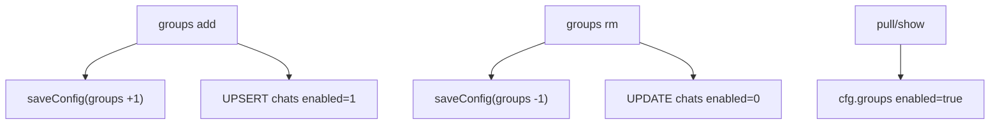
```mermaid
flowchart TD
  Add["groups add"] --> Save["saveConfig(groups +1)"]
  Add --> Upsert["UPSERT chats enabled=1"]
  Rm["groups rm"] --> Save2["saveConfig(groups -1)"]
  Rm --> Disable["UPDATE chats enabled=0"]
  Pull["pull/show"] --> Filter["cfg.groups enabled=true"]
```

Sources: [src/commands/groups.ts:31-90](../../../project-repos/lark-context/src/commands/groups.ts#L31-L90), [src/commands/pull.ts:414-418](../../../project-repos/lark-context/src/commands/pull.ts#L414-L418), [src/commands/show.ts:38-48](../../../project-repos/lark-context/src/commands/show.ts#L38-L48)

<details class="source-snippets">
<summary>引用源码</summary>

<!-- source-snippets:start -->

#### `src/commands/groups.ts:31-90`

```typescript
export async function runAdd(opts: AddOpts): Promise<void> {
  const cfg = loadConfig(opts);
  const dbPath = join(cfg.rawDir, "raw.db");
  ensureInitialized(dbPath);
  const name = opts.name ?? "";
  const resolvedAlias = opts.alias ?? slugify(name || opts.chatId);
  if (cfg.groups.some((g) => g.alias === resolvedAlias)) {
    throw new Error(`alias "${resolvedAlias}" already in use`);
  }
  const newGroup: GroupConfig = {
    alias: resolvedAlias,
    chatId: opts.chatId,
    name,
    enabled: true,
  };
  const next: Config = { ...cfg, groups: [...cfg.groups, newGroup] };
  saveConfig(next);
  const db = connect(dbPath);
  try {
    db.prepare(
      "INSERT INTO chats(alias, chat_id, name, enabled) VALUES (?, ?, ?, 1) " +
        "ON CONFLICT(alias) DO UPDATE SET chat_id=excluded.chat_id, name=excluded.name, enabled=1",
    ).run(resolvedAlias, opts.chatId, name);
  } finally {
    db.close();
  }
  process.stdout.write(`added ${resolvedAlias} -> ${opts.chatId}\n`);
}

export async function runList(opts: ListOpts = {}): Promise<void> {
  const cfg = loadConfig(opts);
  const write = opts.write ?? ((s: string) => process.stdout.write(s));
  if (cfg.groups.length === 0) {
    write("(no groups)\n");
    return;
  }
  write(`${"alias".padEnd(20)} ${"chat_id".padEnd(22)} 名称\n`);
  for (const g of cfg.groups) {
    write(`${g.alias.padEnd(20)} ${g.chatId.padEnd(22)} ${g.name}\n`);
  }
}

export async function runRm(opts: RmOpts): Promise<void> {
  const cfg = loadConfig(opts);
  const dbPath = join(cfg.rawDir, "raw.db");
  ensureInitialized(dbPath);
  const remaining = cfg.groups.filter((g) => g.alias !== opts.alias);
  if (remaining.length === cfg.groups.length) {
    throw new Error(`alias "${opts.alias}" not in whitelist`);
  }
  const next: Config = { ...cfg, groups: remaining };
  saveConfig(next);
  const db = connect(dbPath);
  try {
    db.prepare("UPDATE chats SET enabled=0 WHERE alias=?").run(opts.alias);
  } finally {
    db.close();
  }
  process.stdout.write(`removed ${opts.alias}\n`);
}
```

#### `src/commands/pull.ts:414-418`

```typescript
  const effectiveAlias =
    opts.chatAlias === "all" || !opts.chatAlias ? null : opts.chatAlias;
  const targets = cfg.groups.filter(
    (g) => g.enabled && (!effectiveAlias || g.alias === effectiveAlias),
  );
```

#### `src/commands/show.ts:38-48`

```typescript
  const effectiveAlias =
    opts.chatAlias === "all" || !opts.chatAlias ? null : opts.chatAlias;
  const targets = cfg.groups.filter(
    (g) => g.enabled && (!effectiveAlias || g.alias === effectiveAlias),
  );
  if (effectiveAlias && targets.length === 0) {
    throw new Error(`unknown chat alias "${opts.chatAlias}"`);
  }
  if (targets.length === 0) {
    throw new Error("no whitelisted chats");
  }
```

<!-- source-snippets:end -->
</details>
## KV 用途

源码当前提供 `kvSet` 和 `kvGet`，skill 的 digest workflow 用 `kv.last_digest_at` 作为上次沉淀时间戳。也就是说 KV 是 CLI 与 workflow 之间的轻量状态面。Sources: [src/db.ts:93-114](../../../project-repos/lark-context/src/db.ts#L93-L114), [skills/lark-context/references/digest.md:14-29](../../../project-repos/lark-context/skills/lark-context/references/digest.md#L14-L29), [skills/lark-context/references/digest.md:93-97](../../../project-repos/lark-context/skills/lark-context/references/digest.md#L93-L97)

<details class="source-snippets">
<summary>引用源码</summary>

<!-- source-snippets:start -->

#### `src/db.ts:93-114`

```typescript
export function kvSet(dbPath: string, key: string, value: string): void {
  const db = connect(dbPath);
  try {
    db.prepare(
      "INSERT INTO kv(key, value) VALUES (?, ?) ON CONFLICT(key) DO UPDATE SET value=excluded.value",
    ).run(key, value);
  } finally {
    db.close();
  }
}

export function kvGet(dbPath: string, key: string): string | undefined {
  const db = connect(dbPath);
  try {
    const row = db.prepare("SELECT value FROM kv WHERE key = ?").get(key) as
      | { value: string }
      | undefined;
    return row?.value;
  } finally {
    db.close();
  }
}
```

#### `skills/lark-context/references/digest.md:14-29`

````markdown
## Step 1 — 决定时间窗口

读上次沉淀时间戳：

```bash
sqlite3 ~/.lark-context/raw.db "SELECT value FROM kv WHERE key='last_digest_at'"
```

根据结果和用户输入选窗口：

| 情况 | 窗口 |
|---|---|
| `last_digest_at` 有值且用户没说窗口 | `--since 24h` |
| `last_digest_at` 为空 + 用户点名了特定群 | `--since 90d`（首次沉淀该群，按 3 个月兜底） |
| 用户明确说了"最近 3 天 / 一周 / 12 小时" | 按用户说的 |

````

#### `skills/lark-context/references/digest.md:93-97`

````markdown
## Step 7 — 写时间戳

```bash
sqlite3 ~/.lark-context/raw.db "INSERT INTO kv(key,value) VALUES('last_digest_at', datetime('now')) ON CONFLICT(key) DO UPDATE SET value=excluded.value"
```
````

<!-- source-snippets:end -->
</details>
## 相关页面

- [系统架构](system-architecture.md)
- [消息拉取与话题回复流水线](pull-thread-pipeline.md)
- [Skill 与记忆工作流](skill-memory-workflows.md)

---

<details>
<summary>相关源文件</summary>

生成本页时使用的主要源文件：

- [src/commands/pull.ts](../../../project-repos/lark-context/src/commands/pull.ts)
- [src/db.ts](../../../project-repos/lark-context/src/db.ts)
- [src/durations.ts](../../../project-repos/lark-context/src/durations.ts)
- [README.md](../../../project-repos/lark-context/README.md)
- [skills/lark-context/references/pull.md](../../../project-repos/lark-context/skills/lark-context/references/pull.md)
- [test/cmd-pull.test.ts](../../../project-repos/lark-context/test/cmd-pull.test.ts)

</details>

# 消息拉取与话题回复流水线

`pull` 是仓库最核心的数据入口。它按群遍历白名单，通过 `lark-cli im +chat-messages-list` 拉顶层消息，写入 SQLite，再根据 `thread_id` 刷新话题回复。实现重点是增量游标、分页上限、幂等 upsert、回复补齐和单群失败隔离。Sources: [src/commands/pull.ts:13-22](../../../project-repos/lark-context/src/commands/pull.ts#L13-L22), [src/commands/pull.ts:401-440](../../../project-repos/lark-context/src/commands/pull.ts#L401-L440)

<details class="source-snippets">
<summary>引用源码</summary>

<!-- source-snippets:start -->

#### `src/commands/pull.ts:13-22`

```typescript
export const MAX_PAGES = 200;

export interface PullOpts extends LoadConfigOptions {
  chatAlias?: string;
  since?: string;
  threadWindow?: string;
  noThreads?: boolean;
  /** Used by tests to stub clock. */
  _now?: () => Date;
}
```

#### `src/commands/pull.ts:401-440`

```typescript
export async function runPull(opts: PullOpts): Promise<number> {
  const cfg: Config = loadConfig(opts);
  const dbPath = join(cfg.rawDir, "raw.db");
  ensureInitialized(dbPath);
  const sinceParsed = opts.since ? parseDuration(opts.since) : null;
  const threadWindowParsed = opts.threadWindow
    ? parseDuration(opts.threadWindow)
    : null;
  const threadOpts: ThreadOpts = {
    enabled: !opts.noThreads,
    overrideWindow: threadWindowParsed,
    firstPullFallback: sinceParsed,
  };
  const effectiveAlias =
    opts.chatAlias === "all" || !opts.chatAlias ? null : opts.chatAlias;
  const targets = cfg.groups.filter(
    (g) => g.enabled && (!effectiveAlias || g.alias === effectiveAlias),
  );
  if (effectiveAlias && targets.length === 0) {
    throw new Error(`unknown chat alias "${opts.chatAlias}"`);
  }
  const now = (opts._now ?? (() => new Date()))();

  let grand = 0;
  for (const g of targets) {
    try {
      const n = await pullChat(dbPath, g, sinceParsed, threadOpts, now);
      process.stdout.write(`${g.alias}: pulled ${n} messages\n`);
      grand += n;
    } catch (err) {
      if (err instanceof LarkNotFoundError) throw err;
      if (err instanceof LarkCLIError) {
        disableChat(dbPath, g.alias, err.message);
        continue;
      }
      throw err;
    }
  }
  process.stdout.write(`done, total=${grand}\n`);
  return grand;
```

<!-- source-snippets:end -->
</details>
## 顶层消息分页

`onePage` 固定按 asc 排序、每页 50 条；第一页可带 `--start`，后续页靠 `--page-token`。返回值规范化成 `messages`、`nextToken`、`hasMore`。Sources: [src/commands/pull.ts:41-77](../../../project-repos/lark-context/src/commands/pull.ts#L41-L77)

<details class="source-snippets">
<summary>引用源码</summary>

<!-- source-snippets:start -->

#### `src/commands/pull.ts:41-77`

```typescript
interface PageResult {
  messages: any[];
  nextToken: string | null;
  hasMore: boolean;
}

async function onePage(
  chatId: string,
  pageToken: string | null,
  startIso: string | null,
): Promise<PageResult> {
  const args: string[] = [
    "im",
    "+chat-messages-list",
    "--chat-id",
    chatId,
    "--sort",
    "asc",
    "--page-size",
    "50",
  ];
  if (pageToken) args.push("--page-token", pageToken);
  if (startIso) args.push("--start", startIso);
  const response = (await runJson(args)) as any;
  if (!response || typeof response !== "object") {
    throw new Error(`unexpected lark response: ${JSON.stringify(response)}`);
  }
  const data = response.data ?? {};
  if (!data || typeof data !== "object") {
    return { messages: [], nextToken: null, hasMore: false };
  }
  return {
    messages: Array.isArray(data.messages) ? data.messages : [],
    nextToken: data.page_token ?? null,
    hasMore: Boolean(data.has_more),
  };
}
```

<!-- source-snippets:end -->
</details>
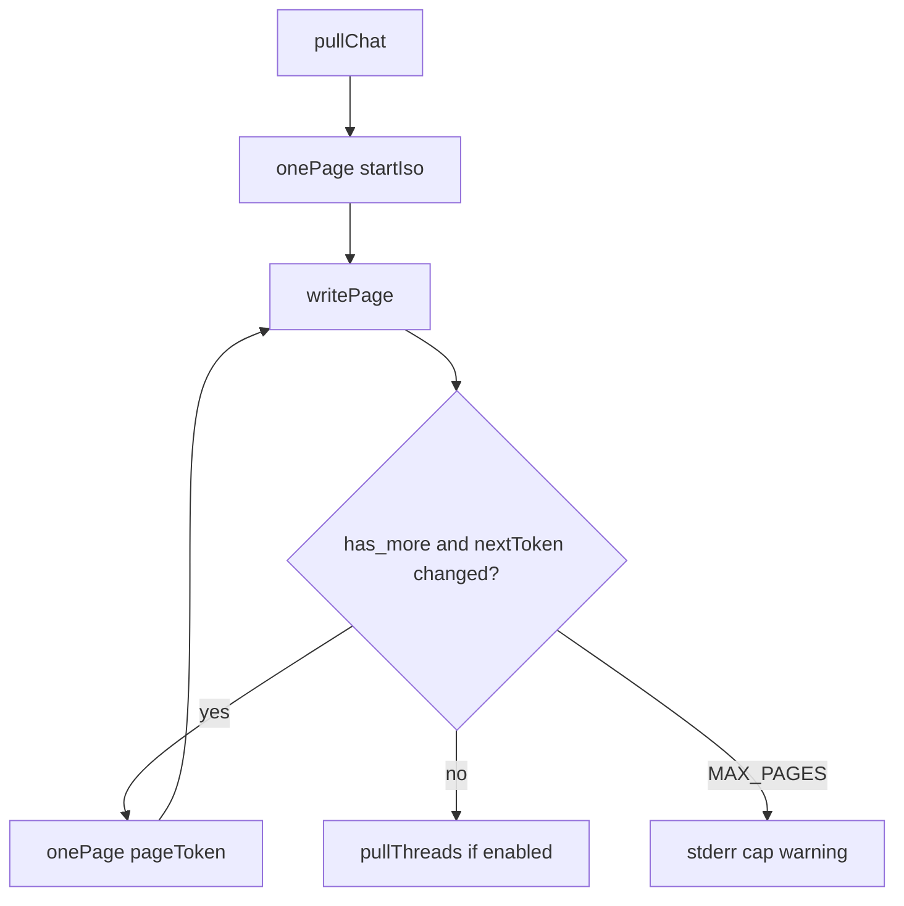
```mermaid
flowchart TD
  Start["pullChat"] --> Page1["onePage startIso"]
  Page1 --> Write["writePage"]
  Write --> More{"has_more and nextToken changed?"}
  More -->|yes| Next["onePage pageToken"]
  Next --> Write
  More -->|no| Threads["pullThreads if enabled"]
  More -->|MAX_PAGES| Cap["stderr cap warning"]
```

Sources: [src/commands/pull.ts:345-386](../../../project-repos/lark-context/src/commands/pull.ts#L345-L386), [skills/lark-context/references/pull.md:28-36](../../../project-repos/lark-context/skills/lark-context/references/pull.md#L28-L36)

<details class="source-snippets">
<summary>引用源码</summary>

<!-- source-snippets:start -->

#### `src/commands/pull.ts:345-386`

```typescript
  for (pageNum = 1; pageNum <= MAX_PAGES; pageNum++) {
    const { messages, nextToken, hasMore } = await onePage(
      group.chatId,
      pageToken,
      pageNum === 1 ? startIso : null,
    );
    if (messages.length > 0) {
      const { inserted, newMax } = writePage(
        dbPath,
        group,
        messages,
        maxCreateTime,
        now,
      );
      maxCreateTime = newMax;
      totalInserted += inserted;
      process.stderr.write(
        `  ${group.alias}: page ${pageNum} +${inserted} (cumulative ${totalInserted})\n`,
      );
    }
    if (!hasMore || nextToken === null || nextToken === pageToken) {
      hitCap = false;
      break;
    }
    pageToken = nextToken;
  }
  if (hitCap) {
    process.stderr.write(
      `  ${group.alias}: hit MAX_PAGES=${MAX_PAGES} cap; re-run to continue\n`,
    );
  }

  if (threadOpts.enabled) {
    const isFirstPull = !lastSeen;
    const windowMs = threadOpts.overrideWindow
      ? threadOpts.overrideWindow.totalMs
      : isFirstPull
        ? (threadOpts.firstPullFallback?.totalMs ?? DEFAULT_THREAD_WINDOW_FIRST_MS)
        : DEFAULT_THREAD_WINDOW_INCR_MS;
    const threadRes = await pullThreads(dbPath, group, windowMs, now);
    totalInserted += threadRes.inserted;
  }
```

#### `skills/lark-context/references/pull.md:28-36`

````markdown
## 200 页上限

首次拉历史消息每群最多 200 页（约 10k 条）。到上限后 stderr 有：

```
<alias>: hit MAX_PAGES=200 cap; re-run to continue
```

把这条原样转述给用户，**并建议**再跑一次 `lark-context pull --chat <alias>` 续拉。
````

<!-- source-snippets:end -->
</details>
## 首次拉取与续拉

当 `chats.last_cursor` 存在时，`pullChat` 不再使用用户传入的 `--since`，而是从 last_cursor 往前回退 1 小时作为重叠窗口，避免错过稍后才出现的 `thread_id` 或 `thread_replies`。首次拉取没有 last_cursor 时，才使用 `--since` 计算 startIso；如果也没有 `--since`，则不带 start。Sources: [src/commands/pull.ts:317-337](../../../project-repos/lark-context/src/commands/pull.ts#L317-L337), [src/commands/pull.ts:164-169](../../../project-repos/lark-context/src/commands/pull.ts#L164-L169)

<details class="source-snippets">
<summary>引用源码</summary>

<!-- source-snippets:start -->

#### `src/commands/pull.ts:317-337`

```typescript
  let startIso: string | null;
  if (lastSeen) {
    // 往前回退 INCR_PULL_OVERLAP_MS，让近期父消息在下一次 pull 时被重拉，以补齐
    // 之后才产生的 thread_id / thread_replies。UPSERT COALESCE 保证不会重复入库。
    const lastSeenMs = Date.parse(
      lastSeen.endsWith("Z") ? lastSeen : `${lastSeen}Z`,
    );
    if (Number.isFinite(lastSeenMs)) {
      const adjusted = new Date(lastSeenMs - INCR_PULL_OVERLAP_MS);
      startIso = adjusted.toISOString().replace(/\.\d{3}Z$/, "");
    } else {
      startIso = lastSeen;
    }
  } else if (since) {
    const startMs = now.getTime() - since.totalMs;
    // seconds-precision ISO without fractional/timezone markers, matching Python
    // `datetime.strftime("%Y-%m-%dT%H:%M:%S")`.
    startIso = new Date(startMs).toISOString().replace(/\.\d{3}Z$/, "");
  } else {
    startIso = null;
  }
```

#### `src/commands/pull.ts:164-169`

```typescript
const DEFAULT_THREAD_WINDOW_FIRST_MS = 90 * 24 * 60 * 60 * 1000;
const DEFAULT_THREAD_WINDOW_INCR_MS = 30 * 24 * 60 * 60 * 1000;
// 增量 pull 时，把 startIso 往回拉一段，让最近的父消息被重新拉取。否则某条消息
// 首次拉到时 API 还没附 thread_id，reply 稍后才产生，下一次 pull 的 startIso=lastSeen
// 会直接跳过它，这条 thread 的 root 永远补不上 thread_id，阶段二也就扫不到。
const INCR_PULL_OVERLAP_MS = 60 * 60 * 1000;
```

<!-- source-snippets:end -->
</details>
测试覆盖了续拉 startIso 早于 last_cursor 但不早太多，也覆盖首次 pull 不应用重叠窗口。Sources: [test/cmd-pull.test.ts:504-559](../../../project-repos/lark-context/test/cmd-pull.test.ts#L504-L559)

<details class="source-snippets">
<summary>引用源码</summary>

<!-- source-snippets:start -->

#### `test/cmd-pull.test.ts:504-559`

```typescript
describe("runPull — re-pull overlap window", () => {
  it("startIso on incremental pull is shifted before last_cursor to catch late thread_id updates", async () => {
    await setup();

    // 把 last_cursor 设成一个具体时刻
    const cfg = loadConfig();
    const dbSetup = connect(join(cfg.rawDir, "raw.db"));
    try {
      dbSetup
        .prepare("UPDATE chats SET last_cursor='2026-04-20T17:45:00' WHERE alias='alpha'")
        .run();
    } finally {
      dbSetup.close();
    }

    let seenStart: string | null = null;
    mockRunJson.mockImplementation(async (args: string[]) => {
      if (args.includes("+chat-messages-list")) {
        const idx = args.indexOf("--start");
        seenStart = idx >= 0 ? args[idx + 1] : null;
        return { ok: true, data: { has_more: false, messages: [] } };
      }
      if (args.includes("+threads-messages-list")) {
        return { ok: true, data: { has_more: false, messages: [] } };
      }
      throw new Error(`unexpected: ${args.join(" ")}`);
    });

    await runPull({ chatAlias: "alpha" });

    expect(seenStart).not.toBeNull();
    // 应该早于 last_cursor（重叠窗口）
    expect(seenStart! < "2026-04-20T17:45:00").toBe(true);
    // 但不应早于 last_cursor 太久——默认重叠窗口 1h 就够了
    expect(seenStart! >= "2026-04-20T16:00:00").toBe(true);
  });

  it("first pull (no last_cursor) does NOT apply overlap window (falls back to --since)", async () => {
    await setup();

    let seenStart: string | null = null;
    const fixedNow = new Date("2026-04-20T18:00:00Z");
    mockRunJson.mockImplementation(async (args: string[]) => {
      if (args.includes("+chat-messages-list")) {
        const idx = args.indexOf("--start");
        seenStart = idx >= 0 ? args[idx + 1] : null;
        return { ok: true, data: { has_more: false, messages: [] } };
      }
      throw new Error(`unexpected: ${args.join(" ")}`);
    });

    await runPull({ chatAlias: "alpha", since: "24h", _now: () => fixedNow });

    // 首次 pull，startIso = now - 24h，不应被重叠窗口再往前推
    expect(seenStart).toBe("2026-04-19T18:00:00");
  });
```

<!-- source-snippets:end -->
</details>
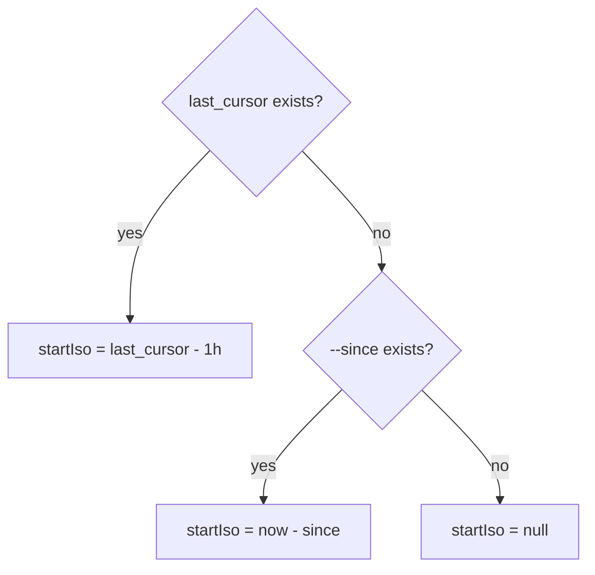
```mermaid
flowchart TD
  LastSeen{"last_cursor exists?"}
  LastSeen -->|yes| Overlap["startIso = last_cursor - 1h"]
  LastSeen -->|no| Since{"--since exists?"}
  Since -->|yes| SinceStart["startIso = now - since"]
  Since -->|no| NullStart["startIso = null"]
```

Sources: [src/commands/pull.ts:317-337](../../../project-repos/lark-context/src/commands/pull.ts#L317-L337)

<details class="source-snippets">
<summary>引用源码</summary>

<!-- source-snippets:start -->

#### `src/commands/pull.ts:317-337`

```typescript
  let startIso: string | null;
  if (lastSeen) {
    // 往前回退 INCR_PULL_OVERLAP_MS，让近期父消息在下一次 pull 时被重拉，以补齐
    // 之后才产生的 thread_id / thread_replies。UPSERT COALESCE 保证不会重复入库。
    const lastSeenMs = Date.parse(
      lastSeen.endsWith("Z") ? lastSeen : `${lastSeen}Z`,
    );
    if (Number.isFinite(lastSeenMs)) {
      const adjusted = new Date(lastSeenMs - INCR_PULL_OVERLAP_MS);
      startIso = adjusted.toISOString().replace(/\.\d{3}Z$/, "");
    } else {
      startIso = lastSeen;
    }
  } else if (since) {
    const startMs = now.getTime() - since.totalMs;
    // seconds-precision ISO without fractional/timezone markers, matching Python
    // `datetime.strftime("%Y-%m-%dT%H:%M:%S")`.
    startIso = new Date(startMs).toISOString().replace(/\.\d{3}Z$/, "");
  } else {
    startIso = null;
  }
```

<!-- source-snippets:end -->
</details>
## 写入幂等性

`writePage` 使用 `INSERT ... ON CONFLICT(id) DO UPDATE`。更新时只用 `COALESCE(excluded.thread_id, messages.thread_id)` 补 `thread_id`，不会用空值覆盖已有值；同时更新 `content_json` 保留最新原始内容。Sources: [src/commands/pull.ts:79-122](../../../project-repos/lark-context/src/commands/pull.ts#L79-L122)

<details class="source-snippets">
<summary>引用源码</summary>

<!-- source-snippets:start -->

#### `src/commands/pull.ts:79-122`

```typescript
function writePage(
  dbPath: string,
  group: GroupConfig,
  messages: any[],
  lastSeen: string,
  now: Date,
): { inserted: number; newMax: string } {
  let inserted = 0;
  let maxCt = lastSeen;
  const db = connect(dbPath);
  try {
    const tx = db.transaction(() => {
      // UPSERT 而非 INSERT OR IGNORE：父消息首次入库时 API 可能还没带 thread_id
      // （reply 尚未发生），后续再拉到同一条时应该把新出现的 thread_id 补上。
      // 用 COALESCE 保证：API 端若丢了 thread_id 字段，不会反向覆盖已存的值。
      // content_json 同样更新一下，保留最新内容（包括最新 thread_replies 快照）。
      const insMsg = db.prepare(
        "INSERT INTO messages" +
          "(id, chat_alias, sender_id, sender_name, msg_type," +
          " content_json, content_text, reply_to, create_time," +
          " thread_id, is_thread_reply) " +
          "VALUES (?, ?, ?, ?, ?, ?, ?, ?, ?, ?, ?) " +
          "ON CONFLICT(id) DO UPDATE SET " +
          "thread_id = COALESCE(excluded.thread_id, messages.thread_id), " +
          "content_json = excluded.content_json",
      );
      for (const raw of messages) {
        const sender = raw.sender ?? {};
        const createTimeIso = toIso(raw.create_time ?? "");
        if (createTimeIso > maxCt) maxCt = createTimeIso;
        const r = insMsg.run(
          raw.message_id,
          group.alias,
          sender.id ?? "",
          sender.name ?? "",
          raw.msg_type ?? "text",
          JSON.stringify(raw),
          raw.content ?? "",
          null,
          createTimeIso,
          raw.thread_id ?? null,
          0,
        );
        inserted += r.changes;
```

<!-- source-snippets:end -->
</details>
测试覆盖了第二次无新消息不会重复、后续 pull 能给既有父消息补 `thread_id`，也不会用 null 覆盖已有 `thread_id`。Sources: [test/cmd-pull.test.ts:163-197](../../../project-repos/lark-context/test/cmd-pull.test.ts#L163-L197), [test/cmd-pull.test.ts:562-647](../../../project-repos/lark-context/test/cmd-pull.test.ts#L562-L647), [test/cmd-pull.test.ts:649-702](../../../project-repos/lark-context/test/cmd-pull.test.ts#L649-L702)

<details class="source-snippets">
<summary>引用源码</summary>

<!-- source-snippets:start -->

#### `test/cmd-pull.test.ts:163-197`

```typescript
  it("second run with no new messages is idempotent (no duplicates)", async () => {
    await setup();
    mockRunJson.mockImplementation(async (args: string[]) => {
      if (args.includes("+chat-messages-list")) {
        const token = args.indexOf("--page-token");
        if (token === -1) return loadFixture("lark_messages_page1.json");
        return loadFixture("lark_messages_page2.json");
      }
      if (args.includes("+threads-messages-list")) {
        return { ok: true, data: { has_more: false, messages: [] } };
      }
      throw new Error(`unexpected: ${args.join(" ")}`);
    });
    await runPull({ chatAlias: "alpha" });

    mockRunJson.mockImplementation(async (args: string[]) => {
      if (args.includes("+chat-messages-list")) {
        return { ok: true, data: { has_more: false, page_token: null, messages: [] } };
      }
      if (args.includes("+threads-messages-list")) {
        return { ok: true, data: { has_more: false, messages: [] } };
      }
      throw new Error(`unexpected: ${args.join(" ")}`);
    });
    await runPull({ chatAlias: "alpha" });

    const cfg = loadConfig();
    const db = connect(join(cfg.rawDir, "raw.db"));
    try {
      const count = (db.prepare("SELECT COUNT(*) AS c FROM messages").get() as any).c;
      expect(count).toBe(3);
    } finally {
      db.close();
    }
  });
```

#### `test/cmd-pull.test.ts:562-647`

```typescript
describe("runPull — upsert thread_id on re-pull", () => {
  it("updates thread_id on an existing row when subsequent pull returns it", async () => {
    await setup();

    // 首次 pull：父消息没有 thread_id（此时还没 reply）
    mockRunJson.mockImplementation(async (args: string[]) => {
      if (args.includes("+chat-messages-list")) {
        return {
          ok: true,
          data: {
            has_more: false,
            page_token: null,
            messages: [
              {
                message_id: "parent_upsert",
                msg_type: "text",
                content: "父消息",
                create_time: "2026-04-18 09:00",
                sender: { id: "ou_a", name: "A", sender_type: "user" },
              },
            ],
          },
        };
      }
      if (args.includes("+threads-messages-list")) {
        return { ok: true, data: { has_more: false, messages: [] } };
      }
      throw new Error(`unexpected: ${args.join(" ")}`);
    });

    await runPull({ chatAlias: "alpha" });

    const cfg = loadConfig();
    const db1 = connect(join(cfg.rawDir, "raw.db"));
    try {
      const row = db1
        .prepare("SELECT thread_id FROM messages WHERE id='parent_upsert'")
        .get();
      expect(row).toEqual({ thread_id: null });
      // 把 cursor 回退到父消息 create_time 之前，让第二次 pull 再次取到它
      db1
        .prepare("UPDATE chats SET last_cursor='2026-04-18T08:59:00' WHERE alias='alpha'")
        .run();
    } finally {
      db1.close();
    }

    // 第二次 pull：API 现在返回带 thread_id 的同一条 parent
    mockRunJson.mockImplementation(async (args: string[]) => {
      if (args.includes("+chat-messages-list")) {
        return {
          ok: true,
          data: {
            has_more: false,
            page_token: null,
            messages: [
              {
                message_id: "parent_upsert",
                msg_type: "text",
                content: "父消息",
                create_time: "2026-04-18 09:00",
                thread_id: "omt_upsert",
                sender: { id: "ou_a", name: "A", sender_type: "user" },
              },
            ],
          },
        };
      }
      if (args.includes("+threads-messages-list")) {
        return { ok: true, data: { has_more: false, messages: [] } };
      }
      throw new Error(`unexpected: ${args.join(" ")}`);
    });

    await runPull({ chatAlias: "alpha" });

    const db2 = connect(join(cfg.rawDir, "raw.db"));
    try {
      const row = db2
        .prepare("SELECT thread_id FROM messages WHERE id='parent_upsert'")
        .get();
      expect(row).toEqual({ thread_id: "omt_upsert" });
    } finally {
      db2.close();
    }
  });
```

#### `test/cmd-pull.test.ts:649-702`

```typescript
  it("does not clobber an existing thread_id with null on re-pull", async () => {
    await setup();
    const cfg = loadConfig();
    const db = connect(join(cfg.rawDir, "raw.db"));
    try {
      db
        .prepare(
          "INSERT INTO messages(id, chat_alias, content_json, create_time, thread_id, is_thread_reply) " +
            "VALUES ('had_thread','alpha','{}','2026-04-18T09:00:00','omt_keep',0)",
        )
        .run();
      db.prepare("UPDATE chats SET last_cursor='2026-04-18T08:59:00' WHERE alias='alpha'").run();
    } finally {
      db.close();
    }

    // API 现在返回不含 thread_id 的同一条（API 端丢字段也不能反向覆盖）
    mockRunJson.mockImplementation(async (args: string[]) => {
      if (args.includes("+chat-messages-list")) {
        return {
          ok: true,
          data: {
            has_more: false,
            page_token: null,
            messages: [
              {
                message_id: "had_thread",
                msg_type: "text",
                content: "x",
                create_time: "2026-04-18 09:00",
                sender: { id: "ou_a", name: "A", sender_type: "user" },
              },
            ],
          },
        };
      }
      if (args.includes("+threads-messages-list")) {
        return { ok: true, data: { has_more: false, messages: [] } };
      }
      throw new Error(`unexpected: ${args.join(" ")}`);
    });

    await runPull({ chatAlias: "alpha" });

    const db2 = connect(join(cfg.rawDir, "raw.db"));
    try {
      const row = db2
        .prepare("SELECT thread_id FROM messages WHERE id='had_thread'")
        .get();
      expect(row).toEqual({ thread_id: "omt_keep" });
    } finally {
      db2.close();
    }
  });
```

<!-- source-snippets:end -->
</details>
## 嵌套回复与二阶段回复

飞书顶层消息返回中可能包含 `thread_replies` 数组。`writePage` 会把这些内嵌回复直接写成 `is_thread_reply=1`，即使用户设置 `--no-threads` 跳过第二阶段，也不会丢掉响应中已经带回来的回复。Sources: [src/commands/pull.ts:123-145](../../../project-repos/lark-context/src/commands/pull.ts#L123-L145), [test/cmd-pull.test.ts:308-448](../../../project-repos/lark-context/test/cmd-pull.test.ts#L308-L448)

<details class="source-snippets">
<summary>引用源码</summary>

<!-- source-snippets:start -->

#### `src/commands/pull.ts:123-145`

```typescript
        // 飞书 `im/chat-messages-list` 在返回父消息时会把 thread replies 直接内嵌在
        // `thread_replies` 数组里。把它们作为 is_thread_reply=1 的行也写进来，避免
        // 依赖第二阶段 `pullThreads` —— 那里只扫 DB 里 thread_id 非空的 root，当时序
        // 错开（父消息首次拉时还没 reply）就会永久漏掉。
        if (Array.isArray(raw.thread_replies)) {
          for (const rep of raw.thread_replies) {
            const repSender = rep.sender ?? {};
            const rr = insMsg.run(
              rep.message_id,
              group.alias,
              repSender.id ?? "",
              repSender.name ?? "",
              rep.msg_type ?? "text",
              JSON.stringify(rep),
              rep.content ?? "",
              null,
              toIso(rep.create_time ?? ""),
              rep.thread_id ?? raw.thread_id ?? null,
              1,
            );
            inserted += rr.changes;
          }
        }
```

#### `test/cmd-pull.test.ts:308-448`

```typescript
describe("runPull — embedded thread_replies (phase 1)", () => {
  it("writes thread_replies nested inside a parent message as is_thread_reply=1", async () => {
    await setup();
    mockRunJson.mockImplementation(async (args: string[]) => {
      if (args.includes("+chat-messages-list")) {
        return {
          ok: true,
          data: {
            has_more: false,
            page_token: null,
            messages: [
              {
                message_id: "parent1",
                msg_type: "merge_forward",
                content: "父消息内容",
                create_time: "2026-04-20 16:54",
                thread_id: "omt_embed",
                sender: { id: "ou_a", name: "唐文城", sender_type: "user" },
                thread_replies: [
                  {
                    message_id: "reply_a",
                    msg_type: "text",
                    content: "嵌在父消息里的回复 1",
                    create_time: "2026-04-20 17:00",
                    thread_id: "omt_embed",
                    sender: { id: "ou_b", name: "沈志杰", sender_type: "user" },
                  },
                  {
                    message_id: "reply_b",
                    msg_type: "text",
                    content: "嵌在父消息里的回复 2",
                    create_time: "2026-04-20 17:04",
                    thread_id: "omt_embed",
                    sender: { id: "ou_a", name: "唐文城", sender_type: "user" },
                  },
                ],
              },
            ],
          },
        };
      }
      if (args.includes("+threads-messages-list")) {
        return { ok: true, data: { has_more: false, messages: [] } };
      }
      throw new Error(`unexpected: ${args.join(" ")}`);
    });

    await runPull({ chatAlias: "alpha" });

    const cfg = loadConfig();
    const db = connect(join(cfg.rawDir, "raw.db"));
    try {
      const rows = db
        .prepare(
          "SELECT id, thread_id, is_thread_reply, sender_name, content_text " +
            "FROM messages ORDER BY create_time",
        )
        .all();
      expect(rows).toEqual([
        {
          id: "parent1",
          thread_id: "omt_embed",
          is_thread_reply: 0,
          sender_name: "唐文城",
          content_text: "父消息内容",
        },
        {
          id: "reply_a",
          thread_id: "omt_embed",
          is_thread_reply: 1,
          sender_name: "沈志杰",
          content_text: "嵌在父消息里的回复 1",
        },
        {
          id: "reply_b",
          thread_id: "omt_embed",
          is_thread_reply: 1,
          sender_name: "唐文城",
          content_text: "嵌在父消息里的回复 2",
        },
      ]);
    } finally {
      db.close();
    }
  });

  it("embedded thread_replies are written even when --no-threads is set", async () => {
    await setup();
    const seenApis: string[] = [];
    mockRunJson.mockImplementation(async (args: string[]) => {
      const apiFlag = args.find((a) => a.startsWith("+")) ?? "";
      seenApis.push(apiFlag);
      if (apiFlag === "+chat-messages-list") {
        return {
          ok: true,
          data: {
            has_more: false,
            page_token: null,
            messages: [
              {
                message_id: "p1",
                msg_type: "text",
                content: "父",
                create_time: "2026-04-18 10:00",
                thread_id: "omt_x",
                sender: { id: "ou_a", name: "A", sender_type: "user" },
                thread_replies: [
                  {
                    message_id: "r1",
                    msg_type: "text",
                    content: "嵌套 reply",
                    create_time: "2026-04-18 10:05",
                    thread_id: "omt_x",
                    sender: { id: "ou_b", name: "B", sender_type: "user" },
                  },
                ],
              },
            ],
          },
        };
... snippet truncated ...
```

<!-- source-snippets:end -->
</details>
第二阶段 `pullThreads` 会从 DB 中扫描窗口内、非回复、带 `thread_id` 的顶层消息，然后逐个调用 `im +threads-messages-list` 拉完整回复，并使用 `INSERT OR IGNORE` 避免重复。Sources: [src/commands/pull.ts:171-238](../../../project-repos/lark-context/src/commands/pull.ts#L171-L238), [src/commands/pull.ts:240-290](../../../project-repos/lark-context/src/commands/pull.ts#L240-L290)

<details class="source-snippets">
<summary>引用源码</summary>

<!-- source-snippets:start -->

#### `src/commands/pull.ts:171-238`

```typescript
async function pullThreadsPage(
  threadId: string,
  pageToken: string | null,
): Promise<PageResult> {
  const args: string[] = [
    "im",
    "+threads-messages-list",
    "--thread",
    threadId,
    "--sort",
    "asc",
    "--page-size",
    "50",
  ];
  if (pageToken) args.push("--page-token", pageToken);
  const response = (await runJson(args)) as any;
  if (!response || typeof response !== "object") {
    throw new Error(`unexpected threads response: ${JSON.stringify(response)}`);
  }
  const data = response.data ?? {};
  return {
    messages: Array.isArray(data.messages) ? data.messages : [],
    nextToken: data.page_token ? String(data.page_token) : null,
    hasMore: Boolean(data.has_more),
  };
}

function writeThreadPage(
  dbPath: string,
  chatAlias: string,
  threadId: string,
  messages: any[],
): number {
  let inserted = 0;
  const db = connect(dbPath);
  try {
    const tx = db.transaction(() => {
      const ins = db.prepare(
        "INSERT OR IGNORE INTO messages" +
          "(id, chat_alias, sender_id, sender_name, msg_type," +
          " content_json, content_text, reply_to, create_time," +
          " thread_id, is_thread_reply) " +
          "VALUES (?, ?, ?, ?, ?, ?, ?, ?, ?, ?, 1)",
      );
      for (const raw of messages) {
        const sender = raw.sender ?? {};
        const createTimeIso = toIso(raw.create_time ?? "");
        const r = ins.run(
          raw.message_id,
          chatAlias,
          sender.id ?? "",
          sender.name ?? "",
          raw.msg_type ?? "text",
          JSON.stringify(raw),
          raw.content ?? "",
          null,
          createTimeIso,
          raw.thread_id ?? threadId,
        );
        inserted += r.changes;
      }
    });
    tx();
  } finally {
    db.close();
  }
  return inserted;
}
```

#### `src/commands/pull.ts:240-290`

```typescript
async function pullThreads(
  dbPath: string,
  group: GroupConfig,
  windowMs: number,
  now: Date,
): Promise<{ threadsScanned: number; inserted: number }> {
  const cutoff = new Date(now.getTime() - windowMs)
    .toISOString()
    .replace(/\.\d{3}Z$/, "");
  const db = connect(dbPath);
  let threadIds: string[];
  try {
    const rows = db
      .prepare(
        "SELECT DISTINCT thread_id FROM messages " +
          "WHERE chat_alias=? AND thread_id IS NOT NULL " +
          "AND is_thread_reply=0 AND create_time >= ?",
      )
      .all(group.alias, cutoff) as Array<{ thread_id: string }>;
    threadIds = rows.map((r) => r.thread_id);
  } finally {
    db.close();
  }

  let totalInserted = 0;
  for (const threadId of threadIds) {
    try {
      let pageToken: string | null = null;
      for (let page = 1; page <= MAX_PAGES; page++) {
        const { messages, nextToken, hasMore } = await pullThreadsPage(
          threadId,
          pageToken,
        );
        if (messages.length > 0) {
          totalInserted += writeThreadPage(dbPath, group.alias, threadId, messages);
        }
        if (!hasMore || !nextToken || nextToken === pageToken) break;
        pageToken = nextToken;
      }
    } catch (err) {
      if (err instanceof LarkNotFoundError) throw err;
      if (!(err instanceof LarkCLIError)) throw err;
      process.stderr.write(
        `  ${group.alias}: thread ${threadId} failed (${err.message}); skipped\n`,
      );
    }
  }
  process.stderr.write(
    `  ${group.alias}: threads +${threadIds.length} scanned, +${totalInserted} replies inserted\n`,
  );
  return { threadsScanned: threadIds.length, inserted: totalInserted };
```

<!-- source-snippets:end -->
</details>
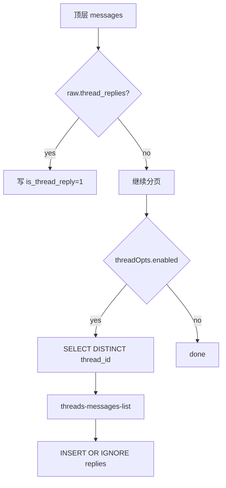
```mermaid
flowchart TD
  Root["顶层 messages"] --> Embedded{"raw.thread_replies?"}
  Embedded -->|yes| WriteEmbedded["写 is_thread_reply=1"]
  Embedded -->|no| Continue["继续分页"]
  Continue --> Phase2{"threadOpts.enabled"}
  Phase2 -->|yes| Scan["SELECT DISTINCT thread_id"]
  Scan --> Fetch["threads-messages-list"]
  Fetch --> Insert["INSERT OR IGNORE replies"]
  Phase2 -->|no| Done["done"]
```

Sources: [src/commands/pull.ts:123-145](../../../project-repos/lark-context/src/commands/pull.ts#L123-L145), [src/commands/pull.ts:240-290](../../../project-repos/lark-context/src/commands/pull.ts#L240-L290)

<details class="source-snippets">
<summary>引用源码</summary>

<!-- source-snippets:start -->

#### `src/commands/pull.ts:123-145`

```typescript
        // 飞书 `im/chat-messages-list` 在返回父消息时会把 thread replies 直接内嵌在
        // `thread_replies` 数组里。把它们作为 is_thread_reply=1 的行也写进来，避免
        // 依赖第二阶段 `pullThreads` —— 那里只扫 DB 里 thread_id 非空的 root，当时序
        // 错开（父消息首次拉时还没 reply）就会永久漏掉。
        if (Array.isArray(raw.thread_replies)) {
          for (const rep of raw.thread_replies) {
            const repSender = rep.sender ?? {};
            const rr = insMsg.run(
              rep.message_id,
              group.alias,
              repSender.id ?? "",
              repSender.name ?? "",
              rep.msg_type ?? "text",
              JSON.stringify(rep),
              rep.content ?? "",
              null,
              toIso(rep.create_time ?? ""),
              rep.thread_id ?? raw.thread_id ?? null,
              1,
            );
            inserted += rr.changes;
          }
        }
```

#### `src/commands/pull.ts:240-290`

```typescript
async function pullThreads(
  dbPath: string,
  group: GroupConfig,
  windowMs: number,
  now: Date,
): Promise<{ threadsScanned: number; inserted: number }> {
  const cutoff = new Date(now.getTime() - windowMs)
    .toISOString()
    .replace(/\.\d{3}Z$/, "");
  const db = connect(dbPath);
  let threadIds: string[];
  try {
    const rows = db
      .prepare(
        "SELECT DISTINCT thread_id FROM messages " +
          "WHERE chat_alias=? AND thread_id IS NOT NULL " +
          "AND is_thread_reply=0 AND create_time >= ?",
      )
      .all(group.alias, cutoff) as Array<{ thread_id: string }>;
    threadIds = rows.map((r) => r.thread_id);
  } finally {
    db.close();
  }

  let totalInserted = 0;
  for (const threadId of threadIds) {
    try {
      let pageToken: string | null = null;
      for (let page = 1; page <= MAX_PAGES; page++) {
        const { messages, nextToken, hasMore } = await pullThreadsPage(
          threadId,
          pageToken,
        );
        if (messages.length > 0) {
          totalInserted += writeThreadPage(dbPath, group.alias, threadId, messages);
        }
        if (!hasMore || !nextToken || nextToken === pageToken) break;
        pageToken = nextToken;
      }
    } catch (err) {
      if (err instanceof LarkNotFoundError) throw err;
      if (!(err instanceof LarkCLIError)) throw err;
      process.stderr.write(
        `  ${group.alias}: thread ${threadId} failed (${err.message}); skipped\n`,
      );
    }
  }
  process.stderr.write(
    `  ${group.alias}: threads +${threadIds.length} scanned, +${totalInserted} replies inserted\n`,
  );
  return { threadsScanned: threadIds.length, inserted: totalInserted };
```

<!-- source-snippets:end -->
</details>
## 话题窗口策略

默认话题窗口有三层：首次 pull 使用 effective `--since`；首次但没有 `--since` 时回看 90 天；续拉默认回看 30 天。用户也可以显式传 `--thread-window` 覆盖，或 `--no-threads` 跳过第二阶段。Sources: [src/commands/pull.ts:164-165](../../../project-repos/lark-context/src/commands/pull.ts#L164-L165), [src/commands/pull.ts:377-386](../../../project-repos/lark-context/src/commands/pull.ts#L377-L386), [src/commands/pull.ts:443-459](../../../project-repos/lark-context/src/commands/pull.ts#L443-L459)

<details class="source-snippets">
<summary>引用源码</summary>

<!-- source-snippets:start -->

#### `src/commands/pull.ts:164-165`

```typescript
const DEFAULT_THREAD_WINDOW_FIRST_MS = 90 * 24 * 60 * 60 * 1000;
const DEFAULT_THREAD_WINDOW_INCR_MS = 30 * 24 * 60 * 60 * 1000;
```

#### `src/commands/pull.ts:377-386`

```typescript
  if (threadOpts.enabled) {
    const isFirstPull = !lastSeen;
    const windowMs = threadOpts.overrideWindow
      ? threadOpts.overrideWindow.totalMs
      : isFirstPull
        ? (threadOpts.firstPullFallback?.totalMs ?? DEFAULT_THREAD_WINDOW_FIRST_MS)
        : DEFAULT_THREAD_WINDOW_INCR_MS;
    const threadRes = await pullThreads(dbPath, group, windowMs, now);
    totalInserted += threadRes.inserted;
  }
```

#### `src/commands/pull.ts:443-459`

```typescript
export function registerPull(program: Command): void {
  program
    .command("pull")
    .description("Incrementally pull messages for one or all whitelisted chats")
    .option(
      "--chat <alias>",
      'Alias to pull; omit (or "all") for all enabled groups',
    )
    .option(
      "--since <duration>",
      "First-pull lower bound (e.g. 3d, 24h). Ignored on later runs.",
    )
    .option(
      "--thread-window <duration>",
      "Lookback window for thread-reply refresh. Default: matches --since on first pull, 30d on incremental pulls.",
    )
    .option("--no-threads", "Skip thread-reply refresh (phase 2)")
```

<!-- source-snippets:end -->
</details>
README 也记录了相同的用户语义：首次窗口与 effective `--since` 对齐，续拉 30 天，单个话题失败不会 disable 整个群。Sources: [README.md:113-118](../../../project-repos/lark-context/README.md#L113-L118)

<details class="source-snippets">
<summary>引用源码</summary>

<!-- source-snippets:start -->

#### `README.md:113-118`

```markdown
**话题回复（thread replies）**：`pull` 在拉完顶层消息后，会扫描"回看窗口"内所有带 `thread_id` 的顶层消息，逐个调用飞书 `im +threads-messages-list` 把话题下的回复（子消息）一并落库。窗口默认：

- 首次 pull 某群：与 effective `--since` 对齐（例如 `--since 180d` 则 thread window 也是 180d；不传默认 90d）
- 续拉：30d（`--since` 被忽略）

显式传 `--thread-window <duration>` 覆盖默认，或用 `--no-threads` 跳过该阶段（只拉顶层）。单个话题拉失败（权限 / 删除）不会 disable 整个群，stderr 打 warning 继续下一个。`show` 会把话题回复按 `  ↳ ` 缩进成组渲染在所属根消息下方。
```

<!-- source-snippets:end -->
</details>
测试覆盖了首次 90d/180d、续拉 30d、显式 `--thread-window`、`--no-threads`、单 thread 失败继续、thread 回复分页。Sources: [test/cmd-pull.test.ts:827-906](../../../project-repos/lark-context/test/cmd-pull.test.ts#L827-L906), [test/cmd-pull.test.ts:908-996](../../../project-repos/lark-context/test/cmd-pull.test.ts#L908-L996), [test/cmd-pull.test.ts:1035-1129](../../../project-repos/lark-context/test/cmd-pull.test.ts#L1035-L1129)

<details class="source-snippets">
<summary>引用源码</summary>

<!-- source-snippets:start -->

#### `test/cmd-pull.test.ts:827-906`

```typescript
  it("first pull defaults thread window to effective --since (covers ancient rows when --since is long)", async () => {
    await setup();
    const cfg = loadConfig();
    const db = connect(join(cfg.rawDir, "raw.db"));
    try {
      const old = new Date(Date.now() - 120 * 86400 * 1000)
        .toISOString()
        .replace(/\.\d{3}Z$/, "");
      db.prepare(
        "INSERT INTO messages(id,chat_alias,content_json,create_time,thread_id,is_thread_reply) " +
          "VALUES ('seed','alpha','{}',?, 'omt_seed', 0)",
      ).run(old);
    } finally {
      db.close();
    }

    const seenThreads: string[] = [];
    mockRunJson.mockImplementation(async (args: string[]) => {
      if (args.includes("+chat-messages-list")) {
        return { ok: true, data: { has_more: false, messages: [] } };
      }
      if (args.includes("+threads-messages-list")) {
        const t = args[args.indexOf("--thread") + 1];
        seenThreads.push(t);
        return { ok: true, data: { has_more: false, messages: [] } };
      }
      throw new Error(`unexpected: ${args.join(" ")}`);
    });

    // No --since → 90d default; seed is 120d old → NOT scanned.
    await runPull({ chatAlias: "alpha" });
    expect(seenThreads).toEqual([]);

    // --since 180d on a still-first-pull chat → seed IS scanned.
    seenThreads.length = 0;
    const db2 = connect(join(cfg.rawDir, "raw.db"));
    try {
      db2.prepare("UPDATE chats SET last_cursor=NULL WHERE alias='alpha'").run();
    } finally {
      db2.close();
    }
    await runPull({ chatAlias: "alpha", since: "180d" });
    expect(seenThreads).toEqual(["omt_seed"]);
  });

  it("incremental pull defaults thread window to 30d", async () => {
    await setup();
    const cfg = loadConfig();
    const db = connect(join(cfg.rawDir, "raw.db"));
    try {
      db.prepare("UPDATE chats SET last_cursor='2026-04-18T09:10:00' WHERE alias='alpha'").run();
      const d20 = new Date(Date.now() - 20 * 86400 * 1000)
        .toISOString()
        .replace(/\.\d{3}Z$/, "");
      const d45 = new Date(Date.now() - 45 * 86400 * 1000)
        .toISOString()
        .replace(/\.\d{3}Z$/, "");
      db.prepare(
        "INSERT INTO messages(id,chat_alias,content_json,create_time,thread_id,is_thread_reply) " +
          "VALUES ('t20','alpha','{}',?,'omt_20',0),('t45','alpha','{}',?,'omt_45',0)",
      ).run(d20, d45);
    } finally {
      db.close();
    }

    const seenThreads: string[] = [];
    mockRunJson.mockImplementation(async (args: string[]) => {
      if (args.includes("+chat-messages-list")) {
        return { ok: true, data: { has_more: false, messages: [] } };
      }
      if (args.includes("+threads-messages-list")) {
        seenThreads.push(args[args.indexOf("--thread") + 1]);
        return { ok: true, data: { has_more: false, messages: [] } };
      }
      throw new Error(`unexpected: ${args.join(" ")}`);
    });

    await runPull({ chatAlias: "alpha" });
    expect(seenThreads.sort()).toEqual(["omt_20"]);
  });
```

#### `test/cmd-pull.test.ts:908-996`

```typescript
  it("a single thread failing does not disable the chat; other threads continue", async () => {
    await setup();
    const cfg = loadConfig();
    const db = connect(join(cfg.rawDir, "raw.db"));
    try {
      db.prepare(
        "INSERT INTO messages(id,chat_alias,content_json,create_time,thread_id,is_thread_reply) " +
          "VALUES ('a','alpha','{}','2026-04-18T09:00:00','omt_good',0)," +
          "('b','alpha','{}','2026-04-18T09:05:00','omt_bad',0)," +
          "('c','alpha','{}','2026-04-18T09:10:00','omt_other',0)",
      ).run();
    } finally {
      db.close();
    }

    mockRunJson.mockImplementation(async (args: string[]) => {
      if (args.includes("+chat-messages-list")) {
        return { ok: true, data: { has_more: false, messages: [] } };
      }
      if (args.includes("+threads-messages-list")) {
        const t = args[args.indexOf("--thread") + 1];
        if (t === "omt_bad") throw new LarkCLIError("permission denied on thread");
        return {
          ok: true,
          data: {
            has_more: false,
            messages: [
              {
                message_id: `r_${t}`,
                msg_type: "text",
                content: "ok",
                create_time: "2026-04-18 10:00",
                thread_id: t,
                sender: { id: "ou_x", name: "X", sender_type: "user" },
              },
            ],
          },
        };
      }
      throw new Error(`unexpected: ${args.join(" ")}`);
    });

    await runPull({ chatAlias: "alpha", threadWindow: "365d" });

    const db2 = connect(join(cfg.rawDir, "raw.db"));
    try {
      const enabled = (db2.prepare("SELECT enabled FROM chats WHERE alias='alpha'").get() as any).enabled;
      expect(enabled).toBe(1);
      const replies = db2
        .prepare("SELECT id FROM messages WHERE is_thread_reply=1 ORDER BY id")
        .all() as Array<{ id: string }>;
      expect(replies.map((r) => r.id).sort()).toEqual(["r_omt_good", "r_omt_other"]);
    } finally {
      db2.close();
    }
  });

  it("--thread-window overrides default", async () => {
    await setup();
    const cfg = loadConfig();
    const db = connect(join(cfg.rawDir, "raw.db"));
    try {
      db.prepare("UPDATE chats SET last_cursor='2026-04-18T09:10:00' WHERE alias='alpha'").run();
      const d45 = new Date(Date.now() - 45 * 86400 * 1000)
        .toISOString()
        .replace(/\.\d{3}Z$/, "");
      db.prepare(
        "INSERT INTO messages(id,chat_alias,content_json,create_time,thread_id,is_thread_reply) " +
          "VALUES ('t45','alpha','{}',?,'omt_45',0)",
      ).run(d45);
    } finally {
      db.close();
    }

    const seenThreads: string[] = [];
    mockRunJson.mockImplementation(async (args: string[]) => {
      if (args.includes("+chat-messages-list")) {
        return { ok: true, data: { has_more: false, messages: [] } };
      }
      if (args.includes("+threads-messages-list")) {
        seenThreads.push(args[args.indexOf("--thread") + 1]);
        return { ok: true, data: { has_more: false, messages: [] } };
      }
      throw new Error(`unexpected: ${args.join(" ")}`);
    });

    await runPull({ chatAlias: "alpha", threadWindow: "60d" });
    expect(seenThreads.sort()).toEqual(["omt_45"]);
  });
```

#### `test/cmd-pull.test.ts:1035-1129`

```typescript
  it("paginates thread replies when has_more=true", async () => {
    await setup();
    const cfg = loadConfig();
    const db = connect(join(cfg.rawDir, "raw.db"));
    try {
      db.prepare(
        "INSERT INTO messages(id,chat_alias,content_json,create_time,thread_id,is_thread_reply) " +
          "VALUES ('root','alpha','{}','2026-04-18T09:00:00','omt_big',0)",
      ).run();
    } finally {
      db.close();
    }

    const callLog: Array<{ pageToken: string | null }> = [];
    mockRunJson.mockImplementation(async (args: string[]) => {
      if (args.includes("+chat-messages-list")) {
        return { ok: true, data: { has_more: false, messages: [] } };
      }
      if (args.includes("+threads-messages-list")) {
        const tokenIdx = args.indexOf("--page-token");
        const pageToken = tokenIdx >= 0 ? args[tokenIdx + 1] : null;
        callLog.push({ pageToken });
        if (pageToken === null) {
          return {
            ok: true,
            data: {
              has_more: true,
              page_token: "tok_p2",
              messages: [
                {
                  message_id: "rep1",
                  msg_type: "text",
                  content: "page 1 a",
                  create_time: "2026-04-18 09:05",
                  thread_id: "omt_big",
                  sender: { id: "ou_a", name: "A", sender_type: "user" },
                },
                {
                  message_id: "rep2",
                  msg_type: "text",
                  content: "page 1 b",
                  create_time: "2026-04-18 09:06",
                  thread_id: "omt_big",
                  sender: { id: "ou_b", name: "B", sender_type: "user" },
                },
              ],
            },
          };
        }
        if (pageToken === "tok_p2") {
          return {
            ok: true,
            data: {
              has_more: false,
              page_token: "",
              messages: [
                {
                  message_id: "rep3",
                  msg_type: "text",
                  content: "page 2",
                  create_time: "2026-04-18 09:10",
                  thread_id: "omt_big",
                  sender: { id: "ou_c", name: "C", sender_type: "user" },
                },
              ],
            },
          };
        }
        throw new Error(`unexpected page token: ${pageToken}`);
      }
      throw new Error(`unexpected: ${args.join(" ")}`);
    });

    await runPull({ chatAlias: "alpha", threadWindow: "365d" });

    // Two pages were requested
    expect(callLog.map((c) => c.pageToken)).toEqual([null, "tok_p2"]);

    // All three replies landed
    const db2 = connect(join(cfg.rawDir, "raw.db"));
    try {
      const replies = db2
        .prepare(
          "SELECT id, content_text FROM messages WHERE is_thread_reply=1 ORDER BY create_time",
        )
        .all() as Array<{ id: string; content_text: string }>;
      expect(replies).toEqual([
        { id: "rep1", content_text: "page 1 a" },
        { id: "rep2", content_text: "page 1 b" },
        { id: "rep3", content_text: "page 2" },
      ]);
    } finally {
      db2.close();
    }
  });
```

<!-- source-snippets:end -->
</details>
## 群级失败隔离

`runPull` 遍历所有目标群。遇到 `LarkCLIError` 时，它会调用 `disableChat` 把该群置为 disabled，并继续处理其他群；`LarkNotFoundError` 和非 Lark 错误则向上抛。Sources: [src/commands/pull.ts:391-440](../../../project-repos/lark-context/src/commands/pull.ts#L391-L440)

<details class="source-snippets">
<summary>引用源码</summary>

<!-- source-snippets:start -->

#### `src/commands/pull.ts:391-440`

```typescript
function disableChat(dbPath: string, alias: string, reason: string): void {
  const db = connect(dbPath);
  try {
    db.prepare("UPDATE chats SET enabled=0 WHERE alias=?").run(alias);
  } finally {
    db.close();
  }
  process.stderr.write(`${alias}: DISABLED (${reason})\n`);
}

export async function runPull(opts: PullOpts): Promise<number> {
  const cfg: Config = loadConfig(opts);
  const dbPath = join(cfg.rawDir, "raw.db");
  ensureInitialized(dbPath);
  const sinceParsed = opts.since ? parseDuration(opts.since) : null;
  const threadWindowParsed = opts.threadWindow
    ? parseDuration(opts.threadWindow)
    : null;
  const threadOpts: ThreadOpts = {
    enabled: !opts.noThreads,
    overrideWindow: threadWindowParsed,
    firstPullFallback: sinceParsed,
  };
  const effectiveAlias =
    opts.chatAlias === "all" || !opts.chatAlias ? null : opts.chatAlias;
  const targets = cfg.groups.filter(
    (g) => g.enabled && (!effectiveAlias || g.alias === effectiveAlias),
  );
  if (effectiveAlias && targets.length === 0) {
    throw new Error(`unknown chat alias "${opts.chatAlias}"`);
  }
  const now = (opts._now ?? (() => new Date()))();

  let grand = 0;
  for (const g of targets) {
    try {
      const n = await pullChat(dbPath, g, sinceParsed, threadOpts, now);
      process.stdout.write(`${g.alias}: pulled ${n} messages\n`);
      grand += n;
    } catch (err) {
      if (err instanceof LarkNotFoundError) throw err;
      if (err instanceof LarkCLIError) {
        disableChat(dbPath, g.alias, err.message);
        continue;
      }
      throw err;
    }
  }
  process.stdout.write(`done, total=${grand}\n`);
  return grand;
```

<!-- source-snippets:end -->
</details>
这个策略让权限失效或被踢出某个群时，不会阻断其他 enabled 群的增量拉取。测试覆盖了单群失败禁用该群、其他群继续。Sources: [test/cmd-pull.test.ts:240-265](../../../project-repos/lark-context/test/cmd-pull.test.ts#L240-L265)

<details class="source-snippets">
<summary>引用源码</summary>

<!-- source-snippets:start -->

#### `test/cmd-pull.test.ts:240-265`

```typescript
  it("LarkCLIError on one chat disables it; other chats still pulled", async () => {
    await setup();
    await runAdd({
      configPathOverride: configPath,
      chatId: "oc_bbb",
      alias: "bravo",
    });
    mockRunJson.mockImplementation(async (args: string[]) => {
      const chatId = args[args.indexOf("--chat-id") + 1];
      if (chatId === "oc_aaa") throw new LarkCLIError("permission denied");
      return EMPTY;
    });
    await runPull({});
    const cfg = loadConfig();
    const db = connect(join(cfg.rawDir, "raw.db"));
    try {
      const rows = db
        .prepare("SELECT alias, enabled FROM chats ORDER BY alias")
        .all() as Array<{ alias: string; enabled: number }>;
      const byAlias = Object.fromEntries(rows.map((r) => [r.alias, r.enabled]));
      expect(byAlias.alpha).toBe(0);
      expect(byAlias.bravo).toBe(1);
    } finally {
      db.close();
    }
  });
```

<!-- source-snippets:end -->
</details>
## 相关页面

- [配置与 SQLite 存储](configuration-and-storage.md)
- [lark-cli 集成](lark-cli-integration.md)
- [文档入库与 Markdown 输出](document-ingestion-and-show.md)

---

<details>
<summary>相关源文件</summary>

生成本页时使用的主要源文件：

- [src/commands/ingestDoc.ts](../../../project-repos/lark-context/src/commands/ingestDoc.ts)
- [src/commands/show.ts](../../../project-repos/lark-context/src/commands/show.ts)
- [src/render.ts](../../../project-repos/lark-context/src/render.ts)
- [src/durations.ts](../../../project-repos/lark-context/src/durations.ts)
- [README.md](../../../project-repos/lark-context/README.md)
- [skills/lark-context/references/ingest-doc.md](../../../project-repos/lark-context/skills/lark-context/references/ingest-doc.md)
- [skills/lark-context/references/show.md](../../../project-repos/lark-context/skills/lark-context/references/show.md)
- [test/cmd-ingest-doc.test.ts](../../../project-repos/lark-context/test/cmd-ingest-doc.test.ts)
- [test/cmd-show.test.ts](../../../project-repos/lark-context/test/cmd-show.test.ts)

</details>

# 文档入库与 Markdown 输出

`ingest-doc` 把飞书文档拉到本地 `docs` 表；`show` 与 `show-doc` 再把本地消息和文档渲染给 Claude 或用户。这个链路不主动拉新消息，读到的是 SQLite 里已有数据。Sources: [src/commands/ingestDoc.ts:59-103](../../../project-repos/lark-context/src/commands/ingestDoc.ts#L59-L103), [src/commands/show.ts:31-154](../../../project-repos/lark-context/src/commands/show.ts#L31-L154), [skills/lark-context/references/show.md:8-9](../../../project-repos/lark-context/skills/lark-context/references/show.md#L8-L9)

<details class="source-snippets">
<summary>引用源码</summary>

<!-- source-snippets:start -->

#### `src/commands/ingestDoc.ts:59-103`

```typescript
export async function runIngestDoc(opts: IngestDocOpts): Promise<void> {
  const cfg = loadConfig(opts);
  const dbPath = join(cfg.rawDir, "raw.db");
  ensureInitialized(dbPath);
  const token = extractToken(opts.ref);

  const response = (await runJson(["docs", "+fetch", "--doc", opts.ref])) as
    | Record<string, unknown>
    | null;
  if (!response || typeof response !== "object") {
    throw new Error(`unexpected lark response: ${JSON.stringify(response)}`);
  }
  if (response.ok === false) {
    const err = response.error;
    const msg =
      err && typeof err === "object" && err !== null && "message" in err
        ? String((err as { message: unknown }).message)
        : String(err ?? response);
    throw new Error(`docs +fetch failed: ${msg}`);
  }
  let data = response.data;
  if (!data || typeof data !== "object") {
    data = { content: String(data ?? "") };
  }
  const { title, body } = extractContent(data as Record<string, unknown>);

  const header = title ? `# ${title}\n\n` : "";
  let md = header + body;
  if (!md.endsWith("\n")) md += "\n";

  const now = (opts._now ?? (() => new Date()))();
  const urlForDb = opts.ref.startsWith("http") ? opts.ref : "";
  const db = connect(dbPath);
  try {
    db.prepare(
      "INSERT INTO docs(doc_token, url, title, content_md, fetched_at, source) " +
        "VALUES(?, ?, ?, ?, ?, 'manual') " +
        "ON CONFLICT(doc_token) DO UPDATE SET " +
        "url=excluded.url, title=excluded.title, content_md=excluded.content_md, fetched_at=excluded.fetched_at",
    ).run(token, urlForDb, title, md, now.toISOString());
  } finally {
    db.close();
  }
  process.stdout.write(`ingested ${token} (${title || "(no title)"})\n`);
}
```

#### `src/commands/show.ts:31-154`

```typescript
export async function runShow(opts: ShowOpts): Promise<void> {
  const cfg = loadConfig(opts);
  const dbPath = join(cfg.rawDir, "raw.db");
  ensureInitialized(dbPath);
  const delta = parseDuration(opts.since ?? "24h");
  const now = (opts._now ?? (() => new Date()))();
  const cutoff = new Date(now.getTime() - delta.totalMs).toISOString();
  const effectiveAlias =
    opts.chatAlias === "all" || !opts.chatAlias ? null : opts.chatAlias;
  const targets = cfg.groups.filter(
    (g) => g.enabled && (!effectiveAlias || g.alias === effectiveAlias),
  );
  if (effectiveAlias && targets.length === 0) {
    throw new Error(`unknown chat alias "${opts.chatAlias}"`);
  }
  if (targets.length === 0) {
    throw new Error("no whitelisted chats");
  }

  const pieces: string[] = [];
  const db = connect(dbPath);
  try {
    const topStmt = db.prepare(
      "SELECT id, sender_name, content_text, create_time, thread_id " +
        "FROM messages WHERE chat_alias=? AND is_thread_reply=0 AND create_time >= ? " +
        "ORDER BY create_time",
    );
    const replyStmt = db.prepare(
      "SELECT sender_name, content_text, create_time " +
        "FROM messages WHERE chat_alias=? AND thread_id=? AND is_thread_reply=1 " +
        "ORDER BY create_time",
    );

    for (const g of targets) {
      const tops = topStmt.all(g.alias, cutoff) as Array<{
        id: string;
        sender_name: string;
        content_text: string;
        create_time: string;
        thread_id: string | null;
      }>;
      const messages: Array<{
        sender_name: string;
        content_text: string;
        create_time: string;
        is_thread_reply?: boolean;
      }> = [];
      for (const top of tops) {
        messages.push({
          sender_name: top.sender_name,
          content_text: top.content_text,
          create_time: top.create_time,
          is_thread_reply: false,
        });
        if (top.thread_id) {
          const replies = replyStmt.all(g.alias, top.thread_id) as Array<{
            sender_name: string;
            content_text: string;
            create_time: string;
          }>;
          for (const r of replies) {
            messages.push({
              sender_name: r.sender_name,
              content_text: r.content_text,
              create_time: r.create_time,
              is_thread_reply: true,
            });
          }
        }
      }
      pieces.push(
        renderChatWindow({
          chatName: g.name || g.alias,
          windowStart: cutoff.slice(0, 10),
          windowEnd: now.toISOString().slice(0, 10),
          messages,
        }),
      );
    }
    const docs = db
      .prepare(
        "SELECT doc_token, title, url FROM docs WHERE fetched_at >= ? ORDER BY fetched_at DESC",
      )
      .all(cutoff) as Array<{ doc_token: string; title: string; url: string }>;
    if (docs.length > 0) {
      pieces.push("### 近期入库的文档\n");
      for (const d of docs) {
        pieces.push(`- [${d.title || d.doc_token}](${d.url})  (token=\`${d.doc_token}\`)`);
      }
      pieces.push("");
    }
  } finally {
    db.close();
  }
  const write = opts.write ?? ((s: string) => process.stdout.write(s));
  write(pieces.join("\n") + "\n");
}

export interface ShowDocOpts extends LoadConfigOptions {
  ref: string;
  write?: (s: string) => void;
}

export async function runShowDoc(opts: ShowDocOpts): Promise<void> {
  const cfg = loadConfig(opts);
  const dbPath = join(cfg.rawDir, "raw.db");
  ensureInitialized(dbPath);
  const token = tokenFromRef(opts.ref);
  const db = connect(dbPath);
  let content_md: string | undefined;
  try {
    const row = db
      .prepare("SELECT content_md FROM docs WHERE doc_token=? OR url=?")
      .get(token, opts.ref) as { content_md: string } | undefined;
    content_md = row?.content_md;
  } finally {
    db.close();
  }
  if (!content_md) {
    throw new Error(`no ingested doc matches "${opts.ref}"`);
... snippet truncated ...
```

#### `skills/lark-context/references/show.md:8-9`

```markdown
**目标**：从本地 SQLite 读出最近消息 / 文档，渲染给 Claude 或用户看。**不调 lark-cli，不拉新数据**——需要先跑 `pull` 才能保证数据新。

```

<!-- source-snippets:end -->
</details>
## 文档 token 解析

`extractToken` 支持 bare token，也支持 host 包含 `feishu`、`larkoffice`、`larksuite`、`lark.com` 的 URL；路径必须是 `/docx/`、`/docs/`、`/wiki/`、`/file/`、`/base/` 加 token。非飞书 host、坏 URL 或带 slash 的非 URL 字符串会报错。Sources: [src/commands/ingestDoc.ts:10-39](../../../project-repos/lark-context/src/commands/ingestDoc.ts#L10-L39)

<details class="source-snippets">
<summary>引用源码</summary>

<!-- source-snippets:start -->

#### `src/commands/ingestDoc.ts:10-39`

```typescript
const PATH_RE = /^\/(docx|docs|wiki|file|base)\/([A-Za-z0-9_-]+)$/;

const LARK_HOST_TOKENS = ["feishu", "larkoffice", "larksuite", "lark.com"];

function isLarkHost(hostname: string): boolean {
  return LARK_HOST_TOKENS.some((t) => hostname.includes(t));
}

export function extractToken(ref: string): string {
  if (!ref.startsWith("http")) {
    if (!ref || ref.includes("/") || ref.includes(" ")) {
      throw new Error(`not a URL or bare token: ${JSON.stringify(ref)}`);
    }
    return ref;
  }
  let url: URL;
  try {
    url = new URL(ref);
  } catch {
    throw new Error(`not a valid URL: ${JSON.stringify(ref)}`);
  }
  if (!url.hostname || !isLarkHost(url.hostname)) {
    throw new Error(`not a Lark/Feishu URL: ${JSON.stringify(ref)}`);
  }
  const m = PATH_RE.exec(url.pathname);
  if (!m) {
    throw new Error(`unrecognised Lark/Feishu doc path: ${JSON.stringify(url.pathname)}`);
  }
  return m[2];
}
```

<!-- source-snippets:end -->
</details>
测试覆盖了 `/docx/`、`/docs/`、`/wiki/`、不同 larkoffice/larksuite host、bare token，以及非 Lark URL 和 `foo/bar` 拒绝。Sources: [test/cmd-ingest-doc.test.ts:65-97](../../../project-repos/lark-context/test/cmd-ingest-doc.test.ts#L65-L97)

<details class="source-snippets">
<summary>引用源码</summary>

<!-- source-snippets:start -->

#### `test/cmd-ingest-doc.test.ts:65-97`

```typescript
describe("extractToken", () => {
  it("extracts from /docx/ URL", () => {
    expect(extractToken("https://t.feishu.cn/docx/XxxTokenXxx")).toBe("XxxTokenXxx");
  });
  it("extracts from /docs/ URL (with query string)", () => {
    expect(extractToken("https://t.feishu.cn/docs/abc123?from=copy")).toBe("abc123");
  });
  it("extracts from /wiki/ URL", () => {
    expect(extractToken("https://t.feishu.cn/wiki/wk_123")).toBe("wk_123");
  });
  it("accepts bytedance.larkoffice.com hosts", () => {
    expect(
      extractToken("https://bytedance.larkoffice.com/wiki/wikcn0SkJUoi7izEmSblqt67RNh"),
    ).toBe("wikcn0SkJUoi7izEmSblqt67RNh");
  });
  it("accepts sg.larkoffice.com hosts", () => {
    expect(
      extractToken("https://bytedance.sg.larkoffice.com/docx/ICHsdXR1nog0qCxCy9ml9au2gRc"),
    ).toBe("ICHsdXR1nog0qCxCy9ml9au2gRc");
  });
  it("accepts larksuite.com hosts", () => {
    expect(extractToken("https://example.larksuite.com/docx/tok1")).toBe("tok1");
  });
  it("accepts bare token", () => {
    expect(extractToken("docxxxxxxxxxxxxxxx")).toBe("docxxxxxxxxxxxxxxx");
  });
  it("rejects non-Lark URL", () => {
    expect(() => extractToken("https://example.com/foo")).toThrow();
  });
  it("rejects strings with slashes that aren't URLs", () => {
    expect(() => extractToken("foo/bar")).toThrow();
  });
});
```

<!-- source-snippets:end -->
</details>
## 入库流程

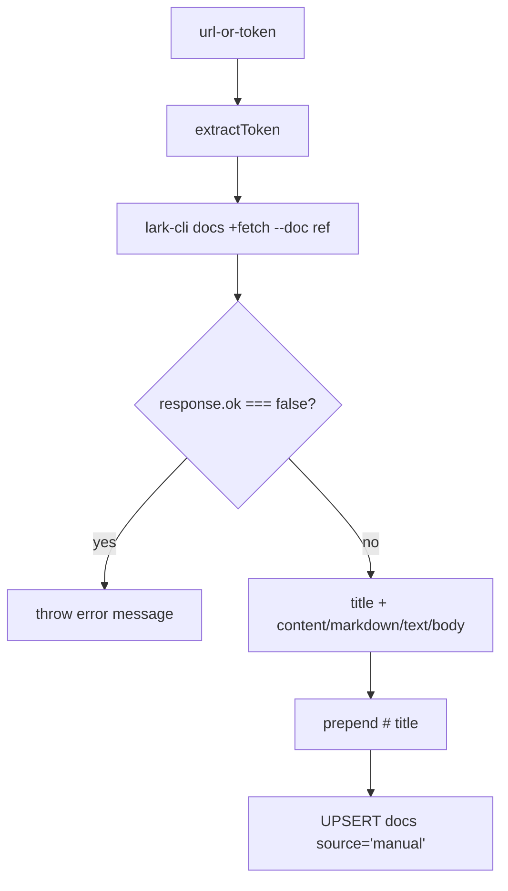
```mermaid
flowchart TD
  Ref["url-or-token"] --> Token["extractToken"]
  Token --> Fetch["lark-cli docs +fetch --doc ref"]
  Fetch --> OK{"response.ok === false?"}
  OK -->|yes| Error["throw error message"]
  OK -->|no| Extract["title + content/markdown/text/body"]
  Extract --> Markdown["prepend # title"]
  Markdown --> Upsert["UPSERT docs source='manual'"]
```

Sources: [src/commands/ingestDoc.ts:59-103](../../../project-repos/lark-context/src/commands/ingestDoc.ts#L59-L103)

<details class="source-snippets">
<summary>引用源码</summary>

<!-- source-snippets:start -->

#### `src/commands/ingestDoc.ts:59-103`

```typescript
export async function runIngestDoc(opts: IngestDocOpts): Promise<void> {
  const cfg = loadConfig(opts);
  const dbPath = join(cfg.rawDir, "raw.db");
  ensureInitialized(dbPath);
  const token = extractToken(opts.ref);

  const response = (await runJson(["docs", "+fetch", "--doc", opts.ref])) as
    | Record<string, unknown>
    | null;
  if (!response || typeof response !== "object") {
    throw new Error(`unexpected lark response: ${JSON.stringify(response)}`);
  }
  if (response.ok === false) {
    const err = response.error;
    const msg =
      err && typeof err === "object" && err !== null && "message" in err
        ? String((err as { message: unknown }).message)
        : String(err ?? response);
    throw new Error(`docs +fetch failed: ${msg}`);
  }
  let data = response.data;
  if (!data || typeof data !== "object") {
    data = { content: String(data ?? "") };
  }
  const { title, body } = extractContent(data as Record<string, unknown>);

  const header = title ? `# ${title}\n\n` : "";
  let md = header + body;
  if (!md.endsWith("\n")) md += "\n";

  const now = (opts._now ?? (() => new Date()))();
  const urlForDb = opts.ref.startsWith("http") ? opts.ref : "";
  const db = connect(dbPath);
  try {
    db.prepare(
      "INSERT INTO docs(doc_token, url, title, content_md, fetched_at, source) " +
        "VALUES(?, ?, ?, ?, ?, 'manual') " +
        "ON CONFLICT(doc_token) DO UPDATE SET " +
        "url=excluded.url, title=excluded.title, content_md=excluded.content_md, fetched_at=excluded.fetched_at",
    ).run(token, urlForDb, title, md, now.toISOString());
  } finally {
    db.close();
  }
  process.stdout.write(`ingested ${token} (${title || "(no title)"})\n`);
}
```

<!-- source-snippets:end -->
</details>
如果 `data` 没有 `content`、`markdown`、`text`、`body` 任一字符串字段，代码会把整个 data 作为 JSON code block 保存，确保仍有可展示内容。Sources: [src/commands/ingestDoc.ts:41-51](../../../project-repos/lark-context/src/commands/ingestDoc.ts#L41-L51)

<details class="source-snippets">
<summary>引用源码</summary>

<!-- source-snippets:start -->

#### `src/commands/ingestDoc.ts:41-51`

````typescript
function extractContent(data: Record<string, unknown>): { title: string; body: string } {
  const rawTitle = data.title ?? data.name ?? "";
  const title = typeof rawTitle === "string" ? rawTitle : "";
  for (const key of ["content", "markdown", "text", "body"] as const) {
    const v = data[key];
    if (typeof v === "string" && v.trim().length > 0) {
      return { title, body: v };
    }
  }
  return { title, body: "```json\n" + JSON.stringify(data, null, 2) + "\n```" };
}
````

<!-- source-snippets:end -->
</details>
`docs` 表用 `doc_token` 做主键，重复 ingest 同一 token 会更新 url、title、content_md、fetched_at，不产生重复行。Sources: [src/commands/ingestDoc.ts:89-98](../../../project-repos/lark-context/src/commands/ingestDoc.ts#L89-L98), [test/cmd-ingest-doc.test.ts:100-136](../../../project-repos/lark-context/test/cmd-ingest-doc.test.ts#L100-L136)

<details class="source-snippets">
<summary>引用源码</summary>

<!-- source-snippets:start -->

#### `src/commands/ingestDoc.ts:89-98`

```typescript
  const now = (opts._now ?? (() => new Date()))();
  const urlForDb = opts.ref.startsWith("http") ? opts.ref : "";
  const db = connect(dbPath);
  try {
    db.prepare(
      "INSERT INTO docs(doc_token, url, title, content_md, fetched_at, source) " +
        "VALUES(?, ?, ?, ?, ?, 'manual') " +
        "ON CONFLICT(doc_token) DO UPDATE SET " +
        "url=excluded.url, title=excluded.title, content_md=excluded.content_md, fetched_at=excluded.fetched_at",
    ).run(token, urlForDb, title, md, now.toISOString());
```

#### `test/cmd-ingest-doc.test.ts:100-136`

```typescript
  it("persists title + markdown body + source='manual'", async () => {
    await freshInit();
    mockRunJson.mockResolvedValueOnce(FIXTURE);
    await runIngestDoc({ ref: "https://bytedance.feishu.cn/docx/XxxToken" });

    const cfg = loadConfig();
    const db = connect(join(cfg.rawDir, "raw.db"));
    try {
      const row = db
        .prepare("SELECT doc_token, title, content_md, source FROM docs")
        .get() as { doc_token: string; title: string; content_md: string; source: string };
      expect(row.doc_token).toBe("XxxToken");
      expect(row.title).toBe("项目 Alpha 架构评审 v3");
      expect(row.content_md).toContain("# 项目 Alpha 架构评审 v3");
      expect(row.content_md).toContain("## 里程碑");
      expect(row.content_md).toContain("- 周一：评审");
      expect(row.source).toBe("manual");
    } finally {
      db.close();
    }
  });

  it("second run upserts — no duplicate rows", async () => {
    await freshInit();
    mockRunJson.mockResolvedValue(FIXTURE);
    const url = "https://bytedance.feishu.cn/docx/XxxToken";
    await runIngestDoc({ ref: url });
    await runIngestDoc({ ref: url });
    const cfg = loadConfig();
    const db = connect(join(cfg.rawDir, "raw.db"));
    try {
      const count = (db.prepare("SELECT COUNT(*) AS c FROM docs").get() as any).c;
      expect(count).toBe(1);
    } finally {
      db.close();
    }
  });
```

<!-- source-snippets:end -->
</details>
## show 命令

`runShow` 默认窗口是 `24h`，通过 `parseDuration` 解析；`--chat all` 和省略 `--chat` 都表示所有 enabled 群。未知 alias 会报错，完全没有关注群也会报错。Sources: [src/commands/show.ts:31-48](../../../project-repos/lark-context/src/commands/show.ts#L31-L48), [src/durations.ts:1-29](../../../project-repos/lark-context/src/durations.ts#L1-L29)

<details class="source-snippets">
<summary>引用源码</summary>

<!-- source-snippets:start -->

#### `src/commands/show.ts:31-48`

```typescript
export async function runShow(opts: ShowOpts): Promise<void> {
  const cfg = loadConfig(opts);
  const dbPath = join(cfg.rawDir, "raw.db");
  ensureInitialized(dbPath);
  const delta = parseDuration(opts.since ?? "24h");
  const now = (opts._now ?? (() => new Date()))();
  const cutoff = new Date(now.getTime() - delta.totalMs).toISOString();
  const effectiveAlias =
    opts.chatAlias === "all" || !opts.chatAlias ? null : opts.chatAlias;
  const targets = cfg.groups.filter(
    (g) => g.enabled && (!effectiveAlias || g.alias === effectiveAlias),
  );
  if (effectiveAlias && targets.length === 0) {
    throw new Error(`unknown chat alias "${opts.chatAlias}"`);
  }
  if (targets.length === 0) {
    throw new Error("no whitelisted chats");
  }
```

#### `src/durations.ts:1-29`

```typescript
const UNITS: Record<string, number> = {
  m: 60 * 1000,
  h: 60 * 60 * 1000,
  d: 24 * 60 * 60 * 1000,
  w: 7 * 24 * 60 * 60 * 1000,
};

const PATTERN = /^(\d+)([mhdw])$/;

export interface Duration {
  totalMs: number;
}

export function parseDuration(text: unknown): Duration {
  if (typeof text !== "string") {
    throw new Error(`duration must be a string, got ${typeof text}`);
  }
  const m = PATTERN.exec(text.trim());
  if (!m) {
    throw new Error(
      `invalid duration ${JSON.stringify(text)}; expected <int><unit> where unit in m/h/d/w`
    );
  }
  const n = Number.parseInt(m[1], 10);
  if (n <= 0) {
    throw new Error(`duration must be positive, got ${JSON.stringify(text)}`);
  }
  return { totalMs: n * UNITS[m[2]] };
}
```

<!-- source-snippets:end -->
</details>
它先查顶层消息，再按顶层消息的 `thread_id` 查回复，把回复插回所属 root 后面，最后交给 `renderChatWindow`。这保证即使回复时间晚于下一条顶层消息，展示仍按话题归组。Sources: [src/commands/show.ts:50-109](../../../project-repos/lark-context/src/commands/show.ts#L50-L109), [test/cmd-show.test.ts:239-335](../../../project-repos/lark-context/test/cmd-show.test.ts#L239-L335)

<details class="source-snippets">
<summary>引用源码</summary>

<!-- source-snippets:start -->

#### `src/commands/show.ts:50-109`

```typescript
  const pieces: string[] = [];
  const db = connect(dbPath);
  try {
    const topStmt = db.prepare(
      "SELECT id, sender_name, content_text, create_time, thread_id " +
        "FROM messages WHERE chat_alias=? AND is_thread_reply=0 AND create_time >= ? " +
        "ORDER BY create_time",
    );
    const replyStmt = db.prepare(
      "SELECT sender_name, content_text, create_time " +
        "FROM messages WHERE chat_alias=? AND thread_id=? AND is_thread_reply=1 " +
        "ORDER BY create_time",
    );

    for (const g of targets) {
      const tops = topStmt.all(g.alias, cutoff) as Array<{
        id: string;
        sender_name: string;
        content_text: string;
        create_time: string;
        thread_id: string | null;
      }>;
      const messages: Array<{
        sender_name: string;
        content_text: string;
        create_time: string;
        is_thread_reply?: boolean;
      }> = [];
      for (const top of tops) {
        messages.push({
          sender_name: top.sender_name,
          content_text: top.content_text,
          create_time: top.create_time,
          is_thread_reply: false,
        });
        if (top.thread_id) {
          const replies = replyStmt.all(g.alias, top.thread_id) as Array<{
            sender_name: string;
            content_text: string;
            create_time: string;
          }>;
          for (const r of replies) {
            messages.push({
              sender_name: r.sender_name,
              content_text: r.content_text,
              create_time: r.create_time,
              is_thread_reply: true,
            });
          }
        }
      }
      pieces.push(
        renderChatWindow({
          chatName: g.name || g.alias,
          windowStart: cutoff.slice(0, 10),
          windowEnd: now.toISOString().slice(0, 10),
          messages,
        }),
      );
    }
```

#### `test/cmd-show.test.ts:239-335`

```typescript
  it("groups thread replies under their top-level message with ↳ prefix", async () => {
    await setup();
    const cfg = loadConfig();
    const dbPath = join(cfg.rawDir, "raw.db");
    const now = new Date();
    const t = (minsAgo: number) =>
      new Date(now.getTime() - minsAgo * 60_000).toISOString();

    insertTopLevel(dbPath, {
      id: "top1",
      chat_alias: "alpha",
      sender_name: "唐文城",
      content_text: "低版本app怎么兜底？",
      create_time: t(30),
      thread_id: "omt_1",
    });
    insertThreadReply(dbPath, {
      id: "rep1",
      chat_alias: "alpha",
      thread_id: "omt_1",
      sender_name: "韦振宁",
      content_text: "老板本不适配",
      create_time: t(20),
    });
    insertTopLevel(dbPath, {
      id: "top2",
      chat_alias: "alpha",
      sender_name: "李四",
      content_text: "下一条顶层",
      create_time: t(10),
    });

    const out: string[] = [];
    await runShow({
      chatAlias: "alpha",
      since: "1d",
      write: (s) => out.push(s),
      _now: () => now,
    });
    const joined = out.join("");

    const iRoot = joined.indexOf("低版本app怎么兜底？");
    const iReply = joined.indexOf("老板本不适配");
    const iNext = joined.indexOf("下一条顶层");
    expect(iRoot).toBeGreaterThan(-1);
    expect(iReply).toBeGreaterThan(iRoot);
    expect(iNext).toBeGreaterThan(iReply);
    expect(joined).toContain("  ↳ **韦振宁**");
  });

  it("keeps thread reply grouped even when its create_time is later than next top-level", async () => {
    await setup();
    const cfg = loadConfig();
    const dbPath = join(cfg.rawDir, "raw.db");
    const now = new Date();
    const t = (minsAgo: number) =>
      new Date(now.getTime() - minsAgo * 60_000).toISOString();

    insertTopLevel(dbPath, {
      id: "top1",
      chat_alias: "alpha",
      sender_name: "唐",
      content_text: "问题",
      create_time: t(60),
      thread_id: "omt_1",
    });
    insertTopLevel(dbPath, {
      id: "top2",
      chat_alias: "alpha",
      sender_name: "李",
      content_text: "中间的顶层",
      create_time: t(40),
    });
    insertThreadReply(dbPath, {
      id: "rep_late",
      chat_alias: "alpha",
      thread_id: "omt_1",
      sender_name: "韦",
      content_text: "迟到的回复",
      create_time: t(10),
    });

    const out: string[] = [];
    await runShow({
      chatAlias: "alpha",
      since: "1d",
      write: (s) => out.push(s),
      _now: () => now,
    });
    const joined = out.join("");

    const iTop1 = joined.indexOf("问题");
    const iReply = joined.indexOf("迟到的回复");
    const iTop2 = joined.indexOf("中间的顶层");
    expect(iTop1).toBeLessThan(iReply);
    expect(iReply).toBeLessThan(iTop2);
  });
```

<!-- source-snippets:end -->
</details>
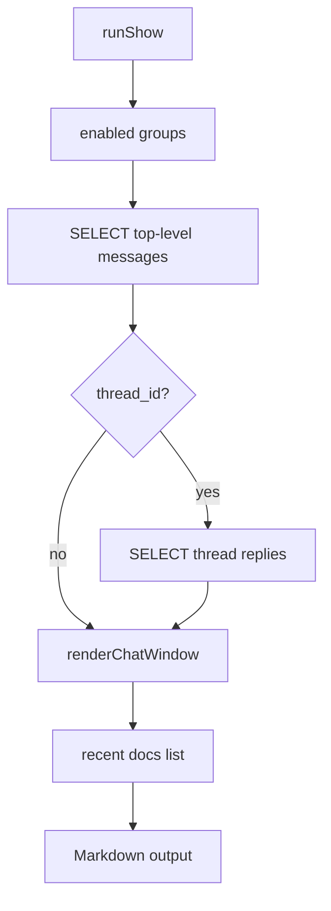
```mermaid
flowchart TD
  Show["runShow"] --> Targets["enabled groups"]
  Targets --> Top["SELECT top-level messages"]
  Top --> Reply{"thread_id?"}
  Reply -->|yes| Replies["SELECT thread replies"]
  Reply -->|no| Render
  Replies --> Render["renderChatWindow"]
  Render --> Docs["recent docs list"]
  Docs --> Output["Markdown output"]
```

Sources: [src/commands/show.ts:31-127](../../../project-repos/lark-context/src/commands/show.ts#L31-L127), [src/render.ts:16-40](../../../project-repos/lark-context/src/render.ts#L16-L40)

<details class="source-snippets">
<summary>引用源码</summary>

<!-- source-snippets:start -->

#### `src/commands/show.ts:31-127`

```typescript
export async function runShow(opts: ShowOpts): Promise<void> {
  const cfg = loadConfig(opts);
  const dbPath = join(cfg.rawDir, "raw.db");
  ensureInitialized(dbPath);
  const delta = parseDuration(opts.since ?? "24h");
  const now = (opts._now ?? (() => new Date()))();
  const cutoff = new Date(now.getTime() - delta.totalMs).toISOString();
  const effectiveAlias =
    opts.chatAlias === "all" || !opts.chatAlias ? null : opts.chatAlias;
  const targets = cfg.groups.filter(
    (g) => g.enabled && (!effectiveAlias || g.alias === effectiveAlias),
  );
  if (effectiveAlias && targets.length === 0) {
    throw new Error(`unknown chat alias "${opts.chatAlias}"`);
  }
  if (targets.length === 0) {
    throw new Error("no whitelisted chats");
  }

  const pieces: string[] = [];
  const db = connect(dbPath);
  try {
    const topStmt = db.prepare(
      "SELECT id, sender_name, content_text, create_time, thread_id " +
        "FROM messages WHERE chat_alias=? AND is_thread_reply=0 AND create_time >= ? " +
        "ORDER BY create_time",
    );
    const replyStmt = db.prepare(
      "SELECT sender_name, content_text, create_time " +
        "FROM messages WHERE chat_alias=? AND thread_id=? AND is_thread_reply=1 " +
        "ORDER BY create_time",
    );

    for (const g of targets) {
      const tops = topStmt.all(g.alias, cutoff) as Array<{
        id: string;
        sender_name: string;
        content_text: string;
        create_time: string;
        thread_id: string | null;
      }>;
      const messages: Array<{
        sender_name: string;
        content_text: string;
        create_time: string;
        is_thread_reply?: boolean;
      }> = [];
      for (const top of tops) {
        messages.push({
          sender_name: top.sender_name,
          content_text: top.content_text,
          create_time: top.create_time,
          is_thread_reply: false,
        });
        if (top.thread_id) {
          const replies = replyStmt.all(g.alias, top.thread_id) as Array<{
            sender_name: string;
            content_text: string;
            create_time: string;
          }>;
          for (const r of replies) {
            messages.push({
              sender_name: r.sender_name,
              content_text: r.content_text,
              create_time: r.create_time,
              is_thread_reply: true,
            });
          }
        }
      }
      pieces.push(
        renderChatWindow({
          chatName: g.name || g.alias,
          windowStart: cutoff.slice(0, 10),
          windowEnd: now.toISOString().slice(0, 10),
          messages,
        }),
      );
    }
    const docs = db
      .prepare(
        "SELECT doc_token, title, url FROM docs WHERE fetched_at >= ? ORDER BY fetched_at DESC",
      )
      .all(cutoff) as Array<{ doc_token: string; title: string; url: string }>;
    if (docs.length > 0) {
      pieces.push("### 近期入库的文档\n");
      for (const d of docs) {
        pieces.push(`- [${d.title || d.doc_token}](${d.url})  (token=\`${d.doc_token}\`)`);
      }
      pieces.push("");
    }
  } finally {
    db.close();
  }
  const write = opts.write ?? ((s: string) => process.stdout.write(s));
  write(pieces.join("\n") + "\n");
}
```

#### `src/render.ts:16-40`

```typescript
export function renderChatWindow(args: {
  chatName: string;
  windowStart: string;
  windowEnd: string;
  messages: Message[];
}): string {
  const lines: string[] = [
    `## ${args.chatName}  (${args.windowStart} ~ ${args.windowEnd})`,
    "",
  ];
  if (args.messages.length === 0) {
    lines.push("(no messages)");
    return lines.join("\n") + "\n";
  }
  for (const m of args.messages) {
    const prefix = m.is_thread_reply ? "  ↳ " : "";
    lines.push(
      `${prefix}**${m.sender_name ?? "?"}** ${fmtTime(m.create_time ?? "")}`,
    );
    const text = m.content_text ?? "";
    const textLines = text.length === 0 ? [""] : text.split("\n");
    for (const tl of textLines) lines.push(`${prefix}  ${tl}`);
    lines.push("");
  }
  return lines.join("\n").replace(/\s+$/, "") + "\n";
```

<!-- source-snippets:end -->
</details>
## 渲染格式

`renderChatWindow` 输出二级标题、窗口范围、发送者和时间。`is_thread_reply` 为 true 的消息前缀是两个空格加 `↳`，正文每行也同样缩进；空窗口输出 `(no messages)`。Sources: [src/render.ts:16-40](../../../project-repos/lark-context/src/render.ts#L16-L40), [skills/lark-context/references/show.md:22-38](../../../project-repos/lark-context/skills/lark-context/references/show.md#L22-L38)

<details class="source-snippets">
<summary>引用源码</summary>

<!-- source-snippets:start -->

#### `src/render.ts:16-40`

```typescript
export function renderChatWindow(args: {
  chatName: string;
  windowStart: string;
  windowEnd: string;
  messages: Message[];
}): string {
  const lines: string[] = [
    `## ${args.chatName}  (${args.windowStart} ~ ${args.windowEnd})`,
    "",
  ];
  if (args.messages.length === 0) {
    lines.push("(no messages)");
    return lines.join("\n") + "\n";
  }
  for (const m of args.messages) {
    const prefix = m.is_thread_reply ? "  ↳ " : "";
    lines.push(
      `${prefix}**${m.sender_name ?? "?"}** ${fmtTime(m.create_time ?? "")}`,
    );
    const text = m.content_text ?? "";
    const textLines = text.length === 0 ? [""] : text.split("\n");
    for (const tl of textLines) lines.push(`${prefix}  ${tl}`);
    lines.push("");
  }
  return lines.join("\n").replace(/\s+$/, "") + "\n";
```

#### `skills/lark-context/references/show.md:22-38`

````markdown
### 输出格式（`renderChatWindow` 产）

```
## 群 A  (2026-04-18 ~ 2026-04-19)

**张三** 2026-04-18 10:00
  消息内容
  （多行对齐）

**李四** 2026-04-18 10:05
  回复
```

- 回复线程前缀 `  ↳ `
- 空窗口输出 `(no messages)`
- 末尾可能带 `### 近期入库的文档` 区块（列出窗口内被 ingest 的文档）

````

<!-- source-snippets:end -->
</details>
## show-doc 命令

`show-doc` 通过 token 或 URL 查找已入库文档。URL 会用路径第二段提 token；查询条件是 `doc_token=? OR url=?`。未找到时返回 `no ingested doc matches "<ref>"`，找到就原样输出保存的 Markdown。Sources: [src/commands/show.ts:11-22](../../../project-repos/lark-context/src/commands/show.ts#L11-L22), [src/commands/show.ts:129-154](../../../project-repos/lark-context/src/commands/show.ts#L129-L154), [test/cmd-show.test.ts:338-375](../../../project-repos/lark-context/test/cmd-show.test.ts#L338-L375)

<details class="source-snippets">
<summary>引用源码</summary>

<!-- source-snippets:start -->

#### `src/commands/show.ts:11-22`

```typescript
export function tokenFromRef(ref: string): string {
  if (ref.startsWith("http")) {
    try {
      const url = new URL(ref);
      const parts = url.pathname.split("/").filter(Boolean);
      if (parts.length >= 2) return parts[1];
    } catch {
      // fall through
    }
  }
  return ref;
}
```

#### `src/commands/show.ts:129-154`

```typescript
export interface ShowDocOpts extends LoadConfigOptions {
  ref: string;
  write?: (s: string) => void;
}

export async function runShowDoc(opts: ShowDocOpts): Promise<void> {
  const cfg = loadConfig(opts);
  const dbPath = join(cfg.rawDir, "raw.db");
  ensureInitialized(dbPath);
  const token = tokenFromRef(opts.ref);
  const db = connect(dbPath);
  let content_md: string | undefined;
  try {
    const row = db
      .prepare("SELECT content_md FROM docs WHERE doc_token=? OR url=?")
      .get(token, opts.ref) as { content_md: string } | undefined;
    content_md = row?.content_md;
  } finally {
    db.close();
  }
  if (!content_md) {
    throw new Error(`no ingested doc matches "${opts.ref}"`);
  }
  const write = opts.write ?? ((s: string) => process.stdout.write(s));
  write(content_md);
}
```

#### `test/cmd-show.test.ts:338-375`

```typescript
describe("runShowDoc", () => {
  function insertDoc(dbPath: string, token: string, url: string) {
    const db = connect(dbPath);
    try {
      db.prepare(
        "INSERT INTO docs(doc_token, url, title, content_md, fetched_at, source) " +
          "VALUES(?, ?, '架构评审', '# 架构评审\\n\\n内容', ?, 'manual')",
      ).run(token, url, new Date().toISOString());
    } finally {
      db.close();
    }
  }

  it("looks up by token", async () => {
    await setup();
    const cfg = loadConfig();
    insertDoc(join(cfg.rawDir, "raw.db"), "tok", "https://x.feishu.cn/docx/tok");
    const out: string[] = [];
    await runShowDoc({ ref: "tok", write: (s) => out.push(s) });
    expect(out.join("")).toContain("# 架构评审");
    expect(out.join("")).toContain("内容");
  });

  it("looks up by full URL (matches either doc_token or url column)", async () => {
    await setup();
    const cfg = loadConfig();
    insertDoc(join(cfg.rawDir, "raw.db"), "tok", "https://x.feishu.cn/docx/tok");
    const out: string[] = [];
    await runShowDoc({ ref: "https://x.feishu.cn/docx/tok", write: (s) => out.push(s) });
    expect(out.join("")).toContain("# 架构评审");
  });

  it("errors on missing token", async () => {
    await setup();
    await expect(
      runShowDoc({ ref: "missing-token", write: () => {} }),
    ).rejects.toThrow(/no ingested doc matches/);
  });
```

<!-- source-snippets:end -->
</details>
## 与 skill 的剪裁契约

`show.md` 要求消息超过 100 条时先询问是否收窄窗口，文档超过 5000 字时摘要而不是全文塞回对话。这个限制在 CLI 中没有实现，是 skill/agent 使用 CLI 输出时必须遵守的展示边界。Sources: [skills/lark-context/references/show.md:48-53](../../../project-repos/lark-context/skills/lark-context/references/show.md#L48-L53)

<details class="source-snippets">
<summary>引用源码</summary>

<!-- source-snippets:start -->

#### `skills/lark-context/references/show.md:48-53`

```markdown
## 给用户回复的剪裁原则

- **消息 > 100 条**：回给用户之前先提醒"窗口内有 N 条消息，是否收窄到某个群或更短时间？"让用户决定。不要默默粘一大坨
- **文档 > 5000 字**：摘要几个要点 + 给原文链接，不把全文塞回对话
- **没消息但窗口合理**：直接回 "(no messages)"——不要推测说"可能是群沉了"之类

```

<!-- source-snippets:end -->
</details>
## 相关页面

- [消息拉取与话题回复流水线](pull-thread-pipeline.md)
- [Skill 与记忆工作流](skill-memory-workflows.md)
- [CLI 命令面](cli-command-surface.md)

---

<details>
<summary>相关源文件</summary>

生成本页时使用的主要源文件：

- [skills/lark-context/SKILL.md](../../../project-repos/lark-context/skills/lark-context/SKILL.md)
- [skills/lark-context/references/digest.md](../../../project-repos/lark-context/skills/lark-context/references/digest.md)
- [skills/lark-context/references/todo.md](../../../project-repos/lark-context/skills/lark-context/references/todo.md)
- [skills/lark-context/references/pull.md](../../../project-repos/lark-context/skills/lark-context/references/pull.md)
- [skills/lark-context/references/show.md](../../../project-repos/lark-context/skills/lark-context/references/show.md)
- [skills/lark-context/references/ingest-doc.md](../../../project-repos/lark-context/skills/lark-context/references/ingest-doc.md)
- [README.md](../../../project-repos/lark-context/README.md)
- [GETTING_STARTED.md](../../../project-repos/lark-context/GETTING_STARTED.md)

</details>

# Skill 与记忆工作流

`skills/lark-context` 是仓库的 agent-facing 层。它定义 `/lark-context <自然语言>` 的触发语义、前置检查、意图路由、错误处理和记忆目录约定；具体 workflow 放在 `references/` 下。Sources: [skills/lark-context/SKILL.md:1-13](../../../project-repos/lark-context/skills/lark-context/SKILL.md#L1-L13), [skills/lark-context/SKILL.md:31-48](../../../project-repos/lark-context/skills/lark-context/SKILL.md#L31-L48)

<details class="source-snippets">
<summary>引用源码</summary>

<!-- source-snippets:start -->

#### `skills/lark-context/SKILL.md:1-13`

```markdown
---
name: lark-context
version: 0.1.0
description: "飞书（Lark）上下文桥：把群聊和文档沉淀到本地记忆库给 Claude 长期使用。当用户说【沉淀/整理/记忆】某群、【拉/同步】消息、【收下/入库】文档、【最近聊了啥】、【我有什么 TODO】、查看/关注/取消关注飞书群时触发。"
metadata:
  requires:
    bins: ["lark-context", "lark-cli"]
  cliHelp: "lark-context --help"
---

# lark-context

把飞书群聊和文档**持续沉淀**到本地，由 Claude 按需提炼成长期记忆。**用户通过 `/lark-context <自然语言>` 调用**，本 skill 负责把意图路由到对应 workflow。
```

#### `skills/lark-context/SKILL.md:31-48`

```markdown
## 意图路由

根据用户自然语言里的关键词选一条路径。**只路由一次**，不要在 references 之间来回跳。

| 触发关键词 | 意图 | 处理方式 |
|---|---|---|
| 沉淀 / 整理 / 记忆 / digest | **digest** | 读 [`references/digest.md`](references/digest.md) 执行 workflow |
| TODO / 待办 / 有啥事 / 该做啥 | **todo** | 读 [`references/todo.md`](references/todo.md) |
| 拉 / 同步 / pull / 更新 | **pull** | 读 [`references/pull.md`](references/pull.md) |
| 收下 / 入库 / 文档 URL（含 `/docx/` / `/wiki/` / `/docs/` / `/base/` / `/file/`） | **ingest-doc** | 读 [`references/ingest-doc.md`](references/ingest-doc.md) |
| 看看 / 最近聊了 / show | **show** | 读 [`references/show.md`](references/show.md) |
| 哪些群 / 列群 / 所有群 / 当前关注 | **list-groups / groups list** | 直接跑对应 CLI 命令，无需 reference |
| 关注 / 加群 / 取消关注 / alias | **groups add/rm** | 直接跑 CLI，无需 reference |

**意图不明**（用户说了一句模糊的话，比如"嗯嗯"或只贴一段描述）：不要猜。**反问**"你是想沉淀 / 拉消息 / 看 TODO / 看最近消息 / 管理群 中哪一项？"——用户澄清后再路由。

**多意图同时出现**（比如"拉一下最近消息然后沉淀"）：**分两步**——先执行第一个（pull），完成后再执行第二个（digest）。不要试图合并。

```

<!-- source-snippets:end -->
</details>
## 意图路由

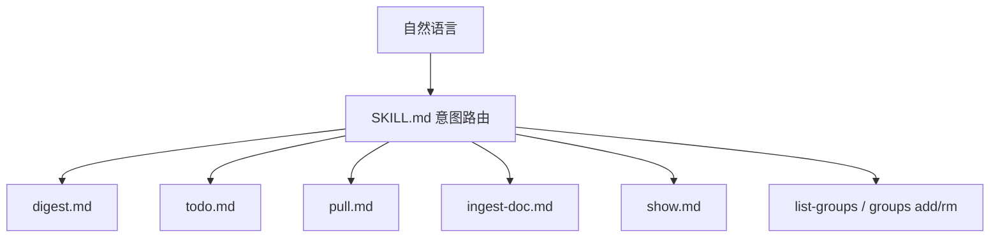
```mermaid
flowchart TD
  NL["自然语言"] --> Router["SKILL.md 意图路由"]
  Router --> Digest["digest.md"]
  Router --> Todo["todo.md"]
  Router --> Pull["pull.md"]
  Router --> Ingest["ingest-doc.md"]
  Router --> Show["show.md"]
  Router --> Direct["list-groups / groups add/rm"]
```

Sources: [skills/lark-context/SKILL.md:31-48](../../../project-repos/lark-context/skills/lark-context/SKILL.md#L31-L48)

<details class="source-snippets">
<summary>引用源码</summary>

<!-- source-snippets:start -->

#### `skills/lark-context/SKILL.md:31-48`

```markdown
## 意图路由

根据用户自然语言里的关键词选一条路径。**只路由一次**，不要在 references 之间来回跳。

| 触发关键词 | 意图 | 处理方式 |
|---|---|---|
| 沉淀 / 整理 / 记忆 / digest | **digest** | 读 [`references/digest.md`](references/digest.md) 执行 workflow |
| TODO / 待办 / 有啥事 / 该做啥 | **todo** | 读 [`references/todo.md`](references/todo.md) |
| 拉 / 同步 / pull / 更新 | **pull** | 读 [`references/pull.md`](references/pull.md) |
| 收下 / 入库 / 文档 URL（含 `/docx/` / `/wiki/` / `/docs/` / `/base/` / `/file/`） | **ingest-doc** | 读 [`references/ingest-doc.md`](references/ingest-doc.md) |
| 看看 / 最近聊了 / show | **show** | 读 [`references/show.md`](references/show.md) |
| 哪些群 / 列群 / 所有群 / 当前关注 | **list-groups / groups list** | 直接跑对应 CLI 命令，无需 reference |
| 关注 / 加群 / 取消关注 / alias | **groups add/rm** | 直接跑 CLI，无需 reference |

**意图不明**（用户说了一句模糊的话，比如"嗯嗯"或只贴一段描述）：不要猜。**反问**"你是想沉淀 / 拉消息 / 看 TODO / 看最近消息 / 管理群 中哪一项？"——用户澄清后再路由。

**多意图同时出现**（比如"拉一下最近消息然后沉淀"）：**分两步**——先执行第一个（pull），完成后再执行第二个（digest）。不要试图合并。

```

<!-- source-snippets:end -->
</details>
skill 明确要求“只路由一次”，意图不明时反问，多意图时分两步执行。比如“拉一下最近消息然后沉淀”先执行 pull，再执行 digest，而不是混成一个命令。Sources: [skills/lark-context/SKILL.md:31-48](../../../project-repos/lark-context/skills/lark-context/SKILL.md#L31-L48)

<details class="source-snippets">
<summary>引用源码</summary>

<!-- source-snippets:start -->

#### `skills/lark-context/SKILL.md:31-48`

```markdown
## 意图路由

根据用户自然语言里的关键词选一条路径。**只路由一次**，不要在 references 之间来回跳。

| 触发关键词 | 意图 | 处理方式 |
|---|---|---|
| 沉淀 / 整理 / 记忆 / digest | **digest** | 读 [`references/digest.md`](references/digest.md) 执行 workflow |
| TODO / 待办 / 有啥事 / 该做啥 | **todo** | 读 [`references/todo.md`](references/todo.md) |
| 拉 / 同步 / pull / 更新 | **pull** | 读 [`references/pull.md`](references/pull.md) |
| 收下 / 入库 / 文档 URL（含 `/docx/` / `/wiki/` / `/docs/` / `/base/` / `/file/`） | **ingest-doc** | 读 [`references/ingest-doc.md`](references/ingest-doc.md) |
| 看看 / 最近聊了 / show | **show** | 读 [`references/show.md`](references/show.md) |
| 哪些群 / 列群 / 所有群 / 当前关注 | **list-groups / groups list** | 直接跑对应 CLI 命令，无需 reference |
| 关注 / 加群 / 取消关注 / alias | **groups add/rm** | 直接跑 CLI，无需 reference |

**意图不明**（用户说了一句模糊的话，比如"嗯嗯"或只贴一段描述）：不要猜。**反问**"你是想沉淀 / 拉消息 / 看 TODO / 看最近消息 / 管理群 中哪一项？"——用户澄清后再路由。

**多意图同时出现**（比如"拉一下最近消息然后沉淀"）：**分两步**——先执行第一个（pull），完成后再执行第二个（digest）。不要试图合并。

```

<!-- source-snippets:end -->
</details>
## 前置检查和错误处理

执行任何 workflow 前先跑 `lark-context --version`，要求至少 `0.1.0`。如果 `lark-cli` 未安装或未登录，skill 要透传 CLI stderr，不尝试替用户登录。Sources: [skills/lark-context/SKILL.md:15-29](../../../project-repos/lark-context/skills/lark-context/SKILL.md#L15-L29)

<details class="source-snippets">
<summary>引用源码</summary>

<!-- source-snippets:start -->

#### `skills/lark-context/SKILL.md:15-29`

````markdown
## 前置依赖

用户必须已安装两个 CLI：
- `lark-context` ≥ 0.1.0（本项目 CLI，`bnpm i -g @tiktok-fe/lark-context`）
- `lark-cli`（飞书官方 CLI，`bnpm i -g @larksuite/cli` + `lark-cli auth login`）

**版本自检**：在执行任何意图 workflow 前，第一步跑：

```bash
lark-context --version
```

若不达 `0.1.0` 起，提示用户：`bnpm i -g @tiktok-fe/lark-context@latest`，然后中止本次调用。

若 `lark-cli` 未安装或未登录，`lark-context init` / 其他命令会直接报错；**透传**错误 stderr 给用户，**不要**尝试替用户登录（需要浏览器交互）。
````

<!-- source-snippets:end -->
</details>
错误处理原则是 CLI 非零退出时透传 stderr，不编造解释；references 缺失说明 skill 安装损坏；网络或超时不自动重试。Sources: [skills/lark-context/SKILL.md:69-73](../../../project-repos/lark-context/skills/lark-context/SKILL.md#L69-L73)

<details class="source-snippets">
<summary>引用源码</summary>

<!-- source-snippets:start -->

#### `skills/lark-context/SKILL.md:69-73`

```markdown
## 错误处理

- **CLI 非零退出**：透传 stderr 给用户，**不编造解释**。若命中已知场景（lark-cli 未装 / 未 auth / chat 被踢出群），补一句操作建议；否则就是透传
- **`references/` 文件缺失**：说明 skill 装坏了。提示用户：`npx skills update lark-context` 或重新 `npx skills add <repo> -g -y`
- **网络错 / lark-cli 超时**：不自动重试（拉消息幂等但失败通常要手动判断），交给用户处理
```

<!-- source-snippets:end -->
</details>
## digest 工作流

digest 的输入是 `lark-context show` 原文，目标是更新 `journal/`、`entities/` 和 `MEMORY.md`，并在 `kv.last_digest_at` 写时间戳。workflow 强调 show 输出是唯一事实来源，不能从记忆中补 show 里没出现的事实。Sources: [skills/lark-context/references/digest.md:8-10](../../../project-repos/lark-context/skills/lark-context/references/digest.md#L8-L10), [skills/lark-context/references/digest.md:42-50](../../../project-repos/lark-context/skills/lark-context/references/digest.md#L42-L50)

<details class="source-snippets">
<summary>引用源码</summary>

<!-- source-snippets:start -->

#### `skills/lark-context/references/digest.md:8-10`

```markdown
**目标**：读 `lark-context show` 原文 → 更新 `~/.claude/lark-memory/` 下的 journal（流水）和 entities（稳定层）→ 在 `kv.last_digest_at` 写时间戳。

**全过程由 Claude 本地完成，不调任何外部 LLM API**。
```

#### `skills/lark-context/references/digest.md:42-50`

````markdown
## Step 3 — 读原始材料

```bash
lark-context show [--chat <alias>] --since <window>
```

输出是本次沉淀的**唯一事实来源**。不要捏造、不要从记忆里补 show 里没出现的事。

若 `show` 输出为空（没有新消息）→ 告诉用户"窗口内没有新消息"，**不**写入任何文件，跳到 Step 7 但不更新时间戳（或更新时间戳但不生成实体，按执行判断）。
````

<!-- source-snippets:end -->
</details>
```mermaid
flowchart TD
  Last["读取 kv.last_digest_at"] --> Window["决定 --since 窗口"]
  Window --> Alias["解析 chat alias"]
  Alias --> Show["lark-context show"]
  Show --> Journal["更新 journal/<ISO-week>.md"]
  Show --> Entities["增量 merge entities"]
  Entities --> Index["更新 MEMORY.md"]
  Journal --> Index
  Index --> KV["写 last_digest_at"]
```

Sources: [skills/lark-context/references/digest.md:14-29](../../../project-repos/lark-context/skills/lark-context/references/digest.md#L14-L29), [skills/lark-context/references/digest.md:30-97](../../../project-repos/lark-context/skills/lark-context/references/digest.md#L30-L97)

<details class="source-snippets">
<summary>引用源码</summary>

<!-- source-snippets:start -->

#### `skills/lark-context/references/digest.md:14-29`

````markdown
## Step 1 — 决定时间窗口

读上次沉淀时间戳：

```bash
sqlite3 ~/.lark-context/raw.db "SELECT value FROM kv WHERE key='last_digest_at'"
```

根据结果和用户输入选窗口：

| 情况 | 窗口 |
|---|---|
| `last_digest_at` 有值且用户没说窗口 | `--since 24h` |
| `last_digest_at` 为空 + 用户点名了特定群 | `--since 90d`（首次沉淀该群，按 3 个月兜底） |
| 用户明确说了"最近 3 天 / 一周 / 12 小时" | 按用户说的 |

````

#### `skills/lark-context/references/digest.md:30-97`

````markdown
## Step 2 — 识别 chat 过滤

用户说的名字/alias 要解析成一个具体的 alias：

```bash
lark-context groups list
```

匹配用户说的"TTADK 学习交流" → alias `ttadk_learn`（示例）。若无匹配且看起来是新群：先确认 alias 没加过（`groups add` 再 `pull`），但沉淀本身不主动加群——提示用户走 `groups add` / `pull` 流程。

如果用户说"所有群" / 不点名 → 不加 `--chat` flag（默认 all）。

## Step 3 — 读原始材料

```bash
lark-context show [--chat <alias>] --since <window>
```

输出是本次沉淀的**唯一事实来源**。不要捏造、不要从记忆里补 show 里没出现的事。

若 `show` 输出为空（没有新消息）→ 告诉用户"窗口内没有新消息"，**不**写入任何文件，跳到 Step 7 但不更新时间戳（或更新时间戳但不生成实体，按执行判断）。

## Step 4 — 更新 journal（流水层）

目标文件：`~/.claude/lark-memory/journal/<ISO-week>.md`（例如 `2026-W16.md`）。

- 如果文件不存在，创建时带 YAML frontmatter（`name` / `description` / `type: journal` / `updated_at`）+ `# 2026-WNN` 一级标题
- 按日期追加子章节 `## 2026-MM-DD`
- 每条事件一行 bullet，格式 `- **#群名** 人 时间：内容简述（关键数字 / 链接 / 决策保留）`
- 只记"值得回看"的事；闲聊 / 表情回复不进 journal

## Step 5 — 增量 merge entities（稳定层）

对 show 输出里出现的每个**人 / 项目 / 术语 / 决策**，判断是否值得建/更新 entity：

1. 计算 slug：`zhang_san`（人）、`moy26_program`（项目）、`ttadk_claude_share`（决策）、术语并入 `entities/terms.md`
2. 读现有文件（若有）：
   - 人：`entities/people/<slug>.md`
   - 项目：`entities/projects/<slug>.md`
   - 决策：`entities/decisions/<slug>.md`
   - 术语：`entities/terms.md`（单文件多条目）
3. **增量 merge**：
   - 保留用户手工写的段落**原封不动**
   - 新事实追加到文件末尾（或相关章节），带日期标签
   - 如果新信息让 summary 过时，允许**改写** summary 段落
4. 更新 frontmatter 的 `updated_at`

**价值判断**：第一次看到的短暂提及不建新 entity。出现≥2 次、或用户说"记一下"、或是可执行决策 → 建。宁缺毋滥。

## Step 6 — 更新 MEMORY.md 索引

`~/.claude/lark-memory/MEMORY.md` 每个 entity 文件一行：

```
- [标题](relative/path/from/MEMORY.md.md) — 一句话 hook
```

- 新建文件 → 追加一行
- 改了 entity 的 summary → 更新这行的 hook
- 不删除行除非用户明确说"删掉这条"

MEMORY.md 前 200 行会被 `~/.claude/CLAUDE.md` 里的 `@~/.claude/lark-memory/MEMORY.md` 语法自动加载到每个会话，所以**超过 200 行会被截断**——如果快到上限，主动提示用户该折叠/归档。

## Step 7 — 写时间戳

```bash
sqlite3 ~/.lark-context/raw.db "INSERT INTO kv(key,value) VALUES('last_digest_at', datetime('now')) ON CONFLICT(key) DO UPDATE SET value=excluded.value"
```
````

<!-- source-snippets:end -->
</details>
entity 更新有强约束：保留用户手写段落，新事实追加或更新 summary，第一次短暂提及不建实体，出现多次、用户明确要求或可执行决策才建。Sources: [skills/lark-context/references/digest.md:61-78](../../../project-repos/lark-context/skills/lark-context/references/digest.md#L61-L78), [skills/lark-context/references/digest.md:109-114](../../../project-repos/lark-context/skills/lark-context/references/digest.md#L109-L114)

<details class="source-snippets">
<summary>引用源码</summary>

<!-- source-snippets:start -->

#### `skills/lark-context/references/digest.md:61-78`

```markdown
## Step 5 — 增量 merge entities（稳定层）

对 show 输出里出现的每个**人 / 项目 / 术语 / 决策**，判断是否值得建/更新 entity：

1. 计算 slug：`zhang_san`（人）、`moy26_program`（项目）、`ttadk_claude_share`（决策）、术语并入 `entities/terms.md`
2. 读现有文件（若有）：
   - 人：`entities/people/<slug>.md`
   - 项目：`entities/projects/<slug>.md`
   - 决策：`entities/decisions/<slug>.md`
   - 术语：`entities/terms.md`（单文件多条目）
3. **增量 merge**：
   - 保留用户手工写的段落**原封不动**
   - 新事实追加到文件末尾（或相关章节），带日期标签
   - 如果新信息让 summary 过时，允许**改写** summary 段落
4. 更新 frontmatter 的 `updated_at`

**价值判断**：第一次看到的短暂提及不建新 entity。出现≥2 次、或用户说"记一下"、或是可执行决策 → 建。宁缺毋滥。

```

#### `skills/lark-context/references/digest.md:109-114`

```markdown
## 注意事项

- **不要 fabricate**：只记 show 输出里的事实。写实体 summary 时允许综合多条信息，但不能凭空推断
- **保留用户手工内容**：entities 里手写的段落永远不动。只在机器可识别区域（dated bullet、summary 段）追加/改写
- **遇到冲突（同一事实两个来源说法不同）**：在 entity 文件里两条都列，标注来源（群 + 日期 + 发言人），让用户自己判断
- **windows 覆盖合理性**：如果用户指定的 `--since` 窗口太窄（比如 "1h"）但实际没消息，报告窗口太窄，不要硬写
```

<!-- source-snippets:end -->
</details>
## TODO 工作流

TODO 不落盘，每次从 `show` 输出和最新 journal 临时抽取。它识别直接点名、显式 ddl、`@all` 动作、被问未回等模式，排除闲聊、别人之间的对话和已有人接走的事项。Sources: [skills/lark-context/references/todo.md:1-8](../../../project-repos/lark-context/skills/lark-context/references/todo.md#L1-L8), [skills/lark-context/references/todo.md:21-34](../../../project-repos/lark-context/skills/lark-context/references/todo.md#L21-L34)

<details class="source-snippets">
<summary>引用源码</summary>

<!-- source-snippets:start -->

#### `skills/lark-context/references/todo.md:1-8`

```markdown
# TODO 抽取 Workflow

用户触发：
- `/lark-context 我有啥 TODO` / `/lark-context 看看待办`
- `/lark-context 今天该做啥` / "列一下我要回的事"

**本 workflow 不落盘**——每次现抽，不持久化。用户想留档 → 建议在沉淀时自己记到 journal。

```

#### `skills/lark-context/references/todo.md:21-34`

```markdown
## Step 2 — 扫原文抽候选

从 show 输出里找这些模式（LLM 判断即可，不用正则硬匹）：

1. **直接点名**：`@当前用户` + 动作动词（做 / 看 / 跟进 / 对齐 / 确认 / 回复 / review / check 等）
2. **显式 ddl**：今天 / 今晚 / 明早 / 本周 / 下周一 / 周五前 / XX 月 XX 日
3. **@all 且含动作**：比如"大家这周内提 MR"——当前用户隐含要执行
4. **被问 + 未回**：消息里 `@我` 问了问题但没看到回复 → 候选

**不要**把这些当 TODO：
- 闲聊、表情回复、单纯告知
- 别人之间的对话（没 @ 到当前用户）
- 已经明确有别人接的（"X 我来处理"后面）

```

<!-- source-snippets:end -->
</details>
排序先看明确 ddl，再看紧急关键词，最后按被 @ 次数；输出是 Markdown checklist，并且每条附原文摘要或链接。Sources: [skills/lark-context/references/todo.md:43-73](../../../project-repos/lark-context/skills/lark-context/references/todo.md#L43-L73)

<details class="source-snippets">
<summary>引用源码</summary>

<!-- source-snippets:start -->

#### `skills/lark-context/references/todo.md:43-73`

````markdown
## Step 4 — 排序

先紧急度，再优先级：

1. **有明确 ddl** → 按 ddl 升序（今天最前 / 本周次之 / 下周再次）
2. **无 ddl + 紧急关键词** → "紧急 / ASAP / 尽快 / 今天 / 明早"
3. **剩下的无 ddl** → 按被 @ 次数降序（同一件事反复被 @ 说明热度高）

## Step 5 — 输出

直接回用户一份 markdown 列表，不写任何文件：

```
## 待办（窗口：最近 N 天）

### 今天 / 最紧急
- [ ] @张三 在 #群名 的话题：<一句简述>（ddl: 今天 18:00）
  - 原文：<消息摘要 / 文档链接>

### 本周
- [ ] ...

### 没 ddl 的漂浮项
- [ ] ...
```

每条建议附**原文摘要或链接**（消息不超过 50 字，链接用 `<url>` 即可），方便用户回去查证。

## Step 6 — 不写时间戳

这工作流**不**写 `last_digest_at` — 它是查询，不是沉淀。
````

<!-- source-snippets:end -->
</details>
## pull/show/ingest 的 skill 约定

`pull.md` 规定首次拉某个 alias 时由 skill 显式传 `--since 90d`，这是 skill 约定，不是 CLI 默认值。它还要求把 200 页上限提示原样转述给用户，并在常见错误上给具体操作建议。Sources: [skills/lark-context/references/pull.md:12-20](../../../project-repos/lark-context/skills/lark-context/references/pull.md#L12-L20), [skills/lark-context/references/pull.md:28-46](../../../project-repos/lark-context/skills/lark-context/references/pull.md#L28-L46)

<details class="source-snippets">
<summary>引用源码</summary>

<!-- source-snippets:start -->

#### `skills/lark-context/references/pull.md:12-20`

```markdown
## 默认窗口

| 情况 | 用什么 |
|---|---|
| **首次拉某个 alias**（db 里没 `last_cursor`） | `--since 90d` |
| **已拉过的 alias**（增量） | 忽略 `--since`，自动从 `last_cursor` 续拉 |
| 用户说了具体窗口（"拉最近 3 天"） | 按用户说的 |

**90d 的由来**：首次拉的默认值是 skill 约定，不是 CLI 默认值。CLI 本身对首次无默认——所以 skill 必须显式传 `--since 90d`。
```

#### `skills/lark-context/references/pull.md:28-46`

````markdown
## 200 页上限

首次拉历史消息每群最多 200 页（约 10k 条）。到上限后 stderr 有：

```
<alias>: hit MAX_PAGES=200 cap; re-run to continue
```

把这条原样转述给用户，**并建议**再跑一次 `lark-context pull --chat <alias>` 续拉。

## 常见错误（透传 + 操作建议）

| CLI stderr 特征 | 原因 | 给用户的建议 |
|---|---|---|
| `permission_violations` / `required scope` | lark-cli auth 缺 scope | `lark-cli auth login --scope "im:message im:chat"`（具体 scope 按错误信息给） |
| `chat_not_found` | 用户被踢出群了 | `lark-context groups rm <alias>` 或留着忽略 |
| `ENOENT` / `lark-cli not found` | lark-cli 没装 | `bnpm i -g @larksuite/cli` |
| 某个 chat 被 CLI 自动 disable（`<alias>: DISABLED`） | 单群失败不中断全流程；其他群继续 | 看 stderr 哪个 alias 被禁，解决后 `groups add` 重加（重加会把 enabled 翻回 1） |

````

<!-- source-snippets:end -->
</details>
`ingest-doc.md` 说明支持的 URL 形态、底层 `docs +fetch`、同 token 幂等，以及老版 docs 或权限错误时透传。Sources: [skills/lark-context/references/ingest-doc.md:9-30](../../../project-repos/lark-context/skills/lark-context/references/ingest-doc.md#L9-L30), [skills/lark-context/references/ingest-doc.md:31-42](../../../project-repos/lark-context/skills/lark-context/references/ingest-doc.md#L31-L42)

<details class="source-snippets">
<summary>引用源码</summary>

<!-- source-snippets:start -->

#### `skills/lark-context/references/ingest-doc.md:9-30`

````markdown
## 支持的 URL 形态

| 形态 | 支持 | 备注 |
|---|---|---|
| `https://<host>/docx/<token>` | ✅ | 新版云文档 |
| `https://<host>/docs/<token>` | ⚠️ | lark-cli 若返回 `Unsupported document type: Legacy document` 则是老版文档，**透传**错误给用户（没别的办法） |
| `https://<host>/wiki/<token>` | ✅ 多数可用 | 底层是 `lark-cli docs +fetch` |
| `https://<host>/base/<token>` / `/file/<token>` | ⚠️ 按 CLI 返回判断 | 非 docs 类可能报不同错 |
| bare token（纯字母数字） | ✅ | URL query 部分（`?from=copy`）会被忽略 |

## 工作流

```bash
lark-context ingest-doc <url-or-token>
```

CLI 内部：
1. 从 URL 解析 token（`/docx/<token>`, `/docs/<token>` 等）
2. 调 `lark-cli docs +fetch --doc <ref>`
3. 拿 `data.title` + `data.content`（或 `markdown`/`text`/`body`）
4. UPSERT 到 `docs` 表（`source='manual'`）——**同 token 重复 ingest 幂等**

````

#### `skills/lark-context/references/ingest-doc.md:31-42`

````markdown
## 常见问题

- 粘贴含 query `?from=copy` → CLI 自动忽略，只取 `/docx/<token>` 部分
- URL 里 host 不含 `feishu` → CLI 报 `not a feishu URL`，换一个合法 URL 即可
- `lark-cli docs +fetch` 返回 `{ok: false}` → 透传 error message（比如文档权限缺失时会给 `permission` 错误，让用户去原文档页面点"允许" / 改权限）

## 示例

```bash
lark-context ingest-doc https://bytedance.feishu.cn/docx/AbCdEfGh1234
lark-context ingest-doc AbCdEfGh1234                  # bare token 也接受
```
````

<!-- source-snippets:end -->
</details>
`show.md` 说明 show 只读本地 SQLite，不拉新数据，并定义了输出剪裁原则。Sources: [skills/lark-context/references/show.md:8-20](../../../project-repos/lark-context/skills/lark-context/references/show.md#L8-L20), [skills/lark-context/references/show.md:48-53](../../../project-repos/lark-context/skills/lark-context/references/show.md#L48-L53)

<details class="source-snippets">
<summary>引用源码</summary>

<!-- source-snippets:start -->

#### `skills/lark-context/references/show.md:8-20`

````markdown
**目标**：从本地 SQLite 读出最近消息 / 文档，渲染给 Claude 或用户看。**不调 lark-cli，不拉新数据**——需要先跑 `pull` 才能保证数据新。

---

## `show` 命令

```bash
lark-context show [--chat <alias>|all] [--since <duration>]
```

- **默认窗口** `--since 24h`
- `--chat <alias>` 单群；`--chat all` 或省略 → 所有 `enabled=1` 的群
- 无关注群 → 报错 `no whitelisted chats`
````

#### `skills/lark-context/references/show.md:48-53`

```markdown
## 给用户回复的剪裁原则

- **消息 > 100 条**：回给用户之前先提醒"窗口内有 N 条消息，是否收窄到某个群或更短时间？"让用户决定。不要默默粘一大坨
- **文档 > 5000 字**：摘要几个要点 + 给原文链接，不把全文塞回对话
- **没消息但窗口合理**：直接回 "(no messages)"——不要推测说"可能是群沉了"之类

```

<!-- source-snippets:end -->
</details>
## 记忆目录契约

默认记忆目录是 `~/.claude/lark-memory/`，包含 `MEMORY.md`、`entities/people`、`entities/projects`、`entities/terms.md`、`entities/decisions` 和 `journal/<ISO-week>.md`。README 和 skill 都强调这些是 Markdown，用户可审可改。Sources: [README.md:148-175](../../../project-repos/lark-context/README.md#L148-L175), [GETTING_STARTED.md:92-107](../../../project-repos/lark-context/GETTING_STARTED.md#L92-L107), [skills/lark-context/SKILL.md:75-93](../../../project-repos/lark-context/skills/lark-context/SKILL.md#L75-L93)

<details class="source-snippets">
<summary>引用源码</summary>

<!-- source-snippets:start -->

#### `README.md:148-175`

````markdown
## 记忆文件结构

沉淀后的文件（由 Claude 在 `/lark-context 沉淀…` 里维护）：

```
~/.claude/lark-memory/
├── MEMORY.md            # 始终加载的索引
├── entities/            # 稳定层，Claude 做增量 merge（保留手工写的段）
│   ├── people/<slug>.md
│   ├── projects/<slug>.md
│   ├── terms.md
│   └── decisions/<slug>.md
└── journal/             # 按 ISO 周的流水
    └── 2026-W16.md
```

每个实体文件带统一 frontmatter：

```yaml
---
name: 项目 Alpha
type: project | person | decision | terms
updated_at: 2026-04-19
source_hints:
  - chat:project_alpha
  - doc:docxxxxxxxxxxxxxx
---
```
````

#### `GETTING_STARTED.md:92-107`

````markdown
## 记忆长啥样

```
~/.claude/lark-memory/
├── MEMORY.md                     # 总索引
├── entities/
│   ├── people/<slug>.md          # 每个同事一个文件
│   ├── projects/<slug>.md
│   ├── terms.md                  # 术语表
│   └── decisions/<slug>.md
└── journal/
    └── 2026-W17.md               # 每周一个流水文件
```

**全是 markdown，开 VSCode 随便改**。Claude 做增量 merge 时会保留你手工写的段落。

````

#### `skills/lark-context/SKILL.md:75-93`

````markdown
## 存储布局

用户级别文件布局（skill 和 workflow 都假设这些路径已存在）：

```
~/.lark-context/
├── config.yaml          # alias 白名单 + 路径配置
└── raw.db               # SQLite：messages + docs + chats + kv(last_digest_at 等)

~/.claude/lark-memory/    # skill workflow 写这里
├── MEMORY.md             # 索引（总是被 @-load）
├── entities/
│   ├── people/<slug>.md
│   ├── projects/<slug>.md
│   ├── terms.md
│   └── decisions/<slug>.md
└── journal/
    └── <ISO-week>.md     # e.g. 2026-W16.md
```
````

<!-- source-snippets:end -->
</details>
```mermaid
flowchart TD
  Memory["~/.claude/lark-memory"] --> Index["MEMORY.md"]
  Memory --> Entities["entities/"]
  Entities --> People["people/<slug>.md"]
  Entities --> Projects["projects/<slug>.md"]
  Entities --> Terms["terms.md"]
  Entities --> Decisions["decisions/<slug>.md"]
  Memory --> Journal["journal/<ISO-week>.md"]
```

Sources: [skills/lark-context/SKILL.md:75-93](../../../project-repos/lark-context/skills/lark-context/SKILL.md#L75-L93)

<details class="source-snippets">
<summary>引用源码</summary>

<!-- source-snippets:start -->

#### `skills/lark-context/SKILL.md:75-93`

````markdown
## 存储布局

用户级别文件布局（skill 和 workflow 都假设这些路径已存在）：

```
~/.lark-context/
├── config.yaml          # alias 白名单 + 路径配置
└── raw.db               # SQLite：messages + docs + chats + kv(last_digest_at 等)

~/.claude/lark-memory/    # skill workflow 写这里
├── MEMORY.md             # 索引（总是被 @-load）
├── entities/
│   ├── people/<slug>.md
│   ├── projects/<slug>.md
│   ├── terms.md
│   └── decisions/<slug>.md
└── journal/
    └── <ISO-week>.md     # e.g. 2026-W16.md
```
````

<!-- source-snippets:end -->
</details>
## 相关页面

- [项目概览](overview.md)
- [文档入库与 Markdown 输出](document-ingestion-and-show.md)
- [配置与 SQLite 存储](configuration-and-storage.md)

---

<details>
<summary>相关源文件</summary>

生成本页时使用的主要源文件：

- [package.json](../../../project-repos/lark-context/package.json)
- [tsup.config.ts](../../../project-repos/lark-context/tsup.config.ts)
- [tsconfig.json](../../../project-repos/lark-context/tsconfig.json)
- [vitest.config.ts](../../../project-repos/lark-context/vitest.config.ts)
- [README.md](../../../project-repos/lark-context/README.md)
- [legacy/python/README.md](../../../project-repos/lark-context/legacy/python/README.md)
- [legacy/python/pyproject.toml](../../../project-repos/lark-context/legacy/python/pyproject.toml)
- [test/cmd-pull.test.ts](../../../project-repos/lark-context/test/cmd-pull.test.ts)
- [test/db.test.ts](../../../project-repos/lark-context/test/db.test.ts)

</details>

# 测试、发布与边界

项目当前没有检测到 CI 配置，质量门槛主要写在 `package.json` 脚本和 Vitest 测试中。发布前脚本是 `pnpm build && pnpm test`，构建目标是 Node 18 的 ESM CLI。Sources: [00-repo-inventory.md:30-55](../00-repo-inventory.md#L30-L55), [package.json:10-19](../../../project-repos/lark-context/package.json#L10-L19), [tsup.config.ts:1-10](../../../project-repos/lark-context/tsup.config.ts#L1-L10)

<details class="source-snippets">
<summary>引用源码</summary>

<!-- source-snippets:start -->

#### `00-repo-inventory.md:30-55`

```markdown
## Documentation

- `README.md`
- `docs/slash-commands/lark-digest.md`
- `docs/superpowers/plans/2026-04-19-lark-context-v1.md`
- `docs/superpowers/plans/2026-04-20-lark-context-skillification.md`
- `docs/superpowers/plans/2026-04-20-lark-context-thread-replies.md`
- `docs/superpowers/specs/2026-04-19-lark-context-design.md`
- `docs/superpowers/specs/2026-04-20-lark-context-skillification-design.md`
- `docs/superpowers/specs/2026-04-20-lark-context-thread-replies-design.md`
- `docs/如何迁移电脑.md`
- `legacy/python/README.md`

## CI and Automation

- None detected

## Tests

- `legacy/python/tests/__init__.py`
- `legacy/python/tests/conftest.py`
- `legacy/python/tests/fixtures/lark_chats_list.json`
- `legacy/python/tests/fixtures/lark_docx_blocks.json`
- `legacy/python/tests/fixtures/lark_messages_page1.json`
- `legacy/python/tests/fixtures/lark_messages_page2.json`
- `legacy/python/tests/unit/__init__.py`
```

#### `package.json:10-19`

```json
  "engines": {
    "node": ">=18"
  },
  "scripts": {
    "build": "tsup",
    "test": "vitest run",
    "test:watch": "vitest",
    "typecheck": "tsc --noEmit",
    "prepublishOnly": "pnpm build && pnpm test"
  },
```

#### `tsup.config.ts:1-10`

```typescript
import { defineConfig } from "tsup";

export default defineConfig({
  entry: { cli: "src/cli.ts" },
  format: ["esm"],
  target: "node18",
  clean: true,
  sourcemap: true,
  shims: true,
});
```

<!-- source-snippets:end -->
</details>
## 构建与发布

```mermaid
flowchart TD
  Src["src/**/*.ts"] --> TSC["pnpm typecheck"]
  Src --> Tsup["pnpm build"]
  Tsup --> Dist["dist/cli.js"]
  Tests["test/**/*.test.ts"] --> Vitest["pnpm test"]
  Dist --> Publish["prepublishOnly"]
  Vitest --> Publish
```

Sources: [package.json:13-19](../../../project-repos/lark-context/package.json#L13-L19), [package.json:20-35](../../../project-repos/lark-context/package.json#L20-L35), [tsup.config.ts:1-10](../../../project-repos/lark-context/tsup.config.ts#L1-L10), [tsconfig.json:1-17](../../../project-repos/lark-context/tsconfig.json#L1-L17)

<details class="source-snippets">
<summary>引用源码</summary>

<!-- source-snippets:start -->

#### `package.json:13-19`

```json
  "scripts": {
    "build": "tsup",
    "test": "vitest run",
    "test:watch": "vitest",
    "typecheck": "tsc --noEmit",
    "prepublishOnly": "pnpm build && pnpm test"
  },
```

#### `package.json:20-35`

```json
  "dependencies": {
    "better-sqlite3": "^11.0.0",
    "commander": "^12.0.0",
    "execa": "^9.0.0",
    "yaml": "^2.4.0"
  },
  "devDependencies": {
    "@types/better-sqlite3": "^7.6.0",
    "@types/node": "^20.0.0",
    "tsup": "^8.0.0",
    "typescript": "^5.4.0",
    "vitest": "^1.5.0"
  },
  "pnpm": {
    "onlyBuiltDependencies": ["better-sqlite3"]
  }
```

#### `tsup.config.ts:1-10`

```typescript
import { defineConfig } from "tsup";

export default defineConfig({
  entry: { cli: "src/cli.ts" },
  format: ["esm"],
  target: "node18",
  clean: true,
  sourcemap: true,
  shims: true,
});
```

#### `tsconfig.json:1-17`

```json
{
  "compilerOptions": {
    "target": "ES2022",
    "module": "ESNext",
    "moduleResolution": "Bundler",
    "strict": true,
    "esModuleInterop": true,
    "skipLibCheck": true,
    "forceConsistentCasingInFileNames": true,
    "resolveJsonModule": true,
    "outDir": "dist",
    "declaration": false,
    "sourceMap": true
  },
  "include": ["src/**/*.ts", "test/**/*.ts"],
  "exclude": ["node_modules", "dist", "legacy"]
}
```

<!-- source-snippets:end -->
</details>
`package.json` 只发布 `dist/*.js`，二进制入口是 `./dist/cli.js`。`better-sqlite3` 被列为 `onlyBuiltDependencies`，说明安装时需要允许该 native 依赖构建。Sources: [package.json:6-12](../../../project-repos/lark-context/package.json#L6-L12), [package.json:20-35](../../../project-repos/lark-context/package.json#L20-L35)

<details class="source-snippets">
<summary>引用源码</summary>

<!-- source-snippets:start -->

#### `package.json:6-12`

```json
  "bin": {
    "lark-context": "./dist/cli.js"
  },
  "files": ["dist/*.js"],
  "engines": {
    "node": ">=18"
  },
```

#### `package.json:20-35`

```json
  "dependencies": {
    "better-sqlite3": "^11.0.0",
    "commander": "^12.0.0",
    "execa": "^9.0.0",
    "yaml": "^2.4.0"
  },
  "devDependencies": {
    "@types/better-sqlite3": "^7.6.0",
    "@types/node": "^20.0.0",
    "tsup": "^8.0.0",
    "typescript": "^5.4.0",
    "vitest": "^1.5.0"
  },
  "pnpm": {
    "onlyBuiltDependencies": ["better-sqlite3"]
  }
```

<!-- source-snippets:end -->
</details>
## 测试布局

Vitest 配置运行在 Node 环境，测试入口是 `test/**/*.test.ts`。测试覆盖了配置、DB、Lark CLI wrapper、初始化、群管理、拉取、文档入库、show 渲染和 CLI smoke。Sources: [vitest.config.ts:1-9](../../../project-repos/lark-context/vitest.config.ts#L1-L9), [00-repo-inventory.md:37-55](../00-repo-inventory.md#L37-L55)

<details class="source-snippets">
<summary>引用源码</summary>

<!-- source-snippets:start -->

#### `vitest.config.ts:1-9`

```typescript
import { defineConfig } from "vitest/config";

export default defineConfig({
  test: {
    environment: "node",
    globals: false,
    include: ["test/**/*.test.ts"],
  },
});
```

#### `00-repo-inventory.md:37-55`

```markdown
- `docs/superpowers/specs/2026-04-19-lark-context-design.md`
- `docs/superpowers/specs/2026-04-20-lark-context-skillification-design.md`
- `docs/superpowers/specs/2026-04-20-lark-context-thread-replies-design.md`
- `docs/如何迁移电脑.md`
- `legacy/python/README.md`

## CI and Automation

- None detected

## Tests

- `legacy/python/tests/__init__.py`
- `legacy/python/tests/conftest.py`
- `legacy/python/tests/fixtures/lark_chats_list.json`
- `legacy/python/tests/fixtures/lark_docx_blocks.json`
- `legacy/python/tests/fixtures/lark_messages_page1.json`
- `legacy/python/tests/fixtures/lark_messages_page2.json`
- `legacy/python/tests/unit/__init__.py`
```

<!-- source-snippets:end -->
</details>
| 测试文件 | 覆盖重点 |
|---|---|
| `test/config.test.ts` | 路径优先级、YAML 解析、保存回写、重复 alias |
| `test/db.test.ts` | schema、迁移、thread 字段、索引、KV |
| `test/lark.test.ts` | `lark-cli` 调用参数、JSON/NDJSON、错误分类 |
| `test/cmd-groups.test.ts` | 白名单增删查和 DB enabled 同步 |
| `test/cmd-pull.test.ts` | 分页、幂等、thread replies、窗口、错误隔离 |
| `test/cmd-ingest-doc.test.ts` | URL/token 解析、docs upsert、错误透传 |
| `test/cmd-show.test.ts` | 时间窗口、docs 列表、thread 分组、show-doc |

Sources: [test/config.test.ts:44-148](../../../project-repos/lark-context/test/config.test.ts#L44-L148), [test/db.test.ts:15-80](../../../project-repos/lark-context/test/db.test.ts#L15-L80), [test/lark.test.ts:20-116](../../../project-repos/lark-context/test/lark.test.ts#L20-L116), [test/cmd-pull.test.ts:88-197](../../../project-repos/lark-context/test/cmd-pull.test.ts#L88-L197), [test/cmd-ingest-doc.test.ts:65-148](../../../project-repos/lark-context/test/cmd-ingest-doc.test.ts#L65-L148), [test/cmd-show.test.ts:155-237](../../../project-repos/lark-context/test/cmd-show.test.ts#L155-L237)

<details class="source-snippets">
<summary>引用源码</summary>

<!-- source-snippets:start -->

#### `test/config.test.ts:44-148`

```typescript
  it("returns defaults when file missing", () => {
    const cfg = loadConfig();
    expect(cfg.memoryDir).toBe(join(tmpHome, ".claude", "lark-memory"));
    expect(cfg.rawDir).toBe(join(tmpHome, ".lark-context"));
    expect(cfg.groups).toEqual([]);
  });

  it("yaml paths + groups are parsed", () => {
    writeYaml(join(tmpHome, ".lark-context", "config.yaml"), {
      paths: {
        memory_dir: join(tmpHome, "mem"),
        raw_dir: join(tmpHome, "raw"),
      },
      groups: [
        {
          alias: "alpha",
          chat_id: "oc_aaa",
          name: "Alpha",
          enabled: true,
        },
      ],
    });
    const cfg = loadConfig();
    expect(cfg.memoryDir).toBe(join(tmpHome, "mem"));
    expect(cfg.rawDir).toBe(join(tmpHome, "raw"));
    expect(cfg.groups).toEqual<GroupConfig[]>([
      { alias: "alpha", chatId: "oc_aaa", name: "Alpha", enabled: true },
    ]);
  });

  it("env var beats yaml", () => {
    writeYaml(join(tmpHome, ".lark-context", "config.yaml"), {
      paths: {
        memory_dir: join(tmpHome, "mem"),
        raw_dir: join(tmpHome, "raw"),
      },
    });
    process.env.LARK_CONTEXT_MEMORY_DIR = join(tmpHome, "env-mem");
    const cfg = loadConfig();
    expect(cfg.memoryDir).toBe(join(tmpHome, "env-mem"));
    expect(cfg.rawDir).toBe(join(tmpHome, "raw"));
  });

  it("flag beats env", () => {
    process.env.LARK_CONTEXT_MEMORY_DIR = join(tmpHome, "env-mem");
    const cfg = loadConfig({ memoryDirOverride: join(tmpHome, "flag-mem") });
    expect(cfg.memoryDir).toBe(join(tmpHome, "flag-mem"));
  });

  it("save/load round-trip", () => {
    const cfg: Config = {
      memoryDir: join(tmpHome, "mem"),
      rawDir: join(tmpHome, "raw"),
      groups: [{ alias: "a", chatId: "oc_1", name: "A", enabled: true }],
      configPath: join(tmpHome, ".lark-context", "config.yaml"),
    };
    saveConfig(cfg);
    const reloaded = loadConfig();
    expect(reloaded.groups[0].alias).toBe("a");
    expect(reloaded.memoryDir).toBe(join(tmpHome, "mem"));
  });

  it("saves ~/path for dirs under HOME", () => {
    const cfg: Config = {
      memoryDir: join(tmpHome, ".claude", "lark-memory"),
      rawDir: join(tmpHome, ".lark-context"),
      groups: [],
      configPath: join(tmpHome, ".lark-context", "config.yaml"),
    };
    saveConfig(cfg);
    const text = readFileSync(
      join(tmpHome, ".lark-context", "config.yaml"),
      "utf8",
    );
    expect(text).toContain("memory_dir: ~/.claude/lark-memory");
    expect(text).toContain("raw_dir: ~/.lark-context");
    expect(text).not.toContain(tmpHome);
  });

  it("keeps /var/... absolute", () => {
    const outOfHome = "/var/fake_mem";
    const cfg: Config = {
      memoryDir: outOfHome,
      rawDir: outOfHome,
      groups: [],
      configPath: join(tmpHome, ".lark-context", "config.yaml"),
    };
    saveConfig(cfg);
    const text = readFileSync(
      join(tmpHome, ".lark-context", "config.yaml"),
      "utf8",
    );
    expect(text).toContain("/var/fake_mem");
    expect(text).not.toContain("~");
  });

  it("rejects duplicate alias", () => {
    writeYaml(join(tmpHome, ".lark-context", "config.yaml"), {
      groups: [
        { alias: "a", chat_id: "oc_1" },
        { alias: "a", chat_id: "oc_2" },
      ],
    });
    expect(() => loadConfig()).toThrow(/duplicate alias/);
  });
```

#### `test/db.test.ts:15-80`

```typescript
describe("initSchema", () => {
  it("creates chats/messages/docs/kv tables", () => {
    const dbPath = join(tmp, "raw.db");
    initSchema(dbPath);
    const db = connect(dbPath);
    try {
      const rows = db
        .prepare(
          "SELECT name FROM sqlite_master WHERE type='table' ORDER BY name",
        )
        .all() as Array<{ name: string }>;
      const names = rows.map((r) => r.name);
      expect(names).toEqual(
        expect.arrayContaining(["chats", "messages", "docs", "kv"]),
      );
    } finally {
      db.close();
    }
  });

  it("creates parent dir if missing", () => {
    const dbPath = join(tmp, "sub", "raw.db");
    initSchema(dbPath);
    expect(existsSync(dbPath)).toBe(true);
  });

  it("is idempotent — running twice doesn't error", () => {
    const dbPath = join(tmp, "raw.db");
    initSchema(dbPath);
    initSchema(dbPath); // should not throw
    expect(existsSync(dbPath)).toBe(true);
  });

  it("messages table has thread_id and is_thread_reply columns", () => {
    const dbPath = join(tmp, "raw.db");
    initSchema(dbPath);
    const db = connect(dbPath);
    try {
      const cols = db
        .prepare("PRAGMA table_info(messages)")
        .all() as Array<{ name: string; type: string; dflt_value: unknown }>;
      const byName = Object.fromEntries(cols.map((c) => [c.name, c]));
      expect(byName.thread_id).toBeDefined();
      expect(byName.thread_id.type).toBe("TEXT");
      expect(byName.is_thread_reply).toBeDefined();
      expect(byName.is_thread_reply.type).toBe("INTEGER");
    } finally {
      db.close();
    }
  });

  it("creates idx_messages_chat_thread index", () => {
    const dbPath = join(tmp, "raw.db");
    initSchema(dbPath);
    const db = connect(dbPath);
    try {
      const idx = db
        .prepare(
          "SELECT name FROM sqlite_master WHERE type='index' AND name='idx_messages_chat_thread'",
        )
        .get() as { name: string } | undefined;
      expect(idx?.name).toBe("idx_messages_chat_thread");
    } finally {
      db.close();
    }
  });
```

#### `test/lark.test.ts:20-116`

```typescript
describe("runJson", () => {
  it("appends --format json and parses JSON stdout", async () => {
    mockExeca.mockResolvedValueOnce({
      stdout: '{"a":1,"b":[2,3]}',
      stderr: "",
      exitCode: 0,
    } as any);

    const out = await runJson(["im", "+chat-messages-list"]);

    expect(out).toEqual({ a: 1, b: [2, 3] });
    const call = mockExeca.mock.calls[0];
    expect(call[0]).toBe(BINARY);
    expect(call[1]).toEqual([
      "im",
      "+chat-messages-list",
      "--format",
      "json",
    ]);
  });

  it("throws LarkNotFoundError when binary missing (ENOENT)", async () => {
    mockExeca.mockRejectedValue(
      Object.assign(new Error("spawn ENOENT"), { code: "ENOENT" }),
    );

    await expect(runJson(["x"])).rejects.toBeInstanceOf(LarkNotFoundError);
    await expect(runJson(["x"])).rejects.toThrow(/lark-cli.*not found/i);
  });

  it("throws LarkCLIError on non-zero exit with stderr", async () => {
    mockExeca.mockRejectedValueOnce(
      Object.assign(new Error("failed"), {
        exitCode: 1,
        stderr: "permission denied",
      }),
    );

    const err = (await runJson(["x"]).catch((e) => e)) as Error;
    expect(err).toBeInstanceOf(LarkCLIError);
    expect(err.message).toBe("permission denied");
  });

  it("LarkCLIError falls back when stderr empty", async () => {
    mockExeca.mockRejectedValueOnce(
      Object.assign(new Error("failed"), { exitCode: 2, stderr: "" }),
    );

    const err = (await runJson(["x"]).catch((e) => e)) as Error;
    expect(err).toBeInstanceOf(LarkCLIError);
    expect(err.message).toMatch(/exited 2/);
  });
});

describe("runNdjson", () => {
  it("appends --format ndjson and yields one object per line", async () => {
    mockExeca.mockResolvedValueOnce({
      stdout: '{"a":1}\n{"a":2}\n{"a":3}\n',
      stderr: "",
      exitCode: 0,
    } as any);

    const out: unknown[] = [];
    for await (const row of runNdjson(["list"])) out.push(row);

    expect(out).toEqual([{ a: 1 }, { a: 2 }, { a: 3 }]);
    const call = mockExeca.mock.calls[0];
    expect(call[1]).toEqual(["list", "--format", "ndjson"]);
  });

  it("skips empty lines", async () => {
    mockExeca.mockResolvedValueOnce({
      stdout: '{"a":1}\n\n{"a":2}\n   \n',
      stderr: "",
      exitCode: 0,
    } as any);

    const out: unknown[] = [];
    for await (const row of runNdjson(["x"])) out.push(row);

    expect(out).toEqual([{ a: 1 }, { a: 2 }]);
  });

  it("propagates LarkNotFoundError", async () => {
    mockExeca.mockRejectedValueOnce(
      Object.assign(new Error("spawn ENOENT"), { code: "ENOENT" }),
    );

    const run = async () => {
      const out: unknown[] = [];
      for await (const r of runNdjson(["x"])) out.push(r);
      return out;
    };

    await expect(run()).rejects.toBeInstanceOf(LarkNotFoundError);
  });
});
```

#### `test/cmd-pull.test.ts:88-197`

```typescript
describe("runPull — single chat end-to-end", () => {
  it("inserts all messages across 2 pages and updates last_cursor", async () => {
    await setup();
    mockRunJson.mockImplementation(async (args: string[]) => {
      if (args.includes("+chat-messages-list")) {
        const token = args.indexOf("--page-token");
        if (token === -1) return loadFixture("lark_messages_page1.json");
        return loadFixture("lark_messages_page2.json");
      }
      if (args.includes("+threads-messages-list")) {
        return { ok: true, data: { has_more: false, messages: [] } };
      }
      throw new Error(`unexpected: ${args.join(" ")}`);
    });

    const total = await runPull({ chatAlias: "alpha" });
    expect(total).toBe(3);

    const cfg = loadConfig();
    const db = connect(join(cfg.rawDir, "raw.db"));
    try {
      const rows = db
        .prepare(
          "SELECT id, sender_name, content_text, reply_to FROM messages ORDER BY create_time",
        )
        .all();
      expect(rows).toEqual([
        { id: "m1", sender_name: "张三", content_text: "早", reply_to: null },
        { id: "m2", sender_name: "李四", content_text: "早呀", reply_to: null },
        { id: "m3", sender_name: "张三", content_text: "晚点聊", reply_to: null },
      ]);
      const cursor = db
        .prepare("SELECT last_cursor, last_pulled_at FROM chats WHERE alias='alpha'")
        .get() as { last_cursor: string; last_pulled_at: string };
      expect(cursor.last_cursor).toBe("2026-04-18T09:10:00");
      expect(cursor.last_pulled_at).toBeTruthy();
    } finally {
      db.close();
    }
  });

  it("stores thread_id for top-level messages with is_thread_reply=0", async () => {
    await setup();
    mockRunJson.mockImplementation(async (args: string[]) => {
      if (args.includes("+chat-messages-list")) {
        const token = args.indexOf("--page-token");
        if (token === -1) return loadFixture("lark_messages_page1.json");
        return loadFixture("lark_messages_page2.json");
      }
      if (args.includes("+threads-messages-list")) {
        return { ok: true, data: { has_more: false, messages: [] } };
      }
      throw new Error(`unexpected: ${args.join(" ")}`);
    });

    await runPull({ chatAlias: "alpha" });

    const cfg = loadConfig();
    const db = connect(join(cfg.rawDir, "raw.db"));
    try {
      const rows = db
        .prepare(
          "SELECT id, thread_id, is_thread_reply FROM messages ORDER BY create_time",
        )
        .all() as Array<{ id: string; thread_id: string | null; is_thread_reply: number }>;
      expect(rows).toEqual([
        { id: "m1", thread_id: "omt_m1_thread", is_thread_reply: 0 },
        { id: "m2", thread_id: null, is_thread_reply: 0 },
        { id: "m3", thread_id: null, is_thread_reply: 0 },
      ]);
    } finally {
      db.close();
    }
  });

  it("second run with no new messages is idempotent (no duplicates)", async () => {
    await setup();
    mockRunJson.mockImplementation(async (args: string[]) => {
      if (args.includes("+chat-messages-list")) {
        const token = args.indexOf("--page-token");
        if (token === -1) return loadFixture("lark_messages_page1.json");
        return loadFixture("lark_messages_page2.json");
      }
      if (args.includes("+threads-messages-list")) {
        return { ok: true, data: { has_more: false, messages: [] } };
      }
      throw new Error(`unexpected: ${args.join(" ")}`);
    });
    await runPull({ chatAlias: "alpha" });

    mockRunJson.mockImplementation(async (args: string[]) => {
      if (args.includes("+chat-messages-list")) {
        return { ok: true, data: { has_more: false, page_token: null, messages: [] } };
      }
      if (args.includes("+threads-messages-list")) {
        return { ok: true, data: { has_more: false, messages: [] } };
      }
      throw new Error(`unexpected: ${args.join(" ")}`);
    });
    await runPull({ chatAlias: "alpha" });

    const cfg = loadConfig();
    const db = connect(join(cfg.rawDir, "raw.db"));
    try {
      const count = (db.prepare("SELECT COUNT(*) AS c FROM messages").get() as any).c;
      expect(count).toBe(3);
    } finally {
      db.close();
    }
  });
```

#### `test/cmd-ingest-doc.test.ts:65-148`

```typescript
describe("extractToken", () => {
  it("extracts from /docx/ URL", () => {
    expect(extractToken("https://t.feishu.cn/docx/XxxTokenXxx")).toBe("XxxTokenXxx");
  });
  it("extracts from /docs/ URL (with query string)", () => {
    expect(extractToken("https://t.feishu.cn/docs/abc123?from=copy")).toBe("abc123");
  });
  it("extracts from /wiki/ URL", () => {
    expect(extractToken("https://t.feishu.cn/wiki/wk_123")).toBe("wk_123");
  });
  it("accepts bytedance.larkoffice.com hosts", () => {
    expect(
      extractToken("https://bytedance.larkoffice.com/wiki/wikcn0SkJUoi7izEmSblqt67RNh"),
    ).toBe("wikcn0SkJUoi7izEmSblqt67RNh");
  });
  it("accepts sg.larkoffice.com hosts", () => {
    expect(
      extractToken("https://bytedance.sg.larkoffice.com/docx/ICHsdXR1nog0qCxCy9ml9au2gRc"),
    ).toBe("ICHsdXR1nog0qCxCy9ml9au2gRc");
  });
  it("accepts larksuite.com hosts", () => {
    expect(extractToken("https://example.larksuite.com/docx/tok1")).toBe("tok1");
  });
  it("accepts bare token", () => {
    expect(extractToken("docxxxxxxxxxxxxxxx")).toBe("docxxxxxxxxxxxxxxx");
  });
  it("rejects non-Lark URL", () => {
    expect(() => extractToken("https://example.com/foo")).toThrow();
  });
  it("rejects strings with slashes that aren't URLs", () => {
    expect(() => extractToken("foo/bar")).toThrow();
  });
});

describe("runIngestDoc", () => {
  it("persists title + markdown body + source='manual'", async () => {
    await freshInit();
    mockRunJson.mockResolvedValueOnce(FIXTURE);
    await runIngestDoc({ ref: "https://bytedance.feishu.cn/docx/XxxToken" });

    const cfg = loadConfig();
    const db = connect(join(cfg.rawDir, "raw.db"));
    try {
      const row = db
        .prepare("SELECT doc_token, title, content_md, source FROM docs")
        .get() as { doc_token: string; title: string; content_md: string; source: string };
      expect(row.doc_token).toBe("XxxToken");
      expect(row.title).toBe("项目 Alpha 架构评审 v3");
      expect(row.content_md).toContain("# 项目 Alpha 架构评审 v3");
      expect(row.content_md).toContain("## 里程碑");
      expect(row.content_md).toContain("- 周一：评审");
      expect(row.source).toBe("manual");
    } finally {
      db.close();
    }
  });

  it("second run upserts — no duplicate rows", async () => {
    await freshInit();
    mockRunJson.mockResolvedValue(FIXTURE);
    const url = "https://bytedance.feishu.cn/docx/XxxToken";
    await runIngestDoc({ ref: url });
    await runIngestDoc({ ref: url });
    const cfg = loadConfig();
    const db = connect(join(cfg.rawDir, "raw.db"));
    try {
      const count = (db.prepare("SELECT COUNT(*) AS c FROM docs").get() as any).c;
      expect(count).toBe(1);
    } finally {
      db.close();
    }
  });

  it("surfaces API error from ok:false response", async () => {
    await freshInit();
    mockRunJson.mockResolvedValueOnce({
      ok: false,
      error: { type: "mcp_error", message: "Unsupported document type" },
    });
    await expect(
      runIngestDoc({ ref: "https://bytedance.feishu.cn/docx/any" }),
    ).rejects.toThrow(/Unsupported document type/);
  });
});
```

#### `test/cmd-show.test.ts:155-237`

```typescript
describe("runShow", () => {
  it("filters messages by --since window", async () => {
    await setup();
    const cfg = loadConfig();
    const dbPath = join(cfg.rawDir, "raw.db");
    const now = new Date();
    insertMessage(dbPath, {
      id: "old",
      chat_alias: "alpha",
      sender_name: "Old",
      content_text: "ancient",
      create_time: new Date(now.getTime() - 30 * 86400 * 1000).toISOString(),
    });
    insertMessage(dbPath, {
      id: "new",
      chat_alias: "alpha",
      sender_name: "New",
      content_text: "fresh",
      create_time: new Date(now.getTime() - 3600 * 1000).toISOString(),
    });
    const out: string[] = [];
    await runShow({
      chatAlias: "alpha",
      since: "1d",
      write: (s) => out.push(s),
      _now: () => now,
    });
    const joined = out.join("");
    expect(joined).toContain("fresh");
    expect(joined).not.toContain("ancient");
  });

  it("lists recent ingested docs", async () => {
    await setup();
    const cfg = loadConfig();
    const dbPath = join(cfg.rawDir, "raw.db");
    const now = new Date();
    const db = connect(dbPath);
    try {
      db.prepare(
        "INSERT INTO docs(doc_token, url, title, content_md, fetched_at, source) " +
          "VALUES('tok', 'https://x.feishu.cn/docx/tok', '架构评审', '# 架构评审', ?, 'manual')",
      ).run(new Date(now.getTime() - 2 * 3600 * 1000).toISOString());
    } finally {
      db.close();
    }
    const out: string[] = [];
    await runShow({
      chatAlias: "alpha",
      since: "1d",
      write: (s) => out.push(s),
      _now: () => now,
    });
    const joined = out.join("");
    expect(joined).toContain("架构评审");
    expect(joined).toContain("tok");
    expect(joined).toContain("近期入库的文档");
  });

  it("--chat all iterates enabled groups", async () => {
    await setup();
    await runAdd({
      configPathOverride: configPath,
      chatId: "oc_bbb",
      alias: "bravo",
    });
    const out: string[] = [];
    await runShow({
      chatAlias: "all",
      since: "1d",
      write: (s) => out.push(s),
    });
    // Both chat names appear as headers
    expect(out.join("")).toContain("## Alpha");
    expect(out.join("")).toContain("## bravo");
  });

  it("unknown alias throws", async () => {
    await setup();
    await expect(
      runShow({ chatAlias: "ghost", since: "1d", write: () => {} }),
    ).rejects.toThrow(/unknown chat alias/);
  });
```

<!-- source-snippets:end -->
</details>
## 关键风险被哪些测试守住

```mermaid
flowchart TD
  Risk1["重复拉取产生重复消息"] --> Test1["cmd-pull idempotent"]
  Risk2["后到 thread_id 丢失"] --> Test2["upsert thread_id"]
  Risk3["话题回复乱序"] --> Test3["cmd-show grouping"]
  Risk4["旧 DB schema 不能升级"] --> Test4["db migration"]
  Risk5["飞书 CLI 错误误吞"] --> Test5["lark wrapper + pull errors"]
```

Sources: [test/cmd-pull.test.ts:163-197](../../../project-repos/lark-context/test/cmd-pull.test.ts#L163-L197), [test/cmd-pull.test.ts:562-702](../../../project-repos/lark-context/test/cmd-pull.test.ts#L562-L702), [test/cmd-show.test.ts:239-335](../../../project-repos/lark-context/test/cmd-show.test.ts#L239-L335), [test/db.test.ts:82-145](../../../project-repos/lark-context/test/db.test.ts#L82-L145), [test/lark.test.ts:41-71](../../../project-repos/lark-context/test/lark.test.ts#L41-L71)

<details class="source-snippets">
<summary>引用源码</summary>

<!-- source-snippets:start -->

#### `test/cmd-pull.test.ts:163-197`

```typescript
  it("second run with no new messages is idempotent (no duplicates)", async () => {
    await setup();
    mockRunJson.mockImplementation(async (args: string[]) => {
      if (args.includes("+chat-messages-list")) {
        const token = args.indexOf("--page-token");
        if (token === -1) return loadFixture("lark_messages_page1.json");
        return loadFixture("lark_messages_page2.json");
      }
      if (args.includes("+threads-messages-list")) {
        return { ok: true, data: { has_more: false, messages: [] } };
      }
      throw new Error(`unexpected: ${args.join(" ")}`);
    });
    await runPull({ chatAlias: "alpha" });

    mockRunJson.mockImplementation(async (args: string[]) => {
      if (args.includes("+chat-messages-list")) {
        return { ok: true, data: { has_more: false, page_token: null, messages: [] } };
      }
      if (args.includes("+threads-messages-list")) {
        return { ok: true, data: { has_more: false, messages: [] } };
      }
      throw new Error(`unexpected: ${args.join(" ")}`);
    });
    await runPull({ chatAlias: "alpha" });

    const cfg = loadConfig();
    const db = connect(join(cfg.rawDir, "raw.db"));
    try {
      const count = (db.prepare("SELECT COUNT(*) AS c FROM messages").get() as any).c;
      expect(count).toBe(3);
    } finally {
      db.close();
    }
  });
```

#### `test/cmd-pull.test.ts:562-702`

```typescript
describe("runPull — upsert thread_id on re-pull", () => {
  it("updates thread_id on an existing row when subsequent pull returns it", async () => {
    await setup();

    // 首次 pull：父消息没有 thread_id（此时还没 reply）
    mockRunJson.mockImplementation(async (args: string[]) => {
      if (args.includes("+chat-messages-list")) {
        return {
          ok: true,
          data: {
            has_more: false,
            page_token: null,
            messages: [
              {
                message_id: "parent_upsert",
                msg_type: "text",
                content: "父消息",
                create_time: "2026-04-18 09:00",
                sender: { id: "ou_a", name: "A", sender_type: "user" },
              },
            ],
          },
        };
      }
      if (args.includes("+threads-messages-list")) {
        return { ok: true, data: { has_more: false, messages: [] } };
      }
      throw new Error(`unexpected: ${args.join(" ")}`);
    });

    await runPull({ chatAlias: "alpha" });

    const cfg = loadConfig();
    const db1 = connect(join(cfg.rawDir, "raw.db"));
    try {
      const row = db1
        .prepare("SELECT thread_id FROM messages WHERE id='parent_upsert'")
        .get();
      expect(row).toEqual({ thread_id: null });
      // 把 cursor 回退到父消息 create_time 之前，让第二次 pull 再次取到它
      db1
        .prepare("UPDATE chats SET last_cursor='2026-04-18T08:59:00' WHERE alias='alpha'")
        .run();
    } finally {
      db1.close();
    }

    // 第二次 pull：API 现在返回带 thread_id 的同一条 parent
    mockRunJson.mockImplementation(async (args: string[]) => {
      if (args.includes("+chat-messages-list")) {
        return {
          ok: true,
          data: {
            has_more: false,
            page_token: null,
            messages: [
              {
                message_id: "parent_upsert",
                msg_type: "text",
                content: "父消息",
                create_time: "2026-04-18 09:00",
                thread_id: "omt_upsert",
                sender: { id: "ou_a", name: "A", sender_type: "user" },
              },
            ],
          },
        };
      }
      if (args.includes("+threads-messages-list")) {
        return { ok: true, data: { has_more: false, messages: [] } };
      }
      throw new Error(`unexpected: ${args.join(" ")}`);
    });

    await runPull({ chatAlias: "alpha" });

    const db2 = connect(join(cfg.rawDir, "raw.db"));
    try {
      const row = db2
        .prepare("SELECT thread_id FROM messages WHERE id='parent_upsert'")
        .get();
      expect(row).toEqual({ thread_id: "omt_upsert" });
    } finally {
      db2.close();
    }
  });

  it("does not clobber an existing thread_id with null on re-pull", async () => {
    await setup();
    const cfg = loadConfig();
    const db = connect(join(cfg.rawDir, "raw.db"));
    try {
      db
        .prepare(
          "INSERT INTO messages(id, chat_alias, content_json, create_time, thread_id, is_thread_reply) " +
            "VALUES ('had_thread','alpha','{}','2026-04-18T09:00:00','omt_keep',0)",
        )
        .run();
      db.prepare("UPDATE chats SET last_cursor='2026-04-18T08:59:00' WHERE alias='alpha'").run();
    } finally {
      db.close();
    }

    // API 现在返回不含 thread_id 的同一条（API 端丢字段也不能反向覆盖）
    mockRunJson.mockImplementation(async (args: string[]) => {
      if (args.includes("+chat-messages-list")) {
        return {
          ok: true,
          data: {
            has_more: false,
            page_token: null,
            messages: [
              {
                message_id: "had_thread",
                msg_type: "text",
                content: "x",
                create_time: "2026-04-18 09:00",
                sender: { id: "ou_a", name: "A", sender_type: "user" },
              },
            ],
... snippet truncated ...
```

#### `test/cmd-show.test.ts:239-335`

```typescript
  it("groups thread replies under their top-level message with ↳ prefix", async () => {
    await setup();
    const cfg = loadConfig();
    const dbPath = join(cfg.rawDir, "raw.db");
    const now = new Date();
    const t = (minsAgo: number) =>
      new Date(now.getTime() - minsAgo * 60_000).toISOString();

    insertTopLevel(dbPath, {
      id: "top1",
      chat_alias: "alpha",
      sender_name: "唐文城",
      content_text: "低版本app怎么兜底？",
      create_time: t(30),
      thread_id: "omt_1",
    });
    insertThreadReply(dbPath, {
      id: "rep1",
      chat_alias: "alpha",
      thread_id: "omt_1",
      sender_name: "韦振宁",
      content_text: "老板本不适配",
      create_time: t(20),
    });
    insertTopLevel(dbPath, {
      id: "top2",
      chat_alias: "alpha",
      sender_name: "李四",
      content_text: "下一条顶层",
      create_time: t(10),
    });

    const out: string[] = [];
    await runShow({
      chatAlias: "alpha",
      since: "1d",
      write: (s) => out.push(s),
      _now: () => now,
    });
    const joined = out.join("");

    const iRoot = joined.indexOf("低版本app怎么兜底？");
    const iReply = joined.indexOf("老板本不适配");
    const iNext = joined.indexOf("下一条顶层");
    expect(iRoot).toBeGreaterThan(-1);
    expect(iReply).toBeGreaterThan(iRoot);
    expect(iNext).toBeGreaterThan(iReply);
    expect(joined).toContain("  ↳ **韦振宁**");
  });

  it("keeps thread reply grouped even when its create_time is later than next top-level", async () => {
    await setup();
    const cfg = loadConfig();
    const dbPath = join(cfg.rawDir, "raw.db");
    const now = new Date();
    const t = (minsAgo: number) =>
      new Date(now.getTime() - minsAgo * 60_000).toISOString();

    insertTopLevel(dbPath, {
      id: "top1",
      chat_alias: "alpha",
      sender_name: "唐",
      content_text: "问题",
      create_time: t(60),
      thread_id: "omt_1",
    });
    insertTopLevel(dbPath, {
      id: "top2",
      chat_alias: "alpha",
      sender_name: "李",
      content_text: "中间的顶层",
      create_time: t(40),
    });
    insertThreadReply(dbPath, {
      id: "rep_late",
      chat_alias: "alpha",
      thread_id: "omt_1",
      sender_name: "韦",
      content_text: "迟到的回复",
      create_time: t(10),
    });

    const out: string[] = [];
    await runShow({
      chatAlias: "alpha",
      since: "1d",
      write: (s) => out.push(s),
      _now: () => now,
    });
    const joined = out.join("");

    const iTop1 = joined.indexOf("问题");
    const iReply = joined.indexOf("迟到的回复");
    const iTop2 = joined.indexOf("中间的顶层");
    expect(iTop1).toBeLessThan(iReply);
    expect(iReply).toBeLessThan(iTop2);
  });
```

#### `test/db.test.ts:82-145`

```typescript
  it("migrates legacy schema (no thread_id column) in place", () => {
    const dbPath = join(tmp, "raw.db");
    const db = connect(dbPath);
    try {
      db.exec(`
        CREATE TABLE chats (
          alias TEXT PRIMARY KEY, chat_id TEXT NOT NULL UNIQUE, name TEXT,
          last_cursor TEXT, last_pulled_at TEXT, enabled INTEGER DEFAULT 1
        );
        CREATE TABLE messages (
          id TEXT PRIMARY KEY,
          chat_alias TEXT NOT NULL REFERENCES chats(alias),
          sender_id TEXT, sender_name TEXT, msg_type TEXT,
          content_json TEXT NOT NULL, content_text TEXT,
          reply_to TEXT, create_time TEXT NOT NULL
        );
        INSERT INTO chats(alias, chat_id, name) VALUES ('alpha', 'oc_a', 'Alpha');
        INSERT INTO messages(id, chat_alias, content_json, create_time)
          VALUES ('legacy1', 'alpha', '{}', '2026-01-01T00:00:00');
      `);
    } finally {
      db.close();
    }

    initSchema(dbPath);

    const db2 = connect(dbPath);
    try {
      const cols = db2
        .prepare("PRAGMA table_info(messages)")
        .all() as Array<{ name: string }>;
      expect(cols.map((c) => c.name)).toEqual(
        expect.arrayContaining(["thread_id", "is_thread_reply"]),
      );
      const row = db2
        .prepare(
          "SELECT id, thread_id, is_thread_reply FROM messages WHERE id='legacy1'",
        )
        .get() as { id: string; thread_id: string | null; is_thread_reply: number };
      expect(row.id).toBe("legacy1");
      expect(row.thread_id).toBeNull();
      expect(row.is_thread_reply).toBe(0);
    } finally {
      db2.close();
    }

    // re-run initSchema on already-migrated DB must be idempotent
    expect(() => initSchema(dbPath)).not.toThrow();
    const db3 = connect(dbPath);
    try {
      const cols = db3
        .prepare("PRAGMA table_info(messages)")
        .all() as Array<{ name: string }>;
      expect(cols.map((c) => c.name)).toEqual(
        expect.arrayContaining(["thread_id", "is_thread_reply"]),
      );
      const count = (
        db3.prepare("SELECT COUNT(*) as n FROM messages").get() as { n: number }
      ).n;
      expect(count).toBe(1);
    } finally {
      db3.close();
    }
  });
```

#### `test/lark.test.ts:41-71`

```typescript
  it("throws LarkNotFoundError when binary missing (ENOENT)", async () => {
    mockExeca.mockRejectedValue(
      Object.assign(new Error("spawn ENOENT"), { code: "ENOENT" }),
    );

    await expect(runJson(["x"])).rejects.toBeInstanceOf(LarkNotFoundError);
    await expect(runJson(["x"])).rejects.toThrow(/lark-cli.*not found/i);
  });

  it("throws LarkCLIError on non-zero exit with stderr", async () => {
    mockExeca.mockRejectedValueOnce(
      Object.assign(new Error("failed"), {
        exitCode: 1,
        stderr: "permission denied",
      }),
    );

    const err = (await runJson(["x"]).catch((e) => e)) as Error;
    expect(err).toBeInstanceOf(LarkCLIError);
    expect(err.message).toBe("permission denied");
  });

  it("LarkCLIError falls back when stderr empty", async () => {
    mockExeca.mockRejectedValueOnce(
      Object.assign(new Error("failed"), { exitCode: 2, stderr: "" }),
    );

    const err = (await runJson(["x"]).catch((e) => e)) as Error;
    expect(err).toBeInstanceOf(LarkCLIError);
    expect(err.message).toMatch(/exited 2/);
  });
```

<!-- source-snippets:end -->
</details>
## V1 边界

README 的 V1 边界包括不自动调度、首次 pull 上限 200 页、只读指定群聊、文档类型受官方 CLI 支持范围限制、工具不调 LLM API。源码中 200 页上限对应 `MAX_PAGES = 200`，命中后提示 re-run 继续。Sources: [README.md:177-185](../../../project-repos/lark-context/README.md#L177-L185), [src/commands/pull.ts:13-13](../../../project-repos/lark-context/src/commands/pull.ts#L13-L13), [src/commands/pull.ts:371-375](../../../project-repos/lark-context/src/commands/pull.ts#L371-L375)

<details class="source-snippets">
<summary>引用源码</summary>

<!-- source-snippets:start -->

#### `README.md:177-185`

```markdown
## 已知限制 / V1 边界

- **不自动调度**：全手动，你在 Claude 对话里触发。cron / hook 在 V2
- **首次 pull 上限 200 页**（约 10k 条消息）：避免一下子拉爆。到上限会在 stderr 提示，再跑 `pull` 可续
- **只读指定群聊**：私聊、@你的消息、多维表格、日历留给 V2
- **文档仅支持新版 `/docx/` 等**：老版 `/docs/` 若被 lark-cli 拒绝（`Unsupported document type: Legacy document`），透传错误
- **不拉回复线程**：只拉主消息流
- **工具不调任何 LLM API**：提炼全部由 Claude Code 完成

```

#### `src/commands/pull.ts:13-13`

```typescript
export const MAX_PAGES = 200;
```

#### `src/commands/pull.ts:371-375`

```typescript
  if (hitCap) {
    process.stderr.write(
      `  ${group.alias}: hit MAX_PAGES=${MAX_PAGES} cap; re-run to continue\n`,
    );
  }
```

<!-- source-snippets:end -->
</details>
需要注意：README 里仍写着“不拉回复线程”，但当前代码和测试已经支持 thread replies。维护文档时应以源码为准修正该条。Sources: [README.md:183-183](../../../project-repos/lark-context/README.md#L183-L183), [src/commands/pull.ts:171-290](../../../project-repos/lark-context/src/commands/pull.ts#L171-L290), [test/cmd-pull.test.ts:705-1129](../../../project-repos/lark-context/test/cmd-pull.test.ts#L705-L1129)

<details class="source-snippets">
<summary>引用源码</summary>

<!-- source-snippets:start -->

#### `README.md:183-183`

```markdown
- **不拉回复线程**：只拉主消息流
```

#### `src/commands/pull.ts:171-290`

```typescript
async function pullThreadsPage(
  threadId: string,
  pageToken: string | null,
): Promise<PageResult> {
  const args: string[] = [
    "im",
    "+threads-messages-list",
    "--thread",
    threadId,
    "--sort",
    "asc",
    "--page-size",
    "50",
  ];
  if (pageToken) args.push("--page-token", pageToken);
  const response = (await runJson(args)) as any;
  if (!response || typeof response !== "object") {
    throw new Error(`unexpected threads response: ${JSON.stringify(response)}`);
  }
  const data = response.data ?? {};
  return {
    messages: Array.isArray(data.messages) ? data.messages : [],
    nextToken: data.page_token ? String(data.page_token) : null,
    hasMore: Boolean(data.has_more),
  };
}

function writeThreadPage(
  dbPath: string,
  chatAlias: string,
  threadId: string,
  messages: any[],
): number {
  let inserted = 0;
  const db = connect(dbPath);
  try {
    const tx = db.transaction(() => {
      const ins = db.prepare(
        "INSERT OR IGNORE INTO messages" +
          "(id, chat_alias, sender_id, sender_name, msg_type," +
          " content_json, content_text, reply_to, create_time," +
          " thread_id, is_thread_reply) " +
          "VALUES (?, ?, ?, ?, ?, ?, ?, ?, ?, ?, 1)",
      );
      for (const raw of messages) {
        const sender = raw.sender ?? {};
        const createTimeIso = toIso(raw.create_time ?? "");
        const r = ins.run(
          raw.message_id,
          chatAlias,
          sender.id ?? "",
          sender.name ?? "",
          raw.msg_type ?? "text",
          JSON.stringify(raw),
          raw.content ?? "",
          null,
          createTimeIso,
          raw.thread_id ?? threadId,
        );
        inserted += r.changes;
      }
    });
    tx();
  } finally {
    db.close();
  }
  return inserted;
}

async function pullThreads(
  dbPath: string,
  group: GroupConfig,
  windowMs: number,
  now: Date,
): Promise<{ threadsScanned: number; inserted: number }> {
  const cutoff = new Date(now.getTime() - windowMs)
    .toISOString()
    .replace(/\.\d{3}Z$/, "");
  const db = connect(dbPath);
  let threadIds: string[];
  try {
    const rows = db
      .prepare(
        "SELECT DISTINCT thread_id FROM messages " +
          "WHERE chat_alias=? AND thread_id IS NOT NULL " +
          "AND is_thread_reply=0 AND create_time >= ?",
      )
      .all(group.alias, cutoff) as Array<{ thread_id: string }>;
    threadIds = rows.map((r) => r.thread_id);
  } finally {
    db.close();
  }

  let totalInserted = 0;
  for (const threadId of threadIds) {
    try {
      let pageToken: string | null = null;
      for (let page = 1; page <= MAX_PAGES; page++) {
        const { messages, nextToken, hasMore } = await pullThreadsPage(
          threadId,
          pageToken,
        );
        if (messages.length > 0) {
          totalInserted += writeThreadPage(dbPath, group.alias, threadId, messages);
        }
        if (!hasMore || !nextToken || nextToken === pageToken) break;
        pageToken = nextToken;
      }
    } catch (err) {
      if (err instanceof LarkNotFoundError) throw err;
      if (!(err instanceof LarkCLIError)) throw err;
      process.stderr.write(
        `  ${group.alias}: thread ${threadId} failed (${err.message}); skipped\n`,
      );
    }
  }
  process.stderr.write(
    `  ${group.alias}: threads +${threadIds.length} scanned, +${totalInserted} replies inserted\n`,
  );
  return { threadsScanned: threadIds.length, inserted: totalInserted };
```

#### `test/cmd-pull.test.ts:705-1129`

```typescript
describe("runPull — phase 2 thread replies", () => {
  it("fetches replies for threads seen within the lookback window", async () => {
    await setup();
    mockRunJson.mockImplementation(async (args: string[]) => {
      if (args.includes("+chat-messages-list")) {
        const token = args.indexOf("--page-token");
        if (token === -1) return loadFixture("lark_messages_page1.json");
        return loadFixture("lark_messages_page2.json");
      }
      if (args.includes("+threads-messages-list")) {
        return loadFixture("lark_thread_replies.json");
      }
      throw new Error(`unexpected args: ${args.join(" ")}`);
    });

    await runPull({ chatAlias: "alpha" });

    const cfg = loadConfig();
    const db = connect(join(cfg.rawDir, "raw.db"));
    try {
      const rows = db
        .prepare(
          "SELECT id, chat_alias, thread_id, is_thread_reply, sender_name, content_text " +
            "FROM messages WHERE is_thread_reply=1 ORDER BY create_time",
        )
        .all();
      expect(rows).toEqual([
        {
          id: "reply1",
          chat_alias: "alpha",
          thread_id: "omt_m1_thread",
          is_thread_reply: 1,
          sender_name: "王五",
          content_text: "回复一下",
        },
        {
          id: "reply2",
          chat_alias: "alpha",
          thread_id: "omt_m1_thread",
          is_thread_reply: 1,
          sender_name: "赵六",
          content_text: "已处理",
        },
      ]);
    } finally {
      db.close();
    }
  });

  it("second pull does not duplicate thread replies (INSERT OR IGNORE)", async () => {
    await setup();
    mockRunJson.mockImplementation(async (args: string[]) => {
      if (args.includes("+chat-messages-list")) {
        const token = args.indexOf("--page-token");
        if (token === -1) return loadFixture("lark_messages_page1.json");
        return loadFixture("lark_messages_page2.json");
      }
      if (args.includes("+threads-messages-list")) {
        return loadFixture("lark_thread_replies.json");
      }
      throw new Error(`unexpected: ${args.join(" ")}`);
    });

    await runPull({ chatAlias: "alpha" });

    mockRunJson.mockImplementation(async (args: string[]) => {
      if (args.includes("+chat-messages-list")) {
        return { ok: true, data: { has_more: false, page_token: null, messages: [] } };
      }
      if (args.includes("+threads-messages-list")) {
        return loadFixture("lark_thread_replies.json");
      }
      throw new Error(`unexpected: ${args.join(" ")}`);
    });
    await runPull({ chatAlias: "alpha" });

    const cfg = loadConfig();
    const db = connect(join(cfg.rawDir, "raw.db"));
    try {
      const count = (db.prepare("SELECT COUNT(*) AS c FROM messages WHERE is_thread_reply=1").get() as any).c;
      expect(count).toBe(2);
    } finally {
      db.close();
    }
  });

  it("skips thread fetch when no top-level message has thread_id", async () => {
    await setup();
    const seenApis: string[] = [];
    mockRunJson.mockImplementation(async (args: string[]) => {
      seenApis.push(args.find((a) => a.startsWith("+")) ?? "");
      if (args.includes("+chat-messages-list")) {
        return loadFixture("lark_messages_page2.json");
      }
      throw new Error(`unexpected: ${args.join(" ")}`);
    });

    await runPull({ chatAlias: "alpha" });

    expect(seenApis.filter((a) => a === "+threads-messages-list")).toHaveLength(0);
  });

  it("--no-threads skips phase 2 entirely", async () => {
    await setup();
    const seenApis: string[] = [];
    mockRunJson.mockImplementation(async (args: string[]) => {
      const apiFlag = args.find((a) => a.startsWith("+")) ?? "";
      seenApis.push(apiFlag);
      if (apiFlag === "+chat-messages-list") {
        const token = args.indexOf("--page-token");
        return token === -1
          ? loadFixture("lark_messages_page1.json")
          : loadFixture("lark_messages_page2.json");
      }
      throw new Error(`unexpected: ${args.join(" ")}`);
    });

    await runPull({ chatAlias: "alpha", noThreads: true });

    expect(seenApis.filter((a) => a === "+threads-messages-list")).toHaveLength(0);
... snippet truncated ...
```

<!-- source-snippets:end -->
</details>
## legacy Python

`legacy/python/` 是 V1 前实现，README 明确写着已冻结、不再演进、保留作对照。其 `pyproject.toml` 定义了 Python 包、依赖和 pytest/ruff/mypy 等 dev 依赖。Sources: [README.md:208-219](../../../project-repos/lark-context/README.md#L208-L219), [legacy/python/README.md:1-15](../../../project-repos/lark-context/legacy/python/README.md#L1-L15), [legacy/python/pyproject.toml:1-29](../../../project-repos/lark-context/legacy/python/pyproject.toml#L1-L29)

<details class="source-snippets">
<summary>引用源码</summary>

<!-- source-snippets:start -->

#### `README.md:208-219`

````markdown
## `legacy/python/` 目录

V1 前的 Python 实现（97 文件 ~1850 行），**已冻结**、不再演进，保留作对照：

```bash
cd legacy/python
python3 -m venv .venv && . .venv/bin/activate
pip install -e '.[dev]'
pytest -q        # 应该 59 passed
```

V1 正式发布（`@tiktok-fe/lark-context` ≥ 0.1.0）后，可以删掉这个目录。
````

#### `legacy/python/README.md:1-15`

```markdown
# lark-context — Python 历史实现

这是 TS port 之前的 Python 实现，**已冻结**，不再演进。

- 本目录保留目的：port 过程中作语义对照、万一 TS 版出 bug 时回退跑
- **不再接受 PR / 测试更新**
- 跑法：

    cd legacy/python
    python3 -m venv .venv
    . .venv/bin/activate
    pip install -e '.[dev]'
    pytest -q       # 应该 59 passed

V1 TS 版发布（`@tiktok-fe/lark-context` ≥ 0.1.0）后，推荐删除本目录。
```

#### `legacy/python/pyproject.toml:1-29`

```toml
[build-system]
requires = ["setuptools>=64", "wheel"]
build-backend = "setuptools.build_meta"

[project]
name = "lark-context"
version = "0.1.0"
description = "Feishu context bridge for Claude Code"
requires-python = ">=3.11"
dependencies = [
  "click>=8.1",
  "PyYAML>=6.0",
]

[project.optional-dependencies]
dev = [
  "pytest>=8.0",
  "pytest-mock>=3.12",
]

[project.scripts]
lark-context = "lark_context.cli:main"

[tool.setuptools.packages.find]
where = ["src"]

[tool.pytest.ini_options]
pythonpath = ["src"]
testpaths = ["tests"]
```

<!-- source-snippets:end -->
</details>
## V2 方向

README 记录的 V2 规划包括 MCP server、自动调度、数据源扩展、TODO 持久化、语义检索、记忆整理/衰减。这些还没有在当前 TypeScript CLI 中形成对应实现，因此应视作路线图而不是现有能力。Sources: [README.md:221-228](../../../project-repos/lark-context/README.md#L221-L228), [src/cli.ts:41-49](../../../project-repos/lark-context/src/cli.ts#L41-L49)

<details class="source-snippets">
<summary>引用源码</summary>

<!-- source-snippets:start -->

#### `README.md:221-228`

```markdown
## V2 规划

- MCP server 层：把 `show` / `show-doc` 暴露为 MCP 工具
- 自动调度：cron / systemd timer / Claude Code hook 定时 `pull` + digest
- 数据源扩展：私聊、@你的消息、多维表格、日历、回复线程
- TODO 持久化：当前是现抽，V2 做成独立 TODO 记忆层
- 语义检索：SQLite FTS5 或本地向量模型
- 记忆整理 / 衰减：防止 entities/ 长期积累冗余
```

#### `src/cli.ts:41-49`

```typescript
registerInit(program);
registerListGroups(program);
registerGroups(program);
registerPull(program);
registerIngestDoc(program);
registerShow(program);
registerShowDoc(program);

program.parseAsync(process.argv);
```

<!-- source-snippets:end -->
</details>
## 相关页面

- [项目概览](overview.md)
- [消息拉取与话题回复流水线](pull-thread-pipeline.md)
- [Skill 与记忆工作流](skill-memory-workflows.md)

