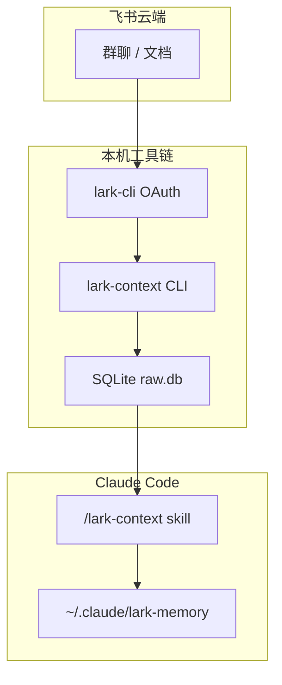
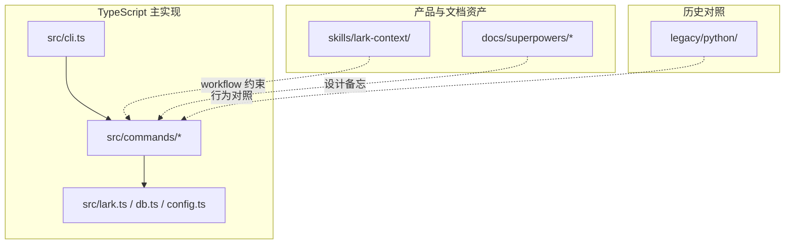
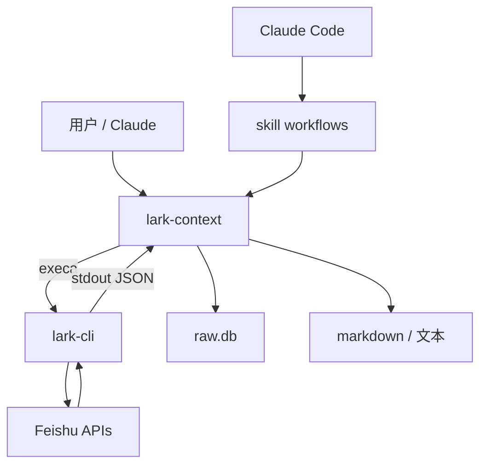
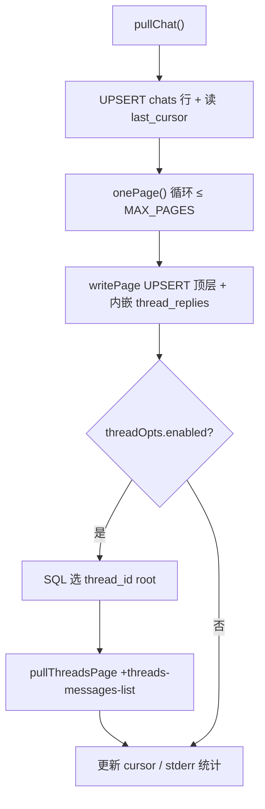
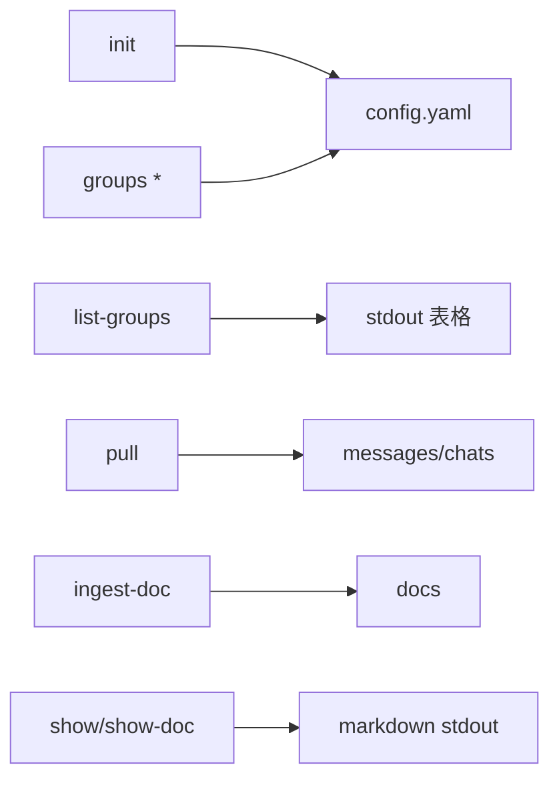
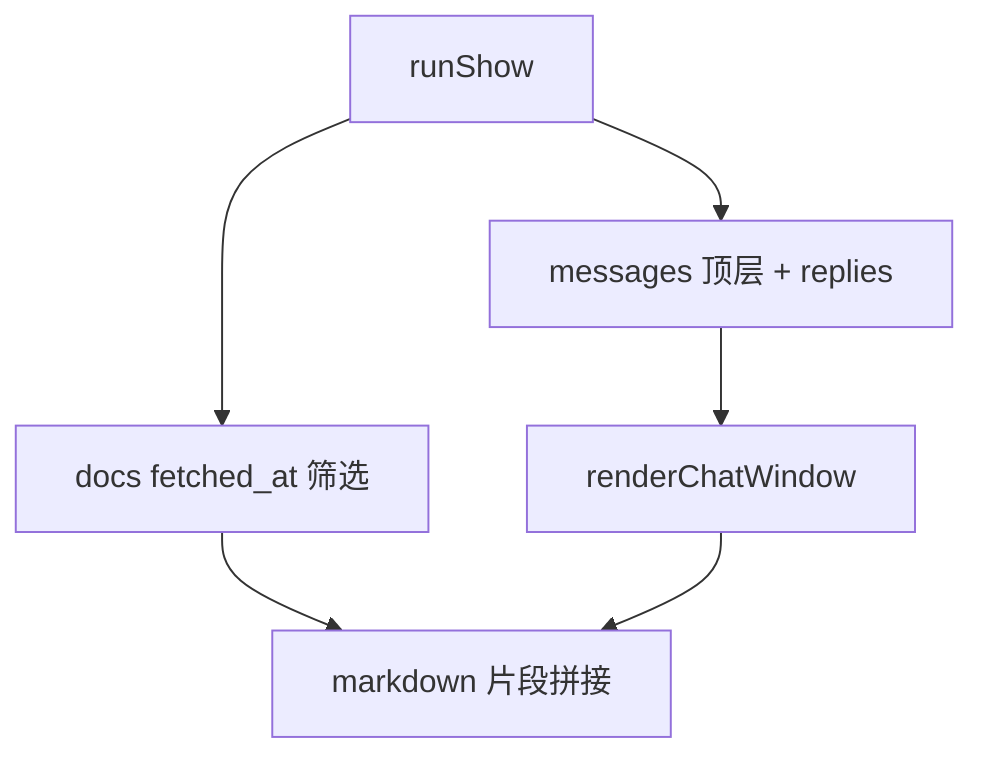
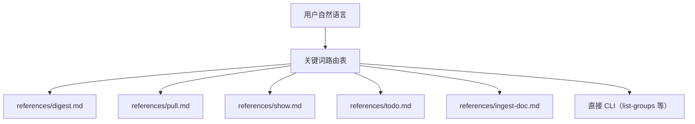
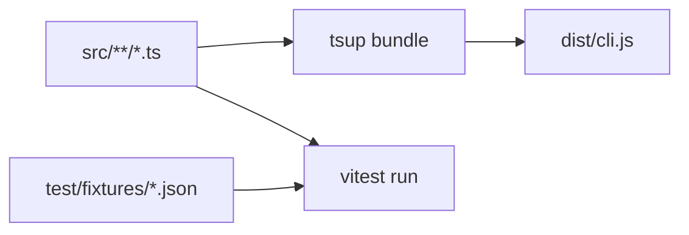

# lark-context 全量导出

> 生成根目录：`project-wiki/lark-context`；提交：`8099f2131ca597a21e77346ce2e272a5e0bf0554`

## 目录
- [项目概览](#overview)
- [仓库地图与阅读路线](#repository-map)
- [系统架构](#system-architecture)
- [SQLite 数据模型](#sqlite-data-model)
- [增量拉取与话题回复](#pull-and-threads)
- [CLI 命令参考](#cli-commands)
- [文档入库与展示](#docs-ingest-show)
- [Claude Skill 与工作流](#skill-workflows)
- [配置、路径与隐私边界](#config-and-privacy)
- [测试、构建与 Python 遗留](#testing-and-legacy)

---

<a id="overview"></a>
<details>
<summary>相关源文件</summary>

生成本页时使用的主要源文件：

- [README.md](../../../project-repos/lark-context/README.md)
- [package.json](../../../project-repos/lark-context/package.json)
- [src/cli.ts](../../../project-repos/lark-context/src/cli.ts)
- [skills/lark-context/SKILL.md](../../../project-repos/lark-context/skills/lark-context/SKILL.md)
- [tsup.config.ts](../../../project-repos/lark-context/tsup.config.ts)

</details>

# 项目概览

飞书群与文档的信息密度高，但默认留在云端；把上下文“接”进 Claude Code 的常见做法是复制粘贴，既碎又难复盘。**lark-context 先用 OAuth 用户身份（经官方 `lark-cli`）把指定群与文档沉淀进本地 SQLite**，再用 markdown 管道喂给 Claude；**digest（整理记忆）阶段刻意只读本地 `show` 输出并写文件，不调用外部 LLM API**，把工作数据关在用户机器上。

**两层记忆**是它的核心制品模型：`entities/` 放“慢变”对象（人、项目、术语、决策），`journal/` 按 ISO 周追加流水；`MEMORY.md` 做索引并通常被 `CLAUDE.md` `@` 引用。工具侧负责**持续拉取与入库**；**语义提炼由 Claude 在对话里完成**——这条分工把“可信边界”画在 CLI 与 skill 的 I/O 上，而不是再去接一个黑盒摘要服务。



上图强调“云端只经过官方 CLI”，而 `lark-context` 本身只是把 JSON/NDJSON 落库并在 `show` 时渲染成可读 markdown；**记忆合并规则写在 skill 的 references 里**，不在 TS 代码中硬编码业务语义。

## 能力全景

- **白名单拉群**：`config.yaml` 维护 alias ↔ `chat_id`，`pull` 只遍历 `enabled` 群，避免把用户加入的所有会话一扫而空。  
- **增量续拉**：用 `chats.last_cursor` 记住“见过的最新时间”，后续运行忽略 `--since`，把时间窗只留给首次回填。  
- **话题结构**：`messages` 同时支持 API 内嵌的 `thread_replies` 与二阶段 `+threads-messages-list`，`show` 用 `↳` 缩进渲染子回复。  
- **文档入库**：`ingest-doc` 调 `docs +fetch`，把 markdown 文本 UPSERT 进 `docs`，`show` 在同一时间窗下列出“近期文档”。  
- **Skill 路由**：`SKILL.md` 用关键词把自然语言分发到 digest/pull/show/todo/ingest-doc 等 workflow，并强制版本自检与错误透传。  

## 技术栈速览

| 维度 | 事实 |
|------|------|
| 运行时 | Node **≥18**，打包 `tsup` → 单文件 ESM `dist/cli.js`（见 `tsup.config.ts`） |
| CLI 框架 | `commander` 注册子命令；`execa` 调用 `lark-cli` |
| 存储 | `better-sqlite3`，`journal_mode=WAL`，外键开启 |
| 测试 | `vitest` + 存根 `lark` JSON 夹具 |
| 包名 | npm 包 `@tiktok-fe/lark-context`，二进制名 `lark-context` |

## 与同类思路的差异

它比“直接让模型联网读飞书”更**离线**：`show` / `show-doc` 阶段甚至不再触发 `lark-cli`，只读本地库。代价是**数据新鲜度取决于用户何时 `pull`**，以及 V1 明确不做定时调度（README 将其标为手动/cron 留给后续）。

**内网文档对照**：字节侧飞书 Wiki（链接见 [README.md 内「内部延伸阅读」](../README.md)）可用已登录的 **`lark-cli docs +fetch --doc <url>`** 拉取 markdown，便于与源码叙事对齐；本页仍以仓库与 skill 为技术真源，产品话术与演示以 Wiki 为准。若安装方式、registry 或流程与开源 README 不一致，**以 Wiki 中明确为当前有效的段落优先**。

## 阅读路线

| 读者目标 | 建议顺序 |
|----------|----------|
| 想理解端到端闭环 | 本页 → [系统架构](system-architecture.md) → [Claude Skill 与工作流](skill-workflows.md) |
| 要排查同步/漏消息 | [增量拉取与话题回复](pull-and-threads.md) → [SQLite 数据模型](sqlite-data-model.md) |
| 要扩展命令行行为 | [CLI 命令参考](cli-commands.md) → `src/commands/*` 单测 |

Sources: [README.md:1-110](../../../project-repos/lark-context/README.md#L1-L110), [package.json:1-36](../../../project-repos/lark-context/package.json#L1-L36), [src/cli.ts:1-49](../../../project-repos/lark-context/src/cli.ts#L1-L49), [skills/lark-context/SKILL.md:1-75](../../../project-repos/lark-context/skills/lark-context/SKILL.md#L1-L75)

## 相关页面

- [仓库地图与阅读路线](repository-map.md) — `src/`、`skills/`、`legacy/` 怎么分工  
- [系统架构](system-architecture.md) — `lark-cli` 边界与配置加载  
- [Claude Skill 与工作流](skill-workflows.md) — digest/todo 为何不调用外网模型  

---

<a id="repository-map"></a>
<details>
<summary>相关源文件</summary>

生成本页时使用的主要源文件：

- [README.md](../../../project-repos/lark-context/README.md)
- [src/cli.ts](../../../project-repos/lark-context/src/cli.ts)
- [legacy/python/README.md](../../../project-repos/lark-context/legacy/python/README.md)
- [docs/superpowers/specs/2026-04-19-lark-context-design.md](../../../project-repos/lark-context/docs/superpowers/specs/2026-04-19-lark-context-design.md)

</details>

# 仓库地图与阅读路线

仓库同时承载**现代 TypeScript CLI**与**legacy Python 包**：前者是 `@tiktok-fe/lark-context` 与 `skills/lark-context` 的真源，后者保留测试夹具与历史命令语义，方便对照迁移是否丢行为。

**阅读顺序建议**：从 `src/cli.ts` 看命令注册全景 → 选一个命令文件（如 `pull.ts`）跟着 `lark.ts` 的 JSON 调用往下钻 → 需要理解产物格式时打开 `render.ts` 与 `skills/.../references/*.md`。



`docs/superpowers/` 不是运行时依赖，但记录了 **skill 化、thread replies、slash command** 等迭代的设计背景；排查“为什么默认首次 pull 用 90d”这类问题时，README 与 skill references 往往比代码注释更权威。

## 目录快照

| 路径 | 职责 |
|------|------|
| `src/commands/` | 用户可见子命令：init、list-groups、groups、pull、ingest-doc、show |
| `src/db.ts` | SQLite schema、线程列迁移、`kv` 键值（如 digest 时间戳由 workflow 写入） |
| `skills/lark-context/` | Claude Code skill：`SKILL.md` + `references/*.md` workflow |
| `test/` | Vitest；夹具镜像 legacy/python/tests/fixtures |
| `legacy/python/` | 旧实现 + pytest 套件，文件名与 TS 测例平行 |

## insight：为什么同时保留 legacy/python

`00-repo-inventory.md` 显示两边各有几乎同构的 `test_cmd_pull` / `test_cmd_show` 等用例命名；当你怀疑 “TS 是否完整迁移了 Click 版语义” 时，最快的旁证是**对照同场景的双语言测试与夹具 JSON**。

Sources: [README.md:186-199](../../../project-repos/lark-context/README.md#L186-L199), [src/cli.ts:16-47](../../../project-repos/lark-context/src/cli.ts#L16-L47), [legacy/python/README.md:1-80](../../../project-repos/lark-context/legacy/python/README.md#L1-L80)

<details class="source-snippets">
<summary>引用源码</summary>

<!-- source-snippets:start -->

#### `README.md:186-199`

````markdown
## 开发

```bash
# 克隆 + 装依赖
git clone https://github.com/<you>/lark-context.git
cd lark-context
pnpm install

# 开发命令
pnpm build               # tsup → dist/cli.js
pnpm test                # vitest run
pnpm test:watch          # vitest dev mode
pnpm typecheck           # tsc --noEmit
```
````

#### `src/cli.ts:16-47`

```typescript
import { registerIngestDoc } from "./commands/ingestDoc.js";
import { registerInit } from "./commands/init.js";
import { registerListGroups } from "./commands/listGroups.js";
import { registerPull } from "./commands/pull.js";
import { registerShow, registerShowDoc } from "./commands/show.js";

// 从 package.json 动态读版本，避免手动维护两份的漂移
function readPkgVersion(): string {
  try {
    const here = dirname(fileURLToPath(import.meta.url));
    const pkg = JSON.parse(
      readFileSync(join(here, "..", "package.json"), "utf8"),
    );
    return typeof pkg.version === "string" ? pkg.version : "0.0.0";
  } catch {
    return "0.0.0";
  }
}

const program = new Command();
program
  .name("lark-context")
  .description("Feishu context bridge for Claude Code")
  .version(readPkgVersion());

registerInit(program);
registerListGroups(program);
registerGroups(program);
registerPull(program);
registerIngestDoc(program);
registerShow(program);
registerShowDoc(program);
```

#### `legacy/python/README.md:1-80`

```markdown
# lark-context — Python 历史实现

这是 TS port 之前的 Python 实现，**已冻结**，不再演进。

- 本目录保留目的：port 过程中作语义对照、万一 TS 版出 bug 时回退跑
- **不再接受 PR / 测试更新**
- 跑法：

    cd legacy/python
    python3 -m venv .venv
    . .venv/bin/activate
    pip install -e '.[dev]'
    pytest -q       # 应该 59 passed

V1 TS 版发布（`@tiktok-fe/lark-context` ≥ 0.1.0）后，推荐删除本目录。
```

<!-- source-snippets:end -->
</details>

## 相关页面

- [项目概览](overview.md) — 产品与隐私叙事  
- [CLI 命令参考](cli-commands.md) — 各子命令参数矩阵  
- [测试、构建与 Python 遗留](testing-and-legacy.md) — 如何跑 Vitest / pytest  

---

<a id="system-architecture"></a>
<details>
<summary>相关源文件</summary>

生成本页时使用的主要源文件：

- [src/cli.ts](../../../project-repos/lark-context/src/cli.ts)
- [src/lark.ts](../../../project-repos/lark-context/src/lark.ts)
- [src/config.ts](../../../project-repos/lark-context/src/config.ts)
- [src/commands/init.ts](../../../project-repos/lark-context/src/commands/init.ts)
- [README.md](../../../project-repos/lark-context/README.md)

</details>

# 系统架构

架构可以概括成三层：**飞书官方 CLI**负责鉴权与协议细节；**lark-context**把子进程输出收敛成类型化数据并写入 SQLite；**Claude skill**只在需要自然语言路由或文件级 digest 时介入。中间这一层的工程价值在于：业务代码从不直接拼 OpenAPI URL，而是依赖 `lark-cli` 的命令表面，**把权限模型、分页与 JSON schema 变更留在上游**。



**初始化链路**：`init` 先探测 `lark-cli --version`，再创建 `memory_dir` / `raw_dir`，必要时写出 blank `config.yaml`，最后 `initSchema` 建库——任何后续命令都假设这条路径已经走通。

## 配置加载的心智模型

`loadConfig` 先做三件事：**定位 YAML 路径**（环境变量 `LARK_CONTEXT_CONFIG` 优先）、**展开 `~`**（优先 `$HOME` 以匹配测试替身）、再把 `paths.memory_dir` / `paths.raw_dir` 与 CLI flag、环境变量做优先级合并。  
这套顺序保证：**脚本化场景可用 env 覆盖，不必改写用户 HOME 里的 yaml**。

## 错误与进程边界

`lark.ts` 把 `ENOENT` 单独映射为 `LarkNotFoundError`，其它非零退出合并 stderr 进 `LarkCLIError`；`pull` 在群维度捕获后者并 `disableChat`，避免单群损坏拖死批处理。  
`cli.ts` 还对 `stdout`/`stderr` 注册 `EPIPE` handler——当用户 `| head` 时进程安静退出，行为对齐 README 里“匹配 Python Click”的叙述。

Sources: [src/lark.ts:1-35](../../../project-repos/lark-context/src/lark.ts#L1-L35), [src/config.ts:95-133](../../../project-repos/lark-context/src/config.ts#L95-L133), [src/commands/init.ts:27-53](../../../project-repos/lark-context/src/commands/init.ts#L27-L53), [src/cli.ts:8-47](../../../project-repos/lark-context/src/cli.ts#L8-L47)

<details class="source-snippets">
<summary>引用源码</summary>

<!-- source-snippets:start -->

#### `src/lark.ts:1-35`

```typescript
import { execa } from "execa";

export const BINARY = "lark-cli";

export class LarkCLIError extends Error {}
export class LarkNotFoundError extends Error {}

async function invoke(args: string[]): Promise<string> {
  try {
    const r = await execa(BINARY, args, { reject: true });
    return r.stdout;
  } catch (err: unknown) {
    const e = err as { code?: string; exitCode?: number; stderr?: string };
    if (e?.code === "ENOENT") {
      throw new LarkNotFoundError(
        `\`${BINARY}\` binary not found on PATH. See https://github.com/larksuite/cli for install instructions.`,
      );
    }
    const stderr = (e?.stderr ?? "").toString().trim();
    throw new LarkCLIError(stderr || `lark exited ${e?.exitCode ?? "?"}`);
  }
}

export async function runJson(args: string[]): Promise<unknown> {
  const out = await invoke([...args, "--format", "json"]);
  return JSON.parse(out);
}

export async function* runNdjson(args: string[]): AsyncGenerator<unknown> {
  const out = await invoke([...args, "--format", "ndjson"]);
  for (const line of out.split("\n")) {
    const trimmed = line.trim();
    if (trimmed) yield JSON.parse(trimmed);
  }
}
```

#### `src/config.ts:95-133`

```typescript
export function loadConfig(opts: LoadConfigOptions = {}): Config {
  const configPath = opts.configPathOverride
    ? expandHome(opts.configPathOverride)
    : defaultConfigPath();
  let yamlData: Record<string, unknown> = {};
  if (existsSync(configPath)) {
    const parsed = YAML.parse(readFileSync(configPath, "utf8"));
    if (parsed && typeof parsed === "object" && !Array.isArray(parsed)) {
      yamlData = parsed as Record<string, unknown>;
    }
  }
  const pathsRaw = yamlData.paths;
  const pathsSection: Record<string, unknown> =
    pathsRaw && typeof pathsRaw === "object" && !Array.isArray(pathsRaw)
      ? (pathsRaw as Record<string, unknown>)
      : {};
  const memoryDir = resolvePath(
    opts.memoryDirOverride,
    ENV_MEMORY,
    typeof pathsSection.memory_dir === "string"
      ? pathsSection.memory_dir
      : undefined,
    "~/.claude/lark-memory",
  );
  const rawDir = resolvePath(
    opts.rawDirOverride,
    ENV_RAW,
    typeof pathsSection.raw_dir === "string"
      ? pathsSection.raw_dir
      : undefined,
    "~/.lark-context",
  );
  return {
    memoryDir,
    rawDir,
    groups: parseGroups(yamlData.groups),
    configPath,
  };
}
```

#### `src/commands/init.ts:27-53`

```typescript
export async function runInit(opts: InitOpts = {}): Promise<void> {
  if (opts.checkLarkCli !== false) {
    const check = opts._pathCheck ?? defaultPathCheck;
    if (!(await check())) {
      throw new Error(
        "`lark-cli` binary not found on PATH. Install: `bnpm i -g @larksuite/cli` (or `npm i -g @larksuite/cli`), then `lark-cli auth login`.",
      );
    }
  }
  const cfg = loadConfig({
    configPathOverride: opts.configPathOverride,
    memoryDirOverride: opts.memoryDirOverride,
    rawDirOverride: opts.rawDirOverride,
  });
  mkdirSync(cfg.memoryDir, { recursive: true });
  mkdirSync(cfg.rawDir, { recursive: true });
  if (cfg.configPath && !existsSync(cfg.configPath)) {
    const fresh: Config = {
      memoryDir: cfg.memoryDir,
      rawDir: cfg.rawDir,
      groups: [],
      configPath: cfg.configPath,
    };
    saveConfig(fresh);
  }
  initSchema(join(cfg.rawDir, "raw.db"));
  process.stdout.write(`Initialized lark-context at ${cfg.configPath}\n`);
```

#### `src/cli.ts:8-47`

```typescript
// Silently exit on EPIPE (pipes to head/less etc.), matching Python's Click behavior.
for (const stream of [process.stdout, process.stderr]) {
  stream.on("error", (err: NodeJS.ErrnoException) => {
    if (err.code === "EPIPE") process.exit(0);
    throw err;
  });
}

import { registerIngestDoc } from "./commands/ingestDoc.js";
import { registerInit } from "./commands/init.js";
import { registerListGroups } from "./commands/listGroups.js";
import { registerPull } from "./commands/pull.js";
import { registerShow, registerShowDoc } from "./commands/show.js";

// 从 package.json 动态读版本，避免手动维护两份的漂移
function readPkgVersion(): string {
  try {
    const here = dirname(fileURLToPath(import.meta.url));
    const pkg = JSON.parse(
      readFileSync(join(here, "..", "package.json"), "utf8"),
    );
    return typeof pkg.version === "string" ? pkg.version : "0.0.0";
  } catch {
    return "0.0.0";
  }
}

const program = new Command();
program
  .name("lark-context")
  .description("Feishu context bridge for Claude Code")
  .version(readPkgVersion());

registerInit(program);
registerListGroups(program);
registerGroups(program);
registerPull(program);
registerIngestDoc(program);
registerShow(program);
registerShowDoc(program);
```

<!-- source-snippets:end -->
</details>

## 相关页面

- [SQLite 数据模型](sqlite-data-model.md) — schema 与迁移  
- [Claude Skill 与工作流](skill-workflows.md) — 为何不把 digest 写进 TS  
- [配置、路径与隐私边界](config-and-privacy.md) — env / yaml 全表  

---

<a id="sqlite-data-model"></a>
<details>
<summary>相关源文件</summary>

生成本页时使用的主要源文件：

- [src/db.ts](../../../project-repos/lark-context/src/db.ts)
- [src/commands/show.ts](../../../project-repos/lark-context/src/commands/show.ts)
- [src/commands/groups.ts](../../../project-repos/lark-context/src/commands/groups.ts)

</details>

# SQLite 数据模型

`raw.db` 用四张主表把**飞书侧对象**映射成 CLI 可查询的记录：`chats` 记录白名单群与同步游标，`messages` 存扁平化的消息行（含话题元数据），`docs` 存拉下来的 markdown，`kv` 给上层 workflow 放轻量状态（例如 digest 时间戳）。

```mermaid
erDiagram
  CHATS |""|--o{ MESSAGES : hosts
  CHATS {
    text alias PK
    text chat_id
    text last_cursor
    text last_pulled_at
    int enabled
  }
  MESSAGES {
    text id PK
    text chat_alias FK
    text thread_id
    int is_thread_reply
    text create_time
  }
  DOCS {
    text doc_token PK
    text content_md
    text fetched_at
  }
  KV {
    text key PK
    text value
  }
```

**线程建模**：`is_thread_reply` 区分顶层消息与话题子消息；`thread_id` 既可来自父消息，也可在子消息行上冗余，方便 `show` 用 `thread_id` 把子回复挂回父节点。

## 迁移与兼容性

`migrateMessagesColumns` 在旧库上 `ALTER TABLE` 补齐 `thread_id` / `is_thread_reply`，并用 `json_extract` 从 `content_json` 回填早期数据——这解释了为何 schema 字符串里不直接创建 `idx_messages_chat_thread`：**旧表缺列时建索引会失败**，所以索引创建被延迟到迁移之后。

## 与 `groups` 命令的一致性

`groups add` 同时更新 yaml 与 `chats` 行；`groups rm` 软禁用（`enabled=0`）而不是硬删消息，避免误操作丢历史。**pull** 在发现 yaml 有手写群但表缺行时也会 `INSERT OR REPLACE` 自愈。

Sources: [src/db.ts:5-91](../../../project-repos/lark-context/src/db.ts#L5-L91), [src/commands/show.ts:50-123](../../../project-repos/lark-context/src/commands/show.ts#L50-L123), [src/commands/groups.ts:31-89](../../../project-repos/lark-context/src/commands/groups.ts#L31-L89)

<details class="source-snippets">
<summary>引用源码</summary>

<!-- source-snippets:start -->

#### `src/db.ts:5-91`

```typescript
export const SCHEMA = `
CREATE TABLE IF NOT EXISTS chats (
  alias           TEXT PRIMARY KEY,
  chat_id         TEXT NOT NULL UNIQUE,
  name            TEXT,
  last_cursor     TEXT,
  last_pulled_at  TEXT,
  enabled         INTEGER DEFAULT 1
);
CREATE TABLE IF NOT EXISTS messages (
  id              TEXT PRIMARY KEY,
  chat_alias      TEXT NOT NULL REFERENCES chats(alias),
  sender_id       TEXT,
  sender_name     TEXT,
  msg_type        TEXT,
  content_json    TEXT NOT NULL,
  content_text    TEXT,
  reply_to        TEXT,
  create_time     TEXT NOT NULL,
  thread_id       TEXT,
  is_thread_reply INTEGER NOT NULL DEFAULT 0
);
CREATE INDEX IF NOT EXISTS idx_messages_chat_time
  ON messages(chat_alias, create_time);
CREATE TABLE IF NOT EXISTS docs (
  doc_token   TEXT PRIMARY KEY,
  url         TEXT NOT NULL,
  title       TEXT,
  content_md  TEXT NOT NULL,
  fetched_at  TEXT NOT NULL,
  source      TEXT
);
CREATE TABLE IF NOT EXISTS kv (
  key   TEXT PRIMARY KEY,
  value TEXT
);
`;

export function connect(dbPath: string): Database.Database {
  mkdirSync(dirname(dbPath), { recursive: true });
  const db = new Database(dbPath);
  db.pragma("foreign_keys = ON");
  db.pragma("journal_mode = WAL");
  return db;
}

export function initSchema(dbPath: string): void {
  const db = connect(dbPath);
  try {
    db.exec(SCHEMA);
    migrateMessagesColumns(db);
  } finally {
    db.close();
  }
}

function migrateMessagesColumns(db: Database.Database): void {
  const cols = db
    .prepare("PRAGMA table_info(messages)")
    .all() as Array<{ name: string }>;
  const have = new Set(cols.map((c) => c.name));
  if (!have.has("thread_id")) {
    db.exec("ALTER TABLE messages ADD COLUMN thread_id TEXT");
  }
  if (!have.has("is_thread_reply")) {
    db.exec(
      "ALTER TABLE messages ADD COLUMN is_thread_reply INTEGER NOT NULL DEFAULT 0",
    );
  }
  // Backfill thread_id from the stored raw JSON for rows that pre-date
  // the thread_id column. Safe to run repeatedly — only touches rows
  // where thread_id is still NULL.
  db.exec(
    "UPDATE messages " +
      "SET thread_id = json_extract(content_json, '$.thread_id') " +
      "WHERE thread_id IS NULL " +
      "AND json_valid(content_json) " +
      "AND json_extract(content_json, '$.thread_id') IS NOT NULL",
  );
  // Cannot live in SCHEMA: legacy messages tables lack thread_id, so the CREATE
  // INDEX would fail there even with IF NOT EXISTS (that clause checks the
  // index name, not column validity).
  db.exec(
    "CREATE INDEX IF NOT EXISTS idx_messages_chat_thread " +
      "ON messages(chat_alias, thread_id, create_time)",
  );
}
```

#### `src/commands/show.ts:50-123`

```typescript
  const pieces: string[] = [];
  const db = connect(dbPath);
  try {
    const topStmt = db.prepare(
      "SELECT id, sender_name, content_text, create_time, thread_id " +
        "FROM messages WHERE chat_alias=? AND is_thread_reply=0 AND create_time >= ? " +
        "ORDER BY create_time",
    );
    const replyStmt = db.prepare(
      "SELECT sender_name, content_text, create_time " +
        "FROM messages WHERE chat_alias=? AND thread_id=? AND is_thread_reply=1 " +
        "ORDER BY create_time",
    );

    for (const g of targets) {
      const tops = topStmt.all(g.alias, cutoff) as Array<{
        id: string;
        sender_name: string;
        content_text: string;
        create_time: string;
        thread_id: string | null;
      }>;
      const messages: Array<{
        sender_name: string;
        content_text: string;
        create_time: string;
        is_thread_reply?: boolean;
      }> = [];
      for (const top of tops) {
        messages.push({
          sender_name: top.sender_name,
          content_text: top.content_text,
          create_time: top.create_time,
          is_thread_reply: false,
        });
        if (top.thread_id) {
          const replies = replyStmt.all(g.alias, top.thread_id) as Array<{
            sender_name: string;
            content_text: string;
            create_time: string;
          }>;
          for (const r of replies) {
            messages.push({
              sender_name: r.sender_name,
              content_text: r.content_text,
              create_time: r.create_time,
              is_thread_reply: true,
            });
          }
        }
      }
      pieces.push(
        renderChatWindow({
          chatName: g.name || g.alias,
          windowStart: cutoff.slice(0, 10),
          windowEnd: now.toISOString().slice(0, 10),
          messages,
        }),
      );
    }
    const docs = db
      .prepare(
        "SELECT doc_token, title, url FROM docs WHERE fetched_at >= ? ORDER BY fetched_at DESC",
      )
      .all(cutoff) as Array<{ doc_token: string; title: string; url: string }>;
    if (docs.length > 0) {
      pieces.push("### 近期入库的文档\n");
      for (const d of docs) {
        pieces.push(`- [${d.title || d.doc_token}](${d.url})  (token=\`${d.doc_token}\`)`);
      }
      pieces.push("");
    }
  } finally {
    db.close();
```

#### `src/commands/groups.ts:31-89`

```typescript
export async function runAdd(opts: AddOpts): Promise<void> {
  const cfg = loadConfig(opts);
  const dbPath = join(cfg.rawDir, "raw.db");
  ensureInitialized(dbPath);
  const name = opts.name ?? "";
  const resolvedAlias = opts.alias ?? slugify(name || opts.chatId);
  if (cfg.groups.some((g) => g.alias === resolvedAlias)) {
    throw new Error(`alias "${resolvedAlias}" already in use`);
  }
  const newGroup: GroupConfig = {
    alias: resolvedAlias,
    chatId: opts.chatId,
    name,
    enabled: true,
  };
  const next: Config = { ...cfg, groups: [...cfg.groups, newGroup] };
  saveConfig(next);
  const db = connect(dbPath);
  try {
    db.prepare(
      "INSERT INTO chats(alias, chat_id, name, enabled) VALUES (?, ?, ?, 1) " +
        "ON CONFLICT(alias) DO UPDATE SET chat_id=excluded.chat_id, name=excluded.name, enabled=1",
    ).run(resolvedAlias, opts.chatId, name);
  } finally {
    db.close();
  }
  process.stdout.write(`added ${resolvedAlias} -> ${opts.chatId}\n`);
}

export async function runList(opts: ListOpts = {}): Promise<void> {
  const cfg = loadConfig(opts);
  const write = opts.write ?? ((s: string) => process.stdout.write(s));
  if (cfg.groups.length === 0) {
    write("(no groups)\n");
    return;
  }
  write(`${"alias".padEnd(20)} ${"chat_id".padEnd(22)} 名称\n`);
  for (const g of cfg.groups) {
    write(`${g.alias.padEnd(20)} ${g.chatId.padEnd(22)} ${g.name}\n`);
  }
}

export async function runRm(opts: RmOpts): Promise<void> {
  const cfg = loadConfig(opts);
  const dbPath = join(cfg.rawDir, "raw.db");
  ensureInitialized(dbPath);
  const remaining = cfg.groups.filter((g) => g.alias !== opts.alias);
  if (remaining.length === cfg.groups.length) {
    throw new Error(`alias "${opts.alias}" not in whitelist`);
  }
  const next: Config = { ...cfg, groups: remaining };
  saveConfig(next);
  const db = connect(dbPath);
  try {
    db.prepare("UPDATE chats SET enabled=0 WHERE alias=?").run(opts.alias);
  } finally {
    db.close();
  }
  process.stdout.write(`removed ${opts.alias}\n`);
```

<!-- source-snippets:end -->
</details>

## 相关页面

- [增量拉取与话题回复](pull-and-threads.md) — 如何写入 messages  
- [文档入库与展示](docs-ingest-show.md) — docs 的时间窗附录  
- [系统架构](system-architecture.md) — 配置与路径  

---

<a id="pull-and-threads"></a>
<details>
<summary>相关源文件</summary>

生成本页时使用的主要源文件：

- [src/commands/pull.ts](../../../project-repos/lark-context/src/commands/pull.ts)
- [src/lark.ts](../../../project-repos/lark-context/src/lark.ts)
- [test/cmd-pull.test.ts](../../../project-repos/lark-context/test/cmd-pull.test.ts)

</details>

# 增量拉取与话题回复

`pull` 同时解决两个工程难题：**如何做增量分页**，以及**话题回复如何不因首次拉取时序而丢数据**。它先用 `im +chat-messages-list` 按 asc 排序翻页，再用 `messages.last_cursor` 记录最新 `create_time`；后续运行把 `startIso` 从 `last_cursor` 往回拨一小段（`INCR_PULL_OVERLAP_MS`），强制重拉边界附近的父消息，以便补上**后来才出现**的 `thread_id` / `thread_replies`。



## 200 页上限与续跑

`MAX_PAGES = 200` 硬 cap 首次回填时的分页深度，stderr 提示 `hit MAX_PAGES=200 cap; re-run to continue`——这是刻意的产品约束：避免一次性拖十万条消息把磁盘与用户时间都耗光。

## 两种话题来源

1. **API 随父消息携带 `thread_replies`**：`writePage` 直接把这些子消息以 `is_thread_reply=1` 写入，解决“父消息先来、子回复后来”导致二阶段扫描永远看不到 `thread_id` 的空窗。  
2. **二阶段 `+threads-messages-list`**：对窗口内带 `thread_id` 的 root 再分页抓取，失败单线程写 warning，不中断其它线程。

## 文档漂移提醒

README 尾部仍写「不拉回复线程」，但代码路径明确支持 `thread_replies` 与 `pullThreads`；**以 `src/commands/pull.ts` 与 `src/commands/show.ts` 为准**。

## insight：CLI `--no-threads` 绑定可疑

`registerPull` 的 action 把 `noThreads: opts.threads === false` 传给 `runPull`，而 Commander 对 `--no-threads` 通常暴露 `noThreads` 字段；若未做预设布尔映射，**命令行层面的“跳过二阶段”可能与直接调用 `runPull({ noThreads: true })` 的测试路径不一致**。排查话题行为时优先以单测与服务端日志为准。

Sources: [src/commands/pull.ts:13-170](../../../project-repos/lark-context/src/commands/pull.ts#L13-L170), [src/commands/pull.ts:293-388](../../../project-repos/lark-context/src/commands/pull.ts#L293-L388), [src/commands/pull.ts:443-472](../../../project-repos/lark-context/src/commands/pull.ts#L443-L472)

<details class="source-snippets">
<summary>引用源码</summary>

<!-- source-snippets:start -->

#### `src/commands/pull.ts:13-170`

```typescript
export const MAX_PAGES = 200;

export interface PullOpts extends LoadConfigOptions {
  chatAlias?: string;
  since?: string;
  threadWindow?: string;
  noThreads?: boolean;
  /** Used by tests to stub clock. */
  _now?: () => Date;
}

interface ThreadOpts {
  enabled: boolean;
  overrideWindow: ReturnType<typeof parseDuration> | null;
  firstPullFallback: ReturnType<typeof parseDuration> | null;
}

export function toIso(larkTime: string): string {
  if (!larkTime) return "";
  let iso = larkTime.replace(" ", "T");
  // Count colons *after* the T to decide HH:MM vs HH:MM:SS.
  const timePart = iso.split("T")[1] ?? "";
  if ((timePart.match(/:/g) ?? []).length === 1) {
    iso += ":00";
  }
  return iso;
}

interface PageResult {
  messages: any[];
  nextToken: string | null;
  hasMore: boolean;
}

async function onePage(
  chatId: string,
  pageToken: string | null,
  startIso: string | null,
): Promise<PageResult> {
  const args: string[] = [
    "im",
    "+chat-messages-list",
    "--chat-id",
    chatId,
    "--sort",
    "asc",
    "--page-size",
    "50",
  ];
  if (pageToken) args.push("--page-token", pageToken);
  if (startIso) args.push("--start", startIso);
  const response = (await runJson(args)) as any;
  if (!response || typeof response !== "object") {
    throw new Error(`unexpected lark response: ${JSON.stringify(response)}`);
  }
  const data = response.data ?? {};
  if (!data || typeof data !== "object") {
    return { messages: [], nextToken: null, hasMore: false };
  }
  return {
    messages: Array.isArray(data.messages) ? data.messages : [],
    nextToken: data.page_token ?? null,
    hasMore: Boolean(data.has_more),
  };
}

function writePage(
  dbPath: string,
  group: GroupConfig,
  messages: any[],
  lastSeen: string,
  now: Date,
): { inserted: number; newMax: string } {
  let inserted = 0;
  let maxCt = lastSeen;
  const db = connect(dbPath);
  try {
    const tx = db.transaction(() => {
      // UPSERT 而非 INSERT OR IGNORE：父消息首次入库时 API 可能还没带 thread_id
      // （reply 尚未发生），后续再拉到同一条时应该把新出现的 thread_id 补上。
      // 用 COALESCE 保证：API 端若丢了 thread_id 字段，不会反向覆盖已存的值。
      // content_json 同样更新一下，保留最新内容（包括最新 thread_replies 快照）。
      const insMsg = db.prepare(
        "INSERT INTO messages" +
          "(id, chat_alias, sender_id, sender_name, msg_type," +
          " content_json, content_text, reply_to, create_time," +
          " thread_id, is_thread_reply) " +
          "VALUES (?, ?, ?, ?, ?, ?, ?, ?, ?, ?, ?) " +
          "ON CONFLICT(id) DO UPDATE SET " +
          "thread_id = COALESCE(excluded.thread_id, messages.thread_id), " +
          "content_json = excluded.content_json",
      );
      for (const raw of messages) {
        const sender = raw.sender ?? {};
        const createTimeIso = toIso(raw.create_time ?? "");
        if (createTimeIso > maxCt) maxCt = createTimeIso;
        const r = insMsg.run(
          raw.message_id,
          group.alias,
          sender.id ?? "",
          sender.name ?? "",
          raw.msg_type ?? "text",
          JSON.stringify(raw),
          raw.content ?? "",
          null,
          createTimeIso,
          raw.thread_id ?? null,
          0,
        );
        inserted += r.changes;
        // 飞书 `im/chat-messages-list` 在返回父消息时会把 thread replies 直接内嵌在
        // `thread_replies` 数组里。把它们作为 is_thread_reply=1 的行也写进来，避免
        // 依赖第二阶段 `pullThreads` —— 那里只扫 DB 里 thread_id 非空的 root，当时序
        // 错开（父消息首次拉时还没 reply）就会永久漏掉。
        if (Array.isArray(raw.thread_replies)) {
          for (const rep of raw.thread_replies) {
            const repSender = rep.sender ?? {};
            const rr = insMsg.run(
              rep.message_id,
              group.alias,
... snippet truncated ...
```

#### `src/commands/pull.ts:293-388`

```typescript
async function pullChat(
  dbPath: string,
  group: GroupConfig,
  since: ReturnType<typeof parseDuration> | null,
  threadOpts: ThreadOpts,
  now: Date,
): Promise<number> {
  // Self-heal chats row — handles hand-edited yaml where the user skipped
  // `groups add` and the chats row doesn't exist yet.
  const db = connect(dbPath);
  let lastSeen = "";
  try {
    db.prepare(
      "INSERT INTO chats(alias, chat_id, name, enabled) VALUES (?, ?, ?, 1) " +
        "ON CONFLICT(alias) DO UPDATE SET chat_id=excluded.chat_id, name=excluded.name",
    ).run(group.alias, group.chatId, group.name);
    const row = db
      .prepare("SELECT last_cursor FROM chats WHERE alias=?")
      .get(group.alias) as { last_cursor: string | null } | undefined;
    lastSeen = row?.last_cursor ?? "";
  } finally {
    db.close();
  }

  let startIso: string | null;
  if (lastSeen) {
    // 往前回退 INCR_PULL_OVERLAP_MS，让近期父消息在下一次 pull 时被重拉，以补齐
    // 之后才产生的 thread_id / thread_replies。UPSERT COALESCE 保证不会重复入库。
    const lastSeenMs = Date.parse(
      lastSeen.endsWith("Z") ? lastSeen : `${lastSeen}Z`,
    );
    if (Number.isFinite(lastSeenMs)) {
      const adjusted = new Date(lastSeenMs - INCR_PULL_OVERLAP_MS);
      startIso = adjusted.toISOString().replace(/\.\d{3}Z$/, "");
    } else {
      startIso = lastSeen;
    }
  } else if (since) {
    const startMs = now.getTime() - since.totalMs;
    // seconds-precision ISO without fractional/timezone markers, matching Python
    // `datetime.strftime("%Y-%m-%dT%H:%M:%S")`.
    startIso = new Date(startMs).toISOString().replace(/\.\d{3}Z$/, "");
  } else {
    startIso = null;
  }

  let totalInserted = 0;
  let pageToken: string | null = null;
  let maxCreateTime = lastSeen;
  let pageNum = 0;
  let hitCap = true;

  for (pageNum = 1; pageNum <= MAX_PAGES; pageNum++) {
    const { messages, nextToken, hasMore } = await onePage(
      group.chatId,
      pageToken,
      pageNum === 1 ? startIso : null,
    );
    if (messages.length > 0) {
      const { inserted, newMax } = writePage(
        dbPath,
        group,
        messages,
        maxCreateTime,
        now,
      );
      maxCreateTime = newMax;
      totalInserted += inserted;
      process.stderr.write(
        `  ${group.alias}: page ${pageNum} +${inserted} (cumulative ${totalInserted})\n`,
      );
    }
    if (!hasMore || nextToken === null || nextToken === pageToken) {
      hitCap = false;
      break;
    }
    pageToken = nextToken;
  }
  if (hitCap) {
    process.stderr.write(
      `  ${group.alias}: hit MAX_PAGES=${MAX_PAGES} cap; re-run to continue\n`,
    );
  }

  if (threadOpts.enabled) {
    const isFirstPull = !lastSeen;
    const windowMs = threadOpts.overrideWindow
      ? threadOpts.overrideWindow.totalMs
      : isFirstPull
        ? (threadOpts.firstPullFallback?.totalMs ?? DEFAULT_THREAD_WINDOW_FIRST_MS)
        : DEFAULT_THREAD_WINDOW_INCR_MS;
    const threadRes = await pullThreads(dbPath, group, windowMs, now);
    totalInserted += threadRes.inserted;
  }

  return totalInserted;
```

#### `src/commands/pull.ts:443-472`

```typescript
export function registerPull(program: Command): void {
  program
    .command("pull")
    .description("Incrementally pull messages for one or all whitelisted chats")
    .option(
      "--chat <alias>",
      'Alias to pull; omit (or "all") for all enabled groups',
    )
    .option(
      "--since <duration>",
      "First-pull lower bound (e.g. 3d, 24h). Ignored on later runs.",
    )
    .option(
      "--thread-window <duration>",
      "Lookback window for thread-reply refresh. Default: matches --since on first pull, 30d on incremental pulls.",
    )
    .option("--no-threads", "Skip thread-reply refresh (phase 2)")
    .action(async (opts) => {
      try {
        await runPull({
          chatAlias: opts.chat,
          since: opts.since,
          threadWindow: opts.threadWindow,
          noThreads: opts.threads === false,
        });
      } catch (err) {
        process.stderr.write(`${(err as Error).message}\n`);
        process.exit(1);
      }
    });
```

<!-- source-snippets:end -->
</details>

## 相关页面

- [SQLite 数据模型](sqlite-data-model.md) — 表结构与索引  
- [CLI 命令参考](cli-commands.md) — flag 语义  
- [文档入库与展示](docs-ingest-show.md) — `show` 如何排版话题  

---

<a id="cli-commands"></a>
<details>
<summary>相关源文件</summary>

生成本页时使用的主要源文件：

- [src/commands/init.ts](../../../project-repos/lark-context/src/commands/init.ts)
- [src/commands/listGroups.ts](../../../project-repos/lark-context/src/commands/listGroups.ts)
- [src/commands/groups.ts](../../../project-repos/lark-context/src/commands/groups.ts)
- [src/commands/pull.ts](../../../project-repos/lark-context/src/commands/pull.ts)
- [src/commands/show.ts](../../../project-repos/lark-context/src/commands/show.ts)
- [src/commands/ingestDoc.ts](../../../project-repos/lark-context/src/commands/ingestDoc.ts)

</details>

# CLI 命令参考

`lark-context` 把日常操作切成**初始化 / 发现群 / 白名单 / 同步 / 入库 / 展示**六类命令；几乎所有需要权限的网络访问都封装在对 `lark-cli` 的子进程调用里，命令文件自身只处理参数、SQLite 事务与 stderr 友好输出。

| 命令 | 数据去向 | 典型失败 |
|------|----------|----------|
| `init` | 创建目录 + `raw.db` schema | `lark-cli` 不在 PATH |
| `list-groups` | 只读展示 | OAuth scope 不足 |
| `groups add|list|rm` | `config.yaml` + `chats` 表 | alias 冲突 / 未知 alias |
| `pull` | `messages` + 更新 `last_cursor` | 单群 `LarkCLIError` → disable |
| `ingest-doc` | `docs` UPSERT | 老版 `/docs/` 被 CLI 拒绝 |
| `show` / `show-doc` | 读库输出 markdown | 无白名单 / 文档未入库 |



## `list-groups` 的分页策略

`runListGroups` 直接调用 `im chats list --page-all --page-limit 0`，把结果数组原样打印或 `--json` 输出——**这意味着 CLI 侧负责吃尽分页**，TS 层保持薄封装。

## 群组白名单语义

`groups rm` 从 yaml 删除记录并把 DB `enabled` 置 0；若用户只是暂时想停某个群的同步，也可以把 yaml 里的 `enabled: false` 与命令结合使用（loader 会过滤）。

## 错误处理哲学

大部分 `command action` 模板都是 `try { ... } catch { stderr + exit(1) }`；对需要多群批处理的 `pull`，**单群失败降级 disable**，继续其它群，stderr 明示原因，方便后续人工 `groups add` 恢复。

Sources: [src/commands/init.ts:56-67](../../../project-repos/lark-context/src/commands/init.ts#L56-L67), [src/commands/listGroups.ts:9-44](../../../project-repos/lark-context/src/commands/listGroups.ts#L9-L44), [src/commands/groups.ts:92-131](../../../project-repos/lark-context/src/commands/groups.ts#L92-L131), [src/commands/pull.ts:401-441](../../../project-repos/lark-context/src/commands/pull.ts#L401-L441), [src/commands/show.ts:156-184](../../../project-repos/lark-context/src/commands/show.ts#L156-L184), [src/commands/ingestDoc.ts:105-117](../../../project-repos/lark-context/src/commands/ingestDoc.ts#L105-L117)

<details class="source-snippets">
<summary>引用源码</summary>

<!-- source-snippets:start -->

#### `src/commands/init.ts:56-67`

```typescript
export function registerInit(program: Command): void {
  program
    .command("init")
    .description("Bootstrap config file, storage dirs, and SQLite schema")
    .action(async () => {
      try {
        await runInit();
      } catch (err) {
        process.stderr.write(`${(err as Error).message}\n`);
        process.exit(1);
      }
    });
```

#### `src/commands/listGroups.ts:9-44`

```typescript
export async function runListGroups(opts: ListGroupsOpts): Promise<void> {
  const write = opts.write ?? ((s: string) => process.stdout.write(s));
  const response = await runJson([
    "im",
    "chats",
    "list",
    "--page-all",
    "--page-limit",
    "0",
  ]);
  if (!response || typeof response !== "object") {
    throw new Error(`unexpected lark response: ${JSON.stringify(response)}`);
  }
  const data = (response as { data?: unknown }).data;
  const items: Array<{ chat_id?: string; name?: string; description?: string }> =
    data && typeof data === "object" && Array.isArray((data as any).items)
      ? (data as any).items
      : [];

  if (opts.json) {
    write(JSON.stringify(items, null, 2) + "\n");
    return;
  }
  if (items.length === 0) {
    write("(no chats)\n");
    return;
  }
  write(`${"chat_id".padEnd(40)} 名称 / 描述\n`);
  for (const c of items) {
    const chatId = (c.chat_id ?? "").padEnd(40);
    const name = c.name ?? "";
    const desc = c.description ?? "";
    const suffix = desc ? `  [${desc}]` : "";
    write(`${chatId} ${name}${suffix}\n`);
  }
}
```

#### `src/commands/groups.ts:92-131`

```typescript
export function registerGroups(program: Command): void {
  const g = program
    .command("groups")
    .description("Manage the whitelist of chats to pull");

  g.command("add <chat_id>")
    .description("Add a chat to the whitelist")
    .option("--alias <alias>", "Short name used in commands")
    .option("--name <name>", "Human-readable name")
    .action(async (chatId, opts) => {
      try {
        await runAdd({ chatId, alias: opts.alias, name: opts.name });
      } catch (err) {
        process.stderr.write(`${(err as Error).message}\n`);
        process.exit(1);
      }
    });

  g.command("list")
    .description("List whitelisted chats")
    .action(async () => {
      try {
        await runList();
      } catch (err) {
        process.stderr.write(`${(err as Error).message}\n`);
        process.exit(1);
      }
    });

  g.command("rm <alias>")
    .description("Remove an alias from the whitelist (soft-disable in DB)")
    .action(async (alias) => {
      try {
        await runRm({ alias });
      } catch (err) {
        process.stderr.write(`${(err as Error).message}\n`);
        process.exit(1);
      }
    });
}
```

#### `src/commands/pull.ts:401-441`

```typescript
export async function runPull(opts: PullOpts): Promise<number> {
  const cfg: Config = loadConfig(opts);
  const dbPath = join(cfg.rawDir, "raw.db");
  ensureInitialized(dbPath);
  const sinceParsed = opts.since ? parseDuration(opts.since) : null;
  const threadWindowParsed = opts.threadWindow
    ? parseDuration(opts.threadWindow)
    : null;
  const threadOpts: ThreadOpts = {
    enabled: !opts.noThreads,
    overrideWindow: threadWindowParsed,
    firstPullFallback: sinceParsed,
  };
  const effectiveAlias =
    opts.chatAlias === "all" || !opts.chatAlias ? null : opts.chatAlias;
  const targets = cfg.groups.filter(
    (g) => g.enabled && (!effectiveAlias || g.alias === effectiveAlias),
  );
  if (effectiveAlias && targets.length === 0) {
    throw new Error(`unknown chat alias "${opts.chatAlias}"`);
  }
  const now = (opts._now ?? (() => new Date()))();

  let grand = 0;
  for (const g of targets) {
    try {
      const n = await pullChat(dbPath, g, sinceParsed, threadOpts, now);
      process.stdout.write(`${g.alias}: pulled ${n} messages\n`);
      grand += n;
    } catch (err) {
      if (err instanceof LarkNotFoundError) throw err;
      if (err instanceof LarkCLIError) {
        disableChat(dbPath, g.alias, err.message);
        continue;
      }
      throw err;
    }
  }
  process.stdout.write(`done, total=${grand}\n`);
  return grand;
}
```

#### `src/commands/show.ts:156-184`

```typescript
export function registerShow(program: Command): void {
  program
    .command("show")
    .description("Print recent messages + newly-ingested docs as markdown")
    .option("--chat <alias>", "Alias to show; omit (or 'all') for all enabled")
    .option("--since <duration>", "Duration window, e.g. 3d", "24h")
    .action(async (opts) => {
      try {
        await runShow({ chatAlias: opts.chat, since: opts.since });
      } catch (err) {
        process.stderr.write(`${(err as Error).message}\n`);
        process.exit(1);
      }
    });
}

export function registerShowDoc(program: Command): void {
  program
    .command("show-doc <ref>")
    .description("Print the stored markdown for a doc, given its token or URL")
    .action(async (ref) => {
      try {
        await runShowDoc({ ref });
      } catch (err) {
        process.stderr.write(`${(err as Error).message}\n`);
        process.exit(1);
      }
    });
}
```

#### `src/commands/ingestDoc.ts:105-117`

```typescript
export function registerIngestDoc(program: Command): void {
  program
    .command("ingest-doc <ref>")
    .description("Fetch a Feishu doc (by URL or token) and store its markdown")
    .action(async (ref) => {
      try {
        await runIngestDoc({ ref });
      } catch (err) {
        process.stderr.write(`${(err as Error).message}\n`);
        process.exit(1);
      }
    });
}
```

<!-- source-snippets:end -->
</details>

## 相关页面

- [增量拉取与话题回复](pull-and-threads.md) — `--since` / thread window  
- [文档入库与展示](docs-ingest-show.md) — ingest/show 细节  
- [配置、路径与隐私边界](config-and-privacy.md) — 覆盖优先级  

---

<a id="docs-ingest-show"></a>
<details>
<summary>相关源文件</summary>

生成本页时使用的主要源文件：

- [src/commands/ingestDoc.ts](../../../project-repos/lark-context/src/commands/ingestDoc.ts)
- [src/commands/show.ts](../../../project-repos/lark-context/src/commands/show.ts)
- [src/render.ts](../../../project-repos/lark-context/src/render.ts)

</details>

# 文档入库与展示

文档链路分三步：**从 URL/bare token 提取 doc_token** → **调用 `lark-cli docs +fetch`** → **把解析到的 markdown UPSERT 进 `docs`**；展示时 `show-doc` 只按 token/url 命中数据库行，不再触发飞书网络。聊天记录则由 `show` 聚合时间窗内的顶层消息，并在同一 `thread_id` 下拼接子回复，最后走 `renderChatWindow` 统一排版。

## ingest：URL 白名单与容错

`extractToken` 只允许飞书系 host（`feishu` / `larkoffice` 等关键字），并用正则锁定 `/docx|docs|wiki|file|base/` 路径段；非匹配路径直接抛错，避免把任意 HTTP 链接误送进 CLI。  
正文提取 `extractContent` 依次尝试 `content`/`markdown`/`text`/`body` 字段；若都不存在则退化为 fenced JSON，**保证至少有可追溯的原文快照**。

## show：时间窗与文档附录

`runShow` 把 `--since` 交给 `parseDuration`（仅支持 `m/h/d/w` 整数单位），计算 cutoff 后：
1. SQL 拉顶层消息；若 `thread_id` 存在，再查 `is_thread_reply=1` 的子表排序拼接。  
2. 追加 `fetched_at >= cutoff` 的 `docs` 列表，用 markdown 链接 + token 提示用户回到源 URL。



## render：话题缩进协议

`renderChatWindow` 对 `is_thread_reply` 前缀 `  ↳ `，并把多行内容逐行再缩进，形成视觉上“挂在父消息下”的线程树；时间格式压缩到 `YYYY-MM-DD HH:MM`，减少噪声。

Sources: [src/commands/ingestDoc.ts:10-103](../../../project-repos/lark-context/src/commands/ingestDoc.ts#L10-L103), [src/commands/show.ts:31-127](../../../project-repos/lark-context/src/commands/show.ts#L31-L127), [src/render.ts:16-40](../../../project-repos/lark-context/src/render.ts#L16-L40)

<details class="source-snippets">
<summary>引用源码</summary>

<!-- source-snippets:start -->

#### `src/commands/ingestDoc.ts:10-103`

````typescript
const PATH_RE = /^\/(docx|docs|wiki|file|base)\/([A-Za-z0-9_-]+)$/;

const LARK_HOST_TOKENS = ["feishu", "larkoffice", "larksuite", "lark.com"];

function isLarkHost(hostname: string): boolean {
  return LARK_HOST_TOKENS.some((t) => hostname.includes(t));
}

export function extractToken(ref: string): string {
  if (!ref.startsWith("http")) {
    if (!ref || ref.includes("/") || ref.includes(" ")) {
      throw new Error(`not a URL or bare token: ${JSON.stringify(ref)}`);
    }
    return ref;
  }
  let url: URL;
  try {
    url = new URL(ref);
  } catch {
    throw new Error(`not a valid URL: ${JSON.stringify(ref)}`);
  }
  if (!url.hostname || !isLarkHost(url.hostname)) {
    throw new Error(`not a Lark/Feishu URL: ${JSON.stringify(ref)}`);
  }
  const m = PATH_RE.exec(url.pathname);
  if (!m) {
    throw new Error(`unrecognised Lark/Feishu doc path: ${JSON.stringify(url.pathname)}`);
  }
  return m[2];
}

function extractContent(data: Record<string, unknown>): { title: string; body: string } {
  const rawTitle = data.title ?? data.name ?? "";
  const title = typeof rawTitle === "string" ? rawTitle : "";
  for (const key of ["content", "markdown", "text", "body"] as const) {
    const v = data[key];
    if (typeof v === "string" && v.trim().length > 0) {
      return { title, body: v };
    }
  }
  return { title, body: "```json\n" + JSON.stringify(data, null, 2) + "\n```" };
}

export interface IngestDocOpts extends LoadConfigOptions {
  ref: string;
  /** Test-only: use a fixed timestamp. */
  _now?: () => Date;
}

export async function runIngestDoc(opts: IngestDocOpts): Promise<void> {
  const cfg = loadConfig(opts);
  const dbPath = join(cfg.rawDir, "raw.db");
  ensureInitialized(dbPath);
  const token = extractToken(opts.ref);

  const response = (await runJson(["docs", "+fetch", "--doc", opts.ref])) as
    | Record<string, unknown>
    | null;
  if (!response || typeof response !== "object") {
    throw new Error(`unexpected lark response: ${JSON.stringify(response)}`);
  }
  if (response.ok === false) {
    const err = response.error;
    const msg =
      err && typeof err === "object" && err !== null && "message" in err
        ? String((err as { message: unknown }).message)
        : String(err ?? response);
    throw new Error(`docs +fetch failed: ${msg}`);
  }
  let data = response.data;
  if (!data || typeof data !== "object") {
    data = { content: String(data ?? "") };
  }
  const { title, body } = extractContent(data as Record<string, unknown>);

  const header = title ? `# ${title}\n\n` : "";
  let md = header + body;
  if (!md.endsWith("\n")) md += "\n";

  const now = (opts._now ?? (() => new Date()))();
  const urlForDb = opts.ref.startsWith("http") ? opts.ref : "";
  const db = connect(dbPath);
  try {
    db.prepare(
      "INSERT INTO docs(doc_token, url, title, content_md, fetched_at, source) " +
        "VALUES(?, ?, ?, ?, ?, 'manual') " +
        "ON CONFLICT(doc_token) DO UPDATE SET " +
        "url=excluded.url, title=excluded.title, content_md=excluded.content_md, fetched_at=excluded.fetched_at",
    ).run(token, urlForDb, title, md, now.toISOString());
  } finally {
    db.close();
  }
  process.stdout.write(`ingested ${token} (${title || "(no title)"})\n`);
}
````

#### `src/commands/show.ts:31-127`

```typescript
export async function runShow(opts: ShowOpts): Promise<void> {
  const cfg = loadConfig(opts);
  const dbPath = join(cfg.rawDir, "raw.db");
  ensureInitialized(dbPath);
  const delta = parseDuration(opts.since ?? "24h");
  const now = (opts._now ?? (() => new Date()))();
  const cutoff = new Date(now.getTime() - delta.totalMs).toISOString();
  const effectiveAlias =
    opts.chatAlias === "all" || !opts.chatAlias ? null : opts.chatAlias;
  const targets = cfg.groups.filter(
    (g) => g.enabled && (!effectiveAlias || g.alias === effectiveAlias),
  );
  if (effectiveAlias && targets.length === 0) {
    throw new Error(`unknown chat alias "${opts.chatAlias}"`);
  }
  if (targets.length === 0) {
    throw new Error("no whitelisted chats");
  }

  const pieces: string[] = [];
  const db = connect(dbPath);
  try {
    const topStmt = db.prepare(
      "SELECT id, sender_name, content_text, create_time, thread_id " +
        "FROM messages WHERE chat_alias=? AND is_thread_reply=0 AND create_time >= ? " +
        "ORDER BY create_time",
    );
    const replyStmt = db.prepare(
      "SELECT sender_name, content_text, create_time " +
        "FROM messages WHERE chat_alias=? AND thread_id=? AND is_thread_reply=1 " +
        "ORDER BY create_time",
    );

    for (const g of targets) {
      const tops = topStmt.all(g.alias, cutoff) as Array<{
        id: string;
        sender_name: string;
        content_text: string;
        create_time: string;
        thread_id: string | null;
      }>;
      const messages: Array<{
        sender_name: string;
        content_text: string;
        create_time: string;
        is_thread_reply?: boolean;
      }> = [];
      for (const top of tops) {
        messages.push({
          sender_name: top.sender_name,
          content_text: top.content_text,
          create_time: top.create_time,
          is_thread_reply: false,
        });
        if (top.thread_id) {
          const replies = replyStmt.all(g.alias, top.thread_id) as Array<{
            sender_name: string;
            content_text: string;
            create_time: string;
          }>;
          for (const r of replies) {
            messages.push({
              sender_name: r.sender_name,
              content_text: r.content_text,
              create_time: r.create_time,
              is_thread_reply: true,
            });
          }
        }
      }
      pieces.push(
        renderChatWindow({
          chatName: g.name || g.alias,
          windowStart: cutoff.slice(0, 10),
          windowEnd: now.toISOString().slice(0, 10),
          messages,
        }),
      );
    }
    const docs = db
      .prepare(
        "SELECT doc_token, title, url FROM docs WHERE fetched_at >= ? ORDER BY fetched_at DESC",
      )
      .all(cutoff) as Array<{ doc_token: string; title: string; url: string }>;
    if (docs.length > 0) {
      pieces.push("### 近期入库的文档\n");
      for (const d of docs) {
        pieces.push(`- [${d.title || d.doc_token}](${d.url})  (token=\`${d.doc_token}\`)`);
      }
      pieces.push("");
    }
  } finally {
    db.close();
  }
  const write = opts.write ?? ((s: string) => process.stdout.write(s));
  write(pieces.join("\n") + "\n");
}
```

#### `src/render.ts:16-40`

```typescript
export function renderChatWindow(args: {
  chatName: string;
  windowStart: string;
  windowEnd: string;
  messages: Message[];
}): string {
  const lines: string[] = [
    `## ${args.chatName}  (${args.windowStart} ~ ${args.windowEnd})`,
    "",
  ];
  if (args.messages.length === 0) {
    lines.push("(no messages)");
    return lines.join("\n") + "\n";
  }
  for (const m of args.messages) {
    const prefix = m.is_thread_reply ? "  ↳ " : "";
    lines.push(
      `${prefix}**${m.sender_name ?? "?"}** ${fmtTime(m.create_time ?? "")}`,
    );
    const text = m.content_text ?? "";
    const textLines = text.length === 0 ? [""] : text.split("\n");
    for (const tl of textLines) lines.push(`${prefix}  ${tl}`);
    lines.push("");
  }
  return lines.join("\n").replace(/\s+$/, "") + "\n";
```

<!-- source-snippets:end -->
</details>

## 相关页面

- [SQLite 数据模型](sqlite-data-model.md) — `docs` / `messages` 字段  
- [CLI 命令参考](cli-commands.md) — 命令入口  
- [Claude Skill 与工作流](skill-workflows.md) — ingest-doc workflow 文本约束  

---

<a id="skill-workflows"></a>
<details>
<summary>相关源文件</summary>

生成本页时使用的主要源文件：

- [skills/lark-context/SKILL.md](../../../project-repos/lark-context/skills/lark-context/SKILL.md)
- [skills/lark-context/references/digest.md](../../../project-repos/lark-context/skills/lark-context/references/digest.md)
- [skills/lark-context/references/pull.md](../../../project-repos/lark-context/skills/lark-context/references/pull.md)
- [skills/lark-context/references/show.md](../../../project-repos/lark-context/skills/lark-context/references/show.md)

</details>

# Claude Skill 与工作流

Skill 层的职责不是再实现一遍飞书 API，而是**把用户的自然语言压缩成可执行的 CLI 组合**，并在错误路径上坚持“**透传 stderr，不编造解释**”。`SKILL.md` 用 frontmatter 声明 `requires.bins: ["lark-context","lark-cli"]`，并在正文里硬性要求先跑 `lark-context --version`——这避免了旧版本缺少子命令时 Claude 死循环重试。



## digest：为什么强调“全过程由 Claude 本地完成”

`references/digest.md` 明确 **Step 3 只以 `lark-context show` 输出为事实来源**，并要求 journal/entities 增量 merge 时保留用户手写段落——这实质上是把 **“可信写入策略”** 定义在 Markdown workflow，而不是 TS 仓库里。结果是：**工具链可审计（shell + sqlite + 文件）**，模型只在本地把材料整理成可复习的结构化记忆。

## pull/show 的 skill 默认值 vs CLI

`pull.md` 声明首次同步默认 `--since 90d`，并强调这是 **skill 约定而非 CLI 默认值**；`show.md` 则约束输出超长时的交互策略（>100 条消息先询问收窄）。这些规则解释了为什么同样一条 `lark-context pull`，人工敲命令与 Claude 代跑可能参数不同。

## 多意图与歧义处理

`SKILL.md` 要求多意图串行执行（先 pull 再 digest），歧义时反问用户——降低模型在 references 间来回跳转导致的副作用。

Sources: [skills/lark-context/SKILL.md:11-74](../../../project-repos/lark-context/skills/lark-context/SKILL.md#L11-L74), [skills/lark-context/references/digest.md:1-52](../../../project-repos/lark-context/skills/lark-context/references/digest.md#L1-L52), [skills/lark-context/references/pull.md:12-37](../../../project-repos/lark-context/skills/lark-context/references/pull.md#L12-L37), [skills/lark-context/references/show.md:12-37](../../../project-repos/lark-context/skills/lark-context/references/show.md#L12-L37)

<details class="source-snippets">
<summary>引用源码</summary>

<!-- source-snippets:start -->

#### `skills/lark-context/SKILL.md:11-74`

````markdown
# lark-context

把飞书群聊和文档**持续沉淀**到本地，由 Claude 按需提炼成长期记忆。**用户通过 `/lark-context <自然语言>` 调用**，本 skill 负责把意图路由到对应 workflow。

## 前置依赖

用户必须已安装两个 CLI：
- `lark-context` ≥ 0.1.0（本项目 CLI，`bnpm i -g @tiktok-fe/lark-context`）
- `lark-cli`（飞书官方 CLI，`bnpm i -g @larksuite/cli` + `lark-cli auth login`）

**版本自检**：在执行任何意图 workflow 前，第一步跑：

```bash
lark-context --version
```

若不达 `0.1.0` 起，提示用户：`bnpm i -g @tiktok-fe/lark-context@latest`，然后中止本次调用。

若 `lark-cli` 未安装或未登录，`lark-context init` / 其他命令会直接报错；**透传**错误 stderr 给用户，**不要**尝试替用户登录（需要浏览器交互）。

## 意图路由

根据用户自然语言里的关键词选一条路径。**只路由一次**，不要在 references 之间来回跳。

| 触发关键词 | 意图 | 处理方式 |
|---|---|---|
| 沉淀 / 整理 / 记忆 / digest | **digest** | 读 [`references/digest.md`](references/digest.md) 执行 workflow |
| TODO / 待办 / 有啥事 / 该做啥 | **todo** | 读 [`references/todo.md`](references/todo.md) |
| 拉 / 同步 / pull / 更新 | **pull** | 读 [`references/pull.md`](references/pull.md) |
| 收下 / 入库 / 文档 URL（含 `/docx/` / `/wiki/` / `/docs/` / `/base/` / `/file/`） | **ingest-doc** | 读 [`references/ingest-doc.md`](references/ingest-doc.md) |
| 看看 / 最近聊了 / show | **show** | 读 [`references/show.md`](references/show.md) |
| 哪些群 / 列群 / 所有群 / 当前关注 | **list-groups / groups list** | 直接跑对应 CLI 命令，无需 reference |
| 关注 / 加群 / 取消关注 / alias | **groups add/rm** | 直接跑 CLI，无需 reference |

**意图不明**（用户说了一句模糊的话，比如"嗯嗯"或只贴一段描述）：不要猜。**反问**"你是想沉淀 / 拉消息 / 看 TODO / 看最近消息 / 管理群 中哪一项？"——用户澄清后再路由。

**多意图同时出现**（比如"拉一下最近消息然后沉淀"）：**分两步**——先执行第一个（pull），完成后再执行第二个（digest）。不要试图合并。

## 命令速查

这张表供 Claude 在需要直接调 CLI 时查用（不命中意图路由表的情况）：

```bash
lark-context init                                   # 首次初始化（自动检查 lark-cli 可用性）
lark-context list-groups                            # 列用户所在的全部飞书群
lark-context groups add <chat_id> --alias X --name "Y"
lark-context groups list
lark-context groups rm <alias>
lark-context pull [--chat <alias>|all] [--since 3d]
lark-context ingest-doc <url-or-token>
lark-context show [--chat <alias>|all] [--since 24h]
lark-context show-doc <token-or-url>
```

**`--since` 格式**：`24h` / `3d` / `1w` / `90m`。仅作为**首次拉取**的时间下限；后续 `pull` 会从 DB 的 `last_cursor` 续拉，忽略 `--since`。

**首次拉取新群**：默认 `--since 90d`（而非 CLI 的 "无默认"）。这是 skill workflow 的约定，不是 CLI 本身的行为。

## 错误处理

- **CLI 非零退出**：透传 stderr 给用户，**不编造解释**。若命中已知场景（lark-cli 未装 / 未 auth / chat 被踢出群），补一句操作建议；否则就是透传
- **`references/` 文件缺失**：说明 skill 装坏了。提示用户：`npx skills update lark-context` 或重新 `npx skills add <repo> -g -y`
- **网络错 / lark-cli 超时**：不自动重试（拉消息幂等但失败通常要手动判断），交给用户处理

````

#### `skills/lark-context/references/digest.md:1-52`

````markdown
# Digest Workflow

用户触发方式：
- `/lark-context 沉淀一下` — 对所有关注的群做沉淀
- `/lark-context 沉淀一下 <群名/alias/关键词>` — 只沉淀指定群
- 或"整理一下记忆"、"把最近的消息整理到记忆里"等自然语言

**目标**：读 `lark-context show` 原文 → 更新 `~/.claude/lark-memory/` 下的 journal（流水）和 entities（稳定层）→ 在 `kv.last_digest_at` 写时间戳。

**全过程由 Claude 本地完成，不调任何外部 LLM API**。

---

## Step 1 — 决定时间窗口

读上次沉淀时间戳：

```bash
sqlite3 ~/.lark-context/raw.db "SELECT value FROM kv WHERE key='last_digest_at'"
```

根据结果和用户输入选窗口：

| 情况 | 窗口 |
|---|---|
| `last_digest_at` 有值且用户没说窗口 | `--since 24h` |
| `last_digest_at` 为空 + 用户点名了特定群 | `--since 90d`（首次沉淀该群，按 3 个月兜底） |
| 用户明确说了"最近 3 天 / 一周 / 12 小时" | 按用户说的 |

## Step 2 — 识别 chat 过滤

用户说的名字/alias 要解析成一个具体的 alias：

```bash
lark-context groups list
```

匹配用户说的"TTADK 学习交流" → alias `ttadk_learn`（示例）。若无匹配且看起来是新群：先确认 alias 没加过（`groups add` 再 `pull`），但沉淀本身不主动加群——提示用户走 `groups add` / `pull` 流程。

如果用户说"所有群" / 不点名 → 不加 `--chat` flag（默认 all）。

## Step 3 — 读原始材料

```bash
lark-context show [--chat <alias>] --since <window>
```

输出是本次沉淀的**唯一事实来源**。不要捏造、不要从记忆里补 show 里没出现的事。

若 `show` 输出为空（没有新消息）→ 告诉用户"窗口内没有新消息"，**不**写入任何文件，跳到 Step 7 但不更新时间戳（或更新时间戳但不生成实体，按执行判断）。

## Step 4 — 更新 journal（流水层）
````

#### `skills/lark-context/references/pull.md:12-37`

````markdown
## 默认窗口

| 情况 | 用什么 |
|---|---|
| **首次拉某个 alias**（db 里没 `last_cursor`） | `--since 90d` |
| **已拉过的 alias**（增量） | 忽略 `--since`，自动从 `last_cursor` 续拉 |
| 用户说了具体窗口（"拉最近 3 天"） | 按用户说的 |

**90d 的由来**：首次拉的默认值是 skill 约定，不是 CLI 默认值。CLI 本身对首次无默认——所以 skill 必须显式传 `--since 90d`。

## 映射

- `--chat <alias>` 指定群
- `--chat all` 或省略 → 所有 `enabled=1` 的群
- alias 未注册 → CLI 抛错并列已知 alias。让用户先走 `groups add`

## 200 页上限

首次拉历史消息每群最多 200 页（约 10k 条）。到上限后 stderr 有：

```
<alias>: hit MAX_PAGES=200 cap; re-run to continue
```

把这条原样转述给用户，**并建议**再跑一次 `lark-context pull --chat <alias>` 续拉。

````

#### `skills/lark-context/references/show.md:12-37`

````markdown
## `show` 命令

```bash
lark-context show [--chat <alias>|all] [--since <duration>]
```

- **默认窗口** `--since 24h`
- `--chat <alias>` 单群；`--chat all` 或省略 → 所有 `enabled=1` 的群
- 无关注群 → 报错 `no whitelisted chats`

### 输出格式（`renderChatWindow` 产）

```
## 群 A  (2026-04-18 ~ 2026-04-19)

**张三** 2026-04-18 10:00
  消息内容
  （多行对齐）

**李四** 2026-04-18 10:05
  回复
```

- 回复线程前缀 `  ↳ `
- 空窗口输出 `(no messages)`
- 末尾可能带 `### 近期入库的文档` 区块（列出窗口内被 ingest 的文档）
````

<!-- source-snippets:end -->
</details>

## 相关页面

- [项目概览](overview.md) — 两层记忆故事  
- [CLI 命令参考](cli-commands.md) — skill 调用的真命令  
- [配置、路径与隐私边界](config-and-privacy.md) — 文件布局假设  

---

<a id="config-and-privacy"></a>
<details>
<summary>相关源文件</summary>

生成本页时使用的主要源文件：

- [src/config.ts](../../../project-repos/lark-context/src/config.ts)
- [README.md](../../../project-repos/lark-context/README.md)
- [src/commands/init.ts](../../../project-repos/lark-context/src/commands/init.ts)

</details>

# 配置、路径与隐私边界

配置系统的目标是：**同一套代码既能在笔记型电脑上交互使用，又能在 CI/Headless 环境用环境变量完全重写路径**。`loadConfig` 的优先级被写成 CLI flag → env → yaml → 默认值四段；`init` 则确保 `~/.lark-context` 与 `~/.claude/lark-memory`（可改写）存在。

| 环境变量 | 作用 |
|---------|------|
| `LARK_CONTEXT_CONFIG` | 覆盖默认 `~/.lark-context/config.yaml` |
| `LARK_CONTEXT_MEMORY_DIR` | 覆盖记忆输出根目录 |
| `LARK_CONTEXT_RAW_DIR` | 覆盖 SQLite 与中间状态目录 |

## 内网安装与飞书 Wiki（`lark-cli` 可读）

对已 OAuth 的开发者机器，`lark-cli` 可直接拉取云文档/Wiki 的 markdown，例如：

```bash
lark-cli docs +fetch \
  --doc "https://bytedance.larkoffice.com/wiki/Lk61wCa7YiW6w6kk0klcTKRKn6g" \
  --format json
```

团队在内网飞书 Wiki 中补充的安装路径（**以 Wiki 正文为准，以下为常见摘要**）：

- **CLI 包**：`@tiktok-fe/lark-context` 可通过内网 registry 安装，例如 `npm i -g @tiktok-fe/lark-context --registry http://bnpm.byted.org`（与开源文档里 `bnpm i -g` 叙述一致时以此侧边栏为准）。  
- **原生模块**：全局 `better-sqlite3` 若走 pnpm，需要 `pnpm approve-builds -g` 之类流程，避免安装后无法加载 SQLite。  
- **Skill**：可直接 `npx skills add git@code.byted.org:tiktok/lark-context.git -g -y`，与「从 Git 源分发 skill」的路径对齐。

公网 DeepWiki **不会**自动同步 Wiki 全文；更新叙事时应在本地执行上述 `+fetch`，再人工摘录进本站点。

## 隐私与数据驻留

README 在动机层面强调：**digest 阶段不调用外部 LLM API**，由 Claude Code 本地读写 markdown；再叠加 `show` 只读 SQLite 的行为，**在没有网络权限的机器上仍可持续阅读历史沉淀**（前提是之前已完成 `pull` / `ingest-doc`）。

## V1 能力边界（产品级约束）

README 将以下能力明确标为 V1 之外或限制：无自动 cron、首次拉取 200 页封顶、仅处理白名单群、部分老版文档类型、私聊/@消息/多维表格等留给 V2。阅读源码时应把这些当作**刻意的范围控制**，而不是遗漏实现。

Sources: [src/config.ts:6-133](../../../project-repos/lark-context/src/config.ts#L6-L133), [README.md:120-185](../../../project-repos/lark-context/README.md#L120-L185), [src/commands/init.ts:27-44](../../../project-repos/lark-context/src/commands/init.ts#L27-L44)

## 相关页面

- [系统架构](system-architecture.md) — `lark-cli` 依赖与错误语义  
- [CLI 命令参考](cli-commands.md) — 命令级 flag 与 stdin/out  
- [测试、构建与 Python 遗留](testing-and-legacy.md) — 如何在测试里重定向 HOME  

---

<a id="testing-and-legacy"></a>
<details>
<summary>相关源文件</summary>

生成本页时使用的主要源文件：

- [package.json](../../../project-repos/lark-context/package.json)
- [tsup.config.ts](../../../project-repos/lark-context/tsup.config.ts)
- [test/cmd-pull.test.ts](../../../project-repos/lark-context/test/cmd-pull.test.ts)
- [legacy/python/pyproject.toml](../../../project-repos/lark-context/legacy/python/pyproject.toml)
- [legacy/python/README.md](../../../project-repos/lark-context/legacy/python/README.md)

</details>

# 测试、构建与 Python 遗留

TypeScript 侧采用 **`tsup` 单入口 `src/cli.ts`（ESM, Node 18）** 产出 `dist/cli.js`，`package.json` 的 `prepublishOnly` 要求发布前 `pnpm build && pnpm test`。测试使用 **Vitest**，对 `pull`/`show` 等命令通过注入 `runPull({ ... })` 和 memory writer 替身，绕过真实 `lark-cli`。



## Vitest 关注的回归点

`test/cmd-pull.test.ts` 同时覆盖：**内嵌 `thread_replies` 落库** 与 `--no-threads` 行为差异——这与生产路径上的线程可靠性直接相关。fixtures 中的 JSON 结构刻意镜像真实 `lark-cli` 响应字段，减少“测试得太理想”导致的假绿。

## legacy/python 的定位

`legacy/python/pyproject.toml` 描述旧 Click + pytest 实现；README 说明其命令与 TS 版平行，用于迁移期对照。**新功能应以 TS 与 Vitest 为真源**，Python 套件主要承担历史兼容与验证职责。

Sources: [package.json:13-35](../../../project-repos/lark-context/package.json#L13-L35), [tsup.config.ts:1-10](../../../project-repos/lark-context/tsup.config.ts#L1-L10), [test/cmd-pull.test.ts:1-40](../../../project-repos/lark-context/test/cmd-pull.test.ts#L1-L40), [legacy/python/README.md:1-60](../../../project-repos/lark-context/legacy/python/README.md#L1-L60)

<details class="source-snippets">
<summary>引用源码</summary>

<!-- source-snippets:start -->

#### `package.json:13-35`

```json
  "scripts": {
    "build": "tsup",
    "test": "vitest run",
    "test:watch": "vitest",
    "typecheck": "tsc --noEmit",
    "prepublishOnly": "pnpm build && pnpm test"
  },
  "dependencies": {
    "better-sqlite3": "^11.0.0",
    "commander": "^12.0.0",
    "execa": "^9.0.0",
    "yaml": "^2.4.0"
  },
  "devDependencies": {
    "@types/better-sqlite3": "^7.6.0",
    "@types/node": "^20.0.0",
    "tsup": "^8.0.0",
    "typescript": "^5.4.0",
    "vitest": "^1.5.0"
  },
  "pnpm": {
    "onlyBuiltDependencies": ["better-sqlite3"]
  }
```

#### `tsup.config.ts:1-10`

```typescript
import { defineConfig } from "tsup";

export default defineConfig({
  entry: { cli: "src/cli.ts" },
  format: ["esm"],
  target: "node18",
  clean: true,
  sourcemap: true,
  shims: true,
});
```

#### `test/cmd-pull.test.ts:1-40`

```typescript
import { describe, it, expect, vi, beforeEach, afterEach } from "vitest";
import { mkdtempSync, rmSync, readFileSync } from "node:fs";
import { tmpdir } from "node:os";
import { join, dirname } from "node:path";
import { fileURLToPath } from "node:url";

vi.mock("../src/lark.js", () => ({
  runJson: vi.fn(),
  LarkCLIError: class extends Error {},
  LarkNotFoundError: class extends Error {},
}));

import { runJson, LarkCLIError } from "../src/lark.js";
import { runPull, toIso } from "../src/commands/pull.js";
import { runInit } from "../src/commands/init.js";
import { runAdd } from "../src/commands/groups.js";
import { loadConfig, saveConfig, type Config } from "../src/config.js";
import { connect } from "../src/db.js";

const mockRunJson = vi.mocked(runJson);
const __dirname = dirname(fileURLToPath(import.meta.url));

function loadFixture(name: string) {
  return JSON.parse(
    readFileSync(join(__dirname, "fixtures", name), "utf8"),
  );
}

const LARK_ENV = [
  "LARK_CONTEXT_CONFIG",
  "LARK_CONTEXT_MEMORY_DIR",
  "LARK_CONTEXT_RAW_DIR",
];
let tmp: string;
let configPath: string;
const savedEnv: Record<string, string | undefined> = {};

async function setup() {
  await runInit({
    configPathOverride: configPath,
```

#### `legacy/python/README.md:1-60`

```markdown
# lark-context — Python 历史实现

这是 TS port 之前的 Python 实现，**已冻结**，不再演进。

- 本目录保留目的：port 过程中作语义对照、万一 TS 版出 bug 时回退跑
- **不再接受 PR / 测试更新**
- 跑法：

    cd legacy/python
    python3 -m venv .venv
    . .venv/bin/activate
    pip install -e '.[dev]'
    pytest -q       # 应该 59 passed

V1 TS 版发布（`@tiktok-fe/lark-context` ≥ 0.1.0）后，推荐删除本目录。
```

<!-- source-snippets:end -->
</details>

## 相关页面

- [CLI 命令参考](cli-commands.md) — 开发时如何本地 `pnpm link`  
- [仓库地图与阅读路线](repository-map.md) — TS / Python 目录关系  
- [增量拉取与话题回复](pull-and-threads.md) — 测试如何模拟线程  

