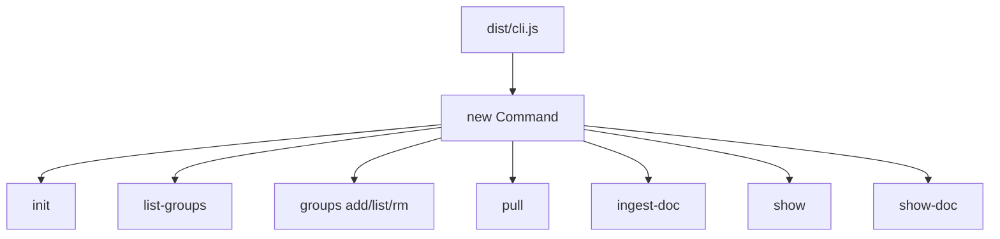
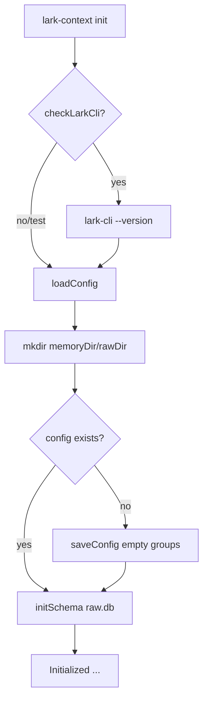
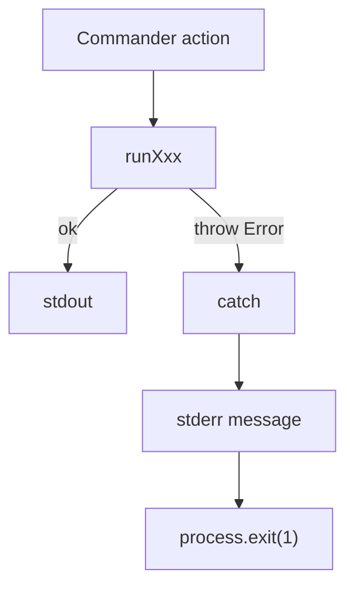

<details>
<summary>相关源文件</summary>

生成本页时使用的主要源文件：

- [src/cli.ts](../../../project-repos/lark-context/src/cli.ts)
- [src/commands/init.ts](../../../project-repos/lark-context/src/commands/init.ts)
- [src/commands/groups.ts](../../../project-repos/lark-context/src/commands/groups.ts)
- [src/commands/listGroups.ts](../../../project-repos/lark-context/src/commands/listGroups.ts)
- [src/commands/pull.ts](../../../project-repos/lark-context/src/commands/pull.ts)
- [src/commands/ingestDoc.ts](../../../project-repos/lark-context/src/commands/ingestDoc.ts)
- [src/commands/show.ts](../../../project-repos/lark-context/src/commands/show.ts)
- [README.md](../../../project-repos/lark-context/README.md)

</details>

# CLI 命令面

`src/cli.ts` 是二进制入口，使用 Commander 注册所有子命令，并在启动时从 `package.json` 读取版本。它还为 stdout/stderr 的 `EPIPE` 做静默退出，方便输出被 `head`、`less` 等管道截断。Sources: [src/cli.ts:1-14](../../../project-repos/lark-context/src/cli.ts#L1-L14), [src/cli.ts:22-49](../../../project-repos/lark-context/src/cli.ts#L22-L49)

<details class="source-snippets">
<summary>引用源码</summary>

<!-- source-snippets:start -->

#### `src/cli.ts:1-14`

```typescript
#!/usr/bin/env node
import { Command } from "commander";
import { readFileSync } from "node:fs";
import { fileURLToPath } from "node:url";
import { dirname, join } from "node:path";
import { registerGroups } from "./commands/groups.js";

// Silently exit on EPIPE (pipes to head/less etc.), matching Python's Click behavior.
for (const stream of [process.stdout, process.stderr]) {
  stream.on("error", (err: NodeJS.ErrnoException) => {
    if (err.code === "EPIPE") process.exit(0);
    throw err;
  });
}
```

#### `src/cli.ts:22-49`

```typescript
// 从 package.json 动态读版本，避免手动维护两份的漂移
function readPkgVersion(): string {
  try {
    const here = dirname(fileURLToPath(import.meta.url));
    const pkg = JSON.parse(
      readFileSync(join(here, "..", "package.json"), "utf8"),
    );
    return typeof pkg.version === "string" ? pkg.version : "0.0.0";
  } catch {
    return "0.0.0";
  }
}

const program = new Command();
program
  .name("lark-context")
  .description("Feishu context bridge for Claude Code")
  .version(readPkgVersion());

registerInit(program);
registerListGroups(program);
registerGroups(program);
registerPull(program);
registerIngestDoc(program);
registerShow(program);
registerShowDoc(program);

program.parseAsync(process.argv);
```

<!-- source-snippets:end -->
</details>
## 命令注册图



Sources: [src/cli.ts:35-49](../../../project-repos/lark-context/src/cli.ts#L35-L49)

<details class="source-snippets">
<summary>引用源码</summary>

<!-- source-snippets:start -->

#### `src/cli.ts:35-49`

```typescript
const program = new Command();
program
  .name("lark-context")
  .description("Feishu context bridge for Claude Code")
  .version(readPkgVersion());

registerInit(program);
registerListGroups(program);
registerGroups(program);
registerPull(program);
registerIngestDoc(program);
registerShow(program);
registerShowDoc(program);

program.parseAsync(process.argv);
```

<!-- source-snippets:end -->
</details>
## 命令职责

| 命令 | 注册位置 | 主要职责 | 外部依赖 |
|---|---|---|---|
| `init` | `src/commands/init.ts` | 检查 `lark-cli`、创建目录、保存初始 config、初始化 schema | `lark-cli --version` |
| `list-groups` | `src/commands/listGroups.ts` | 列当前用户所在飞书群，支持 `--json` | `lark-cli im chats list` |
| `groups add/list/rm` | `src/commands/groups.ts` | 管理关注白名单，并同步 `chats.enabled` | SQLite |
| `pull` | `src/commands/pull.ts` | 增量拉群消息和话题回复，写入 `messages` | `lark-cli im ...` |
| `ingest-doc` | `src/commands/ingestDoc.ts` | 拉飞书文档并 upsert 到 `docs` | `lark-cli docs +fetch` |
| `show` | `src/commands/show.ts` | 从 DB 渲染最近聊天和入库文档 | SQLite |
| `show-doc` | `src/commands/show.ts` | 输出单个已入库文档 Markdown | SQLite |

Sources: [README.md:96-118](../../../project-repos/lark-context/README.md#L96-L118), [src/commands/init.ts:56-67](../../../project-repos/lark-context/src/commands/init.ts#L56-L67), [src/commands/listGroups.ts:46-59](../../../project-repos/lark-context/src/commands/listGroups.ts#L46-L59), [src/commands/groups.ts:92-131](../../../project-repos/lark-context/src/commands/groups.ts#L92-L131), [src/commands/pull.ts:443-472](../../../project-repos/lark-context/src/commands/pull.ts#L443-L472), [src/commands/ingestDoc.ts:105-117](../../../project-repos/lark-context/src/commands/ingestDoc.ts#L105-L117), [src/commands/show.ts:156-184](../../../project-repos/lark-context/src/commands/show.ts#L156-L184)

<details class="source-snippets">
<summary>引用源码</summary>

<!-- source-snippets:start -->

#### `README.md:96-118`

```markdown
## CLI 命令一览

| 命令 | 作用 |
|---|---|
| `lark-context init` | 初始化配置、目录、SQLite 库；检查 lark-cli 是否可用 |
| `lark-context list-groups [--json]` | 列你所在的全部飞书群（chat_id + 名称 + 描述） |
| `lark-context groups add <chat_id> [--alias X] [--name "Y"]` | 把群加到关注白名单 |
| `lark-context groups list` / `groups rm <alias>` | 查看 / 移除白名单 |
| `lark-context pull [--chat <alias>\|all] [--since 3d] [--thread-window 7d] [--no-threads]` | 拉消息（增量）+ 刷新话题回复；不给 `--chat` 就拉所有 enabled 的群 |
| `lark-context ingest-doc <url-或-token>` | 拉单份飞书文档入库（支持 `/docx/` / `/wiki/` / `/docs/` 等） |
| `lark-context show [--chat <alias>\|all] [--since 24h]` | 输出 markdown：聊天记录 + 新入库文档 |
| `lark-context show-doc <token-或-url>` | 输出某份已入库文档的完整 markdown |

**`--since` 格式**：`24h` / `3d` / `1w` / `90m`。仅作为**首次拉取**的时间下限；后续 `pull` 会从"上次见过的最新消息"继续，忽略 `--since`。skill workflow 默认首次拉新群用 `90d`（见 `skills/lark-context/references/pull.md`）。

**`--chat all`** 等价于省略 `--chat`（遍历所有 enabled 的群）。

**话题回复（thread replies）**：`pull` 在拉完顶层消息后，会扫描"回看窗口"内所有带 `thread_id` 的顶层消息，逐个调用飞书 `im +threads-messages-list` 把话题下的回复（子消息）一并落库。窗口默认：

- 首次 pull 某群：与 effective `--since` 对齐（例如 `--since 180d` 则 thread window 也是 180d；不传默认 90d）
- 续拉：30d（`--since` 被忽略）

显式传 `--thread-window <duration>` 覆盖默认，或用 `--no-threads` 跳过该阶段（只拉顶层）。单个话题拉失败（权限 / 删除）不会 disable 整个群，stderr 打 warning 继续下一个。`show` 会把话题回复按 `  ↳ ` 缩进成组渲染在所属根消息下方。
```

#### `src/commands/init.ts:56-67`

```typescript
export function registerInit(program: Command): void {
  program
    .command("init")
    .description("Bootstrap config file, storage dirs, and SQLite schema")
    .action(async () => {
      try {
        await runInit();
      } catch (err) {
        process.stderr.write(`${(err as Error).message}\n`);
        process.exit(1);
      }
    });
```

#### `src/commands/listGroups.ts:46-59`

```typescript
export function registerListGroups(program: Command): void {
  program
    .command("list-groups")
    .description("List chats the current user is in")
    .option("--json", "Emit JSON array instead of text")
    .action(async (opts) => {
      try {
        await runListGroups({ json: Boolean(opts.json) });
      } catch (err) {
        process.stderr.write(`${(err as Error).message}\n`);
        process.exit(1);
      }
    });
}
```

#### `src/commands/groups.ts:92-131`

```typescript
export function registerGroups(program: Command): void {
  const g = program
    .command("groups")
    .description("Manage the whitelist of chats to pull");

  g.command("add <chat_id>")
    .description("Add a chat to the whitelist")
    .option("--alias <alias>", "Short name used in commands")
    .option("--name <name>", "Human-readable name")
    .action(async (chatId, opts) => {
      try {
        await runAdd({ chatId, alias: opts.alias, name: opts.name });
      } catch (err) {
        process.stderr.write(`${(err as Error).message}\n`);
        process.exit(1);
      }
    });

  g.command("list")
    .description("List whitelisted chats")
    .action(async () => {
      try {
        await runList();
      } catch (err) {
        process.stderr.write(`${(err as Error).message}\n`);
        process.exit(1);
      }
    });

  g.command("rm <alias>")
    .description("Remove an alias from the whitelist (soft-disable in DB)")
    .action(async (alias) => {
      try {
        await runRm({ alias });
      } catch (err) {
        process.stderr.write(`${(err as Error).message}\n`);
        process.exit(1);
      }
    });
}
```

#### `src/commands/pull.ts:443-472`

```typescript
export function registerPull(program: Command): void {
  program
    .command("pull")
    .description("Incrementally pull messages for one or all whitelisted chats")
    .option(
      "--chat <alias>",
      'Alias to pull; omit (or "all") for all enabled groups',
    )
    .option(
      "--since <duration>",
      "First-pull lower bound (e.g. 3d, 24h). Ignored on later runs.",
    )
    .option(
      "--thread-window <duration>",
      "Lookback window for thread-reply refresh. Default: matches --since on first pull, 30d on incremental pulls.",
    )
    .option("--no-threads", "Skip thread-reply refresh (phase 2)")
    .action(async (opts) => {
      try {
        await runPull({
          chatAlias: opts.chat,
          since: opts.since,
          threadWindow: opts.threadWindow,
          noThreads: opts.threads === false,
        });
      } catch (err) {
        process.stderr.write(`${(err as Error).message}\n`);
        process.exit(1);
      }
    });
```

#### `src/commands/ingestDoc.ts:105-117`

```typescript
export function registerIngestDoc(program: Command): void {
  program
    .command("ingest-doc <ref>")
    .description("Fetch a Feishu doc (by URL or token) and store its markdown")
    .action(async (ref) => {
      try {
        await runIngestDoc({ ref });
      } catch (err) {
        process.stderr.write(`${(err as Error).message}\n`);
        process.exit(1);
      }
    });
}
```

#### `src/commands/show.ts:156-184`

```typescript
export function registerShow(program: Command): void {
  program
    .command("show")
    .description("Print recent messages + newly-ingested docs as markdown")
    .option("--chat <alias>", "Alias to show; omit (or 'all') for all enabled")
    .option("--since <duration>", "Duration window, e.g. 3d", "24h")
    .action(async (opts) => {
      try {
        await runShow({ chatAlias: opts.chat, since: opts.since });
      } catch (err) {
        process.stderr.write(`${(err as Error).message}\n`);
        process.exit(1);
      }
    });
}

export function registerShowDoc(program: Command): void {
  program
    .command("show-doc <ref>")
    .description("Print the stored markdown for a doc, given its token or URL")
    .action(async (ref) => {
      try {
        await runShowDoc({ ref });
      } catch (err) {
        process.stderr.write(`${(err as Error).message}\n`);
        process.exit(1);
      }
    });
}
```

<!-- source-snippets:end -->
</details>
## 初始化命令

`runInit` 先检查 `lark-cli --version`，检查失败就提示安装官方 CLI 并登录；之后加载路径配置，创建 memory/raw 目录，在配置文件不存在时写入空白配置，最后初始化 `raw.db` schema。Sources: [src/commands/init.ts:18-34](../../../project-repos/lark-context/src/commands/init.ts#L18-L34), [src/commands/init.ts:36-53](../../../project-repos/lark-context/src/commands/init.ts#L36-L53)

<details class="source-snippets">
<summary>引用源码</summary>

<!-- source-snippets:start -->

#### `src/commands/init.ts:18-34`

```typescript
async function defaultPathCheck(): Promise<boolean> {
  try {
    await execa("lark-cli", ["--version"], { reject: true });
    return true;
  } catch {
    return false;
  }
}

export async function runInit(opts: InitOpts = {}): Promise<void> {
  if (opts.checkLarkCli !== false) {
    const check = opts._pathCheck ?? defaultPathCheck;
    if (!(await check())) {
      throw new Error(
        "`lark-cli` binary not found on PATH. Install: `bnpm i -g @larksuite/cli` (or `npm i -g @larksuite/cli`), then `lark-cli auth login`.",
      );
    }
```

#### `src/commands/init.ts:36-53`

```typescript
  const cfg = loadConfig({
    configPathOverride: opts.configPathOverride,
    memoryDirOverride: opts.memoryDirOverride,
    rawDirOverride: opts.rawDirOverride,
  });
  mkdirSync(cfg.memoryDir, { recursive: true });
  mkdirSync(cfg.rawDir, { recursive: true });
  if (cfg.configPath && !existsSync(cfg.configPath)) {
    const fresh: Config = {
      memoryDir: cfg.memoryDir,
      rawDir: cfg.rawDir,
      groups: [],
      configPath: cfg.configPath,
    };
    saveConfig(fresh);
  }
  initSchema(join(cfg.rawDir, "raw.db"));
  process.stdout.write(`Initialized lark-context at ${cfg.configPath}\n`);
```

<!-- source-snippets:end -->
</details>


Sources: [src/commands/init.ts:27-53](../../../project-repos/lark-context/src/commands/init.ts#L27-L53)

<details class="source-snippets">
<summary>引用源码</summary>

<!-- source-snippets:start -->

#### `src/commands/init.ts:27-53`

```typescript
export async function runInit(opts: InitOpts = {}): Promise<void> {
  if (opts.checkLarkCli !== false) {
    const check = opts._pathCheck ?? defaultPathCheck;
    if (!(await check())) {
      throw new Error(
        "`lark-cli` binary not found on PATH. Install: `bnpm i -g @larksuite/cli` (or `npm i -g @larksuite/cli`), then `lark-cli auth login`.",
      );
    }
  }
  const cfg = loadConfig({
    configPathOverride: opts.configPathOverride,
    memoryDirOverride: opts.memoryDirOverride,
    rawDirOverride: opts.rawDirOverride,
  });
  mkdirSync(cfg.memoryDir, { recursive: true });
  mkdirSync(cfg.rawDir, { recursive: true });
  if (cfg.configPath && !existsSync(cfg.configPath)) {
    const fresh: Config = {
      memoryDir: cfg.memoryDir,
      rawDir: cfg.rawDir,
      groups: [],
      configPath: cfg.configPath,
    };
    saveConfig(fresh);
  }
  initSchema(join(cfg.rawDir, "raw.db"));
  process.stdout.write(`Initialized lark-context at ${cfg.configPath}\n`);
```

<!-- source-snippets:end -->
</details>
## 群白名单命令

`groups add` 会解析配置、要求 DB 已初始化、决定 alias、拒绝重复 alias、保存 YAML，并 upsert `chats` 表。`groups rm` 从 YAML 删除该 alias，同时把 DB 中对应 chat 标为 disabled，而不是删除历史消息。Sources: [src/commands/groups.ts:31-58](../../../project-repos/lark-context/src/commands/groups.ts#L31-L58), [src/commands/groups.ts:73-90](../../../project-repos/lark-context/src/commands/groups.ts#L73-L90)

<details class="source-snippets">
<summary>引用源码</summary>

<!-- source-snippets:start -->

#### `src/commands/groups.ts:31-58`

```typescript
export async function runAdd(opts: AddOpts): Promise<void> {
  const cfg = loadConfig(opts);
  const dbPath = join(cfg.rawDir, "raw.db");
  ensureInitialized(dbPath);
  const name = opts.name ?? "";
  const resolvedAlias = opts.alias ?? slugify(name || opts.chatId);
  if (cfg.groups.some((g) => g.alias === resolvedAlias)) {
    throw new Error(`alias "${resolvedAlias}" already in use`);
  }
  const newGroup: GroupConfig = {
    alias: resolvedAlias,
    chatId: opts.chatId,
    name,
    enabled: true,
  };
  const next: Config = { ...cfg, groups: [...cfg.groups, newGroup] };
  saveConfig(next);
  const db = connect(dbPath);
  try {
    db.prepare(
      "INSERT INTO chats(alias, chat_id, name, enabled) VALUES (?, ?, ?, 1) " +
        "ON CONFLICT(alias) DO UPDATE SET chat_id=excluded.chat_id, name=excluded.name, enabled=1",
    ).run(resolvedAlias, opts.chatId, name);
  } finally {
    db.close();
  }
  process.stdout.write(`added ${resolvedAlias} -> ${opts.chatId}\n`);
}
```

#### `src/commands/groups.ts:73-90`

```typescript
export async function runRm(opts: RmOpts): Promise<void> {
  const cfg = loadConfig(opts);
  const dbPath = join(cfg.rawDir, "raw.db");
  ensureInitialized(dbPath);
  const remaining = cfg.groups.filter((g) => g.alias !== opts.alias);
  if (remaining.length === cfg.groups.length) {
    throw new Error(`alias "${opts.alias}" not in whitelist`);
  }
  const next: Config = { ...cfg, groups: remaining };
  saveConfig(next);
  const db = connect(dbPath);
  try {
    db.prepare("UPDATE chats SET enabled=0 WHERE alias=?").run(opts.alias);
  } finally {
    db.close();
  }
  process.stdout.write(`removed ${opts.alias}\n`);
}
```

<!-- source-snippets:end -->
</details>
`list-groups` 则不读本地白名单，它调用官方 CLI 列出用户所在群，默认输出表格，`--json` 输出原始 items 数组。Sources: [src/commands/listGroups.ts:9-44](../../../project-repos/lark-context/src/commands/listGroups.ts#L9-L44)

<details class="source-snippets">
<summary>引用源码</summary>

<!-- source-snippets:start -->

#### `src/commands/listGroups.ts:9-44`

```typescript
export async function runListGroups(opts: ListGroupsOpts): Promise<void> {
  const write = opts.write ?? ((s: string) => process.stdout.write(s));
  const response = await runJson([
    "im",
    "chats",
    "list",
    "--page-all",
    "--page-limit",
    "0",
  ]);
  if (!response || typeof response !== "object") {
    throw new Error(`unexpected lark response: ${JSON.stringify(response)}`);
  }
  const data = (response as { data?: unknown }).data;
  const items: Array<{ chat_id?: string; name?: string; description?: string }> =
    data && typeof data === "object" && Array.isArray((data as any).items)
      ? (data as any).items
      : [];

  if (opts.json) {
    write(JSON.stringify(items, null, 2) + "\n");
    return;
  }
  if (items.length === 0) {
    write("(no chats)\n");
    return;
  }
  write(`${"chat_id".padEnd(40)} 名称 / 描述\n`);
  for (const c of items) {
    const chatId = (c.chat_id ?? "").padEnd(40);
    const name = c.name ?? "";
    const desc = c.description ?? "";
    const suffix = desc ? `  [${desc}]` : "";
    write(`${chatId} ${name}${suffix}\n`);
  }
}
```

<!-- source-snippets:end -->
</details>
## 数据命令的错误出口

每个注册函数都把命令体包在 `try/catch` 中，出错时写 stderr 并 `process.exit(1)`。业务函数本身用抛错表达错误，这让测试能直接断言 `runXxx` 的异常，而 CLI 运行时能转成标准非零退出。Sources: [src/commands/init.ts:60-66](../../../project-repos/lark-context/src/commands/init.ts#L60-L66), [src/commands/groups.ts:101-129](../../../project-repos/lark-context/src/commands/groups.ts#L101-L129), [src/commands/pull.ts:460-470](../../../project-repos/lark-context/src/commands/pull.ts#L460-L470), [src/commands/show.ts:162-181](../../../project-repos/lark-context/src/commands/show.ts#L162-L181)

<details class="source-snippets">
<summary>引用源码</summary>

<!-- source-snippets:start -->

#### `src/commands/init.ts:60-66`

```typescript
    .action(async () => {
      try {
        await runInit();
      } catch (err) {
        process.stderr.write(`${(err as Error).message}\n`);
        process.exit(1);
      }
```

#### `src/commands/groups.ts:101-129`

```typescript
    .action(async (chatId, opts) => {
      try {
        await runAdd({ chatId, alias: opts.alias, name: opts.name });
      } catch (err) {
        process.stderr.write(`${(err as Error).message}\n`);
        process.exit(1);
      }
    });

  g.command("list")
    .description("List whitelisted chats")
    .action(async () => {
      try {
        await runList();
      } catch (err) {
        process.stderr.write(`${(err as Error).message}\n`);
        process.exit(1);
      }
    });

  g.command("rm <alias>")
    .description("Remove an alias from the whitelist (soft-disable in DB)")
    .action(async (alias) => {
      try {
        await runRm({ alias });
      } catch (err) {
        process.stderr.write(`${(err as Error).message}\n`);
        process.exit(1);
      }
```

#### `src/commands/pull.ts:460-470`

```typescript
    .action(async (opts) => {
      try {
        await runPull({
          chatAlias: opts.chat,
          since: opts.since,
          threadWindow: opts.threadWindow,
          noThreads: opts.threads === false,
        });
      } catch (err) {
        process.stderr.write(`${(err as Error).message}\n`);
        process.exit(1);
```

#### `src/commands/show.ts:162-181`

```typescript
    .action(async (opts) => {
      try {
        await runShow({ chatAlias: opts.chat, since: opts.since });
      } catch (err) {
        process.stderr.write(`${(err as Error).message}\n`);
        process.exit(1);
      }
    });
}

export function registerShowDoc(program: Command): void {
  program
    .command("show-doc <ref>")
    .description("Print the stored markdown for a doc, given its token or URL")
    .action(async (ref) => {
      try {
        await runShowDoc({ ref });
      } catch (err) {
        process.stderr.write(`${(err as Error).message}\n`);
        process.exit(1);
```

<!-- source-snippets:end -->
</details>


Sources: [src/commands/ingestDoc.ts:109-115](../../../project-repos/lark-context/src/commands/ingestDoc.ts#L109-L115), [src/commands/show.ts:176-181](../../../project-repos/lark-context/src/commands/show.ts#L176-L181)

<details class="source-snippets">
<summary>引用源码</summary>

<!-- source-snippets:start -->

#### `src/commands/ingestDoc.ts:109-115`

```typescript
    .action(async (ref) => {
      try {
        await runIngestDoc({ ref });
      } catch (err) {
        process.stderr.write(`${(err as Error).message}\n`);
        process.exit(1);
      }
```

#### `src/commands/show.ts:176-181`

```typescript
    .action(async (ref) => {
      try {
        await runShowDoc({ ref });
      } catch (err) {
        process.stderr.write(`${(err as Error).message}\n`);
        process.exit(1);
```

<!-- source-snippets:end -->
</details>
## 相关页面

- [系统架构](system-architecture.md)
- [lark-cli 集成](lark-cli-integration.md)
- [文档入库与 Markdown 输出](document-ingestion-and-show.md)
