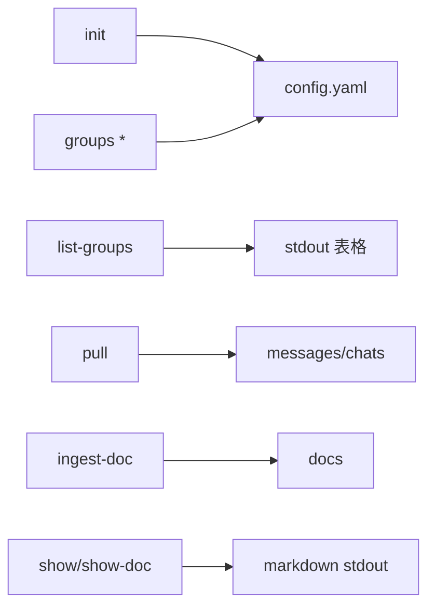

<details>
<summary>相关源文件</summary>

生成本页时使用的主要源文件：

- [src/commands/init.ts](../../../project-repos/lark-context/src/commands/init.ts)
- [src/commands/listGroups.ts](../../../project-repos/lark-context/src/commands/listGroups.ts)
- [src/commands/groups.ts](../../../project-repos/lark-context/src/commands/groups.ts)
- [src/commands/pull.ts](../../../project-repos/lark-context/src/commands/pull.ts)
- [src/commands/show.ts](../../../project-repos/lark-context/src/commands/show.ts)
- [src/commands/ingestDoc.ts](../../../project-repos/lark-context/src/commands/ingestDoc.ts)

</details>

# CLI 命令参考

`lark-context` 把日常操作切成**初始化 / 发现群 / 白名单 / 同步 / 入库 / 展示**六类命令；几乎所有需要权限的网络访问都封装在对 `lark-cli` 的子进程调用里，命令文件自身只处理参数、SQLite 事务与 stderr 友好输出。

| 命令 | 数据去向 | 典型失败 |
|------|----------|----------|
| `init` | 创建目录 + `raw.db` schema | `lark-cli` 不在 PATH |
| `list-groups` | 只读展示 | OAuth scope 不足 |
| `groups add|list|rm` | `config.yaml` + `chats` 表 | alias 冲突 / 未知 alias |
| `pull` | `messages` + 更新 `last_cursor` | 单群 `LarkCLIError` → disable |
| `ingest-doc` | `docs` UPSERT | 老版 `/docs/` 被 CLI 拒绝 |
| `show` / `show-doc` | 读库输出 markdown | 无白名单 / 文档未入库 |



## `list-groups` 的分页策略

`runListGroups` 直接调用 `im chats list --page-all --page-limit 0`，把结果数组原样打印或 `--json` 输出——**这意味着 CLI 侧负责吃尽分页**，TS 层保持薄封装。

## 群组白名单语义

`groups rm` 从 yaml 删除记录并把 DB `enabled` 置 0；若用户只是暂时想停某个群的同步，也可以把 yaml 里的 `enabled: false` 与命令结合使用（loader 会过滤）。

## 错误处理哲学

大部分 `command action` 模板都是 `try { ... } catch { stderr + exit(1) }`；对需要多群批处理的 `pull`，**单群失败降级 disable**，继续其它群，stderr 明示原因，方便后续人工 `groups add` 恢复。

Sources: [src/commands/init.ts:56-67](../../../project-repos/lark-context/src/commands/init.ts#L56-L67), [src/commands/listGroups.ts:9-44](../../../project-repos/lark-context/src/commands/listGroups.ts#L9-L44), [src/commands/groups.ts:92-131](../../../project-repos/lark-context/src/commands/groups.ts#L92-L131), [src/commands/pull.ts:401-441](../../../project-repos/lark-context/src/commands/pull.ts#L401-L441), [src/commands/show.ts:156-184](../../../project-repos/lark-context/src/commands/show.ts#L156-L184), [src/commands/ingestDoc.ts:105-117](../../../project-repos/lark-context/src/commands/ingestDoc.ts#L105-L117)

<details class="source-snippets">
<summary>引用源码</summary>

<!-- source-snippets:start -->

#### `src/commands/init.ts:56-67`

```typescript
export function registerInit(program: Command): void {
  program
    .command("init")
    .description("Bootstrap config file, storage dirs, and SQLite schema")
    .action(async () => {
      try {
        await runInit();
      } catch (err) {
        process.stderr.write(`${(err as Error).message}\n`);
        process.exit(1);
      }
    });
```

#### `src/commands/listGroups.ts:9-44`

```typescript
export async function runListGroups(opts: ListGroupsOpts): Promise<void> {
  const write = opts.write ?? ((s: string) => process.stdout.write(s));
  const response = await runJson([
    "im",
    "chats",
    "list",
    "--page-all",
    "--page-limit",
    "0",
  ]);
  if (!response || typeof response !== "object") {
    throw new Error(`unexpected lark response: ${JSON.stringify(response)}`);
  }
  const data = (response as { data?: unknown }).data;
  const items: Array<{ chat_id?: string; name?: string; description?: string }> =
    data && typeof data === "object" && Array.isArray((data as any).items)
      ? (data as any).items
      : [];

  if (opts.json) {
    write(JSON.stringify(items, null, 2) + "\n");
    return;
  }
  if (items.length === 0) {
    write("(no chats)\n");
    return;
  }
  write(`${"chat_id".padEnd(40)} 名称 / 描述\n`);
  for (const c of items) {
    const chatId = (c.chat_id ?? "").padEnd(40);
    const name = c.name ?? "";
    const desc = c.description ?? "";
    const suffix = desc ? `  [${desc}]` : "";
    write(`${chatId} ${name}${suffix}\n`);
  }
}
```

#### `src/commands/groups.ts:92-131`

```typescript
export function registerGroups(program: Command): void {
  const g = program
    .command("groups")
    .description("Manage the whitelist of chats to pull");

  g.command("add <chat_id>")
    .description("Add a chat to the whitelist")
    .option("--alias <alias>", "Short name used in commands")
    .option("--name <name>", "Human-readable name")
    .action(async (chatId, opts) => {
      try {
        await runAdd({ chatId, alias: opts.alias, name: opts.name });
      } catch (err) {
        process.stderr.write(`${(err as Error).message}\n`);
        process.exit(1);
      }
    });

  g.command("list")
    .description("List whitelisted chats")
    .action(async () => {
      try {
        await runList();
      } catch (err) {
        process.stderr.write(`${(err as Error).message}\n`);
        process.exit(1);
      }
    });

  g.command("rm <alias>")
    .description("Remove an alias from the whitelist (soft-disable in DB)")
    .action(async (alias) => {
      try {
        await runRm({ alias });
      } catch (err) {
        process.stderr.write(`${(err as Error).message}\n`);
        process.exit(1);
      }
    });
}
```

#### `src/commands/pull.ts:401-441`

```typescript
export async function runPull(opts: PullOpts): Promise<number> {
  const cfg: Config = loadConfig(opts);
  const dbPath = join(cfg.rawDir, "raw.db");
  ensureInitialized(dbPath);
  const sinceParsed = opts.since ? parseDuration(opts.since) : null;
  const threadWindowParsed = opts.threadWindow
    ? parseDuration(opts.threadWindow)
    : null;
  const threadOpts: ThreadOpts = {
    enabled: !opts.noThreads,
    overrideWindow: threadWindowParsed,
    firstPullFallback: sinceParsed,
  };
  const effectiveAlias =
    opts.chatAlias === "all" || !opts.chatAlias ? null : opts.chatAlias;
  const targets = cfg.groups.filter(
    (g) => g.enabled && (!effectiveAlias || g.alias === effectiveAlias),
  );
  if (effectiveAlias && targets.length === 0) {
    throw new Error(`unknown chat alias "${opts.chatAlias}"`);
  }
  const now = (opts._now ?? (() => new Date()))();

  let grand = 0;
  for (const g of targets) {
    try {
      const n = await pullChat(dbPath, g, sinceParsed, threadOpts, now);
      process.stdout.write(`${g.alias}: pulled ${n} messages\n`);
      grand += n;
    } catch (err) {
      if (err instanceof LarkNotFoundError) throw err;
      if (err instanceof LarkCLIError) {
        disableChat(dbPath, g.alias, err.message);
        continue;
      }
      throw err;
    }
  }
  process.stdout.write(`done, total=${grand}\n`);
  return grand;
}
```

#### `src/commands/show.ts:156-184`

```typescript
export function registerShow(program: Command): void {
  program
    .command("show")
    .description("Print recent messages + newly-ingested docs as markdown")
    .option("--chat <alias>", "Alias to show; omit (or 'all') for all enabled")
    .option("--since <duration>", "Duration window, e.g. 3d", "24h")
    .action(async (opts) => {
      try {
        await runShow({ chatAlias: opts.chat, since: opts.since });
      } catch (err) {
        process.stderr.write(`${(err as Error).message}\n`);
        process.exit(1);
      }
    });
}

export function registerShowDoc(program: Command): void {
  program
    .command("show-doc <ref>")
    .description("Print the stored markdown for a doc, given its token or URL")
    .action(async (ref) => {
      try {
        await runShowDoc({ ref });
      } catch (err) {
        process.stderr.write(`${(err as Error).message}\n`);
        process.exit(1);
      }
    });
}
```

#### `src/commands/ingestDoc.ts:105-117`

```typescript
export function registerIngestDoc(program: Command): void {
  program
    .command("ingest-doc <ref>")
    .description("Fetch a Feishu doc (by URL or token) and store its markdown")
    .action(async (ref) => {
      try {
        await runIngestDoc({ ref });
      } catch (err) {
        process.stderr.write(`${(err as Error).message}\n`);
        process.exit(1);
      }
    });
}
```

<!-- source-snippets:end -->
</details>
## 相关页面

- [增量拉取与话题回复](pull-and-threads.md) — `--since` / thread window  
- [文档入库与展示](docs-ingest-show.md) — ingest/show 细节  
- [配置、路径与隐私边界](config-and-privacy.md) — 覆盖优先级  
