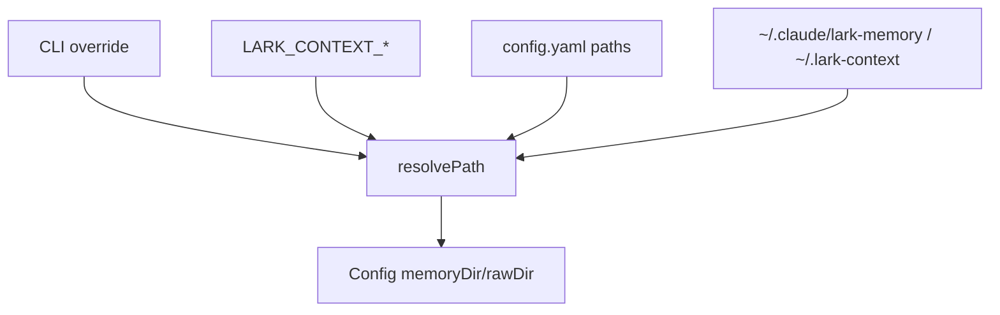
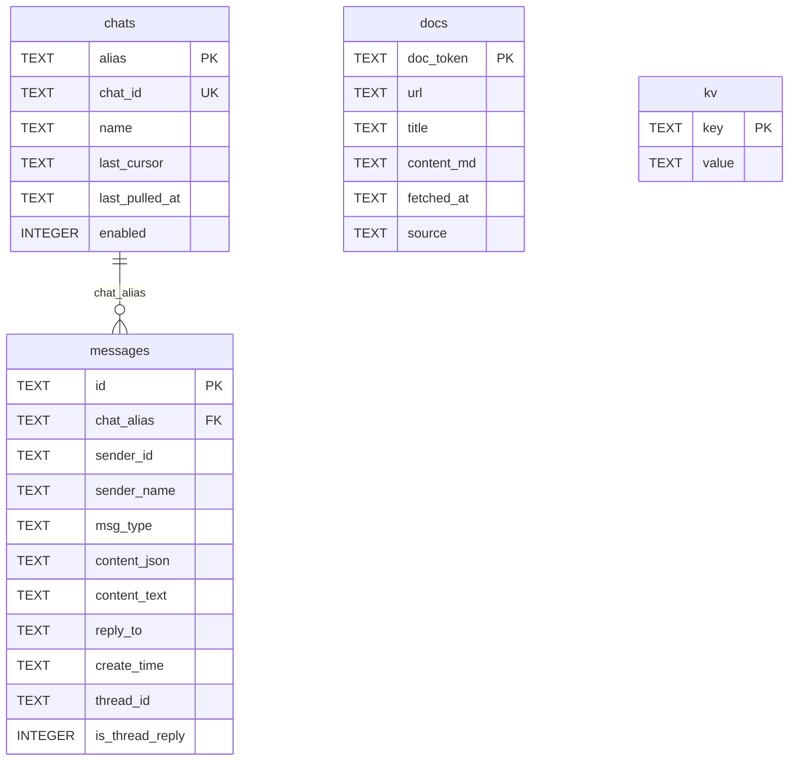
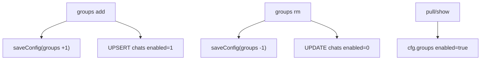

<details>
<summary>相关源文件</summary>

生成本页时使用的主要源文件：

- [src/config.ts](../../../project-repos/lark-context/src/config.ts)
- [src/db.ts](../../../project-repos/lark-context/src/db.ts)
- [src/commands/init.ts](../../../project-repos/lark-context/src/commands/init.ts)
- [src/commands/groups.ts](../../../project-repos/lark-context/src/commands/groups.ts)
- [README.md](../../../project-repos/lark-context/README.md)
- [test/config.test.ts](../../../project-repos/lark-context/test/config.test.ts)
- [test/db.test.ts](../../../project-repos/lark-context/test/db.test.ts)

</details>

# 配置与 SQLite 存储

配置层负责把用户目录、环境变量、YAML 和命令参数解析成统一 `Config`。存储层负责创建和迁移 `raw.db`，其中 `chats` 是关注群状态，`messages` 是原始聊天，`docs` 是手动入库文档，`kv` 保存 workflow 状态。Sources: [src/config.ts:18-36](../../../project-repos/lark-context/src/config.ts#L18-L36), [src/db.ts:5-41](../../../project-repos/lark-context/src/db.ts#L5-L41)

<details class="source-snippets">
<summary>引用源码</summary>

<!-- source-snippets:start -->

#### `src/config.ts:18-36`

```typescript
export interface GroupConfig {
  alias: string;
  chatId: string;
  name: string;
  enabled: boolean;
}

export interface Config {
  memoryDir: string;
  rawDir: string;
  groups: GroupConfig[];
  configPath: string | null;
}

export interface LoadConfigOptions {
  configPathOverride?: string;
  memoryDirOverride?: string;
  rawDirOverride?: string;
}
```

#### `src/db.ts:5-41`

```typescript
export const SCHEMA = `
CREATE TABLE IF NOT EXISTS chats (
  alias           TEXT PRIMARY KEY,
  chat_id         TEXT NOT NULL UNIQUE,
  name            TEXT,
  last_cursor     TEXT,
  last_pulled_at  TEXT,
  enabled         INTEGER DEFAULT 1
);
CREATE TABLE IF NOT EXISTS messages (
  id              TEXT PRIMARY KEY,
  chat_alias      TEXT NOT NULL REFERENCES chats(alias),
  sender_id       TEXT,
  sender_name     TEXT,
  msg_type        TEXT,
  content_json    TEXT NOT NULL,
  content_text    TEXT,
  reply_to        TEXT,
  create_time     TEXT NOT NULL,
  thread_id       TEXT,
  is_thread_reply INTEGER NOT NULL DEFAULT 0
);
CREATE INDEX IF NOT EXISTS idx_messages_chat_time
  ON messages(chat_alias, create_time);
CREATE TABLE IF NOT EXISTS docs (
  doc_token   TEXT PRIMARY KEY,
  url         TEXT NOT NULL,
  title       TEXT,
  content_md  TEXT NOT NULL,
  fetched_at  TEXT NOT NULL,
  source      TEXT
);
CREATE TABLE IF NOT EXISTS kv (
  key   TEXT PRIMARY KEY,
  value TEXT
);
`;
```

<!-- source-snippets:end -->
</details>
## 路径优先级

README 写明路径覆盖优先级是 CLI flag、环境变量、config.yaml、默认值。源码中的 `resolvePath` 与 `loadConfig` 实现了这个顺序，并支持 `~` 展开。Sources: [README.md:120-128](../../../project-repos/lark-context/README.md#L120-L128), [src/config.ts:38-63](../../../project-repos/lark-context/src/config.ts#L38-L63), [src/config.ts:95-133](../../../project-repos/lark-context/src/config.ts#L95-L133)

<details class="source-snippets">
<summary>引用源码</summary>

<!-- source-snippets:start -->

#### `README.md:120-128`

```markdown
## 存储位置

| 东西 | 默认路径 | 覆盖方式 |
|---|---|---|
| 配置文件 | `~/.lark-context/config.yaml` | `LARK_CONTEXT_CONFIG` 环境变量 |
| 原始数据（SQLite） | `~/.lark-context/raw.db` | `LARK_CONTEXT_RAW_DIR` |
| 记忆文件（给 Claude 读） | `~/.claude/lark-memory/` | `LARK_CONTEXT_MEMORY_DIR` |

覆盖优先级（高 → 低）：CLI flag → 环境变量 → config.yaml → 默认值。
```

#### `src/config.ts:38-63`

```typescript
function expandHome(p: string): string {
  if (p === "~") return homedir();
  if (p.startsWith("~/") || p.startsWith(`~${sep}`)) {
    return join(homedir(), p.slice(2));
  }
  return p;
}

function defaultConfigPath(): string {
  const env = process.env[ENV_CONFIG];
  if (env) return expandHome(env);
  return join(homedir(), ".lark-context", "config.yaml");
}

function resolvePath(
  flag: string | undefined,
  envVar: string,
  yamlValue: string | undefined,
  fallback: string,
): string {
  if (flag !== undefined) return expandHome(flag);
  const env = process.env[envVar];
  if (env) return expandHome(env);
  if (yamlValue) return expandHome(yamlValue);
  return expandHome(fallback);
}
```

#### `src/config.ts:95-133`

```typescript
export function loadConfig(opts: LoadConfigOptions = {}): Config {
  const configPath = opts.configPathOverride
    ? expandHome(opts.configPathOverride)
    : defaultConfigPath();
  let yamlData: Record<string, unknown> = {};
  if (existsSync(configPath)) {
    const parsed = YAML.parse(readFileSync(configPath, "utf8"));
    if (parsed && typeof parsed === "object" && !Array.isArray(parsed)) {
      yamlData = parsed as Record<string, unknown>;
    }
  }
  const pathsRaw = yamlData.paths;
  const pathsSection: Record<string, unknown> =
    pathsRaw && typeof pathsRaw === "object" && !Array.isArray(pathsRaw)
      ? (pathsRaw as Record<string, unknown>)
      : {};
  const memoryDir = resolvePath(
    opts.memoryDirOverride,
    ENV_MEMORY,
    typeof pathsSection.memory_dir === "string"
      ? pathsSection.memory_dir
      : undefined,
    "~/.claude/lark-memory",
  );
  const rawDir = resolvePath(
    opts.rawDirOverride,
    ENV_RAW,
    typeof pathsSection.raw_dir === "string"
      ? pathsSection.raw_dir
      : undefined,
    "~/.lark-context",
  );
  return {
    memoryDir,
    rawDir,
    groups: parseGroups(yamlData.groups),
    configPath,
  };
}
```

<!-- source-snippets:end -->
</details>


Sources: [src/config.ts:6-8](../../../project-repos/lark-context/src/config.ts#L6-L8), [src/config.ts:46-63](../../../project-repos/lark-context/src/config.ts#L46-L63), [test/config.test.ts:44-91](../../../project-repos/lark-context/test/config.test.ts#L44-L91)

<details class="source-snippets">
<summary>引用源码</summary>

<!-- source-snippets:start -->

#### `src/config.ts:6-8`

```typescript
export const ENV_CONFIG = "LARK_CONTEXT_CONFIG";
export const ENV_MEMORY = "LARK_CONTEXT_MEMORY_DIR";
export const ENV_RAW = "LARK_CONTEXT_RAW_DIR";
```

#### `src/config.ts:46-63`

```typescript
function defaultConfigPath(): string {
  const env = process.env[ENV_CONFIG];
  if (env) return expandHome(env);
  return join(homedir(), ".lark-context", "config.yaml");
}

function resolvePath(
  flag: string | undefined,
  envVar: string,
  yamlValue: string | undefined,
  fallback: string,
): string {
  if (flag !== undefined) return expandHome(flag);
  const env = process.env[envVar];
  if (env) return expandHome(env);
  if (yamlValue) return expandHome(yamlValue);
  return expandHome(fallback);
}
```

#### `test/config.test.ts:44-91`

```typescript
  it("returns defaults when file missing", () => {
    const cfg = loadConfig();
    expect(cfg.memoryDir).toBe(join(tmpHome, ".claude", "lark-memory"));
    expect(cfg.rawDir).toBe(join(tmpHome, ".lark-context"));
    expect(cfg.groups).toEqual([]);
  });

  it("yaml paths + groups are parsed", () => {
    writeYaml(join(tmpHome, ".lark-context", "config.yaml"), {
      paths: {
        memory_dir: join(tmpHome, "mem"),
        raw_dir: join(tmpHome, "raw"),
      },
      groups: [
        {
          alias: "alpha",
          chat_id: "oc_aaa",
          name: "Alpha",
          enabled: true,
        },
      ],
    });
    const cfg = loadConfig();
    expect(cfg.memoryDir).toBe(join(tmpHome, "mem"));
    expect(cfg.rawDir).toBe(join(tmpHome, "raw"));
    expect(cfg.groups).toEqual<GroupConfig[]>([
      { alias: "alpha", chatId: "oc_aaa", name: "Alpha", enabled: true },
    ]);
  });

  it("env var beats yaml", () => {
    writeYaml(join(tmpHome, ".lark-context", "config.yaml"), {
      paths: {
        memory_dir: join(tmpHome, "mem"),
        raw_dir: join(tmpHome, "raw"),
      },
    });
    process.env.LARK_CONTEXT_MEMORY_DIR = join(tmpHome, "env-mem");
    const cfg = loadConfig();
    expect(cfg.memoryDir).toBe(join(tmpHome, "env-mem"));
    expect(cfg.rawDir).toBe(join(tmpHome, "raw"));
  });

  it("flag beats env", () => {
    process.env.LARK_CONTEXT_MEMORY_DIR = join(tmpHome, "env-mem");
    const cfg = loadConfig({ memoryDirOverride: join(tmpHome, "flag-mem") });
    expect(cfg.memoryDir).toBe(join(tmpHome, "flag-mem"));
  });
```

<!-- source-snippets:end -->
</details>
## YAML 配置模型

`groups` 在 YAML 中使用 `chat_id`，进入 TypeScript 后映射为 `chatId`。`parseGroups` 要求 `groups` 必须是列表，每个 entry 至少有 `alias` 和 `chat_id`，并拒绝重复 alias；`enabled` 缺省为 `true`。Sources: [src/config.ts:65-93](../../../project-repos/lark-context/src/config.ts#L65-L93), [test/config.test.ts:51-72](../../../project-repos/lark-context/test/config.test.ts#L51-L72), [test/config.test.ts:140-148](../../../project-repos/lark-context/test/config.test.ts#L140-L148)

<details class="source-snippets">
<summary>引用源码</summary>

<!-- source-snippets:start -->

#### `src/config.ts:65-93`

```typescript
function parseGroups(raw: unknown): GroupConfig[] {
  if (raw === null || raw === undefined) return [];
  if (!Array.isArray(raw)) throw new Error("'groups' must be a list");
  const seen = new Set<string>();
  const out: GroupConfig[] = [];
  for (const entry of raw) {
    if (
      !entry ||
      typeof entry !== "object" ||
      !("alias" in entry) ||
      !("chat_id" in entry)
    ) {
      throw new Error(`bad group entry: ${JSON.stringify(entry)}`);
    }
    const e = entry as Record<string, unknown>;
    const alias = String(e.alias);
    if (seen.has(alias)) {
      throw new Error(`duplicate alias "${alias}" in groups`);
    }
    seen.add(alias);
    out.push({
      alias,
      chatId: String(e.chat_id),
      name: typeof e.name === "string" ? e.name : "",
      enabled: e.enabled === undefined ? true : Boolean(e.enabled),
    });
  }
  return out;
}
```

#### `test/config.test.ts:51-72`

```typescript
  it("yaml paths + groups are parsed", () => {
    writeYaml(join(tmpHome, ".lark-context", "config.yaml"), {
      paths: {
        memory_dir: join(tmpHome, "mem"),
        raw_dir: join(tmpHome, "raw"),
      },
      groups: [
        {
          alias: "alpha",
          chat_id: "oc_aaa",
          name: "Alpha",
          enabled: true,
        },
      ],
    });
    const cfg = loadConfig();
    expect(cfg.memoryDir).toBe(join(tmpHome, "mem"));
    expect(cfg.rawDir).toBe(join(tmpHome, "raw"));
    expect(cfg.groups).toEqual<GroupConfig[]>([
      { alias: "alpha", chatId: "oc_aaa", name: "Alpha", enabled: true },
    ]);
  });
```

#### `test/config.test.ts:140-148`

```typescript
  it("rejects duplicate alias", () => {
    writeYaml(join(tmpHome, ".lark-context", "config.yaml"), {
      groups: [
        { alias: "a", chat_id: "oc_1" },
        { alias: "a", chat_id: "oc_2" },
      ],
    });
    expect(() => loadConfig()).toThrow(/duplicate alias/);
  });
```

<!-- source-snippets:end -->
</details>
保存配置时，`saveConfig` 会把 HOME 下路径收缩回 `~/...`，并把 `chatId` 写回 `chat_id`。测试覆盖了 HOME 内路径收缩和 HOME 外绝对路径保留。Sources: [src/config.ts:135-164](../../../project-repos/lark-context/src/config.ts#L135-L164), [test/config.test.ts:93-138](../../../project-repos/lark-context/test/config.test.ts#L93-L138)

<details class="source-snippets">
<summary>引用源码</summary>

<!-- source-snippets:start -->

#### `src/config.ts:135-164`

```typescript
function contractHome(p: string): string {
  const home = homedir();
  if (p === home) return "~";
  if (!isAbsolute(p)) return p;
  const rel = relative(home, p);
  // If relative escapes home (starts with ..) or is empty/absolute, leave unchanged.
  if (!rel || rel.startsWith("..") || isAbsolute(rel)) return p;
  // Normalize separators to forward slash for portability in yaml.
  const normalized = rel.split(sep).join("/");
  return `~/${normalized}`;
}

export function saveConfig(cfg: Config): void {
  if (!cfg.configPath) {
    throw new Error("Config.configPath required for saveConfig");
  }
  mkdirSync(dirname(cfg.configPath), { recursive: true });
  const data = {
    paths: {
      memory_dir: contractHome(cfg.memoryDir),
      raw_dir: contractHome(cfg.rawDir),
    },
    groups: cfg.groups.map((g) => ({
      alias: g.alias,
      chat_id: g.chatId,
      name: g.name,
      enabled: g.enabled,
    })),
  };
  writeFileSync(cfg.configPath, YAML.stringify(data));
```

#### `test/config.test.ts:93-138`

```typescript
  it("save/load round-trip", () => {
    const cfg: Config = {
      memoryDir: join(tmpHome, "mem"),
      rawDir: join(tmpHome, "raw"),
      groups: [{ alias: "a", chatId: "oc_1", name: "A", enabled: true }],
      configPath: join(tmpHome, ".lark-context", "config.yaml"),
    };
    saveConfig(cfg);
    const reloaded = loadConfig();
    expect(reloaded.groups[0].alias).toBe("a");
    expect(reloaded.memoryDir).toBe(join(tmpHome, "mem"));
  });

  it("saves ~/path for dirs under HOME", () => {
    const cfg: Config = {
      memoryDir: join(tmpHome, ".claude", "lark-memory"),
      rawDir: join(tmpHome, ".lark-context"),
      groups: [],
      configPath: join(tmpHome, ".lark-context", "config.yaml"),
    };
    saveConfig(cfg);
    const text = readFileSync(
      join(tmpHome, ".lark-context", "config.yaml"),
      "utf8",
    );
    expect(text).toContain("memory_dir: ~/.claude/lark-memory");
    expect(text).toContain("raw_dir: ~/.lark-context");
    expect(text).not.toContain(tmpHome);
  });

  it("keeps /var/... absolute", () => {
    const outOfHome = "/var/fake_mem";
    const cfg: Config = {
      memoryDir: outOfHome,
      rawDir: outOfHome,
      groups: [],
      configPath: join(tmpHome, ".lark-context", "config.yaml"),
    };
    saveConfig(cfg);
    const text = readFileSync(
      join(tmpHome, ".lark-context", "config.yaml"),
      "utf8",
    );
    expect(text).toContain("/var/fake_mem");
    expect(text).not.toContain("~");
  });
```

<!-- source-snippets:end -->
</details>
## SQLite schema



Sources: [src/db.ts:5-41](../../../project-repos/lark-context/src/db.ts#L5-L41)

<details class="source-snippets">
<summary>引用源码</summary>

<!-- source-snippets:start -->

#### `src/db.ts:5-41`

```typescript
export const SCHEMA = `
CREATE TABLE IF NOT EXISTS chats (
  alias           TEXT PRIMARY KEY,
  chat_id         TEXT NOT NULL UNIQUE,
  name            TEXT,
  last_cursor     TEXT,
  last_pulled_at  TEXT,
  enabled         INTEGER DEFAULT 1
);
CREATE TABLE IF NOT EXISTS messages (
  id              TEXT PRIMARY KEY,
  chat_alias      TEXT NOT NULL REFERENCES chats(alias),
  sender_id       TEXT,
  sender_name     TEXT,
  msg_type        TEXT,
  content_json    TEXT NOT NULL,
  content_text    TEXT,
  reply_to        TEXT,
  create_time     TEXT NOT NULL,
  thread_id       TEXT,
  is_thread_reply INTEGER NOT NULL DEFAULT 0
);
CREATE INDEX IF NOT EXISTS idx_messages_chat_time
  ON messages(chat_alias, create_time);
CREATE TABLE IF NOT EXISTS docs (
  doc_token   TEXT PRIMARY KEY,
  url         TEXT NOT NULL,
  title       TEXT,
  content_md  TEXT NOT NULL,
  fetched_at  TEXT NOT NULL,
  source      TEXT
);
CREATE TABLE IF NOT EXISTS kv (
  key   TEXT PRIMARY KEY,
  value TEXT
);
`;
```

<!-- source-snippets:end -->
</details>
连接数据库时会创建父目录、开启外键和 WAL；`initSchema` 执行 schema 后还会运行 `migrateMessagesColumns`。Sources: [src/db.ts:43-59](../../../project-repos/lark-context/src/db.ts#L43-L59)

<details class="source-snippets">
<summary>引用源码</summary>

<!-- source-snippets:start -->

#### `src/db.ts:43-59`

```typescript
export function connect(dbPath: string): Database.Database {
  mkdirSync(dirname(dbPath), { recursive: true });
  const db = new Database(dbPath);
  db.pragma("foreign_keys = ON");
  db.pragma("journal_mode = WAL");
  return db;
}

export function initSchema(dbPath: string): void {
  const db = connect(dbPath);
  try {
    db.exec(SCHEMA);
    migrateMessagesColumns(db);
  } finally {
    db.close();
  }
}
```

<!-- source-snippets:end -->
</details>
## thread 字段迁移

`migrateMessagesColumns` 会检查 `messages` 表字段，补 `thread_id` 和 `is_thread_reply`；对旧数据，它从 `content_json` 的 `$.thread_id` 回填缺失的 `thread_id`，然后创建 `(chat_alias, thread_id, create_time)` 索引。Sources: [src/db.ts:61-91](../../../project-repos/lark-context/src/db.ts#L61-L91)

<details class="source-snippets">
<summary>引用源码</summary>

<!-- source-snippets:start -->

#### `src/db.ts:61-91`

```typescript
function migrateMessagesColumns(db: Database.Database): void {
  const cols = db
    .prepare("PRAGMA table_info(messages)")
    .all() as Array<{ name: string }>;
  const have = new Set(cols.map((c) => c.name));
  if (!have.has("thread_id")) {
    db.exec("ALTER TABLE messages ADD COLUMN thread_id TEXT");
  }
  if (!have.has("is_thread_reply")) {
    db.exec(
      "ALTER TABLE messages ADD COLUMN is_thread_reply INTEGER NOT NULL DEFAULT 0",
    );
  }
  // Backfill thread_id from the stored raw JSON for rows that pre-date
  // the thread_id column. Safe to run repeatedly — only touches rows
  // where thread_id is still NULL.
  db.exec(
    "UPDATE messages " +
      "SET thread_id = json_extract(content_json, '$.thread_id') " +
      "WHERE thread_id IS NULL " +
      "AND json_valid(content_json) " +
      "AND json_extract(content_json, '$.thread_id') IS NOT NULL",
  );
  // Cannot live in SCHEMA: legacy messages tables lack thread_id, so the CREATE
  // INDEX would fail there even with IF NOT EXISTS (that clause checks the
  // index name, not column validity).
  db.exec(
    "CREATE INDEX IF NOT EXISTS idx_messages_chat_thread " +
      "ON messages(chat_alias, thread_id, create_time)",
  );
}
```

<!-- source-snippets:end -->
</details>
测试覆盖了新 schema 中字段和索引存在、旧 schema 原地迁移、JSON 回填、坏 JSON 不崩溃以及重复迁移幂等。Sources: [test/db.test.ts:48-80](../../../project-repos/lark-context/test/db.test.ts#L48-L80), [test/db.test.ts:82-145](../../../project-repos/lark-context/test/db.test.ts#L82-L145), [test/db.test.ts:147-206](../../../project-repos/lark-context/test/db.test.ts#L147-L206)

<details class="source-snippets">
<summary>引用源码</summary>

<!-- source-snippets:start -->

#### `test/db.test.ts:48-80`

```typescript
  it("messages table has thread_id and is_thread_reply columns", () => {
    const dbPath = join(tmp, "raw.db");
    initSchema(dbPath);
    const db = connect(dbPath);
    try {
      const cols = db
        .prepare("PRAGMA table_info(messages)")
        .all() as Array<{ name: string; type: string; dflt_value: unknown }>;
      const byName = Object.fromEntries(cols.map((c) => [c.name, c]));
      expect(byName.thread_id).toBeDefined();
      expect(byName.thread_id.type).toBe("TEXT");
      expect(byName.is_thread_reply).toBeDefined();
      expect(byName.is_thread_reply.type).toBe("INTEGER");
    } finally {
      db.close();
    }
  });

  it("creates idx_messages_chat_thread index", () => {
    const dbPath = join(tmp, "raw.db");
    initSchema(dbPath);
    const db = connect(dbPath);
    try {
      const idx = db
        .prepare(
          "SELECT name FROM sqlite_master WHERE type='index' AND name='idx_messages_chat_thread'",
        )
        .get() as { name: string } | undefined;
      expect(idx?.name).toBe("idx_messages_chat_thread");
    } finally {
      db.close();
    }
  });
```

#### `test/db.test.ts:82-145`

```typescript
  it("migrates legacy schema (no thread_id column) in place", () => {
    const dbPath = join(tmp, "raw.db");
    const db = connect(dbPath);
    try {
      db.exec(`
        CREATE TABLE chats (
          alias TEXT PRIMARY KEY, chat_id TEXT NOT NULL UNIQUE, name TEXT,
          last_cursor TEXT, last_pulled_at TEXT, enabled INTEGER DEFAULT 1
        );
        CREATE TABLE messages (
          id TEXT PRIMARY KEY,
          chat_alias TEXT NOT NULL REFERENCES chats(alias),
          sender_id TEXT, sender_name TEXT, msg_type TEXT,
          content_json TEXT NOT NULL, content_text TEXT,
          reply_to TEXT, create_time TEXT NOT NULL
        );
        INSERT INTO chats(alias, chat_id, name) VALUES ('alpha', 'oc_a', 'Alpha');
        INSERT INTO messages(id, chat_alias, content_json, create_time)
          VALUES ('legacy1', 'alpha', '{}', '2026-01-01T00:00:00');
      `);
    } finally {
      db.close();
    }

    initSchema(dbPath);

    const db2 = connect(dbPath);
    try {
      const cols = db2
        .prepare("PRAGMA table_info(messages)")
        .all() as Array<{ name: string }>;
      expect(cols.map((c) => c.name)).toEqual(
        expect.arrayContaining(["thread_id", "is_thread_reply"]),
      );
      const row = db2
        .prepare(
          "SELECT id, thread_id, is_thread_reply FROM messages WHERE id='legacy1'",
        )
        .get() as { id: string; thread_id: string | null; is_thread_reply: number };
      expect(row.id).toBe("legacy1");
      expect(row.thread_id).toBeNull();
      expect(row.is_thread_reply).toBe(0);
    } finally {
      db2.close();
    }

    // re-run initSchema on already-migrated DB must be idempotent
    expect(() => initSchema(dbPath)).not.toThrow();
    const db3 = connect(dbPath);
    try {
      const cols = db3
        .prepare("PRAGMA table_info(messages)")
        .all() as Array<{ name: string }>;
      expect(cols.map((c) => c.name)).toEqual(
        expect.arrayContaining(["thread_id", "is_thread_reply"]),
      );
      const count = (
        db3.prepare("SELECT COUNT(*) as n FROM messages").get() as { n: number }
      ).n;
      expect(count).toBe(1);
    } finally {
      db3.close();
    }
  });
```

#### `test/db.test.ts:147-206`

```typescript
  it("backfills thread_id from content_json during migration", () => {
    const dbPath = join(tmp, "raw.db");
    const db = connect(dbPath);
    try {
      db.exec(`
        CREATE TABLE chats (
          alias TEXT PRIMARY KEY, chat_id TEXT NOT NULL UNIQUE, name TEXT,
          last_cursor TEXT, last_pulled_at TEXT, enabled INTEGER DEFAULT 1
        );
        CREATE TABLE messages (
          id TEXT PRIMARY KEY,
          chat_alias TEXT NOT NULL REFERENCES chats(alias),
          sender_id TEXT, sender_name TEXT, msg_type TEXT,
          content_json TEXT NOT NULL, content_text TEXT,
          reply_to TEXT, create_time TEXT NOT NULL
        );
        INSERT INTO chats(alias, chat_id) VALUES ('alpha', 'oc_a');
      `);
      // Row with thread_id in JSON
      db.prepare(
        "INSERT INTO messages(id, chat_alias, content_json, create_time) VALUES (?, ?, ?, ?)",
      ).run(
        "m_with_thread",
        "alpha",
        JSON.stringify({ message_id: "m_with_thread", thread_id: "omt_abc" }),
        "2026-04-18T09:00:00",
      );
      // Row without thread_id in JSON
      db.prepare(
        "INSERT INTO messages(id, chat_alias, content_json, create_time) VALUES (?, ?, ?, ?)",
      ).run(
        "m_no_thread",
        "alpha",
        JSON.stringify({ message_id: "m_no_thread" }),
        "2026-04-18T09:05:00",
      );
      // Row with malformed JSON
      db.prepare(
        "INSERT INTO messages(id, chat_alias, content_json, create_time) VALUES (?, ?, ?, ?)",
      ).run("m_bad_json", "alpha", "not-json", "2026-04-18T09:10:00");
    } finally {
      db.close();
    }

    initSchema(dbPath);

    const db2 = connect(dbPath);
    try {
      const rows = db2
        .prepare("SELECT id, thread_id FROM messages ORDER BY id")
        .all() as Array<{ id: string; thread_id: string | null }>;
      expect(rows).toEqual([
        { id: "m_bad_json", thread_id: null },
        { id: "m_no_thread", thread_id: null },
        { id: "m_with_thread", thread_id: "omt_abc" },
      ]);
    } finally {
      db2.close();
    }
  });
```

<!-- source-snippets:end -->
</details>
## 白名单与 DB 同步

`groups add` 同时写 YAML 和 `chats` 表；`groups rm` 从 YAML 中移除，并把 DB 中的 chat 设为 disabled。这样历史消息仍保留，但后续 `pull`/`show` 默认不会遍历 disabled 群。Sources: [src/commands/groups.ts:31-58](../../../project-repos/lark-context/src/commands/groups.ts#L31-L58), [src/commands/groups.ts:73-90](../../../project-repos/lark-context/src/commands/groups.ts#L73-L90), [test/cmd-groups.test.ts:43-81](../../../project-repos/lark-context/test/cmd-groups.test.ts#L43-L81), [test/cmd-groups.test.ts:103-123](../../../project-repos/lark-context/test/cmd-groups.test.ts#L103-L123)

<details class="source-snippets">
<summary>引用源码</summary>

<!-- source-snippets:start -->

#### `src/commands/groups.ts:31-58`

```typescript
export async function runAdd(opts: AddOpts): Promise<void> {
  const cfg = loadConfig(opts);
  const dbPath = join(cfg.rawDir, "raw.db");
  ensureInitialized(dbPath);
  const name = opts.name ?? "";
  const resolvedAlias = opts.alias ?? slugify(name || opts.chatId);
  if (cfg.groups.some((g) => g.alias === resolvedAlias)) {
    throw new Error(`alias "${resolvedAlias}" already in use`);
  }
  const newGroup: GroupConfig = {
    alias: resolvedAlias,
    chatId: opts.chatId,
    name,
    enabled: true,
  };
  const next: Config = { ...cfg, groups: [...cfg.groups, newGroup] };
  saveConfig(next);
  const db = connect(dbPath);
  try {
    db.prepare(
      "INSERT INTO chats(alias, chat_id, name, enabled) VALUES (?, ?, ?, 1) " +
        "ON CONFLICT(alias) DO UPDATE SET chat_id=excluded.chat_id, name=excluded.name, enabled=1",
    ).run(resolvedAlias, opts.chatId, name);
  } finally {
    db.close();
  }
  process.stdout.write(`added ${resolvedAlias} -> ${opts.chatId}\n`);
}
```

#### `src/commands/groups.ts:73-90`

```typescript
export async function runRm(opts: RmOpts): Promise<void> {
  const cfg = loadConfig(opts);
  const dbPath = join(cfg.rawDir, "raw.db");
  ensureInitialized(dbPath);
  const remaining = cfg.groups.filter((g) => g.alias !== opts.alias);
  if (remaining.length === cfg.groups.length) {
    throw new Error(`alias "${opts.alias}" not in whitelist`);
  }
  const next: Config = { ...cfg, groups: remaining };
  saveConfig(next);
  const db = connect(dbPath);
  try {
    db.prepare("UPDATE chats SET enabled=0 WHERE alias=?").run(opts.alias);
  } finally {
    db.close();
  }
  process.stdout.write(`removed ${opts.alias}\n`);
}
```

#### `test/cmd-groups.test.ts:43-81`

```typescript
describe("groups add", () => {
  it("writes yaml + upserts chats row", async () => {
    await freshInit();
    await runAdd({ chatId: "oc_aaa", alias: "alpha", name: "Alpha" });
    const cfg = loadConfig();
    expect(cfg.groups.map((g) => g.alias)).toEqual(["alpha"]);
    expect(cfg.groups[0].chatId).toBe("oc_aaa");
    const db = connect(join(cfg.rawDir, "raw.db"));
    try {
      const rows = db.prepare("SELECT alias, chat_id, enabled FROM chats").all();
      expect(rows).toEqual([{ alias: "alpha", chat_id: "oc_aaa", enabled: 1 }]);
    } finally {
      db.close();
    }
  });

  it("rejects duplicate alias", async () => {
    await freshInit();
    await runAdd({ chatId: "oc_aaa", alias: "alpha" });
    await expect(
      runAdd({ chatId: "oc_bbb", alias: "alpha" }),
    ).rejects.toThrow(/alpha/);
  });

  it("auto-slugifies alias from name when --alias absent", async () => {
    await freshInit();
    await runAdd({ chatId: "oc_x", name: "Project Alpha 大群" });
    const cfg = loadConfig();
    // Only [a-z0-9] survive; 大群 collapses with other non-ascii to _
    // Expected something like "project_alpha" (trailing _ stripped).
    expect(cfg.groups[0].alias).toMatch(/^project_alpha/);
  });

  it("errors before init with friendly 'run init' hint", async () => {
    // Don't call freshInit — db doesn't exist
    await expect(
      runAdd({ chatId: "oc_x", alias: "x" }),
    ).rejects.toThrow(/init/i);
  });
```

#### `test/cmd-groups.test.ts:103-123`

```typescript
describe("groups rm", () => {
  it("removes from config and sets enabled=0 in db", async () => {
    await freshInit();
    await runAdd({ chatId: "oc_aaa", alias: "alpha" });
    await runRm({ alias: "alpha" });
    const cfg = loadConfig();
    expect(cfg.groups).toEqual([]);
    const db = connect(join(cfg.rawDir, "raw.db"));
    try {
      const rows = db.prepare("SELECT alias, enabled FROM chats").all();
      expect(rows).toEqual([{ alias: "alpha", enabled: 0 }]);
    } finally {
      db.close();
    }
  });

  it("errors when alias not in whitelist", async () => {
    await freshInit();
    await expect(runRm({ alias: "ghost" })).rejects.toThrow(/not in whitelist/);
  });
});
```

<!-- source-snippets:end -->
</details>


Sources: [src/commands/groups.ts:31-90](../../../project-repos/lark-context/src/commands/groups.ts#L31-L90), [src/commands/pull.ts:414-418](../../../project-repos/lark-context/src/commands/pull.ts#L414-L418), [src/commands/show.ts:38-48](../../../project-repos/lark-context/src/commands/show.ts#L38-L48)

<details class="source-snippets">
<summary>引用源码</summary>

<!-- source-snippets:start -->

#### `src/commands/groups.ts:31-90`

```typescript
export async function runAdd(opts: AddOpts): Promise<void> {
  const cfg = loadConfig(opts);
  const dbPath = join(cfg.rawDir, "raw.db");
  ensureInitialized(dbPath);
  const name = opts.name ?? "";
  const resolvedAlias = opts.alias ?? slugify(name || opts.chatId);
  if (cfg.groups.some((g) => g.alias === resolvedAlias)) {
    throw new Error(`alias "${resolvedAlias}" already in use`);
  }
  const newGroup: GroupConfig = {
    alias: resolvedAlias,
    chatId: opts.chatId,
    name,
    enabled: true,
  };
  const next: Config = { ...cfg, groups: [...cfg.groups, newGroup] };
  saveConfig(next);
  const db = connect(dbPath);
  try {
    db.prepare(
      "INSERT INTO chats(alias, chat_id, name, enabled) VALUES (?, ?, ?, 1) " +
        "ON CONFLICT(alias) DO UPDATE SET chat_id=excluded.chat_id, name=excluded.name, enabled=1",
    ).run(resolvedAlias, opts.chatId, name);
  } finally {
    db.close();
  }
  process.stdout.write(`added ${resolvedAlias} -> ${opts.chatId}\n`);
}

export async function runList(opts: ListOpts = {}): Promise<void> {
  const cfg = loadConfig(opts);
  const write = opts.write ?? ((s: string) => process.stdout.write(s));
  if (cfg.groups.length === 0) {
    write("(no groups)\n");
    return;
  }
  write(`${"alias".padEnd(20)} ${"chat_id".padEnd(22)} 名称\n`);
  for (const g of cfg.groups) {
    write(`${g.alias.padEnd(20)} ${g.chatId.padEnd(22)} ${g.name}\n`);
  }
}

export async function runRm(opts: RmOpts): Promise<void> {
  const cfg = loadConfig(opts);
  const dbPath = join(cfg.rawDir, "raw.db");
  ensureInitialized(dbPath);
  const remaining = cfg.groups.filter((g) => g.alias !== opts.alias);
  if (remaining.length === cfg.groups.length) {
    throw new Error(`alias "${opts.alias}" not in whitelist`);
  }
  const next: Config = { ...cfg, groups: remaining };
  saveConfig(next);
  const db = connect(dbPath);
  try {
    db.prepare("UPDATE chats SET enabled=0 WHERE alias=?").run(opts.alias);
  } finally {
    db.close();
  }
  process.stdout.write(`removed ${opts.alias}\n`);
}
```

#### `src/commands/pull.ts:414-418`

```typescript
  const effectiveAlias =
    opts.chatAlias === "all" || !opts.chatAlias ? null : opts.chatAlias;
  const targets = cfg.groups.filter(
    (g) => g.enabled && (!effectiveAlias || g.alias === effectiveAlias),
  );
```

#### `src/commands/show.ts:38-48`

```typescript
  const effectiveAlias =
    opts.chatAlias === "all" || !opts.chatAlias ? null : opts.chatAlias;
  const targets = cfg.groups.filter(
    (g) => g.enabled && (!effectiveAlias || g.alias === effectiveAlias),
  );
  if (effectiveAlias && targets.length === 0) {
    throw new Error(`unknown chat alias "${opts.chatAlias}"`);
  }
  if (targets.length === 0) {
    throw new Error("no whitelisted chats");
  }
```

<!-- source-snippets:end -->
</details>
## KV 用途

源码当前提供 `kvSet` 和 `kvGet`，skill 的 digest workflow 用 `kv.last_digest_at` 作为上次沉淀时间戳。也就是说 KV 是 CLI 与 workflow 之间的轻量状态面。Sources: [src/db.ts:93-114](../../../project-repos/lark-context/src/db.ts#L93-L114), [skills/lark-context/references/digest.md:14-29](../../../project-repos/lark-context/skills/lark-context/references/digest.md#L14-L29), [skills/lark-context/references/digest.md:93-97](../../../project-repos/lark-context/skills/lark-context/references/digest.md#L93-L97)

<details class="source-snippets">
<summary>引用源码</summary>

<!-- source-snippets:start -->

#### `src/db.ts:93-114`

```typescript
export function kvSet(dbPath: string, key: string, value: string): void {
  const db = connect(dbPath);
  try {
    db.prepare(
      "INSERT INTO kv(key, value) VALUES (?, ?) ON CONFLICT(key) DO UPDATE SET value=excluded.value",
    ).run(key, value);
  } finally {
    db.close();
  }
}

export function kvGet(dbPath: string, key: string): string | undefined {
  const db = connect(dbPath);
  try {
    const row = db.prepare("SELECT value FROM kv WHERE key = ?").get(key) as
      | { value: string }
      | undefined;
    return row?.value;
  } finally {
    db.close();
  }
}
```

#### `skills/lark-context/references/digest.md:14-29`

````markdown
## Step 1 — 决定时间窗口

读上次沉淀时间戳：

```bash
sqlite3 ~/.lark-context/raw.db "SELECT value FROM kv WHERE key='last_digest_at'"
```

根据结果和用户输入选窗口：

| 情况 | 窗口 |
|---|---|
| `last_digest_at` 有值且用户没说窗口 | `--since 24h` |
| `last_digest_at` 为空 + 用户点名了特定群 | `--since 90d`（首次沉淀该群，按 3 个月兜底） |
| 用户明确说了"最近 3 天 / 一周 / 12 小时" | 按用户说的 |

````

#### `skills/lark-context/references/digest.md:93-97`

````markdown
## Step 7 — 写时间戳

```bash
sqlite3 ~/.lark-context/raw.db "INSERT INTO kv(key,value) VALUES('last_digest_at', datetime('now')) ON CONFLICT(key) DO UPDATE SET value=excluded.value"
```
````

<!-- source-snippets:end -->
</details>
## 相关页面

- [系统架构](system-architecture.md)
- [消息拉取与话题回复流水线](pull-thread-pipeline.md)
- [Skill 与记忆工作流](skill-memory-workflows.md)
