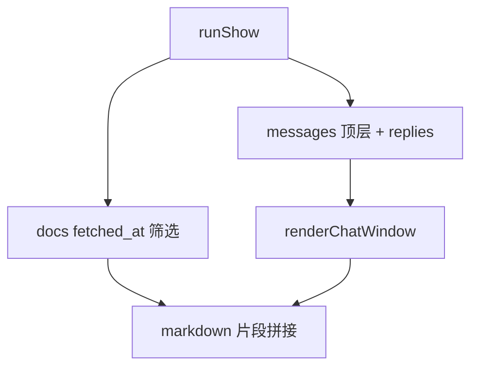

<details>
<summary>相关源文件</summary>

生成本页时使用的主要源文件：

- [src/commands/ingestDoc.ts](../../../project-repos/lark-context/src/commands/ingestDoc.ts)
- [src/commands/show.ts](../../../project-repos/lark-context/src/commands/show.ts)
- [src/render.ts](../../../project-repos/lark-context/src/render.ts)

</details>

# 文档入库与展示

文档链路分三步：**从 URL/bare token 提取 doc_token** → **调用 `lark-cli docs +fetch`** → **把解析到的 markdown UPSERT 进 `docs`**；展示时 `show-doc` 只按 token/url 命中数据库行，不再触发飞书网络。聊天记录则由 `show` 聚合时间窗内的顶层消息，并在同一 `thread_id` 下拼接子回复，最后走 `renderChatWindow` 统一排版。

## ingest：URL 白名单与容错

`extractToken` 只允许飞书系 host（`feishu` / `larkoffice` 等关键字），并用正则锁定 `/docx|docs|wiki|file|base/` 路径段；非匹配路径直接抛错，避免把任意 HTTP 链接误送进 CLI。  
正文提取 `extractContent` 依次尝试 `content`/`markdown`/`text`/`body` 字段；若都不存在则退化为 fenced JSON，**保证至少有可追溯的原文快照**。

## show：时间窗与文档附录

`runShow` 把 `--since` 交给 `parseDuration`（仅支持 `m/h/d/w` 整数单位），计算 cutoff 后：
1. SQL 拉顶层消息；若 `thread_id` 存在，再查 `is_thread_reply=1` 的子表排序拼接。  
2. 追加 `fetched_at >= cutoff` 的 `docs` 列表，用 markdown 链接 + token 提示用户回到源 URL。



## render：话题缩进协议

`renderChatWindow` 对 `is_thread_reply` 前缀 `  ↳ `，并把多行内容逐行再缩进，形成视觉上“挂在父消息下”的线程树；时间格式压缩到 `YYYY-MM-DD HH:MM`，减少噪声。

Sources: [src/commands/ingestDoc.ts:10-103](../../../project-repos/lark-context/src/commands/ingestDoc.ts#L10-L103), [src/commands/show.ts:31-127](../../../project-repos/lark-context/src/commands/show.ts#L31-L127), [src/render.ts:16-40](../../../project-repos/lark-context/src/render.ts#L16-L40)

<details class="source-snippets">
<summary>引用源码</summary>

<!-- source-snippets:start -->

#### `src/commands/ingestDoc.ts:10-103`

````typescript
const PATH_RE = /^\/(docx|docs|wiki|file|base)\/([A-Za-z0-9_-]+)$/;

const LARK_HOST_TOKENS = ["feishu", "larkoffice", "larksuite", "lark.com"];

function isLarkHost(hostname: string): boolean {
  return LARK_HOST_TOKENS.some((t) => hostname.includes(t));
}

export function extractToken(ref: string): string {
  if (!ref.startsWith("http")) {
    if (!ref || ref.includes("/") || ref.includes(" ")) {
      throw new Error(`not a URL or bare token: ${JSON.stringify(ref)}`);
    }
    return ref;
  }
  let url: URL;
  try {
    url = new URL(ref);
  } catch {
    throw new Error(`not a valid URL: ${JSON.stringify(ref)}`);
  }
  if (!url.hostname || !isLarkHost(url.hostname)) {
    throw new Error(`not a Lark/Feishu URL: ${JSON.stringify(ref)}`);
  }
  const m = PATH_RE.exec(url.pathname);
  if (!m) {
    throw new Error(`unrecognised Lark/Feishu doc path: ${JSON.stringify(url.pathname)}`);
  }
  return m[2];
}

function extractContent(data: Record<string, unknown>): { title: string; body: string } {
  const rawTitle = data.title ?? data.name ?? "";
  const title = typeof rawTitle === "string" ? rawTitle : "";
  for (const key of ["content", "markdown", "text", "body"] as const) {
    const v = data[key];
    if (typeof v === "string" && v.trim().length > 0) {
      return { title, body: v };
    }
  }
  return { title, body: "```json\n" + JSON.stringify(data, null, 2) + "\n```" };
}

export interface IngestDocOpts extends LoadConfigOptions {
  ref: string;
  /** Test-only: use a fixed timestamp. */
  _now?: () => Date;
}

export async function runIngestDoc(opts: IngestDocOpts): Promise<void> {
  const cfg = loadConfig(opts);
  const dbPath = join(cfg.rawDir, "raw.db");
  ensureInitialized(dbPath);
  const token = extractToken(opts.ref);

  const response = (await runJson(["docs", "+fetch", "--doc", opts.ref])) as
    | Record<string, unknown>
    | null;
  if (!response || typeof response !== "object") {
    throw new Error(`unexpected lark response: ${JSON.stringify(response)}`);
  }
  if (response.ok === false) {
    const err = response.error;
    const msg =
      err && typeof err === "object" && err !== null && "message" in err
        ? String((err as { message: unknown }).message)
        : String(err ?? response);
    throw new Error(`docs +fetch failed: ${msg}`);
  }
  let data = response.data;
  if (!data || typeof data !== "object") {
    data = { content: String(data ?? "") };
  }
  const { title, body } = extractContent(data as Record<string, unknown>);

  const header = title ? `# ${title}\n\n` : "";
  let md = header + body;
  if (!md.endsWith("\n")) md += "\n";

  const now = (opts._now ?? (() => new Date()))();
  const urlForDb = opts.ref.startsWith("http") ? opts.ref : "";
  const db = connect(dbPath);
  try {
    db.prepare(
      "INSERT INTO docs(doc_token, url, title, content_md, fetched_at, source) " +
        "VALUES(?, ?, ?, ?, ?, 'manual') " +
        "ON CONFLICT(doc_token) DO UPDATE SET " +
        "url=excluded.url, title=excluded.title, content_md=excluded.content_md, fetched_at=excluded.fetched_at",
    ).run(token, urlForDb, title, md, now.toISOString());
  } finally {
    db.close();
  }
  process.stdout.write(`ingested ${token} (${title || "(no title)"})\n`);
}
````

#### `src/commands/show.ts:31-127`

```typescript
export async function runShow(opts: ShowOpts): Promise<void> {
  const cfg = loadConfig(opts);
  const dbPath = join(cfg.rawDir, "raw.db");
  ensureInitialized(dbPath);
  const delta = parseDuration(opts.since ?? "24h");
  const now = (opts._now ?? (() => new Date()))();
  const cutoff = new Date(now.getTime() - delta.totalMs).toISOString();
  const effectiveAlias =
    opts.chatAlias === "all" || !opts.chatAlias ? null : opts.chatAlias;
  const targets = cfg.groups.filter(
    (g) => g.enabled && (!effectiveAlias || g.alias === effectiveAlias),
  );
  if (effectiveAlias && targets.length === 0) {
    throw new Error(`unknown chat alias "${opts.chatAlias}"`);
  }
  if (targets.length === 0) {
    throw new Error("no whitelisted chats");
  }

  const pieces: string[] = [];
  const db = connect(dbPath);
  try {
    const topStmt = db.prepare(
      "SELECT id, sender_name, content_text, create_time, thread_id " +
        "FROM messages WHERE chat_alias=? AND is_thread_reply=0 AND create_time >= ? " +
        "ORDER BY create_time",
    );
    const replyStmt = db.prepare(
      "SELECT sender_name, content_text, create_time " +
        "FROM messages WHERE chat_alias=? AND thread_id=? AND is_thread_reply=1 " +
        "ORDER BY create_time",
    );

    for (const g of targets) {
      const tops = topStmt.all(g.alias, cutoff) as Array<{
        id: string;
        sender_name: string;
        content_text: string;
        create_time: string;
        thread_id: string | null;
      }>;
      const messages: Array<{
        sender_name: string;
        content_text: string;
        create_time: string;
        is_thread_reply?: boolean;
      }> = [];
      for (const top of tops) {
        messages.push({
          sender_name: top.sender_name,
          content_text: top.content_text,
          create_time: top.create_time,
          is_thread_reply: false,
        });
        if (top.thread_id) {
          const replies = replyStmt.all(g.alias, top.thread_id) as Array<{
            sender_name: string;
            content_text: string;
            create_time: string;
          }>;
          for (const r of replies) {
            messages.push({
              sender_name: r.sender_name,
              content_text: r.content_text,
              create_time: r.create_time,
              is_thread_reply: true,
            });
          }
        }
      }
      pieces.push(
        renderChatWindow({
          chatName: g.name || g.alias,
          windowStart: cutoff.slice(0, 10),
          windowEnd: now.toISOString().slice(0, 10),
          messages,
        }),
      );
    }
    const docs = db
      .prepare(
        "SELECT doc_token, title, url FROM docs WHERE fetched_at >= ? ORDER BY fetched_at DESC",
      )
      .all(cutoff) as Array<{ doc_token: string; title: string; url: string }>;
    if (docs.length > 0) {
      pieces.push("### 近期入库的文档\n");
      for (const d of docs) {
        pieces.push(`- [${d.title || d.doc_token}](${d.url})  (token=\`${d.doc_token}\`)`);
      }
      pieces.push("");
    }
  } finally {
    db.close();
  }
  const write = opts.write ?? ((s: string) => process.stdout.write(s));
  write(pieces.join("\n") + "\n");
}
```

#### `src/render.ts:16-40`

```typescript
export function renderChatWindow(args: {
  chatName: string;
  windowStart: string;
  windowEnd: string;
  messages: Message[];
}): string {
  const lines: string[] = [
    `## ${args.chatName}  (${args.windowStart} ~ ${args.windowEnd})`,
    "",
  ];
  if (args.messages.length === 0) {
    lines.push("(no messages)");
    return lines.join("\n") + "\n";
  }
  for (const m of args.messages) {
    const prefix = m.is_thread_reply ? "  ↳ " : "";
    lines.push(
      `${prefix}**${m.sender_name ?? "?"}** ${fmtTime(m.create_time ?? "")}`,
    );
    const text = m.content_text ?? "";
    const textLines = text.length === 0 ? [""] : text.split("\n");
    for (const tl of textLines) lines.push(`${prefix}  ${tl}`);
    lines.push("");
  }
  return lines.join("\n").replace(/\s+$/, "") + "\n";
```

<!-- source-snippets:end -->
</details>
## 相关页面

- [SQLite 数据模型](sqlite-data-model.md) — `docs` / `messages` 字段  
- [CLI 命令参考](cli-commands.md) — 命令入口  
- [Claude Skill 与工作流](skill-workflows.md) — ingest-doc workflow 文本约束  
