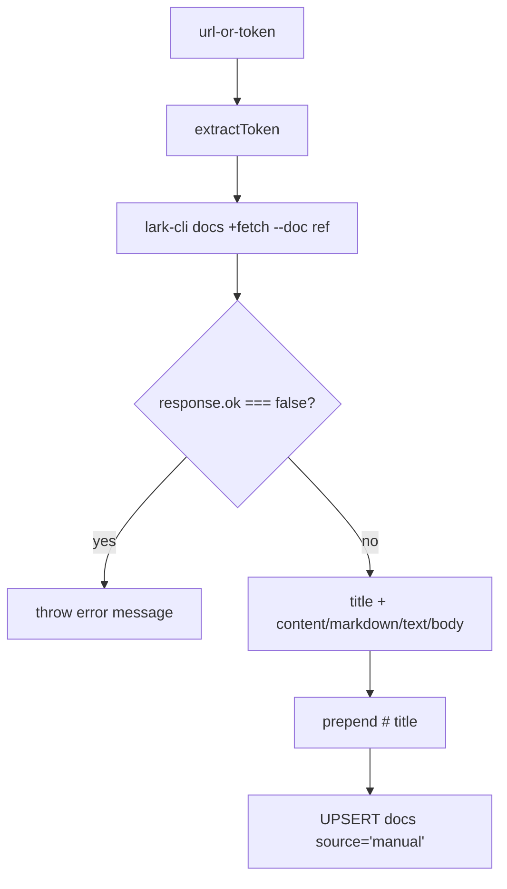
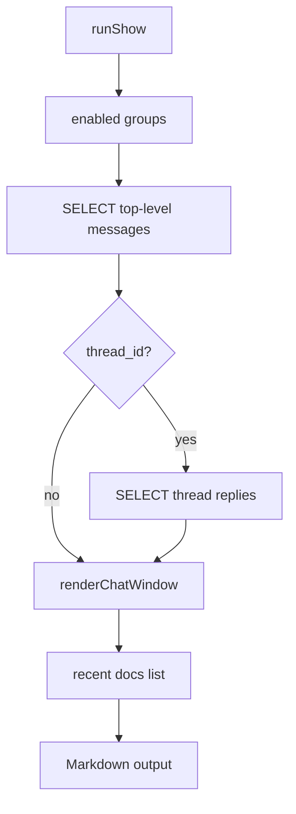

<details>
<summary>相关源文件</summary>

生成本页时使用的主要源文件：

- [src/commands/ingestDoc.ts](../../../project-repos/lark-context/src/commands/ingestDoc.ts)
- [src/commands/show.ts](../../../project-repos/lark-context/src/commands/show.ts)
- [src/render.ts](../../../project-repos/lark-context/src/render.ts)
- [src/durations.ts](../../../project-repos/lark-context/src/durations.ts)
- [README.md](../../../project-repos/lark-context/README.md)
- [skills/lark-context/references/ingest-doc.md](../../../project-repos/lark-context/skills/lark-context/references/ingest-doc.md)
- [skills/lark-context/references/show.md](../../../project-repos/lark-context/skills/lark-context/references/show.md)
- [test/cmd-ingest-doc.test.ts](../../../project-repos/lark-context/test/cmd-ingest-doc.test.ts)
- [test/cmd-show.test.ts](../../../project-repos/lark-context/test/cmd-show.test.ts)

</details>

# 文档入库与 Markdown 输出

`ingest-doc` 把飞书文档拉到本地 `docs` 表；`show` 与 `show-doc` 再把本地消息和文档渲染给 Claude 或用户。这个链路不主动拉新消息，读到的是 SQLite 里已有数据。Sources: [src/commands/ingestDoc.ts:59-103](../../../project-repos/lark-context/src/commands/ingestDoc.ts#L59-L103), [src/commands/show.ts:31-154](../../../project-repos/lark-context/src/commands/show.ts#L31-L154), [skills/lark-context/references/show.md:8-9](../../../project-repos/lark-context/skills/lark-context/references/show.md#L8-L9)

<details class="source-snippets">
<summary>引用源码</summary>

<!-- source-snippets:start -->

#### `src/commands/ingestDoc.ts:59-103`

```typescript
export async function runIngestDoc(opts: IngestDocOpts): Promise<void> {
  const cfg = loadConfig(opts);
  const dbPath = join(cfg.rawDir, "raw.db");
  ensureInitialized(dbPath);
  const token = extractToken(opts.ref);

  const response = (await runJson(["docs", "+fetch", "--doc", opts.ref])) as
    | Record<string, unknown>
    | null;
  if (!response || typeof response !== "object") {
    throw new Error(`unexpected lark response: ${JSON.stringify(response)}`);
  }
  if (response.ok === false) {
    const err = response.error;
    const msg =
      err && typeof err === "object" && err !== null && "message" in err
        ? String((err as { message: unknown }).message)
        : String(err ?? response);
    throw new Error(`docs +fetch failed: ${msg}`);
  }
  let data = response.data;
  if (!data || typeof data !== "object") {
    data = { content: String(data ?? "") };
  }
  const { title, body } = extractContent(data as Record<string, unknown>);

  const header = title ? `# ${title}\n\n` : "";
  let md = header + body;
  if (!md.endsWith("\n")) md += "\n";

  const now = (opts._now ?? (() => new Date()))();
  const urlForDb = opts.ref.startsWith("http") ? opts.ref : "";
  const db = connect(dbPath);
  try {
    db.prepare(
      "INSERT INTO docs(doc_token, url, title, content_md, fetched_at, source) " +
        "VALUES(?, ?, ?, ?, ?, 'manual') " +
        "ON CONFLICT(doc_token) DO UPDATE SET " +
        "url=excluded.url, title=excluded.title, content_md=excluded.content_md, fetched_at=excluded.fetched_at",
    ).run(token, urlForDb, title, md, now.toISOString());
  } finally {
    db.close();
  }
  process.stdout.write(`ingested ${token} (${title || "(no title)"})\n`);
}
```

#### `src/commands/show.ts:31-154`

```typescript
export async function runShow(opts: ShowOpts): Promise<void> {
  const cfg = loadConfig(opts);
  const dbPath = join(cfg.rawDir, "raw.db");
  ensureInitialized(dbPath);
  const delta = parseDuration(opts.since ?? "24h");
  const now = (opts._now ?? (() => new Date()))();
  const cutoff = new Date(now.getTime() - delta.totalMs).toISOString();
  const effectiveAlias =
    opts.chatAlias === "all" || !opts.chatAlias ? null : opts.chatAlias;
  const targets = cfg.groups.filter(
    (g) => g.enabled && (!effectiveAlias || g.alias === effectiveAlias),
  );
  if (effectiveAlias && targets.length === 0) {
    throw new Error(`unknown chat alias "${opts.chatAlias}"`);
  }
  if (targets.length === 0) {
    throw new Error("no whitelisted chats");
  }

  const pieces: string[] = [];
  const db = connect(dbPath);
  try {
    const topStmt = db.prepare(
      "SELECT id, sender_name, content_text, create_time, thread_id " +
        "FROM messages WHERE chat_alias=? AND is_thread_reply=0 AND create_time >= ? " +
        "ORDER BY create_time",
    );
    const replyStmt = db.prepare(
      "SELECT sender_name, content_text, create_time " +
        "FROM messages WHERE chat_alias=? AND thread_id=? AND is_thread_reply=1 " +
        "ORDER BY create_time",
    );

    for (const g of targets) {
      const tops = topStmt.all(g.alias, cutoff) as Array<{
        id: string;
        sender_name: string;
        content_text: string;
        create_time: string;
        thread_id: string | null;
      }>;
      const messages: Array<{
        sender_name: string;
        content_text: string;
        create_time: string;
        is_thread_reply?: boolean;
      }> = [];
      for (const top of tops) {
        messages.push({
          sender_name: top.sender_name,
          content_text: top.content_text,
          create_time: top.create_time,
          is_thread_reply: false,
        });
        if (top.thread_id) {
          const replies = replyStmt.all(g.alias, top.thread_id) as Array<{
            sender_name: string;
            content_text: string;
            create_time: string;
          }>;
          for (const r of replies) {
            messages.push({
              sender_name: r.sender_name,
              content_text: r.content_text,
              create_time: r.create_time,
              is_thread_reply: true,
            });
          }
        }
      }
      pieces.push(
        renderChatWindow({
          chatName: g.name || g.alias,
          windowStart: cutoff.slice(0, 10),
          windowEnd: now.toISOString().slice(0, 10),
          messages,
        }),
      );
    }
    const docs = db
      .prepare(
        "SELECT doc_token, title, url FROM docs WHERE fetched_at >= ? ORDER BY fetched_at DESC",
      )
      .all(cutoff) as Array<{ doc_token: string; title: string; url: string }>;
    if (docs.length > 0) {
      pieces.push("### 近期入库的文档\n");
      for (const d of docs) {
        pieces.push(`- [${d.title || d.doc_token}](${d.url})  (token=\`${d.doc_token}\`)`);
      }
      pieces.push("");
    }
  } finally {
    db.close();
  }
  const write = opts.write ?? ((s: string) => process.stdout.write(s));
  write(pieces.join("\n") + "\n");
}

export interface ShowDocOpts extends LoadConfigOptions {
  ref: string;
  write?: (s: string) => void;
}

export async function runShowDoc(opts: ShowDocOpts): Promise<void> {
  const cfg = loadConfig(opts);
  const dbPath = join(cfg.rawDir, "raw.db");
  ensureInitialized(dbPath);
  const token = tokenFromRef(opts.ref);
  const db = connect(dbPath);
  let content_md: string | undefined;
  try {
    const row = db
      .prepare("SELECT content_md FROM docs WHERE doc_token=? OR url=?")
      .get(token, opts.ref) as { content_md: string } | undefined;
    content_md = row?.content_md;
  } finally {
    db.close();
  }
  if (!content_md) {
    throw new Error(`no ingested doc matches "${opts.ref}"`);
... snippet truncated ...
```

#### `skills/lark-context/references/show.md:8-9`

```markdown
**目标**：从本地 SQLite 读出最近消息 / 文档，渲染给 Claude 或用户看。**不调 lark-cli，不拉新数据**——需要先跑 `pull` 才能保证数据新。

```

<!-- source-snippets:end -->
</details>
## 文档 token 解析

`extractToken` 支持 bare token，也支持 host 包含 `feishu`、`larkoffice`、`larksuite`、`lark.com` 的 URL；路径必须是 `/docx/`、`/docs/`、`/wiki/`、`/file/`、`/base/` 加 token。非飞书 host、坏 URL 或带 slash 的非 URL 字符串会报错。Sources: [src/commands/ingestDoc.ts:10-39](../../../project-repos/lark-context/src/commands/ingestDoc.ts#L10-L39)

<details class="source-snippets">
<summary>引用源码</summary>

<!-- source-snippets:start -->

#### `src/commands/ingestDoc.ts:10-39`

```typescript
const PATH_RE = /^\/(docx|docs|wiki|file|base)\/([A-Za-z0-9_-]+)$/;

const LARK_HOST_TOKENS = ["feishu", "larkoffice", "larksuite", "lark.com"];

function isLarkHost(hostname: string): boolean {
  return LARK_HOST_TOKENS.some((t) => hostname.includes(t));
}

export function extractToken(ref: string): string {
  if (!ref.startsWith("http")) {
    if (!ref || ref.includes("/") || ref.includes(" ")) {
      throw new Error(`not a URL or bare token: ${JSON.stringify(ref)}`);
    }
    return ref;
  }
  let url: URL;
  try {
    url = new URL(ref);
  } catch {
    throw new Error(`not a valid URL: ${JSON.stringify(ref)}`);
  }
  if (!url.hostname || !isLarkHost(url.hostname)) {
    throw new Error(`not a Lark/Feishu URL: ${JSON.stringify(ref)}`);
  }
  const m = PATH_RE.exec(url.pathname);
  if (!m) {
    throw new Error(`unrecognised Lark/Feishu doc path: ${JSON.stringify(url.pathname)}`);
  }
  return m[2];
}
```

<!-- source-snippets:end -->
</details>
测试覆盖了 `/docx/`、`/docs/`、`/wiki/`、不同 larkoffice/larksuite host、bare token，以及非 Lark URL 和 `foo/bar` 拒绝。Sources: [test/cmd-ingest-doc.test.ts:65-97](../../../project-repos/lark-context/test/cmd-ingest-doc.test.ts#L65-L97)

<details class="source-snippets">
<summary>引用源码</summary>

<!-- source-snippets:start -->

#### `test/cmd-ingest-doc.test.ts:65-97`

```typescript
describe("extractToken", () => {
  it("extracts from /docx/ URL", () => {
    expect(extractToken("https://t.feishu.cn/docx/XxxTokenXxx")).toBe("XxxTokenXxx");
  });
  it("extracts from /docs/ URL (with query string)", () => {
    expect(extractToken("https://t.feishu.cn/docs/abc123?from=copy")).toBe("abc123");
  });
  it("extracts from /wiki/ URL", () => {
    expect(extractToken("https://t.feishu.cn/wiki/wk_123")).toBe("wk_123");
  });
  it("accepts bytedance.larkoffice.com hosts", () => {
    expect(
      extractToken("https://bytedance.larkoffice.com/wiki/wikcn0SkJUoi7izEmSblqt67RNh"),
    ).toBe("wikcn0SkJUoi7izEmSblqt67RNh");
  });
  it("accepts sg.larkoffice.com hosts", () => {
    expect(
      extractToken("https://bytedance.sg.larkoffice.com/docx/ICHsdXR1nog0qCxCy9ml9au2gRc"),
    ).toBe("ICHsdXR1nog0qCxCy9ml9au2gRc");
  });
  it("accepts larksuite.com hosts", () => {
    expect(extractToken("https://example.larksuite.com/docx/tok1")).toBe("tok1");
  });
  it("accepts bare token", () => {
    expect(extractToken("docxxxxxxxxxxxxxxx")).toBe("docxxxxxxxxxxxxxxx");
  });
  it("rejects non-Lark URL", () => {
    expect(() => extractToken("https://example.com/foo")).toThrow();
  });
  it("rejects strings with slashes that aren't URLs", () => {
    expect(() => extractToken("foo/bar")).toThrow();
  });
});
```

<!-- source-snippets:end -->
</details>
## 入库流程



Sources: [src/commands/ingestDoc.ts:59-103](../../../project-repos/lark-context/src/commands/ingestDoc.ts#L59-L103)

<details class="source-snippets">
<summary>引用源码</summary>

<!-- source-snippets:start -->

#### `src/commands/ingestDoc.ts:59-103`

```typescript
export async function runIngestDoc(opts: IngestDocOpts): Promise<void> {
  const cfg = loadConfig(opts);
  const dbPath = join(cfg.rawDir, "raw.db");
  ensureInitialized(dbPath);
  const token = extractToken(opts.ref);

  const response = (await runJson(["docs", "+fetch", "--doc", opts.ref])) as
    | Record<string, unknown>
    | null;
  if (!response || typeof response !== "object") {
    throw new Error(`unexpected lark response: ${JSON.stringify(response)}`);
  }
  if (response.ok === false) {
    const err = response.error;
    const msg =
      err && typeof err === "object" && err !== null && "message" in err
        ? String((err as { message: unknown }).message)
        : String(err ?? response);
    throw new Error(`docs +fetch failed: ${msg}`);
  }
  let data = response.data;
  if (!data || typeof data !== "object") {
    data = { content: String(data ?? "") };
  }
  const { title, body } = extractContent(data as Record<string, unknown>);

  const header = title ? `# ${title}\n\n` : "";
  let md = header + body;
  if (!md.endsWith("\n")) md += "\n";

  const now = (opts._now ?? (() => new Date()))();
  const urlForDb = opts.ref.startsWith("http") ? opts.ref : "";
  const db = connect(dbPath);
  try {
    db.prepare(
      "INSERT INTO docs(doc_token, url, title, content_md, fetched_at, source) " +
        "VALUES(?, ?, ?, ?, ?, 'manual') " +
        "ON CONFLICT(doc_token) DO UPDATE SET " +
        "url=excluded.url, title=excluded.title, content_md=excluded.content_md, fetched_at=excluded.fetched_at",
    ).run(token, urlForDb, title, md, now.toISOString());
  } finally {
    db.close();
  }
  process.stdout.write(`ingested ${token} (${title || "(no title)"})\n`);
}
```

<!-- source-snippets:end -->
</details>
如果 `data` 没有 `content`、`markdown`、`text`、`body` 任一字符串字段，代码会把整个 data 作为 JSON code block 保存，确保仍有可展示内容。Sources: [src/commands/ingestDoc.ts:41-51](../../../project-repos/lark-context/src/commands/ingestDoc.ts#L41-L51)

<details class="source-snippets">
<summary>引用源码</summary>

<!-- source-snippets:start -->

#### `src/commands/ingestDoc.ts:41-51`

````typescript
function extractContent(data: Record<string, unknown>): { title: string; body: string } {
  const rawTitle = data.title ?? data.name ?? "";
  const title = typeof rawTitle === "string" ? rawTitle : "";
  for (const key of ["content", "markdown", "text", "body"] as const) {
    const v = data[key];
    if (typeof v === "string" && v.trim().length > 0) {
      return { title, body: v };
    }
  }
  return { title, body: "```json\n" + JSON.stringify(data, null, 2) + "\n```" };
}
````

<!-- source-snippets:end -->
</details>
`docs` 表用 `doc_token` 做主键，重复 ingest 同一 token 会更新 url、title、content_md、fetched_at，不产生重复行。Sources: [src/commands/ingestDoc.ts:89-98](../../../project-repos/lark-context/src/commands/ingestDoc.ts#L89-L98), [test/cmd-ingest-doc.test.ts:100-136](../../../project-repos/lark-context/test/cmd-ingest-doc.test.ts#L100-L136)

<details class="source-snippets">
<summary>引用源码</summary>

<!-- source-snippets:start -->

#### `src/commands/ingestDoc.ts:89-98`

```typescript
  const now = (opts._now ?? (() => new Date()))();
  const urlForDb = opts.ref.startsWith("http") ? opts.ref : "";
  const db = connect(dbPath);
  try {
    db.prepare(
      "INSERT INTO docs(doc_token, url, title, content_md, fetched_at, source) " +
        "VALUES(?, ?, ?, ?, ?, 'manual') " +
        "ON CONFLICT(doc_token) DO UPDATE SET " +
        "url=excluded.url, title=excluded.title, content_md=excluded.content_md, fetched_at=excluded.fetched_at",
    ).run(token, urlForDb, title, md, now.toISOString());
```

#### `test/cmd-ingest-doc.test.ts:100-136`

```typescript
  it("persists title + markdown body + source='manual'", async () => {
    await freshInit();
    mockRunJson.mockResolvedValueOnce(FIXTURE);
    await runIngestDoc({ ref: "https://bytedance.feishu.cn/docx/XxxToken" });

    const cfg = loadConfig();
    const db = connect(join(cfg.rawDir, "raw.db"));
    try {
      const row = db
        .prepare("SELECT doc_token, title, content_md, source FROM docs")
        .get() as { doc_token: string; title: string; content_md: string; source: string };
      expect(row.doc_token).toBe("XxxToken");
      expect(row.title).toBe("项目 Alpha 架构评审 v3");
      expect(row.content_md).toContain("# 项目 Alpha 架构评审 v3");
      expect(row.content_md).toContain("## 里程碑");
      expect(row.content_md).toContain("- 周一：评审");
      expect(row.source).toBe("manual");
    } finally {
      db.close();
    }
  });

  it("second run upserts — no duplicate rows", async () => {
    await freshInit();
    mockRunJson.mockResolvedValue(FIXTURE);
    const url = "https://bytedance.feishu.cn/docx/XxxToken";
    await runIngestDoc({ ref: url });
    await runIngestDoc({ ref: url });
    const cfg = loadConfig();
    const db = connect(join(cfg.rawDir, "raw.db"));
    try {
      const count = (db.prepare("SELECT COUNT(*) AS c FROM docs").get() as any).c;
      expect(count).toBe(1);
    } finally {
      db.close();
    }
  });
```

<!-- source-snippets:end -->
</details>
## show 命令

`runShow` 默认窗口是 `24h`，通过 `parseDuration` 解析；`--chat all` 和省略 `--chat` 都表示所有 enabled 群。未知 alias 会报错，完全没有关注群也会报错。Sources: [src/commands/show.ts:31-48](../../../project-repos/lark-context/src/commands/show.ts#L31-L48), [src/durations.ts:1-29](../../../project-repos/lark-context/src/durations.ts#L1-L29)

<details class="source-snippets">
<summary>引用源码</summary>

<!-- source-snippets:start -->

#### `src/commands/show.ts:31-48`

```typescript
export async function runShow(opts: ShowOpts): Promise<void> {
  const cfg = loadConfig(opts);
  const dbPath = join(cfg.rawDir, "raw.db");
  ensureInitialized(dbPath);
  const delta = parseDuration(opts.since ?? "24h");
  const now = (opts._now ?? (() => new Date()))();
  const cutoff = new Date(now.getTime() - delta.totalMs).toISOString();
  const effectiveAlias =
    opts.chatAlias === "all" || !opts.chatAlias ? null : opts.chatAlias;
  const targets = cfg.groups.filter(
    (g) => g.enabled && (!effectiveAlias || g.alias === effectiveAlias),
  );
  if (effectiveAlias && targets.length === 0) {
    throw new Error(`unknown chat alias "${opts.chatAlias}"`);
  }
  if (targets.length === 0) {
    throw new Error("no whitelisted chats");
  }
```

#### `src/durations.ts:1-29`

```typescript
const UNITS: Record<string, number> = {
  m: 60 * 1000,
  h: 60 * 60 * 1000,
  d: 24 * 60 * 60 * 1000,
  w: 7 * 24 * 60 * 60 * 1000,
};

const PATTERN = /^(\d+)([mhdw])$/;

export interface Duration {
  totalMs: number;
}

export function parseDuration(text: unknown): Duration {
  if (typeof text !== "string") {
    throw new Error(`duration must be a string, got ${typeof text}`);
  }
  const m = PATTERN.exec(text.trim());
  if (!m) {
    throw new Error(
      `invalid duration ${JSON.stringify(text)}; expected <int><unit> where unit in m/h/d/w`
    );
  }
  const n = Number.parseInt(m[1], 10);
  if (n <= 0) {
    throw new Error(`duration must be positive, got ${JSON.stringify(text)}`);
  }
  return { totalMs: n * UNITS[m[2]] };
}
```

<!-- source-snippets:end -->
</details>
它先查顶层消息，再按顶层消息的 `thread_id` 查回复，把回复插回所属 root 后面，最后交给 `renderChatWindow`。这保证即使回复时间晚于下一条顶层消息，展示仍按话题归组。Sources: [src/commands/show.ts:50-109](../../../project-repos/lark-context/src/commands/show.ts#L50-L109), [test/cmd-show.test.ts:239-335](../../../project-repos/lark-context/test/cmd-show.test.ts#L239-L335)

<details class="source-snippets">
<summary>引用源码</summary>

<!-- source-snippets:start -->

#### `src/commands/show.ts:50-109`

```typescript
  const pieces: string[] = [];
  const db = connect(dbPath);
  try {
    const topStmt = db.prepare(
      "SELECT id, sender_name, content_text, create_time, thread_id " +
        "FROM messages WHERE chat_alias=? AND is_thread_reply=0 AND create_time >= ? " +
        "ORDER BY create_time",
    );
    const replyStmt = db.prepare(
      "SELECT sender_name, content_text, create_time " +
        "FROM messages WHERE chat_alias=? AND thread_id=? AND is_thread_reply=1 " +
        "ORDER BY create_time",
    );

    for (const g of targets) {
      const tops = topStmt.all(g.alias, cutoff) as Array<{
        id: string;
        sender_name: string;
        content_text: string;
        create_time: string;
        thread_id: string | null;
      }>;
      const messages: Array<{
        sender_name: string;
        content_text: string;
        create_time: string;
        is_thread_reply?: boolean;
      }> = [];
      for (const top of tops) {
        messages.push({
          sender_name: top.sender_name,
          content_text: top.content_text,
          create_time: top.create_time,
          is_thread_reply: false,
        });
        if (top.thread_id) {
          const replies = replyStmt.all(g.alias, top.thread_id) as Array<{
            sender_name: string;
            content_text: string;
            create_time: string;
          }>;
          for (const r of replies) {
            messages.push({
              sender_name: r.sender_name,
              content_text: r.content_text,
              create_time: r.create_time,
              is_thread_reply: true,
            });
          }
        }
      }
      pieces.push(
        renderChatWindow({
          chatName: g.name || g.alias,
          windowStart: cutoff.slice(0, 10),
          windowEnd: now.toISOString().slice(0, 10),
          messages,
        }),
      );
    }
```

#### `test/cmd-show.test.ts:239-335`

```typescript
  it("groups thread replies under their top-level message with ↳ prefix", async () => {
    await setup();
    const cfg = loadConfig();
    const dbPath = join(cfg.rawDir, "raw.db");
    const now = new Date();
    const t = (minsAgo: number) =>
      new Date(now.getTime() - minsAgo * 60_000).toISOString();

    insertTopLevel(dbPath, {
      id: "top1",
      chat_alias: "alpha",
      sender_name: "唐文城",
      content_text: "低版本app怎么兜底？",
      create_time: t(30),
      thread_id: "omt_1",
    });
    insertThreadReply(dbPath, {
      id: "rep1",
      chat_alias: "alpha",
      thread_id: "omt_1",
      sender_name: "韦振宁",
      content_text: "老板本不适配",
      create_time: t(20),
    });
    insertTopLevel(dbPath, {
      id: "top2",
      chat_alias: "alpha",
      sender_name: "李四",
      content_text: "下一条顶层",
      create_time: t(10),
    });

    const out: string[] = [];
    await runShow({
      chatAlias: "alpha",
      since: "1d",
      write: (s) => out.push(s),
      _now: () => now,
    });
    const joined = out.join("");

    const iRoot = joined.indexOf("低版本app怎么兜底？");
    const iReply = joined.indexOf("老板本不适配");
    const iNext = joined.indexOf("下一条顶层");
    expect(iRoot).toBeGreaterThan(-1);
    expect(iReply).toBeGreaterThan(iRoot);
    expect(iNext).toBeGreaterThan(iReply);
    expect(joined).toContain("  ↳ **韦振宁**");
  });

  it("keeps thread reply grouped even when its create_time is later than next top-level", async () => {
    await setup();
    const cfg = loadConfig();
    const dbPath = join(cfg.rawDir, "raw.db");
    const now = new Date();
    const t = (minsAgo: number) =>
      new Date(now.getTime() - minsAgo * 60_000).toISOString();

    insertTopLevel(dbPath, {
      id: "top1",
      chat_alias: "alpha",
      sender_name: "唐",
      content_text: "问题",
      create_time: t(60),
      thread_id: "omt_1",
    });
    insertTopLevel(dbPath, {
      id: "top2",
      chat_alias: "alpha",
      sender_name: "李",
      content_text: "中间的顶层",
      create_time: t(40),
    });
    insertThreadReply(dbPath, {
      id: "rep_late",
      chat_alias: "alpha",
      thread_id: "omt_1",
      sender_name: "韦",
      content_text: "迟到的回复",
      create_time: t(10),
    });

    const out: string[] = [];
    await runShow({
      chatAlias: "alpha",
      since: "1d",
      write: (s) => out.push(s),
      _now: () => now,
    });
    const joined = out.join("");

    const iTop1 = joined.indexOf("问题");
    const iReply = joined.indexOf("迟到的回复");
    const iTop2 = joined.indexOf("中间的顶层");
    expect(iTop1).toBeLessThan(iReply);
    expect(iReply).toBeLessThan(iTop2);
  });
```

<!-- source-snippets:end -->
</details>


Sources: [src/commands/show.ts:31-127](../../../project-repos/lark-context/src/commands/show.ts#L31-L127), [src/render.ts:16-40](../../../project-repos/lark-context/src/render.ts#L16-L40)

<details class="source-snippets">
<summary>引用源码</summary>

<!-- source-snippets:start -->

#### `src/commands/show.ts:31-127`

```typescript
export async function runShow(opts: ShowOpts): Promise<void> {
  const cfg = loadConfig(opts);
  const dbPath = join(cfg.rawDir, "raw.db");
  ensureInitialized(dbPath);
  const delta = parseDuration(opts.since ?? "24h");
  const now = (opts._now ?? (() => new Date()))();
  const cutoff = new Date(now.getTime() - delta.totalMs).toISOString();
  const effectiveAlias =
    opts.chatAlias === "all" || !opts.chatAlias ? null : opts.chatAlias;
  const targets = cfg.groups.filter(
    (g) => g.enabled && (!effectiveAlias || g.alias === effectiveAlias),
  );
  if (effectiveAlias && targets.length === 0) {
    throw new Error(`unknown chat alias "${opts.chatAlias}"`);
  }
  if (targets.length === 0) {
    throw new Error("no whitelisted chats");
  }

  const pieces: string[] = [];
  const db = connect(dbPath);
  try {
    const topStmt = db.prepare(
      "SELECT id, sender_name, content_text, create_time, thread_id " +
        "FROM messages WHERE chat_alias=? AND is_thread_reply=0 AND create_time >= ? " +
        "ORDER BY create_time",
    );
    const replyStmt = db.prepare(
      "SELECT sender_name, content_text, create_time " +
        "FROM messages WHERE chat_alias=? AND thread_id=? AND is_thread_reply=1 " +
        "ORDER BY create_time",
    );

    for (const g of targets) {
      const tops = topStmt.all(g.alias, cutoff) as Array<{
        id: string;
        sender_name: string;
        content_text: string;
        create_time: string;
        thread_id: string | null;
      }>;
      const messages: Array<{
        sender_name: string;
        content_text: string;
        create_time: string;
        is_thread_reply?: boolean;
      }> = [];
      for (const top of tops) {
        messages.push({
          sender_name: top.sender_name,
          content_text: top.content_text,
          create_time: top.create_time,
          is_thread_reply: false,
        });
        if (top.thread_id) {
          const replies = replyStmt.all(g.alias, top.thread_id) as Array<{
            sender_name: string;
            content_text: string;
            create_time: string;
          }>;
          for (const r of replies) {
            messages.push({
              sender_name: r.sender_name,
              content_text: r.content_text,
              create_time: r.create_time,
              is_thread_reply: true,
            });
          }
        }
      }
      pieces.push(
        renderChatWindow({
          chatName: g.name || g.alias,
          windowStart: cutoff.slice(0, 10),
          windowEnd: now.toISOString().slice(0, 10),
          messages,
        }),
      );
    }
    const docs = db
      .prepare(
        "SELECT doc_token, title, url FROM docs WHERE fetched_at >= ? ORDER BY fetched_at DESC",
      )
      .all(cutoff) as Array<{ doc_token: string; title: string; url: string }>;
    if (docs.length > 0) {
      pieces.push("### 近期入库的文档\n");
      for (const d of docs) {
        pieces.push(`- [${d.title || d.doc_token}](${d.url})  (token=\`${d.doc_token}\`)`);
      }
      pieces.push("");
    }
  } finally {
    db.close();
  }
  const write = opts.write ?? ((s: string) => process.stdout.write(s));
  write(pieces.join("\n") + "\n");
}
```

#### `src/render.ts:16-40`

```typescript
export function renderChatWindow(args: {
  chatName: string;
  windowStart: string;
  windowEnd: string;
  messages: Message[];
}): string {
  const lines: string[] = [
    `## ${args.chatName}  (${args.windowStart} ~ ${args.windowEnd})`,
    "",
  ];
  if (args.messages.length === 0) {
    lines.push("(no messages)");
    return lines.join("\n") + "\n";
  }
  for (const m of args.messages) {
    const prefix = m.is_thread_reply ? "  ↳ " : "";
    lines.push(
      `${prefix}**${m.sender_name ?? "?"}** ${fmtTime(m.create_time ?? "")}`,
    );
    const text = m.content_text ?? "";
    const textLines = text.length === 0 ? [""] : text.split("\n");
    for (const tl of textLines) lines.push(`${prefix}  ${tl}`);
    lines.push("");
  }
  return lines.join("\n").replace(/\s+$/, "") + "\n";
```

<!-- source-snippets:end -->
</details>
## 渲染格式

`renderChatWindow` 输出二级标题、窗口范围、发送者和时间。`is_thread_reply` 为 true 的消息前缀是两个空格加 `↳`，正文每行也同样缩进；空窗口输出 `(no messages)`。Sources: [src/render.ts:16-40](../../../project-repos/lark-context/src/render.ts#L16-L40), [skills/lark-context/references/show.md:22-38](../../../project-repos/lark-context/skills/lark-context/references/show.md#L22-L38)

<details class="source-snippets">
<summary>引用源码</summary>

<!-- source-snippets:start -->

#### `src/render.ts:16-40`

```typescript
export function renderChatWindow(args: {
  chatName: string;
  windowStart: string;
  windowEnd: string;
  messages: Message[];
}): string {
  const lines: string[] = [
    `## ${args.chatName}  (${args.windowStart} ~ ${args.windowEnd})`,
    "",
  ];
  if (args.messages.length === 0) {
    lines.push("(no messages)");
    return lines.join("\n") + "\n";
  }
  for (const m of args.messages) {
    const prefix = m.is_thread_reply ? "  ↳ " : "";
    lines.push(
      `${prefix}**${m.sender_name ?? "?"}** ${fmtTime(m.create_time ?? "")}`,
    );
    const text = m.content_text ?? "";
    const textLines = text.length === 0 ? [""] : text.split("\n");
    for (const tl of textLines) lines.push(`${prefix}  ${tl}`);
    lines.push("");
  }
  return lines.join("\n").replace(/\s+$/, "") + "\n";
```

#### `skills/lark-context/references/show.md:22-38`

````markdown
### 输出格式（`renderChatWindow` 产）

```
## 群 A  (2026-04-18 ~ 2026-04-19)

**张三** 2026-04-18 10:00
  消息内容
  （多行对齐）

**李四** 2026-04-18 10:05
  回复
```

- 回复线程前缀 `  ↳ `
- 空窗口输出 `(no messages)`
- 末尾可能带 `### 近期入库的文档` 区块（列出窗口内被 ingest 的文档）

````

<!-- source-snippets:end -->
</details>
## show-doc 命令

`show-doc` 通过 token 或 URL 查找已入库文档。URL 会用路径第二段提 token；查询条件是 `doc_token=? OR url=?`。未找到时返回 `no ingested doc matches "<ref>"`，找到就原样输出保存的 Markdown。Sources: [src/commands/show.ts:11-22](../../../project-repos/lark-context/src/commands/show.ts#L11-L22), [src/commands/show.ts:129-154](../../../project-repos/lark-context/src/commands/show.ts#L129-L154), [test/cmd-show.test.ts:338-375](../../../project-repos/lark-context/test/cmd-show.test.ts#L338-L375)

<details class="source-snippets">
<summary>引用源码</summary>

<!-- source-snippets:start -->

#### `src/commands/show.ts:11-22`

```typescript
export function tokenFromRef(ref: string): string {
  if (ref.startsWith("http")) {
    try {
      const url = new URL(ref);
      const parts = url.pathname.split("/").filter(Boolean);
      if (parts.length >= 2) return parts[1];
    } catch {
      // fall through
    }
  }
  return ref;
}
```

#### `src/commands/show.ts:129-154`

```typescript
export interface ShowDocOpts extends LoadConfigOptions {
  ref: string;
  write?: (s: string) => void;
}

export async function runShowDoc(opts: ShowDocOpts): Promise<void> {
  const cfg = loadConfig(opts);
  const dbPath = join(cfg.rawDir, "raw.db");
  ensureInitialized(dbPath);
  const token = tokenFromRef(opts.ref);
  const db = connect(dbPath);
  let content_md: string | undefined;
  try {
    const row = db
      .prepare("SELECT content_md FROM docs WHERE doc_token=? OR url=?")
      .get(token, opts.ref) as { content_md: string } | undefined;
    content_md = row?.content_md;
  } finally {
    db.close();
  }
  if (!content_md) {
    throw new Error(`no ingested doc matches "${opts.ref}"`);
  }
  const write = opts.write ?? ((s: string) => process.stdout.write(s));
  write(content_md);
}
```

#### `test/cmd-show.test.ts:338-375`

```typescript
describe("runShowDoc", () => {
  function insertDoc(dbPath: string, token: string, url: string) {
    const db = connect(dbPath);
    try {
      db.prepare(
        "INSERT INTO docs(doc_token, url, title, content_md, fetched_at, source) " +
          "VALUES(?, ?, '架构评审', '# 架构评审\\n\\n内容', ?, 'manual')",
      ).run(token, url, new Date().toISOString());
    } finally {
      db.close();
    }
  }

  it("looks up by token", async () => {
    await setup();
    const cfg = loadConfig();
    insertDoc(join(cfg.rawDir, "raw.db"), "tok", "https://x.feishu.cn/docx/tok");
    const out: string[] = [];
    await runShowDoc({ ref: "tok", write: (s) => out.push(s) });
    expect(out.join("")).toContain("# 架构评审");
    expect(out.join("")).toContain("内容");
  });

  it("looks up by full URL (matches either doc_token or url column)", async () => {
    await setup();
    const cfg = loadConfig();
    insertDoc(join(cfg.rawDir, "raw.db"), "tok", "https://x.feishu.cn/docx/tok");
    const out: string[] = [];
    await runShowDoc({ ref: "https://x.feishu.cn/docx/tok", write: (s) => out.push(s) });
    expect(out.join("")).toContain("# 架构评审");
  });

  it("errors on missing token", async () => {
    await setup();
    await expect(
      runShowDoc({ ref: "missing-token", write: () => {} }),
    ).rejects.toThrow(/no ingested doc matches/);
  });
```

<!-- source-snippets:end -->
</details>
## 与 skill 的剪裁契约

`show.md` 要求消息超过 100 条时先询问是否收窄窗口，文档超过 5000 字时摘要而不是全文塞回对话。这个限制在 CLI 中没有实现，是 skill/agent 使用 CLI 输出时必须遵守的展示边界。Sources: [skills/lark-context/references/show.md:48-53](../../../project-repos/lark-context/skills/lark-context/references/show.md#L48-L53)

<details class="source-snippets">
<summary>引用源码</summary>

<!-- source-snippets:start -->

#### `skills/lark-context/references/show.md:48-53`

```markdown
## 给用户回复的剪裁原则

- **消息 > 100 条**：回给用户之前先提醒"窗口内有 N 条消息，是否收窄到某个群或更短时间？"让用户决定。不要默默粘一大坨
- **文档 > 5000 字**：摘要几个要点 + 给原文链接，不把全文塞回对话
- **没消息但窗口合理**：直接回 "(no messages)"——不要推测说"可能是群沉了"之类

```

<!-- source-snippets:end -->
</details>
## 相关页面

- [消息拉取与话题回复流水线](pull-thread-pipeline.md)
- [Skill 与记忆工作流](skill-memory-workflows.md)
- [CLI 命令面](cli-command-surface.md)
