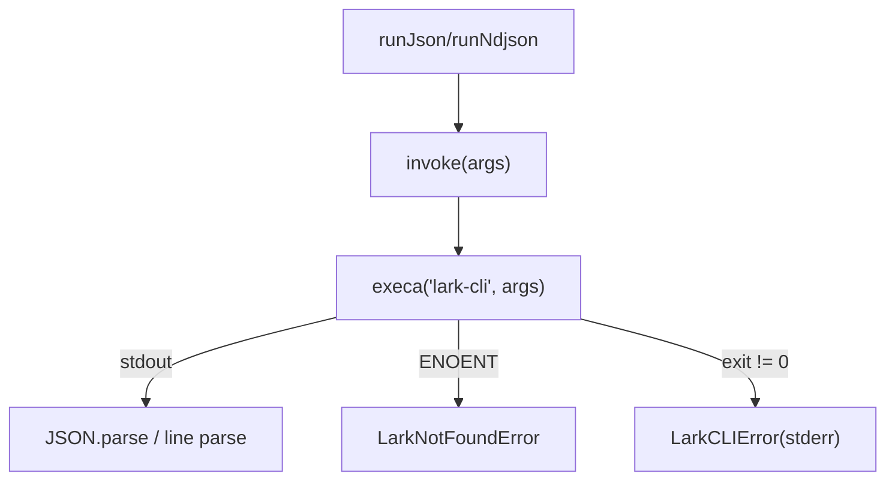
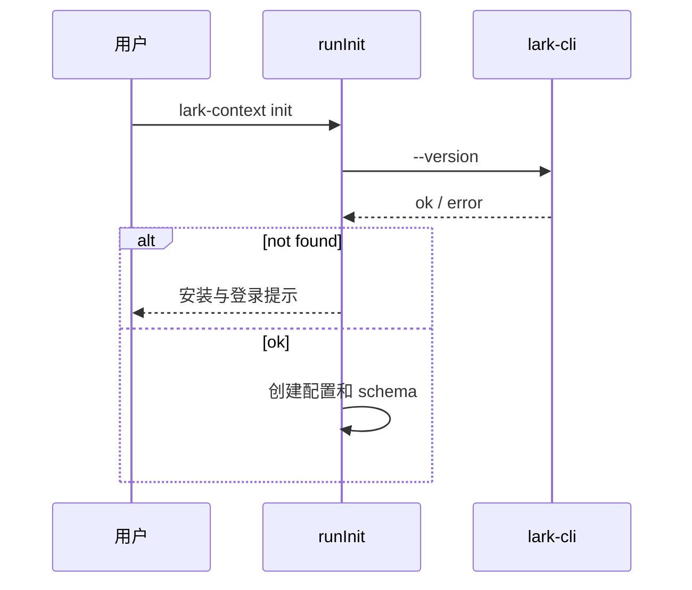
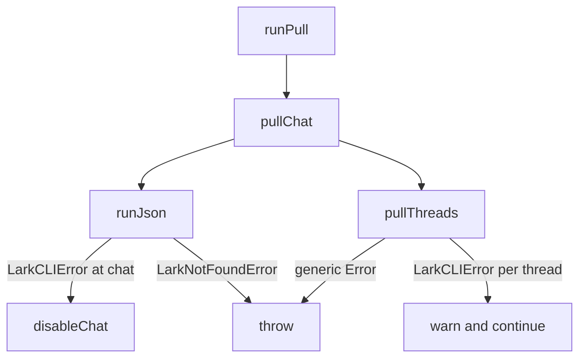

<details>
<summary>相关源文件</summary>

生成本页时使用的主要源文件：

- [src/lark.ts](../../../project-repos/lark-context/src/lark.ts)
- [src/commands/listGroups.ts](../../../project-repos/lark-context/src/commands/listGroups.ts)
- [src/commands/pull.ts](../../../project-repos/lark-context/src/commands/pull.ts)
- [src/commands/ingestDoc.ts](../../../project-repos/lark-context/src/commands/ingestDoc.ts)
- [src/commands/init.ts](../../../project-repos/lark-context/src/commands/init.ts)
- [test/lark.test.ts](../../../project-repos/lark-context/test/lark.test.ts)

</details>

# lark-cli 集成

项目没有直接实现飞书 OpenAPI 客户端，而是把官方 `lark-cli` 当作唯一飞书访问层。`src/lark.ts` 负责执行二进制、统一追加输出格式、解析 JSON/NDJSON，并把“二进制不存在”和“CLI 非零退出”分成不同错误类型。Sources: [src/lark.ts:1-7](../../../project-repos/lark-context/src/lark.ts#L1-L7), [src/lark.ts:8-35](../../../project-repos/lark-context/src/lark.ts#L8-L35)

<details class="source-snippets">
<summary>引用源码</summary>

<!-- source-snippets:start -->

#### `src/lark.ts:1-7`

```typescript
import { execa } from "execa";

export const BINARY = "lark-cli";

export class LarkCLIError extends Error {}
export class LarkNotFoundError extends Error {}

```

#### `src/lark.ts:8-35`

```typescript
async function invoke(args: string[]): Promise<string> {
  try {
    const r = await execa(BINARY, args, { reject: true });
    return r.stdout;
  } catch (err: unknown) {
    const e = err as { code?: string; exitCode?: number; stderr?: string };
    if (e?.code === "ENOENT") {
      throw new LarkNotFoundError(
        `\`${BINARY}\` binary not found on PATH. See https://github.com/larksuite/cli for install instructions.`,
      );
    }
    const stderr = (e?.stderr ?? "").toString().trim();
    throw new LarkCLIError(stderr || `lark exited ${e?.exitCode ?? "?"}`);
  }
}

export async function runJson(args: string[]): Promise<unknown> {
  const out = await invoke([...args, "--format", "json"]);
  return JSON.parse(out);
}

export async function* runNdjson(args: string[]): AsyncGenerator<unknown> {
  const out = await invoke([...args, "--format", "ndjson"]);
  for (const line of out.split("\n")) {
    const trimmed = line.trim();
    if (trimmed) yield JSON.parse(trimmed);
  }
}
```

<!-- source-snippets:end -->
</details>
## 封装层



Sources: [src/lark.ts:8-35](../../../project-repos/lark-context/src/lark.ts#L8-L35), [test/lark.test.ts:20-71](../../../project-repos/lark-context/test/lark.test.ts#L20-L71)

<details class="source-snippets">
<summary>引用源码</summary>

<!-- source-snippets:start -->

#### `src/lark.ts:8-35`

```typescript
async function invoke(args: string[]): Promise<string> {
  try {
    const r = await execa(BINARY, args, { reject: true });
    return r.stdout;
  } catch (err: unknown) {
    const e = err as { code?: string; exitCode?: number; stderr?: string };
    if (e?.code === "ENOENT") {
      throw new LarkNotFoundError(
        `\`${BINARY}\` binary not found on PATH. See https://github.com/larksuite/cli for install instructions.`,
      );
    }
    const stderr = (e?.stderr ?? "").toString().trim();
    throw new LarkCLIError(stderr || `lark exited ${e?.exitCode ?? "?"}`);
  }
}

export async function runJson(args: string[]): Promise<unknown> {
  const out = await invoke([...args, "--format", "json"]);
  return JSON.parse(out);
}

export async function* runNdjson(args: string[]): AsyncGenerator<unknown> {
  const out = await invoke([...args, "--format", "ndjson"]);
  for (const line of out.split("\n")) {
    const trimmed = line.trim();
    if (trimmed) yield JSON.parse(trimmed);
  }
}
```

#### `test/lark.test.ts:20-71`

```typescript
describe("runJson", () => {
  it("appends --format json and parses JSON stdout", async () => {
    mockExeca.mockResolvedValueOnce({
      stdout: '{"a":1,"b":[2,3]}',
      stderr: "",
      exitCode: 0,
    } as any);

    const out = await runJson(["im", "+chat-messages-list"]);

    expect(out).toEqual({ a: 1, b: [2, 3] });
    const call = mockExeca.mock.calls[0];
    expect(call[0]).toBe(BINARY);
    expect(call[1]).toEqual([
      "im",
      "+chat-messages-list",
      "--format",
      "json",
    ]);
  });

  it("throws LarkNotFoundError when binary missing (ENOENT)", async () => {
    mockExeca.mockRejectedValue(
      Object.assign(new Error("spawn ENOENT"), { code: "ENOENT" }),
    );

    await expect(runJson(["x"])).rejects.toBeInstanceOf(LarkNotFoundError);
    await expect(runJson(["x"])).rejects.toThrow(/lark-cli.*not found/i);
  });

  it("throws LarkCLIError on non-zero exit with stderr", async () => {
    mockExeca.mockRejectedValueOnce(
      Object.assign(new Error("failed"), {
        exitCode: 1,
        stderr: "permission denied",
      }),
    );

    const err = (await runJson(["x"]).catch((e) => e)) as Error;
    expect(err).toBeInstanceOf(LarkCLIError);
    expect(err.message).toBe("permission denied");
  });

  it("LarkCLIError falls back when stderr empty", async () => {
    mockExeca.mockRejectedValueOnce(
      Object.assign(new Error("failed"), { exitCode: 2, stderr: "" }),
    );

    const err = (await runJson(["x"]).catch((e) => e)) as Error;
    expect(err).toBeInstanceOf(LarkCLIError);
    expect(err.message).toMatch(/exited 2/);
  });
```

<!-- source-snippets:end -->
</details>
`runJson` 会在参数末尾追加 `--format json`，`runNdjson` 追加 `--format ndjson` 并逐行解析非空行。测试明确覆盖了追加格式参数、JSON 解析、空行跳过、ENOENT 和 stderr 透传。Sources: [src/lark.ts:24-35](../../../project-repos/lark-context/src/lark.ts#L24-L35), [test/lark.test.ts:20-39](../../../project-repos/lark-context/test/lark.test.ts#L20-L39), [test/lark.test.ts:74-101](../../../project-repos/lark-context/test/lark.test.ts#L74-L101)

<details class="source-snippets">
<summary>引用源码</summary>

<!-- source-snippets:start -->

#### `src/lark.ts:24-35`

```typescript
export async function runJson(args: string[]): Promise<unknown> {
  const out = await invoke([...args, "--format", "json"]);
  return JSON.parse(out);
}

export async function* runNdjson(args: string[]): AsyncGenerator<unknown> {
  const out = await invoke([...args, "--format", "ndjson"]);
  for (const line of out.split("\n")) {
    const trimmed = line.trim();
    if (trimmed) yield JSON.parse(trimmed);
  }
}
```

#### `test/lark.test.ts:20-39`

```typescript
describe("runJson", () => {
  it("appends --format json and parses JSON stdout", async () => {
    mockExeca.mockResolvedValueOnce({
      stdout: '{"a":1,"b":[2,3]}',
      stderr: "",
      exitCode: 0,
    } as any);

    const out = await runJson(["im", "+chat-messages-list"]);

    expect(out).toEqual({ a: 1, b: [2, 3] });
    const call = mockExeca.mock.calls[0];
    expect(call[0]).toBe(BINARY);
    expect(call[1]).toEqual([
      "im",
      "+chat-messages-list",
      "--format",
      "json",
    ]);
  });
```

#### `test/lark.test.ts:74-101`

```typescript
describe("runNdjson", () => {
  it("appends --format ndjson and yields one object per line", async () => {
    mockExeca.mockResolvedValueOnce({
      stdout: '{"a":1}\n{"a":2}\n{"a":3}\n',
      stderr: "",
      exitCode: 0,
    } as any);

    const out: unknown[] = [];
    for await (const row of runNdjson(["list"])) out.push(row);

    expect(out).toEqual([{ a: 1 }, { a: 2 }, { a: 3 }]);
    const call = mockExeca.mock.calls[0];
    expect(call[1]).toEqual(["list", "--format", "ndjson"]);
  });

  it("skips empty lines", async () => {
    mockExeca.mockResolvedValueOnce({
      stdout: '{"a":1}\n\n{"a":2}\n   \n',
      stderr: "",
      exitCode: 0,
    } as any);

    const out: unknown[] = [];
    for await (const row of runNdjson(["x"])) out.push(row);

    expect(out).toEqual([{ a: 1 }, { a: 2 }]);
  });
```

<!-- source-snippets:end -->
</details>
## 调用点

| 业务 | 调用参数 | 返回处理 |
|---|---|---|
| 列用户所在群 | `im chats list --page-all --page-limit 0` | 读取 `data.items` |
| 拉群消息 | `im +chat-messages-list --chat-id ... --sort asc --page-size 50` | 读取 `data.messages/page_token/has_more` |
| 拉话题回复 | `im +threads-messages-list --thread ... --sort asc --page-size 50` | 同样分页读取 messages |
| 拉文档 | `docs +fetch --doc <ref>` | 读取 `data.title/content/markdown/text/body` |

Sources: [src/commands/listGroups.ts:11-27](../../../project-repos/lark-context/src/commands/listGroups.ts#L11-L27), [src/commands/pull.ts:47-77](../../../project-repos/lark-context/src/commands/pull.ts#L47-L77), [src/commands/pull.ts:171-196](../../../project-repos/lark-context/src/commands/pull.ts#L171-L196), [src/commands/ingestDoc.ts:65-83](../../../project-repos/lark-context/src/commands/ingestDoc.ts#L65-L83)

<details class="source-snippets">
<summary>引用源码</summary>

<!-- source-snippets:start -->

#### `src/commands/listGroups.ts:11-27`

```typescript
  const response = await runJson([
    "im",
    "chats",
    "list",
    "--page-all",
    "--page-limit",
    "0",
  ]);
  if (!response || typeof response !== "object") {
    throw new Error(`unexpected lark response: ${JSON.stringify(response)}`);
  }
  const data = (response as { data?: unknown }).data;
  const items: Array<{ chat_id?: string; name?: string; description?: string }> =
    data && typeof data === "object" && Array.isArray((data as any).items)
      ? (data as any).items
      : [];

```

#### `src/commands/pull.ts:47-77`

```typescript
async function onePage(
  chatId: string,
  pageToken: string | null,
  startIso: string | null,
): Promise<PageResult> {
  const args: string[] = [
    "im",
    "+chat-messages-list",
    "--chat-id",
    chatId,
    "--sort",
    "asc",
    "--page-size",
    "50",
  ];
  if (pageToken) args.push("--page-token", pageToken);
  if (startIso) args.push("--start", startIso);
  const response = (await runJson(args)) as any;
  if (!response || typeof response !== "object") {
    throw new Error(`unexpected lark response: ${JSON.stringify(response)}`);
  }
  const data = response.data ?? {};
  if (!data || typeof data !== "object") {
    return { messages: [], nextToken: null, hasMore: false };
  }
  return {
    messages: Array.isArray(data.messages) ? data.messages : [],
    nextToken: data.page_token ?? null,
    hasMore: Boolean(data.has_more),
  };
}
```

#### `src/commands/pull.ts:171-196`

```typescript
async function pullThreadsPage(
  threadId: string,
  pageToken: string | null,
): Promise<PageResult> {
  const args: string[] = [
    "im",
    "+threads-messages-list",
    "--thread",
    threadId,
    "--sort",
    "asc",
    "--page-size",
    "50",
  ];
  if (pageToken) args.push("--page-token", pageToken);
  const response = (await runJson(args)) as any;
  if (!response || typeof response !== "object") {
    throw new Error(`unexpected threads response: ${JSON.stringify(response)}`);
  }
  const data = response.data ?? {};
  return {
    messages: Array.isArray(data.messages) ? data.messages : [],
    nextToken: data.page_token ? String(data.page_token) : null,
    hasMore: Boolean(data.has_more),
  };
}
```

#### `src/commands/ingestDoc.ts:65-83`

```typescript
  const response = (await runJson(["docs", "+fetch", "--doc", opts.ref])) as
    | Record<string, unknown>
    | null;
  if (!response || typeof response !== "object") {
    throw new Error(`unexpected lark response: ${JSON.stringify(response)}`);
  }
  if (response.ok === false) {
    const err = response.error;
    const msg =
      err && typeof err === "object" && err !== null && "message" in err
        ? String((err as { message: unknown }).message)
        : String(err ?? response);
    throw new Error(`docs +fetch failed: ${msg}`);
  }
  let data = response.data;
  if (!data || typeof data !== "object") {
    data = { content: String(data ?? "") };
  }
  const { title, body } = extractContent(data as Record<string, unknown>);
```

<!-- source-snippets:end -->
</details>
## 初始化检查

`init` 不通过 `src/lark.ts`，而是直接执行 `lark-cli --version` 做 PATH 检查。失败时提示安装 `@larksuite/cli` 并执行 `lark-cli auth login`。这是一种启动前置检查，而不是业务调用。Sources: [src/commands/init.ts:18-34](../../../project-repos/lark-context/src/commands/init.ts#L18-L34), [skills/lark-context/SKILL.md:15-29](../../../project-repos/lark-context/skills/lark-context/SKILL.md#L15-L29)

<details class="source-snippets">
<summary>引用源码</summary>

<!-- source-snippets:start -->

#### `src/commands/init.ts:18-34`

```typescript
async function defaultPathCheck(): Promise<boolean> {
  try {
    await execa("lark-cli", ["--version"], { reject: true });
    return true;
  } catch {
    return false;
  }
}

export async function runInit(opts: InitOpts = {}): Promise<void> {
  if (opts.checkLarkCli !== false) {
    const check = opts._pathCheck ?? defaultPathCheck;
    if (!(await check())) {
      throw new Error(
        "`lark-cli` binary not found on PATH. Install: `bnpm i -g @larksuite/cli` (or `npm i -g @larksuite/cli`), then `lark-cli auth login`.",
      );
    }
```

#### `skills/lark-context/SKILL.md:15-29`

````markdown
## 前置依赖

用户必须已安装两个 CLI：
- `lark-context` ≥ 0.1.0（本项目 CLI，`bnpm i -g @tiktok-fe/lark-context`）
- `lark-cli`（飞书官方 CLI，`bnpm i -g @larksuite/cli` + `lark-cli auth login`）

**版本自检**：在执行任何意图 workflow 前，第一步跑：

```bash
lark-context --version
```

若不达 `0.1.0` 起，提示用户：`bnpm i -g @tiktok-fe/lark-context@latest`，然后中止本次调用。

若 `lark-cli` 未安装或未登录，`lark-context init` / 其他命令会直接报错；**透传**错误 stderr 给用户，**不要**尝试替用户登录（需要浏览器交互）。
````

<!-- source-snippets:end -->
</details>


Sources: [src/commands/init.ts:18-34](../../../project-repos/lark-context/src/commands/init.ts#L18-L34), [src/commands/init.ts:36-53](../../../project-repos/lark-context/src/commands/init.ts#L36-L53)

<details class="source-snippets">
<summary>引用源码</summary>

<!-- source-snippets:start -->

#### `src/commands/init.ts:18-34`

```typescript
async function defaultPathCheck(): Promise<boolean> {
  try {
    await execa("lark-cli", ["--version"], { reject: true });
    return true;
  } catch {
    return false;
  }
}

export async function runInit(opts: InitOpts = {}): Promise<void> {
  if (opts.checkLarkCli !== false) {
    const check = opts._pathCheck ?? defaultPathCheck;
    if (!(await check())) {
      throw new Error(
        "`lark-cli` binary not found on PATH. Install: `bnpm i -g @larksuite/cli` (or `npm i -g @larksuite/cli`), then `lark-cli auth login`.",
      );
    }
```

#### `src/commands/init.ts:36-53`

```typescript
  const cfg = loadConfig({
    configPathOverride: opts.configPathOverride,
    memoryDirOverride: opts.memoryDirOverride,
    rawDirOverride: opts.rawDirOverride,
  });
  mkdirSync(cfg.memoryDir, { recursive: true });
  mkdirSync(cfg.rawDir, { recursive: true });
  if (cfg.configPath && !existsSync(cfg.configPath)) {
    const fresh: Config = {
      memoryDir: cfg.memoryDir,
      rawDir: cfg.rawDir,
      groups: [],
      configPath: cfg.configPath,
    };
    saveConfig(fresh);
  }
  initSchema(join(cfg.rawDir, "raw.db"));
  process.stdout.write(`Initialized lark-context at ${cfg.configPath}\n`);
```

<!-- source-snippets:end -->
</details>
## 错误传播策略

`LarkNotFoundError` 在 `pullThreads` 中会继续向上抛；`LarkCLIError` 在单个 thread 失败时只跳过该 thread，写 warning 后继续。对群级 `pull` 来说，`LarkCLIError` 会把该 chat disable，并继续处理其他群。Sources: [src/commands/pull.ts:279-285](../../../project-repos/lark-context/src/commands/pull.ts#L279-L285), [src/commands/pull.ts:391-399](../../../project-repos/lark-context/src/commands/pull.ts#L391-L399), [src/commands/pull.ts:424-437](../../../project-repos/lark-context/src/commands/pull.ts#L424-L437)

<details class="source-snippets">
<summary>引用源码</summary>

<!-- source-snippets:start -->

#### `src/commands/pull.ts:279-285`

```typescript
    } catch (err) {
      if (err instanceof LarkNotFoundError) throw err;
      if (!(err instanceof LarkCLIError)) throw err;
      process.stderr.write(
        `  ${group.alias}: thread ${threadId} failed (${err.message}); skipped\n`,
      );
    }
```

#### `src/commands/pull.ts:391-399`

```typescript
function disableChat(dbPath: string, alias: string, reason: string): void {
  const db = connect(dbPath);
  try {
    db.prepare("UPDATE chats SET enabled=0 WHERE alias=?").run(alias);
  } finally {
    db.close();
  }
  process.stderr.write(`${alias}: DISABLED (${reason})\n`);
}
```

#### `src/commands/pull.ts:424-437`

```typescript
  let grand = 0;
  for (const g of targets) {
    try {
      const n = await pullChat(dbPath, g, sinceParsed, threadOpts, now);
      process.stdout.write(`${g.alias}: pulled ${n} messages\n`);
      grand += n;
    } catch (err) {
      if (err instanceof LarkNotFoundError) throw err;
      if (err instanceof LarkCLIError) {
        disableChat(dbPath, g.alias, err.message);
        continue;
      }
      throw err;
    }
```

<!-- source-snippets:end -->
</details>
测试覆盖了群级 `LarkCLIError` 会禁用失败群但保留其他群，也覆盖了单 thread 权限错误不会禁用 chat，非 Lark 错误不会被吞掉。Sources: [test/cmd-pull.test.ts:240-265](../../../project-repos/lark-context/test/cmd-pull.test.ts#L240-L265), [test/cmd-pull.test.ts:908-963](../../../project-repos/lark-context/test/cmd-pull.test.ts#L908-L963), [test/cmd-pull.test.ts:998-1033](../../../project-repos/lark-context/test/cmd-pull.test.ts#L998-L1033)

<details class="source-snippets">
<summary>引用源码</summary>

<!-- source-snippets:start -->

#### `test/cmd-pull.test.ts:240-265`

```typescript
  it("LarkCLIError on one chat disables it; other chats still pulled", async () => {
    await setup();
    await runAdd({
      configPathOverride: configPath,
      chatId: "oc_bbb",
      alias: "bravo",
    });
    mockRunJson.mockImplementation(async (args: string[]) => {
      const chatId = args[args.indexOf("--chat-id") + 1];
      if (chatId === "oc_aaa") throw new LarkCLIError("permission denied");
      return EMPTY;
    });
    await runPull({});
    const cfg = loadConfig();
    const db = connect(join(cfg.rawDir, "raw.db"));
    try {
      const rows = db
        .prepare("SELECT alias, enabled FROM chats ORDER BY alias")
        .all() as Array<{ alias: string; enabled: number }>;
      const byAlias = Object.fromEntries(rows.map((r) => [r.alias, r.enabled]));
      expect(byAlias.alpha).toBe(0);
      expect(byAlias.bravo).toBe(1);
    } finally {
      db.close();
    }
  });
```

#### `test/cmd-pull.test.ts:908-963`

```typescript
  it("a single thread failing does not disable the chat; other threads continue", async () => {
    await setup();
    const cfg = loadConfig();
    const db = connect(join(cfg.rawDir, "raw.db"));
    try {
      db.prepare(
        "INSERT INTO messages(id,chat_alias,content_json,create_time,thread_id,is_thread_reply) " +
          "VALUES ('a','alpha','{}','2026-04-18T09:00:00','omt_good',0)," +
          "('b','alpha','{}','2026-04-18T09:05:00','omt_bad',0)," +
          "('c','alpha','{}','2026-04-18T09:10:00','omt_other',0)",
      ).run();
    } finally {
      db.close();
    }

    mockRunJson.mockImplementation(async (args: string[]) => {
      if (args.includes("+chat-messages-list")) {
        return { ok: true, data: { has_more: false, messages: [] } };
      }
      if (args.includes("+threads-messages-list")) {
        const t = args[args.indexOf("--thread") + 1];
        if (t === "omt_bad") throw new LarkCLIError("permission denied on thread");
        return {
          ok: true,
          data: {
            has_more: false,
            messages: [
              {
                message_id: `r_${t}`,
                msg_type: "text",
                content: "ok",
                create_time: "2026-04-18 10:00",
                thread_id: t,
                sender: { id: "ou_x", name: "X", sender_type: "user" },
              },
            ],
          },
        };
      }
      throw new Error(`unexpected: ${args.join(" ")}`);
    });

    await runPull({ chatAlias: "alpha", threadWindow: "365d" });

    const db2 = connect(join(cfg.rawDir, "raw.db"));
    try {
      const enabled = (db2.prepare("SELECT enabled FROM chats WHERE alias='alpha'").get() as any).enabled;
      expect(enabled).toBe(1);
      const replies = db2
        .prepare("SELECT id FROM messages WHERE is_thread_reply=1 ORDER BY id")
        .all() as Array<{ id: string }>;
      expect(replies.map((r) => r.id).sort()).toEqual(["r_omt_good", "r_omt_other"]);
    } finally {
      db2.close();
    }
  });
```

#### `test/cmd-pull.test.ts:998-1033`

```typescript
  it("non-Lark errors from thread fetch propagate (don't get swallowed)", async () => {
    await setup();
    const cfg = loadConfig();
    const db = connect(join(cfg.rawDir, "raw.db"));
    try {
      db.prepare(
        "INSERT INTO messages(id,chat_alias,content_json,create_time,thread_id,is_thread_reply) " +
          "VALUES ('x','alpha','{}','2026-04-18T09:00:00','omt_boom',0)",
      ).run();
    } finally {
      db.close();
    }

    mockRunJson.mockImplementation(async (args: string[]) => {
      if (args.includes("+chat-messages-list")) {
        return { ok: true, data: { has_more: false, messages: [] } };
      }
      if (args.includes("+threads-messages-list")) {
        throw new Error("boom");
      }
      throw new Error(`unexpected: ${args.join(" ")}`);
    });

    await expect(
      runPull({ chatAlias: "alpha", threadWindow: "365d" }),
    ).rejects.toThrow(/boom/);

    // Chat was not disabled — generic Error isn't a LarkCLIError
    const db2 = connect(join(cfg.rawDir, "raw.db"));
    try {
      const enabled = (db2.prepare("SELECT enabled FROM chats WHERE alias='alpha'").get() as any).enabled;
      expect(enabled).toBe(1);
    } finally {
      db2.close();
    }
  });
```

<!-- source-snippets:end -->
</details>


Sources: [src/commands/pull.ts:240-290](../../../project-repos/lark-context/src/commands/pull.ts#L240-L290), [src/commands/pull.ts:391-440](../../../project-repos/lark-context/src/commands/pull.ts#L391-L440)

<details class="source-snippets">
<summary>引用源码</summary>

<!-- source-snippets:start -->

#### `src/commands/pull.ts:240-290`

```typescript
async function pullThreads(
  dbPath: string,
  group: GroupConfig,
  windowMs: number,
  now: Date,
): Promise<{ threadsScanned: number; inserted: number }> {
  const cutoff = new Date(now.getTime() - windowMs)
    .toISOString()
    .replace(/\.\d{3}Z$/, "");
  const db = connect(dbPath);
  let threadIds: string[];
  try {
    const rows = db
      .prepare(
        "SELECT DISTINCT thread_id FROM messages " +
          "WHERE chat_alias=? AND thread_id IS NOT NULL " +
          "AND is_thread_reply=0 AND create_time >= ?",
      )
      .all(group.alias, cutoff) as Array<{ thread_id: string }>;
    threadIds = rows.map((r) => r.thread_id);
  } finally {
    db.close();
  }

  let totalInserted = 0;
  for (const threadId of threadIds) {
    try {
      let pageToken: string | null = null;
      for (let page = 1; page <= MAX_PAGES; page++) {
        const { messages, nextToken, hasMore } = await pullThreadsPage(
          threadId,
          pageToken,
        );
        if (messages.length > 0) {
          totalInserted += writeThreadPage(dbPath, group.alias, threadId, messages);
        }
        if (!hasMore || !nextToken || nextToken === pageToken) break;
        pageToken = nextToken;
      }
    } catch (err) {
      if (err instanceof LarkNotFoundError) throw err;
      if (!(err instanceof LarkCLIError)) throw err;
      process.stderr.write(
        `  ${group.alias}: thread ${threadId} failed (${err.message}); skipped\n`,
      );
    }
  }
  process.stderr.write(
    `  ${group.alias}: threads +${threadIds.length} scanned, +${totalInserted} replies inserted\n`,
  );
  return { threadsScanned: threadIds.length, inserted: totalInserted };
```

#### `src/commands/pull.ts:391-440`

```typescript
function disableChat(dbPath: string, alias: string, reason: string): void {
  const db = connect(dbPath);
  try {
    db.prepare("UPDATE chats SET enabled=0 WHERE alias=?").run(alias);
  } finally {
    db.close();
  }
  process.stderr.write(`${alias}: DISABLED (${reason})\n`);
}

export async function runPull(opts: PullOpts): Promise<number> {
  const cfg: Config = loadConfig(opts);
  const dbPath = join(cfg.rawDir, "raw.db");
  ensureInitialized(dbPath);
  const sinceParsed = opts.since ? parseDuration(opts.since) : null;
  const threadWindowParsed = opts.threadWindow
    ? parseDuration(opts.threadWindow)
    : null;
  const threadOpts: ThreadOpts = {
    enabled: !opts.noThreads,
    overrideWindow: threadWindowParsed,
    firstPullFallback: sinceParsed,
  };
  const effectiveAlias =
    opts.chatAlias === "all" || !opts.chatAlias ? null : opts.chatAlias;
  const targets = cfg.groups.filter(
    (g) => g.enabled && (!effectiveAlias || g.alias === effectiveAlias),
  );
  if (effectiveAlias && targets.length === 0) {
    throw new Error(`unknown chat alias "${opts.chatAlias}"`);
  }
  const now = (opts._now ?? (() => new Date()))();

  let grand = 0;
  for (const g of targets) {
    try {
      const n = await pullChat(dbPath, g, sinceParsed, threadOpts, now);
      process.stdout.write(`${g.alias}: pulled ${n} messages\n`);
      grand += n;
    } catch (err) {
      if (err instanceof LarkNotFoundError) throw err;
      if (err instanceof LarkCLIError) {
        disableChat(dbPath, g.alias, err.message);
        continue;
      }
      throw err;
    }
  }
  process.stdout.write(`done, total=${grand}\n`);
  return grand;
```

<!-- source-snippets:end -->
</details>
## 与 skill 的契约

skill 文档要求 CLI 非零退出时透传 stderr，不编造解释；命中已知场景时才补操作建议。`pull.md` 还列出了 scope、chat_not_found、ENOENT、自动 disable 等常见错误的用户建议。Sources: [skills/lark-context/SKILL.md:69-73](../../../project-repos/lark-context/skills/lark-context/SKILL.md#L69-L73), [skills/lark-context/references/pull.md:38-46](../../../project-repos/lark-context/skills/lark-context/references/pull.md#L38-L46)

<details class="source-snippets">
<summary>引用源码</summary>

<!-- source-snippets:start -->

#### `skills/lark-context/SKILL.md:69-73`

```markdown
## 错误处理

- **CLI 非零退出**：透传 stderr 给用户，**不编造解释**。若命中已知场景（lark-cli 未装 / 未 auth / chat 被踢出群），补一句操作建议；否则就是透传
- **`references/` 文件缺失**：说明 skill 装坏了。提示用户：`npx skills update lark-context` 或重新 `npx skills add <repo> -g -y`
- **网络错 / lark-cli 超时**：不自动重试（拉消息幂等但失败通常要手动判断），交给用户处理
```

#### `skills/lark-context/references/pull.md:38-46`

```markdown
## 常见错误（透传 + 操作建议）

| CLI stderr 特征 | 原因 | 给用户的建议 |
|---|---|---|
| `permission_violations` / `required scope` | lark-cli auth 缺 scope | `lark-cli auth login --scope "im:message im:chat"`（具体 scope 按错误信息给） |
| `chat_not_found` | 用户被踢出群了 | `lark-context groups rm <alias>` 或留着忽略 |
| `ENOENT` / `lark-cli not found` | lark-cli 没装 | `bnpm i -g @larksuite/cli` |
| 某个 chat 被 CLI 自动 disable（`<alias>: DISABLED`） | 单群失败不中断全流程；其他群继续 | 看 stderr 哪个 alias 被禁，解决后 `groups add` 重加（重加会把 enabled 翻回 1） |

```

<!-- source-snippets:end -->
</details>
## 相关页面

- [CLI 命令面](cli-command-surface.md)
- [消息拉取与话题回复流水线](pull-thread-pipeline.md)
- [文档入库与 Markdown 输出](document-ingestion-and-show.md)
