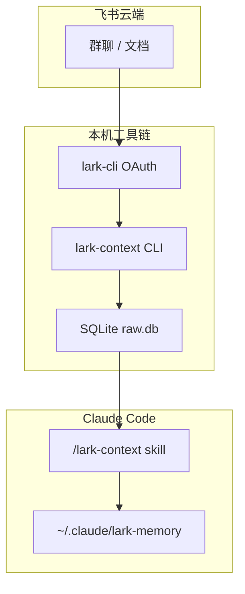

<details>
<summary>相关源文件</summary>

生成本页时使用的主要源文件：

- [README.md](../../../project-repos/lark-context/README.md)
- [package.json](../../../project-repos/lark-context/package.json)
- [src/cli.ts](../../../project-repos/lark-context/src/cli.ts)
- [skills/lark-context/SKILL.md](../../../project-repos/lark-context/skills/lark-context/SKILL.md)
- [tsup.config.ts](../../../project-repos/lark-context/tsup.config.ts)

</details>

# 项目概览

飞书群与文档的信息密度高，但默认留在云端；把上下文“接”进 Claude Code 的常见做法是复制粘贴，既碎又难复盘。**lark-context 先用 OAuth 用户身份（经官方 `lark-cli`）把指定群与文档沉淀进本地 SQLite**，再用 markdown 管道喂给 Claude；**digest（整理记忆）阶段刻意只读本地 `show` 输出并写文件，不调用外部 LLM API**，把工作数据关在用户机器上。

**两层记忆**是它的核心制品模型：`entities/` 放“慢变”对象（人、项目、术语、决策），`journal/` 按 ISO 周追加流水；`MEMORY.md` 做索引并通常被 `CLAUDE.md` `@` 引用。工具侧负责**持续拉取与入库**；**语义提炼由 Claude 在对话里完成**——这条分工把“可信边界”画在 CLI 与 skill 的 I/O 上，而不是再去接一个黑盒摘要服务。



上图强调“云端只经过官方 CLI”，而 `lark-context` 本身只是把 JSON/NDJSON 落库并在 `show` 时渲染成可读 markdown；**记忆合并规则写在 skill 的 references 里**，不在 TS 代码中硬编码业务语义。

## 能力全景

- **白名单拉群**：`config.yaml` 维护 alias ↔ `chat_id`，`pull` 只遍历 `enabled` 群，避免把用户加入的所有会话一扫而空。  
- **增量续拉**：用 `chats.last_cursor` 记住“见过的最新时间”，后续运行忽略 `--since`，把时间窗只留给首次回填。  
- **话题结构**：`messages` 同时支持 API 内嵌的 `thread_replies` 与二阶段 `+threads-messages-list`，`show` 用 `↳` 缩进渲染子回复。  
- **文档入库**：`ingest-doc` 调 `docs +fetch`，把 markdown 文本 UPSERT 进 `docs`，`show` 在同一时间窗下列出“近期文档”。  
- **Skill 路由**：`SKILL.md` 用关键词把自然语言分发到 digest/pull/show/todo/ingest-doc 等 workflow，并强制版本自检与错误透传。  

## 技术栈速览

| 维度 | 事实 |
|------|------|
| 运行时 | Node **≥18**，打包 `tsup` → 单文件 ESM `dist/cli.js`（见 `tsup.config.ts`） |
| CLI 框架 | `commander` 注册子命令；`execa` 调用 `lark-cli` |
| 存储 | `better-sqlite3`，`journal_mode=WAL`，外键开启 |
| 测试 | `vitest` + 存根 `lark` JSON 夹具 |
| 包名 | npm 包 `@tiktok-fe/lark-context`，二进制名 `lark-context` |

## 与同类思路的差异

它比“直接让模型联网读飞书”更**离线**：`show` / `show-doc` 阶段甚至不再触发 `lark-cli`，只读本地库。代价是**数据新鲜度取决于用户何时 `pull`**，以及 V1 明确不做定时调度（README 将其标为手动/cron 留给后续）。

**内网文档对照**：字节侧飞书 Wiki（链接见 [README.md 内「内部延伸阅读」](../README.md)）可用已登录的 **`lark-cli docs +fetch --doc <url>`** 拉取 markdown，便于与源码叙事对齐；本页仍以仓库与 skill 为技术真源，产品话术与演示以 Wiki 为准。若安装方式、registry 或流程与开源 README 不一致，**以 Wiki 中明确为当前有效的段落优先**。

## 阅读路线

| 读者目标 | 建议顺序 |
|----------|----------|
| 想理解端到端闭环 | 本页 → [系统架构](system-architecture.md) → [Claude Skill 与工作流](skill-workflows.md) |
| 要排查同步/漏消息 | [增量拉取与话题回复](pull-and-threads.md) → [SQLite 数据模型](sqlite-data-model.md) |
| 要扩展命令行行为 | [CLI 命令参考](cli-commands.md) → `src/commands/*` 单测 |

Sources: [README.md:1-110](../../../project-repos/lark-context/README.md#L1-L110), [package.json:1-36](../../../project-repos/lark-context/package.json#L1-L36), [src/cli.ts:1-49](../../../project-repos/lark-context/src/cli.ts#L1-L49), [skills/lark-context/SKILL.md:1-75](../../../project-repos/lark-context/skills/lark-context/SKILL.md#L1-L75)

<details class="source-snippets">
<summary>引用源码</summary>

<!-- source-snippets:start -->

#### `README.md:1-110`

````markdown
# lark-context

把飞书（Lark）群聊和文档**持续沉淀**到本地，按 markdown 暴露给 Claude 使用。Claude 再按需把原始数据提炼成一套**两层记忆文件**，让后续任何对话都能默认带上这些上下文。

- **持续拉取**：指定飞书群的增量消息（经 OAuth 用户身份通过官方 `lark-cli` 读取）
- **手动喂文档**：粘贴飞书文档 URL，工具拉下来入库
- **提炼**：由 **Claude 自己**（通过 skill workflow）完成，工具不调任何外部 LLM API（工作数据不出网）
- **记忆结构**：`entities/`（稳定层：人 / 项目 / 术语 / 决策）+ `journal/`（流水层：按 ISO 周追加要点）
- **分发**：TS CLI 走 bnpm，skill 走 `npx skills`

## 架构一眼

```
飞书 ── lark-cli (OAuth) ──▶ @tiktok-fe/lark-context (TS CLI)
                                   │
                                   ├─ SQLite: ~/.lark-context/raw.db
                                   └─ 暴露子命令给 Claude shell 调用
                                           │
                                           ▼
                                  /lark-context <自然语言>
                                 （skill 在 ~/.agents/skills/lark-context/）
                                           │
                                           ▼
                                  Claude 读原始数据 → 写记忆文件
                                           │
                                           ▼
                                  ~/.claude/lark-memory/
                                      ├─ MEMORY.md (索引)
                                      ├─ entities/（稳定层）
                                      └─ journal/ （流水层）
                                           ↓
                                  ~/.claude/CLAUDE.md 里用 @ 引用
                                           ↓
                                  所有 Claude 对话默认拿到这份记忆
```

## 安装

### 1. 装飞书官方 CLI（若未装）

```bash
bnpm i -g @larksuite/cli
lark-cli auth login            # 浏览器 OAuth 授权
```

### 2. 装本项目的 TS CLI + skill

```bash
bnpm i -g @tiktok-fe/lark-context     # 安装 lark-context 二进制
npx skills add <you>/lark-context -g -y   # 安装 /lark-context skill
```

替换 `<you>` 为实际的 GitHub 用户名 / 组织。

### 3. 初始化

```bash
lark-context init                 # 创建 ~/.lark-context/ + ~/.claude/lark-memory/
```

### 4.（可选）让记忆索引默认加载

```bash
echo '@~/.claude/lark-memory/MEMORY.md' >> ~/.claude/CLAUDE.md
```

这样每个 Claude Code 会话启动时就自动加载 `MEMORY.md` 作为背景知识。

## 使用

全流程通过 Claude Code 对话触发，用自然语言就行：

```
You: /lark-context 看看我在哪些飞书群
→ lark-context list-groups

You: /lark-context 把「项目 Alpha 大群」加到关注
→ lark-context groups add oc_xxxxx --alias project_alpha --name "项目 Alpha 大群"

You: /lark-context 拉一下最近 3 天的消息
→ lark-context pull --since 3d

You: (粘贴飞书文档 URL) /lark-context 收下这个文档
→ lark-context ingest-doc <url>

You: /lark-context 沉淀一下
→ skill 走 references/digest.md workflow：读 show 输出 → 更新 ~/.claude/lark-memory/

You: /lark-context 我有啥 TODO
→ skill 走 references/todo.md workflow：从 show 原文 + journal 抽候选

You: 项目 Alpha 最近啥情况？
→ Claude 直接用已加载的记忆回答；必要时再 `lark-context show --chat project_alpha --since 1w`
```

## CLI 命令一览

| 命令 | 作用 |
|---|---|
| `lark-context init` | 初始化配置、目录、SQLite 库；检查 lark-cli 是否可用 |
| `lark-context list-groups [--json]` | 列你所在的全部飞书群（chat_id + 名称 + 描述） |
| `lark-context groups add <chat_id> [--alias X] [--name "Y"]` | 把群加到关注白名单 |
| `lark-context groups list` / `groups rm <alias>` | 查看 / 移除白名单 |
| `lark-context pull [--chat <alias>\|all] [--since 3d] [--thread-window 7d] [--no-threads]` | 拉消息（增量）+ 刷新话题回复；不给 `--chat` 就拉所有 enabled 的群 |
| `lark-context ingest-doc <url-或-token>` | 拉单份飞书文档入库（支持 `/docx/` / `/wiki/` / `/docs/` 等） |
| `lark-context show [--chat <alias>\|all] [--since 24h]` | 输出 markdown：聊天记录 + 新入库文档 |
| `lark-context show-doc <token-或-url>` | 输出某份已入库文档的完整 markdown |

**`--since` 格式**：`24h` / `3d` / `1w` / `90m`。仅作为**首次拉取**的时间下限；后续 `pull` 会从"上次见过的最新消息"继续，忽略 `--since`。skill workflow 默认首次拉新群用 `90d`（见 `skills/lark-context/references/pull.md`）。

````

#### `package.json:1-36`

```json
{
  "name": "@tiktok-fe/lark-context",
  "version": "0.1.0",
  "description": "Feishu context bridge for Claude Code — pull Lark chats + docs into local memory",
  "type": "module",
  "bin": {
    "lark-context": "./dist/cli.js"
  },
  "files": ["dist/*.js"],
  "engines": {
    "node": ">=18"
  },
  "scripts": {
    "build": "tsup",
    "test": "vitest run",
    "test:watch": "vitest",
    "typecheck": "tsc --noEmit",
    "prepublishOnly": "pnpm build && pnpm test"
  },
  "dependencies": {
    "better-sqlite3": "^11.0.0",
    "commander": "^12.0.0",
    "execa": "^9.0.0",
    "yaml": "^2.4.0"
  },
  "devDependencies": {
    "@types/better-sqlite3": "^7.6.0",
    "@types/node": "^20.0.0",
    "tsup": "^8.0.0",
    "typescript": "^5.4.0",
    "vitest": "^1.5.0"
  },
  "pnpm": {
    "onlyBuiltDependencies": ["better-sqlite3"]
  }
}
```

#### `src/cli.ts:1-49`

```typescript
#!/usr/bin/env node
import { Command } from "commander";
import { readFileSync } from "node:fs";
import { fileURLToPath } from "node:url";
import { dirname, join } from "node:path";
import { registerGroups } from "./commands/groups.js";

// Silently exit on EPIPE (pipes to head/less etc.), matching Python's Click behavior.
for (const stream of [process.stdout, process.stderr]) {
  stream.on("error", (err: NodeJS.ErrnoException) => {
    if (err.code === "EPIPE") process.exit(0);
    throw err;
  });
}

import { registerIngestDoc } from "./commands/ingestDoc.js";
import { registerInit } from "./commands/init.js";
import { registerListGroups } from "./commands/listGroups.js";
import { registerPull } from "./commands/pull.js";
import { registerShow, registerShowDoc } from "./commands/show.js";

// 从 package.json 动态读版本，避免手动维护两份的漂移
function readPkgVersion(): string {
  try {
    const here = dirname(fileURLToPath(import.meta.url));
    const pkg = JSON.parse(
      readFileSync(join(here, "..", "package.json"), "utf8"),
    );
    return typeof pkg.version === "string" ? pkg.version : "0.0.0";
  } catch {
    return "0.0.0";
  }
}

const program = new Command();
program
  .name("lark-context")
  .description("Feishu context bridge for Claude Code")
  .version(readPkgVersion());

registerInit(program);
registerListGroups(program);
registerGroups(program);
registerPull(program);
registerIngestDoc(program);
registerShow(program);
registerShowDoc(program);

program.parseAsync(process.argv);
```

#### `skills/lark-context/SKILL.md:1-75`

````markdown
---
name: lark-context
version: 0.1.0
description: "飞书（Lark）上下文桥：把群聊和文档沉淀到本地记忆库给 Claude 长期使用。当用户说【沉淀/整理/记忆】某群、【拉/同步】消息、【收下/入库】文档、【最近聊了啥】、【我有什么 TODO】、查看/关注/取消关注飞书群时触发。"
metadata:
  requires:
    bins: ["lark-context", "lark-cli"]
  cliHelp: "lark-context --help"
---

# lark-context

把飞书群聊和文档**持续沉淀**到本地，由 Claude 按需提炼成长期记忆。**用户通过 `/lark-context <自然语言>` 调用**，本 skill 负责把意图路由到对应 workflow。

## 前置依赖

用户必须已安装两个 CLI：
- `lark-context` ≥ 0.1.0（本项目 CLI，`bnpm i -g @tiktok-fe/lark-context`）
- `lark-cli`（飞书官方 CLI，`bnpm i -g @larksuite/cli` + `lark-cli auth login`）

**版本自检**：在执行任何意图 workflow 前，第一步跑：

```bash
lark-context --version
```

若不达 `0.1.0` 起，提示用户：`bnpm i -g @tiktok-fe/lark-context@latest`，然后中止本次调用。

若 `lark-cli` 未安装或未登录，`lark-context init` / 其他命令会直接报错；**透传**错误 stderr 给用户，**不要**尝试替用户登录（需要浏览器交互）。

## 意图路由

根据用户自然语言里的关键词选一条路径。**只路由一次**，不要在 references 之间来回跳。

| 触发关键词 | 意图 | 处理方式 |
|---|---|---|
| 沉淀 / 整理 / 记忆 / digest | **digest** | 读 [`references/digest.md`](references/digest.md) 执行 workflow |
| TODO / 待办 / 有啥事 / 该做啥 | **todo** | 读 [`references/todo.md`](references/todo.md) |
| 拉 / 同步 / pull / 更新 | **pull** | 读 [`references/pull.md`](references/pull.md) |
| 收下 / 入库 / 文档 URL（含 `/docx/` / `/wiki/` / `/docs/` / `/base/` / `/file/`） | **ingest-doc** | 读 [`references/ingest-doc.md`](references/ingest-doc.md) |
| 看看 / 最近聊了 / show | **show** | 读 [`references/show.md`](references/show.md) |
| 哪些群 / 列群 / 所有群 / 当前关注 | **list-groups / groups list** | 直接跑对应 CLI 命令，无需 reference |
| 关注 / 加群 / 取消关注 / alias | **groups add/rm** | 直接跑 CLI，无需 reference |

**意图不明**（用户说了一句模糊的话，比如"嗯嗯"或只贴一段描述）：不要猜。**反问**"你是想沉淀 / 拉消息 / 看 TODO / 看最近消息 / 管理群 中哪一项？"——用户澄清后再路由。

**多意图同时出现**（比如"拉一下最近消息然后沉淀"）：**分两步**——先执行第一个（pull），完成后再执行第二个（digest）。不要试图合并。

## 命令速查

这张表供 Claude 在需要直接调 CLI 时查用（不命中意图路由表的情况）：

```bash
lark-context init                                   # 首次初始化（自动检查 lark-cli 可用性）
lark-context list-groups                            # 列用户所在的全部飞书群
lark-context groups add <chat_id> --alias X --name "Y"
lark-context groups list
lark-context groups rm <alias>
lark-context pull [--chat <alias>|all] [--since 3d]
lark-context ingest-doc <url-or-token>
lark-context show [--chat <alias>|all] [--since 24h]
lark-context show-doc <token-or-url>
```

**`--since` 格式**：`24h` / `3d` / `1w` / `90m`。仅作为**首次拉取**的时间下限；后续 `pull` 会从 DB 的 `last_cursor` 续拉，忽略 `--since`。

**首次拉取新群**：默认 `--since 90d`（而非 CLI 的 "无默认"）。这是 skill workflow 的约定，不是 CLI 本身的行为。

## 错误处理

- **CLI 非零退出**：透传 stderr 给用户，**不编造解释**。若命中已知场景（lark-cli 未装 / 未 auth / chat 被踢出群），补一句操作建议；否则就是透传
- **`references/` 文件缺失**：说明 skill 装坏了。提示用户：`npx skills update lark-context` 或重新 `npx skills add <repo> -g -y`
- **网络错 / lark-cli 超时**：不自动重试（拉消息幂等但失败通常要手动判断），交给用户处理

## 存储布局
````

<!-- source-snippets:end -->
</details>

## 相关页面

- [仓库地图与阅读路线](repository-map.md) — `src/`、`skills/`、`legacy/` 怎么分工  
- [系统架构](system-architecture.md) — `lark-cli` 边界与配置加载  
- [Claude Skill 与工作流](skill-workflows.md) — digest/todo 为何不调用外网模型  
