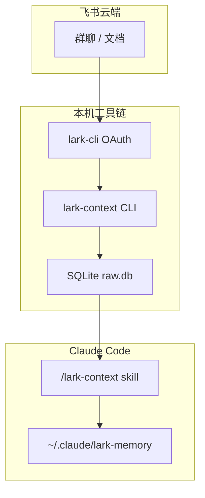

相关源文件

生成本页时使用的主要源文件：

- [README.md](../../../project-repos/lark-context/README.md)
- [package.json](../../../project-repos/lark-context/package.json)
- [src/cli.ts](../../../project-repos/lark-context/src/cli.ts)
- [skills/lark-context/SKILL.md](../../../project-repos/lark-context/skills/lark-context/SKILL.md)
- [tsup.config.ts](../../../project-repos/lark-context/tsup.config.ts)

# 项目概览

飞书群与文档的信息密度高，但默认留在云端；把上下文“接”进 Claude Code 的常见做法是复制粘贴，既碎又难复盘。**lark-context 先用 OAuth 用户身份（经官方 `lark-cli`）把指定群与文档沉淀进本地 SQLite**，再用 markdown 管道喂给 Claude；**digest（整理记忆）阶段刻意只读本地 `show` 输出并写文件，不调用外部 LLM API**，把工作数据关在用户机器上。

**两层记忆**是它的核心制品模型：`entities/` 放“慢变”对象（人、项目、术语、决策），`journal/` 按 ISO 周追加流水；`MEMORY.md` 做索引并通常被 `CLAUDE.md` `@` 引用。工具侧负责**持续拉取与入库**；**语义提炼由 Claude 在对话里完成**——这条分工把“可信边界”画在 CLI 与 skill 的 I/O 上，而不是再去接一个黑盒摘要服务。

上图强调“云端只经过官方 CLI”，而 `lark-context` 本身只是把 JSON/NDJSON 落库并在 `show` 时渲染成可读 markdown；**记忆合并规则写在 skill 的 references 里**，不在 TS 代码中硬编码业务语义。

## 能力全景

- **白名单拉群**：`config.yaml` 维护 alias ↔ `chat_id`，`pull` 只遍历 `enabled` 群，避免把用户加入的所有会话一扫而空。  
- **增量续拉**：用 `chats.last_cursor` 记住“见过的最新时间”，后续运行忽略 `--since`，把时间窗只留给首次回填。  
- **话题结构**：`messages` 同时支持 API 内嵌的 `thread_replies` 与二阶段 `+threads-messages-list`，`show` 用 `↳` 缩进渲染子回复。  
- **文档入库**：`ingest-doc` 调 `docs +fetch`，把 markdown 文本 UPSERT 进 `docs`，`show` 在同一时间窗下列出“近期文档”。  
- **Skill 路由**：`SKILL.md` 用关键词把自然语言分发到 digest/pull/show/todo/ingest-doc 等 workflow，并强制版本自检与错误透传。  

## 技术栈速览

| 维度 | 事实 |
|------|------|
| 运行时 | Node **≥18**，打包 `tsup` → 单文件 ESM `dist/cli.js`（见 `tsup.config.ts`） |
| CLI 框架 | `commander` 注册子命令；`execa` 调用 `lark-cli` |
| 存储 | `better-sqlite3`，`journal_mode=WAL`，外键开启 |
| 测试 | `vitest` + 存根 `lark` JSON 夹具 |
| 包名 | npm 包 `@tiktok-fe/lark-context`，二进制名 `lark-context` |

## 与同类思路的差异

它比“直接让模型联网读飞书”更**离线**：`show` / `show-doc` 阶段甚至不再触发 `lark-cli`，只读本地库。代价是**数据新鲜度取决于用户何时 `pull`**，以及 V1 明确不做定时调度（README 将其标为手动/cron 留给后续）。

**内网文档对照**：字节侧飞书 Wiki（链接见 [README.md 内「内部延伸阅读」](../README.md)）可用已登录的 **`lark-cli docs +fetch --doc <url>`** 拉取 markdown，便于与源码叙事对齐；本页仍以仓库与 skill 为技术真源，产品话术与演示以 Wiki 为准。若安装方式、registry 或流程与开源 README 不一致，**以 Wiki 中明确为当前有效的段落优先**。

## 阅读路线

| 读者目标 | 建议顺序 |
|----------|----------|
| 想理解端到端闭环 | 本页 → [系统架构](system-architecture.md) → [Claude Skill 与工作流](skill-workflows.md) |
| 要排查同步/漏消息 | [增量拉取与话题回复](pull-and-threads.md) → [SQLite 数据模型](sqlite-data-model.md) |
| 要扩展命令行行为 | [CLI 命令参考](cli-commands.md) → `src/commands/*` 单测 |

Sources: [README.md:1-110](../../../project-repos/lark-context/README.md#L1-L110), [package.json:1-36](../../../project-repos/lark-context/package.json#L1-L36), [src/cli.ts:1-49](../../../project-repos/lark-context/src/cli.ts#L1-L49), [skills/lark-context/SKILL.md:1-75](../../../project-repos/lark-context/skills/lark-context/SKILL.md#L1-L75)

## 相关页面

- [仓库地图与阅读路线](repository-map.md) — `src/`、`skills/`、`legacy/` 怎么分工  
- [系统架构](system-architecture.md) — `lark-cli` 边界与配置加载  
- [Claude Skill 与工作流](skill-workflows.md) — digest/todo 为何不调用外网模型  
