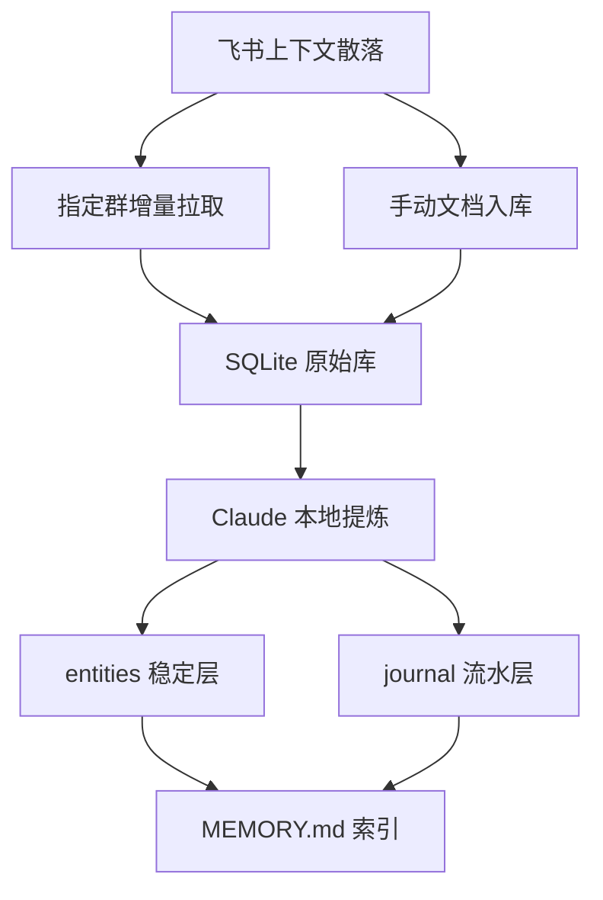
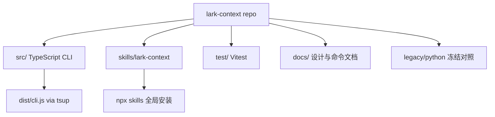

<details>
<summary>相关源文件</summary>

生成本页时使用的主要源文件：

- [README.md](../../../project-repos/lark-context/README.md)
- [GETTING_STARTED.md](../../../project-repos/lark-context/GETTING_STARTED.md)
- [package.json](../../../project-repos/lark-context/package.json)
- [spec.md](../../../project-repos/lark-context/spec.md)
- [skills/lark-context/SKILL.md](../../../project-repos/lark-context/skills/lark-context/SKILL.md)

</details>

# 项目概览

`lark-context` 是一个把飞书群聊和文档持续沉淀到本地的上下文桥。它的核心输出不是网页或远端服务，而是本地 SQLite 原始数据和 `~/.claude/lark-memory/` 下的 Markdown 记忆文件，让 Claude 后续会话能带上长期背景。Sources: [README.md:1-10](../../../project-repos/lark-context/README.md#L1-L10), [README.md:148-175](../../../project-repos/lark-context/README.md#L148-L175)

<details class="source-snippets">
<summary>引用源码</summary>

<!-- source-snippets:start -->

#### `README.md:1-10`

```markdown
# lark-context

把飞书（Lark）群聊和文档**持续沉淀**到本地，按 markdown 暴露给 Claude 使用。Claude 再按需把原始数据提炼成一套**两层记忆文件**，让后续任何对话都能默认带上这些上下文。

- **持续拉取**：指定飞书群的增量消息（经 OAuth 用户身份通过官方 `lark-cli` 读取）
- **手动喂文档**：粘贴飞书文档 URL，工具拉下来入库
- **提炼**：由 **Claude 自己**（通过 skill workflow）完成，工具不调任何外部 LLM API（工作数据不出网）
- **记忆结构**：`entities/`（稳定层：人 / 项目 / 术语 / 决策）+ `journal/`（流水层：按 ISO 周追加要点）
- **分发**：TS CLI 走 bnpm，skill 走 `npx skills`

```

#### `README.md:148-175`

````markdown
## 记忆文件结构

沉淀后的文件（由 Claude 在 `/lark-context 沉淀…` 里维护）：

```
~/.claude/lark-memory/
├── MEMORY.md            # 始终加载的索引
├── entities/            # 稳定层，Claude 做增量 merge（保留手工写的段）
│   ├── people/<slug>.md
│   ├── projects/<slug>.md
│   ├── terms.md
│   └── decisions/<slug>.md
└── journal/             # 按 ISO 周的流水
    └── 2026-W16.md
```

每个实体文件带统一 frontmatter：

```yaml
---
name: 项目 Alpha
type: project | person | decision | terms
updated_at: 2026-04-19
source_hints:
  - chat:project_alpha
  - doc:docxxxxxxxxxxxxxx
---
```
````

<!-- source-snippets:end -->
</details>
## 解决的问题

仓库的原始需求很直接：用户在字节内部大量使用飞书群聊和文档，希望 AI 能持续从飞书获取上下文，自动沉淀长期记忆、短期记忆和 TODO，但只读取指定群聊。Sources: [spec.md:1-7](../../../project-repos/lark-context/spec.md#L1-L7)

<details class="source-snippets">
<summary>引用源码</summary>

<!-- source-snippets:start -->

#### `spec.md:1-7`

```markdown
我在字节跳动上班，我们用飞书办公，平时阅读和写很多飞书文档，以及使用公司内部的平台。
在飞书上，包括私聊和很多群聊。
我现在想让AI帮我开发一个context AI 工具，后续能让我通过claude code或者claude使用这个工具，持续地从我的飞书获取上下文，自动沉淀长期记忆和短期记忆，以及TODO，帮助我更高效地工作。
可使用的工具：
https://github.com/larksuite/cli

因为的账号有很多群聊，需要阅读的群聊是指定的。
```

<!-- source-snippets:end -->
</details>
README 把能力拆成五类：指定群增量拉取、手动喂飞书文档、由 Claude 本地提炼、`entities/` + `journal/` 两层记忆结构，以及通过 TS CLI 和 skill 分发。Sources: [README.md:5-10](../../../project-repos/lark-context/README.md#L5-L10)

<details class="source-snippets">
<summary>引用源码</summary>

<!-- source-snippets:start -->

#### `README.md:5-10`

```markdown
- **持续拉取**：指定飞书群的增量消息（经 OAuth 用户身份通过官方 `lark-cli` 读取）
- **手动喂文档**：粘贴飞书文档 URL，工具拉下来入库
- **提炼**：由 **Claude 自己**（通过 skill workflow）完成，工具不调任何外部 LLM API（工作数据不出网）
- **记忆结构**：`entities/`（稳定层：人 / 项目 / 术语 / 决策）+ `journal/`（流水层：按 ISO 周追加要点）
- **分发**：TS CLI 走 bnpm，skill 走 `npx skills`

```

<!-- source-snippets:end -->
</details>


Sources: [README.md:3-10](../../../project-repos/lark-context/README.md#L3-L10), [README.md:148-175](../../../project-repos/lark-context/README.md#L148-L175), [GETTING_STARTED.md:11-29](../../../project-repos/lark-context/GETTING_STARTED.md#L11-L29)

<details class="source-snippets">
<summary>引用源码</summary>

<!-- source-snippets:start -->

#### `README.md:3-10`

```markdown
把飞书（Lark）群聊和文档**持续沉淀**到本地，按 markdown 暴露给 Claude 使用。Claude 再按需把原始数据提炼成一套**两层记忆文件**，让后续任何对话都能默认带上这些上下文。

- **持续拉取**：指定飞书群的增量消息（经 OAuth 用户身份通过官方 `lark-cli` 读取）
- **手动喂文档**：粘贴飞书文档 URL，工具拉下来入库
- **提炼**：由 **Claude 自己**（通过 skill workflow）完成，工具不调任何外部 LLM API（工作数据不出网）
- **记忆结构**：`entities/`（稳定层：人 / 项目 / 术语 / 决策）+ `journal/`（流水层：按 ISO 周追加要点）
- **分发**：TS CLI 走 bnpm，skill 走 `npx skills`

```

#### `README.md:148-175`

````markdown
## 记忆文件结构

沉淀后的文件（由 Claude 在 `/lark-context 沉淀…` 里维护）：

```
~/.claude/lark-memory/
├── MEMORY.md            # 始终加载的索引
├── entities/            # 稳定层，Claude 做增量 merge（保留手工写的段）
│   ├── people/<slug>.md
│   ├── projects/<slug>.md
│   ├── terms.md
│   └── decisions/<slug>.md
└── journal/             # 按 ISO 周的流水
    └── 2026-W16.md
```

每个实体文件带统一 frontmatter：

```yaml
---
name: 项目 Alpha
type: project | person | decision | terms
updated_at: 2026-04-19
source_hints:
  - chat:project_alpha
  - doc:docxxxxxxxxxxxxxx
---
```
````

#### `GETTING_STARTED.md:11-29`

````markdown
## 怎么工作的

```
你在飞书讨论 / 分享文档
     ↓
lark-context 增量拉到本地 SQLite
     ↓
你说 "/lark-context 沉淀一下"
     ↓
Claude 提炼成 entities（人 / 项目 / 术语 / 决策）+ journal（按周流水）
     ↓
下一个会话自动带上这份记忆
```

三个关键特性：

- **全程不出网**：提炼由 Claude 本地完成，工具本身不调任何外部 LLM API
- **增量拉取**：只拿新消息，不重复拉历史
- **人工可审**：记忆文件是纯 markdown，随便看、随便改
````

<!-- source-snippets:end -->
</details>
## 使用者视角

常规路径是先安装官方 `lark-cli` 并 OAuth 登录，再安装 `@tiktok-fe/lark-context` 和全局 skill，执行 `lark-context init` 初始化配置、SQLite 和记忆目录。之后用户在 Claude 里用自然语言触发 `/lark-context`，由 skill 路由到对应 CLI 或引用工作流。Sources: [README.md:37-67](../../../project-repos/lark-context/README.md#L37-L67), [GETTING_STARTED.md:31-61](../../../project-repos/lark-context/GETTING_STARTED.md#L31-L61), [skills/lark-context/SKILL.md:13-29](../../../project-repos/lark-context/skills/lark-context/SKILL.md#L13-L29)

<details class="source-snippets">
<summary>引用源码</summary>

<!-- source-snippets:start -->

#### `README.md:37-67`

````markdown
## 安装

### 1. 装飞书官方 CLI（若未装）

```bash
bnpm i -g @larksuite/cli
lark-cli auth login            # 浏览器 OAuth 授权
```

### 2. 装本项目的 TS CLI + skill

```bash
bnpm i -g @tiktok-fe/lark-context     # 安装 lark-context 二进制
npx skills add <you>/lark-context -g -y   # 安装 /lark-context skill
```

替换 `<you>` 为实际的 GitHub 用户名 / 组织。

### 3. 初始化

```bash
lark-context init                 # 创建 ~/.lark-context/ + ~/.claude/lark-memory/
```

### 4.（可选）让记忆索引默认加载

```bash
echo '@~/.claude/lark-memory/MEMORY.md' >> ~/.claude/CLAUDE.md
```

这样每个 Claude Code 会话启动时就自动加载 `MEMORY.md` 作为背景知识。
````

#### `GETTING_STARTED.md:31-61`

````markdown
## 30 秒安装（4 步复制粘贴）

### 1. 飞书 CLI + OAuth 登录

```bash
bnpm i -g @larksuite/cli
lark-cli auth login             # 浏览器一次性授权
```

### 2. lark-context CLI

```bash
bnpm i -g @tiktok-fe/lark-context
lark-context init               # 初始化配置 + SQLite
```

### 3. Claude skill

```bash
npx skills add git@code.byted.org:tiktok/lark-context.git -g -y
```

全局装好后，Claude Code / Cursor / Codex / Gemini CLI 等 12 个 agent 都能直接用 `/lark-context`。

### 4. （强烈推荐）让记忆索引默认加载

```bash
echo '@~/.claude/lark-memory/MEMORY.md' >> ~/.claude/CLAUDE.md
```

这样每个 Claude 会话启动时自动带上你的记忆索引。
````

#### `skills/lark-context/SKILL.md:13-29`

````markdown
把飞书群聊和文档**持续沉淀**到本地，由 Claude 按需提炼成长期记忆。**用户通过 `/lark-context <自然语言>` 调用**，本 skill 负责把意图路由到对应 workflow。

## 前置依赖

用户必须已安装两个 CLI：
- `lark-context` ≥ 0.1.0（本项目 CLI，`bnpm i -g @tiktok-fe/lark-context`）
- `lark-cli`（飞书官方 CLI，`bnpm i -g @larksuite/cli` + `lark-cli auth login`）

**版本自检**：在执行任何意图 workflow 前，第一步跑：

```bash
lark-context --version
```

若不达 `0.1.0` 起，提示用户：`bnpm i -g @tiktok-fe/lark-context@latest`，然后中止本次调用。

若 `lark-cli` 未安装或未登录，`lark-context init` / 其他命令会直接报错；**透传**错误 stderr 给用户，**不要**尝试替用户登录（需要浏览器交互）。
````

<!-- source-snippets:end -->
</details>
| 阶段 | 用户动作 | 底层动作 |
|---|---|---|
| 安装 | 装 `@larksuite/cli` 与 `@tiktok-fe/lark-context` | 提供官方飞书访问和本项目二进制 |
| 初始化 | `lark-context init` | 创建配置、目录和 SQLite schema |
| 选群 | `list-groups` 后 `groups add` | 把目标群写入 YAML 白名单和 `chats` 表 |
| 拉取 | `pull --since 3d` | 调 `lark-cli` 拉消息并写入 `messages` |
| 展示 | `show --since 24h` | 从 SQLite 渲染 Markdown |
| 沉淀 | `/lark-context 沉淀一下` | Claude 更新 `journal/`、`entities/`、`MEMORY.md` |

Sources: [README.md:69-118](../../../project-repos/lark-context/README.md#L69-L118), [src/commands/init.ts:27-53](../../../project-repos/lark-context/src/commands/init.ts#L27-L53), [src/commands/groups.ts:31-58](../../../project-repos/lark-context/src/commands/groups.ts#L31-L58), [skills/lark-context/SKILL.md:31-48](../../../project-repos/lark-context/skills/lark-context/SKILL.md#L31-L48)

<details class="source-snippets">
<summary>引用源码</summary>

<!-- source-snippets:start -->

#### `README.md:69-118`

````markdown
## 使用

全流程通过 Claude Code 对话触发，用自然语言就行：

```
You: /lark-context 看看我在哪些飞书群
→ lark-context list-groups

You: /lark-context 把「项目 Alpha 大群」加到关注
→ lark-context groups add oc_xxxxx --alias project_alpha --name "项目 Alpha 大群"

You: /lark-context 拉一下最近 3 天的消息
→ lark-context pull --since 3d

You: (粘贴飞书文档 URL) /lark-context 收下这个文档
→ lark-context ingest-doc <url>

You: /lark-context 沉淀一下
→ skill 走 references/digest.md workflow：读 show 输出 → 更新 ~/.claude/lark-memory/

You: /lark-context 我有啥 TODO
→ skill 走 references/todo.md workflow：从 show 原文 + journal 抽候选

You: 项目 Alpha 最近啥情况？
→ Claude 直接用已加载的记忆回答；必要时再 `lark-context show --chat project_alpha --since 1w`
```

## CLI 命令一览

| 命令 | 作用 |
|---|---|
| `lark-context init` | 初始化配置、目录、SQLite 库；检查 lark-cli 是否可用 |
| `lark-context list-groups [--json]` | 列你所在的全部飞书群（chat_id + 名称 + 描述） |
| `lark-context groups add <chat_id> [--alias X] [--name "Y"]` | 把群加到关注白名单 |
| `lark-context groups list` / `groups rm <alias>` | 查看 / 移除白名单 |
| `lark-context pull [--chat <alias>\|all] [--since 3d] [--thread-window 7d] [--no-threads]` | 拉消息（增量）+ 刷新话题回复；不给 `--chat` 就拉所有 enabled 的群 |
| `lark-context ingest-doc <url-或-token>` | 拉单份飞书文档入库（支持 `/docx/` / `/wiki/` / `/docs/` 等） |
| `lark-context show [--chat <alias>\|all] [--since 24h]` | 输出 markdown：聊天记录 + 新入库文档 |
| `lark-context show-doc <token-或-url>` | 输出某份已入库文档的完整 markdown |

**`--since` 格式**：`24h` / `3d` / `1w` / `90m`。仅作为**首次拉取**的时间下限；后续 `pull` 会从"上次见过的最新消息"继续，忽略 `--since`。skill workflow 默认首次拉新群用 `90d`（见 `skills/lark-context/references/pull.md`）。

**`--chat all`** 等价于省略 `--chat`（遍历所有 enabled 的群）。

**话题回复（thread replies）**：`pull` 在拉完顶层消息后，会扫描"回看窗口"内所有带 `thread_id` 的顶层消息，逐个调用飞书 `im +threads-messages-list` 把话题下的回复（子消息）一并落库。窗口默认：

- 首次 pull 某群：与 effective `--since` 对齐（例如 `--since 180d` 则 thread window 也是 180d；不传默认 90d）
- 续拉：30d（`--since` 被忽略）

显式传 `--thread-window <duration>` 覆盖默认，或用 `--no-threads` 跳过该阶段（只拉顶层）。单个话题拉失败（权限 / 删除）不会 disable 整个群，stderr 打 warning 继续下一个。`show` 会把话题回复按 `  ↳ ` 缩进成组渲染在所属根消息下方。
````

#### `src/commands/init.ts:27-53`

```typescript
export async function runInit(opts: InitOpts = {}): Promise<void> {
  if (opts.checkLarkCli !== false) {
    const check = opts._pathCheck ?? defaultPathCheck;
    if (!(await check())) {
      throw new Error(
        "`lark-cli` binary not found on PATH. Install: `bnpm i -g @larksuite/cli` (or `npm i -g @larksuite/cli`), then `lark-cli auth login`.",
      );
    }
  }
  const cfg = loadConfig({
    configPathOverride: opts.configPathOverride,
    memoryDirOverride: opts.memoryDirOverride,
    rawDirOverride: opts.rawDirOverride,
  });
  mkdirSync(cfg.memoryDir, { recursive: true });
  mkdirSync(cfg.rawDir, { recursive: true });
  if (cfg.configPath && !existsSync(cfg.configPath)) {
    const fresh: Config = {
      memoryDir: cfg.memoryDir,
      rawDir: cfg.rawDir,
      groups: [],
      configPath: cfg.configPath,
    };
    saveConfig(fresh);
  }
  initSchema(join(cfg.rawDir, "raw.db"));
  process.stdout.write(`Initialized lark-context at ${cfg.configPath}\n`);
```

#### `src/commands/groups.ts:31-58`

```typescript
export async function runAdd(opts: AddOpts): Promise<void> {
  const cfg = loadConfig(opts);
  const dbPath = join(cfg.rawDir, "raw.db");
  ensureInitialized(dbPath);
  const name = opts.name ?? "";
  const resolvedAlias = opts.alias ?? slugify(name || opts.chatId);
  if (cfg.groups.some((g) => g.alias === resolvedAlias)) {
    throw new Error(`alias "${resolvedAlias}" already in use`);
  }
  const newGroup: GroupConfig = {
    alias: resolvedAlias,
    chatId: opts.chatId,
    name,
    enabled: true,
  };
  const next: Config = { ...cfg, groups: [...cfg.groups, newGroup] };
  saveConfig(next);
  const db = connect(dbPath);
  try {
    db.prepare(
      "INSERT INTO chats(alias, chat_id, name, enabled) VALUES (?, ?, ?, 1) " +
        "ON CONFLICT(alias) DO UPDATE SET chat_id=excluded.chat_id, name=excluded.name, enabled=1",
    ).run(resolvedAlias, opts.chatId, name);
  } finally {
    db.close();
  }
  process.stdout.write(`added ${resolvedAlias} -> ${opts.chatId}\n`);
}
```

#### `skills/lark-context/SKILL.md:31-48`

```markdown
## 意图路由

根据用户自然语言里的关键词选一条路径。**只路由一次**，不要在 references 之间来回跳。

| 触发关键词 | 意图 | 处理方式 |
|---|---|---|
| 沉淀 / 整理 / 记忆 / digest | **digest** | 读 [`references/digest.md`](references/digest.md) 执行 workflow |
| TODO / 待办 / 有啥事 / 该做啥 | **todo** | 读 [`references/todo.md`](references/todo.md) |
| 拉 / 同步 / pull / 更新 | **pull** | 读 [`references/pull.md`](references/pull.md) |
| 收下 / 入库 / 文档 URL（含 `/docx/` / `/wiki/` / `/docs/` / `/base/` / `/file/`） | **ingest-doc** | 读 [`references/ingest-doc.md`](references/ingest-doc.md) |
| 看看 / 最近聊了 / show | **show** | 读 [`references/show.md`](references/show.md) |
| 哪些群 / 列群 / 所有群 / 当前关注 | **list-groups / groups list** | 直接跑对应 CLI 命令，无需 reference |
| 关注 / 加群 / 取消关注 / alias | **groups add/rm** | 直接跑 CLI，无需 reference |

**意图不明**（用户说了一句模糊的话，比如"嗯嗯"或只贴一段描述）：不要猜。**反问**"你是想沉淀 / 拉消息 / 看 TODO / 看最近消息 / 管理群 中哪一项？"——用户澄清后再路由。

**多意图同时出现**（比如"拉一下最近消息然后沉淀"）：**分两步**——先执行第一个（pull），完成后再执行第二个（digest）。不要试图合并。

```

<!-- source-snippets:end -->
</details>
## 仓库形态

当前主实现是 TypeScript ESM CLI：`package.json` 声明包名 `@tiktok-fe/lark-context`、二进制 `lark-context`、Node `>=18`、构建用 `tsup`、测试用 `vitest`。`legacy/python/` 是 V1 前的冻结实现，用来对照但不再演进。Sources: [package.json:1-18](../../../project-repos/lark-context/package.json#L1-L18), [package.json:20-35](../../../project-repos/lark-context/package.json#L20-L35), [README.md:208-219](../../../project-repos/lark-context/README.md#L208-L219)

<details class="source-snippets">
<summary>引用源码</summary>

<!-- source-snippets:start -->

#### `package.json:1-18`

```json
{
  "name": "@tiktok-fe/lark-context",
  "version": "0.1.0",
  "description": "Feishu context bridge for Claude Code — pull Lark chats + docs into local memory",
  "type": "module",
  "bin": {
    "lark-context": "./dist/cli.js"
  },
  "files": ["dist/*.js"],
  "engines": {
    "node": ">=18"
  },
  "scripts": {
    "build": "tsup",
    "test": "vitest run",
    "test:watch": "vitest",
    "typecheck": "tsc --noEmit",
    "prepublishOnly": "pnpm build && pnpm test"
```

#### `package.json:20-35`

```json
  "dependencies": {
    "better-sqlite3": "^11.0.0",
    "commander": "^12.0.0",
    "execa": "^9.0.0",
    "yaml": "^2.4.0"
  },
  "devDependencies": {
    "@types/better-sqlite3": "^7.6.0",
    "@types/node": "^20.0.0",
    "tsup": "^8.0.0",
    "typescript": "^5.4.0",
    "vitest": "^1.5.0"
  },
  "pnpm": {
    "onlyBuiltDependencies": ["better-sqlite3"]
  }
```

#### `README.md:208-219`

````markdown
## `legacy/python/` 目录

V1 前的 Python 实现（97 文件 ~1850 行），**已冻结**、不再演进，保留作对照：

```bash
cd legacy/python
python3 -m venv .venv && . .venv/bin/activate
pip install -e '.[dev]'
pytest -q        # 应该 59 passed
```

V1 正式发布（`@tiktok-fe/lark-context` ≥ 0.1.0）后，可以删掉这个目录。
````

<!-- source-snippets:end -->
</details>


Sources: [package.json:1-18](../../../project-repos/lark-context/package.json#L1-L18), [tsup.config.ts:1-10](../../../project-repos/lark-context/tsup.config.ts#L1-L10), [README.md:186-219](../../../project-repos/lark-context/README.md#L186-L219)

<details class="source-snippets">
<summary>引用源码</summary>

<!-- source-snippets:start -->

#### `package.json:1-18`

```json
{
  "name": "@tiktok-fe/lark-context",
  "version": "0.1.0",
  "description": "Feishu context bridge for Claude Code — pull Lark chats + docs into local memory",
  "type": "module",
  "bin": {
    "lark-context": "./dist/cli.js"
  },
  "files": ["dist/*.js"],
  "engines": {
    "node": ">=18"
  },
  "scripts": {
    "build": "tsup",
    "test": "vitest run",
    "test:watch": "vitest",
    "typecheck": "tsc --noEmit",
    "prepublishOnly": "pnpm build && pnpm test"
```

#### `tsup.config.ts:1-10`

```typescript
import { defineConfig } from "tsup";

export default defineConfig({
  entry: { cli: "src/cli.ts" },
  format: ["esm"],
  target: "node18",
  clean: true,
  sourcemap: true,
  shims: true,
});
```

#### `README.md:186-219`

````markdown
## 开发

```bash
# 克隆 + 装依赖
git clone https://github.com/<you>/lark-context.git
cd lark-context
pnpm install

# 开发命令
pnpm build               # tsup → dist/cli.js
pnpm test                # vitest run
pnpm test:watch          # vitest dev mode
pnpm typecheck           # tsc --noEmit
```

本地调试 CLI：

```bash
pnpm build && node dist/cli.js --help
# 或 pnpm link --global 把 lark-context 临时塞到 PATH
```

## `legacy/python/` 目录

V1 前的 Python 实现（97 文件 ~1850 行），**已冻结**、不再演进，保留作对照：

```bash
cd legacy/python
python3 -m venv .venv && . .venv/bin/activate
pip install -e '.[dev]'
pytest -q        # 应该 59 passed
```

V1 正式发布（`@tiktok-fe/lark-context` ≥ 0.1.0）后，可以删掉这个目录。
````

<!-- source-snippets:end -->
</details>
## 项目边界

工具本身不调用外部 LLM API；它只通过官方 `lark-cli` 读取飞书数据，并把原始材料落在本地 SQLite。摘要、实体合并和 TODO 判断由 Claude 在 skill workflow 中本地完成。Sources: [README.md:5-8](../../../project-repos/lark-context/README.md#L5-L8), [GETTING_STARTED.md:25-29](../../../project-repos/lark-context/GETTING_STARTED.md#L25-L29), [skills/lark-context/SKILL.md:69-73](../../../project-repos/lark-context/skills/lark-context/SKILL.md#L69-L73)

<details class="source-snippets">
<summary>引用源码</summary>

<!-- source-snippets:start -->

#### `README.md:5-8`

```markdown
- **持续拉取**：指定飞书群的增量消息（经 OAuth 用户身份通过官方 `lark-cli` 读取）
- **手动喂文档**：粘贴飞书文档 URL，工具拉下来入库
- **提炼**：由 **Claude 自己**（通过 skill workflow）完成，工具不调任何外部 LLM API（工作数据不出网）
- **记忆结构**：`entities/`（稳定层：人 / 项目 / 术语 / 决策）+ `journal/`（流水层：按 ISO 周追加要点）
```

#### `GETTING_STARTED.md:25-29`

```markdown
三个关键特性：

- **全程不出网**：提炼由 Claude 本地完成，工具本身不调任何外部 LLM API
- **增量拉取**：只拿新消息，不重复拉历史
- **人工可审**：记忆文件是纯 markdown，随便看、随便改
```

#### `skills/lark-context/SKILL.md:69-73`

```markdown
## 错误处理

- **CLI 非零退出**：透传 stderr 给用户，**不编造解释**。若命中已知场景（lark-cli 未装 / 未 auth / chat 被踢出群），补一句操作建议；否则就是透传
- **`references/` 文件缺失**：说明 skill 装坏了。提示用户：`npx skills update lark-context` 或重新 `npx skills add <repo> -g -y`
- **网络错 / lark-cli 超时**：不自动重试（拉消息幂等但失败通常要手动判断），交给用户处理
```

<!-- source-snippets:end -->
</details>
当前 README 同时记录了 V1 边界：不自动调度、只读指定群聊、文档类型受 `lark-cli` 支持范围限制、工具本身不调 LLM API。README 的“已知限制”里还保留了“不拉回复线程”的旧描述，但当前代码已经实现 `thread_id`、`is_thread_reply` 和话题回复拉取；这说明该限制文本滞后于源码。Sources: [README.md:177-185](../../../project-repos/lark-context/README.md#L177-L185), [src/db.ts:14-28](../../../project-repos/lark-context/src/db.ts#L14-L28), [src/commands/pull.ts:123-145](../../../project-repos/lark-context/src/commands/pull.ts#L123-L145), [src/commands/pull.ts:240-290](../../../project-repos/lark-context/src/commands/pull.ts#L240-L290)

<details class="source-snippets">
<summary>引用源码</summary>

<!-- source-snippets:start -->

#### `README.md:177-185`

```markdown
## 已知限制 / V1 边界

- **不自动调度**：全手动，你在 Claude 对话里触发。cron / hook 在 V2
- **首次 pull 上限 200 页**（约 10k 条消息）：避免一下子拉爆。到上限会在 stderr 提示，再跑 `pull` 可续
- **只读指定群聊**：私聊、@你的消息、多维表格、日历留给 V2
- **文档仅支持新版 `/docx/` 等**：老版 `/docs/` 若被 lark-cli 拒绝（`Unsupported document type: Legacy document`），透传错误
- **不拉回复线程**：只拉主消息流
- **工具不调任何 LLM API**：提炼全部由 Claude Code 完成

```

#### `src/db.ts:14-28`

```typescript
CREATE TABLE IF NOT EXISTS messages (
  id              TEXT PRIMARY KEY,
  chat_alias      TEXT NOT NULL REFERENCES chats(alias),
  sender_id       TEXT,
  sender_name     TEXT,
  msg_type        TEXT,
  content_json    TEXT NOT NULL,
  content_text    TEXT,
  reply_to        TEXT,
  create_time     TEXT NOT NULL,
  thread_id       TEXT,
  is_thread_reply INTEGER NOT NULL DEFAULT 0
);
CREATE INDEX IF NOT EXISTS idx_messages_chat_time
  ON messages(chat_alias, create_time);
```

#### `src/commands/pull.ts:123-145`

```typescript
        // 飞书 `im/chat-messages-list` 在返回父消息时会把 thread replies 直接内嵌在
        // `thread_replies` 数组里。把它们作为 is_thread_reply=1 的行也写进来，避免
        // 依赖第二阶段 `pullThreads` —— 那里只扫 DB 里 thread_id 非空的 root，当时序
        // 错开（父消息首次拉时还没 reply）就会永久漏掉。
        if (Array.isArray(raw.thread_replies)) {
          for (const rep of raw.thread_replies) {
            const repSender = rep.sender ?? {};
            const rr = insMsg.run(
              rep.message_id,
              group.alias,
              repSender.id ?? "",
              repSender.name ?? "",
              rep.msg_type ?? "text",
              JSON.stringify(rep),
              rep.content ?? "",
              null,
              toIso(rep.create_time ?? ""),
              rep.thread_id ?? raw.thread_id ?? null,
              1,
            );
            inserted += rr.changes;
          }
        }
```

#### `src/commands/pull.ts:240-290`

```typescript
async function pullThreads(
  dbPath: string,
  group: GroupConfig,
  windowMs: number,
  now: Date,
): Promise<{ threadsScanned: number; inserted: number }> {
  const cutoff = new Date(now.getTime() - windowMs)
    .toISOString()
    .replace(/\.\d{3}Z$/, "");
  const db = connect(dbPath);
  let threadIds: string[];
  try {
    const rows = db
      .prepare(
        "SELECT DISTINCT thread_id FROM messages " +
          "WHERE chat_alias=? AND thread_id IS NOT NULL " +
          "AND is_thread_reply=0 AND create_time >= ?",
      )
      .all(group.alias, cutoff) as Array<{ thread_id: string }>;
    threadIds = rows.map((r) => r.thread_id);
  } finally {
    db.close();
  }

  let totalInserted = 0;
  for (const threadId of threadIds) {
    try {
      let pageToken: string | null = null;
      for (let page = 1; page <= MAX_PAGES; page++) {
        const { messages, nextToken, hasMore } = await pullThreadsPage(
          threadId,
          pageToken,
        );
        if (messages.length > 0) {
          totalInserted += writeThreadPage(dbPath, group.alias, threadId, messages);
        }
        if (!hasMore || !nextToken || nextToken === pageToken) break;
        pageToken = nextToken;
      }
    } catch (err) {
      if (err instanceof LarkNotFoundError) throw err;
      if (!(err instanceof LarkCLIError)) throw err;
      process.stderr.write(
        `  ${group.alias}: thread ${threadId} failed (${err.message}); skipped\n`,
      );
    }
  }
  process.stderr.write(
    `  ${group.alias}: threads +${threadIds.length} scanned, +${totalInserted} replies inserted\n`,
  );
  return { threadsScanned: threadIds.length, inserted: totalInserted };
```

<!-- source-snippets:end -->
</details>
## 阅读路线

1. 先读 [系统架构](system-architecture.md)，建立从自然语言到 SQLite 和记忆文件的主链路。
2. 再读 [CLI 命令面](cli-command-surface.md)，理解每个子命令的位置。
3. 改拉取行为时重点读 [消息拉取与话题回复流水线](pull-thread-pipeline.md)。
4. 改沉淀策略时重点读 [Skill 与记忆工作流](skill-memory-workflows.md)。

## 相关页面

- [系统架构](system-architecture.md)
- [CLI 命令面](cli-command-surface.md)
- [Skill 与记忆工作流](skill-memory-workflows.md)
