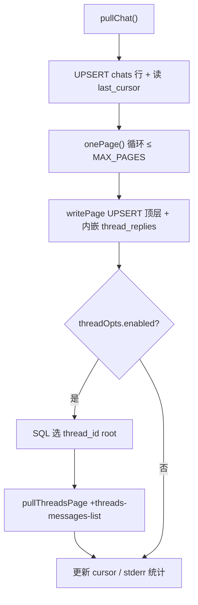

<details>
<summary>相关源文件</summary>

生成本页时使用的主要源文件：

- [src/commands/pull.ts](../../../project-repos/lark-context/src/commands/pull.ts)
- [src/lark.ts](../../../project-repos/lark-context/src/lark.ts)
- [test/cmd-pull.test.ts](../../../project-repos/lark-context/test/cmd-pull.test.ts)

</details>

# 增量拉取与话题回复

`pull` 同时解决两个工程难题：**如何做增量分页**，以及**话题回复如何不因首次拉取时序而丢数据**。它先用 `im +chat-messages-list` 按 asc 排序翻页，再用 `messages.last_cursor` 记录最新 `create_time`；后续运行把 `startIso` 从 `last_cursor` 往回拨一小段（`INCR_PULL_OVERLAP_MS`），强制重拉边界附近的父消息，以便补上**后来才出现**的 `thread_id` / `thread_replies`。



## 200 页上限与续跑

`MAX_PAGES = 200` 硬 cap 首次回填时的分页深度，stderr 提示 `hit MAX_PAGES=200 cap; re-run to continue`——这是刻意的产品约束：避免一次性拖十万条消息把磁盘与用户时间都耗光。

## 两种话题来源

1. **API 随父消息携带 `thread_replies`**：`writePage` 直接把这些子消息以 `is_thread_reply=1` 写入，解决“父消息先来、子回复后来”导致二阶段扫描永远看不到 `thread_id` 的空窗。  
2. **二阶段 `+threads-messages-list`**：对窗口内带 `thread_id` 的 root 再分页抓取，失败单线程写 warning，不中断其它线程。

## 文档漂移提醒

README 尾部仍写「不拉回复线程」，但代码路径明确支持 `thread_replies` 与 `pullThreads`；**以 `src/commands/pull.ts` 与 `src/commands/show.ts` 为准**。

## insight：CLI `--no-threads` 绑定可疑

`registerPull` 的 action 把 `noThreads: opts.threads === false` 传给 `runPull`，而 Commander 对 `--no-threads` 通常暴露 `noThreads` 字段；若未做预设布尔映射，**命令行层面的“跳过二阶段”可能与直接调用 `runPull({ noThreads: true })` 的测试路径不一致**。排查话题行为时优先以单测与服务端日志为准。

Sources: [src/commands/pull.ts:13-170](../../../project-repos/lark-context/src/commands/pull.ts#L13-L170), [src/commands/pull.ts:293-388](../../../project-repos/lark-context/src/commands/pull.ts#L293-L388), [src/commands/pull.ts:443-472](../../../project-repos/lark-context/src/commands/pull.ts#L443-L472)

<details class="source-snippets">
<summary>引用源码</summary>

<!-- source-snippets:start -->

#### `src/commands/pull.ts:13-170`

```typescript
export const MAX_PAGES = 200;

export interface PullOpts extends LoadConfigOptions {
  chatAlias?: string;
  since?: string;
  threadWindow?: string;
  noThreads?: boolean;
  /** Used by tests to stub clock. */
  _now?: () => Date;
}

interface ThreadOpts {
  enabled: boolean;
  overrideWindow: ReturnType<typeof parseDuration> | null;
  firstPullFallback: ReturnType<typeof parseDuration> | null;
}

export function toIso(larkTime: string): string {
  if (!larkTime) return "";
  let iso = larkTime.replace(" ", "T");
  // Count colons *after* the T to decide HH:MM vs HH:MM:SS.
  const timePart = iso.split("T")[1] ?? "";
  if ((timePart.match(/:/g) ?? []).length === 1) {
    iso += ":00";
  }
  return iso;
}

interface PageResult {
  messages: any[];
  nextToken: string | null;
  hasMore: boolean;
}

async function onePage(
  chatId: string,
  pageToken: string | null,
  startIso: string | null,
): Promise<PageResult> {
  const args: string[] = [
    "im",
    "+chat-messages-list",
    "--chat-id",
    chatId,
    "--sort",
    "asc",
    "--page-size",
    "50",
  ];
  if (pageToken) args.push("--page-token", pageToken);
  if (startIso) args.push("--start", startIso);
  const response = (await runJson(args)) as any;
  if (!response || typeof response !== "object") {
    throw new Error(`unexpected lark response: ${JSON.stringify(response)}`);
  }
  const data = response.data ?? {};
  if (!data || typeof data !== "object") {
    return { messages: [], nextToken: null, hasMore: false };
  }
  return {
    messages: Array.isArray(data.messages) ? data.messages : [],
    nextToken: data.page_token ?? null,
    hasMore: Boolean(data.has_more),
  };
}

function writePage(
  dbPath: string,
  group: GroupConfig,
  messages: any[],
  lastSeen: string,
  now: Date,
): { inserted: number; newMax: string } {
  let inserted = 0;
  let maxCt = lastSeen;
  const db = connect(dbPath);
  try {
    const tx = db.transaction(() => {
      // UPSERT 而非 INSERT OR IGNORE：父消息首次入库时 API 可能还没带 thread_id
      // （reply 尚未发生），后续再拉到同一条时应该把新出现的 thread_id 补上。
      // 用 COALESCE 保证：API 端若丢了 thread_id 字段，不会反向覆盖已存的值。
      // content_json 同样更新一下，保留最新内容（包括最新 thread_replies 快照）。
      const insMsg = db.prepare(
        "INSERT INTO messages" +
          "(id, chat_alias, sender_id, sender_name, msg_type," +
          " content_json, content_text, reply_to, create_time," +
          " thread_id, is_thread_reply) " +
          "VALUES (?, ?, ?, ?, ?, ?, ?, ?, ?, ?, ?) " +
          "ON CONFLICT(id) DO UPDATE SET " +
          "thread_id = COALESCE(excluded.thread_id, messages.thread_id), " +
          "content_json = excluded.content_json",
      );
      for (const raw of messages) {
        const sender = raw.sender ?? {};
        const createTimeIso = toIso(raw.create_time ?? "");
        if (createTimeIso > maxCt) maxCt = createTimeIso;
        const r = insMsg.run(
          raw.message_id,
          group.alias,
          sender.id ?? "",
          sender.name ?? "",
          raw.msg_type ?? "text",
          JSON.stringify(raw),
          raw.content ?? "",
          null,
          createTimeIso,
          raw.thread_id ?? null,
          0,
        );
        inserted += r.changes;
        // 飞书 `im/chat-messages-list` 在返回父消息时会把 thread replies 直接内嵌在
        // `thread_replies` 数组里。把它们作为 is_thread_reply=1 的行也写进来，避免
        // 依赖第二阶段 `pullThreads` —— 那里只扫 DB 里 thread_id 非空的 root，当时序
        // 错开（父消息首次拉时还没 reply）就会永久漏掉。
        if (Array.isArray(raw.thread_replies)) {
          for (const rep of raw.thread_replies) {
            const repSender = rep.sender ?? {};
            const rr = insMsg.run(
              rep.message_id,
              group.alias,
... snippet truncated ...
```

#### `src/commands/pull.ts:293-388`

```typescript
async function pullChat(
  dbPath: string,
  group: GroupConfig,
  since: ReturnType<typeof parseDuration> | null,
  threadOpts: ThreadOpts,
  now: Date,
): Promise<number> {
  // Self-heal chats row — handles hand-edited yaml where the user skipped
  // `groups add` and the chats row doesn't exist yet.
  const db = connect(dbPath);
  let lastSeen = "";
  try {
    db.prepare(
      "INSERT INTO chats(alias, chat_id, name, enabled) VALUES (?, ?, ?, 1) " +
        "ON CONFLICT(alias) DO UPDATE SET chat_id=excluded.chat_id, name=excluded.name",
    ).run(group.alias, group.chatId, group.name);
    const row = db
      .prepare("SELECT last_cursor FROM chats WHERE alias=?")
      .get(group.alias) as { last_cursor: string | null } | undefined;
    lastSeen = row?.last_cursor ?? "";
  } finally {
    db.close();
  }

  let startIso: string | null;
  if (lastSeen) {
    // 往前回退 INCR_PULL_OVERLAP_MS，让近期父消息在下一次 pull 时被重拉，以补齐
    // 之后才产生的 thread_id / thread_replies。UPSERT COALESCE 保证不会重复入库。
    const lastSeenMs = Date.parse(
      lastSeen.endsWith("Z") ? lastSeen : `${lastSeen}Z`,
    );
    if (Number.isFinite(lastSeenMs)) {
      const adjusted = new Date(lastSeenMs - INCR_PULL_OVERLAP_MS);
      startIso = adjusted.toISOString().replace(/\.\d{3}Z$/, "");
    } else {
      startIso = lastSeen;
    }
  } else if (since) {
    const startMs = now.getTime() - since.totalMs;
    // seconds-precision ISO without fractional/timezone markers, matching Python
    // `datetime.strftime("%Y-%m-%dT%H:%M:%S")`.
    startIso = new Date(startMs).toISOString().replace(/\.\d{3}Z$/, "");
  } else {
    startIso = null;
  }

  let totalInserted = 0;
  let pageToken: string | null = null;
  let maxCreateTime = lastSeen;
  let pageNum = 0;
  let hitCap = true;

  for (pageNum = 1; pageNum <= MAX_PAGES; pageNum++) {
    const { messages, nextToken, hasMore } = await onePage(
      group.chatId,
      pageToken,
      pageNum === 1 ? startIso : null,
    );
    if (messages.length > 0) {
      const { inserted, newMax } = writePage(
        dbPath,
        group,
        messages,
        maxCreateTime,
        now,
      );
      maxCreateTime = newMax;
      totalInserted += inserted;
      process.stderr.write(
        `  ${group.alias}: page ${pageNum} +${inserted} (cumulative ${totalInserted})\n`,
      );
    }
    if (!hasMore || nextToken === null || nextToken === pageToken) {
      hitCap = false;
      break;
    }
    pageToken = nextToken;
  }
  if (hitCap) {
    process.stderr.write(
      `  ${group.alias}: hit MAX_PAGES=${MAX_PAGES} cap; re-run to continue\n`,
    );
  }

  if (threadOpts.enabled) {
    const isFirstPull = !lastSeen;
    const windowMs = threadOpts.overrideWindow
      ? threadOpts.overrideWindow.totalMs
      : isFirstPull
        ? (threadOpts.firstPullFallback?.totalMs ?? DEFAULT_THREAD_WINDOW_FIRST_MS)
        : DEFAULT_THREAD_WINDOW_INCR_MS;
    const threadRes = await pullThreads(dbPath, group, windowMs, now);
    totalInserted += threadRes.inserted;
  }

  return totalInserted;
```

#### `src/commands/pull.ts:443-472`

```typescript
export function registerPull(program: Command): void {
  program
    .command("pull")
    .description("Incrementally pull messages for one or all whitelisted chats")
    .option(
      "--chat <alias>",
      'Alias to pull; omit (or "all") for all enabled groups',
    )
    .option(
      "--since <duration>",
      "First-pull lower bound (e.g. 3d, 24h). Ignored on later runs.",
    )
    .option(
      "--thread-window <duration>",
      "Lookback window for thread-reply refresh. Default: matches --since on first pull, 30d on incremental pulls.",
    )
    .option("--no-threads", "Skip thread-reply refresh (phase 2)")
    .action(async (opts) => {
      try {
        await runPull({
          chatAlias: opts.chat,
          since: opts.since,
          threadWindow: opts.threadWindow,
          noThreads: opts.threads === false,
        });
      } catch (err) {
        process.stderr.write(`${(err as Error).message}\n`);
        process.exit(1);
      }
    });
```

<!-- source-snippets:end -->
</details>
## 相关页面

- [SQLite 数据模型](sqlite-data-model.md) — 表结构与索引  
- [CLI 命令参考](cli-commands.md) — flag 语义  
- [文档入库与展示](docs-ingest-show.md) — `show` 如何排版话题  
