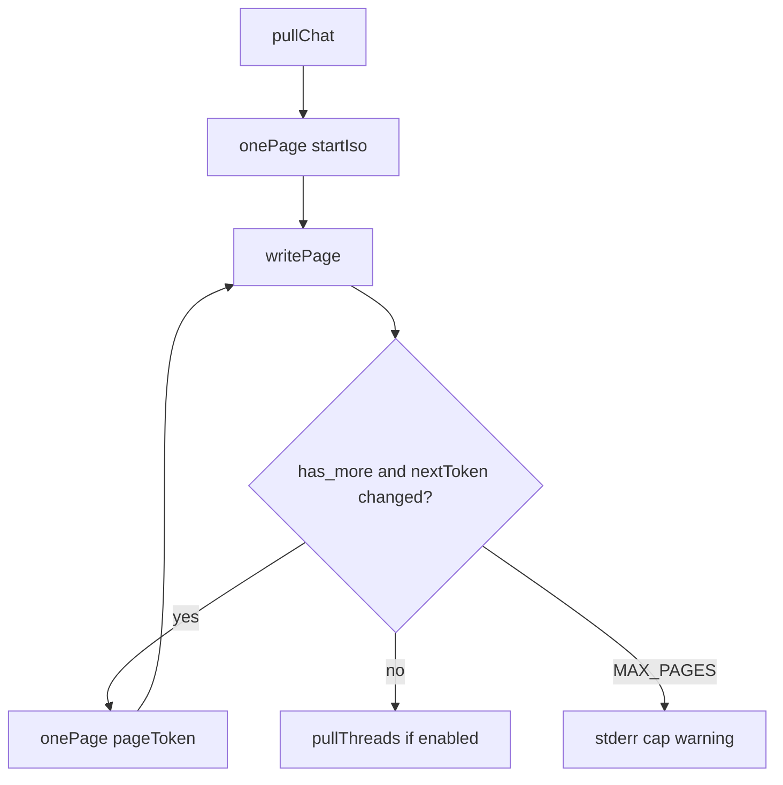
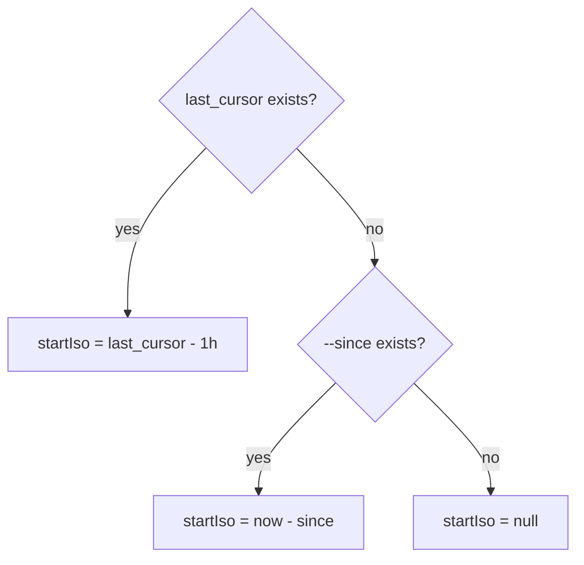
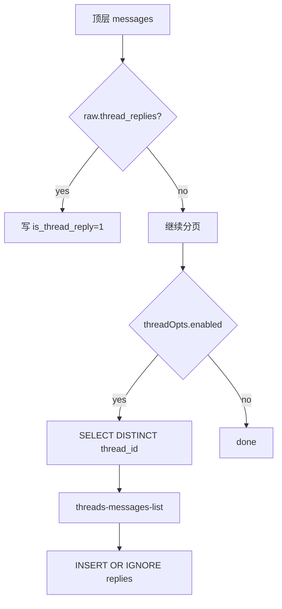

<details>
<summary>相关源文件</summary>

生成本页时使用的主要源文件：

- [src/commands/pull.ts](../../../project-repos/lark-context/src/commands/pull.ts)
- [src/db.ts](../../../project-repos/lark-context/src/db.ts)
- [src/durations.ts](../../../project-repos/lark-context/src/durations.ts)
- [README.md](../../../project-repos/lark-context/README.md)
- [skills/lark-context/references/pull.md](../../../project-repos/lark-context/skills/lark-context/references/pull.md)
- [test/cmd-pull.test.ts](../../../project-repos/lark-context/test/cmd-pull.test.ts)

</details>

# 消息拉取与话题回复流水线

`pull` 是仓库最核心的数据入口。它按群遍历白名单，通过 `lark-cli im +chat-messages-list` 拉顶层消息，写入 SQLite，再根据 `thread_id` 刷新话题回复。实现重点是增量游标、分页上限、幂等 upsert、回复补齐和单群失败隔离。Sources: [src/commands/pull.ts:13-22](../../../project-repos/lark-context/src/commands/pull.ts#L13-L22), [src/commands/pull.ts:401-440](../../../project-repos/lark-context/src/commands/pull.ts#L401-L440)

<details class="source-snippets">
<summary>引用源码</summary>

<!-- source-snippets:start -->

#### `src/commands/pull.ts:13-22`

```typescript
export const MAX_PAGES = 200;

export interface PullOpts extends LoadConfigOptions {
  chatAlias?: string;
  since?: string;
  threadWindow?: string;
  noThreads?: boolean;
  /** Used by tests to stub clock. */
  _now?: () => Date;
}
```

#### `src/commands/pull.ts:401-440`

```typescript
export async function runPull(opts: PullOpts): Promise<number> {
  const cfg: Config = loadConfig(opts);
  const dbPath = join(cfg.rawDir, "raw.db");
  ensureInitialized(dbPath);
  const sinceParsed = opts.since ? parseDuration(opts.since) : null;
  const threadWindowParsed = opts.threadWindow
    ? parseDuration(opts.threadWindow)
    : null;
  const threadOpts: ThreadOpts = {
    enabled: !opts.noThreads,
    overrideWindow: threadWindowParsed,
    firstPullFallback: sinceParsed,
  };
  const effectiveAlias =
    opts.chatAlias === "all" || !opts.chatAlias ? null : opts.chatAlias;
  const targets = cfg.groups.filter(
    (g) => g.enabled && (!effectiveAlias || g.alias === effectiveAlias),
  );
  if (effectiveAlias && targets.length === 0) {
    throw new Error(`unknown chat alias "${opts.chatAlias}"`);
  }
  const now = (opts._now ?? (() => new Date()))();

  let grand = 0;
  for (const g of targets) {
    try {
      const n = await pullChat(dbPath, g, sinceParsed, threadOpts, now);
      process.stdout.write(`${g.alias}: pulled ${n} messages\n`);
      grand += n;
    } catch (err) {
      if (err instanceof LarkNotFoundError) throw err;
      if (err instanceof LarkCLIError) {
        disableChat(dbPath, g.alias, err.message);
        continue;
      }
      throw err;
    }
  }
  process.stdout.write(`done, total=${grand}\n`);
  return grand;
```

<!-- source-snippets:end -->
</details>
## 顶层消息分页

`onePage` 固定按 asc 排序、每页 50 条；第一页可带 `--start`，后续页靠 `--page-token`。返回值规范化成 `messages`、`nextToken`、`hasMore`。Sources: [src/commands/pull.ts:41-77](../../../project-repos/lark-context/src/commands/pull.ts#L41-L77)

<details class="source-snippets">
<summary>引用源码</summary>

<!-- source-snippets:start -->

#### `src/commands/pull.ts:41-77`

```typescript
interface PageResult {
  messages: any[];
  nextToken: string | null;
  hasMore: boolean;
}

async function onePage(
  chatId: string,
  pageToken: string | null,
  startIso: string | null,
): Promise<PageResult> {
  const args: string[] = [
    "im",
    "+chat-messages-list",
    "--chat-id",
    chatId,
    "--sort",
    "asc",
    "--page-size",
    "50",
  ];
  if (pageToken) args.push("--page-token", pageToken);
  if (startIso) args.push("--start", startIso);
  const response = (await runJson(args)) as any;
  if (!response || typeof response !== "object") {
    throw new Error(`unexpected lark response: ${JSON.stringify(response)}`);
  }
  const data = response.data ?? {};
  if (!data || typeof data !== "object") {
    return { messages: [], nextToken: null, hasMore: false };
  }
  return {
    messages: Array.isArray(data.messages) ? data.messages : [],
    nextToken: data.page_token ?? null,
    hasMore: Boolean(data.has_more),
  };
}
```

<!-- source-snippets:end -->
</details>


Sources: [src/commands/pull.ts:345-386](../../../project-repos/lark-context/src/commands/pull.ts#L345-L386), [skills/lark-context/references/pull.md:28-36](../../../project-repos/lark-context/skills/lark-context/references/pull.md#L28-L36)

<details class="source-snippets">
<summary>引用源码</summary>

<!-- source-snippets:start -->

#### `src/commands/pull.ts:345-386`

```typescript
  for (pageNum = 1; pageNum <= MAX_PAGES; pageNum++) {
    const { messages, nextToken, hasMore } = await onePage(
      group.chatId,
      pageToken,
      pageNum === 1 ? startIso : null,
    );
    if (messages.length > 0) {
      const { inserted, newMax } = writePage(
        dbPath,
        group,
        messages,
        maxCreateTime,
        now,
      );
      maxCreateTime = newMax;
      totalInserted += inserted;
      process.stderr.write(
        `  ${group.alias}: page ${pageNum} +${inserted} (cumulative ${totalInserted})\n`,
      );
    }
    if (!hasMore || nextToken === null || nextToken === pageToken) {
      hitCap = false;
      break;
    }
    pageToken = nextToken;
  }
  if (hitCap) {
    process.stderr.write(
      `  ${group.alias}: hit MAX_PAGES=${MAX_PAGES} cap; re-run to continue\n`,
    );
  }

  if (threadOpts.enabled) {
    const isFirstPull = !lastSeen;
    const windowMs = threadOpts.overrideWindow
      ? threadOpts.overrideWindow.totalMs
      : isFirstPull
        ? (threadOpts.firstPullFallback?.totalMs ?? DEFAULT_THREAD_WINDOW_FIRST_MS)
        : DEFAULT_THREAD_WINDOW_INCR_MS;
    const threadRes = await pullThreads(dbPath, group, windowMs, now);
    totalInserted += threadRes.inserted;
  }
```

#### `skills/lark-context/references/pull.md:28-36`

````markdown
## 200 页上限

首次拉历史消息每群最多 200 页（约 10k 条）。到上限后 stderr 有：

```
<alias>: hit MAX_PAGES=200 cap; re-run to continue
```

把这条原样转述给用户，**并建议**再跑一次 `lark-context pull --chat <alias>` 续拉。
````

<!-- source-snippets:end -->
</details>
## 首次拉取与续拉

当 `chats.last_cursor` 存在时，`pullChat` 不再使用用户传入的 `--since`，而是从 last_cursor 往前回退 1 小时作为重叠窗口，避免错过稍后才出现的 `thread_id` 或 `thread_replies`。首次拉取没有 last_cursor 时，才使用 `--since` 计算 startIso；如果也没有 `--since`，则不带 start。Sources: [src/commands/pull.ts:317-337](../../../project-repos/lark-context/src/commands/pull.ts#L317-L337), [src/commands/pull.ts:164-169](../../../project-repos/lark-context/src/commands/pull.ts#L164-L169)

<details class="source-snippets">
<summary>引用源码</summary>

<!-- source-snippets:start -->

#### `src/commands/pull.ts:317-337`

```typescript
  let startIso: string | null;
  if (lastSeen) {
    // 往前回退 INCR_PULL_OVERLAP_MS，让近期父消息在下一次 pull 时被重拉，以补齐
    // 之后才产生的 thread_id / thread_replies。UPSERT COALESCE 保证不会重复入库。
    const lastSeenMs = Date.parse(
      lastSeen.endsWith("Z") ? lastSeen : `${lastSeen}Z`,
    );
    if (Number.isFinite(lastSeenMs)) {
      const adjusted = new Date(lastSeenMs - INCR_PULL_OVERLAP_MS);
      startIso = adjusted.toISOString().replace(/\.\d{3}Z$/, "");
    } else {
      startIso = lastSeen;
    }
  } else if (since) {
    const startMs = now.getTime() - since.totalMs;
    // seconds-precision ISO without fractional/timezone markers, matching Python
    // `datetime.strftime("%Y-%m-%dT%H:%M:%S")`.
    startIso = new Date(startMs).toISOString().replace(/\.\d{3}Z$/, "");
  } else {
    startIso = null;
  }
```

#### `src/commands/pull.ts:164-169`

```typescript
const DEFAULT_THREAD_WINDOW_FIRST_MS = 90 * 24 * 60 * 60 * 1000;
const DEFAULT_THREAD_WINDOW_INCR_MS = 30 * 24 * 60 * 60 * 1000;
// 增量 pull 时，把 startIso 往回拉一段，让最近的父消息被重新拉取。否则某条消息
// 首次拉到时 API 还没附 thread_id，reply 稍后才产生，下一次 pull 的 startIso=lastSeen
// 会直接跳过它，这条 thread 的 root 永远补不上 thread_id，阶段二也就扫不到。
const INCR_PULL_OVERLAP_MS = 60 * 60 * 1000;
```

<!-- source-snippets:end -->
</details>
测试覆盖了续拉 startIso 早于 last_cursor 但不早太多，也覆盖首次 pull 不应用重叠窗口。Sources: [test/cmd-pull.test.ts:504-559](../../../project-repos/lark-context/test/cmd-pull.test.ts#L504-L559)

<details class="source-snippets">
<summary>引用源码</summary>

<!-- source-snippets:start -->

#### `test/cmd-pull.test.ts:504-559`

```typescript
describe("runPull — re-pull overlap window", () => {
  it("startIso on incremental pull is shifted before last_cursor to catch late thread_id updates", async () => {
    await setup();

    // 把 last_cursor 设成一个具体时刻
    const cfg = loadConfig();
    const dbSetup = connect(join(cfg.rawDir, "raw.db"));
    try {
      dbSetup
        .prepare("UPDATE chats SET last_cursor='2026-04-20T17:45:00' WHERE alias='alpha'")
        .run();
    } finally {
      dbSetup.close();
    }

    let seenStart: string | null = null;
    mockRunJson.mockImplementation(async (args: string[]) => {
      if (args.includes("+chat-messages-list")) {
        const idx = args.indexOf("--start");
        seenStart = idx >= 0 ? args[idx + 1] : null;
        return { ok: true, data: { has_more: false, messages: [] } };
      }
      if (args.includes("+threads-messages-list")) {
        return { ok: true, data: { has_more: false, messages: [] } };
      }
      throw new Error(`unexpected: ${args.join(" ")}`);
    });

    await runPull({ chatAlias: "alpha" });

    expect(seenStart).not.toBeNull();
    // 应该早于 last_cursor（重叠窗口）
    expect(seenStart! < "2026-04-20T17:45:00").toBe(true);
    // 但不应早于 last_cursor 太久——默认重叠窗口 1h 就够了
    expect(seenStart! >= "2026-04-20T16:00:00").toBe(true);
  });

  it("first pull (no last_cursor) does NOT apply overlap window (falls back to --since)", async () => {
    await setup();

    let seenStart: string | null = null;
    const fixedNow = new Date("2026-04-20T18:00:00Z");
    mockRunJson.mockImplementation(async (args: string[]) => {
      if (args.includes("+chat-messages-list")) {
        const idx = args.indexOf("--start");
        seenStart = idx >= 0 ? args[idx + 1] : null;
        return { ok: true, data: { has_more: false, messages: [] } };
      }
      throw new Error(`unexpected: ${args.join(" ")}`);
    });

    await runPull({ chatAlias: "alpha", since: "24h", _now: () => fixedNow });

    // 首次 pull，startIso = now - 24h，不应被重叠窗口再往前推
    expect(seenStart).toBe("2026-04-19T18:00:00");
  });
```

<!-- source-snippets:end -->
</details>


Sources: [src/commands/pull.ts:317-337](../../../project-repos/lark-context/src/commands/pull.ts#L317-L337)

<details class="source-snippets">
<summary>引用源码</summary>

<!-- source-snippets:start -->

#### `src/commands/pull.ts:317-337`

```typescript
  let startIso: string | null;
  if (lastSeen) {
    // 往前回退 INCR_PULL_OVERLAP_MS，让近期父消息在下一次 pull 时被重拉，以补齐
    // 之后才产生的 thread_id / thread_replies。UPSERT COALESCE 保证不会重复入库。
    const lastSeenMs = Date.parse(
      lastSeen.endsWith("Z") ? lastSeen : `${lastSeen}Z`,
    );
    if (Number.isFinite(lastSeenMs)) {
      const adjusted = new Date(lastSeenMs - INCR_PULL_OVERLAP_MS);
      startIso = adjusted.toISOString().replace(/\.\d{3}Z$/, "");
    } else {
      startIso = lastSeen;
    }
  } else if (since) {
    const startMs = now.getTime() - since.totalMs;
    // seconds-precision ISO without fractional/timezone markers, matching Python
    // `datetime.strftime("%Y-%m-%dT%H:%M:%S")`.
    startIso = new Date(startMs).toISOString().replace(/\.\d{3}Z$/, "");
  } else {
    startIso = null;
  }
```

<!-- source-snippets:end -->
</details>
## 写入幂等性

`writePage` 使用 `INSERT ... ON CONFLICT(id) DO UPDATE`。更新时只用 `COALESCE(excluded.thread_id, messages.thread_id)` 补 `thread_id`，不会用空值覆盖已有值；同时更新 `content_json` 保留最新原始内容。Sources: [src/commands/pull.ts:79-122](../../../project-repos/lark-context/src/commands/pull.ts#L79-L122)

<details class="source-snippets">
<summary>引用源码</summary>

<!-- source-snippets:start -->

#### `src/commands/pull.ts:79-122`

```typescript
function writePage(
  dbPath: string,
  group: GroupConfig,
  messages: any[],
  lastSeen: string,
  now: Date,
): { inserted: number; newMax: string } {
  let inserted = 0;
  let maxCt = lastSeen;
  const db = connect(dbPath);
  try {
    const tx = db.transaction(() => {
      // UPSERT 而非 INSERT OR IGNORE：父消息首次入库时 API 可能还没带 thread_id
      // （reply 尚未发生），后续再拉到同一条时应该把新出现的 thread_id 补上。
      // 用 COALESCE 保证：API 端若丢了 thread_id 字段，不会反向覆盖已存的值。
      // content_json 同样更新一下，保留最新内容（包括最新 thread_replies 快照）。
      const insMsg = db.prepare(
        "INSERT INTO messages" +
          "(id, chat_alias, sender_id, sender_name, msg_type," +
          " content_json, content_text, reply_to, create_time," +
          " thread_id, is_thread_reply) " +
          "VALUES (?, ?, ?, ?, ?, ?, ?, ?, ?, ?, ?) " +
          "ON CONFLICT(id) DO UPDATE SET " +
          "thread_id = COALESCE(excluded.thread_id, messages.thread_id), " +
          "content_json = excluded.content_json",
      );
      for (const raw of messages) {
        const sender = raw.sender ?? {};
        const createTimeIso = toIso(raw.create_time ?? "");
        if (createTimeIso > maxCt) maxCt = createTimeIso;
        const r = insMsg.run(
          raw.message_id,
          group.alias,
          sender.id ?? "",
          sender.name ?? "",
          raw.msg_type ?? "text",
          JSON.stringify(raw),
          raw.content ?? "",
          null,
          createTimeIso,
          raw.thread_id ?? null,
          0,
        );
        inserted += r.changes;
```

<!-- source-snippets:end -->
</details>
测试覆盖了第二次无新消息不会重复、后续 pull 能给既有父消息补 `thread_id`，也不会用 null 覆盖已有 `thread_id`。Sources: [test/cmd-pull.test.ts:163-197](../../../project-repos/lark-context/test/cmd-pull.test.ts#L163-L197), [test/cmd-pull.test.ts:562-647](../../../project-repos/lark-context/test/cmd-pull.test.ts#L562-L647), [test/cmd-pull.test.ts:649-702](../../../project-repos/lark-context/test/cmd-pull.test.ts#L649-L702)

<details class="source-snippets">
<summary>引用源码</summary>

<!-- source-snippets:start -->

#### `test/cmd-pull.test.ts:163-197`

```typescript
  it("second run with no new messages is idempotent (no duplicates)", async () => {
    await setup();
    mockRunJson.mockImplementation(async (args: string[]) => {
      if (args.includes("+chat-messages-list")) {
        const token = args.indexOf("--page-token");
        if (token === -1) return loadFixture("lark_messages_page1.json");
        return loadFixture("lark_messages_page2.json");
      }
      if (args.includes("+threads-messages-list")) {
        return { ok: true, data: { has_more: false, messages: [] } };
      }
      throw new Error(`unexpected: ${args.join(" ")}`);
    });
    await runPull({ chatAlias: "alpha" });

    mockRunJson.mockImplementation(async (args: string[]) => {
      if (args.includes("+chat-messages-list")) {
        return { ok: true, data: { has_more: false, page_token: null, messages: [] } };
      }
      if (args.includes("+threads-messages-list")) {
        return { ok: true, data: { has_more: false, messages: [] } };
      }
      throw new Error(`unexpected: ${args.join(" ")}`);
    });
    await runPull({ chatAlias: "alpha" });

    const cfg = loadConfig();
    const db = connect(join(cfg.rawDir, "raw.db"));
    try {
      const count = (db.prepare("SELECT COUNT(*) AS c FROM messages").get() as any).c;
      expect(count).toBe(3);
    } finally {
      db.close();
    }
  });
```

#### `test/cmd-pull.test.ts:562-647`

```typescript
describe("runPull — upsert thread_id on re-pull", () => {
  it("updates thread_id on an existing row when subsequent pull returns it", async () => {
    await setup();

    // 首次 pull：父消息没有 thread_id（此时还没 reply）
    mockRunJson.mockImplementation(async (args: string[]) => {
      if (args.includes("+chat-messages-list")) {
        return {
          ok: true,
          data: {
            has_more: false,
            page_token: null,
            messages: [
              {
                message_id: "parent_upsert",
                msg_type: "text",
                content: "父消息",
                create_time: "2026-04-18 09:00",
                sender: { id: "ou_a", name: "A", sender_type: "user" },
              },
            ],
          },
        };
      }
      if (args.includes("+threads-messages-list")) {
        return { ok: true, data: { has_more: false, messages: [] } };
      }
      throw new Error(`unexpected: ${args.join(" ")}`);
    });

    await runPull({ chatAlias: "alpha" });

    const cfg = loadConfig();
    const db1 = connect(join(cfg.rawDir, "raw.db"));
    try {
      const row = db1
        .prepare("SELECT thread_id FROM messages WHERE id='parent_upsert'")
        .get();
      expect(row).toEqual({ thread_id: null });
      // 把 cursor 回退到父消息 create_time 之前，让第二次 pull 再次取到它
      db1
        .prepare("UPDATE chats SET last_cursor='2026-04-18T08:59:00' WHERE alias='alpha'")
        .run();
    } finally {
      db1.close();
    }

    // 第二次 pull：API 现在返回带 thread_id 的同一条 parent
    mockRunJson.mockImplementation(async (args: string[]) => {
      if (args.includes("+chat-messages-list")) {
        return {
          ok: true,
          data: {
            has_more: false,
            page_token: null,
            messages: [
              {
                message_id: "parent_upsert",
                msg_type: "text",
                content: "父消息",
                create_time: "2026-04-18 09:00",
                thread_id: "omt_upsert",
                sender: { id: "ou_a", name: "A", sender_type: "user" },
              },
            ],
          },
        };
      }
      if (args.includes("+threads-messages-list")) {
        return { ok: true, data: { has_more: false, messages: [] } };
      }
      throw new Error(`unexpected: ${args.join(" ")}`);
    });

    await runPull({ chatAlias: "alpha" });

    const db2 = connect(join(cfg.rawDir, "raw.db"));
    try {
      const row = db2
        .prepare("SELECT thread_id FROM messages WHERE id='parent_upsert'")
        .get();
      expect(row).toEqual({ thread_id: "omt_upsert" });
    } finally {
      db2.close();
    }
  });
```

#### `test/cmd-pull.test.ts:649-702`

```typescript
  it("does not clobber an existing thread_id with null on re-pull", async () => {
    await setup();
    const cfg = loadConfig();
    const db = connect(join(cfg.rawDir, "raw.db"));
    try {
      db
        .prepare(
          "INSERT INTO messages(id, chat_alias, content_json, create_time, thread_id, is_thread_reply) " +
            "VALUES ('had_thread','alpha','{}','2026-04-18T09:00:00','omt_keep',0)",
        )
        .run();
      db.prepare("UPDATE chats SET last_cursor='2026-04-18T08:59:00' WHERE alias='alpha'").run();
    } finally {
      db.close();
    }

    // API 现在返回不含 thread_id 的同一条（API 端丢字段也不能反向覆盖）
    mockRunJson.mockImplementation(async (args: string[]) => {
      if (args.includes("+chat-messages-list")) {
        return {
          ok: true,
          data: {
            has_more: false,
            page_token: null,
            messages: [
              {
                message_id: "had_thread",
                msg_type: "text",
                content: "x",
                create_time: "2026-04-18 09:00",
                sender: { id: "ou_a", name: "A", sender_type: "user" },
              },
            ],
          },
        };
      }
      if (args.includes("+threads-messages-list")) {
        return { ok: true, data: { has_more: false, messages: [] } };
      }
      throw new Error(`unexpected: ${args.join(" ")}`);
    });

    await runPull({ chatAlias: "alpha" });

    const db2 = connect(join(cfg.rawDir, "raw.db"));
    try {
      const row = db2
        .prepare("SELECT thread_id FROM messages WHERE id='had_thread'")
        .get();
      expect(row).toEqual({ thread_id: "omt_keep" });
    } finally {
      db2.close();
    }
  });
```

<!-- source-snippets:end -->
</details>
## 嵌套回复与二阶段回复

飞书顶层消息返回中可能包含 `thread_replies` 数组。`writePage` 会把这些内嵌回复直接写成 `is_thread_reply=1`，即使用户设置 `--no-threads` 跳过第二阶段，也不会丢掉响应中已经带回来的回复。Sources: [src/commands/pull.ts:123-145](../../../project-repos/lark-context/src/commands/pull.ts#L123-L145), [test/cmd-pull.test.ts:308-448](../../../project-repos/lark-context/test/cmd-pull.test.ts#L308-L448)

<details class="source-snippets">
<summary>引用源码</summary>

<!-- source-snippets:start -->

#### `src/commands/pull.ts:123-145`

```typescript
        // 飞书 `im/chat-messages-list` 在返回父消息时会把 thread replies 直接内嵌在
        // `thread_replies` 数组里。把它们作为 is_thread_reply=1 的行也写进来，避免
        // 依赖第二阶段 `pullThreads` —— 那里只扫 DB 里 thread_id 非空的 root，当时序
        // 错开（父消息首次拉时还没 reply）就会永久漏掉。
        if (Array.isArray(raw.thread_replies)) {
          for (const rep of raw.thread_replies) {
            const repSender = rep.sender ?? {};
            const rr = insMsg.run(
              rep.message_id,
              group.alias,
              repSender.id ?? "",
              repSender.name ?? "",
              rep.msg_type ?? "text",
              JSON.stringify(rep),
              rep.content ?? "",
              null,
              toIso(rep.create_time ?? ""),
              rep.thread_id ?? raw.thread_id ?? null,
              1,
            );
            inserted += rr.changes;
          }
        }
```

#### `test/cmd-pull.test.ts:308-448`

```typescript
describe("runPull — embedded thread_replies (phase 1)", () => {
  it("writes thread_replies nested inside a parent message as is_thread_reply=1", async () => {
    await setup();
    mockRunJson.mockImplementation(async (args: string[]) => {
      if (args.includes("+chat-messages-list")) {
        return {
          ok: true,
          data: {
            has_more: false,
            page_token: null,
            messages: [
              {
                message_id: "parent1",
                msg_type: "merge_forward",
                content: "父消息内容",
                create_time: "2026-04-20 16:54",
                thread_id: "omt_embed",
                sender: { id: "ou_a", name: "唐文城", sender_type: "user" },
                thread_replies: [
                  {
                    message_id: "reply_a",
                    msg_type: "text",
                    content: "嵌在父消息里的回复 1",
                    create_time: "2026-04-20 17:00",
                    thread_id: "omt_embed",
                    sender: { id: "ou_b", name: "沈志杰", sender_type: "user" },
                  },
                  {
                    message_id: "reply_b",
                    msg_type: "text",
                    content: "嵌在父消息里的回复 2",
                    create_time: "2026-04-20 17:04",
                    thread_id: "omt_embed",
                    sender: { id: "ou_a", name: "唐文城", sender_type: "user" },
                  },
                ],
              },
            ],
          },
        };
      }
      if (args.includes("+threads-messages-list")) {
        return { ok: true, data: { has_more: false, messages: [] } };
      }
      throw new Error(`unexpected: ${args.join(" ")}`);
    });

    await runPull({ chatAlias: "alpha" });

    const cfg = loadConfig();
    const db = connect(join(cfg.rawDir, "raw.db"));
    try {
      const rows = db
        .prepare(
          "SELECT id, thread_id, is_thread_reply, sender_name, content_text " +
            "FROM messages ORDER BY create_time",
        )
        .all();
      expect(rows).toEqual([
        {
          id: "parent1",
          thread_id: "omt_embed",
          is_thread_reply: 0,
          sender_name: "唐文城",
          content_text: "父消息内容",
        },
        {
          id: "reply_a",
          thread_id: "omt_embed",
          is_thread_reply: 1,
          sender_name: "沈志杰",
          content_text: "嵌在父消息里的回复 1",
        },
        {
          id: "reply_b",
          thread_id: "omt_embed",
          is_thread_reply: 1,
          sender_name: "唐文城",
          content_text: "嵌在父消息里的回复 2",
        },
      ]);
    } finally {
      db.close();
    }
  });

  it("embedded thread_replies are written even when --no-threads is set", async () => {
    await setup();
    const seenApis: string[] = [];
    mockRunJson.mockImplementation(async (args: string[]) => {
      const apiFlag = args.find((a) => a.startsWith("+")) ?? "";
      seenApis.push(apiFlag);
      if (apiFlag === "+chat-messages-list") {
        return {
          ok: true,
          data: {
            has_more: false,
            page_token: null,
            messages: [
              {
                message_id: "p1",
                msg_type: "text",
                content: "父",
                create_time: "2026-04-18 10:00",
                thread_id: "omt_x",
                sender: { id: "ou_a", name: "A", sender_type: "user" },
                thread_replies: [
                  {
                    message_id: "r1",
                    msg_type: "text",
                    content: "嵌套 reply",
                    create_time: "2026-04-18 10:05",
                    thread_id: "omt_x",
                    sender: { id: "ou_b", name: "B", sender_type: "user" },
                  },
                ],
              },
            ],
          },
        };
... snippet truncated ...
```

<!-- source-snippets:end -->
</details>
第二阶段 `pullThreads` 会从 DB 中扫描窗口内、非回复、带 `thread_id` 的顶层消息，然后逐个调用 `im +threads-messages-list` 拉完整回复，并使用 `INSERT OR IGNORE` 避免重复。Sources: [src/commands/pull.ts:171-238](../../../project-repos/lark-context/src/commands/pull.ts#L171-L238), [src/commands/pull.ts:240-290](../../../project-repos/lark-context/src/commands/pull.ts#L240-L290)

<details class="source-snippets">
<summary>引用源码</summary>

<!-- source-snippets:start -->

#### `src/commands/pull.ts:171-238`

```typescript
async function pullThreadsPage(
  threadId: string,
  pageToken: string | null,
): Promise<PageResult> {
  const args: string[] = [
    "im",
    "+threads-messages-list",
    "--thread",
    threadId,
    "--sort",
    "asc",
    "--page-size",
    "50",
  ];
  if (pageToken) args.push("--page-token", pageToken);
  const response = (await runJson(args)) as any;
  if (!response || typeof response !== "object") {
    throw new Error(`unexpected threads response: ${JSON.stringify(response)}`);
  }
  const data = response.data ?? {};
  return {
    messages: Array.isArray(data.messages) ? data.messages : [],
    nextToken: data.page_token ? String(data.page_token) : null,
    hasMore: Boolean(data.has_more),
  };
}

function writeThreadPage(
  dbPath: string,
  chatAlias: string,
  threadId: string,
  messages: any[],
): number {
  let inserted = 0;
  const db = connect(dbPath);
  try {
    const tx = db.transaction(() => {
      const ins = db.prepare(
        "INSERT OR IGNORE INTO messages" +
          "(id, chat_alias, sender_id, sender_name, msg_type," +
          " content_json, content_text, reply_to, create_time," +
          " thread_id, is_thread_reply) " +
          "VALUES (?, ?, ?, ?, ?, ?, ?, ?, ?, ?, 1)",
      );
      for (const raw of messages) {
        const sender = raw.sender ?? {};
        const createTimeIso = toIso(raw.create_time ?? "");
        const r = ins.run(
          raw.message_id,
          chatAlias,
          sender.id ?? "",
          sender.name ?? "",
          raw.msg_type ?? "text",
          JSON.stringify(raw),
          raw.content ?? "",
          null,
          createTimeIso,
          raw.thread_id ?? threadId,
        );
        inserted += r.changes;
      }
    });
    tx();
  } finally {
    db.close();
  }
  return inserted;
}
```

#### `src/commands/pull.ts:240-290`

```typescript
async function pullThreads(
  dbPath: string,
  group: GroupConfig,
  windowMs: number,
  now: Date,
): Promise<{ threadsScanned: number; inserted: number }> {
  const cutoff = new Date(now.getTime() - windowMs)
    .toISOString()
    .replace(/\.\d{3}Z$/, "");
  const db = connect(dbPath);
  let threadIds: string[];
  try {
    const rows = db
      .prepare(
        "SELECT DISTINCT thread_id FROM messages " +
          "WHERE chat_alias=? AND thread_id IS NOT NULL " +
          "AND is_thread_reply=0 AND create_time >= ?",
      )
      .all(group.alias, cutoff) as Array<{ thread_id: string }>;
    threadIds = rows.map((r) => r.thread_id);
  } finally {
    db.close();
  }

  let totalInserted = 0;
  for (const threadId of threadIds) {
    try {
      let pageToken: string | null = null;
      for (let page = 1; page <= MAX_PAGES; page++) {
        const { messages, nextToken, hasMore } = await pullThreadsPage(
          threadId,
          pageToken,
        );
        if (messages.length > 0) {
          totalInserted += writeThreadPage(dbPath, group.alias, threadId, messages);
        }
        if (!hasMore || !nextToken || nextToken === pageToken) break;
        pageToken = nextToken;
      }
    } catch (err) {
      if (err instanceof LarkNotFoundError) throw err;
      if (!(err instanceof LarkCLIError)) throw err;
      process.stderr.write(
        `  ${group.alias}: thread ${threadId} failed (${err.message}); skipped\n`,
      );
    }
  }
  process.stderr.write(
    `  ${group.alias}: threads +${threadIds.length} scanned, +${totalInserted} replies inserted\n`,
  );
  return { threadsScanned: threadIds.length, inserted: totalInserted };
```

<!-- source-snippets:end -->
</details>


Sources: [src/commands/pull.ts:123-145](../../../project-repos/lark-context/src/commands/pull.ts#L123-L145), [src/commands/pull.ts:240-290](../../../project-repos/lark-context/src/commands/pull.ts#L240-L290)

<details class="source-snippets">
<summary>引用源码</summary>

<!-- source-snippets:start -->

#### `src/commands/pull.ts:123-145`

```typescript
        // 飞书 `im/chat-messages-list` 在返回父消息时会把 thread replies 直接内嵌在
        // `thread_replies` 数组里。把它们作为 is_thread_reply=1 的行也写进来，避免
        // 依赖第二阶段 `pullThreads` —— 那里只扫 DB 里 thread_id 非空的 root，当时序
        // 错开（父消息首次拉时还没 reply）就会永久漏掉。
        if (Array.isArray(raw.thread_replies)) {
          for (const rep of raw.thread_replies) {
            const repSender = rep.sender ?? {};
            const rr = insMsg.run(
              rep.message_id,
              group.alias,
              repSender.id ?? "",
              repSender.name ?? "",
              rep.msg_type ?? "text",
              JSON.stringify(rep),
              rep.content ?? "",
              null,
              toIso(rep.create_time ?? ""),
              rep.thread_id ?? raw.thread_id ?? null,
              1,
            );
            inserted += rr.changes;
          }
        }
```

#### `src/commands/pull.ts:240-290`

```typescript
async function pullThreads(
  dbPath: string,
  group: GroupConfig,
  windowMs: number,
  now: Date,
): Promise<{ threadsScanned: number; inserted: number }> {
  const cutoff = new Date(now.getTime() - windowMs)
    .toISOString()
    .replace(/\.\d{3}Z$/, "");
  const db = connect(dbPath);
  let threadIds: string[];
  try {
    const rows = db
      .prepare(
        "SELECT DISTINCT thread_id FROM messages " +
          "WHERE chat_alias=? AND thread_id IS NOT NULL " +
          "AND is_thread_reply=0 AND create_time >= ?",
      )
      .all(group.alias, cutoff) as Array<{ thread_id: string }>;
    threadIds = rows.map((r) => r.thread_id);
  } finally {
    db.close();
  }

  let totalInserted = 0;
  for (const threadId of threadIds) {
    try {
      let pageToken: string | null = null;
      for (let page = 1; page <= MAX_PAGES; page++) {
        const { messages, nextToken, hasMore } = await pullThreadsPage(
          threadId,
          pageToken,
        );
        if (messages.length > 0) {
          totalInserted += writeThreadPage(dbPath, group.alias, threadId, messages);
        }
        if (!hasMore || !nextToken || nextToken === pageToken) break;
        pageToken = nextToken;
      }
    } catch (err) {
      if (err instanceof LarkNotFoundError) throw err;
      if (!(err instanceof LarkCLIError)) throw err;
      process.stderr.write(
        `  ${group.alias}: thread ${threadId} failed (${err.message}); skipped\n`,
      );
    }
  }
  process.stderr.write(
    `  ${group.alias}: threads +${threadIds.length} scanned, +${totalInserted} replies inserted\n`,
  );
  return { threadsScanned: threadIds.length, inserted: totalInserted };
```

<!-- source-snippets:end -->
</details>
## 话题窗口策略

默认话题窗口有三层：首次 pull 使用 effective `--since`；首次但没有 `--since` 时回看 90 天；续拉默认回看 30 天。用户也可以显式传 `--thread-window` 覆盖，或 `--no-threads` 跳过第二阶段。Sources: [src/commands/pull.ts:164-165](../../../project-repos/lark-context/src/commands/pull.ts#L164-L165), [src/commands/pull.ts:377-386](../../../project-repos/lark-context/src/commands/pull.ts#L377-L386), [src/commands/pull.ts:443-459](../../../project-repos/lark-context/src/commands/pull.ts#L443-L459)

<details class="source-snippets">
<summary>引用源码</summary>

<!-- source-snippets:start -->

#### `src/commands/pull.ts:164-165`

```typescript
const DEFAULT_THREAD_WINDOW_FIRST_MS = 90 * 24 * 60 * 60 * 1000;
const DEFAULT_THREAD_WINDOW_INCR_MS = 30 * 24 * 60 * 60 * 1000;
```

#### `src/commands/pull.ts:377-386`

```typescript
  if (threadOpts.enabled) {
    const isFirstPull = !lastSeen;
    const windowMs = threadOpts.overrideWindow
      ? threadOpts.overrideWindow.totalMs
      : isFirstPull
        ? (threadOpts.firstPullFallback?.totalMs ?? DEFAULT_THREAD_WINDOW_FIRST_MS)
        : DEFAULT_THREAD_WINDOW_INCR_MS;
    const threadRes = await pullThreads(dbPath, group, windowMs, now);
    totalInserted += threadRes.inserted;
  }
```

#### `src/commands/pull.ts:443-459`

```typescript
export function registerPull(program: Command): void {
  program
    .command("pull")
    .description("Incrementally pull messages for one or all whitelisted chats")
    .option(
      "--chat <alias>",
      'Alias to pull; omit (or "all") for all enabled groups',
    )
    .option(
      "--since <duration>",
      "First-pull lower bound (e.g. 3d, 24h). Ignored on later runs.",
    )
    .option(
      "--thread-window <duration>",
      "Lookback window for thread-reply refresh. Default: matches --since on first pull, 30d on incremental pulls.",
    )
    .option("--no-threads", "Skip thread-reply refresh (phase 2)")
```

<!-- source-snippets:end -->
</details>
README 也记录了相同的用户语义：首次窗口与 effective `--since` 对齐，续拉 30 天，单个话题失败不会 disable 整个群。Sources: [README.md:113-118](../../../project-repos/lark-context/README.md#L113-L118)

<details class="source-snippets">
<summary>引用源码</summary>

<!-- source-snippets:start -->

#### `README.md:113-118`

```markdown
**话题回复（thread replies）**：`pull` 在拉完顶层消息后，会扫描"回看窗口"内所有带 `thread_id` 的顶层消息，逐个调用飞书 `im +threads-messages-list` 把话题下的回复（子消息）一并落库。窗口默认：

- 首次 pull 某群：与 effective `--since` 对齐（例如 `--since 180d` 则 thread window 也是 180d；不传默认 90d）
- 续拉：30d（`--since` 被忽略）

显式传 `--thread-window <duration>` 覆盖默认，或用 `--no-threads` 跳过该阶段（只拉顶层）。单个话题拉失败（权限 / 删除）不会 disable 整个群，stderr 打 warning 继续下一个。`show` 会把话题回复按 `  ↳ ` 缩进成组渲染在所属根消息下方。
```

<!-- source-snippets:end -->
</details>
测试覆盖了首次 90d/180d、续拉 30d、显式 `--thread-window`、`--no-threads`、单 thread 失败继续、thread 回复分页。Sources: [test/cmd-pull.test.ts:827-906](../../../project-repos/lark-context/test/cmd-pull.test.ts#L827-L906), [test/cmd-pull.test.ts:908-996](../../../project-repos/lark-context/test/cmd-pull.test.ts#L908-L996), [test/cmd-pull.test.ts:1035-1129](../../../project-repos/lark-context/test/cmd-pull.test.ts#L1035-L1129)

<details class="source-snippets">
<summary>引用源码</summary>

<!-- source-snippets:start -->

#### `test/cmd-pull.test.ts:827-906`

```typescript
  it("first pull defaults thread window to effective --since (covers ancient rows when --since is long)", async () => {
    await setup();
    const cfg = loadConfig();
    const db = connect(join(cfg.rawDir, "raw.db"));
    try {
      const old = new Date(Date.now() - 120 * 86400 * 1000)
        .toISOString()
        .replace(/\.\d{3}Z$/, "");
      db.prepare(
        "INSERT INTO messages(id,chat_alias,content_json,create_time,thread_id,is_thread_reply) " +
          "VALUES ('seed','alpha','{}',?, 'omt_seed', 0)",
      ).run(old);
    } finally {
      db.close();
    }

    const seenThreads: string[] = [];
    mockRunJson.mockImplementation(async (args: string[]) => {
      if (args.includes("+chat-messages-list")) {
        return { ok: true, data: { has_more: false, messages: [] } };
      }
      if (args.includes("+threads-messages-list")) {
        const t = args[args.indexOf("--thread") + 1];
        seenThreads.push(t);
        return { ok: true, data: { has_more: false, messages: [] } };
      }
      throw new Error(`unexpected: ${args.join(" ")}`);
    });

    // No --since → 90d default; seed is 120d old → NOT scanned.
    await runPull({ chatAlias: "alpha" });
    expect(seenThreads).toEqual([]);

    // --since 180d on a still-first-pull chat → seed IS scanned.
    seenThreads.length = 0;
    const db2 = connect(join(cfg.rawDir, "raw.db"));
    try {
      db2.prepare("UPDATE chats SET last_cursor=NULL WHERE alias='alpha'").run();
    } finally {
      db2.close();
    }
    await runPull({ chatAlias: "alpha", since: "180d" });
    expect(seenThreads).toEqual(["omt_seed"]);
  });

  it("incremental pull defaults thread window to 30d", async () => {
    await setup();
    const cfg = loadConfig();
    const db = connect(join(cfg.rawDir, "raw.db"));
    try {
      db.prepare("UPDATE chats SET last_cursor='2026-04-18T09:10:00' WHERE alias='alpha'").run();
      const d20 = new Date(Date.now() - 20 * 86400 * 1000)
        .toISOString()
        .replace(/\.\d{3}Z$/, "");
      const d45 = new Date(Date.now() - 45 * 86400 * 1000)
        .toISOString()
        .replace(/\.\d{3}Z$/, "");
      db.prepare(
        "INSERT INTO messages(id,chat_alias,content_json,create_time,thread_id,is_thread_reply) " +
          "VALUES ('t20','alpha','{}',?,'omt_20',0),('t45','alpha','{}',?,'omt_45',0)",
      ).run(d20, d45);
    } finally {
      db.close();
    }

    const seenThreads: string[] = [];
    mockRunJson.mockImplementation(async (args: string[]) => {
      if (args.includes("+chat-messages-list")) {
        return { ok: true, data: { has_more: false, messages: [] } };
      }
      if (args.includes("+threads-messages-list")) {
        seenThreads.push(args[args.indexOf("--thread") + 1]);
        return { ok: true, data: { has_more: false, messages: [] } };
      }
      throw new Error(`unexpected: ${args.join(" ")}`);
    });

    await runPull({ chatAlias: "alpha" });
    expect(seenThreads.sort()).toEqual(["omt_20"]);
  });
```

#### `test/cmd-pull.test.ts:908-996`

```typescript
  it("a single thread failing does not disable the chat; other threads continue", async () => {
    await setup();
    const cfg = loadConfig();
    const db = connect(join(cfg.rawDir, "raw.db"));
    try {
      db.prepare(
        "INSERT INTO messages(id,chat_alias,content_json,create_time,thread_id,is_thread_reply) " +
          "VALUES ('a','alpha','{}','2026-04-18T09:00:00','omt_good',0)," +
          "('b','alpha','{}','2026-04-18T09:05:00','omt_bad',0)," +
          "('c','alpha','{}','2026-04-18T09:10:00','omt_other',0)",
      ).run();
    } finally {
      db.close();
    }

    mockRunJson.mockImplementation(async (args: string[]) => {
      if (args.includes("+chat-messages-list")) {
        return { ok: true, data: { has_more: false, messages: [] } };
      }
      if (args.includes("+threads-messages-list")) {
        const t = args[args.indexOf("--thread") + 1];
        if (t === "omt_bad") throw new LarkCLIError("permission denied on thread");
        return {
          ok: true,
          data: {
            has_more: false,
            messages: [
              {
                message_id: `r_${t}`,
                msg_type: "text",
                content: "ok",
                create_time: "2026-04-18 10:00",
                thread_id: t,
                sender: { id: "ou_x", name: "X", sender_type: "user" },
              },
            ],
          },
        };
      }
      throw new Error(`unexpected: ${args.join(" ")}`);
    });

    await runPull({ chatAlias: "alpha", threadWindow: "365d" });

    const db2 = connect(join(cfg.rawDir, "raw.db"));
    try {
      const enabled = (db2.prepare("SELECT enabled FROM chats WHERE alias='alpha'").get() as any).enabled;
      expect(enabled).toBe(1);
      const replies = db2
        .prepare("SELECT id FROM messages WHERE is_thread_reply=1 ORDER BY id")
        .all() as Array<{ id: string }>;
      expect(replies.map((r) => r.id).sort()).toEqual(["r_omt_good", "r_omt_other"]);
    } finally {
      db2.close();
    }
  });

  it("--thread-window overrides default", async () => {
    await setup();
    const cfg = loadConfig();
    const db = connect(join(cfg.rawDir, "raw.db"));
    try {
      db.prepare("UPDATE chats SET last_cursor='2026-04-18T09:10:00' WHERE alias='alpha'").run();
      const d45 = new Date(Date.now() - 45 * 86400 * 1000)
        .toISOString()
        .replace(/\.\d{3}Z$/, "");
      db.prepare(
        "INSERT INTO messages(id,chat_alias,content_json,create_time,thread_id,is_thread_reply) " +
          "VALUES ('t45','alpha','{}',?,'omt_45',0)",
      ).run(d45);
    } finally {
      db.close();
    }

    const seenThreads: string[] = [];
    mockRunJson.mockImplementation(async (args: string[]) => {
      if (args.includes("+chat-messages-list")) {
        return { ok: true, data: { has_more: false, messages: [] } };
      }
      if (args.includes("+threads-messages-list")) {
        seenThreads.push(args[args.indexOf("--thread") + 1]);
        return { ok: true, data: { has_more: false, messages: [] } };
      }
      throw new Error(`unexpected: ${args.join(" ")}`);
    });

    await runPull({ chatAlias: "alpha", threadWindow: "60d" });
    expect(seenThreads.sort()).toEqual(["omt_45"]);
  });
```

#### `test/cmd-pull.test.ts:1035-1129`

```typescript
  it("paginates thread replies when has_more=true", async () => {
    await setup();
    const cfg = loadConfig();
    const db = connect(join(cfg.rawDir, "raw.db"));
    try {
      db.prepare(
        "INSERT INTO messages(id,chat_alias,content_json,create_time,thread_id,is_thread_reply) " +
          "VALUES ('root','alpha','{}','2026-04-18T09:00:00','omt_big',0)",
      ).run();
    } finally {
      db.close();
    }

    const callLog: Array<{ pageToken: string | null }> = [];
    mockRunJson.mockImplementation(async (args: string[]) => {
      if (args.includes("+chat-messages-list")) {
        return { ok: true, data: { has_more: false, messages: [] } };
      }
      if (args.includes("+threads-messages-list")) {
        const tokenIdx = args.indexOf("--page-token");
        const pageToken = tokenIdx >= 0 ? args[tokenIdx + 1] : null;
        callLog.push({ pageToken });
        if (pageToken === null) {
          return {
            ok: true,
            data: {
              has_more: true,
              page_token: "tok_p2",
              messages: [
                {
                  message_id: "rep1",
                  msg_type: "text",
                  content: "page 1 a",
                  create_time: "2026-04-18 09:05",
                  thread_id: "omt_big",
                  sender: { id: "ou_a", name: "A", sender_type: "user" },
                },
                {
                  message_id: "rep2",
                  msg_type: "text",
                  content: "page 1 b",
                  create_time: "2026-04-18 09:06",
                  thread_id: "omt_big",
                  sender: { id: "ou_b", name: "B", sender_type: "user" },
                },
              ],
            },
          };
        }
        if (pageToken === "tok_p2") {
          return {
            ok: true,
            data: {
              has_more: false,
              page_token: "",
              messages: [
                {
                  message_id: "rep3",
                  msg_type: "text",
                  content: "page 2",
                  create_time: "2026-04-18 09:10",
                  thread_id: "omt_big",
                  sender: { id: "ou_c", name: "C", sender_type: "user" },
                },
              ],
            },
          };
        }
        throw new Error(`unexpected page token: ${pageToken}`);
      }
      throw new Error(`unexpected: ${args.join(" ")}`);
    });

    await runPull({ chatAlias: "alpha", threadWindow: "365d" });

    // Two pages were requested
    expect(callLog.map((c) => c.pageToken)).toEqual([null, "tok_p2"]);

    // All three replies landed
    const db2 = connect(join(cfg.rawDir, "raw.db"));
    try {
      const replies = db2
        .prepare(
          "SELECT id, content_text FROM messages WHERE is_thread_reply=1 ORDER BY create_time",
        )
        .all() as Array<{ id: string; content_text: string }>;
      expect(replies).toEqual([
        { id: "rep1", content_text: "page 1 a" },
        { id: "rep2", content_text: "page 1 b" },
        { id: "rep3", content_text: "page 2" },
      ]);
    } finally {
      db2.close();
    }
  });
```

<!-- source-snippets:end -->
</details>
## 群级失败隔离

`runPull` 遍历所有目标群。遇到 `LarkCLIError` 时，它会调用 `disableChat` 把该群置为 disabled，并继续处理其他群；`LarkNotFoundError` 和非 Lark 错误则向上抛。Sources: [src/commands/pull.ts:391-440](../../../project-repos/lark-context/src/commands/pull.ts#L391-L440)

<details class="source-snippets">
<summary>引用源码</summary>

<!-- source-snippets:start -->

#### `src/commands/pull.ts:391-440`

```typescript
function disableChat(dbPath: string, alias: string, reason: string): void {
  const db = connect(dbPath);
  try {
    db.prepare("UPDATE chats SET enabled=0 WHERE alias=?").run(alias);
  } finally {
    db.close();
  }
  process.stderr.write(`${alias}: DISABLED (${reason})\n`);
}

export async function runPull(opts: PullOpts): Promise<number> {
  const cfg: Config = loadConfig(opts);
  const dbPath = join(cfg.rawDir, "raw.db");
  ensureInitialized(dbPath);
  const sinceParsed = opts.since ? parseDuration(opts.since) : null;
  const threadWindowParsed = opts.threadWindow
    ? parseDuration(opts.threadWindow)
    : null;
  const threadOpts: ThreadOpts = {
    enabled: !opts.noThreads,
    overrideWindow: threadWindowParsed,
    firstPullFallback: sinceParsed,
  };
  const effectiveAlias =
    opts.chatAlias === "all" || !opts.chatAlias ? null : opts.chatAlias;
  const targets = cfg.groups.filter(
    (g) => g.enabled && (!effectiveAlias || g.alias === effectiveAlias),
  );
  if (effectiveAlias && targets.length === 0) {
    throw new Error(`unknown chat alias "${opts.chatAlias}"`);
  }
  const now = (opts._now ?? (() => new Date()))();

  let grand = 0;
  for (const g of targets) {
    try {
      const n = await pullChat(dbPath, g, sinceParsed, threadOpts, now);
      process.stdout.write(`${g.alias}: pulled ${n} messages\n`);
      grand += n;
    } catch (err) {
      if (err instanceof LarkNotFoundError) throw err;
      if (err instanceof LarkCLIError) {
        disableChat(dbPath, g.alias, err.message);
        continue;
      }
      throw err;
    }
  }
  process.stdout.write(`done, total=${grand}\n`);
  return grand;
```

<!-- source-snippets:end -->
</details>
这个策略让权限失效或被踢出某个群时，不会阻断其他 enabled 群的增量拉取。测试覆盖了单群失败禁用该群、其他群继续。Sources: [test/cmd-pull.test.ts:240-265](../../../project-repos/lark-context/test/cmd-pull.test.ts#L240-L265)

<details class="source-snippets">
<summary>引用源码</summary>

<!-- source-snippets:start -->

#### `test/cmd-pull.test.ts:240-265`

```typescript
  it("LarkCLIError on one chat disables it; other chats still pulled", async () => {
    await setup();
    await runAdd({
      configPathOverride: configPath,
      chatId: "oc_bbb",
      alias: "bravo",
    });
    mockRunJson.mockImplementation(async (args: string[]) => {
      const chatId = args[args.indexOf("--chat-id") + 1];
      if (chatId === "oc_aaa") throw new LarkCLIError("permission denied");
      return EMPTY;
    });
    await runPull({});
    const cfg = loadConfig();
    const db = connect(join(cfg.rawDir, "raw.db"));
    try {
      const rows = db
        .prepare("SELECT alias, enabled FROM chats ORDER BY alias")
        .all() as Array<{ alias: string; enabled: number }>;
      const byAlias = Object.fromEntries(rows.map((r) => [r.alias, r.enabled]));
      expect(byAlias.alpha).toBe(0);
      expect(byAlias.bravo).toBe(1);
    } finally {
      db.close();
    }
  });
```

<!-- source-snippets:end -->
</details>
## 相关页面

- [配置与 SQLite 存储](configuration-and-storage.md)
- [lark-cli 集成](lark-cli-integration.md)
- [文档入库与 Markdown 输出](document-ingestion-and-show.md)
