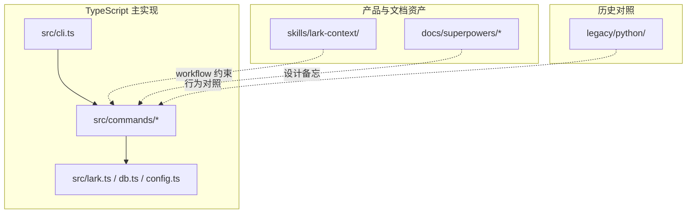

<details>
<summary>相关源文件</summary>

生成本页时使用的主要源文件：

- [README.md](../../../project-repos/lark-context/README.md)
- [src/cli.ts](../../../project-repos/lark-context/src/cli.ts)
- [legacy/python/README.md](../../../project-repos/lark-context/legacy/python/README.md)
- [docs/superpowers/specs/2026-04-19-lark-context-design.md](../../../project-repos/lark-context/docs/superpowers/specs/2026-04-19-lark-context-design.md)

</details>

# 仓库地图与阅读路线

仓库同时承载**现代 TypeScript CLI**与**legacy Python 包**：前者是 `@tiktok-fe/lark-context` 与 `skills/lark-context` 的真源，后者保留测试夹具与历史命令语义，方便对照迁移是否丢行为。

**阅读顺序建议**：从 `src/cli.ts` 看命令注册全景 → 选一个命令文件（如 `pull.ts`）跟着 `lark.ts` 的 JSON 调用往下钻 → 需要理解产物格式时打开 `render.ts` 与 `skills/.../references/*.md`。



`docs/superpowers/` 不是运行时依赖，但记录了 **skill 化、thread replies、slash command** 等迭代的设计背景；排查“为什么默认首次 pull 用 90d”这类问题时，README 与 skill references 往往比代码注释更权威。

## 目录快照

| 路径 | 职责 |
|------|------|
| `src/commands/` | 用户可见子命令：init、list-groups、groups、pull、ingest-doc、show |
| `src/db.ts` | SQLite schema、线程列迁移、`kv` 键值（如 digest 时间戳由 workflow 写入） |
| `skills/lark-context/` | Claude Code skill：`SKILL.md` + `references/*.md` workflow |
| `test/` | Vitest；夹具镜像 legacy/python/tests/fixtures |
| `legacy/python/` | 旧实现 + pytest 套件，文件名与 TS 测例平行 |

## insight：为什么同时保留 legacy/python

`00-repo-inventory.md` 显示两边各有几乎同构的 `test_cmd_pull` / `test_cmd_show` 等用例命名；当你怀疑 “TS 是否完整迁移了 Click 版语义” 时，最快的旁证是**对照同场景的双语言测试与夹具 JSON**。

Sources: [README.md:186-199](../../../project-repos/lark-context/README.md#L186-L199), [src/cli.ts:16-47](../../../project-repos/lark-context/src/cli.ts#L16-L47), [legacy/python/README.md:1-80](../../../project-repos/lark-context/legacy/python/README.md#L1-L80)

<details class="source-snippets">
<summary>引用源码</summary>

<!-- source-snippets:start -->

#### `README.md:186-199`

````markdown
## 开发

```bash
# 克隆 + 装依赖
git clone https://github.com/<you>/lark-context.git
cd lark-context
pnpm install

# 开发命令
pnpm build               # tsup → dist/cli.js
pnpm test                # vitest run
pnpm test:watch          # vitest dev mode
pnpm typecheck           # tsc --noEmit
```
````

#### `src/cli.ts:16-47`

```typescript
import { registerIngestDoc } from "./commands/ingestDoc.js";
import { registerInit } from "./commands/init.js";
import { registerListGroups } from "./commands/listGroups.js";
import { registerPull } from "./commands/pull.js";
import { registerShow, registerShowDoc } from "./commands/show.js";

// 从 package.json 动态读版本，避免手动维护两份的漂移
function readPkgVersion(): string {
  try {
    const here = dirname(fileURLToPath(import.meta.url));
    const pkg = JSON.parse(
      readFileSync(join(here, "..", "package.json"), "utf8"),
    );
    return typeof pkg.version === "string" ? pkg.version : "0.0.0";
  } catch {
    return "0.0.0";
  }
}

const program = new Command();
program
  .name("lark-context")
  .description("Feishu context bridge for Claude Code")
  .version(readPkgVersion());

registerInit(program);
registerListGroups(program);
registerGroups(program);
registerPull(program);
registerIngestDoc(program);
registerShow(program);
registerShowDoc(program);
```

#### `legacy/python/README.md:1-80`

```markdown
# lark-context — Python 历史实现

这是 TS port 之前的 Python 实现，**已冻结**，不再演进。

- 本目录保留目的：port 过程中作语义对照、万一 TS 版出 bug 时回退跑
- **不再接受 PR / 测试更新**
- 跑法：

    cd legacy/python
    python3 -m venv .venv
    . .venv/bin/activate
    pip install -e '.[dev]'
    pytest -q       # 应该 59 passed

V1 TS 版发布（`@tiktok-fe/lark-context` ≥ 0.1.0）后，推荐删除本目录。
```

<!-- source-snippets:end -->
</details>
## 相关页面

- [项目概览](overview.md) — 产品与隐私叙事  
- [CLI 命令参考](cli-commands.md) — 各子命令参数矩阵  
- [测试、构建与 Python 遗留](testing-and-legacy.md) — 如何跑 Vitest / pytest  
