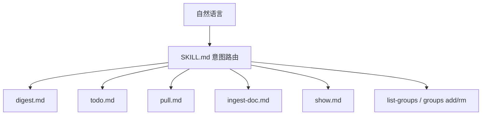
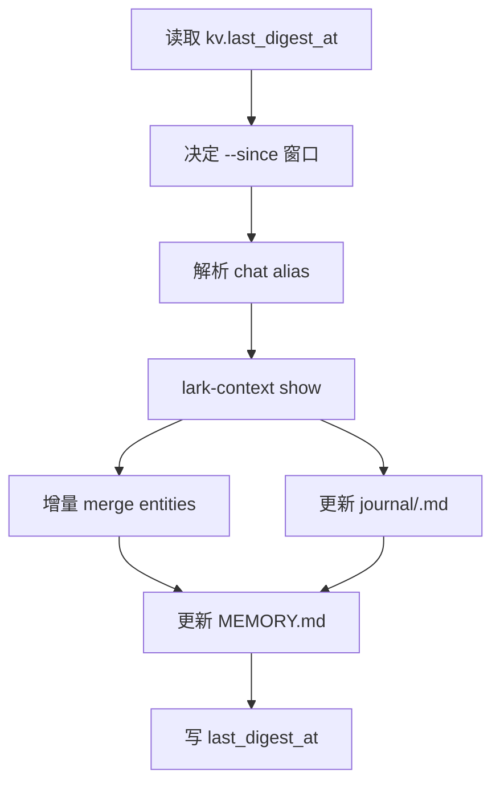
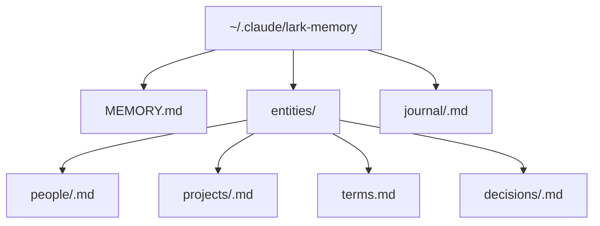

<details>
<summary>相关源文件</summary>

生成本页时使用的主要源文件：

- [skills/lark-context/SKILL.md](../../../project-repos/lark-context/skills/lark-context/SKILL.md)
- [skills/lark-context/references/digest.md](../../../project-repos/lark-context/skills/lark-context/references/digest.md)
- [skills/lark-context/references/todo.md](../../../project-repos/lark-context/skills/lark-context/references/todo.md)
- [skills/lark-context/references/pull.md](../../../project-repos/lark-context/skills/lark-context/references/pull.md)
- [skills/lark-context/references/show.md](../../../project-repos/lark-context/skills/lark-context/references/show.md)
- [skills/lark-context/references/ingest-doc.md](../../../project-repos/lark-context/skills/lark-context/references/ingest-doc.md)
- [README.md](../../../project-repos/lark-context/README.md)
- [GETTING_STARTED.md](../../../project-repos/lark-context/GETTING_STARTED.md)

</details>

# Skill 与记忆工作流

`skills/lark-context` 是仓库的 agent-facing 层。它定义 `/lark-context <自然语言>` 的触发语义、前置检查、意图路由、错误处理和记忆目录约定；具体 workflow 放在 `references/` 下。Sources: [skills/lark-context/SKILL.md:1-13](../../../project-repos/lark-context/skills/lark-context/SKILL.md#L1-L13), [skills/lark-context/SKILL.md:31-48](../../../project-repos/lark-context/skills/lark-context/SKILL.md#L31-L48)

<details class="source-snippets">
<summary>引用源码</summary>

<!-- source-snippets:start -->

#### `skills/lark-context/SKILL.md:1-13`

```markdown
---
name: lark-context
version: 0.1.0
description: "飞书（Lark）上下文桥：把群聊和文档沉淀到本地记忆库给 Claude 长期使用。当用户说【沉淀/整理/记忆】某群、【拉/同步】消息、【收下/入库】文档、【最近聊了啥】、【我有什么 TODO】、查看/关注/取消关注飞书群时触发。"
metadata:
  requires:
    bins: ["lark-context", "lark-cli"]
  cliHelp: "lark-context --help"
---

# lark-context

把飞书群聊和文档**持续沉淀**到本地，由 Claude 按需提炼成长期记忆。**用户通过 `/lark-context <自然语言>` 调用**，本 skill 负责把意图路由到对应 workflow。
```

#### `skills/lark-context/SKILL.md:31-48`

```markdown
## 意图路由

根据用户自然语言里的关键词选一条路径。**只路由一次**，不要在 references 之间来回跳。

| 触发关键词 | 意图 | 处理方式 |
|---|---|---|
| 沉淀 / 整理 / 记忆 / digest | **digest** | 读 [`references/digest.md`](references/digest.md) 执行 workflow |
| TODO / 待办 / 有啥事 / 该做啥 | **todo** | 读 [`references/todo.md`](references/todo.md) |
| 拉 / 同步 / pull / 更新 | **pull** | 读 [`references/pull.md`](references/pull.md) |
| 收下 / 入库 / 文档 URL（含 `/docx/` / `/wiki/` / `/docs/` / `/base/` / `/file/`） | **ingest-doc** | 读 [`references/ingest-doc.md`](references/ingest-doc.md) |
| 看看 / 最近聊了 / show | **show** | 读 [`references/show.md`](references/show.md) |
| 哪些群 / 列群 / 所有群 / 当前关注 | **list-groups / groups list** | 直接跑对应 CLI 命令，无需 reference |
| 关注 / 加群 / 取消关注 / alias | **groups add/rm** | 直接跑 CLI，无需 reference |

**意图不明**（用户说了一句模糊的话，比如"嗯嗯"或只贴一段描述）：不要猜。**反问**"你是想沉淀 / 拉消息 / 看 TODO / 看最近消息 / 管理群 中哪一项？"——用户澄清后再路由。

**多意图同时出现**（比如"拉一下最近消息然后沉淀"）：**分两步**——先执行第一个（pull），完成后再执行第二个（digest）。不要试图合并。

```

<!-- source-snippets:end -->
</details>

## 意图路由



Sources: [skills/lark-context/SKILL.md:31-48](../../../project-repos/lark-context/skills/lark-context/SKILL.md#L31-L48)

<details class="source-snippets">
<summary>引用源码</summary>

<!-- source-snippets:start -->

#### `skills/lark-context/SKILL.md:31-48`

```markdown
## 意图路由

根据用户自然语言里的关键词选一条路径。**只路由一次**，不要在 references 之间来回跳。

| 触发关键词 | 意图 | 处理方式 |
|---|---|---|
| 沉淀 / 整理 / 记忆 / digest | **digest** | 读 [`references/digest.md`](references/digest.md) 执行 workflow |
| TODO / 待办 / 有啥事 / 该做啥 | **todo** | 读 [`references/todo.md`](references/todo.md) |
| 拉 / 同步 / pull / 更新 | **pull** | 读 [`references/pull.md`](references/pull.md) |
| 收下 / 入库 / 文档 URL（含 `/docx/` / `/wiki/` / `/docs/` / `/base/` / `/file/`） | **ingest-doc** | 读 [`references/ingest-doc.md`](references/ingest-doc.md) |
| 看看 / 最近聊了 / show | **show** | 读 [`references/show.md`](references/show.md) |
| 哪些群 / 列群 / 所有群 / 当前关注 | **list-groups / groups list** | 直接跑对应 CLI 命令，无需 reference |
| 关注 / 加群 / 取消关注 / alias | **groups add/rm** | 直接跑 CLI，无需 reference |

**意图不明**（用户说了一句模糊的话，比如"嗯嗯"或只贴一段描述）：不要猜。**反问**"你是想沉淀 / 拉消息 / 看 TODO / 看最近消息 / 管理群 中哪一项？"——用户澄清后再路由。

**多意图同时出现**（比如"拉一下最近消息然后沉淀"）：**分两步**——先执行第一个（pull），完成后再执行第二个（digest）。不要试图合并。

```

<!-- source-snippets:end -->
</details>

skill 明确要求“只路由一次”，意图不明时反问，多意图时分两步执行。比如“拉一下最近消息然后沉淀”先执行 pull，再执行 digest，而不是混成一个命令。Sources: [skills/lark-context/SKILL.md:31-48](../../../project-repos/lark-context/skills/lark-context/SKILL.md#L31-L48)

<details class="source-snippets">
<summary>引用源码</summary>

<!-- source-snippets:start -->

#### `skills/lark-context/SKILL.md:31-48`

```markdown
## 意图路由

根据用户自然语言里的关键词选一条路径。**只路由一次**，不要在 references 之间来回跳。

| 触发关键词 | 意图 | 处理方式 |
|---|---|---|
| 沉淀 / 整理 / 记忆 / digest | **digest** | 读 [`references/digest.md`](references/digest.md) 执行 workflow |
| TODO / 待办 / 有啥事 / 该做啥 | **todo** | 读 [`references/todo.md`](references/todo.md) |
| 拉 / 同步 / pull / 更新 | **pull** | 读 [`references/pull.md`](references/pull.md) |
| 收下 / 入库 / 文档 URL（含 `/docx/` / `/wiki/` / `/docs/` / `/base/` / `/file/`） | **ingest-doc** | 读 [`references/ingest-doc.md`](references/ingest-doc.md) |
| 看看 / 最近聊了 / show | **show** | 读 [`references/show.md`](references/show.md) |
| 哪些群 / 列群 / 所有群 / 当前关注 | **list-groups / groups list** | 直接跑对应 CLI 命令，无需 reference |
| 关注 / 加群 / 取消关注 / alias | **groups add/rm** | 直接跑 CLI，无需 reference |

**意图不明**（用户说了一句模糊的话，比如"嗯嗯"或只贴一段描述）：不要猜。**反问**"你是想沉淀 / 拉消息 / 看 TODO / 看最近消息 / 管理群 中哪一项？"——用户澄清后再路由。

**多意图同时出现**（比如"拉一下最近消息然后沉淀"）：**分两步**——先执行第一个（pull），完成后再执行第二个（digest）。不要试图合并。

```

<!-- source-snippets:end -->
</details>

## 前置检查和错误处理

执行任何 workflow 前先跑 `lark-context --version`，要求至少 `0.1.0`。如果 `lark-cli` 未安装或未登录，skill 要透传 CLI stderr，不尝试替用户登录。Sources: [skills/lark-context/SKILL.md:15-29](../../../project-repos/lark-context/skills/lark-context/SKILL.md#L15-L29)

<details class="source-snippets">
<summary>引用源码</summary>

<!-- source-snippets:start -->

#### `skills/lark-context/SKILL.md:15-29`

````markdown
## 前置依赖

用户必须已安装两个 CLI：
- `lark-context` ≥ 0.1.0（本项目 CLI，`bnpm i -g @tiktok-fe/lark-context`）
- `lark-cli`（飞书官方 CLI，`bnpm i -g @larksuite/cli` + `lark-cli auth login`）

**版本自检**：在执行任何意图 workflow 前，第一步跑：

```bash
lark-context --version
```

若不达 `0.1.0` 起，提示用户：`bnpm i -g @tiktok-fe/lark-context@latest`，然后中止本次调用。

若 `lark-cli` 未安装或未登录，`lark-context init` / 其他命令会直接报错；**透传**错误 stderr 给用户，**不要**尝试替用户登录（需要浏览器交互）。
````

<!-- source-snippets:end -->
</details>

错误处理原则是 CLI 非零退出时透传 stderr，不编造解释；references 缺失说明 skill 安装损坏；网络或超时不自动重试。Sources: [skills/lark-context/SKILL.md:69-73](../../../project-repos/lark-context/skills/lark-context/SKILL.md#L69-L73)

<details class="source-snippets">
<summary>引用源码</summary>

<!-- source-snippets:start -->

#### `skills/lark-context/SKILL.md:69-73`

```markdown
## 错误处理

- **CLI 非零退出**：透传 stderr 给用户，**不编造解释**。若命中已知场景（lark-cli 未装 / 未 auth / chat 被踢出群），补一句操作建议；否则就是透传
- **`references/` 文件缺失**：说明 skill 装坏了。提示用户：`npx skills update lark-context` 或重新 `npx skills add <repo> -g -y`
- **网络错 / lark-cli 超时**：不自动重试（拉消息幂等但失败通常要手动判断），交给用户处理
```

<!-- source-snippets:end -->
</details>

## digest 工作流

digest 的输入是 `lark-context show` 原文，目标是更新 `journal/`、`entities/` 和 `MEMORY.md`，并在 `kv.last_digest_at` 写时间戳。workflow 强调 show 输出是唯一事实来源，不能从记忆中补 show 里没出现的事实。Sources: [skills/lark-context/references/digest.md:8-10](../../../project-repos/lark-context/skills/lark-context/references/digest.md#L8-L10), [skills/lark-context/references/digest.md:42-50](../../../project-repos/lark-context/skills/lark-context/references/digest.md#L42-L50)

<details class="source-snippets">
<summary>引用源码</summary>

<!-- source-snippets:start -->

#### `skills/lark-context/references/digest.md:8-10`

```markdown
**目标**：读 `lark-context show` 原文 → 更新 `~/.claude/lark-memory/` 下的 journal（流水）和 entities（稳定层）→ 在 `kv.last_digest_at` 写时间戳。

**全过程由 Claude 本地完成，不调任何外部 LLM API**。
```

#### `skills/lark-context/references/digest.md:42-50`

````markdown
## Step 3 — 读原始材料

```bash
lark-context show [--chat &lt;alias&gt;] --since &lt;window&gt;
```

输出是本次沉淀的**唯一事实来源**。不要捏造、不要从记忆里补 show 里没出现的事。

若 `show` 输出为空（没有新消息）→ 告诉用户"窗口内没有新消息"，**不**写入任何文件，跳到 Step 7 但不更新时间戳（或更新时间戳但不生成实体，按执行判断）。
````

<!-- source-snippets:end -->
</details>



Sources: [skills/lark-context/references/digest.md:14-29](../../../project-repos/lark-context/skills/lark-context/references/digest.md#L14-L29), [skills/lark-context/references/digest.md:30-97](../../../project-repos/lark-context/skills/lark-context/references/digest.md#L30-L97)

<details class="source-snippets">
<summary>引用源码</summary>

<!-- source-snippets:start -->

#### `skills/lark-context/references/digest.md:14-29`

````markdown
## Step 1 — 决定时间窗口

读上次沉淀时间戳：

```bash
sqlite3 ~/.lark-context/raw.db "SELECT value FROM kv WHERE key='last_digest_at'"
```

根据结果和用户输入选窗口：

| 情况 | 窗口 |
|---|---|
| `last_digest_at` 有值且用户没说窗口 | `--since 24h` |
| `last_digest_at` 为空 + 用户点名了特定群 | `--since 90d`（首次沉淀该群，按 3 个月兜底） |
| 用户明确说了"最近 3 天 / 一周 / 12 小时" | 按用户说的 |

````

#### `skills/lark-context/references/digest.md:30-97`

````markdown
## Step 2 — 识别 chat 过滤

用户说的名字/alias 要解析成一个具体的 alias：

```bash
lark-context groups list
```

匹配用户说的"TTADK 学习交流" → alias `ttadk_learn`（示例）。若无匹配且看起来是新群：先确认 alias 没加过（`groups add` 再 `pull`），但沉淀本身不主动加群——提示用户走 `groups add` / `pull` 流程。

如果用户说"所有群" / 不点名 → 不加 `--chat` flag（默认 all）。

## Step 3 — 读原始材料

```bash
lark-context show [--chat &lt;alias&gt;] --since &lt;window&gt;
```

输出是本次沉淀的**唯一事实来源**。不要捏造、不要从记忆里补 show 里没出现的事。

若 `show` 输出为空（没有新消息）→ 告诉用户"窗口内没有新消息"，**不**写入任何文件，跳到 Step 7 但不更新时间戳（或更新时间戳但不生成实体，按执行判断）。

## Step 4 — 更新 journal（流水层）

目标文件：`~/.claude/lark-memory/journal/<ISO-week>.md`（例如 `2026-W16.md`）。

- 如果文件不存在，创建时带 YAML frontmatter（`name` / `description` / `type: journal` / `updated_at`）+ `# 2026-WNN` 一级标题
- 按日期追加子章节 `## 2026-MM-DD`
- 每条事件一行 bullet，格式 `- **#群名** 人 时间：内容简述（关键数字 / 链接 / 决策保留）`
- 只记"值得回看"的事；闲聊 / 表情回复不进 journal

## Step 5 — 增量 merge entities（稳定层）

对 show 输出里出现的每个**人 / 项目 / 术语 / 决策**，判断是否值得建/更新 entity：

1. 计算 slug：`zhang_san`（人）、`moy26_program`（项目）、`ttadk_claude_share`（决策）、术语并入 `entities/terms.md`
2. 读现有文件（若有）：
   - 人：`entities/people/<slug>.md`
   - 项目：`entities/projects/<slug>.md`
   - 决策：`entities/decisions/<slug>.md`
   - 术语：`entities/terms.md`（单文件多条目）
3. **增量 merge**：
   - 保留用户手工写的段落**原封不动**
   - 新事实追加到文件末尾（或相关章节），带日期标签
   - 如果新信息让 summary 过时，允许**改写** summary 段落
4. 更新 frontmatter 的 `updated_at`

**价值判断**：第一次看到的短暂提及不建新 entity。出现≥2 次、或用户说"记一下"、或是可执行决策 → 建。宁缺毋滥。

## Step 6 — 更新 MEMORY.md 索引

`~/.claude/lark-memory/MEMORY.md` 每个 entity 文件一行：

```
- [标题](relative/path/from/MEMORY.md.md) — 一句话 hook
```

- 新建文件 → 追加一行
- 改了 entity 的 summary → 更新这行的 hook
- 不删除行除非用户明确说"删掉这条"

MEMORY.md 前 200 行会被 `~/.claude/CLAUDE.md` 里的 `@~/.claude/lark-memory/MEMORY.md` 语法自动加载到每个会话，所以**超过 200 行会被截断**——如果快到上限，主动提示用户该折叠/归档。

## Step 7 — 写时间戳

```bash
sqlite3 ~/.lark-context/raw.db "INSERT INTO kv(key,value) VALUES('last_digest_at', datetime('now')) ON CONFLICT(key) DO UPDATE SET value=excluded.value"
```
````

<!-- source-snippets:end -->
</details>

entity 更新有强约束：保留用户手写段落，新事实追加或更新 summary，第一次短暂提及不建实体，出现多次、用户明确要求或可执行决策才建。Sources: [skills/lark-context/references/digest.md:61-78](../../../project-repos/lark-context/skills/lark-context/references/digest.md#L61-L78), [skills/lark-context/references/digest.md:109-114](../../../project-repos/lark-context/skills/lark-context/references/digest.md#L109-L114)

<details class="source-snippets">
<summary>引用源码</summary>

<!-- source-snippets:start -->

#### `skills/lark-context/references/digest.md:61-78`

```markdown
## Step 5 — 增量 merge entities（稳定层）

对 show 输出里出现的每个**人 / 项目 / 术语 / 决策**，判断是否值得建/更新 entity：

1. 计算 slug：`zhang_san`（人）、`moy26_program`（项目）、`ttadk_claude_share`（决策）、术语并入 `entities/terms.md`
2. 读现有文件（若有）：
   - 人：`entities/people/<slug>.md`
   - 项目：`entities/projects/<slug>.md`
   - 决策：`entities/decisions/<slug>.md`
   - 术语：`entities/terms.md`（单文件多条目）
3. **增量 merge**：
   - 保留用户手工写的段落**原封不动**
   - 新事实追加到文件末尾（或相关章节），带日期标签
   - 如果新信息让 summary 过时，允许**改写** summary 段落
4. 更新 frontmatter 的 `updated_at`

**价值判断**：第一次看到的短暂提及不建新 entity。出现≥2 次、或用户说"记一下"、或是可执行决策 → 建。宁缺毋滥。

```

#### `skills/lark-context/references/digest.md:109-114`

```markdown
## 注意事项

- **不要 fabricate**：只记 show 输出里的事实。写实体 summary 时允许综合多条信息，但不能凭空推断
- **保留用户手工内容**：entities 里手写的段落永远不动。只在机器可识别区域（dated bullet、summary 段）追加/改写
- **遇到冲突（同一事实两个来源说法不同）**：在 entity 文件里两条都列，标注来源（群 + 日期 + 发言人），让用户自己判断
- **windows 覆盖合理性**：如果用户指定的 `--since` 窗口太窄（比如 "1h"）但实际没消息，报告窗口太窄，不要硬写
```

<!-- source-snippets:end -->
</details>

## TODO 工作流

TODO 不落盘，每次从 `show` 输出和最新 journal 临时抽取。它识别直接点名、显式 ddl、`@all` 动作、被问未回等模式，排除闲聊、别人之间的对话和已有人接走的事项。Sources: [skills/lark-context/references/todo.md:1-8](../../../project-repos/lark-context/skills/lark-context/references/todo.md#L1-L8), [skills/lark-context/references/todo.md:21-34](../../../project-repos/lark-context/skills/lark-context/references/todo.md#L21-L34)

<details class="source-snippets">
<summary>引用源码</summary>

<!-- source-snippets:start -->

#### `skills/lark-context/references/todo.md:1-8`

```markdown
# TODO 抽取 Workflow

用户触发：
- `/lark-context 我有啥 TODO` / `/lark-context 看看待办`
- `/lark-context 今天该做啥` / "列一下我要回的事"

**本 workflow 不落盘**——每次现抽，不持久化。用户想留档 → 建议在沉淀时自己记到 journal。

```

#### `skills/lark-context/references/todo.md:21-34`

```markdown
## Step 2 — 扫原文抽候选

从 show 输出里找这些模式（LLM 判断即可，不用正则硬匹）：

1. **直接点名**：`@当前用户` + 动作动词（做 / 看 / 跟进 / 对齐 / 确认 / 回复 / review / check 等）
2. **显式 ddl**：今天 / 今晚 / 明早 / 本周 / 下周一 / 周五前 / XX 月 XX 日
3. **@all 且含动作**：比如"大家这周内提 MR"——当前用户隐含要执行
4. **被问 + 未回**：消息里 `@我` 问了问题但没看到回复 → 候选

**不要**把这些当 TODO：
- 闲聊、表情回复、单纯告知
- 别人之间的对话（没 @ 到当前用户）
- 已经明确有别人接的（"X 我来处理"后面）

```

<!-- source-snippets:end -->
</details>

排序先看明确 ddl，再看紧急关键词，最后按被 @ 次数；输出是 Markdown checklist，并且每条附原文摘要或链接。Sources: [skills/lark-context/references/todo.md:43-73](../../../project-repos/lark-context/skills/lark-context/references/todo.md#L43-L73)

<details class="source-snippets">
<summary>引用源码</summary>

<!-- source-snippets:start -->

#### `skills/lark-context/references/todo.md:43-73`

````markdown
## Step 4 — 排序

先紧急度，再优先级：

1. **有明确 ddl** → 按 ddl 升序（今天最前 / 本周次之 / 下周再次）
2. **无 ddl + 紧急关键词** → "紧急 / ASAP / 尽快 / 今天 / 明早"
3. **剩下的无 ddl** → 按被 @ 次数降序（同一件事反复被 @ 说明热度高）

## Step 5 — 输出

直接回用户一份 markdown 列表，不写任何文件：

```
## 待办（窗口：最近 N 天）

### 今天 / 最紧急
- [ ] @张三 在 #群名 的话题：&lt;一句简述&gt;（ddl: 今天 18:00）
  - 原文：&lt;消息摘要 / 文档链接&gt;

### 本周
- [ ] ...

### 没 ddl 的漂浮项
- [ ] ...
```

每条建议附**原文摘要或链接**（消息不超过 50 字，链接用 `<url>` 即可），方便用户回去查证。

## Step 6 — 不写时间戳

这工作流**不**写 `last_digest_at` — 它是查询，不是沉淀。
````

<!-- source-snippets:end -->
</details>

## pull/show/ingest 的 skill 约定

`pull.md` 规定首次拉某个 alias 时由 skill 显式传 `--since 90d`，这是 skill 约定，不是 CLI 默认值。它还要求把 200 页上限提示原样转述给用户，并在常见错误上给具体操作建议。Sources: [skills/lark-context/references/pull.md:12-20](../../../project-repos/lark-context/skills/lark-context/references/pull.md#L12-L20), [skills/lark-context/references/pull.md:28-46](../../../project-repos/lark-context/skills/lark-context/references/pull.md#L28-L46)

<details class="source-snippets">
<summary>引用源码</summary>

<!-- source-snippets:start -->

#### `skills/lark-context/references/pull.md:12-20`

```markdown
## 默认窗口

| 情况 | 用什么 |
|---|---|
| **首次拉某个 alias**（db 里没 `last_cursor`） | `--since 90d` |
| **已拉过的 alias**（增量） | 忽略 `--since`，自动从 `last_cursor` 续拉 |
| 用户说了具体窗口（"拉最近 3 天"） | 按用户说的 |

**90d 的由来**：首次拉的默认值是 skill 约定，不是 CLI 默认值。CLI 本身对首次无默认——所以 skill 必须显式传 `--since 90d`。
```

#### `skills/lark-context/references/pull.md:28-46`

````markdown
## 200 页上限

首次拉历史消息每群最多 200 页（约 10k 条）。到上限后 stderr 有：

```
&lt;alias&gt;: hit MAX_PAGES=200 cap; re-run to continue
```

把这条原样转述给用户，**并建议**再跑一次 `lark-context pull --chat <alias>` 续拉。

## 常见错误（透传 + 操作建议）

| CLI stderr 特征 | 原因 | 给用户的建议 |
|---|---|---|
| `permission_violations` / `required scope` | lark-cli auth 缺 scope | `lark-cli auth login --scope "im:message im:chat"`（具体 scope 按错误信息给） |
| `chat_not_found` | 用户被踢出群了 | `lark-context groups rm <alias>` 或留着忽略 |
| `ENOENT` / `lark-cli not found` | lark-cli 没装 | `bnpm i -g @larksuite/cli` |
| 某个 chat 被 CLI 自动 disable（`<alias>: DISABLED`） | 单群失败不中断全流程；其他群继续 | 看 stderr 哪个 alias 被禁，解决后 `groups add` 重加（重加会把 enabled 翻回 1） |

````

<!-- source-snippets:end -->
</details>

`ingest-doc.md` 说明支持的 URL 形态、底层 `docs +fetch`、同 token 幂等，以及老版 docs 或权限错误时透传。Sources: [skills/lark-context/references/ingest-doc.md:9-30](../../../project-repos/lark-context/skills/lark-context/references/ingest-doc.md#L9-L30), [skills/lark-context/references/ingest-doc.md:31-42](../../../project-repos/lark-context/skills/lark-context/references/ingest-doc.md#L31-L42)

<details class="source-snippets">
<summary>引用源码</summary>

<!-- source-snippets:start -->

#### `skills/lark-context/references/ingest-doc.md:9-30`

````markdown
## 支持的 URL 形态

| 形态 | 支持 | 备注 |
|---|---|---|
| `https://<host>/docx/<token>` | ✅ | 新版云文档 |
| `https://<host>/docs/<token>` | ⚠️ | lark-cli 若返回 `Unsupported document type: Legacy document` 则是老版文档，**透传**错误给用户（没别的办法） |
| `https://<host>/wiki/<token>` | ✅ 多数可用 | 底层是 `lark-cli docs +fetch` |
| `https://<host>/base/<token>` / `/file/<token>` | ⚠️ 按 CLI 返回判断 | 非 docs 类可能报不同错 |
| bare token（纯字母数字） | ✅ | URL query 部分（`?from=copy`）会被忽略 |

## 工作流

```bash
lark-context ingest-doc &lt;url-or-token&gt;
```

CLI 内部：
1. 从 URL 解析 token（`/docx/<token>`, `/docs/<token>` 等）
2. 调 `lark-cli docs +fetch --doc <ref>`
3. 拿 `data.title` + `data.content`（或 `markdown`/`text`/`body`）
4. UPSERT 到 `docs` 表（`source='manual'`）——**同 token 重复 ingest 幂等**

````

#### `skills/lark-context/references/ingest-doc.md:31-42`

````markdown
## 常见问题

- 粘贴含 query `?from=copy` → CLI 自动忽略，只取 `/docx/<token>` 部分
- URL 里 host 不含 `feishu` → CLI 报 `not a feishu URL`，换一个合法 URL 即可
- `lark-cli docs +fetch` 返回 `{ok: false}` → 透传 error message（比如文档权限缺失时会给 `permission` 错误，让用户去原文档页面点"允许" / 改权限）

## 示例

```bash
lark-context ingest-doc https://bytedance.feishu.cn/docx/AbCdEfGh1234
lark-context ingest-doc AbCdEfGh1234                  # bare token 也接受
```
````

<!-- source-snippets:end -->
</details>

`show.md` 说明 show 只读本地 SQLite，不拉新数据，并定义了输出剪裁原则。Sources: [skills/lark-context/references/show.md:8-20](../../../project-repos/lark-context/skills/lark-context/references/show.md#L8-L20), [skills/lark-context/references/show.md:48-53](../../../project-repos/lark-context/skills/lark-context/references/show.md#L48-L53)

<details class="source-snippets">
<summary>引用源码</summary>

<!-- source-snippets:start -->

#### `skills/lark-context/references/show.md:8-20`

````markdown
**目标**：从本地 SQLite 读出最近消息 / 文档，渲染给 Claude 或用户看。**不调 lark-cli，不拉新数据**——需要先跑 `pull` 才能保证数据新。

---

## `show` 命令

```bash
lark-context show [--chat &lt;alias&gt;|all] [--since &lt;duration&gt;]
```

- **默认窗口** `--since 24h`
- `--chat <alias>` 单群；`--chat all` 或省略 → 所有 `enabled=1` 的群
- 无关注群 → 报错 `no whitelisted chats`
````

#### `skills/lark-context/references/show.md:48-53`

```markdown
## 给用户回复的剪裁原则

- **消息 > 100 条**：回给用户之前先提醒"窗口内有 N 条消息，是否收窄到某个群或更短时间？"让用户决定。不要默默粘一大坨
- **文档 > 5000 字**：摘要几个要点 + 给原文链接，不把全文塞回对话
- **没消息但窗口合理**：直接回 "(no messages)"——不要推测说"可能是群沉了"之类

```

<!-- source-snippets:end -->
</details>

## 记忆目录契约

默认记忆目录是 `~/.claude/lark-memory/`，包含 `MEMORY.md`、`entities/people`、`entities/projects`、`entities/terms.md`、`entities/decisions` 和 `journal/<ISO-week>.md`。README 和 skill 都强调这些是 Markdown，用户可审可改。Sources: [README.md:148-175](../../../project-repos/lark-context/README.md#L148-L175), [GETTING_STARTED.md:92-107](../../../project-repos/lark-context/GETTING_STARTED.md#L92-L107), [skills/lark-context/SKILL.md:75-93](../../../project-repos/lark-context/skills/lark-context/SKILL.md#L75-L93)

<details class="source-snippets">
<summary>引用源码</summary>

<!-- source-snippets:start -->

#### `README.md:148-175`

````markdown
## 记忆文件结构

沉淀后的文件（由 Claude 在 `/lark-context 沉淀…` 里维护）：

```
~/.claude/lark-memory/
├── MEMORY.md            # 始终加载的索引
├── entities/            # 稳定层，Claude 做增量 merge（保留手工写的段）
│   ├── people/&lt;slug&gt;.md
│   ├── projects/&lt;slug&gt;.md
│   ├── terms.md
│   └── decisions/&lt;slug&gt;.md
└── journal/             # 按 ISO 周的流水
    └── 2026-W16.md
```

每个实体文件带统一 frontmatter：

```yaml
---
name: 项目 Alpha
type: project | person | decision | terms
updated_at: 2026-04-19
source_hints:
  - chat:project_alpha
  - doc:docxxxxxxxxxxxxxx
---
```
````

#### `GETTING_STARTED.md:92-107`

````markdown
## 记忆长啥样

```
~/.claude/lark-memory/
├── MEMORY.md                     # 总索引
├── entities/
│   ├── people/&lt;slug&gt;.md          # 每个同事一个文件
│   ├── projects/&lt;slug&gt;.md
│   ├── terms.md                  # 术语表
│   └── decisions/&lt;slug&gt;.md
└── journal/
    └── 2026-W17.md               # 每周一个流水文件
```

**全是 markdown，开 VSCode 随便改**。Claude 做增量 merge 时会保留你手工写的段落。

````

#### `skills/lark-context/SKILL.md:75-93`

````markdown
## 存储布局

用户级别文件布局（skill 和 workflow 都假设这些路径已存在）：

```
~/.lark-context/
├── config.yaml          # alias 白名单 + 路径配置
└── raw.db               # SQLite：messages + docs + chats + kv(last_digest_at 等)

~/.claude/lark-memory/    # skill workflow 写这里
├── MEMORY.md             # 索引（总是被 @-load）
├── entities/
│   ├── people/&lt;slug&gt;.md
│   ├── projects/&lt;slug&gt;.md
│   ├── terms.md
│   └── decisions/&lt;slug&gt;.md
└── journal/
    └── &lt;ISO-week&gt;.md     # e.g. 2026-W16.md
```
````

<!-- source-snippets:end -->
</details>



Sources: [skills/lark-context/SKILL.md:75-93](../../../project-repos/lark-context/skills/lark-context/SKILL.md#L75-L93)

<details class="source-snippets">
<summary>引用源码</summary>

<!-- source-snippets:start -->

#### `skills/lark-context/SKILL.md:75-93`

````markdown
## 存储布局

用户级别文件布局（skill 和 workflow 都假设这些路径已存在）：

```
~/.lark-context/
├── config.yaml          # alias 白名单 + 路径配置
└── raw.db               # SQLite：messages + docs + chats + kv(last_digest_at 等)

~/.claude/lark-memory/    # skill workflow 写这里
├── MEMORY.md             # 索引（总是被 @-load）
├── entities/
│   ├── people/&lt;slug&gt;.md
│   ├── projects/&lt;slug&gt;.md
│   ├── terms.md
│   └── decisions/&lt;slug&gt;.md
└── journal/
    └── &lt;ISO-week&gt;.md     # e.g. 2026-W16.md
```
````

<!-- source-snippets:end -->
</details>

## 相关页面

- [项目概览](overview.md)
- [文档入库与 Markdown 输出](document-ingestion-and-show.md)
- [配置与 SQLite 存储](configuration-and-storage.md)
