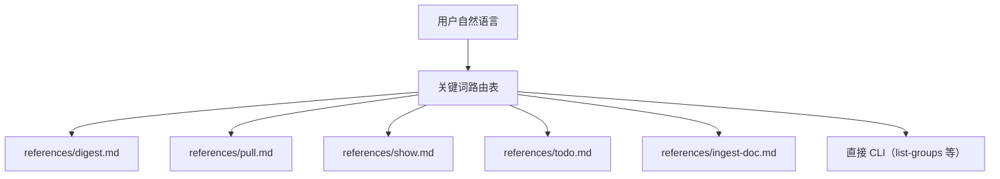

<details>
<summary>相关源文件</summary>

生成本页时使用的主要源文件：

- [skills/lark-context/SKILL.md](../../../project-repos/lark-context/skills/lark-context/SKILL.md)
- [skills/lark-context/references/digest.md](../../../project-repos/lark-context/skills/lark-context/references/digest.md)
- [skills/lark-context/references/pull.md](../../../project-repos/lark-context/skills/lark-context/references/pull.md)
- [skills/lark-context/references/show.md](../../../project-repos/lark-context/skills/lark-context/references/show.md)

</details>

# Claude Skill 与工作流

Skill 层的职责不是再实现一遍飞书 API，而是**把用户的自然语言压缩成可执行的 CLI 组合**，并在错误路径上坚持“**透传 stderr，不编造解释**”。`SKILL.md` 用 frontmatter 声明 `requires.bins: ["lark-context","lark-cli"]`，并在正文里硬性要求先跑 `lark-context --version`——这避免了旧版本缺少子命令时 Claude 死循环重试。



## digest：为什么强调“全过程由 Claude 本地完成”

`references/digest.md` 明确 **Step 3 只以 `lark-context show` 输出为事实来源**，并要求 journal/entities 增量 merge 时保留用户手写段落——这实质上是把 **“可信写入策略”** 定义在 Markdown workflow，而不是 TS 仓库里。结果是：**工具链可审计（shell + sqlite + 文件）**，模型只在本地把材料整理成可复习的结构化记忆。

## pull/show 的 skill 默认值 vs CLI

`pull.md` 声明首次同步默认 `--since 90d`，并强调这是 **skill 约定而非 CLI 默认值**；`show.md` 则约束输出超长时的交互策略（>100 条消息先询问收窄）。这些规则解释了为什么同样一条 `lark-context pull`，人工敲命令与 Claude 代跑可能参数不同。

## 多意图与歧义处理

`SKILL.md` 要求多意图串行执行（先 pull 再 digest），歧义时反问用户——降低模型在 references 间来回跳转导致的副作用。

Sources: [skills/lark-context/SKILL.md:11-74](../../../project-repos/lark-context/skills/lark-context/SKILL.md#L11-L74), [skills/lark-context/references/digest.md:1-52](../../../project-repos/lark-context/skills/lark-context/references/digest.md#L1-L52), [skills/lark-context/references/pull.md:12-37](../../../project-repos/lark-context/skills/lark-context/references/pull.md#L12-L37), [skills/lark-context/references/show.md:12-37](../../../project-repos/lark-context/skills/lark-context/references/show.md#L12-L37)

<details class="source-snippets">
<summary>引用源码</summary>

<!-- source-snippets:start -->

#### `skills/lark-context/SKILL.md:11-74`

````markdown
# lark-context

把飞书群聊和文档**持续沉淀**到本地，由 Claude 按需提炼成长期记忆。**用户通过 `/lark-context <自然语言>` 调用**，本 skill 负责把意图路由到对应 workflow。

## 前置依赖

用户必须已安装两个 CLI：
- `lark-context` ≥ 0.1.0（本项目 CLI，`bnpm i -g @tiktok-fe/lark-context`）
- `lark-cli`（飞书官方 CLI，`bnpm i -g @larksuite/cli` + `lark-cli auth login`）

**版本自检**：在执行任何意图 workflow 前，第一步跑：

```bash
lark-context --version
```

若不达 `0.1.0` 起，提示用户：`bnpm i -g @tiktok-fe/lark-context@latest`，然后中止本次调用。

若 `lark-cli` 未安装或未登录，`lark-context init` / 其他命令会直接报错；**透传**错误 stderr 给用户，**不要**尝试替用户登录（需要浏览器交互）。

## 意图路由

根据用户自然语言里的关键词选一条路径。**只路由一次**，不要在 references 之间来回跳。

| 触发关键词 | 意图 | 处理方式 |
|---|---|---|
| 沉淀 / 整理 / 记忆 / digest | **digest** | 读 [`references/digest.md`](references/digest.md) 执行 workflow |
| TODO / 待办 / 有啥事 / 该做啥 | **todo** | 读 [`references/todo.md`](references/todo.md) |
| 拉 / 同步 / pull / 更新 | **pull** | 读 [`references/pull.md`](references/pull.md) |
| 收下 / 入库 / 文档 URL（含 `/docx/` / `/wiki/` / `/docs/` / `/base/` / `/file/`） | **ingest-doc** | 读 [`references/ingest-doc.md`](references/ingest-doc.md) |
| 看看 / 最近聊了 / show | **show** | 读 [`references/show.md`](references/show.md) |
| 哪些群 / 列群 / 所有群 / 当前关注 | **list-groups / groups list** | 直接跑对应 CLI 命令，无需 reference |
| 关注 / 加群 / 取消关注 / alias | **groups add/rm** | 直接跑 CLI，无需 reference |

**意图不明**（用户说了一句模糊的话，比如"嗯嗯"或只贴一段描述）：不要猜。**反问**"你是想沉淀 / 拉消息 / 看 TODO / 看最近消息 / 管理群 中哪一项？"——用户澄清后再路由。

**多意图同时出现**（比如"拉一下最近消息然后沉淀"）：**分两步**——先执行第一个（pull），完成后再执行第二个（digest）。不要试图合并。

## 命令速查

这张表供 Claude 在需要直接调 CLI 时查用（不命中意图路由表的情况）：

```bash
lark-context init                                   # 首次初始化（自动检查 lark-cli 可用性）
lark-context list-groups                            # 列用户所在的全部飞书群
lark-context groups add <chat_id> --alias X --name "Y"
lark-context groups list
lark-context groups rm <alias>
lark-context pull [--chat <alias>|all] [--since 3d]
lark-context ingest-doc <url-or-token>
lark-context show [--chat <alias>|all] [--since 24h]
lark-context show-doc <token-or-url>
```

**`--since` 格式**：`24h` / `3d` / `1w` / `90m`。仅作为**首次拉取**的时间下限；后续 `pull` 会从 DB 的 `last_cursor` 续拉，忽略 `--since`。

**首次拉取新群**：默认 `--since 90d`（而非 CLI 的 "无默认"）。这是 skill workflow 的约定，不是 CLI 本身的行为。

## 错误处理

- **CLI 非零退出**：透传 stderr 给用户，**不编造解释**。若命中已知场景（lark-cli 未装 / 未 auth / chat 被踢出群），补一句操作建议；否则就是透传
- **`references/` 文件缺失**：说明 skill 装坏了。提示用户：`npx skills update lark-context` 或重新 `npx skills add <repo> -g -y`
- **网络错 / lark-cli 超时**：不自动重试（拉消息幂等但失败通常要手动判断），交给用户处理

````

#### `skills/lark-context/references/digest.md:1-52`

````markdown
# Digest Workflow

用户触发方式：
- `/lark-context 沉淀一下` — 对所有关注的群做沉淀
- `/lark-context 沉淀一下 <群名/alias/关键词>` — 只沉淀指定群
- 或"整理一下记忆"、"把最近的消息整理到记忆里"等自然语言

**目标**：读 `lark-context show` 原文 → 更新 `~/.claude/lark-memory/` 下的 journal（流水）和 entities（稳定层）→ 在 `kv.last_digest_at` 写时间戳。

**全过程由 Claude 本地完成，不调任何外部 LLM API**。

---

## Step 1 — 决定时间窗口

读上次沉淀时间戳：

```bash
sqlite3 ~/.lark-context/raw.db "SELECT value FROM kv WHERE key='last_digest_at'"
```

根据结果和用户输入选窗口：

| 情况 | 窗口 |
|---|---|
| `last_digest_at` 有值且用户没说窗口 | `--since 24h` |
| `last_digest_at` 为空 + 用户点名了特定群 | `--since 90d`（首次沉淀该群，按 3 个月兜底） |
| 用户明确说了"最近 3 天 / 一周 / 12 小时" | 按用户说的 |

## Step 2 — 识别 chat 过滤

用户说的名字/alias 要解析成一个具体的 alias：

```bash
lark-context groups list
```

匹配用户说的"TTADK 学习交流" → alias `ttadk_learn`（示例）。若无匹配且看起来是新群：先确认 alias 没加过（`groups add` 再 `pull`），但沉淀本身不主动加群——提示用户走 `groups add` / `pull` 流程。

如果用户说"所有群" / 不点名 → 不加 `--chat` flag（默认 all）。

## Step 3 — 读原始材料

```bash
lark-context show [--chat <alias>] --since <window>
```

输出是本次沉淀的**唯一事实来源**。不要捏造、不要从记忆里补 show 里没出现的事。

若 `show` 输出为空（没有新消息）→ 告诉用户"窗口内没有新消息"，**不**写入任何文件，跳到 Step 7 但不更新时间戳（或更新时间戳但不生成实体，按执行判断）。

## Step 4 — 更新 journal（流水层）
````

#### `skills/lark-context/references/pull.md:12-37`

````markdown
## 默认窗口

| 情况 | 用什么 |
|---|---|
| **首次拉某个 alias**（db 里没 `last_cursor`） | `--since 90d` |
| **已拉过的 alias**（增量） | 忽略 `--since`，自动从 `last_cursor` 续拉 |
| 用户说了具体窗口（"拉最近 3 天"） | 按用户说的 |

**90d 的由来**：首次拉的默认值是 skill 约定，不是 CLI 默认值。CLI 本身对首次无默认——所以 skill 必须显式传 `--since 90d`。

## 映射

- `--chat <alias>` 指定群
- `--chat all` 或省略 → 所有 `enabled=1` 的群
- alias 未注册 → CLI 抛错并列已知 alias。让用户先走 `groups add`

## 200 页上限

首次拉历史消息每群最多 200 页（约 10k 条）。到上限后 stderr 有：

```
<alias>: hit MAX_PAGES=200 cap; re-run to continue
```

把这条原样转述给用户，**并建议**再跑一次 `lark-context pull --chat <alias>` 续拉。

````

#### `skills/lark-context/references/show.md:12-37`

````markdown
## `show` 命令

```bash
lark-context show [--chat <alias>|all] [--since <duration>]
```

- **默认窗口** `--since 24h`
- `--chat <alias>` 单群；`--chat all` 或省略 → 所有 `enabled=1` 的群
- 无关注群 → 报错 `no whitelisted chats`

### 输出格式（`renderChatWindow` 产）

```
## 群 A  (2026-04-18 ~ 2026-04-19)

**张三** 2026-04-18 10:00
  消息内容
  （多行对齐）

**李四** 2026-04-18 10:05
  回复
```

- 回复线程前缀 `  ↳ `
- 空窗口输出 `(no messages)`
- 末尾可能带 `### 近期入库的文档` 区块（列出窗口内被 ingest 的文档）
````

<!-- source-snippets:end -->
</details>

## 相关页面

- [项目概览](overview.md) — 两层记忆故事  
- [CLI 命令参考](cli-commands.md) — skill 调用的真命令  
- [配置、路径与隐私边界](config-and-privacy.md) — 文件布局假设  
