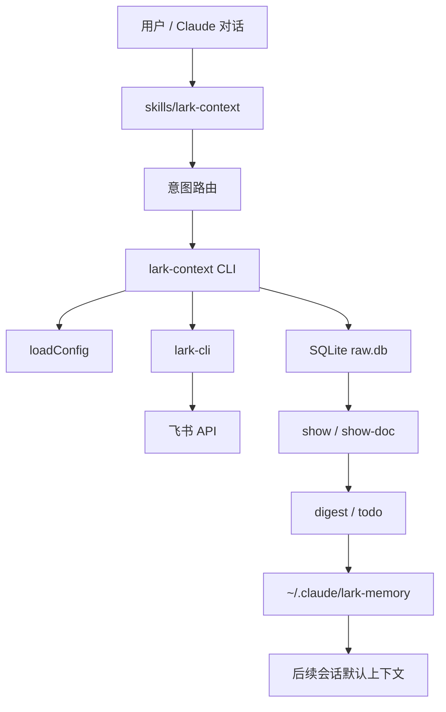
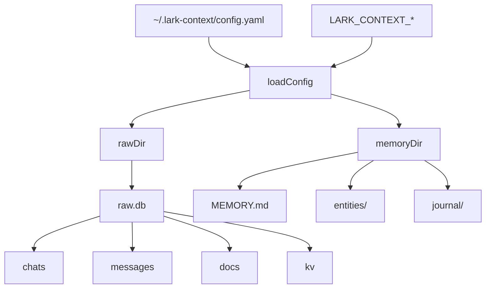
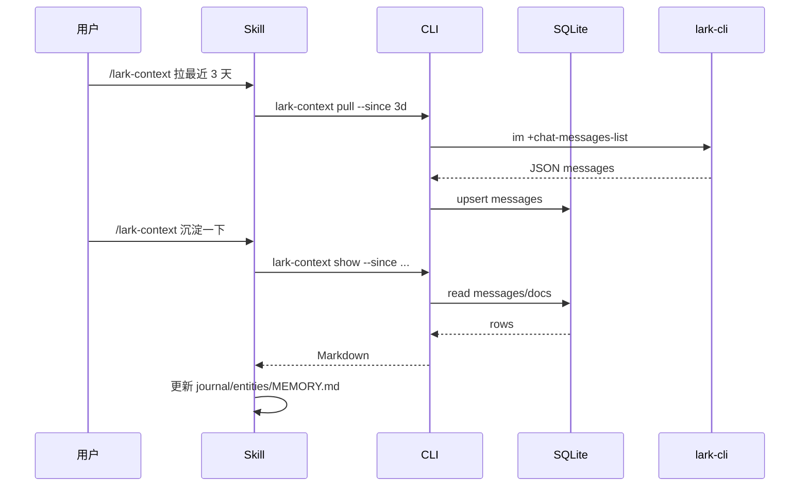

<details>
<summary>相关源文件</summary>

生成本页时使用的主要源文件：

- [README.md](../../../project-repos/lark-context/README.md)
- [src/cli.ts](../../../project-repos/lark-context/src/cli.ts)
- [src/config.ts](../../../project-repos/lark-context/src/config.ts)
- [src/db.ts](../../../project-repos/lark-context/src/db.ts)
- [src/lark.ts](../../../project-repos/lark-context/src/lark.ts)
- [skills/lark-context/SKILL.md](../../../project-repos/lark-context/skills/lark-context/SKILL.md)

</details>

# 系统架构

系统由三层组成：用户-facing 的 `/lark-context` skill，负责本地数据操作的 TypeScript CLI，以及飞书官方 `lark-cli` 和本地 SQLite/Markdown 文件。CLI 是确定性工具层；长期记忆提炼发生在 Claude 的 skill workflow 中。Sources: [README.md:11-35](../../../project-repos/lark-context/README.md#L11-L35), [src/cli.ts:35-49](../../../project-repos/lark-context/src/cli.ts#L35-L49), [skills/lark-context/SKILL.md:31-48](../../../project-repos/lark-context/skills/lark-context/SKILL.md#L31-L48)

<details class="source-snippets">
<summary>引用源码</summary>

<!-- source-snippets:start -->

#### `README.md:11-35`

````markdown
## 架构一眼

```
飞书 ── lark-cli (OAuth) ──▶ @tiktok-fe/lark-context (TS CLI)
                                   │
                                   ├─ SQLite: ~/.lark-context/raw.db
                                   └─ 暴露子命令给 Claude shell 调用
                                           │
                                           ▼
                                  /lark-context <自然语言>
                                 （skill 在 ~/.agents/skills/lark-context/）
                                           │
                                           ▼
                                  Claude 读原始数据 → 写记忆文件
                                           │
                                           ▼
                                  ~/.claude/lark-memory/
                                      ├─ MEMORY.md (索引)
                                      ├─ entities/（稳定层）
                                      └─ journal/ （流水层）
                                           ↓
                                  ~/.claude/CLAUDE.md 里用 @ 引用
                                           ↓
                                  所有 Claude 对话默认拿到这份记忆
```
````

#### `src/cli.ts:35-49`

```typescript
const program = new Command();
program
  .name("lark-context")
  .description("Feishu context bridge for Claude Code")
  .version(readPkgVersion());

registerInit(program);
registerListGroups(program);
registerGroups(program);
registerPull(program);
registerIngestDoc(program);
registerShow(program);
registerShowDoc(program);

program.parseAsync(process.argv);
```

#### `skills/lark-context/SKILL.md:31-48`

```markdown
## 意图路由

根据用户自然语言里的关键词选一条路径。**只路由一次**，不要在 references 之间来回跳。

| 触发关键词 | 意图 | 处理方式 |
|---|---|---|
| 沉淀 / 整理 / 记忆 / digest | **digest** | 读 [`references/digest.md`](references/digest.md) 执行 workflow |
| TODO / 待办 / 有啥事 / 该做啥 | **todo** | 读 [`references/todo.md`](references/todo.md) |
| 拉 / 同步 / pull / 更新 | **pull** | 读 [`references/pull.md`](references/pull.md) |
| 收下 / 入库 / 文档 URL（含 `/docx/` / `/wiki/` / `/docs/` / `/base/` / `/file/`） | **ingest-doc** | 读 [`references/ingest-doc.md`](references/ingest-doc.md) |
| 看看 / 最近聊了 / show | **show** | 读 [`references/show.md`](references/show.md) |
| 哪些群 / 列群 / 所有群 / 当前关注 | **list-groups / groups list** | 直接跑对应 CLI 命令，无需 reference |
| 关注 / 加群 / 取消关注 / alias | **groups add/rm** | 直接跑 CLI，无需 reference |

**意图不明**（用户说了一句模糊的话，比如"嗯嗯"或只贴一段描述）：不要猜。**反问**"你是想沉淀 / 拉消息 / 看 TODO / 看最近消息 / 管理群 中哪一项？"——用户澄清后再路由。

**多意图同时出现**（比如"拉一下最近消息然后沉淀"）：**分两步**——先执行第一个（pull），完成后再执行第二个（digest）。不要试图合并。

```

<!-- source-snippets:end -->
</details>
## 端到端边界



Sources: [README.md:13-35](../../../project-repos/lark-context/README.md#L13-L35), [src/config.ts:95-133](../../../project-repos/lark-context/src/config.ts#L95-L133), [src/db.ts:43-59](../../../project-repos/lark-context/src/db.ts#L43-L59), [src/lark.ts:8-35](../../../project-repos/lark-context/src/lark.ts#L8-L35), [skills/lark-context/SKILL.md:75-93](../../../project-repos/lark-context/skills/lark-context/SKILL.md#L75-L93)

<details class="source-snippets">
<summary>引用源码</summary>

<!-- source-snippets:start -->

#### `README.md:13-35`

````markdown
```
飞书 ── lark-cli (OAuth) ──▶ @tiktok-fe/lark-context (TS CLI)
                                   │
                                   ├─ SQLite: ~/.lark-context/raw.db
                                   └─ 暴露子命令给 Claude shell 调用
                                           │
                                           ▼
                                  /lark-context <自然语言>
                                 （skill 在 ~/.agents/skills/lark-context/）
                                           │
                                           ▼
                                  Claude 读原始数据 → 写记忆文件
                                           │
                                           ▼
                                  ~/.claude/lark-memory/
                                      ├─ MEMORY.md (索引)
                                      ├─ entities/（稳定层）
                                      └─ journal/ （流水层）
                                           ↓
                                  ~/.claude/CLAUDE.md 里用 @ 引用
                                           ↓
                                  所有 Claude 对话默认拿到这份记忆
```
````

#### `src/config.ts:95-133`

```typescript
export function loadConfig(opts: LoadConfigOptions = {}): Config {
  const configPath = opts.configPathOverride
    ? expandHome(opts.configPathOverride)
    : defaultConfigPath();
  let yamlData: Record<string, unknown> = {};
  if (existsSync(configPath)) {
    const parsed = YAML.parse(readFileSync(configPath, "utf8"));
    if (parsed && typeof parsed === "object" && !Array.isArray(parsed)) {
      yamlData = parsed as Record<string, unknown>;
    }
  }
  const pathsRaw = yamlData.paths;
  const pathsSection: Record<string, unknown> =
    pathsRaw && typeof pathsRaw === "object" && !Array.isArray(pathsRaw)
      ? (pathsRaw as Record<string, unknown>)
      : {};
  const memoryDir = resolvePath(
    opts.memoryDirOverride,
    ENV_MEMORY,
    typeof pathsSection.memory_dir === "string"
      ? pathsSection.memory_dir
      : undefined,
    "~/.claude/lark-memory",
  );
  const rawDir = resolvePath(
    opts.rawDirOverride,
    ENV_RAW,
    typeof pathsSection.raw_dir === "string"
      ? pathsSection.raw_dir
      : undefined,
    "~/.lark-context",
  );
  return {
    memoryDir,
    rawDir,
    groups: parseGroups(yamlData.groups),
    configPath,
  };
}
```

#### `src/db.ts:43-59`

```typescript
export function connect(dbPath: string): Database.Database {
  mkdirSync(dirname(dbPath), { recursive: true });
  const db = new Database(dbPath);
  db.pragma("foreign_keys = ON");
  db.pragma("journal_mode = WAL");
  return db;
}

export function initSchema(dbPath: string): void {
  const db = connect(dbPath);
  try {
    db.exec(SCHEMA);
    migrateMessagesColumns(db);
  } finally {
    db.close();
  }
}
```

#### `src/lark.ts:8-35`

```typescript
async function invoke(args: string[]): Promise<string> {
  try {
    const r = await execa(BINARY, args, { reject: true });
    return r.stdout;
  } catch (err: unknown) {
    const e = err as { code?: string; exitCode?: number; stderr?: string };
    if (e?.code === "ENOENT") {
      throw new LarkNotFoundError(
        `\`${BINARY}\` binary not found on PATH. See https://github.com/larksuite/cli for install instructions.`,
      );
    }
    const stderr = (e?.stderr ?? "").toString().trim();
    throw new LarkCLIError(stderr || `lark exited ${e?.exitCode ?? "?"}`);
  }
}

export async function runJson(args: string[]): Promise<unknown> {
  const out = await invoke([...args, "--format", "json"]);
  return JSON.parse(out);
}

export async function* runNdjson(args: string[]): AsyncGenerator<unknown> {
  const out = await invoke([...args, "--format", "ndjson"]);
  for (const line of out.split("\n")) {
    const trimmed = line.trim();
    if (trimmed) yield JSON.parse(trimmed);
  }
}
```

#### `skills/lark-context/SKILL.md:75-93`

````markdown
## 存储布局

用户级别文件布局（skill 和 workflow 都假设这些路径已存在）：

```
~/.lark-context/
├── config.yaml          # alias 白名单 + 路径配置
└── raw.db               # SQLite：messages + docs + chats + kv(last_digest_at 等)

~/.claude/lark-memory/    # skill workflow 写这里
├── MEMORY.md             # 索引（总是被 @-load）
├── entities/
│   ├── people/<slug>.md
│   ├── projects/<slug>.md
│   ├── terms.md
│   └── decisions/<slug>.md
└── journal/
    └── <ISO-week>.md     # e.g. 2026-W16.md
```
````

<!-- source-snippets:end -->
</details>
## 运行时模块

| 模块 | 责任 | 关键事实 |
|---|---|---|
| `src/cli.ts` | Commander 根入口 | 注册 7 个命令，并动态读取版本 |
| `src/config.ts` | 配置解析 | 支持 flag、环境变量、YAML、默认值优先级 |
| `src/db.ts` | 数据库 | 创建 `chats`、`messages`、`docs`、`kv`，并做 thread 字段迁移 |
| `src/lark.ts` | 飞书访问 | 调 `lark-cli`，统一追加 `--format json/ndjson` |
| `src/commands/*` | 业务命令 | 每个文件注册一个或一组 Commander 子命令 |
| `skills/lark-context` | Agent 工作流 | 把自然语言映射到 pull、show、digest、TODO 等路径 |

Sources: [src/cli.ts:22-49](../../../project-repos/lark-context/src/cli.ts#L22-L49), [src/config.ts:52-63](../../../project-repos/lark-context/src/config.ts#L52-L63), [src/db.ts:5-41](../../../project-repos/lark-context/src/db.ts#L5-L41), [src/lark.ts:24-35](../../../project-repos/lark-context/src/lark.ts#L24-L35), [skills/lark-context/SKILL.md:31-48](../../../project-repos/lark-context/skills/lark-context/SKILL.md#L31-L48)

<details class="source-snippets">
<summary>引用源码</summary>

<!-- source-snippets:start -->

#### `src/cli.ts:22-49`

```typescript
// 从 package.json 动态读版本，避免手动维护两份的漂移
function readPkgVersion(): string {
  try {
    const here = dirname(fileURLToPath(import.meta.url));
    const pkg = JSON.parse(
      readFileSync(join(here, "..", "package.json"), "utf8"),
    );
    return typeof pkg.version === "string" ? pkg.version : "0.0.0";
  } catch {
    return "0.0.0";
  }
}

const program = new Command();
program
  .name("lark-context")
  .description("Feishu context bridge for Claude Code")
  .version(readPkgVersion());

registerInit(program);
registerListGroups(program);
registerGroups(program);
registerPull(program);
registerIngestDoc(program);
registerShow(program);
registerShowDoc(program);

program.parseAsync(process.argv);
```

#### `src/config.ts:52-63`

```typescript
function resolvePath(
  flag: string | undefined,
  envVar: string,
  yamlValue: string | undefined,
  fallback: string,
): string {
  if (flag !== undefined) return expandHome(flag);
  const env = process.env[envVar];
  if (env) return expandHome(env);
  if (yamlValue) return expandHome(yamlValue);
  return expandHome(fallback);
}
```

#### `src/db.ts:5-41`

```typescript
export const SCHEMA = `
CREATE TABLE IF NOT EXISTS chats (
  alias           TEXT PRIMARY KEY,
  chat_id         TEXT NOT NULL UNIQUE,
  name            TEXT,
  last_cursor     TEXT,
  last_pulled_at  TEXT,
  enabled         INTEGER DEFAULT 1
);
CREATE TABLE IF NOT EXISTS messages (
  id              TEXT PRIMARY KEY,
  chat_alias      TEXT NOT NULL REFERENCES chats(alias),
  sender_id       TEXT,
  sender_name     TEXT,
  msg_type        TEXT,
  content_json    TEXT NOT NULL,
  content_text    TEXT,
  reply_to        TEXT,
  create_time     TEXT NOT NULL,
  thread_id       TEXT,
  is_thread_reply INTEGER NOT NULL DEFAULT 0
);
CREATE INDEX IF NOT EXISTS idx_messages_chat_time
  ON messages(chat_alias, create_time);
CREATE TABLE IF NOT EXISTS docs (
  doc_token   TEXT PRIMARY KEY,
  url         TEXT NOT NULL,
  title       TEXT,
  content_md  TEXT NOT NULL,
  fetched_at  TEXT NOT NULL,
  source      TEXT
);
CREATE TABLE IF NOT EXISTS kv (
  key   TEXT PRIMARY KEY,
  value TEXT
);
`;
```

#### `src/lark.ts:24-35`

```typescript
export async function runJson(args: string[]): Promise<unknown> {
  const out = await invoke([...args, "--format", "json"]);
  return JSON.parse(out);
}

export async function* runNdjson(args: string[]): AsyncGenerator<unknown> {
  const out = await invoke([...args, "--format", "ndjson"]);
  for (const line of out.split("\n")) {
    const trimmed = line.trim();
    if (trimmed) yield JSON.parse(trimmed);
  }
}
```

#### `skills/lark-context/SKILL.md:31-48`

```markdown
## 意图路由

根据用户自然语言里的关键词选一条路径。**只路由一次**，不要在 references 之间来回跳。

| 触发关键词 | 意图 | 处理方式 |
|---|---|---|
| 沉淀 / 整理 / 记忆 / digest | **digest** | 读 [`references/digest.md`](references/digest.md) 执行 workflow |
| TODO / 待办 / 有啥事 / 该做啥 | **todo** | 读 [`references/todo.md`](references/todo.md) |
| 拉 / 同步 / pull / 更新 | **pull** | 读 [`references/pull.md`](references/pull.md) |
| 收下 / 入库 / 文档 URL（含 `/docx/` / `/wiki/` / `/docs/` / `/base/` / `/file/`） | **ingest-doc** | 读 [`references/ingest-doc.md`](references/ingest-doc.md) |
| 看看 / 最近聊了 / show | **show** | 读 [`references/show.md`](references/show.md) |
| 哪些群 / 列群 / 所有群 / 当前关注 | **list-groups / groups list** | 直接跑对应 CLI 命令，无需 reference |
| 关注 / 加群 / 取消关注 / alias | **groups add/rm** | 直接跑 CLI，无需 reference |

**意图不明**（用户说了一句模糊的话，比如"嗯嗯"或只贴一段描述）：不要猜。**反问**"你是想沉淀 / 拉消息 / 看 TODO / 看最近消息 / 管理群 中哪一项？"——用户澄清后再路由。

**多意图同时出现**（比如"拉一下最近消息然后沉淀"）：**分两步**——先执行第一个（pull），完成后再执行第二个（digest）。不要试图合并。

```

<!-- source-snippets:end -->
</details>
## 数据落点

默认数据分两类：原始数据在 `~/.lark-context/raw.db`，给 Claude 读的长期记忆在 `~/.claude/lark-memory/`。路径可以通过 `LARK_CONTEXT_CONFIG`、`LARK_CONTEXT_RAW_DIR`、`LARK_CONTEXT_MEMORY_DIR` 覆盖。Sources: [README.md:120-128](../../../project-repos/lark-context/README.md#L120-L128), [src/config.ts:6-8](../../../project-repos/lark-context/src/config.ts#L6-L8), [src/config.ts:111-126](../../../project-repos/lark-context/src/config.ts#L111-L126)

<details class="source-snippets">
<summary>引用源码</summary>

<!-- source-snippets:start -->

#### `README.md:120-128`

```markdown
## 存储位置

| 东西 | 默认路径 | 覆盖方式 |
|---|---|---|
| 配置文件 | `~/.lark-context/config.yaml` | `LARK_CONTEXT_CONFIG` 环境变量 |
| 原始数据（SQLite） | `~/.lark-context/raw.db` | `LARK_CONTEXT_RAW_DIR` |
| 记忆文件（给 Claude 读） | `~/.claude/lark-memory/` | `LARK_CONTEXT_MEMORY_DIR` |

覆盖优先级（高 → 低）：CLI flag → 环境变量 → config.yaml → 默认值。
```

#### `src/config.ts:6-8`

```typescript
export const ENV_CONFIG = "LARK_CONTEXT_CONFIG";
export const ENV_MEMORY = "LARK_CONTEXT_MEMORY_DIR";
export const ENV_RAW = "LARK_CONTEXT_RAW_DIR";
```

#### `src/config.ts:111-126`

```typescript
  const memoryDir = resolvePath(
    opts.memoryDirOverride,
    ENV_MEMORY,
    typeof pathsSection.memory_dir === "string"
      ? pathsSection.memory_dir
      : undefined,
    "~/.claude/lark-memory",
  );
  const rawDir = resolvePath(
    opts.rawDirOverride,
    ENV_RAW,
    typeof pathsSection.raw_dir === "string"
      ? pathsSection.raw_dir
      : undefined,
    "~/.lark-context",
  );
```

<!-- source-snippets:end -->
</details>


Sources: [src/config.ts:46-63](../../../project-repos/lark-context/src/config.ts#L46-L63), [src/config.ts:95-133](../../../project-repos/lark-context/src/config.ts#L95-L133), [src/db.ts:5-41](../../../project-repos/lark-context/src/db.ts#L5-L41), [skills/lark-context/SKILL.md:75-93](../../../project-repos/lark-context/skills/lark-context/SKILL.md#L75-L93)

<details class="source-snippets">
<summary>引用源码</summary>

<!-- source-snippets:start -->

#### `src/config.ts:46-63`

```typescript
function defaultConfigPath(): string {
  const env = process.env[ENV_CONFIG];
  if (env) return expandHome(env);
  return join(homedir(), ".lark-context", "config.yaml");
}

function resolvePath(
  flag: string | undefined,
  envVar: string,
  yamlValue: string | undefined,
  fallback: string,
): string {
  if (flag !== undefined) return expandHome(flag);
  const env = process.env[envVar];
  if (env) return expandHome(env);
  if (yamlValue) return expandHome(yamlValue);
  return expandHome(fallback);
}
```

#### `src/config.ts:95-133`

```typescript
export function loadConfig(opts: LoadConfigOptions = {}): Config {
  const configPath = opts.configPathOverride
    ? expandHome(opts.configPathOverride)
    : defaultConfigPath();
  let yamlData: Record<string, unknown> = {};
  if (existsSync(configPath)) {
    const parsed = YAML.parse(readFileSync(configPath, "utf8"));
    if (parsed && typeof parsed === "object" && !Array.isArray(parsed)) {
      yamlData = parsed as Record<string, unknown>;
    }
  }
  const pathsRaw = yamlData.paths;
  const pathsSection: Record<string, unknown> =
    pathsRaw && typeof pathsRaw === "object" && !Array.isArray(pathsRaw)
      ? (pathsRaw as Record<string, unknown>)
      : {};
  const memoryDir = resolvePath(
    opts.memoryDirOverride,
    ENV_MEMORY,
    typeof pathsSection.memory_dir === "string"
      ? pathsSection.memory_dir
      : undefined,
    "~/.claude/lark-memory",
  );
  const rawDir = resolvePath(
    opts.rawDirOverride,
    ENV_RAW,
    typeof pathsSection.raw_dir === "string"
      ? pathsSection.raw_dir
      : undefined,
    "~/.lark-context",
  );
  return {
    memoryDir,
    rawDir,
    groups: parseGroups(yamlData.groups),
    configPath,
  };
}
```

#### `src/db.ts:5-41`

```typescript
export const SCHEMA = `
CREATE TABLE IF NOT EXISTS chats (
  alias           TEXT PRIMARY KEY,
  chat_id         TEXT NOT NULL UNIQUE,
  name            TEXT,
  last_cursor     TEXT,
  last_pulled_at  TEXT,
  enabled         INTEGER DEFAULT 1
);
CREATE TABLE IF NOT EXISTS messages (
  id              TEXT PRIMARY KEY,
  chat_alias      TEXT NOT NULL REFERENCES chats(alias),
  sender_id       TEXT,
  sender_name     TEXT,
  msg_type        TEXT,
  content_json    TEXT NOT NULL,
  content_text    TEXT,
  reply_to        TEXT,
  create_time     TEXT NOT NULL,
  thread_id       TEXT,
  is_thread_reply INTEGER NOT NULL DEFAULT 0
);
CREATE INDEX IF NOT EXISTS idx_messages_chat_time
  ON messages(chat_alias, create_time);
CREATE TABLE IF NOT EXISTS docs (
  doc_token   TEXT PRIMARY KEY,
  url         TEXT NOT NULL,
  title       TEXT,
  content_md  TEXT NOT NULL,
  fetched_at  TEXT NOT NULL,
  source      TEXT
);
CREATE TABLE IF NOT EXISTS kv (
  key   TEXT PRIMARY KEY,
  value TEXT
);
`;
```

#### `skills/lark-context/SKILL.md:75-93`

````markdown
## 存储布局

用户级别文件布局（skill 和 workflow 都假设这些路径已存在）：

```
~/.lark-context/
├── config.yaml          # alias 白名单 + 路径配置
└── raw.db               # SQLite：messages + docs + chats + kv(last_digest_at 等)

~/.claude/lark-memory/    # skill workflow 写这里
├── MEMORY.md             # 索引（总是被 @-load）
├── entities/
│   ├── people/<slug>.md
│   ├── projects/<slug>.md
│   ├── terms.md
│   └── decisions/<slug>.md
└── journal/
    └── <ISO-week>.md     # e.g. 2026-W16.md
```
````

<!-- source-snippets:end -->
</details>
## 控制流与职责分离

`lark-context` 的 CLI 层不做 LLM 级判断。`pull`、`ingest-doc`、`show` 只读取/写入本地 DB；digest 和 TODO 的“值得记什么”“是否是待办”等判断写在 skill references 中，由 Claude 执行。Sources: [README.md:5-8](../../../project-repos/lark-context/README.md#L5-L8), [src/commands/pull.ts:401-440](../../../project-repos/lark-context/src/commands/pull.ts#L401-L440), [src/commands/show.ts:31-127](../../../project-repos/lark-context/src/commands/show.ts#L31-L127), [skills/lark-context/references/digest.md:42-78](../../../project-repos/lark-context/skills/lark-context/references/digest.md#L42-L78), [skills/lark-context/references/todo.md:21-34](../../../project-repos/lark-context/skills/lark-context/references/todo.md#L21-L34)

<details class="source-snippets">
<summary>引用源码</summary>

<!-- source-snippets:start -->

#### `README.md:5-8`

```markdown
- **持续拉取**：指定飞书群的增量消息（经 OAuth 用户身份通过官方 `lark-cli` 读取）
- **手动喂文档**：粘贴飞书文档 URL，工具拉下来入库
- **提炼**：由 **Claude 自己**（通过 skill workflow）完成，工具不调任何外部 LLM API（工作数据不出网）
- **记忆结构**：`entities/`（稳定层：人 / 项目 / 术语 / 决策）+ `journal/`（流水层：按 ISO 周追加要点）
```

#### `src/commands/pull.ts:401-440`

```typescript
export async function runPull(opts: PullOpts): Promise<number> {
  const cfg: Config = loadConfig(opts);
  const dbPath = join(cfg.rawDir, "raw.db");
  ensureInitialized(dbPath);
  const sinceParsed = opts.since ? parseDuration(opts.since) : null;
  const threadWindowParsed = opts.threadWindow
    ? parseDuration(opts.threadWindow)
    : null;
  const threadOpts: ThreadOpts = {
    enabled: !opts.noThreads,
    overrideWindow: threadWindowParsed,
    firstPullFallback: sinceParsed,
  };
  const effectiveAlias =
    opts.chatAlias === "all" || !opts.chatAlias ? null : opts.chatAlias;
  const targets = cfg.groups.filter(
    (g) => g.enabled && (!effectiveAlias || g.alias === effectiveAlias),
  );
  if (effectiveAlias && targets.length === 0) {
    throw new Error(`unknown chat alias "${opts.chatAlias}"`);
  }
  const now = (opts._now ?? (() => new Date()))();

  let grand = 0;
  for (const g of targets) {
    try {
      const n = await pullChat(dbPath, g, sinceParsed, threadOpts, now);
      process.stdout.write(`${g.alias}: pulled ${n} messages\n`);
      grand += n;
    } catch (err) {
      if (err instanceof LarkNotFoundError) throw err;
      if (err instanceof LarkCLIError) {
        disableChat(dbPath, g.alias, err.message);
        continue;
      }
      throw err;
    }
  }
  process.stdout.write(`done, total=${grand}\n`);
  return grand;
```

#### `src/commands/show.ts:31-127`

```typescript
export async function runShow(opts: ShowOpts): Promise<void> {
  const cfg = loadConfig(opts);
  const dbPath = join(cfg.rawDir, "raw.db");
  ensureInitialized(dbPath);
  const delta = parseDuration(opts.since ?? "24h");
  const now = (opts._now ?? (() => new Date()))();
  const cutoff = new Date(now.getTime() - delta.totalMs).toISOString();
  const effectiveAlias =
    opts.chatAlias === "all" || !opts.chatAlias ? null : opts.chatAlias;
  const targets = cfg.groups.filter(
    (g) => g.enabled && (!effectiveAlias || g.alias === effectiveAlias),
  );
  if (effectiveAlias && targets.length === 0) {
    throw new Error(`unknown chat alias "${opts.chatAlias}"`);
  }
  if (targets.length === 0) {
    throw new Error("no whitelisted chats");
  }

  const pieces: string[] = [];
  const db = connect(dbPath);
  try {
    const topStmt = db.prepare(
      "SELECT id, sender_name, content_text, create_time, thread_id " +
        "FROM messages WHERE chat_alias=? AND is_thread_reply=0 AND create_time >= ? " +
        "ORDER BY create_time",
    );
    const replyStmt = db.prepare(
      "SELECT sender_name, content_text, create_time " +
        "FROM messages WHERE chat_alias=? AND thread_id=? AND is_thread_reply=1 " +
        "ORDER BY create_time",
    );

    for (const g of targets) {
      const tops = topStmt.all(g.alias, cutoff) as Array<{
        id: string;
        sender_name: string;
        content_text: string;
        create_time: string;
        thread_id: string | null;
      }>;
      const messages: Array<{
        sender_name: string;
        content_text: string;
        create_time: string;
        is_thread_reply?: boolean;
      }> = [];
      for (const top of tops) {
        messages.push({
          sender_name: top.sender_name,
          content_text: top.content_text,
          create_time: top.create_time,
          is_thread_reply: false,
        });
        if (top.thread_id) {
          const replies = replyStmt.all(g.alias, top.thread_id) as Array<{
            sender_name: string;
            content_text: string;
            create_time: string;
          }>;
          for (const r of replies) {
            messages.push({
              sender_name: r.sender_name,
              content_text: r.content_text,
              create_time: r.create_time,
              is_thread_reply: true,
            });
          }
        }
      }
      pieces.push(
        renderChatWindow({
          chatName: g.name || g.alias,
          windowStart: cutoff.slice(0, 10),
          windowEnd: now.toISOString().slice(0, 10),
          messages,
        }),
      );
    }
    const docs = db
      .prepare(
        "SELECT doc_token, title, url FROM docs WHERE fetched_at >= ? ORDER BY fetched_at DESC",
      )
      .all(cutoff) as Array<{ doc_token: string; title: string; url: string }>;
    if (docs.length > 0) {
      pieces.push("### 近期入库的文档\n");
      for (const d of docs) {
        pieces.push(`- [${d.title || d.doc_token}](${d.url})  (token=\`${d.doc_token}\`)`);
      }
      pieces.push("");
    }
  } finally {
    db.close();
  }
  const write = opts.write ?? ((s: string) => process.stdout.write(s));
  write(pieces.join("\n") + "\n");
}
```

#### `skills/lark-context/references/digest.md:42-78`

````markdown
## Step 3 — 读原始材料

```bash
lark-context show [--chat <alias>] --since <window>
```

输出是本次沉淀的**唯一事实来源**。不要捏造、不要从记忆里补 show 里没出现的事。

若 `show` 输出为空（没有新消息）→ 告诉用户"窗口内没有新消息"，**不**写入任何文件，跳到 Step 7 但不更新时间戳（或更新时间戳但不生成实体，按执行判断）。

## Step 4 — 更新 journal（流水层）

目标文件：`~/.claude/lark-memory/journal/<ISO-week>.md`（例如 `2026-W16.md`）。

- 如果文件不存在，创建时带 YAML frontmatter（`name` / `description` / `type: journal` / `updated_at`）+ `# 2026-WNN` 一级标题
- 按日期追加子章节 `## 2026-MM-DD`
- 每条事件一行 bullet，格式 `- **#群名** 人 时间：内容简述（关键数字 / 链接 / 决策保留）`
- 只记"值得回看"的事；闲聊 / 表情回复不进 journal

## Step 5 — 增量 merge entities（稳定层）

对 show 输出里出现的每个**人 / 项目 / 术语 / 决策**，判断是否值得建/更新 entity：

1. 计算 slug：`zhang_san`（人）、`moy26_program`（项目）、`ttadk_claude_share`（决策）、术语并入 `entities/terms.md`
2. 读现有文件（若有）：
   - 人：`entities/people/<slug>.md`
   - 项目：`entities/projects/<slug>.md`
   - 决策：`entities/decisions/<slug>.md`
   - 术语：`entities/terms.md`（单文件多条目）
3. **增量 merge**：
   - 保留用户手工写的段落**原封不动**
   - 新事实追加到文件末尾（或相关章节），带日期标签
   - 如果新信息让 summary 过时，允许**改写** summary 段落
4. 更新 frontmatter 的 `updated_at`

**价值判断**：第一次看到的短暂提及不建新 entity。出现≥2 次、或用户说"记一下"、或是可执行决策 → 建。宁缺毋滥。

````

#### `skills/lark-context/references/todo.md:21-34`

```markdown
## Step 2 — 扫原文抽候选

从 show 输出里找这些模式（LLM 判断即可，不用正则硬匹）：

1. **直接点名**：`@当前用户` + 动作动词（做 / 看 / 跟进 / 对齐 / 确认 / 回复 / review / check 等）
2. **显式 ddl**：今天 / 今晚 / 明早 / 本周 / 下周一 / 周五前 / XX 月 XX 日
3. **@all 且含动作**：比如"大家这周内提 MR"——当前用户隐含要执行
4. **被问 + 未回**：消息里 `@我` 问了问题但没看到回复 → 候选

**不要**把这些当 TODO：
- 闲聊、表情回复、单纯告知
- 别人之间的对话（没 @ 到当前用户）
- 已经明确有别人接的（"X 我来处理"后面）

```

<!-- source-snippets:end -->
</details>


Sources: [skills/lark-context/references/pull.md:12-20](../../../project-repos/lark-context/skills/lark-context/references/pull.md#L12-L20), [src/commands/pull.ts:345-386](../../../project-repos/lark-context/src/commands/pull.ts#L345-L386), [skills/lark-context/references/digest.md:42-97](../../../project-repos/lark-context/skills/lark-context/references/digest.md#L42-L97)

<details class="source-snippets">
<summary>引用源码</summary>

<!-- source-snippets:start -->

#### `skills/lark-context/references/pull.md:12-20`

```markdown
## 默认窗口

| 情况 | 用什么 |
|---|---|
| **首次拉某个 alias**（db 里没 `last_cursor`） | `--since 90d` |
| **已拉过的 alias**（增量） | 忽略 `--since`，自动从 `last_cursor` 续拉 |
| 用户说了具体窗口（"拉最近 3 天"） | 按用户说的 |

**90d 的由来**：首次拉的默认值是 skill 约定，不是 CLI 默认值。CLI 本身对首次无默认——所以 skill 必须显式传 `--since 90d`。
```

#### `src/commands/pull.ts:345-386`

```typescript
  for (pageNum = 1; pageNum <= MAX_PAGES; pageNum++) {
    const { messages, nextToken, hasMore } = await onePage(
      group.chatId,
      pageToken,
      pageNum === 1 ? startIso : null,
    );
    if (messages.length > 0) {
      const { inserted, newMax } = writePage(
        dbPath,
        group,
        messages,
        maxCreateTime,
        now,
      );
      maxCreateTime = newMax;
      totalInserted += inserted;
      process.stderr.write(
        `  ${group.alias}: page ${pageNum} +${inserted} (cumulative ${totalInserted})\n`,
      );
    }
    if (!hasMore || nextToken === null || nextToken === pageToken) {
      hitCap = false;
      break;
    }
    pageToken = nextToken;
  }
  if (hitCap) {
    process.stderr.write(
      `  ${group.alias}: hit MAX_PAGES=${MAX_PAGES} cap; re-run to continue\n`,
    );
  }

  if (threadOpts.enabled) {
    const isFirstPull = !lastSeen;
    const windowMs = threadOpts.overrideWindow
      ? threadOpts.overrideWindow.totalMs
      : isFirstPull
        ? (threadOpts.firstPullFallback?.totalMs ?? DEFAULT_THREAD_WINDOW_FIRST_MS)
        : DEFAULT_THREAD_WINDOW_INCR_MS;
    const threadRes = await pullThreads(dbPath, group, windowMs, now);
    totalInserted += threadRes.inserted;
  }
```

#### `skills/lark-context/references/digest.md:42-97`

````markdown
## Step 3 — 读原始材料

```bash
lark-context show [--chat <alias>] --since <window>
```

输出是本次沉淀的**唯一事实来源**。不要捏造、不要从记忆里补 show 里没出现的事。

若 `show` 输出为空（没有新消息）→ 告诉用户"窗口内没有新消息"，**不**写入任何文件，跳到 Step 7 但不更新时间戳（或更新时间戳但不生成实体，按执行判断）。

## Step 4 — 更新 journal（流水层）

目标文件：`~/.claude/lark-memory/journal/<ISO-week>.md`（例如 `2026-W16.md`）。

- 如果文件不存在，创建时带 YAML frontmatter（`name` / `description` / `type: journal` / `updated_at`）+ `# 2026-WNN` 一级标题
- 按日期追加子章节 `## 2026-MM-DD`
- 每条事件一行 bullet，格式 `- **#群名** 人 时间：内容简述（关键数字 / 链接 / 决策保留）`
- 只记"值得回看"的事；闲聊 / 表情回复不进 journal

## Step 5 — 增量 merge entities（稳定层）

对 show 输出里出现的每个**人 / 项目 / 术语 / 决策**，判断是否值得建/更新 entity：

1. 计算 slug：`zhang_san`（人）、`moy26_program`（项目）、`ttadk_claude_share`（决策）、术语并入 `entities/terms.md`
2. 读现有文件（若有）：
   - 人：`entities/people/<slug>.md`
   - 项目：`entities/projects/<slug>.md`
   - 决策：`entities/decisions/<slug>.md`
   - 术语：`entities/terms.md`（单文件多条目）
3. **增量 merge**：
   - 保留用户手工写的段落**原封不动**
   - 新事实追加到文件末尾（或相关章节），带日期标签
   - 如果新信息让 summary 过时，允许**改写** summary 段落
4. 更新 frontmatter 的 `updated_at`

**价值判断**：第一次看到的短暂提及不建新 entity。出现≥2 次、或用户说"记一下"、或是可执行决策 → 建。宁缺毋滥。

## Step 6 — 更新 MEMORY.md 索引

`~/.claude/lark-memory/MEMORY.md` 每个 entity 文件一行：

```
- [标题](relative/path/from/MEMORY.md.md) — 一句话 hook
```

- 新建文件 → 追加一行
- 改了 entity 的 summary → 更新这行的 hook
- 不删除行除非用户明确说"删掉这条"

MEMORY.md 前 200 行会被 `~/.claude/CLAUDE.md` 里的 `@~/.claude/lark-memory/MEMORY.md` 语法自动加载到每个会话，所以**超过 200 行会被截断**——如果快到上限，主动提示用户该折叠/归档。

## Step 7 — 写时间戳

```bash
sqlite3 ~/.lark-context/raw.db "INSERT INTO kv(key,value) VALUES('last_digest_at', datetime('now')) ON CONFLICT(key) DO UPDATE SET value=excluded.value"
```
````

<!-- source-snippets:end -->
</details>
## 设计取舍

- 使用官方 `lark-cli` 做 OAuth 和飞书 API 访问，避免在项目内重新实现认证和 API 客户端。Sources: [README.md:39-44](../../../project-repos/lark-context/README.md#L39-L44), [src/lark.ts:3-20](../../../project-repos/lark-context/src/lark.ts#L3-L20)

<details class="source-snippets">
<summary>引用源码</summary>

<!-- source-snippets:start -->

#### `README.md:39-44`

````markdown
### 1. 装飞书官方 CLI（若未装）

```bash
bnpm i -g @larksuite/cli
lark-cli auth login            # 浏览器 OAuth 授权
```
````

#### `src/lark.ts:3-20`

```typescript
export const BINARY = "lark-cli";

export class LarkCLIError extends Error {}
export class LarkNotFoundError extends Error {}

async function invoke(args: string[]): Promise<string> {
  try {
    const r = await execa(BINARY, args, { reject: true });
    return r.stdout;
  } catch (err: unknown) {
    const e = err as { code?: string; exitCode?: number; stderr?: string };
    if (e?.code === "ENOENT") {
      throw new LarkNotFoundError(
        `\`${BINARY}\` binary not found on PATH. See https://github.com/larksuite/cli for install instructions.`,
      );
    }
    const stderr = (e?.stderr ?? "").toString().trim();
    throw new LarkCLIError(stderr || `lark exited ${e?.exitCode ?? "?"}`);
```

<!-- source-snippets:end -->
</details>
- 使用 SQLite 存原始材料，Markdown 存提炼后的长期记忆，让数据可审、可迁移、可手工修改。Sources: [README.md:120-175](../../../project-repos/lark-context/README.md#L120-L175), [GETTING_STARTED.md:92-107](../../../project-repos/lark-context/GETTING_STARTED.md#L92-L107)

<details class="source-snippets">
<summary>引用源码</summary>

<!-- source-snippets:start -->

#### `README.md:120-175`

````markdown
## 存储位置

| 东西 | 默认路径 | 覆盖方式 |
|---|---|---|
| 配置文件 | `~/.lark-context/config.yaml` | `LARK_CONTEXT_CONFIG` 环境变量 |
| 原始数据（SQLite） | `~/.lark-context/raw.db` | `LARK_CONTEXT_RAW_DIR` |
| 记忆文件（给 Claude 读） | `~/.claude/lark-memory/` | `LARK_CONTEXT_MEMORY_DIR` |

覆盖优先级（高 → 低）：CLI flag → 环境变量 → config.yaml → 默认值。

## 配置文件示例

```yaml
paths:
  memory_dir: ~/.claude/lark-memory
  raw_dir: ~/.lark-context

groups:
  - alias: project_alpha
    chat_id: oc_xxxxxxxx
    name: 项目 Alpha 大群
    enabled: true
  - alias: infra_weekly
    chat_id: oc_yyyyyyyy
    name: 基础设施周会
    enabled: true
```

## 记忆文件结构

沉淀后的文件（由 Claude 在 `/lark-context 沉淀…` 里维护）：

```
~/.claude/lark-memory/
├── MEMORY.md            # 始终加载的索引
├── entities/            # 稳定层，Claude 做增量 merge（保留手工写的段）
│   ├── people/<slug>.md
│   ├── projects/<slug>.md
│   ├── terms.md
│   └── decisions/<slug>.md
└── journal/             # 按 ISO 周的流水
    └── 2026-W16.md
```

每个实体文件带统一 frontmatter：

```yaml
---
name: 项目 Alpha
type: project | person | decision | terms
updated_at: 2026-04-19
source_hints:
  - chat:project_alpha
  - doc:docxxxxxxxxxxxxxx
---
```
````

#### `GETTING_STARTED.md:92-107`

````markdown
## 记忆长啥样

```
~/.claude/lark-memory/
├── MEMORY.md                     # 总索引
├── entities/
│   ├── people/<slug>.md          # 每个同事一个文件
│   ├── projects/<slug>.md
│   ├── terms.md                  # 术语表
│   └── decisions/<slug>.md
└── journal/
    └── 2026-W17.md               # 每周一个流水文件
```

**全是 markdown，开 VSCode 随便改**。Claude 做增量 merge 时会保留你手工写的段落。

````

<!-- source-snippets:end -->
</details>
- 使用 skill 做自然语言路由和高层 workflow，避免 CLI 本身引入 LLM API 或复杂调度。Sources: [skills/lark-context/SKILL.md:31-48](../../../project-repos/lark-context/skills/lark-context/SKILL.md#L31-L48), [README.md:177-185](../../../project-repos/lark-context/README.md#L177-L185)

<details class="source-snippets">
<summary>引用源码</summary>

<!-- source-snippets:start -->

#### `skills/lark-context/SKILL.md:31-48`

```markdown
## 意图路由

根据用户自然语言里的关键词选一条路径。**只路由一次**，不要在 references 之间来回跳。

| 触发关键词 | 意图 | 处理方式 |
|---|---|---|
| 沉淀 / 整理 / 记忆 / digest | **digest** | 读 [`references/digest.md`](references/digest.md) 执行 workflow |
| TODO / 待办 / 有啥事 / 该做啥 | **todo** | 读 [`references/todo.md`](references/todo.md) |
| 拉 / 同步 / pull / 更新 | **pull** | 读 [`references/pull.md`](references/pull.md) |
| 收下 / 入库 / 文档 URL（含 `/docx/` / `/wiki/` / `/docs/` / `/base/` / `/file/`） | **ingest-doc** | 读 [`references/ingest-doc.md`](references/ingest-doc.md) |
| 看看 / 最近聊了 / show | **show** | 读 [`references/show.md`](references/show.md) |
| 哪些群 / 列群 / 所有群 / 当前关注 | **list-groups / groups list** | 直接跑对应 CLI 命令，无需 reference |
| 关注 / 加群 / 取消关注 / alias | **groups add/rm** | 直接跑 CLI，无需 reference |

**意图不明**（用户说了一句模糊的话，比如"嗯嗯"或只贴一段描述）：不要猜。**反问**"你是想沉淀 / 拉消息 / 看 TODO / 看最近消息 / 管理群 中哪一项？"——用户澄清后再路由。

**多意图同时出现**（比如"拉一下最近消息然后沉淀"）：**分两步**——先执行第一个（pull），完成后再执行第二个（digest）。不要试图合并。

```

#### `README.md:177-185`

```markdown
## 已知限制 / V1 边界

- **不自动调度**：全手动，你在 Claude 对话里触发。cron / hook 在 V2
- **首次 pull 上限 200 页**（约 10k 条消息）：避免一下子拉爆。到上限会在 stderr 提示，再跑 `pull` 可续
- **只读指定群聊**：私聊、@你的消息、多维表格、日历留给 V2
- **文档仅支持新版 `/docx/` 等**：老版 `/docs/` 若被 lark-cli 拒绝（`Unsupported document type: Legacy document`），透传错误
- **不拉回复线程**：只拉主消息流
- **工具不调任何 LLM API**：提炼全部由 Claude Code 完成

```

<!-- source-snippets:end -->
</details>
## 相关页面

- [项目概览](overview.md)
- [配置与 SQLite 存储](configuration-and-storage.md)
- [消息拉取与话题回复流水线](pull-thread-pipeline.md)
