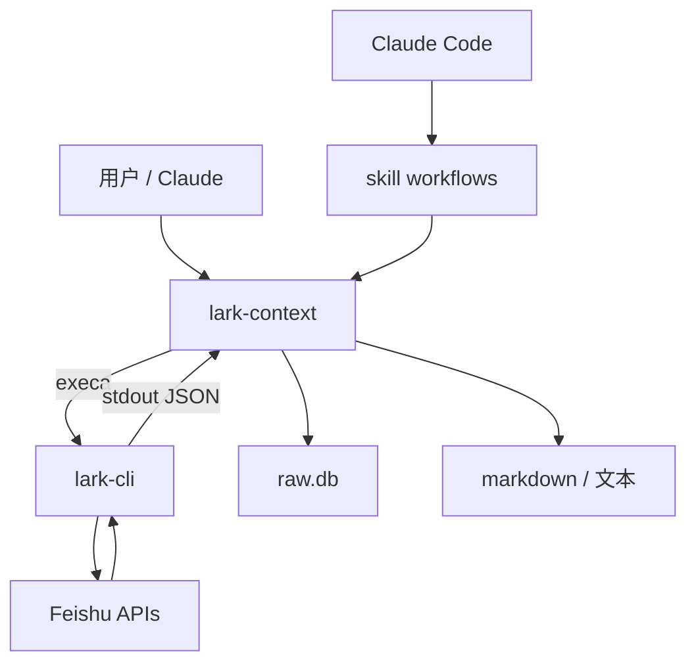

<details>
<summary>相关源文件</summary>

生成本页时使用的主要源文件：

- [src/cli.ts](../../../project-repos/lark-context/src/cli.ts)
- [src/lark.ts](../../../project-repos/lark-context/src/lark.ts)
- [src/config.ts](../../../project-repos/lark-context/src/config.ts)
- [src/commands/init.ts](../../../project-repos/lark-context/src/commands/init.ts)
- [README.md](../../../project-repos/lark-context/README.md)

</details>

# 系统架构

架构可以概括成三层：**飞书官方 CLI**负责鉴权与协议细节；**lark-context**把子进程输出收敛成类型化数据并写入 SQLite；**Claude skill**只在需要自然语言路由或文件级 digest 时介入。中间这一层的工程价值在于：业务代码从不直接拼 OpenAPI URL，而是依赖 `lark-cli` 的命令表面，**把权限模型、分页与 JSON schema 变更留在上游**。



**初始化链路**：`init` 先探测 `lark-cli --version`，再创建 `memory_dir` / `raw_dir`，必要时写出 blank `config.yaml`，最后 `initSchema` 建库——任何后续命令都假设这条路径已经走通。

## 配置加载的心智模型

`loadConfig` 先做三件事：**定位 YAML 路径**（环境变量 `LARK_CONTEXT_CONFIG` 优先）、**展开 `~`**（优先 `$HOME` 以匹配测试替身）、再把 `paths.memory_dir` / `paths.raw_dir` 与 CLI flag、环境变量做优先级合并。  
这套顺序保证：**脚本化场景可用 env 覆盖，不必改写用户 HOME 里的 yaml**。

## 错误与进程边界

`lark.ts` 把 `ENOENT` 单独映射为 `LarkNotFoundError`，其它非零退出合并 stderr 进 `LarkCLIError`；`pull` 在群维度捕获后者并 `disableChat`，避免单群损坏拖死批处理。  
`cli.ts` 还对 `stdout`/`stderr` 注册 `EPIPE` handler——当用户 `| head` 时进程安静退出，行为对齐 README 里“匹配 Python Click”的叙述。

Sources: [src/lark.ts:1-35](../../../project-repos/lark-context/src/lark.ts#L1-L35), [src/config.ts:95-133](../../../project-repos/lark-context/src/config.ts#L95-L133), [src/commands/init.ts:27-53](../../../project-repos/lark-context/src/commands/init.ts#L27-L53), [src/cli.ts:8-47](../../../project-repos/lark-context/src/cli.ts#L8-L47)

<details class="source-snippets">
<summary>引用源码</summary>

<!-- source-snippets:start -->

#### `src/lark.ts:1-35`

```typescript
import { execa } from "execa";

export const BINARY = "lark-cli";

export class LarkCLIError extends Error {}
export class LarkNotFoundError extends Error {}

async function invoke(args: string[]): Promise<string> {
  try {
    const r = await execa(BINARY, args, { reject: true });
    return r.stdout;
  } catch (err: unknown) {
    const e = err as { code?: string; exitCode?: number; stderr?: string };
    if (e?.code === "ENOENT") {
      throw new LarkNotFoundError(
        `\`${BINARY}\` binary not found on PATH. See https://github.com/larksuite/cli for install instructions.`,
      );
    }
    const stderr = (e?.stderr ?? "").toString().trim();
    throw new LarkCLIError(stderr || `lark exited ${e?.exitCode ?? "?"}`);
  }
}

export async function runJson(args: string[]): Promise<unknown> {
  const out = await invoke([...args, "--format", "json"]);
  return JSON.parse(out);
}

export async function* runNdjson(args: string[]): AsyncGenerator<unknown> {
  const out = await invoke([...args, "--format", "ndjson"]);
  for (const line of out.split("\n")) {
    const trimmed = line.trim();
    if (trimmed) yield JSON.parse(trimmed);
  }
}
```

#### `src/config.ts:95-133`

```typescript
export function loadConfig(opts: LoadConfigOptions = {}): Config {
  const configPath = opts.configPathOverride
    ? expandHome(opts.configPathOverride)
    : defaultConfigPath();
  let yamlData: Record<string, unknown> = {};
  if (existsSync(configPath)) {
    const parsed = YAML.parse(readFileSync(configPath, "utf8"));
    if (parsed && typeof parsed === "object" && !Array.isArray(parsed)) {
      yamlData = parsed as Record<string, unknown>;
    }
  }
  const pathsRaw = yamlData.paths;
  const pathsSection: Record<string, unknown> =
    pathsRaw && typeof pathsRaw === "object" && !Array.isArray(pathsRaw)
      ? (pathsRaw as Record<string, unknown>)
      : {};
  const memoryDir = resolvePath(
    opts.memoryDirOverride,
    ENV_MEMORY,
    typeof pathsSection.memory_dir === "string"
      ? pathsSection.memory_dir
      : undefined,
    "~/.claude/lark-memory",
  );
  const rawDir = resolvePath(
    opts.rawDirOverride,
    ENV_RAW,
    typeof pathsSection.raw_dir === "string"
      ? pathsSection.raw_dir
      : undefined,
    "~/.lark-context",
  );
  return {
    memoryDir,
    rawDir,
    groups: parseGroups(yamlData.groups),
    configPath,
  };
}
```

#### `src/commands/init.ts:27-53`

```typescript
export async function runInit(opts: InitOpts = {}): Promise<void> {
  if (opts.checkLarkCli !== false) {
    const check = opts._pathCheck ?? defaultPathCheck;
    if (!(await check())) {
      throw new Error(
        "`lark-cli` binary not found on PATH. Install: `bnpm i -g @larksuite/cli` (or `npm i -g @larksuite/cli`), then `lark-cli auth login`.",
      );
    }
  }
  const cfg = loadConfig({
    configPathOverride: opts.configPathOverride,
    memoryDirOverride: opts.memoryDirOverride,
    rawDirOverride: opts.rawDirOverride,
  });
  mkdirSync(cfg.memoryDir, { recursive: true });
  mkdirSync(cfg.rawDir, { recursive: true });
  if (cfg.configPath && !existsSync(cfg.configPath)) {
    const fresh: Config = {
      memoryDir: cfg.memoryDir,
      rawDir: cfg.rawDir,
      groups: [],
      configPath: cfg.configPath,
    };
    saveConfig(fresh);
  }
  initSchema(join(cfg.rawDir, "raw.db"));
  process.stdout.write(`Initialized lark-context at ${cfg.configPath}\n`);
```

#### `src/cli.ts:8-47`

```typescript
// Silently exit on EPIPE (pipes to head/less etc.), matching Python's Click behavior.
for (const stream of [process.stdout, process.stderr]) {
  stream.on("error", (err: NodeJS.ErrnoException) => {
    if (err.code === "EPIPE") process.exit(0);
    throw err;
  });
}

import { registerIngestDoc } from "./commands/ingestDoc.js";
import { registerInit } from "./commands/init.js";
import { registerListGroups } from "./commands/listGroups.js";
import { registerPull } from "./commands/pull.js";
import { registerShow, registerShowDoc } from "./commands/show.js";

// 从 package.json 动态读版本，避免手动维护两份的漂移
function readPkgVersion(): string {
  try {
    const here = dirname(fileURLToPath(import.meta.url));
    const pkg = JSON.parse(
      readFileSync(join(here, "..", "package.json"), "utf8"),
    );
    return typeof pkg.version === "string" ? pkg.version : "0.0.0";
  } catch {
    return "0.0.0";
  }
}

const program = new Command();
program
  .name("lark-context")
  .description("Feishu context bridge for Claude Code")
  .version(readPkgVersion());

registerInit(program);
registerListGroups(program);
registerGroups(program);
registerPull(program);
registerIngestDoc(program);
registerShow(program);
registerShowDoc(program);
```

<!-- source-snippets:end -->
</details>

## 相关页面

- [SQLite 数据模型](sqlite-data-model.md) — schema 与迁移  
- [Claude Skill 与工作流](skill-workflows.md) — 为何不把 digest 写进 TS  
- [配置、路径与隐私边界](config-and-privacy.md) — env / yaml 全表  
