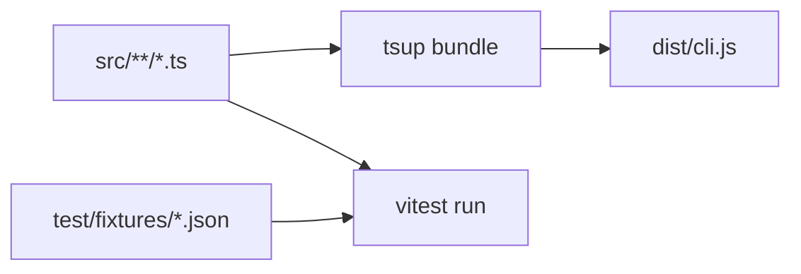

<details>
<summary>相关源文件</summary>

生成本页时使用的主要源文件：

- [package.json](../../../project-repos/lark-context/package.json)
- [tsup.config.ts](../../../project-repos/lark-context/tsup.config.ts)
- [test/cmd-pull.test.ts](../../../project-repos/lark-context/test/cmd-pull.test.ts)
- [legacy/python/pyproject.toml](../../../project-repos/lark-context/legacy/python/pyproject.toml)
- [legacy/python/README.md](../../../project-repos/lark-context/legacy/python/README.md)

</details>

# 测试、构建与 Python 遗留

TypeScript 侧采用 **`tsup` 单入口 `src/cli.ts`（ESM, Node 18）** 产出 `dist/cli.js`，`package.json` 的 `prepublishOnly` 要求发布前 `pnpm build && pnpm test`。测试使用 **Vitest**，对 `pull`/`show` 等命令通过注入 `runPull({ ... })` 和 memory writer 替身，绕过真实 `lark-cli`。



## Vitest 关注的回归点

`test/cmd-pull.test.ts` 同时覆盖：**内嵌 `thread_replies` 落库** 与 `--no-threads` 行为差异——这与生产路径上的线程可靠性直接相关。fixtures 中的 JSON 结构刻意镜像真实 `lark-cli` 响应字段，减少“测试得太理想”导致的假绿。

## legacy/python 的定位

`legacy/python/pyproject.toml` 描述旧 Click + pytest 实现；README 说明其命令与 TS 版平行，用于迁移期对照。**新功能应以 TS 与 Vitest 为真源**，Python 套件主要承担历史兼容与验证职责。

Sources: [package.json:13-35](../../../project-repos/lark-context/package.json#L13-L35), [tsup.config.ts:1-10](../../../project-repos/lark-context/tsup.config.ts#L1-L10), [test/cmd-pull.test.ts:1-40](../../../project-repos/lark-context/test/cmd-pull.test.ts#L1-L40), [legacy/python/README.md:1-60](../../../project-repos/lark-context/legacy/python/README.md#L1-L60)

<details class="source-snippets">
<summary>引用源码</summary>

<!-- source-snippets:start -->

#### `package.json:13-35`

```json
  "scripts": {
    "build": "tsup",
    "test": "vitest run",
    "test:watch": "vitest",
    "typecheck": "tsc --noEmit",
    "prepublishOnly": "pnpm build && pnpm test"
  },
  "dependencies": {
    "better-sqlite3": "^11.0.0",
    "commander": "^12.0.0",
    "execa": "^9.0.0",
    "yaml": "^2.4.0"
  },
  "devDependencies": {
    "@types/better-sqlite3": "^7.6.0",
    "@types/node": "^20.0.0",
    "tsup": "^8.0.0",
    "typescript": "^5.4.0",
    "vitest": "^1.5.0"
  },
  "pnpm": {
    "onlyBuiltDependencies": ["better-sqlite3"]
  }
```

#### `tsup.config.ts:1-10`

```typescript
import { defineConfig } from "tsup";

export default defineConfig({
  entry: { cli: "src/cli.ts" },
  format: ["esm"],
  target: "node18",
  clean: true,
  sourcemap: true,
  shims: true,
});
```

#### `test/cmd-pull.test.ts:1-40`

```typescript
import { describe, it, expect, vi, beforeEach, afterEach } from "vitest";
import { mkdtempSync, rmSync, readFileSync } from "node:fs";
import { tmpdir } from "node:os";
import { join, dirname } from "node:path";
import { fileURLToPath } from "node:url";

vi.mock("../src/lark.js", () => ({
  runJson: vi.fn(),
  LarkCLIError: class extends Error {},
  LarkNotFoundError: class extends Error {},
}));

import { runJson, LarkCLIError } from "../src/lark.js";
import { runPull, toIso } from "../src/commands/pull.js";
import { runInit } from "../src/commands/init.js";
import { runAdd } from "../src/commands/groups.js";
import { loadConfig, saveConfig, type Config } from "../src/config.js";
import { connect } from "../src/db.js";

const mockRunJson = vi.mocked(runJson);
const __dirname = dirname(fileURLToPath(import.meta.url));

function loadFixture(name: string) {
  return JSON.parse(
    readFileSync(join(__dirname, "fixtures", name), "utf8"),
  );
}

const LARK_ENV = [
  "LARK_CONTEXT_CONFIG",
  "LARK_CONTEXT_MEMORY_DIR",
  "LARK_CONTEXT_RAW_DIR",
];
let tmp: string;
let configPath: string;
const savedEnv: Record<string, string | undefined> = {};

async function setup() {
  await runInit({
    configPathOverride: configPath,
```

#### `legacy/python/README.md:1-60`

```markdown
# lark-context — Python 历史实现

这是 TS port 之前的 Python 实现，**已冻结**，不再演进。

- 本目录保留目的：port 过程中作语义对照、万一 TS 版出 bug 时回退跑
- **不再接受 PR / 测试更新**
- 跑法：

    cd legacy/python
    python3 -m venv .venv
    . .venv/bin/activate
    pip install -e '.[dev]'
    pytest -q       # 应该 59 passed

V1 TS 版发布（`@tiktok-fe/lark-context` ≥ 0.1.0）后，推荐删除本目录。
```

<!-- source-snippets:end -->
</details>

## 相关页面

- [CLI 命令参考](cli-commands.md) — 开发时如何本地 `pnpm link`  
- [仓库地图与阅读路线](repository-map.md) — TS / Python 目录关系  
- [增量拉取与话题回复](pull-and-threads.md) — 测试如何模拟线程  
