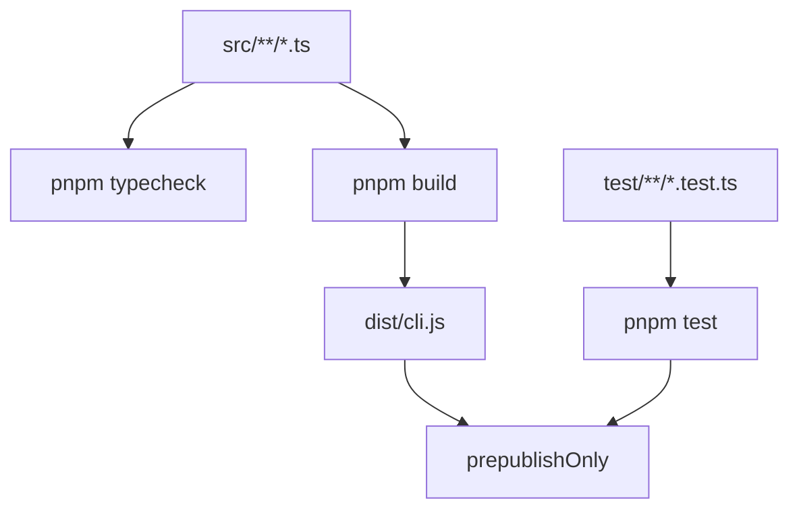
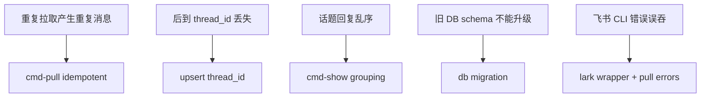

<details>
<summary>相关源文件</summary>

生成本页时使用的主要源文件：

- [package.json](../../../project-repos/lark-context/package.json)
- [tsup.config.ts](../../../project-repos/lark-context/tsup.config.ts)
- [tsconfig.json](../../../project-repos/lark-context/tsconfig.json)
- [vitest.config.ts](../../../project-repos/lark-context/vitest.config.ts)
- [README.md](../../../project-repos/lark-context/README.md)
- [legacy/python/README.md](../../../project-repos/lark-context/legacy/python/README.md)
- [legacy/python/pyproject.toml](../../../project-repos/lark-context/legacy/python/pyproject.toml)
- [test/cmd-pull.test.ts](../../../project-repos/lark-context/test/cmd-pull.test.ts)
- [test/db.test.ts](../../../project-repos/lark-context/test/db.test.ts)

</details>

# 测试、发布与边界

项目当前没有检测到 CI 配置，质量门槛主要写在 `package.json` 脚本和 Vitest 测试中。发布前脚本是 `pnpm build && pnpm test`，构建目标是 Node 18 的 ESM CLI。Sources: [00-repo-inventory.md:30-55](../00-repo-inventory.md#L30-L55), [package.json:10-19](../../../project-repos/lark-context/package.json#L10-L19), [tsup.config.ts:1-10](../../../project-repos/lark-context/tsup.config.ts#L1-L10)

<details class="source-snippets">
<summary>引用源码</summary>

<!-- source-snippets:start -->

#### `00-repo-inventory.md:30-55`

```markdown
## Documentation

- `README.md`
- `docs/slash-commands/lark-digest.md`
- `docs/superpowers/plans/2026-04-19-lark-context-v1.md`
- `docs/superpowers/plans/2026-04-20-lark-context-skillification.md`
- `docs/superpowers/plans/2026-04-20-lark-context-thread-replies.md`
- `docs/superpowers/specs/2026-04-19-lark-context-design.md`
- `docs/superpowers/specs/2026-04-20-lark-context-skillification-design.md`
- `docs/superpowers/specs/2026-04-20-lark-context-thread-replies-design.md`
- `docs/如何迁移电脑.md`
- `legacy/python/README.md`

## CI and Automation

- None detected

## Tests

- `legacy/python/tests/__init__.py`
- `legacy/python/tests/conftest.py`
- `legacy/python/tests/fixtures/lark_chats_list.json`
- `legacy/python/tests/fixtures/lark_docx_blocks.json`
- `legacy/python/tests/fixtures/lark_messages_page1.json`
- `legacy/python/tests/fixtures/lark_messages_page2.json`
- `legacy/python/tests/unit/__init__.py`
```

#### `package.json:10-19`

```json
  "engines": {
    "node": ">=18"
  },
  "scripts": {
    "build": "tsup",
    "test": "vitest run",
    "test:watch": "vitest",
    "typecheck": "tsc --noEmit",
    "prepublishOnly": "pnpm build && pnpm test"
  },
```

#### `tsup.config.ts:1-10`

```typescript
import { defineConfig } from "tsup";

export default defineConfig({
  entry: { cli: "src/cli.ts" },
  format: ["esm"],
  target: "node18",
  clean: true,
  sourcemap: true,
  shims: true,
});
```

<!-- source-snippets:end -->
</details>
## 构建与发布



Sources: [package.json:13-19](../../../project-repos/lark-context/package.json#L13-L19), [package.json:20-35](../../../project-repos/lark-context/package.json#L20-L35), [tsup.config.ts:1-10](../../../project-repos/lark-context/tsup.config.ts#L1-L10), [tsconfig.json:1-17](../../../project-repos/lark-context/tsconfig.json#L1-L17)

<details class="source-snippets">
<summary>引用源码</summary>

<!-- source-snippets:start -->

#### `package.json:13-19`

```json
  "scripts": {
    "build": "tsup",
    "test": "vitest run",
    "test:watch": "vitest",
    "typecheck": "tsc --noEmit",
    "prepublishOnly": "pnpm build && pnpm test"
  },
```

#### `package.json:20-35`

```json
  "dependencies": {
    "better-sqlite3": "^11.0.0",
    "commander": "^12.0.0",
    "execa": "^9.0.0",
    "yaml": "^2.4.0"
  },
  "devDependencies": {
    "@types/better-sqlite3": "^7.6.0",
    "@types/node": "^20.0.0",
    "tsup": "^8.0.0",
    "typescript": "^5.4.0",
    "vitest": "^1.5.0"
  },
  "pnpm": {
    "onlyBuiltDependencies": ["better-sqlite3"]
  }
```

#### `tsup.config.ts:1-10`

```typescript
import { defineConfig } from "tsup";

export default defineConfig({
  entry: { cli: "src/cli.ts" },
  format: ["esm"],
  target: "node18",
  clean: true,
  sourcemap: true,
  shims: true,
});
```

#### `tsconfig.json:1-17`

```json
{
  "compilerOptions": {
    "target": "ES2022",
    "module": "ESNext",
    "moduleResolution": "Bundler",
    "strict": true,
    "esModuleInterop": true,
    "skipLibCheck": true,
    "forceConsistentCasingInFileNames": true,
    "resolveJsonModule": true,
    "outDir": "dist",
    "declaration": false,
    "sourceMap": true
  },
  "include": ["src/**/*.ts", "test/**/*.ts"],
  "exclude": ["node_modules", "dist", "legacy"]
}
```

<!-- source-snippets:end -->
</details>
`package.json` 只发布 `dist/*.js`，二进制入口是 `./dist/cli.js`。`better-sqlite3` 被列为 `onlyBuiltDependencies`，说明安装时需要允许该 native 依赖构建。Sources: [package.json:6-12](../../../project-repos/lark-context/package.json#L6-L12), [package.json:20-35](../../../project-repos/lark-context/package.json#L20-L35)

<details class="source-snippets">
<summary>引用源码</summary>

<!-- source-snippets:start -->

#### `package.json:6-12`

```json
  "bin": {
    "lark-context": "./dist/cli.js"
  },
  "files": ["dist/*.js"],
  "engines": {
    "node": ">=18"
  },
```

#### `package.json:20-35`

```json
  "dependencies": {
    "better-sqlite3": "^11.0.0",
    "commander": "^12.0.0",
    "execa": "^9.0.0",
    "yaml": "^2.4.0"
  },
  "devDependencies": {
    "@types/better-sqlite3": "^7.6.0",
    "@types/node": "^20.0.0",
    "tsup": "^8.0.0",
    "typescript": "^5.4.0",
    "vitest": "^1.5.0"
  },
  "pnpm": {
    "onlyBuiltDependencies": ["better-sqlite3"]
  }
```

<!-- source-snippets:end -->
</details>
## 测试布局

Vitest 配置运行在 Node 环境，测试入口是 `test/**/*.test.ts`。测试覆盖了配置、DB、Lark CLI wrapper、初始化、群管理、拉取、文档入库、show 渲染和 CLI smoke。Sources: [vitest.config.ts:1-9](../../../project-repos/lark-context/vitest.config.ts#L1-L9), [00-repo-inventory.md:37-55](../00-repo-inventory.md#L37-L55)

<details class="source-snippets">
<summary>引用源码</summary>

<!-- source-snippets:start -->

#### `vitest.config.ts:1-9`

```typescript
import { defineConfig } from "vitest/config";

export default defineConfig({
  test: {
    environment: "node",
    globals: false,
    include: ["test/**/*.test.ts"],
  },
});
```

#### `00-repo-inventory.md:37-55`

```markdown
- `docs/superpowers/specs/2026-04-19-lark-context-design.md`
- `docs/superpowers/specs/2026-04-20-lark-context-skillification-design.md`
- `docs/superpowers/specs/2026-04-20-lark-context-thread-replies-design.md`
- `docs/如何迁移电脑.md`
- `legacy/python/README.md`

## CI and Automation

- None detected

## Tests

- `legacy/python/tests/__init__.py`
- `legacy/python/tests/conftest.py`
- `legacy/python/tests/fixtures/lark_chats_list.json`
- `legacy/python/tests/fixtures/lark_docx_blocks.json`
- `legacy/python/tests/fixtures/lark_messages_page1.json`
- `legacy/python/tests/fixtures/lark_messages_page2.json`
- `legacy/python/tests/unit/__init__.py`
```

<!-- source-snippets:end -->
</details>
| 测试文件 | 覆盖重点 |
|---|---|
| `test/config.test.ts` | 路径优先级、YAML 解析、保存回写、重复 alias |
| `test/db.test.ts` | schema、迁移、thread 字段、索引、KV |
| `test/lark.test.ts` | `lark-cli` 调用参数、JSON/NDJSON、错误分类 |
| `test/cmd-groups.test.ts` | 白名单增删查和 DB enabled 同步 |
| `test/cmd-pull.test.ts` | 分页、幂等、thread replies、窗口、错误隔离 |
| `test/cmd-ingest-doc.test.ts` | URL/token 解析、docs upsert、错误透传 |
| `test/cmd-show.test.ts` | 时间窗口、docs 列表、thread 分组、show-doc |

Sources: [test/config.test.ts:44-148](../../../project-repos/lark-context/test/config.test.ts#L44-L148), [test/db.test.ts:15-80](../../../project-repos/lark-context/test/db.test.ts#L15-L80), [test/lark.test.ts:20-116](../../../project-repos/lark-context/test/lark.test.ts#L20-L116), [test/cmd-pull.test.ts:88-197](../../../project-repos/lark-context/test/cmd-pull.test.ts#L88-L197), [test/cmd-ingest-doc.test.ts:65-148](../../../project-repos/lark-context/test/cmd-ingest-doc.test.ts#L65-L148), [test/cmd-show.test.ts:155-237](../../../project-repos/lark-context/test/cmd-show.test.ts#L155-L237)

<details class="source-snippets">
<summary>引用源码</summary>

<!-- source-snippets:start -->

#### `test/config.test.ts:44-148`

```typescript
  it("returns defaults when file missing", () => {
    const cfg = loadConfig();
    expect(cfg.memoryDir).toBe(join(tmpHome, ".claude", "lark-memory"));
    expect(cfg.rawDir).toBe(join(tmpHome, ".lark-context"));
    expect(cfg.groups).toEqual([]);
  });

  it("yaml paths + groups are parsed", () => {
    writeYaml(join(tmpHome, ".lark-context", "config.yaml"), {
      paths: {
        memory_dir: join(tmpHome, "mem"),
        raw_dir: join(tmpHome, "raw"),
      },
      groups: [
        {
          alias: "alpha",
          chat_id: "oc_aaa",
          name: "Alpha",
          enabled: true,
        },
      ],
    });
    const cfg = loadConfig();
    expect(cfg.memoryDir).toBe(join(tmpHome, "mem"));
    expect(cfg.rawDir).toBe(join(tmpHome, "raw"));
    expect(cfg.groups).toEqual<GroupConfig[]>([
      { alias: "alpha", chatId: "oc_aaa", name: "Alpha", enabled: true },
    ]);
  });

  it("env var beats yaml", () => {
    writeYaml(join(tmpHome, ".lark-context", "config.yaml"), {
      paths: {
        memory_dir: join(tmpHome, "mem"),
        raw_dir: join(tmpHome, "raw"),
      },
    });
    process.env.LARK_CONTEXT_MEMORY_DIR = join(tmpHome, "env-mem");
    const cfg = loadConfig();
    expect(cfg.memoryDir).toBe(join(tmpHome, "env-mem"));
    expect(cfg.rawDir).toBe(join(tmpHome, "raw"));
  });

  it("flag beats env", () => {
    process.env.LARK_CONTEXT_MEMORY_DIR = join(tmpHome, "env-mem");
    const cfg = loadConfig({ memoryDirOverride: join(tmpHome, "flag-mem") });
    expect(cfg.memoryDir).toBe(join(tmpHome, "flag-mem"));
  });

  it("save/load round-trip", () => {
    const cfg: Config = {
      memoryDir: join(tmpHome, "mem"),
      rawDir: join(tmpHome, "raw"),
      groups: [{ alias: "a", chatId: "oc_1", name: "A", enabled: true }],
      configPath: join(tmpHome, ".lark-context", "config.yaml"),
    };
    saveConfig(cfg);
    const reloaded = loadConfig();
    expect(reloaded.groups[0].alias).toBe("a");
    expect(reloaded.memoryDir).toBe(join(tmpHome, "mem"));
  });

  it("saves ~/path for dirs under HOME", () => {
    const cfg: Config = {
      memoryDir: join(tmpHome, ".claude", "lark-memory"),
      rawDir: join(tmpHome, ".lark-context"),
      groups: [],
      configPath: join(tmpHome, ".lark-context", "config.yaml"),
    };
    saveConfig(cfg);
    const text = readFileSync(
      join(tmpHome, ".lark-context", "config.yaml"),
      "utf8",
    );
    expect(text).toContain("memory_dir: ~/.claude/lark-memory");
    expect(text).toContain("raw_dir: ~/.lark-context");
    expect(text).not.toContain(tmpHome);
  });

  it("keeps /var/... absolute", () => {
    const outOfHome = "/var/fake_mem";
    const cfg: Config = {
      memoryDir: outOfHome,
      rawDir: outOfHome,
      groups: [],
      configPath: join(tmpHome, ".lark-context", "config.yaml"),
    };
    saveConfig(cfg);
    const text = readFileSync(
      join(tmpHome, ".lark-context", "config.yaml"),
      "utf8",
    );
    expect(text).toContain("/var/fake_mem");
    expect(text).not.toContain("~");
  });

  it("rejects duplicate alias", () => {
    writeYaml(join(tmpHome, ".lark-context", "config.yaml"), {
      groups: [
        { alias: "a", chat_id: "oc_1" },
        { alias: "a", chat_id: "oc_2" },
      ],
    });
    expect(() => loadConfig()).toThrow(/duplicate alias/);
  });
```

#### `test/db.test.ts:15-80`

```typescript
describe("initSchema", () => {
  it("creates chats/messages/docs/kv tables", () => {
    const dbPath = join(tmp, "raw.db");
    initSchema(dbPath);
    const db = connect(dbPath);
    try {
      const rows = db
        .prepare(
          "SELECT name FROM sqlite_master WHERE type='table' ORDER BY name",
        )
        .all() as Array<{ name: string }>;
      const names = rows.map((r) => r.name);
      expect(names).toEqual(
        expect.arrayContaining(["chats", "messages", "docs", "kv"]),
      );
    } finally {
      db.close();
    }
  });

  it("creates parent dir if missing", () => {
    const dbPath = join(tmp, "sub", "raw.db");
    initSchema(dbPath);
    expect(existsSync(dbPath)).toBe(true);
  });

  it("is idempotent — running twice doesn't error", () => {
    const dbPath = join(tmp, "raw.db");
    initSchema(dbPath);
    initSchema(dbPath); // should not throw
    expect(existsSync(dbPath)).toBe(true);
  });

  it("messages table has thread_id and is_thread_reply columns", () => {
    const dbPath = join(tmp, "raw.db");
    initSchema(dbPath);
    const db = connect(dbPath);
    try {
      const cols = db
        .prepare("PRAGMA table_info(messages)")
        .all() as Array<{ name: string; type: string; dflt_value: unknown }>;
      const byName = Object.fromEntries(cols.map((c) => [c.name, c]));
      expect(byName.thread_id).toBeDefined();
      expect(byName.thread_id.type).toBe("TEXT");
      expect(byName.is_thread_reply).toBeDefined();
      expect(byName.is_thread_reply.type).toBe("INTEGER");
    } finally {
      db.close();
    }
  });

  it("creates idx_messages_chat_thread index", () => {
    const dbPath = join(tmp, "raw.db");
    initSchema(dbPath);
    const db = connect(dbPath);
    try {
      const idx = db
        .prepare(
          "SELECT name FROM sqlite_master WHERE type='index' AND name='idx_messages_chat_thread'",
        )
        .get() as { name: string } | undefined;
      expect(idx?.name).toBe("idx_messages_chat_thread");
    } finally {
      db.close();
    }
  });
```

#### `test/lark.test.ts:20-116`

```typescript
describe("runJson", () => {
  it("appends --format json and parses JSON stdout", async () => {
    mockExeca.mockResolvedValueOnce({
      stdout: '{"a":1,"b":[2,3]}',
      stderr: "",
      exitCode: 0,
    } as any);

    const out = await runJson(["im", "+chat-messages-list"]);

    expect(out).toEqual({ a: 1, b: [2, 3] });
    const call = mockExeca.mock.calls[0];
    expect(call[0]).toBe(BINARY);
    expect(call[1]).toEqual([
      "im",
      "+chat-messages-list",
      "--format",
      "json",
    ]);
  });

  it("throws LarkNotFoundError when binary missing (ENOENT)", async () => {
    mockExeca.mockRejectedValue(
      Object.assign(new Error("spawn ENOENT"), { code: "ENOENT" }),
    );

    await expect(runJson(["x"])).rejects.toBeInstanceOf(LarkNotFoundError);
    await expect(runJson(["x"])).rejects.toThrow(/lark-cli.*not found/i);
  });

  it("throws LarkCLIError on non-zero exit with stderr", async () => {
    mockExeca.mockRejectedValueOnce(
      Object.assign(new Error("failed"), {
        exitCode: 1,
        stderr: "permission denied",
      }),
    );

    const err = (await runJson(["x"]).catch((e) => e)) as Error;
    expect(err).toBeInstanceOf(LarkCLIError);
    expect(err.message).toBe("permission denied");
  });

  it("LarkCLIError falls back when stderr empty", async () => {
    mockExeca.mockRejectedValueOnce(
      Object.assign(new Error("failed"), { exitCode: 2, stderr: "" }),
    );

    const err = (await runJson(["x"]).catch((e) => e)) as Error;
    expect(err).toBeInstanceOf(LarkCLIError);
    expect(err.message).toMatch(/exited 2/);
  });
});

describe("runNdjson", () => {
  it("appends --format ndjson and yields one object per line", async () => {
    mockExeca.mockResolvedValueOnce({
      stdout: '{"a":1}\n{"a":2}\n{"a":3}\n',
      stderr: "",
      exitCode: 0,
    } as any);

    const out: unknown[] = [];
    for await (const row of runNdjson(["list"])) out.push(row);

    expect(out).toEqual([{ a: 1 }, { a: 2 }, { a: 3 }]);
    const call = mockExeca.mock.calls[0];
    expect(call[1]).toEqual(["list", "--format", "ndjson"]);
  });

  it("skips empty lines", async () => {
    mockExeca.mockResolvedValueOnce({
      stdout: '{"a":1}\n\n{"a":2}\n   \n',
      stderr: "",
      exitCode: 0,
    } as any);

    const out: unknown[] = [];
    for await (const row of runNdjson(["x"])) out.push(row);

    expect(out).toEqual([{ a: 1 }, { a: 2 }]);
  });

  it("propagates LarkNotFoundError", async () => {
    mockExeca.mockRejectedValueOnce(
      Object.assign(new Error("spawn ENOENT"), { code: "ENOENT" }),
    );

    const run = async () => {
      const out: unknown[] = [];
      for await (const r of runNdjson(["x"])) out.push(r);
      return out;
    };

    await expect(run()).rejects.toBeInstanceOf(LarkNotFoundError);
  });
});
```

#### `test/cmd-pull.test.ts:88-197`

```typescript
describe("runPull — single chat end-to-end", () => {
  it("inserts all messages across 2 pages and updates last_cursor", async () => {
    await setup();
    mockRunJson.mockImplementation(async (args: string[]) => {
      if (args.includes("+chat-messages-list")) {
        const token = args.indexOf("--page-token");
        if (token === -1) return loadFixture("lark_messages_page1.json");
        return loadFixture("lark_messages_page2.json");
      }
      if (args.includes("+threads-messages-list")) {
        return { ok: true, data: { has_more: false, messages: [] } };
      }
      throw new Error(`unexpected: ${args.join(" ")}`);
    });

    const total = await runPull({ chatAlias: "alpha" });
    expect(total).toBe(3);

    const cfg = loadConfig();
    const db = connect(join(cfg.rawDir, "raw.db"));
    try {
      const rows = db
        .prepare(
          "SELECT id, sender_name, content_text, reply_to FROM messages ORDER BY create_time",
        )
        .all();
      expect(rows).toEqual([
        { id: "m1", sender_name: "张三", content_text: "早", reply_to: null },
        { id: "m2", sender_name: "李四", content_text: "早呀", reply_to: null },
        { id: "m3", sender_name: "张三", content_text: "晚点聊", reply_to: null },
      ]);
      const cursor = db
        .prepare("SELECT last_cursor, last_pulled_at FROM chats WHERE alias='alpha'")
        .get() as { last_cursor: string; last_pulled_at: string };
      expect(cursor.last_cursor).toBe("2026-04-18T09:10:00");
      expect(cursor.last_pulled_at).toBeTruthy();
    } finally {
      db.close();
    }
  });

  it("stores thread_id for top-level messages with is_thread_reply=0", async () => {
    await setup();
    mockRunJson.mockImplementation(async (args: string[]) => {
      if (args.includes("+chat-messages-list")) {
        const token = args.indexOf("--page-token");
        if (token === -1) return loadFixture("lark_messages_page1.json");
        return loadFixture("lark_messages_page2.json");
      }
      if (args.includes("+threads-messages-list")) {
        return { ok: true, data: { has_more: false, messages: [] } };
      }
      throw new Error(`unexpected: ${args.join(" ")}`);
    });

    await runPull({ chatAlias: "alpha" });

    const cfg = loadConfig();
    const db = connect(join(cfg.rawDir, "raw.db"));
    try {
      const rows = db
        .prepare(
          "SELECT id, thread_id, is_thread_reply FROM messages ORDER BY create_time",
        )
        .all() as Array<{ id: string; thread_id: string | null; is_thread_reply: number }>;
      expect(rows).toEqual([
        { id: "m1", thread_id: "omt_m1_thread", is_thread_reply: 0 },
        { id: "m2", thread_id: null, is_thread_reply: 0 },
        { id: "m3", thread_id: null, is_thread_reply: 0 },
      ]);
    } finally {
      db.close();
    }
  });

  it("second run with no new messages is idempotent (no duplicates)", async () => {
    await setup();
    mockRunJson.mockImplementation(async (args: string[]) => {
      if (args.includes("+chat-messages-list")) {
        const token = args.indexOf("--page-token");
        if (token === -1) return loadFixture("lark_messages_page1.json");
        return loadFixture("lark_messages_page2.json");
      }
      if (args.includes("+threads-messages-list")) {
        return { ok: true, data: { has_more: false, messages: [] } };
      }
      throw new Error(`unexpected: ${args.join(" ")}`);
    });
    await runPull({ chatAlias: "alpha" });

    mockRunJson.mockImplementation(async (args: string[]) => {
      if (args.includes("+chat-messages-list")) {
        return { ok: true, data: { has_more: false, page_token: null, messages: [] } };
      }
      if (args.includes("+threads-messages-list")) {
        return { ok: true, data: { has_more: false, messages: [] } };
      }
      throw new Error(`unexpected: ${args.join(" ")}`);
    });
    await runPull({ chatAlias: "alpha" });

    const cfg = loadConfig();
    const db = connect(join(cfg.rawDir, "raw.db"));
    try {
      const count = (db.prepare("SELECT COUNT(*) AS c FROM messages").get() as any).c;
      expect(count).toBe(3);
    } finally {
      db.close();
    }
  });
```

#### `test/cmd-ingest-doc.test.ts:65-148`

```typescript
describe("extractToken", () => {
  it("extracts from /docx/ URL", () => {
    expect(extractToken("https://t.feishu.cn/docx/XxxTokenXxx")).toBe("XxxTokenXxx");
  });
  it("extracts from /docs/ URL (with query string)", () => {
    expect(extractToken("https://t.feishu.cn/docs/abc123?from=copy")).toBe("abc123");
  });
  it("extracts from /wiki/ URL", () => {
    expect(extractToken("https://t.feishu.cn/wiki/wk_123")).toBe("wk_123");
  });
  it("accepts bytedance.larkoffice.com hosts", () => {
    expect(
      extractToken("https://bytedance.larkoffice.com/wiki/wikcn0SkJUoi7izEmSblqt67RNh"),
    ).toBe("wikcn0SkJUoi7izEmSblqt67RNh");
  });
  it("accepts sg.larkoffice.com hosts", () => {
    expect(
      extractToken("https://bytedance.sg.larkoffice.com/docx/ICHsdXR1nog0qCxCy9ml9au2gRc"),
    ).toBe("ICHsdXR1nog0qCxCy9ml9au2gRc");
  });
  it("accepts larksuite.com hosts", () => {
    expect(extractToken("https://example.larksuite.com/docx/tok1")).toBe("tok1");
  });
  it("accepts bare token", () => {
    expect(extractToken("docxxxxxxxxxxxxxxx")).toBe("docxxxxxxxxxxxxxxx");
  });
  it("rejects non-Lark URL", () => {
    expect(() => extractToken("https://example.com/foo")).toThrow();
  });
  it("rejects strings with slashes that aren't URLs", () => {
    expect(() => extractToken("foo/bar")).toThrow();
  });
});

describe("runIngestDoc", () => {
  it("persists title + markdown body + source='manual'", async () => {
    await freshInit();
    mockRunJson.mockResolvedValueOnce(FIXTURE);
    await runIngestDoc({ ref: "https://bytedance.feishu.cn/docx/XxxToken" });

    const cfg = loadConfig();
    const db = connect(join(cfg.rawDir, "raw.db"));
    try {
      const row = db
        .prepare("SELECT doc_token, title, content_md, source FROM docs")
        .get() as { doc_token: string; title: string; content_md: string; source: string };
      expect(row.doc_token).toBe("XxxToken");
      expect(row.title).toBe("项目 Alpha 架构评审 v3");
      expect(row.content_md).toContain("# 项目 Alpha 架构评审 v3");
      expect(row.content_md).toContain("## 里程碑");
      expect(row.content_md).toContain("- 周一：评审");
      expect(row.source).toBe("manual");
    } finally {
      db.close();
    }
  });

  it("second run upserts — no duplicate rows", async () => {
    await freshInit();
    mockRunJson.mockResolvedValue(FIXTURE);
    const url = "https://bytedance.feishu.cn/docx/XxxToken";
    await runIngestDoc({ ref: url });
    await runIngestDoc({ ref: url });
    const cfg = loadConfig();
    const db = connect(join(cfg.rawDir, "raw.db"));
    try {
      const count = (db.prepare("SELECT COUNT(*) AS c FROM docs").get() as any).c;
      expect(count).toBe(1);
    } finally {
      db.close();
    }
  });

  it("surfaces API error from ok:false response", async () => {
    await freshInit();
    mockRunJson.mockResolvedValueOnce({
      ok: false,
      error: { type: "mcp_error", message: "Unsupported document type" },
    });
    await expect(
      runIngestDoc({ ref: "https://bytedance.feishu.cn/docx/any" }),
    ).rejects.toThrow(/Unsupported document type/);
  });
});
```

#### `test/cmd-show.test.ts:155-237`

```typescript
describe("runShow", () => {
  it("filters messages by --since window", async () => {
    await setup();
    const cfg = loadConfig();
    const dbPath = join(cfg.rawDir, "raw.db");
    const now = new Date();
    insertMessage(dbPath, {
      id: "old",
      chat_alias: "alpha",
      sender_name: "Old",
      content_text: "ancient",
      create_time: new Date(now.getTime() - 30 * 86400 * 1000).toISOString(),
    });
    insertMessage(dbPath, {
      id: "new",
      chat_alias: "alpha",
      sender_name: "New",
      content_text: "fresh",
      create_time: new Date(now.getTime() - 3600 * 1000).toISOString(),
    });
    const out: string[] = [];
    await runShow({
      chatAlias: "alpha",
      since: "1d",
      write: (s) => out.push(s),
      _now: () => now,
    });
    const joined = out.join("");
    expect(joined).toContain("fresh");
    expect(joined).not.toContain("ancient");
  });

  it("lists recent ingested docs", async () => {
    await setup();
    const cfg = loadConfig();
    const dbPath = join(cfg.rawDir, "raw.db");
    const now = new Date();
    const db = connect(dbPath);
    try {
      db.prepare(
        "INSERT INTO docs(doc_token, url, title, content_md, fetched_at, source) " +
          "VALUES('tok', 'https://x.feishu.cn/docx/tok', '架构评审', '# 架构评审', ?, 'manual')",
      ).run(new Date(now.getTime() - 2 * 3600 * 1000).toISOString());
    } finally {
      db.close();
    }
    const out: string[] = [];
    await runShow({
      chatAlias: "alpha",
      since: "1d",
      write: (s) => out.push(s),
      _now: () => now,
    });
    const joined = out.join("");
    expect(joined).toContain("架构评审");
    expect(joined).toContain("tok");
    expect(joined).toContain("近期入库的文档");
  });

  it("--chat all iterates enabled groups", async () => {
    await setup();
    await runAdd({
      configPathOverride: configPath,
      chatId: "oc_bbb",
      alias: "bravo",
    });
    const out: string[] = [];
    await runShow({
      chatAlias: "all",
      since: "1d",
      write: (s) => out.push(s),
    });
    // Both chat names appear as headers
    expect(out.join("")).toContain("## Alpha");
    expect(out.join("")).toContain("## bravo");
  });

  it("unknown alias throws", async () => {
    await setup();
    await expect(
      runShow({ chatAlias: "ghost", since: "1d", write: () => {} }),
    ).rejects.toThrow(/unknown chat alias/);
  });
```

<!-- source-snippets:end -->
</details>
## 关键风险被哪些测试守住



Sources: [test/cmd-pull.test.ts:163-197](../../../project-repos/lark-context/test/cmd-pull.test.ts#L163-L197), [test/cmd-pull.test.ts:562-702](../../../project-repos/lark-context/test/cmd-pull.test.ts#L562-L702), [test/cmd-show.test.ts:239-335](../../../project-repos/lark-context/test/cmd-show.test.ts#L239-L335), [test/db.test.ts:82-145](../../../project-repos/lark-context/test/db.test.ts#L82-L145), [test/lark.test.ts:41-71](../../../project-repos/lark-context/test/lark.test.ts#L41-L71)

<details class="source-snippets">
<summary>引用源码</summary>

<!-- source-snippets:start -->

#### `test/cmd-pull.test.ts:163-197`

```typescript
  it("second run with no new messages is idempotent (no duplicates)", async () => {
    await setup();
    mockRunJson.mockImplementation(async (args: string[]) => {
      if (args.includes("+chat-messages-list")) {
        const token = args.indexOf("--page-token");
        if (token === -1) return loadFixture("lark_messages_page1.json");
        return loadFixture("lark_messages_page2.json");
      }
      if (args.includes("+threads-messages-list")) {
        return { ok: true, data: { has_more: false, messages: [] } };
      }
      throw new Error(`unexpected: ${args.join(" ")}`);
    });
    await runPull({ chatAlias: "alpha" });

    mockRunJson.mockImplementation(async (args: string[]) => {
      if (args.includes("+chat-messages-list")) {
        return { ok: true, data: { has_more: false, page_token: null, messages: [] } };
      }
      if (args.includes("+threads-messages-list")) {
        return { ok: true, data: { has_more: false, messages: [] } };
      }
      throw new Error(`unexpected: ${args.join(" ")}`);
    });
    await runPull({ chatAlias: "alpha" });

    const cfg = loadConfig();
    const db = connect(join(cfg.rawDir, "raw.db"));
    try {
      const count = (db.prepare("SELECT COUNT(*) AS c FROM messages").get() as any).c;
      expect(count).toBe(3);
    } finally {
      db.close();
    }
  });
```

#### `test/cmd-pull.test.ts:562-702`

```typescript
describe("runPull — upsert thread_id on re-pull", () => {
  it("updates thread_id on an existing row when subsequent pull returns it", async () => {
    await setup();

    // 首次 pull：父消息没有 thread_id（此时还没 reply）
    mockRunJson.mockImplementation(async (args: string[]) => {
      if (args.includes("+chat-messages-list")) {
        return {
          ok: true,
          data: {
            has_more: false,
            page_token: null,
            messages: [
              {
                message_id: "parent_upsert",
                msg_type: "text",
                content: "父消息",
                create_time: "2026-04-18 09:00",
                sender: { id: "ou_a", name: "A", sender_type: "user" },
              },
            ],
          },
        };
      }
      if (args.includes("+threads-messages-list")) {
        return { ok: true, data: { has_more: false, messages: [] } };
      }
      throw new Error(`unexpected: ${args.join(" ")}`);
    });

    await runPull({ chatAlias: "alpha" });

    const cfg = loadConfig();
    const db1 = connect(join(cfg.rawDir, "raw.db"));
    try {
      const row = db1
        .prepare("SELECT thread_id FROM messages WHERE id='parent_upsert'")
        .get();
      expect(row).toEqual({ thread_id: null });
      // 把 cursor 回退到父消息 create_time 之前，让第二次 pull 再次取到它
      db1
        .prepare("UPDATE chats SET last_cursor='2026-04-18T08:59:00' WHERE alias='alpha'")
        .run();
    } finally {
      db1.close();
    }

    // 第二次 pull：API 现在返回带 thread_id 的同一条 parent
    mockRunJson.mockImplementation(async (args: string[]) => {
      if (args.includes("+chat-messages-list")) {
        return {
          ok: true,
          data: {
            has_more: false,
            page_token: null,
            messages: [
              {
                message_id: "parent_upsert",
                msg_type: "text",
                content: "父消息",
                create_time: "2026-04-18 09:00",
                thread_id: "omt_upsert",
                sender: { id: "ou_a", name: "A", sender_type: "user" },
              },
            ],
          },
        };
      }
      if (args.includes("+threads-messages-list")) {
        return { ok: true, data: { has_more: false, messages: [] } };
      }
      throw new Error(`unexpected: ${args.join(" ")}`);
    });

    await runPull({ chatAlias: "alpha" });

    const db2 = connect(join(cfg.rawDir, "raw.db"));
    try {
      const row = db2
        .prepare("SELECT thread_id FROM messages WHERE id='parent_upsert'")
        .get();
      expect(row).toEqual({ thread_id: "omt_upsert" });
    } finally {
      db2.close();
    }
  });

  it("does not clobber an existing thread_id with null on re-pull", async () => {
    await setup();
    const cfg = loadConfig();
    const db = connect(join(cfg.rawDir, "raw.db"));
    try {
      db
        .prepare(
          "INSERT INTO messages(id, chat_alias, content_json, create_time, thread_id, is_thread_reply) " +
            "VALUES ('had_thread','alpha','{}','2026-04-18T09:00:00','omt_keep',0)",
        )
        .run();
      db.prepare("UPDATE chats SET last_cursor='2026-04-18T08:59:00' WHERE alias='alpha'").run();
    } finally {
      db.close();
    }

    // API 现在返回不含 thread_id 的同一条（API 端丢字段也不能反向覆盖）
    mockRunJson.mockImplementation(async (args: string[]) => {
      if (args.includes("+chat-messages-list")) {
        return {
          ok: true,
          data: {
            has_more: false,
            page_token: null,
            messages: [
              {
                message_id: "had_thread",
                msg_type: "text",
                content: "x",
                create_time: "2026-04-18 09:00",
                sender: { id: "ou_a", name: "A", sender_type: "user" },
              },
            ],
... snippet truncated ...
```

#### `test/cmd-show.test.ts:239-335`

```typescript
  it("groups thread replies under their top-level message with ↳ prefix", async () => {
    await setup();
    const cfg = loadConfig();
    const dbPath = join(cfg.rawDir, "raw.db");
    const now = new Date();
    const t = (minsAgo: number) =>
      new Date(now.getTime() - minsAgo * 60_000).toISOString();

    insertTopLevel(dbPath, {
      id: "top1",
      chat_alias: "alpha",
      sender_name: "唐文城",
      content_text: "低版本app怎么兜底？",
      create_time: t(30),
      thread_id: "omt_1",
    });
    insertThreadReply(dbPath, {
      id: "rep1",
      chat_alias: "alpha",
      thread_id: "omt_1",
      sender_name: "韦振宁",
      content_text: "老板本不适配",
      create_time: t(20),
    });
    insertTopLevel(dbPath, {
      id: "top2",
      chat_alias: "alpha",
      sender_name: "李四",
      content_text: "下一条顶层",
      create_time: t(10),
    });

    const out: string[] = [];
    await runShow({
      chatAlias: "alpha",
      since: "1d",
      write: (s) => out.push(s),
      _now: () => now,
    });
    const joined = out.join("");

    const iRoot = joined.indexOf("低版本app怎么兜底？");
    const iReply = joined.indexOf("老板本不适配");
    const iNext = joined.indexOf("下一条顶层");
    expect(iRoot).toBeGreaterThan(-1);
    expect(iReply).toBeGreaterThan(iRoot);
    expect(iNext).toBeGreaterThan(iReply);
    expect(joined).toContain("  ↳ **韦振宁**");
  });

  it("keeps thread reply grouped even when its create_time is later than next top-level", async () => {
    await setup();
    const cfg = loadConfig();
    const dbPath = join(cfg.rawDir, "raw.db");
    const now = new Date();
    const t = (minsAgo: number) =>
      new Date(now.getTime() - minsAgo * 60_000).toISOString();

    insertTopLevel(dbPath, {
      id: "top1",
      chat_alias: "alpha",
      sender_name: "唐",
      content_text: "问题",
      create_time: t(60),
      thread_id: "omt_1",
    });
    insertTopLevel(dbPath, {
      id: "top2",
      chat_alias: "alpha",
      sender_name: "李",
      content_text: "中间的顶层",
      create_time: t(40),
    });
    insertThreadReply(dbPath, {
      id: "rep_late",
      chat_alias: "alpha",
      thread_id: "omt_1",
      sender_name: "韦",
      content_text: "迟到的回复",
      create_time: t(10),
    });

    const out: string[] = [];
    await runShow({
      chatAlias: "alpha",
      since: "1d",
      write: (s) => out.push(s),
      _now: () => now,
    });
    const joined = out.join("");

    const iTop1 = joined.indexOf("问题");
    const iReply = joined.indexOf("迟到的回复");
    const iTop2 = joined.indexOf("中间的顶层");
    expect(iTop1).toBeLessThan(iReply);
    expect(iReply).toBeLessThan(iTop2);
  });
```

#### `test/db.test.ts:82-145`

```typescript
  it("migrates legacy schema (no thread_id column) in place", () => {
    const dbPath = join(tmp, "raw.db");
    const db = connect(dbPath);
    try {
      db.exec(`
        CREATE TABLE chats (
          alias TEXT PRIMARY KEY, chat_id TEXT NOT NULL UNIQUE, name TEXT,
          last_cursor TEXT, last_pulled_at TEXT, enabled INTEGER DEFAULT 1
        );
        CREATE TABLE messages (
          id TEXT PRIMARY KEY,
          chat_alias TEXT NOT NULL REFERENCES chats(alias),
          sender_id TEXT, sender_name TEXT, msg_type TEXT,
          content_json TEXT NOT NULL, content_text TEXT,
          reply_to TEXT, create_time TEXT NOT NULL
        );
        INSERT INTO chats(alias, chat_id, name) VALUES ('alpha', 'oc_a', 'Alpha');
        INSERT INTO messages(id, chat_alias, content_json, create_time)
          VALUES ('legacy1', 'alpha', '{}', '2026-01-01T00:00:00');
      `);
    } finally {
      db.close();
    }

    initSchema(dbPath);

    const db2 = connect(dbPath);
    try {
      const cols = db2
        .prepare("PRAGMA table_info(messages)")
        .all() as Array<{ name: string }>;
      expect(cols.map((c) => c.name)).toEqual(
        expect.arrayContaining(["thread_id", "is_thread_reply"]),
      );
      const row = db2
        .prepare(
          "SELECT id, thread_id, is_thread_reply FROM messages WHERE id='legacy1'",
        )
        .get() as { id: string; thread_id: string | null; is_thread_reply: number };
      expect(row.id).toBe("legacy1");
      expect(row.thread_id).toBeNull();
      expect(row.is_thread_reply).toBe(0);
    } finally {
      db2.close();
    }

    // re-run initSchema on already-migrated DB must be idempotent
    expect(() => initSchema(dbPath)).not.toThrow();
    const db3 = connect(dbPath);
    try {
      const cols = db3
        .prepare("PRAGMA table_info(messages)")
        .all() as Array<{ name: string }>;
      expect(cols.map((c) => c.name)).toEqual(
        expect.arrayContaining(["thread_id", "is_thread_reply"]),
      );
      const count = (
        db3.prepare("SELECT COUNT(*) as n FROM messages").get() as { n: number }
      ).n;
      expect(count).toBe(1);
    } finally {
      db3.close();
    }
  });
```

#### `test/lark.test.ts:41-71`

```typescript
  it("throws LarkNotFoundError when binary missing (ENOENT)", async () => {
    mockExeca.mockRejectedValue(
      Object.assign(new Error("spawn ENOENT"), { code: "ENOENT" }),
    );

    await expect(runJson(["x"])).rejects.toBeInstanceOf(LarkNotFoundError);
    await expect(runJson(["x"])).rejects.toThrow(/lark-cli.*not found/i);
  });

  it("throws LarkCLIError on non-zero exit with stderr", async () => {
    mockExeca.mockRejectedValueOnce(
      Object.assign(new Error("failed"), {
        exitCode: 1,
        stderr: "permission denied",
      }),
    );

    const err = (await runJson(["x"]).catch((e) => e)) as Error;
    expect(err).toBeInstanceOf(LarkCLIError);
    expect(err.message).toBe("permission denied");
  });

  it("LarkCLIError falls back when stderr empty", async () => {
    mockExeca.mockRejectedValueOnce(
      Object.assign(new Error("failed"), { exitCode: 2, stderr: "" }),
    );

    const err = (await runJson(["x"]).catch((e) => e)) as Error;
    expect(err).toBeInstanceOf(LarkCLIError);
    expect(err.message).toMatch(/exited 2/);
  });
```

<!-- source-snippets:end -->
</details>
## V1 边界

README 的 V1 边界包括不自动调度、首次 pull 上限 200 页、只读指定群聊、文档类型受官方 CLI 支持范围限制、工具不调 LLM API。源码中 200 页上限对应 `MAX_PAGES = 200`，命中后提示 re-run 继续。Sources: [README.md:177-185](../../../project-repos/lark-context/README.md#L177-L185), [src/commands/pull.ts:13-13](../../../project-repos/lark-context/src/commands/pull.ts#L13-L13), [src/commands/pull.ts:371-375](../../../project-repos/lark-context/src/commands/pull.ts#L371-L375)

<details class="source-snippets">
<summary>引用源码</summary>

<!-- source-snippets:start -->

#### `README.md:177-185`

```markdown
## 已知限制 / V1 边界

- **不自动调度**：全手动，你在 Claude 对话里触发。cron / hook 在 V2
- **首次 pull 上限 200 页**（约 10k 条消息）：避免一下子拉爆。到上限会在 stderr 提示，再跑 `pull` 可续
- **只读指定群聊**：私聊、@你的消息、多维表格、日历留给 V2
- **文档仅支持新版 `/docx/` 等**：老版 `/docs/` 若被 lark-cli 拒绝（`Unsupported document type: Legacy document`），透传错误
- **不拉回复线程**：只拉主消息流
- **工具不调任何 LLM API**：提炼全部由 Claude Code 完成

```

#### `src/commands/pull.ts:13-13`

```typescript
export const MAX_PAGES = 200;
```

#### `src/commands/pull.ts:371-375`

```typescript
  if (hitCap) {
    process.stderr.write(
      `  ${group.alias}: hit MAX_PAGES=${MAX_PAGES} cap; re-run to continue\n`,
    );
  }
```

<!-- source-snippets:end -->
</details>
需要注意：README 里仍写着“不拉回复线程”，但当前代码和测试已经支持 thread replies。维护文档时应以源码为准修正该条。Sources: [README.md:183-183](../../../project-repos/lark-context/README.md#L183-L183), [src/commands/pull.ts:171-290](../../../project-repos/lark-context/src/commands/pull.ts#L171-L290), [test/cmd-pull.test.ts:705-1129](../../../project-repos/lark-context/test/cmd-pull.test.ts#L705-L1129)

<details class="source-snippets">
<summary>引用源码</summary>

<!-- source-snippets:start -->

#### `README.md:183-183`

```markdown
- **不拉回复线程**：只拉主消息流
```

#### `src/commands/pull.ts:171-290`

```typescript
async function pullThreadsPage(
  threadId: string,
  pageToken: string | null,
): Promise<PageResult> {
  const args: string[] = [
    "im",
    "+threads-messages-list",
    "--thread",
    threadId,
    "--sort",
    "asc",
    "--page-size",
    "50",
  ];
  if (pageToken) args.push("--page-token", pageToken);
  const response = (await runJson(args)) as any;
  if (!response || typeof response !== "object") {
    throw new Error(`unexpected threads response: ${JSON.stringify(response)}`);
  }
  const data = response.data ?? {};
  return {
    messages: Array.isArray(data.messages) ? data.messages : [],
    nextToken: data.page_token ? String(data.page_token) : null,
    hasMore: Boolean(data.has_more),
  };
}

function writeThreadPage(
  dbPath: string,
  chatAlias: string,
  threadId: string,
  messages: any[],
): number {
  let inserted = 0;
  const db = connect(dbPath);
  try {
    const tx = db.transaction(() => {
      const ins = db.prepare(
        "INSERT OR IGNORE INTO messages" +
          "(id, chat_alias, sender_id, sender_name, msg_type," +
          " content_json, content_text, reply_to, create_time," +
          " thread_id, is_thread_reply) " +
          "VALUES (?, ?, ?, ?, ?, ?, ?, ?, ?, ?, 1)",
      );
      for (const raw of messages) {
        const sender = raw.sender ?? {};
        const createTimeIso = toIso(raw.create_time ?? "");
        const r = ins.run(
          raw.message_id,
          chatAlias,
          sender.id ?? "",
          sender.name ?? "",
          raw.msg_type ?? "text",
          JSON.stringify(raw),
          raw.content ?? "",
          null,
          createTimeIso,
          raw.thread_id ?? threadId,
        );
        inserted += r.changes;
      }
    });
    tx();
  } finally {
    db.close();
  }
  return inserted;
}

async function pullThreads(
  dbPath: string,
  group: GroupConfig,
  windowMs: number,
  now: Date,
): Promise<{ threadsScanned: number; inserted: number }> {
  const cutoff = new Date(now.getTime() - windowMs)
    .toISOString()
    .replace(/\.\d{3}Z$/, "");
  const db = connect(dbPath);
  let threadIds: string[];
  try {
    const rows = db
      .prepare(
        "SELECT DISTINCT thread_id FROM messages " +
          "WHERE chat_alias=? AND thread_id IS NOT NULL " +
          "AND is_thread_reply=0 AND create_time >= ?",
      )
      .all(group.alias, cutoff) as Array<{ thread_id: string }>;
    threadIds = rows.map((r) => r.thread_id);
  } finally {
    db.close();
  }

  let totalInserted = 0;
  for (const threadId of threadIds) {
    try {
      let pageToken: string | null = null;
      for (let page = 1; page <= MAX_PAGES; page++) {
        const { messages, nextToken, hasMore } = await pullThreadsPage(
          threadId,
          pageToken,
        );
        if (messages.length > 0) {
          totalInserted += writeThreadPage(dbPath, group.alias, threadId, messages);
        }
        if (!hasMore || !nextToken || nextToken === pageToken) break;
        pageToken = nextToken;
      }
    } catch (err) {
      if (err instanceof LarkNotFoundError) throw err;
      if (!(err instanceof LarkCLIError)) throw err;
      process.stderr.write(
        `  ${group.alias}: thread ${threadId} failed (${err.message}); skipped\n`,
      );
    }
  }
  process.stderr.write(
    `  ${group.alias}: threads +${threadIds.length} scanned, +${totalInserted} replies inserted\n`,
  );
  return { threadsScanned: threadIds.length, inserted: totalInserted };
```

#### `test/cmd-pull.test.ts:705-1129`

```typescript
describe("runPull — phase 2 thread replies", () => {
  it("fetches replies for threads seen within the lookback window", async () => {
    await setup();
    mockRunJson.mockImplementation(async (args: string[]) => {
      if (args.includes("+chat-messages-list")) {
        const token = args.indexOf("--page-token");
        if (token === -1) return loadFixture("lark_messages_page1.json");
        return loadFixture("lark_messages_page2.json");
      }
      if (args.includes("+threads-messages-list")) {
        return loadFixture("lark_thread_replies.json");
      }
      throw new Error(`unexpected args: ${args.join(" ")}`);
    });

    await runPull({ chatAlias: "alpha" });

    const cfg = loadConfig();
    const db = connect(join(cfg.rawDir, "raw.db"));
    try {
      const rows = db
        .prepare(
          "SELECT id, chat_alias, thread_id, is_thread_reply, sender_name, content_text " +
            "FROM messages WHERE is_thread_reply=1 ORDER BY create_time",
        )
        .all();
      expect(rows).toEqual([
        {
          id: "reply1",
          chat_alias: "alpha",
          thread_id: "omt_m1_thread",
          is_thread_reply: 1,
          sender_name: "王五",
          content_text: "回复一下",
        },
        {
          id: "reply2",
          chat_alias: "alpha",
          thread_id: "omt_m1_thread",
          is_thread_reply: 1,
          sender_name: "赵六",
          content_text: "已处理",
        },
      ]);
    } finally {
      db.close();
    }
  });

  it("second pull does not duplicate thread replies (INSERT OR IGNORE)", async () => {
    await setup();
    mockRunJson.mockImplementation(async (args: string[]) => {
      if (args.includes("+chat-messages-list")) {
        const token = args.indexOf("--page-token");
        if (token === -1) return loadFixture("lark_messages_page1.json");
        return loadFixture("lark_messages_page2.json");
      }
      if (args.includes("+threads-messages-list")) {
        return loadFixture("lark_thread_replies.json");
      }
      throw new Error(`unexpected: ${args.join(" ")}`);
    });

    await runPull({ chatAlias: "alpha" });

    mockRunJson.mockImplementation(async (args: string[]) => {
      if (args.includes("+chat-messages-list")) {
        return { ok: true, data: { has_more: false, page_token: null, messages: [] } };
      }
      if (args.includes("+threads-messages-list")) {
        return loadFixture("lark_thread_replies.json");
      }
      throw new Error(`unexpected: ${args.join(" ")}`);
    });
    await runPull({ chatAlias: "alpha" });

    const cfg = loadConfig();
    const db = connect(join(cfg.rawDir, "raw.db"));
    try {
      const count = (db.prepare("SELECT COUNT(*) AS c FROM messages WHERE is_thread_reply=1").get() as any).c;
      expect(count).toBe(2);
    } finally {
      db.close();
    }
  });

  it("skips thread fetch when no top-level message has thread_id", async () => {
    await setup();
    const seenApis: string[] = [];
    mockRunJson.mockImplementation(async (args: string[]) => {
      seenApis.push(args.find((a) => a.startsWith("+")) ?? "");
      if (args.includes("+chat-messages-list")) {
        return loadFixture("lark_messages_page2.json");
      }
      throw new Error(`unexpected: ${args.join(" ")}`);
    });

    await runPull({ chatAlias: "alpha" });

    expect(seenApis.filter((a) => a === "+threads-messages-list")).toHaveLength(0);
  });

  it("--no-threads skips phase 2 entirely", async () => {
    await setup();
    const seenApis: string[] = [];
    mockRunJson.mockImplementation(async (args: string[]) => {
      const apiFlag = args.find((a) => a.startsWith("+")) ?? "";
      seenApis.push(apiFlag);
      if (apiFlag === "+chat-messages-list") {
        const token = args.indexOf("--page-token");
        return token === -1
          ? loadFixture("lark_messages_page1.json")
          : loadFixture("lark_messages_page2.json");
      }
      throw new Error(`unexpected: ${args.join(" ")}`);
    });

    await runPull({ chatAlias: "alpha", noThreads: true });

    expect(seenApis.filter((a) => a === "+threads-messages-list")).toHaveLength(0);
... snippet truncated ...
```

<!-- source-snippets:end -->
</details>
## legacy Python

`legacy/python/` 是 V1 前实现，README 明确写着已冻结、不再演进、保留作对照。其 `pyproject.toml` 定义了 Python 包、依赖和 pytest/ruff/mypy 等 dev 依赖。Sources: [README.md:208-219](../../../project-repos/lark-context/README.md#L208-L219), [legacy/python/README.md:1-15](../../../project-repos/lark-context/legacy/python/README.md#L1-L15), [legacy/python/pyproject.toml:1-29](../../../project-repos/lark-context/legacy/python/pyproject.toml#L1-L29)

<details class="source-snippets">
<summary>引用源码</summary>

<!-- source-snippets:start -->

#### `README.md:208-219`

````markdown
## `legacy/python/` 目录

V1 前的 Python 实现（97 文件 ~1850 行），**已冻结**、不再演进，保留作对照：

```bash
cd legacy/python
python3 -m venv .venv && . .venv/bin/activate
pip install -e '.[dev]'
pytest -q        # 应该 59 passed
```

V1 正式发布（`@tiktok-fe/lark-context` ≥ 0.1.0）后，可以删掉这个目录。
````

#### `legacy/python/README.md:1-15`

```markdown
# lark-context — Python 历史实现

这是 TS port 之前的 Python 实现，**已冻结**，不再演进。

- 本目录保留目的：port 过程中作语义对照、万一 TS 版出 bug 时回退跑
- **不再接受 PR / 测试更新**
- 跑法：

    cd legacy/python
    python3 -m venv .venv
    . .venv/bin/activate
    pip install -e '.[dev]'
    pytest -q       # 应该 59 passed

V1 TS 版发布（`@tiktok-fe/lark-context` ≥ 0.1.0）后，推荐删除本目录。
```

#### `legacy/python/pyproject.toml:1-29`

```toml
[build-system]
requires = ["setuptools>=64", "wheel"]
build-backend = "setuptools.build_meta"

[project]
name = "lark-context"
version = "0.1.0"
description = "Feishu context bridge for Claude Code"
requires-python = ">=3.11"
dependencies = [
  "click>=8.1",
  "PyYAML>=6.0",
]

[project.optional-dependencies]
dev = [
  "pytest>=8.0",
  "pytest-mock>=3.12",
]

[project.scripts]
lark-context = "lark_context.cli:main"

[tool.setuptools.packages.find]
where = ["src"]

[tool.pytest.ini_options]
pythonpath = ["src"]
testpaths = ["tests"]
```

<!-- source-snippets:end -->
</details>
## V2 方向

README 记录的 V2 规划包括 MCP server、自动调度、数据源扩展、TODO 持久化、语义检索、记忆整理/衰减。这些还没有在当前 TypeScript CLI 中形成对应实现，因此应视作路线图而不是现有能力。Sources: [README.md:221-228](../../../project-repos/lark-context/README.md#L221-L228), [src/cli.ts:41-49](../../../project-repos/lark-context/src/cli.ts#L41-L49)

<details class="source-snippets">
<summary>引用源码</summary>

<!-- source-snippets:start -->

#### `README.md:221-228`

```markdown
## V2 规划

- MCP server 层：把 `show` / `show-doc` 暴露为 MCP 工具
- 自动调度：cron / systemd timer / Claude Code hook 定时 `pull` + digest
- 数据源扩展：私聊、@你的消息、多维表格、日历、回复线程
- TODO 持久化：当前是现抽，V2 做成独立 TODO 记忆层
- 语义检索：SQLite FTS5 或本地向量模型
- 记忆整理 / 衰减：防止 entities/ 长期积累冗余
```

#### `src/cli.ts:41-49`

```typescript
registerInit(program);
registerListGroups(program);
registerGroups(program);
registerPull(program);
registerIngestDoc(program);
registerShow(program);
registerShowDoc(program);

program.parseAsync(process.argv);
```

<!-- source-snippets:end -->
</details>
## 相关页面

- [项目概览](overview.md)
- [消息拉取与话题回复流水线](pull-thread-pipeline.md)
- [Skill 与记忆工作流](skill-memory-workflows.md)
