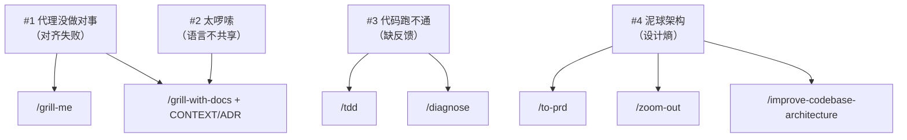
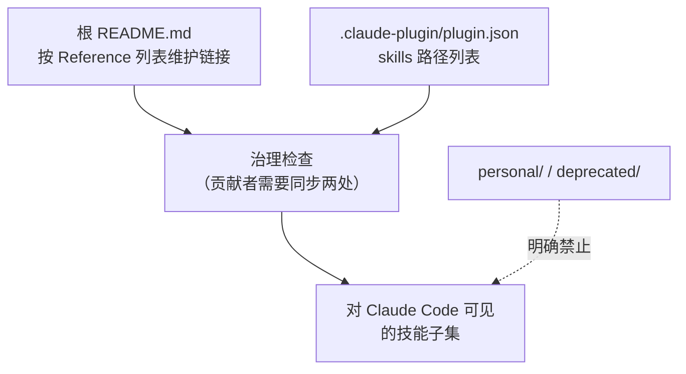
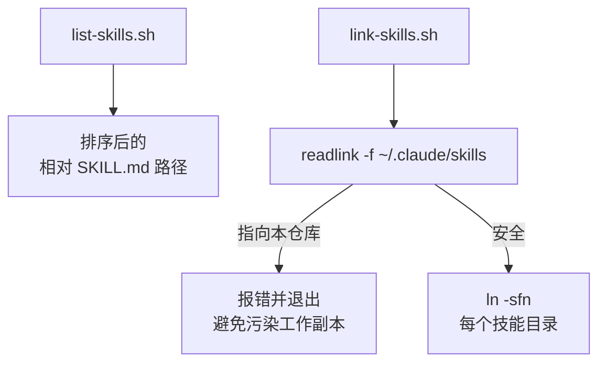
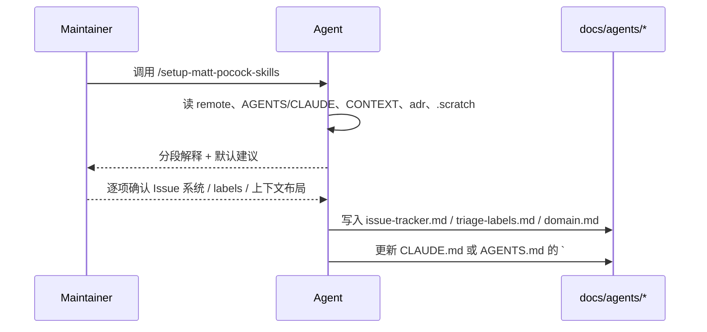
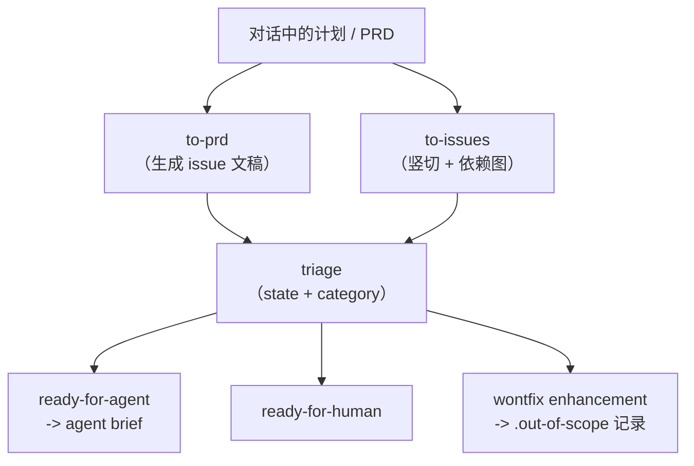
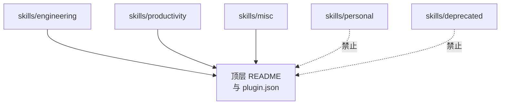

# mattpocock-skills DeepWiki — full wiki 导出

**仓库**：https://github.com/mattpocock/skills
**提交**：b843cb5ea74b1fe5e58a0fc23cddef9e66076fb8
**生成日期**：2026-05-05

---


<details>
<summary>相关源文件</summary>

生成本页时使用的主要源文件：

- [README.md](../../../project-repos/skills/README.md)
- [CLAUDE.md](../../../project-repos/skills/CLAUDE.md)
- [CONTEXT.md](../../../project-repos/skills/CONTEXT.md)
- [.claude-plugin/plugin.json](../../../project-repos/skills/.claude-plugin/plugin.json)

</details>

# 项目概览

这份仓库并不是传统意义上的「库」或「服务」，而是一套可直接安装的 **Agent Skills**：把几十年的工程习惯压缩成一组可组合的提示词与工作流，让它们能在 Claude Code、Codex 等环境里反复执行，而不是把流程外包给某个大一统方法论。

作者明确把定位放在 **真实工程**（real engineering）：技能要小、要能改、要可拼装；同时也要对抗代理产品的典型失效模式——对齐失败、话术膨胀、缺反馈闭环、以及在速度加持下更快的「泥球式增长」。读者的最佳入口仍是仓库根 `README.md` 里围绕这四类问题展开的故事线，而不是泛泛的 Stars 文案。

仓库物理结构非常轻：`.claude-plugin/plugin.json` 声明对 Claude Code Marketplace 友好的技能路径；真实的技能定义几乎全部落在 `skills/**/SKILL.md`；作者在自家仓库根的 `CONTEXT.md` 建模了 Issue tracker、triage role 等领域词表，ADR `docs/adr/0001-*.md` 则记录了「为何有的技能必须点名 `/setup`，有的则不必」这一类设计分叉。

```mermaid
graph TD
  UA["使用者 / 代理"] --> NPX["npx skills@latest add mattpocock/skills"]
  NPX --> PLG["`.claude-plugin/plugin.json`<br/>枚举对外技能路径"]
  PLG --> SK["skills/*/*/SKILL.md"]
  SK --> SETUP["setup-matt-pocock-skills<br/>生成 docs/agents/*"]
  SETUP --> IT["Issue tracker + label 映射 + CONTEXT/ADR"]
  IT --> ENG["engineering 技能<br/>（to-issues / triage / tdd …）"]
```

**安装路径为什么是 `npx skills`？** README 的快速开始把它写成两步：先用官方安装器把仓库挂进目标工具链，再在代理里运行 `/setup-matt-pocock-skills`，把 Issue 存放位置、triage label 字面量、`CONTEXT`/ADR 布局写进 **`docs/agents/`**（以及 `CLAUDE.md`/`AGENTS.md` 的技能索引块）；否则像 `to-issues`、`triage` 这类会直接写远端标签的技能会输出错误的标签字符串，而不是「模糊一点还能用」。这条边界在 ADR `0001` 里被称为 **hard dependency** vs **soft dependency**，也是理解整个技能矩阵的骨架。

Sources: [README.md:11-138](../../../project-repos/skills/README.md#L11-L138), [CLAUDE.md:1-14](../../../project-repos/skills/CLAUDE.md#L1-L14), [claude-plugin/plugin.json:1-17](../../../project-repos/skills/.claude-plugin/plugin.json#L1-L17)

<details class="source-snippets">
<summary>引用源码</summary>

<!-- source-snippets:start -->

#### `README.md:11-138`

````markdown
# Skills For Real Engineers

My agent skills that I use every day to do real engineering - not vibe coding.

Developing real applications is hard. Approaches like GSD, BMAD, and Spec-Kit try to help by owning the process. But while doing so, they take away your control and make bugs in the process hard to resolve.

These skills are designed to be small, easy to adapt, and composable. They work with any model. They're based on decades of engineering experience. Hack around with them. Make them your own. Enjoy.

If you want to keep up with changes to these skills, and any new ones I create, you can join ~60,000 other devs on my newsletter:

[Sign Up To The Newsletter](https://www.aihero.dev/s/skills-newsletter)

## Quickstart (30-second setup)

1. Run the skills.sh installer:

```bash
npx skills@latest add mattpocock/skills
```

2. Pick the skills you want, and which coding agents you want to install them on. **Make sure you select `/setup-matt-pocock-skills`**.

3. Run `/setup-matt-pocock-skills` in your agent. It will:
   - Ask you which issue tracker you want to use (GitHub, Linear, or local files)
   - Ask you what labels you apply to ticks when you triage them (`/triage` uses labels)
   - Ask you where you want to save any docs we create

4. Bam - you're ready to go.

## Why These Skills Exist

I built these skills as a way to fix common failure modes I see with Claude Code, Codex, and other coding agents.

### #1: The Agent Didn't Do What I Want

> "No-one knows exactly what they want"
>
> David Thomas & Andrew Hunt, [The Pragmatic Programmer](https://www.amazon.co.uk/Pragmatic-Programmer-Anniversary-Journey-Mastery/dp/B0833F1T3V)

**The Problem**. The most common failure mode in software development is misalignment. You think the dev knows what you want. Then you see what they've built - and you realize it didn't understand you at all.

This is just the same in the AI age. There is a communication gap between you and the agent. The fix for this is a **grilling session** - getting the agent to ask you detailed questions about what you're building.

**The Fix** is to use:

- [`/grill-me`](./skills/productivity/grill-me/SKILL.md) - for non-code uses
- [`/grill-with-docs`](./skills/engineering/grill-with-docs/SKILL.md) - same as [`/grill-me`](./skills/productivity/grill-me/SKILL.md), but adds more goodies (see below)

These are my most popular skills. They help you align with the agent before you get started, and think deeply about the change you're making. Use them _every_ time you want to make a change.

### #2: The Agent Is Way Too Verbose

> With a ubiquitous language, conversations among developers and expressions of the code are all derived from the same domain model.
>
> Eric Evans, [Domain-Driven-Design](https://www.amazon.co.uk/Domain-Driven-Design-Tackling-Complexity-Software/dp/0321125215)

**The Problem**: At the start of a project, devs and the people they're building the software for (the domain experts) are usually speaking different languages.

I felt the same tension with my agents. Agents are usually dropped into a project and asked to figure out the jargon as they go. So they use 20 words where 1 will do.

**The Fix** for this is a shared language. It's a document that helps agents decode the jargon used in the project.

<details>
<summary>
Example
</summary>

Here's an example [`CONTEXT.md`](https://github.com/mattpocock/course-video-manager/blob/076a5a7a182db0fe1e62971dd7a68bcadf010f1c/CONTEXT.md), from my `course-video-manager` repo. Which one is easier to read?

- **BEFORE**: "There's a problem when a lesson inside a section of a course is made 'real' (i.e. given a spot in the file system)"
- **AFTER**: "There's a problem with the materialization cascade"

This concision pays off session after session.

</details>

This is built into [`/grill-with-docs`](./skills/engineering/grill-with-docs/SKILL.md). It's a grilling session, but that helps you build a shared language with the AI, and document hard-to-explain decisions in ADR's.

It's hard to explain how powerful this is. It might be the single coolest technique in this repo. Try it, and see.

> [!TIP]
> A shared language has many other benefits than reducing verbosity:
>
> - **Variables, functions and files are named consistently**, using the shared language
> - As a result, the **codebase is easier to navigate** for the agent
> - The agent also **spends fewer tokens on thinking**, because it has access to a more concise language

### #3: The Code Doesn't Work

> "Always take small, deliberate steps. The rate of feedback is your speed limit. Never take on a task that’s too big."
>
> David Thomas & Andrew Hunt, [The Pragmatic Programmer](https://www.amazon.co.uk/Pragmatic-Programmer-Anniversary-Journey-Mastery/dp/B0833F1T3V)

**The Problem**: Let's say that you and the agent are aligned on what to build. What happens when the agent _still_ produces crap?

It's time to look at your feedback loops. Without feedback on how the code it produces actually runs, the agent will be flying blind.

**The Fix**: You need the usual tranche of feedback loops: static types, browser access, and automated tests.

For automated tests, a red-green-refactor loop is critical. This is where the agent writes a failing test first, then fixes the test. This helps give the agent a consistent level of feedback that results in far better code.

I've built a **[`/tdd`](./skills/engineering/tdd/SKILL.md) skill** you can slot into any project. It encourages red-green-refactor and gives the agent plenty of guidance on what makes good and bad tests.

For debugging, I've also built a **[`/diagnose`](./skills/engineering/diagnose/SKILL.md)** skill that wraps best debugging practices into a simple loop.

### #4: We Built A Ball Of Mud

> "Invest in the design of the system _every day_."
>
> Kent Beck, [Extreme Programming Explained](https://www.amazon.co.uk/Extreme-Programming-Explained-Embrace-Change/dp/0321278658)

> "The best modules are deep. They allow a lot of functionality to be accessed through a simple interface."
>
> John Ousterhout, [A Philosophy Of Software Design](https://www.amazon.co.uk/Philosophy-Software-Design-2nd/dp/173210221X)

**The Problem**: Most apps built with agents are complex and hard to change. Because agents can radically speed up coding, they also accelerate software entropy. Codebases get more complex at an unprecedented rate.

**The Fix** for this is a radical new approach to AI-powered development: caring about the design of the code.

This is built in to every layer of these skills:
... snippet truncated ...
````

#### `CLAUDE.md:1-14`

```markdown
Skills are organized into bucket folders under `skills/`:

- `engineering/` — daily code work
- `productivity/` — daily non-code workflow tools
- `misc/` — kept around but rarely used
- `personal/` — tied to my own setup, not promoted
- `deprecated/` — no longer used

Every skill in `engineering/`, `productivity/`, or `misc/` must have a reference in the top-level `README.md` and an entry in `.claude-plugin/plugin.json`. Skills in `personal/` and `deprecated/` must not appear in either.

Each skill entry in the top-level `README.md` must link the skill name to its `SKILL.md`.

Each bucket folder has a `README.md` that lists every skill in the bucket with a one-line description, with the skill name linked to its `SKILL.md`.
```

#### `claude-plugin/plugin.json:1-17`

```json
{
  "name": "mattpocock-skills",
  "skills": [
    "./skills/engineering/diagnose",
    "./skills/engineering/grill-with-docs",
    "./skills/engineering/triage",
    "./skills/engineering/improve-codebase-architecture",
    "./skills/engineering/setup-matt-pocock-skills",
    "./skills/engineering/tdd",
    "./skills/engineering/to-issues",
    "./skills/engineering/to-prd",
    "./skills/engineering/zoom-out",
    "./skills/productivity/caveman",
    "./skills/productivity/grill-me",
    "./skills/productivity/write-a-skill"
  ]
}
```

<!-- source-snippets:end -->
</details>

## 能力全景（用工程语言概括）

- **对齐（Grilling）**：用 `/grill-me` 与 `/grill-with-docs` 把需求树走完整，避免「你以为代理懂」。
- **共享语言（Ubiquitous language）**：`grill-with-docs` 在探索代码的同时维护 `CONTEXT.md` 与 ADR，让后续输出更短、更一致。
- **反馈闭环（TDD / diagnose）**：`tdd` 强化红-绿-重构；`diagnose` 把复杂缺陷收敛成可验证假设。
- **控制设计熵（Architecture）**：`to-prd`、`zoom-out`、`improve-codebase-architecture` 把设计意识嵌进日常节奏，而不是事后补救。
- **Issue 作为执行接口（Tracker ops）**：`to-issues` 用竖切（tracer bullet）拆单；`triage` 用有限状态机管理代理可接手的边界。

## 技术栈与边界

- **语言与形态**：以 Markdown 技能为主，辅以少量 Bash 脚本（`scripts/`）；无应用代码、无 CI、无测试目录——仓库质量靠作者自身的使用反馈与社区 PR 维护。
- **面向的工具链**：Claude Code 插件清单是明确的一等公民；其他代理可通过复制 `SKILL.md` 或安装器间接消费。

## 阅读路线

- **想 5 分钟判断「适不适合我」** → 读根 `README` 里四个失败模式章节，然后对照 [失败模式与工程价值观](failure-modes-and-values.md)。
- **要把它装进自己的仓库** → [发布面与插件清单](publishing-surface.md) + [每仓配置与领域契约](setup-and-domain-contract.md)。
- **要知道日常开发时具体会跑哪些提示词** → [Engineering 技能矩阵](engineering-skills-matrix.md) 与 [Productivity 与 Misc 技能](productivity-and-tooling-skills.md)。
- **要在本机做符号链接开发** → [本地开发脚本](scripts-local-dev.md)。

## 相关页面

- [失败模式与工程价值观](failure-modes-and-values.md) — README 故事线的拆解释义
- [发布面与插件清单](publishing-surface.md) — `.claude-plugin` 与对外目录如何对齐
- [每仓配置与领域契约](setup-and-domain-contract.md) — `/setup` 产物与硬 / 软依赖

---

<details>
<summary>相关源文件</summary>

生成本页时使用的主要源文件：

- [README.md](../../../project-repos/skills/README.md)
- [CONTEXT.md](../../../project-repos/skills/CONTEXT.md)
- [docs/adr/0001-explicit-setup-pointer-only-for-hard-dependencies.md](../../../project-repos/skills/docs/adr/0001-explicit-setup-pointer-only-for-hard-dependencies.md)

</details>

# 失败模式与工程价值观

README 用四个「代理失效模式」组织技能目录，而不是按字母表堆放命令；这决定了读者应把本仓库当作 **行为矫正器** 来理解：每个 skill 都对应一种可观察的失败，以及一条可重复的纠偏路径。

**Insight**：作者把 `CONTEXT.md` 放在仓库根，并不是装饰，而是 `grill-with-docs`、若干 engineering 技能在运行时真正会检索的「领域压缩层」——它用 **Issue tracker / Issue / Triage role** 三条定义消掉「backlog」一词的多义性，让代理在跨会话表达时减少指代漂移。



第一条失败模式直接引用 *The Pragmatic Programmer*：没人一开始就知道自己要什么，因此需要 **grilling session** 把决策树走全。第二条借 DDD 的「通用语言」概念，指出代理被丢进代码库时会用 20 个词描述 1 个概念；解法是把语言沉淀成 `CONTEXT.md`，并在 `grill-with-docs` 里同步 ADR。第三条回到极限编程：小步、快反馈；`tdd` 与 `diagnose` 分别覆盖「写对」与「查错」。第四条引用 Kent Beck 与 John Ousterhout：代理加速编码也加速熵增，因此把 **设计** 写进技能（`to-prd` 先问清触及模块、`zoom-out` 强制拉远视角、`improve-codebase-architecture` 周期性去杠杆）。

ADR `0001` 把「是否要在技能里硬编码 `/setup` 提示」变成显式策略：`to-issues`、`to-prd`、`triage` 被归为 **hard dependency**——缺配置时输出会 **错**；`diagnose`、`tdd` 等则只在措辞上引用领域文档，缺了也能跑，只是更糊。这个分叉避免把 setup 提示宗教化地复制到每个文件里，也解释了为何 README 把 setup 技能放在工程技能列表的枢纽位置。

Sources: [README.md:40-138](../../../project-repos/skills/README.md#L40-L138), [CONTEXT.md:1-27](../../../project-repos/skills/CONTEXT.md#L1-L27), [docs/adr/0001-explicit-setup-pointer-only-for-hard-dependencies.md:1-11](../../../project-repos/skills/docs/adr/0001-explicit-setup-pointer-only-for-hard-dependencies.md#L1-L11)

<details class="source-snippets">
<summary>引用源码</summary>

<!-- source-snippets:start -->

#### `README.md:40-138`

```markdown
## Why These Skills Exist

I built these skills as a way to fix common failure modes I see with Claude Code, Codex, and other coding agents.

### #1: The Agent Didn't Do What I Want

> "No-one knows exactly what they want"
>
> David Thomas & Andrew Hunt, [The Pragmatic Programmer](https://www.amazon.co.uk/Pragmatic-Programmer-Anniversary-Journey-Mastery/dp/B0833F1T3V)

**The Problem**. The most common failure mode in software development is misalignment. You think the dev knows what you want. Then you see what they've built - and you realize it didn't understand you at all.

This is just the same in the AI age. There is a communication gap between you and the agent. The fix for this is a **grilling session** - getting the agent to ask you detailed questions about what you're building.

**The Fix** is to use:

- [`/grill-me`](./skills/productivity/grill-me/SKILL.md) - for non-code uses
- [`/grill-with-docs`](./skills/engineering/grill-with-docs/SKILL.md) - same as [`/grill-me`](./skills/productivity/grill-me/SKILL.md), but adds more goodies (see below)

These are my most popular skills. They help you align with the agent before you get started, and think deeply about the change you're making. Use them _every_ time you want to make a change.

### #2: The Agent Is Way Too Verbose

> With a ubiquitous language, conversations among developers and expressions of the code are all derived from the same domain model.
>
> Eric Evans, [Domain-Driven-Design](https://www.amazon.co.uk/Domain-Driven-Design-Tackling-Complexity-Software/dp/0321125215)

**The Problem**: At the start of a project, devs and the people they're building the software for (the domain experts) are usually speaking different languages.

I felt the same tension with my agents. Agents are usually dropped into a project and asked to figure out the jargon as they go. So they use 20 words where 1 will do.

**The Fix** for this is a shared language. It's a document that helps agents decode the jargon used in the project.

<details>
<summary>
Example
</summary>

Here's an example [`CONTEXT.md`](https://github.com/mattpocock/course-video-manager/blob/076a5a7a182db0fe1e62971dd7a68bcadf010f1c/CONTEXT.md), from my `course-video-manager` repo. Which one is easier to read?

- **BEFORE**: "There's a problem when a lesson inside a section of a course is made 'real' (i.e. given a spot in the file system)"
- **AFTER**: "There's a problem with the materialization cascade"

This concision pays off session after session.

</details>

This is built into [`/grill-with-docs`](./skills/engineering/grill-with-docs/SKILL.md). It's a grilling session, but that helps you build a shared language with the AI, and document hard-to-explain decisions in ADR's.

It's hard to explain how powerful this is. It might be the single coolest technique in this repo. Try it, and see.

> [!TIP]
> A shared language has many other benefits than reducing verbosity:
>
> - **Variables, functions and files are named consistently**, using the shared language
> - As a result, the **codebase is easier to navigate** for the agent
> - The agent also **spends fewer tokens on thinking**, because it has access to a more concise language

### #3: The Code Doesn't Work

> "Always take small, deliberate steps. The rate of feedback is your speed limit. Never take on a task that’s too big."
>
> David Thomas & Andrew Hunt, [The Pragmatic Programmer](https://www.amazon.co.uk/Pragmatic-Programmer-Anniversary-Journey-Mastery/dp/B0833F1T3V)

**The Problem**: Let's say that you and the agent are aligned on what to build. What happens when the agent _still_ produces crap?

It's time to look at your feedback loops. Without feedback on how the code it produces actually runs, the agent will be flying blind.

**The Fix**: You need the usual tranche of feedback loops: static types, browser access, and automated tests.

For automated tests, a red-green-refactor loop is critical. This is where the agent writes a failing test first, then fixes the test. This helps give the agent a consistent level of feedback that results in far better code.

I've built a **[`/tdd`](./skills/engineering/tdd/SKILL.md) skill** you can slot into any project. It encourages red-green-refactor and gives the agent plenty of guidance on what makes good and bad tests.

For debugging, I've also built a **[`/diagnose`](./skills/engineering/diagnose/SKILL.md)** skill that wraps best debugging practices into a simple loop.

### #4: We Built A Ball Of Mud

> "Invest in the design of the system _every day_."
>
> Kent Beck, [Extreme Programming Explained](https://www.amazon.co.uk/Extreme-Programming-Explained-Embrace-Change/dp/0321278658)

> "The best modules are deep. They allow a lot of functionality to be accessed through a simple interface."
>
> John Ousterhout, [A Philosophy Of Software Design](https://www.amazon.co.uk/Philosophy-Software-Design-2nd/dp/173210221X)

**The Problem**: Most apps built with agents are complex and hard to change. Because agents can radically speed up coding, they also accelerate software entropy. Codebases get more complex at an unprecedented rate.

**The Fix** for this is a radical new approach to AI-powered development: caring about the design of the code.

This is built in to every layer of these skills:

- [`/to-prd`](./skills/engineering/to-prd/SKILL.md) quizzes you about which modules you're touching before creating a PRD
- [`/zoom-out`](./skills/engineering/zoom-out/SKILL.md) tells the agent to explain code in the context of the whole system

And crucially, [`/improve-codebase-architecture`](./skills/engineering/improve-codebase-architecture/SKILL.md) helps you rescue a codebase that has become a ball of mud. I recommend running it on your codebase once every few days.

### Summary

```

#### `CONTEXT.md:1-27`

```markdown
# Matt Pocock Skills

A collection of agent skills (slash commands and behaviors) loaded by Claude Code. Skills are organized into buckets and consumed by per-repo configuration emitted by `/setup-matt-pocock-skills`.

## Language

**Issue tracker**:
The tool that hosts a repo's issues — GitHub Issues, Linear, a local `.scratch/` markdown convention, or similar. Skills like `to-issues`, `to-prd`, `triage`, and `qa` read from and write to it.
_Avoid_: backlog manager, backlog backend, issue host

**Issue**:
A single tracked unit of work inside an **Issue tracker** — a bug, task, PRD, or slice produced by `to-issues`.
_Avoid_: ticket (use only when quoting external systems that call them tickets)

**Triage role**:
A canonical state-machine label applied to an **Issue** during triage (e.g. `needs-triage`, `ready-for-afk`). Each role maps to a real label string in the **Issue tracker** via `docs/agents/triage-labels.md`.

## Relationships

- An **Issue tracker** holds many **Issues**
- An **Issue** carries one **Triage role** at a time

## Flagged ambiguities

- "backlog" was previously used to mean both the *tool* hosting issues and the *body of work* inside it — resolved: the tool is the **Issue tracker**; "backlog" is no longer used as a domain term.
- "backlog backend" / "backlog manager" — resolved: collapsed into **Issue tracker**.
```

#### `docs/adr/0001-explicit-setup-pointer-only-for-hard-dependencies.md:1-11`

```markdown
# Explicit `/setup-matt-pocock-skills` pointer only for hard dependencies

Engineering skills depend on per-repo config (issue tracker, triage label vocabulary, domain doc layout) seeded by `/setup-matt-pocock-skills`. Some skills cannot meaningfully function without that config — they have to publish to a specific issue tracker or apply a specific label string. Others only use it to sharpen output (vocabulary, ADR awareness) and degrade gracefully without it.

We split these into **hard-dependency** and **soft-dependency** skills:

- **Hard dependency** (`to-issues`, `to-prd`, `triage`) — include an explicit one-liner: _"… should have been provided to you — run `/setup-matt-pocock-skills` if not."_ Without the mapping, output is wrong, not just fuzzy.
- **Soft dependency** (`diagnose`, `tdd`, `improve-codebase-architecture`, `zoom-out`) — reference "the project's domain glossary" and "ADRs in the area you're touching" in vague prose only. If the docs aren't there, the skill still works; output is just less sharp.

The split keeps soft-dependency skills token-light and avoids cargo-culting the setup pointer into places where it isn't load-bearing.
```

<!-- source-snippets:end -->
</details>

## 相关页面

- [项目概览](overview.md) — 宏观结构与安装路径
- [Engineering 技能矩阵](engineering-skills-matrix.md) — 这些价值观如何落到具体 SKILL
- [Productivity 与 Misc 技能](productivity-and-tooling-skills.md) — 非代码向与工具向补充

---

<details>
<summary>相关源文件</summary>

生成本页时使用的主要源文件：

- [.claude-plugin/plugin.json](../../../project-repos/skills/.claude-plugin/plugin.json)
- [README.md](../../../project-repos/skills/README.md)
- [CLAUDE.md](../../../project-repos/skills/CLAUDE.md)

</details>

# 发布面与插件清单

对外「哪些技能可见」由两层共同决定：根 `README.md` 的人类导航，以及 `.claude-plugin/plugin.json` 的机器可读枚举。作者把两者绑定成治理规则，避免插件市场与文档漂移。

`CLAUDE.md` 规定：`engineering/`、`productivity/`、`misc/` 下的每个技能必须同时出现在 **顶层 README** 与 **plugin.json**；`personal/` 与 `deprecated/` 则 **不得** 出现在这两处。结果是：你在 Marketplace 里安装到的，就是作者愿意承诺维护、且故事线完整的那一组；个人脚本与历史实验被物理隔离在别的桶里。



**Insight**：`plugin.json` 只列出 12 条相对路径，全部落在 `skills/engineering` 与 `skills/productivity`；`misc/` 虽然在 README 有引用，但 **未进入** 当前插件清单——这意味着「作者日常推荐」与「插件默认打包」可以刻意不同；读者若需要 `misc` 技能，需要自行复制或扩展本地插件配置。

根 README 还承载「新闻通讯」跳转与仓库横幅图等非代码资产；就与技能治理无关的安装体验而言，关键在于 `npx skills@latest add mattpocock/skills` 这一入口把远程仓库转成各工具链可用的技能骨架，随后由 `/setup-matt-pocock-skills` 写入消费侧配置详情。

Sources: [claude-plugin/plugin.json:1-17](../../../project-repos/skills/.claude-plugin/plugin.json#L1-L17), [CLAUDE.md:5-13](../../../project-repos/skills/CLAUDE.md#L5-L13), [README.md:143-173](../../../project-repos/skills/README.md#L143-L173)

<details class="source-snippets">
<summary>引用源码</summary>

<!-- source-snippets:start -->

#### `claude-plugin/plugin.json:1-17`

```json
{
  "name": "mattpocock-skills",
  "skills": [
    "./skills/engineering/diagnose",
    "./skills/engineering/grill-with-docs",
    "./skills/engineering/triage",
    "./skills/engineering/improve-codebase-architecture",
    "./skills/engineering/setup-matt-pocock-skills",
    "./skills/engineering/tdd",
    "./skills/engineering/to-issues",
    "./skills/engineering/to-prd",
    "./skills/engineering/zoom-out",
    "./skills/productivity/caveman",
    "./skills/productivity/grill-me",
    "./skills/productivity/write-a-skill"
  ]
}
```

#### `CLAUDE.md:5-13`

```markdown
- `misc/` — kept around but rarely used
- `personal/` — tied to my own setup, not promoted
- `deprecated/` — no longer used

Every skill in `engineering/`, `productivity/`, or `misc/` must have a reference in the top-level `README.md` and an entry in `.claude-plugin/plugin.json`. Skills in `personal/` and `deprecated/` must not appear in either.

Each skill entry in the top-level `README.md` must link the skill name to its `SKILL.md`.

Each bucket folder has a `README.md` that lists every skill in the bucket with a one-line description, with the skill name linked to its `SKILL.md`.
```

#### `README.md:143-173`

```markdown
### Engineering

Skills I use daily for code work.

- **[diagnose](./skills/engineering/diagnose/SKILL.md)** — Disciplined diagnosis loop for hard bugs and performance regressions: reproduce → minimise → hypothesise → instrument → fix → regression-test.
- **[grill-with-docs](./skills/engineering/grill-with-docs/SKILL.md)** — Grilling session that challenges your plan against the existing domain model, sharpens terminology, and updates `CONTEXT.md` and ADRs inline.
- **[triage](./skills/engineering/triage/SKILL.md)** — Triage issues through a state machine of triage roles.
- **[improve-codebase-architecture](./skills/engineering/improve-codebase-architecture/SKILL.md)** — Find deepening opportunities in a codebase, informed by the domain language in `CONTEXT.md` and the decisions in `docs/adr/`.
- **[setup-matt-pocock-skills](./skills/engineering/setup-matt-pocock-skills/SKILL.md)** — Scaffold the per-repo config (issue tracker, triage label vocabulary, domain doc layout) that the other engineering skills consume. Run once per repo before using `to-issues`, `to-prd`, `triage`, `diagnose`, `tdd`, `improve-codebase-architecture`, or `zoom-out`.
- **[tdd](./skills/engineering/tdd/SKILL.md)** — Test-driven development with a red-green-refactor loop. Builds features or fixes bugs one vertical slice at a time.
- **[to-issues](./skills/engineering/to-issues/SKILL.md)** — Break any plan, spec, or PRD into independently-grabbable GitHub issues using vertical slices.
- **[to-prd](./skills/engineering/to-prd/SKILL.md)** — Turn the current conversation context into a PRD and submit it as a GitHub issue. No interview — just synthesizes what you've already discussed.
- **[zoom-out](./skills/engineering/zoom-out/SKILL.md)** — Tell the agent to zoom out and give broader context or a higher-level perspective on an unfamiliar section of code.

### Productivity

General workflow tools, not code-specific.

- **[caveman](./skills/productivity/caveman/SKILL.md)** — Ultra-compressed communication mode. Cuts token usage ~75% by dropping filler while keeping full technical accuracy.
- **[grill-me](./skills/productivity/grill-me/SKILL.md)** — Get relentlessly interviewed about a plan or design until every branch of the decision tree is resolved.
- **[write-a-skill](./skills/productivity/write-a-skill/SKILL.md)** — Create new skills with proper structure, progressive disclosure, and bundled resources.

### Misc

Tools I keep around but rarely use.

- **[git-guardrails-claude-code](./skills/misc/git-guardrails-claude-code/SKILL.md)** — Set up Claude Code hooks to block dangerous git commands (push, reset --hard, clean, etc.) before they execute.
- **[migrate-to-shoehorn](./skills/misc/migrate-to-shoehorn/SKILL.md)** — Migrate test files from `as` type assertions to @total-typescript/shoehorn.
- **[scaffold-exercises](./skills/misc/scaffold-exercises/SKILL.md)** — Create exercise directory structures with sections, problems, solutions, and explainers.
- **[setup-pre-commit](./skills/misc/setup-pre-commit/SKILL.md)** — Set up Husky pre-commit hooks with lint-staged, Prettier, type checking, and tests.
```

<!-- source-snippets:end -->
</details>

## 相关页面

- [项目概览](overview.md) — Quickstart 与总体定位
- [每仓配置与领域契约](setup-and-domain-contract.md) — Marketplace 装上之后还要做什么
- [本地开发脚本](scripts-local-dev.md) — 开发者如何把全量 `skills/` symlink 到本机 Claude 目录

---

<details>
<summary>相关源文件</summary>

生成本页时使用的主要源文件：

- [scripts/link-skills.sh](../../../project-repos/skills/scripts/link-skills.sh)
- [scripts/list-skills.sh](../../../project-repos/skills/scripts/list-skills.sh)

</details>

# 本地开发脚本

仓库只提供两条与「开发体验」直接相关的 Bash 工具：`list-skills.sh` 递归列出所有 `SKILL.md` 的相对路径；`link-skills.sh` 则把这些技能目录 **符号链接** 到 `~/.claude/skills/<skillName>`，方便在本机 CLI 侧快速迭代。

`link-skills.sh` 的关键安全阀是 **检测 `~/.claude/skills` 是否是指回当前仓库的 symlink**：如果是，则继续链接会在仓库自己的 `skills/` 树里制造污染，因此脚本直接 `exit 1` 并要求用户删除该 symlink 后重跑。这是一个典型的「局部不变量」——它保护的是工作副本与全局技能目录之间的边界。



Sources: [scripts/link-skills.sh:1-38](../../../project-repos/skills/scripts/link-skills.sh#L1-L38), [scripts/list-skills.sh:1-8](../../../project-repos/skills/scripts/list-skills.sh#L1-L8)

<details class="source-snippets">
<summary>引用源码</summary>

<!-- source-snippets:start -->

#### `scripts/link-skills.sh:1-38`

```bash
#!/usr/bin/env bash
set -euo pipefail

# Links all skills in the repository to ~/.claude/skills, so that
# they can be used by the local Claude CLI.

REPO="$(cd "$(dirname "$0")/.." && pwd)"
DEST="$HOME/.claude/skills"

# If ~/.claude/skills is a symlink that resolves into this repo, we'd end up
# writing the per-skill symlinks back into the repo's own skills/ tree. Detect
# and bail out instead of polluting the working copy.
if [ -L "$DEST" ]; then
  resolved="$(readlink -f "$DEST")"
  case "$resolved" in
    "$REPO"|"$REPO"/*)
      echo "error: $DEST is a symlink into this repo ($resolved)." >&2
      echo "Remove it (rm \"$DEST\") and re-run; the script will recreate it as a real dir." >&2
      exit 1
      ;;
  esac
fi

mkdir -p "$DEST"

find "$REPO/skills" -name SKILL.md -not -path '*/node_modules/*' -print0 |
while IFS= read -r -d '' skill_md; do
  src="$(dirname "$skill_md")"
  name="$(basename "$src")"
  target="$DEST/$name"

  if [ -e "$target" ] && [ ! -L "$target" ]; then
    rm -rf "$target"
  fi

  ln -sfn "$src" "$target"
  echo "linked $name -> $src"
done
```

#### `scripts/list-skills.sh:1-8`

```bash
#!/usr/bin/env bash
set -euo pipefail

REPO="$(cd "$(dirname "$0")/.." && pwd)"

cd "$REPO"
find . -name SKILL.md -not -path '*/node_modules/*' | sed 's|^\./||' | sort
```

<!-- source-snippets:end -->
</details>

## 相关页面

- [发布面与插件清单](publishing-surface.md) — 与 Marketplace 安装的差异
- [项目概览](overview.md)

---

<details>
<summary>相关源文件</summary>

生成本页时使用的主要源文件：

- [skills/engineering/setup-matt-pocock-skills/SKILL.md](../../../project-repos/skills/skills/engineering/setup-matt-pocock-skills/SKILL.md)
- [docs/adr/0001-explicit-setup-pointer-only-for-hard-dependencies.md](../../../project-repos/skills/docs/adr/0001-explicit-setup-pointer-only-for-hard-dependencies.md)
- [CONTEXT.md](../../../project-repos/skills/CONTEXT.md)

</details>

# 每仓配置与领域契约

`/setup-matt-pocock-skills` 是唯一显式面向「把你的仓库改造成技能可消费形状」的入口。它不做确定性脚本，而是用 **探索 → 分项确认 → 草稿 → 写入** 的提示工程，把三类信息落到 `docs/agents/`：Issue tracker 工作流、triage label 映射、以及 `CONTEXT`/ADR 的布局规则。

技能正文强调：默认假设 GitHub（`gh`），但也支持 GitLab（`glab`）、本地 `.scratch/` markdown、或用户一段自由文本描述的其他系统。它与 ADR `0001` 形成闭环——当输出 **依赖具体 label 字符串或远程 API** 时，缺配置就是 **硬错误**；当只是「读读词汇表更爽」时，就不反复骚扰用户去 setup。



**治理细节**：如果已存在 `CLAUDE.md` 就编辑它；否则编辑 `AGENTS.md`；两者都不存在则由用户选择新建哪个，**禁止**在已有其一的情况下再创建另一个——这避免双源配置。`disable-model-invocation: true` frontmatter 把这技能限制为「显式由人触发」，降低被模型误启用的概率。

Sources: [skills/engineering/setup-matt-pocock-skills/SKILL.md:1-120](../../../project-repos/skills/skills/engineering/setup-matt-pocock-skills/SKILL.md#L1-L120), [docs/adr/0001-explicit-setup-pointer-only-for-hard-dependencies.md:1-11](../../../project-repos/skills/docs/adr/0001-explicit-setup-pointer-only-for-hard-dependencies.md#L1-L11), [CONTEXT.md:1-22](../../../project-repos/skills/CONTEXT.md#L1-L22)

<details class="source-snippets">
<summary>引用源码</summary>

<!-- source-snippets:start -->

#### `skills/engineering/setup-matt-pocock-skills/SKILL.md:1-120`

````markdown
---
name: setup-matt-pocock-skills
description: Sets up an `## Agent skills` block in AGENTS.md/CLAUDE.md and `docs/agents/` so the engineering skills know this repo's issue tracker (GitHub or local markdown), triage label vocabulary, and domain doc layout. Run before first use of `to-issues`, `to-prd`, `triage`, `diagnose`, `tdd`, `improve-codebase-architecture`, or `zoom-out` — or if those skills appear to be missing context about the issue tracker, triage labels, or domain docs.
disable-model-invocation: true
---

# Setup Matt Pocock's Skills

Scaffold the per-repo configuration that the engineering skills assume:

- **Issue tracker** — where issues live (GitHub by default; local markdown is also supported out of the box)
- **Triage labels** — the strings used for the five canonical triage roles
- **Domain docs** — where `CONTEXT.md` and ADRs live, and the consumer rules for reading them

This is a prompt-driven skill, not a deterministic script. Explore, present what you found, confirm with the user, then write.

## Process

### 1. Explore

Look at the current repo to understand its starting state. Read whatever exists; don't assume:

- `git remote -v` and `.git/config` — is this a GitHub repo? Which one?
- `AGENTS.md` and `CLAUDE.md` at the repo root — does either exist? Is there already an `## Agent skills` section in either?
- `CONTEXT.md` and `CONTEXT-MAP.md` at the repo root
- `docs/adr/` and any `src/*/docs/adr/` directories
- `docs/agents/` — does this skill's prior output already exist?
- `.scratch/` — sign that a local-markdown issue tracker convention is already in use

### 2. Present findings and ask

Summarise what's present and what's missing. Then walk the user through the three decisions **one at a time** — present a section, get the user's answer, then move to the next. Don't dump all three at once.

Assume the user does not know what these terms mean. Each section starts with a short explainer (what it is, why these skills need it, what changes if they pick differently). Then show the choices and the default.

**Section A — Issue tracker.**

> Explainer: The "issue tracker" is where issues live for this repo. Skills like `to-issues`, `triage`, `to-prd`, and `qa` read from and write to it — they need to know whether to call `gh issue create`, write a markdown file under `.scratch/`, or follow some other workflow you describe. Pick the place you actually track work for this repo.

Default posture: these skills were designed for GitHub. If a `git remote` points at GitHub, propose that. If a `git remote` points at GitLab (`gitlab.com` or a self-hosted host), propose GitLab. Otherwise (or if the user prefers), offer:

- **GitHub** — issues live in the repo's GitHub Issues (uses the `gh` CLI)
- **GitLab** — issues live in the repo's GitLab Issues (uses the [`glab`](https://gitlab.com/gitlab-org/cli) CLI)
- **Local markdown** — issues live as files under `.scratch/<feature>/` in this repo (good for solo projects or repos without a remote)
- **Other** (Jira, Linear, etc.) — ask the user to describe the workflow in one paragraph; the skill will record it as freeform prose

**Section B — Triage label vocabulary.**

> Explainer: When the `triage` skill processes an incoming issue, it moves it through a state machine — needs evaluation, waiting on reporter, ready for an AFK agent to pick up, ready for a human, or won't fix. To do that, it needs to apply labels (or the equivalent in your issue tracker) that match strings *you've actually configured*. If your repo already uses different label names (e.g. `bug:triage` instead of `needs-triage`), map them here so the skill applies the right ones instead of creating duplicates.

The five canonical roles:

- `needs-triage` — maintainer needs to evaluate
- `needs-info` — waiting on reporter
- `ready-for-agent` — fully specified, AFK-ready (an agent can pick it up with no human context)
- `ready-for-human` — needs human implementation
- `wontfix` — will not be actioned

Default: each role's string equals its name. Ask the user if they want to override any. If their issue tracker has no existing labels, the defaults are fine.

**Section C — Domain docs.**

> Explainer: Some skills (`improve-codebase-architecture`, `diagnose`, `tdd`) read a `CONTEXT.md` file to learn the project's domain language, and `docs/adr/` for past architectural decisions. They need to know whether the repo has one global context or multiple (e.g. a monorepo with separate frontend/backend contexts) so they look in the right place.

Confirm the layout:

- **Single-context** — one `CONTEXT.md` + `docs/adr/` at the repo root. Most repos are this.
- **Multi-context** — `CONTEXT-MAP.md` at the root pointing to per-context `CONTEXT.md` files (typically a monorepo).

### 3. Confirm and edit

Show the user a draft of:

- The `## Agent skills` block to add to whichever of `CLAUDE.md` / `AGENTS.md` is being edited (see step 4 for selection rules)
- The contents of `docs/agents/issue-tracker.md`, `docs/agents/triage-labels.md`, `docs/agents/domain.md`

Let them edit before writing.

### 4. Write

**Pick the file to edit:**

- If `CLAUDE.md` exists, edit it.
- Else if `AGENTS.md` exists, edit it.
- If neither exists, ask the user which one to create — don't pick for them.

Never create `AGENTS.md` when `CLAUDE.md` already exists (or vice versa) — always edit the one that's already there.

If an `## Agent skills` block already exists in the chosen file, update its contents in-place rather than appending a duplicate. Don't overwrite user edits to the surrounding sections.

The block:

```markdown
## Agent skills

### Issue tracker

[one-line summary of where issues are tracked]. See `docs/agents/issue-tracker.md`.

### Triage labels

[one-line summary of the label vocabulary]. See `docs/agents/triage-labels.md`.

### Domain docs

[one-line summary of layout — "single-context" or "multi-context"]. See `docs/agents/domain.md`.
```

Then write the three docs files using the seed templates in this skill folder as a starting point:

- [issue-tracker-github.md](./issue-tracker-github.md) — GitHub issue tracker
- [issue-tracker-gitlab.md](./issue-tracker-gitlab.md) — GitLab issue tracker
- [issue-tracker-local.md](./issue-tracker-local.md) — local-markdown issue tracker
- [triage-labels.md](./triage-labels.md) — label mapping
- [domain.md](./domain.md) — domain doc consumer rules + layout

For "other" issue trackers, write `docs/agents/issue-tracker.md` from scratch using the user's description.

### 5. Done

````

#### `docs/adr/0001-explicit-setup-pointer-only-for-hard-dependencies.md:1-11`

```markdown
# Explicit `/setup-matt-pocock-skills` pointer only for hard dependencies

Engineering skills depend on per-repo config (issue tracker, triage label vocabulary, domain doc layout) seeded by `/setup-matt-pocock-skills`. Some skills cannot meaningfully function without that config — they have to publish to a specific issue tracker or apply a specific label string. Others only use it to sharpen output (vocabulary, ADR awareness) and degrade gracefully without it.

We split these into **hard-dependency** and **soft-dependency** skills:

- **Hard dependency** (`to-issues`, `to-prd`, `triage`) — include an explicit one-liner: _"… should have been provided to you — run `/setup-matt-pocock-skills` if not."_ Without the mapping, output is wrong, not just fuzzy.
- **Soft dependency** (`diagnose`, `tdd`, `improve-codebase-architecture`, `zoom-out`) — reference "the project's domain glossary" and "ADRs in the area you're touching" in vague prose only. If the docs aren't there, the skill still works; output is just less sharp.

The split keeps soft-dependency skills token-light and avoids cargo-culting the setup pointer into places where it isn't load-bearing.
```

#### `CONTEXT.md:1-22`

```markdown
# Matt Pocock Skills

A collection of agent skills (slash commands and behaviors) loaded by Claude Code. Skills are organized into buckets and consumed by per-repo configuration emitted by `/setup-matt-pocock-skills`.

## Language

**Issue tracker**:
The tool that hosts a repo's issues — GitHub Issues, Linear, a local `.scratch/` markdown convention, or similar. Skills like `to-issues`, `to-prd`, `triage`, and `qa` read from and write to it.
_Avoid_: backlog manager, backlog backend, issue host

**Issue**:
A single tracked unit of work inside an **Issue tracker** — a bug, task, PRD, or slice produced by `to-issues`.
_Avoid_: ticket (use only when quoting external systems that call them tickets)

**Triage role**:
A canonical state-machine label applied to an **Issue** during triage (e.g. `needs-triage`, `ready-for-afk`). Each role maps to a real label string in the **Issue tracker** via `docs/agents/triage-labels.md`.

## Relationships

- An **Issue tracker** holds many **Issues**
- An **Issue** carries one **Triage role** at a time

```

<!-- source-snippets:end -->
</details>

## 相关页面

- [Engineering 技能矩阵](engineering-skills-matrix.md) — setup 之后最常连用的技能
- [发布面与插件清单](publishing-surface.md) — 插件层与文档层如何对齐
- [失败模式与工程价值观](failure-modes-and-values.md) — hard/soft 依赖的产品故事

---

<details>
<summary>相关源文件</summary>

生成本页时使用的主要源文件：

- [skills/engineering/README.md](../../../project-repos/skills/skills/engineering/README.md)
- [skills/engineering/to-issues/SKILL.md](../../../project-repos/skills/skills/engineering/to-issues/SKILL.md)
- [skills/engineering/triage/SKILL.md](../../../project-repos/skills/skills/engineering/triage/SKILL.md)
- [skills/engineering/to-prd/SKILL.md](../../../project-repos/skills/skills/engineering/to-prd/SKILL.md)

</details>

# Engineering 技能矩阵

`skills/engineering/README.md` 用一句话概括了 9 个日常技能各自的「可交付物」：从诊断循环、到 grilling+文档、Issue 状态机、架构深化、setup、TDD、拆单、生成 PRD issue、以及 zoom-out 阅读法。阅读技巧是 **按数据面（Issue tracker）与控制面（triage 状态机）先分层**，再看质量技能（`tdd`、`diagnose`、`improve-codebase-architecture`）如何挂载在这张网上。

`to-issues` 把任何计划拆成 **tracer bullet** 竖切：每个 issue 必须窄、但要穿过所有集成层，可演示或可验证；同时在模板里要求写清 parent、验收标准、依赖关系，并在发布时统一打上 `needs-triage` 以进入 triage 技能定义的工作流。它还硬编码了 **HITL vs AFK** 分类，用来表达「哪些切片必须等人拍板」。

`triage` 把维护者语言译成 **两个 category 角色（bug/enhancement）+ 五个 state 角色**，并规定 triage 期间所有外发内容都要带固定免责声明，避免把机器生成意见伪装成人类结论。它还要求读 `.out-of-scope/*.md`，在 `wontfix` 场景把机构记忆写回知识库，从而让重复请求被快速对齐到历史决定。



Sources: [skills/engineering/README.md:1-13](../../../project-repos/skills/skills/engineering/README.md#L1-L13), [skills/engineering/to-issues/SKILL.md:1-79](../../../project-repos/skills/skills/engineering/to-issues/SKILL.md#L1-L79), [skills/engineering/triage/SKILL.md:1-78](../../../project-repos/skills/skills/engineering/triage/SKILL.md#L1-L78)

<details class="source-snippets">
<summary>引用源码</summary>

<!-- source-snippets:start -->

#### `skills/engineering/README.md:1-13`

```markdown
# Engineering

Skills I use daily for code work.

- **[diagnose](./diagnose/SKILL.md)** — Disciplined diagnosis loop for hard bugs and performance regressions: reproduce → minimise → hypothesise → instrument → fix → regression-test.
- **[grill-with-docs](./grill-with-docs/SKILL.md)** — Grilling session that challenges your plan against the existing domain model, sharpens terminology, and updates `CONTEXT.md` and ADRs inline.
- **[triage](./triage/SKILL.md)** — Triage issues through a state machine of triage roles.
- **[improve-codebase-architecture](./improve-codebase-architecture/SKILL.md)** — Find deepening opportunities in a codebase, informed by the domain language in `CONTEXT.md` and the decisions in `docs/adr/`.
- **[setup-matt-pocock-skills](./setup-matt-pocock-skills/SKILL.md)** — Scaffold the per-repo config (issue tracker, triage label vocabulary, domain doc layout) that the other engineering skills consume.
- **[tdd](./tdd/SKILL.md)** — Test-driven development with a red-green-refactor loop. Builds features or fixes bugs one vertical slice at a time.
- **[to-issues](./to-issues/SKILL.md)** — Break any plan, spec, or PRD into independently-grabbable GitHub issues using vertical slices.
- **[to-prd](./to-prd/SKILL.md)** — Turn the current conversation context into a PRD and submit it as a GitHub issue.
- **[zoom-out](./zoom-out/SKILL.md)** — Tell the agent to zoom out and give broader context or a higher-level perspective on an unfamiliar section of code.
```

#### `skills/engineering/to-issues/SKILL.md:1-79`

```markdown
---
name: to-issues
description: Break a plan, spec, or PRD into independently-grabbable issues on the project issue tracker using tracer-bullet vertical slices. Use when user wants to convert a plan into issues, create implementation tickets, or break down work into issues.
---

# To Issues

Break a plan into independently-grabbable issues using vertical slices (tracer bullets).

The issue tracker and triage label vocabulary should have been provided to you — run `/setup-matt-pocock-skills` if not.

## Process

### 1. Gather context

Work from whatever is already in the conversation context. If the user passes an issue reference (issue number, URL, or path) as an argument, fetch it from the issue tracker and read its full body and comments.

### 2. Explore the codebase (optional)

If you have not already explored the codebase, do so to understand the current state of the code. Issue titles and descriptions should use the project's domain glossary vocabulary, and respect ADRs in the area you're touching.

### 3. Draft vertical slices

Break the plan into **tracer bullet** issues. Each issue is a thin vertical slice that cuts through ALL integration layers end-to-end, NOT a horizontal slice of one layer.

Slices may be 'HITL' or 'AFK'. HITL slices require human interaction, such as an architectural decision or a design review. AFK slices can be implemented and merged without human interaction. Prefer AFK over HITL where possible.

<vertical-slice-rules>
- Each slice delivers a narrow but COMPLETE path through every layer (schema, API, UI, tests)
- A completed slice is demoable or verifiable on its own
- Prefer many thin slices over few thick ones
</vertical-slice-rules>

### 4. Quiz the user

Present the proposed breakdown as a numbered list. For each slice, show:

- **Title**: short descriptive name
- **Type**: HITL / AFK
- **Blocked by**: which other slices (if any) must complete first
- **User stories covered**: which user stories this addresses (if the source material has them)

Ask the user:

- Does the granularity feel right? (too coarse / too fine)
- Are the dependency relationships correct?
- Should any slices be merged or split further?
- Are the correct slices marked as HITL and AFK?

Iterate until the user approves the breakdown.

### 5. Publish the issues to the issue tracker

For each approved slice, publish a new issue to the issue tracker. Use the issue body template below. Apply the `needs-triage` triage label so each issue enters the normal triage flow.

Publish issues in dependency order (blockers first) so you can reference real issue identifiers in the "Blocked by" field.

<issue-template>
## Parent

A reference to the parent issue on the issue tracker (if the source was an existing issue, otherwise omit this section).

## What to build

A concise description of this vertical slice. Describe the end-to-end behavior, not layer-by-layer implementation.

## Acceptance criteria

- [ ] Criterion 1
- [ ] Criterion 2
- [ ] Criterion 3

## Blocked by

- A reference to the blocking ticket (if any)

Or "None - can start immediately" if no blockers.

</issue-template>
```

#### `skills/engineering/triage/SKILL.md:1-78`

````markdown
---
name: triage
description: Triage issues through a state machine driven by triage roles. Use when user wants to create an issue, triage issues, review incoming bugs or feature requests, prepare issues for an AFK agent, or manage issue workflow.
---

# Triage

Move issues on the project issue tracker through a small state machine of triage roles.

Every comment or issue posted to the issue tracker during triage **must** start with this disclaimer:

```
> *This was generated by AI during triage.*
```

## Reference docs

- [AGENT-BRIEF.md](AGENT-BRIEF.md) — how to write durable agent briefs
- [OUT-OF-SCOPE.md](OUT-OF-SCOPE.md) — how the `.out-of-scope/` knowledge base works

## Roles

Two **category** roles:

- `bug` — something is broken
- `enhancement` — new feature or improvement

Five **state** roles:

- `needs-triage` — maintainer needs to evaluate
- `needs-info` — waiting on reporter for more information
- `ready-for-agent` — fully specified, ready for an AFK agent
- `ready-for-human` — needs human implementation
- `wontfix` — will not be actioned

Every triaged issue should carry exactly one category role and one state role. If state roles conflict, flag it and ask the maintainer before doing anything else.

These are canonical role names — the actual label strings used in the issue tracker may differ. The mapping should have been provided to you - run `/setup-matt-pocock-skills` if not.

State transitions: an unlabeled issue normally goes to `needs-triage` first; from there it moves to `needs-info`, `ready-for-agent`, `ready-for-human`, or `wontfix`. `needs-info` returns to `needs-triage` once the reporter replies. The maintainer can override at any time — flag transitions that look unusual and ask before proceeding.

## Invocation

The maintainer invokes `/triage` and describes what they want in natural language. Interpret the request and act. Examples:

- "Show me anything that needs my attention"
- "Let's look at #42"
- "Move #42 to ready-for-agent"
- "What's ready for agents to pick up?"

## Show what needs attention

Query the issue tracker and present three buckets, oldest first:

1. **Unlabeled** — never triaged.
2. **`needs-triage`** — evaluation in progress.
3. **`needs-info` with reporter activity since the last triage notes** — needs re-evaluation.

Show counts and a one-line summary per issue. Let the maintainer pick.

## Triage a specific issue

1. **Gather context.** Read the full issue (body, comments, labels, reporter, dates). Parse any prior triage notes so you don't re-ask resolved questions. Explore the codebase using the project's domain glossary, respecting ADRs in the area. Read `.out-of-scope/*.md` and surface any prior rejection that resembles this issue.

2. **Recommend.** Tell the maintainer your category and state recommendation with reasoning, plus a brief codebase summary relevant to the issue. Wait for direction.

3. **Reproduce (bugs only).** Before any grilling, attempt reproduction: read the reporter's steps, trace the relevant code, run tests or commands. Report what happened — successful repro with code path, failed repro, or insufficient detail (a strong `needs-info` signal). A confirmed repro makes a much stronger agent brief.

4. **Grill (if needed).** If the issue needs fleshing out, run a `/grill-with-docs` session.

5. **Apply the outcome:**
   - `ready-for-agent` — post an agent brief comment ([AGENT-BRIEF.md](AGENT-BRIEF.md)).
   - `ready-for-human` — same structure as an agent brief, but note why it can't be delegated (judgment calls, external access, design decisions, manual testing).
   - `needs-info` — post triage notes (template below).
   - `wontfix` (bug) — polite explanation, then close.
   - `wontfix` (enhancement) — write to `.out-of-scope/`, link to it from a comment, then close ([OUT-OF-SCOPE.md](OUT-OF-SCOPE.md)).
   - `needs-triage` — apply the role. Optional comment if there's partial progress.

````

<!-- source-snippets:end -->
</details>

## 相关页面

- [每仓配置与领域契约](setup-and-domain-contract.md) — Issue 与 label 映射从何而来
- [Productivity 与 Misc 技能](productivity-and-tooling-skills.md) — `/grill-*` 如何支援 triage
- [失败模式与工程价值观](failure-modes-and-values.md) — 这些技能的叙事起点

---

<details>
<summary>相关源文件</summary>

生成本页时使用的主要源文件：

- [skills/productivity/README.md](../../../project-repos/skills/skills/productivity/README.md)
- [skills/misc/README.md](../../../project-repos/skills/skills/misc/README.md)
- [skills/productivity/grill-me/SKILL.md](../../../project-repos/skills/skills/productivity/grill-me/SKILL.md)
- [skills/productivity/write-a-skill/SKILL.md](../../../project-repos/skills/skills/productivity/write-a-skill/SKILL.md)

</details>

# Productivity 与 Misc 技能

`productivity/` 三个技能覆盖了 **极端对齐**（`grill-me`）、**极端压缩通讯**（`caveman`），以及 **扩展这套体系自身**（`write-a-skill`）。它们不直接触碰 Issue tracker，但往往在进入 `to-issues` 或 `triage` 之前先运行，用作「语义预算管理」：`grill-me` 买确定性，`caveman` 买的是 token，`write-a-skill` 买的是可复制的团队规范。

`misc/` README 列出了四条「常备但少用」的技能：Git 操作的 Claude Code hooks 护栏、迁移到 `@total-typescript/shoehorn`、练习题脚手架、以及 Husky + lint-staged 的前置提交链。把它们与 engineering 区分开，是在告诉读者：**这些是可替换的工具脚本**，不参与作者主叙事里的「对齐 / 闭环 / 熵控制」三件事。

Sources: [skills/productivity/README.md:1-7](../../../project-repos/skills/skills/productivity/README.md#L1-L7), [skills/misc/README.md:1-8](../../../project-repos/skills/skills/misc/README.md#L1-L8), [skills/productivity/grill-me/SKILL.md:6-11](../../../project-repos/skills/skills/productivity/grill-me/SKILL.md#L6-L11), [skills/productivity/write-a-skill/SKILL.md:6-34](../../../project-repos/skills/skills/productivity/write-a-skill/SKILL.md#L6-L34)

<details class="source-snippets">
<summary>引用源码</summary>

<!-- source-snippets:start -->

#### `skills/productivity/README.md:1-7`

```markdown
# Productivity

General workflow tools, not code-specific.

- **[caveman](./caveman/SKILL.md)** — Ultra-compressed communication mode. Cuts token usage ~75% by dropping filler while keeping full technical accuracy.
- **[grill-me](./grill-me/SKILL.md)** — Get relentlessly interviewed about a plan or design until every branch of the decision tree is resolved.
- **[write-a-skill](./write-a-skill/SKILL.md)** — Create new skills with proper structure, progressive disclosure, and bundled resources.
```

#### `skills/misc/README.md:1-8`

```markdown
# Misc

Tools I keep around but rarely use.

- **[git-guardrails-claude-code](./git-guardrails-claude-code/SKILL.md)** — Set up Claude Code hooks to block dangerous git commands (push, reset --hard, clean, etc.) before they execute.
- **[migrate-to-shoehorn](./migrate-to-shoehorn/SKILL.md)** — Migrate test files from `as` type assertions to @total-typescript/shoehorn.
- **[scaffold-exercises](./scaffold-exercises/SKILL.md)** — Create exercise directory structures with sections, problems, solutions, and explainers.
- **[setup-pre-commit](./setup-pre-commit/SKILL.md)** — Set up Husky pre-commit hooks with lint-staged, Prettier, type checking, and tests.
```

#### `skills/productivity/grill-me/SKILL.md:6-11`

```markdown
Interview me relentlessly about every aspect of this plan until we reach a shared understanding. Walk down each branch of the design tree, resolving dependencies between decisions one-by-one. For each question, provide your recommended answer.

Ask the questions one at a time.

If a question can be answered by exploring the codebase, explore the codebase instead.
```

#### `skills/productivity/write-a-skill/SKILL.md:6-34`

````markdown
# Writing Skills

## Process

1. **Gather requirements** - ask user about:
   - What task/domain does the skill cover?
   - What specific use cases should it handle?
   - Does it need executable scripts or just instructions?
   - Any reference materials to include?

2. **Draft the skill** - create:
   - SKILL.md with concise instructions
   - Additional reference files if content exceeds 500 lines
   - Utility scripts if deterministic operations needed

3. **Review with user** - present draft and ask:
   - Does this cover your use cases?
   - Anything missing or unclear?
   - Should any section be more/less detailed?

## Skill Structure

```
skill-name/
├── SKILL.md           # Main instructions (required)
├── REFERENCE.md       # Detailed docs (if needed)
├── EXAMPLES.md        # Usage examples (if needed)
└── scripts/           # Utility scripts (if needed)
    └── helper.js
````

<!-- source-snippets:end -->
</details>

## Insight：为何 `write-a-skill` 属于 productivity

它把「技能工程」本身产品化：结构、渐进披露、引用资源的最佳实践与 engineering 里写代码不是同一类问题，却决定了团队能否把治理规则编码成可分发资产。

## 相关页面

- [Engineering 技能矩阵](engineering-skills-matrix.md) — 与 `/grill-with-docs` 交叉引用
- [失败模式与工程价值观](failure-modes-and-values.md) — `caveman` 直接回应「代理太啰嗦」
- [目录桶策略与治理边界](bucket-policies-and-out-of-scope.md) — `misc` 为何不在 plugin.json

---

<details>
<summary>相关源文件</summary>

生成本页时使用的主要源文件：

- [CLAUDE.md](../../../project-repos/skills/CLAUDE.md)
- [skills/deprecated/README.md](../../../project-repos/skills/skills/deprecated/README.md)
- [skills/personal/README.md](../../../project-repos/skills/skills/personal/README.md)
- [skills/engineering/triage/OUT-OF-SCOPE.md](../../../project-repos/skills/skills/engineering/triage/OUT-OF-SCOPE.md)

</details>

# 目录桶策略与治理边界

`CLAUDE.md` 把目录桶定义成五条语义边界：`engineering`（日常编码）、`productivity`（非编码工作流）、`misc`（少用工具）、`personal`（与作者个人绑定，不晋升）、`deprecated`（停止使用）。唯一能进入「对外承诺面」（README + `.claude-plugin`）的只有前三类；这既保护用户预期，也给作者留了私人实验的沙盒。

`triage` 技能携带的 `OUT-OF-SCOPE.md` 进一步解释 **consumer 仓库** 根目录 `.out-of-scope/` 知识库的形态：「一概念一文件」，把拒绝理由写成轻量设计短文，从而在关闭 Issue 后不丢失上下文，并在新问题到来时先去重。**这不是本仓库的实现代码**，却是 engineering 技能对「开源维护」场景的强约束。



Sources: [CLAUDE.md:1-13](../../../project-repos/skills/CLAUDE.md#L1-L13), [skills/personal/README.md:1-6](../../../project-repos/skills/skills/personal/README.md#L1-L6), [skills/deprecated/README.md:1-8](../../../project-repos/skills/skills/deprecated/README.md#L1-L8), [skills/engineering/triage/OUT-OF-SCOPE.md:1-18](../../../project-repos/skills/skills/engineering/triage/OUT-OF-SCOPE.md#L1-L18)

<details class="source-snippets">
<summary>引用源码</summary>

<!-- source-snippets:start -->

#### `CLAUDE.md:1-13`

```markdown
Skills are organized into bucket folders under `skills/`:

- `engineering/` — daily code work
- `productivity/` — daily non-code workflow tools
- `misc/` — kept around but rarely used
- `personal/` — tied to my own setup, not promoted
- `deprecated/` — no longer used

Every skill in `engineering/`, `productivity/`, or `misc/` must have a reference in the top-level `README.md` and an entry in `.claude-plugin/plugin.json`. Skills in `personal/` and `deprecated/` must not appear in either.

Each skill entry in the top-level `README.md` must link the skill name to its `SKILL.md`.

Each bucket folder has a `README.md` that lists every skill in the bucket with a one-line description, with the skill name linked to its `SKILL.md`.
```

#### `skills/personal/README.md:1-6`

```markdown
# Personal

Skills tied to my own setup, not promoted in the plugin.

- **[edit-article](./edit-article/SKILL.md)** — Edit and improve articles by restructuring sections, improving clarity, and tightening prose.
- **[obsidian-vault](./obsidian-vault/SKILL.md)** — Search, create, and manage notes in an Obsidian vault with wikilinks and index notes.
```

#### `skills/deprecated/README.md:1-8`

```markdown
# Deprecated

Skills I no longer use.

- **[design-an-interface](./design-an-interface/SKILL.md)** — Generate multiple radically different interface designs for a module using parallel sub-agents.
- **[qa](./qa/SKILL.md)** — Interactive QA session where user reports bugs conversationally and the agent files GitHub issues.
- **[request-refactor-plan](./request-refactor-plan/SKILL.md)** — Create a detailed refactor plan with tiny commits via user interview, then file it as a GitHub issue.
- **[ubiquitous-language](./ubiquitous-language/SKILL.md)** — Extract a DDD-style ubiquitous language glossary from the current conversation.
```

#### `skills/engineering/triage/OUT-OF-SCOPE.md:1-18`

````markdown
# Out-of-Scope Knowledge Base

The `.out-of-scope/` directory in a repo stores persistent records of rejected feature requests. It serves two purposes:

1. **Institutional memory** — why a feature was rejected, so the reasoning isn't lost when the issue is closed
2. **Deduplication** — when a new issue comes in that matches a prior rejection, the skill can surface the previous decision instead of re-litigating it

## Directory structure

```
.out-of-scope/
├── dark-mode.md
├── plugin-system.md
└── graphql-api.md
```

One file per **concept**, not per issue. Multiple issues requesting the same thing are grouped under one file.

````

<!-- source-snippets:end -->
</details>

## 相关页面

- [发布面与插件清单](publishing-surface.md) — misc 是否在插件清单内的差异
- [Engineering 技能矩阵](engineering-skills-matrix.md) — triage 与 `.out-of-scope/` 的互动
