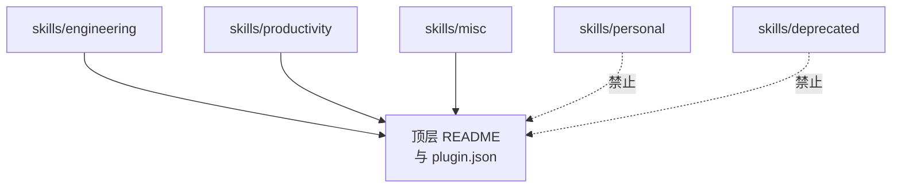

相关源文件

生成本页时使用的主要源文件：

- [CLAUDE.md](../../../project-repos/skills/CLAUDE.md)
- [skills/deprecated/README.md](../../../project-repos/skills/skills/deprecated/README.md)
- [skills/personal/README.md](../../../project-repos/skills/skills/personal/README.md)
- [skills/engineering/triage/OUT-OF-SCOPE.md](../../../project-repos/skills/skills/engineering/triage/OUT-OF-SCOPE.md)

# 目录桶策略与治理边界

`CLAUDE.md` 把目录桶定义成五条语义边界：`engineering`（日常编码）、`productivity`（非编码工作流）、`misc`（少用工具）、`personal`（与作者个人绑定，不晋升）、`deprecated`（停止使用）。唯一能进入「对外承诺面」（README + `.claude-plugin`）的只有前三类；这既保护用户预期，也给作者留了私人实验的沙盒。

`triage` 技能携带的 `OUT-OF-SCOPE.md` 进一步解释 **consumer 仓库** 根目录 `.out-of-scope/` 知识库的形态：「一概念一文件」，把拒绝理由写成轻量设计短文，从而在关闭 Issue 后不丢失上下文，并在新问题到来时先去重。**这不是本仓库的实现代码**，却是 engineering 技能对「开源维护」场景的强约束。

Sources: [CLAUDE.md:1-13](../../../project-repos/skills/CLAUDE.md#L1-L13), [skills/personal/README.md:1-6](../../../project-repos/skills/skills/personal/README.md#L1-L6), [skills/deprecated/README.md:1-8](../../../project-repos/skills/skills/deprecated/README.md#L1-L8), [skills/engineering/triage/OUT-OF-SCOPE.md:1-18](../../../project-repos/skills/skills/engineering/triage/OUT-OF-SCOPE.md#L1-L18)

## 相关页面

- [发布面与插件清单](publishing-surface.md) — misc 是否在插件清单内的差异
- [Engineering 技能矩阵](engineering-skills-matrix.md) — triage 与 `.out-of-scope/` 的互动
