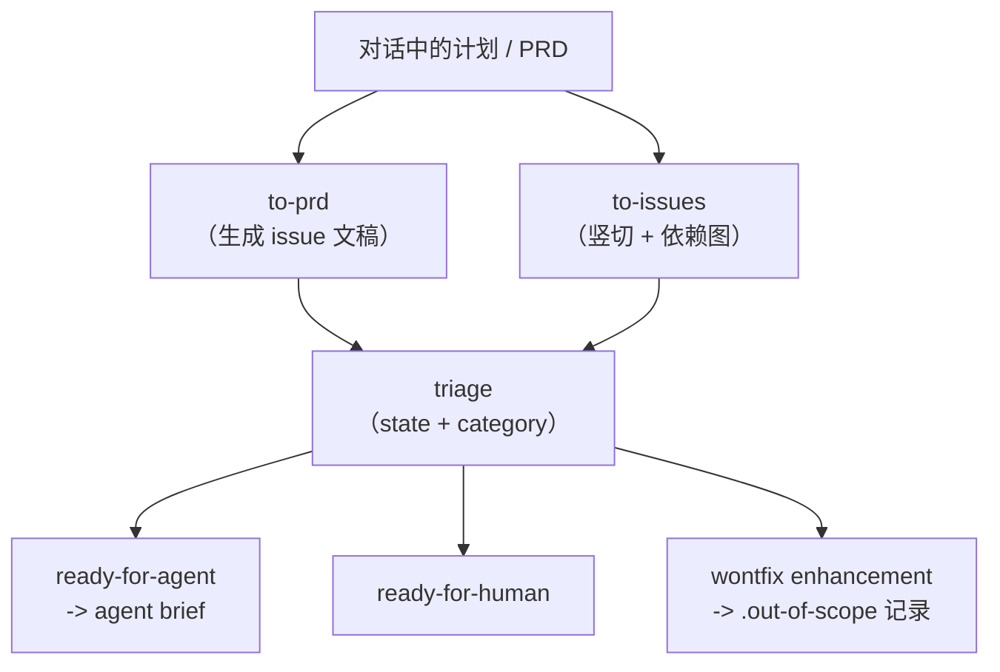

相关源文件

生成本页时使用的主要源文件：

- [skills/engineering/README.md](../../../project-repos/skills/skills/engineering/README.md)
- [skills/engineering/to-issues/SKILL.md](../../../project-repos/skills/skills/engineering/to-issues/SKILL.md)
- [skills/engineering/triage/SKILL.md](../../../project-repos/skills/skills/engineering/triage/SKILL.md)
- [skills/engineering/to-prd/SKILL.md](../../../project-repos/skills/skills/engineering/to-prd/SKILL.md)

# Engineering 技能矩阵

`skills/engineering/README.md` 用一句话概括了 9 个日常技能各自的「可交付物」：从诊断循环、到 grilling+文档、Issue 状态机、架构深化、setup、TDD、拆单、生成 PRD issue、以及 zoom-out 阅读法。阅读技巧是 **按数据面（Issue tracker）与控制面（triage 状态机）先分层**，再看质量技能（`tdd`、`diagnose`、`improve-codebase-architecture`）如何挂载在这张网上。

`to-issues` 把任何计划拆成 **tracer bullet** 竖切：每个 issue 必须窄、但要穿过所有集成层，可演示或可验证；同时在模板里要求写清 parent、验收标准、依赖关系，并在发布时统一打上 `needs-triage` 以进入 triage 技能定义的工作流。它还硬编码了 **HITL vs AFK** 分类，用来表达「哪些切片必须等人拍板」。

`triage` 把维护者语言译成 **两个 category 角色（bug/enhancement）+ 五个 state 角色**，并规定 triage 期间所有外发内容都要带固定免责声明，避免把机器生成意见伪装成人类结论。它还要求读 `.out-of-scope/*.md`，在 `wontfix` 场景把机构记忆写回知识库，从而让重复请求被快速对齐到历史决定。

Sources: [skills/engineering/README.md:1-13](../../../project-repos/skills/skills/engineering/README.md#L1-L13), [skills/engineering/to-issues/SKILL.md:1-79](../../../project-repos/skills/skills/engineering/to-issues/SKILL.md#L1-L79), [skills/engineering/triage/SKILL.md:1-78](../../../project-repos/skills/skills/engineering/triage/SKILL.md#L1-L78)

## 相关页面

- [每仓配置与领域契约](setup-and-domain-contract.md) — Issue 与 label 映射从何而来
- [Productivity 与 Misc 技能](productivity-and-tooling-skills.md) — `/grill-*` 如何支援 triage
- [失败模式与工程价值观](failure-modes-and-values.md) — 这些技能的叙事起点
