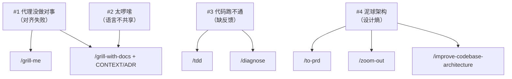

相关源文件

生成本页时使用的主要源文件：

- [README.md](../../../project-repos/skills/README.md)
- [CONTEXT.md](../../../project-repos/skills/CONTEXT.md)
- [docs/adr/0001-explicit-setup-pointer-only-for-hard-dependencies.md](../../../project-repos/skills/docs/adr/0001-explicit-setup-pointer-only-for-hard-dependencies.md)

# 失败模式与工程价值观

README 用四个「代理失效模式」组织技能目录，而不是按字母表堆放命令；这决定了读者应把本仓库当作 **行为矫正器** 来理解：每个 skill 都对应一种可观察的失败，以及一条可重复的纠偏路径。

**Insight**：作者把 `CONTEXT.md` 放在仓库根，并不是装饰，而是 `grill-with-docs`、若干 engineering 技能在运行时真正会检索的「领域压缩层」——它用 **Issue tracker / Issue / Triage role** 三条定义消掉「backlog」一词的多义性，让代理在跨会话表达时减少指代漂移。

第一条失败模式直接引用 *The Pragmatic Programmer*：没人一开始就知道自己要什么，因此需要 **grilling session** 把决策树走全。第二条借 DDD 的「通用语言」概念，指出代理被丢进代码库时会用 20 个词描述 1 个概念；解法是把语言沉淀成 `CONTEXT.md`，并在 `grill-with-docs` 里同步 ADR。第三条回到极限编程：小步、快反馈；`tdd` 与 `diagnose` 分别覆盖「写对」与「查错」。第四条引用 Kent Beck 与 John Ousterhout：代理加速编码也加速熵增，因此把 **设计** 写进技能（`to-prd` 先问清触及模块、`zoom-out` 强制拉远视角、`improve-codebase-architecture` 周期性去杠杆）。

ADR `0001` 把「是否要在技能里硬编码 `/setup` 提示」变成显式策略：`to-issues`、`to-prd`、`triage` 被归为 **hard dependency**——缺配置时输出会 **错**；`diagnose`、`tdd` 等则只在措辞上引用领域文档，缺了也能跑，只是更糊。这个分叉避免把 setup 提示宗教化地复制到每个文件里，也解释了为何 README 把 setup 技能放在工程技能列表的枢纽位置。

Sources: [README.md:40-138](../../../project-repos/skills/README.md#L40-L138), [CONTEXT.md:1-27](../../../project-repos/skills/CONTEXT.md#L1-L27), [docs/adr/0001-explicit-setup-pointer-only-for-hard-dependencies.md:1-11](../../../project-repos/skills/docs/adr/0001-explicit-setup-pointer-only-for-hard-dependencies.md#L1-L11)

## 相关页面

- [项目概览](overview.md) — 宏观结构与安装路径
- [Engineering 技能矩阵](engineering-skills-matrix.md) — 这些价值观如何落到具体 SKILL
- [Productivity 与 Misc 技能](productivity-and-tooling-skills.md) — 非代码向与工具向补充
