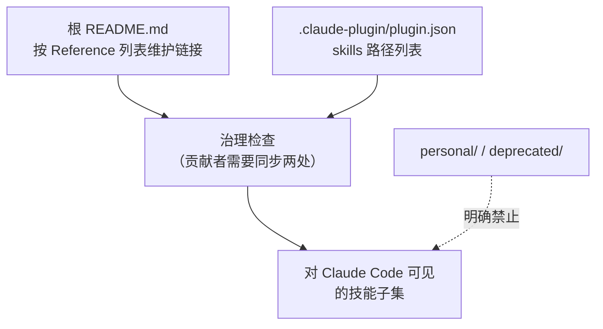

相关源文件

生成本页时使用的主要源文件：

- [.claude-plugin/plugin.json](../../../project-repos/skills/.claude-plugin/plugin.json)
- [README.md](../../../project-repos/skills/README.md)
- [CLAUDE.md](../../../project-repos/skills/CLAUDE.md)

# 发布面与插件清单

对外「哪些技能可见」由两层共同决定：根 `README.md` 的人类导航，以及 `.claude-plugin/plugin.json` 的机器可读枚举。作者把两者绑定成治理规则，避免插件市场与文档漂移。

`CLAUDE.md` 规定：`engineering/`、`productivity/`、`misc/` 下的每个技能必须同时出现在 **顶层 README** 与 **plugin.json**；`personal/` 与 `deprecated/` 则 **不得** 出现在这两处。结果是：你在 Marketplace 里安装到的，就是作者愿意承诺维护、且故事线完整的那一组；个人脚本与历史实验被物理隔离在别的桶里。

**Insight**：`plugin.json` 只列出 12 条相对路径，全部落在 `skills/engineering` 与 `skills/productivity`；`misc/` 虽然在 README 有引用，但 **未进入** 当前插件清单——这意味着「作者日常推荐」与「插件默认打包」可以刻意不同；读者若需要 `misc` 技能，需要自行复制或扩展本地插件配置。

根 README 还承载「新闻通讯」跳转与仓库横幅图等非代码资产；就与技能治理无关的安装体验而言，关键在于 `npx skills@latest add mattpocock/skills` 这一入口把远程仓库转成各工具链可用的技能骨架，随后由 `/setup-matt-pocock-skills` 写入消费侧配置详情。

Sources: [.claude-plugin/plugin.json:1-17](../../../project-repos/skills/.claude-plugin/plugin.json#L1-L17), [CLAUDE.md:5-13](../../../project-repos/skills/CLAUDE.md#L5-L13), [README.md:143-173](../../../project-repos/skills/README.md#L143-L173)

## 相关页面

- [项目概览](overview.md) — Quickstart 与总体定位
- [每仓配置与领域契约](setup-and-domain-contract.md) — Marketplace 装上之后还要做什么
- [本地开发脚本](scripts-local-dev.md) — 开发者如何把全量 `skills/` symlink 到本机 Claude 目录
