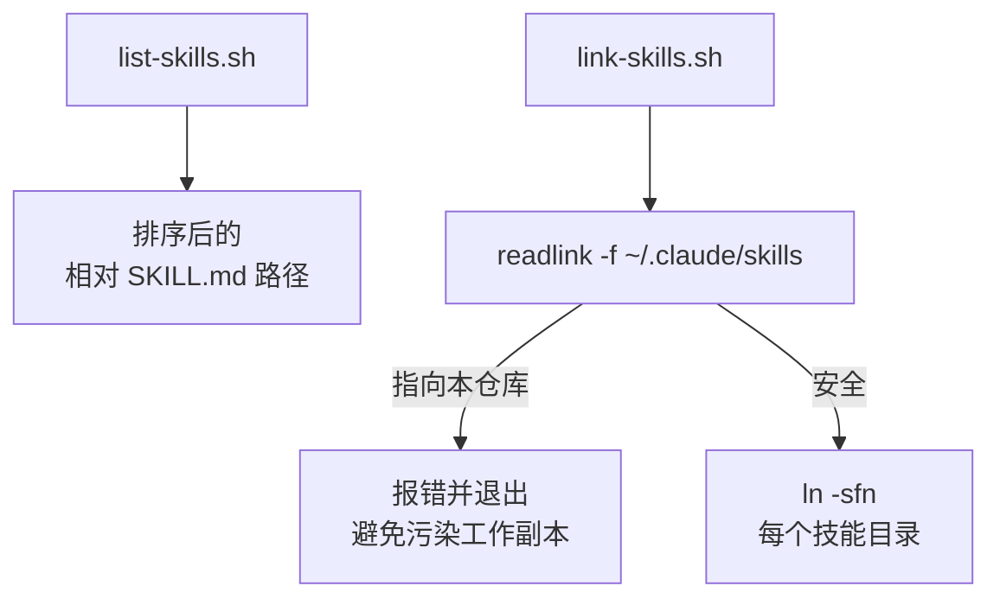

相关源文件

生成本页时使用的主要源文件：

- [scripts/link-skills.sh](../../../project-repos/skills/scripts/link-skills.sh)
- [scripts/list-skills.sh](../../../project-repos/skills/scripts/list-skills.sh)

# 本地开发脚本

仓库只提供两条与「开发体验」直接相关的 Bash 工具：`list-skills.sh` 递归列出所有 `SKILL.md` 的相对路径；`link-skills.sh` 则把这些技能目录 **符号链接** 到 `~/.claude/skills/<skillName>`，方便在本机 CLI 侧快速迭代。

`link-skills.sh` 的关键安全阀是 **检测 `~/.claude/skills` 是否是指回当前仓库的 symlink**：如果是，则继续链接会在仓库自己的 `skills/` 树里制造污染，因此脚本直接 `exit 1` 并要求用户删除该 symlink 后重跑。这是一个典型的「局部不变量」——它保护的是工作副本与全局技能目录之间的边界。

Sources: [scripts/link-skills.sh:1-38](../../../project-repos/skills/scripts/link-skills.sh#L1-L38), [scripts/list-skills.sh:1-8](../../../project-repos/skills/scripts/list-skills.sh#L1-L8)

## 相关页面

- [发布面与插件清单](publishing-surface.md) — 与 Marketplace 安装的差异
- [项目概览](overview.md)
