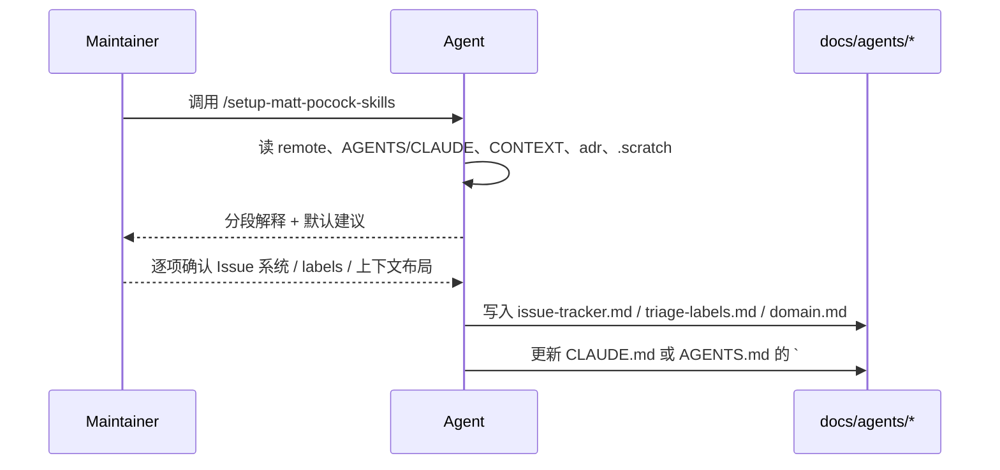

相关源文件

生成本页时使用的主要源文件：

- [skills/engineering/setup-matt-pocock-skills/SKILL.md](../../../project-repos/skills/skills/engineering/setup-matt-pocock-skills/SKILL.md)
- [docs/adr/0001-explicit-setup-pointer-only-for-hard-dependencies.md](../../../project-repos/skills/docs/adr/0001-explicit-setup-pointer-only-for-hard-dependencies.md)
- [CONTEXT.md](../../../project-repos/skills/CONTEXT.md)

# 每仓配置与领域契约

`/setup-matt-pocock-skills` 是唯一显式面向「把你的仓库改造成技能可消费形状」的入口。它不做确定性脚本，而是用 **探索 → 分项确认 → 草稿 → 写入** 的提示工程，把三类信息落到 `docs/agents/`：Issue tracker 工作流、triage label 映射、以及 `CONTEXT`/ADR 的布局规则。

技能正文强调：默认假设 GitHub（`gh`），但也支持 GitLab（`glab`）、本地 `.scratch/` markdown、或用户一段自由文本描述的其他系统。它与 ADR `0001` 形成闭环——当输出 **依赖具体 label 字符串或远程 API** 时，缺配置就是 **硬错误**；当只是「读读词汇表更爽」时，就不反复骚扰用户去 setup。

**治理细节**：如果已存在 `CLAUDE.md` 就编辑它；否则编辑 `AGENTS.md`；两者都不存在则由用户选择新建哪个，**禁止**在已有其一的情况下再创建另一个——这避免双源配置。`disable-model-invocation: true` frontmatter 把这技能限制为「显式由人触发」，降低被模型误启用的概率。

Sources: [skills/engineering/setup-matt-pocock-skills/SKILL.md:1-120](../../../project-repos/skills/skills/engineering/setup-matt-pocock-skills/SKILL.md#L1-L120), [docs/adr/0001-explicit-setup-pointer-only-for-hard-dependencies.md:1-11](../../../project-repos/skills/docs/adr/0001-explicit-setup-pointer-only-for-hard-dependencies.md#L1-L11), [CONTEXT.md:1-22](../../../project-repos/skills/CONTEXT.md#L1-L22)

## 相关页面

- [Engineering 技能矩阵](engineering-skills-matrix.md) — setup 之后最常连用的技能
- [发布面与插件清单](publishing-surface.md) — 插件层与文档层如何对齐
- [失败模式与工程价值观](failure-modes-and-values.md) — hard/soft 依赖的产品故事
