# mcporter DeepWiki — 完整导出
> 面向 MCP（Model Context Protocol）的 TypeScript 运行时、CLI 与代码生成工具集 mcporter 的中文导览。

源仓库: `https://github.com/steipete/mcporter.git` @ `324fb7a00edc6fa4eacf1deeb4ac33a2a7341c09`  
语言: zh-CN    模式: comprehensive

## 目录

### 概览
- [项目概览](#overview) — mcporter 的定位、能力矩阵、目标受众与阅读路径。

### 系统架构
- [系统架构](#system-architecture) — 顶层架构、模块边界与依赖方向：CLI、Runtime、Config、Daemon、OAuth 五大子系统的协作关系。

### 配置与导入
- [配置加载与导入](#configuration) — mcporter.json/jsonc 的解析顺序、JSONC 注释、imports 机制以及 7 种编辑器配置导入。

### 运行时与传输
- [运行时与传输层](#runtime-transport) — createRuntime / callOnce 入口、连接池缓存、StreamableHTTP→SSE 回退、stdio 子进程、过滤器与超时。

### CLI 命令体系
- [CLI 命令体系](#cli-commands) — mcporter list / call / auth / config / daemon / generate-cli / inspect-cli / emit-ts 的命令路由与执行流。

### 调用语法与参数
- [调用语法、自动纠错与临时服务器](#call-syntax) — key=value / 函数调用 / URL 选择器、Levenshtein 自动纠错、--http-url/--stdio 临时连接与持久化。

### 代码生成（generate-cli / emit-ts）
- [代码生成：generate-cli 与 emit-ts](#code-generation) — 把 MCP 服务器物化为单文件 CLI / Bun 二进制 / TypeScript 类型与客户端模块的生成管线。

### Keep-Alive 守护进程
- [Keep-Alive 守护进程](#daemon) — 为 chrome-devtools / mobile-mcp / playwright 等有状态 MCP 维持长连接的本地 socket 守护进程。

### OAuth 与凭证仓库
- [OAuth 流程与凭证仓库](#oauth) — PersistentOAuthClientProvider、本地回调服务器、文件目录 / vault 持久化与缓存令牌注入。

### 测试、CI 与可观测性
- [测试、CI 与可观测性](#testing-ci) — Vitest 套件结构、跨平台 CI 矩阵、stdio 调试钩子、运行时 hang 排查与日志策略。

---


<a id='overview'></a>

<details>
<summary>相关源文件</summary>

生成本页时使用的主要源文件：

- [README.md](../../../project-repos/mcporter/README.md)
- [package.json](../../../project-repos/mcporter/package.json)
- [src/index.ts](../../../project-repos/mcporter/src/index.ts)
- [src/cli.ts](../../../project-repos/mcporter/src/cli.ts)
- [CHANGELOG.md](../../../project-repos/mcporter/CHANGELOG.md)

</details>

# 项目概览

`mcporter` 是 **Model Context Protocol（MCP）** 的 TypeScript 运行时与 CLI 工具集。它把"如何发现已配置的 MCP 服务器、如何发起一次工具调用、如何把 MCP 工具固化为可分发的产物"这条链路抽象成了一组首要可重用的 npm 库与单一的 `mcporter` CLI 二进制。

仓库整体按"运行库（`src/index.ts` 暴露的公共面）+ CLI 入口（`bin/mcporter`→`dist/cli.js`）+ 守护进程"的三段式组织。npm 包同时提供库导出与 CLI bin 安装两种使用形态，由 `package.json` 的 `bin` 字段定义。
Sources: [package.json:17-38](../../../project-repos/mcporter/package.json#L17-L38), [src/index.ts:1-9](../../../project-repos/mcporter/src/index.ts#L1-L9), [src/cli.ts:30-211](../../../project-repos/mcporter/src/cli.ts#L30-L211)

<details class="source-snippets">
<summary>引用源码</summary>

<!-- source-snippets:start -->

#### `package.json:17-38`

```json
  "bin": {
    "mcporter": "dist/cli.js"
  },
  "files": [
    "dist",
    "README.md",
    "LICENSE"
  ],
  "type": "module",
  "main": "dist/index.js",
  "module": "dist/index.js",
  "types": "dist/index.d.ts",
  "exports": {
    ".": {
      "import": "./dist/index.js",
      "types": "./dist/index.d.ts"
    },
    "./cli": {
      "import": "./dist/cli.js",
      "types": "./dist/cli.d.ts"
    }
  },
```

#### `src/index.ts:1-9`

```typescript
export type { CommandSpec, ServerDefinition } from './config.js';
export { loadServerDefinitions } from './config.js';
export type { CallResult, ConnectionIssue, ImageContent } from './result-utils.js';
export { createCallResult, describeConnectionIssue, wrapCallResult } from './result-utils.js';
export type { CallOptions, ListToolsOptions, Runtime, RuntimeLogger, ServerToolInfo } from './runtime.js';
export { callOnce, createRuntime } from './runtime.js';
export type { ServerProxyOptions } from './server-proxy.js';
export { createServerProxy } from './server-proxy.js';
```

#### `src/cli.ts:30-211`

```typescript
export async function runCli(argv: string[]): Promise<void> {
  const args = [...argv];
  if (args.length === 0) {
    printHelp();
    process.exit(1);
    return;
  }

  const context = buildGlobalContext(args);
  if ('exit' in context) {
    process.exit(context.code);
    return;
  }
  const { globalFlags, runtimeOptions } = context;
  const command = args.shift();

  if (!command) {
    printHelp();
    process.exit(1);
    return;
  }

  if (isHelpToken(command)) {
    printHelp();
    process.exitCode = 0;
    return;
  }

  if (isVersionToken(command)) {
    await printVersion();
    return;
  }

  // Early-exit command handlers that don't require runtime inference.
  if (command === 'generate-cli') {
    await handleGenerateCli(args, globalFlags);
    return;
  }
  if (command === 'inspect-cli') {
    await handleInspectCli(args);
    return;
  }
  const rootOverride = globalFlags['--root'];
  const configPath = runtimeOptions.configPath ?? globalFlags['--config'];
  const configResolution = resolveConfigPath(globalFlags['--config'], rootOverride ?? process.cwd());
  const configPathResolved = configPath ?? configResolution.path;
  // Only pass configPath to runtime options if it was explicitly provided (via --config flag or env var).
  // If not explicit, let loadConfigLayers handle the default resolution to avoid ENOENT on missing config.
  const runtimeOptionsWithPath = {
    ...runtimeOptions,
    configPath: configResolution.explicit ? configPathResolved : runtimeOptions.configPath,
  };

  if (command === 'daemon') {
    await handleDaemonCli(args, {
      configPath: configPathResolved,
      configExplicit: configResolution.explicit,
      rootDir: rootOverride,
    });
    return;
  }

  if (command === 'config') {
    await handleConfigCli(
      {
        loadOptions: { configPath, rootDir: rootOverride },
        invokeAuth: (authArgs) => invokeAuthCommand(runtimeOptionsWithPath, authArgs),
      },
      args
    );
    return;
  }

  if (command === 'emit-ts') {
    const runtime = await createRuntime(runtimeOptionsWithPath);
    try {
      await handleEmitTs(runtime, args);
    } finally {
      await runtime.close().catch(() => {});
    }
    return;
  }

  const baseRuntime = await createRuntime(runtimeOptionsWithPath);
  const keepAliveServers = new Set(
    baseRuntime
      .getDefinitions()
      .filter(isKeepAliveServer)
      .map((entry) => entry.name)
  );
  const daemonClient =
    keepAliveServers.size > 0
      ? new DaemonClient({
          configPath: configResolution.path,
          configExplicit: configResolution.explicit,
          rootDir: rootOverride,
        })
      : null;
  const runtime = createKeepAliveRuntime(baseRuntime, { daemonClient, keepAliveServers });

  const inference = inferCommandRouting(command, args, runtime.getDefinitions());
  if (inference.kind === 'abort') {
    process.exitCode = inference.exitCode;
    return;
  }
  const resolvedCommand = inference.command;
  const resolvedArgs = inference.args;

  try {
    if (resolvedCommand === 'list') {
      if (consumeHelpTokens(resolvedArgs)) {
        printListHelp();
        process.exitCode = 0;
        return;
      }
      await handleList(runtime, resolvedArgs);
      return;
    }

    if (resolvedCommand === 'call') {
... snippet truncated ...
```

<!-- source-snippets:end -->
</details>
## 核心定位

mcporter 解决三个高频痛点：

1. **跨编辑器配置发现** — 开发者已经在 Cursor / Claude Code / Claude Desktop / Codex / Windsurf / OpenCode / VS Code 中配置过 MCP 服务器，再让另一个工具重新写一遍配置是不必要的。`mcporter` 默认启用 7 个编辑器配置导入（[src/config-schema.ts:9-17]()），把这些 `mcp.json` / `settings.json` / `config.toml` 合并成同一个名字空间。
2. **统一调用面** — 不论目标 MCP 是 HTTPS（StreamableHTTP / SSE）还是 stdio（本地子进程），CLI 与 SDK 都以 `<server>.<tool>` 选择器、`createRuntime()` 与 `createServerProxy()` 三种形态对外暴露。
3. **代码生成** — `generate-cli` 把任一 MCP 服务器物化为独立 CLI（含 Rolldown / Bun bundle、Bun 编译为单文件二进制），`emit-ts` 输出 `.d.ts` 类型或客户端封装（[src/cli/emit-ts-command.ts:46-94]()）。生成产物自带元数据，可用 `inspect-cli` 反查与 `generate-cli --from` 复用旧参数重新生成。

## 关键能力

| 能力 | 入口 | 说明 |
|------|------|------|
| 列出已配置 MCP | `mcporter list` | 多服务器并行探测、超时分片、JSON / 文本两种输出，单服务器输出仿 TS 头文件签名 |
| 调用工具 | `mcporter call <server>.<tool>` 或 `mcporter <server>.<tool>` | 支持 `key=value` / `key:value` / `'tool(arg: value)'` / 全 URL / 临时 stdio 命令 |
| OAuth | `mcporter auth <server>` | 启动本地回调服务器，把浏览器里的授权码兑换成 token 并落盘 |
| 配置管理 | `mcporter config list/get/add/remove/import/login/logout/doctor` | 不需要手写 JSON 即可增删与从编辑器导入 |
| Keep-alive 守护 | `mcporter daemon start/status/stop/restart` | 为 chrome-devtools 等需要长连接的 stdio 服务器提供共享守护 |
| 生成单文件 CLI | `mcporter generate-cli` | 输出 `.ts` 模板 + Rolldown/Bun bundle + 可选 Bun 编译二进制 |
| 生成 TS 类型 | `mcporter emit-ts <server>` | `--mode types` 出 `.d.ts`，`--mode client` 同时生成 `createServerProxy` 包装 |
| 反查产物 | `mcporter inspect-cli <path>` | 读取已生成 CLI 内嵌的 metadata，回放 `generate-cli --from` |

Sources: [README.md:18-209](../../../project-repos/mcporter/README.md#L18-L209), [src/cli.ts:64-167](../../../project-repos/mcporter/src/cli.ts#L64-L167), [src/cli/emit-ts-command.ts:30-94](../../../project-repos/mcporter/src/cli/emit-ts-command.ts#L30-L94)

<details class="source-snippets">
<summary>引用源码</summary>

<!-- source-snippets:start -->

#### `README.md:18-209`

````markdown
## Key Capabilities

- **Zero-config discovery.** `createRuntime()` merges your home config (`~/.mcporter/mcporter.json[c]`) first, then `config/mcporter.json`, plus Cursor/Claude/Codex/Windsurf/OpenCode/VS Code imports, expands `${ENV}` placeholders, and pools connections so you can reuse transports across multiple calls.
- **One-command CLI generation.** `mcporter generate-cli` turns any MCP server definition into a ready-to-run CLI, with optional bundling/compilation and metadata for easy regeneration.
- **Typed tool clients.** `mcporter emit-ts` emits `.d.ts` interfaces or ready-to-run client wrappers so agents/tests can call MCP servers with strong TypeScript types without hand-writing plumbing.
- **Friendly composable API.** `createServerProxy()` exposes tools as ergonomic camelCase methods, automatically applies JSON-schema defaults, validates required arguments, and hands back a `CallResult` with `.text()`, `.markdown()`, `.json()`, `.images()`, and `.content()` helpers.
- **OAuth and stdio ergonomics.** Built-in OAuth caching, log tailing, and stdio wrappers let you work with HTTP, SSE, and stdio transports from the same interface.
- **Ad-hoc connections.** Point the CLI at _any_ MCP endpoint (HTTP or stdio) without touching config, then persist it later if you want. Hosted MCPs that expect a browser login (Supabase, Vercel, etc.) are auto-detected—just run `mcporter auth <url>` and the CLI promotes the definition to OAuth on the fly. See [docs/adhoc.md](docs/adhoc.md).

## What's New in 0.9.0

- **Per-server tool filtering.** Limit exposed tools with `allowedTools`, or block risky exact-name tools with `blockedTools`; filtered tools disappear from `mcporter list` and are rejected by `mcporter call`.
- **Sturdier stdio shutdown.** Stuck local MCP processes now escalate cleanly instead of hanging after a call finishes.
- **OAuth polish.** Windows OAuth URLs are quoted correctly, OAuth config examples are documented, and `mcporter auth --json` returns structured connection envelopes.
- **Safer call coercion.** Tool arguments declared as strings stay strings, even when the value looks numeric.
- **Release confidence.** `0.9.0` is published on npm and Homebrew, and the live DeepWiki MCP suite is green.

## Quick Start

MCPorter auto-discovers the MCP servers you already configured in Cursor, Claude Code/Desktop, Codex, or local overrides. You can try it immediately with `npx`--no installation required. Need a full command reference (flags, modes, return types)? Check out [docs/cli-reference.md](docs/cli-reference.md).

### Call syntax options

```bash
# Colon-delimited flags (shell-friendly)
npx mcporter call linear.create_comment issueId:ENG-123 body:'Looks good!'

# Function-call style (matches signatures from `mcporter list`)
npx mcporter call 'linear.create_comment(issueId: "ENG-123", body: "Looks good!")'

# Literal positional values that start with `--`
npx mcporter call server.tool -- --raw-value
```

### List your MCP servers

```bash
npx mcporter list
npx mcporter list context7 --schema
npx mcporter list https://mcp.linear.app/mcp --all-parameters
npx mcporter list shadcn.io/api/mcp.getComponents           # URL + tool suffix auto-resolves
npx mcporter list --stdio "bun run ./local-server.ts" --env TOKEN=xyz
```

- Add `--json` to emit a machine-readable summary with per-server statuses (auth/offline/http/error counts) and, for single-server runs, the full tool schema payload.
- Add `--verbose` to show every config source that registered the server name (primary first), both in text and JSON list output.

You can now point `mcporter list` at ad-hoc servers: provide a URL directly or use the new `--http-url/--stdio` flags (plus `--env`, `--cwd`, `--name`, or `--persist`) to describe any MCP endpoint. Until you persist that definition, you still need to repeat the same URL/stdio flags for `mcporter call`—the printed slug only becomes reusable once you merge it into a config via `--persist` or `mcporter config add` (use `--scope home|project` to pick the write target). Follow up with `mcporter auth https://…` (or the same flag set) to finish OAuth without editing config. Full details live in [docs/adhoc.md](docs/adhoc.md).

Single-server listings now read like a TypeScript header file so you can copy/paste the signature straight into `mcporter call`:

```ts
linear - Hosted Linear MCP; exposes issue search, create, and workflow tooling.
  23 tools · 1654ms · HTTP https://mcp.linear.app/mcp

  /**
   * Create a comment on a specific Linear issue
   * @param issueId The issue ID
   * @param body The content of the comment as Markdown
   * @param parentId? A parent comment ID to reply to
   */
  function create_comment(issueId: string, body: string, parentId?: string);
  // optional (3): notifySubscribers, labelIds, mentionIds

  /**
   * List documents in the user's Linear workspace
   * @param query? An optional search query
   * @param projectId? Filter by project ID
   */
  function list_documents(query?: string, projectId?: string);
  // optional (11): limit, before, after, orderBy, initiativeId, ...
```

Here’s what that looks like for Vercel when you run `npx mcporter list vercel`:

```ts
vercel - Vercel MCP (requires OAuth).

  /**
   * Search the Vercel documentation.
   * Use this tool to answer any questions about Vercel’s platform, features, and best practices,
   * including:
   * - Core Concepts: Projects, Deployments, Git Integration, Preview Deployments, Environments
   * - Frontend & Frameworks: Next.js, SvelteKit, Nuxt, Astro, Remix, frameworks configuration and
   *   optimization
   * - APIs: REST API, Vercel SDK, Build Output API
   * - Compute: Fluid Compute, Functions, Routing Middleware, Cron Jobs, OG Image Generation, Sandbox,
   *   Data Cache
   * - AI: Vercel AI SDK, AI Gateway, MCP, v0
   * - Performance & Delivery: Edge Network, Caching, CDN, Image Optimization, Headers, Redirects,
   *   Rewrites
   * - Pricing: Plans, Spend Management, Billing
   * - Security: Audit Logs, Firewall, Bot Management, BotID, OIDC, RBAC, Secure Compute, 2FA
   * - Storage: Blog, Edge Config
   *
   * @param topic Topic to focus the documentation search on (e.g., 'routing', 'data-fetching').
   * @param tokens? Maximum number of tokens to include in the result. Default is 2500.
   */
  function search_vercel_documentation(topic: string, tokens?: number);

  /**
   * Deploy the current project to Vercel
   */
  function deploy_to_vercel();
```

Required parameters always show; optional parameters stay hidden unless (a) there are only one or two of them alongside fewer than four required fields or (b) you pass `--all-parameters`. Whenever MCPorter hides parameters it prints `Optional parameters hidden; run with --all-parameters to view all fields.` so you know how to reveal the full signature. Return types are inferred from the tool schema’s `title`, falling back to omitting the suffix entirely instead of guessing.

### Context7: fetch docs (no auth required)

```bash
npx mcporter call context7.resolve-library-id libraryName=react
npx mcporter call context7.get-library-docs context7CompatibleLibraryID=/websites/react_dev topic=hooks
```

### Linear: search documentation (requires `LINEAR_API_KEY`)

```bash
LINEAR_API_KEY=sk_linear_example npx mcporter call linear.search_documentation query="automations"
```
... snippet truncated ...
````

#### `src/cli.ts:64-167`

```typescript
  if (command === 'generate-cli') {
    await handleGenerateCli(args, globalFlags);
    return;
  }
  if (command === 'inspect-cli') {
    await handleInspectCli(args);
    return;
  }
  const rootOverride = globalFlags['--root'];
  const configPath = runtimeOptions.configPath ?? globalFlags['--config'];
  const configResolution = resolveConfigPath(globalFlags['--config'], rootOverride ?? process.cwd());
  const configPathResolved = configPath ?? configResolution.path;
  // Only pass configPath to runtime options if it was explicitly provided (via --config flag or env var).
  // If not explicit, let loadConfigLayers handle the default resolution to avoid ENOENT on missing config.
  const runtimeOptionsWithPath = {
    ...runtimeOptions,
    configPath: configResolution.explicit ? configPathResolved : runtimeOptions.configPath,
  };

  if (command === 'daemon') {
    await handleDaemonCli(args, {
      configPath: configPathResolved,
      configExplicit: configResolution.explicit,
      rootDir: rootOverride,
    });
    return;
  }

  if (command === 'config') {
    await handleConfigCli(
      {
        loadOptions: { configPath, rootDir: rootOverride },
        invokeAuth: (authArgs) => invokeAuthCommand(runtimeOptionsWithPath, authArgs),
      },
      args
    );
    return;
  }

  if (command === 'emit-ts') {
    const runtime = await createRuntime(runtimeOptionsWithPath);
    try {
      await handleEmitTs(runtime, args);
    } finally {
      await runtime.close().catch(() => {});
    }
    return;
  }

  const baseRuntime = await createRuntime(runtimeOptionsWithPath);
  const keepAliveServers = new Set(
    baseRuntime
      .getDefinitions()
      .filter(isKeepAliveServer)
      .map((entry) => entry.name)
  );
  const daemonClient =
    keepAliveServers.size > 0
      ? new DaemonClient({
          configPath: configResolution.path,
          configExplicit: configResolution.explicit,
          rootDir: rootOverride,
        })
      : null;
  const runtime = createKeepAliveRuntime(baseRuntime, { daemonClient, keepAliveServers });

  const inference = inferCommandRouting(command, args, runtime.getDefinitions());
  if (inference.kind === 'abort') {
    process.exitCode = inference.exitCode;
    return;
  }
  const resolvedCommand = inference.command;
  const resolvedArgs = inference.args;

  try {
    if (resolvedCommand === 'list') {
      if (consumeHelpTokens(resolvedArgs)) {
        printListHelp();
        process.exitCode = 0;
        return;
      }
      await handleList(runtime, resolvedArgs);
      return;
    }

    if (resolvedCommand === 'call') {
      if (consumeHelpTokens(resolvedArgs)) {
        printCallHelp();
        process.exitCode = 0;
        return;
      }
      await runHandleCall(runtime, resolvedArgs);
      return;
    }

    if (resolvedCommand === 'auth') {
      if (consumeHelpTokens(resolvedArgs)) {
        printAuthHelp();
        process.exitCode = 0;
        return;
      }
      await handleAuth(runtime, resolvedArgs);
      return;
    }
```

#### `src/cli/emit-ts-command.ts:30-94`

```typescript
export async function handleEmitTs(runtime: Runtime, args: string[]): Promise<void> {
  const options = parseEmitTsArgs(args);
  const definition = getServerDefinition(runtime, options.server);
  const metadataEntries = await loadToolMetadata(runtime, options.server, {
    includeSchema: true,
    autoAuthorize: false,
  });
  const generator = await readPackageMetadata();
  const metadata: EmitMetadata = {
    server: definition,
    generatorLabel: `${generator.name}@${generator.version}`,
    generatedAt: new Date(),
  };
  const docEntries = buildDocEntries(options.server, metadataEntries, options.includeOptional);
  const interfaceName = buildInterfaceName(options.server);

  if (options.mode === 'types') {
    const source = renderTypesModule({ interfaceName, docs: docEntries, metadata });
    await writeFile(options.outPath, source);
    if (options.format === 'json') {
      console.log(
        JSON.stringify(
          {
            mode: 'types',
            server: options.server,
            outPath: options.outPath,
          },
          null,
          2
        )
      );
    } else {
      console.log(`Emitted TypeScript definitions for ${options.server} → ${options.outPath}`);
    }
    return;
  }

  const typesOutPath = options.typesOutPath ?? deriveTypesOutPath(options.outPath);
  const relativeImportPath = computeImportPath(options.outPath, typesOutPath);
  const typesSource = renderTypesModule({ interfaceName, docs: docEntries, metadata });
  const clientSource = renderClientModule({
    interfaceName,
    docs: docEntries,
    metadata,
    typesImportPath: relativeImportPath,
  });
  await writeFile(typesOutPath, typesSource);
  await writeFile(options.outPath, clientSource);
  if (options.format === 'json') {
    console.log(
      JSON.stringify(
        {
          mode: 'client',
          server: options.server,
          clientOutPath: options.outPath,
          typesOutPath,
        },
        null,
        2
      )
    );
  } else {
    console.log(`Emitted client + types for ${options.server} → ${options.outPath} / ${typesOutPath}`);
  }
}
```

<!-- source-snippets:end -->
</details>
## 公共 API 切面

`src/index.ts` 暴露的入口非常克制——只 9 行。这是 mcporter 作为 npm 库时使用者真正能拿到的全部类型与函数：

```ts
export type { CommandSpec, ServerDefinition } from './config.js';
export { loadServerDefinitions } from './config.js';
export type { CallResult, ConnectionIssue, ImageContent } from './result-utils.js';
export { createCallResult, describeConnectionIssue, wrapCallResult } from './result-utils.js';
export type { CallOptions, ListToolsOptions, Runtime, RuntimeLogger, ServerToolInfo } from './runtime.js';
export { callOnce, createRuntime } from './runtime.js';
export type { ServerProxyOptions } from './server-proxy.js';
export { createServerProxy } from './server-proxy.js';
```

注意：`mcporter` 的 CLI 子模块（`src/cli/**`）**不**对外导出，CLI 只通过 `dist/cli.js` 二进制提供。库使用者需要自己实现 UI / 命令分发的话，从 `createRuntime()` 与 `createServerProxy()` 出发即可。
Sources: [src/index.ts:1-9](../../../project-repos/mcporter/src/index.ts#L1-L9), [package.json:29-38](../../../project-repos/mcporter/package.json#L29-L38)

<details class="source-snippets">
<summary>引用源码</summary>

<!-- source-snippets:start -->

#### `src/index.ts:1-9`

```typescript
export type { CommandSpec, ServerDefinition } from './config.js';
export { loadServerDefinitions } from './config.js';
export type { CallResult, ConnectionIssue, ImageContent } from './result-utils.js';
export { createCallResult, describeConnectionIssue, wrapCallResult } from './result-utils.js';
export type { CallOptions, ListToolsOptions, Runtime, RuntimeLogger, ServerToolInfo } from './runtime.js';
export { callOnce, createRuntime } from './runtime.js';
export type { ServerProxyOptions } from './server-proxy.js';
export { createServerProxy } from './server-proxy.js';
```

#### `package.json:29-38`

```json
  "exports": {
    ".": {
      "import": "./dist/index.js",
      "types": "./dist/index.d.ts"
    },
    "./cli": {
      "import": "./dist/cli.js",
      "types": "./dist/cli.d.ts"
    }
  },
```

<!-- source-snippets:end -->
</details>
## 受众与使用场景

- **写 Agent / 脚本的工程师**：用 `createRuntime()` 直接合并多客户端配置，在脚本里调用 MCP 工具，不需要重新写配置文件。
- **MCP 工具开发者**：用 `mcporter list <server> --schema` 检查 MCP 输入输出 schema 是否符合预期，用 `mcporter generate-cli` 把自家服务器分发出去。
- **平台与团队**：用 `mcporter config import` 拉取 IDE 配置进项目级 `config/mcporter.json`，用 `--persist` 把临时 `--http-url` 固化下来，让团队成员只需 `npx mcporter <name>`。
- **运维 / 调试**：用 `daemon` 解决 Chrome DevTools / mobile-mcp 类有状态服务器在多 agent 之间被反复拉起的损耗（[src/lifecycle.ts:3-22]()），用 `MCPORTER_DEBUG_HANG=1` / `--tail-log` 调查 stdio 进程残留。

## 仓库快照

```text
mcporter/
├── src/
│   ├── cli.ts                     CLI 入口（runCli / main）
│   ├── index.ts                   npm 库公共导出
│   ├── runtime.ts                 createRuntime / callOnce 实现
│   ├── server-proxy.ts            camelCase Proxy + schema 默认值
│   ├── config.ts                  loadServerDefinitions（合并 imports + 本地）
│   ├── config-schema.ts           Zod schema：RawEntry / ServerDefinition / CommandSpec
│   ├── config-normalize.ts        RawEntry → ServerDefinition 规范化
│   ├── config/
│   │   ├── path-discovery.ts      ~/.mcporter / config/mcporter.json 解析顺序
│   │   ├── read-config.ts         JSONC 解析 + 多层 layer
│   │   └── imports/external.ts    Cursor/Claude/Codex/Windsurf/VSCode 解析
│   ├── runtime/
│   │   ├── transport.ts           StreamableHTTP → SSE 回退、stdio 启动
│   │   ├── oauth.ts               connectWithAuth + retryHttpTransportWithFallback
│   │   ├── errors.ts              shouldResetConnection 判定
│   │   └── utils.ts               normalizeTimeout / raceWithTimeout
│   ├── oauth.ts                   PersistentOAuthClientProvider + 回调服务器
│   ├── oauth-persistence.ts       Vault + Directory + Composite 三层持久化
│   ├── oauth-vault.ts             ~/.mcporter/credentials.json
│   ├── daemon/
│   │   ├── host.ts                Unix socket 守护进程 + 请求路由
│   │   ├── client.ts              DaemonClient + 自动启动
│   │   ├── runtime-wrapper.ts     KeepAliveRuntime（按需走 daemon）
│   │   └── protocol.ts            JSON-RPC 风格私有协议
│   ├── lifecycle.ts               keep-alive 默认名单与 env 覆盖
│   ├── tool-filters.ts            allowedTools / blockedTools
│   ├── result-utils.ts            CallResult.text/markdown/json/images
│   ├── error-classifier.ts        auth / offline / http / stdio-exit / other
│   ├── sdk-patches.ts             StdioClientTransport.close 修补（防 hang）
│   ├── generate-cli.ts            generate-cli 主流程
│   └── cli/                       Commander 命令集合（list/call/auth/config/daemon/generate)
├── tests/                         Vitest（≈90 个测试文件）
├── docs/                          adhoc / call-syntax / daemon / mcp 等专题文档
├── scripts/                       build-bun / generate-json-schema 等
├── config/mcporter.json           示例与默认 project 配置位置
└── .github/workflows/ci.yml       Linux + macOS + Windows × Node 24 矩阵
```

Sources: [src/index.ts:1-9](../../../project-repos/mcporter/src/index.ts#L1-L9), [src/cli.ts:1-25](../../../project-repos/mcporter/src/cli.ts#L1-L25), [src/runtime.ts:1-16](../../../project-repos/mcporter/src/runtime.ts#L1-L16), [src/config.ts:1-21](../../../project-repos/mcporter/src/config.ts#L1-L21)

<details class="source-snippets">
<summary>引用源码</summary>

<!-- source-snippets:start -->

#### `src/index.ts:1-9`

```typescript
export type { CommandSpec, ServerDefinition } from './config.js';
export { loadServerDefinitions } from './config.js';
export type { CallResult, ConnectionIssue, ImageContent } from './result-utils.js';
export { createCallResult, describeConnectionIssue, wrapCallResult } from './result-utils.js';
export type { CallOptions, ListToolsOptions, Runtime, RuntimeLogger, ServerToolInfo } from './runtime.js';
export { callOnce, createRuntime } from './runtime.js';
export type { ServerProxyOptions } from './server-proxy.js';
export { createServerProxy } from './server-proxy.js';
```

#### `src/cli.ts:1-25`

```typescript
#!/usr/bin/env node
import { handleAuth, printAuthHelp } from './cli/auth-command.js';
import { printCallHelp, handleCall as runHandleCall } from './cli/call-command.js';
import { buildGlobalContext } from './cli/cli-factory.js';
import { inferCommandRouting } from './cli/command-inference.js';
import { handleConfigCli } from './cli/config-command.js';
import { handleDaemonCli } from './cli/daemon-command.js';
import { handleEmitTs } from './cli/emit-ts-command.js';
import { CliUsageError } from './cli/errors.js';
import { handleGenerateCli } from './cli/generate-cli-runner.js';
import { consumeHelpTokens, isHelpToken, isVersionToken, printHelp, printVersion } from './cli/help-output.js';
import { handleInspectCli } from './cli/inspect-cli-command.js';
import { handleList, printListHelp } from './cli/list-command.js';
import { logError, logInfo } from './cli/logger-context.js';
import { DEBUG_HANG, dumpActiveHandles, terminateChildProcesses } from './cli/runtime-debug.js';
import { resolveConfigPath } from './config.js';
import { DaemonClient } from './daemon/client.js';
import { createKeepAliveRuntime } from './daemon/runtime-wrapper.js';
import { isKeepAliveServer } from './lifecycle.js';
import { createRuntime } from './runtime.js';

export { handleAuth, printAuthHelp } from './cli/auth-command.js';
export { parseCallArguments } from './cli/call-arguments.js';
export { handleCall } from './cli/call-command.js';
export { handleGenerateCli } from './cli/generate-cli-runner.js';
```

#### `src/runtime.ts:1-16`

```typescript
import { createRequire } from 'node:module';

import type { CallToolRequest, ListResourcesRequest } from '@modelcontextprotocol/sdk/types.js';
import { loadServerDefinitions, type ServerDefinition } from './config.js';
import { createPrefixedConsoleLogger, type Logger, type LogLevel, resolveLogLevelFromEnv } from './logging.js';
import { closeTransportAndWait } from './runtime-process-utils.js';
import './sdk-patches.js';
import { shouldResetConnection } from './runtime/errors.js';
import { resolveOAuthTimeoutFromEnv } from './runtime/oauth.js';
import { type ClientContext, createClientContext } from './runtime/transport.js';
import { normalizeTimeout, raceWithTimeout } from './runtime/utils.js';
import { filterTools, isToolAllowed, validateToolFilters } from './tool-filters.js';

const PACKAGE_NAME = 'mcporter';
// Keep version in one place by reading package.json; fall back gracefully when bundled without it (e.g., bun bundle).
const CLIENT_VERSION = (() => {
```

#### `src/config.ts:1-21`

```typescript
import fs from 'node:fs/promises';
import path from 'node:path';
import {
  listConfigLayerPaths as discoverConfigLayerPaths,
  resolveConfigPath as discoverConfigPath,
} from './config/path-discovery.js';
import { loadConfigLayers, readConfigFile } from './config/read-config.js';
import { pathsForImport, readExternalEntries } from './config-imports.js';
import { normalizeServerEntry } from './config-normalize.js';
import {
  DEFAULT_IMPORTS,
  type LoadConfigOptions,
  type RawConfig,
  type RawEntry,
  RawEntrySchema,
  type ServerDefinition,
  type ServerSource,
} from './config-schema.js';
import { expandHome } from './env.js';

export { toFileUrl } from './config-imports.js';
```

<!-- source-snippets:end -->
</details>
## 阅读路径建议

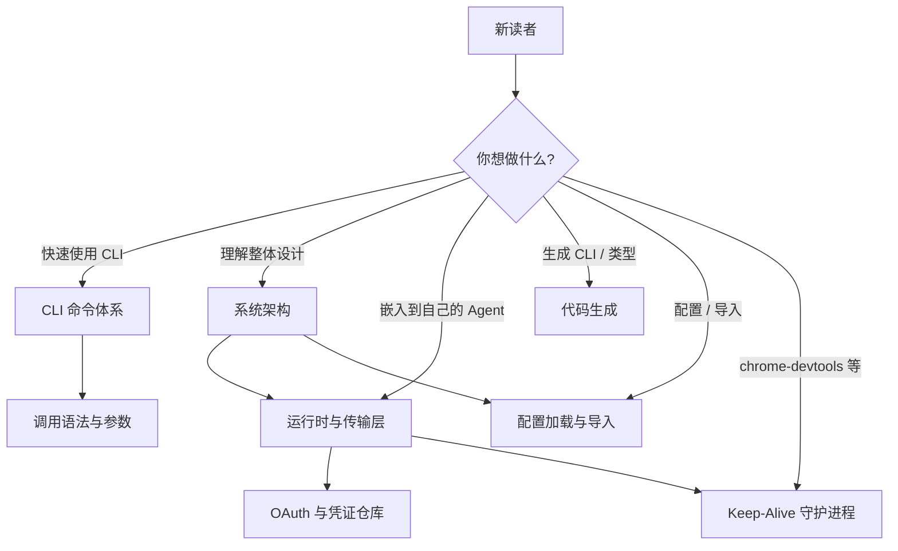
```mermaid
graph TD
  Start["新读者"] --> Q{"你想做什么?"}
  Q -->|"快速使用 CLI"| Cli["CLI 命令体系"]
  Q -->|"理解整体设计"| Arch["系统架构"]
  Q -->|"嵌入到自己的 Agent"| Run["运行时与传输层"]
  Q -->|"生成 CLI / 类型"| Gen["代码生成"]
  Q -->|"配置 / 导入"| Cfg["配置加载与导入"]
  Q -->|"chrome-devtools 等"| Dae["Keep-Alive 守护进程"]
  Cli --> Syntax["调用语法与参数"]
  Arch --> Run
  Arch --> Cfg
  Run --> OAuth["OAuth 与凭证仓库"]
  Run --> Dae
```

Sources: [README.md:36-205](../../../project-repos/mcporter/README.md#L36-L205), [src/cli.ts:60-170](../../../project-repos/mcporter/src/cli.ts#L60-L170)

<details class="source-snippets">
<summary>引用源码</summary>

<!-- source-snippets:start -->

#### `README.md:36-205`

````markdown

MCPorter auto-discovers the MCP servers you already configured in Cursor, Claude Code/Desktop, Codex, or local overrides. You can try it immediately with `npx`--no installation required. Need a full command reference (flags, modes, return types)? Check out [docs/cli-reference.md](docs/cli-reference.md).

### Call syntax options

```bash
# Colon-delimited flags (shell-friendly)
npx mcporter call linear.create_comment issueId:ENG-123 body:'Looks good!'

# Function-call style (matches signatures from `mcporter list`)
npx mcporter call 'linear.create_comment(issueId: "ENG-123", body: "Looks good!")'

# Literal positional values that start with `--`
npx mcporter call server.tool -- --raw-value
```

### List your MCP servers

```bash
npx mcporter list
npx mcporter list context7 --schema
npx mcporter list https://mcp.linear.app/mcp --all-parameters
npx mcporter list shadcn.io/api/mcp.getComponents           # URL + tool suffix auto-resolves
npx mcporter list --stdio "bun run ./local-server.ts" --env TOKEN=xyz
```

- Add `--json` to emit a machine-readable summary with per-server statuses (auth/offline/http/error counts) and, for single-server runs, the full tool schema payload.
- Add `--verbose` to show every config source that registered the server name (primary first), both in text and JSON list output.

You can now point `mcporter list` at ad-hoc servers: provide a URL directly or use the new `--http-url/--stdio` flags (plus `--env`, `--cwd`, `--name`, or `--persist`) to describe any MCP endpoint. Until you persist that definition, you still need to repeat the same URL/stdio flags for `mcporter call`—the printed slug only becomes reusable once you merge it into a config via `--persist` or `mcporter config add` (use `--scope home|project` to pick the write target). Follow up with `mcporter auth https://…` (or the same flag set) to finish OAuth without editing config. Full details live in [docs/adhoc.md](docs/adhoc.md).

Single-server listings now read like a TypeScript header file so you can copy/paste the signature straight into `mcporter call`:

```ts
linear - Hosted Linear MCP; exposes issue search, create, and workflow tooling.
  23 tools · 1654ms · HTTP https://mcp.linear.app/mcp

  /**
   * Create a comment on a specific Linear issue
   * @param issueId The issue ID
   * @param body The content of the comment as Markdown
   * @param parentId? A parent comment ID to reply to
   */
  function create_comment(issueId: string, body: string, parentId?: string);
  // optional (3): notifySubscribers, labelIds, mentionIds

  /**
   * List documents in the user's Linear workspace
   * @param query? An optional search query
   * @param projectId? Filter by project ID
   */
  function list_documents(query?: string, projectId?: string);
  // optional (11): limit, before, after, orderBy, initiativeId, ...
```

Here’s what that looks like for Vercel when you run `npx mcporter list vercel`:

```ts
vercel - Vercel MCP (requires OAuth).

  /**
   * Search the Vercel documentation.
   * Use this tool to answer any questions about Vercel’s platform, features, and best practices,
   * including:
   * - Core Concepts: Projects, Deployments, Git Integration, Preview Deployments, Environments
   * - Frontend & Frameworks: Next.js, SvelteKit, Nuxt, Astro, Remix, frameworks configuration and
   *   optimization
   * - APIs: REST API, Vercel SDK, Build Output API
   * - Compute: Fluid Compute, Functions, Routing Middleware, Cron Jobs, OG Image Generation, Sandbox,
   *   Data Cache
   * - AI: Vercel AI SDK, AI Gateway, MCP, v0
   * - Performance & Delivery: Edge Network, Caching, CDN, Image Optimization, Headers, Redirects,
   *   Rewrites
   * - Pricing: Plans, Spend Management, Billing
   * - Security: Audit Logs, Firewall, Bot Management, BotID, OIDC, RBAC, Secure Compute, 2FA
   * - Storage: Blog, Edge Config
   *
   * @param topic Topic to focus the documentation search on (e.g., 'routing', 'data-fetching').
   * @param tokens? Maximum number of tokens to include in the result. Default is 2500.
   */
  function search_vercel_documentation(topic: string, tokens?: number);

  /**
   * Deploy the current project to Vercel
   */
  function deploy_to_vercel();
```

Required parameters always show; optional parameters stay hidden unless (a) there are only one or two of them alongside fewer than four required fields or (b) you pass `--all-parameters`. Whenever MCPorter hides parameters it prints `Optional parameters hidden; run with --all-parameters to view all fields.` so you know how to reveal the full signature. Return types are inferred from the tool schema’s `title`, falling back to omitting the suffix entirely instead of guessing.

### Context7: fetch docs (no auth required)

```bash
npx mcporter call context7.resolve-library-id libraryName=react
npx mcporter call context7.get-library-docs context7CompatibleLibraryID=/websites/react_dev topic=hooks
```

### Linear: search documentation (requires `LINEAR_API_KEY`)

```bash
LINEAR_API_KEY=sk_linear_example npx mcporter call linear.search_documentation query="automations"
```

### Chrome DevTools: snapshot the current tab

```bash
npx mcporter call chrome-devtools.take_snapshot
npx mcporter call 'linear.create_comment(issueId: "LNR-123", body: "Hello world")'
npx mcporter call https://mcp.linear.app/mcp.list_issues assignee=me
npx mcporter call shadcn.io/api/mcp.getComponent component=vortex   # protocol optional; defaults to https
npx mcporter call linear.listIssues --tool listIssues   # auto-corrects to list_issues
npx mcporter linear.list_issues                         # shorthand: infers `call`
VERCEL_ACCESS_TOKEN=sk_vercel_example npx mcporter call "npx -y vercel-domains-mcp" domain=answeroverflow.com  # quoted stdio cmd + single-tool inference
```

> Tool calls understand a JavaScript-like call syntax, auto-correct near-miss tool names, and emit richer inline usage hints. See [docs/call-syntax.md](docs/call-syntax.md) for the grammar and [docs/call-heuristic.md](docs/call-heuristic.md) for the auto-correction rules.

Helpful flags:

- `--config <path>` -- custom config file (defaults to `./config/mcporter.json`).
... snippet truncated ...
````

#### `src/cli.ts:60-170`

```typescript
    return;
  }

  // Early-exit command handlers that don't require runtime inference.
  if (command === 'generate-cli') {
    await handleGenerateCli(args, globalFlags);
    return;
  }
  if (command === 'inspect-cli') {
    await handleInspectCli(args);
    return;
  }
  const rootOverride = globalFlags['--root'];
  const configPath = runtimeOptions.configPath ?? globalFlags['--config'];
  const configResolution = resolveConfigPath(globalFlags['--config'], rootOverride ?? process.cwd());
  const configPathResolved = configPath ?? configResolution.path;
  // Only pass configPath to runtime options if it was explicitly provided (via --config flag or env var).
  // If not explicit, let loadConfigLayers handle the default resolution to avoid ENOENT on missing config.
  const runtimeOptionsWithPath = {
    ...runtimeOptions,
    configPath: configResolution.explicit ? configPathResolved : runtimeOptions.configPath,
  };

  if (command === 'daemon') {
    await handleDaemonCli(args, {
      configPath: configPathResolved,
      configExplicit: configResolution.explicit,
      rootDir: rootOverride,
    });
    return;
  }

  if (command === 'config') {
    await handleConfigCli(
      {
        loadOptions: { configPath, rootDir: rootOverride },
        invokeAuth: (authArgs) => invokeAuthCommand(runtimeOptionsWithPath, authArgs),
      },
      args
    );
    return;
  }

  if (command === 'emit-ts') {
    const runtime = await createRuntime(runtimeOptionsWithPath);
    try {
      await handleEmitTs(runtime, args);
    } finally {
      await runtime.close().catch(() => {});
    }
    return;
  }

  const baseRuntime = await createRuntime(runtimeOptionsWithPath);
  const keepAliveServers = new Set(
    baseRuntime
      .getDefinitions()
      .filter(isKeepAliveServer)
      .map((entry) => entry.name)
  );
  const daemonClient =
    keepAliveServers.size > 0
      ? new DaemonClient({
          configPath: configResolution.path,
          configExplicit: configResolution.explicit,
          rootDir: rootOverride,
        })
      : null;
  const runtime = createKeepAliveRuntime(baseRuntime, { daemonClient, keepAliveServers });

  const inference = inferCommandRouting(command, args, runtime.getDefinitions());
  if (inference.kind === 'abort') {
    process.exitCode = inference.exitCode;
    return;
  }
  const resolvedCommand = inference.command;
  const resolvedArgs = inference.args;

  try {
    if (resolvedCommand === 'list') {
      if (consumeHelpTokens(resolvedArgs)) {
        printListHelp();
        process.exitCode = 0;
        return;
      }
      await handleList(runtime, resolvedArgs);
      return;
    }

    if (resolvedCommand === 'call') {
      if (consumeHelpTokens(resolvedArgs)) {
        printCallHelp();
        process.exitCode = 0;
        return;
      }
      await runHandleCall(runtime, resolvedArgs);
      return;
    }

    if (resolvedCommand === 'auth') {
      if (consumeHelpTokens(resolvedArgs)) {
        printAuthHelp();
        process.exitCode = 0;
        return;
      }
      await handleAuth(runtime, resolvedArgs);
      return;
    }
  } finally {
    const closeStart = Date.now();
    if (DEBUG_HANG) {
```

<!-- source-snippets:end -->
</details>
## 0.10.0 与最近迭代

`package.json:3` 声明 `"version": "0.10.0"`，README 的"What's New"块仍记录了 0.9.0 的关键变更（per-server tool filtering、stdio shutdown 加固、Windows OAuth URL、`auth --json` 结构化失败信封、`call` 字符串参数不再被强制数字化等）。日常迭代以 `CHANGELOG.md` 为准，但仓库默认会在 `mcporter list <server>` 输出区分 healthy / auth required / offline / http / 其它错误并按数量汇总（[src/cli/list-command.ts:217-233]()），这是早期版本不具备的能力。
Sources: [package.json:3](../../../project-repos/mcporter/package.json:3), [README.md:27-33](../../../project-repos/mcporter/README.md#L27-L33), [src/cli/list-command.ts:217-234](../../../project-repos/mcporter/src/cli/list-command.ts#L217-L234)

<details class="source-snippets">
<summary>引用源码</summary>

<!-- source-snippets:start -->

#### `package.json:3`

> 未找到引用文件：`package.json:3`

#### `README.md:27-33`

```markdown
## What's New in 0.9.0

- **Per-server tool filtering.** Limit exposed tools with `allowedTools`, or block risky exact-name tools with `blockedTools`; filtered tools disappear from `mcporter list` and are rejected by `mcporter call`.
- **Sturdier stdio shutdown.** Stuck local MCP processes now escalate cleanly instead of hanging after a call finishes.
- **OAuth polish.** Windows OAuth URLs are quoted correctly, OAuth config examples are documented, and `mcporter auth --json` returns structured connection envelopes.
- **Safer call coercion.** Tool arguments declared as strings stay strings, even when the value looks numeric.
- **Release confidence.** `0.9.0` is published on npm and Homebrew, and the live DeepWiki MCP suite is green.
```

#### `src/cli/list-command.ts:217-234`

```typescript
      const errorCounts = createEmptyStatusCounts();
      renderedResults?.forEach((entry) => {
        if (!entry) {
          return;
        }
        const category = entry.category ?? 'error';
        errorCounts[category] = (errorCounts[category] ?? 0) + 1;
      });
      const okSummary = `${errorCounts.ok} healthy`;
      const parts = [
        okSummary,
        ...(errorCounts.auth > 0 ? [`${errorCounts.auth} auth required`] : []),
        ...(errorCounts.offline > 0 ? [`${errorCounts.offline} offline`] : []),
        ...(errorCounts.http > 0 ? [`${errorCounts.http} http errors`] : []),
        ...(errorCounts.error > 0 ? [`${errorCounts.error} errors`] : []),
      ];
      console.log(`✔ Listed ${servers.length} server${servers.length === 1 ? '' : 's'} (${parts.join('; ')}).`);
      return;
```

<!-- source-snippets:end -->
</details>
## 相关页面

- [系统架构](#system-architecture)
- [CLI 命令体系](#cli-commands)
- [配置加载与导入](#configuration)


---


<a id='system-architecture'></a>

<details>
<summary>相关源文件</summary>

生成本页时使用的主要源文件：

- [src/cli.ts](../../../project-repos/mcporter/src/cli.ts)
- [src/runtime.ts](../../../project-repos/mcporter/src/runtime.ts)
- [src/config.ts](../../../project-repos/mcporter/src/config.ts)
- [src/server-proxy.ts](../../../project-repos/mcporter/src/server-proxy.ts)
- [src/daemon/runtime-wrapper.ts](../../../project-repos/mcporter/src/daemon/runtime-wrapper.ts)
- [src/daemon/host.ts](../../../project-repos/mcporter/src/daemon/host.ts)
- [src/index.ts](../../../project-repos/mcporter/src/index.ts)
- [src/runtime/transport.ts](../../../project-repos/mcporter/src/runtime/transport.ts)

</details>

# 系统架构

mcporter 的运行模型可以拆成五个相对独立的子系统：**CLI 入口**、**Runtime 核心**、**Config 加载**、**Daemon 守护进程**、**OAuth 与凭证**。CLI 是这些组件的 orchestrator，库使用者则会绕过 CLI、直接组合 Runtime 与 Config。这一节说明它们的边界、依赖方向以及一次完整调用的请求路径。

## 顶层模块拓扑

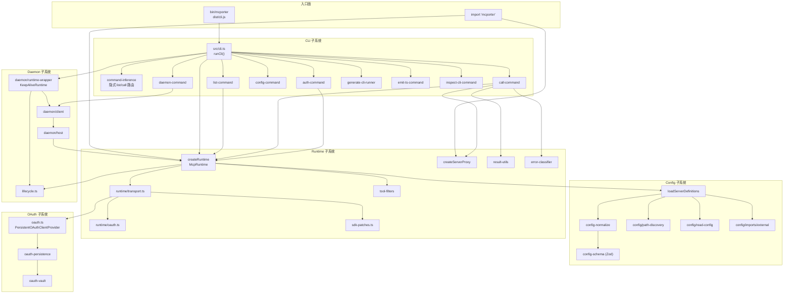
```mermaid
graph TD
  subgraph EntryPoints["入口面"]
    BIN["bin/mcporter<br/>dist/cli.js"]
    LIB["import 'mcporter'"]
  end

  subgraph CLI["CLI 子系统"]
    CLITS["src/cli.ts<br/>runCli()"]
    INFER["command-inference<br/>隐式 list/call 路由"]
    LIST["list-command"]
    CALL["call-command"]
    AUTHCMD["auth-command"]
    CFGCMD["config-command"]
    DAECMD["daemon-command"]
    GEN["generate-cli-runner"]
    EMIT["emit-ts-command"]
    INSP["inspect-cli-command"]
  end

  subgraph Runtime["Runtime 子系统"]
    RUN["createRuntime<br/>McpRuntime"]
    PROXY["createServerProxy"]
    TRANS["runtime/transport.ts"]
    OAUTHFLOW["runtime/oauth.ts"]
    SDKP["sdk-patches.ts"]
    FILT["tool-filters"]
    RES["result-utils"]
    ERR["error-classifier"]
  end

  subgraph Config["Config 子系统"]
    LOAD["loadServerDefinitions"]
    SCHEMA["config-schema (Zod)"]
    NORM["config-normalize"]
    PATH["config/path-discovery"]
    READ["config/read-config"]
    EXT["config/imports/external"]
  end

  subgraph Daemon["Daemon 子系统"]
    HOST["daemon/host"]
    DCLIENT["daemon/client"]
    KAR["daemon/runtime-wrapper<br/>KeepAliveRuntime"]
    LIFE["lifecycle.ts"]
  end

  subgraph OAuth["OAuth 子系统"]
    PROV["oauth.ts<br/>PersistentOAuthClientProvider"]
    PERS["oauth-persistence"]
    VAULT["oauth-vault"]
  end

  BIN --> CLITS
  LIB --> RUN
  LIB --> PROXY

  CLITS --> INFER
  CLITS --> LIST & CALL & AUTHCMD & CFGCMD & DAECMD & GEN & EMIT & INSP
  CLITS --> RUN
  CLITS --> KAR

  LIST & CALL & AUTHCMD --> RUN
  CALL --> PROXY
  RUN --> TRANS
  TRANS --> OAUTHFLOW
  TRANS --> SDKP
  RUN --> FILT
  CALL --> RES
  CALL --> ERR

  RUN --> LOAD
  LOAD --> READ
  LOAD --> PATH
  LOAD --> EXT
  LOAD --> NORM
  NORM --> SCHEMA

  KAR --> DCLIENT
  DAECMD --> DCLIENT
  DCLIENT --> HOST
  HOST --> RUN
  RUN --> LIFE
  KAR --> LIFE

  TRANS --> PROV
  PROV --> PERS
  PERS --> VAULT
```

Sources: [src/cli.ts:1-30](../../../project-repos/mcporter/src/cli.ts#L1-L30), [src/runtime.ts:107-126](../../../project-repos/mcporter/src/runtime.ts#L107-L126), [src/daemon/runtime-wrapper.ts:13-48](../../../project-repos/mcporter/src/daemon/runtime-wrapper.ts#L13-L48), [src/daemon/host.ts:44-95](../../../project-repos/mcporter/src/daemon/host.ts#L44-L95), [src/index.ts:1-9](../../../project-repos/mcporter/src/index.ts#L1-L9)

<details class="source-snippets">
<summary>引用源码</summary>

<!-- source-snippets:start -->

#### `src/cli.ts:1-30`

```typescript
#!/usr/bin/env node
import { handleAuth, printAuthHelp } from './cli/auth-command.js';
import { printCallHelp, handleCall as runHandleCall } from './cli/call-command.js';
import { buildGlobalContext } from './cli/cli-factory.js';
import { inferCommandRouting } from './cli/command-inference.js';
import { handleConfigCli } from './cli/config-command.js';
import { handleDaemonCli } from './cli/daemon-command.js';
import { handleEmitTs } from './cli/emit-ts-command.js';
import { CliUsageError } from './cli/errors.js';
import { handleGenerateCli } from './cli/generate-cli-runner.js';
import { consumeHelpTokens, isHelpToken, isVersionToken, printHelp, printVersion } from './cli/help-output.js';
import { handleInspectCli } from './cli/inspect-cli-command.js';
import { handleList, printListHelp } from './cli/list-command.js';
import { logError, logInfo } from './cli/logger-context.js';
import { DEBUG_HANG, dumpActiveHandles, terminateChildProcesses } from './cli/runtime-debug.js';
import { resolveConfigPath } from './config.js';
import { DaemonClient } from './daemon/client.js';
import { createKeepAliveRuntime } from './daemon/runtime-wrapper.js';
import { isKeepAliveServer } from './lifecycle.js';
import { createRuntime } from './runtime.js';

export { handleAuth, printAuthHelp } from './cli/auth-command.js';
export { parseCallArguments } from './cli/call-arguments.js';
export { handleCall } from './cli/call-command.js';
export { handleGenerateCli } from './cli/generate-cli-runner.js';
export { handleInspectCli } from './cli/inspect-cli-command.js';
export { extractListFlags, handleList } from './cli/list-command.js';
export { resolveCallTimeout } from './cli/timeouts.js';

export async function runCli(argv: string[]): Promise<void> {
```

#### `src/runtime.ts:107-126`

```typescript
class McpRuntime implements Runtime {
  private readonly definitions: Map<string, ServerDefinition>;
  private readonly clients = new Map<string, Promise<ClientContext>>();
  private readonly logger: RuntimeLogger;
  private readonly clientInfo: { name: string; version: string };
  private readonly oauthTimeoutMs?: number;

  constructor(servers: ServerDefinition[], options: RuntimeOptions = {}) {
    for (const server of servers) {
      validateToolFilters(server.name, server);
    }
    this.definitions = new Map(servers.map((entry) => [entry.name, entry]));
    this.logger = options.logger ?? createConsoleLogger();
    this.clientInfo = options.clientInfo ?? {
      name: PACKAGE_NAME,
      version: CLIENT_VERSION,
    };
    this.oauthTimeoutMs = options.oauthTimeoutMs;
  }

```

#### `src/daemon/runtime-wrapper.ts:13-48`

```typescript
export function createKeepAliveRuntime(base: Runtime, options: KeepAliveRuntimeOptions): Runtime {
  if (!options.daemonClient || options.keepAliveServers.size === 0) {
    return base;
  }
  return new KeepAliveRuntime(base, options.daemonClient, options.keepAliveServers);
}

class KeepAliveRuntime implements Runtime {
  private readonly restartPromises = new Map<string, Promise<void>>();

  constructor(
    private readonly base: Runtime,
    private readonly daemon: DaemonClient,
    private readonly keepAliveServers: Set<string>
  ) {}

  listServers(): string[] {
    return this.base.listServers();
  }

  getDefinitions(): ServerDefinition[] {
    return this.base.getDefinitions();
  }

  getDefinition(server: string): ServerDefinition {
    return this.base.getDefinition(server);
  }

  registerDefinition(definition: ServerDefinition, options?: { overwrite?: boolean }): void {
    this.base.registerDefinition(definition, options);
    if (isKeepAliveServer(definition)) {
      this.keepAliveServers.add(definition.name);
    } else {
      this.keepAliveServers.delete(definition.name);
    }
  }
```

#### `src/daemon/host.ts:44-95`

```typescript
export async function runDaemonHost(options: DaemonHostOptions): Promise<void> {
  const configLayers = await collectConfigLayers({
    configPath: options.configExplicit ? options.configPath : undefined,
    rootDir: options.rootDir,
  });
  const runtime = await createRuntime({
    configPath: options.configExplicit ? options.configPath : undefined,
    rootDir: options.rootDir,
  });
  const keepAliveDefinitions = runtime.getDefinitions().filter(isKeepAliveServer);
  if (keepAliveDefinitions.length === 0) {
    throw new Error('No MCP servers require keep-alive; daemon will not start.');
  }
  const managedServers = new Map<string, ServerDefinition>();
  for (const definition of keepAliveDefinitions) {
    managedServers.set(definition.name, definition);
  }
  const serverLoggingOverrides = new Set<string>();
  for (const definition of keepAliveDefinitions) {
    if (definition.logging?.daemon?.enabled) {
      serverLoggingOverrides.add(definition.name);
    }
  }
  const combinedServerLogs = new Set<string>([
    ...serverLoggingOverrides,
    ...(options.logServers ? Array.from(options.logServers) : []),
  ]);
  const logContext = createLogContext({
    enabled: Boolean(options.logPath),
    logAllServers: options.logAllServers ?? false,
    servers: combinedServerLogs,
    logPath: options.logPath,
  });

  await prepareSocket(options.socketPath);
  await fs.mkdir(path.dirname(options.metadataPath), { recursive: true });
  const configMtimeMs = await statConfigMtime(options.configPath);

  const activity = new Map<string, ServerActivity>();
  for (const definition of keepAliveDefinitions) {
    activity.set(definition.name, { connected: false });
  }

  const idleWatcher = setInterval(() => {
    void evictIdleServers(runtime, managedServers, activity);
  }, 30_000);
  idleWatcher.unref();

  logEvent(logContext, 'Daemon host started.');

  const startedAt = Date.now();
  const server = net.createServer({ allowHalfOpen: true }, (socket) => {
```

#### `src/index.ts:1-9`

```typescript
export type { CommandSpec, ServerDefinition } from './config.js';
export { loadServerDefinitions } from './config.js';
export type { CallResult, ConnectionIssue, ImageContent } from './result-utils.js';
export { createCallResult, describeConnectionIssue, wrapCallResult } from './result-utils.js';
export type { CallOptions, ListToolsOptions, Runtime, RuntimeLogger, ServerToolInfo } from './runtime.js';
export { callOnce, createRuntime } from './runtime.js';
export type { ServerProxyOptions } from './server-proxy.js';
export { createServerProxy } from './server-proxy.js';
```

<!-- source-snippets:end -->
</details>
## 子系统边界与依赖方向

mcporter 的设计目标是让"库使用者"只看到 Runtime 与 Config 这两个子系统，CLI 与 Daemon 完全可选。下表把每个子系统的输入、输出和外部依赖列清楚：

| 子系统 | 入口 | 主要输出 | 关键外部依赖 |
|--------|------|----------|--------------|
| Config | `loadServerDefinitions(opts)` | `ServerDefinition[]` | 文件系统、JSONC（`jsonc-parser`）、TOML（`@iarna/toml`）、Zod |
| Runtime | `createRuntime(opts)` / `callOnce(...)` | `Runtime` 实例与原始 MCP 响应 | `@modelcontextprotocol/sdk` Client + 三种 Transport |
| ServerProxy | `createServerProxy(runtime, name)` | camelCase Proxy + schema 默认值 + `CallResult` | `Runtime` |
| CLI | `runCli(argv)` | 进程退出码 + stdout / stderr | `commander`、`ora`、`acorn`（call-expression-parser） |
| Daemon | `mcporter daemon`、自动启动 | Unix domain socket + JSON-RPC 协议 | `net`、`child_process`、底层 `Runtime` |
| OAuth | `createOAuthSession(definition, logger)` | `OAuthSession` + 回调 HTTP 服务器 | `node:http`、SDK `OAuthClientProvider` |

CLI 依赖 Runtime、Config、Daemon、OAuth；Runtime 依赖 Config、OAuth、SDK Patches；Daemon 内部又组合 Runtime（不组合 CLI）。这一关系在 `src/cli.ts:113-128` 表现得最直接：CLI 先 `createRuntime`，再用 `KeepAliveRuntime` 包一层 daemon 路由。

```ts
const baseRuntime = await createRuntime(runtimeOptionsWithPath);
const keepAliveServers = new Set(
  baseRuntime.getDefinitions().filter(isKeepAliveServer).map((entry) => entry.name)
);
const daemonClient = keepAliveServers.size > 0 ? new DaemonClient({...}) : null;
const runtime = createKeepAliveRuntime(baseRuntime, { daemonClient, keepAliveServers });
```

Sources: [src/cli.ts:113-128](../../../project-repos/mcporter/src/cli.ts#L113-L128), [src/index.ts:1-9](../../../project-repos/mcporter/src/index.ts#L1-L9), [src/runtime.ts:57-67](../../../project-repos/mcporter/src/runtime.ts#L57-L67)

<details class="source-snippets">
<summary>引用源码</summary>

<!-- source-snippets:start -->

#### `src/cli.ts:113-128`

```typescript
  const baseRuntime = await createRuntime(runtimeOptionsWithPath);
  const keepAliveServers = new Set(
    baseRuntime
      .getDefinitions()
      .filter(isKeepAliveServer)
      .map((entry) => entry.name)
  );
  const daemonClient =
    keepAliveServers.size > 0
      ? new DaemonClient({
          configPath: configResolution.path,
          configExplicit: configResolution.explicit,
          rootDir: rootOverride,
        })
      : null;
  const runtime = createKeepAliveRuntime(baseRuntime, { daemonClient, keepAliveServers });
```

#### `src/index.ts:1-9`

```typescript
export type { CommandSpec, ServerDefinition } from './config.js';
export { loadServerDefinitions } from './config.js';
export type { CallResult, ConnectionIssue, ImageContent } from './result-utils.js';
export { createCallResult, describeConnectionIssue, wrapCallResult } from './result-utils.js';
export type { CallOptions, ListToolsOptions, Runtime, RuntimeLogger, ServerToolInfo } from './runtime.js';
export { callOnce, createRuntime } from './runtime.js';
export type { ServerProxyOptions } from './server-proxy.js';
export { createServerProxy } from './server-proxy.js';
```

#### `src/runtime.ts:57-67`

```typescript
export interface Runtime {
  listServers(): string[];
  getDefinitions(): ServerDefinition[];
  getDefinition(server: string): ServerDefinition;
  registerDefinition(definition: ServerDefinition, options?: { overwrite?: boolean }): void;
  listTools(server: string, options?: ListToolsOptions): Promise<ServerToolInfo[]>;
  callTool(server: string, toolName: string, options?: CallOptions): Promise<unknown>;
  listResources(server: string, options?: Partial<ListResourcesRequest['params']>): Promise<unknown>;
  connect(server: string): Promise<ClientContext>;
  close(server?: string): Promise<void>;
}
```

<!-- source-snippets:end -->
</details>
## 一次 `mcporter call` 的请求路径

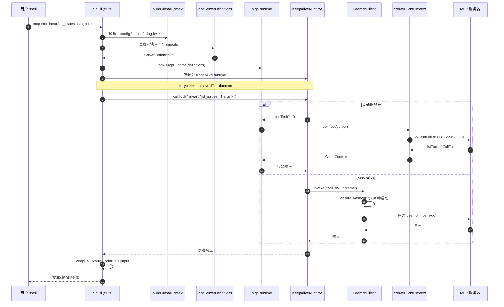
```mermaid
sequenceDiagram
  autonumber
  participant U as 用户 shell
  participant CLI as runCli (cli.ts)
  participant CTX as buildGlobalContext
  participant CFG as loadServerDefinitions
  participant RT as McpRuntime
  participant KA as KeepAliveRuntime
  participant DC as DaemonClient
  participant TR as createClientContext
  participant SRV as MCP 服务器

  U->>CLI: mcporter linear.list_issues assignee=me
  CLI->>CTX: 解析 --config / --root / --log-level
  CLI->>CFG: 读取本地 + 7 个 imports
  CFG-->>CLI: ServerDefinition[""]
  CLI->>RT: new McpRuntime(definitions)
  CLI->>KA: 包装为 KeepAliveRuntime
  Note over CLI,KA: lifecycle=keep-alive 时走 daemon
  CLI->>KA: callTool("'linear', 'list_issues', ❴args❵")
  alt 普通服务器
    KA->>RT: callTool("...")
    RT->>TR: connect(server)
    TR->>SRV: StreamableHTTP / SSE / stdio
    SRV-->>TR: ListTools / CallTool
    TR-->>RT: ClientContext
    RT-->>KA: 原始响应
  else keep-alive
    KA->>DC: invoke("'callTool', params")
    DC->>DC: ensureDaemon("") / 自动启动
    DC->>SRV: 通过 daemon host 转发
    SRV-->>DC: 响应
    DC-->>KA: 响应
  end
  KA-->>CLI: 原始响应
  CLI->>CLI: wrapCallResult + printCallOutput
  CLI-->>U: 文本/JSON/图像
```

Sources: [src/cli.ts:113-167](../../../project-repos/mcporter/src/cli.ts#L113-L167), [src/cli/call-command.ts:393-451](../../../project-repos/mcporter/src/cli/call-command.ts#L393-L451), [src/runtime.ts:196-228](../../../project-repos/mcporter/src/runtime.ts#L196-L228), [src/daemon/runtime-wrapper.ts:63-75](../../../project-repos/mcporter/src/daemon/runtime-wrapper.ts#L63-L75)

<details class="source-snippets">
<summary>引用源码</summary>

<!-- source-snippets:start -->

#### `src/cli.ts:113-167`

```typescript
  const baseRuntime = await createRuntime(runtimeOptionsWithPath);
  const keepAliveServers = new Set(
    baseRuntime
      .getDefinitions()
      .filter(isKeepAliveServer)
      .map((entry) => entry.name)
  );
  const daemonClient =
    keepAliveServers.size > 0
      ? new DaemonClient({
          configPath: configResolution.path,
          configExplicit: configResolution.explicit,
          rootDir: rootOverride,
        })
      : null;
  const runtime = createKeepAliveRuntime(baseRuntime, { daemonClient, keepAliveServers });

  const inference = inferCommandRouting(command, args, runtime.getDefinitions());
  if (inference.kind === 'abort') {
    process.exitCode = inference.exitCode;
    return;
  }
  const resolvedCommand = inference.command;
  const resolvedArgs = inference.args;

  try {
    if (resolvedCommand === 'list') {
      if (consumeHelpTokens(resolvedArgs)) {
        printListHelp();
        process.exitCode = 0;
        return;
      }
      await handleList(runtime, resolvedArgs);
      return;
    }

    if (resolvedCommand === 'call') {
      if (consumeHelpTokens(resolvedArgs)) {
        printCallHelp();
        process.exitCode = 0;
        return;
      }
      await runHandleCall(runtime, resolvedArgs);
      return;
    }

    if (resolvedCommand === 'auth') {
      if (consumeHelpTokens(resolvedArgs)) {
        printAuthHelp();
        process.exitCode = 0;
        return;
      }
      await handleAuth(runtime, resolvedArgs);
      return;
    }
```

#### `src/cli/call-command.ts:393-451`

```typescript
async function invokeWithAutoCorrection(
  runtime: Awaited<ReturnType<(typeof import('../runtime.js'))['createRuntime']>>,
  server: string,
  tool: string,
  args: Record<string, unknown>,
  timeoutMs: number
): Promise<{ result: unknown; resolvedTool: string }> {
  // Attempt the original request first; if it fails with a "tool not found" we opportunistically retry once with a better match.
  return attemptCall(runtime, server, tool, args, timeoutMs, true);
}

async function attemptCall(
  runtime: Awaited<ReturnType<(typeof import('../runtime.js'))['createRuntime']>>,
  server: string,
  tool: string,
  args: Record<string, unknown>,
  timeoutMs: number,
  allowCorrection: boolean
): Promise<{ result: unknown; resolvedTool: string }> {
  try {
    const result = await withTimeout(runtime.callTool(server, tool, { args, timeoutMs }), timeoutMs);
    return { result, resolvedTool: tool };
  } catch (error) {
    if (error instanceof Error && error.message === 'Timeout') {
      const timeoutDisplay = `${timeoutMs}ms`;
      await runtime.close(server).catch(() => {});
      throw new Error(
        `Call to ${server}.${tool} timed out after ${timeoutDisplay}. Override MCPORTER_CALL_TIMEOUT or pass --timeout to adjust.`,
        { cause: error }
      );
    }

    if (!allowCorrection) {
      throw error;
    }

    const resolution = await maybeResolveToolName(runtime, server, tool, error);
    if (!resolution) {
      maybeReportConnectionIssue(server, tool, error);
      throw error;
    }

    const messages = renderIdentifierResolutionMessages({
      entity: 'tool',
      attempted: tool,
      resolution,
      scope: server,
    });
    if (resolution.kind === 'suggest') {
      if (messages.suggest) {
        console.error(dimText(messages.suggest));
      }
      throw error;
    }
    if (messages.auto) {
      console.log(dimText(messages.auto));
    }
    return attemptCall(runtime, server, resolution.value, args, timeoutMs, false);
  }
```

#### `src/runtime.ts:196-228`

```typescript
  async callTool(server: string, toolName: string, options: CallOptions = {}): Promise<unknown> {
    const definition = this.definitions.get(server.trim());
    if (definition && !isToolAllowed(toolName, definition)) {
      throw new Error(
        `Tool '${toolName}' is not accessible on server '${definition.name}' (blocked by configuration).`
      );
    }
    try {
      const { client } = await this.connect(server);
      const params: CallToolRequest['params'] = {
        name: toolName,
        arguments: options.args ?? {},
      };
      // Forward the requested timeout to the MCP client so server-side requests don't hit the SDK's
      // default 60s cap. Keep our own outer race as a second guard.
      const timeoutMs = normalizeTimeout(options.timeoutMs);
      const resultPromise = client.callTool(params, undefined, {
        timeout: timeoutMs,
        // Long runs (e.g., GPT-5 Pro) emit progress/logging; allow that to refresh the timer.
        resetTimeoutOnProgress: true,
        maxTotalTimeout: timeoutMs,
      });
      if (!timeoutMs) {
        return await resultPromise;
      }
      return await raceWithTimeout(resultPromise, timeoutMs);
    } catch (error) {
      // Runtime timeouts and transport crashes should tear down the cached connection so
      // the daemon (or direct runtime) can relaunch the MCP server on the next attempt.
      await this.resetConnectionOnError(server, error);
      throw error;
    }
  }
```

#### `src/daemon/runtime-wrapper.ts:63-75`

```typescript
  async callTool(server: string, toolName: string, options?: CallOptions): Promise<unknown> {
    if (this.shouldUseDaemon(server)) {
      return this.invokeWithRestart(server, 'callTool', () =>
        this.daemon.callTool({
          server,
          tool: toolName,
          args: options?.args,
          timeoutMs: options?.timeoutMs,
        })
      );
    }
    return this.base.callTool(server, toolName, options);
  }
```

<!-- source-snippets:end -->
</details>
## 关键抽象的责任划分

### `ServerDefinition` 是合约边界

所有子系统对外都以 `ServerDefinition` 作为统一句柄。它在 [src/config-schema.ts:170-191]() 定义，把 HTTP / stdio 两种传输和 OAuth、生命周期、`allowedTools/blockedTools`、日志开关合并到同一个对象里。Runtime 不关心定义来自本地、来自 Cursor、还是临时的 `--http-url`，全部统一处理。

### `Runtime` 接口是最小公约数

`src/runtime.ts:57-67` 定义的 `Runtime` 接口只有 8 个方法：`listServers / getDefinitions / getDefinition / registerDefinition / listTools / callTool / listResources / connect / close`。两个具体实现共享同一接口：

- `McpRuntime`（基础实现）：内部用 `Map<string, Promise<ClientContext>>` 做连接池缓存（[src/runtime.ts:243-279]()）。
- `KeepAliveRuntime`（daemon 包装）：当 server 在 `keepAliveServers` 集合里时把 `listTools / callTool / listResources / close` 转发给 `DaemonClient`，否则透传基础实现（[src/daemon/runtime-wrapper.ts:50-100]()）。

这层薄抽象是 daemon 引入后保持原 API 兼容的关键——库使用者依然得到 `Runtime`，daemon 仅在 CLI 路径上自动激活。

Sources: [src/runtime.ts:57-126](../../../project-repos/mcporter/src/runtime.ts#L57-L126), [src/daemon/runtime-wrapper.ts:13-48](../../../project-repos/mcporter/src/daemon/runtime-wrapper.ts#L13-L48), [src/config-schema.ts:170-191](../../../project-repos/mcporter/src/config-schema.ts#L170-L191)

<details class="source-snippets">
<summary>引用源码</summary>

<!-- source-snippets:start -->

#### `src/runtime.ts:57-126`

```typescript
export interface Runtime {
  listServers(): string[];
  getDefinitions(): ServerDefinition[];
  getDefinition(server: string): ServerDefinition;
  registerDefinition(definition: ServerDefinition, options?: { overwrite?: boolean }): void;
  listTools(server: string, options?: ListToolsOptions): Promise<ServerToolInfo[]>;
  callTool(server: string, toolName: string, options?: CallOptions): Promise<unknown>;
  listResources(server: string, options?: Partial<ListResourcesRequest['params']>): Promise<unknown>;
  connect(server: string): Promise<ClientContext>;
  close(server?: string): Promise<void>;
}

export interface ServerToolInfo {
  readonly name: string;
  readonly description?: string;
  readonly inputSchema?: unknown;
  readonly outputSchema?: unknown;
}

// createRuntime spins up a pooled MCP runtime from config JSON or provided definitions.
export async function createRuntime(options: RuntimeOptions = {}): Promise<Runtime> {
  // Build the runtime with either the provided server list or the config file contents.
  const servers =
    options.servers ??
    (await loadServerDefinitions({
      configPath: options.configPath,
      rootDir: options.rootDir,
    }));

  const runtime = new McpRuntime(servers, options);
  return runtime;
}

// callOnce connects to a server, invokes a single tool, and disposes the connection immediately.
export async function callOnce(params: {
  server: string;
  toolName: string;
  args?: Record<string, unknown>;
  configPath?: string;
}): Promise<unknown> {
  const runtime = await createRuntime({ configPath: params.configPath });
  try {
    return await runtime.callTool(params.server, params.toolName, {
      args: params.args,
    });
  } finally {
    await runtime.close(params.server);
  }
}

class McpRuntime implements Runtime {
  private readonly definitions: Map<string, ServerDefinition>;
  private readonly clients = new Map<string, Promise<ClientContext>>();
  private readonly logger: RuntimeLogger;
  private readonly clientInfo: { name: string; version: string };
  private readonly oauthTimeoutMs?: number;

  constructor(servers: ServerDefinition[], options: RuntimeOptions = {}) {
    for (const server of servers) {
      validateToolFilters(server.name, server);
    }
    this.definitions = new Map(servers.map((entry) => [entry.name, entry]));
    this.logger = options.logger ?? createConsoleLogger();
    this.clientInfo = options.clientInfo ?? {
      name: PACKAGE_NAME,
      version: CLIENT_VERSION,
    };
    this.oauthTimeoutMs = options.oauthTimeoutMs;
  }

```

#### `src/daemon/runtime-wrapper.ts:13-48`

```typescript
export function createKeepAliveRuntime(base: Runtime, options: KeepAliveRuntimeOptions): Runtime {
  if (!options.daemonClient || options.keepAliveServers.size === 0) {
    return base;
  }
  return new KeepAliveRuntime(base, options.daemonClient, options.keepAliveServers);
}

class KeepAliveRuntime implements Runtime {
  private readonly restartPromises = new Map<string, Promise<void>>();

  constructor(
    private readonly base: Runtime,
    private readonly daemon: DaemonClient,
    private readonly keepAliveServers: Set<string>
  ) {}

  listServers(): string[] {
    return this.base.listServers();
  }

  getDefinitions(): ServerDefinition[] {
    return this.base.getDefinitions();
  }

  getDefinition(server: string): ServerDefinition {
    return this.base.getDefinition(server);
  }

  registerDefinition(definition: ServerDefinition, options?: { overwrite?: boolean }): void {
    this.base.registerDefinition(definition, options);
    if (isKeepAliveServer(definition)) {
      this.keepAliveServers.add(definition.name);
    } else {
      this.keepAliveServers.delete(definition.name);
    }
  }
```

#### `src/config-schema.ts:170-191`

```typescript
export interface ServerDefinition {
  readonly name: string;
  readonly description?: string;
  readonly command: CommandSpec;
  readonly env?: Record<string, string>;
  readonly auth?: string;
  readonly tokenCacheDir?: string;
  readonly clientName?: string;
  readonly oauthRedirectUrl?: string;
  readonly oauthScope?: string;
  readonly oauthCommand?: {
    readonly args: string[];
  };
  readonly source?: ServerSource;
  readonly sources?: readonly ServerSource[];
  readonly lifecycle?: ServerLifecycle;
  readonly logging?: ServerLoggingOptions;
  /** When specified, only these exact tool names are exposed. Empty array blocks all tools. */
  readonly allowedTools?: readonly string[];
  /** When specified, these exact tool names are hidden and blocked. Cannot be combined with allowedTools. */
  readonly blockedTools?: readonly string[];
}
```

<!-- source-snippets:end -->
</details>
### `ServerProxy` 把 MCP "对象化"

`createServerProxy(runtime, name)` 返回一个 ES Proxy，把 `proxy.takeSnapshot()` 这样的 camelCase 调用映射到 kebab-case 工具名（`take-snapshot`）。它在 [src/server-proxy.ts:283-407]() 实现，并对 schema 做了三件事：

1. 调 `runtime.listTools(server, { includeSchema: true })` 拉取 schema 并按 `tool.name` 缓存（含磁盘持久化 `~/.mcporter/<server>/schema.json`）。
2. 把位置参数按 `required` + `properties` 顺序映射成对象。
3. 应用 schema `default` 值，并在缺失必填字段时直接抛错（`Missing required arguments: ...`）。

`ServerProxy` 调用最终回到 `runtime.callTool`，结果用 `createCallResult` 包装，调用者可以选择 `.text()` / `.json()` / `.markdown()` / `.images()` / `.content()`。

Sources: [src/server-proxy.ts:108-122](../../../project-repos/mcporter/src/server-proxy.ts#L108-L122), [src/server-proxy.ts:283-407](../../../project-repos/mcporter/src/server-proxy.ts#L283-L407), [src/result-utils.ts:227-310](../../../project-repos/mcporter/src/result-utils.ts#L227-L310)

<details class="source-snippets">
<summary>引用源码</summary>

<!-- source-snippets:start -->

#### `src/server-proxy.ts:108-122`

```typescript
// validateRequired ensures all schema-required fields are present before invocation.
function validateRequired(meta: ToolSchemaInfo, args?: ToolArguments): void {
  if (meta.requiredKeys.length === 0) {
    return;
  }
  if (!isPlainObject(args)) {
    throw new Error(`Missing required arguments: ${meta.requiredKeys.join(', ')}`);
  }
  const missing = meta.requiredKeys.filter((key) => (args as Record<string, unknown>)[key] === undefined);
  if (missing.length > 0) {
    throw new Error(`Missing required arguments: ${missing.join(', ')}`);
  }
}

// createServerProxy returns a proxy that maps property access to MCP tool invocations.
```

#### `src/server-proxy.ts:283-407`

```typescript
  const base: ServerProxy = {
    call: async (toolName: string, callOptions?: ToolCallOptions) => {
      const result = await runtime.callTool(serverName, toolName, callOptions ?? {});
      return createCallResult(result);
    },
    listTools: (listOptions) => runtime.listTools(serverName, listOptions),
  };

  return new Proxy(base as ServerProxy & Record<string | symbol, unknown>, {
    get(target, property, receiver) {
      if (Reflect.has(target, property)) {
        return Reflect.get(target, property, receiver);
      }
      const propertyKey = property;
      const canonicalKey = typeof propertyKey === 'string' ? canonicalizeToolName(propertyKey) : null;
      let resolvedToolName =
        typeof propertyKey === 'string' && canonicalKey
          ? (toolAliasMap.get(canonicalKey) ?? mapPropertyToTool(propertyKey))
          : mapPropertyToTool(propertyKey);

      return async (...callArgs: unknown[]) => {
        let schemaInfo: ToolSchemaInfo | undefined;
        try {
          schemaInfo = await ensureMetadata(resolvedToolName);
        } catch {
          schemaInfo = undefined;
        }
        if (typeof propertyKey === 'string' && canonicalKey) {
          const alias = toolAliasMap.get(canonicalKey);
          if (alias && alias !== resolvedToolName) {
            resolvedToolName = alias;
            try {
              schemaInfo = await ensureMetadata(resolvedToolName);
            } catch {
              // ignore and keep prior schema if available
            }
          }
        }

        const positional: unknown[] = [];
        const argsAccumulator: Record<string, unknown> = {};
        const optionsAccumulator: ToolCallOptions = {};

        for (const arg of callArgs) {
          if (isPlainObject(arg)) {
            const keys = Object.keys(arg);
            const treatAsArgs =
              schemaInfo !== undefined &&
              keys.length > 0 &&
              (keys.every((key) => schemaInfo.propertySet.has(key)) ||
                keys.every((key) => !KNOWN_OPTION_KEYS.has(key)));

            if (treatAsArgs) {
              Object.assign(argsAccumulator, arg as Record<string, unknown>);
            } else {
              Object.assign(optionsAccumulator, arg as ToolCallOptions);
            }
          } else {
            positional.push(arg);
          }
        }

        const explicitArgs = optionsAccumulator.args as ToolArguments | undefined;
        if (explicitArgs !== undefined) {
          delete (optionsAccumulator as Record<string, unknown>).args;
        }

        const finalOptions: ToolCallOptions = { ...optionsAccumulator };
        let combinedArgs: ToolArguments | undefined = explicitArgs;

        if (schemaInfo) {
          const schema = schemaInfo;

          if (positional.length > schema.orderedKeys.length) {
            throw new Error(`Too many positional arguments for tool "${resolvedToolName}"`);
          }

          if (positional.length > 0) {
            const baseArgs = isPlainObject(combinedArgs) ? { ...(combinedArgs as Record<string, unknown>) } : {};
            positional.forEach((value, idx) => {
              const key = schema.orderedKeys[idx];
              if (key) {
                baseArgs[key] = value;
              }
            });
            combinedArgs = baseArgs as ToolArguments;
          }

          if (Object.keys(argsAccumulator).length > 0) {
            const baseArgs = isPlainObject(combinedArgs) ? { ...(combinedArgs as Record<string, unknown>) } : {};
            Object.assign(baseArgs, argsAccumulator);
            combinedArgs = baseArgs as ToolArguments;
          }

          if (combinedArgs !== undefined) {
            combinedArgs = applyDefaults(schema, combinedArgs);
          } else {
            const defaults = applyDefaults(schema, undefined);
            if (defaults && typeof defaults === 'object') {
              combinedArgs = defaults as ToolArguments;
            }
          }

          validateRequired(schema, combinedArgs);
        } else {
          if (positional.length > 0) {
            combinedArgs = positional as unknown as ToolArguments;
          }
          if (Object.keys(argsAccumulator).length > 0) {
            const baseArgs = isPlainObject(combinedArgs) ? { ...(combinedArgs as Record<string, unknown>) } : {};
            Object.assign(baseArgs, argsAccumulator);
            combinedArgs = baseArgs as ToolArguments;
          }
        }

        if (combinedArgs !== undefined) {
          finalOptions.args = combinedArgs;
        }

        const result = await runtime.callTool(serverName, resolvedToolName, finalOptions);
... snippet truncated ...
```

#### `src/result-utils.ts:227-310`

```typescript
// createCallResult wraps a tool response with helpers for common content types.
export function createCallResult<T = unknown>(raw: T): CallResult<T> {
  let cachedContent: CollectedCallContent | undefined;
  const getCollectedContent = (): CollectedCallContent => {
    if (cachedContent) {
      return cachedContent;
    }
    cachedContent = collectCallContent(raw);
    return cachedContent;
  };

  return {
    raw,
    text(joiner = '\n') {
      if (raw == null) {
        return null;
      }
      if (typeof raw === 'string') {
        return raw;
      }

      const collected = getCollectedContent();
      const combinedText = collectText(collected.textEntries, joiner);
      if (combinedText) {
        return combinedText;
      }
      return asString(collected.structuredContent);
    },
    markdown(joiner = '\n') {
      const collected = getCollectedContent();
      const structured = collected.structuredContent;
      if (structured && typeof structured === 'object') {
        const markdown = (structured as Record<string, unknown>).markdown;
        if (typeof markdown === 'string') {
          return markdown;
        }
      }
      return collectText(collected.markdownEntries, joiner);
    },
    json<J = unknown>() {
      const collected = getCollectedContent();
      const parsedStructured = parseStructuredContent(collected.structuredContent);
      if (parsedStructured !== null) {
        return parsedStructured as J;
      }
      if (collected.jsonCandidates.length === 1) {
        return collected.jsonCandidates[0] as J;
      }
      if (collected.jsonCandidates.length > 1) {
        return collected.jsonCandidates as J;
      }
      if (typeof raw === 'string') {
        const parsedRaw = tryParseJson(raw);
        if (parsedRaw !== null) {
          return parsedRaw as J;
        }
      }
      const textContent = this.text?.();
      if (typeof textContent === 'string') {
        const parsedText = tryParseJson(textContent);
        if (parsedText !== null) {
          return parsedText as J;
        }
      }
      const markdownContent = this.markdown?.();
      if (typeof markdownContent === 'string') {
        const parsedMarkdown = tryParseJson(markdownContent);
        if (parsedMarkdown !== null) {
          return parsedMarkdown as J;
        }
      }
      return null;
    },
    images() {
      const collected = getCollectedContent();
      return collectImages(collected.images);
    },
    content() {
      return getCollectedContent().content;
    },
    structuredContent() {
      return getCollectedContent().structuredContent;
    },
  };
```

<!-- source-snippets:end -->
</details>
## 进程模型与执行环境

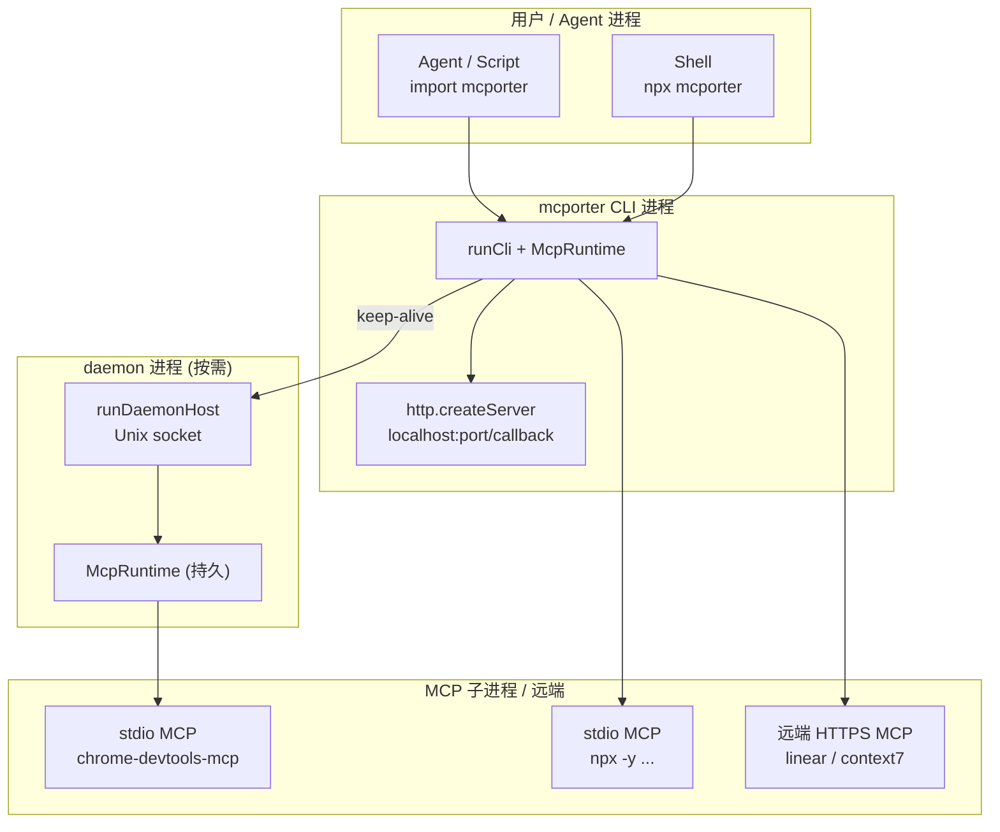
```mermaid
graph TD
  subgraph User["用户 / Agent 进程"]
    AGENT["Agent / Script<br/>import mcporter"]
    SHELL["Shell<br/>npx mcporter"]
  end

  subgraph CLIProc["mcporter CLI 进程"]
    MAIN["runCli + McpRuntime"]
    OAUTHSRV["http.createServer<br/>localhost:port/callback"]
  end

  subgraph DaemonProc["daemon 进程 (按需)"]
    DHOST["runDaemonHost<br/>Unix socket"]
    DRT["McpRuntime (持久)"]
  end

  subgraph Children["MCP 子进程 / 远端"]
    STDIO1["stdio MCP<br/>chrome-devtools-mcp"]
    STDIO2["stdio MCP<br/>npx -y ..."]
    HTTPMCP["远端 HTTPS MCP<br/>linear / context7"]
  end

  AGENT --> MAIN
  SHELL --> MAIN
  MAIN --> OAUTHSRV
  MAIN --> STDIO2
  MAIN --> HTTPMCP
  MAIN -->|"keep-alive"| DHOST
  DHOST --> DRT
  DRT --> STDIO1
```

实际部署里有几个关键事实：

- 默认情况下 `mcporter` CLI 是短命进程：`runCli` 完成后会 `process.exit(0)`，并主动 destroy 子进程（[src/cli.ts:185-203]()）。这是为了规避 typescript-sdk #579/#780/#1049 中描述的 stdio 句柄泄漏问题；`MCPORTER_NO_FORCE_EXIT=1` 可以关闭。
- OAuth 流程的本地回调服务器是临时的，每次 OAuth 会话开一个新的 `http.Server`，授权码到手后立刻 `server.close()`（[src/oauth.ts:170-218](), [src/oauth.ts:286-299]()）。
- daemon 是常驻的：第一次访问 keep-alive 服务器时由 `DaemonClient.startDaemon()` 自动以 `MCPORTER_DAEMON_CHILD=1` 派生一个 detached 子进程（[src/daemon/client.ts:133-152](), [src/daemon/launch.ts]()），通过 socket 与 metadata 文件锚定。

Sources: [src/cli.ts:168-204](../../../project-repos/mcporter/src/cli.ts#L168-L204), [src/oauth.ts:104-167](../../../project-repos/mcporter/src/oauth.ts#L104-L167), [src/daemon/client.ts:114-163](../../../project-repos/mcporter/src/daemon/client.ts#L114-L163)

<details class="source-snippets">
<summary>引用源码</summary>

<!-- source-snippets:start -->

#### `src/cli.ts:168-204`

```typescript
  } finally {
    const closeStart = Date.now();
    if (DEBUG_HANG) {
      logInfo('[debug] beginning runtime.close()');
      dumpActiveHandles('before runtime.close');
    }
    try {
      await runtime.close();
      if (DEBUG_HANG) {
        const duration = Date.now() - closeStart;
        logInfo(`[debug] runtime.close() completed in ${duration}ms`);
        dumpActiveHandles('after runtime.close');
      }
    } catch (error) {
      if (DEBUG_HANG) {
        logError('[debug] runtime.close() failed', error);
      }
    } finally {
      terminateChildProcesses('runtime.finally');
      // By default we force an exit after cleanup so Node doesn't hang on lingering stdio handles
      // (see typescript-sdk#579/#780/#1049). Opt out by exporting MCPORTER_NO_FORCE_EXIT=1.
      const disableForceExit = process.env.MCPORTER_NO_FORCE_EXIT === '1';
      if (DEBUG_HANG) {
        dumpActiveHandles('after terminateChildProcesses');
        if (!disableForceExit || process.env.MCPORTER_FORCE_EXIT === '1') {
          process.exit(0);
        }
      } else {
        const scheduleExit = () => {
          if (!disableForceExit || process.env.MCPORTER_FORCE_EXIT === '1') {
            process.exit(0);
          }
        };
        setImmediate(scheduleExit);
      }
    }
  }
```

#### `src/oauth.ts:104-167`

```typescript

    const server = http.createServer();
    const overrideRedirect = definition.oauthRedirectUrl ? new URL(definition.oauthRedirectUrl) : null;
    const listenHost = overrideRedirect?.hostname ?? CALLBACK_HOST;
    const overridePort = overrideRedirect?.port ?? '';
    const usesDynamicPort = !overrideRedirect || overridePort === '' || overridePort === '0';
    const desiredPort = usesDynamicPort ? undefined : Number.parseInt(overridePort, 10);
    const callbackPath =
      overrideRedirect?.pathname && overrideRedirect.pathname !== '/' ? overrideRedirect.pathname : CALLBACK_PATH;
    const port = await new Promise<number>((resolve, reject) => {
      server.listen(desiredPort ?? 0, listenHost, () => {
        const address = server.address();
        if (typeof address === 'object' && address && 'port' in address) {
          resolve(address.port);
        } else {
          reject(new Error('Failed to determine callback port'));
        }
      });
      server.once('error', (error) => reject(error));
    });

    const redirectUrl = overrideRedirect
      ? new URL(overrideRedirect.toString())
      : new URL(`http://${listenHost}:${port}${callbackPath}`);
    if (usesDynamicPort) {
      redirectUrl.port = String(port);
    }
    if (!overrideRedirect || overrideRedirect.pathname === '/' || overrideRedirect.pathname === '') {
      redirectUrl.pathname = callbackPath;
    }

    // When using a dynamic port, the redirect URI changes every run.  If a
    // previous client registration is cached with a different redirect URI the
    // auth server will reject the request with `invalid_redirect_uri`.  Clear
    // the stale registration so the next flow re-registers with the new URI.
    // Wrapped in try/catch so persistence errors (malformed JSON, permission
    // issues) close the already-bound callback server instead of leaking it.
    if (usesDynamicPort) {
      try {
        const cachedClient = await persistence.readClientInfo();
        const cachedRedirect = firstRedirectUri(cachedClient);
        if (cachedRedirect && cachedRedirect !== redirectUrl.toString()) {
          logger.info(
            `Redirect URI changed (${cachedRedirect} → ${redirectUrl.toString()}); clearing stale client registration.`
          );
          await persistence.clear('client');
        }
      } catch (error) {
        await new Promise<void>((resolve) => {
          server.close(() => resolve());
        });
        throw error;
      }
    }

    const provider = new PersistentOAuthClientProvider(definition, persistence, redirectUrl, logger);
    provider.attachServer(server);
    return {
      provider,
      close: async () => {
        await provider.close();
      },
    };
  }
```

#### `src/daemon/client.ts:114-163`

```typescript
  private async ensureDaemon(): Promise<void> {
    if (await this.isConfigStale()) {
      await this.stop().catch(() => {});
      await this.restartDaemon();
      return;
    }
    const available = await this.isResponsive();
    if (available) {
      return;
    }
    await this.startDaemon();
    await this.waitForReady();
  }

  private async restartDaemon(): Promise<void> {
    await this.startDaemon();
    await this.waitForReady();
  }

  private async startDaemon(): Promise<void> {
    if (this.startingPromise) {
      await this.startingPromise;
      return;
    }
    this.startingPromise = Promise.resolve()
      .then(() => {
        launchDaemonDetached({
          configPath: this.options.configPath,
          configExplicit: this.options.configExplicit,
          rootDir: this.options.rootDir,
          metadataPath: this.metadataPath,
          socketPath: this.socketPath,
        });
      })
      .finally(() => {
        this.startingPromise = null;
      });
    await this.startingPromise;
  }

  private async waitForReady(): Promise<void> {
    const deadline = Date.now() + 10_000;
    while (Date.now() < deadline) {
      if (await this.isResponsive()) {
        return;
      }
      await delay(100);
    }
    throw new Error('Timeout while waiting for MCPorter daemon to start.');
  }
```

<!-- source-snippets:end -->
</details>
## 跨边界的错误模型

错误从底层传输冒到 CLI 时会被 `analyzeConnectionError` 归一成 5 类：`auth | offline | http | stdio-exit | other`（[src/error-classifier.ts:3-63]()）。`callTool` 失败时 Runtime 会根据 `shouldResetConnection` 决定是否重置缓存的 `ClientContext`（[src/runtime.ts:308-323]()）；CLI 层进一步把这些分类翻译成黄/红/dim 的可读提示，并在 `--output json` 模式下封装成 `{ server, tool, issue, error }` 的稳定信封（[src/cli/call-command.ts:494-521](), [src/cli/json-output.ts]()）。

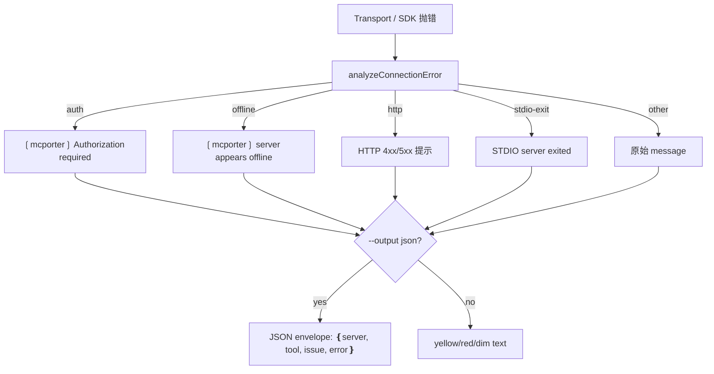
```mermaid
flowchart TD
  Tx["Transport / SDK 抛错"] --> Cls["analyzeConnectionError"]
  Cls -->|auth| A["❲mcporter❳ Authorization required"]
  Cls -->|offline| O["❲mcporter❳ server appears offline"]
  Cls -->|http| H["HTTP 4xx/5xx 提示"]
  Cls -->|"stdio-exit"| S["STDIO server exited"]
  Cls -->|other| Z["原始 message"]
  A & O & H & S & Z --> JF{"--output json?"}
  JF -->|yes| Env["JSON envelope: ❴server, tool, issue, error❵"]
  JF -->|no| TT["yellow/red/dim text"]
```

Sources: [src/error-classifier.ts:41-63](../../../project-repos/mcporter/src/error-classifier.ts#L41-L63), [src/cli/call-command.ts:494-521](../../../project-repos/mcporter/src/cli/call-command.ts#L494-L521), [src/runtime.ts:308-323](../../../project-repos/mcporter/src/runtime.ts#L308-L323)

<details class="source-snippets">
<summary>引用源码</summary>

<!-- source-snippets:start -->

#### `src/error-classifier.ts:41-63`

```typescript
export function analyzeConnectionError(error: unknown): ConnectionIssue {
  const rawMessage = extractMessage(error);
  if (error instanceof UnauthorizedError) {
    return { kind: 'auth', rawMessage };
  }
  const stdio = extractStdioExit(rawMessage);
  if (stdio) {
    return { kind: 'stdio-exit', rawMessage, ...stdio };
  }
  const errorCode = extractErrorCode(error);
  const statusCode = errorCode ?? extractStatusCode(rawMessage);
  const normalized = rawMessage.toLowerCase();
  if (AUTH_STATUSES.has(statusCode ?? -1) || containsAuthToken(normalized)) {
    return { kind: 'auth', rawMessage, statusCode };
  }
  if (statusCode && statusCode >= 400) {
    return { kind: 'http', rawMessage, statusCode };
  }
  if (OFFLINE_PATTERNS.some((pattern) => normalized.includes(pattern))) {
    return { kind: 'offline', rawMessage };
  }
  return { kind: 'other', rawMessage };
}
```

#### `src/cli/call-command.ts:494-521`

```typescript
function maybeReportConnectionIssue(server: string, tool: string, error: unknown): ConnectionIssue | undefined {
  const issue = analyzeConnectionError(error);
  const detail = summarizeIssueMessage(issue.rawMessage);
  if (issue.kind === 'auth') {
    const authCommand = `mcporter auth ${server}`;
    const hint = `[mcporter] Authorization required for ${server}. Run '${authCommand}'.${detail ? ` (${detail})` : ''}`;
    console.error(yellowText(hint));
    return issue;
  }
  if (issue.kind === 'offline') {
    const hint = `[mcporter] ${server} appears offline${detail ? ` (${detail})` : ''}.`;
    console.error(redText(hint));
    return issue;
  }
  if (issue.kind === 'http') {
    const status = issue.statusCode ? `HTTP ${issue.statusCode}` : 'an HTTP error';
    const hint = `[mcporter] ${server}.${tool} responded with ${status}${detail ? ` (${detail})` : ''}.`;
    console.error(dimText(hint));
    return issue;
  }
  if (issue.kind === 'stdio-exit') {
    const exit = typeof issue.stdioExitCode === 'number' ? `code ${issue.stdioExitCode}` : 'an unknown status';
    const signal = issue.stdioSignal ? ` (signal ${issue.stdioSignal})` : '';
    const hint = `[mcporter] STDIO server for ${server} exited with ${exit}${signal}.`;
    console.error(redText(hint));
  }
  return issue;
}
```

#### `src/runtime.ts:308-323`

```typescript
  private async resetConnectionOnError(server: string, error: unknown): Promise<void> {
    if (!shouldResetConnection(error)) {
      return;
    }
    const normalized = server.trim();
    if (!this.clients.has(normalized)) {
      return;
    }
    try {
      // Reuse the existing close() helper so transport shutdown stays consistent with
      // normal runtime disposal (wait for STDIO children, close OAuth sessions, etc.).
      await this.close(normalized);
    } catch (closeError) {
      const detail = closeError instanceof Error ? closeError.message : String(closeError);
      this.logger.warn(`Failed to reset '${normalized}' after error: ${detail}`);
    }
```

<!-- source-snippets:end -->
</details>
## 设计取舍

- **库优先 vs CLI 优先** — 公共 API 仅 9 行（[src/index.ts]()），把绝大多数复杂度藏在 `src/cli/**`。库使用者拿到的依然是干净的 `Runtime`，CLI 是它的一个调用方而不是反过来。
- **乐观并发 + 强制收敛** — `McpRuntime` 用 `Map<string, Promise<ClientContext>>` 存连接，并在调用失败时按 `shouldResetConnection` 主动逐出缓存。失败重连不依赖任何"健康检查"，只依赖错误分类。
- **避免引入新协议** — daemon 没有用 gRPC / HTTP，只用 Unix socket + 一行 JSON。请求结构定义在 [src/daemon/protocol.ts:1-58]() 的不到 60 行里，便于 CLI 与 daemon 在同一进程下被独立测试。
- **强 Patch 而非 Wait** — `sdk-patches.ts` 直接 monkey-patch `StdioClientTransport.prototype.close`，宁愿吃掉一段维护成本也要保证子进程能在 700ms / SIGTERM / SIGKILL 三段升级里退干净（[src/sdk-patches.ts:236-336]()）。
- **配置可叠加而非合并冲突** — `loadServerDefinitions` 用"先到先得"语义合并 7 个编辑器导入与多层 `mcporter.json`：本地永远赢导入，导入按 `imports` 数组顺序优先（[src/config.ts:36-104]()）。

Sources: [src/index.ts:1-9](../../../project-repos/mcporter/src/index.ts#L1-L9), [src/runtime.ts:243-279](../../../project-repos/mcporter/src/runtime.ts#L243-L279), [src/sdk-patches.ts:236-336](../../../project-repos/mcporter/src/sdk-patches.ts#L236-L336), [src/config.ts:36-104](../../../project-repos/mcporter/src/config.ts#L36-L104)

<details class="source-snippets">
<summary>引用源码</summary>

<!-- source-snippets:start -->

#### `src/index.ts:1-9`

```typescript
export type { CommandSpec, ServerDefinition } from './config.js';
export { loadServerDefinitions } from './config.js';
export type { CallResult, ConnectionIssue, ImageContent } from './result-utils.js';
export { createCallResult, describeConnectionIssue, wrapCallResult } from './result-utils.js';
export type { CallOptions, ListToolsOptions, Runtime, RuntimeLogger, ServerToolInfo } from './runtime.js';
export { callOnce, createRuntime } from './runtime.js';
export type { ServerProxyOptions } from './server-proxy.js';
export { createServerProxy } from './server-proxy.js';
```

#### `src/runtime.ts:243-279`

```typescript
  async connect(server: string, options: ConnectOptions = {}): Promise<ClientContext> {
    // Reuse cached connections unless the caller explicitly opted out.
    const normalized = server.trim();

    const useCache = options.skipCache !== true && options.maxOAuthAttempts === undefined;

    if (useCache) {
      const existing = this.clients.get(normalized);
      if (existing) {
        return existing;
      }
    }

    const definition = this.definitions.get(normalized);
    if (!definition) {
      throw new Error(`Unknown MCP server '${normalized}'.`);
    }

    const connection = createClientContext(definition, this.logger, this.clientInfo, {
      maxOAuthAttempts: options.maxOAuthAttempts,
      oauthTimeoutMs: this.oauthTimeoutMs ?? OAUTH_CODE_TIMEOUT_MS,
      onDefinitionPromoted: (promoted) => this.definitions.set(promoted.name, promoted),
      allowCachedAuth: options.allowCachedAuth,
    });

    if (useCache) {
      this.clients.set(normalized, connection);
      try {
        return await connection;
      } catch (error) {
        this.clients.delete(normalized);
        throw error;
      }
    }

    return connection;
  }
```

#### `src/sdk-patches.ts:236-336`

```typescript
function patchStdioClose(): void {
  const marker = Symbol.for('mcporter.stdio.patched');
  const proto = StdioClientTransport.prototype as unknown as Record<symbol, unknown>;
  if (proto[marker]) {
    return;
  }

  patchStdioStart();

  StdioClientTransport.prototype.close = async function patchedClose(): Promise<void> {
    const transport = this as unknown as {
      _process?: MaybeChildProcess | null;
      _stderrStream?: PassThrough | null;
      _abortController?: AbortController | null;
      _readBuffer?: { clear(): void } | null;
      onclose?: () => void;
    };
    const child = transport._process ?? null;
    const stderrStream = transport._stderrStream ?? null;
    const meta = (child ? PROCESS_BUFFERS.get(child) : undefined) ?? TRANSPORT_BUFFERS.get(transport as object);

    if (stderrStream) {
      // Ensure any piped stderr stream is torn down so no file descriptors linger.
      destroyStream(stderrStream);
      transport._stderrStream = null;
    }

    // Abort active reads/writes and clear buffered state just like the SDK does.
    transport._abortController?.abort();
    transport._abortController = null;
    transport._readBuffer?.clear?.();
    transport._readBuffer = null;

    if (!child) {
      transport.onclose?.();
      return;
    }

    // Closing stdin/stdout/stderr proactively lets Node release the handles even
    // when the child ignores SIGTERM (common with npm/npx wrappers).
    destroyStream(child.stdin);
    destroyStream(child.stdout);
    destroyStream(child.stderr);

    const stdio = Array.isArray(child.stdio) ? child.stdio : [];
    for (const stream of stdio) {
      destroyStream(stream);
    }

    let exited = await waitForChildClose(child, 700).then(
      () => true,
      () => false
    );

    if (!exited) {
      // First escalation: polite SIGTERM.
      try {
        child.kill('SIGTERM');
      } catch {
        // ignore
      }
      exited = await waitForChildClose(child, 700).then(
        () => true,
        () => false
      );
    }

    if (!exited) {
      // Final escalation: SIGKILL. If this still fails, fall through and warn.
      try {
        child.kill('SIGKILL');
      } catch {
        // ignore
      }
      await waitForChildClose(child, 500).catch(() => {});
    }

    destroyStream(child.stdin);
    destroyStream(child.stdout);
    destroyStream(child.stderr);

    const stdioAfter = Array.isArray(child.stdio) ? child.stdio : [];
    for (const stream of stdioAfter) {
      // Some transports mutate stdio in-place; run the destroy sweep again to be sure.
      destroyStream(stream);
    }

    child.unref?.();

    if (meta) {
      flushProcessLogs(meta.child ?? child, meta);
    } else if (STDIO_TRACE_ENABLED) {
      console.log('[mcporter] STDIO trace: attempted to close transport without recorded metadata.');
    }

    transport._process = null;
    transport.onclose?.();
  };

  proto[marker] = true;
}
```

#### `src/config.ts:36-104`

```typescript
export async function loadServerDefinitions(options: LoadConfigOptions = {}): Promise<ServerDefinition[]> {
  const rootDir = options.rootDir ?? process.cwd();
  const layers = await loadConfigLayers(options, rootDir);

  const merged = new Map<string, { raw: RawEntry; baseDir: string; source: ServerSource; sources: ServerSource[] }>();

  for (const layer of layers) {
    const configuredImports = layer.config.imports;
    const imports = configuredImports
      ? configuredImports.length === 0
        ? configuredImports
        : [...configuredImports, ...DEFAULT_IMPORTS.filter((kind) => !configuredImports.includes(kind))]
      : DEFAULT_IMPORTS;

    for (const importKind of imports) {
      const candidates = pathsForImport(importKind, rootDir);
      for (const candidate of candidates) {
        const resolved = expandHome(candidate);
        const entries = await readExternalEntries(resolved, { projectRoot: rootDir, importKind: importKind });
        if (!entries) {
          continue;
        }
        for (const [name, rawEntry] of entries) {
          if (merged.has(name)) {
            continue;
          }
          const source: ServerSource = { kind: 'import', path: resolved, importKind };
          const existing = merged.get(name);
          // Keep the first-seen source as canonical while tracking all alternates
          if (existing) {
            existing.sources.push(source);
            continue;
          }
          merged.set(name, {
            raw: rawEntry,
            baseDir: path.dirname(resolved),
            source,
            sources: [source],
          });
        }
      }
    }

    for (const [name, entryRaw] of Object.entries(layer.config.mcpServers)) {
      const source: ServerSource = { kind: 'local', path: layer.path };
      const parsed = RawEntrySchema.parse(entryRaw);
      const existing = merged.get(name);
      // Local definitions win; stash any prior imports after the local path
      if (existing) {
        const sources = [source, ...existing.sources];
        merged.set(name, { raw: parsed, baseDir: path.dirname(layer.path), source, sources });
        continue;
      }
      merged.set(name, {
        raw: parsed,
        baseDir: path.dirname(layer.path),
        source,
        sources: [source],
      });
    }
  }

  const servers: ServerDefinition[] = [];
  for (const [name, { raw, baseDir: entryBaseDir, source, sources }] of merged) {
    servers.push(normalizeServerEntry(name, raw, entryBaseDir, source, sources));
  }

  return servers;
}
```

<!-- source-snippets:end -->
</details>
## 相关页面

- [运行时与传输层](#runtime-transport)
- [配置加载与导入](#configuration)
- [Keep-Alive 守护进程](#daemon)
- [CLI 命令体系](#cli-commands)


---


<a id='configuration'></a>

<details>
<summary>相关源文件</summary>

生成本页时使用的主要源文件：

- [src/config.ts](../../../project-repos/mcporter/src/config.ts)
- [src/config-schema.ts](../../../project-repos/mcporter/src/config-schema.ts)
- [src/config-normalize.ts](../../../project-repos/mcporter/src/config-normalize.ts)
- [src/config/path-discovery.ts](../../../project-repos/mcporter/src/config/path-discovery.ts)
- [src/config/read-config.ts](../../../project-repos/mcporter/src/config/read-config.ts)
- [src/config/imports/external.ts](../../../project-repos/mcporter/src/config/imports/external.ts)
- [src/config/imports/paths.ts](../../../project-repos/mcporter/src/config/imports/paths.ts)
- [src/env.ts](../../../project-repos/mcporter/src/env.ts)

</details>

# 配置加载与导入

mcporter 的配置子系统要回答的核心问题是：**给定当前进程的工作目录与环境变量，应该从哪些文件读 MCP 服务器，按怎样的顺序合并冲突，最终输出什么形状的 `ServerDefinition`？** 这一节按 "解析顺序 → 文件 schema → imports 来源 → 规范化 → 环境变量插值" 的顺序展开。

## 配置查找的两类入口

`loadServerDefinitions(options)` 是公共入口（[src/config.ts:36-104]()），实际的 layer 收集发生在 `loadConfigLayers`（[src/config/read-config.ts:14-41]()）。它要解决两个不同的概念：

- **primary config layers**：来自 `mcporter.json` / `mcporter.jsonc` 自己的层（home + project，按存在性叠加）。
- **imports**：来自其它编辑器/CLI 工具的 MCP 配置，通过 `imports` 字段控制启用列表。

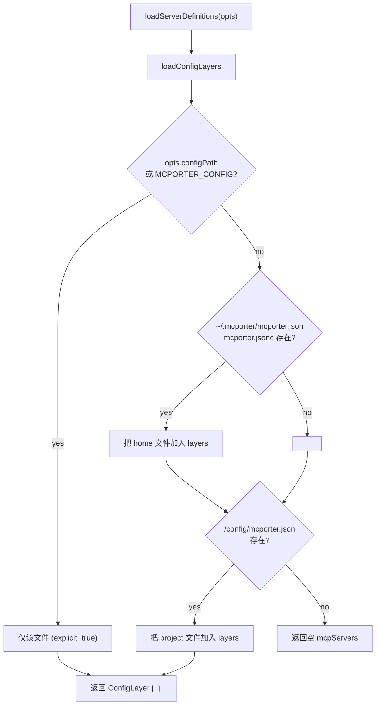
```mermaid
flowchart TD
  Start["loadServerDefinitions(opts)"] --> Layers["loadConfigLayers"]
  Layers --> ExpVar{"opts.configPath<br/>或 MCPORTER_CONFIG?"}
  ExpVar -->|yes| Single["仅该文件 (explicit=true)"]
  ExpVar -->|no| Home{"~/.mcporter/mcporter.json<br/>mcporter.jsonc 存在?"}
  Home -->|yes| AddHome["把 home 文件加入 layers"]
  Home -->|no| SkipHome[" "]
  AddHome --> Proj{"<root>/config/mcporter.json<br/>存在?"}
  SkipHome --> Proj
  Proj -->|yes| AddProj["把 project 文件加入 layers"]
  Proj -->|no| Empty["返回空 mcpServers"]
  AddProj --> Done["返回 ConfigLayer❲❳"]
  Single --> Done
```

注意：`config/mcporter.json` 与 `~/.mcporter/mcporter.json` **会同时叠加**——不是互斥的。两层都存在时，`loadServerDefinitions` 按 layer 数组顺序遍历，**本地（local）项永远覆盖 imports**，但同一项在 home + project 并存时由代码顺序决定胜出方（先 home 再 project，所以 project 文件最后写入 → 覆盖 home）。
Sources: [src/config/read-config.ts:14-41](../../../project-repos/mcporter/src/config/read-config.ts#L14-L41), [src/config.ts:42-96](../../../project-repos/mcporter/src/config.ts#L42-L96)

<details class="source-snippets">
<summary>引用源码</summary>

<!-- source-snippets:start -->

#### `src/config/read-config.ts:14-41`

```typescript
export async function loadConfigLayers(options: LoadConfigOptions, rootDir: string): Promise<ConfigLayer[]> {
  const explicitPath = options.configPath ?? process.env.MCPORTER_CONFIG;
  if (explicitPath) {
    const resolvedPath = path.resolve(expandHome(explicitPath.trim()));
    const config = await readConfigFile(resolvedPath, true);
    return [{ config, path: resolvedPath, explicit: true }];
  }

  const layers: ConfigLayer[] = [];

  const homeCandidates = homeConfigCandidates();
  const existingHome = homeCandidates.find((candidate) => pathExists(candidate));
  if (existingHome) {
    layers.push({ config: await readConfigFile(existingHome, false), path: existingHome, explicit: false });
  }

  const projectPath = path.resolve(rootDir, 'config', 'mcporter.json');
  if (pathExists(projectPath)) {
    layers.push({ config: await readConfigFile(projectPath, false), path: projectPath, explicit: false });
  }

  if (layers.length === 0) {
    // Preserve prior behavior: a missing default config returns an empty list and assumes the project path.
    layers.push({ config: { mcpServers: {} }, path: projectPath, explicit: false });
  }

  return layers;
}
```

#### `src/config.ts:42-96`

```typescript
  for (const layer of layers) {
    const configuredImports = layer.config.imports;
    const imports = configuredImports
      ? configuredImports.length === 0
        ? configuredImports
        : [...configuredImports, ...DEFAULT_IMPORTS.filter((kind) => !configuredImports.includes(kind))]
      : DEFAULT_IMPORTS;

    for (const importKind of imports) {
      const candidates = pathsForImport(importKind, rootDir);
      for (const candidate of candidates) {
        const resolved = expandHome(candidate);
        const entries = await readExternalEntries(resolved, { projectRoot: rootDir, importKind: importKind });
        if (!entries) {
          continue;
        }
        for (const [name, rawEntry] of entries) {
          if (merged.has(name)) {
            continue;
          }
          const source: ServerSource = { kind: 'import', path: resolved, importKind };
          const existing = merged.get(name);
          // Keep the first-seen source as canonical while tracking all alternates
          if (existing) {
            existing.sources.push(source);
            continue;
          }
          merged.set(name, {
            raw: rawEntry,
            baseDir: path.dirname(resolved),
            source,
            sources: [source],
          });
        }
      }
    }

    for (const [name, entryRaw] of Object.entries(layer.config.mcpServers)) {
      const source: ServerSource = { kind: 'local', path: layer.path };
      const parsed = RawEntrySchema.parse(entryRaw);
      const existing = merged.get(name);
      // Local definitions win; stash any prior imports after the local path
      if (existing) {
        const sources = [source, ...existing.sources];
        merged.set(name, { raw: parsed, baseDir: path.dirname(layer.path), source, sources });
        continue;
      }
      merged.set(name, {
        raw: parsed,
        baseDir: path.dirname(layer.path),
        source,
        sources: [source],
      });
    }
  }
```

<!-- source-snippets:end -->
</details>
## 解析顺序与显式 vs 隐式

`resolveConfigPath(configPath, rootDir)` 用同样的优先级表决定**单次写操作**的目标文件路径（[src/config/path-discovery.ts:37-55]()）。`mcporter config add/remove` 命令使用它，运行时则使用更宽松的 `loadConfigLayers`：

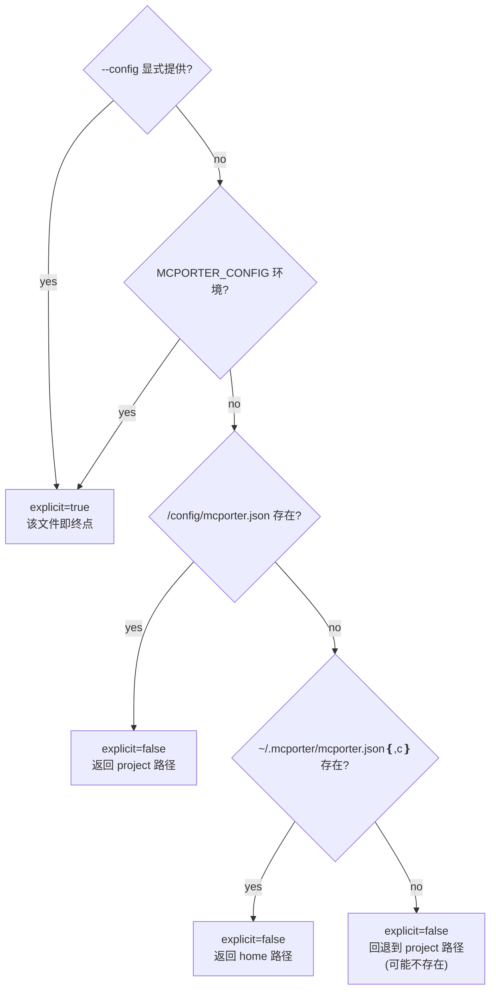
```mermaid
graph TD
  Q1{"--config 显式提供?"} -->|yes| EXPLICIT["explicit=true<br/>该文件即终点"]
  Q1 -->|no| Q2{"MCPORTER_CONFIG 环境?"}
  Q2 -->|yes| EXPLICIT
  Q2 -->|no| Q3{"<root>/config/mcporter.json 存在?"}
  Q3 -->|yes| PROJ["explicit=false<br/>返回 project 路径"]
  Q3 -->|no| Q4{"~/.mcporter/mcporter.json❴,c❵<br/>存在?"}
  Q4 -->|yes| HOME["explicit=false<br/>返回 home 路径"]
  Q4 -->|no| FALLBACK["explicit=false<br/>回退到 project 路径<br/>(可能不存在)"]
```

`explicit=true` 与 `false` 的区别在 `read-config.ts:43-59`：显式打开的文件即使 `ENOENT` 也会向上抛错，隐式打开则降级返回空 `mcpServers`，对默认值场景更友好。
Sources: [src/config/path-discovery.ts:37-80](../../../project-repos/mcporter/src/config/path-discovery.ts#L37-L80), [src/config/read-config.ts:43-59](../../../project-repos/mcporter/src/config/read-config.ts#L43-L59), [src/cli/cli-factory.ts:40-48](../../../project-repos/mcporter/src/cli/cli-factory.ts#L40-L48)

<details class="source-snippets">
<summary>引用源码</summary>

<!-- source-snippets:start -->

#### `src/config/path-discovery.ts:37-80`

```typescript
export function resolveConfigPath(configPath: string | undefined, rootDir: string): ResolvedConfigPath {
  if (configPath) {
    return { path: path.resolve(configPath), explicit: true };
  }
  const envConfig = process.env.MCPORTER_CONFIG;
  if (envConfig && envConfig.trim().length > 0) {
    return { path: path.resolve(expandHome(envConfig.trim())), explicit: true };
  }
  const projectPath = path.resolve(rootDir, 'config', 'mcporter.json');
  if (pathExists(projectPath)) {
    return { path: projectPath, explicit: false };
  }
  const homeCandidates = homeConfigCandidates();
  const existingHome = homeCandidates.find((candidate) => pathExists(candidate));
  if (existingHome) {
    return { path: existingHome, explicit: false };
  }
  return { path: projectPath, explicit: false };
}

export function homeConfigCandidates(): string[] {
  const homeDir = os.homedir();
  const base = path.join(homeDir, '.mcporter');
  return [path.join(base, 'mcporter.json'), path.join(base, 'mcporter.jsonc')];
}

export function pathExists(filePath: string): boolean {
  try {
    fsSync.accessSync(filePath);
    return true;
  } catch {
    return false;
  }
}

export async function pathExistsAsync(filePath: string): Promise<boolean> {
  try {
    await fs.access(filePath);
    return true;
  } catch {
    return false;
  }
}
```

#### `src/config/read-config.ts:43-59`

```typescript
export async function readConfigFile(configPath: string, explicit: boolean): Promise<RawConfig> {
  if (!explicit && !(await pathExistsAsync(configPath))) {
    return { mcpServers: {} };
  }
  try {
    const buffer = await fs.readFile(configPath, 'utf8');
    return RawConfigSchema.parse(parseJsonBuffer(buffer));
  } catch (error) {
    if (!explicit && isMissingConfigError(error)) {
      return { mcpServers: {} };
    }
    if (!explicit && isSyntaxError(error)) {
      warnConfigFallback(configPath, error);
      return { mcpServers: {} };
    }
    throw error;
  }
```

#### `src/cli/cli-factory.ts:40-48`

```typescript
  const rootOverride = globalFlags['--root'];
  const configResolution = resolveConfigPath(globalFlags['--config'], rootOverride ?? process.cwd());

  const runtimeOptions = {
    configPath: configResolution.explicit ? configResolution.path : undefined,
    rootDir: rootOverride,
    logger: getActiveLogger(),
    oauthTimeoutMs: oauthTimeoutOverride,
  };
```

<!-- source-snippets:end -->
</details>
## 配置文件 schema

`mcporter.json` / `mcporter.jsonc` 的根 schema 定义在 [src/config-schema.ts:121-129]()：

```ts
RawConfigSchema = z.object({
  mcpServers: z.record(z.string(), RawEntrySchema),
  imports: z.array(ImportKindSchema).optional(),
});
```

`RawEntry` 字段非常宽容：

| 字段 | 类型 | 用途 |
|------|------|------|
| `description` | `string` | 列表/帮助里展示 |
| `baseUrl` / `base_url` / `url` / `serverUrl` / `server_url` | `string` | HTTP/SSE 端点（5 种别名同时支持） |
| `command` | `string` 或 `string[]` | stdio 命令；字符串时由 `parseCommandString` 自行 token 化 |
| `executable` | `string` | `command` 的别名（兼容某些编辑器） |
| `args` | `string[]` | 当 `command` 是字符串时的额外参数 |
| `headers` | `Record<string, string>` | 静态或带 `${VAR}` / `$env:VAR` 占位符的 HTTP 头 |
| `env` | `Record<string, string>` | stdio 进程注入的环境变量 |
| `auth` | `string` | 仅识别 `"oauth"` |
| `tokenCacheDir` / `token_cache_dir` | `string` | 自定义 OAuth 缓存目录（覆盖 vault 默认） |
| `clientName` / `client_name` | `string` | 上报给 OAuth 的客户端名 |
| `oauthRedirectUrl` / `oauth_redirect_url` | `string` | 自定义回调 URL（覆盖动态端口） |
| `oauthScope` / `oauth_scope` | `string` | scope 覆盖；空字符串保留 |
| `oauthCommand` / `oauth_command` | `{ args: string[] }` | stdio MCP 的 OAuth 辅助子命令（如 gmail） |
| `bearerToken` / `bearer_token` | `string` | 静态 bearer，注入为 `Authorization: Bearer <token>` |
| `bearerTokenEnv` / `bearer_token_env` | `string` | 动态 bearer，注入为 `Authorization: $env:NAME` |
| `lifecycle` | `"keep-alive" \| "ephemeral" \| { mode, idleTimeoutMs }` | 由 daemon 使用 |
| `logging.daemon.enabled` | `boolean` | 让 daemon 详细记录该 server |
| `allowedTools` / `blockedTools` | `string[]` | 工具过滤（互斥） |

`superRefine` 校验 `allowedTools` 与 `blockedTools` 不能同时出现（[src/config-schema.ts:108-118]()）。
Sources: [src/config-schema.ts:51-130](../../../project-repos/mcporter/src/config-schema.ts#L51-L130)

<details class="source-snippets">
<summary>引用源码</summary>

<!-- source-snippets:start -->

#### `src/config-schema.ts:51-130`

```typescript
export const RawEntrySchema = z
  .object({
    description: z.string().optional().describe('Human-readable description of the server'),
    baseUrl: z.string().optional().describe('Base URL for HTTP/SSE transport (camelCase)'),
    base_url: z.string().optional().describe('Base URL for HTTP/SSE transport (snake_case)'),
    url: z.string().optional().describe('Server URL for HTTP/SSE transport'),
    serverUrl: z.string().optional().describe('Server URL for HTTP/SSE transport (camelCase)'),
    server_url: z.string().optional().describe('Server URL for HTTP/SSE transport (snake_case)'),
    command: z
      .union([z.string(), z.array(z.string())])
      .optional()
      .describe('Command to spawn for stdio transport (string or array of arguments)'),
    executable: z.string().optional().describe('Executable path for stdio transport'),
    args: z.array(z.string()).optional().describe('Arguments to pass to the stdio command'),
    headers: z
      .record(z.string(), z.string())
      .optional()
      .describe('HTTP headers for requests. Supports $VAR and $env:VAR placeholders'),
    env: z
      .record(z.string(), z.string())
      .optional()
      .describe('Environment variables for stdio commands. Supports $VAR and fallback syntax'),
    auth: z.string().optional().describe('Authentication method (e.g., "oauth")'),
    tokenCacheDir: z.string().optional().describe('Directory for caching OAuth tokens (camelCase)'),
    token_cache_dir: z.string().optional().describe('Directory for caching OAuth tokens (snake_case)'),
    clientName: z.string().optional().describe('Client identifier for server telemetry (camelCase)'),
    client_name: z.string().optional().describe('Client identifier for server telemetry (snake_case)'),
    oauthRedirectUrl: z.string().optional().describe('Custom OAuth redirect URL (camelCase)'),
    oauth_redirect_url: z.string().optional().describe('Custom OAuth redirect URL (snake_case)'),
    oauthScope: z.string().optional().describe('OAuth scope override (camelCase)'),
    oauth_scope: z.string().optional().describe('OAuth scope override (snake_case)'),
    oauthCommand: z
      .object({
        args: z.array(z.string()).describe('Arguments for the OAuth command'),
      })
      .optional()
      .describe('Custom OAuth command configuration for stdio servers (camelCase)'),
    oauth_command: z
      .object({
        args: z.array(z.string()).describe('Arguments for the OAuth command'),
      })
      .optional()
      .describe('Custom OAuth command configuration for stdio servers (snake_case)'),
    bearerToken: z.string().optional().describe('Static bearer token for authentication (camelCase)'),
    bearer_token: z.string().optional().describe('Static bearer token for authentication (snake_case)'),
    bearerTokenEnv: z.string().optional().describe('Environment variable name containing the bearer token (camelCase)'),
    bearer_token_env: z
      .string()
      .optional()
      .describe('Environment variable name containing the bearer token (snake_case)'),
    lifecycle: RawLifecycleSchema.optional(),
    logging: RawLoggingSchema,
    allowedTools: ToolNamesSchema.optional().describe('Only these exact tool names are exposed (camelCase)'),
    allowed_tools: ToolNamesSchema.optional().describe('Only these exact tool names are exposed (snake_case)'),
    blockedTools: ToolNamesSchema.optional().describe('These exact tool names are hidden and blocked (camelCase)'),
    blocked_tools: ToolNamesSchema.optional().describe('These exact tool names are hidden and blocked (snake_case)'),
  })
  .superRefine((entry, ctx) => {
    const hasAllowed = entry.allowedTools !== undefined || entry.allowed_tools !== undefined;
    const hasBlocked = entry.blockedTools !== undefined || entry.blocked_tools !== undefined;
    if (hasAllowed && hasBlocked) {
      ctx.addIssue({
        code: 'custom',
        message: 'Specify either allowedTools or blockedTools, not both.',
        path: ['allowedTools'],
      });
    }
  })
  .describe('MCP server definition supporting both HTTP/SSE and stdio transports');

export const RawConfigSchema = z
  .object({
    mcpServers: z.record(z.string(), RawEntrySchema).describe('Map of server names to their configurations'),
    imports: z
      .array(ImportKindSchema)
      .optional()
      .describe('Editor configurations to import servers from. Omit to use defaults, or set to [] to disable imports'),
  })
  .describe('mcporter configuration file schema');

```

<!-- source-snippets:end -->
</details>
### `mcpServers` 与 `imports` 的相互作用

`imports` 默认值定义在 [src/config-schema.ts:9-17]()：

```ts
DEFAULT_IMPORTS = ['cursor', 'claude-code', 'claude-desktop', 'codex', 'windsurf', 'opencode', 'vscode'];
```

`loadServerDefinitions` 的 `imports` 解析逻辑（[src/config.ts:43-49]()）：

- `imports: undefined` → 用全部 7 个默认值。
- `imports: []` → 完全关闭外部导入。
- `imports: ['cursor']` → 把 `'cursor'` 排在最前，再追加默认值里**还没出现**的其它 6 项。**这一步不是 strict 替换，而是优先级前置 + 兜底叠加**——一行 JSON 改不掉默认行为，需要写 `[]` 才能彻底关闭。

## imports 文件路径

`pathsForImport(kind, rootDir)` 列出每种 import 的候选路径（[src/config/imports/paths.ts:5-36]()）。每种来源都先看 project 局部，再看用户 home，再看平台特定的应用支持目录。

| import | project 局部 | user home | 系统目录 |
|--------|--------------|-----------|----------|
| cursor | `<root>/.cursor/mcp.json` | `~/.cursor/mcp.json` | macOS: `~/Library/Application Support/Cursor/User/mcp.json`，Windows: `%APPDATA%/Cursor/User/mcp.json` |
| claude-code | `<root>/.claude/settings.local.json` → `settings.json` → `mcp.json` | `~/.claude/settings.local.json` → `settings.json` → `mcp.json` → `~/.claude.json` | — |
| claude-desktop | — | macOS: `~/Library/Application Support/Claude/settings.json`；Win: `%AppData%/Claude/settings.json`；Linux: `~/.config/Claude/settings.json` | — |
| codex | `<root>/.codex/config.toml` | `~/.codex/config.toml` | — |
| windsurf | — | `~/.codeium/windsurf/mcp_config.json` 等 4 个候选 | Windows: `%APPDATA%/Codeium/windsurf/mcp_config.json` |
| opencode | `<root>/opencode.jsonc` / `.json`，`OPENCODE_CONFIG_DIR` 指向的目录 | `~/.config/opencode/opencode.{jsonc,json}` 等 | 受 `XDG_CONFIG_HOME` / `OPENCODE_CONFIG` 环境覆盖 |
| vscode | `<root>/.vscode/mcp.json` | macOS: `~/Library/Application Support/Code/User/mcp.json`（含 Insiders）；Windows: `%APPDATA%/Code/User/mcp.json`；Linux: `~/.config/Code/User/mcp.json` | — |

Sources: [src/config/imports/paths.ts:5-145](../../../project-repos/mcporter/src/config/imports/paths.ts#L5-L145)

<details class="source-snippets">
<summary>引用源码</summary>

<!-- source-snippets:start -->

#### `src/config/imports/paths.ts:5-145`

```typescript
export function pathsForImport(kind: ImportKind, rootDir: string): string[] {
  switch (kind) {
    case 'cursor':
      return dedupePaths([
        path.resolve(rootDir, '.cursor', 'mcp.json'),
        path.join(os.homedir(), '.cursor', 'mcp.json'),
        ...defaultCursorUserConfigPaths(),
      ]);
    case 'claude-code':
      return dedupePaths([
        path.resolve(rootDir, '.claude', 'settings.local.json'),
        path.resolve(rootDir, '.claude', 'settings.json'),
        path.resolve(rootDir, '.claude', 'mcp.json'),
        path.join(os.homedir(), '.claude', 'settings.local.json'),
        path.join(os.homedir(), '.claude', 'settings.json'),
        path.join(os.homedir(), '.claude', 'mcp.json'),
        path.join(os.homedir(), '.claude.json'),
      ]);
    case 'claude-desktop':
      return [defaultClaudeDesktopConfigPath()];
    case 'codex':
      return [path.resolve(rootDir, '.codex', 'config.toml'), path.join(os.homedir(), '.codex', 'config.toml')];
    case 'windsurf':
      return defaultWindsurfConfigPaths();
    case 'opencode':
      return opencodeConfigPaths(rootDir);
    case 'vscode':
      return dedupePaths([path.resolve(rootDir, '.vscode', 'mcp.json'), ...defaultVscodeConfigPaths()]);
    default:
      return [];
  }
}

function defaultCursorUserConfigPaths(): string[] {
  const xdgConfig = process.env.XDG_CONFIG_HOME;
  const configs = xdgConfig ? [path.join(xdgConfig, 'Cursor', 'User', 'mcp.json')] : [];
  return dedupePaths([
    path.join(os.homedir(), 'AppData', 'Roaming', 'Cursor', 'User', 'mcp.json'),
    path.join(os.homedir(), 'Library', 'Application Support', 'Cursor', 'User', 'mcp.json'),
    ...configs,
  ]);
}

function defaultWindsurfConfigPaths(): string[] {
  const homeDir = os.homedir();
  const paths = [
    path.join(homeDir, '.codeium', 'windsurf', 'mcp_config.json'),
    path.join(homeDir, '.codeium', 'windsurf-next', 'mcp_config.json'),
    path.join(homeDir, '.windsurf', 'mcp_config.json'),
    path.join(homeDir, '.config', '.codeium', 'windsurf', 'mcp_config.json'),
  ];
  if (process.platform === 'win32') {
    const appData = process.env.APPDATA ?? path.join(homeDir, 'AppData', 'Roaming');
    paths.push(path.join(appData, 'Codeium', 'windsurf', 'mcp_config.json'));
  }
  return dedupePaths(paths);
}

function defaultVscodeConfigPaths(): string[] {
  if (process.platform === 'darwin') {
    return [
      path.join(os.homedir(), 'Library', 'Application Support', 'Code', 'User', 'mcp.json'),
      path.join(os.homedir(), 'Library', 'Application Support', 'Code - Insiders', 'User', 'mcp.json'),
    ];
  }
  if (process.platform === 'win32') {
    const appData = process.env.APPDATA ?? path.join(os.homedir(), 'AppData', 'Roaming');
    return [path.join(appData, 'Code', 'User', 'mcp.json'), path.join(appData, 'Code - Insiders', 'User', 'mcp.json')];
  }
  return [
    path.join(os.homedir(), '.config', 'Code', 'User', 'mcp.json'),
    path.join(os.homedir(), '.config', 'Code - Insiders', 'User', 'mcp.json'),
  ];
}

function opencodeConfigPaths(rootDir: string): string[] {
  const overrideConfig = process.env.OPENCODE_CONFIG;
  const overrideDir = process.env.OPENCODE_CONFIG_DIR;
  const envConfigPath = process.env.OPENAI_WORKDIR;
  const xdg = process.env.XDG_CONFIG_HOME;
  const configHome = xdg ?? path.join(process.env.HOME ?? '', '.config');
  const paths: string[] = [
    overrideConfig ?? '',
    path.resolve(rootDir, 'opencode.jsonc'),
    path.resolve(rootDir, 'opencode.json'),
  ];
  if (overrideDir && overrideDir.length > 0) {
    paths.push(path.join(overrideDir, 'opencode.jsonc'), path.join(overrideDir, 'opencode.json'));
  }
  paths.push(
    path.resolve(rootDir, '.openai', 'config.json'),
    envConfigPath ? path.resolve(envConfigPath, '.openai', 'config.json') : '',
    path.join(configHome, 'openai', 'config.json')
  );
  for (const dir of defaultOpencodeConfigDirs()) {
    paths.push(path.join(dir, 'opencode.jsonc'), path.join(dir, 'opencode.json'));
  }
  return dedupePaths(paths);
}

function defaultOpencodeConfigDirs(): string[] {
  const dirs: string[] = [];
  const xdg = process.env.XDG_CONFIG_HOME;
  if (xdg && xdg.length > 0) {
    dirs.push(path.join(xdg, 'opencode'));
  } else if (process.platform === 'win32') {
    const appData = process.env.APPDATA ?? path.join(os.homedir(), 'AppData', 'Roaming');
    dirs.push(path.join(appData, 'opencode'));
  } else {
    dirs.push(path.join(os.homedir(), '.config', 'opencode'));
  }
  return dirs;
}

function defaultClaudeDesktopConfigPath(): string {
  const homeDir = os.homedir();
  const darwinPath = path.join(homeDir, 'Library', 'Application Support', 'Claude', 'settings.json');
  const windowsPath = path.join(homeDir, 'AppData', 'Roaming', 'Claude', 'settings.json');
  const linuxPath = path.join(homeDir, '.config', 'Claude', 'settings.json');
  const platform = process.platform;
... snippet truncated ...
```

<!-- source-snippets:end -->
</details>
`readExternalEntries(filePath, opts)` 处理读取与解析（[src/config/imports/external.ts:14-41]()）：

- `.toml` → `parseToml` → 抽取 `mcp_servers` 节（codex 风格）。
- 其它（`.json` / `.jsonc`）→ 通过 `parseJsonBuffer`（容忍 JSONC 注释与尾逗号）。
- 同一个 JSON 可以挂在 `mcpServers` / `servers` / `mcp` 三个键之一，`opencode` 强制用 `mcp`，其它来源放宽 `allowRootFallback`。
- `claude-code` 还会扫描 `~/.claude.json` 的 `projects[<projectRoot>].mcpServers`，用 `normalizeProjectPath` 把绝对路径标准化（[src/config/imports/external.ts:182-200]()）。
- `convertExternalEntry` 把外部对象 squash 成 `RawEntry` 并跑 `RawEntrySchema.safeParse`，校验失败的整体丢弃（[src/config/imports/external.ts:102-159]()）。

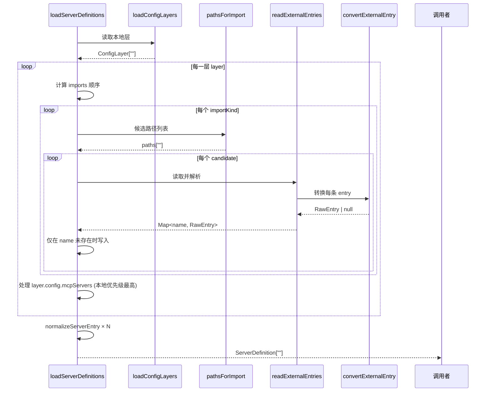
```mermaid
sequenceDiagram
  participant LSD as loadServerDefinitions
  participant Layer as loadConfigLayers
  participant Path as pathsForImport
  participant Read as readExternalEntries
  participant Conv as convertExternalEntry

  LSD->>Layer: 读取本地层
  Layer-->>LSD: ConfigLayer[""]
  loop 每一层 layer
    LSD->>LSD: 计算 imports 顺序
    loop 每个 importKind
      LSD->>Path: 候选路径列表
      Path-->>LSD: paths[""]
      loop 每个 candidate
        LSD->>Read: 读取并解析
        Read->>Conv: 转换每条 entry
        Conv-->>Read: RawEntry | null
        Read-->>LSD: Map<name, RawEntry>
        LSD->>LSD: 仅在 name 未存在时写入
      end
    end
    LSD->>LSD: 处理 layer.config.mcpServers (本地优先级最高)
  end
  LSD->>LSD: normalizeServerEntry × N
  LSD-->>调用者: ServerDefinition[""]
```

Sources: [src/config.ts:36-104](../../../project-repos/mcporter/src/config.ts#L36-L104), [src/config/imports/external.ts:14-200](../../../project-repos/mcporter/src/config/imports/external.ts#L14-L200)

<details class="source-snippets">
<summary>引用源码</summary>

<!-- source-snippets:start -->

#### `src/config.ts:36-104`

```typescript
export async function loadServerDefinitions(options: LoadConfigOptions = {}): Promise<ServerDefinition[]> {
  const rootDir = options.rootDir ?? process.cwd();
  const layers = await loadConfigLayers(options, rootDir);

  const merged = new Map<string, { raw: RawEntry; baseDir: string; source: ServerSource; sources: ServerSource[] }>();

  for (const layer of layers) {
    const configuredImports = layer.config.imports;
    const imports = configuredImports
      ? configuredImports.length === 0
        ? configuredImports
        : [...configuredImports, ...DEFAULT_IMPORTS.filter((kind) => !configuredImports.includes(kind))]
      : DEFAULT_IMPORTS;

    for (const importKind of imports) {
      const candidates = pathsForImport(importKind, rootDir);
      for (const candidate of candidates) {
        const resolved = expandHome(candidate);
        const entries = await readExternalEntries(resolved, { projectRoot: rootDir, importKind: importKind });
        if (!entries) {
          continue;
        }
        for (const [name, rawEntry] of entries) {
          if (merged.has(name)) {
            continue;
          }
          const source: ServerSource = { kind: 'import', path: resolved, importKind };
          const existing = merged.get(name);
          // Keep the first-seen source as canonical while tracking all alternates
          if (existing) {
            existing.sources.push(source);
            continue;
          }
          merged.set(name, {
            raw: rawEntry,
            baseDir: path.dirname(resolved),
            source,
            sources: [source],
          });
        }
      }
    }

    for (const [name, entryRaw] of Object.entries(layer.config.mcpServers)) {
      const source: ServerSource = { kind: 'local', path: layer.path };
      const parsed = RawEntrySchema.parse(entryRaw);
      const existing = merged.get(name);
      // Local definitions win; stash any prior imports after the local path
      if (existing) {
        const sources = [source, ...existing.sources];
        merged.set(name, { raw: parsed, baseDir: path.dirname(layer.path), source, sources });
        continue;
      }
      merged.set(name, {
        raw: parsed,
        baseDir: path.dirname(layer.path),
        source,
        sources: [source],
      });
    }
  }

  const servers: ServerDefinition[] = [];
  for (const [name, { raw, baseDir: entryBaseDir, source, sources }] of merged) {
    servers.push(normalizeServerEntry(name, raw, entryBaseDir, source, sources));
  }

  return servers;
}
```

#### `src/config/imports/external.ts:14-200`

```typescript
export async function readExternalEntries(
  filePath: string,
  options: ReadExternalEntryOptions = {}
): Promise<Map<string, RawEntry> | null> {
  if (!(await fileExists(filePath))) {
    return null;
  }

  const buffer = await fs.readFile(filePath, 'utf8');
  if (!buffer.trim()) {
    return new Map<string, RawEntry>();
  }

  try {
    if (filePath.endsWith('.toml')) {
      const parsed = parseToml(buffer) as Record<string, unknown>;
      return extractFromCodexConfig(parsed);
    }

    const parsed = parseJsonBuffer(buffer);
    return extractFromMcpJson(parsed, options, filePath);
  } catch (error) {
    if (shouldIgnoreParseError(error)) {
      return new Map<string, RawEntry>();
    }
    throw error;
  }
}

function extractFromMcpJson(raw: unknown, options: ReadExternalEntryOptions, filePath?: string): Map<string, RawEntry> {
  const map = new Map<string, RawEntry>();
  if (!isRecord(raw)) {
    return map;
  }

  const { importKind, projectRoot } = options;
  const descriptor = resolveContainerDescriptor(importKind, filePath);

  const containers: Record<string, unknown>[] = [];
  if (descriptor.allowMcpServers && isRecord(raw.mcpServers)) {
    containers.push(raw.mcpServers);
  }
  if (descriptor.allowServers && isRecord(raw.servers)) {
    containers.push(raw.servers);
  }
  if (descriptor.allowMcp && isRecord(raw.mcp)) {
    containers.push(raw.mcp);
  }
  if (descriptor.allowRootFallback && containers.length === 0) {
    containers.push(raw);
  }

  for (const container of containers) {
    addEntriesFromContainer(container, map);
  }

  if (projectRoot) {
    const projectEntries = extractClaudeProjectEntries(raw, projectRoot);
    for (const [name, entry] of projectEntries) {
      if (!map.has(name)) {
        map.set(name, entry);
      }
    }
  }

  return map;
}

function extractFromCodexConfig(raw: Record<string, unknown>): Map<string, RawEntry> {
  const map = new Map<string, RawEntry>();
  const serversRaw = raw.mcp_servers;
  if (!serversRaw || typeof serversRaw !== 'object') {
    return map;
  }

  for (const [name, value] of Object.entries(serversRaw as Record<string, unknown>)) {
    if (!value || typeof value !== 'object') {
      continue;
    }
    const entry = convertExternalEntry(value as Record<string, unknown>);
    if (entry) {
      map.set(name, entry);
    }
  }

  return map;
}

function convertExternalEntry(value: Record<string, unknown>): RawEntry | null {
  const result: Record<string, unknown> = {};

  if (typeof value.description === 'string') {
    result.description = value.description;
  }

  const env = asStringRecord(value.env);
  if (env) {
    result.env = env;
  }

  const headers = buildExternalHeaders(value);
  if (headers) {
    result.headers = headers;
  }

  const auth = asString(value.auth);
  if (auth) {
    result.auth = auth;
  }

  const tokenCacheDir = asString(value.tokenCacheDir ?? value.token_cache_dir ?? value.token_cacheDir);
  if (tokenCacheDir) {
    result.tokenCacheDir = tokenCacheDir;
  }

  const clientName = asString(value.clientName ?? value.client_name);
  if (clientName) {
    result.clientName = clientName;
  }

... snippet truncated ...
```

<!-- source-snippets:end -->
</details>
## 优先级与冲突解决规则

合并循环里有两条铁律（[src/config.ts:60-95]()）：

1. **同名 import 之间**先到先得：第一个找到的 `importKind + path` 写入 `merged`，后续仅追加到 `sources` 数组以便 `--verbose` 展示，不替换 raw entry。
2. **本地永远优先**：`layer.config.mcpServers` 在每一层 layer 末尾遍历，对每个名字直接覆盖 `merged.get(name)?.raw`，原 imports 被压到 `sources` 数组后面。

这意味着如果你想**改写 Cursor 导入的某个服务器**，最直接的方法是在 `config/mcporter.json` 里写同名条目；要**完全屏蔽某个来源**则把 `imports` 改成不含它的子集（写空数组关掉所有 imports）。
Sources: [src/config.ts:42-96](../../../project-repos/mcporter/src/config.ts#L42-L96)

<details class="source-snippets">
<summary>引用源码</summary>

<!-- source-snippets:start -->

#### `src/config.ts:42-96`

```typescript
  for (const layer of layers) {
    const configuredImports = layer.config.imports;
    const imports = configuredImports
      ? configuredImports.length === 0
        ? configuredImports
        : [...configuredImports, ...DEFAULT_IMPORTS.filter((kind) => !configuredImports.includes(kind))]
      : DEFAULT_IMPORTS;

    for (const importKind of imports) {
      const candidates = pathsForImport(importKind, rootDir);
      for (const candidate of candidates) {
        const resolved = expandHome(candidate);
        const entries = await readExternalEntries(resolved, { projectRoot: rootDir, importKind: importKind });
        if (!entries) {
          continue;
        }
        for (const [name, rawEntry] of entries) {
          if (merged.has(name)) {
            continue;
          }
          const source: ServerSource = { kind: 'import', path: resolved, importKind };
          const existing = merged.get(name);
          // Keep the first-seen source as canonical while tracking all alternates
          if (existing) {
            existing.sources.push(source);
            continue;
          }
          merged.set(name, {
            raw: rawEntry,
            baseDir: path.dirname(resolved),
            source,
            sources: [source],
          });
        }
      }
    }

    for (const [name, entryRaw] of Object.entries(layer.config.mcpServers)) {
      const source: ServerSource = { kind: 'local', path: layer.path };
      const parsed = RawEntrySchema.parse(entryRaw);
      const existing = merged.get(name);
      // Local definitions win; stash any prior imports after the local path
      if (existing) {
        const sources = [source, ...existing.sources];
        merged.set(name, { raw: parsed, baseDir: path.dirname(layer.path), source, sources });
        continue;
      }
      merged.set(name, {
        raw: parsed,
        baseDir: path.dirname(layer.path),
        source,
        sources: [source],
      });
    }
  }
```

<!-- source-snippets:end -->
</details>
## RawEntry → ServerDefinition 的规范化

`normalizeServerEntry` 是规范化的核心（[src/config-normalize.ts:5-73]()）。它的输入是 `RawEntry + baseDir + source + sources`，输出是稳定的 `ServerDefinition`：

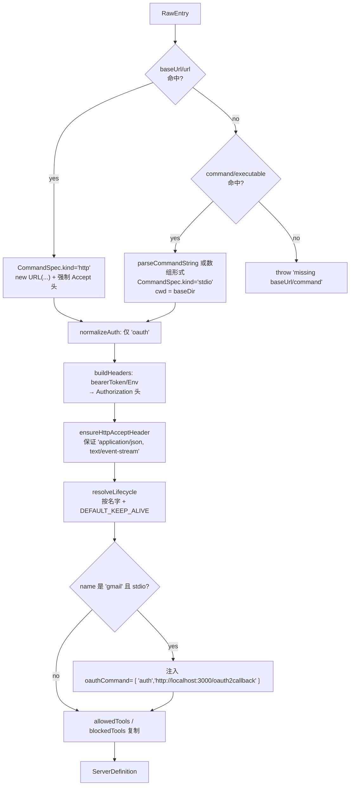
```mermaid
graph TD
  RAW[RawEntry] --> CMD{"baseUrl/url<br/>命中?"}
  CMD -->|yes| HTTP["CommandSpec.kind='http'<br/>new URL(...) + 强制 Accept 头"]
  CMD -->|no| STDIO{"command/executable<br/>命中?"}
  STDIO -->|yes| STDIO1["parseCommandString 或数组形式<br/>CommandSpec.kind='stdio'<br/>cwd = baseDir"]
  STDIO -->|no| ERR["throw 'missing baseUrl/command'"]
  HTTP --> AUTH["normalizeAuth: 仅 'oauth'"]
  STDIO1 --> AUTH
  AUTH --> HEAD["buildHeaders: bearerToken/Env<br/>→ Authorization 头"]
  HEAD --> ACC["ensureHttpAcceptHeader<br/>保证 'application/json, text/event-stream'"]
  ACC --> LIFE["resolveLifecycle<br/>按名字 + DEFAULT_KEEP_ALIVE"]
  LIFE --> GMAIL{"name 是 'gmail' 且 stdio?"}
  GMAIL -->|yes| GMAILDEF["注入 oauthCommand=❲'auth','http://localhost:3000/oauth2callback'❳"]
  GMAIL -->|no| FILT
  GMAILDEF --> FILT["allowedTools / blockedTools 复制"]
  FILT --> OUT[ServerDefinition]
```

几个值得注意的细节：

- **`ensureHttpAcceptHeader`**：MCP 远端要求 `Accept` 头同时包含 `application/json` 与 `text/event-stream`，因此即使用户没显式设置，规范化阶段也会强制写入（[src/config-normalize.ts:146-160]()）。
- **`baseDir`**：stdio 命令的 `cwd` 直接取自 `entry baseDir`——也就是声明该 entry 的 JSON 文件所在目录。这样 `npx -y …` 类命令能继承调用者期望的工作目录而不是当前 shell 的 cwd。
- **`auth` 仅识别 `'oauth'`**：其它字符串会被抹成 `undefined`，避免上游编辑器的自定义值传染到 OAuth 流程（[src/config-normalize.ts:79-87]()）。
- **gmail 特例**：在没有显式 `oauthCommand` 时为 stdio 形式的 gmail 注入 `auth http://localhost:3000/oauth2callback`，对应 gmail-mcp 包的内部约定（[src/config-normalize.ts:50-54]()）。
- **`source` vs `sources`**：`source` 是当前胜出的来源，`sources` 是所有出现过该名字的位置。`mcporter list --verbose` / `--sources` 会展示后者用于排查"为什么 Cursor 改了配置但 mcporter 没生效"。

Sources: [src/config-normalize.ts:5-160](../../../project-repos/mcporter/src/config-normalize.ts#L5-L160), [src/config-schema.ts:147-191](../../../project-repos/mcporter/src/config-schema.ts#L147-L191)

<details class="source-snippets">
<summary>引用源码</summary>

<!-- source-snippets:start -->

#### `src/config-normalize.ts:5-160`

```typescript
export function normalizeServerEntry(
  name: string,
  raw: RawEntry,
  baseDir: string,
  source: ServerSource,
  sources: readonly ServerSource[]
): ServerDefinition {
  const description = raw.description;
  const env = raw.env ? { ...raw.env } : undefined;
  const auth = normalizeAuth(raw.auth);
  const tokenCacheDir = normalizePath(raw.tokenCacheDir ?? raw.token_cache_dir);
  const clientName = raw.clientName ?? raw.client_name;
  const oauthRedirectUrl = raw.oauthRedirectUrl ?? raw.oauth_redirect_url ?? undefined;
  const oauthScope = raw.oauthScope ?? raw.oauth_scope ?? undefined;
  const oauthCommandRaw = raw.oauthCommand ?? raw.oauth_command;
  const oauthCommand = oauthCommandRaw ? { args: [...oauthCommandRaw.args] } : undefined;
  const headers = buildHeaders(raw);

  const httpUrl = getUrl(raw);
  const stdio = getCommand(raw);

  let command: CommandSpec;

  if (httpUrl) {
    command = {
      kind: 'http',
      url: new URL(httpUrl),
      headers: ensureHttpAcceptHeader(headers),
    };
  } else if (stdio) {
    command = {
      kind: 'stdio',
      command: stdio.command,
      args: stdio.args,
      cwd: baseDir,
    };
  } else {
    throw new Error(`Server '${name}' is missing a baseUrl/url or command definition in mcporter.json`);
  }

  const lifecycle = resolveLifecycle(name, raw.lifecycle, command);
  const logging = normalizeLogging(raw.logging);
  const allowedTools = raw.allowedTools ?? raw.allowed_tools;
  const blockedTools = raw.blockedTools ?? raw.blocked_tools;

  const defaultedOauthCommand =
    !oauthCommand && name.toLowerCase() === 'gmail' && command.kind === 'stdio'
      ? { args: ['auth', 'http://localhost:3000/oauth2callback'] }
      : oauthCommand;

  return {
    name,
    description,
    command,
    env,
    auth,
    tokenCacheDir,
    clientName,
    oauthRedirectUrl,
    oauthScope,
    oauthCommand: defaultedOauthCommand,
    source,
    sources,
    lifecycle,
    logging,
    ...(allowedTools !== undefined ? { allowedTools: [...allowedTools] } : {}),
    ...(blockedTools !== undefined ? { blockedTools: [...blockedTools] } : {}),
  };
}

export const __configInternals = {
  ensureHttpAcceptHeader,
};

function normalizeAuth(auth: string | undefined): string | undefined {
  if (!auth) {
    return undefined;
  }
  if (auth.toLowerCase() === 'oauth') {
    return 'oauth';
  }
  return undefined;
}

function normalizePath(input: string | undefined): string | undefined {
  if (!input) {
    return undefined;
  }
  return expandHome(input);
}

function getUrl(raw: RawEntry): string | undefined {
  return raw.baseUrl ?? raw.base_url ?? raw.url ?? raw.serverUrl ?? raw.server_url ?? undefined;
}

function getCommand(raw: RawEntry): { command: string; args: string[] } | undefined {
  const commandValue = raw.command ?? raw.executable;
  if (Array.isArray(commandValue)) {
    if (commandValue.length === 0 || typeof commandValue[0] !== 'string') {
      return undefined;
    }
    return { command: commandValue[0], args: commandValue.slice(1) };
  }
  if (typeof commandValue === 'string' && commandValue.length > 0) {
    const args = Array.isArray(raw.args) ? raw.args : [];
    if (args.length > 0) {
      return { command: commandValue, args };
    }
    const tokens = parseCommandString(commandValue);
    if (tokens.length === 0) {
      return undefined;
    }
    const [commandToken, ...rest] = tokens;
    if (!commandToken) {
      return undefined;
    }
    return { command: commandToken, args: rest };
  }
  return undefined;
}
... snippet truncated ...
```

#### `src/config-schema.ts:147-191`

```typescript
export type CommandSpec = HttpCommand | StdioCommand;

export interface ServerSource {
  readonly kind: 'local' | 'import';
  readonly path: string;
  readonly importKind?: ImportKind;
}

export type ServerLifecycle =
  | {
      mode: 'keep-alive';
      idleTimeoutMs?: number;
    }
  | {
      mode: 'ephemeral';
    };

export interface ServerLoggingOptions {
  readonly daemon?: {
    readonly enabled?: boolean;
  };
}

export interface ServerDefinition {
  readonly name: string;
  readonly description?: string;
  readonly command: CommandSpec;
  readonly env?: Record<string, string>;
  readonly auth?: string;
  readonly tokenCacheDir?: string;
  readonly clientName?: string;
  readonly oauthRedirectUrl?: string;
  readonly oauthScope?: string;
  readonly oauthCommand?: {
    readonly args: string[];
  };
  readonly source?: ServerSource;
  readonly sources?: readonly ServerSource[];
  readonly lifecycle?: ServerLifecycle;
  readonly logging?: ServerLoggingOptions;
  /** When specified, only these exact tool names are exposed. Empty array blocks all tools. */
  readonly allowedTools?: readonly string[];
  /** When specified, these exact tool names are hidden and blocked. Cannot be combined with allowedTools. */
  readonly blockedTools?: readonly string[];
}
```

<!-- source-snippets:end -->
</details>
## 环境变量与占位符

`env.ts` 提供三种 token：

| 形式 | 行为 | 入口 |
|------|------|------|
| `${VAR}` | 在 headers 里替换为 `process.env[VAR]`；缺失则抛出"required for MCP header substitution" | `resolveEnvPlaceholders` ([src/env.ts:50-76]()) |
| `${VAR:-fallback}` | env 缺失时使用 fallback | `resolveEnvValue` 走 `ENV_DEFAULT_PATTERN` ([src/env.ts:23-47]()) |
| `$env:VAR` | header / env 中的"必须存在"语义；缺失即抛 | `resolveEnvPlaceholders` 前缀分支 ([src/env.ts:51-58]()) |

`withEnvOverrides(envMap, fn)` 在调用 stdio MCP 时按需把 `env` 临时塞进 `process.env`（已有同名 key 的不覆盖），fn 退出时清理（[src/env.ts:79-107]()）。`expandHome('~/...')` 处理用户主目录展开（[src/env.ts:7-20]()），用于 `tokenCacheDir`、`MCPORTER_CONFIG` 等路径字段。
Sources: [src/env.ts:1-107](../../../project-repos/mcporter/src/env.ts#L1-L107)

<details class="source-snippets">
<summary>引用源码</summary>

<!-- source-snippets:start -->

#### `src/env.ts:1-107`

```typescript
import os from 'node:os';

const ENV_DEFAULT_PATTERN = /^\$\{([A-Za-z_][A-Za-z0-9_]*)(?::-|:|-)?([^}]*)\}$/;
const ENV_INTERPOLATION_PATTERN = /\\?\$\{([A-Za-z_][A-Za-z0-9_]*)\}/g;
const ENV_DIRECT_PREFIX = '$env:';

// expandHome replaces a leading '~' with the current user's home directory.
export function expandHome(input: string): string {
  if (!input.startsWith('~')) {
    return input;
  }
  const home = os.homedir();
  if (input === '~') {
    return home;
  }
  if (input.startsWith('~/')) {
    return `${home}/${input.slice(2)}`;
  }
  return input;
}

// resolveEnvValue interprets ${VAR:-default} syntax and other primitive values for env overrides.
export function resolveEnvValue(raw: unknown): string {
  if (typeof raw !== 'string') {
    return String(raw);
  }

  const match = ENV_DEFAULT_PATTERN.exec(raw);
  if (match) {
    const envName = match[1];
    const defaultValue = match[2] ?? '';
    if (!envName) {
      return raw;
    }
    const existing = process.env[envName];
    if (existing && existing !== '') {
      return existing;
    }
    return defaultValue;
  }

  if (raw.startsWith('$')) {
    return resolveEnvPlaceholders(raw);
  }

  return raw;
}

// resolveEnvPlaceholders replaces ${VAR} or $env:VAR references using process.env, enforcing required values.
export function resolveEnvPlaceholders(value: string): string {
  if (value.startsWith(ENV_DIRECT_PREFIX)) {
    const envName = value.slice(ENV_DIRECT_PREFIX.length);
    const envValue = process.env[envName];
    if (envValue === undefined) {
      throw new Error(`Environment variable '${envName}' is required for MCP header substitution.`);
    }
    return envValue;
  }

  const missing = new Set<string>();
  const replaced = value.replace(ENV_INTERPOLATION_PATTERN, (placeholder, envName: string) => {
    const envValue = process.env[envName];
    if (envValue === undefined) {
      missing.add(envName);
      return placeholder;
    }
    return envValue;
  });

  if (missing.size > 0) {
    const names = [...missing].toSorted().join(', ');
    throw new Error(`Environment variable(s) ${names} must be set for MCP header substitution.`);
  }

  return replaced;
}

// withEnvOverrides temporarily populates process.env keys while executing the provided callback.
export async function withEnvOverrides<T>(
  envOverrides: Record<string, string> | undefined,
  fn: () => Promise<T> | T
): Promise<T> {
  if (!envOverrides || Object.keys(envOverrides).length === 0) {
    return await fn();
  }

  const applied: string[] = [];
  for (const [key, rawValue] of Object.entries(envOverrides)) {
    if (process.env[key]) {
      continue;
    }
    const resolved = resolveEnvValue(rawValue);
    if (resolved === '') {
      continue;
    }
    process.env[key] = resolved;
    applied.push(key);
  }

  try {
    return await fn();
  } finally {
    for (const key of applied) {
      delete process.env[key];
    }
  }
}
```

<!-- source-snippets:end -->
</details>
## `mcporter config` 命令

`mcporter config <subcommand>` 是把上面这套加载/规范化流程暴露成可读写操作的命令族，路由在 [src/cli/config-command.ts:12-67]()：

| 子命令 | 入口文件 | 主要语义 |
|--------|----------|----------|
| `list` | `src/cli/config/list.ts` | 默认仅列本地，TTY 下额外汇总每个 import 来源；`--source import` 切换 |
| `get` | `src/cli/config/get.ts` | 模糊匹配名字，文本/JSON 输出 |
| `add` | `src/cli/config/add.ts` | `--scope home/project` / `--persist <path>` 选写入位置 ([add.ts:87-101]()) |
| `remove` | `src/cli/config/remove.ts` | 反向操作，支持模糊纠错 |
| `import` | `src/cli/config/import.ts` | 把某个 IDE 的 entries 拷到本地 |
| `login` / `logout` | `src/cli/config/auth.ts` | 走 `auth-command` 同款 OAuth |
| `doctor` | `src/cli/config/doctor.ts` | 一键体检（路径、JSONC、env 占位符） |

`config add` 的写入路径解析尤其重要：`--persist` 优先 → `--scope home/project` → `loadOptions.configPath` → `<root>/config/mcporter.json`。这意味着 `config add` 默认写到 project，不会污染用户 home。
Sources: [src/cli/config-command.ts:12-67](../../../project-repos/mcporter/src/cli/config-command.ts#L12-L67), [src/cli/config/add.ts:87-101](../../../project-repos/mcporter/src/cli/config/add.ts#L87-L101)

<details class="source-snippets">
<summary>引用源码</summary>

<!-- source-snippets:start -->

#### `src/cli/config-command.ts:12-67`

```typescript
export async function handleConfigCli(options: ConfigCliOptions, args: string[]): Promise<void> {
  const initialToken = args[0];
  if (args.length === 0 || (initialToken && isHelpToken(initialToken))) {
    printConfigHelp();
    return;
  }

  const subcommand = args.shift();
  if (!subcommand) {
    printConfigHelp();
    return;
  }

  if (subcommand === 'help') {
    const target = args[0];
    if (!target || isHelpToken(target)) {
      printConfigHelp();
    } else {
      printConfigHelp(target);
    }
    return;
  }

  if (consumeInlineHelpTokens(args)) {
    printConfigHelp(subcommand);
    return;
  }

  switch (subcommand as ConfigSubcommand) {
    case 'list':
      await handleListCommand(options, args);
      return;
    case 'get':
      await handleGetCommand(options, args);
      return;
    case 'add':
      await handleAddCommand(options, args);
      return;
    case 'remove':
      await handleRemoveCommand(options, args);
      return;
    case 'import':
      await handleImportCommand(options, args);
      return;
    case 'login':
      await handleLoginCommand(options, args);
      return;
    case 'logout':
      await handleLogoutCommand(options, args);
      return;
    case 'doctor':
      await handleDoctorCommand(options, args);
      return;
    default:
      throw new CliUsageError(`Unknown config subcommand '${subcommand}'. Run 'mcporter config --help'.`);
  }
```

#### `src/cli/config/add.ts:87-101`

```typescript
export function resolveWriteTarget(flags: AddFlags, loadOptions: LoadConfigOptions, rootDir: string): string {
  if (flags.persistPath) {
    return path.resolve(expandHome(flags.persistPath));
  }
  if (flags.scope === 'home') {
    return path.join(os.homedir(), '.mcporter', 'mcporter.json');
  }
  if (flags.scope === 'project') {
    return path.resolve(rootDir, 'config', 'mcporter.json');
  }
  if (loadOptions.configPath) {
    return path.resolve(expandHome(loadOptions.configPath));
  }
  return path.resolve(rootDir, 'config', 'mcporter.json');
}
```

<!-- source-snippets:end -->
</details>
## 失败模式与降级

`readConfigFile` 在隐式打开时对两类错误做降级，避免开发机上没有任何配置就直接报错：

```ts
if (!explicit && isMissingConfigError(error)) return { mcpServers: {} };
if (!explicit && isSyntaxError(error)) {
  warnConfigFallback(configPath, error);  // 仅一次
  return { mcpServers: {} };
}
```

外部 imports 文件遇到 JSON SyntaxError / TOML 解析错误（带 `fromTOML` 标记）也会被忽略（[src/config/imports/external.ts:276-283]()）。这个策略让一台机器上某个 IDE 的配置坏掉时，mcporter 仍然能继续工作。
Sources: [src/config/read-config.ts:43-59](../../../project-repos/mcporter/src/config/read-config.ts#L43-L59), [src/config/imports/external.ts:276-284](../../../project-repos/mcporter/src/config/imports/external.ts#L276-L284)

<details class="source-snippets">
<summary>引用源码</summary>

<!-- source-snippets:start -->

#### `src/config/read-config.ts:43-59`

```typescript
export async function readConfigFile(configPath: string, explicit: boolean): Promise<RawConfig> {
  if (!explicit && !(await pathExistsAsync(configPath))) {
    return { mcpServers: {} };
  }
  try {
    const buffer = await fs.readFile(configPath, 'utf8');
    return RawConfigSchema.parse(parseJsonBuffer(buffer));
  } catch (error) {
    if (!explicit && isMissingConfigError(error)) {
      return { mcpServers: {} };
    }
    if (!explicit && isSyntaxError(error)) {
      warnConfigFallback(configPath, error);
      return { mcpServers: {} };
    }
    throw error;
  }
```

#### `src/config/imports/external.ts:276-284`

```typescript
function shouldIgnoreParseError(error: unknown): boolean {
  if (error instanceof SyntaxError) {
    return true;
  }
  if (!error || typeof error !== 'object') {
    return false;
  }
  return 'fromTOML' in error;
}
```

<!-- source-snippets:end -->
</details>
## 一图总结

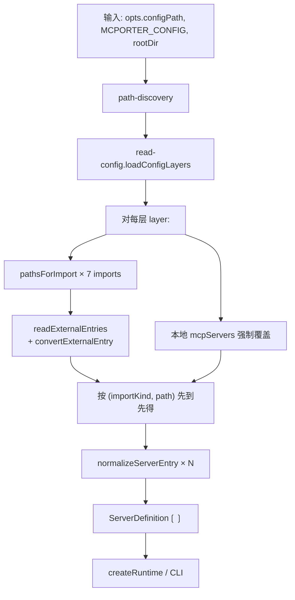
```mermaid
graph TD
  Inputs["输入: opts.configPath, MCPORTER_CONFIG, rootDir"]
  Inputs --> Path["path-discovery"]
  Path --> Layers["read-config.loadConfigLayers"]
  Layers --> Loop1["对每层 layer:"]
  Loop1 --> Imp["pathsForImport × 7 imports"]
  Imp --> Read["readExternalEntries<br/>+ convertExternalEntry"]
  Read --> Merge["按 (importKind, path) 先到先得"]
  Loop1 --> Local["本地 mcpServers 强制覆盖"]
  Local --> Merge
  Merge --> Norm["normalizeServerEntry × N"]
  Norm --> Defs["ServerDefinition❲❳"]
  Defs --> Runtime["createRuntime / CLI"]
```

Sources: [src/config.ts:36-104](../../../project-repos/mcporter/src/config.ts#L36-L104), [src/config/read-config.ts:14-41](../../../project-repos/mcporter/src/config/read-config.ts#L14-L41), [src/config-normalize.ts:5-73](../../../project-repos/mcporter/src/config-normalize.ts#L5-L73)

<details class="source-snippets">
<summary>引用源码</summary>

<!-- source-snippets:start -->

#### `src/config.ts:36-104`

```typescript
export async function loadServerDefinitions(options: LoadConfigOptions = {}): Promise<ServerDefinition[]> {
  const rootDir = options.rootDir ?? process.cwd();
  const layers = await loadConfigLayers(options, rootDir);

  const merged = new Map<string, { raw: RawEntry; baseDir: string; source: ServerSource; sources: ServerSource[] }>();

  for (const layer of layers) {
    const configuredImports = layer.config.imports;
    const imports = configuredImports
      ? configuredImports.length === 0
        ? configuredImports
        : [...configuredImports, ...DEFAULT_IMPORTS.filter((kind) => !configuredImports.includes(kind))]
      : DEFAULT_IMPORTS;

    for (const importKind of imports) {
      const candidates = pathsForImport(importKind, rootDir);
      for (const candidate of candidates) {
        const resolved = expandHome(candidate);
        const entries = await readExternalEntries(resolved, { projectRoot: rootDir, importKind: importKind });
        if (!entries) {
          continue;
        }
        for (const [name, rawEntry] of entries) {
          if (merged.has(name)) {
            continue;
          }
          const source: ServerSource = { kind: 'import', path: resolved, importKind };
          const existing = merged.get(name);
          // Keep the first-seen source as canonical while tracking all alternates
          if (existing) {
            existing.sources.push(source);
            continue;
          }
          merged.set(name, {
            raw: rawEntry,
            baseDir: path.dirname(resolved),
            source,
            sources: [source],
          });
        }
      }
    }

    for (const [name, entryRaw] of Object.entries(layer.config.mcpServers)) {
      const source: ServerSource = { kind: 'local', path: layer.path };
      const parsed = RawEntrySchema.parse(entryRaw);
      const existing = merged.get(name);
      // Local definitions win; stash any prior imports after the local path
      if (existing) {
        const sources = [source, ...existing.sources];
        merged.set(name, { raw: parsed, baseDir: path.dirname(layer.path), source, sources });
        continue;
      }
      merged.set(name, {
        raw: parsed,
        baseDir: path.dirname(layer.path),
        source,
        sources: [source],
      });
    }
  }

  const servers: ServerDefinition[] = [];
  for (const [name, { raw, baseDir: entryBaseDir, source, sources }] of merged) {
    servers.push(normalizeServerEntry(name, raw, entryBaseDir, source, sources));
  }

  return servers;
}
```

#### `src/config/read-config.ts:14-41`

```typescript
export async function loadConfigLayers(options: LoadConfigOptions, rootDir: string): Promise<ConfigLayer[]> {
  const explicitPath = options.configPath ?? process.env.MCPORTER_CONFIG;
  if (explicitPath) {
    const resolvedPath = path.resolve(expandHome(explicitPath.trim()));
    const config = await readConfigFile(resolvedPath, true);
    return [{ config, path: resolvedPath, explicit: true }];
  }

  const layers: ConfigLayer[] = [];

  const homeCandidates = homeConfigCandidates();
  const existingHome = homeCandidates.find((candidate) => pathExists(candidate));
  if (existingHome) {
    layers.push({ config: await readConfigFile(existingHome, false), path: existingHome, explicit: false });
  }

  const projectPath = path.resolve(rootDir, 'config', 'mcporter.json');
  if (pathExists(projectPath)) {
    layers.push({ config: await readConfigFile(projectPath, false), path: projectPath, explicit: false });
  }

  if (layers.length === 0) {
    // Preserve prior behavior: a missing default config returns an empty list and assumes the project path.
    layers.push({ config: { mcpServers: {} }, path: projectPath, explicit: false });
  }

  return layers;
}
```

#### `src/config-normalize.ts:5-73`

```typescript
export function normalizeServerEntry(
  name: string,
  raw: RawEntry,
  baseDir: string,
  source: ServerSource,
  sources: readonly ServerSource[]
): ServerDefinition {
  const description = raw.description;
  const env = raw.env ? { ...raw.env } : undefined;
  const auth = normalizeAuth(raw.auth);
  const tokenCacheDir = normalizePath(raw.tokenCacheDir ?? raw.token_cache_dir);
  const clientName = raw.clientName ?? raw.client_name;
  const oauthRedirectUrl = raw.oauthRedirectUrl ?? raw.oauth_redirect_url ?? undefined;
  const oauthScope = raw.oauthScope ?? raw.oauth_scope ?? undefined;
  const oauthCommandRaw = raw.oauthCommand ?? raw.oauth_command;
  const oauthCommand = oauthCommandRaw ? { args: [...oauthCommandRaw.args] } : undefined;
  const headers = buildHeaders(raw);

  const httpUrl = getUrl(raw);
  const stdio = getCommand(raw);

  let command: CommandSpec;

  if (httpUrl) {
    command = {
      kind: 'http',
      url: new URL(httpUrl),
      headers: ensureHttpAcceptHeader(headers),
    };
  } else if (stdio) {
    command = {
      kind: 'stdio',
      command: stdio.command,
      args: stdio.args,
      cwd: baseDir,
    };
  } else {
    throw new Error(`Server '${name}' is missing a baseUrl/url or command definition in mcporter.json`);
  }

  const lifecycle = resolveLifecycle(name, raw.lifecycle, command);
  const logging = normalizeLogging(raw.logging);
  const allowedTools = raw.allowedTools ?? raw.allowed_tools;
  const blockedTools = raw.blockedTools ?? raw.blocked_tools;

  const defaultedOauthCommand =
    !oauthCommand && name.toLowerCase() === 'gmail' && command.kind === 'stdio'
      ? { args: ['auth', 'http://localhost:3000/oauth2callback'] }
      : oauthCommand;

  return {
    name,
    description,
    command,
    env,
    auth,
    tokenCacheDir,
    clientName,
    oauthRedirectUrl,
    oauthScope,
    oauthCommand: defaultedOauthCommand,
    source,
    sources,
    lifecycle,
    logging,
    ...(allowedTools !== undefined ? { allowedTools: [...allowedTools] } : {}),
    ...(blockedTools !== undefined ? { blockedTools: [...blockedTools] } : {}),
  };
}
```

<!-- source-snippets:end -->
</details>
## 相关页面

- [项目概览](#overview)
- [系统架构](#system-architecture)
- [运行时与传输层](#runtime-transport)


---


<a id='runtime-transport'></a>

<details>
<summary>相关源文件</summary>

生成本页时使用的主要源文件：

- [src/runtime.ts](../../../project-repos/mcporter/src/runtime.ts)
- [src/runtime/transport.ts](../../../project-repos/mcporter/src/runtime/transport.ts)
- [src/runtime/oauth.ts](../../../project-repos/mcporter/src/runtime/oauth.ts)
- [src/runtime/utils.ts](../../../project-repos/mcporter/src/runtime/utils.ts)
- [src/runtime/errors.ts](../../../project-repos/mcporter/src/runtime/errors.ts)
- [src/server-proxy.ts](../../../project-repos/mcporter/src/server-proxy.ts)
- [src/result-utils.ts](../../../project-repos/mcporter/src/result-utils.ts)
- [src/tool-filters.ts](../../../project-repos/mcporter/src/tool-filters.ts)
- [src/error-classifier.ts](../../../project-repos/mcporter/src/error-classifier.ts)
- [src/sdk-patches.ts](../../../project-repos/mcporter/src/sdk-patches.ts)
- [src/runtime-process-utils.ts](../../../project-repos/mcporter/src/runtime-process-utils.ts)
- [src/runtime-header-utils.ts](../../../project-repos/mcporter/src/runtime-header-utils.ts)

</details>

# 运行时与传输层

Runtime 是 mcporter 库的核心，**只接受 `ServerDefinition`，对外暴露统一的 `Runtime` 接口**。它在 `@modelcontextprotocol/sdk` 提供的三种 Client Transport（StreamableHTTP / SSE / stdio）之上做了连接池、过滤、超时、OAuth 重试、传输回退、错误分类与连接失效自动重置。本页按"创建 Runtime → 连接 Server → 调用 Tool → 关闭"的全生命周期讲解。

## 公共入口

`src/index.ts` 暴露的所有运行时相关 symbol：

```ts
export type { CallOptions, ListToolsOptions, Runtime, RuntimeLogger, ServerToolInfo } from './runtime.js';
export { callOnce, createRuntime } from './runtime.js';
export type { ServerProxyOptions } from './server-proxy.js';
export { createServerProxy } from './server-proxy.js';
export type { CallResult, ConnectionIssue, ImageContent } from './result-utils.js';
export { createCallResult, describeConnectionIssue, wrapCallResult } from './result-utils.js';
```

`createRuntime` / `callOnce` 二选一即可：前者维护连接池，后者一次调用就关闭。
Sources: [src/index.ts:1-9](../../../project-repos/mcporter/src/index.ts#L1-L9), [src/runtime.ts:77-105](../../../project-repos/mcporter/src/runtime.ts#L77-L105)

<details class="source-snippets">
<summary>引用源码</summary>

<!-- source-snippets:start -->

#### `src/index.ts:1-9`

```typescript
export type { CommandSpec, ServerDefinition } from './config.js';
export { loadServerDefinitions } from './config.js';
export type { CallResult, ConnectionIssue, ImageContent } from './result-utils.js';
export { createCallResult, describeConnectionIssue, wrapCallResult } from './result-utils.js';
export type { CallOptions, ListToolsOptions, Runtime, RuntimeLogger, ServerToolInfo } from './runtime.js';
export { callOnce, createRuntime } from './runtime.js';
export type { ServerProxyOptions } from './server-proxy.js';
export { createServerProxy } from './server-proxy.js';
```

#### `src/runtime.ts:77-105`

```typescript
export async function createRuntime(options: RuntimeOptions = {}): Promise<Runtime> {
  // Build the runtime with either the provided server list or the config file contents.
  const servers =
    options.servers ??
    (await loadServerDefinitions({
      configPath: options.configPath,
      rootDir: options.rootDir,
    }));

  const runtime = new McpRuntime(servers, options);
  return runtime;
}

// callOnce connects to a server, invokes a single tool, and disposes the connection immediately.
export async function callOnce(params: {
  server: string;
  toolName: string;
  args?: Record<string, unknown>;
  configPath?: string;
}): Promise<unknown> {
  const runtime = await createRuntime({ configPath: params.configPath });
  try {
    return await runtime.callTool(params.server, params.toolName, {
      args: params.args,
    });
  } finally {
    await runtime.close(params.server);
  }
}
```

<!-- source-snippets:end -->
</details>
## `createRuntime` 与 `McpRuntime`

`createRuntime` 既可以从 `configPath` / `rootDir` 自动加载 `ServerDefinition[]`，也可以接受调用方提供的 `servers` 数组（[src/runtime.ts:77-88]()）。底层实现 `McpRuntime` 在 `src/runtime.ts:107-125` 一次性完成三件事：

1. 对每个 server 跑 `validateToolFilters`（同时声明 allowed + blocked 直接抛错）。
2. 用 `Map<string, ServerDefinition>` 索引按名字快速取定义。
3. 解析 `clientInfo`（默认 `{ name: 'mcporter', version: <package.json> }`），构造默认 console logger（受 `MCPORTER_LOG_LEVEL` 控制）。

`Runtime` 接口契约：

```ts
interface Runtime {
  listServers(): string[];
  getDefinitions(): ServerDefinition[];
  getDefinition(server: string): ServerDefinition;
  registerDefinition(def, opts?): void;
  listTools(server, opts?): Promise<ServerToolInfo[]>;
  callTool(server, toolName, opts?): Promise<unknown>;
  listResources(server, opts?): Promise<unknown>;
  connect(server): Promise<ClientContext>;
  close(server?): Promise<void>;
}
```

Sources: [src/runtime.ts:57-67](../../../project-repos/mcporter/src/runtime.ts#L57-L67), [src/runtime.ts:107-153](../../../project-repos/mcporter/src/runtime.ts#L107-L153)

<details class="source-snippets">
<summary>引用源码</summary>

<!-- source-snippets:start -->

#### `src/runtime.ts:57-67`

```typescript
export interface Runtime {
  listServers(): string[];
  getDefinitions(): ServerDefinition[];
  getDefinition(server: string): ServerDefinition;
  registerDefinition(definition: ServerDefinition, options?: { overwrite?: boolean }): void;
  listTools(server: string, options?: ListToolsOptions): Promise<ServerToolInfo[]>;
  callTool(server: string, toolName: string, options?: CallOptions): Promise<unknown>;
  listResources(server: string, options?: Partial<ListResourcesRequest['params']>): Promise<unknown>;
  connect(server: string): Promise<ClientContext>;
  close(server?: string): Promise<void>;
}
```

#### `src/runtime.ts:107-153`

```typescript
class McpRuntime implements Runtime {
  private readonly definitions: Map<string, ServerDefinition>;
  private readonly clients = new Map<string, Promise<ClientContext>>();
  private readonly logger: RuntimeLogger;
  private readonly clientInfo: { name: string; version: string };
  private readonly oauthTimeoutMs?: number;

  constructor(servers: ServerDefinition[], options: RuntimeOptions = {}) {
    for (const server of servers) {
      validateToolFilters(server.name, server);
    }
    this.definitions = new Map(servers.map((entry) => [entry.name, entry]));
    this.logger = options.logger ?? createConsoleLogger();
    this.clientInfo = options.clientInfo ?? {
      name: PACKAGE_NAME,
      version: CLIENT_VERSION,
    };
    this.oauthTimeoutMs = options.oauthTimeoutMs;
  }

  // listServers returns configured names sorted alphabetically for stable CLI output.
  listServers(): string[] {
    return [...this.definitions.keys()].toSorted((a, b) => a.localeCompare(b));
  }

  // getDefinitions exposes raw server metadata to consumers such as the CLI.
  getDefinitions(): ServerDefinition[] {
    return [...this.definitions.values()];
  }

  // getDefinition throws when the caller requests an unknown server name.
  getDefinition(server: string): ServerDefinition {
    const definition = this.definitions.get(server);
    if (!definition) {
      throw new Error(`Unknown MCP server '${server}'.`);
    }
    return definition;
  }

  registerDefinition(definition: ServerDefinition, options: { overwrite?: boolean } = {}): void {
    validateToolFilters(definition.name, definition);
    if (!options.overwrite && this.definitions.has(definition.name)) {
      throw new Error(`MCP server '${definition.name}' already exists.`);
    }
    this.definitions.set(definition.name, definition);
    this.clients.delete(definition.name);
  }
```

<!-- source-snippets:end -->
</details>
### 连接池

`McpRuntime.connect(server)` 的核心数据结构是 `clients: Map<string, Promise<ClientContext>>`（[src/runtime.ts:109]()）。注意值是 **Promise**，不是已经 resolve 的对象——这样并发的 `connect` 调用会复用同一个 in-flight 连接，避免双开 stdio 子进程或重复触发 OAuth。

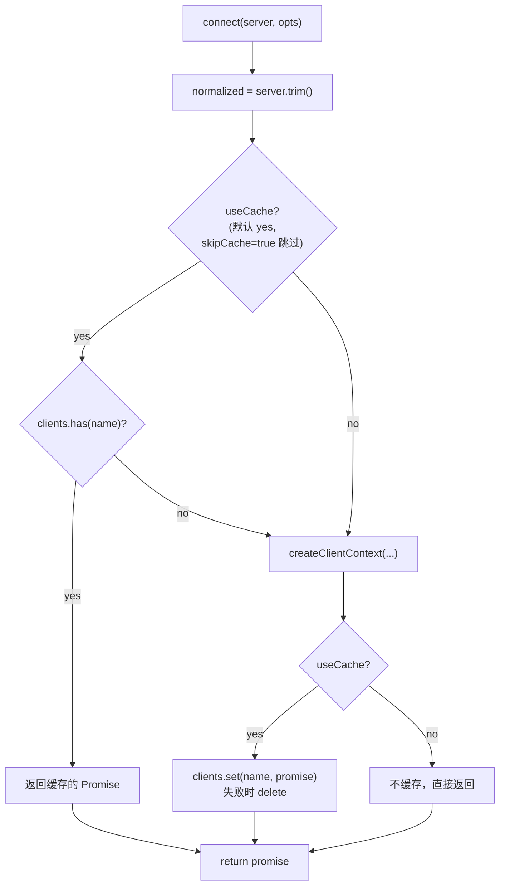
```mermaid
flowchart TD
  Call["connect(server, opts)"] --> Norm["normalized = server.trim()"]
  Norm --> Cache{"useCache?<br/>(默认 yes,<br/>skipCache=true 跳过)"}
  Cache -->|yes| Have{"clients.has(name)?"}
  Have -->|yes| Reuse["返回缓存的 Promise"]
  Have -->|no| Build["createClientContext(...)"]
  Cache -->|no| Build
  Build --> Store{"useCache?"}
  Store -->|yes| Set["clients.set(name, promise)<br/>失败时 delete"]
  Store -->|no| Direct["不缓存，直接返回"]
  Set --> Return["return promise"]
  Reuse --> Return
  Direct --> Return
```

`useCache = options.skipCache !== true && options.maxOAuthAttempts === undefined`：OAuth 流程会显式传 `maxOAuthAttempts: 0` / `skipCache: true` 来跳过缓存，避免 in-flight OAuth 把缓存搞坏（[src/runtime.ts:243-279]()）。
Sources: [src/runtime.ts:243-279](../../../project-repos/mcporter/src/runtime.ts#L243-L279)

<details class="source-snippets">
<summary>引用源码</summary>

<!-- source-snippets:start -->

#### `src/runtime.ts:243-279`

```typescript
  async connect(server: string, options: ConnectOptions = {}): Promise<ClientContext> {
    // Reuse cached connections unless the caller explicitly opted out.
    const normalized = server.trim();

    const useCache = options.skipCache !== true && options.maxOAuthAttempts === undefined;

    if (useCache) {
      const existing = this.clients.get(normalized);
      if (existing) {
        return existing;
      }
    }

    const definition = this.definitions.get(normalized);
    if (!definition) {
      throw new Error(`Unknown MCP server '${normalized}'.`);
    }

    const connection = createClientContext(definition, this.logger, this.clientInfo, {
      maxOAuthAttempts: options.maxOAuthAttempts,
      oauthTimeoutMs: this.oauthTimeoutMs ?? OAUTH_CODE_TIMEOUT_MS,
      onDefinitionPromoted: (promoted) => this.definitions.set(promoted.name, promoted),
      allowCachedAuth: options.allowCachedAuth,
    });

    if (useCache) {
      this.clients.set(normalized, connection);
      try {
        return await connection;
      } catch (error) {
        this.clients.delete(normalized);
        throw error;
      }
    }

    return connection;
  }
```

<!-- source-snippets:end -->
</details>
### `listTools` 与过滤

`listTools(server, opts)` 在 [src/runtime.ts:156-193]() 实现。值得注意的几个点：

- 默认 `autoAuthorize: true`。设为 false 时强制 `maxOAuthAttempts: 0` + `skipCache: true`，让 list 命令不引发完整 OAuth 流程。
- 用 cursor + `nextCursor` 循环读完全部页。
- 返回前调用 `filterTools(tools, definition)`，根据 `allowedTools` / `blockedTools` 过滤（[src/tool-filters.ts:25-30]()）。
- `autoAuthorize=false` 模式会**主动**关闭 client / transport / oauthSession，因为这种模式下 connect 不进缓存。

```ts
return filterTools(tools, this.definitions.get(server.trim()));
```

Sources: [src/runtime.ts:156-193](../../../project-repos/mcporter/src/runtime.ts#L156-L193), [src/tool-filters.ts:1-30](../../../project-repos/mcporter/src/tool-filters.ts#L1-L30)

<details class="source-snippets">
<summary>引用源码</summary>

<!-- source-snippets:start -->

#### `src/runtime.ts:156-193`

```typescript
  async listTools(server: string, options: ListToolsOptions = {}): Promise<ServerToolInfo[]> {
    // Toggle auto authorization so list can run without forcing OAuth flows.
    const autoAuthorize = options.autoAuthorize !== false;
    const context = await this.connect(server, {
      maxOAuthAttempts: autoAuthorize ? undefined : 0,
      skipCache: !autoAuthorize,
      allowCachedAuth: options.allowCachedAuth,
    });
    try {
      const tools: ServerToolInfo[] = [];
      let cursor: string | undefined;
      do {
        const response = await context.client.listTools(cursor ? { cursor } : undefined);
        tools.push(
          ...(response.tools ?? []).map((tool) => ({
            name: tool.name,
            description: tool.description ?? undefined,
            inputSchema: options.includeSchema ? tool.inputSchema : undefined,
            outputSchema: options.includeSchema ? tool.outputSchema : undefined,
          }))
        );
        cursor = response.nextCursor ?? undefined;
      } while (cursor);

      return filterTools(tools, this.definitions.get(server.trim()));
    } catch (error) {
      // Keep-alive STDIO transports often die when Chrome closes; drop the cached client
      // so the next call spins up a fresh process instead of reusing the broken handle.
      await this.resetConnectionOnError(server, error);
      throw error;
    } finally {
      if (!autoAuthorize) {
        await context.client.close().catch(() => {});
        await closeTransportAndWait(this.logger, context.transport).catch(() => {});
        await context.oauthSession?.close().catch(() => {});
      }
    }
  }
```

#### `src/tool-filters.ts:1-30`

```typescript
export interface ToolFilterConfig {
  readonly allowedTools?: readonly string[];
  readonly blockedTools?: readonly string[];
}

export function validateToolFilters(name: string, filter: ToolFilterConfig): void {
  if (filter.allowedTools !== undefined && filter.blockedTools !== undefined) {
    throw new Error(`Server '${name}' cannot specify both allowedTools and blockedTools.`);
  }
}

export function isToolAllowed(toolName: string, filter: ToolFilterConfig | undefined): boolean {
  if (!filter) {
    return true;
  }
  if (filter.allowedTools !== undefined) {
    return filter.allowedTools.includes(toolName);
  }
  if (filter.blockedTools !== undefined) {
    return !filter.blockedTools.includes(toolName);
  }
  return true;
}

export function filterTools<T extends { readonly name: string }>(
  tools: readonly T[],
  filter: ToolFilterConfig | undefined
): T[] {
  return tools.filter((tool) => isToolAllowed(tool.name, filter));
}
```

<!-- source-snippets:end -->
</details>
### `callTool` 与超时

`callTool` 把超时管理委托给 SDK 客户端（[src/runtime.ts:196-228]()），同时自己加一层 `raceWithTimeout` 兜底：

```ts
const resultPromise = client.callTool(params, undefined, {
  timeout: timeoutMs,
  resetTimeoutOnProgress: true,
  maxTotalTimeout: timeoutMs,
});
if (!timeoutMs) return await resultPromise;
return await raceWithTimeout(resultPromise, timeoutMs);
```

`resetTimeoutOnProgress: true` 是 GPT-5 Pro 这种长任务必须的——MCP 服务端发 progress 通知时计时器被重置。`raceWithTimeout` 的 reject message 是字面 `'Timeout'`，CLI 的 `attemptCall` 据此判断超时并把缓存连接关闭（[src/cli/call-command.ts:415-422](), [src/runtime/utils.ts:37-54]()）。

`callTool` 还做的一件事：**在抛错路径上调用 `resetConnectionOnError`**——若 `shouldResetConnection(error)` 为真就 `close(server)`，让下次调用获取一个新 ClientContext。`shouldResetConnection` 仅对 `InvalidRequest / MethodNotFound / InvalidParams` 这三类 SDK 自带的"语义错误"返回 false，其它一律重置（[src/runtime/errors.ts:3-16](), [src/runtime.ts:308-323]()）。
Sources: [src/runtime.ts:196-228](../../../project-repos/mcporter/src/runtime.ts#L196-L228), [src/runtime/utils.ts:26-54](../../../project-repos/mcporter/src/runtime/utils.ts#L26-L54), [src/runtime/errors.ts:1-17](../../../project-repos/mcporter/src/runtime/errors.ts#L1-L17)

<details class="source-snippets">
<summary>引用源码</summary>

<!-- source-snippets:start -->

#### `src/runtime.ts:196-228`

```typescript
  async callTool(server: string, toolName: string, options: CallOptions = {}): Promise<unknown> {
    const definition = this.definitions.get(server.trim());
    if (definition && !isToolAllowed(toolName, definition)) {
      throw new Error(
        `Tool '${toolName}' is not accessible on server '${definition.name}' (blocked by configuration).`
      );
    }
    try {
      const { client } = await this.connect(server);
      const params: CallToolRequest['params'] = {
        name: toolName,
        arguments: options.args ?? {},
      };
      // Forward the requested timeout to the MCP client so server-side requests don't hit the SDK's
      // default 60s cap. Keep our own outer race as a second guard.
      const timeoutMs = normalizeTimeout(options.timeoutMs);
      const resultPromise = client.callTool(params, undefined, {
        timeout: timeoutMs,
        // Long runs (e.g., GPT-5 Pro) emit progress/logging; allow that to refresh the timer.
        resetTimeoutOnProgress: true,
        maxTotalTimeout: timeoutMs,
      });
      if (!timeoutMs) {
        return await resultPromise;
      }
      return await raceWithTimeout(resultPromise, timeoutMs);
    } catch (error) {
      // Runtime timeouts and transport crashes should tear down the cached connection so
      // the daemon (or direct runtime) can relaunch the MCP server on the next attempt.
      await this.resetConnectionOnError(server, error);
      throw error;
    }
  }
```

#### `src/runtime/utils.ts:26-54`

```typescript
export function normalizeTimeout(raw?: number): number | undefined {
  if (raw == null) {
    return undefined;
  }
  if (!Number.isFinite(raw)) {
    return undefined;
  }
  const coerced = Math.trunc(raw);
  return coerced > 0 ? coerced : undefined;
}

export function raceWithTimeout<T>(promise: Promise<T>, timeoutMs: number): Promise<T> {
  return new Promise<T>((resolve, reject) => {
    const timer = setTimeout(() => {
      // Reject with a Timeout error; higher-level catch blocks decide whether to recycle the transport.
      reject(new Error('Timeout'));
    }, timeoutMs);
    promise.then(
      (value) => {
        clearTimeout(timer);
        resolve(value);
      },
      (error) => {
        clearTimeout(timer);
        reject(error);
      }
    );
  });
}
```

#### `src/runtime/errors.ts:1-17`

```typescript
import { ErrorCode, McpError } from '@modelcontextprotocol/sdk/types.js';

const NON_FATAL_MCP_ERROR_CODES = new Set([
  ErrorCode.InvalidRequest,
  ErrorCode.MethodNotFound,
  ErrorCode.InvalidParams,
]);

export function shouldResetConnection(error: unknown): boolean {
  if (!error) {
    return false;
  }
  if (error instanceof McpError) {
    return !NON_FATAL_MCP_ERROR_CODES.has(error.code);
  }
  return error instanceof Error;
}
```

<!-- source-snippets:end -->
</details>
## 传输层（`createClientContext`）

`runtime/transport.ts` 是把 `ServerDefinition` 转成 `ClientContext`（client + transport + 可选 oauthSession）的工厂。入口 `createClientContext`（[src/runtime/transport.ts:361-380]()）首先做两件事：

1. `applyCachedOAuthHeaderIfAvailable`：若 `auth: 'oauth'` 且本地有缓存 token，注入 `Authorization: Bearer ...` 让首次连接走 fast-path 而非完整浏览器流程（[src/runtime/transport.ts:151-187]()）。
2. `withEnvOverrides(env, ...)`：把 `definition.env` 临时塞进 `process.env`（仅当原 key 不存在），调用结束后清理。这一步对 stdio 与 HTTP 都生效，因为 HTTP 头里也可能有 `${VAR}` 占位符。

之后按 `command.kind` 分流：

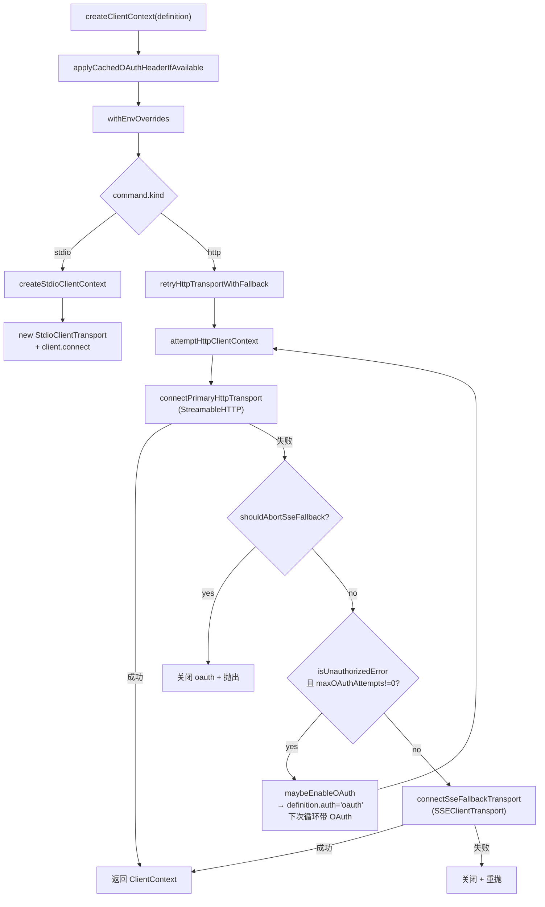
```mermaid
flowchart TD
  Start["createClientContext(definition)"] --> Cache["applyCachedOAuthHeaderIfAvailable"]
  Cache --> Env["withEnvOverrides"]
  Env --> Kind{"command.kind"}
  Kind -->|stdio| StdioPath["createStdioClientContext"]
  Kind -->|http| HttpPath["retryHttpTransportWithFallback"]
  StdioPath --> StdioRet["new StdioClientTransport<br/>+ client.connect"]
  HttpPath --> Loop["attemptHttpClientContext"]
  Loop --> Try["connectPrimaryHttpTransport<br/>(StreamableHTTP)"]
  Try -->|"成功"| Done["返回 ClientContext"]
  Try -->|"失败"| Abort{"shouldAbortSseFallback?"}
  Abort -->|yes| Throw["关闭 oauth + 抛出"]
  Abort -->|no| Unauth{"isUnauthorizedError<br/>且 maxOAuthAttempts!=0?"}
  Unauth -->|yes| Promote["maybeEnableOAuth<br/>→ definition.auth='oauth'<br/>下次循环带 OAuth"]
  Unauth -->|no| SSE["connectSseFallbackTransport<br/>(SSEClientTransport)"]
  Promote --> Loop
  SSE -->|"成功"| Done
  SSE -->|"失败"| ThrowSSE["关闭 + 重抛"]
```

Sources: [src/runtime/transport.ts:224-379](../../../project-repos/mcporter/src/runtime/transport.ts#L224-L379)

<details class="source-snippets">
<summary>引用源码</summary>

<!-- source-snippets:start -->

#### `src/runtime/transport.ts:224-379`

```typescript
async function retryHttpTransportWithFallback(
  client: Client,
  definition: ServerDefinition,
  logger: Logger,
  options: CreateClientContextOptions
): Promise<ClientContext> {
  let activeDefinition = definition;
  while (true) {
    const attempt = await attemptHttpClientContext(client, activeDefinition, logger, options);
    if (!attempt.nextDefinition) {
      return attempt.context;
    }
    activeDefinition = attempt.nextDefinition;
    options.onDefinitionPromoted?.(activeDefinition);
  }
}

async function attemptHttpClientContext(
  client: Client,
  activeDefinition: ServerDefinition,
  logger: Logger,
  options: CreateClientContextOptions
): Promise<HttpClientContextAttempt> {
  const command = activeDefinition.command;
  if (command.kind !== 'http') {
    throw new Error(`Server '${activeDefinition.name}' is not configured for HTTP transport.`);
  }
  let oauthSession: OAuthSession | undefined;
  const shouldEstablishOAuth = activeDefinition.auth === 'oauth' && options.maxOAuthAttempts !== 0;
  if (shouldEstablishOAuth) {
    oauthSession = await createOAuthSession(activeDefinition, logger);
  }
  const transportOptions = createHttpTransportOptions(activeDefinition, oauthSession, shouldEstablishOAuth);

  try {
    const context = await connectPrimaryHttpTransport(
      client,
      activeDefinition,
      command,
      transportOptions,
      oauthSession,
      logger,
      options
    );
    return { context };
  } catch (primaryError) {
    if (shouldAbortSseFallback(primaryError)) {
      await closeOAuthSession(oauthSession);
      throw primaryError;
    }
    if (isUnauthorizedError(primaryError)) {
      await closeOAuthSession(oauthSession);
      const promoted = maybePromoteHttpDefinition(activeDefinition, logger, options);
      if (promoted) {
        return { nextDefinition: promoted };
      }
      oauthSession = undefined;
    }
    if (primaryError instanceof Error) {
      logger.info(`Falling back to SSE transport for '${activeDefinition.name}': ${primaryError.message}`);
    }
    return {
      context: await connectSseFallbackTransport(
        client,
        activeDefinition,
        command,
        transportOptions,
        oauthSession,
        logger,
        options
      ),
    };
  }
}

async function connectPrimaryHttpTransport(
  client: Client,
  definition: ServerDefinition,
  command: Extract<ServerDefinition['command'], { kind: 'http' }>,
  transportOptions: ResolvedHttpTransportOptions,
  oauthSession: OAuthSession | undefined,
  logger: Logger,
  options: CreateClientContextOptions
): Promise<ClientContext> {
  const createStreamableTransport = () => new StreamableHTTPClientTransport(command.url, transportOptions);
  const transport = await connectHttpTransport(client, createStreamableTransport(), oauthSession, logger, {
    serverName: definition.name,
    maxAttempts: options.maxOAuthAttempts,
    oauthTimeoutMs: options.oauthTimeoutMs,
    recreateTransport: async () => createStreamableTransport(),
  });
  return {
    client,
    transport,
    definition,
    oauthSession,
  };
}

async function connectSseFallbackTransport(
  client: Client,
  definition: ServerDefinition,
  command: Extract<ServerDefinition['command'], { kind: 'http' }>,
  transportOptions: ResolvedHttpTransportOptions,
  oauthSession: OAuthSession | undefined,
  logger: Logger,
  options: CreateClientContextOptions
): Promise<ClientContext> {
  try {
    const transport = await connectHttpTransport(
      client,
      new SSEClientTransport(command.url, transportOptions),
      oauthSession,
      logger,
      {
        serverName: definition.name,
        maxAttempts: options.maxOAuthAttempts,
        oauthTimeoutMs: options.oauthTimeoutMs,
      }
    );
... snippet truncated ...
```

<!-- source-snippets:end -->
</details>
### StreamableHTTP → SSE 回退

mcporter 默认假设远端支持 [Streamable HTTP](https://modelcontextprotocol.io/) 传输；当首次连接失败时会按以下规则判断是否回退到 SSE（[src/runtime/transport.ts:46-55]()，[src/runtime/transport.ts:269-296]()）：

- `StreamableHTTPError(code 404|405)` 或上游错误能被 `analyzeConnectionError` 解析为 `kind: 'http' && statusCode in {404,405}` → 视为旧版 SSE-only MCP，触发回退。
- 如果错误已被标成 `OAuthFlowError` 或 `PostAuthConnectError`（来自 `runtime/oauth.ts`），且不是 404/405，就放弃回退、原样抛出，避免 OAuth 流程在两种 transport 之间来回切换。
- 401/403 → 标成 `unauthorized`，调用 `maybePromoteHttpDefinition`（即 `maybeEnableOAuth`）把 `definition.auth='oauth'` 写回，再 `onDefinitionPromoted` 通知上层缓存（`McpRuntime.connect` 会更新 `this.definitions`），下一轮重新建连。

`retryHttpTransportWithFallback` 是个 while-true 循环：每次 `attemptHttpClientContext` 要么返回 `ClientContext`，要么返回新的 `ServerDefinition`（OAuth 升级），不存在第三种状态。
Sources: [src/runtime/transport.ts:224-296](../../../project-repos/mcporter/src/runtime/transport.ts#L224-L296), [src/runtime-oauth-support.ts:5-19](../../../project-repos/mcporter/src/runtime-oauth-support.ts#L5-L19)

<details class="source-snippets">
<summary>引用源码</summary>

<!-- source-snippets:start -->

#### `src/runtime/transport.ts:224-296`

```typescript
async function retryHttpTransportWithFallback(
  client: Client,
  definition: ServerDefinition,
  logger: Logger,
  options: CreateClientContextOptions
): Promise<ClientContext> {
  let activeDefinition = definition;
  while (true) {
    const attempt = await attemptHttpClientContext(client, activeDefinition, logger, options);
    if (!attempt.nextDefinition) {
      return attempt.context;
    }
    activeDefinition = attempt.nextDefinition;
    options.onDefinitionPromoted?.(activeDefinition);
  }
}

async function attemptHttpClientContext(
  client: Client,
  activeDefinition: ServerDefinition,
  logger: Logger,
  options: CreateClientContextOptions
): Promise<HttpClientContextAttempt> {
  const command = activeDefinition.command;
  if (command.kind !== 'http') {
    throw new Error(`Server '${activeDefinition.name}' is not configured for HTTP transport.`);
  }
  let oauthSession: OAuthSession | undefined;
  const shouldEstablishOAuth = activeDefinition.auth === 'oauth' && options.maxOAuthAttempts !== 0;
  if (shouldEstablishOAuth) {
    oauthSession = await createOAuthSession(activeDefinition, logger);
  }
  const transportOptions = createHttpTransportOptions(activeDefinition, oauthSession, shouldEstablishOAuth);

  try {
    const context = await connectPrimaryHttpTransport(
      client,
      activeDefinition,
      command,
      transportOptions,
      oauthSession,
      logger,
      options
    );
    return { context };
  } catch (primaryError) {
    if (shouldAbortSseFallback(primaryError)) {
      await closeOAuthSession(oauthSession);
      throw primaryError;
    }
    if (isUnauthorizedError(primaryError)) {
      await closeOAuthSession(oauthSession);
      const promoted = maybePromoteHttpDefinition(activeDefinition, logger, options);
      if (promoted) {
        return { nextDefinition: promoted };
      }
      oauthSession = undefined;
    }
    if (primaryError instanceof Error) {
      logger.info(`Falling back to SSE transport for '${activeDefinition.name}': ${primaryError.message}`);
    }
    return {
      context: await connectSseFallbackTransport(
        client,
        activeDefinition,
        command,
        transportOptions,
        oauthSession,
        logger,
        options
      ),
    };
  }
```

#### `src/runtime-oauth-support.ts:5-19`

```typescript
export function maybeEnableOAuth(definition: ServerDefinition, logger: Logger): ServerDefinition | undefined {
  if (definition.auth === 'oauth') {
    return undefined;
  }
  if (definition.command.kind !== 'http') {
    return undefined;
  }
  // Allow OAuth promotion for any HTTP server that returns 401,
  // not just ad-hoc servers (fixes issue #38)
  logger.info(`Detected OAuth requirement for '${definition.name}'. Launching browser flow...`);
  return {
    ...definition,
    auth: 'oauth',
  };
}
```

<!-- source-snippets:end -->
</details>
### `connectWithAuth` 的重试循环

最里层的 `connectWithAuth`（[src/runtime/oauth.ts:79-123]()）负责真正的 OAuth challenge：

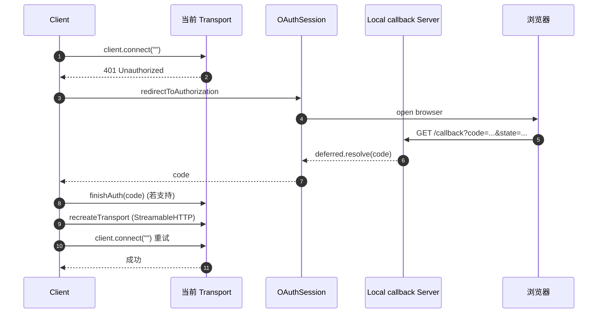
```mermaid
sequenceDiagram
  autonumber
  participant CL as Client
  participant TR as 当前 Transport
  participant OS as OAuthSession
  participant ST as Local callback Server
  participant USER as 浏览器

  CL->>TR: client.connect("")
  TR-->>CL: 401 Unauthorized
  CL->>OS: redirectToAuthorization
  OS->>USER: open browser
  USER->>ST: GET /callback?code=...&state=...
  ST-->>OS: deferred.resolve(code)
  OS-->>CL: code
  CL->>TR: finishAuth(code) (若支持)
  CL->>TR: recreateTransport (StreamableHTTP)
  CL->>TR: client.connect("") 重试
  TR-->>CL: 成功
```

每次 401 触发的重试有上限：默认 `maxAttempts=3`、`oauthTimeoutMs=60_000`。若 `state.hasCompletedAuthFlow=true` 之后再失败，错误会被打上 `POST_AUTH_CONNECT_ERROR` 标记，上层就能区分"OAuth 还没完成"与"OAuth 完成但服务端再 401"——后者通常意味着 token 立刻被 revoke，retry 逻辑就需要重新走完整 OAuth。
Sources: [src/runtime/oauth.ts:79-150](../../../project-repos/mcporter/src/runtime/oauth.ts#L79-L150)

<details class="source-snippets">
<summary>引用源码</summary>

<!-- source-snippets:start -->

#### `src/runtime/oauth.ts:79-150`

```typescript
export async function connectWithAuth(
  client: Client,
  transport: OAuthCapableTransport,
  session: OAuthSession | undefined,
  logger: Logger,
  options: ConnectWithAuthOptions = {}
): Promise<OAuthCapableTransport> {
  const { serverName, maxAttempts = 3, oauthTimeoutMs = DEFAULT_OAUTH_CODE_TIMEOUT_MS, recreateTransport } = options;
  const state: OAuthConnectState = {
    activeTransport: transport,
    attempt: 0,
    hasCompletedAuthFlow: false,
  };

  while (true) {
    try {
      return await attemptTransportConnect(client, state);
    } catch (error) {
      const unauthorized = isUnauthorizedError(error);
      if (!shouldRetryAuthorization(state, unauthorized, session)) {
        await closeReplacementTransport(transport, state.activeTransport);
        throw state.hasCompletedAuthFlow && !unauthorized ? markPostAuthConnectError(error) : error;
      }
      state.attempt += 1;
      if (state.attempt > maxAttempts) {
        await closeReplacementTransport(transport, state.activeTransport);
        throw state.hasCompletedAuthFlow ? markPostAuthConnectError(error) : error;
      }
      logger.warn(`OAuth authorization required for '${serverName ?? 'unknown'}'. Waiting for browser approval...`);
      try {
        state.activeTransport = await completeAuthorizationChallenge(state.activeTransport, session, logger, error, {
          serverName,
          oauthTimeoutMs,
          recreateTransport,
        });
        state.hasCompletedAuthFlow = true;
        logger.info('Authorization code accepted. Retrying connection...');
      } catch (authError) {
        logger.error('OAuth authorization failed while waiting for callback.', authError);
        await closeReplacementTransport(transport, state.activeTransport);
        throw markOAuthFlowError(authError);
      }
    }
  }
}

async function attemptTransportConnect(client: Client, state: OAuthConnectState): Promise<OAuthCapableTransport> {
  await client.connect(state.activeTransport);
  return state.activeTransport;
}

function shouldRetryAuthorization(
  _state: OAuthConnectState,
  unauthorized: boolean,
  session: OAuthSession | undefined
): session is OAuthSession {
  if (!session || !unauthorized) {
    return false;
  }
  return true;
}

async function closeReplacementTransport(
  originalTransport: OAuthCapableTransport,
  activeTransport: OAuthCapableTransport
): Promise<void> {
  if (activeTransport === originalTransport) {
    return;
  }
  await activeTransport.close().catch(() => {});
}

```

<!-- source-snippets:end -->
</details>
### stdio 子进程

`createStdioClientContext`（[src/runtime/transport.ts:189-222]()）：

- 对 `definition.env` 跑 `resolveEnvValue` 解析 `${VAR:-fallback}` / `$env:VAR`，过滤掉空字符串。
- 把过滤后的 env 与 `process.env` 合并（`process.env` 优先级低，被覆盖），传给 `StdioClientTransport`。
- `command` / `args` 同样跑 `resolveCommandArgument` 做占位符展开，但**不**做 shell tokenization（命令分词在 `config-normalize.ts` 已经完成）。
- `MCPORTER_STDIO_TRACE=1` 时附加 stdio 跟踪 hook（详见 sdk-patches）。

子进程退出/异常时的清理由 `closeTransportAndWait` 统一处理（[src/runtime-process-utils.ts:8-32]()）：先调 `transport.close()`，等子进程的 `close` / `exit` 事件最多 1 秒，再用 `kill -0` / 对应平台 `taskkill` 兜底确认进程树没有残留。
Sources: [src/runtime/transport.ts:189-222](../../../project-repos/mcporter/src/runtime/transport.ts#L189-L222), [src/runtime-process-utils.ts:8-32](../../../project-repos/mcporter/src/runtime-process-utils.ts#L8-L32), [src/runtime/utils.ts:5-24](../../../project-repos/mcporter/src/runtime/utils.ts#L5-L24)

<details class="source-snippets">
<summary>引用源码</summary>

<!-- source-snippets:start -->

#### `src/runtime/transport.ts:189-222`

```typescript
async function createStdioClientContext(
  client: Client,
  definition: ServerDefinition & { command: Extract<ServerDefinition['command'], { kind: 'stdio' }> },
  logger: Logger
): Promise<ClientContext> {
  const resolvedEnvOverrides =
    definition.env && Object.keys(definition.env).length > 0
      ? Object.fromEntries(
          Object.entries(definition.env)
            .map(([key, raw]) => [key, resolveEnvValue(raw)])
            .filter(([, value]) => value !== '')
        )
      : undefined;
  const mergedEnv =
    resolvedEnvOverrides && Object.keys(resolvedEnvOverrides).length > 0
      ? { ...process.env, ...resolvedEnvOverrides }
      : { ...process.env };
  const transport = new StdioClientTransport({
    command: resolveCommandArgument(definition.command.command),
    args: resolveCommandArguments(definition.command.args),
    cwd: definition.command.cwd,
    env: mergedEnv,
  });
  if (STDIO_TRACE_ENABLED) {
    attachStdioTraceLogging(transport, definition.name ?? definition.command.command);
  }
  try {
    await client.connect(transport);
  } catch (error) {
    await closeTransportAndWait(logger, transport).catch(() => {});
    throw error;
  }
  return { client, transport, definition, oauthSession: undefined };
}
```

#### `src/runtime-process-utils.ts:8-32`

```typescript
export async function closeTransportAndWait(
  logger: Logger,
  transport: Transport & { close(): Promise<void> }
): Promise<void> {
  const pidBeforeClose = getTransportPid(transport);
  const childProcess =
    transport instanceof StdioClientTransport
      ? ((transport as unknown as { _process?: ChildProcess | null })._process ?? null)
      : null;
  try {
    await transport.close();
  } catch (error) {
    logger.warn(`Failed to close transport cleanly: ${(error as Error).message}`);
  }

  if (childProcess) {
    await waitForChildClose(childProcess, 1_000).catch(() => {});
  }

  if (!pidBeforeClose) {
    return;
  }

  await ensureProcessTerminated(logger, pidBeforeClose);
}
```

#### `src/runtime/utils.ts:5-24`

```typescript
export function resolveCommandArgument(value: string): string {
  if (!value) {
    return value;
  }
  if (!value.includes('$')) {
    return value;
  }
  const needsInterpolation = value.startsWith('$env:') || ENV_PLACEHOLDER_PATTERN.test(value);
  if (!needsInterpolation) {
    return value;
  }
  return resolveEnvPlaceholders(value);
}

export function resolveCommandArguments(args: readonly string[]): string[] {
  if (!args || args.length === 0) {
    return [];
  }
  return args.map((arg) => resolveCommandArgument(arg));
}
```

<!-- source-snippets:end -->
</details>
## SDK Patches：StdioClientTransport.close

mcporter 在 [src/sdk-patches.ts:236-336]() 直接 monkey-patch `StdioClientTransport.prototype.close`，原因是上游 SDK 在某些 npm wrapper（`npx`、`npm exec`）下不会真正杀掉子进程：

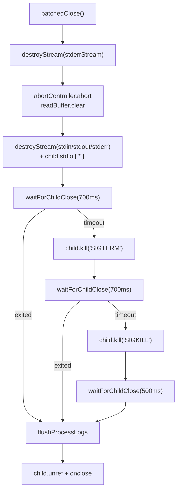
```mermaid
graph TD
  Close["patchedClose()"] --> Stderr["destroyStream(stderrStream)"]
  Stderr --> Abort["abortController.abort<br/>readBuffer.clear"]
  Abort --> StdioDestroy["destroyStream(stdin/stdout/stderr)<br/>+ child.stdio❲*❳"]
  StdioDestroy --> Wait1["waitForChildClose(700ms)"]
  Wait1 -->|exited| Flush["flushProcessLogs"]
  Wait1 -->|timeout| Term["child.kill('SIGTERM')"]
  Term --> Wait2["waitForChildClose(700ms)"]
  Wait2 -->|exited| Flush
  Wait2 -->|timeout| Kill["child.kill('SIGKILL')"]
  Kill --> Wait3["waitForChildClose(500ms)"]
  Wait3 --> Flush
  Flush --> Unref["child.unref + onclose"]
```

附加好处：`patchStdioStart` 拦截子进程的 stderr，按 `MCPORTER_STDIO_LOGS` / 退出码决定是否在 `mcporter` 关闭时再把 stderr 回放到 stdout，方便排查。`patchStdioSend` 则在 `MCPORTER_STDIO_TRACE=1` 时记录 stdin。
Sources: [src/sdk-patches.ts:1-50](../../../project-repos/mcporter/src/sdk-patches.ts#L1-L50), [src/sdk-patches.ts:236-336](../../../project-repos/mcporter/src/sdk-patches.ts#L236-L336)

<details class="source-snippets">
<summary>引用源码</summary>

<!-- source-snippets:start -->

#### `src/sdk-patches.ts:1-50`

```typescript
import type { ChildProcess } from 'node:child_process';
import type { PassThrough } from 'node:stream';
import { StdioClientTransport } from '@modelcontextprotocol/sdk/client/stdio.js';
import type { JSONRPCMessage } from '@modelcontextprotocol/sdk/types.js';

// Upstream TODO: Once typescript-sdk#579/#780/#1049 land, this shim can be dropped.
// We monkey-patch the transport so child processes actually exit and their stdio
// streams are destroyed; otherwise Node keeps the handles alive and mcporter hangs.

type MaybeChildProcess = ChildProcess & {
  stdio?: Array<unknown>;
};

interface ProcessStreamMeta {
  stderrChunks: string[];
  stdoutChunks?: string[];
  stdinChunks?: string[];
  command?: string;
  code?: number | null;
  flushed?: boolean;
  child?: MaybeChildProcess | null;
  transport?: object;
  listeners: Array<{
    stream: NodeJS.EventEmitter & { removeListener?: (event: string, listener: (...args: unknown[]) => void) => void };
    event: string;
    handler: (...args: unknown[]) => void;
  }>;
}

const PROCESS_BUFFERS = new WeakMap<MaybeChildProcess, ProcessStreamMeta>();
const TRANSPORT_BUFFERS = new WeakMap<object, ProcessStreamMeta>();
const STDIO_LOGS_FORCED = process.env.MCPORTER_STDIO_LOGS === '1';
const STDIO_TRACE_ENABLED = process.env.MCPORTER_STDIO_TRACE === '1';

export type StdioLogMode = 'auto' | 'always' | 'silent';

let stdioLogMode: StdioLogMode = STDIO_LOGS_FORCED ? 'always' : 'auto';

export function getStdioLogMode(): StdioLogMode {
  return stdioLogMode;
}

export function setStdioLogMode(mode: StdioLogMode): StdioLogMode {
  const previous = stdioLogMode;
  if (!STDIO_LOGS_FORCED) {
    stdioLogMode = mode;
  }
  return previous;
}

```

#### `src/sdk-patches.ts:236-336`

```typescript
function patchStdioClose(): void {
  const marker = Symbol.for('mcporter.stdio.patched');
  const proto = StdioClientTransport.prototype as unknown as Record<symbol, unknown>;
  if (proto[marker]) {
    return;
  }

  patchStdioStart();

  StdioClientTransport.prototype.close = async function patchedClose(): Promise<void> {
    const transport = this as unknown as {
      _process?: MaybeChildProcess | null;
      _stderrStream?: PassThrough | null;
      _abortController?: AbortController | null;
      _readBuffer?: { clear(): void } | null;
      onclose?: () => void;
    };
    const child = transport._process ?? null;
    const stderrStream = transport._stderrStream ?? null;
    const meta = (child ? PROCESS_BUFFERS.get(child) : undefined) ?? TRANSPORT_BUFFERS.get(transport as object);

    if (stderrStream) {
      // Ensure any piped stderr stream is torn down so no file descriptors linger.
      destroyStream(stderrStream);
      transport._stderrStream = null;
    }

    // Abort active reads/writes and clear buffered state just like the SDK does.
    transport._abortController?.abort();
    transport._abortController = null;
    transport._readBuffer?.clear?.();
    transport._readBuffer = null;

    if (!child) {
      transport.onclose?.();
      return;
    }

    // Closing stdin/stdout/stderr proactively lets Node release the handles even
    // when the child ignores SIGTERM (common with npm/npx wrappers).
    destroyStream(child.stdin);
    destroyStream(child.stdout);
    destroyStream(child.stderr);

    const stdio = Array.isArray(child.stdio) ? child.stdio : [];
    for (const stream of stdio) {
      destroyStream(stream);
    }

    let exited = await waitForChildClose(child, 700).then(
      () => true,
      () => false
    );

    if (!exited) {
      // First escalation: polite SIGTERM.
      try {
        child.kill('SIGTERM');
      } catch {
        // ignore
      }
      exited = await waitForChildClose(child, 700).then(
        () => true,
        () => false
      );
    }

    if (!exited) {
      // Final escalation: SIGKILL. If this still fails, fall through and warn.
      try {
        child.kill('SIGKILL');
      } catch {
        // ignore
      }
      await waitForChildClose(child, 500).catch(() => {});
    }

    destroyStream(child.stdin);
    destroyStream(child.stdout);
    destroyStream(child.stderr);

    const stdioAfter = Array.isArray(child.stdio) ? child.stdio : [];
    for (const stream of stdioAfter) {
      // Some transports mutate stdio in-place; run the destroy sweep again to be sure.
      destroyStream(stream);
    }

    child.unref?.();

    if (meta) {
      flushProcessLogs(meta.child ?? child, meta);
    } else if (STDIO_TRACE_ENABLED) {
      console.log('[mcporter] STDIO trace: attempted to close transport without recorded metadata.');
    }

    transport._process = null;
    transport.onclose?.();
  };

  proto[marker] = true;
}
```

<!-- source-snippets:end -->
</details>
## `ServerProxy` 与 `CallResult`

`createServerProxy(runtime, name)` 是面向"对象式"用法的薄封装。它把每个属性访问转成 kebab-case 工具调用：

```ts
const linear = createServerProxy(runtime, 'linear');
const docs = await linear.searchDocumentation({ query: 'automations', page: 0 });
console.log(docs.json());
```

实现要点（[src/server-proxy.ts:283-407]()）：

| 步骤 | 行为 |
|------|------|
| 属性映射 | `defaultToolNameMapper` 把 camelCase/PascalCase → kebab-case |
| Schema 缓存 | 用 `runtime.listTools(server, { includeSchema: true })` 拉一次后存 `~/.mcporter/<server>/schema.json`，下次直接读 |
| 别名 | `canonicalizeToolName` 抹掉非字母数字字符，把 `take_snapshot` / `takeSnapshot` 都指向同一 schema |
| 默认值 | `applyDefaults` 把 schema 里的 `default` 字段填充进调用参数 |
| 必填校验 | `validateRequired` 检查 `required` 列表，缺失项立即抛 `Missing required arguments: ...` |
| 位置参数 | 多于 `orderedKeys.length` 报错；按 `required` 优先 + `properties` 顺序映射 |
| 选项穿透 | `KNOWN_OPTION_KEYS = {tailLog, timeout, stream, streamLog, mimeType, metadata, log}` 时当选项透传，否则当 args 用 |

调用结果统一被 `createCallResult` 包裹（[src/result-utils.ts:227-310]()）。`CallResult` 提供 `.text() / .markdown() / .json() / .images() / .content() / .structuredContent() / .raw`，内部 lazy-collect：

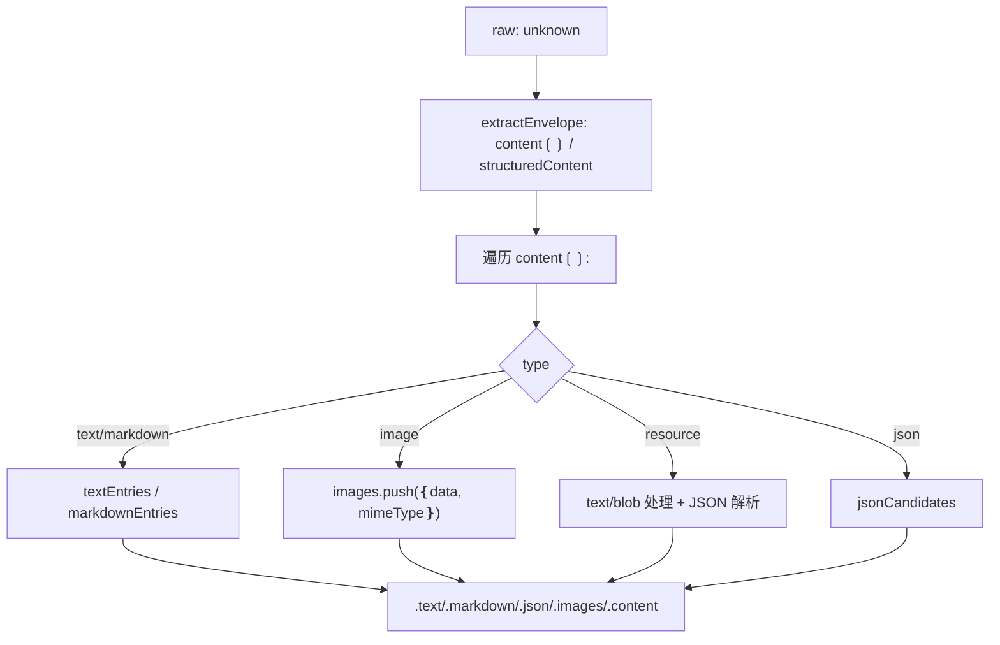
```mermaid
flowchart TD
  Raw["raw: unknown"] --> Env["extractEnvelope: content❲❳ / structuredContent"]
  Env --> Loop["遍历 content❲❳:"]
  Loop --> JSONType{"type"}
  JSONType -->|"text/markdown"| Add1["textEntries / markdownEntries"]
  JSONType -->|image| Add2["images.push(❴data, mimeType❵)"]
  JSONType -->|resource| Add3["text/blob 处理 + JSON 解析"]
  JSONType -->|json| Add4["jsonCandidates"]
  Add1 & Add2 & Add3 & Add4 --> Methods[".text/.markdown/.json/.images/.content"]
```

`json()` 的解析顺序：`structuredContent` 优先（自动 unwrap `{ json: ... }` / `{ data: ... }` 包装），再退到 `content` 中的 JSON 字符串解析，再退到原始字符串解析、再退到 text / markdown 字符串解析。`null` 表示无法解析为对象。
Sources: [src/server-proxy.ts:108-407](../../../project-repos/mcporter/src/server-proxy.ts#L108-L407), [src/result-utils.ts:31-310](../../../project-repos/mcporter/src/result-utils.ts#L31-L310)

<details class="source-snippets">
<summary>引用源码</summary>

<!-- source-snippets:start -->

#### `src/server-proxy.ts:108-407`

```typescript
// validateRequired ensures all schema-required fields are present before invocation.
function validateRequired(meta: ToolSchemaInfo, args?: ToolArguments): void {
  if (meta.requiredKeys.length === 0) {
    return;
  }
  if (!isPlainObject(args)) {
    throw new Error(`Missing required arguments: ${meta.requiredKeys.join(', ')}`);
  }
  const missing = meta.requiredKeys.filter((key) => (args as Record<string, unknown>)[key] === undefined);
  if (missing.length > 0) {
    throw new Error(`Missing required arguments: ${missing.join(', ')}`);
  }
}

// createServerProxy returns a proxy that maps property access to MCP tool invocations.
export function createServerProxy(
  runtime: Runtime,
  serverName: string,
  mapOrOptions?: ((property: string | symbol) => string) | ServerProxyOptions,
  maybeOptions?: ServerProxyOptions
): ServerProxy {
  let mapPropertyToTool = defaultToolNameMapper;
  let options: ServerProxyOptions | undefined;

  if (typeof mapOrOptions === 'function') {
    mapPropertyToTool = mapOrOptions;
    options = maybeOptions;
  } else if (mapOrOptions) {
    options = mapOrOptions;
    if (typeof mapOrOptions.mapPropertyToTool === 'function') {
      mapPropertyToTool = mapOrOptions.mapPropertyToTool;
    }
  }

  const cacheSchemas = options?.cacheSchemas ?? true;
  const initialSchemas = options?.initialSchemas ?? undefined;

  const toolSchemaCache = new Map<string, ToolSchemaInfo>();
  const persistedSchemas = new Map<string, Record<string, unknown>>();
  const toolAliasMap = new Map<string, string>();
  let schemaFetch: Promise<void> | null = null;
  let diskLoad: Promise<void> | null = null;
  let persistPromise: Promise<void> | null = null;
  let refreshPending = false;

  let definitionForCache: ReturnType<Runtime['getDefinition']> | undefined;
  if (cacheSchemas) {
    try {
      definitionForCache = runtime.getDefinition(serverName);
    } catch {
      definitionForCache = undefined;
    }
  }

  if (cacheSchemas && !initialSchemas && definitionForCache) {
    diskLoad = loadSchemasFromDisk(definitionForCache);
    refreshPending = true;
  }

  if (initialSchemas) {
    for (const [key, schemaRaw] of Object.entries(initialSchemas)) {
      storeSchema(key, schemaRaw);
    }
    persistPromise = persistSchemas();
  }

  // consumePersist waits for any in-flight disk persistence to finish before reading from cache maps.
  async function consumePersist(): Promise<void> {
    if (!persistPromise) {
      return;
    }
    try {
      await persistPromise;
    } finally {
      persistPromise = null;
    }
  }

  // ensureMetadata loads schema information for the requested tool, optionally refreshing from the server.
  async function ensureMetadata(toolName: string): Promise<ToolSchemaInfo | undefined> {
    await consumePersist();
    const cached = toolSchemaCache.get(toolName);
    if (cached && !refreshPending) {
      return cached;
    }

    if (diskLoad) {
      try {
        await diskLoad;
      } finally {
        diskLoad = null;
      }
      if (toolSchemaCache.has(toolName) && !refreshPending) {
        return toolSchemaCache.get(toolName);
      }
    }

    if (!schemaFetch) {
      schemaFetch = runtime
        .listTools(serverName, { includeSchema: true })
        .then((tools) => {
          for (const tool of tools) {
            if (!tool.inputSchema || typeof tool.inputSchema !== 'object') {
              continue;
            }
            storeSchema(tool.name, tool.inputSchema);
          }
          persistPromise = persistSchemas();
          refreshPending = false;
        })
        .catch((error) => {
          schemaFetch = null;
          throw error;
        });
    }

    await schemaFetch;
    await consumePersist();
    return toolSchemaCache.get(toolName);
  }
... snippet truncated ...
```

#### `src/result-utils.ts:31-310`

```typescript

function extractEnvelope(raw: unknown): ExtractedEnvelope {
  if (!raw || typeof raw !== 'object') {
    return { content: null, structuredContent: null };
  }

  const obj = raw as Record<string, unknown>;
  let content: unknown[] | null = null;
  let structuredContent: unknown = null;

  if ('content' in obj && Array.isArray(obj.content)) {
    content = obj.content as unknown[];
  }
  if ('structuredContent' in obj) {
    structuredContent = obj.structuredContent;
  }

  if ('raw' in obj && obj.raw && typeof obj.raw === 'object') {
    const nested = obj.raw as Record<string, unknown>;
    if (!content && 'content' in nested && Array.isArray(nested.content)) {
      content = nested.content as unknown[];
    }
    if (structuredContent === null && 'structuredContent' in nested) {
      structuredContent = nested.structuredContent;
    }
  }

  return { content, structuredContent };
}

// asString converts known content/value shapes into plain strings.
function asString(value: unknown): string | null {
  if (typeof value === 'string') {
    return value;
  }
  if (value && typeof value === 'object' && 'text' in value) {
    const text = (value as Record<string, unknown>).text;
    return typeof text === 'string' ? text : null;
  }
  return null;
}

function collectCallContent(raw: unknown): CollectedCallContent {
  const envelope = extractEnvelope(raw);
  const textEntries: string[] = [];
  const markdownEntries: string[] = [];
  const jsonCandidates: unknown[] = [];
  const images: ImageContent[] = [];

  if (!envelope.content) {
    return {
      content: envelope.content,
      structuredContent: envelope.structuredContent,
      textEntries,
      markdownEntries,
      jsonCandidates,
      images,
    };
  }

  for (const entry of envelope.content) {
    if (typeof entry === 'string') {
      const parsed = tryParseJson(entry);
      if (parsed !== null) {
        jsonCandidates.push(parsed);
      }
      continue;
    }
    if (!entry || typeof entry !== 'object' || !('type' in entry)) {
      continue;
    }

    const typedEntry = entry as Record<string, unknown>;
    if (typedEntry.type === 'json') {
      const parsed = tryParseJson(entry);
      if (parsed !== null) {
        jsonCandidates.push(parsed);
      }
      continue;
    }
    if (typedEntry.type === 'image') {
      const data = typedEntry.data;
      const mimeType = typedEntry.mimeType ?? 'image/png';
      if (typeof data === 'string' && typeof mimeType === 'string') {
        images.push({ data, mimeType });
      }
      continue;
    }
    if (typedEntry.type === 'resource') {
      const resource = typedEntry.resource as Record<string, unknown> | undefined;
      if (resource && typeof resource === 'object') {
        const uri = typeof resource.uri === 'string' ? resource.uri : '';
        const mimeType = typeof resource.mimeType === 'string' ? resource.mimeType : '';
        if (typeof resource.text === 'string') {
          textEntries.push(resource.text);
          if (mimeType.toLowerCase().includes('markdown')) {
            markdownEntries.push(resource.text);
          }
          const parsed = tryParseJson(resource.text);
          if (parsed !== null) {
            jsonCandidates.push(parsed);
          }
        } else if (typeof resource.blob === 'string') {
          textEntries.push(`[Binary resource: ${uri}]`);
        }
      }
      continue;
    }
    if (typedEntry.type !== 'text' && typedEntry.type !== 'markdown') {
      continue;
    }

    const text = asString(entry);
    if (!text) {
      continue;
    }
    textEntries.push(text);
    if (typedEntry.type === 'markdown') {
      markdownEntries.push(text);
    }
... snippet truncated ...
```

<!-- source-snippets:end -->
</details>
## 错误分类

`describeConnectionIssue(error)` 把 SDK / fetch / stdio 的混合错误归一化（[src/error-classifier.ts:41-63]()）：

| `kind` | 触发条件 | 典型场景 |
|--------|----------|----------|
| `auth` | `UnauthorizedError`，状态码 401/403，message 含 `unauthorized/invalid_token/forbidden` 或 `401` | OAuth 未完成、token 过期 |
| `offline` | message 含 `econnrefused/timed out/getaddrinfo/enotfound/spawn enoent` 等 | 远端宕机、命令不存在 |
| `http` | 状态码 ≥400 但不在 auth 集合 | 4xx / 5xx 业务错误 |
| `stdio-exit` | message 含 `exit ... code N` 或 `signal X` | 子进程异常退出 |
| `other` | 其它 | 未识别 |

CLI 把这些 kind 翻译成有色的可读提示，并在 `--output json` 模式下以 `{ kind, statusCode, stdioExitCode, stdioSignal, rawMessage }` 信封返回（参见 [CLI 命令体系](#cli-commands)）。
Sources: [src/error-classifier.ts:1-153](../../../project-repos/mcporter/src/error-classifier.ts#L1-L153), [src/cli/call-command.ts:494-521](../../../project-repos/mcporter/src/cli/call-command.ts#L494-L521)

<details class="source-snippets">
<summary>引用源码</summary>

<!-- source-snippets:start -->

#### `src/error-classifier.ts:1-153`

```typescript
import { UnauthorizedError } from '@modelcontextprotocol/sdk/client/auth.js';

export type ConnectionIssueKind = 'auth' | 'offline' | 'http' | 'stdio-exit' | 'other';

export interface ConnectionIssue {
  kind: ConnectionIssueKind;
  rawMessage: string;
  statusCode?: number;
  stdioExitCode?: number;
  stdioSignal?: string;
}

const AUTH_STATUSES = new Set([401, 403]);
const OFFLINE_PATTERNS = [
  'fetch failed',
  'econnrefused',
  'connection refused',
  'connection closed',
  'connection reset',
  'socket hang up',
  'connect timeout',
  'network is unreachable',
  'timed out',
  'timeout',
  'timeout after',
  'getaddrinfo',
  'enotfound',
  'enoent',
  'eai_again',
  'econnaborted',
  'ehostunreach',
  'no such host',
  'failed to start',
  'spawn enoent',
];
const HTTP_STATUS_FALLBACK = /\bhttps?:\/\/[^\s]+(?:\s+returned\s+)?(?:status|code)?\s*(\d{3})\b/i;
const STATUS_DIRECT_PATTERN = /\b(?:status(?:\s+code)?|http(?:\s+(?:status|code|error))?)[:\s]*(\d{3})\b/i;
const STDIO_EXIT_PATTERN = /exit(?:ed)?(?:\s+with)?(?:\s+(?:code|status))\s+(-?\d+)/i;
const STDIO_SIGNAL_PATTERN = /signal\s+([A-Z0-9]+)/i;

export function analyzeConnectionError(error: unknown): ConnectionIssue {
  const rawMessage = extractMessage(error);
  if (error instanceof UnauthorizedError) {
    return { kind: 'auth', rawMessage };
  }
  const stdio = extractStdioExit(rawMessage);
  if (stdio) {
    return { kind: 'stdio-exit', rawMessage, ...stdio };
  }
  const errorCode = extractErrorCode(error);
  const statusCode = errorCode ?? extractStatusCode(rawMessage);
  const normalized = rawMessage.toLowerCase();
  if (AUTH_STATUSES.has(statusCode ?? -1) || containsAuthToken(normalized)) {
    return { kind: 'auth', rawMessage, statusCode };
  }
  if (statusCode && statusCode >= 400) {
    return { kind: 'http', rawMessage, statusCode };
  }
  if (OFFLINE_PATTERNS.some((pattern) => normalized.includes(pattern))) {
    return { kind: 'offline', rawMessage };
  }
  return { kind: 'other', rawMessage };
}

export function isAuthIssue(issue: ConnectionIssue): boolean {
  return issue.kind === 'auth';
}

function extractMessage(error: unknown): string {
  if (error instanceof Error) {
    return error.message ?? '';
  }
  if (typeof error === 'string') {
    return error;
  }
  if (error === undefined || error === null) {
    return '';
  }
  try {
    return JSON.stringify(error);
  } catch {
    return '';
  }
}

function extractErrorCode(error: unknown): number | undefined {
  if (typeof error === 'object' && error !== null && 'code' in error) {
    const code = (error as Record<string, unknown>).code;
    if (typeof code === 'number' && Number.isFinite(code) && code >= 100 && code < 600) {
      return code;
    }
  }
  return undefined;
}

function extractStatusCode(message: string): number | undefined {
  const candidates = [
    message.match(/status code\s*\((\d{3})\)/i)?.[1],
    message.match(STATUS_DIRECT_PATTERN)?.[1],
    message.match(HTTP_STATUS_FALLBACK)?.[1],
  ].filter(Boolean) as string[];
  for (const candidate of candidates) {
    const parsed = Number.parseInt(candidate, 10);
    if (Number.isFinite(parsed)) {
      return parsed;
    }
  }
  const trimmed = message.trim();
  if (trimmed.startsWith('{')) {
    try {
      const parsed = JSON.parse(trimmed);
      const candidate = findStatusInObject(parsed);
      if (typeof candidate === 'number') {
        return candidate;
      }
      if (typeof candidate === 'string') {
        const numeric = Number.parseInt(candidate, 10);
        if (Number.isFinite(numeric)) {
          return numeric;
        }
... snippet truncated ...
```

#### `src/cli/call-command.ts:494-521`

```typescript
function maybeReportConnectionIssue(server: string, tool: string, error: unknown): ConnectionIssue | undefined {
  const issue = analyzeConnectionError(error);
  const detail = summarizeIssueMessage(issue.rawMessage);
  if (issue.kind === 'auth') {
    const authCommand = `mcporter auth ${server}`;
    const hint = `[mcporter] Authorization required for ${server}. Run '${authCommand}'.${detail ? ` (${detail})` : ''}`;
    console.error(yellowText(hint));
    return issue;
  }
  if (issue.kind === 'offline') {
    const hint = `[mcporter] ${server} appears offline${detail ? ` (${detail})` : ''}.`;
    console.error(redText(hint));
    return issue;
  }
  if (issue.kind === 'http') {
    const status = issue.statusCode ? `HTTP ${issue.statusCode}` : 'an HTTP error';
    const hint = `[mcporter] ${server}.${tool} responded with ${status}${detail ? ` (${detail})` : ''}.`;
    console.error(dimText(hint));
    return issue;
  }
  if (issue.kind === 'stdio-exit') {
    const exit = typeof issue.stdioExitCode === 'number' ? `code ${issue.stdioExitCode}` : 'an unknown status';
    const signal = issue.stdioSignal ? ` (signal ${issue.stdioSignal})` : '';
    const hint = `[mcporter] STDIO server for ${server} exited with ${exit}${signal}.`;
    console.error(redText(hint));
  }
  return issue;
}
```

<!-- source-snippets:end -->
</details>
## 关闭与清理

`runtime.close(server?)`：

- 不传 server 时遍历 `clients` 全部关闭。
- 每个 ClientContext 按顺序：`client.close()` → `closeTransportAndWait(transport)` → `oauthSession?.close()`，所有 await 都吃异常，确保单个失败不会阻塞其它清理。
- `clients.delete(name)` 保证幂等。

`closeTransportAndWait` 的关键是 stdio 进程退出确认 + PID 终结（[src/runtime-process-utils.ts:8-32]()）。CLI 进一步在 `process.exit` 前调用 `terminateChildProcesses` 兜底；这是为什么 mcporter 进程不会在 `mcporter call` 返回后挂起在 stdio 子进程的句柄上（[src/cli.ts:185-203]()）。
Sources: [src/runtime.ts:282-306](../../../project-repos/mcporter/src/runtime.ts#L282-L306), [src/runtime-process-utils.ts:8-32](../../../project-repos/mcporter/src/runtime-process-utils.ts#L8-L32)

<details class="source-snippets">
<summary>引用源码</summary>

<!-- source-snippets:start -->

#### `src/runtime.ts:282-306`

```typescript
  async close(server?: string): Promise<void> {
    if (server) {
      const normalized = server.trim();
      const context = await this.clients.get(normalized);
      if (!context) {
        return;
      }
      await context.client.close().catch(() => {});
      await closeTransportAndWait(this.logger, context.transport).catch(() => {});
      await context.oauthSession?.close().catch(() => {});
      this.clients.delete(normalized);
      return;
    }

    for (const [name, promise] of this.clients.entries()) {
      try {
        const context = await promise;
        await context.client.close().catch(() => {});
        await closeTransportAndWait(this.logger, context.transport).catch(() => {});
        await context.oauthSession?.close().catch(() => {});
      } finally {
        this.clients.delete(name);
      }
    }
  }
```

#### `src/runtime-process-utils.ts:8-32`

```typescript
export async function closeTransportAndWait(
  logger: Logger,
  transport: Transport & { close(): Promise<void> }
): Promise<void> {
  const pidBeforeClose = getTransportPid(transport);
  const childProcess =
    transport instanceof StdioClientTransport
      ? ((transport as unknown as { _process?: ChildProcess | null })._process ?? null)
      : null;
  try {
    await transport.close();
  } catch (error) {
    logger.warn(`Failed to close transport cleanly: ${(error as Error).message}`);
  }

  if (childProcess) {
    await waitForChildClose(childProcess, 1_000).catch(() => {});
  }

  if (!pidBeforeClose) {
    return;
  }

  await ensureProcessTerminated(logger, pidBeforeClose);
}
```

<!-- source-snippets:end -->
</details>
## OAuth header 物化

HTTP 头里的 `${VAR}` / `$env:VAR` 在每次请求前由 `materializeHeaders` 解析（[src/runtime-header-utils.ts:4-23]()）。OAuth 流程会**移除** `Authorization` 头让 SDK 自己写入 token（`removeAuthorizationHeader`，[src/runtime/transport.ts:85-95]()），避免静态 bearer 与浏览器流程冲突；非 OAuth 路径则保留头不变。
Sources: [src/runtime-header-utils.ts:1-23](../../../project-repos/mcporter/src/runtime-header-utils.ts#L1-L23), [src/runtime/transport.ts:85-112](../../../project-repos/mcporter/src/runtime/transport.ts#L85-L112)

<details class="source-snippets">
<summary>引用源码</summary>

<!-- source-snippets:start -->

#### `src/runtime-header-utils.ts:1-23`

```typescript
import { resolveEnvPlaceholders } from './env.js';

// materializeHeaders resolves environment placeholders in server header definitions.
export function materializeHeaders(
  headers: Record<string, string> | undefined,
  serverName: string
): Record<string, string> | undefined {
  if (!headers) {
    return undefined;
  }

  const resolved: Record<string, string> = {};
  for (const [key, value] of Object.entries(headers)) {
    try {
      resolved[key] = resolveEnvPlaceholders(value);
    } catch (error) {
      const message = error instanceof Error ? error.message : String(error);
      throw new Error(`Failed to resolve header '${key}' for server '${serverName}': ${message}`, { cause: error });
    }
  }

  return resolved;
}
```

#### `src/runtime/transport.ts:85-112`

```typescript
function removeAuthorizationHeader(headers: Record<string, string> | undefined): Record<string, string> | undefined {
  if (!headers) {
    return undefined;
  }
  for (const key of Object.keys(headers)) {
    if (key.toLowerCase() === 'authorization') {
      delete headers[key];
    }
  }
  return Object.keys(headers).length > 0 ? headers : undefined;
}

function createHttpTransportOptions(
  definition: ServerDefinition,
  oauthSession: OAuthSession | undefined,
  shouldEstablishOAuth: boolean
): ResolvedHttpTransportOptions {
  const command = definition.command;
  if (command.kind !== 'http') {
    throw new Error(`Server '${definition.name}' is not configured for HTTP transport.`);
  }
  const resolvedHeaders = materializeHeaders(command.headers, definition.name);
  const effectiveHeaders = shouldEstablishOAuth ? removeAuthorizationHeader(resolvedHeaders) : resolvedHeaders;
  return {
    requestInit: effectiveHeaders ? { headers: effectiveHeaders as HeadersInit } : undefined,
    authProvider: oauthSession?.provider,
  };
}
```

<!-- source-snippets:end -->
</details>
## 设计取舍

- **缓存的是 Promise 不是值** — 让并发的同名 `connect()` 自动合流；缺点是 reject 后必须主动 `delete`，否则下次会拿到失败 promise。代码里在 catch 中显式 `clients.delete(normalized)`（[src/runtime.ts:268-275]()）。
- **回退而非协议探测** — 不主动询问远端支持哪种 transport，而是先打 StreamableHTTP，按 404/405 自动回退到 SSE。少一次 round-trip，但要求错误分类够鲁棒。
- **OAuth 升级在循环里完成** — 把 `auth='oauth'` 的写回当成一次 `definition` 的"演进"，外层 while-true 简单；缺点是配置对象要被复制成新引用。
- **patch 而非 wait** — 与其等上游 SDK 修 #579/#780/#1049，先用 monkey-patch 把 stdio close 做到位，并写测试钉死期望。
- **CallResult 的 lazy 收集** — 第一次访问任意 helper 才解析 content，后续调用走缓存。对图像/markdown/JSON 的多消费者场景比较友好。

Sources: [src/runtime.ts:243-279](../../../project-repos/mcporter/src/runtime.ts#L243-L279), [src/runtime/transport.ts:224-296](../../../project-repos/mcporter/src/runtime/transport.ts#L224-L296), [src/sdk-patches.ts:236-336](../../../project-repos/mcporter/src/sdk-patches.ts#L236-L336), [src/result-utils.ts:227-310](../../../project-repos/mcporter/src/result-utils.ts#L227-L310)

<details class="source-snippets">
<summary>引用源码</summary>

<!-- source-snippets:start -->

#### `src/runtime.ts:243-279`

```typescript
  async connect(server: string, options: ConnectOptions = {}): Promise<ClientContext> {
    // Reuse cached connections unless the caller explicitly opted out.
    const normalized = server.trim();

    const useCache = options.skipCache !== true && options.maxOAuthAttempts === undefined;

    if (useCache) {
      const existing = this.clients.get(normalized);
      if (existing) {
        return existing;
      }
    }

    const definition = this.definitions.get(normalized);
    if (!definition) {
      throw new Error(`Unknown MCP server '${normalized}'.`);
    }

    const connection = createClientContext(definition, this.logger, this.clientInfo, {
      maxOAuthAttempts: options.maxOAuthAttempts,
      oauthTimeoutMs: this.oauthTimeoutMs ?? OAUTH_CODE_TIMEOUT_MS,
      onDefinitionPromoted: (promoted) => this.definitions.set(promoted.name, promoted),
      allowCachedAuth: options.allowCachedAuth,
    });

    if (useCache) {
      this.clients.set(normalized, connection);
      try {
        return await connection;
      } catch (error) {
        this.clients.delete(normalized);
        throw error;
      }
    }

    return connection;
  }
```

#### `src/runtime/transport.ts:224-296`

```typescript
async function retryHttpTransportWithFallback(
  client: Client,
  definition: ServerDefinition,
  logger: Logger,
  options: CreateClientContextOptions
): Promise<ClientContext> {
  let activeDefinition = definition;
  while (true) {
    const attempt = await attemptHttpClientContext(client, activeDefinition, logger, options);
    if (!attempt.nextDefinition) {
      return attempt.context;
    }
    activeDefinition = attempt.nextDefinition;
    options.onDefinitionPromoted?.(activeDefinition);
  }
}

async function attemptHttpClientContext(
  client: Client,
  activeDefinition: ServerDefinition,
  logger: Logger,
  options: CreateClientContextOptions
): Promise<HttpClientContextAttempt> {
  const command = activeDefinition.command;
  if (command.kind !== 'http') {
    throw new Error(`Server '${activeDefinition.name}' is not configured for HTTP transport.`);
  }
  let oauthSession: OAuthSession | undefined;
  const shouldEstablishOAuth = activeDefinition.auth === 'oauth' && options.maxOAuthAttempts !== 0;
  if (shouldEstablishOAuth) {
    oauthSession = await createOAuthSession(activeDefinition, logger);
  }
  const transportOptions = createHttpTransportOptions(activeDefinition, oauthSession, shouldEstablishOAuth);

  try {
    const context = await connectPrimaryHttpTransport(
      client,
      activeDefinition,
      command,
      transportOptions,
      oauthSession,
      logger,
      options
    );
    return { context };
  } catch (primaryError) {
    if (shouldAbortSseFallback(primaryError)) {
      await closeOAuthSession(oauthSession);
      throw primaryError;
    }
    if (isUnauthorizedError(primaryError)) {
      await closeOAuthSession(oauthSession);
      const promoted = maybePromoteHttpDefinition(activeDefinition, logger, options);
      if (promoted) {
        return { nextDefinition: promoted };
      }
      oauthSession = undefined;
    }
    if (primaryError instanceof Error) {
      logger.info(`Falling back to SSE transport for '${activeDefinition.name}': ${primaryError.message}`);
    }
    return {
      context: await connectSseFallbackTransport(
        client,
        activeDefinition,
        command,
        transportOptions,
        oauthSession,
        logger,
        options
      ),
    };
  }
```

#### `src/sdk-patches.ts:236-336`

```typescript
function patchStdioClose(): void {
  const marker = Symbol.for('mcporter.stdio.patched');
  const proto = StdioClientTransport.prototype as unknown as Record<symbol, unknown>;
  if (proto[marker]) {
    return;
  }

  patchStdioStart();

  StdioClientTransport.prototype.close = async function patchedClose(): Promise<void> {
    const transport = this as unknown as {
      _process?: MaybeChildProcess | null;
      _stderrStream?: PassThrough | null;
      _abortController?: AbortController | null;
      _readBuffer?: { clear(): void } | null;
      onclose?: () => void;
    };
    const child = transport._process ?? null;
    const stderrStream = transport._stderrStream ?? null;
    const meta = (child ? PROCESS_BUFFERS.get(child) : undefined) ?? TRANSPORT_BUFFERS.get(transport as object);

    if (stderrStream) {
      // Ensure any piped stderr stream is torn down so no file descriptors linger.
      destroyStream(stderrStream);
      transport._stderrStream = null;
    }

    // Abort active reads/writes and clear buffered state just like the SDK does.
    transport._abortController?.abort();
    transport._abortController = null;
    transport._readBuffer?.clear?.();
    transport._readBuffer = null;

    if (!child) {
      transport.onclose?.();
      return;
    }

    // Closing stdin/stdout/stderr proactively lets Node release the handles even
    // when the child ignores SIGTERM (common with npm/npx wrappers).
    destroyStream(child.stdin);
    destroyStream(child.stdout);
    destroyStream(child.stderr);

    const stdio = Array.isArray(child.stdio) ? child.stdio : [];
    for (const stream of stdio) {
      destroyStream(stream);
    }

    let exited = await waitForChildClose(child, 700).then(
      () => true,
      () => false
    );

    if (!exited) {
      // First escalation: polite SIGTERM.
      try {
        child.kill('SIGTERM');
      } catch {
        // ignore
      }
      exited = await waitForChildClose(child, 700).then(
        () => true,
        () => false
      );
    }

    if (!exited) {
      // Final escalation: SIGKILL. If this still fails, fall through and warn.
      try {
        child.kill('SIGKILL');
      } catch {
        // ignore
      }
      await waitForChildClose(child, 500).catch(() => {});
    }

    destroyStream(child.stdin);
    destroyStream(child.stdout);
    destroyStream(child.stderr);

    const stdioAfter = Array.isArray(child.stdio) ? child.stdio : [];
    for (const stream of stdioAfter) {
      // Some transports mutate stdio in-place; run the destroy sweep again to be sure.
      destroyStream(stream);
    }

    child.unref?.();

    if (meta) {
      flushProcessLogs(meta.child ?? child, meta);
    } else if (STDIO_TRACE_ENABLED) {
      console.log('[mcporter] STDIO trace: attempted to close transport without recorded metadata.');
    }

    transport._process = null;
    transport.onclose?.();
  };

  proto[marker] = true;
}
```

#### `src/result-utils.ts:227-310`

```typescript
// createCallResult wraps a tool response with helpers for common content types.
export function createCallResult<T = unknown>(raw: T): CallResult<T> {
  let cachedContent: CollectedCallContent | undefined;
  const getCollectedContent = (): CollectedCallContent => {
    if (cachedContent) {
      return cachedContent;
    }
    cachedContent = collectCallContent(raw);
    return cachedContent;
  };

  return {
    raw,
    text(joiner = '\n') {
      if (raw == null) {
        return null;
      }
      if (typeof raw === 'string') {
        return raw;
      }

      const collected = getCollectedContent();
      const combinedText = collectText(collected.textEntries, joiner);
      if (combinedText) {
        return combinedText;
      }
      return asString(collected.structuredContent);
    },
    markdown(joiner = '\n') {
      const collected = getCollectedContent();
      const structured = collected.structuredContent;
      if (structured && typeof structured === 'object') {
        const markdown = (structured as Record<string, unknown>).markdown;
        if (typeof markdown === 'string') {
          return markdown;
        }
      }
      return collectText(collected.markdownEntries, joiner);
    },
    json<J = unknown>() {
      const collected = getCollectedContent();
      const parsedStructured = parseStructuredContent(collected.structuredContent);
      if (parsedStructured !== null) {
        return parsedStructured as J;
      }
      if (collected.jsonCandidates.length === 1) {
        return collected.jsonCandidates[0] as J;
      }
      if (collected.jsonCandidates.length > 1) {
        return collected.jsonCandidates as J;
      }
      if (typeof raw === 'string') {
        const parsedRaw = tryParseJson(raw);
        if (parsedRaw !== null) {
          return parsedRaw as J;
        }
      }
      const textContent = this.text?.();
      if (typeof textContent === 'string') {
        const parsedText = tryParseJson(textContent);
        if (parsedText !== null) {
          return parsedText as J;
        }
      }
      const markdownContent = this.markdown?.();
      if (typeof markdownContent === 'string') {
        const parsedMarkdown = tryParseJson(markdownContent);
        if (parsedMarkdown !== null) {
          return parsedMarkdown as J;
        }
      }
      return null;
    },
    images() {
      const collected = getCollectedContent();
      return collectImages(collected.images);
    },
    content() {
      return getCollectedContent().content;
    },
    structuredContent() {
      return getCollectedContent().structuredContent;
    },
  };
```

<!-- source-snippets:end -->
</details>
## 相关页面

- [系统架构](#system-architecture)
- [OAuth 与凭证仓库](#oauth)
- [Keep-Alive 守护进程](#daemon)
- [调用语法、自动纠错与临时服务器](#call-syntax)


---


<a id='cli-commands'></a>

<details>
<summary>相关源文件</summary>

生成本页时使用的主要源文件：

- [src/cli.ts](../../../project-repos/mcporter/src/cli.ts)
- [src/cli/cli-factory.ts](../../../project-repos/mcporter/src/cli/cli-factory.ts)
- [src/cli/command-inference.ts](../../../project-repos/mcporter/src/cli/command-inference.ts)
- [src/cli/list-command.ts](../../../project-repos/mcporter/src/cli/list-command.ts)
- [src/cli/call-command.ts](../../../project-repos/mcporter/src/cli/call-command.ts)
- [src/cli/auth-command.ts](../../../project-repos/mcporter/src/cli/auth-command.ts)
- [src/cli/config-command.ts](../../../project-repos/mcporter/src/cli/config-command.ts)
- [src/cli/daemon-command.ts](../../../project-repos/mcporter/src/cli/daemon-command.ts)
- [src/cli/generate-cli-runner.ts](../../../project-repos/mcporter/src/cli/generate-cli-runner.ts)
- [src/cli/inspect-cli-command.ts](../../../project-repos/mcporter/src/cli/inspect-cli-command.ts)
- [src/cli/emit-ts-command.ts](../../../project-repos/mcporter/src/cli/emit-ts-command.ts)
- [src/cli/help-output.ts](../../../project-repos/mcporter/src/cli/help-output.ts)

</details>

# CLI 命令体系

`mcporter` 的 CLI 不使用 `commander` 命令注册的常规模式来分发，而是手写了一个"路由 + 命令处理器"组合：[runCli](../../../project-repos/mcporter/src/cli.ts#L30-L207) 解析全局 flag 后，先把第一个 token 喂给 `inferCommandRouting` 决定真正的子命令，再调用对应的 handler。这一节把它的命令面、命令推断、help 与版本分支拆开讲清楚。

## 顶层命令面

`printHelp` 把命令分成 4 组（[src/cli/help-output.ts:46-107]()）：

| 组别 | 命令 | 用法 |
|------|------|------|
| Core | `list`, `call`, `auth` | 列出/调用/授权 |
| Generator & tooling | `generate-cli`, `inspect-cli`, `emit-ts` | 代码生成与产物反查 |
| Configuration | `config` | 8 个子命令（list/get/add/remove/import/login/logout/doctor） |
| Daemon | `daemon` | start/status/stop/restart |

全局 flag（在所有命令前可用）：

| flag | 等价环境变量 | 含义 |
|------|--------------|------|
| `--config <path>` | `MCPORTER_CONFIG` | 强制使用某个 mcporter.json |
| `--root <path>` | — | stdio 子进程 / config 解析的工作目录 |
| `--log-level <level>` | `MCPORTER_LOG_LEVEL` | `debug \| info \| warn \| error`（默认 warn） |
| `--oauth-timeout <ms>` | `MCPORTER_OAUTH_TIMEOUT_MS` / `_TIMEOUT` | 浏览器授权码等待超时（默认 60s） |

`buildGlobalContext`（[src/cli/cli-factory.ts:17-51]()）把这些 flag 抽出来，并提前调用 `resolveConfigPath`：只有 `--config` / `MCPORTER_CONFIG` 显式提供时才把 `runtimeOptions.configPath` 置为已解析路径，否则保持 undefined 让 `loadConfigLayers` 自己做兜底（避免不存在的默认 config 触发 ENOENT）。
Sources: [src/cli/help-output.ts:46-145](../../../project-repos/mcporter/src/cli/help-output.ts#L46-L145), [src/cli/cli-factory.ts:17-51](../../../project-repos/mcporter/src/cli/cli-factory.ts#L17-L51)

<details class="source-snippets">
<summary>引用源码</summary>

<!-- source-snippets:start -->

#### `src/cli/help-output.ts:46-145`

```typescript
  const sections: HelpSection[] = [
    {
      title: 'Core commands',
      entries: [
        {
          name: 'list',
          summary: 'List configured servers (add --schema for tool docs)',
          usage: 'mcporter list [name] [--schema] [--json]',
        },
        {
          name: 'call',
          summary: 'Call a tool by selector (server.tool) or HTTP URL; key=value flags supported',
          usage: 'mcporter call <selector> [key=value ...]',
        },
        {
          name: 'auth',
          summary: 'Complete OAuth for a server without listing tools',
          usage: 'mcporter auth <server | url> [--reset]',
        },
      ],
    },
    {
      title: 'Generator & tooling',
      entries: [
        {
          name: 'generate-cli',
          summary: 'Emit a standalone CLI (supports HTTP, stdio, and inline commands)',
          usage: 'mcporter generate-cli --server <name> | --command <ref> [options]',
        },
        {
          name: 'inspect-cli',
          summary: 'Show metadata and regen instructions for a generated CLI',
          usage: 'mcporter inspect-cli <path> [--json]',
        },
        {
          name: 'emit-ts',
          summary: 'Generate TypeScript client/types for a server',
          usage: 'mcporter emit-ts <server> --mode client|types [options]',
        },
      ],
    },
    {
      title: 'Configuration',
      entries: [
        {
          name: 'config',
          summary: 'Inspect or edit config files (list, get, add, remove, import, login, logout)',
          usage: 'mcporter config <command> [options]',
        },
      ],
    },
    {
      title: 'Daemon',
      entries: [
        {
          name: 'daemon',
          summary: 'Manage the keep-alive daemon (start | status | stop | restart)',
          usage: 'mcporter daemon <subcommand>',
        },
      ],
    },
  ];
  return sections.flatMap((section) => formatCommandSection(section, colorize));
}

function formatCommandSection(section: HelpSection, colorize: boolean): string[] {
  const maxNameLength = Math.max(...section.entries.map((entry) => entry.name.length));
  const header = colorize ? boldText(section.title) : section.title;
  const lines = [header];
  section.entries.forEach((entry) => {
    const paddedName = entry.name.padEnd(maxNameLength);
    const renderedName = colorize ? boldText(paddedName) : paddedName;
    const summary = colorize ? dimText(entry.summary) : entry.summary;
    lines.push(`  ${renderedName}  ${summary}`);
    lines.push(`    ${extraDimText('usage:')} ${entry.usage}`);
  });
  return [...lines, ''];
}

function formatGlobalFlags(colorize: boolean): string {
  const title = colorize ? boldText('Global flags') : 'Global flags';
  const entries = [
    {
      flag: '--config <path>',
      summary: 'Path to mcporter.json (defaults to ./config/mcporter.json)',
    },
    {
      flag: '--root <path>',
      summary: 'Working directory for stdio servers',
    },
    {
      flag: '--log-level <debug|info|warn|error>',
      summary: 'Adjust CLI logging (defaults to warn)',
    },
    {
      flag: '--oauth-timeout <ms>',
      summary: 'Time to wait for browser-based OAuth before giving up (default 60000)',
    },
  ];
  const formatted = entries.map((entry) => `  ${entry.flag.padEnd(34)}${entry.summary}`);
```

#### `src/cli/cli-factory.ts:17-51`

```typescript
export function buildGlobalContext(argv: string[]): GlobalCliContext | { exit: true; code: number } {
  const globalFlags = extractFlags(argv, ['--config', '--root', '--log-level', '--oauth-timeout']);
  if (globalFlags['--log-level']) {
    try {
      const parsedLevel = parseLogLevel(globalFlags['--log-level'], getActiveLogLevel());
      setLogLevel(parsedLevel);
    } catch (error) {
      const message = error instanceof Error ? error.message : String(error);
      logError(message, error instanceof Error ? error : undefined);
      return { exit: true, code: 1 };
    }
  }

  let oauthTimeoutOverride: number | undefined;
  if (globalFlags['--oauth-timeout']) {
    const parsed = Number.parseInt(globalFlags['--oauth-timeout'], 10);
    if (!Number.isFinite(parsed) || parsed <= 0) {
      logError("Flag '--oauth-timeout' must be a positive integer (milliseconds).");
      return { exit: true, code: 1 };
    }
    oauthTimeoutOverride = parsed;
  }

  const rootOverride = globalFlags['--root'];
  const configResolution = resolveConfigPath(globalFlags['--config'], rootOverride ?? process.cwd());

  const runtimeOptions = {
    configPath: configResolution.explicit ? configResolution.path : undefined,
    rootDir: rootOverride,
    logger: getActiveLogger(),
    oauthTimeoutMs: oauthTimeoutOverride,
  };

  return { globalFlags, oauthTimeoutOverride, runtimeOptions };
}
```

<!-- source-snippets:end -->
</details>
## 命令路由与隐式命令

`runCli` 的命令分发流程：

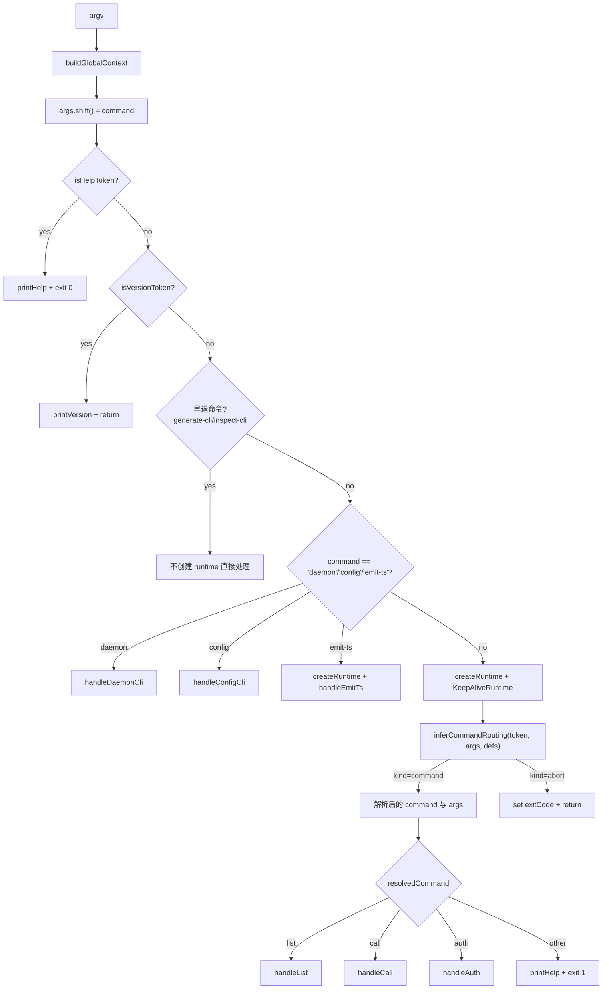
```mermaid
flowchart TD
  Argv["argv"] --> Ctx["buildGlobalContext"]
  Ctx --> Token["args.shift() = command"]
  Token --> Help{"isHelpToken?"}
  Help -->|yes| ShowHelp["printHelp + exit 0"]
  Help -->|no| Ver{"isVersionToken?"}
  Ver -->|yes| ShowVer["printVersion + return"]
  Ver -->|no| Early{"早退命令?<br/>generate-cli/inspect-cli"}
  Early -->|yes| EarlyHandle["不创建 runtime 直接处理"]
  Early -->|no| ConfigCfg{"command == 'daemon'/'config'/'emit-ts'?"}
  ConfigCfg -->|daemon| Dae["handleDaemonCli"]
  ConfigCfg -->|config| Cfg["handleConfigCli"]
  ConfigCfg -->|"emit-ts"| EmitTs["createRuntime + handleEmitTs"]
  ConfigCfg -->|no| BuildRT["createRuntime + KeepAliveRuntime"]
  BuildRT --> Infer["inferCommandRouting(token, args, defs)"]
  Infer -->|"kind=command"| Resolved["解析后的 command 与 args"]
  Resolved --> Switch{"resolvedCommand"}
  Switch -->|list| L[handleList]
  Switch -->|call| C[handleCall]
  Switch -->|auth| A[handleAuth]
  Switch -->|other| Bad["printHelp + exit 1"]
  Infer -->|"kind=abort"| Abort["set exitCode + return"]
```

`inferCommandRouting`（[src/cli/command-inference.ts:10-74]()）就是"`mcporter linear`"或"`mcporter linear.list_issues`" 这种省略动词写法能跑的原因。具体规则：

| 输入示例 | 推断结果 | 触发条件 |
|----------|----------|----------|
| `mcporter list ...` / `mcporter call ...` / `mcporter auth ...` | 透传 | `isExplicitCommand` ([command-inference.ts:86-88]()) |
| `mcporter describe linear` | `list linear` | 别名 |
| `mcporter list-tools` | `list` | 历史别名（隐藏） |
| `mcporter https://host/mcp.tool` | `call https://host/mcp.tool` | `splitHttpToolSelector` 命中 → 视为 HTTP 工具调用 |
| `mcporter https://host/mcp` | `list https://host/mcp` | URL 但无 `.tool` 后缀 |
| `mcporter linear.list_issues` | `call linear.list_issues` | `[.(]` 模式 |
| `mcporter 'linear.list_issues(...)'` | `call '...'` | 同上 |
| `mcporter linear` | `list linear` | 命中已配置 server 名 |
| `mcporter lnear`（拼错） | `list linear`（自动纠错）或 `Did you mean linear?` 退出 | Levenshtein 距离 ≤ `floor(maxLen × 0.3)` 自动纠正，否则给 suggest 后退出 |
| `mcporter lnear` 配置为空 | 透传给 commander → 报 "Unknown command" | `definitions.length === 0` 时不做匹配 |

Sources: [src/cli.ts:60-167](../../../project-repos/mcporter/src/cli.ts#L60-L167), [src/cli/command-inference.ts:10-99](../../../project-repos/mcporter/src/cli/command-inference.ts#L10-L99)

<details class="source-snippets">
<summary>引用源码</summary>

<!-- source-snippets:start -->

#### `src/cli.ts:60-167`

```typescript
    return;
  }

  // Early-exit command handlers that don't require runtime inference.
  if (command === 'generate-cli') {
    await handleGenerateCli(args, globalFlags);
    return;
  }
  if (command === 'inspect-cli') {
    await handleInspectCli(args);
    return;
  }
  const rootOverride = globalFlags['--root'];
  const configPath = runtimeOptions.configPath ?? globalFlags['--config'];
  const configResolution = resolveConfigPath(globalFlags['--config'], rootOverride ?? process.cwd());
  const configPathResolved = configPath ?? configResolution.path;
  // Only pass configPath to runtime options if it was explicitly provided (via --config flag or env var).
  // If not explicit, let loadConfigLayers handle the default resolution to avoid ENOENT on missing config.
  const runtimeOptionsWithPath = {
    ...runtimeOptions,
    configPath: configResolution.explicit ? configPathResolved : runtimeOptions.configPath,
  };

  if (command === 'daemon') {
    await handleDaemonCli(args, {
      configPath: configPathResolved,
      configExplicit: configResolution.explicit,
      rootDir: rootOverride,
    });
    return;
  }

  if (command === 'config') {
    await handleConfigCli(
      {
        loadOptions: { configPath, rootDir: rootOverride },
        invokeAuth: (authArgs) => invokeAuthCommand(runtimeOptionsWithPath, authArgs),
      },
      args
    );
    return;
  }

  if (command === 'emit-ts') {
    const runtime = await createRuntime(runtimeOptionsWithPath);
    try {
      await handleEmitTs(runtime, args);
    } finally {
      await runtime.close().catch(() => {});
    }
    return;
  }

  const baseRuntime = await createRuntime(runtimeOptionsWithPath);
  const keepAliveServers = new Set(
    baseRuntime
      .getDefinitions()
      .filter(isKeepAliveServer)
      .map((entry) => entry.name)
  );
  const daemonClient =
    keepAliveServers.size > 0
      ? new DaemonClient({
          configPath: configResolution.path,
          configExplicit: configResolution.explicit,
          rootDir: rootOverride,
        })
      : null;
  const runtime = createKeepAliveRuntime(baseRuntime, { daemonClient, keepAliveServers });

  const inference = inferCommandRouting(command, args, runtime.getDefinitions());
  if (inference.kind === 'abort') {
    process.exitCode = inference.exitCode;
    return;
  }
  const resolvedCommand = inference.command;
  const resolvedArgs = inference.args;

  try {
    if (resolvedCommand === 'list') {
      if (consumeHelpTokens(resolvedArgs)) {
        printListHelp();
        process.exitCode = 0;
        return;
      }
      await handleList(runtime, resolvedArgs);
      return;
    }

    if (resolvedCommand === 'call') {
      if (consumeHelpTokens(resolvedArgs)) {
        printCallHelp();
        process.exitCode = 0;
        return;
      }
      await runHandleCall(runtime, resolvedArgs);
      return;
    }

    if (resolvedCommand === 'auth') {
      if (consumeHelpTokens(resolvedArgs)) {
        printAuthHelp();
        process.exitCode = 0;
        return;
      }
      await handleAuth(runtime, resolvedArgs);
      return;
    }
```

#### `src/cli/command-inference.ts:10-99`

```typescript
export function inferCommandRouting(
  token: string,
  args: string[],
  definitions: readonly ServerDefinition[]
): CommandResult {
  if (!token) {
    return { kind: 'command', command: token, args };
  }

  if (token === 'describe') {
    return { kind: 'command', command: 'list', args };
  }

  // Hidden alias kept for muscle memory / older docs.
  if (token === 'list-tools') {
    return { kind: 'command', command: 'list', args };
  }

  if (isExplicitCommand(token)) {
    return { kind: 'command', command: token, args };
  }

  if (isHttpToolToken(token)) {
    return { kind: 'command', command: 'call', args: [token, ...args] };
  }

  if (isUrlToken(token)) {
    return { kind: 'command', command: 'list', args: [token, ...args] };
  }

  if (isCallLikeToken(token)) {
    return { kind: 'command', command: 'call', args: [token, ...args] };
  }

  if (definitions.length === 0) {
    return { kind: 'command', command: token, args };
  }

  const serverNames = definitions.map((entry) => entry.name);
  if (serverNames.includes(token)) {
    return { kind: 'command', command: 'list', args: [token, ...args] };
  }

  const resolution = chooseClosestIdentifier(token, serverNames);
  if (!resolution) {
    return { kind: 'command', command: token, args };
  }

  const messages = renderIdentifierResolutionMessages({
    entity: 'server',
    attempted: token,
    resolution,
  });

  if (resolution.kind === 'auto' && messages.auto) {
    console.log(dimText(messages.auto));
    return { kind: 'command', command: 'list', args: [resolution.value, ...args] };
  }

  if (messages.suggest) {
    console.error(yellowText(messages.suggest));
  }
  console.error(`Unknown MCP server '${token}'.`);
  return { kind: 'abort', exitCode: 1 };
}

function isCallLikeToken(token: string): boolean {
  if (!token) {
    return false;
  }
  if (looksLikeHttpUrl(token)) {
    return false;
  }
  return CALL_TOKEN_PATTERN.test(token);
}

function isExplicitCommand(token: string): boolean {
  return token === 'list' || token === 'call' || token === 'auth';
}

function isUrlToken(token: string): boolean {
  return looksLikeHttpUrl(token);
}

function isHttpToolToken(token: string): boolean {
  if (!token) {
    return false;
  }
  return splitHttpToolSelector(token) !== null;
}
```

<!-- source-snippets:end -->
</details>
## 命令分组详解

### `mcporter list`

`handleList`（[src/cli/list-command.ts:88-352]()）有两条路径：

1. **多服务器模式（`mcporter list`）**
   - `runtime.getDefinitions()` 扫一遍，对每个 server 用 `Promise` 并行跑 `runtime.listTools(name, { autoAuthorize: false, allowCachedAuth: true })`，按 `LIST_TIMEOUT_MS`（默认 30s）做超时切片。
   - TTY 下用 `ora` 显示 spinner，每完成一行调用 `renderServerListRow` 立即落屏。
   - 末尾汇总：`✔ Listed N servers (X healthy; Y auth required; Z offline; ...)`。
   - `--json` 切换到结构化输出，包含 `mode`/`counts`/`servers[]`。每个 entry 含 `status: 'ok'|'auth'|'offline'|'http'|'error'`、`durationMs`、错误信封等。

2. **单服务器模式（`mcporter list <name>`）**
   - 用 `loadToolMetadata(runtime, name, { includeSchema: true })` 拉到 `ToolMetadata[]`。
   - `printToolDetail` 把每个 tool 渲染成 TS 风格签名 + 注释。
   - 默认隐藏 optional 参数（按规则：required <4 且 optional ≤2 时全显，否则只显示 5 个；`--all-parameters` 强制全显）。
   - 末尾打印 `Examples:` 区块（CLI 调用样例）。
   - `--schema` 顺带展示完整 JSON schema。

`extractListFlags` 支持 `--http-url` / `--stdio` / `--env` / `--cwd` / `--name` / `--persist` / `--allow-http` 等临时服务器 flag。这些 flag 由 `prepareEphemeralServerTarget` 在 `runtime` 上注册一个 in-memory `ServerDefinition`（[src/cli/ephemeral-target.ts]()），与持久配置共享同一调用路径。
Sources: [src/cli/list-command.ts:88-352](../../../project-repos/mcporter/src/cli/list-command.ts#L88-L352), [src/cli/list-output.ts:35-69](../../../project-repos/mcporter/src/cli/list-output.ts#L35-L69)

<details class="source-snippets">
<summary>引用源码</summary>

<!-- source-snippets:start -->

#### `src/cli/list-command.ts:88-352`

```typescript
export async function handleList(
  runtime: Awaited<ReturnType<(typeof import('../runtime.js'))['createRuntime']>>,
  args: string[]
): Promise<void> {
  const flags = extractListFlags(args);
  let target = args.shift();

  if (target) {
    const split = splitHttpToolSelector(target);
    if (split) {
      target = split.baseUrl;
    }
  }

  const prepared = await prepareEphemeralServerTarget({
    runtime,
    target,
    ephemeral: flags.ephemeral,
  });
  target = prepared.target;

  if (!target) {
    const previousStdioLogMode = setStdioLogMode('silent');
    try {
      const servers = runtime.getDefinitions();
      const perServerTimeoutMs = flags.timeoutMs ?? LIST_TIMEOUT_MS;
      const perServerTimeoutSeconds = Math.round(perServerTimeoutMs / 1000);

      if (servers.length === 0) {
        if (flags.format === 'json') {
          const payload = {
            mode: 'list',
            counts: createEmptyStatusCounts(),
            servers: [] as ListJsonServerEntry[],
          };
          console.log(JSON.stringify(payload, null, 2));
        } else {
          console.log('No MCP servers configured.');
        }
        return;
      }

      if (flags.format === 'text') {
        console.log(
          `mcporter ${MCPORTER_VERSION} — Listing ${servers.length} server(s) (per-server timeout: ${perServerTimeoutSeconds}s)`
        );
      }
      const spinner =
        flags.format === 'text' && supportsSpinner
          ? ora(`Discovering ${servers.length} server(s)…`).start()
          : undefined;
      const renderedResults =
        flags.format === 'text'
          ? (Array.from({ length: servers.length }, () => undefined) as Array<
              ReturnType<typeof renderServerListRow> | undefined
            >)
          : undefined;
      const summaryResults: Array<ListSummaryResult | undefined> = Array.from(
        { length: servers.length },
        () => undefined
      );
      let completedCount = 0;

      const tasks = servers.map((server, index) =>
        (async (): Promise<ListSummaryResult> => {
          const startedAt = Date.now();
          try {
            const tools = await withTimeout(
              runtime.listTools(server.name, { autoAuthorize: false, allowCachedAuth: true }),
              perServerTimeoutMs
            );
            return {
              server,
              status: 'ok' as const,
              tools,
              durationMs: Date.now() - startedAt,
            };
          } catch (error) {
            return {
              server,
              status: 'error' as const,
              error,
              durationMs: Date.now() - startedAt,
            };
          }
        })().then((result) => {
          summaryResults[index] = result;
          if (renderedResults) {
            const rendered = renderServerListRow(result, perServerTimeoutMs, { verbose: flags.verbose });
            renderedResults[index] = rendered;
            completedCount += 1;
            if (spinner) {
              spinner.stop();
              console.log(rendered.line);
              const remaining = servers.length - completedCount;
              if (remaining > 0) {
                spinner.text = `Listing servers… ${completedCount}/${servers.length}`;
                spinner.start();
              }
            } else {
              console.log(rendered.line);
            }
          }
          return result;
        })
      );

      await Promise.all(tasks);

      if (flags.format === 'json') {
        const jsonEntries = summaryResults.map((entry, index) => {
          const serverDefinition = servers[index] ?? entry?.server ?? servers[0];
          if (!serverDefinition) {
            throw new Error('Unable to resolve server definition for JSON output.');
          }
          const normalizedEntry = entry ?? createUnknownResult(serverDefinition);
          return buildJsonListEntry(normalizedEntry, perServerTimeoutSeconds, {
            includeSchemas: Boolean(flags.schema),
            includeSources: Boolean(flags.verbose || flags.includeSources),
          });
... snippet truncated ...
```

#### `src/cli/list-output.ts:35-69`

```typescript
export function printSingleServerHeader(
  definition: ReturnType<Awaited<ReturnType<(typeof import('../runtime.js'))['createRuntime']>>['getDefinition']>,
  toolCount: number | undefined,
  durationMs: number | undefined,
  transportSummary: string,
  sourcePath: string | undefined,
  options?: { printSummaryNow?: boolean }
): string {
  const prefix = boldText(definition.name);
  if (definition.description) {
    console.log(`${prefix} - ${extraDimText(definition.description)}`);
  } else {
    console.log(prefix);
  }
  const summaryParts: string[] = [];
  summaryParts.push(
    extraDimText(typeof toolCount === 'number' ? `${toolCount} tool${toolCount === 1 ? '' : 's'}` : 'tools unavailable')
  );
  if (typeof durationMs === 'number') {
    summaryParts.push(extraDimText(`${durationMs}ms`));
  }
  if (transportSummary) {
    summaryParts.push(extraDimText(transportSummary));
  }
  if (sourcePath) {
    summaryParts.push(sourcePath);
  }
  const summaryLine = `  ${summaryParts.join(extraDimText(' · '))}`;
  if (options?.printSummaryNow === false) {
    console.log('');
  } else {
    console.log(summaryLine);
    console.log('');
  }
  return summaryLine;
```

<!-- source-snippets:end -->
</details>
### `mcporter call`

`handleCall`（[src/cli/call-command.ts:41-53]()）的执行流：

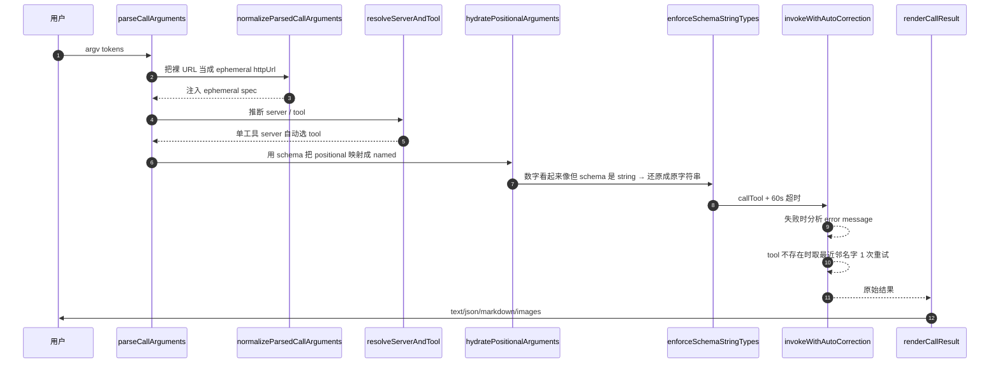
```mermaid
sequenceDiagram
  autonumber
  participant U as 用户
  participant Parse as parseCallArguments
  participant Norm as normalizeParsedCallArguments
  participant Resolve as resolveServerAndTool
  participant Hyd as hydratePositionalArguments
  participant Enf as enforceSchemaStringTypes
  participant Inv as invokeWithAutoCorrection
  participant Render as renderCallResult

  U->>Parse: argv tokens
  Parse->>Norm: 把裸 URL 当成 ephemeral httpUrl
  Norm-->>Parse: 注入 ephemeral spec
  Parse->>Resolve: 推断 server / tool
  Resolve-->>Parse: 单工具 server 自动选 tool
  Parse->>Hyd: 用 schema 把 positional 映射成 named
  Hyd->>Enf: 数字看起来像但 schema 是 string → 还原成原字符串
  Enf->>Inv: callTool + 60s 超时
  Inv-->>Inv: 失败时分析 error message
  Inv-->>Inv: tool 不存在时取最近邻名字 1 次重试
  Inv-->>Render: 原始结果
  Render->>U: text/json/markdown/images
```

关键安全/体验细节：

- **未知长 flag 不再静默吃掉**（[src/cli/call-arguments.ts:101-104]()）：`mcporter call x.y --source import` 直接报错；要传同名参数请用 `source=import` 或 `--args '{"source":"import"}'`。
- **数字字面量保护**：用户输入 `id=12345` 默认会被 `coerceValue` 转成 number；但如果 schema 声明字段是 string，`enforceSchemaStringTypes` 把它还原成原字符串（[src/cli/call-command.ts:268-303]()），避免 GitHub issue 类被 coerce 错。`--raw-strings` / `--no-coerce` 全局关闭转换。
- **自动纠错**：`maybeResolveToolName` 通过提取 `Tool xxx not found` 错误，再在该 server 的工具列表中找 Levenshtein 最近邻；命中 auto 阈值则换名字重试一次，否则只打印 `Did you mean ...?`（[src/cli/call-command.ts:454-483]()）。
- **`list_tools` / `help` 双重路由**：`maybeDescribeServer` 拦截 `mcporter call x.list_tools` 与（不存在 help 工具时的）`mcporter call x.help`，转发给 `handleList`（[src/cli/call-command.ts:201-234]()）。
- **`tool` 与 `server` 缩写**：在 trailing 参数里写 `tool=foo` / `server=bar` 而 result 里还没有这两个字段时，会被提升成正式选择器（[src/cli/call-arguments.ts:191-204]()）。

`--output` 控制输出：`auto` 根据响应自动决定 text/json/markdown；`text` / `json` / `raw` 强制；`--save-images <dir>` 把 image content 落盘；`--tail-log` 在响应里有 `log_path` 时尾追日志。
Sources: [src/cli/call-command.ts:41-167](../../../project-repos/mcporter/src/cli/call-command.ts#L41-L167), [src/cli/call-arguments.ts:67-228](../../../project-repos/mcporter/src/cli/call-arguments.ts#L67-L228)

<details class="source-snippets">
<summary>引用源码</summary>

<!-- source-snippets:start -->

#### `src/cli/call-command.ts:41-167`

```typescript
export async function handleCall(runtime: Runtime, args: string[]): Promise<void> {
  const prepared = await prepareCallRequest(runtime, args);
  if (!prepared) {
    return;
  }

  const invocation = await invokePreparedCall(runtime, prepared);
  if (!invocation) {
    return;
  }

  renderCallResult(invocation.result, prepared.parsed);
}

async function prepareCallRequest(runtime: Runtime, args: string[]): Promise<PreparedCallRequest | undefined> {
  const parsed = parseCallArguments(args);
  await normalizeParsedCallArguments(runtime, parsed);
  const { server, tool } = await resolveServerAndTool(runtime, parsed);

  if (await maybeDescribeServer(runtime, server, tool, parsed.output)) {
    return undefined;
  }

  const timeoutMs = resolveCallTimeout(parsed.timeoutMs);
  const hydratedArgs = await hydratePositionalArguments(runtime, server, tool, parsed.args, parsed.positionalArgs);
  const schemaAwareArgs = await enforceSchemaStringTypes(
    runtime,
    server,
    tool,
    hydratedArgs,
    parsed.schemaStringCoercionCandidates,
    timeoutMs
  );
  return { parsed, server, tool, hydratedArgs: schemaAwareArgs, timeoutMs };
}

async function normalizeParsedCallArguments(runtime: Runtime, parsed: CallArgsParseResult): Promise<void> {
  let ephemeralSpec = parsed.ephemeral ? { ...parsed.ephemeral } : undefined;
  const nameHints: string[] = [];
  const absorbUrlCandidate = (value: string | undefined): string | undefined => {
    if (!value) {
      return value;
    }
    const normalized = normalizeHttpUrlCandidate(value);
    if (!normalized) {
      return value;
    }
    if (!ephemeralSpec) {
      ephemeralSpec = { httpUrl: normalized };
    } else if (!ephemeralSpec.httpUrl) {
      ephemeralSpec = { ...ephemeralSpec, httpUrl: normalized };
    }
    return undefined;
  };

  parsed.server = absorbUrlCandidate(parsed.server);
  parsed.selector = absorbUrlCandidate(parsed.selector);

  if (ephemeralSpec && parsed.server && !looksLikeHttpUrl(parsed.server)) {
    nameHints.push(parsed.server);
    parsed.server = undefined;
  }

  if (ephemeralSpec?.httpUrl && !ephemeralSpec.name && parsed.tool) {
    const candidate = parsed.selector && !looksLikeHttpUrl(parsed.selector) ? parsed.selector : undefined;
    if (candidate) {
      nameHints.push(candidate);
      parsed.selector = undefined;
    }
  }

  const prepared = await prepareEphemeralServerTarget({
    runtime,
    target: parsed.server,
    ephemeral: ephemeralSpec,
    nameHints,
    reuseFromSpec: true,
  });

  parsed.server = prepared.target;
  if (!parsed.selector) {
    parsed.selector = prepared.target;
  }
}

async function resolveServerAndTool(runtime: Runtime, parsed: CallArgsParseResult): Promise<ResolvedCallTarget> {
  const target = resolveCallTarget(parsed, { allowMissingTool: true });
  const server = target.server;
  let tool = target.tool;
  if (!server) {
    throw new Error('Missing server name. Provide it via <server>.<tool> or --server.');
  }
  if (!tool) {
    tool = await inferSingleToolName(runtime, server);
    if (!tool) {
      throw new Error('Missing tool name. Provide it via <server>.<tool> or --tool.');
    }
  }
  return { server, tool };
}

async function invokePreparedCall(
  runtime: Runtime,
  prepared: PreparedCallRequest
): Promise<{ result: unknown; resolvedTool: string } | undefined> {
  let invocation: { result: unknown; resolvedTool: string };
  try {
    invocation = await invokeWithAutoCorrection(
      runtime,
      prepared.server,
      prepared.tool,
      prepared.hydratedArgs,
      prepared.timeoutMs
    );
  } catch (error) {
    const issue = maybeReportConnectionIssue(prepared.server, prepared.tool, error);
    if (prepared.parsed.output === 'json' || prepared.parsed.output === 'raw') {
      const payload = buildConnectionIssueEnvelope({ server: prepared.server, tool: prepared.tool, error, issue });
      console.log(JSON.stringify(payload, null, 2));
      process.exitCode = 1;
... snippet truncated ...
```

#### `src/cli/call-arguments.ts:67-228`

```typescript
export function parseCallArguments(args: string[]): CallArgsParseResult {
  const result: CallArgsParseResult = { args: {}, tailLog: false, output: 'auto' };
  const flagState: FlagParseState = { coercionMode: 'default' };
  const ephemeral = extractEphemeralServerFlags(args);
  result.ephemeral = ephemeral;
  result.output = consumeOutputFormat(args, {
    defaultFormat: 'auto',
  });
  const { positional, literalPositional } = scanCallTokens(args, result, flagState);
  const { callExpressionProvidedServer, callExpressionProvidedTool } = applyLeadingCallExpression(positional, result);
  resolveSelectorAndTool(positional, result, callExpressionProvidedServer, callExpressionProvidedTool);
  applyTrailingArguments(positional, result, flagState);
  appendLiteralPositionalArguments(literalPositional, result, flagState);
  return result;
}

function scanCallTokens(args: string[], result: CallArgsParseResult, state: FlagParseState): ScannedCallTokens {
  const positional: string[] = [];
  const literalPositional: string[] = [];
  let index = 0;
  while (index < args.length) {
    const token = args[index];
    if (!token) {
      index += 1;
      continue;
    }
    if (token === '--') {
      literalPositional.push(...args.slice(index + 1).filter(Boolean));
      break;
    }
    const flagHandler = FLAG_HANDLERS[token];
    if (flagHandler) {
      index = flagHandler({ args, index, result, state });
      continue;
    }
    if (token.startsWith('--')) {
      throw new CliUsageError(buildUnknownCallFlagMessage(token));
    }
    positional.push(token);
    index += 1;
  }
  return { positional, literalPositional };
}

function applyLeadingCallExpression(positional: string[], result: CallArgsParseResult): CallExpressionResolution {
  if (positional.length === 0) {
    return { callExpressionProvidedServer: false, callExpressionProvidedTool: false };
  }
  const rawToken = positional[0] ?? '';
  const callExpression = parseLeadingCallExpression(rawToken);
  if (!callExpression) {
    return { callExpressionProvidedServer: false, callExpressionProvidedTool: false };
  }
  positional.shift();
  if (callExpression.server) {
    if (result.server && result.server !== callExpression.server) {
      throw new Error(
        `Conflicting server names: '${result.server}' from flags and '${callExpression.server}' from call expression.`
      );
    }
    result.server = result.server ?? callExpression.server;
  }
  if (result.tool && result.tool !== callExpression.tool) {
    throw new Error(
      `Conflicting tool names: '${result.tool}' from flags and '${callExpression.tool}' from call expression.`
    );
  }
  result.tool = callExpression.tool;
  Object.assign(result.args, callExpression.args);
  if (callExpression.positionalArgs && callExpression.positionalArgs.length > 0) {
    result.positionalArgs = [...(result.positionalArgs ?? []), ...callExpression.positionalArgs];
  }
  return {
    callExpressionProvidedServer: Boolean(callExpression.server),
    callExpressionProvidedTool: Boolean(callExpression.tool),
  };
}

function resolveSelectorAndTool(
  positional: string[],
  result: CallArgsParseResult,
  callExpressionProvidedServer: boolean,
  callExpressionProvidedTool: boolean
): void {
  if (!result.selector && positional.length > 0 && !callExpressionProvidedServer && !result.server) {
    result.selector = positional.shift();
  }
  if (
    !result.server &&
    result.selector &&
    shouldPromoteSelectorToCommand(result.selector) &&
    !result.ephemeral?.stdioCommand
  ) {
    result.ephemeral = { ...result.ephemeral, stdioCommand: result.selector };
    result.selector = undefined;
  }
  const nextPositional = positional[0];
  if (
    !result.tool &&
    nextPositional !== undefined &&
    !nextPositional.includes('=') &&
    !nextPositional.includes(':') &&
    !callExpressionProvidedTool
  ) {
    result.tool = positional.shift();
  }
}

function applyTrailingArguments(positional: string[], result: CallArgsParseResult, state: FlagParseState): void {
  const trailingPositional: unknown[] = [];
  for (let index = 0; index < positional.length; ) {
    const token = positional[index];
    if (!token) {
      index += 1;
      continue;
    }
    const parsed = parseKeyValueToken(token, positional[index + 1]);
    if (!parsed) {
      trailingPositional.push(coerceValue(token, state.coercionMode));
      index += 1;
... snippet truncated ...
```

<!-- source-snippets:end -->
</details>
### `mcporter auth`

`handleAuth`（[src/cli/auth-command.ts:16-86]()）：

- 支持 `--reset`：清空目标 server 的 OAuth 缓存（vault + 自定义 dir + 已知遗留路径如 `~/.gmail-mcp/credentials.json`）。
- 支持 `--http-url` / `--stdio` 临时 server——和 `list` / `call` 共享 `prepareEphemeralServerTarget`。
- stdio + 显式 `oauthCommand` 的场景（如 gmail）会直接 `spawn(definition.command.command, [...args, ...oauthCommand.args], { stdio: 'inherit' })`，让用户跟着 stdout/stderr 提示走。
- HTTP 场景直接调 `runtime.listTools(target, { autoAuthorize: true })`：listTools 在底层会触发 `connectWithAuth`，浏览器授权完成后立即返回工具数量作为成功信号。
- 一次失败若是 `auth` 类（说明服务器在初次匿名连接后 401），自动重试一轮浏览器流程；第二次仍失败按 text 抛错，`--json` 模式则输出 `buildConnectionIssueEnvelope`（[src/cli/auth-command.ts:67-83]()）。

Sources: [src/cli/auth-command.ts:16-86](../../../project-repos/mcporter/src/cli/auth-command.ts#L16-L86)

<details class="source-snippets">
<summary>引用源码</summary>

<!-- source-snippets:start -->

#### `src/cli/auth-command.ts:16-86`

```typescript
export async function handleAuth(runtime: Runtime, args: string[]): Promise<void> {
  const resetIndex = args.indexOf('--reset');
  const shouldReset = resetIndex !== -1;
  if (shouldReset) {
    args.splice(resetIndex, 1);
  }
  const format = consumeOutputFormat(args, {
    defaultFormat: 'text',
    allowed: ['text', 'json'],
    enableRawShortcut: false,
    jsonShortcutFlag: '--json',
  }) as 'text' | 'json';
  const ephemeralSpec: EphemeralServerSpec | undefined = extractEphemeralServerFlags(args);
  let target = args.shift();
  const nameHints: string[] = [];
  if (ephemeralSpec && target && !looksLikeHttpUrl(target)) {
    nameHints.push(target);
  }

  const prepared = await prepareEphemeralServerTarget({
    runtime,
    target,
    ephemeral: ephemeralSpec,
    nameHints,
    reuseFromSpec: true,
  });
  target = prepared.target;

  if (!target) {
    throw new Error('Usage: mcporter auth <server | url> [--http-url <url> | --stdio <command>]');
  }

  const definition = runtime.getDefinition(target);
  if (shouldReset) {
    await clearOAuthCaches(definition);
    logInfo(`Cleared cached credentials for '${target}'.`);
  }

  if (definition.command.kind === 'stdio' && definition.oauthCommand) {
    logInfo(`Starting auth helper for '${target}' (stdio). Leave this running until the browser flow completes.`);
    await runStdioAuth(definition);
    logInfo(`Auth helper for '${target}' finished. You can now call tools.`);
    return;
  }

  for (let attempt = 0; attempt < 2; attempt += 1) {
    try {
      logInfo(`Initiating OAuth flow for '${target}'...`);
      const tools = await runtime.listTools(target, { autoAuthorize: true });
      logInfo(`Authorization complete. ${tools.length} tool${tools.length === 1 ? '' : 's'} available.`);
      return;
    } catch (error) {
      if (attempt === 0 && shouldRetryAuthError(error)) {
        logWarn('Server signaled OAuth after the initial attempt. Retrying with browser flow...');
        continue;
      }
      const message = error instanceof Error ? error.message : String(error);
      if (format === 'json') {
        const payload = buildConnectionIssueEnvelope({
          server: target,
          error,
          issue: analyzeConnectionError(error),
        });
        console.log(JSON.stringify(payload, null, 2));
        process.exitCode = 1;
        return;
      }
      throw new Error(`Failed to authorize '${target}': ${message}`, { cause: error });
    }
  }
}
```

<!-- source-snippets:end -->
</details>
### `mcporter config`

`handleConfigCli` 是一个简单的子命令分发表（[src/cli/config-command.ts:12-67]()）：

| 子命令 | 文件 | 行为概览 |
|--------|------|----------|
| `list` | `src/cli/config/list.ts` | 默认仅展示 local 条目，TTY 下额外列出每个 import 来源的统计 + 样例名；`--source import` 切换查看 |
| `get` | `src/cli/config/get.ts` | 模糊匹配名字 + 文本/JSON 输出 |
| `add` | `src/cli/config/add.ts` | `--scope home/project`、`--persist <path>`、`--copy-from`、`--dry-run` |
| `remove` | `src/cli/config/remove.ts` | 反向操作；模糊纠错 |
| `import` | `src/cli/config/import.ts` | `mcporter config import <kind> --copy` 把编辑器 entries 拷到本地 |
| `login` / `logout` | `src/cli/config/auth.ts` | 同 auth 命令路径 |
| `doctor` | `src/cli/config/doctor.ts` | 体检：layer 路径 + 占位符解析 + 权限 |
| `help` | `src/cli/config/help.ts` | 输出 config 子命令 help |

每个子命令都遵循"`--config` / `--root` 与全局 flag 共用，写操作前 `resolveWriteTarget` 选定目标文件"。`add` 的写入路径解析见 [配置加载与导入](#configuration)。
Sources: [src/cli/config-command.ts:12-67](../../../project-repos/mcporter/src/cli/config-command.ts#L12-L67)

<details class="source-snippets">
<summary>引用源码</summary>

<!-- source-snippets:start -->

#### `src/cli/config-command.ts:12-67`

```typescript
export async function handleConfigCli(options: ConfigCliOptions, args: string[]): Promise<void> {
  const initialToken = args[0];
  if (args.length === 0 || (initialToken && isHelpToken(initialToken))) {
    printConfigHelp();
    return;
  }

  const subcommand = args.shift();
  if (!subcommand) {
    printConfigHelp();
    return;
  }

  if (subcommand === 'help') {
    const target = args[0];
    if (!target || isHelpToken(target)) {
      printConfigHelp();
    } else {
      printConfigHelp(target);
    }
    return;
  }

  if (consumeInlineHelpTokens(args)) {
    printConfigHelp(subcommand);
    return;
  }

  switch (subcommand as ConfigSubcommand) {
    case 'list':
      await handleListCommand(options, args);
      return;
    case 'get':
      await handleGetCommand(options, args);
      return;
    case 'add':
      await handleAddCommand(options, args);
      return;
    case 'remove':
      await handleRemoveCommand(options, args);
      return;
    case 'import':
      await handleImportCommand(options, args);
      return;
    case 'login':
      await handleLoginCommand(options, args);
      return;
    case 'logout':
      await handleLogoutCommand(options, args);
      return;
    case 'doctor':
      await handleDoctorCommand(options, args);
      return;
    default:
      throw new CliUsageError(`Unknown config subcommand '${subcommand}'. Run 'mcporter config --help'.`);
  }
```

<!-- source-snippets:end -->
</details>
### `mcporter daemon`

`handleDaemonCli`（[src/cli/daemon-command.ts:26-58]()）只有 4 个动作：

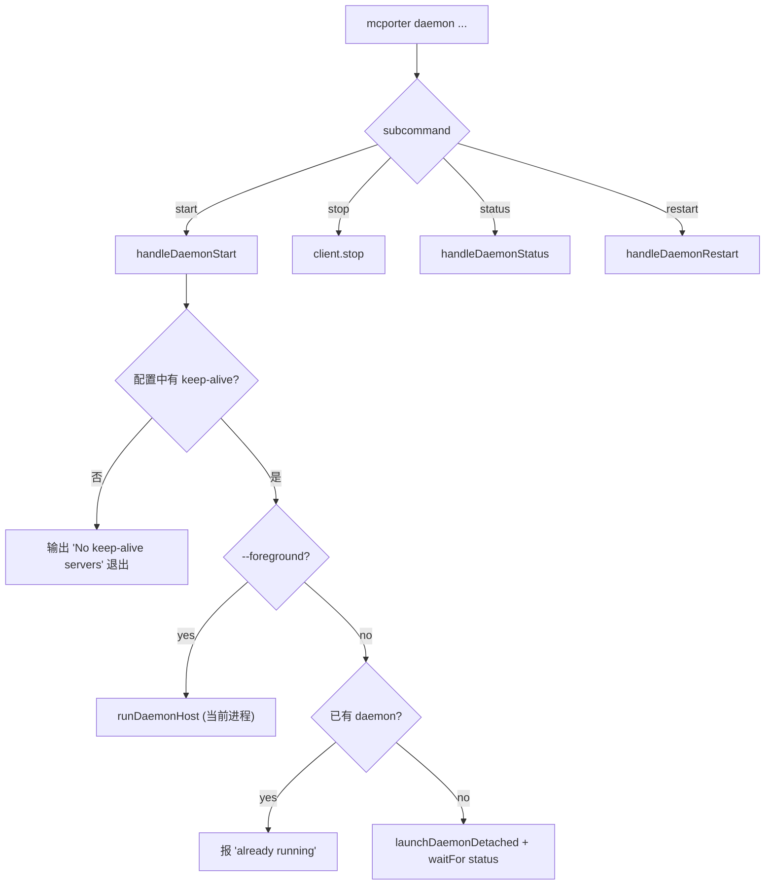
```mermaid
graph TD
  CLI["mcporter daemon ..."] --> SC{subcommand}
  SC -->|start| ST["handleDaemonStart"]
  SC -->|stop| SP["client.stop"]
  SC -->|status| SS["handleDaemonStatus"]
  SC -->|restart| SR["handleDaemonRestart"]
  ST --> KA{"配置中有 keep-alive?"}
  KA -->|"否"| Bail["输出 'No keep-alive servers' 退出"]
  KA -->|"是"| FG{"--foreground?"}
  FG -->|yes| Host["runDaemonHost (当前进程)"]
  FG -->|no| EXIST{"已有 daemon?"}
  EXIST -->|yes| Skip["报 'already running'"]
  EXIST -->|no| Detach["launchDaemonDetached + waitFor status"]
```

附加 flag：`--log` / `--log-file <path>` / `--log-servers a,b` 控制日志覆盖。具体协议详见 [daemon 章节](#daemon)。
Sources: [src/cli/daemon-command.ts:26-138](../../../project-repos/mcporter/src/cli/daemon-command.ts#L26-L138)

<details class="source-snippets">
<summary>引用源码</summary>

<!-- source-snippets:start -->

#### `src/cli/daemon-command.ts:26-138`

```typescript
export async function handleDaemonCli(args: string[], options: DaemonCliOptions): Promise<void> {
  const subcommand = args.shift();
  if (!subcommand || subcommand === 'help' || subcommand === '--help') {
    printDaemonHelp();
    return;
  }

  const client = new DaemonClient({
    configPath: options.configPath,
    configExplicit: options.configExplicit,
    rootDir: options.rootDir,
  });

  if (subcommand === 'start') {
    await handleDaemonStart(args, options, client);
    return;
  }
  if (subcommand === 'status') {
    await handleDaemonStatus(client);
    return;
  }
  if (subcommand === 'stop') {
    await client.stop();
    console.log('Daemon stopped (if it was running).');
    return;
  }
  if (subcommand === 'restart') {
    await handleDaemonRestart(args, options, client);
    return;
  }

  throw new Error(`Unknown daemon subcommand '${subcommand}'.`);
}

function printDaemonHelp(): void {
  console.log(`Usage: mcporter daemon <start|status|stop|restart>

Commands:
  start    Start the keep-alive daemon (auto-detects keep-alive servers).
  status   Show whether the daemon is running and which servers are active.
  stop     Shut down the daemon and all managed servers.
  restart  Stop the daemon (if running) and start a fresh instance.

Flags:
  --foreground        Run the daemon in the current process (debug only).
  --log               Enable daemon logging (defaults to ~/.mcporter/daemon/daemon-<hash>.log).
  --log-file <path>   Write daemon stdout/stderr to a specific log file.
  --log-servers <csv> Only log call activity for the listed servers (implies --log).`);
}

async function handleDaemonStart(args: string[], options: DaemonCliOptions, client: DaemonClient): Promise<void> {
  const foregroundFlag = consumeFlag(args, '--foreground');
  const isChildLaunch = process.env.MCPORTER_DAEMON_CHILD === '1';
  const foreground = foregroundFlag || isChildLaunch;

  const paths = resolveDaemonPaths(options.configPath);
  const socketPath = process.env.MCPORTER_DAEMON_SOCKET ?? paths.socketPath;
  const metadataPath = process.env.MCPORTER_DAEMON_METADATA ?? paths.metadataPath;
  const logging = await resolveDaemonLoggingOptions(args, paths.key);

  const runtime = await createRuntime({
    configPath: options.configExplicit ? options.configPath : undefined,
    rootDir: options.rootDir,
  });
  const keepAlive = runtime.getDefinitions().filter(isKeepAliveServer);
  await runtime.close().catch(() => {});
  if (keepAlive.length === 0) {
    console.log('No MCP servers are configured for keep-alive; daemon not started.');
    return;
  }

  if (foreground) {
    await runDaemonHost({
      socketPath,
      metadataPath,
      configPath: options.configPath,
      configExplicit: options.configExplicit,
      rootDir: options.rootDir,
      logPath: logging.enabled ? logging.logPath : undefined,
      logServers: logging.serverFilter,
      logAllServers: logging.logAllServers,
    });
    return;
  }

  const existing = await client.status();
  if (existing) {
    console.log(`Daemon already running (pid ${existing.pid}).`);
    return;
  }

  const forwardedArgs: string[] = [];
  if (logging.enabled && logging.logPath) {
    forwardedArgs.push('--log-file', logging.logPath);
  }
  if (logging.serverFilter.size > 0) {
    forwardedArgs.push('--log-servers', Array.from(logging.serverFilter).join(','));
  }

  launchDaemonDetached({
    configPath: options.configPath,
    configExplicit: options.configExplicit,
    rootDir: options.rootDir,
    metadataPath,
    socketPath,
    extraArgs: forwardedArgs,
  });
  const ready = await waitFor(() => client.status(), 10_000, 100);
  if (!ready) {
    throw new Error('Failed to start daemon before timeout expired.');
  }
  console.log(`Daemon started for ${keepAlive.length} server(s).`);
}
```

<!-- source-snippets:end -->
</details>
### `mcporter generate-cli` / `inspect-cli` / `emit-ts`

这三个生成相关命令的入口在 [代码生成章节](#code-generation) 详细展开。从命令路由角度看：

- `generate-cli` 与 `inspect-cli` 在 [src/cli.ts:64-71]() 被列为"early-exit 命令"——**不创建 runtime**，直接处理参数。原因是 generate 默认通过 `--server` / `--command` 自带服务器引用，不需要预加载完整 config layers。
- `emit-ts` 走 runtime 路径但用单独的 `try { handleEmitTs } finally { runtime.close() }`，用完即关，不参与 keep-alive daemon 包装（[src/cli.ts:103-111]()）。

Sources: [src/cli.ts:64-111](../../../project-repos/mcporter/src/cli.ts#L64-L111), [src/cli/generate-cli-runner.ts:10-83](../../../project-repos/mcporter/src/cli/generate-cli-runner.ts#L10-L83), [src/cli/inspect-cli-command.ts:13-50](../../../project-repos/mcporter/src/cli/inspect-cli-command.ts#L13-L50)

<details class="source-snippets">
<summary>引用源码</summary>

<!-- source-snippets:start -->

#### `src/cli.ts:64-111`

```typescript
  if (command === 'generate-cli') {
    await handleGenerateCli(args, globalFlags);
    return;
  }
  if (command === 'inspect-cli') {
    await handleInspectCli(args);
    return;
  }
  const rootOverride = globalFlags['--root'];
  const configPath = runtimeOptions.configPath ?? globalFlags['--config'];
  const configResolution = resolveConfigPath(globalFlags['--config'], rootOverride ?? process.cwd());
  const configPathResolved = configPath ?? configResolution.path;
  // Only pass configPath to runtime options if it was explicitly provided (via --config flag or env var).
  // If not explicit, let loadConfigLayers handle the default resolution to avoid ENOENT on missing config.
  const runtimeOptionsWithPath = {
    ...runtimeOptions,
    configPath: configResolution.explicit ? configPathResolved : runtimeOptions.configPath,
  };

  if (command === 'daemon') {
    await handleDaemonCli(args, {
      configPath: configPathResolved,
      configExplicit: configResolution.explicit,
      rootDir: rootOverride,
    });
    return;
  }

  if (command === 'config') {
    await handleConfigCli(
      {
        loadOptions: { configPath, rootDir: rootOverride },
        invokeAuth: (authArgs) => invokeAuthCommand(runtimeOptionsWithPath, authArgs),
      },
      args
    );
    return;
  }

  if (command === 'emit-ts') {
    const runtime = await createRuntime(runtimeOptionsWithPath);
    try {
      await handleEmitTs(runtime, args);
    } finally {
      await runtime.close().catch(() => {});
    }
    return;
  }
```

#### `src/cli/generate-cli-runner.ts:10-83`

```typescript
export async function handleGenerateCli(args: string[], globalFlags: FlagMap): Promise<void> {
  const parsed = parseGenerateFlags(args);
  if (parsed.includeTools && parsed.excludeTools) {
    throw new Error('--include-tools and --exclude-tools cannot be used together.');
  }
  if (parsed.includeTools && parsed.includeTools.length === 0) {
    throw new Error('--include-tools requires at least one tool name.');
  }
  if (parsed.excludeTools && parsed.excludeTools.length === 0) {
    throw new Error('--exclude-tools requires at least one tool name.');
  }
  if (parsed.from && (parsed.command || parsed.description || parsed.name)) {
    throw new Error('--from cannot be combined with --command/--description/--name.');
  }
  if (parsed.dryRun && !parsed.from) {
    throw new Error('--dry-run currently requires --from <artifact>.');
  }

  if (parsed.from) {
    const metadata = await readCliMetadata(parsed.from);
    const request = resolveGenerateRequestFromArtifact(parsed, metadata, globalFlags);
    if (parsed.dryRun) {
      const command = buildGenerateCliCommand(
        {
          serverRef: request.serverRef,
          configPath: request.configPath,
          rootDir: request.rootDir,
          outputPath: request.outputPath,
          bundle: request.bundle,
          compile: request.compile,
          runtime: request.runtime ?? 'node',
          timeoutMs: request.timeoutMs ?? 30_000,
          minify: request.minify ?? false,
          includeTools: request.includeTools,
          excludeTools: request.excludeTools,
        },
        metadata.server.definition,
        globalFlags
      );
      console.log('Dry run — would execute:');
      console.log(`  ${command}`);
      return;
    }
    await performGenerateFromArtifact(metadata, request);
    return;
  }

  const inferredName = parsed.name ?? (parsed.command ? inferNameFromCommand(parsed.command) : undefined);
  const serverRef =
    parsed.server ??
    (parsed.command && inferredName
      ? JSON.stringify(buildInlineServerDefinition(inferredName, parsed.command, parsed.description))
      : undefined);
  if (!serverRef) {
    throw new Error(
      'Provide --server with a definition or a command we can infer a name from (use --name to override).'
    );
  }
  await performGenerateFromRequest({
    serverRef,
    configPath: globalFlags['--config'],
    rootDir: globalFlags['--root'],
    outputPath: parsed.output,
    runtime: parsed.runtime,
    bundler: parsed.bundler,
    bundle: parsed.bundle,
    timeoutMs: parsed.timeout,
    compile: parsed.compile,
    minify: parsed.minify ?? false,
    includeTools: parsed.includeTools,
    excludeTools: parsed.excludeTools,
  });
}
```

#### `src/cli/inspect-cli-command.ts:13-50`

```typescript
export async function handleInspectCli(args: string[]): Promise<void> {
  const parsed = parseInspectFlags(args);
  const metadata = await readCliMetadata(parsed.artifactPath);
  if (parsed.format === 'json') {
    console.log(JSON.stringify(metadata, null, 2));
    return;
  }
  console.log(`Artifact: ${formatPathForDisplay(metadata.artifact.path)} (${metadata.artifact.kind})`);
  console.log(`Server: ${metadata.server.name}`);
  if (metadata.server.source) {
    const suffix = formatSourceSuffix(metadata.server.source, true);
    if (suffix) {
      console.log(`Source: ${suffix}`);
    }
  }
  console.log(
    `Generated: ${new Date(metadata.generatedAt).toISOString()} via ${metadata.generator.name}@${
      metadata.generator.version
    }`
  );
  if (metadata.invocation.runtime) {
    console.log(`Runtime: ${metadata.invocation.runtime}`);
  }
  console.log('Invocation flags:');
  for (const [key, value] of Object.entries(metadata.invocation)) {
    if (value === undefined || value === null || key === 'runtime') {
      continue;
    }
    console.log(`  ${key}: ${Array.isArray(value) ? JSON.stringify(value) : String(value)}`);
  }
  const dryRunCommand = buildGenerateCliCommand(metadata.invocation, metadata.server.definition);
  console.log('Regenerate with:');
  console.log(`  mcporter generate-cli --from ${shellQuote(parsed.artifactPath)}`);
  if (dryRunCommand) {
    console.log('Underlying generate-cli command:');
    console.log(`  ${dryRunCommand}`);
  }
}
```

<!-- source-snippets:end -->
</details>
## Help / version 路由

`isHelpToken` / `isVersionToken` 在 [src/cli/help-output.ts:174-192]() 定义，识别 `--help|-h|help` 与 `--version|-v|-V`。`consumeHelpTokens` 反向扫描 args 数组、把所有 help token 摘掉（[src/cli/help-output.ts:178-188]()）——这让 `mcporter list --help`、`mcporter call linear --help linear.list_issues` 这样的写法都能进入对应子命令的 `printXxxHelp`。

`printVersion` 优先读 `package.json`（开发模式 / 安装到 dist 都有效），失败时回退 `MCPORTER_VERSION` 常量。
Sources: [src/cli/help-output.ts:174-208](../../../project-repos/mcporter/src/cli/help-output.ts#L174-L208)

<details class="source-snippets">
<summary>引用源码</summary>

<!-- source-snippets:start -->

#### `src/cli/help-output.ts:174-208`

```typescript
export function isHelpToken(token: string): boolean {
  return token === '--help' || token === '-h' || token === 'help';
}

export function consumeHelpTokens(args: string[]): boolean {
  let found = false;
  for (let index = args.length - 1; index >= 0; index -= 1) {
    const token = args[index];
    if (token && isHelpToken(token)) {
      args.splice(index, 1);
      found = true;
    }
  }
  return found;
}

export function isVersionToken(token: string): boolean {
  return token === '--version' || token === '-v' || token === '-V';
}

export async function printVersion(): Promise<void> {
  console.log(await resolveCliVersion());
}

async function resolveCliVersion(): Promise<string> {
  try {
    const packageJsonPath = new URL('../../package.json', import.meta.url);
    const buffer = await fsPromises.readFile(packageJsonPath, 'utf8');
    const pkg = JSON.parse(buffer) as { version?: string };
    return pkg.version ?? MCPORTER_VERSION;
  } catch {
    return MCPORTER_VERSION;
  }
}
```

<!-- source-snippets:end -->
</details>
## 进程退出与"force exit"

`runCli` 的 finally 块（[src/cli.ts:168-203]()）执行三步：

1. `runtime.close()`（带 hang 调试输出当 `MCPORTER_DEBUG_HANG=1`）。
2. `terminateChildProcesses('runtime.finally')`：兜底杀掉残留 stdio 子进程。
3. `process.exit(0)` 或 `setImmediate(scheduleExit)`：默认强制退出，避免 stdio 句柄泄漏阻塞 Node event loop。

`MCPORTER_NO_FORCE_EXIT=1` 关闭强制退出（开发场景需要 hot-reload 时使用）；`MCPORTER_FORCE_EXIT=1` 即使在 `MCPORTER_NO_FORCE_EXIT=1` 下也强制退出（用于测试覆盖）。
Sources: [src/cli.ts:168-204](../../../project-repos/mcporter/src/cli.ts#L168-L204)

<details class="source-snippets">
<summary>引用源码</summary>

<!-- source-snippets:start -->

#### `src/cli.ts:168-204`

```typescript
  } finally {
    const closeStart = Date.now();
    if (DEBUG_HANG) {
      logInfo('[debug] beginning runtime.close()');
      dumpActiveHandles('before runtime.close');
    }
    try {
      await runtime.close();
      if (DEBUG_HANG) {
        const duration = Date.now() - closeStart;
        logInfo(`[debug] runtime.close() completed in ${duration}ms`);
        dumpActiveHandles('after runtime.close');
      }
    } catch (error) {
      if (DEBUG_HANG) {
        logError('[debug] runtime.close() failed', error);
      }
    } finally {
      terminateChildProcesses('runtime.finally');
      // By default we force an exit after cleanup so Node doesn't hang on lingering stdio handles
      // (see typescript-sdk#579/#780/#1049). Opt out by exporting MCPORTER_NO_FORCE_EXIT=1.
      const disableForceExit = process.env.MCPORTER_NO_FORCE_EXIT === '1';
      if (DEBUG_HANG) {
        dumpActiveHandles('after terminateChildProcesses');
        if (!disableForceExit || process.env.MCPORTER_FORCE_EXIT === '1') {
          process.exit(0);
        }
      } else {
        const scheduleExit = () => {
          if (!disableForceExit || process.env.MCPORTER_FORCE_EXIT === '1') {
            process.exit(0);
          }
        };
        setImmediate(scheduleExit);
      }
    }
  }
```

<!-- source-snippets:end -->
</details>
## CliUsageError 与统一错误信封

`runCli` 抛 `CliUsageError` 时仅打印 message + 退出 1，不带 stacktrace（[src/cli.ts:215-223]()）。其它 Error 走默认 `logError(message, error)`。`call` / `auth` / `list` 在 `--output json` 模式下统一用 `buildConnectionIssueEnvelope` 输出 `{ server, tool?, issue: { kind, statusCode, ... }, error: <message> }`，方便上游脚本机读处理。
Sources: [src/cli.ts:215-223](../../../project-repos/mcporter/src/cli.ts#L215-L223), [src/cli/json-output.ts](../../../project-repos/mcporter/src/cli/json-output.ts), [src/cli/call-command.ts:494-521](../../../project-repos/mcporter/src/cli/call-command.ts#L494-L521)

<details class="source-snippets">
<summary>引用源码</summary>

<!-- source-snippets:start -->

#### `src/cli.ts:215-223`

```typescript
  main().catch((error) => {
    if (error instanceof CliUsageError) {
      logError(error.message);
      process.exit(1);
      return;
    }
    const message = error instanceof Error ? error.message : String(error);
    logError(message, error instanceof Error ? error : undefined);
    process.exit(1);
```

#### `src/cli/json-output.ts`

```typescript
import type { ConnectionIssue } from '../error-classifier.js';

export interface ConnectionIssueEnvelope {
  server: string;
  tool?: string;
  error: string;
  issue?: SerializedConnectionIssue;
}

export interface SerializedConnectionIssue {
  kind: ConnectionIssue['kind'];
  statusCode?: number;
  stdioExitCode?: number;
  stdioSignal?: string;
  rawMessage?: string;
}

export function buildConnectionIssueEnvelope(params: {
  server: string;
  tool?: string;
  error: unknown;
  issue?: ConnectionIssue;
}): ConnectionIssueEnvelope {
  return {
    server: params.server,
    tool: params.tool,
    error: formatErrorMessage(params.error),
    issue: serializeConnectionIssue(params.issue),
  };
}

export function serializeConnectionIssue(issue?: ConnectionIssue): SerializedConnectionIssue | undefined {
  if (!issue) {
    return undefined;
  }
  return {
    kind: issue.kind,
    statusCode: issue.statusCode,
    stdioExitCode: issue.stdioExitCode,
    stdioSignal: issue.stdioSignal,
    rawMessage: issue.rawMessage,
  };
}

export function formatErrorMessage(error: unknown): string {
  if (error instanceof Error) {
    return error.message ?? 'Unknown error';
  }
  if (typeof error === 'string') {
    return error;
  }
  if (error === undefined || error === null) {
    return 'Unknown error';
  }
  try {
    return JSON.stringify(error);
  } catch {
    return 'Unknown error';
  }
}
```

#### `src/cli/call-command.ts:494-521`

```typescript
function maybeReportConnectionIssue(server: string, tool: string, error: unknown): ConnectionIssue | undefined {
  const issue = analyzeConnectionError(error);
  const detail = summarizeIssueMessage(issue.rawMessage);
  if (issue.kind === 'auth') {
    const authCommand = `mcporter auth ${server}`;
    const hint = `[mcporter] Authorization required for ${server}. Run '${authCommand}'.${detail ? ` (${detail})` : ''}`;
    console.error(yellowText(hint));
    return issue;
  }
  if (issue.kind === 'offline') {
    const hint = `[mcporter] ${server} appears offline${detail ? ` (${detail})` : ''}.`;
    console.error(redText(hint));
    return issue;
  }
  if (issue.kind === 'http') {
    const status = issue.statusCode ? `HTTP ${issue.statusCode}` : 'an HTTP error';
    const hint = `[mcporter] ${server}.${tool} responded with ${status}${detail ? ` (${detail})` : ''}.`;
    console.error(dimText(hint));
    return issue;
  }
  if (issue.kind === 'stdio-exit') {
    const exit = typeof issue.stdioExitCode === 'number' ? `code ${issue.stdioExitCode}` : 'an unknown status';
    const signal = issue.stdioSignal ? ` (signal ${issue.stdioSignal})` : '';
    const hint = `[mcporter] STDIO server for ${server} exited with ${exit}${signal}.`;
    console.error(redText(hint));
  }
  return issue;
}
```

<!-- source-snippets:end -->
</details>
## 相关页面

- [调用语法、自动纠错与临时服务器](#call-syntax)
- [代码生成：generate-cli 与 emit-ts](#code-generation)
- [Keep-Alive 守护进程](#daemon)
- [OAuth 与凭证仓库](#oauth)


---


<a id='call-syntax'></a>

<details>
<summary>相关源文件</summary>

生成本页时使用的主要源文件：

- [src/cli/call-arguments.ts](../../../project-repos/mcporter/src/cli/call-arguments.ts)
- [src/cli/call-argument-values.ts](../../../project-repos/mcporter/src/cli/call-argument-values.ts)
- [src/cli/call-argument-expression.ts](../../../project-repos/mcporter/src/cli/call-argument-expression.ts)
- [src/cli/call-expression-parser.ts](../../../project-repos/mcporter/src/cli/call-expression-parser.ts)
- [src/cli/identifier-helpers.ts](../../../project-repos/mcporter/src/cli/identifier-helpers.ts)
- [src/cli/adhoc-server.ts](../../../project-repos/mcporter/src/cli/adhoc-server.ts)
- [src/cli/ephemeral-flags.ts](../../../project-repos/mcporter/src/cli/ephemeral-flags.ts)
- [src/cli/ephemeral-target.ts](../../../project-repos/mcporter/src/cli/ephemeral-target.ts)
- [src/cli/http-utils.ts](../../../project-repos/mcporter/src/cli/http-utils.ts)

</details>

# 调用语法、自动纠错与临时服务器

`mcporter call` 同时支持四种"调用面"：传统 `--flag` / `key=value` / 函数式表达式 / 全 URL。这些写法最终都被翻译成同一个 `{ server, tool, args }` 三元组。本页拆解参数解析、值类型推导、自动纠错与 `--http-url`/`--stdio` 类临时服务器的注册与持久化。

## 调用面一览

下面这些写法在 0.10.x 都是合法的，调用结果完全一致：

```bash
# 1. 传统 key=value
mcporter call linear.list_issues assignee=me limit=5

# 2. 冒号语法（shell 友好；缺值时支持下一个 token 作为 value）
mcporter call linear.list_issues 'assignee:me' 'limit:5'

# 3. 函数式表达式（用单引号包住整体，让 shell 不动括号）
mcporter call 'linear.list_issues(assignee: "me", limit: 5)'

# 4. URL 选择器（最后一段 .tool 作 tool；URL 自动被识别为 ephemeral）
mcporter call https://mcp.linear.app/mcp.list_issues assignee=me

# 5. 省略 verb（command-inference 隐式补 'call'）
mcporter linear.list_issues assignee=me

# 6. -- 字面量分隔（之后的 token 不再被解析为 flag）
mcporter call linear.create_comment -- "--starts-with-dashes-but-is-data"
```

Sources: [src/cli/call-arguments.ts:67-228](../../../project-repos/mcporter/src/cli/call-arguments.ts#L67-L228), [src/cli/call-argument-expression.ts:7-40](../../../project-repos/mcporter/src/cli/call-argument-expression.ts#L7-L40), [src/cli/call-argument-values.ts:9-65](../../../project-repos/mcporter/src/cli/call-argument-values.ts#L9-L65)

<details class="source-snippets">
<summary>引用源码</summary>

<!-- source-snippets:start -->

#### `src/cli/call-arguments.ts:67-228`

```typescript
export function parseCallArguments(args: string[]): CallArgsParseResult {
  const result: CallArgsParseResult = { args: {}, tailLog: false, output: 'auto' };
  const flagState: FlagParseState = { coercionMode: 'default' };
  const ephemeral = extractEphemeralServerFlags(args);
  result.ephemeral = ephemeral;
  result.output = consumeOutputFormat(args, {
    defaultFormat: 'auto',
  });
  const { positional, literalPositional } = scanCallTokens(args, result, flagState);
  const { callExpressionProvidedServer, callExpressionProvidedTool } = applyLeadingCallExpression(positional, result);
  resolveSelectorAndTool(positional, result, callExpressionProvidedServer, callExpressionProvidedTool);
  applyTrailingArguments(positional, result, flagState);
  appendLiteralPositionalArguments(literalPositional, result, flagState);
  return result;
}

function scanCallTokens(args: string[], result: CallArgsParseResult, state: FlagParseState): ScannedCallTokens {
  const positional: string[] = [];
  const literalPositional: string[] = [];
  let index = 0;
  while (index < args.length) {
    const token = args[index];
    if (!token) {
      index += 1;
      continue;
    }
    if (token === '--') {
      literalPositional.push(...args.slice(index + 1).filter(Boolean));
      break;
    }
    const flagHandler = FLAG_HANDLERS[token];
    if (flagHandler) {
      index = flagHandler({ args, index, result, state });
      continue;
    }
    if (token.startsWith('--')) {
      throw new CliUsageError(buildUnknownCallFlagMessage(token));
    }
    positional.push(token);
    index += 1;
  }
  return { positional, literalPositional };
}

function applyLeadingCallExpression(positional: string[], result: CallArgsParseResult): CallExpressionResolution {
  if (positional.length === 0) {
    return { callExpressionProvidedServer: false, callExpressionProvidedTool: false };
  }
  const rawToken = positional[0] ?? '';
  const callExpression = parseLeadingCallExpression(rawToken);
  if (!callExpression) {
    return { callExpressionProvidedServer: false, callExpressionProvidedTool: false };
  }
  positional.shift();
  if (callExpression.server) {
    if (result.server && result.server !== callExpression.server) {
      throw new Error(
        `Conflicting server names: '${result.server}' from flags and '${callExpression.server}' from call expression.`
      );
    }
    result.server = result.server ?? callExpression.server;
  }
  if (result.tool && result.tool !== callExpression.tool) {
    throw new Error(
      `Conflicting tool names: '${result.tool}' from flags and '${callExpression.tool}' from call expression.`
    );
  }
  result.tool = callExpression.tool;
  Object.assign(result.args, callExpression.args);
  if (callExpression.positionalArgs && callExpression.positionalArgs.length > 0) {
    result.positionalArgs = [...(result.positionalArgs ?? []), ...callExpression.positionalArgs];
  }
  return {
    callExpressionProvidedServer: Boolean(callExpression.server),
    callExpressionProvidedTool: Boolean(callExpression.tool),
  };
}

function resolveSelectorAndTool(
  positional: string[],
  result: CallArgsParseResult,
  callExpressionProvidedServer: boolean,
  callExpressionProvidedTool: boolean
): void {
  if (!result.selector && positional.length > 0 && !callExpressionProvidedServer && !result.server) {
    result.selector = positional.shift();
  }
  if (
    !result.server &&
    result.selector &&
    shouldPromoteSelectorToCommand(result.selector) &&
    !result.ephemeral?.stdioCommand
  ) {
    result.ephemeral = { ...result.ephemeral, stdioCommand: result.selector };
    result.selector = undefined;
  }
  const nextPositional = positional[0];
  if (
    !result.tool &&
    nextPositional !== undefined &&
    !nextPositional.includes('=') &&
    !nextPositional.includes(':') &&
    !callExpressionProvidedTool
  ) {
    result.tool = positional.shift();
  }
}

function applyTrailingArguments(positional: string[], result: CallArgsParseResult, state: FlagParseState): void {
  const trailingPositional: unknown[] = [];
  for (let index = 0; index < positional.length; ) {
    const token = positional[index];
    if (!token) {
      index += 1;
      continue;
    }
    const parsed = parseKeyValueToken(token, positional[index + 1]);
    if (!parsed) {
      trailingPositional.push(coerceValue(token, state.coercionMode));
      index += 1;
... snippet truncated ...
```

#### `src/cli/call-argument-expression.ts:7-40`

```typescript
export function parseLeadingCallExpression(rawToken: string): ParsedCallExpression | null {
  try {
    return extractHttpCallExpression(rawToken) ?? parseCallExpressionFragment(rawToken);
  } catch (error) {
    throw buildCallExpressionUsageError(error);
  }
}

function extractHttpCallExpression(raw: string): ParsedCallExpression | null {
  const trimmed = raw.trim();
  const openParen = trimmed.indexOf('(');
  const prefix = openParen === -1 ? trimmed : trimmed.slice(0, openParen);
  const split = splitHttpToolSelector(prefix);
  if (!split) {
    return null;
  }
  if (openParen === -1) {
    return { server: split.baseUrl, tool: split.tool, args: {} };
  }
  if (!trimmed.endsWith(')')) {
    throw new Error('Function-call syntax requires a closing ) character.');
  }
  const argsPortion = trimmed.slice(openParen);
  const parsed = parseCallExpressionFragment(`${split.tool}${argsPortion}`);
  if (!parsed) {
    return { server: split.baseUrl, tool: split.tool, args: {} };
  }
  return {
    server: split.baseUrl,
    tool: split.tool,
    args: parsed.args,
    positionalArgs: parsed.positionalArgs ?? [],
  };
}
```

#### `src/cli/call-argument-values.ts:9-65`

```typescript
export function parseKeyValueToken(token: string, nextToken: string | undefined): ParsedKeyValueToken | undefined {
  const eqIndex = token.indexOf('=');
  if (eqIndex !== -1) {
    const key = token.slice(0, eqIndex);
    const rawValue = token.slice(eqIndex + 1);
    if (!key) {
      return undefined;
    }
    return { key, rawValue, consumed: 1 };
  }

  const colonIndex = token.indexOf(':');
  if (colonIndex !== -1) {
    const key = token.slice(0, colonIndex);
    const remainder = token.slice(colonIndex + 1);
    if (!key) {
      return undefined;
    }
    if (remainder.length > 0) {
      return { key, rawValue: remainder, consumed: 1 };
    }
    if (nextToken !== undefined) {
      return { key, rawValue: nextToken, consumed: 2 };
    }
    warnMissingNamedArgumentValue(key);
    return { key, rawValue: '', consumed: 1 };
  }

  return undefined;
}

export function coerceValue(value: string, coercionMode: CoercionMode = 'default'): unknown {
  const trimmed = value.trim();
  if (trimmed === '') {
    return '';
  }
  if (coercionMode === 'none') {
    return trimmed;
  }
  if (trimmed === 'true' || trimmed === 'false') {
    return trimmed === 'true';
  }
  if (trimmed === 'null' || trimmed === 'none') {
    return null;
  }
  if (coercionMode === 'default' && !Number.isNaN(Number(trimmed)) && trimmed === `${Number(trimmed)}`) {
    return Number(trimmed);
  }
  if ((trimmed.startsWith('{') && trimmed.endsWith('}')) || (trimmed.startsWith('[') && trimmed.endsWith(']'))) {
    try {
      return JSON.parse(trimmed);
    } catch {
      return trimmed;
    }
  }
  return trimmed;
}
```

<!-- source-snippets:end -->
</details>
## 解析管线

`parseCallArguments(args)` 是入口（[src/cli/call-arguments.ts:67-81]()）。它分 5 步把原始 argv 逐步压缩为 `CallArgsParseResult`：

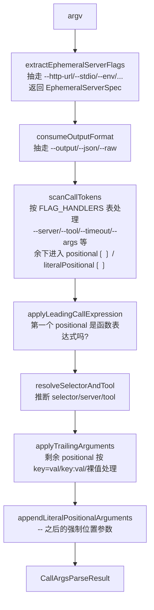
```mermaid
flowchart TD
  Argv["argv"] --> Eph["extractEphemeralServerFlags<br/>抽走 --http-url/--stdio/--env/...<br/>返回 EphemeralServerSpec"]
  Eph --> Out["consumeOutputFormat<br/>抽走 --output/--json/--raw"]
  Out --> Scan["scanCallTokens<br/>按 FLAG_HANDLERS 表处理<br/>--server/--tool/--timeout/--args 等<br/>余下进入 positional❲❳ / literalPositional❲❳"]
  Scan --> Lead["applyLeadingCallExpression<br/>第一个 positional 是函数表达式吗?"]
  Lead --> Sel["resolveSelectorAndTool<br/>推断 selector/server/tool"]
  Sel --> Trail["applyTrailingArguments<br/>剩余 positional 按 key=val/key:val/裸值处理"]
  Trail --> Lit["appendLiteralPositionalArguments<br/>-- 之后的强制位置参数"]
  Lit --> Result["CallArgsParseResult"]
```

`FLAG_HANDLERS` 在 [src/cli/call-arguments.ts:54-65]() 定义：`--server` / `--mcp` / `--tool` / `--timeout` / `--tail-log` / `--save-images` / `--yes` / `--raw-strings` / `--no-coerce` / `--args`。任何**未注册的 `--xxx`** 直接抛 `CliUsageError`（[src/cli/call-arguments.ts:101-104]()），避免悄悄退化成位置参数。

`applyTrailingArguments` 把剩余 positional 用 `parseKeyValueToken` 处理（[src/cli/call-argument-values.ts:9-38]()）：

- `key=value`：直接拆，单 token consumed=1。
- `key:value`：colon 后非空 → 单 token；colon 后空（`limit:`）→ 看下一个 token 当 value，consumed=2；如果再没有就警告"missing value"，返回空字符串。
- 没有 `=` 也没有 `:`：当成 trailing positional 收集，最后并入 `result.positionalArgs`。

Sources: [src/cli/call-arguments.ts:67-214](../../../project-repos/mcporter/src/cli/call-arguments.ts#L67-L214), [src/cli/call-argument-values.ts:9-95](../../../project-repos/mcporter/src/cli/call-argument-values.ts#L9-L95)

<details class="source-snippets">
<summary>引用源码</summary>

<!-- source-snippets:start -->

#### `src/cli/call-arguments.ts:67-214`

```typescript
export function parseCallArguments(args: string[]): CallArgsParseResult {
  const result: CallArgsParseResult = { args: {}, tailLog: false, output: 'auto' };
  const flagState: FlagParseState = { coercionMode: 'default' };
  const ephemeral = extractEphemeralServerFlags(args);
  result.ephemeral = ephemeral;
  result.output = consumeOutputFormat(args, {
    defaultFormat: 'auto',
  });
  const { positional, literalPositional } = scanCallTokens(args, result, flagState);
  const { callExpressionProvidedServer, callExpressionProvidedTool } = applyLeadingCallExpression(positional, result);
  resolveSelectorAndTool(positional, result, callExpressionProvidedServer, callExpressionProvidedTool);
  applyTrailingArguments(positional, result, flagState);
  appendLiteralPositionalArguments(literalPositional, result, flagState);
  return result;
}

function scanCallTokens(args: string[], result: CallArgsParseResult, state: FlagParseState): ScannedCallTokens {
  const positional: string[] = [];
  const literalPositional: string[] = [];
  let index = 0;
  while (index < args.length) {
    const token = args[index];
    if (!token) {
      index += 1;
      continue;
    }
    if (token === '--') {
      literalPositional.push(...args.slice(index + 1).filter(Boolean));
      break;
    }
    const flagHandler = FLAG_HANDLERS[token];
    if (flagHandler) {
      index = flagHandler({ args, index, result, state });
      continue;
    }
    if (token.startsWith('--')) {
      throw new CliUsageError(buildUnknownCallFlagMessage(token));
    }
    positional.push(token);
    index += 1;
  }
  return { positional, literalPositional };
}

function applyLeadingCallExpression(positional: string[], result: CallArgsParseResult): CallExpressionResolution {
  if (positional.length === 0) {
    return { callExpressionProvidedServer: false, callExpressionProvidedTool: false };
  }
  const rawToken = positional[0] ?? '';
  const callExpression = parseLeadingCallExpression(rawToken);
  if (!callExpression) {
    return { callExpressionProvidedServer: false, callExpressionProvidedTool: false };
  }
  positional.shift();
  if (callExpression.server) {
    if (result.server && result.server !== callExpression.server) {
      throw new Error(
        `Conflicting server names: '${result.server}' from flags and '${callExpression.server}' from call expression.`
      );
    }
    result.server = result.server ?? callExpression.server;
  }
  if (result.tool && result.tool !== callExpression.tool) {
    throw new Error(
      `Conflicting tool names: '${result.tool}' from flags and '${callExpression.tool}' from call expression.`
    );
  }
  result.tool = callExpression.tool;
  Object.assign(result.args, callExpression.args);
  if (callExpression.positionalArgs && callExpression.positionalArgs.length > 0) {
    result.positionalArgs = [...(result.positionalArgs ?? []), ...callExpression.positionalArgs];
  }
  return {
    callExpressionProvidedServer: Boolean(callExpression.server),
    callExpressionProvidedTool: Boolean(callExpression.tool),
  };
}

function resolveSelectorAndTool(
  positional: string[],
  result: CallArgsParseResult,
  callExpressionProvidedServer: boolean,
  callExpressionProvidedTool: boolean
): void {
  if (!result.selector && positional.length > 0 && !callExpressionProvidedServer && !result.server) {
    result.selector = positional.shift();
  }
  if (
    !result.server &&
    result.selector &&
    shouldPromoteSelectorToCommand(result.selector) &&
    !result.ephemeral?.stdioCommand
  ) {
    result.ephemeral = { ...result.ephemeral, stdioCommand: result.selector };
    result.selector = undefined;
  }
  const nextPositional = positional[0];
  if (
    !result.tool &&
    nextPositional !== undefined &&
    !nextPositional.includes('=') &&
    !nextPositional.includes(':') &&
    !callExpressionProvidedTool
  ) {
    result.tool = positional.shift();
  }
}

function applyTrailingArguments(positional: string[], result: CallArgsParseResult, state: FlagParseState): void {
  const trailingPositional: unknown[] = [];
  for (let index = 0; index < positional.length; ) {
    const token = positional[index];
    if (!token) {
      index += 1;
      continue;
    }
    const parsed = parseKeyValueToken(token, positional[index + 1]);
    if (!parsed) {
      trailingPositional.push(coerceValue(token, state.coercionMode));
      index += 1;
... snippet truncated ...
```

#### `src/cli/call-argument-values.ts:9-95`

```typescript
export function parseKeyValueToken(token: string, nextToken: string | undefined): ParsedKeyValueToken | undefined {
  const eqIndex = token.indexOf('=');
  if (eqIndex !== -1) {
    const key = token.slice(0, eqIndex);
    const rawValue = token.slice(eqIndex + 1);
    if (!key) {
      return undefined;
    }
    return { key, rawValue, consumed: 1 };
  }

  const colonIndex = token.indexOf(':');
  if (colonIndex !== -1) {
    const key = token.slice(0, colonIndex);
    const remainder = token.slice(colonIndex + 1);
    if (!key) {
      return undefined;
    }
    if (remainder.length > 0) {
      return { key, rawValue: remainder, consumed: 1 };
    }
    if (nextToken !== undefined) {
      return { key, rawValue: nextToken, consumed: 2 };
    }
    warnMissingNamedArgumentValue(key);
    return { key, rawValue: '', consumed: 1 };
  }

  return undefined;
}

export function coerceValue(value: string, coercionMode: CoercionMode = 'default'): unknown {
  const trimmed = value.trim();
  if (trimmed === '') {
    return '';
  }
  if (coercionMode === 'none') {
    return trimmed;
  }
  if (trimmed === 'true' || trimmed === 'false') {
    return trimmed === 'true';
  }
  if (trimmed === 'null' || trimmed === 'none') {
    return null;
  }
  if (coercionMode === 'default' && !Number.isNaN(Number(trimmed)) && trimmed === `${Number(trimmed)}`) {
    return Number(trimmed);
  }
  if ((trimmed.startsWith('{') && trimmed.endsWith('}')) || (trimmed.startsWith('[') && trimmed.endsWith(']'))) {
    try {
      return JSON.parse(trimmed);
    } catch {
      return trimmed;
    }
  }
  return trimmed;
}

export function shouldPromoteSelectorToCommand(selector: string): boolean {
  const trimmed = selector.trim();
  if (!trimmed) {
    return false;
  }
  if (/\s/.test(trimmed)) {
    return true;
  }
  if (/^(?:\.{1,2}\/|~\/|\/)/.test(trimmed)) {
    return true;
  }
  if (/^[A-Za-z]:\\/.test(trimmed) || trimmed.startsWith('\\\\')) {
    return true;
  }
  return false;
}

function warnMissingNamedArgumentValue(key: string): void {
  const hint =
    key === 'command' ? `Example: mcporter call iterm-mcp.write_to_terminal --args '{"command":"echo hi"}'` : undefined;
  const lines = [
    `[mcporter] Argument '${key}' was provided without a value.`,
    `Wrap the entire key/value pair in quotes (e.g., 'command: "echo hi"') or use --args with JSON.`,
  ];
  if (hint) {
    lines.push(hint);
  }
  console.warn(lines.join(' '));
}
```

<!-- source-snippets:end -->
</details>
## 值类型推导（`coerceValue`）

`coerceValue(value, mode)` 决定一个字符串字面量在没有 schema 信息时被翻译成什么 JS 值（[src/cli/call-argument-values.ts:40-65]()）：

| mode | 处理顺序 |
|------|----------|
| `'default'`（默认） | trim → `'true'/'false'` → `'null'/'none'` → 数字（`Number(trimmed) === ${Number(...)}` 防止"1e3" 这种 lossy round-trip）→ `{...}` / `[...]` JSON.parse → 原字符串 |
| `'raw-strings'` | 同 default 但跳过数字分支 |
| `'none'`（`--no-coerce`） | 一律返回 trimmed 字符串 |

由于 `Number(trimmed) === \`${Number(trimmed)}\`` 这个等价检查，形如 `12345`、`1.5`、`-3` 会被识别为数字，但 `12345abc`、`123_456`、`1e3`（在某些情况下）不会被强制转换。

**这一切只是"无 schema"的兜底**。`call-command.ts` 里的 `enforceSchemaStringTypes`（[src/cli/call-command.ts:268-303]()）在拿到 schema 后会把"看起来像数字但 schema 是 string"的字段还原成原始字符串，避免把 issue ID `12345` 误传成 number 12345。`schemaStringCoercionCandidates` 里记的就是 raw 字符串副本（[src/cli/call-arguments.ts:204-208]()）。
Sources: [src/cli/call-argument-values.ts:40-65](../../../project-repos/mcporter/src/cli/call-argument-values.ts#L40-L65), [src/cli/call-arguments.ts:175-213](../../../project-repos/mcporter/src/cli/call-arguments.ts#L175-L213), [src/cli/call-command.ts:268-303](../../../project-repos/mcporter/src/cli/call-command.ts#L268-L303)

<details class="source-snippets">
<summary>引用源码</summary>

<!-- source-snippets:start -->

#### `src/cli/call-argument-values.ts:40-65`

```typescript
export function coerceValue(value: string, coercionMode: CoercionMode = 'default'): unknown {
  const trimmed = value.trim();
  if (trimmed === '') {
    return '';
  }
  if (coercionMode === 'none') {
    return trimmed;
  }
  if (trimmed === 'true' || trimmed === 'false') {
    return trimmed === 'true';
  }
  if (trimmed === 'null' || trimmed === 'none') {
    return null;
  }
  if (coercionMode === 'default' && !Number.isNaN(Number(trimmed)) && trimmed === `${Number(trimmed)}`) {
    return Number(trimmed);
  }
  if ((trimmed.startsWith('{') && trimmed.endsWith('}')) || (trimmed.startsWith('[') && trimmed.endsWith(']'))) {
    try {
      return JSON.parse(trimmed);
    } catch {
      return trimmed;
    }
  }
  return trimmed;
}
```

#### `src/cli/call-arguments.ts:175-213`

```typescript
function applyTrailingArguments(positional: string[], result: CallArgsParseResult, state: FlagParseState): void {
  const trailingPositional: unknown[] = [];
  for (let index = 0; index < positional.length; ) {
    const token = positional[index];
    if (!token) {
      index += 1;
      continue;
    }
    const parsed = parseKeyValueToken(token, positional[index + 1]);
    if (!parsed) {
      trailingPositional.push(coerceValue(token, state.coercionMode));
      index += 1;
      continue;
    }
    index += parsed.consumed;
    const value = coerceValue(parsed.rawValue, state.coercionMode);
    if (parsed.key === 'tool' && !result.tool) {
      if (typeof value !== 'string') {
        throw new Error("Argument 'tool' must be a string value.");
      }
      result.tool = value as string;
      continue;
    }
    if (parsed.key === 'server' && !result.server) {
      if (typeof value !== 'string') {
        throw new Error("Argument 'server' must be a string value.");
      }
      result.server = value as string;
      continue;
    }
    if (state.coercionMode === 'default' && typeof value === 'number') {
      result.schemaStringCoercionCandidates ??= {};
      result.schemaStringCoercionCandidates[parsed.key] = parsed.rawValue;
    }
    result.args[parsed.key] = value;
  }
  if (trailingPositional.length > 0) {
    result.positionalArgs = [...(result.positionalArgs ?? []), ...trailingPositional];
  }
```

#### `src/cli/call-command.ts:268-303`

```typescript
async function enforceSchemaStringTypes(
  runtime: Awaited<ReturnType<(typeof import('../runtime.js'))['createRuntime']>>,
  server: string,
  tool: string,
  args: Record<string, unknown>,
  rawCandidates: Record<string, string> | undefined,
  timeoutMs: number
): Promise<Record<string, unknown>> {
  if (!rawCandidates || Object.keys(rawCandidates).length === 0) {
    return args;
  }

  const tools = await withTimeout(loadToolMetadata(runtime, server, { includeSchema: true }), timeoutMs).catch(
    () => undefined
  );
  if (!tools) {
    return args;
  }
  const toolInfo = tools.find((entry) => entry.tool.name === tool);
  const schema = toolInfo?.tool.inputSchema as { properties?: Record<string, unknown> } | undefined;
  if (!schema?.properties) {
    return args;
  }

  let corrected: Record<string, unknown> | undefined;
  for (const [key, rawValue] of Object.entries(rawCandidates)) {
    if (typeof args[key] !== 'number') {
      continue;
    }
    if (!schemaAllowsString(schema.properties[key])) {
      continue;
    }
    corrected ??= { ...args };
    corrected[key] = rawValue;
  }
  return corrected ?? args;
```

<!-- source-snippets:end -->
</details>
## 函数式调用表达式

第一个 positional 如果包含 `(` 且以 `)` 结尾，进入 `parseLeadingCallExpression`（[src/cli/call-argument-expression.ts:7-13]()）。它会先尝试 `extractHttpCallExpression`（处理 `https://host/path.tool(...)` 这种 URL + 函数调用混合），再回退到通用的 `parseCallExpressionFragment`。

`parseCallExpressionFragment`（[src/cli/call-expression-parser.ts:24-92]()）的实现：

1. 拆 `prefix(args)` 成 prefix（`server.tool`）与 args portion。
2. 用 `acorn.parseExpressionAt('__call(...)')` 把 `(...)` 解析成 `CallExpression` 节点。`buildParseAttempts` 会尝试若干 candidate（处理可能的 trailing comma、bare key 等）。
3. 如果只有一个 ObjectExpression 实参 → 抽取键值对到 `args: Record<string, unknown>`。
4. 否则把每个实参视为位置参数，转换 Literal / ArrayExpression / ObjectExpression / UnaryExpression 字面量为 JS 值。
5. `splitPrefix` 拆 `server.tool` 或 `tool`（`server` 可缺省，由 selector 流程补）。

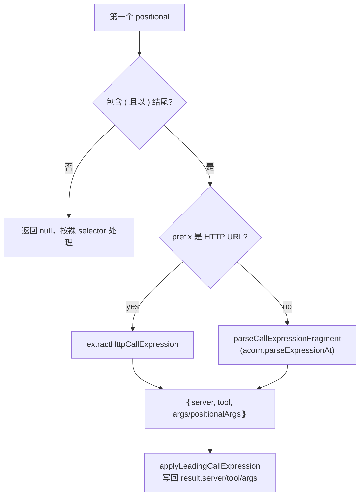
```mermaid
graph TD
  Tok["第一个 positional"] --> Has{"包含 ( 且以 ) 结尾?"}
  Has -->|"否"| Skip["返回 null，按裸 selector 处理"]
  Has -->|"是"| Http{"prefix 是 HTTP URL?"}
  Http -->|yes| HE["extractHttpCallExpression"]
  Http -->|no| PCEF["parseCallExpressionFragment<br/>(acorn.parseExpressionAt)"]
  HE --> Out["❴server, tool, args/positionalArgs❵"]
  PCEF --> Out
  Out --> Apply["applyLeadingCallExpression<br/>写回 result.server/tool/args"]
```

Sources: [src/cli/call-argument-expression.ts:7-40](../../../project-repos/mcporter/src/cli/call-argument-expression.ts#L7-L40), [src/cli/call-expression-parser.ts:24-92](../../../project-repos/mcporter/src/cli/call-expression-parser.ts#L24-L92)

<details class="source-snippets">
<summary>引用源码</summary>

<!-- source-snippets:start -->

#### `src/cli/call-argument-expression.ts:7-40`

```typescript
export function parseLeadingCallExpression(rawToken: string): ParsedCallExpression | null {
  try {
    return extractHttpCallExpression(rawToken) ?? parseCallExpressionFragment(rawToken);
  } catch (error) {
    throw buildCallExpressionUsageError(error);
  }
}

function extractHttpCallExpression(raw: string): ParsedCallExpression | null {
  const trimmed = raw.trim();
  const openParen = trimmed.indexOf('(');
  const prefix = openParen === -1 ? trimmed : trimmed.slice(0, openParen);
  const split = splitHttpToolSelector(prefix);
  if (!split) {
    return null;
  }
  if (openParen === -1) {
    return { server: split.baseUrl, tool: split.tool, args: {} };
  }
  if (!trimmed.endsWith(')')) {
    throw new Error('Function-call syntax requires a closing ) character.');
  }
  const argsPortion = trimmed.slice(openParen);
  const parsed = parseCallExpressionFragment(`${split.tool}${argsPortion}`);
  if (!parsed) {
    return { server: split.baseUrl, tool: split.tool, args: {} };
  }
  return {
    server: split.baseUrl,
    tool: split.tool,
    args: parsed.args,
    positionalArgs: parsed.positionalArgs ?? [],
  };
}
```

#### `src/cli/call-expression-parser.ts:24-92`

```typescript
export function parseCallExpressionFragment(raw: string): ParsedCallExpression | null {
  const trimmed = raw.trim();
  const openParen = trimmed.indexOf('(');
  if (openParen === -1 || !trimmed.endsWith(')')) {
    return null;
  }

  const prefix = trimmed.slice(0, openParen).trim();
  if (!prefix) {
    throw new Error('Expected a tool name before the argument list.');
  }

  const argsPortion = trimmed.slice(openParen + 1, -1);
  const trimmedArgs = argsPortion.trim();
  const attempts = buildParseAttempts(trimmedArgs);
  let callExpression: CallExpression | undefined;
  let parseError: Error | undefined;

  for (const candidate of attempts) {
    try {
      const expression = parseExpressionAt(`__call${candidate}`, 0, ACORN_OPTIONS);
      if (expression.type === 'CallExpression') {
        callExpression = expression as CallExpression;
        break;
      }
    } catch (error) {
      parseError = error instanceof Error ? error : new Error(String(error));
    }
  }

  if (!callExpression) {
    const message = parseError?.message ?? 'Unexpected token';
    throw new Error(`Unable to parse call expression: ${message}`);
  }

  if (callExpression.arguments.length === 0) {
    return {
      ...splitPrefix(prefix),
      args: {},
    };
  }

  if (callExpression.arguments.length === 1 && callExpression.arguments[0]?.type === 'ObjectExpression') {
    const argument = callExpression.arguments[0];
    if (!argument || argument.type !== 'ObjectExpression') {
      throw new Error('Function-call syntax requires named arguments (e.g. issueId: 123).');
    }
    const args = extractObject(argument);
    return { ...splitPrefix(prefix), args };
  }

  // At this point we know the call expression isn't a plain object literal, so we interpret
  // whatever arguments remain positionally. We still reuse the literal extractor so nested
  // arrays/objects stay supported.
  const positionalArgs = callExpression.arguments.map((argument) => {
    if (!argument) {
      throw new Error('Unsupported empty argument in call expression.');
    }
    if (argument.type === 'SpreadElement') {
      throw new Error('Spread elements are not supported in call expressions.');
    }
    if (!isSupportedValue(argument as Expression)) {
      throw new Error(`Unsupported argument expression: ${argument.type}.`);
    }
    return extractValue(argument as Expression);
  });

  return { ...splitPrefix(prefix), args: {}, positionalArgs };
}
```

<!-- source-snippets:end -->
</details>
## URL 选择器

`splitHttpToolSelector(token)`（在 `src/cli/http-utils.ts` 中）识别 `https://host/path.tool` 这样的形态——把 URL 作为 `baseUrl`，最后一段 `.tool` 作为 tool 名。它在三处被调用：

| 调用方 | 作用 |
|--------|------|
| `command-inference.isHttpToolToken` | 决定 `mcporter https://host/m.tool` 是否要被改写成 `call` |
| `extractHttpCallExpression` | URL + 函数式调用混合时拆分 |
| `list-command` 的 target 解析 | `mcporter list https://host/m.tool` 把 `m.tool` 也放进 selector |

URL 在 `parseCallArguments` 通过 `absorbUrlCandidate`（[src/cli/call-command.ts:80-94]()）变成 ephemeral spec：先调 `normalizeHttpUrlCandidate`（处理 `host/path` 缺协议的情况），命中即把 `parsed.server` / `parsed.selector` 替换成 ephemeral httpUrl。
Sources: [src/cli/http-utils.ts](../../../project-repos/mcporter/src/cli/http-utils.ts), [src/cli/call-command.ts:77-124](../../../project-repos/mcporter/src/cli/call-command.ts#L77-L124)

<details class="source-snippets">
<summary>引用源码</summary>

<!-- source-snippets:start -->

#### `src/cli/http-utils.ts`

```typescript
const DOMAIN_WITH_PATH_PATTERN = /^[A-Za-z0-9](?:[A-Za-z0-9.-]*)(?::\d+)?\//;

export function normalizeHttpUrlCandidate(value?: string): string | undefined {
  if (!value) {
    return undefined;
  }
  const trimmed = value.trim();
  if (!trimmed) {
    return undefined;
  }
  const hasScheme = /^https?:\/\//i.test(trimmed);
  const candidate = hasScheme ? trimmed : DOMAIN_WITH_PATH_PATTERN.test(trimmed) ? `https://${trimmed}` : null;
  if (!candidate) {
    return undefined;
  }
  try {
    const url = new URL(candidate);
    return url.href;
  } catch {
    return undefined;
  }
}

export function looksLikeHttpUrl(value?: string): boolean {
  return Boolean(normalizeHttpUrlCandidate(value));
}

export function splitHttpToolSelector(input: string): { baseUrl: string; tool: string } | null {
  const trimmed = input.trim();
  const candidate = (() => {
    const openParen = trimmed.indexOf('(');
    if (openParen === -1) {
      return trimmed;
    }
    return trimmed.slice(0, openParen);
  })();
  const normalized = normalizeHttpUrlCandidate(candidate);
  if (!normalized) {
    return null;
  }
  let url: URL;
  try {
    url = new URL(normalized);
  } catch {
    return null;
  }
  const pathname = url.pathname || '/';
  const lastSlash = pathname.lastIndexOf('/');
  const segment = pathname.slice(lastSlash + 1);
  const dotIndex = segment.lastIndexOf('.');
  if (dotIndex <= 0) {
    return null;
  }
  const tool = segment.slice(dotIndex + 1);
  if (!tool || !/^[A-Za-z0-9_-]+$/.test(tool)) {
    return null;
  }
  const baseSegment = segment.slice(0, dotIndex);
  if (!baseSegment) {
    return null;
  }
  const basePath = `${pathname.slice(0, Math.max(0, lastSlash + 1))}${baseSegment}`;
  const normalizedPath = basePath.startsWith('/') ? basePath : `/${basePath}`;
  const baseUrl = `${url.origin}${normalizedPath}`;
  return { baseUrl, tool };
}

export function normalizeHttpUrl(value: string | URL): string | undefined {
  try {
    const url = value instanceof URL ? new URL(value.href) : new URL(value);
    url.protocol = url.protocol.toLowerCase();
    url.hostname = url.hostname.replace(/^www\./i, '').toLowerCase();
    if (!url.pathname) {
      url.pathname = '/';
    }
    return url.href.replace(/\/$/, '/');
  } catch {
    return undefined;
  }
}

export function extractHttpServerTarget(value: string): string | undefined {
  const split = splitHttpToolSelector(value);
  if (split) {
    return split.baseUrl;
  }
  const normalized = normalizeHttpUrlCandidate(value);
  return normalized ?? undefined;
}
```

#### `src/cli/call-command.ts:77-124`

```typescript
async function normalizeParsedCallArguments(runtime: Runtime, parsed: CallArgsParseResult): Promise<void> {
  let ephemeralSpec = parsed.ephemeral ? { ...parsed.ephemeral } : undefined;
  const nameHints: string[] = [];
  const absorbUrlCandidate = (value: string | undefined): string | undefined => {
    if (!value) {
      return value;
    }
    const normalized = normalizeHttpUrlCandidate(value);
    if (!normalized) {
      return value;
    }
    if (!ephemeralSpec) {
      ephemeralSpec = { httpUrl: normalized };
    } else if (!ephemeralSpec.httpUrl) {
      ephemeralSpec = { ...ephemeralSpec, httpUrl: normalized };
    }
    return undefined;
  };

  parsed.server = absorbUrlCandidate(parsed.server);
  parsed.selector = absorbUrlCandidate(parsed.selector);

  if (ephemeralSpec && parsed.server && !looksLikeHttpUrl(parsed.server)) {
    nameHints.push(parsed.server);
    parsed.server = undefined;
  }

  if (ephemeralSpec?.httpUrl && !ephemeralSpec.name && parsed.tool) {
    const candidate = parsed.selector && !looksLikeHttpUrl(parsed.selector) ? parsed.selector : undefined;
    if (candidate) {
      nameHints.push(candidate);
      parsed.selector = undefined;
    }
  }

  const prepared = await prepareEphemeralServerTarget({
    runtime,
    target: parsed.server,
    ephemeral: ephemeralSpec,
    nameHints,
    reuseFromSpec: true,
  });

  parsed.server = prepared.target;
  if (!parsed.selector) {
    parsed.selector = prepared.target;
  }
}
```

<!-- source-snippets:end -->
</details>
## 选择器决议（server / tool）

`resolveSelectorAndTool`（[src/cli/call-arguments.ts:145-173]()）+ `resolveServerAndTool`（[src/cli/call-command.ts:126-140]()）共同决定最终 `(server, tool)`：

```mermaid
flowchart TD
  In["positional + result.server/tool/selector"] --> S1{"已设 selector?<br/>或函数表达式提供 server?"}
  S1 -->|"不需要 shift"| K1[" "]
  S1 -->|"否"| K2["selector = positional.shift()"]
  K1 --> Promote{"selector 像本地路径或带空格?<br/>shouldPromoteSelectorToCommand"}
  K2 --> Promote
  Promote -->|yes| Stdio["把 selector 当 stdioCommand 提升进 ephemeral"]
  Promote -->|no| ToolGuess
  Stdio --> ToolGuess
  ToolGuess{"下一个 positional 不含 = / :?"}
  ToolGuess -->|yes| Pop["result.tool = positional.shift()"]
  ToolGuess -->|no| Skip[" "]
  Pop --> Done["返回结果"]
  Skip --> Done
  Done --> Resolve["resolveCallTarget<br/>selector 含 . → 拆 server.tool"]
  Resolve --> Single{"target.tool 仍为空?"}
  Single -->|yes| Single1["inferSingleToolName<br/>仅当 server 只有 1 个 tool"]
  Single -->|no| Final["最终 (server, tool)"]
  Single1 --> Final
```

`shouldPromoteSelectorToCommand`（[src/cli/call-argument-values.ts:67-82]()）的判定条件：含空白、以 `./` / `../` / `~/` / `/` 开头、Windows 盘符 / UNC 路径。命中即把 selector 整段当作临时 stdio 命令——这是为什么 `mcporter call "bun run ./local-server.ts" --tool foo` 能跑。

`inferSingleToolName`（[src/cli/call-command.ts:377-391]()）的语义：如果 server 只有一个 tool，自动选它，并打印 dim 提示 `[auto] X exposes a single tool (Y); using it.`。这对 chrome-devtools 这类只暴露少数命令的服务器很有用。
Sources: [src/cli/call-arguments.ts:145-173](../../../project-repos/mcporter/src/cli/call-arguments.ts#L145-L173), [src/cli/call-command.ts:126-140](../../../project-repos/mcporter/src/cli/call-command.ts#L126-L140), [src/cli/call-argument-values.ts:67-82](../../../project-repos/mcporter/src/cli/call-argument-values.ts#L67-L82)

<details class="source-snippets">
<summary>引用源码</summary>

<!-- source-snippets:start -->

#### `src/cli/call-arguments.ts:145-173`

```typescript
function resolveSelectorAndTool(
  positional: string[],
  result: CallArgsParseResult,
  callExpressionProvidedServer: boolean,
  callExpressionProvidedTool: boolean
): void {
  if (!result.selector && positional.length > 0 && !callExpressionProvidedServer && !result.server) {
    result.selector = positional.shift();
  }
  if (
    !result.server &&
    result.selector &&
    shouldPromoteSelectorToCommand(result.selector) &&
    !result.ephemeral?.stdioCommand
  ) {
    result.ephemeral = { ...result.ephemeral, stdioCommand: result.selector };
    result.selector = undefined;
  }
  const nextPositional = positional[0];
  if (
    !result.tool &&
    nextPositional !== undefined &&
    !nextPositional.includes('=') &&
    !nextPositional.includes(':') &&
    !callExpressionProvidedTool
  ) {
    result.tool = positional.shift();
  }
}
```

#### `src/cli/call-command.ts:126-140`

```typescript
async function resolveServerAndTool(runtime: Runtime, parsed: CallArgsParseResult): Promise<ResolvedCallTarget> {
  const target = resolveCallTarget(parsed, { allowMissingTool: true });
  const server = target.server;
  let tool = target.tool;
  if (!server) {
    throw new Error('Missing server name. Provide it via <server>.<tool> or --server.');
  }
  if (!tool) {
    tool = await inferSingleToolName(runtime, server);
    if (!tool) {
      throw new Error('Missing tool name. Provide it via <server>.<tool> or --tool.');
    }
  }
  return { server, tool };
}
```

#### `src/cli/call-argument-values.ts:67-82`

```typescript
export function shouldPromoteSelectorToCommand(selector: string): boolean {
  const trimmed = selector.trim();
  if (!trimmed) {
    return false;
  }
  if (/\s/.test(trimmed)) {
    return true;
  }
  if (/^(?:\.{1,2}\/|~\/|\/)/.test(trimmed)) {
    return true;
  }
  if (/^[A-Za-z]:\\/.test(trimmed) || trimmed.startsWith('\\\\')) {
    return true;
  }
  return false;
}
```

<!-- source-snippets:end -->
</details>
## Schema 驱动的位置参数 hydration

CLI 收到的位置参数（裸值或函数表达式中的非 named arg）会被 `hydratePositionalArguments` 映射到 schema 字段（[src/cli/call-command.ts:327-373]()）：

```mermaid
flowchart TD
  Pos["positionalArgs❲❳"] --> Empty{"空?"}
  Empty -->|yes| Skip["直接返回 namedArgs"]
  Empty -->|no| Load["loadToolMetadata(includeSchema=true)"]
  Load --> Find{"找到 tool?"}
  Find -->|no| Err1["throw 'Unknown tool'"]
  Find -->|yes| HasSchema{"有 inputSchema?"}
  HasSchema -->|no| Err2["throw 'name positional explicitly'"]
  HasSchema -->|yes| Opts["options = ToolMetadata.options"]
  Opts --> Remain["remaining = options.filter(o => !(o.property in named))"]
  Remain --> Cnt{"positional.length > remaining.length?"}
  Cnt -->|yes| Err3["throw 'Too many positional'"]
  Cnt -->|no| Map["按顺序填 hydrated❲remaining❲i❳.property❳=value"]
  Map --> Out["返回 hydrated"]
```

`options` 的顺序由 `extractOptions` 决定（[src/cli/generate/tools.ts:63-97]()）：先按 schema `properties` 列表，required 标记决定 `required`。`hydrate` 只填还未通过 named arg 提供的字段，避免重复。
Sources: [src/cli/call-command.ts:327-373](../../../project-repos/mcporter/src/cli/call-command.ts#L327-L373), [src/cli/generate/tools.ts:63-97](../../../project-repos/mcporter/src/cli/generate/tools.ts#L63-L97)

<details class="source-snippets">
<summary>引用源码</summary>

<!-- source-snippets:start -->

#### `src/cli/call-command.ts:327-373`

```typescript
async function hydratePositionalArguments(
  runtime: Awaited<ReturnType<(typeof import('../runtime.js'))['createRuntime']>>,
  server: string,
  tool: string,
  namedArgs: Record<string, unknown>,
  positionalArgs: unknown[] | undefined
): Promise<Record<string, unknown>> {
  if (!positionalArgs || positionalArgs.length === 0) {
    return namedArgs;
  }
  // We need the schema order to know which field each positional argument maps to; pull the
  // tool list with schemas instead of guessing locally so optional/required order stays correct.
  const tools = await loadToolMetadata(runtime, server, { includeSchema: true }).catch(() => undefined);
  if (!tools) {
    throw new Error('Unable to load tool metadata; name positional arguments explicitly.');
  }
  const toolInfo = tools.find((entry) => entry.tool.name === tool);
  if (!toolInfo) {
    throw new Error(
      `Unknown tool '${tool}' on server '${server}'. Double-check the name or run mcporter list ${server}.`
    );
  }
  if (!toolInfo.tool.inputSchema) {
    throw new Error(`Tool '${tool}' does not expose an input schema; name positional arguments explicitly.`);
  }
  const options = toolInfo.options;
  if (options.length === 0) {
    throw new Error(`Tool '${tool}' has no declared parameters; remove positional arguments.`);
  }
  // Respect whichever parameters the user already supplied by name so positional values only
  // populate the fields that are still unset.
  const remaining = options.filter((option) => !(option.property in namedArgs));
  if (positionalArgs.length > remaining.length) {
    throw new Error(
      `Too many positional arguments (${positionalArgs.length}) supplied; only ${remaining.length} parameter${remaining.length === 1 ? '' : 's'} remain on ${tool}.`
    );
  }
  const hydrated: Record<string, unknown> = { ...namedArgs };
  positionalArgs.forEach((value, index) => {
    const target = remaining[index];
    if (!target) {
      return;
    }
    hydrated[target.property] = value;
  });
  return hydrated;
}
```

#### `src/cli/generate/tools.ts:63-97`

```typescript
export function extractOptions(tool: ServerToolInfo): GeneratedOption[] {
  const schema = tool.inputSchema;
  if (!schema || typeof schema !== 'object') {
    return [];
  }
  const record = schema as Record<string, unknown>;
  if (record.type !== 'object' || typeof record.properties !== 'object') {
    return [];
  }
  // Flatten schema properties into Commander-friendly option descriptors.
  const properties = record.properties as Record<string, unknown>;
  const requiredList = Array.isArray(record.required) ? (record.required as string[]) : [];
  return Object.entries(properties).map(([property, descriptor]) => {
    const type = inferType(descriptor);
    const arrayItemType = type === 'array' ? inferArrayItemType(descriptor) : undefined;
    const enumValues = getEnumValues(descriptor);
    const defaultValue = getDescriptorDefault(descriptor);
    const formatInfo = getDescriptorFormatHint(descriptor);
    const placeholder = buildPlaceholder(property, type, enumValues, formatInfo?.slug);
    const exampleValue = buildExampleValue(property, type, enumValues, defaultValue);
    return {
      property,
      cliName: toCliOption(property),
      description: getDescriptorDescription(descriptor),
      required: requiredList.includes(property),
      type,
      arrayItemType,
      placeholder,
      exampleValue,
      enumValues,
      defaultValue,
      formatHint: formatInfo?.display,
    };
  });
}
```

<!-- source-snippets:end -->
</details>
## 自动纠错（Levenshtein）

`identifier-helpers.ts` 提供两类纠错：server 名（在 `command-inference` 与 `list-command` 使用）与 tool 名（在 `call-command.attemptCall` 失败路径上使用）。

```ts
// AUTO_THRESHOLD_RATIO = 0.3, AUTO_THRESHOLD_MIN = 2
chooseClosestIdentifier(input, candidates)
```

`chooseClosestIdentifier`（[src/cli/identifier-helpers.ts:6-43]()）：

1. **完全匹配三连**：原值相等 / `normalizeIdentifier`（去掉非字母数字）相等 / 大小写不敏感相等 → 立即返回 `kind: 'auto'`。
2. **Levenshtein 距离**：对剩余候选用纯 JS DP 计算（[identifier-helpers.ts:77-100]()）。
3. **阈值**：`threshold = max(2, floor(maxLen × 0.3))`。`bestScore <= threshold` → `kind: 'auto'`，否则 `kind: 'suggest'`。
4. CLI 端：`auto` 模式直接换名重试 + 打印 dim 提示；`suggest` 模式打印黄色 `[mcporter] Did you mean X?` 然后退出 1。

工具名纠错的触发要求是 server 端真正回的 `Tool xxx not found` 错误（`extractMissingToolFromError` 用正则提取，[src/cli/call-command.ts:485-492]()），而且 tail 名字必须等于尝试值——避免把不相关错误当成 tool not found。
Sources: [src/cli/identifier-helpers.ts:1-100](../../../project-repos/mcporter/src/cli/identifier-helpers.ts#L1-L100), [src/cli/call-command.ts:454-483](../../../project-repos/mcporter/src/cli/call-command.ts#L454-L483)

<details class="source-snippets">
<summary>引用源码</summary>

<!-- source-snippets:start -->

#### `src/cli/identifier-helpers.ts:1-100`

```typescript
const AUTO_THRESHOLD_RATIO = 0.3;
const AUTO_THRESHOLD_MIN = 2;

export type IdentifierResolution = { kind: 'auto'; value: string } | { kind: 'suggest'; value: string };

export function chooseClosestIdentifier(input: string, candidates: string[]): IdentifierResolution | undefined {
  if (candidates.length === 0) {
    return undefined;
  }
  const normalizedInput = normalizeIdentifier(input);
  let bestName: string | undefined;
  let bestScore = Number.POSITIVE_INFINITY;

  for (const candidate of candidates) {
    if (candidate === input) {
      return { kind: 'auto', value: candidate };
    }
    const normalizedCandidate = normalizeIdentifier(candidate);
    if (normalizedCandidate === normalizedInput) {
      return { kind: 'auto', value: candidate };
    }
    if (candidate.toLowerCase() === input.toLowerCase()) {
      return { kind: 'auto', value: candidate };
    }
    const score = levenshtein(normalizedInput, normalizedCandidate);
    if (score < bestScore) {
      bestScore = score;
      bestName = candidate;
    }
  }

  if (!bestName) {
    return undefined;
  }

  const normalizedBest = normalizeIdentifier(bestName);
  const lengthBaseline = Math.max(normalizedInput.length, normalizedBest.length, 1);
  const threshold = Math.max(AUTO_THRESHOLD_MIN, Math.floor(lengthBaseline * AUTO_THRESHOLD_RATIO));
  if (bestScore <= threshold) {
    return { kind: 'auto', value: bestName };
  }
  return { kind: 'suggest', value: bestName };
}

export function normalizeIdentifier(value: string): string {
  return value.replace(/[^a-z0-9]/gi, '').toLowerCase();
}

export interface IdentifierResolutionContext {
  entity: 'server' | 'tool';
  attempted: string;
  resolution: IdentifierResolution;
  scope?: string;
}

export function renderIdentifierResolutionMessages(context: IdentifierResolutionContext): {
  auto?: string;
  suggest?: string;
} {
  const resolvedDisplay =
    context.entity === 'tool' && context.scope
      ? `${context.scope}.${context.resolution.value}`
      : context.resolution.value;
  const attemptedDisplay =
    context.entity === 'tool' && context.scope ? `${context.scope}.${context.attempted}` : context.attempted;
  if (context.resolution.kind === 'auto') {
    const noun = context.entity === 'tool' ? 'tool call' : 'server name';
    return {
      auto: `[mcporter] Auto-corrected ${noun} to ${resolvedDisplay} (input: ${attemptedDisplay}).`,
    };
  }
  return {
    suggest: `[mcporter] Did you mean ${resolvedDisplay}?`,
  };
}

function levenshtein(a: string, b: string): number {
  if (a === b) {
    return 0;
  }
  if (a.length === 0) {
    return b.length;
  }
  if (b.length === 0) {
    return a.length;
  }

  const previous: number[] = Array.from({ length: b.length + 1 }, (_, index) => index);
  const current: number[] = Array.from({ length: b.length + 1 }, () => 0);

  for (let i = 1; i <= a.length; i += 1) {
    current[0] = i;
    const charA = a[i - 1];
    for (let j = 1; j <= b.length; j += 1) {
      const charB = b[j - 1];
      const insertCost = (current[j - 1] ?? Number.POSITIVE_INFINITY) + 1;
      const deleteCost = (previous[j] ?? Number.POSITIVE_INFINITY) + 1;
      const replaceCost = (previous[j - 1] ?? Number.POSITIVE_INFINITY) + (charA === charB ? 0 : 1);
      current[j] = Math.min(insertCost, deleteCost, replaceCost);
    }
```

#### `src/cli/call-command.ts:454-483`

```typescript
async function maybeResolveToolName(
  runtime: Awaited<ReturnType<(typeof import('../runtime.js'))['createRuntime']>>,
  server: string,
  attemptedTool: string,
  error: unknown
): Promise<ToolResolution | undefined> {
  const missingName = extractMissingToolFromError(error);
  if (!missingName) {
    return undefined;
  }

  // Only attempt a suggestion if the server explicitly rejected the tool we tried.
  if (normalizeIdentifier(missingName) !== normalizeIdentifier(attemptedTool)) {
    return undefined;
  }

  const tools = await loadToolMetadata(runtime, server, { includeSchema: false }).catch(() => undefined);
  if (!tools) {
    return undefined;
  }

  const resolution = chooseClosestIdentifier(
    attemptedTool,
    tools.map((entry) => entry.tool.name)
  );
  if (!resolution) {
    return undefined;
  }
  return resolution;
}
```

<!-- source-snippets:end -->
</details>
## 临时服务器（`--http-url` / `--stdio`）

`extractEphemeralServerFlags`（[src/cli/ephemeral-flags.ts:9-128]()）扫描 argv 抽走以下 flag：

| flag | 字段 | 备注 |
|------|------|------|
| `--http-url <url>` 或 `--sse <url>` | `httpUrl` | URL 是 http:// 时还需要 `--allow-http` |
| `--allow-http` / `--insecure` | `allowInsecureHttp` | |
| `--stdio "<command>"` | `stdioCommand` | 整段命令字符串 |
| `--stdio-arg <value>` | `stdioArgs[]` | 可重复 |
| `--env KEY=value` | `env` | 可重复，merge 到对象 |
| `--cwd <path>` | `cwd` | 仅 stdio 有意义 |
| `--name <value>` | `name` | 覆盖推断的 slug |
| `--description <text>` | `description` | |
| `--persist <path>` | `persistPath` | 写回 mcporter.json，可关闭 (`allowPersist=false`) |

`prepareEphemeralServerTarget`（在 `src/cli/ephemeral-target.ts`）把这个 spec 跑 `resolveEphemeralServer` 拿到 `ServerDefinition`、调 `runtime.registerDefinition({ overwrite: true })` 注册进运行时（与本地 config 同名时仍然覆盖）、按 `persistPath` 调 `persistEphemeralServer` 把 entry 序列化写回 JSON。

`resolveEphemeralServer`（[src/cli/adhoc-server.ts:28-105]()）的核心规则：

- HTTP：必须 https:// 或带 `--allow-http` 的 http://；header 自动添加 `application/json, text/event-stream`。
- stdio：用 `splitCommandLine` 分词（支持单/双引号 + 反斜杠转义）。如果包名是 `npx -y <pkg>`，会用 `inferPackageFromWrapper` + `stripPackageVersion` 把 `pkg@latest` 提成 `pkg`，再 slugify 成 server name。
- `canonicalKeepAliveName`：如果命令包含 `chrome-devtools-mcp` / `@mobilenext/mobile-mcp` / `@playwright/mcp`，把名字归一成 `chrome-devtools` / `mobile-mcp` / `playwright`，并接管它们的默认 keep-alive 行为。
- `lifecycle`：通过 `resolveLifecycle(name, undefined, command)` 判断（默认名单 + 环境覆盖）。

```mermaid
flowchart TD
  Spec["EphemeralServerSpec"] --> Kind{"http vs stdio"}
  Kind -->|http| HU["new URL<br/>ensureHttpAcceptHeader"]
  Kind -->|stdio| SP["splitCommandLine<br/>inferNameFromCommand 或 npx wrapper"]
  HU --> Name1["slugify(name 或 inferNameFromUrl)"]
  SP --> Name2["slugify(name 或 inferNameFromCommand)"]
  Name1 --> LC["resolveLifecycle"]
  Name2 --> LC
  LC --> Def["ServerDefinition<br/>source = TEMP_SOURCE"]
  Def --> Persist{"--persist?"}
  Persist -->|yes| PWrite["读取/创建目标 JSON<br/>写入 mcpServers❲name❳"]
  Persist -->|no| Use["仅运行时使用"]
```

Sources: [src/cli/adhoc-server.ts:28-264](../../../project-repos/mcporter/src/cli/adhoc-server.ts#L28-L264), [src/cli/ephemeral-flags.ts:9-128](../../../project-repos/mcporter/src/cli/ephemeral-flags.ts#L9-L128)

<details class="source-snippets">
<summary>引用源码</summary>

<!-- source-snippets:start -->

#### `src/cli/adhoc-server.ts:28-264`

```typescript
export function resolveEphemeralServer(spec: EphemeralServerSpec): EphemeralServerResolution {
  if (!spec.httpUrl && !spec.stdioCommand) {
    throw new Error('Ad-hoc servers require either --http-url or --stdio.');
  }
  if (spec.httpUrl && spec.stdioCommand) {
    throw new Error('Cannot combine --http-url and --stdio in the same ad-hoc server.');
  }

  if (spec.httpUrl) {
    const url = new URL(spec.httpUrl);
    if (url.protocol !== 'https:' && url.protocol !== 'http:') {
      throw new Error(`Unsupported protocol '${url.protocol}' for --http-url.`);
    }
    if (url.protocol === 'http:' && !spec.allowInsecureHttp) {
      throw new Error('HTTP endpoints require --allow-http to confirm insecure usage.');
    }
    const command: CommandSpec = {
      kind: 'http',
      url,
      headers: __configInternals.ensureHttpAcceptHeader(undefined),
    };
    const canonical = spec.name ? undefined : canonicalKeepAliveName(command);
    const name = slugify(spec.name ?? canonical ?? inferNameFromUrl(url));
    const lifecycle = resolveLifecycle(name, undefined, command);
    const definition: ServerDefinition = {
      name,
      description: spec.description,
      command,
      env: spec.env && Object.keys(spec.env).length > 0 ? spec.env : undefined,
      source: TEMP_SOURCE,
      lifecycle,
    };
    const persistedEntry: Record<string, unknown> = {
      baseUrl: url.href,
      ...(spec.description ? { description: spec.description } : {}),
      ...(spec.env && Object.keys(spec.env).length > 0 ? { env: spec.env } : {}),
      ...(lifecycle ? { lifecycle: serializeLifecycle(lifecycle) } : {}),
    };
    return { definition, name, persistedEntry };
  }

  const stdioCommand = spec.stdioCommand as string;
  const parts = splitCommandLine(stdioCommand);
  if (parts.length === 0) {
    throw new Error('--stdio requires a non-empty command.');
  }
  const [commandBinary, ...commandRest] = parts as [string, ...string[]];
  const commandArgs = commandRest.concat(spec.stdioArgs ?? []);
  const cwd = spec.cwd ? path.resolve(spec.cwd) : process.cwd();
  const command: CommandSpec = {
    kind: 'stdio',
    command: commandBinary,
    args: commandArgs,
    cwd,
  };
  const canonical = spec.name ? undefined : canonicalKeepAliveName(command);
  const name = slugify(spec.name ?? canonical ?? inferNameFromCommand(parts));
  const lifecycle = resolveLifecycle(name, undefined, command);
  const definition: ServerDefinition = {
    name,
    description: spec.description,
    command,
    env: spec.env && Object.keys(spec.env).length > 0 ? spec.env : undefined,
    source: TEMP_SOURCE,
    lifecycle,
  };
  const persistedEntry: Record<string, unknown> = {
    command: commandBinary,
    ...(commandArgs.length > 0 ? { args: commandArgs } : {}),
    ...(spec.description ? { description: spec.description } : {}),
    ...(spec.env && Object.keys(spec.env).length > 0 ? { env: spec.env } : {}),
    ...(lifecycle ? { lifecycle: serializeLifecycle(lifecycle) } : {}),
  };
  if (spec.cwd) {
    persistedEntry.cwd = spec.cwd;
  }
  return { definition, name, persistedEntry };
}

export async function persistEphemeralServer(resolution: EphemeralServerResolution, rawPath: string): Promise<void> {
  const resolvedPath = path.resolve(expandHome(rawPath));
  let existing: Record<string, unknown>;
  try {
    const buffer = await fs.readFile(resolvedPath, 'utf8');
    existing = JSON.parse(buffer) as Record<string, unknown>;
  } catch (error) {
    if ((error as NodeJS.ErrnoException).code !== 'ENOENT') {
      throw error;
    }
    existing = { mcpServers: {} };
  }

  if (typeof existing.mcpServers !== 'object' || existing.mcpServers === null) {
    existing.mcpServers = {};
  }
  const servers = existing.mcpServers as Record<string, unknown>;
  servers[resolution.name] = resolution.persistedEntry;

  await fs.mkdir(path.dirname(resolvedPath), { recursive: true });
  const serialized = `${JSON.stringify(existing, null, 2)}\n`;
  await fs.writeFile(resolvedPath, serialized, 'utf8');
}

function inferNameFromUrl(url: URL): string {
  const host = url.hostname.replace(/^www\./, '');
  const pathSegments = url.pathname.split('/').filter(Boolean);
  if (pathSegments.length === 0) {
    return host;
  }
  return `${host}-${pathSegments[pathSegments.length - 1]}`;
}

function inferNameFromCommand(parts: string[]): string {
  const wrapperPackage = inferPackageFromWrapper(parts);
  if (wrapperPackage) {
    return wrapperPackage;
  }
  const executable = path.basename(parts[0] ?? 'command');
  if (parts.length === 1) {
    return executable;
... snippet truncated ...
```

#### `src/cli/ephemeral-flags.ts:9-128`

```typescript
export function extractEphemeralServerFlags(
  args: string[],
  options: ExtractOptions = {}
): EphemeralServerSpec | undefined {
  let spec: EphemeralServerSpec | undefined;
  const ensureSpec = (): EphemeralServerSpec => {
    if (!spec) {
      spec = {};
    }
    return spec;
  };

  const allowPersist = options.allowPersist ?? true;
  let index = 0;
  while (index < args.length) {
    const token = args[index];
    if (!token) {
      index += 1;
      continue;
    }

    if (token === '--http-url' || token === '--sse') {
      const value = args[index + 1];
      if (!value) {
        throw new Error("Flag '--http-url' requires a value.");
      }
      ensureSpec().httpUrl = value;
      args.splice(index, 2);
      continue;
    }

    if (token === '--allow-http' || token === '--insecure') {
      ensureSpec().allowInsecureHttp = true;
      args.splice(index, 1);
      continue;
    }

    if (token === '--stdio') {
      const value = args[index + 1];
      if (!value) {
        throw new Error("Flag '--stdio' requires a value.");
      }
      ensureSpec().stdioCommand = value;
      args.splice(index, 2);
      continue;
    }

    if (token === '--stdio-arg') {
      const value = args[index + 1];
      if (!value) {
        throw new Error("Flag '--stdio-arg' requires a value.");
      }
      const current = ensureSpec();
      current.stdioArgs = [...(current.stdioArgs ?? []), value];
      args.splice(index, 2);
      continue;
    }

    if (token === '--env') {
      const value = args[index + 1];
      if (!value?.includes('=')) {
        throw new Error("Flag '--env' requires KEY=value.");
      }
      const [key, ...rest] = value.split('=');
      if (!key) {
        throw new Error("Flag '--env' requires KEY=value.");
      }
      const current = ensureSpec();
      const envMap = current.env ? { ...current.env } : {};
      envMap[key] = rest.join('=');
      current.env = envMap;
      args.splice(index, 2);
      continue;
    }

    if (token === '--cwd') {
      const value = args[index + 1];
      if (!value) {
        throw new Error("Flag '--cwd' requires a value.");
      }
      ensureSpec().cwd = value;
      args.splice(index, 2);
      continue;
    }

    if (token === '--name') {
      const value = args[index + 1];
      if (!value) {
        throw new Error("Flag '--name' requires a value.");
      }
      ensureSpec().name = value;
      args.splice(index, 2);
      continue;
    }

    if (token === '--description') {
      const value = args[index + 1];
      if (!value) {
        throw new Error("Flag '--description' requires a value.");
      }
      ensureSpec().description = value;
      args.splice(index, 2);
      continue;
    }

    if (allowPersist && token === '--persist') {
      const value = args[index + 1];
      if (!value) {
        throw new Error("Flag '--persist' requires a value.");
      }
      ensureSpec().persistPath = value;
      args.splice(index, 2);
      continue;
    }

    index += 1;
  }

  return spec;
}
```

<!-- source-snippets:end -->
</details>
## 几个边界规则

- `--` **后**的 token 全部当作字面量位置参数：`mcporter call x.y -- --start-with-dashes` 把 `--start-with-dashes` 当成 string 传给 tool（[src/cli/call-arguments.ts:93-95](), [src/cli/call-arguments.ts:216-228]()）。
- `--args '{"a":1}'` 与 `key=value` 同时使用时，trailing args 后写入会**覆盖** `--args` 提供的同名字段（[src/cli/call-arguments.ts:281-293]()）；这是因为 `Object.assign(result.args, decoded)` 在前、scan 在后。
- 函数表达式与 flag **冲突**报错：`mcporter call --server linear 'context7.tool()'` 抛 `Conflicting server names`（[src/cli/call-arguments.ts:121-135]()）。
- `tool` / `server` 作为 trailing key（如 `mcporter call x.y tool=other`）会被提升成正式选择器，但只在还没设置时生效（[src/cli/call-arguments.ts:191-204]()）。
- ephemeral 与 named server 同名持久化：`--persist` 会把同名 key 替换为 ephemeral 的 entry（[src/cli/adhoc-server.ts:107-129]()），相当于 `mcporter config add` 的快捷方式。

Sources: [src/cli/call-arguments.ts:67-228](../../../project-repos/mcporter/src/cli/call-arguments.ts#L67-L228), [src/cli/adhoc-server.ts:107-129](../../../project-repos/mcporter/src/cli/adhoc-server.ts#L107-L129)

<details class="source-snippets">
<summary>引用源码</summary>

<!-- source-snippets:start -->

#### `src/cli/call-arguments.ts:67-228`

```typescript
export function parseCallArguments(args: string[]): CallArgsParseResult {
  const result: CallArgsParseResult = { args: {}, tailLog: false, output: 'auto' };
  const flagState: FlagParseState = { coercionMode: 'default' };
  const ephemeral = extractEphemeralServerFlags(args);
  result.ephemeral = ephemeral;
  result.output = consumeOutputFormat(args, {
    defaultFormat: 'auto',
  });
  const { positional, literalPositional } = scanCallTokens(args, result, flagState);
  const { callExpressionProvidedServer, callExpressionProvidedTool } = applyLeadingCallExpression(positional, result);
  resolveSelectorAndTool(positional, result, callExpressionProvidedServer, callExpressionProvidedTool);
  applyTrailingArguments(positional, result, flagState);
  appendLiteralPositionalArguments(literalPositional, result, flagState);
  return result;
}

function scanCallTokens(args: string[], result: CallArgsParseResult, state: FlagParseState): ScannedCallTokens {
  const positional: string[] = [];
  const literalPositional: string[] = [];
  let index = 0;
  while (index < args.length) {
    const token = args[index];
    if (!token) {
      index += 1;
      continue;
    }
    if (token === '--') {
      literalPositional.push(...args.slice(index + 1).filter(Boolean));
      break;
    }
    const flagHandler = FLAG_HANDLERS[token];
    if (flagHandler) {
      index = flagHandler({ args, index, result, state });
      continue;
    }
    if (token.startsWith('--')) {
      throw new CliUsageError(buildUnknownCallFlagMessage(token));
    }
    positional.push(token);
    index += 1;
  }
  return { positional, literalPositional };
}

function applyLeadingCallExpression(positional: string[], result: CallArgsParseResult): CallExpressionResolution {
  if (positional.length === 0) {
    return { callExpressionProvidedServer: false, callExpressionProvidedTool: false };
  }
  const rawToken = positional[0] ?? '';
  const callExpression = parseLeadingCallExpression(rawToken);
  if (!callExpression) {
    return { callExpressionProvidedServer: false, callExpressionProvidedTool: false };
  }
  positional.shift();
  if (callExpression.server) {
    if (result.server && result.server !== callExpression.server) {
      throw new Error(
        `Conflicting server names: '${result.server}' from flags and '${callExpression.server}' from call expression.`
      );
    }
    result.server = result.server ?? callExpression.server;
  }
  if (result.tool && result.tool !== callExpression.tool) {
    throw new Error(
      `Conflicting tool names: '${result.tool}' from flags and '${callExpression.tool}' from call expression.`
    );
  }
  result.tool = callExpression.tool;
  Object.assign(result.args, callExpression.args);
  if (callExpression.positionalArgs && callExpression.positionalArgs.length > 0) {
    result.positionalArgs = [...(result.positionalArgs ?? []), ...callExpression.positionalArgs];
  }
  return {
    callExpressionProvidedServer: Boolean(callExpression.server),
    callExpressionProvidedTool: Boolean(callExpression.tool),
  };
}

function resolveSelectorAndTool(
  positional: string[],
  result: CallArgsParseResult,
  callExpressionProvidedServer: boolean,
  callExpressionProvidedTool: boolean
): void {
  if (!result.selector && positional.length > 0 && !callExpressionProvidedServer && !result.server) {
    result.selector = positional.shift();
  }
  if (
    !result.server &&
    result.selector &&
    shouldPromoteSelectorToCommand(result.selector) &&
    !result.ephemeral?.stdioCommand
  ) {
    result.ephemeral = { ...result.ephemeral, stdioCommand: result.selector };
    result.selector = undefined;
  }
  const nextPositional = positional[0];
  if (
    !result.tool &&
    nextPositional !== undefined &&
    !nextPositional.includes('=') &&
    !nextPositional.includes(':') &&
    !callExpressionProvidedTool
  ) {
    result.tool = positional.shift();
  }
}

function applyTrailingArguments(positional: string[], result: CallArgsParseResult, state: FlagParseState): void {
  const trailingPositional: unknown[] = [];
  for (let index = 0; index < positional.length; ) {
    const token = positional[index];
    if (!token) {
      index += 1;
      continue;
    }
    const parsed = parseKeyValueToken(token, positional[index + 1]);
    if (!parsed) {
      trailingPositional.push(coerceValue(token, state.coercionMode));
      index += 1;
... snippet truncated ...
```

#### `src/cli/adhoc-server.ts:107-129`

```typescript
export async function persistEphemeralServer(resolution: EphemeralServerResolution, rawPath: string): Promise<void> {
  const resolvedPath = path.resolve(expandHome(rawPath));
  let existing: Record<string, unknown>;
  try {
    const buffer = await fs.readFile(resolvedPath, 'utf8');
    existing = JSON.parse(buffer) as Record<string, unknown>;
  } catch (error) {
    if ((error as NodeJS.ErrnoException).code !== 'ENOENT') {
      throw error;
    }
    existing = { mcpServers: {} };
  }

  if (typeof existing.mcpServers !== 'object' || existing.mcpServers === null) {
    existing.mcpServers = {};
  }
  const servers = existing.mcpServers as Record<string, unknown>;
  servers[resolution.name] = resolution.persistedEntry;

  await fs.mkdir(path.dirname(resolvedPath), { recursive: true });
  const serialized = `${JSON.stringify(existing, null, 2)}\n`;
  await fs.writeFile(resolvedPath, serialized, 'utf8');
}
```

<!-- source-snippets:end -->
</details>
## 最终的 CallArgsParseResult

CallArgsParseResult 是这一切解析的输出（[src/cli/call-arguments.ts:16-29]()）：

```ts
{
  selector?: string;       // 原始 server.tool 选择器
  server?: string;
  tool?: string;
  args: Record<string, unknown>;            // named + JSON --args + 函数表达式 args
  schemaStringCoercionCandidates?: Record<string, string>; // 数字字面量原文，schema 检查时回填
  positionalArgs?: unknown[];               // 函数表达式的位置参数 + trailing 裸值 + -- 后字面量
  tailLog: boolean;
  output: 'auto'|'text'|'json'|'raw'|...;
  timeoutMs?: number;
  ephemeral?: EphemeralServerSpec;
  rawStrings?: boolean;
  saveImagesDir?: string;
}
```

它会被 `prepareCallRequest` 立刻转成 `PreparedCallRequest`，进入 `runtime.callTool` 流程。
Sources: [src/cli/call-arguments.ts:16-81](../../../project-repos/mcporter/src/cli/call-arguments.ts#L16-L81), [src/cli/call-command.ts:55-75](../../../project-repos/mcporter/src/cli/call-command.ts#L55-L75)

<details class="source-snippets">
<summary>引用源码</summary>

<!-- source-snippets:start -->

#### `src/cli/call-arguments.ts:16-81`

```typescript
export interface CallArgsParseResult {
  selector?: string;
  server?: string;
  tool?: string;
  args: Record<string, unknown>;
  schemaStringCoercionCandidates?: Record<string, string>;
  positionalArgs?: unknown[];
  tailLog: boolean;
  output: OutputFormat;
  timeoutMs?: number;
  ephemeral?: EphemeralServerSpec;
  rawStrings?: boolean;
  saveImagesDir?: string;
}

interface FlagParseState {
  coercionMode: CoercionMode;
}

interface FlagHandlerContext {
  args: string[];
  index: number;
  result: CallArgsParseResult;
  state: FlagParseState;
}

type FlagHandler = (context: FlagHandlerContext) => number;

interface ScannedCallTokens {
  positional: string[];
  literalPositional: string[];
}

interface CallExpressionResolution {
  callExpressionProvidedServer: boolean;
  callExpressionProvidedTool: boolean;
}

const FLAG_HANDLERS: Record<string, FlagHandler> = {
  '--server': handleServerFlag,
  '--mcp': handleServerFlag,
  '--tool': handleToolFlag,
  '--timeout': handleTimeoutFlag,
  '--tail-log': handleTailLogFlag,
  '--save-images': handleSaveImagesFlag,
  '--yes': handleNoopFlag,
  '--raw-strings': handleRawStringsFlag,
  '--no-coerce': handleNoCoerceFlag,
  '--args': handleArgsFlag,
};

export function parseCallArguments(args: string[]): CallArgsParseResult {
  const result: CallArgsParseResult = { args: {}, tailLog: false, output: 'auto' };
  const flagState: FlagParseState = { coercionMode: 'default' };
  const ephemeral = extractEphemeralServerFlags(args);
  result.ephemeral = ephemeral;
  result.output = consumeOutputFormat(args, {
    defaultFormat: 'auto',
  });
  const { positional, literalPositional } = scanCallTokens(args, result, flagState);
  const { callExpressionProvidedServer, callExpressionProvidedTool } = applyLeadingCallExpression(positional, result);
  resolveSelectorAndTool(positional, result, callExpressionProvidedServer, callExpressionProvidedTool);
  applyTrailingArguments(positional, result, flagState);
  appendLiteralPositionalArguments(literalPositional, result, flagState);
  return result;
}
```

#### `src/cli/call-command.ts:55-75`

```typescript
async function prepareCallRequest(runtime: Runtime, args: string[]): Promise<PreparedCallRequest | undefined> {
  const parsed = parseCallArguments(args);
  await normalizeParsedCallArguments(runtime, parsed);
  const { server, tool } = await resolveServerAndTool(runtime, parsed);

  if (await maybeDescribeServer(runtime, server, tool, parsed.output)) {
    return undefined;
  }

  const timeoutMs = resolveCallTimeout(parsed.timeoutMs);
  const hydratedArgs = await hydratePositionalArguments(runtime, server, tool, parsed.args, parsed.positionalArgs);
  const schemaAwareArgs = await enforceSchemaStringTypes(
    runtime,
    server,
    tool,
    hydratedArgs,
    parsed.schemaStringCoercionCandidates,
    timeoutMs
  );
  return { parsed, server, tool, hydratedArgs: schemaAwareArgs, timeoutMs };
}
```

<!-- source-snippets:end -->
</details>
## 相关页面

- [CLI 命令体系](#cli-commands)
- [运行时与传输层](#runtime-transport)


---


<a id='code-generation'></a>

<details>
<summary>相关源文件</summary>

生成本页时使用的主要源文件：

- [src/generate-cli.ts](../../../project-repos/mcporter/src/generate-cli.ts)
- [src/cli/generate-cli-runner.ts](../../../project-repos/mcporter/src/cli/generate-cli-runner.ts)
- [src/cli/generate/template.ts](../../../project-repos/mcporter/src/cli/generate/template.ts)
- [src/cli/generate/template-data.ts](../../../project-repos/mcporter/src/cli/generate/template-data.ts)
- [src/cli/generate/template-help.ts](../../../project-repos/mcporter/src/cli/generate/template-help.ts)
- [src/cli/generate/tools.ts](../../../project-repos/mcporter/src/cli/generate/tools.ts)
- [src/cli/generate/definition.ts](../../../project-repos/mcporter/src/cli/generate/definition.ts)
- [src/cli/generate/artifacts.ts](../../../project-repos/mcporter/src/cli/generate/artifacts.ts)
- [src/cli/generate/runtime.ts](../../../project-repos/mcporter/src/cli/generate/runtime.ts)
- [src/cli/emit-ts-command.ts](../../../project-repos/mcporter/src/cli/emit-ts-command.ts)
- [src/cli/emit-ts-templates.ts](../../../project-repos/mcporter/src/cli/emit-ts-templates.ts)
- [src/cli-metadata.ts](../../../project-repos/mcporter/src/cli-metadata.ts)
- [src/cli/inspect-cli-command.ts](../../../project-repos/mcporter/src/cli/inspect-cli-command.ts)

</details>

# 代码生成：generate-cli 与 emit-ts

mcporter 把"如何把 MCP 服务器物化为可分发产物"这件事抽象成了两条管线：

- `mcporter generate-cli` → 生成单文件 TypeScript CLI 模板，可选地用 Rolldown / Bun 打包成 bundle，并可进一步用 Bun 编译成单文件二进制。
- `mcporter emit-ts` → 生成 `.d.ts` 类型接口，或同时生成基于 `createServerProxy` 的客户端模块。

两条管线共享 `ToolMetadata` / 文档构建（`buildToolDoc`） / 服务器解析（`resolveServerDefinition`），但在产物形态、运行环境、嵌入元数据上有不同的取舍。

## 公共数据模型

`ToolMetadata`（[src/cli/generate/tools.ts:1-21]()）：

```ts
interface ToolMetadata {
  tool: ServerToolInfo;        // 来自 runtime.listTools(includeSchema: true)
  methodName: string;          // toProxyMethodName(tool.name)
  options: GeneratedOption[];  // schema properties → CLI flag 描述
}

interface GeneratedOption {
  property: string;
  cliName: string;             // toCliOption: kebab + 规范化
  description?: string;
  required: boolean;
  type: 'string' | 'number' | 'boolean' | 'array' | 'object' | 'unknown';
  arrayItemType?: 'string' | 'number' | 'boolean' | 'unknown';
  placeholder: string;
  exampleValue?: string;
  enumValues?: string[];
  defaultValue?: unknown;
  formatHint?: string;
}
```

`extractOptions` 只处理 `type: 'object' && properties: {...}` 的根 schema（[src/cli/generate/tools.ts:63-97]()）。每个 property 解析出 type、enum、default、format 后构造 placeholder（如 `<number>`、`<color>`）与 example value。`buildEmbeddedSchemaMap` 把每个 tool 的 inputSchema 原样塞进生成产物里供运行期 commander 校验复用。
Sources: [src/cli/generate/tools.ts:1-97](../../../project-repos/mcporter/src/cli/generate/tools.ts#L1-L97)

<details class="source-snippets">
<summary>引用源码</summary>

<!-- source-snippets:start -->

#### `src/cli/generate/tools.ts:1-97`

```typescript
import type { ServerToolInfo } from '../../runtime.js';

export interface ToolMetadata {
  tool: ServerToolInfo;
  methodName: string;
  options: GeneratedOption[];
}

export interface GeneratedOption {
  property: string;
  cliName: string;
  description?: string;
  required: boolean;
  type: 'string' | 'number' | 'boolean' | 'array' | 'object' | 'unknown';
  arrayItemType?: 'string' | 'number' | 'boolean' | 'unknown';
  placeholder: string;
  exampleValue?: string;
  enumValues?: string[];
  defaultValue?: unknown;
  formatHint?: string;
}

function resolveSchemaType(value: unknown): GeneratedOption['type'] | undefined {
  if (value === 'integer') {
    return 'number';
  }
  if (value === 'string' || value === 'number' || value === 'boolean' || value === 'array' || value === 'object') {
    return value;
  }
  return undefined;
}

function resolveArrayItemType(value: unknown): GeneratedOption['arrayItemType'] | undefined {
  if (value === 'integer') {
    return 'number';
  }
  if (value === 'string' || value === 'number' || value === 'boolean') {
    return value;
  }
  return undefined;
}

export function buildToolMetadata(tool: ServerToolInfo): ToolMetadata {
  const methodName = toProxyMethodName(tool.name);
  const properties = extractOptions(tool);
  return {
    tool,
    methodName,
    options: properties,
  };
}

export function buildEmbeddedSchemaMap(tools: ToolMetadata[]): Record<string, unknown> {
  const result: Record<string, unknown> = {};
  for (const entry of tools) {
    if (entry.tool.inputSchema && typeof entry.tool.inputSchema === 'object') {
      result[entry.tool.name] = entry.tool.inputSchema;
    }
  }
  return result;
}

export function extractOptions(tool: ServerToolInfo): GeneratedOption[] {
  const schema = tool.inputSchema;
  if (!schema || typeof schema !== 'object') {
    return [];
  }
  const record = schema as Record<string, unknown>;
  if (record.type !== 'object' || typeof record.properties !== 'object') {
    return [];
  }
  // Flatten schema properties into Commander-friendly option descriptors.
  const properties = record.properties as Record<string, unknown>;
  const requiredList = Array.isArray(record.required) ? (record.required as string[]) : [];
  return Object.entries(properties).map(([property, descriptor]) => {
    const type = inferType(descriptor);
    const arrayItemType = type === 'array' ? inferArrayItemType(descriptor) : undefined;
    const enumValues = getEnumValues(descriptor);
    const defaultValue = getDescriptorDefault(descriptor);
    const formatInfo = getDescriptorFormatHint(descriptor);
    const placeholder = buildPlaceholder(property, type, enumValues, formatInfo?.slug);
    const exampleValue = buildExampleValue(property, type, enumValues, defaultValue);
    return {
      property,
      cliName: toCliOption(property),
      description: getDescriptorDescription(descriptor),
      required: requiredList.includes(property),
      type,
      arrayItemType,
      placeholder,
      exampleValue,
      enumValues,
      defaultValue,
      formatHint: formatInfo?.display,
    };
  });
}
```

<!-- source-snippets:end -->
</details>
## `generate-cli` 主流程

`generateCli(options)`（[src/generate-cli.ts:33-152]()）的核心步骤：

```mermaid
flowchart TD
  In["GenerateCliOptions"] --> RTK["resolveRuntimeKind<br/>按 --runtime, --compile 检测 Bun"]
  RTK --> RSD["resolveServerDefinition<br/>(name |inline JSON| file | URL)"]
  RSD --> Fetch["fetchTools<br/>(连一次拉 listTools+description)"]
  Fetch --> Filter["applyToolFilters<br/>--include-tools / --exclude-tools"]
  Filter --> Meta["buildToolMetadata × N"]
  Meta --> Pkg["readPackageMetadata"]
  Pkg --> Inv["ensureInvocationDefaults"]
  Inv --> EM["embeddedMetadata: schemaVersion=1<br/>+ generatedAt + generator + server + invocation"]
  EM --> Tmpl["writeTemplate (renderTemplate)"]
  Tmpl --> Bundle{"shouldBundle?"}
  Bundle -->|no| Done["返回 outputPath"]
  Bundle -->|yes| Path["resolveBundleTarget"]
  Path --> Bun{"bundler kind"}
  Bun -->|rolldown| Rolldown["bundleWithRolldown<br/>format=cjs (node) / esm (bun)<br/>dependencyAliasPlugin 解析 commander/mcporter/jsonc-parser"]
  Bun -->|bun| BunBundle["bundleWithBun (调外部 bun bundle)"]
  Rolldown --> Cmp{"--compile?"}
  BunBundle --> Cmp
  Cmp -->|no| OutPaths["outputPath + bundlePath"]
  Cmp -->|yes| Compile["computeCompileTarget<br/>+ compileBundleWithBun (bun build --compile)"]
  Compile --> OutPaths
```

Sources: [src/generate-cli.ts:33-152](../../../project-repos/mcporter/src/generate-cli.ts#L33-L152), [src/cli/generate/runtime.ts:3-15](../../../project-repos/mcporter/src/cli/generate/runtime.ts#L3-L15), [src/cli/generate/artifacts.ts:1-100](../../../project-repos/mcporter/src/cli/generate/artifacts.ts#L1-L100)

<details class="source-snippets">
<summary>引用源码</summary>

<!-- source-snippets:start -->

#### `src/generate-cli.ts:33-152`

```typescript
export async function generateCli(
  options: GenerateCliOptions
): Promise<{ outputPath: string; bundlePath?: string; compilePath?: string }> {
  const runtimeKind = await resolveRuntimeKind(options.runtime, options.compile);
  const bundlerKind = options.bundler ?? (runtimeKind === 'bun' ? 'bun' : 'rolldown');
  if (bundlerKind === 'bun' && runtimeKind !== 'bun') {
    throw new Error('--bundler bun currently requires --runtime bun.');
  }
  const timeoutMs = options.timeoutMs ?? 30_000;
  const { definition: baseDefinition, name } = await resolveServerDefinition(
    options.serverRef,
    options.configPath,
    options.rootDir
  );
  const { tools: allTools, derivedDescription } = await fetchTools(
    baseDefinition,
    name,
    options.configPath,
    options.rootDir
  );
  const tools = applyToolFilters(allTools, options.includeTools, options.excludeTools);
  const definition =
    baseDefinition.description || !derivedDescription
      ? baseDefinition
      : { ...baseDefinition, description: derivedDescription };
  const toolMetadata: ToolMetadata[] = tools.map((tool) => buildToolMetadata(tool));
  const generator = await readPackageMetadata();
  const baseInvocation = ensureInvocationDefaults(
    {
      serverRef: options.serverRef,
      configPath: options.configPath,
      rootDir: options.rootDir,
      runtime: runtimeKind,
      bundler: bundlerKind,
      outputPath: options.outputPath,
      bundle: options.bundle,
      compile: options.compile,
      timeoutMs,
      minify: options.minify ?? false,
      includeTools: options.includeTools,
      excludeTools: options.excludeTools,
    },
    definition
  );
  const embeddedMetadata: CliArtifactMetadata = {
    schemaVersion: 1,
    generatedAt: new Date().toISOString(),
    generator,
    server: {
      name,
      source: definition.source,
      definition: serializeDefinition(definition),
    },
    artifact: {
      path: '',
      kind: 'template',
    },
    invocation: baseInvocation,
  };

  let templateTmpDir: string | undefined;
  let templateOutputPath = options.outputPath;
  if (!templateOutputPath && options.compile) {
    const tmpPrefix = path.join(process.cwd(), 'tmp', 'mcporter-cli-');
    await fs.mkdir(path.dirname(tmpPrefix), { recursive: true });
    templateTmpDir = await fs.mkdtemp(tmpPrefix);
    templateOutputPath = path.join(templateTmpDir, `${name}.ts`);
  }

  const outputPath = await writeTemplate({
    outputPath: templateOutputPath,
    runtimeKind,
    timeoutMs,
    definition,
    serverName: name,
    tools: toolMetadata,
    generator,
    metadata: embeddedMetadata,
  });

  let bundlePath: string | undefined;
  let compilePath: string | undefined;

  try {
    const shouldBundle = Boolean(options.bundle ?? options.compile);
    if (shouldBundle) {
      const targetPath = resolveBundleTarget({
        bundle: options.bundle,
        compile: options.compile,
        outputPath,
      });
      bundlePath = await bundleOutput({
        sourcePath: outputPath,
        runtimeKind,
        targetPath,
        minify: options.minify ?? false,
        bundler: bundlerKind,
      });

      if (options.compile) {
        if (runtimeKind !== 'bun') {
          throw new Error('--compile is only supported when --runtime bun');
        }
        const compileTarget = computeCompileTarget(options.compile, bundlePath, name);
        await compileBundleWithBun(bundlePath, compileTarget);
        compilePath = compileTarget;
        if (!options.bundle) {
          await fs.rm(bundlePath).catch(() => {});
          bundlePath = undefined;
        }
      }
    }
  } finally {
    if (templateTmpDir) {
      await fs.rm(templateTmpDir, { recursive: true, force: true }).catch(() => {});
    }
  }

  return { outputPath: options.outputPath ?? outputPath, bundlePath, compilePath };
}
```

#### `src/cli/generate/runtime.ts:3-15`

```typescript
export async function resolveRuntimeKind(
  runtimeOption: 'node' | 'bun' | undefined,
  compileOption: boolean | string | undefined
): Promise<'node' | 'bun'> {
  if (runtimeOption) {
    return runtimeOption;
  }
  const bunAvailable = await isBunAvailable();
  if (compileOption && !bunAvailable) {
    throw new Error('--compile requires Bun. Install Bun or set BUN_BIN to the bun executable.');
  }
  return bunAvailable ? 'bun' : 'node';
}
```

#### `src/cli/generate/artifacts.ts:1-100`

```typescript
import { execFile } from 'node:child_process';
import fsSync from 'node:fs';
import fs from 'node:fs/promises';
import { createRequire } from 'node:module';
import path from 'node:path';
import { fileURLToPath } from 'node:url';
import type { RolldownPlugin } from 'rolldown';
import { markExecutable, safeCopyFile } from './fs-helpers.js';
import { verifyBunAvailable } from './runtime.js';

const localRequire = createRequire(import.meta.url);
const packageRoot = fileURLToPath(new URL('../../..', import.meta.url));
// Generated CLIs import commander/mcporter, but end-users run mcporter from directories
// that often lack node_modules. Pre-resolve those deps to this package so bundling works
// even in empty temp dirs (fixes #1).
const BUNDLED_DEPENDENCIES = ['commander', 'mcporter', 'jsonc-parser'] as const;
const dependencyAliasPlugin = createLocalDependencyAliasPlugin([...BUNDLED_DEPENDENCIES]);

export async function bundleOutput({
  sourcePath,
  targetPath,
  runtimeKind,
  minify,
  bundler,
}: {
  sourcePath: string;
  targetPath: string;
  runtimeKind: 'node' | 'bun';
  minify: boolean;
  bundler: 'rolldown' | 'bun';
}): Promise<string> {
  if (bundler === 'bun') {
    return await bundleWithBun({ sourcePath, targetPath, runtimeKind, minify });
  }
  return await bundleWithRolldown({ sourcePath, targetPath, runtimeKind, minify });
}

async function bundleWithRolldown({
  sourcePath,
  targetPath,
  runtimeKind,
  minify,
}: {
  sourcePath: string;
  targetPath: string;
  runtimeKind: 'node' | 'bun';
  minify: boolean;
}): Promise<string> {
  let rolldownImpl: (typeof import('rolldown'))['rolldown'];
  try {
    ({ rolldown: rolldownImpl } = await import('rolldown'));
  } catch (error) {
    const message =
      'Rolldown bundling is unavailable in this build of mcporter; rerun with --bundler bun or install mcporter via npm (Node.js) to use the Rolldown bundler.';
    if (error instanceof Error) {
      error.message = `${message}\n\n${error.message}`;
      throw error;
    }
    throw new Error(message, { cause: error });
  }
  const absTarget = path.resolve(targetPath);
  await fs.mkdir(path.dirname(absTarget), { recursive: true });
  const plugins = dependencyAliasPlugin ? [dependencyAliasPlugin] : undefined;
  const bundle = await rolldownImpl({
    input: sourcePath,
    treeshake: false,
    plugins,
    onLog(level, log, handler) {
      if (typeof (log as { code?: string }).code === 'string' && (log as { code?: string }).code === 'EVAL') {
        return;
      }
      handler(level, log);
    },
  });
  await bundle.write({
    file: absTarget,
    format: runtimeKind === 'bun' ? 'esm' : 'cjs',
    sourcemap: false,
    minify,
  });
  await markExecutable(absTarget);
  return absTarget;
}

async function bundleWithBun({
  sourcePath,
  targetPath,
  runtimeKind,
  minify,
}: {
  sourcePath: string;
  targetPath: string;
  runtimeKind: 'node' | 'bun';
  minify: boolean;
}): Promise<string> {
  const absTarget = path.resolve(targetPath);
  await fs.mkdir(path.dirname(absTarget), { recursive: true });
  const bunBin = await verifyBunAvailable();
  const tmpRoot = path.join(packageRoot, 'tmp');
  await fs.mkdir(tmpRoot, { recursive: true });
```

<!-- source-snippets:end -->
</details>
### server 引用解析

`resolveServerDefinition(serverRef, configPath?, rootDir?)`（[src/cli/generate/definition.ts:46-122]()）按优先级尝试 4 种来源：

1. **inline JSON**：`serverRef.startsWith('{') && endsWith('}')` → 直接 `JSON.parse` 出一个 `ServerDefinition`，要求带 `name`。`mcporter generate-cli --command "npx -y x"` 内部就是把 inferred name + command 拼成 inline JSON 走这条路（[src/cli/generate-cli-runner.ts:57-66]()）。
2. **JSON 配置文件**：`serverRef` 当成路径读 → `parsed.mcpServers` 非空 → 取第一个 entry 作为生成目标。
3. **已知配置 entry**：`loadServerDefinitions(...)` 后按 name 匹配。
4. **HTTP URL**：`extractHttpServerTarget` + `normalizeHttpUrl` 后查找 `command.url` 完全匹配的 entry。

匹配不上时抛 `Unknown MCP server 'X'`。这一步的设计决定了 generate-cli 的"低门槛"：你既可以从配置文件里挑选，也可以直接给 URL / 命令，甚至给 inline JSON，CLI 都能找到入口。
Sources: [src/cli/generate/definition.ts:46-122](../../../project-repos/mcporter/src/cli/generate/definition.ts#L46-L122), [src/cli/generate-cli-runner.ts:57-66](../../../project-repos/mcporter/src/cli/generate-cli-runner.ts#L57-L66)

<details class="source-snippets">
<summary>引用源码</summary>

<!-- source-snippets:start -->

#### `src/cli/generate/definition.ts:46-122`

```typescript
export async function resolveServerDefinition(
  serverRef: string,
  configPath?: string,
  rootDir?: string
): Promise<ResolvedServer> {
  const trimmed = serverRef.trim();

  if (trimmed.startsWith('{') && trimmed.endsWith('}')) {
    // Allow callers to inline a JSON server definition (used by tests + CLI).
    const parsed = JSON.parse(trimmed) as ServerDefinition & { name: string };
    if (!parsed.name) {
      throw new Error("Inline server definition must include a 'name' field.");
    }
    return { definition: normalizeDefinition(parsed), name: parsed.name };
  }

  const possiblePath = path.resolve(trimmed);
  try {
    const buffer = await fs.readFile(possiblePath, 'utf8');
    const parsed = JSON.parse(buffer) as {
      mcpServers?: Record<string, unknown>;
    };
    if (!parsed.mcpServers || typeof parsed.mcpServers !== 'object') {
      throw new Error(`Config file ${possiblePath} does not contain mcpServers.`);
    }
    const entries = Object.entries(parsed.mcpServers);
    if (entries.length === 0) {
      throw new Error(`Config file ${possiblePath} does not define any servers.`);
    }
    const first = entries[0];
    if (!first) {
      throw new Error(`Config file ${possiblePath} does not define any servers.`);
    }
    const [name, value] = first;
    return {
      definition: normalizeDefinition({
        name,
        ...(value as Record<string, unknown>),
      }),
      name,
    };
  } catch (error) {
    if ((error as NodeJS.ErrnoException).code !== 'ENOENT') {
      throw error;
    }
  }

  const definitions = await loadServerDefinitions({
    configPath,
    rootDir,
  });
  const matchByName = definitions.find((def) => def.name === trimmed);
  if (matchByName) {
    return { definition: matchByName, name: matchByName.name };
  }

  const httpTarget = extractHttpServerTarget(trimmed);
  if (httpTarget) {
    const normalizedTarget = normalizeHttpUrl(httpTarget);
    if (normalizedTarget) {
      const matchByUrl = definitions.find((def) => {
        if (def.command.kind !== 'http') {
          return false;
        }
        const normalizedDefinitionUrl = normalizeHttpUrl(def.command.url);
        return normalizedDefinitionUrl === normalizedTarget;
      });
      if (matchByUrl) {
        return { definition: matchByUrl, name: matchByUrl.name };
      }
    }
  }

  throw new Error(
    `Unknown MCP server '${trimmed}'. Provide a name from config, a JSON file, inline JSON, or an HTTP URL that matches a configured server.`
  );
}
```

#### `src/cli/generate-cli-runner.ts:57-66`

```typescript
  const inferredName = parsed.name ?? (parsed.command ? inferNameFromCommand(parsed.command) : undefined);
  const serverRef =
    parsed.server ??
    (parsed.command && inferredName
      ? JSON.stringify(buildInlineServerDefinition(inferredName, parsed.command, parsed.description))
      : undefined);
  if (!serverRef) {
    throw new Error(
      'Provide --server with a definition or a command we can infer a name from (use --name to override).'
    );
```

<!-- source-snippets:end -->
</details>
### `--from <artifact>`：基于既有产物再生成

`resolveGenerateRequestFromArtifact`（在 `template-data.ts`）会读取产物中嵌入的 metadata（schemaVersion=1）并把当时的 `invocation` flags（`runtime/bundle/compile/timeoutMs/minify/includeTools/excludeTools/outputPath`）作为新一次 generate 的默认值。命令选项可以在 CLI 上覆盖任意一个，`--dry-run` 打印 reconstructed `mcporter generate-cli ...` 字符串而不实际执行。

读取产物的入口是 `readCliMetadata`（[src/cli-metadata.ts:71-82]()）：

- 优先读旧版 sidecar 文件 `<artifact>.metadata.json`（向下兼容）。
- 否则把 artifact 当成可执行 / 脚本运行 `<artifact> __mcporter_inspect`，从 stdout 解析 JSON。

`__mcporter_inspect` 是生成模板里硬编码的子命令（参见 `renderEmbeddedHelpSource`，[src/cli/generate/template-help.ts]() 与 `template.ts` 引用），可在没有 sidecar 时 round-trip 取回 metadata。这让二进制产物也能被反查。
Sources: [src/cli/generate-cli-runner.ts:28-55](../../../project-repos/mcporter/src/cli/generate-cli-runner.ts#L28-L55), [src/cli-metadata.ts:32-125](../../../project-repos/mcporter/src/cli-metadata.ts#L32-L125)

<details class="source-snippets">
<summary>引用源码</summary>

<!-- source-snippets:start -->

#### `src/cli/generate-cli-runner.ts:28-55`

```typescript
  if (parsed.from) {
    const metadata = await readCliMetadata(parsed.from);
    const request = resolveGenerateRequestFromArtifact(parsed, metadata, globalFlags);
    if (parsed.dryRun) {
      const command = buildGenerateCliCommand(
        {
          serverRef: request.serverRef,
          configPath: request.configPath,
          rootDir: request.rootDir,
          outputPath: request.outputPath,
          bundle: request.bundle,
          compile: request.compile,
          runtime: request.runtime ?? 'node',
          timeoutMs: request.timeoutMs ?? 30_000,
          minify: request.minify ?? false,
          includeTools: request.includeTools,
          excludeTools: request.excludeTools,
        },
        metadata.server.definition,
        globalFlags
      );
      console.log('Dry run — would execute:');
      console.log(`  ${command}`);
      return;
    }
    await performGenerateFromArtifact(metadata, request);
    return;
  }
```

#### `src/cli-metadata.ts:32-125`

```typescript
export interface CliArtifactMetadata {
  readonly schemaVersion: 1;
  readonly generatedAt: string;
  readonly generator: {
    readonly name: string;
    readonly version: string;
  };
  readonly server: {
    readonly name: string;
    readonly source?: ServerSource;
    readonly definition: SerializedServerDefinition;
  };
  readonly artifact: {
    readonly path: string;
    readonly kind: CliArtifactKind;
  };
  readonly invocation: {
    serverRef?: string;
    configPath?: string;
    rootDir?: string;
    runtime: 'node' | 'bun';
    bundler?: 'rolldown' | 'bun';
    outputPath?: string;
    bundle?: boolean | string;
    compile?: boolean | string;
    timeoutMs: number;
    minify: boolean;
    includeTools?: string[];
    excludeTools?: string[];
  };
}

// metadataPathForArtifact derives the metadata file path for a given artifact output path.
export function metadataPathForArtifact(artifactPath: string): string {
  return `${artifactPath}.metadata.json`;
}

// readCliMetadata loads metadata for a generated CLI artifact, preferring the embedded
// inspect command and falling back to legacy sidecar files.
export async function readCliMetadata(artifactPath: string): Promise<CliArtifactMetadata> {
  const legacyPath = metadataPathForArtifact(artifactPath);
  try {
    const buffer = await fs.readFile(legacyPath, 'utf8');
    return JSON.parse(buffer) as CliArtifactMetadata;
  } catch (error) {
    if (!isErrno(error, 'ENOENT')) {
      throw error;
    }
  }
  return await readMetadataFromCli(artifactPath);
}

async function readMetadataFromCli(artifactPath: string): Promise<CliArtifactMetadata> {
  return await new Promise<CliArtifactMetadata>((resolve, reject) => {
    const child = spawn(artifactPath, ['__mcporter_inspect'], {
      stdio: ['ignore', 'pipe', 'pipe'],
    });
    let stdout = '';
    let stderr = '';
    child.stdout.setEncoding('utf8');
    child.stdout.on('data', (data) => {
      stdout += String(data);
    });
    child.stderr.setEncoding('utf8');
    child.stderr.on('data', (data) => {
      stderr += String(data);
    });
    child.on('error', (error) => reject(error));
    child.on('close', (code) => {
      if (code !== 0) {
        reject(
          new Error(
            `Failed to inspect CLI artifact at ${artifactPath}${
              stderr ? `: ${stderr.trim()}` : ''
            } (exit code ${code ?? -1})`
          )
        );
        return;
      }
      try {
        const parsed = JSON.parse(stdout) as CliArtifactMetadata;
        resolve(parsed);
      } catch (error) {
        reject(
          new Error(
            `Unable to parse embedded metadata from ${artifactPath}: ${
              error instanceof Error ? error.message : String(error)
            }`
          )
        );
      }
    });
  });
}
```

<!-- source-snippets:end -->
</details>
### renderTemplate 输出

`renderTemplate`（[src/cli/generate/template.ts:53-122]()，省略到 410 行）输出一个完整的 Node / Bun 可执行 TypeScript 文件，关键嵌入：

- `embeddedServer`：序列化的 `ServerDefinition`（URL 转字符串）。
- `embeddedSchemas`：每个 tool 的 `inputSchema`，运行期由 commander 用作 help 与解析。
- `embeddedMetadata`：`CliArtifactMetadata`，对应 `__mcporter_inspect` 输出。
- `generatorTools`：每个 tool 的 name + description + 用法提示，用于无参数下 `program.help()` 的默认列表。
- `signatureMap`：`{ commandName: tsSignature }`，用于带颜色的 `--help` 输出。

模板里每个 tool 用 `renderToolCommand` 生成一个 commander subcommand，命令体内部会：

1. `createRuntime({ servers: [embeddedServer] })`
2. `createServerProxy(runtime, name)`
3. 把 commander 解析出的 `options` 重组成 schema-friendly args
4. 调用 `proxy[methodName](args)` → 把 `CallResult` 按 `--raw` / `--output` 渲染成 stdout 文本

Sources: [src/cli/generate/template.ts:53-122](../../../project-repos/mcporter/src/cli/generate/template.ts#L53-L122)

<details class="source-snippets">
<summary>引用源码</summary>

<!-- source-snippets:start -->

#### `src/cli/generate/template.ts:53-122`

```typescript
export function renderTemplate({
  runtimeKind,
  timeoutMs,
  definition,
  serverName,
  tools,
  generator,
  metadata,
}: TemplateInput): string {
  const imports = [
    "import { Command } from 'commander';",
    "import { createRuntime, createServerProxy } from 'mcporter';",
    "import { createCallResult } from 'mcporter';",
  ].join('\n');
  const embedded = JSON.stringify(definition, (_key, value) => (value instanceof URL ? value.toString() : value), 2);
  const generatorHeader = `Generated by ${generator.name}@${generator.version} — https://github.com/steipete/mcporter`;
  const toolDocs = tools.map((tool) => ({
    tool,
    doc: buildToolDoc({
      serverName,
      toolName: tool.tool.name,
      description: tool.tool.description,
      outputSchema: tool.tool.outputSchema,
      options: tool.options,
      requiredOnly: true,
      colorize: false,
      flagExtras: [{ text: '--raw <json>' }],
    }),
  }));
  const renderedTools = toolDocs.map((entry) =>
    Object.assign(renderToolCommand(entry.tool, timeoutMs, serverName, entry.doc), {
      doc: entry.doc,
      tool: entry.tool,
    })
  );
  const toolHelp = renderedTools.map((entry) => ({
    name: entry.commandName,
    description: entry.tool.tool.description ?? '',
    usage: entry.doc.flagUsage ? `${entry.commandName} ${entry.doc.flagUsage}` : undefined,
    flags: entry.doc.flagUsage ?? '',
  }));
  const generatorHeaderLiteral = JSON.stringify(generatorHeader);
  const toolHelpLiteral = JSON.stringify(toolHelp, undefined, 2);
  const embeddedSchemas = JSON.stringify(buildEmbeddedSchemaMap(tools), undefined, 2);
  const embeddedMetadata = JSON.stringify(metadata, undefined, 2);
  const toolBlocks = renderedTools.map((entry) => entry.block).join('\n\n');
  const signatureMap = Object.fromEntries(renderedTools.map((entry) => [entry.commandName, entry.tsSignature]));
  const signatureMapLiteral = JSON.stringify(signatureMap, undefined, 2);
  const generatedHeaderComment = `// @generated by ${generator.name}@${generator.version} on ${
    metadata.generatedAt
  }. DO NOT EDIT.`;
  return `#!/usr/bin/env ${runtimeKind === 'bun' ? 'bun' : 'node'}
${generatedHeaderComment}
${imports}

const embeddedServer = ${embedded} as const;
const embeddedSchemas = ${embeddedSchemas} as const;
const embeddedName = ${JSON.stringify(serverName)};
const embeddedDescription = ${JSON.stringify(
    definition.description ?? `Standalone CLI for the ${serverName} MCP server.`
  )};
const generatorInfo = ${generatorHeaderLiteral};
const generatorTools = ${toolHelpLiteral} as const;
const embeddedMetadata = ${embeddedMetadata} as const;
const artifactKind = determineArtifactKind();
const program = new Command();
program.name(embeddedName);
program.description(embeddedDescription);
program.option('-t, --timeout <ms>', 'Call timeout in milliseconds', (value) => parseInt(value, 10), ${timeoutMs});
program.option('-o, --output <format>', 'Output format: text|markdown|json|raw', 'text');
```

<!-- source-snippets:end -->
</details>
### Bundling

`bundleOutput`（[src/cli/generate/artifacts.ts:19-83]()）有两条实现：

| bundler | 行为 |
|---------|------|
| `rolldown`（默认 Node 目标） | 动态 import rolldown；用 `dependencyAliasPlugin` 把 `commander` / `mcporter` / `jsonc-parser` 解析到本包的 `node_modules`，避免最终用户在空目录运行打包后还需要安装 deps；输出 `cjs`（node）或 `esm`（bun）。treeshake 关闭以保证嵌入的 schema 不被错误地清理。 |
| `bun` | 通过 `child_process.execFile(bun, ['build', '--target=...', '--outfile=...', sourcePath])` 调外部 bun。运行环境必须有 bun，否则 `verifyBunAvailable` 抛错（[src/cli/generate/runtime.ts:17-29]()）。 |

`--compile` 还需要 `runtimeKind === 'bun'`，`computeCompileTarget` + `compileBundleWithBun` 用 `bun build --compile` 把 bundle 编成单文件二进制；如果调用方没单独传 `--bundle` 则会在最后清理临时 bundle，只留二进制（[src/generate-cli.ts:131-144]()）。
Sources: [src/cli/generate/artifacts.ts:19-100](../../../project-repos/mcporter/src/cli/generate/artifacts.ts#L19-L100), [src/cli/generate/runtime.ts:17-38](../../../project-repos/mcporter/src/cli/generate/runtime.ts#L17-L38)

<details class="source-snippets">
<summary>引用源码</summary>

<!-- source-snippets:start -->

#### `src/cli/generate/artifacts.ts:19-100`

```typescript
export async function bundleOutput({
  sourcePath,
  targetPath,
  runtimeKind,
  minify,
  bundler,
}: {
  sourcePath: string;
  targetPath: string;
  runtimeKind: 'node' | 'bun';
  minify: boolean;
  bundler: 'rolldown' | 'bun';
}): Promise<string> {
  if (bundler === 'bun') {
    return await bundleWithBun({ sourcePath, targetPath, runtimeKind, minify });
  }
  return await bundleWithRolldown({ sourcePath, targetPath, runtimeKind, minify });
}

async function bundleWithRolldown({
  sourcePath,
  targetPath,
  runtimeKind,
  minify,
}: {
  sourcePath: string;
  targetPath: string;
  runtimeKind: 'node' | 'bun';
  minify: boolean;
}): Promise<string> {
  let rolldownImpl: (typeof import('rolldown'))['rolldown'];
  try {
    ({ rolldown: rolldownImpl } = await import('rolldown'));
  } catch (error) {
    const message =
      'Rolldown bundling is unavailable in this build of mcporter; rerun with --bundler bun or install mcporter via npm (Node.js) to use the Rolldown bundler.';
    if (error instanceof Error) {
      error.message = `${message}\n\n${error.message}`;
      throw error;
    }
    throw new Error(message, { cause: error });
  }
  const absTarget = path.resolve(targetPath);
  await fs.mkdir(path.dirname(absTarget), { recursive: true });
  const plugins = dependencyAliasPlugin ? [dependencyAliasPlugin] : undefined;
  const bundle = await rolldownImpl({
    input: sourcePath,
    treeshake: false,
    plugins,
    onLog(level, log, handler) {
      if (typeof (log as { code?: string }).code === 'string' && (log as { code?: string }).code === 'EVAL') {
        return;
      }
      handler(level, log);
    },
  });
  await bundle.write({
    file: absTarget,
    format: runtimeKind === 'bun' ? 'esm' : 'cjs',
    sourcemap: false,
    minify,
  });
  await markExecutable(absTarget);
  return absTarget;
}

async function bundleWithBun({
  sourcePath,
  targetPath,
  runtimeKind,
  minify,
}: {
  sourcePath: string;
  targetPath: string;
  runtimeKind: 'node' | 'bun';
  minify: boolean;
}): Promise<string> {
  const absTarget = path.resolve(targetPath);
  await fs.mkdir(path.dirname(absTarget), { recursive: true });
  const bunBin = await verifyBunAvailable();
  const tmpRoot = path.join(packageRoot, 'tmp');
  await fs.mkdir(tmpRoot, { recursive: true });
```

#### `src/cli/generate/runtime.ts:17-38`

```typescript
export async function verifyBunAvailable(): Promise<string> {
  const bunBin = process.env.BUN_BIN ?? 'bun';
  await new Promise<void>((resolve, reject) => {
    execFile(bunBin, ['--version'], { cwd: process.cwd(), env: process.env }, (error) => {
      if (error) {
        reject(new Error('Unable to locate Bun runtime. Install Bun or set BUN_BIN to the bun executable.'));
        return;
      }
      resolve();
    });
  });
  return bunBin;
}

async function isBunAvailable(): Promise<boolean> {
  try {
    await verifyBunAvailable();
    return true;
  } catch {
    return false;
  }
}
```

<!-- source-snippets:end -->
</details>
## 工具过滤与 description 推导

`fetchTools(definition, name, configPath, rootDir)` 在 `src/cli/generate/definition.ts` 中实现：连一次 runtime 拉 `listTools(includeSchema: true)`，如果 server 自身没填 description，再用 `client.listResources` / 服务端返回的 metadata 反推 description（具体在 `definition.ts` 后半部分）。`applyToolFilters`（[src/generate-cli.ts:154-209]()）实现 `--include-tools` / `--exclude-tools` 的互斥校验与缺名错误提示。
Sources: [src/generate-cli.ts:42-58](../../../project-repos/mcporter/src/generate-cli.ts#L42-L58), [src/generate-cli.ts:154-209](../../../project-repos/mcporter/src/generate-cli.ts#L154-L209)

<details class="source-snippets">
<summary>引用源码</summary>

<!-- source-snippets:start -->

#### `src/generate-cli.ts:42-58`

```typescript
  const { definition: baseDefinition, name } = await resolveServerDefinition(
    options.serverRef,
    options.configPath,
    options.rootDir
  );
  const { tools: allTools, derivedDescription } = await fetchTools(
    baseDefinition,
    name,
    options.configPath,
    options.rootDir
  );
  const tools = applyToolFilters(allTools, options.includeTools, options.excludeTools);
  const definition =
    baseDefinition.description || !derivedDescription
      ? baseDefinition
      : { ...baseDefinition, description: derivedDescription };
  const toolMetadata: ToolMetadata[] = tools.map((tool) => buildToolMetadata(tool));
```

#### `src/generate-cli.ts:154-209`

```typescript
function applyToolFilters(tools: ServerToolInfo[], includeTools?: string[], excludeTools?: string[]): ServerToolInfo[] {
  if (includeTools && excludeTools) {
    throw new Error('Internal error: both includeTools and excludeTools provided to generateCli.');
  }
  if (includeTools && includeTools.length === 0) {
    throw new Error('--include-tools requires at least one tool name.');
  }
  if (excludeTools && excludeTools.length === 0) {
    throw new Error('--exclude-tools requires at least one tool name.');
  }

  if (!includeTools && !excludeTools) {
    return tools;
  }

  const toolMap = new Map(tools.map((tool) => [tool.name, tool]));

  if (includeTools && includeTools.length > 0) {
    const result: ServerToolInfo[] = [];
    const missing: string[] = [];

    for (const name of includeTools) {
      const match = toolMap.get(name);
      if (match) {
        result.push(match);
      } else {
        missing.push(name);
      }
    }

    if (missing.length > 0) {
      throw new Error(
        `Requested tools not found on server: ${missing.join(', ')}. Available tools: ${tools.map((tool) => tool.name).join(', ')}`
      );
    }

    if (result.length === 0) {
      throw new Error('No tools remain after applying --include-tools filter.');
    }

    return result;
  }

  if (excludeTools && excludeTools.length > 0) {
    const excludeSet = new Set(excludeTools);
    const filtered = tools.filter((tool) => !excludeSet.has(tool.name));
    if (filtered.length === 0) {
      throw new Error(
        `All tools were excluded. Exclude list: ${[...excludeSet].join(', ')}. Available tools: ${tools.map((tool) => tool.name).join(', ')}`
      );
    }
    return filtered;
  }

  return tools;
}
```

<!-- source-snippets:end -->
</details>
## `inspect-cli`

`handleInspectCli(args)`（[src/cli/inspect-cli-command.ts:13-50]()）：

```mermaid
flowchart TD
  Argv --> P["parseInspectFlags"]
  P --> Read["readCliMetadata(artifactPath)"]
  Read --> Fmt{"--json?"}
  Fmt -->|yes| JOut["输出整段 JSON"]
  Fmt -->|no| TOut["逐行输出 artifact / server / source / generated / runtime / invocation flags"]
  TOut --> Cmd["buildGenerateCliCommand<br/>回放 mcporter generate-cli --from ..."]
```

文本模式输出的 `Underlying generate-cli command:` 只在能从 metadata 重建出"等价无歧义"的命令时才打印；否则只显示 `Regenerate with: mcporter generate-cli --from ...`。
Sources: [src/cli/inspect-cli-command.ts:13-50](../../../project-repos/mcporter/src/cli/inspect-cli-command.ts#L13-L50)

<details class="source-snippets">
<summary>引用源码</summary>

<!-- source-snippets:start -->

#### `src/cli/inspect-cli-command.ts:13-50`

```typescript
export async function handleInspectCli(args: string[]): Promise<void> {
  const parsed = parseInspectFlags(args);
  const metadata = await readCliMetadata(parsed.artifactPath);
  if (parsed.format === 'json') {
    console.log(JSON.stringify(metadata, null, 2));
    return;
  }
  console.log(`Artifact: ${formatPathForDisplay(metadata.artifact.path)} (${metadata.artifact.kind})`);
  console.log(`Server: ${metadata.server.name}`);
  if (metadata.server.source) {
    const suffix = formatSourceSuffix(metadata.server.source, true);
    if (suffix) {
      console.log(`Source: ${suffix}`);
    }
  }
  console.log(
    `Generated: ${new Date(metadata.generatedAt).toISOString()} via ${metadata.generator.name}@${
      metadata.generator.version
    }`
  );
  if (metadata.invocation.runtime) {
    console.log(`Runtime: ${metadata.invocation.runtime}`);
  }
  console.log('Invocation flags:');
  for (const [key, value] of Object.entries(metadata.invocation)) {
    if (value === undefined || value === null || key === 'runtime') {
      continue;
    }
    console.log(`  ${key}: ${Array.isArray(value) ? JSON.stringify(value) : String(value)}`);
  }
  const dryRunCommand = buildGenerateCliCommand(metadata.invocation, metadata.server.definition);
  console.log('Regenerate with:');
  console.log(`  mcporter generate-cli --from ${shellQuote(parsed.artifactPath)}`);
  if (dryRunCommand) {
    console.log('Underlying generate-cli command:');
    console.log(`  ${dryRunCommand}`);
  }
}
```

<!-- source-snippets:end -->
</details>
## emit-ts：类型与客户端模块

`handleEmitTs`（[src/cli/emit-ts-command.ts:30-94]()）有两种模式：

| `--mode` | 输出 |
|----------|------|
| `types`（默认） | 单个 `.d.ts` 或 `.ts`，导出 `interface <Server>Tools { ... }` 与每个 method 的 Promise 签名 |
| `client` | 一个 `.ts` 客户端 + 关联 `.d.ts`；客户端封装 `createRuntime` / `createServerProxy`，导出工厂函数 |

调用流：

```mermaid
sequenceDiagram
  participant CLI as emit-ts CLI
  participant RT as Runtime
  participant Doc as buildToolDoc
  participant Tpl as renderTypesModule\n/renderClientModule

  CLI->>CLI: parseEmitTsArgs (--out, --mode, --include-optional, --json)
  CLI->>RT: getServerDefinition(server) (含 URL/HTTP-URL 反查)
  CLI->>RT: loadToolMetadata("includeSchema=true, autoAuthorize=false")
  CLI->>Doc: buildToolDoc per tool (返回 ToolDocEntry)
  CLI->>Tpl: renderTypesModule("❴ interfaceName, docs, metadata ❵")
  alt mode=client
    CLI->>Tpl: renderClientModule("... typesImportPath")
    CLI->>CLI: 写两个文件 (clientOut + typesOut)
  else mode=types
    CLI->>CLI: 写一个文件
  end
  CLI->>CLI: 输出 text 或 JSON 摘要
```

`buildInterfaceName(serverName)` 把 server 名 PascalCase 化（去掉非字母数字、首字母大写）+ 加 `Tools` 后缀，`linear-mcp` → `LinearMcpTools`（[src/cli/emit-ts-command.ts:223-231]()）。`computeImportPath` 以 client 文件位置为基准对 types 文件做相对路径，保证不同输出目录下 `import type` 仍然有效（[src/cli/emit-ts-command.ts:244-252]()）。

`--include-optional` 切换 `requiredOnly`，与 `mcporter list --all-parameters` 行为一致；不加时只暴露必填参数，与 CLI 列表呈现保持一致。
Sources: [src/cli/emit-ts-command.ts:30-260](../../../project-repos/mcporter/src/cli/emit-ts-command.ts#L30-L260), [src/cli/emit-ts-templates.ts](../../../project-repos/mcporter/src/cli/emit-ts-templates.ts)

<details class="source-snippets">
<summary>引用源码</summary>

<!-- source-snippets:start -->

#### `src/cli/emit-ts-command.ts:30-260`

```typescript
export async function handleEmitTs(runtime: Runtime, args: string[]): Promise<void> {
  const options = parseEmitTsArgs(args);
  const definition = getServerDefinition(runtime, options.server);
  const metadataEntries = await loadToolMetadata(runtime, options.server, {
    includeSchema: true,
    autoAuthorize: false,
  });
  const generator = await readPackageMetadata();
  const metadata: EmitMetadata = {
    server: definition,
    generatorLabel: `${generator.name}@${generator.version}`,
    generatedAt: new Date(),
  };
  const docEntries = buildDocEntries(options.server, metadataEntries, options.includeOptional);
  const interfaceName = buildInterfaceName(options.server);

  if (options.mode === 'types') {
    const source = renderTypesModule({ interfaceName, docs: docEntries, metadata });
    await writeFile(options.outPath, source);
    if (options.format === 'json') {
      console.log(
        JSON.stringify(
          {
            mode: 'types',
            server: options.server,
            outPath: options.outPath,
          },
          null,
          2
        )
      );
    } else {
      console.log(`Emitted TypeScript definitions for ${options.server} → ${options.outPath}`);
    }
    return;
  }

  const typesOutPath = options.typesOutPath ?? deriveTypesOutPath(options.outPath);
  const relativeImportPath = computeImportPath(options.outPath, typesOutPath);
  const typesSource = renderTypesModule({ interfaceName, docs: docEntries, metadata });
  const clientSource = renderClientModule({
    interfaceName,
    docs: docEntries,
    metadata,
    typesImportPath: relativeImportPath,
  });
  await writeFile(typesOutPath, typesSource);
  await writeFile(options.outPath, clientSource);
  if (options.format === 'json') {
    console.log(
      JSON.stringify(
        {
          mode: 'client',
          server: options.server,
          clientOutPath: options.outPath,
          typesOutPath,
        },
        null,
        2
      )
    );
  } else {
    console.log(`Emitted client + types for ${options.server} → ${options.outPath} / ${typesOutPath}`);
  }
}

function parseEmitTsArgs(args: string[]): ParsedEmitTsOptions {
  const flags: EmitTsFlags = {
    mode: 'types',
    includeOptional: false,
    format: 'text',
  };
  const common = extractGeneratorFlags(args, { allowIncludeOptional: true });
  if (common.includeOptional) {
    flags.includeOptional = true;
  }
  flags.format = consumeOutputFormat(args, {
    defaultFormat: 'text',
    allowed: ['text', 'json'],
    enableRawShortcut: false,
    jsonShortcutFlag: '--json',
  }) as EmitTsFlags['format'];
  let index = 0;
  while (index < args.length) {
    const token = args[index];
    if (!token) {
      index += 1;
      continue;
    }
    if (token === '--out') {
      const value = args[index + 1];
      if (!value) {
        throw new Error("Flag '--out' requires a path.");
      }
      flags.outPath = value;
      args.splice(index, 2);
      continue;
    }
    if (token === '--types-out') {
      const value = args[index + 1];
      if (!value) {
        throw new Error("Flag '--types-out' requires a path.");
      }
      flags.typesOutPath = value;
      args.splice(index, 2);
      continue;
    }
    if (token === '--mode') {
      const value = args[index + 1];
      if (value !== 'types' && value !== 'client') {
        throw new Error("--mode must be 'types' or 'client'.");
      }
      flags.mode = value;
      args.splice(index, 2);
      continue;
    }
    if (token.startsWith('--')) {
      throw new Error(`Unknown flag '${token}' for emit-ts.`);
    }
    index += 1;
... snippet truncated ...
```

#### `src/cli/emit-ts-templates.ts`

```typescript
import path from 'node:path';
import type { ServerDefinition } from '../config.js';
import type { ToolDocModel } from './list-detail-helpers.js';

export interface ToolDocEntry {
  toolName: string;
  methodName: string;
  doc: ToolDocModel;
}

export interface EmitMetadata {
  server: ServerDefinition;
  generatorLabel: string;
  generatedAt: Date;
}

export interface EmitTypesTemplateInput {
  interfaceName: string;
  docs: ToolDocEntry[];
  metadata: EmitMetadata;
}

export interface EmitClientTemplateInput extends EmitTypesTemplateInput {
  typesImportPath: string;
}

export function renderTypesModule(input: EmitTypesTemplateInput): string {
  const lines: string[] = [];
  lines.push(...renderHeader(input.metadata));
  lines.push("import type { CallResult } from 'mcporter';");
  lines.push('');
  lines.push(`export interface ${input.interfaceName} {`);
  input.docs.forEach((entry, index) => {
    lines.push(...renderDocComment(entry.doc.docLines, '  '));
    const methodSignature = toInterfaceSignature(entry.doc.tsSignature, { wrapInPromise: true });
    lines.push(`  ${methodSignature}`);
    if (entry.doc.optionalSummary) {
      lines.push(`  // ${entry.doc.optionalSummary.replace(/^\/\//, '').trim()}`);
    }
    if (index !== input.docs.length - 1) {
      lines.push('');
    }
  });
  if (input.docs.length === 0) {
    lines.push('  // No tools reported for this server.');
  }
  lines.push('}');
  lines.push('');
  return lines.join('\n');
}

export function renderClientModule(input: EmitClientTemplateInput): string {
  const lines: string[] = [];
  lines.push(...renderHeader(input.metadata));
  lines.push("import { createRuntime, createServerProxy, wrapCallResult } from 'mcporter';");
  lines.push(`import type { ${input.interfaceName} } from '${input.typesImportPath}';`);
  lines.push('');
  lines.push('type RuntimeInstance = Awaited<ReturnType<typeof createRuntime>>;');
  const clientType = `${input.interfaceName.replace(/Tools$/, 'Client')}`;
  const factoryName = `create${input.interfaceName.replace(/Tools$/, '')}Client`;
  const serverName = input.metadata.server.name;
  lines.push(`export type ${clientType} = ${input.interfaceName} & { close(): Promise<void> };`);
  lines.push('');
  lines.push('export interface CreateClientOptions {');
  lines.push('  runtime?: RuntimeInstance;');
  lines.push('  configPath?: string;');
  lines.push('  rootDir?: string;');
  lines.push('}');
  lines.push('');
  lines.push(`export async function ${factoryName}(options: CreateClientOptions = {}): Promise<${clientType}> {`);
  lines.push('  const runtime = options.runtime ?? (await createRuntime({');
  lines.push('    configPath: options.configPath,');
  lines.push('    rootDir: options.rootDir,');
  lines.push('  }));');
  lines.push('  const ownsRuntime = !options.runtime;');
  lines.push(`  const proxy = createServerProxy(runtime, ${JSON.stringify(serverName)});`);
  lines.push(`  const client: ${clientType} = {`);
  input.docs.forEach((entry, _index) => {
    const methodName = entry.doc.tsSignature.match(/^function\s+([^()]+)/)?.[1] ?? entry.toolName;
    lines.push(`    async ${methodName}(params: Parameters<${input.interfaceName}['${methodName}']>[0]) {`);
    lines.push(
      `      const tool = proxy.${entry.methodName} as (args: Parameters<${input.interfaceName}['${methodName}']>[0]) => Promise<unknown>;`
    );
    lines.push('      const raw = await tool(params);');
    lines.push('      return wrapCallResult(raw).callResult;');
    lines.push('    },');
    lines.push('');
  });
  lines.push('    async close() {');
  lines.push('      if (ownsRuntime) {');
  lines.push(`        await runtime.close(${JSON.stringify(serverName)}).catch(() => {});`);
  lines.push('      }');
  lines.push('    },');
  lines.push('  };');
  lines.push('  return client;');
  lines.push('}');
  lines.push('');
  return lines.join('\n');
}

function renderHeader(metadata: EmitMetadata): string[] {
  const lines: string[] = [];
  const timestamp = metadata.generatedAt.toISOString();
  lines.push(`// Generated on ${timestamp} by ${metadata.generatorLabel}`);
  if (metadata.server.description) {
    lines.push(`// Server: ${metadata.server.name} — ${metadata.server.description}`);
  } else {
    lines.push(`// Server: ${metadata.server.name}`);
  }
  const source = describeSource(metadata.server);
  if (source) {
    lines.push(`// Source: ${source}`);
  }
  const transport = describeTransport(metadata.server);
  if (transport) {
    lines.push(`// Transport: ${transport}`);
  }
  lines.push('');
  return lines;
}
```

<!-- source-snippets:end -->
</details>
## 嵌入元数据（CliArtifactMetadata）

`CliArtifactMetadata`（[src/cli-metadata.ts:32-62]()）是 generate 与 inspect 之间的合约：

```ts
interface CliArtifactMetadata {
  schemaVersion: 1;
  generatedAt: string;
  generator: { name: string; version: string };
  server: {
    name: string;
    source?: ServerSource;
    definition: SerializedServerDefinition;  // URL 转字符串后的 ServerDefinition
  };
  artifact: { path: string; kind: 'template' | 'bundle' | 'binary' };
  invocation: {
    serverRef?, configPath?, rootDir?,
    runtime: 'node' | 'bun',
    bundler?, outputPath?, bundle?, compile?, timeoutMs, minify,
    includeTools?, excludeTools?,
  };
}
```

`serializeDefinition`（[src/cli-metadata.ts:132-170]()）确保 URL 等非 JSON-safe 值被转成字符串。这是 generate-cli 输出的 metadata 与 generate-cli `--from` 复用之间的桥梁。

`metadataPathForArtifact(artifactPath) = ${artifactPath}.metadata.json`（[src/cli-metadata.ts:65-67]()）作为 sidecar 路径，遗留语义保留。新版默认走 `__mcporter_inspect` 子进程协议。
Sources: [src/cli-metadata.ts:32-170](../../../project-repos/mcporter/src/cli-metadata.ts#L32-L170)

<details class="source-snippets">
<summary>引用源码</summary>

<!-- source-snippets:start -->

#### `src/cli-metadata.ts:32-170`

```typescript
export interface CliArtifactMetadata {
  readonly schemaVersion: 1;
  readonly generatedAt: string;
  readonly generator: {
    readonly name: string;
    readonly version: string;
  };
  readonly server: {
    readonly name: string;
    readonly source?: ServerSource;
    readonly definition: SerializedServerDefinition;
  };
  readonly artifact: {
    readonly path: string;
    readonly kind: CliArtifactKind;
  };
  readonly invocation: {
    serverRef?: string;
    configPath?: string;
    rootDir?: string;
    runtime: 'node' | 'bun';
    bundler?: 'rolldown' | 'bun';
    outputPath?: string;
    bundle?: boolean | string;
    compile?: boolean | string;
    timeoutMs: number;
    minify: boolean;
    includeTools?: string[];
    excludeTools?: string[];
  };
}

// metadataPathForArtifact derives the metadata file path for a given artifact output path.
export function metadataPathForArtifact(artifactPath: string): string {
  return `${artifactPath}.metadata.json`;
}

// readCliMetadata loads metadata for a generated CLI artifact, preferring the embedded
// inspect command and falling back to legacy sidecar files.
export async function readCliMetadata(artifactPath: string): Promise<CliArtifactMetadata> {
  const legacyPath = metadataPathForArtifact(artifactPath);
  try {
    const buffer = await fs.readFile(legacyPath, 'utf8');
    return JSON.parse(buffer) as CliArtifactMetadata;
  } catch (error) {
    if (!isErrno(error, 'ENOENT')) {
      throw error;
    }
  }
  return await readMetadataFromCli(artifactPath);
}

async function readMetadataFromCli(artifactPath: string): Promise<CliArtifactMetadata> {
  return await new Promise<CliArtifactMetadata>((resolve, reject) => {
    const child = spawn(artifactPath, ['__mcporter_inspect'], {
      stdio: ['ignore', 'pipe', 'pipe'],
    });
    let stdout = '';
    let stderr = '';
    child.stdout.setEncoding('utf8');
    child.stdout.on('data', (data) => {
      stdout += String(data);
    });
    child.stderr.setEncoding('utf8');
    child.stderr.on('data', (data) => {
      stderr += String(data);
    });
    child.on('error', (error) => reject(error));
    child.on('close', (code) => {
      if (code !== 0) {
        reject(
          new Error(
            `Failed to inspect CLI artifact at ${artifactPath}${
              stderr ? `: ${stderr.trim()}` : ''
            } (exit code ${code ?? -1})`
          )
        );
        return;
      }
      try {
        const parsed = JSON.parse(stdout) as CliArtifactMetadata;
        resolve(parsed);
      } catch (error) {
        reject(
          new Error(
            `Unable to parse embedded metadata from ${artifactPath}: ${
              error instanceof Error ? error.message : String(error)
            }`
          )
        );
      }
    });
  });
}

function isErrno(error: unknown, code: string): error is NodeJS.ErrnoException {
  return Boolean(error && typeof error === 'object' && (error as NodeJS.ErrnoException).code === code);
}

// serializeDefinition converts an in-memory server definition into the metadata-friendly JSON form.
export function serializeDefinition(definition: ServerDefinition): SerializedServerDefinition {
  if (definition.command.kind === 'http') {
    return {
      name: definition.name,
      description: definition.description,
      command: {
        kind: 'http',
        url: definition.command.url.toString(),
        headers: definition.command.headers,
      },
      env: definition.env,
      auth: definition.auth,
      tokenCacheDir: definition.tokenCacheDir,
      clientName: definition.clientName,
      oauthRedirectUrl: definition.oauthRedirectUrl,
      oauthScope: definition.oauthScope,
      allowedTools: definition.allowedTools,
      blockedTools: definition.blockedTools,
    };
  }
... snippet truncated ...
```

<!-- source-snippets:end -->
</details>
## 一些设计决策

- **listTools 在 generate 阶段就拉一次** — 由 `fetchTools` 完成，确保 schema 在生成时被冻结。即使后续 server 端工具列表变了，旧产物仍然是确定性的可执行单文件；要更新产物只需 `generate-cli --from`。
- **DependencyAlias 插件兜底** — 用户在空目录里跑 bundle 时不会因为缺 `commander` / `mcporter` 而失败，dependency 直接打包进产物（[src/cli/generate/artifacts.ts:11-17]()）。
- **runtime kind 自动判断 bun** — `resolveRuntimeKind` 优先看 `--runtime`，其次根据是否检测到 Bun 决定 default。`--compile` 一定需要 Bun（[src/cli/generate/runtime.ts:3-15]()）。
- **inline JSON server** — generate-cli 最快的路径是 `mcporter generate-cli --command "npx -y X"` —— `generate-cli-runner.ts:57-66` 把 inferred name + command 拼成 inline JSON，定义解析器 `resolveServerDefinition` 直接吃下，不需要写任何文件。
- **emit-ts 不参与 daemon** — `cli.ts:103-111` 单独 `try { handleEmitTs(runtime, args) } finally { runtime.close() }`，避免 emit-ts 跟 daemon 的 keep-alive 缓存搅在一起。

Sources: [src/generate-cli.ts:33-152](../../../project-repos/mcporter/src/generate-cli.ts#L33-L152), [src/cli/generate/artifacts.ts:11-17](../../../project-repos/mcporter/src/cli/generate/artifacts.ts#L11-L17), [src/cli/generate-cli-runner.ts:10-83](../../../project-repos/mcporter/src/cli/generate-cli-runner.ts#L10-L83), [src/cli.ts:64-111](../../../project-repos/mcporter/src/cli.ts#L64-L111)

<details class="source-snippets">
<summary>引用源码</summary>

<!-- source-snippets:start -->

#### `src/generate-cli.ts:33-152`

```typescript
export async function generateCli(
  options: GenerateCliOptions
): Promise<{ outputPath: string; bundlePath?: string; compilePath?: string }> {
  const runtimeKind = await resolveRuntimeKind(options.runtime, options.compile);
  const bundlerKind = options.bundler ?? (runtimeKind === 'bun' ? 'bun' : 'rolldown');
  if (bundlerKind === 'bun' && runtimeKind !== 'bun') {
    throw new Error('--bundler bun currently requires --runtime bun.');
  }
  const timeoutMs = options.timeoutMs ?? 30_000;
  const { definition: baseDefinition, name } = await resolveServerDefinition(
    options.serverRef,
    options.configPath,
    options.rootDir
  );
  const { tools: allTools, derivedDescription } = await fetchTools(
    baseDefinition,
    name,
    options.configPath,
    options.rootDir
  );
  const tools = applyToolFilters(allTools, options.includeTools, options.excludeTools);
  const definition =
    baseDefinition.description || !derivedDescription
      ? baseDefinition
      : { ...baseDefinition, description: derivedDescription };
  const toolMetadata: ToolMetadata[] = tools.map((tool) => buildToolMetadata(tool));
  const generator = await readPackageMetadata();
  const baseInvocation = ensureInvocationDefaults(
    {
      serverRef: options.serverRef,
      configPath: options.configPath,
      rootDir: options.rootDir,
      runtime: runtimeKind,
      bundler: bundlerKind,
      outputPath: options.outputPath,
      bundle: options.bundle,
      compile: options.compile,
      timeoutMs,
      minify: options.minify ?? false,
      includeTools: options.includeTools,
      excludeTools: options.excludeTools,
    },
    definition
  );
  const embeddedMetadata: CliArtifactMetadata = {
    schemaVersion: 1,
    generatedAt: new Date().toISOString(),
    generator,
    server: {
      name,
      source: definition.source,
      definition: serializeDefinition(definition),
    },
    artifact: {
      path: '',
      kind: 'template',
    },
    invocation: baseInvocation,
  };

  let templateTmpDir: string | undefined;
  let templateOutputPath = options.outputPath;
  if (!templateOutputPath && options.compile) {
    const tmpPrefix = path.join(process.cwd(), 'tmp', 'mcporter-cli-');
    await fs.mkdir(path.dirname(tmpPrefix), { recursive: true });
    templateTmpDir = await fs.mkdtemp(tmpPrefix);
    templateOutputPath = path.join(templateTmpDir, `${name}.ts`);
  }

  const outputPath = await writeTemplate({
    outputPath: templateOutputPath,
    runtimeKind,
    timeoutMs,
    definition,
    serverName: name,
    tools: toolMetadata,
    generator,
    metadata: embeddedMetadata,
  });

  let bundlePath: string | undefined;
  let compilePath: string | undefined;

  try {
    const shouldBundle = Boolean(options.bundle ?? options.compile);
    if (shouldBundle) {
      const targetPath = resolveBundleTarget({
        bundle: options.bundle,
        compile: options.compile,
        outputPath,
      });
      bundlePath = await bundleOutput({
        sourcePath: outputPath,
        runtimeKind,
        targetPath,
        minify: options.minify ?? false,
        bundler: bundlerKind,
      });

      if (options.compile) {
        if (runtimeKind !== 'bun') {
          throw new Error('--compile is only supported when --runtime bun');
        }
        const compileTarget = computeCompileTarget(options.compile, bundlePath, name);
        await compileBundleWithBun(bundlePath, compileTarget);
        compilePath = compileTarget;
        if (!options.bundle) {
          await fs.rm(bundlePath).catch(() => {});
          bundlePath = undefined;
        }
      }
    }
  } finally {
    if (templateTmpDir) {
      await fs.rm(templateTmpDir, { recursive: true, force: true }).catch(() => {});
    }
  }

  return { outputPath: options.outputPath ?? outputPath, bundlePath, compilePath };
}
```

#### `src/cli/generate/artifacts.ts:11-17`

```typescript
const localRequire = createRequire(import.meta.url);
const packageRoot = fileURLToPath(new URL('../../..', import.meta.url));
// Generated CLIs import commander/mcporter, but end-users run mcporter from directories
// that often lack node_modules. Pre-resolve those deps to this package so bundling works
// even in empty temp dirs (fixes #1).
const BUNDLED_DEPENDENCIES = ['commander', 'mcporter', 'jsonc-parser'] as const;
const dependencyAliasPlugin = createLocalDependencyAliasPlugin([...BUNDLED_DEPENDENCIES]);
```

#### `src/cli/generate-cli-runner.ts:10-83`

```typescript
export async function handleGenerateCli(args: string[], globalFlags: FlagMap): Promise<void> {
  const parsed = parseGenerateFlags(args);
  if (parsed.includeTools && parsed.excludeTools) {
    throw new Error('--include-tools and --exclude-tools cannot be used together.');
  }
  if (parsed.includeTools && parsed.includeTools.length === 0) {
    throw new Error('--include-tools requires at least one tool name.');
  }
  if (parsed.excludeTools && parsed.excludeTools.length === 0) {
    throw new Error('--exclude-tools requires at least one tool name.');
  }
  if (parsed.from && (parsed.command || parsed.description || parsed.name)) {
    throw new Error('--from cannot be combined with --command/--description/--name.');
  }
  if (parsed.dryRun && !parsed.from) {
    throw new Error('--dry-run currently requires --from <artifact>.');
  }

  if (parsed.from) {
    const metadata = await readCliMetadata(parsed.from);
    const request = resolveGenerateRequestFromArtifact(parsed, metadata, globalFlags);
    if (parsed.dryRun) {
      const command = buildGenerateCliCommand(
        {
          serverRef: request.serverRef,
          configPath: request.configPath,
          rootDir: request.rootDir,
          outputPath: request.outputPath,
          bundle: request.bundle,
          compile: request.compile,
          runtime: request.runtime ?? 'node',
          timeoutMs: request.timeoutMs ?? 30_000,
          minify: request.minify ?? false,
          includeTools: request.includeTools,
          excludeTools: request.excludeTools,
        },
        metadata.server.definition,
        globalFlags
      );
      console.log('Dry run — would execute:');
      console.log(`  ${command}`);
      return;
    }
    await performGenerateFromArtifact(metadata, request);
    return;
  }

  const inferredName = parsed.name ?? (parsed.command ? inferNameFromCommand(parsed.command) : undefined);
  const serverRef =
    parsed.server ??
    (parsed.command && inferredName
      ? JSON.stringify(buildInlineServerDefinition(inferredName, parsed.command, parsed.description))
      : undefined);
  if (!serverRef) {
    throw new Error(
      'Provide --server with a definition or a command we can infer a name from (use --name to override).'
    );
  }
  await performGenerateFromRequest({
    serverRef,
    configPath: globalFlags['--config'],
    rootDir: globalFlags['--root'],
    outputPath: parsed.output,
    runtime: parsed.runtime,
    bundler: parsed.bundler,
    bundle: parsed.bundle,
    timeoutMs: parsed.timeout,
    compile: parsed.compile,
    minify: parsed.minify ?? false,
    includeTools: parsed.includeTools,
    excludeTools: parsed.excludeTools,
  });
}
```

#### `src/cli.ts:64-111`

```typescript
  if (command === 'generate-cli') {
    await handleGenerateCli(args, globalFlags);
    return;
  }
  if (command === 'inspect-cli') {
    await handleInspectCli(args);
    return;
  }
  const rootOverride = globalFlags['--root'];
  const configPath = runtimeOptions.configPath ?? globalFlags['--config'];
  const configResolution = resolveConfigPath(globalFlags['--config'], rootOverride ?? process.cwd());
  const configPathResolved = configPath ?? configResolution.path;
  // Only pass configPath to runtime options if it was explicitly provided (via --config flag or env var).
  // If not explicit, let loadConfigLayers handle the default resolution to avoid ENOENT on missing config.
  const runtimeOptionsWithPath = {
    ...runtimeOptions,
    configPath: configResolution.explicit ? configPathResolved : runtimeOptions.configPath,
  };

  if (command === 'daemon') {
    await handleDaemonCli(args, {
      configPath: configPathResolved,
      configExplicit: configResolution.explicit,
      rootDir: rootOverride,
    });
    return;
  }

  if (command === 'config') {
    await handleConfigCli(
      {
        loadOptions: { configPath, rootDir: rootOverride },
        invokeAuth: (authArgs) => invokeAuthCommand(runtimeOptionsWithPath, authArgs),
      },
      args
    );
    return;
  }

  if (command === 'emit-ts') {
    const runtime = await createRuntime(runtimeOptionsWithPath);
    try {
      await handleEmitTs(runtime, args);
    } finally {
      await runtime.close().catch(() => {});
    }
    return;
  }
```

<!-- source-snippets:end -->
</details>
## 相关页面

- [CLI 命令体系](#cli-commands)
- [运行时与传输层](#runtime-transport)


---


<a id='daemon'></a>

<details>
<summary>相关源文件</summary>

生成本页时使用的主要源文件：

- [src/daemon/host.ts](../../../project-repos/mcporter/src/daemon/host.ts)
- [src/daemon/client.ts](../../../project-repos/mcporter/src/daemon/client.ts)
- [src/daemon/runtime-wrapper.ts](../../../project-repos/mcporter/src/daemon/runtime-wrapper.ts)
- [src/daemon/protocol.ts](../../../project-repos/mcporter/src/daemon/protocol.ts)
- [src/daemon/launch.ts](../../../project-repos/mcporter/src/daemon/launch.ts)
- [src/daemon/paths.ts](../../../project-repos/mcporter/src/daemon/paths.ts)
- [src/daemon/config-layers.ts](../../../project-repos/mcporter/src/daemon/config-layers.ts)
- [src/daemon/log-context.ts](../../../project-repos/mcporter/src/daemon/log-context.ts)
- [src/daemon/request-utils.ts](../../../project-repos/mcporter/src/daemon/request-utils.ts)
- [src/lifecycle.ts](../../../project-repos/mcporter/src/lifecycle.ts)
- [src/cli/daemon-command.ts](../../../project-repos/mcporter/src/cli/daemon-command.ts)

</details>

# Keep-Alive 守护进程

某些 stdio MCP 服务器（chrome-devtools-mcp、@mobilenext/mobile-mcp、@playwright/mcp）维持着外部状态：浏览器/手机的连接会话。每次 `mcporter call` 都重新启动它们既慢又会丢上下文。Daemon 子系统的目标是**为这类服务器在后台跑一个共享 Runtime**，多个 CLI 进程共享同一份连接。本页讲清楚谁会被 daemon 接管、协议长什么样、宿主和客户端怎么协作。

## 哪些服务器会走 daemon

判定逻辑由 `lifecycle.ts` 决定（[src/lifecycle.ts:26-60]()）：

```mermaid
flowchart TD
  Start["resolveLifecycle(name, raw, command)"] --> Names["candidateNames =<br/>name + canonicalKeepAliveName(command)"]
  Names --> Excl{"MCPORTER_DISABLE_KEEPALIVE<br/>命中?"}
  Excl -->|yes| None["return undefined"]
  Excl -->|no| Incl{"MCPORTER_KEEPALIVE<br/>命中 或 *?"}
  Incl -->|yes| KA["return keep-alive"]
  Incl -->|no| Raw{"raw.lifecycle 显式?"}
  Raw -->|yes| Coerce["coerceLifecycle"]
  Raw -->|no| Chrome{"command 含<br/>CHROME_DEVTOOLS_URL 占位符?"}
  Chrome -->|yes| Eph["return ephemeral<br/>(每次 chrome 端口不同要重启)"]
  Chrome -->|no| Default{"任一候选名命中<br/>DEFAULT_KEEP_ALIVE?"}
  Default -->|yes| KA2["return keep-alive"]
  Default -->|no| None2["return undefined"]
```

`DEFAULT_KEEP_ALIVE = {'chrome-devtools', 'mobile-mcp', 'playwright'}`（[src/lifecycle.ts:3]()）。`canonicalKeepAliveName` 通过扫描命令 token 是否包含 `chrome-devtools-mcp` / `@mobilenext/mobile-mcp` / `@playwright/mcp` 等 fragment 来归一名字（[src/lifecycle.ts:62-71]()）。这意味着即使你给 chrome-devtools 取了别名 `browser-debug`，只要命令里仍是 `npx -y chrome-devtools-mcp`，依然会被 daemon 管理。

`MCPORTER_KEEPALIVE` / `MCPORTER_DISABLE_KEEPALIVE`（或 `MCPORTER_NO_KEEPALIVE`）支持 csv 列表与 `*` 通配，让用户在不改配置的情况下临时拨开关。
Sources: [src/lifecycle.ts:1-138](../../../project-repos/mcporter/src/lifecycle.ts#L1-L138)

<details class="source-snippets">
<summary>引用源码</summary>

<!-- source-snippets:start -->

#### `src/lifecycle.ts:1-138`

```typescript
import type { CommandSpec, RawLifecycle, ServerDefinition, ServerLifecycle } from './config-schema.js';

const DEFAULT_KEEP_ALIVE = new Set(['chrome-devtools', 'mobile-mcp', 'playwright']);

const includeOverride = parseList(process.env.MCPORTER_KEEPALIVE);
const excludeOverride = parseList(process.env.MCPORTER_DISABLE_KEEPALIVE ?? process.env.MCPORTER_NO_KEEPALIVE);

interface OverrideSet {
  readonly all: boolean;
  readonly names: Set<string>;
}

interface CommandSignature {
  readonly label: string;
  readonly fragments: string[];
}

const KEEP_ALIVE_COMMANDS: CommandSignature[] = [
  { label: 'chrome-devtools', fragments: ['chrome-devtools-mcp'] },
  { label: 'mobile-mcp', fragments: ['@mobilenext/mobile-mcp', 'mobile-mcp'] },
  { label: 'playwright', fragments: ['@playwright/mcp', 'playwright/mcp'] },
];

const CHROME_DEVTOOLS_URL_PLACEHOLDERS = [String.raw`\${CHROME_DEVTOOLS_URL}`, '$env:CHROME_DEVTOOLS_URL'];

export function resolveLifecycle(
  name: string,
  rawLifecycle: RawLifecycle | undefined,
  command: CommandSpec
): ServerLifecycle | undefined {
  const normalizedName = name.toLowerCase();
  const canonicalName = canonicalKeepAliveName(command);
  const candidateNames = new Set<string>([normalizedName]);
  if (canonicalName) {
    candidateNames.add(canonicalName);
  }
  const forcedDisable = excludeOverride.all || matchesOverride(excludeOverride.names, candidateNames);
  const forcedEnable = includeOverride.all || matchesOverride(includeOverride.names, candidateNames);

  if (forcedEnable) {
    return { mode: 'keep-alive' };
  }
  if (forcedDisable) {
    return undefined;
  }

  const lifecycle = rawLifecycle ? coerceLifecycle(rawLifecycle) : undefined;
  if (lifecycle) {
    return lifecycle;
  }
  if (commandRequiresDynamicChromePort(command)) {
    // Each Chrome DevTools MCP instance is tied to a specific Chrome port. Opt out of keep-alive so
    // the runtime (and daemon) relaunches the bridge whenever CHROME_DEVTOOLS_URL changes.
    return { mode: 'ephemeral' };
  }
  if (Array.from(candidateNames).some((candidate) => DEFAULT_KEEP_ALIVE.has(candidate))) {
    return { mode: 'keep-alive' };
  }
  return undefined;
}

export function canonicalKeepAliveName(command: CommandSpec): string | undefined {
  if (command.kind !== 'stdio') {
    return undefined;
  }
  const tokens = [command.command, ...command.args].map((token) => token.toLowerCase());
  const match = KEEP_ALIVE_COMMANDS.find((signature) =>
    signature.fragments.some((fragment) => tokens.some((token) => token.includes(fragment)))
  );
  return match?.label;
}

function commandRequiresDynamicChromePort(command: CommandSpec): boolean {
  if (command.kind !== 'stdio') {
    return false;
  }
  const tokens = [command.command, ...command.args];
  return tokens.some((token) => CHROME_DEVTOOLS_URL_PLACEHOLDERS.some((placeholder) => token.includes(placeholder)));
}

function parseList(value: string | undefined): OverrideSet {
  if (!value) {
    return { all: false, names: new Set() };
  }
  const names = value
    .split(',')
    .map((token) => token.trim().toLowerCase())
    .filter((token) => token.length > 0);
  if (names.includes('*')) {
    return { all: true, names: new Set() };
  }
  return { all: false, names: new Set(names) };
}

function matchesOverride(names: Set<string>, candidates: Set<string>): boolean {
  for (const candidate of candidates) {
    if (names.has(candidate)) {
      return true;
    }
  }
  return false;
}

function coerceLifecycle(raw: RawLifecycle): ServerLifecycle | undefined {
  if (typeof raw === 'string') {
    if (raw === 'keep-alive') {
      return { mode: 'keep-alive' };
    }
    if (raw === 'ephemeral') {
      return { mode: 'ephemeral' };
    }
    return undefined;
  }
  if (raw.mode === 'keep-alive') {
    const timeout =
      typeof raw.idleTimeoutMs === 'number' && Number.isFinite(raw.idleTimeoutMs) && raw.idleTimeoutMs > 0
        ? Math.trunc(raw.idleTimeoutMs)
        : undefined;
    return timeout ? { mode: 'keep-alive', idleTimeoutMs: timeout } : { mode: 'keep-alive' };
  }
... snippet truncated ...
```

<!-- source-snippets:end -->
</details>
## 客户端：KeepAliveRuntime

`createKeepAliveRuntime(base, opts)` 在 [src/daemon/runtime-wrapper.ts:13-18]() 实现：

```ts
if (!opts.daemonClient || opts.keepAliveServers.size === 0) return base;
return new KeepAliveRuntime(base, opts.daemonClient, opts.keepAliveServers);
```

它实现了与 `Runtime` 完全一致的接口（[src/daemon/runtime-wrapper.ts:20-100]()）。决策点是 `shouldUseDaemon(server)`，仅 `keepAliveServers` 集合中的名字走 daemon，其它直接透传 `base`。

```mermaid
sequenceDiagram
  participant CLI as CLI 进程
  participant KA as KeepAliveRuntime
  participant DC as DaemonClient
  participant DH as Daemon Host
  participant RT as Daemon 内 Runtime

  CLI->>KA: callTool("'chrome-devtools', 'take_snapshot', args")
  KA->>KA: shouldUseDaemon? yes
  KA->>DC: invoke("'callTool', params")
  DC->>DC: ensureDaemon (检查/启动)
  DC->>DH: JSON 请求
  DH->>RT: runtime.callTool("...")
  RT-->>DH: result
  DH-->>DC: { ok: true, result }
  DC-->>KA: result
  KA-->>CLI: result
```

KeepAliveRuntime 还为"daemon 端 stdio 子进程崩溃"做了一次重试：`invokeWithRestart(server, op, action)`（[src/daemon/runtime-wrapper.ts:106-119]()）。判定是否要重启用 `shouldRestartDaemonServer`（[src/daemon/runtime-wrapper.ts:138-148]()）：仅 `McpError` 的 `InvalidRequest / MethodNotFound / InvalidParams` 三类视为业务错误不重启，其它一律 close + retry。重启过程被 `restartPromises` 去重，避免并发请求都触发重启。

`registerDefinition` 也被重写（[src/daemon/runtime-wrapper.ts:41-48]()）：动态加进来的 ephemeral server 如果 `isKeepAliveServer` 为真就会自动加入 `keepAliveServers` 集合，反之踢出。**注意**：当前实现里 ephemeral STDIO/HTTP 默认仍是 per-process 的（README 第 197-198 行 explicitly 说明了这一点）；只有 `chrome-devtools` 这类**命名对应**的 ephemeral 才会被识别。
Sources: [src/daemon/runtime-wrapper.ts:13-148](../../../project-repos/mcporter/src/daemon/runtime-wrapper.ts#L13-L148)

<details class="source-snippets">
<summary>引用源码</summary>

<!-- source-snippets:start -->

#### `src/daemon/runtime-wrapper.ts:13-148`

```typescript
export function createKeepAliveRuntime(base: Runtime, options: KeepAliveRuntimeOptions): Runtime {
  if (!options.daemonClient || options.keepAliveServers.size === 0) {
    return base;
  }
  return new KeepAliveRuntime(base, options.daemonClient, options.keepAliveServers);
}

class KeepAliveRuntime implements Runtime {
  private readonly restartPromises = new Map<string, Promise<void>>();

  constructor(
    private readonly base: Runtime,
    private readonly daemon: DaemonClient,
    private readonly keepAliveServers: Set<string>
  ) {}

  listServers(): string[] {
    return this.base.listServers();
  }

  getDefinitions(): ServerDefinition[] {
    return this.base.getDefinitions();
  }

  getDefinition(server: string): ServerDefinition {
    return this.base.getDefinition(server);
  }

  registerDefinition(definition: ServerDefinition, options?: { overwrite?: boolean }): void {
    this.base.registerDefinition(definition, options);
    if (isKeepAliveServer(definition)) {
      this.keepAliveServers.add(definition.name);
    } else {
      this.keepAliveServers.delete(definition.name);
    }
  }

  async listTools(server: string, options?: ListToolsOptions): Promise<Awaited<ReturnType<Runtime['listTools']>>> {
    if (this.shouldUseDaemon(server)) {
      return (await this.invokeWithRestart(server, 'listTools', () =>
        this.daemon.listTools({
          server,
          includeSchema: options?.includeSchema,
          autoAuthorize: options?.autoAuthorize,
        })
      )) as Awaited<ReturnType<Runtime['listTools']>>;
    }
    return this.base.listTools(server, options);
  }

  async callTool(server: string, toolName: string, options?: CallOptions): Promise<unknown> {
    if (this.shouldUseDaemon(server)) {
      return this.invokeWithRestart(server, 'callTool', () =>
        this.daemon.callTool({
          server,
          tool: toolName,
          args: options?.args,
          timeoutMs: options?.timeoutMs,
        })
      );
    }
    return this.base.callTool(server, toolName, options);
  }

  async listResources(server: string, options?: Partial<ListResourcesRequest['params']>): Promise<unknown> {
    if (this.shouldUseDaemon(server)) {
      return this.invokeWithRestart(server, 'listResources', () =>
        this.daemon.listResources({ server, params: options ?? {} })
      );
    }
    return this.base.listResources(server, options);
  }

  async connect(server: string): Promise<Awaited<ReturnType<Runtime['connect']>>> {
    return this.base.connect(server);
  }

  async close(server?: string): Promise<void> {
    if (!server) {
      await this.base.close();
      return;
    }
    if (this.shouldUseDaemon(server)) {
      await this.daemon.closeServer({ server }).catch(() => {});
      return;
    }
    await this.base.close(server);
  }

  private shouldUseDaemon(server: string): boolean {
    return this.keepAliveServers.has(server);
  }

  private async invokeWithRestart<T>(server: string, operation: string, action: () => Promise<T>): Promise<T> {
    try {
      return await action();
    } catch (error) {
      if (!shouldRestartDaemonServer(error)) {
        throw error;
      }
      // The daemon keeps STDIO transports warm; if a call fails due to a fatal error,
      // force-close the cached server so the retry launches a fresh Chrome instance.
      logDaemonRetry(server, operation, error);
      await this.restartServer(server);
      return action();
    }
  }

  private async restartServer(server: string): Promise<void> {
    const existing = this.restartPromises.get(server);
    if (existing) {
      await existing;
      return;
    }

    const restart = this.daemon.closeServer({ server }).catch(() => {});
    this.restartPromises.set(server, restart);
    try {
      await restart;
    } finally {
... snippet truncated ...
```

<!-- source-snippets:end -->
</details>
## DaemonClient

`DaemonClient`（[src/daemon/client.ts:52-271]()）是与 daemon 通信的入口。每个 `DaemonClient` 实例都绑定一组 `(socketPath, metadataPath)`，由 `resolveDaemonPaths(configPath)` 通过对 `configPath` 求 SHA-1 前 12 字符派生（[src/daemon/client.ts:43-50](), [src/daemon/client.ts:273-276]()）。**这意味着不同的主 config 路径对应不同的 daemon 实例**——切换 `--config` 不会污染默认 daemon。

`invoke(method, params, timeoutMs)` 的核心流程（[src/daemon/client.ts:101-112]()）：

```mermaid
flowchart TD
  Inv["invoke(method, params, timeoutMs)"] --> ED["ensureDaemon"]
  ED --> Stale{"isConfigStale?<br/>比对 configLayers + mtime"}
  Stale -->|yes| Stop["client.stop<br/>+ restartDaemon"]
  Stale -->|no| Resp{"isResponsive?"}
  Resp -->|yes| Send["sendRequest"]
  Resp -->|no| Start["startDaemon + waitForReady"]
  Start --> Send
  Stop --> Send
  Send --> Try{"sendRequest 成功?"}
  Try -->|yes| Return["return result"]
  Try -->|no| Trans{"isTransportError?"}
  Trans -->|yes| Restart["restartDaemon + sendRequest 一次"]
  Trans -->|no| Throw["重抛"]
  Restart --> Return
```

几个关键点：

- **socket 等价 IPC**：`net.createConnection(socketPath)`，写入一段 JSON 即可。响应也是 JSON（[src/daemon/client.ts:199-269]()）。
- **超时**：`MCPORTER_DAEMON_TIMEOUT_MS` 控制单次请求超时（默认 30s）；`callTool` 路径还会把 caller 的 `timeoutMs` 透传（[src/daemon/client.ts:63-65]()），让长任务（如 GPT-5 Pro tool call）不被默认 30s kill。
- **transport 错误判定**：`ECONNREFUSED / ENOENT / ETIMEDOUT / ECONNRESET` 视为可重试（[src/daemon/client.ts:278-284]()），其它错误（业务/MCP）原样上抛。
- **配置 staleness**：`isConfigStale` 把当前 config layer 的 path + mtime 与 daemon 启动时记录的对比（[src/daemon/client.ts:177-197](), [src/daemon/config-layers.ts]()）。任一文件 mtime 变了或 layer 数量不同 → 判定 stale → stop & restart。这让用户改完 `~/.cursor/mcp.json` 后下一次调用就拿到新定义。

`launchDaemonDetached`（[src/daemon/launch.ts:13-37]()）：

```ts
spawn(process.execPath, [...execArgv, cliEntry, ...configArgs, ...rootArgs, 'daemon', 'start', '--foreground'], {
  detached: true,
  stdio: 'ignore',
  env: { ...process.env, MCPORTER_DAEMON_CHILD: '1', MCPORTER_DAEMON_SOCKET, MCPORTER_DAEMON_METADATA },
});
child.unref();
```

`MCPORTER_DAEMON_CHILD=1` 让被派生的进程在 `handleDaemonStart` 里直接进入 `--foreground` 路径（[src/cli/daemon-command.ts:78-110]()），不会再次尝试启动子进程。Bun 编译产物的 argv[1] 是 `/$bunfs/...` 虚路径，`launch.ts` 显式跳过这一段以避免子进程参数解析错乱（[src/daemon/launch.ts:46-50]()）。

Sources: [src/daemon/client.ts:52-350](../../../project-repos/mcporter/src/daemon/client.ts#L52-L350), [src/daemon/launch.ts:1-52](../../../project-repos/mcporter/src/daemon/launch.ts#L1-L52)

<details class="source-snippets">
<summary>引用源码</summary>

<!-- source-snippets:start -->

#### `src/daemon/client.ts:52-350`

```typescript
export class DaemonClient {
  private readonly socketPath: string;
  private readonly metadataPath: string;
  private startingPromise: Promise<void> | null = null;

  constructor(private readonly options: DaemonClientOptions) {
    const paths = resolveDaemonPaths(options.configPath);
    this.socketPath = paths.socketPath;
    this.metadataPath = paths.metadataPath;
  }

  async callTool(params: CallToolParams): Promise<unknown> {
    return this.invoke('callTool', params, params.timeoutMs);
  }

  async listTools(params: ListToolsParams): Promise<unknown> {
    return this.invoke('listTools', params);
  }

  async listResources(params: ListResourcesParams): Promise<unknown> {
    return this.invoke('listResources', params);
  }

  async closeServer(params: CloseServerParams): Promise<void> {
    await this.invoke('closeServer', params);
  }

  async status(): Promise<StatusResult | null> {
    try {
      return (await this.sendRequest<StatusResult>('status', {})) as StatusResult;
    } catch (error) {
      if (isTransportError(error)) {
        return null;
      }
      throw error;
    }
  }

  async stop(): Promise<void> {
    try {
      await this.sendRequest('stop', {});
    } catch (error) {
      if (isTransportError(error)) {
        return;
      }
      throw error;
    }
  }

  private async invoke<T = unknown>(method: DaemonRequestMethod, params: unknown, timeoutMs?: number): Promise<T> {
    await this.ensureDaemon();
    try {
      return (await this.sendRequest<T>(method, params, timeoutMs)) as T;
    } catch (error) {
      if (isTransportError(error)) {
        await this.restartDaemon();
        return (await this.sendRequest<T>(method, params, timeoutMs)) as T;
      }
      throw error;
    }
  }

  private async ensureDaemon(): Promise<void> {
    if (await this.isConfigStale()) {
      await this.stop().catch(() => {});
      await this.restartDaemon();
      return;
    }
    const available = await this.isResponsive();
    if (available) {
      return;
    }
    await this.startDaemon();
    await this.waitForReady();
  }

  private async restartDaemon(): Promise<void> {
    await this.startDaemon();
    await this.waitForReady();
  }

  private async startDaemon(): Promise<void> {
    if (this.startingPromise) {
      await this.startingPromise;
      return;
    }
    this.startingPromise = Promise.resolve()
      .then(() => {
        launchDaemonDetached({
          configPath: this.options.configPath,
          configExplicit: this.options.configExplicit,
          rootDir: this.options.rootDir,
          metadataPath: this.metadataPath,
          socketPath: this.socketPath,
        });
      })
      .finally(() => {
        this.startingPromise = null;
      });
    await this.startingPromise;
  }

  private async waitForReady(): Promise<void> {
    const deadline = Date.now() + 10_000;
    while (Date.now() < deadline) {
      if (await this.isResponsive()) {
        return;
      }
      await delay(100);
    }
    throw new Error('Timeout while waiting for MCPorter daemon to start.');
  }

  private async isResponsive(): Promise<boolean> {
    try {
      await this.sendRequest('status', {});
      return true;
    } catch (error) {
      if (isTransportError(error)) {
        return false;
... snippet truncated ...
```

#### `src/daemon/launch.ts:1-52`

```typescript
import { spawn } from 'node:child_process';
import path from 'node:path';

export interface DaemonLaunchOptions {
  readonly configPath: string;
  readonly configExplicit?: boolean;
  readonly rootDir?: string;
  readonly socketPath: string;
  readonly metadataPath: string;
  readonly extraArgs?: string[];
}

export function launchDaemonDetached(options: DaemonLaunchOptions): void {
  const cliEntry = resolveCliEntry();
  const configArgs = options.configExplicit ? ['--config', options.configPath] : [];
  const args = [
    ...process.execArgv,
    ...(cliEntry ? [cliEntry] : []),
    ...configArgs,
    ...(options.rootDir ? ['--root', options.rootDir] : []),
    'daemon',
    'start',
    '--foreground',
    ...(options.extraArgs ?? []),
  ];
  const child = spawn(process.execPath, args, {
    detached: true,
    stdio: 'ignore',
    env: {
      ...process.env,
      MCPORTER_DAEMON_CHILD: '1',
      MCPORTER_DAEMON_SOCKET: options.socketPath,
      MCPORTER_DAEMON_METADATA: options.metadataPath,
    },
  });
  child.unref();
}

function resolveCliEntry(): string | undefined {
  const entry = process.argv[1];
  if (!entry) {
    throw new Error('Unable to resolve mcporter entry script.');
  }
  // In Bun compiled binaries, argv[1] is a virtual /$bunfs/... path that Bun
  // auto-injects into every spawned child.  Including it explicitly would
  // duplicate it and break CLI argument parsing in the child process.
  if (entry.startsWith('/$bunfs/')) {
    return undefined;
  }
  return path.resolve(entry);
}
```

<!-- source-snippets:end -->
</details>
## Daemon 协议

定义在 [src/daemon/protocol.ts:1-58]()：

```ts
type DaemonRequestMethod = 'callTool' | 'listTools' | 'listResources' | 'closeServer' | 'status' | 'stop';

interface DaemonRequest { id: string; method: ...; params: ...; }
interface DaemonResponse { id; ok: boolean; result?; error?: { message; code? }; }

interface CallToolParams { server; tool; args?; timeoutMs?; }
interface ListToolsParams { server; includeSchema?; autoAuthorize?; }
interface ListResourcesParams { server; params?; }
interface CloseServerParams { server; }
interface StatusResult {
  pid; startedAt; configPath;
  configMtimeMs?, configLayers?: [{path, mtimeMs}];
  socketPath; logPath?;
  servers: [{ name; connected; lastUsedAt? }];
}
```

每个请求只有一行 JSON、写完 socket 后等 server `socket.end()`。这种"一次一连接"协议设计对调试友好但不适合高频小请求；好在 keep-alive 服务器单次 call 的频率本来就低，权衡可接受。
Sources: [src/daemon/protocol.ts:1-58](../../../project-repos/mcporter/src/daemon/protocol.ts#L1-L58)

<details class="source-snippets">
<summary>引用源码</summary>

<!-- source-snippets:start -->

#### `src/daemon/protocol.ts:1-58`

```typescript
export type DaemonRequestMethod = 'callTool' | 'listTools' | 'listResources' | 'closeServer' | 'status' | 'stop';

export interface DaemonRequest<T extends DaemonRequestMethod = DaemonRequestMethod, P = unknown> {
  readonly id: string;
  readonly method: T;
  readonly params: P;
}

export interface DaemonResponse<T = unknown> {
  readonly id: string;
  readonly ok: boolean;
  readonly result?: T;
  readonly error?: {
    readonly message: string;
    readonly code?: string;
  };
}

export interface CallToolParams {
  readonly server: string;
  readonly tool: string;
  readonly args?: Record<string, unknown>;
  readonly timeoutMs?: number;
}

export interface ListToolsParams {
  readonly server: string;
  readonly includeSchema?: boolean;
  readonly autoAuthorize?: boolean;
}

export interface ListResourcesParams {
  readonly server: string;
  readonly params?: Record<string, unknown>;
}

export interface CloseServerParams {
  readonly server: string;
}

export interface StatusResult {
  readonly pid: number;
  readonly startedAt: number;
  readonly configPath: string;
  readonly configMtimeMs?: number | null;
  readonly configLayers?: Array<{
    readonly path: string;
    readonly mtimeMs: number | null;
  }>;
  readonly socketPath: string;
  readonly logPath?: string;
  readonly servers: Array<{
    readonly name: string;
    readonly connected: boolean;
    readonly lastUsedAt?: number;
  }>;
}
```

<!-- source-snippets:end -->
</details>
## Daemon Host 主循环

`runDaemonHost(options)`（[src/daemon/host.ts:44-194]()）启动后做的事：

```mermaid
sequenceDiagram
  participant H as runDaemonHost
  participant Cfg as collectConfigLayers
  participant RT as createRuntime
  participant Lock as prepareSocket
  participant Net as net.createServer
  participant FS as fs.writeFile metadata

  H->>Cfg: 读 layers + mtime
  H->>RT: 创建独立 Runtime
  H->>RT: filter keep-alive servers
  H->>Lock: 删除旧 socket / 建目录
  H->>FS: 写 metadataPath\n("pid, startedAt, layers, logPath")
  H->>Net: listen(socketPath)
  loop 每个 inbound socket
    H->>Net: 累积 chunk → JSON.parse 成 DaemonRequest
    H->>RT: 按 method 路由
    H-->>Net: socket.write(response) + end
  end
  H->>H: setInterval("evictIdleServers, 30s")
  H->>H: SIGINT/SIGTERM/SIGQUIT → shutdown("")
```

请求处理 `processRequest`（[src/daemon/host.ts:261-436]()）按 method 分支：

| method | 行为 | 副作用 |
|--------|------|--------|
| `callTool` | `runtime.callTool(server, tool, { args, timeoutMs })` | `markActivity` 更新 `lastUsedAt` |
| `listTools` | `runtime.listTools(server, { includeSchema, autoAuthorize })` | `markActivity` |
| `listResources` | `runtime.listResources(server, params)` | `markActivity` |
| `closeServer` | `runtime.close(server)` | activity = `{connected: false}` |
| `status` | 不调用 runtime，组装 `StatusResult` | — |
| `stop` | `shouldShutdown = true`，由调用者关 socket 后再走 `shutdown()` | 整个 host 退出 |

每个分支前先调 `ensureManaged` 校验该 server 在 `managedServers` 集合中（避免代码外部偷偷 daemonize 普通 server）。错误统一被 catch 后 `buildErrorResponse(id, 'runtime_error', error)`，保证 socket 一定有响应（[src/daemon/request-utils.ts:52-67]()）。
Sources: [src/daemon/host.ts:44-436](../../../project-repos/mcporter/src/daemon/host.ts#L44-L436), [src/daemon/request-utils.ts:11-50](../../../project-repos/mcporter/src/daemon/request-utils.ts#L11-L50)

<details class="source-snippets">
<summary>引用源码</summary>

<!-- source-snippets:start -->

#### `src/daemon/host.ts:44-436`

```typescript
export async function runDaemonHost(options: DaemonHostOptions): Promise<void> {
  const configLayers = await collectConfigLayers({
    configPath: options.configExplicit ? options.configPath : undefined,
    rootDir: options.rootDir,
  });
  const runtime = await createRuntime({
    configPath: options.configExplicit ? options.configPath : undefined,
    rootDir: options.rootDir,
  });
  const keepAliveDefinitions = runtime.getDefinitions().filter(isKeepAliveServer);
  if (keepAliveDefinitions.length === 0) {
    throw new Error('No MCP servers require keep-alive; daemon will not start.');
  }
  const managedServers = new Map<string, ServerDefinition>();
  for (const definition of keepAliveDefinitions) {
    managedServers.set(definition.name, definition);
  }
  const serverLoggingOverrides = new Set<string>();
  for (const definition of keepAliveDefinitions) {
    if (definition.logging?.daemon?.enabled) {
      serverLoggingOverrides.add(definition.name);
    }
  }
  const combinedServerLogs = new Set<string>([
    ...serverLoggingOverrides,
    ...(options.logServers ? Array.from(options.logServers) : []),
  ]);
  const logContext = createLogContext({
    enabled: Boolean(options.logPath),
    logAllServers: options.logAllServers ?? false,
    servers: combinedServerLogs,
    logPath: options.logPath,
  });

  await prepareSocket(options.socketPath);
  await fs.mkdir(path.dirname(options.metadataPath), { recursive: true });
  const configMtimeMs = await statConfigMtime(options.configPath);

  const activity = new Map<string, ServerActivity>();
  for (const definition of keepAliveDefinitions) {
    activity.set(definition.name, { connected: false });
  }

  const idleWatcher = setInterval(() => {
    void evictIdleServers(runtime, managedServers, activity);
  }, 30_000);
  idleWatcher.unref();

  logEvent(logContext, 'Daemon host started.');

  const startedAt = Date.now();
  const server = net.createServer({ allowHalfOpen: true }, (socket) => {
    socket.setEncoding('utf8');
    let buffer = '';
    let handled = false;
    const tryHandle = () => {
      if (handled) {
        return;
      }
      const trimmed = buffer.trim();
      if (trimmed.length === 0) {
        return;
      }
      // Attempt to parse immediately; if it parses, handle the request now.
      let parsedRequest: DaemonRequest;
      try {
        parsedRequest = JSON.parse(trimmed) as DaemonRequest;
      } catch {
        // Not a complete JSON yet; wait for more data or 'end'
        return;
      }
      handled = true;
      void handleSocketRequest(
        trimmed,
        socket,
        runtime,
        managedServers,
        activity,
        {
          configPath: options.configPath,
          configLayers,
          socketPath: options.socketPath,
          startedAt,
          logPath: options.logPath ?? null,
          configMtimeMs,
        },
        logContext,
        shutdown,
        parsedRequest
      );
    };
    socket.on('data', (chunk) => {
      buffer += chunk;
      tryHandle();
    });
    socket.on('end', () => {
      // Fallback: if we haven't handled yet, try now (for compatibility)
      if (!handled) {
        tryHandle();
      }
    });
    socket.on('error', () => {
      socket.destroy();
    });
  });

  await new Promise<void>((resolve, reject) => {
    server.once('error', reject);
    server.listen(options.socketPath, () => {
      server.off('error', reject);
      resolve();
    });
  });

  await fs.writeFile(
    options.metadataPath,
    JSON.stringify(
      {
        pid: process.pid,
        socketPath: options.socketPath,
... snippet truncated ...
```

#### `src/daemon/request-utils.ts:11-50`

```typescript
export function ensureManaged(server: string, managedServers: Map<string, ServerDefinition>): void {
  if (!managedServers.has(server)) {
    throw new Error(`Server '${server}' is not managed by the daemon.`);
  }
}

export function markActivity(server: string, activity: Map<string, ServerActivity>): void {
  const entry = activity.get(server);
  if (entry) {
    entry.connected = true;
    entry.lastUsedAt = Date.now();
  } else {
    activity.set(server, { connected: true, lastUsedAt: Date.now() });
  }
}

export async function evictIdleServers(
  runtime: Runtime,
  managedServers: Map<string, ServerDefinition>,
  activity: Map<string, ServerActivity>
): Promise<void> {
  const now = Date.now();
  await Promise.all(
    Array.from(managedServers.entries()).map(async ([name, definition]) => {
      const timeout = keepAliveIdleTimeout(definition);
      if (!timeout) {
        return;
      }
      const entry = activity.get(name);
      if (!entry?.lastUsedAt) {
        return;
      }
      if (now - entry.lastUsedAt < timeout) {
        return;
      }
      await runtime.close(name).catch(() => {});
      activity.set(name, { connected: false });
    })
  );
}
```

<!-- source-snippets:end -->
</details>
### 空闲清理

`evictIdleServers`（[src/daemon/request-utils.ts:27-50]()）每 30s 跑一次：

- 仅对 `lifecycle.idleTimeoutMs` 显式设置过的 keep-alive server 生效（默认值不会触发）。
- `now - lastUsedAt >= timeout` → `runtime.close(name)` 释放对应 stdio 子进程，`activity` 标记 disconnected。

这让用户可以为某些"经常用又不希望长占内存"的 server 配置 `lifecycle: { mode: 'keep-alive', idleTimeoutMs: 600000 }`，daemon 在闲置 10min 后自动收回。
Sources: [src/daemon/request-utils.ts:27-50](../../../project-repos/mcporter/src/daemon/request-utils.ts#L27-L50)

<details class="source-snippets">
<summary>引用源码</summary>

<!-- source-snippets:start -->

#### `src/daemon/request-utils.ts:27-50`

```typescript
export async function evictIdleServers(
  runtime: Runtime,
  managedServers: Map<string, ServerDefinition>,
  activity: Map<string, ServerActivity>
): Promise<void> {
  const now = Date.now();
  await Promise.all(
    Array.from(managedServers.entries()).map(async ([name, definition]) => {
      const timeout = keepAliveIdleTimeout(definition);
      if (!timeout) {
        return;
      }
      const entry = activity.get(name);
      if (!entry?.lastUsedAt) {
        return;
      }
      if (now - entry.lastUsedAt < timeout) {
        return;
      }
      await runtime.close(name).catch(() => {});
      activity.set(name, { connected: false });
    })
  );
}
```

<!-- source-snippets:end -->
</details>
## 路径布局

| 文件 | 默认位置 | 用途 |
|------|----------|------|
| socket | `~/.mcporter/daemon/daemon-<key>.sock`（Unix）<br>`\\.\pipe\mcporter-daemon-<key>`（Windows） | IPC 端点 |
| metadata | `~/.mcporter/daemon/daemon-<key>.json` | 含 `pid/startedAt/configLayers/socketPath/logPath` |
| log | `~/.mcporter/daemon/daemon-<key>.log` | `--log` 启用时的 stdout/stderr 流 |

`<key>` 是 `sha1(absolute(configPath)).slice(0, 12)`。`MCPORTER_DAEMON_DIR` 可以整体覆盖 base 目录（[src/daemon/paths.ts:1-15]()）。
Sources: [src/daemon/paths.ts:1-35](../../../project-repos/mcporter/src/daemon/paths.ts#L1-L35)

<details class="source-snippets">
<summary>引用源码</summary>

<!-- source-snippets:start -->

#### `src/daemon/paths.ts:1-35`

```typescript
import os from 'node:os';
import path from 'node:path';
import { expandHome } from '../env.js';

function resolveBaseDir(): string {
  const override = process.env.MCPORTER_DAEMON_DIR;
  if (override && override.trim().length > 0) {
    return path.resolve(expandHome(override.trim()));
  }
  return path.join(os.homedir(), '.mcporter');
}

function ensureRunDir(): string {
  return path.join(resolveBaseDir(), 'daemon');
}

export function getDaemonMetadataPath(configKey: string): string {
  return path.join(ensureRunDir(), `daemon-${configKey}.json`);
}

export function getDaemonSocketPath(configKey: string): string {
  const runDir = ensureRunDir();
  if (process.platform === 'win32') {
    return `\\\\.\\pipe\\mcporter-daemon-${configKey}`;
  }
  return path.join(runDir, `daemon-${configKey}.sock`);
}

export function getDaemonLogPath(configKey: string): string {
  return path.join(ensureRunDir(), `daemon-${configKey}.log`);
}

export function getDaemonDir(): string {
  return ensureRunDir();
}
```

<!-- source-snippets:end -->
</details>
## 日志策略

`--log` / `--log-file` / `--log-servers` 三个 flag 共同决定 daemon 的日志行为，由 `resolveDaemonLoggingOptions` 解析（[src/cli/daemon-command.ts:220-249]()）。

```mermaid
flowchart TD
  In["flags + ENV"] --> En{"任一开关启用?"}
  En -->|"否"| Off["enabled=false; serverFilter=∅"]
  En -->|"是"| Path["logPath = --log-file 或 ENV 或 默认 ~/.mcporter/daemon/daemon-<key>.log"]
  Path --> Filter["serverFilter = csv(--log-servers) ∪ (ENV)"]
  Filter --> All{"serverFilter 为空?"}
  All -->|yes| Log1["logAllServers=true"]
  All -->|no| Log2["仅记录列出的 servers"]
```

`createLogContext` + `shouldLogServer` 在 host 主循环的每个分支前判断要不要 `logEvent`。配置中的 `logging.daemon.enabled = true` 会被自动并入 `serverFilter`（[src/daemon/host.ts:60-70]()），让用户在 server 定义里就能开关详细日志而无需 CLI flag。
Sources: [src/cli/daemon-command.ts:220-260](../../../project-repos/mcporter/src/cli/daemon-command.ts#L220-L260), [src/daemon/host.ts:60-95](../../../project-repos/mcporter/src/daemon/host.ts#L60-L95), [src/daemon/log-context.ts](../../../project-repos/mcporter/src/daemon/log-context.ts)

<details class="source-snippets">
<summary>引用源码</summary>

<!-- source-snippets:start -->

#### `src/cli/daemon-command.ts:220-260`

```typescript
async function resolveDaemonLoggingOptions(args: string[], configKey: string): Promise<DaemonLoggingOptions> {
  const logFlag = consumeFlag(args, '--log');
  const logFileValue = consumeValueFlag(args, '--log-file');
  const logServersValue = consumeValueFlag(args, '--log-servers');
  const envLogEnabled = process.env.MCPORTER_DAEMON_LOG === '1';
  const envLogPath = process.env.MCPORTER_DAEMON_LOG_PATH;
  const envLogServers = process.env.MCPORTER_DAEMON_LOG_SERVERS;
  const serverFilter = parseServerList(logServersValue ?? envLogServers);
  const explicitServerLogging = serverFilter.size > 0;
  const resolvedFileFlag = logFileValue ? path.resolve(expandHome(logFileValue)) : undefined;
  const resolvedEnvFile = envLogPath ? path.resolve(expandHome(envLogPath)) : undefined;
  const enabled =
    logFlag || Boolean(resolvedFileFlag) || envLogEnabled || Boolean(resolvedEnvFile) || explicitServerLogging;
  if (!enabled) {
    return {
      enabled: false,
      logPath: undefined,
      logAllServers: false,
      serverFilter,
    };
  }
  const logPath = resolvedFileFlag ?? resolvedEnvFile ?? getDaemonLogPath(configKey);
  await fsPromises.mkdir(path.dirname(logPath), { recursive: true });
  return {
    enabled: true,
    logPath,
    logAllServers: serverFilter.size === 0,
    serverFilter,
  };
}

function parseServerList(value: string | undefined): Set<string> {
  if (!value) {
    return new Set();
  }
  const entries = value
    .split(',')
    .map((entry) => entry.trim())
    .filter((entry) => entry.length > 0);
  return new Set(entries);
}
```

#### `src/daemon/host.ts:60-95`

```typescript
  }
  const serverLoggingOverrides = new Set<string>();
  for (const definition of keepAliveDefinitions) {
    if (definition.logging?.daemon?.enabled) {
      serverLoggingOverrides.add(definition.name);
    }
  }
  const combinedServerLogs = new Set<string>([
    ...serverLoggingOverrides,
    ...(options.logServers ? Array.from(options.logServers) : []),
  ]);
  const logContext = createLogContext({
    enabled: Boolean(options.logPath),
    logAllServers: options.logAllServers ?? false,
    servers: combinedServerLogs,
    logPath: options.logPath,
  });

  await prepareSocket(options.socketPath);
  await fs.mkdir(path.dirname(options.metadataPath), { recursive: true });
  const configMtimeMs = await statConfigMtime(options.configPath);

  const activity = new Map<string, ServerActivity>();
  for (const definition of keepAliveDefinitions) {
    activity.set(definition.name, { connected: false });
  }

  const idleWatcher = setInterval(() => {
    void evictIdleServers(runtime, managedServers, activity);
  }, 30_000);
  idleWatcher.unref();

  logEvent(logContext, 'Daemon host started.');

  const startedAt = Date.now();
  const server = net.createServer({ allowHalfOpen: true }, (socket) => {
```

#### `src/daemon/log-context.ts`

```typescript
import fsSync from 'node:fs';
import path from 'node:path';

export interface LogContext {
  enabled: boolean;
  logAllServers: boolean;
  servers: Set<string>;
  writer?: fsSync.WriteStream;
}

export function createLogContext(options: {
  enabled: boolean;
  logAllServers: boolean;
  servers: Set<string>;
  logPath?: string;
}): LogContext {
  const derivedEnabled = options.enabled || options.logAllServers || options.servers.size > 0;
  const context: LogContext = {
    enabled: derivedEnabled,
    logAllServers: options.logAllServers,
    servers: options.servers,
  };
  if (derivedEnabled && options.logPath) {
    try {
      fsSync.mkdirSync(path.dirname(options.logPath), { recursive: true });
      context.writer = fsSync.createWriteStream(options.logPath, {
        flags: 'a',
      });
    } catch (error) {
      console.warn(`[daemon] Failed to open log file ${options.logPath}: ${(error as Error).message}`);
    }
  }
  return context;
}

export function logEvent(context: LogContext, message: string): void {
  if (!context.enabled) {
    return;
  }
  const line = `[daemon] ${new Date().toISOString()} ${message}`;
  console.log(line);
  try {
    context.writer?.write(`${line}\n`);
  } catch {
    // ignore file write failures
  }
}

export async function disposeLogContext(context: LogContext): Promise<void> {
  const writer = context.writer;
  if (!writer) {
    return;
  }
  await new Promise<void>((resolve) => {
    writer.end(() => resolve());
    writer.on('error', () => resolve());
  });
}

export function shouldLogServer(context: LogContext, server: string): boolean {
  if (!context.enabled) {
    return false;
  }
  if (context.logAllServers) {
    return true;
  }
  return context.servers.has(server);
}

export function formatError(error: unknown): string {
  if (error instanceof Error) {
    return error.message;
  }
  if (typeof error === 'string') {
    return error;
  }
  return 'unknown';
}
```

<!-- source-snippets:end -->
</details>
## CLI 入口（再看一遍）

`mcporter daemon start/stop/status/restart` 在 [src/cli/daemon-command.ts:26-138]() 的逻辑：

- `start` → `handleDaemonStart`：先 `createRuntime` 看一遍是否真的有 keep-alive server（避免空 daemon 启动），有的话按 `--foreground` 决定是直接 `runDaemonHost` 还是 `launchDaemonDetached`。
- `stop` → `client.stop()`：发 `stop` 请求，宿主收到后 ack 再退出。
- `status` → `client.status()`：拉 `StatusResult` 并列每个 server 的状态。
- `restart` → `stop` + `waitFor(...)` + `start`：先确认 daemon 真的退干净（`status` 返回 null）再启动新的。

CLI 启动 daemon 之外，**普通 `mcporter call` 也会自动启动**：[src/cli.ts:113-128]() 在创建 `KeepAliveRuntime` 时就会构造 `DaemonClient`，第一次需要时通过 `ensureDaemon()` 自启。
Sources: [src/cli/daemon-command.ts:26-178](../../../project-repos/mcporter/src/cli/daemon-command.ts#L26-L178), [src/cli.ts:113-128](../../../project-repos/mcporter/src/cli.ts#L113-L128)

<details class="source-snippets">
<summary>引用源码</summary>

<!-- source-snippets:start -->

#### `src/cli/daemon-command.ts:26-178`

```typescript
export async function handleDaemonCli(args: string[], options: DaemonCliOptions): Promise<void> {
  const subcommand = args.shift();
  if (!subcommand || subcommand === 'help' || subcommand === '--help') {
    printDaemonHelp();
    return;
  }

  const client = new DaemonClient({
    configPath: options.configPath,
    configExplicit: options.configExplicit,
    rootDir: options.rootDir,
  });

  if (subcommand === 'start') {
    await handleDaemonStart(args, options, client);
    return;
  }
  if (subcommand === 'status') {
    await handleDaemonStatus(client);
    return;
  }
  if (subcommand === 'stop') {
    await client.stop();
    console.log('Daemon stopped (if it was running).');
    return;
  }
  if (subcommand === 'restart') {
    await handleDaemonRestart(args, options, client);
    return;
  }

  throw new Error(`Unknown daemon subcommand '${subcommand}'.`);
}

function printDaemonHelp(): void {
  console.log(`Usage: mcporter daemon <start|status|stop|restart>

Commands:
  start    Start the keep-alive daemon (auto-detects keep-alive servers).
  status   Show whether the daemon is running and which servers are active.
  stop     Shut down the daemon and all managed servers.
  restart  Stop the daemon (if running) and start a fresh instance.

Flags:
  --foreground        Run the daemon in the current process (debug only).
  --log               Enable daemon logging (defaults to ~/.mcporter/daemon/daemon-<hash>.log).
  --log-file <path>   Write daemon stdout/stderr to a specific log file.
  --log-servers <csv> Only log call activity for the listed servers (implies --log).`);
}

async function handleDaemonStart(args: string[], options: DaemonCliOptions, client: DaemonClient): Promise<void> {
  const foregroundFlag = consumeFlag(args, '--foreground');
  const isChildLaunch = process.env.MCPORTER_DAEMON_CHILD === '1';
  const foreground = foregroundFlag || isChildLaunch;

  const paths = resolveDaemonPaths(options.configPath);
  const socketPath = process.env.MCPORTER_DAEMON_SOCKET ?? paths.socketPath;
  const metadataPath = process.env.MCPORTER_DAEMON_METADATA ?? paths.metadataPath;
  const logging = await resolveDaemonLoggingOptions(args, paths.key);

  const runtime = await createRuntime({
    configPath: options.configExplicit ? options.configPath : undefined,
    rootDir: options.rootDir,
  });
  const keepAlive = runtime.getDefinitions().filter(isKeepAliveServer);
  await runtime.close().catch(() => {});
  if (keepAlive.length === 0) {
    console.log('No MCP servers are configured for keep-alive; daemon not started.');
    return;
  }

  if (foreground) {
    await runDaemonHost({
      socketPath,
      metadataPath,
      configPath: options.configPath,
      configExplicit: options.configExplicit,
      rootDir: options.rootDir,
      logPath: logging.enabled ? logging.logPath : undefined,
      logServers: logging.serverFilter,
      logAllServers: logging.logAllServers,
    });
    return;
  }

  const existing = await client.status();
  if (existing) {
    console.log(`Daemon already running (pid ${existing.pid}).`);
    return;
  }

  const forwardedArgs: string[] = [];
  if (logging.enabled && logging.logPath) {
    forwardedArgs.push('--log-file', logging.logPath);
  }
  if (logging.serverFilter.size > 0) {
    forwardedArgs.push('--log-servers', Array.from(logging.serverFilter).join(','));
  }

  launchDaemonDetached({
    configPath: options.configPath,
    configExplicit: options.configExplicit,
    rootDir: options.rootDir,
    metadataPath,
    socketPath,
    extraArgs: forwardedArgs,
  });
  const ready = await waitFor(() => client.status(), 10_000, 100);
  if (!ready) {
    throw new Error('Failed to start daemon before timeout expired.');
  }
  console.log(`Daemon started for ${keepAlive.length} server(s).`);
}

async function handleDaemonRestart(args: string[], options: DaemonCliOptions, client: DaemonClient): Promise<void> {
  await client.stop();
  console.log('Daemon stopped (if it was running).');

  const stopped = await waitFor(
    async () => {
... snippet truncated ...
```

#### `src/cli.ts:113-128`

```typescript
  const baseRuntime = await createRuntime(runtimeOptionsWithPath);
  const keepAliveServers = new Set(
    baseRuntime
      .getDefinitions()
      .filter(isKeepAliveServer)
      .map((entry) => entry.name)
  );
  const daemonClient =
    keepAliveServers.size > 0
      ? new DaemonClient({
          configPath: configResolution.path,
          configExplicit: configResolution.explicit,
          rootDir: rootOverride,
        })
      : null;
  const runtime = createKeepAliveRuntime(baseRuntime, { daemonClient, keepAliveServers });
```

<!-- source-snippets:end -->
</details>
## 设计取舍

- **shared runtime in daemon**：daemon 内部的 `Runtime` 与 CLI 进程的 `Runtime` 是不同实例，但**共享同一份 stdio 子进程**——chrome 浏览器、mobile-mcp 的设备会话等只活在 daemon 里，多个 agent 共用。
- **per-config-key daemon**：socket 名按 config 路径派生。这样 monorepo 里多个项目并行用 mcporter 不会相互踩；但同一台机器上重复 daemon 是允许的（每个项目一个）。
- **daemon 不感知 OAuth**：keep-alive 默认名单都是 stdio 服务器（chrome-devtools / mobile-mcp / playwright），其 OAuth 需求要么不存在要么由它们自己的 oauthCommand 流程承担。HTTP MCP 走 OAuth 时仍由 CLI 进程处理，不上 daemon。
- **stale 检查 ≠ hot reload**：daemon 不监听 inotify，stale 检查只在每次客户端请求时发生。用户改完配置必须再发一次请求才会看到 daemon 重启。
- **failure → restart 不无限重试**：`invokeWithRestart` 只重试一次，避免 daemon 崩溃陷入死循环。第二次失败原样上抛，由 CLI 翻译成可读错误。

Sources: [src/daemon/host.ts:44-194](../../../project-repos/mcporter/src/daemon/host.ts#L44-L194), [src/daemon/client.ts:43-50](../../../project-repos/mcporter/src/daemon/client.ts#L43-L50), [src/daemon/runtime-wrapper.ts:106-119](../../../project-repos/mcporter/src/daemon/runtime-wrapper.ts#L106-L119)

<details class="source-snippets">
<summary>引用源码</summary>

<!-- source-snippets:start -->

#### `src/daemon/host.ts:44-194`

```typescript
export async function runDaemonHost(options: DaemonHostOptions): Promise<void> {
  const configLayers = await collectConfigLayers({
    configPath: options.configExplicit ? options.configPath : undefined,
    rootDir: options.rootDir,
  });
  const runtime = await createRuntime({
    configPath: options.configExplicit ? options.configPath : undefined,
    rootDir: options.rootDir,
  });
  const keepAliveDefinitions = runtime.getDefinitions().filter(isKeepAliveServer);
  if (keepAliveDefinitions.length === 0) {
    throw new Error('No MCP servers require keep-alive; daemon will not start.');
  }
  const managedServers = new Map<string, ServerDefinition>();
  for (const definition of keepAliveDefinitions) {
    managedServers.set(definition.name, definition);
  }
  const serverLoggingOverrides = new Set<string>();
  for (const definition of keepAliveDefinitions) {
    if (definition.logging?.daemon?.enabled) {
      serverLoggingOverrides.add(definition.name);
    }
  }
  const combinedServerLogs = new Set<string>([
    ...serverLoggingOverrides,
    ...(options.logServers ? Array.from(options.logServers) : []),
  ]);
  const logContext = createLogContext({
    enabled: Boolean(options.logPath),
    logAllServers: options.logAllServers ?? false,
    servers: combinedServerLogs,
    logPath: options.logPath,
  });

  await prepareSocket(options.socketPath);
  await fs.mkdir(path.dirname(options.metadataPath), { recursive: true });
  const configMtimeMs = await statConfigMtime(options.configPath);

  const activity = new Map<string, ServerActivity>();
  for (const definition of keepAliveDefinitions) {
    activity.set(definition.name, { connected: false });
  }

  const idleWatcher = setInterval(() => {
    void evictIdleServers(runtime, managedServers, activity);
  }, 30_000);
  idleWatcher.unref();

  logEvent(logContext, 'Daemon host started.');

  const startedAt = Date.now();
  const server = net.createServer({ allowHalfOpen: true }, (socket) => {
    socket.setEncoding('utf8');
    let buffer = '';
    let handled = false;
    const tryHandle = () => {
      if (handled) {
        return;
      }
      const trimmed = buffer.trim();
      if (trimmed.length === 0) {
        return;
      }
      // Attempt to parse immediately; if it parses, handle the request now.
      let parsedRequest: DaemonRequest;
      try {
        parsedRequest = JSON.parse(trimmed) as DaemonRequest;
      } catch {
        // Not a complete JSON yet; wait for more data or 'end'
        return;
      }
      handled = true;
      void handleSocketRequest(
        trimmed,
        socket,
        runtime,
        managedServers,
        activity,
        {
          configPath: options.configPath,
          configLayers,
          socketPath: options.socketPath,
          startedAt,
          logPath: options.logPath ?? null,
          configMtimeMs,
        },
        logContext,
        shutdown,
        parsedRequest
      );
    };
    socket.on('data', (chunk) => {
      buffer += chunk;
      tryHandle();
    });
    socket.on('end', () => {
      // Fallback: if we haven't handled yet, try now (for compatibility)
      if (!handled) {
        tryHandle();
      }
    });
    socket.on('error', () => {
      socket.destroy();
    });
  });

  await new Promise<void>((resolve, reject) => {
    server.once('error', reject);
    server.listen(options.socketPath, () => {
      server.off('error', reject);
      resolve();
    });
  });

  await fs.writeFile(
    options.metadataPath,
    JSON.stringify(
      {
        pid: process.pid,
        socketPath: options.socketPath,
... snippet truncated ...
```

#### `src/daemon/client.ts:43-50`

```typescript
export function resolveDaemonPaths(configPath: string): DaemonPaths {
  const key = deriveConfigKey(configPath);
  return {
    key,
    socketPath: getDaemonSocketPath(key),
    metadataPath: getDaemonMetadataPath(key),
  };
}
```

#### `src/daemon/runtime-wrapper.ts:106-119`

```typescript
  private async invokeWithRestart<T>(server: string, operation: string, action: () => Promise<T>): Promise<T> {
    try {
      return await action();
    } catch (error) {
      if (!shouldRestartDaemonServer(error)) {
        throw error;
      }
      // The daemon keeps STDIO transports warm; if a call fails due to a fatal error,
      // force-close the cached server so the retry launches a fresh Chrome instance.
      logDaemonRetry(server, operation, error);
      await this.restartServer(server);
      return action();
    }
  }
```

<!-- source-snippets:end -->
</details>
## 相关页面

- [运行时与传输层](#runtime-transport)
- [系统架构](#system-architecture)
- [CLI 命令体系](#cli-commands)


---


<a id='oauth'></a>

<details>
<summary>相关源文件</summary>

生成本页时使用的主要源文件：

- [src/oauth.ts](../../../project-repos/mcporter/src/oauth.ts)
- [src/oauth-persistence.ts](../../../project-repos/mcporter/src/oauth-persistence.ts)
- [src/oauth-vault.ts](../../../project-repos/mcporter/src/oauth-vault.ts)
- [src/runtime/oauth.ts](../../../project-repos/mcporter/src/runtime/oauth.ts)
- [src/runtime-oauth-support.ts](../../../project-repos/mcporter/src/runtime-oauth-support.ts)
- [src/runtime-header-utils.ts](../../../project-repos/mcporter/src/runtime-header-utils.ts)
- [src/runtime/transport.ts](../../../project-repos/mcporter/src/runtime/transport.ts)
- [src/cli/auth-command.ts](../../../project-repos/mcporter/src/cli/auth-command.ts)
- [src/cli/config/auth.ts](../../../project-repos/mcporter/src/cli/config/auth.ts)

</details>

# OAuth 流程与凭证仓库

mcporter 同时支持两种 OAuth 形态：

1. **HTTP MCP（OAuth 2.0 Authorization Code + PKCE）** — 由 SDK `OAuthClientProvider` 负责，mcporter 实现 `PersistentOAuthClientProvider` 把客户端注册、PKCE verifier、tokens、state 与 callback 服务器绑定到一起。
2. **stdio MCP 自带 OAuth 子命令** — 用 `oauthCommand.args` 描述（如 gmail：`['auth', 'http://localhost:3000/oauth2callback']`），由 mcporter 派生子进程并 `stdio: 'inherit'` 让用户看着浏览器流程走完。

本页拆解 HTTP OAuth 的提供者类、本地回调 server、持久化策略、如何与 transport 协同，以及 CLI 端 `auth` / `config login|logout` 的入口。

## 何时触发 OAuth

`runtime/transport.ts` 的 `attemptHttpClientContext`（[src/runtime/transport.ts:241-296]()）在两种情况下创建 `OAuthSession`：

- `definition.auth === 'oauth'` 显式声明，第一次连接前就建 session。
- 初次连接收到 401/403（被 `isUnauthorizedError` 识别），调用 `maybeEnableOAuth(definition, logger)` 把 `definition.auth = 'oauth'` 写回（[src/runtime-oauth-support.ts:5-19]()），然后下一轮 `retryHttpTransportWithFallback` 循环创建 session。这是 README 提到的 "auto-promote to OAuth" 行为，特别处理了 Supabase / Vercel 这类要求登录的远端。

```mermaid
flowchart TD
  Cfg["definition.auth"] --> A{"='oauth'?"}
  A -->|yes| Sess["createOAuthSession<br/>注册 callback server<br/>获取 redirect URL"]
  A -->|no| Try["首次连接 (无 OAuth)"]
  Try --> R{"401/403?"}
  R -->|"否"| Done["返回 ClientContext"]
  R -->|"是"| Promote["maybeEnableOAuth<br/>definition.auth='oauth'"]
  Promote --> Loop["onDefinitionPromoted 通知<br/>下一轮循环"]
  Loop --> Sess
  Sess --> Connect["connectWithAuth"]
  Connect -->|401| Browser["redirectToAuthorization<br/>→ 打开浏览器"]
  Browser --> Wait["waitForAuthorizationCode"]
  Wait --> Code["浏览器 → 本地 callback"]
  Code --> Finish["finishAuth(code)<br/>+ 重新连接"]
  Finish --> Done
```

Sources: [src/runtime/transport.ts:241-296](../../../project-repos/mcporter/src/runtime/transport.ts#L241-L296), [src/runtime-oauth-support.ts:5-24](../../../project-repos/mcporter/src/runtime-oauth-support.ts#L5-L24), [src/runtime/oauth.ts:79-123](../../../project-repos/mcporter/src/runtime/oauth.ts#L79-L123)

<details class="source-snippets">
<summary>引用源码</summary>

<!-- source-snippets:start -->

#### `src/runtime/transport.ts:241-296`

```typescript
async function attemptHttpClientContext(
  client: Client,
  activeDefinition: ServerDefinition,
  logger: Logger,
  options: CreateClientContextOptions
): Promise<HttpClientContextAttempt> {
  const command = activeDefinition.command;
  if (command.kind !== 'http') {
    throw new Error(`Server '${activeDefinition.name}' is not configured for HTTP transport.`);
  }
  let oauthSession: OAuthSession | undefined;
  const shouldEstablishOAuth = activeDefinition.auth === 'oauth' && options.maxOAuthAttempts !== 0;
  if (shouldEstablishOAuth) {
    oauthSession = await createOAuthSession(activeDefinition, logger);
  }
  const transportOptions = createHttpTransportOptions(activeDefinition, oauthSession, shouldEstablishOAuth);

  try {
    const context = await connectPrimaryHttpTransport(
      client,
      activeDefinition,
      command,
      transportOptions,
      oauthSession,
      logger,
      options
    );
    return { context };
  } catch (primaryError) {
    if (shouldAbortSseFallback(primaryError)) {
      await closeOAuthSession(oauthSession);
      throw primaryError;
    }
    if (isUnauthorizedError(primaryError)) {
      await closeOAuthSession(oauthSession);
      const promoted = maybePromoteHttpDefinition(activeDefinition, logger, options);
      if (promoted) {
        return { nextDefinition: promoted };
      }
      oauthSession = undefined;
    }
    if (primaryError instanceof Error) {
      logger.info(`Falling back to SSE transport for '${activeDefinition.name}': ${primaryError.message}`);
    }
    return {
      context: await connectSseFallbackTransport(
        client,
        activeDefinition,
        command,
        transportOptions,
        oauthSession,
        logger,
        options
      ),
    };
  }
```

#### `src/runtime-oauth-support.ts:5-24`

```typescript
export function maybeEnableOAuth(definition: ServerDefinition, logger: Logger): ServerDefinition | undefined {
  if (definition.auth === 'oauth') {
    return undefined;
  }
  if (definition.command.kind !== 'http') {
    return undefined;
  }
  // Allow OAuth promotion for any HTTP server that returns 401,
  // not just ad-hoc servers (fixes issue #38)
  logger.info(`Detected OAuth requirement for '${definition.name}'. Launching browser flow...`);
  return {
    ...definition,
    auth: 'oauth',
  };
}

export function isUnauthorizedError(error: unknown): boolean {
  const issue = analyzeConnectionError(error);
  return issue.kind === 'auth';
}
```

#### `src/runtime/oauth.ts:79-123`

```typescript
export async function connectWithAuth(
  client: Client,
  transport: OAuthCapableTransport,
  session: OAuthSession | undefined,
  logger: Logger,
  options: ConnectWithAuthOptions = {}
): Promise<OAuthCapableTransport> {
  const { serverName, maxAttempts = 3, oauthTimeoutMs = DEFAULT_OAUTH_CODE_TIMEOUT_MS, recreateTransport } = options;
  const state: OAuthConnectState = {
    activeTransport: transport,
    attempt: 0,
    hasCompletedAuthFlow: false,
  };

  while (true) {
    try {
      return await attemptTransportConnect(client, state);
    } catch (error) {
      const unauthorized = isUnauthorizedError(error);
      if (!shouldRetryAuthorization(state, unauthorized, session)) {
        await closeReplacementTransport(transport, state.activeTransport);
        throw state.hasCompletedAuthFlow && !unauthorized ? markPostAuthConnectError(error) : error;
      }
      state.attempt += 1;
      if (state.attempt > maxAttempts) {
        await closeReplacementTransport(transport, state.activeTransport);
        throw state.hasCompletedAuthFlow ? markPostAuthConnectError(error) : error;
      }
      logger.warn(`OAuth authorization required for '${serverName ?? 'unknown'}'. Waiting for browser approval...`);
      try {
        state.activeTransport = await completeAuthorizationChallenge(state.activeTransport, session, logger, error, {
          serverName,
          oauthTimeoutMs,
          recreateTransport,
        });
        state.hasCompletedAuthFlow = true;
        logger.info('Authorization code accepted. Retrying connection...');
      } catch (authError) {
        logger.error('OAuth authorization failed while waiting for callback.', authError);
        await closeReplacementTransport(transport, state.activeTransport);
        throw markOAuthFlowError(authError);
      }
    }
  }
}
```

<!-- source-snippets:end -->
</details>
## PersistentOAuthClientProvider

`PersistentOAuthClientProvider` 在 [src/oauth.ts:64-307]() 实现 `OAuthClientProvider` 接口。`create(definition, logger)` 静态构造器（[src/oauth.ts:96-167]()）做的事比类名暗示的多：

```mermaid
graph TD
  Build["PersistentOAuthClientProvider.create"] --> Pers["buildOAuthPersistence(definition)"]
  Pers --> SrvCreate["http.createServer()"]
  SrvCreate --> Override{"definition.oauthRedirectUrl?"}
  Override -->|"有"| Parse["new URL(...)"]
  Override -->|"无"| Defaults["host=127.0.0.1<br/>path=/callback"]
  Parse --> Listen["server.listen(port, host)<br/>动态端口或 override 端口"]
  Defaults --> Listen
  Listen --> RedirectURL["计算最终 redirectUrl"]
  RedirectURL --> CompareCache{"动态端口 + 缓存里<br/>有不同的 redirect URI?"}
  CompareCache -->|"是"| ClearStaleClient["persistence.clear('client')<br/>避免 invalid_redirect_uri"]
  CompareCache -->|"否"| Return["返回 provider + close()"]
  ClearStaleClient --> Return
```

为什么要在动态端口下清理 client cache？因为 OAuth server 端会校验 `redirect_uri` 与注册时一致；端口变了就要重新走 dynamic client registration。`oauthRedirectUrl` 显式设置时这一步跳过，便于走 reverse proxy 等固定回调的环境。
Sources: [src/oauth.ts:96-167](../../../project-repos/mcporter/src/oauth.ts#L96-L167)

<details class="source-snippets">
<summary>引用源码</summary>

<!-- source-snippets:start -->

#### `src/oauth.ts:96-167`

```typescript
  static async create(
    definition: ServerDefinition,
    logger: OAuthLogger
  ): Promise<{
    provider: PersistentOAuthClientProvider;
    close: () => Promise<void>;
  }> {
    const persistence = await buildOAuthPersistence(definition, logger);

    const server = http.createServer();
    const overrideRedirect = definition.oauthRedirectUrl ? new URL(definition.oauthRedirectUrl) : null;
    const listenHost = overrideRedirect?.hostname ?? CALLBACK_HOST;
    const overridePort = overrideRedirect?.port ?? '';
    const usesDynamicPort = !overrideRedirect || overridePort === '' || overridePort === '0';
    const desiredPort = usesDynamicPort ? undefined : Number.parseInt(overridePort, 10);
    const callbackPath =
      overrideRedirect?.pathname && overrideRedirect.pathname !== '/' ? overrideRedirect.pathname : CALLBACK_PATH;
    const port = await new Promise<number>((resolve, reject) => {
      server.listen(desiredPort ?? 0, listenHost, () => {
        const address = server.address();
        if (typeof address === 'object' && address && 'port' in address) {
          resolve(address.port);
        } else {
          reject(new Error('Failed to determine callback port'));
        }
      });
      server.once('error', (error) => reject(error));
    });

    const redirectUrl = overrideRedirect
      ? new URL(overrideRedirect.toString())
      : new URL(`http://${listenHost}:${port}${callbackPath}`);
    if (usesDynamicPort) {
      redirectUrl.port = String(port);
    }
    if (!overrideRedirect || overrideRedirect.pathname === '/' || overrideRedirect.pathname === '') {
      redirectUrl.pathname = callbackPath;
    }

    // When using a dynamic port, the redirect URI changes every run.  If a
    // previous client registration is cached with a different redirect URI the
    // auth server will reject the request with `invalid_redirect_uri`.  Clear
    // the stale registration so the next flow re-registers with the new URI.
    // Wrapped in try/catch so persistence errors (malformed JSON, permission
    // issues) close the already-bound callback server instead of leaking it.
    if (usesDynamicPort) {
      try {
        const cachedClient = await persistence.readClientInfo();
        const cachedRedirect = firstRedirectUri(cachedClient);
        if (cachedRedirect && cachedRedirect !== redirectUrl.toString()) {
          logger.info(
            `Redirect URI changed (${cachedRedirect} → ${redirectUrl.toString()}); clearing stale client registration.`
          );
          await persistence.clear('client');
        }
      } catch (error) {
        await new Promise<void>((resolve) => {
          server.close(() => resolve());
        });
        throw error;
      }
    }

    const provider = new PersistentOAuthClientProvider(definition, persistence, redirectUrl, logger);
    provider.attachServer(server);
    return {
      provider,
      close: async () => {
        await provider.close();
      },
    };
  }
```

<!-- source-snippets:end -->
</details>
### `clientMetadata` / `state` / 授权码

`PersistentOAuthClientProvider` 实现的 `OAuthClientProvider` 关键方法：

| 方法 | 行为 |
|------|------|
| `clientMetadata` | 提供 `client_name`（默认 `mcporter (<name>)`，可覆盖）、`redirect_uris=[redirectUrl]`、`grant_types=['authorization_code', 'refresh_token']`、`response_types=['code']`、`token_endpoint_auth_method='none'`；`scope` 仅在 `oauthScope` 显式时传，避免硬编码 `'mcp:tools'` 把 Granola 这类自定义 scope 服务器搞炸（[src/oauth.ts:81-93]()） |
| `state()` | 优先复用 persistence 已存的 state，否则生成 `randomUUID` 并落盘 |
| `clientInformation` / `saveClientInformation` | 透传 persistence |
| `tokens` / `saveTokens` | 同上；`saveTokens` 后会 logger.info `Saved OAuth tokens for X (...)` |
| `redirectToAuthorization(url)` | `ensureAuthorizationDeferred()` 创建 deferred，调 `__oauthInternals.openExternal(url.toString())` 打开浏览器；同时打印 `If the browser did not open, visit ... manually.` |
| `saveCodeVerifier` / `codeVerifier` | PKCE verifier 持久化与读取 |
| `invalidateCredentials(scope)` | 把 `client/tokens/verifier/state/all` 中的某一类清掉 |
| `waitForAuthorizationCode` | 返回当前 deferred 的 promise，由 callback handler 在收到 code 后 resolve |

`attachServer(server)`（[src/oauth.ts:170-218]()）拦截每个 callback 请求：path 匹配 → 校验 `state` → resolve 或 reject deferred → HTML 响应 "Authorization successful / failed"。这一段 HTML 是面向终端用户的，文案足够说明该回到 CLI 看结果了。
Sources: [src/oauth.ts:64-307](../../../project-repos/mcporter/src/oauth.ts#L64-L307)

<details class="source-snippets">
<summary>引用源码</summary>

<!-- source-snippets:start -->

#### `src/oauth.ts:64-307`

```typescript
class PersistentOAuthClientProvider implements OAuthClientProvider {
  private readonly metadata: OAuthClientMetadata;
  private readonly logger: OAuthLogger;
  private readonly persistence: OAuthPersistence;
  private redirectUrlValue: URL;
  private authorizationDeferred: Deferred<string> | null = null;
  private server?: http.Server;

  private constructor(
    private readonly definition: ServerDefinition,
    persistence: OAuthPersistence,
    redirectUrl: URL,
    logger: OAuthLogger
  ) {
    this.redirectUrlValue = redirectUrl;
    this.logger = logger;
    this.persistence = persistence;
    this.metadata = {
      client_name: definition.clientName ?? `mcporter (${definition.name})`,
      redirect_uris: [this.redirectUrlValue.toString()],
      grant_types: ['authorization_code', 'refresh_token'],
      response_types: ['code'],
      token_endpoint_auth_method: 'none',
      // Omit scope so the MCP SDK can derive it from the server's metadata
      // (resource metadata scopes_supported or auth server scopes_supported).
      // Hardcoding 'mcp:tools' breaks providers like Granola whose auth server
      // does not recognise that scope value.
      // If oauthScope is explicitly configured, prefer that exact value.
      ...(definition.oauthScope !== undefined ? { scope: definition.oauthScope || undefined } : {}),
    };
  }

  static async create(
    definition: ServerDefinition,
    logger: OAuthLogger
  ): Promise<{
    provider: PersistentOAuthClientProvider;
    close: () => Promise<void>;
  }> {
    const persistence = await buildOAuthPersistence(definition, logger);

    const server = http.createServer();
    const overrideRedirect = definition.oauthRedirectUrl ? new URL(definition.oauthRedirectUrl) : null;
    const listenHost = overrideRedirect?.hostname ?? CALLBACK_HOST;
    const overridePort = overrideRedirect?.port ?? '';
    const usesDynamicPort = !overrideRedirect || overridePort === '' || overridePort === '0';
    const desiredPort = usesDynamicPort ? undefined : Number.parseInt(overridePort, 10);
    const callbackPath =
      overrideRedirect?.pathname && overrideRedirect.pathname !== '/' ? overrideRedirect.pathname : CALLBACK_PATH;
    const port = await new Promise<number>((resolve, reject) => {
      server.listen(desiredPort ?? 0, listenHost, () => {
        const address = server.address();
        if (typeof address === 'object' && address && 'port' in address) {
          resolve(address.port);
        } else {
          reject(new Error('Failed to determine callback port'));
        }
      });
      server.once('error', (error) => reject(error));
    });

    const redirectUrl = overrideRedirect
      ? new URL(overrideRedirect.toString())
      : new URL(`http://${listenHost}:${port}${callbackPath}`);
    if (usesDynamicPort) {
      redirectUrl.port = String(port);
    }
    if (!overrideRedirect || overrideRedirect.pathname === '/' || overrideRedirect.pathname === '') {
      redirectUrl.pathname = callbackPath;
    }

    // When using a dynamic port, the redirect URI changes every run.  If a
    // previous client registration is cached with a different redirect URI the
    // auth server will reject the request with `invalid_redirect_uri`.  Clear
    // the stale registration so the next flow re-registers with the new URI.
    // Wrapped in try/catch so persistence errors (malformed JSON, permission
    // issues) close the already-bound callback server instead of leaking it.
    if (usesDynamicPort) {
      try {
        const cachedClient = await persistence.readClientInfo();
        const cachedRedirect = firstRedirectUri(cachedClient);
        if (cachedRedirect && cachedRedirect !== redirectUrl.toString()) {
          logger.info(
            `Redirect URI changed (${cachedRedirect} → ${redirectUrl.toString()}); clearing stale client registration.`
          );
          await persistence.clear('client');
        }
      } catch (error) {
        await new Promise<void>((resolve) => {
          server.close(() => resolve());
        });
        throw error;
      }
    }

    const provider = new PersistentOAuthClientProvider(definition, persistence, redirectUrl, logger);
    provider.attachServer(server);
    return {
      provider,
      close: async () => {
        await provider.close();
      },
    };
  }

  // attachServer listens for the OAuth redirect and resolves/rejects the deferred code promise.
  private attachServer(server: http.Server) {
    this.server = server;
    server.on('request', async (req, res) => {
      try {
        const url = req.url ?? '';
        const parsed = new URL(url, this.redirectUrlValue);
        const expectedPath = this.redirectUrlValue.pathname || '/callback';
        if (parsed.pathname !== expectedPath) {
          res.statusCode = 404;
          res.end('Not found');
          return;
        }
        const code = parsed.searchParams.get('code');
        const error = parsed.searchParams.get('error');
... snippet truncated ...
```

<!-- source-snippets:end -->
</details>
### 跨平台浏览器打开

`openExternal(url, platform, launch)`（[src/oauth.ts:36-61]()）：

| 平台 | 命令 |
|------|------|
| `darwin` | `open <url>` |
| `win32` | `cmd /s /c start "" "<url>"`（`windowsVerbatimArguments: true` 保证 URL 中的 `&` 不被解释） |
| 其它 | `xdg-open <url>`，`error` 事件被静默处理（headless 服务器没有 xdg-open） |

`spawn` 都带 `detached: true` + `stdio: 'ignore'` + `child.unref()`，确保 mcporter 进程不会等浏览器子进程退出。这是 Windows OAuth URL 在 0.9.0 修过的关键 bug 之一。
Sources: [src/oauth.ts:36-61](../../../project-repos/mcporter/src/oauth.ts#L36-L61)

<details class="source-snippets">
<summary>引用源码</summary>

<!-- source-snippets:start -->

#### `src/oauth.ts:36-61`

```typescript
function openExternal(url: string, platform: NodeJS.Platform = process.platform, launch: typeof spawn = spawn) {
  const stdio = 'ignore';
  try {
    if (platform === 'darwin') {
      const child = launch('open', [url], { stdio, detached: true });
      child.unref();
    } else if (platform === 'win32') {
      const child = launch('cmd', ['/s', '/c', `start "" "${url}"`], {
        stdio,
        detached: true,
        windowsVerbatimArguments: true,
      });
      child.unref();
    } else {
      try {
        const child = launch('xdg-open', [url], { stdio, detached: true });
        child.on('error', () => {}); // swallow ENOENT on headless servers
        child.unref();
      } catch {
        // headless server — no browser available
      }
    }
  } catch {
    // best-effort: fall back to printing URL
  }
}
```

<!-- source-snippets:end -->
</details>
## 持久化分层

`buildOAuthPersistence(definition, logger)` 在 [src/oauth-persistence.ts:233-267]() 创建一个分层 persistence：

```mermaid
graph TD
  Build["buildOAuthPersistence"] --> Vault["VaultPersistence<br/>~/.mcporter/credentials.json"]
  Build --> HasDir{"definition.tokenCacheDir?"}
  HasDir -->|"有"| Dir["DirectoryPersistence(tokenCacheDir)<br/>files: tokens.json/client.json/code_verifier.txt/state.txt"]
  HasDir -->|"无"| Mig{"~/.mcporter/<name>/<br/>有遗留文件?"}
  Mig -->|"有"| LegacyMigrate["读取 legacy → 写入 vault<br/>打印 'Migrated legacy OAuth cache'"]
  Mig -->|"无"| OnlyVault[" "]
  Dir --> Comp["new CompositePersistence(❲Dir, Vault❳)"]
  Vault --> Result
  Comp --> Result
  LegacyMigrate --> Result["返回 OAuthPersistence"]
  OnlyVault --> Result
```

三种实现（[src/oauth-persistence.ts:25-231]()）：

| 类 | 描述 | 默认场景 |
|----|------|----------|
| `DirectoryPersistence` | 把 4 类工件写在用户配置的目录里 | 只在 `tokenCacheDir` 显式存在时使用 |
| `VaultPersistence` | 全部塞进单个 `credentials.json` 的 `entries[<key>]`，`<key>` 由 `name + sha256(server descriptor).slice(0,16)` 派生 | 默认存储 |
| `CompositePersistence` | "读优先 dir，写两边都写" | 当用户既配 `tokenCacheDir` 又允许 vault 时 |

VaultEntry 包含 `serverName/serverUrl/tokens/clientInfo/codeVerifier/state/updatedAt`（[src/oauth-vault.ts:11-19]()）。`vaultKeyForDefinition` 用 server name + 描述（含 URL 或 stdio command/args）的 sha256 派生 key（[src/oauth-vault.ts:57-68]()），这意味着即使两个 server 同名但 URL 不同，凭证也不会串。
Sources: [src/oauth-persistence.ts:25-267](../../../project-repos/mcporter/src/oauth-persistence.ts#L25-L267), [src/oauth-vault.ts:1-120](../../../project-repos/mcporter/src/oauth-vault.ts#L1-L120)

<details class="source-snippets">
<summary>引用源码</summary>

<!-- source-snippets:start -->

#### `src/oauth-persistence.ts:25-267`

```typescript
class DirectoryPersistence implements OAuthPersistence {
  private readonly tokenPath: string;
  private readonly clientInfoPath: string;
  private readonly codeVerifierPath: string;
  private readonly statePath: string;

  constructor(
    private readonly root: string,
    private readonly logger?: Logger
  ) {
    this.tokenPath = path.join(root, 'tokens.json');
    this.clientInfoPath = path.join(root, 'client.json');
    this.codeVerifierPath = path.join(root, 'code_verifier.txt');
    this.statePath = path.join(root, 'state.txt');
  }

  describe(): string {
    return this.root;
  }

  private async ensureDir() {
    await fs.mkdir(this.root, { recursive: true });
  }

  async readTokens(): Promise<OAuthTokens | undefined> {
    return readJsonFile<OAuthTokens>(this.tokenPath);
  }

  async saveTokens(tokens: OAuthTokens): Promise<void> {
    await this.ensureDir();
    await writeJsonFile(this.tokenPath, tokens);
    this.logger?.debug?.(`Saved tokens to ${this.tokenPath}`);
  }

  async readClientInfo(): Promise<OAuthClientInformationMixed | undefined> {
    return readJsonFile<OAuthClientInformationMixed>(this.clientInfoPath);
  }

  async saveClientInfo(info: OAuthClientInformationMixed): Promise<void> {
    await this.ensureDir();
    await writeJsonFile(this.clientInfoPath, info);
  }

  async readCodeVerifier(): Promise<string | undefined> {
    try {
      return (await fs.readFile(this.codeVerifierPath, 'utf8')).trim();
    } catch (error) {
      if ((error as NodeJS.ErrnoException).code === 'ENOENT') {
        return undefined;
      }
      throw error;
    }
  }

  async saveCodeVerifier(value: string): Promise<void> {
    await this.ensureDir();
    await fs.writeFile(this.codeVerifierPath, value, 'utf8');
  }

  async readState(): Promise<string | undefined> {
    return readJsonFile<string>(this.statePath);
  }

  async saveState(value: string): Promise<void> {
    await this.ensureDir();
    await writeJsonFile(this.statePath, value);
  }

  async clear(scope: OAuthClearScope): Promise<void> {
    const files: string[] = [];
    if (scope === 'all' || scope === 'tokens') {
      files.push(this.tokenPath);
    }
    if (scope === 'all' || scope === 'client') {
      files.push(this.clientInfoPath);
    }
    if (scope === 'all' || scope === 'verifier') {
      files.push(this.codeVerifierPath);
    }
    if (scope === 'all' || scope === 'state') {
      files.push(this.statePath);
    }
    await Promise.all(
      files.map(async (file) => {
        try {
          await fs.unlink(file);
        } catch (error) {
          if ((error as NodeJS.ErrnoException).code !== 'ENOENT') {
            throw error;
          }
        }
      })
    );
  }
}

class VaultPersistence implements OAuthPersistence {
  constructor(private readonly definition: ServerDefinition) {}

  describe(): string {
    return '~/.mcporter/credentials.json (vault)';
  }

  async readTokens(): Promise<OAuthTokens | undefined> {
    return (await loadVaultEntry(this.definition))?.tokens;
  }

  async saveTokens(tokens: OAuthTokens): Promise<void> {
    await saveVaultEntry(this.definition, { tokens });
  }

  async readClientInfo(): Promise<OAuthClientInformationMixed | undefined> {
    return (await loadVaultEntry(this.definition))?.clientInfo;
  }

  async saveClientInfo(info: OAuthClientInformationMixed): Promise<void> {
    await saveVaultEntry(this.definition, { clientInfo: info });
  }

  async readCodeVerifier(): Promise<string | undefined> {
... snippet truncated ...
```

#### `src/oauth-vault.ts:1-120`

```typescript
import crypto from 'node:crypto';
import fs from 'node:fs/promises';
import os from 'node:os';
import path from 'node:path';
import type { OAuthClientInformationMixed, OAuthTokens } from '@modelcontextprotocol/sdk/shared/auth.js';
import type { ServerDefinition } from './config.js';
import { readJsonFile, writeJsonFile } from './fs-json.js';

type VaultKey = string;

export interface VaultEntry {
  serverName: string;
  serverUrl?: string;
  tokens?: OAuthTokens;
  clientInfo?: OAuthClientInformationMixed;
  codeVerifier?: string;
  state?: string;
  updatedAt: string;
}

interface VaultFile {
  version: 1;
  entries: Record<VaultKey, VaultEntry>;
}

function vaultPath(): string {
  return path.join(os.homedir(), '.mcporter', 'credentials.json');
}

async function readVault(): Promise<VaultFile> {
  let shouldRewrite = false;
  try {
    const existing = await readJsonFile<VaultFile>(vaultPath());
    if (existing && existing.version === 1 && existing.entries && typeof existing.entries === 'object') {
      return existing;
    }
    // Unexpected shape; rewrite.
    shouldRewrite = true;
  } catch {
    // Corrupt or unreadable vault; reset to empty.
    shouldRewrite = true;
  }
  const empty: VaultFile = { version: 1, entries: {} };
  if (shouldRewrite) {
    await writeVault(empty);
  }
  return empty;
}

async function writeVault(contents: VaultFile): Promise<void> {
  const filePath = vaultPath();
  const dir = path.dirname(filePath);
  await fs.mkdir(dir, { recursive: true });
  await writeJsonFile(filePath, contents);
}

export function vaultKeyForDefinition(definition: ServerDefinition): VaultKey {
  const descriptor = {
    name: definition.name,
    url: definition.command.kind === 'http' ? definition.command.url.toString() : null,
    command:
      definition.command.kind === 'stdio'
        ? { command: definition.command.command, args: definition.command.args ?? [] }
        : null,
  };
  const hash = crypto.createHash('sha256').update(JSON.stringify(descriptor)).digest('hex').slice(0, 16);
  return `${definition.name}|${hash}`;
}

export async function loadVaultEntry(definition: ServerDefinition): Promise<VaultEntry | undefined> {
  const vault = await readVault();
  return vault.entries[vaultKeyForDefinition(definition)];
}

export async function saveVaultEntry(definition: ServerDefinition, patch: Partial<VaultEntry>): Promise<void> {
  const vault = await readVault();
  const key = vaultKeyForDefinition(definition);
  const current = vault.entries[key] ?? {
    serverName: definition.name,
    serverUrl: definition.command.kind === 'http' ? definition.command.url.toString() : undefined,
    updatedAt: new Date().toISOString(),
  };
  vault.entries[key] = {
    ...current,
    ...patch,
    updatedAt: new Date().toISOString(),
  };
  await writeVault(vault);
}

export async function clearVaultEntry(
  definition: ServerDefinition,
  scope: 'all' | 'tokens' | 'client' | 'verifier' | 'state'
): Promise<void> {
  const vault = await readVault();
  const key = vaultKeyForDefinition(definition);
  const existing = vault.entries[key];
  if (!existing) {
    return;
  }
  if (scope === 'all') {
    delete vault.entries[key];
  } else {
    const updated: VaultEntry = { ...existing };
    if (scope === 'tokens') {
      delete updated.tokens;
    }
    if (scope === 'client') {
      delete updated.clientInfo;
    }
    if (scope === 'verifier') {
      delete updated.codeVerifier;
    }
    if (scope === 'state') {
      delete updated.state;
    }
    updated.updatedAt = new Date().toISOString();
    vault.entries[key] = updated;
  }
  await writeVault(vault);
```

<!-- source-snippets:end -->
</details>
### 缓存 token 直接注入（fast-path）

`applyCachedOAuthHeaderIfAvailable`（[src/runtime/transport.ts:151-187]()）在 OAuth 流程之前先尝试一次"fast-path"：如果 vault/dir 里已经有 `access_token`，且 definition headers 里没有 Authorization，就**临时 clone 一份 definition**，把 `Authorization: Bearer ${cached}` 注入头里。如果服务器接受 → 直接 200，没必要建 callback server。如果服务器 401 → 走完整 OAuth 流程刷 token。

`readCachedAccessToken`（[src/oauth-persistence.ts:306-316]()）的实现就是 `buildOAuthPersistence().readTokens()` 然后看 `access_token` 字符串是否非空，简单且对 token TTL 不做判断——把刷新交给 SDK / 服务器。

这一行为只在 `allowCachedAuth: true` 时启用。`mcporter list` 默认 `allowCachedAuth: true` 让健康检查更快；`mcporter auth` / `mcporter call` 不开。
Sources: [src/runtime/transport.ts:151-187](../../../project-repos/mcporter/src/runtime/transport.ts#L151-L187), [src/oauth-persistence.ts:306-316](../../../project-repos/mcporter/src/oauth-persistence.ts#L306-L316), [src/runtime.ts:155-164](../../../project-repos/mcporter/src/runtime.ts#L155-L164)

<details class="source-snippets">
<summary>引用源码</summary>

<!-- source-snippets:start -->

#### `src/runtime/transport.ts:151-187`

```typescript
async function applyCachedOAuthHeaderIfAvailable(
  definition: ServerDefinition,
  logger: Logger,
  allowCachedAuth: boolean | undefined
): Promise<ServerDefinition> {
  if (!allowCachedAuth || definition.auth !== 'oauth' || definition.command.kind !== 'http') {
    return definition;
  }
  try {
    const cached = await readCachedAccessToken(definition, logger);
    if (!cached) {
      return definition;
    }
    const existingHeaders = definition.command.headers ?? {};
    if ('Authorization' in existingHeaders) {
      return definition;
    }
    logger.debug?.(`Using cached OAuth access token for '${definition.name}' (non-interactive).`);
    return {
      ...definition,
      command: {
        ...definition.command,
        headers: {
          ...existingHeaders,
          Authorization: `Bearer ${cached}`,
        },
      },
    };
  } catch (error) {
    logger.debug?.(
      `Failed to read cached OAuth token for '${definition.name}': ${
        error instanceof Error ? error.message : String(error)
      }`
    );
    return definition;
  }
}
```

#### `src/oauth-persistence.ts:306-316`

```typescript
export async function readCachedAccessToken(
  definition: ServerDefinition,
  logger?: Logger
): Promise<string | undefined> {
  const persistence = await buildOAuthPersistence(definition, logger);
  const tokens = await persistence.readTokens();
  if (tokens && typeof tokens.access_token === 'string' && tokens.access_token.trim().length > 0) {
    return tokens.access_token;
  }
  return undefined;
}
```

#### `src/runtime.ts:155-164`

```typescript
  // listTools queries tool metadata and optionally includes schemas when requested.
  async listTools(server: string, options: ListToolsOptions = {}): Promise<ServerToolInfo[]> {
    // Toggle auto authorization so list can run without forcing OAuth flows.
    const autoAuthorize = options.autoAuthorize !== false;
    const context = await this.connect(server, {
      maxOAuthAttempts: autoAuthorize ? undefined : 0,
      skipCache: !autoAuthorize,
      allowCachedAuth: options.allowCachedAuth,
    });
    try {
```

<!-- source-snippets:end -->
</details>
## OAuth header 物化

HTTP 头里支持 `${VAR}` / `$env:VAR` 占位符，每次请求前由 `materializeHeaders` 解析（[src/runtime-header-utils.ts:4-23]()）。OAuth 启用时 `removeAuthorizationHeader` 把任何静态 Authorization 头去掉，由 SDK 自己注入 token（[src/runtime/transport.ts:85-95]()）；没启用 OAuth 时静态头保留，包括 `bearerToken` / `bearerTokenEnv` 在 normalize 阶段写入的 `Authorization: Bearer $env:NAME`。
Sources: [src/runtime-header-utils.ts:1-23](../../../project-repos/mcporter/src/runtime-header-utils.ts#L1-L23), [src/runtime/transport.ts:85-112](../../../project-repos/mcporter/src/runtime/transport.ts#L85-L112)

<details class="source-snippets">
<summary>引用源码</summary>

<!-- source-snippets:start -->

#### `src/runtime-header-utils.ts:1-23`

```typescript
import { resolveEnvPlaceholders } from './env.js';

// materializeHeaders resolves environment placeholders in server header definitions.
export function materializeHeaders(
  headers: Record<string, string> | undefined,
  serverName: string
): Record<string, string> | undefined {
  if (!headers) {
    return undefined;
  }

  const resolved: Record<string, string> = {};
  for (const [key, value] of Object.entries(headers)) {
    try {
      resolved[key] = resolveEnvPlaceholders(value);
    } catch (error) {
      const message = error instanceof Error ? error.message : String(error);
      throw new Error(`Failed to resolve header '${key}' for server '${serverName}': ${message}`, { cause: error });
    }
  }

  return resolved;
}
```

#### `src/runtime/transport.ts:85-112`

```typescript
function removeAuthorizationHeader(headers: Record<string, string> | undefined): Record<string, string> | undefined {
  if (!headers) {
    return undefined;
  }
  for (const key of Object.keys(headers)) {
    if (key.toLowerCase() === 'authorization') {
      delete headers[key];
    }
  }
  return Object.keys(headers).length > 0 ? headers : undefined;
}

function createHttpTransportOptions(
  definition: ServerDefinition,
  oauthSession: OAuthSession | undefined,
  shouldEstablishOAuth: boolean
): ResolvedHttpTransportOptions {
  const command = definition.command;
  if (command.kind !== 'http') {
    throw new Error(`Server '${definition.name}' is not configured for HTTP transport.`);
  }
  const resolvedHeaders = materializeHeaders(command.headers, definition.name);
  const effectiveHeaders = shouldEstablishOAuth ? removeAuthorizationHeader(resolvedHeaders) : resolvedHeaders;
  return {
    requestInit: effectiveHeaders ? { headers: effectiveHeaders as HeadersInit } : undefined,
    authProvider: oauthSession?.provider,
  };
}
```

<!-- source-snippets:end -->
</details>
## connectWithAuth 重试模型

`connectWithAuth`（[src/runtime/oauth.ts:79-123]()）已经在 [运行时与传输层](#runtime-transport) 概要描述。这里补充几点：

- `OAuthTimeoutError`（[src/runtime/oauth.ts:29-40]()）封装 `60s` 默认超时（可被 `--oauth-timeout` / `MCPORTER_OAUTH_TIMEOUT_MS` 覆盖）。OAuth 超时是与 HTTP / list 超时**正交**的，只控制等浏览器拿 code。
- `markOAuthFlowError` / `markPostAuthConnectError` 用 `Symbol` 给 error 打不可枚举标记，便于上层分流（[src/runtime/oauth.ts:42-77]()）：
  - `OAuthFlowError`：浏览器流程本身失败（用户拒绝、超时、回调端口被占）。
  - `PostAuthConnectError`：完成 OAuth 后再次 connect 失败（典型是 token 一拿到就被服务端立即 revoke、resource server 不接受 token）。
- 重试上限 `maxAttempts=3`：每次 401 都触发一次 `completeAuthorizationChallenge` 重新走浏览器，超过 3 次原样抛错。`recreateTransport` 让上层（StreamableHTTP）能在 OAuth 完成后用同一参数 new 一份新 transport，避免 reuse 已经 close 的实例。

Sources: [src/runtime/oauth.ts:1-150](../../../project-repos/mcporter/src/runtime/oauth.ts#L1-L150)

<details class="source-snippets">
<summary>引用源码</summary>

<!-- source-snippets:start -->

#### `src/runtime/oauth.ts:1-150`

```typescript
import type { Client } from '@modelcontextprotocol/sdk/client/index.js';
import type { Transport } from '@modelcontextprotocol/sdk/shared/transport.js';
import type { Logger } from '../logging.js';
import type { OAuthSession } from '../oauth.js';
import { isUnauthorizedError } from '../runtime-oauth-support.js';

export const DEFAULT_OAUTH_CODE_TIMEOUT_MS = 60_000;
const OAUTH_FLOW_ERROR = Symbol('oauth-flow-error');
const POST_AUTH_CONNECT_ERROR = Symbol('post-auth-connect-error');

export interface OAuthCapableTransport extends Transport {
  close(): Promise<void>;
  finishAuth?: (authorizationCode: string) => Promise<void>;
}

export interface ConnectWithAuthOptions {
  serverName?: string;
  maxAttempts?: number;
  oauthTimeoutMs?: number;
  recreateTransport?: (transport: OAuthCapableTransport) => Promise<OAuthCapableTransport>;
}

interface OAuthConnectState {
  activeTransport: OAuthCapableTransport;
  attempt: number;
  hasCompletedAuthFlow: boolean;
}

export class OAuthTimeoutError extends Error {
  public readonly timeoutMs: number;
  public readonly serverName: string;

  constructor(serverName: string, timeoutMs: number) {
    const seconds = Math.round(timeoutMs / 1000);
    super(`OAuth authorization for '${serverName}' timed out after ${seconds}s; aborting.`);
    this.name = 'OAuthTimeoutError';
    this.timeoutMs = timeoutMs;
    this.serverName = serverName;
  }
}

export function markOAuthFlowError(error: unknown): unknown {
  return markError(error, OAUTH_FLOW_ERROR);
}

export function isOAuthFlowError(error: unknown): boolean {
  return hasErrorMarker(error, OAUTH_FLOW_ERROR);
}

export function markPostAuthConnectError(error: unknown): unknown {
  return markError(error, POST_AUTH_CONNECT_ERROR);
}

export function isPostAuthConnectError(error: unknown): boolean {
  return hasErrorMarker(error, POST_AUTH_CONNECT_ERROR);
}

function markError(error: unknown, marker: symbol): unknown {
  if (!error || (typeof error !== 'object' && typeof error !== 'function')) {
    return error;
  }
  Object.defineProperty(error, marker, {
    value: true,
    enumerable: false,
    configurable: true,
  });
  return error;
}

function hasErrorMarker(error: unknown, marker: symbol): boolean {
  return (
    !!error &&
    (typeof error === 'object' || typeof error === 'function') &&
    marker in error &&
    Boolean((error as Record<PropertyKey, unknown>)[marker])
  );
}

export async function connectWithAuth(
  client: Client,
  transport: OAuthCapableTransport,
  session: OAuthSession | undefined,
  logger: Logger,
  options: ConnectWithAuthOptions = {}
): Promise<OAuthCapableTransport> {
  const { serverName, maxAttempts = 3, oauthTimeoutMs = DEFAULT_OAUTH_CODE_TIMEOUT_MS, recreateTransport } = options;
  const state: OAuthConnectState = {
    activeTransport: transport,
    attempt: 0,
    hasCompletedAuthFlow: false,
  };

  while (true) {
    try {
      return await attemptTransportConnect(client, state);
    } catch (error) {
      const unauthorized = isUnauthorizedError(error);
      if (!shouldRetryAuthorization(state, unauthorized, session)) {
        await closeReplacementTransport(transport, state.activeTransport);
        throw state.hasCompletedAuthFlow && !unauthorized ? markPostAuthConnectError(error) : error;
      }
      state.attempt += 1;
      if (state.attempt > maxAttempts) {
        await closeReplacementTransport(transport, state.activeTransport);
        throw state.hasCompletedAuthFlow ? markPostAuthConnectError(error) : error;
      }
      logger.warn(`OAuth authorization required for '${serverName ?? 'unknown'}'. Waiting for browser approval...`);
      try {
        state.activeTransport = await completeAuthorizationChallenge(state.activeTransport, session, logger, error, {
          serverName,
          oauthTimeoutMs,
          recreateTransport,
        });
        state.hasCompletedAuthFlow = true;
        logger.info('Authorization code accepted. Retrying connection...');
      } catch (authError) {
        logger.error('OAuth authorization failed while waiting for callback.', authError);
        await closeReplacementTransport(transport, state.activeTransport);
        throw markOAuthFlowError(authError);
      }
... snippet truncated ...
```

<!-- source-snippets:end -->
</details>
## CLI 入口

### `mcporter auth <server | url>`

`handleAuth`（[src/cli/auth-command.ts:16-86]()）行为：

- `--reset` → `clearOAuthCaches(definition)`：清 vault entry + 自定义 dir + 已知遗留文件（如 `~/.gmail-mcp/credentials.json`）。
- ad-hoc 标记（`--http-url` / `--stdio` / `--env` 等）→ 与 `list/call` 共享 `prepareEphemeralServerTarget`，临时注册一个 in-memory definition。
- stdio + 显式 `oauthCommand` → `runStdioAuth(definition)` 直接 spawn 子进程 `stdio: 'inherit'`，让用户跟终端 prompt 互动（[src/cli/auth-command.ts:88-108]()）。
- HTTP → `runtime.listTools(target, { autoAuthorize: true })` 触发完整 OAuth + listTools，成功后打印 `Authorization complete. N tools available.`。失败若属 `auth` kind 自动多重试一次。
- `--json` 失败时输出 `buildConnectionIssueEnvelope({server, error, issue})`，便于脚本监控。

### `mcporter config login <name|url>` / `logout <name>`

`handleLoginCommand`（[src/cli/config/auth.ts:7-12]()）只是一层薄壳，调 `options.invokeAuth(args)`，由 `cli.ts:227-234` 创建一个独立 runtime 跑 `handleAuth`。`handleLogoutCommand`（[src/cli/config/auth.ts:14-23]()）则直接 `clearOAuthCaches`。
Sources: [src/cli/auth-command.ts:16-108](../../../project-repos/mcporter/src/cli/auth-command.ts#L16-L108), [src/cli/config/auth.ts:7-24](../../../project-repos/mcporter/src/cli/config/auth.ts#L7-L24), [src/cli.ts:227-234](../../../project-repos/mcporter/src/cli.ts#L227-L234)

<details class="source-snippets">
<summary>引用源码</summary>

<!-- source-snippets:start -->

#### `src/cli/auth-command.ts:16-108`

```typescript
export async function handleAuth(runtime: Runtime, args: string[]): Promise<void> {
  const resetIndex = args.indexOf('--reset');
  const shouldReset = resetIndex !== -1;
  if (shouldReset) {
    args.splice(resetIndex, 1);
  }
  const format = consumeOutputFormat(args, {
    defaultFormat: 'text',
    allowed: ['text', 'json'],
    enableRawShortcut: false,
    jsonShortcutFlag: '--json',
  }) as 'text' | 'json';
  const ephemeralSpec: EphemeralServerSpec | undefined = extractEphemeralServerFlags(args);
  let target = args.shift();
  const nameHints: string[] = [];
  if (ephemeralSpec && target && !looksLikeHttpUrl(target)) {
    nameHints.push(target);
  }

  const prepared = await prepareEphemeralServerTarget({
    runtime,
    target,
    ephemeral: ephemeralSpec,
    nameHints,
    reuseFromSpec: true,
  });
  target = prepared.target;

  if (!target) {
    throw new Error('Usage: mcporter auth <server | url> [--http-url <url> | --stdio <command>]');
  }

  const definition = runtime.getDefinition(target);
  if (shouldReset) {
    await clearOAuthCaches(definition);
    logInfo(`Cleared cached credentials for '${target}'.`);
  }

  if (definition.command.kind === 'stdio' && definition.oauthCommand) {
    logInfo(`Starting auth helper for '${target}' (stdio). Leave this running until the browser flow completes.`);
    await runStdioAuth(definition);
    logInfo(`Auth helper for '${target}' finished. You can now call tools.`);
    return;
  }

  for (let attempt = 0; attempt < 2; attempt += 1) {
    try {
      logInfo(`Initiating OAuth flow for '${target}'...`);
      const tools = await runtime.listTools(target, { autoAuthorize: true });
      logInfo(`Authorization complete. ${tools.length} tool${tools.length === 1 ? '' : 's'} available.`);
      return;
    } catch (error) {
      if (attempt === 0 && shouldRetryAuthError(error)) {
        logWarn('Server signaled OAuth after the initial attempt. Retrying with browser flow...');
        continue;
      }
      const message = error instanceof Error ? error.message : String(error);
      if (format === 'json') {
        const payload = buildConnectionIssueEnvelope({
          server: target,
          error,
          issue: analyzeConnectionError(error),
        });
        console.log(JSON.stringify(payload, null, 2));
        process.exitCode = 1;
        return;
      }
      throw new Error(`Failed to authorize '${target}': ${message}`, { cause: error });
    }
  }
}

async function runStdioAuth(definition: ServerDefinition): Promise<void> {
  const authArgs = [...(definition.command.kind === 'stdio' ? (definition.command.args ?? []) : [])];
  if (definition.oauthCommand) {
    authArgs.push(...definition.oauthCommand.args);
  }
  return new Promise((resolve, reject) => {
    const child = spawn(definition.command.kind === 'stdio' ? definition.command.command : '', authArgs, {
      stdio: 'inherit',
      cwd: definition.command.kind === 'stdio' ? definition.command.cwd : process.cwd(),
      env: process.env,
    });
    child.on('error', reject);
    child.on('exit', (code) => {
      if (code === 0) {
        resolve();
      } else {
        reject(new Error(`Auth helper exited with code ${code ?? 'null'}`));
      }
    });
  });
}
```

#### `src/cli/config/auth.ts:7-24`

```typescript
export async function handleLoginCommand(options: ConfigCliOptions, args: string[]): Promise<void> {
  if (args.length === 0) {
    throw new CliUsageError('Usage: mcporter config login <name|url>');
  }
  await options.invokeAuth([...args]);
}

export async function handleLogoutCommand(options: ConfigCliOptions, args: string[]): Promise<void> {
  const name = args.shift();
  if (!name) {
    throw new CliUsageError('Usage: mcporter config logout <name>');
  }
  const servers = await loadServerDefinitions(options.loadOptions);
  const target = resolveServerDefinition(name, servers);
  await clearOAuthCaches(target);
  console.log(`Cleared cached credentials for '${target.name}'`);
}
```

#### `src/cli.ts:227-234`

```typescript
async function invokeAuthCommand(runtimeOptions: Parameters<typeof createRuntime>[0], args: string[]): Promise<void> {
  const runtime = await createRuntime(runtimeOptions);
  try {
    await handleAuth(runtime, args);
  } finally {
    await runtime.close().catch(() => {});
  }
}
```

<!-- source-snippets:end -->
</details>
## 失败模式速览

| 现象 | 触发 | 处理 |
|------|------|------|
| 浏览器没自动打开 | `xdg-open` 不存在 / `open` 失败 | 在 logger.info 输出 "If the browser did not open, visit ..." 让用户手动复制 |
| `invalid_redirect_uri` | 动态端口下注册过的 redirect URI 已变 | `create()` 启动时清掉 cached client，重新走 dynamic registration |
| 授权后服务器仍 401 | token 立刻被服务端 revoke / resource scope mismatch | `connectWithAuth` 第二次循环再触发 OAuth；超过 `maxAttempts` 抛 `PostAuthConnectError` |
| 用户关 CLI 时浏览器流程未完 | `runtime.close` → `oauthSession.close()` | deferred 被 reject `OAuth session closed before receiving authorization code.`，避免阻塞 shutdown |
| state mismatch | callback 携带的 state ≠ 落盘 state | 返回 400 HTML、reject deferred 为 `Invalid OAuth state` |
| 未知 grant_type / scope mismatch | server 端不接受默认 metadata | 用户在 config 里显式设 `oauthScope` 或 `oauthRedirectUrl` 调整 |

Sources: [src/oauth.ts:170-307](../../../project-repos/mcporter/src/oauth.ts#L170-L307), [src/runtime/oauth.ts:79-123](../../../project-repos/mcporter/src/runtime/oauth.ts#L79-L123)

<details class="source-snippets">
<summary>引用源码</summary>

<!-- source-snippets:start -->

#### `src/oauth.ts:170-307`

```typescript
  private attachServer(server: http.Server) {
    this.server = server;
    server.on('request', async (req, res) => {
      try {
        const url = req.url ?? '';
        const parsed = new URL(url, this.redirectUrlValue);
        const expectedPath = this.redirectUrlValue.pathname || '/callback';
        if (parsed.pathname !== expectedPath) {
          res.statusCode = 404;
          res.end('Not found');
          return;
        }
        const code = parsed.searchParams.get('code');
        const error = parsed.searchParams.get('error');
        const receivedState = parsed.searchParams.get('state');
        const expectedState = await this.persistence.readState();
        if (expectedState && receivedState && receivedState !== expectedState) {
          res.statusCode = 400;
          res.setHeader('Content-Type', 'text/html');
          res.end('<html><body><h1>Authorization failed</h1><p>Invalid OAuth state</p></body></html>');
          this.authorizationDeferred?.reject(new Error('Invalid OAuth state'));
          this.authorizationDeferred = null;
          return;
        }
        if (code) {
          this.logger.info(`Received OAuth authorization code for ${this.definition.name}`);
          res.statusCode = 200;
          res.setHeader('Content-Type', 'text/html');
          res.end('<html><body><h1>Authorization successful</h1><p>You can return to the CLI.</p></body></html>');
          this.authorizationDeferred?.resolve(code);
          this.authorizationDeferred = null;
        } else if (error) {
          res.statusCode = 400;
          res.setHeader('Content-Type', 'text/html');
          res.end(`<html><body><h1>Authorization failed</h1><p>${error}</p></body></html>`);
          this.authorizationDeferred?.reject(new Error(`OAuth error: ${error}`));
          this.authorizationDeferred = null;
        } else {
          res.statusCode = 400;
          res.end('Missing authorization code');
          this.authorizationDeferred?.reject(new Error('Missing authorization code'));
          this.authorizationDeferred = null;
        }
      } catch (error) {
        this.authorizationDeferred?.reject(error);
        this.authorizationDeferred = null;
      }
    });
  }

  get redirectUrl(): string | URL {
    return this.redirectUrlValue;
  }

  get clientMetadata(): OAuthClientMetadata {
    return this.metadata;
  }

  async state(): Promise<string> {
    const existing = await this.persistence.readState();
    if (existing) {
      return existing;
    }
    const state = randomUUID();
    await this.persistence.saveState(state);
    return state;
  }

  async clientInformation(): Promise<OAuthClientInformationMixed | undefined> {
    return this.persistence.readClientInfo();
  }

  async saveClientInformation(clientInformation: OAuthClientInformationMixed): Promise<void> {
    await this.persistence.saveClientInfo(clientInformation);
  }

  async tokens(): Promise<OAuthTokens | undefined> {
    return this.persistence.readTokens();
  }

  async saveTokens(tokens: OAuthTokens): Promise<void> {
    await this.persistence.saveTokens(tokens);
    this.logger.info(`Saved OAuth tokens for ${this.definition.name} (${this.persistence.describe()})`);
  }

  async redirectToAuthorization(authorizationUrl: URL): Promise<void> {
    this.logger.info(`Authorization required for ${this.definition.name}. Opening browser...`);
    this.ensureAuthorizationDeferred();
    __oauthInternals.openExternal(authorizationUrl.toString());
    this.logger.info(`If the browser did not open, visit ${authorizationUrl.toString()} manually.`);
  }

  async saveCodeVerifier(codeVerifier: string): Promise<void> {
    await this.persistence.saveCodeVerifier(codeVerifier);
  }

  async codeVerifier(): Promise<string> {
    const value = await this.persistence.readCodeVerifier();
    if (!value) {
      throw new Error(`Missing PKCE code verifier for ${this.definition.name}`);
    }
    return value.trim();
  }

  // invalidateCredentials removes cached files to force the next OAuth flow.
  async invalidateCredentials(scope: 'all' | 'client' | 'tokens' | 'verifier'): Promise<void> {
    await this.persistence.clear(scope);
  }

  // waitForAuthorizationCode resolves once the local callback server captures a redirect.
  // The same deferred is shared with redirectToAuthorization so callback resolution is stable.
  async waitForAuthorizationCode(): Promise<string> {
    return this.ensureAuthorizationDeferred().promise;
  }

  // close stops the temporary callback server created for the OAuth session.
  async close(): Promise<void> {
    if (this.authorizationDeferred) {
      // If the CLI is tearing down mid-flow, reject the pending wait promise so runtime shutdown isn't blocked.
      this.authorizationDeferred.reject(new Error('OAuth session closed before receiving authorization code.'));
... snippet truncated ...
```

#### `src/runtime/oauth.ts:79-123`

```typescript
export async function connectWithAuth(
  client: Client,
  transport: OAuthCapableTransport,
  session: OAuthSession | undefined,
  logger: Logger,
  options: ConnectWithAuthOptions = {}
): Promise<OAuthCapableTransport> {
  const { serverName, maxAttempts = 3, oauthTimeoutMs = DEFAULT_OAUTH_CODE_TIMEOUT_MS, recreateTransport } = options;
  const state: OAuthConnectState = {
    activeTransport: transport,
    attempt: 0,
    hasCompletedAuthFlow: false,
  };

  while (true) {
    try {
      return await attemptTransportConnect(client, state);
    } catch (error) {
      const unauthorized = isUnauthorizedError(error);
      if (!shouldRetryAuthorization(state, unauthorized, session)) {
        await closeReplacementTransport(transport, state.activeTransport);
        throw state.hasCompletedAuthFlow && !unauthorized ? markPostAuthConnectError(error) : error;
      }
      state.attempt += 1;
      if (state.attempt > maxAttempts) {
        await closeReplacementTransport(transport, state.activeTransport);
        throw state.hasCompletedAuthFlow ? markPostAuthConnectError(error) : error;
      }
      logger.warn(`OAuth authorization required for '${serverName ?? 'unknown'}'. Waiting for browser approval...`);
      try {
        state.activeTransport = await completeAuthorizationChallenge(state.activeTransport, session, logger, error, {
          serverName,
          oauthTimeoutMs,
          recreateTransport,
        });
        state.hasCompletedAuthFlow = true;
        logger.info('Authorization code accepted. Retrying connection...');
      } catch (authError) {
        logger.error('OAuth authorization failed while waiting for callback.', authError);
        await closeReplacementTransport(transport, state.activeTransport);
        throw markOAuthFlowError(authError);
      }
    }
  }
}
```

<!-- source-snippets:end -->
</details>
## 设计取舍

- **Vault 默认而非 keychain**：跨平台一致；用 sha256 哈希派生 key，不在凭证仓库里存裸服务器 URL。代价是没有系统级加密保护，靠文件权限隔离。
- **per-server scope 可空**：硬编码 `mcp:tools` 历史上对某些 IdP 不工作（README 提到 Granola），所以 scope 默认从 server metadata 自推导。`oauthScope: ''` 显式写空字符串则保留为空（`scope: undefined`）。
- **fast-path 注入而不是 always rebuild**：vault 里有 token 时直接当静态 header 用，跳过 callback server。401 时再走完整流程并自动刷新——少一次 round-trip，多一份 token 能用就先用。
- **stdio OAuth 让 stderr 直通**：因为 gmail-mcp 这类工具在 OAuth 阶段需要打印 device code、prompt 等，`stdio: 'inherit'` 是最稳妥的方式。代价是 mcporter 自己的 stdout 在这段时间被中断。
- **legacy migration 自动化**：`buildOAuthPersistence` 检测 `~/.mcporter/<name>/` 老路径，**首次构造时**搬到 vault。这个迁移仅在没有 `tokenCacheDir` 显式设置时进行，确保用户不会丢手动配置。

Sources: [src/oauth-persistence.ts:241-267](../../../project-repos/mcporter/src/oauth-persistence.ts#L241-L267), [src/oauth.ts:81-93](../../../project-repos/mcporter/src/oauth.ts#L81-L93), [src/runtime/transport.ts:151-187](../../../project-repos/mcporter/src/runtime/transport.ts#L151-L187)

<details class="source-snippets">
<summary>引用源码</summary>

<!-- source-snippets:start -->

#### `src/oauth-persistence.ts:241-267`

```typescript
  // Migrate legacy default per-server cache (~/.mcporter/<name>) into the vault if present.
  const legacyDir = path.join(os.homedir(), '.mcporter', definition.name);
  if (!definition.tokenCacheDir && legacyDir) {
    const legacy = new DirectoryPersistence(legacyDir, logger);
    const legacyTokens = await legacy.readTokens();
    const legacyClient = await legacy.readClientInfo();
    const legacyVerifier = await legacy.readCodeVerifier();
    const legacyState = await legacy.readState();
    if (legacyTokens || legacyClient || legacyVerifier || legacyState) {
      if (legacyTokens) {
        await vault.saveTokens(legacyTokens);
      }
      if (legacyClient) {
        await vault.saveClientInfo(legacyClient);
      }
      if (legacyVerifier) {
        await vault.saveCodeVerifier(legacyVerifier);
      }
      if (legacyState) {
        await vault.saveState(legacyState);
      }
      logger?.info?.(`Migrated legacy OAuth cache for '${definition.name}' into vault.`);
    }
  }

  return stores.length === 1 ? vault : new CompositePersistence(stores);
}
```

#### `src/oauth.ts:81-93`

```typescript
    this.metadata = {
      client_name: definition.clientName ?? `mcporter (${definition.name})`,
      redirect_uris: [this.redirectUrlValue.toString()],
      grant_types: ['authorization_code', 'refresh_token'],
      response_types: ['code'],
      token_endpoint_auth_method: 'none',
      // Omit scope so the MCP SDK can derive it from the server's metadata
      // (resource metadata scopes_supported or auth server scopes_supported).
      // Hardcoding 'mcp:tools' breaks providers like Granola whose auth server
      // does not recognise that scope value.
      // If oauthScope is explicitly configured, prefer that exact value.
      ...(definition.oauthScope !== undefined ? { scope: definition.oauthScope || undefined } : {}),
    };
```

#### `src/runtime/transport.ts:151-187`

```typescript
async function applyCachedOAuthHeaderIfAvailable(
  definition: ServerDefinition,
  logger: Logger,
  allowCachedAuth: boolean | undefined
): Promise<ServerDefinition> {
  if (!allowCachedAuth || definition.auth !== 'oauth' || definition.command.kind !== 'http') {
    return definition;
  }
  try {
    const cached = await readCachedAccessToken(definition, logger);
    if (!cached) {
      return definition;
    }
    const existingHeaders = definition.command.headers ?? {};
    if ('Authorization' in existingHeaders) {
      return definition;
    }
    logger.debug?.(`Using cached OAuth access token for '${definition.name}' (non-interactive).`);
    return {
      ...definition,
      command: {
        ...definition.command,
        headers: {
          ...existingHeaders,
          Authorization: `Bearer ${cached}`,
        },
      },
    };
  } catch (error) {
    logger.debug?.(
      `Failed to read cached OAuth token for '${definition.name}': ${
        error instanceof Error ? error.message : String(error)
      }`
    );
    return definition;
  }
}
```

<!-- source-snippets:end -->
</details>
## 相关页面

- [运行时与传输层](#runtime-transport)
- [配置加载与导入](#configuration)
- [CLI 命令体系](#cli-commands)


---


<a id='testing-ci'></a>

<details>
<summary>相关源文件</summary>

生成本页时使用的主要源文件：

- [.github/workflows/ci.yml](../../../project-repos/mcporter/.github/workflows/ci.yml)
- [package.json](../../../project-repos/mcporter/package.json)
- [scripts/test-runner.js](../../../project-repos/mcporter/scripts/test-runner.js)
- [tests/build-bun.test.ts](../../../project-repos/mcporter/tests/build-bun.test.ts)
- [tests/daemon.integration.test.ts](../../../project-repos/mcporter/tests/daemon.integration.test.ts)
- [tests/cli-call-execution.test.ts](../../../project-repos/mcporter/tests/cli-call-execution.test.ts)
- [tests/live/deepwiki-live.test.ts](../../../project-repos/mcporter/tests/live/deepwiki-live.test.ts)
- [src/cli/runtime-debug.ts](../../../project-repos/mcporter/src/cli/runtime-debug.ts)
- [src/sdk-patches.ts](../../../project-repos/mcporter/src/sdk-patches.ts)
- [src/logging.ts](../../../project-repos/mcporter/src/logging.ts)

</details>

# 测试、CI 与可观测性

mcporter 的可信度建立在三层之上：**Vitest 单元 + 集成套件**、**跨 OS 的 GitHub Actions CI 矩阵**、**运行时可观测性钩子**（hang 调试 + stdio trace + 日志级别）。这一节梳理这三层的入口、覆盖范围与本地排查手法。

## 测试集合概览

`tests/` 含 106 个 `.test.ts` 文件 + `tests/fixtures/` 与 `tests/live/` 两个特殊子目录：

| 类别 | 数量 | 代表文件 |
|------|------|----------|
| `cli-*.test.ts` | 27 | CLI 路由 / call 参数 / list 输出 / config 子命令 / generate-cli / inspect-cli |
| `config-*.test.ts` | 22 | layered config / import 各 IDE / mcporter.json schema / doctor |
| `daemon-*.test.ts` + `daemon.integration.test.ts` | 6 | DaemonClient / 协议 / runtime-wrapper / 真启动 |
| 直 `*.test.ts` 单元测试 | 全部其它 | runtime / config / oauth / result-utils / lifecycle / generate-cli 等 |
| `tests/fixtures/` | — | imports 配置范例（Cursor/Claude/Codex/Windsurf/VSCode/OpenCode） + stdio test servers |
| `tests/live/` | 1 | `deepwiki-live.test.ts`，需要 `MCP_LIVE_TESTS=1` 才跑 |

`tests/fixtures/imports/` 提供 7 种编辑器的最小化合法配置文件，让 `loadServerDefinitions` 测试能驱动真正的 import 解析路径而不仅是 mock。`tests/fixtures/stdio-*.mjs` 是迷你 MCP 服务器的实现，专门给 `cli-call-execution.test.ts` / `daemon.integration.test.ts` 用作不依赖网络的端到端目标。
Sources: [tests/fixtures/](../../../project-repos/mcporter/tests/fixtures), [package.json:53-58](../../../project-repos/mcporter/package.json#L53-L58)

<details class="source-snippets">
<summary>引用源码</summary>

<!-- source-snippets:start -->

#### `tests/fixtures/`

> 引用目标是目录，无法展开源码片段：`tests/fixtures/`

#### `package.json:53-58`

```json
    "test": "cross-env MCPORTER_TEST_REPORTER=quiet pnpm test:verbose",
    "test:quiet": "cross-env MCPORTER_TEST_REPORTER=quiet pnpm test:verbose",
    "test:verbose": "node scripts/test-runner.js",
    "test:live": "MCP_LIVE_TESTS=1 vitest run tests/live",
    "clean": "rimraf dist",
    "dev": "tsgo -w -p tsconfig.build.json",
```

<!-- source-snippets:end -->
</details>
## 测试入口与脚本

`package.json` 暴露的命令：

| script | 命令 | 用途 |
|--------|------|------|
| `pnpm check` | `pnpm format:check && pnpm lint:oxlint && pnpm typecheck` | 三连检查 |
| `pnpm format` | `oxfmt .` | 代码格式化 |
| `pnpm lint:oxlint` | `oxlint --type-aware --tsconfig tsconfig.json --report-unused-disable-directives --deny-warnings --max-warnings=0 ...` | 静态检查（基于 oxc + ts-go） |
| `pnpm typecheck` | `tsgo --project tsconfig.json --noEmit` | 编译只为类型检查（不出 dist） |
| `pnpm build` | `tsgo -p tsconfig.build.json` | 出 `dist/` |
| `pnpm build:bun` | `bun scripts/build-bun.ts` | Bun 单文件 binary 用于发布 |
| `pnpm test` | `MCPORTER_TEST_REPORTER=quiet pnpm test:verbose` | 默认 quiet reporter |
| `pnpm test:verbose` | `node scripts/test-runner.js` | 真正入口 |
| `pnpm test:live` | `MCP_LIVE_TESTS=1 vitest run tests/live` | 跑活路径（需要网络） |
| `pnpm prepublishOnly` | `pnpm check && pnpm test && pnpm build` | 发包前流水线 |

`scripts/test-runner.js` 是个 ~40 行 wrapper（[scripts/test-runner.js:5-39]()），唯一目的：把 `pnpm test --filter foo` 翻译成 vitest 的 include glob——vitest 不直接接受 `--filter` 标志，作者用一个 spawnSync 桥接，避免命令行体验割裂。
Sources: [package.json:42-64](../../../project-repos/mcporter/package.json#L42-L64), [scripts/test-runner.js:5-39](../../../project-repos/mcporter/scripts/test-runner.js#L5-L39)

<details class="source-snippets">
<summary>引用源码</summary>

<!-- source-snippets:start -->

#### `package.json:42-64`

```json
  "scripts": {
    "mcporter": "tsx src/cli.ts",
    "mcp": "pnpm exec tsx src/cli.ts",
    "build": "tsgo -p tsconfig.build.json",
    "build:bun": "bun scripts/build-bun.ts",
    "check": "pnpm format:check && pnpm lint:oxlint && pnpm typecheck",
    "format": "oxfmt .",
    "format:check": "oxfmt --check .",
    "lint": "pnpm check",
    "lint:oxlint": "oxlint --type-aware --tsconfig tsconfig.json --report-unused-disable-directives --deny-warnings --max-warnings=0 --allow eslint/no-underscore-dangle",
    "typecheck": "tsgo --project tsconfig.json --noEmit",
    "test": "cross-env MCPORTER_TEST_REPORTER=quiet pnpm test:verbose",
    "test:quiet": "cross-env MCPORTER_TEST_REPORTER=quiet pnpm test:verbose",
    "test:verbose": "node scripts/test-runner.js",
    "test:live": "MCP_LIVE_TESTS=1 vitest run tests/live",
    "clean": "rimraf dist",
    "dev": "tsgo -w -p tsconfig.build.json",
    "prepublishOnly": "pnpm check && pnpm test && pnpm build",
    "docs:list": "pnpm exec tsx scripts/docs-list.ts",
    "generate:schema": "tsx scripts/generate-json-schema.ts",
    "mcporter:list": "pnpm exec tsx src/cli.ts list",
    "mcporter:call": "pnpm exec tsx src/cli.ts call"
  },
```

#### `scripts/test-runner.js:5-39`

```javascript

import { spawnSync } from 'node:child_process';
import { createRequire } from 'node:module';
import path from 'node:path';

const args = process.argv.slice(2);
const translated = [];
const positional = [];

for (let i = 0; i < args.length; i += 1) {
  const token = args[i];
  if (token === '--filter' || token === '-f') {
    const pattern = args[i + 1];
    if (!pattern) {
      console.error('[test-runner] --filter requires a pattern');
      process.exit(1);
    }
    positional.push(pattern);
    i += 1; // skip pattern
    continue;
  }
  translated.push(token);
}

const require = createRequire(import.meta.url);
const vitestPkg = require.resolve('vitest/package.json');
const vitestRoot = path.dirname(vitestPkg);
const vitestBin = path.join(vitestRoot, 'vitest.mjs');

const result = spawnSync(process.execPath, [vitestBin, 'run', ...positional, ...translated], {
  stdio: 'inherit',
  env: process.env,
});

process.exit(result.status ?? 1);
```

<!-- source-snippets:end -->
</details>
## CI 矩阵

`.github/workflows/ci.yml` 配置极简但重要（[.github/workflows/ci.yml:1-31]()）：

```mermaid
graph TD
  Trig["push main / PR / workflow_dispatch"] --> Mat["matrix os: ubuntu / macos / windows"]
  Mat --> Setup["actions/setup-node@v6<br/>node-version: 24"]
  Setup --> Corepack["corepack enable<br/>corepack prepare pnpm@10.33.2"]
  Corepack --> Install["pnpm install --frozen-lockfile"]
  Install --> Check["pnpm check"]
  Check --> Build["pnpm build"]
  Build --> Test["pnpm test<br/>FIRECRAWL_API_KEY=test<br/>LINEAR_API_KEY=test"]
```

关键事实：

- **3 个 OS × 1 个 Node 版本（24）**——package.json 的 `engines.node = '>=24'` 与 `devEngines.runtime` 同步要求。Node 22 / 20 故意不在矩阵里，这是 0.10.0 的版本要求决策（commit 324fb7a 的 message 即 "build: require node 24 and tsgo"）。
- **pnpm 版本固定**：`packageManager: 'pnpm@10.33.2'` + corepack。lockfile 在 CI 强制 frozen。
- **环境变量伪造**：`FIRECRAWL_API_KEY=test` / `LINEAR_API_KEY=test` 让需要这些 env 的 import / config 路径不在 CI 里报缺值——但**不会**真的连远端。`MCPORTER_LIVE_TESTS=1` 没有出现，所以 live 测试默认不跑。

注意：`pnpm:overrides` 在 `package.json:106-111` 强制 `body-parser=2.2.1` 与 `vite=8.0.10`，是 vitest 4.x 与 vite 之间兼容性的临时锁定。
Sources: [github/workflows/ci.yml:1-31](../../../project-repos/mcporter/.github/workflows/ci.yml#L1-L31), [package.json:94-111](../../../project-repos/mcporter/package.json#L94-L111)

<details class="source-snippets">
<summary>引用源码</summary>

<!-- source-snippets:start -->

#### `github/workflows/ci.yml:1-31`

```yaml
name: CI

on:
  push:
    branches: [main]
  pull_request:
    branches: [main]
  workflow_dispatch:

jobs:
  build:
    strategy:
      matrix:
        os: [ubuntu-latest, macos-latest, windows-latest]
    runs-on: ${{ matrix.os }}
    steps:
      - uses: actions/checkout@v6
      - uses: actions/setup-node@v6
        with:
          node-version: 24
      - run: corepack enable
      - run: corepack prepare pnpm@10.33.2 --activate
      - run: pnpm install --frozen-lockfile
      - run: pnpm --version
      - run: pnpm check
      - run: pnpm build
      - run: pnpm test
        env:
          FIRECRAWL_API_KEY: test
          LINEAR_API_KEY: test
```

#### `package.json:94-111`

```json
  "devEngines": {
    "runtime": [
      {
        "name": "node",
        "version": ">=24"
      }
    ]
  },
  "engines": {
    "node": ">=24"
  },
  "packageManager": "pnpm@10.33.2",
  "pnpm": {
    "overrides": {
      "body-parser": "2.2.1",
      "vite": "8.0.10"
    }
  }
```

<!-- source-snippets:end -->
</details>
## 单元测试的几个亮点

### `cli-call-execution.test.ts`（348 行）

驱动 `runCli(['call', ...])` 实际执行，覆盖：

- key=value / key:value / 函数表达式三种语法都能成功 callTool。
- positional args 通过 schema hydration 命中正确字段。
- 数字字面量在 string 字段下保持原文（schema-aware coercion）。
- `--args '{"a":1}'` + key=value 的合并/覆盖语义。
- 工具名拼错时的 auto / suggest 分支。
- ephemeral `--http-url` / `--stdio` 注册 + persist。

测试通过 `tests/fixtures/stdio-memory-server.mjs` 这个本地 stdio MCP 不依赖网络。
Sources: [tests/cli-call-execution.test.ts:1-80](../../../project-repos/mcporter/tests/cli-call-execution.test.ts#L1-L80), [tests/fixtures/stdio-memory-server.mjs](../../../project-repos/mcporter/tests/fixtures/stdio-memory-server.mjs)

<details class="source-snippets">
<summary>引用源码</summary>

<!-- source-snippets:start -->

#### `tests/cli-call-execution.test.ts:1-80`

```typescript
import { describe, expect, it, vi } from 'vitest';
import { resolveEphemeralServer } from '../src/cli/adhoc-server.js';
import type { ServerDefinition } from '../src/config.js';

process.env.MCPORTER_DISABLE_AUTORUN = '1';
const cliModulePromise = import('../src/cli.js');

describe('CLI call execution behavior', () => {
  it('auto-selects the sole tool when omitted', async () => {
    const toolName = 'list_issues';
    const { handleCall } = await cliModulePromise;
    const { runtime, callTool } = createRuntimeStub(
      {
        linear: [
          {
            name: toolName,
            description: 'List issues',
            inputSchema: {
              type: 'object',
              properties: {
                limit: { type: 'number' },
              },
              required: [],
            },
          },
        ],
      },
      {
        definitions: [
          {
            name: 'linear',
            command: { kind: 'stdio', command: 'linear', args: [], cwd: process.cwd() },
            source: { kind: 'local', path: '<test>' },
          },
        ],
      }
    );
    const logSpy = vi.spyOn(console, 'log').mockImplementation(() => {});
    await handleCall(runtime, ['linear', 'limit=5']);
    expect(callTool).toHaveBeenCalledWith('linear', toolName, expect.objectContaining({ args: { limit: 5 } }));
    logSpy.mockRestore();
  });

  it('restores numeric-looking key=value args to schema-declared strings', async () => {
    const { handleCall } = await cliModulePromise;
    const { runtime, callTool, listTools } = createRuntimeStub({
      slack: [
        {
          name: 'conversations_replies',
          inputSchema: {
            type: 'object',
            properties: {
              channel_id: { type: 'string' },
              thread_ts: { type: 'string' },
              latest: { anyOf: [{ type: 'string' }, { type: 'null' }] },
              limit: { type: 'number' },
            },
            required: ['channel_id', 'thread_ts'],
          },
        },
      ],
    });
    const logSpy = vi.spyOn(console, 'log').mockImplementation(() => {});

    await handleCall(runtime, [
      'slack.conversations_replies',
      'channel_id=C1234567890',
      'thread_ts=1234567890.123456',
      'latest=1234567899.987654',
      'limit=1',
    ]);

    expect(callTool).toHaveBeenCalledWith(
      'slack',
      'conversations_replies',
      expect.objectContaining({
        args: {
          channel_id: 'C1234567890',
          thread_ts: '1234567890.123456',
          latest: '1234567899.987654',
```

#### `tests/fixtures/stdio-memory-server.mjs`

```javascript
#!/usr/bin/env node

import { McpServer } from '@modelcontextprotocol/sdk/server/mcp.js';
import { StdioServerTransport } from '@modelcontextprotocol/sdk/server/stdio.js';
import { z } from 'zod';

const server = new McpServer({ name: 'memory-fixture', version: '1.0.0' });
const memory = new Set();

server.registerTool(
  'create_entities',
  {
    title: 'Create Entities',
    description: 'Insert the provided entity names into the in-memory store',
    inputSchema: {
      entities: z.array(z.string()),
    },
    outputSchema: {
      count: z.number(),
    },
  },
  async ({ entities }) => {
    for (const entity of entities) {
      if (entity.trim().length > 0) {
        memory.add(entity.trim());
      }
    }
    return {
      content: [{ type: 'text', text: `Stored ${memory.size} entities` }],
      structuredContent: { count: memory.size },
    };
  }
);

server.registerTool(
  'list_entities',
  {
    title: 'List Entities',
    description: 'Return all previously stored entities',
    inputSchema: {},
    outputSchema: {
      entities: z.array(z.string()),
    },
  },
  async () => {
    return {
      content: [{ type: 'text', text: JSON.stringify(Array.from(memory)) }],
      structuredContent: { entities: Array.from(memory) },
    };
  }
);

const transport = new StdioServerTransport();
await server.connect(transport);
await new Promise((resolve, reject) => {
  transport.onclose = resolve;
  transport.onerror = reject;
});
```

<!-- source-snippets:end -->
</details>
### `daemon.integration.test.ts`（175 行）

真启 daemon（`runDaemonHost` foreground 模式 + 临时 socket / metadata 路径）→ 通过 `DaemonClient` 发请求 → 校验 status / callTool / closeServer / stop 行为闭环。这是验证私有 JSON 协议、stale config 检测、idle eviction 的端到端测试。
Sources: [tests/daemon.integration.test.ts:1-80](../../../project-repos/mcporter/tests/daemon.integration.test.ts#L1-L80)

<details class="source-snippets">
<summary>引用源码</summary>

<!-- source-snippets:start -->

#### `tests/daemon.integration.test.ts:1-80`

```typescript
import { execFile } from 'node:child_process';
import fs from 'node:fs/promises';
import { createRequire } from 'node:module';
import os from 'node:os';
import path from 'node:path';
import { fileURLToPath, pathToFileURL } from 'node:url';
import { describe, expect, it } from 'vitest';

const CLI_ENTRY = fileURLToPath(new URL('../dist/cli.js', import.meta.url));
const testRequire = createRequire(import.meta.url);
const MCP_SERVER_MODULE = pathToFileURL(testRequire.resolve('@modelcontextprotocol/sdk/server/mcp.js')).href;
const STDIO_SERVER_MODULE = pathToFileURL(testRequire.resolve('@modelcontextprotocol/sdk/server/stdio.js')).href;
const ZOD_MODULE = pathToFileURL(testRequire.resolve('zod')).href;
const describeDaemon = process.platform === 'win32' ? describe.skip : describe;
const PNPM_COMMAND = process.platform === 'win32' ? 'cmd.exe' : 'pnpm';
const PNPM_ARGS_PREFIX = process.platform === 'win32' ? ['/d', '/s', '/c', 'pnpm'] : [];

function pnpmArgs(args: string[]): string[] {
  return [...PNPM_ARGS_PREFIX, ...args];
}

async function readFileWithRetries(filePath: string, retries = 20, delayMs = 100): Promise<string> {
  let lastError: unknown;
  for (let attempt = 0; attempt < retries; attempt++) {
    try {
      return await fs.readFile(filePath, 'utf8');
    } catch (error) {
      lastError = error;
      if ((error as NodeJS.ErrnoException).code !== 'ENOENT') {
        throw error;
      }
    }
    await new Promise((resolve) => setTimeout(resolve, delayMs));
  }
  throw lastError ?? new Error(`Failed to read ${filePath}`);
}

async function ensureDistBuilt(): Promise<void> {
  try {
    await fs.access(CLI_ENTRY);
  } catch {
    await new Promise<void>((resolve, reject) => {
      execFile(PNPM_COMMAND, pnpmArgs(['build']), { cwd: process.cwd(), env: process.env }, (error) => {
        if (error) {
          reject(error);
          return;
        }
        resolve();
      });
    });
  }
}

async function runCli(
  args: string[],
  configPath: string,
  envOverrides: Record<string, string> = {}
): Promise<{ stdout: string; stderr: string }> {
  return await new Promise((resolve, reject) => {
    execFile(
      process.execPath,
      [CLI_ENTRY, '--config', configPath, ...args],
      {
        env: { ...process.env, MCPORTER_NO_FORCE_EXIT: '1', ...envOverrides },
      },
      (error, stdout, stderr) => {
        if (error) {
          const wrapped = new Error(`${error.message}\nSTDOUT:\n${stdout}\nSTDERR:\n${stderr}`);
          reject(wrapped);
          return;
        }
        resolve({ stdout, stderr });
      }
    );
  });
}

function parseCliJson(output: string): { instanceId: string; count: number } {
  const trimmed = output.trim();
  const start = trimmed.indexOf('{');
```

<!-- source-snippets:end -->
</details>
### `build-bun.test.ts`

只有 16 行：`describe.skip` 包了一个真正调外部 `bun build` 的检查。它不在默认 CI 上跑（OS 矩阵不要求装 Bun），用作开发者本地手动验证。Bun 编译路径主要靠 `cli-generate-cli.integration.test.ts` 提供间接覆盖。
Sources: [tests/build-bun.test.ts:1-16](../../../project-repos/mcporter/tests/build-bun.test.ts#L1-L16)

<details class="source-snippets">
<summary>引用源码</summary>

<!-- source-snippets:start -->

#### `tests/build-bun.test.ts:1-16`

```typescript
import path from 'node:path';
import { describe, expect, it } from 'vitest';

import { createCompiledEntrypoint } from '../scripts/build-bun';

describe('build-bun entrypoint', () => {
  it('embeds the package version before importing the CLI', () => {
    const projectRoot = '/tmp/mcporter';
    const version = '0.8.1';

    const entrypoint = createCompiledEntrypoint(projectRoot, version);

    expect(entrypoint).toContain(`process.env.MCPORTER_VERSION ??= "${version}";`);
    expect(entrypoint).toContain(`await import(${JSON.stringify(path.join(projectRoot, 'src', 'cli.ts'))});`);
  });
});
```

<!-- source-snippets:end -->
</details>
### Live 测试 `tests/live/deepwiki-live.test.ts`

```ts
describe.skipIf(Boolean(skipReason()))('deepwiki live', () => {
  it('lists wiki structure via streamable-http', async () => { ... });
  it('prints the readable result when default output is used via streamable-http', ...);
  it('reports the deprecated sse endpoint as a structured 410 issue', ...);
});
```

需要 `MCP_LIVE_TESTS=1` 显式打开，作者用 `https://mcp.deepwiki.com/mcp` 的实际生产服务器作为冒烟。0.9.0 的 release confidence 就建立在它绿色之上。CI 默认不跑，避免外部依赖让构建变红。
Sources: [tests/live/deepwiki-live.test.ts:1-63](../../../project-repos/mcporter/tests/live/deepwiki-live.test.ts#L1-L63)

<details class="source-snippets">
<summary>引用源码</summary>

<!-- source-snippets:start -->

#### `tests/live/deepwiki-live.test.ts:1-63`

```typescript
import { execFile } from 'node:child_process';
import { promisify } from 'node:util';
import { describe, expect, it } from 'vitest';

const LIVE_FLAG = process.env.MCP_LIVE_TESTS === '1';
const STREAMABLE_HTTP_URL = 'https://mcp.deepwiki.com/mcp';
const SSE_URL = 'https://mcp.deepwiki.com/sse';

const execFileAsync = promisify(execFile);

function skipReason(): string | undefined {
  if (!LIVE_FLAG) {
    return 'set MCP_LIVE_TESTS=1 to run live MCP tests';
  }
  return undefined;
}

describe.skipIf(Boolean(skipReason()))('deepwiki live', () => {
  it('lists wiki structure via streamable-http', async () => {
    const { stdout, stderr } = await execFileAsync('node', [
      'dist/cli.js',
      'call',
      STREAMABLE_HTTP_URL,
      'read_wiki_structure',
      'repoName:facebook/react',
      '--output',
      'json',
    ]);
    const normalized = stdout.trim() || stderr.trim();
    expect(normalized).toContain('Available pages for facebook/react');
    expect(normalized).toContain('Overview');
  }, 30_000);

  it('prints the readable result when default output is used via streamable-http', async () => {
    const { stdout, stderr } = await execFileAsync('node', [
      'dist/cli.js',
      'call',
      STREAMABLE_HTTP_URL,
      'read_wiki_structure',
      'repoName:facebook/react',
    ]);
    const normalized = (stdout || stderr).trim();
    expect(normalized).toContain('Available pages for facebook/react');
    expect(normalized).toContain('Overview');
    expect(normalized).not.toContain('"type"');
  }, 30_000);

  it('reports the deprecated sse endpoint as a structured 410 issue', async () => {
    const { stdout, stderr } = await execFileAsync('node', [
      'dist/cli.js',
      'call',
      SSE_URL,
      'read_wiki_structure',
      'repoName:facebook/react',
      '--output',
      'json',
    ]);
    const normalized = stdout.trim() || stderr.trim();
    expect(normalized).toContain('"statusCode": 410');
    expect(normalized).toContain('"kind": "http"');
  }, 30_000);
});
```

<!-- source-snippets:end -->
</details>
## helpers/runtime-test-helpers.ts

`tests/helpers/runtime-test-helpers.ts` 提供 mock Transport / Logger / OAuthSession 与 fluent stub builder（如 `stubHttpDefinition` / `stubOAuthHttpDefinition` / `createPromotionRecorder`）。这是 `runtime/transport.ts` 与 `runtime/oauth.ts` 大量分支被覆盖的关键——单测不需要真打开浏览器或开 socket。
Sources: [tests/helpers/runtime-test-helpers.ts:1-52](../../../project-repos/mcporter/tests/helpers/runtime-test-helpers.ts#L1-L52)

<details class="source-snippets">
<summary>引用源码</summary>

<!-- source-snippets:start -->

#### `tests/helpers/runtime-test-helpers.ts:1-52`

```typescript
import type { Transport, TransportSendOptions } from '@modelcontextprotocol/sdk/shared/transport.js';
import type { JSONRPCMessage } from '@modelcontextprotocol/sdk/types.js';
import { vi } from 'vitest';
import type { ServerDefinition } from '../../src/config.js';
import type { Logger } from '../../src/logging.js';
import type { OAuthSession } from '../../src/oauth.js';

export const clientInfo = { name: 'mcporter', version: '0.0.0-test' };

export interface LoggerSpy extends Logger {
  info: ReturnType<typeof vi.fn<(message: string) => void>>;
  warn: ReturnType<typeof vi.fn<(message: string) => void>>;
  error: ReturnType<typeof vi.fn<(message: string, error?: unknown) => void>>;
}

export function createLogger(): LoggerSpy {
  return {
    info: vi.fn(),
    warn: vi.fn(),
    error: vi.fn(),
  };
}

export function resetLogger(logger: LoggerSpy): void {
  logger.info.mockReset();
  logger.warn.mockReset();
  logger.error.mockReset();
}

export function stubHttpDefinition(url: string): ServerDefinition {
  return {
    name: 'http-server',
    command: { kind: 'http', url: new URL(url) },
    source: { kind: 'local', path: '<adhoc>' },
  };
}

export function stubOAuthHttpDefinition(url: string): ServerDefinition {
  return {
    ...stubHttpDefinition(url),
    auth: 'oauth',
  };
}

export function createPromotionRecorder() {
  const promotedDefinitions: ServerDefinition[] = [];
  return {
    promotedDefinitions,
    onDefinitionPromoted: (promoted: ServerDefinition) => {
      promotedDefinitions.push(promoted);
    },
  };
```

<!-- source-snippets:end -->
</details>
## 可观测性与排查工具

mcporter 在不依赖外部 APM 的前提下提供 4 类内置开关，全部通过环境变量启用：

| 变量 | 默认 | 作用 |
|------|------|------|
| `MCPORTER_LOG_LEVEL` | `warn` | `debug \| info \| warn \| error`，由 `parseLogLevel` 解析（[src/logging.ts:25-42]()），无效值 fall back 并打印 warning |
| `MCPORTER_DEBUG_HANG` | unset | CLI 在 `runtime.close()` 前后 + `terminateChildProcesses` 后调 `dumpActiveHandles` 打印每个 active handle / request 的 ctor + pid + fd（[src/cli/runtime-debug.ts:69-83](), [src/cli.ts:170-203]()） |
| `MCPORTER_STDIO_TRACE` | unset | sdk-patches 拦截 stdio start / stdin send / stderr data，关闭时一次性 flush 到 stdout（[src/sdk-patches.ts:32-34](), [src/sdk-patches.ts:179-234]()） |
| `MCPORTER_STDIO_LOGS` | unset | 永远把 stdio 子进程 stderr 回放到 mcporter stdout（默认仅在子进程非零退出时打印） |
| `MCPORTER_NO_FORCE_EXIT` / `MCPORTER_FORCE_EXIT` | unset | 关闭/强制 `process.exit(0)`（参见 [CLI 命令体系](#cli-commands)） |

```mermaid
flowchart TD
  Hang["mcporter call 卡住?"] --> Log["设 MCPORTER_LOG_LEVEL=debug 看 transport / OAuth 日志"]
  Hang --> DH["设 MCPORTER_DEBUG_HANG=1 在 close 前后打印 active handles"]
  Hang --> Trace["设 MCPORTER_STDIO_TRACE=1 看 stdio 子进程的 stdin/stdout/stderr"]
  Hang --> NoExit["设 MCPORTER_NO_FORCE_EXIT=1 让进程不强退<br/>配合 lsof / ps 排查"]
```

`docs/hang-debug.md` 与 `docs/tmux.md` 提供进一步的排查脚本（用 tmux 把长跑命令塞到背景里再 capture）。
Sources: [src/cli/runtime-debug.ts:1-141](../../../project-repos/mcporter/src/cli/runtime-debug.ts#L1-L141), [src/sdk-patches.ts:32-100](../../../project-repos/mcporter/src/sdk-patches.ts#L32-L100)

<details class="source-snippets">
<summary>引用源码</summary>

<!-- source-snippets:start -->

#### `src/cli/runtime-debug.ts:1-141`

```typescript
import type { ChildProcess } from 'node:child_process';
import { logInfo, logWarn } from './logger-context.js';

export const DEBUG_HANG = process.env.MCPORTER_DEBUG_HANG === '1';

type ProcessWithHandles = NodeJS.Process & {
  _getActiveHandles?: () => unknown[];
  _getActiveRequests?: () => unknown[];
};

function describeHandle(handle: unknown): string {
  if (!handle || (typeof handle !== 'object' && typeof handle !== 'function')) {
    return String(handle);
  }
  const ctor = (handle as { constructor?: { name?: string } }).constructor?.name ?? typeof handle;
  if (ctor === 'Socket') {
    try {
      const socket = handle as {
        localAddress?: string;
        localPort?: number;
        remoteAddress?: string;
        remotePort?: number;
      };
      const parts: string[] = ['Socket'];
      if (socket.localAddress) {
        parts.push(`local=${socket.localAddress}:${socket.localPort ?? '?'}`);
      }
      if (socket.remoteAddress) {
        parts.push(`remote=${socket.remoteAddress}:${socket.remotePort ?? '?'}`);
      }
      if (typeof (socket as { address?: () => { address: string; port: number } | null }).address === 'function') {
        const addr = (socket as { address?: () => { address: string; port: number } | null }).address?.();
        if (addr) {
          parts.push(`addr=${addr.address}:${addr.port}`);
        }
      }
      const host = (handle as { _host?: string })._host;
      if (host) {
        parts.push(`host=${host}`);
      }
      const pipeName = (handle as { path?: string }).path;
      if (pipeName) {
        parts.push(`path=${pipeName}`);
      }
      const extraKeys = Reflect.ownKeys(handle as Record<string | symbol, unknown>)
        .filter((key) => typeof key === 'string' && key.startsWith('_') && !['_events', '_eventsCount'].includes(key))
        .slice(0, 4) as string[];
      if (extraKeys.length > 0) {
        parts.push(`keys=${extraKeys.join(',')}`);
      }
      return parts.join(' ');
    } catch {
      return ctor;
    }
  }
  if (typeof handle === 'object') {
    const pid = (handle as { pid?: number }).pid;
    if (typeof pid === 'number') {
      return `${ctor} (pid=${pid})`;
    }
    const fd = (handle as { fd?: number }).fd;
    if (typeof fd === 'number') {
      return `${ctor} (fd=${fd})`;
    }
  }
  return ctor;
}

export function dumpActiveHandles(label: string): void {
  if (!DEBUG_HANG) {
    return;
  }
  const proc = process as ProcessWithHandles;
  const activeHandles = proc._getActiveHandles?.() ?? [];
  const activeRequests = proc._getActiveRequests?.() ?? [];
  logInfo(`[debug] ${label}: ${activeHandles.length} active handle(s), ${activeRequests.length} request(s)`);
  for (const handle of activeHandles) {
    logInfo(`[debug] handle => ${describeHandle(handle)}`);
  }
  for (const request of activeRequests) {
    logInfo(`[debug] request => ${describeHandle(request)}`);
  }
}

export function terminateChildProcesses(label: string): void {
  const proc = process as ProcessWithHandles;
  const handles = proc._getActiveHandles?.() ?? [];
  for (const handle of handles) {
    if (!handle || typeof handle !== 'object') {
      continue;
    }
    const candidate = handle as ChildProcess;
    const ctor = (handle as { constructor?: { name?: string } }).constructor?.name ?? '';
    if (ctor === 'Socket' && typeof (handle as { destroy?: () => void }).destroy === 'function') {
      try {
        (handle as { destroy?: () => void }).destroy?.();
        if (typeof (handle as { unref?: () => void }).unref === 'function') {
          (handle as { unref?: () => void }).unref?.();
        }
      } catch {
        // ignore
      }
    }
    if (typeof (candidate.stdout as { destroy?: () => void } | undefined)?.destroy === 'function') {
      try {
        (candidate.stdout as { destroy?: () => void }).destroy?.();
      } catch {
        // ignore
      }
    }
    if (typeof (candidate.stderr as { destroy?: () => void } | undefined)?.destroy === 'function') {
      try {
        (candidate.stderr as { destroy?: () => void }).destroy?.();
      } catch {
        // ignore
      }
    }
    if (typeof (candidate.stdin as { end?: () => void } | undefined)?.end === 'function') {
      try {
        (candidate.stdin as { end?: () => void }).end?.();
... snippet truncated ...
```

#### `src/sdk-patches.ts:32-100`

```typescript
const STDIO_LOGS_FORCED = process.env.MCPORTER_STDIO_LOGS === '1';
const STDIO_TRACE_ENABLED = process.env.MCPORTER_STDIO_TRACE === '1';

export type StdioLogMode = 'auto' | 'always' | 'silent';

let stdioLogMode: StdioLogMode = STDIO_LOGS_FORCED ? 'always' : 'auto';

export function getStdioLogMode(): StdioLogMode {
  return stdioLogMode;
}

export function setStdioLogMode(mode: StdioLogMode): StdioLogMode {
  const previous = stdioLogMode;
  if (!STDIO_LOGS_FORCED) {
    stdioLogMode = mode;
  }
  return previous;
}

export function evaluateStdioLogPolicy(
  mode: StdioLogMode,
  hasStderr: boolean,
  exitCode: number | null | undefined
): boolean {
  if (!hasStderr) {
    return false;
  }
  if (mode === 'silent') {
    return false;
  }
  if (mode === 'always') {
    return true;
  }
  return typeof exitCode === 'number' && exitCode !== 0;
}

function shouldPrintStdioLogs(meta: ProcessStreamMeta): boolean {
  return evaluateStdioLogPolicy(stdioLogMode, meta.stderrChunks.length > 0, meta.code);
}

if (STDIO_TRACE_ENABLED) {
  console.log('[mcporter] STDIO trace logging enabled (set MCPORTER_STDIO_TRACE=0 to disable).');
}

function ignoreEmitterError(): void {}

function destroyStream(stream: unknown): void {
  if (!stream || typeof stream !== 'object') {
    return;
  }
  const emitter = stream as {
    on?: (event: string, listener: () => void) => void;
    off?: (event: string, listener: () => void) => void;
    removeListener?: (event: string, listener: () => void) => void;
    destroy?: () => void;
    end?: () => void;
    unref?: () => void;
  };
  try {
    emitter.on?.('error', ignoreEmitterError);
  } catch {
    // ignore
  }
  try {
    emitter.destroy?.();
  } catch {
    // ignore
  }
  try {
```

<!-- source-snippets:end -->
</details>
## 失败模式 & flake 治理

仓库里几个值得记的事实：

- **强制退出策略** 是 `mcporter` CLI 的"隐形 flake 修复"：测试套件因 stdio 子进程 fd 泄漏 hang 在 Node event loop 的 case 在历史上多次被踩到。`process.exit(0)` 一锤子定音让 CI 不会因为这个 hang。开发者排查 hang 时需要 `MCPORTER_NO_FORCE_EXIT=1`。
- **`pnpm test` 默认 quiet reporter**：`MCPORTER_TEST_REPORTER=quiet` 让 vitest 输出只在失败时膨胀；`pnpm test:verbose` 则不挂这个 env。
- **依赖 override**：`body-parser=2.2.1` / `vite=8.0.10` 是 vitest 4.x + vite 8 + body-parser 间的兼容性手动锁定，写在 `package.json:106-111`。
- **fixtures 真实性**：`tests/fixtures/imports/` 里的 7 个 IDE 配置不是手写 mock，而是从真实 IDE 导出后裁剪过的最小化合法样本——这意味着新 IDE 改 schema 时只需更新 fixture，不必动测试逻辑。

Sources: [package.json:53-111](../../../project-repos/mcporter/package.json#L53-L111), [src/cli.ts:185-203](../../../project-repos/mcporter/src/cli.ts#L185-L203)

<details class="source-snippets">
<summary>引用源码</summary>

<!-- source-snippets:start -->

#### `package.json:53-111`

```json
    "test": "cross-env MCPORTER_TEST_REPORTER=quiet pnpm test:verbose",
    "test:quiet": "cross-env MCPORTER_TEST_REPORTER=quiet pnpm test:verbose",
    "test:verbose": "node scripts/test-runner.js",
    "test:live": "MCP_LIVE_TESTS=1 vitest run tests/live",
    "clean": "rimraf dist",
    "dev": "tsgo -w -p tsconfig.build.json",
    "prepublishOnly": "pnpm check && pnpm test && pnpm build",
    "docs:list": "pnpm exec tsx scripts/docs-list.ts",
    "generate:schema": "tsx scripts/generate-json-schema.ts",
    "mcporter:list": "pnpm exec tsx src/cli.ts list",
    "mcporter:call": "pnpm exec tsx src/cli.ts call"
  },
  "dependencies": {
    "@iarna/toml": "^2.2.5",
    "@modelcontextprotocol/sdk": "^1.29.0",
    "acorn": "^8.16.0",
    "commander": "^14.0.3",
    "es-toolkit": "^1.46.0",
    "jsonc-parser": "^3.3.1",
    "ora": "^9.4.0",
    "rolldown": "1.0.0-rc.17",
    "zod": "^4.3.6"
  },
  "devDependencies": {
    "@types/estree": "^1.0.8",
    "@types/express": "^5.0.6",
    "@types/node": "^25.6.0",
    "@typescript/native-preview": "7.0.0-dev.20260427.1",
    "@vitest/coverage-v8": "^4.1.5",
    "bun-types": "^1.3.13",
    "cross-env": "^10.1.0",
    "express": "^5.2.1",
    "oxfmt": "^0.47.0",
    "oxlint": "^1.62.0",
    "oxlint-tsgolint": "^0.22.0",
    "rimraf": "^6.1.3",
    "tsx": "^4.21.0",
    "typescript": "^6.0.3",
    "vite": "8.0.10",
    "vitest": "^4.1.5"
  },
  "devEngines": {
    "runtime": [
      {
        "name": "node",
        "version": ">=24"
      }
    ]
  },
  "engines": {
    "node": ">=24"
  },
  "packageManager": "pnpm@10.33.2",
  "pnpm": {
    "overrides": {
      "body-parser": "2.2.1",
      "vite": "8.0.10"
    }
  }
```

#### `src/cli.ts:185-203`

```typescript
    } finally {
      terminateChildProcesses('runtime.finally');
      // By default we force an exit after cleanup so Node doesn't hang on lingering stdio handles
      // (see typescript-sdk#579/#780/#1049). Opt out by exporting MCPORTER_NO_FORCE_EXIT=1.
      const disableForceExit = process.env.MCPORTER_NO_FORCE_EXIT === '1';
      if (DEBUG_HANG) {
        dumpActiveHandles('after terminateChildProcesses');
        if (!disableForceExit || process.env.MCPORTER_FORCE_EXIT === '1') {
          process.exit(0);
        }
      } else {
        const scheduleExit = () => {
          if (!disableForceExit || process.env.MCPORTER_FORCE_EXIT === '1') {
            process.exit(0);
          }
        };
        setImmediate(scheduleExit);
      }
    }
```

<!-- source-snippets:end -->
</details>
## 本地执行清单

最小化跑通的步骤：

```bash
corepack enable
corepack prepare pnpm@10.33.2 --activate
pnpm install --frozen-lockfile
pnpm check       # format + oxlint + tsgo typecheck
pnpm build       # dist/
pnpm test        # 全部单元 + 集成（不含 live）
# 选项
pnpm test --filter call-arguments   # 走 test-runner.js 翻译为 vitest include
MCP_LIVE_TESTS=1 pnpm test:live     # 真打 deepwiki MCP
MCPORTER_DEBUG_HANG=1 pnpm test     # 排查测试中 stdio hang
```

仅 Node 24 被支持；macOS 14+ 与 Linux glibc 是 CI 验证过的。Bun 路径可选。
Sources: [package.json:42-103](../../../project-repos/mcporter/package.json#L42-L103), [github/workflows/ci.yml:11-30](../../../project-repos/mcporter/.github/workflows/ci.yml#L11-L30)

<details class="source-snippets">
<summary>引用源码</summary>

<!-- source-snippets:start -->

#### `package.json:42-103`

```json
  "scripts": {
    "mcporter": "tsx src/cli.ts",
    "mcp": "pnpm exec tsx src/cli.ts",
    "build": "tsgo -p tsconfig.build.json",
    "build:bun": "bun scripts/build-bun.ts",
    "check": "pnpm format:check && pnpm lint:oxlint && pnpm typecheck",
    "format": "oxfmt .",
    "format:check": "oxfmt --check .",
    "lint": "pnpm check",
    "lint:oxlint": "oxlint --type-aware --tsconfig tsconfig.json --report-unused-disable-directives --deny-warnings --max-warnings=0 --allow eslint/no-underscore-dangle",
    "typecheck": "tsgo --project tsconfig.json --noEmit",
    "test": "cross-env MCPORTER_TEST_REPORTER=quiet pnpm test:verbose",
    "test:quiet": "cross-env MCPORTER_TEST_REPORTER=quiet pnpm test:verbose",
    "test:verbose": "node scripts/test-runner.js",
    "test:live": "MCP_LIVE_TESTS=1 vitest run tests/live",
    "clean": "rimraf dist",
    "dev": "tsgo -w -p tsconfig.build.json",
    "prepublishOnly": "pnpm check && pnpm test && pnpm build",
    "docs:list": "pnpm exec tsx scripts/docs-list.ts",
    "generate:schema": "tsx scripts/generate-json-schema.ts",
    "mcporter:list": "pnpm exec tsx src/cli.ts list",
    "mcporter:call": "pnpm exec tsx src/cli.ts call"
  },
  "dependencies": {
    "@iarna/toml": "^2.2.5",
    "@modelcontextprotocol/sdk": "^1.29.0",
    "acorn": "^8.16.0",
    "commander": "^14.0.3",
    "es-toolkit": "^1.46.0",
    "jsonc-parser": "^3.3.1",
    "ora": "^9.4.0",
    "rolldown": "1.0.0-rc.17",
    "zod": "^4.3.6"
  },
  "devDependencies": {
    "@types/estree": "^1.0.8",
    "@types/express": "^5.0.6",
    "@types/node": "^25.6.0",
    "@typescript/native-preview": "7.0.0-dev.20260427.1",
    "@vitest/coverage-v8": "^4.1.5",
    "bun-types": "^1.3.13",
    "cross-env": "^10.1.0",
    "express": "^5.2.1",
    "oxfmt": "^0.47.0",
    "oxlint": "^1.62.0",
    "oxlint-tsgolint": "^0.22.0",
    "rimraf": "^6.1.3",
    "tsx": "^4.21.0",
    "typescript": "^6.0.3",
    "vite": "8.0.10",
    "vitest": "^4.1.5"
  },
  "devEngines": {
    "runtime": [
      {
        "name": "node",
        "version": ">=24"
      }
    ]
  },
  "engines": {
    "node": ">=24"
```

#### `github/workflows/ci.yml:11-30`

```yaml
  build:
    strategy:
      matrix:
        os: [ubuntu-latest, macos-latest, windows-latest]
    runs-on: ${{ matrix.os }}
    steps:
      - uses: actions/checkout@v6
      - uses: actions/setup-node@v6
        with:
          node-version: 24
      - run: corepack enable
      - run: corepack prepare pnpm@10.33.2 --activate
      - run: pnpm install --frozen-lockfile
      - run: pnpm --version
      - run: pnpm check
      - run: pnpm build
      - run: pnpm test
        env:
          FIRECRAWL_API_KEY: test
          LINEAR_API_KEY: test
```

<!-- source-snippets:end -->
</details>
## 相关页面

- [系统架构](#system-architecture)
- [运行时与传输层](#runtime-transport)


---

