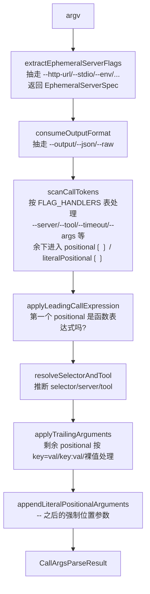
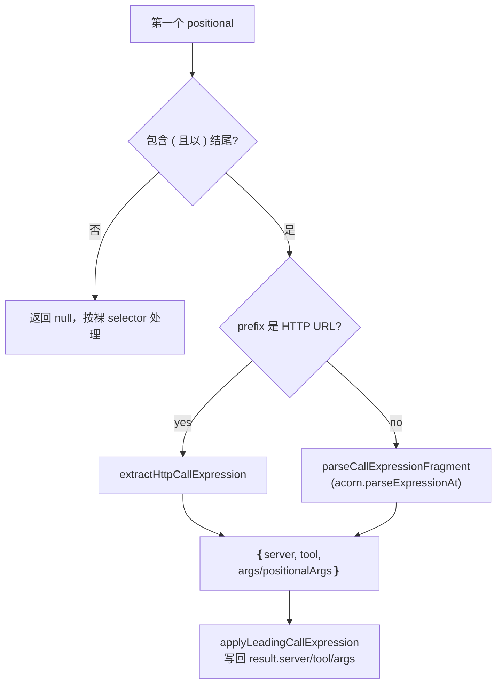
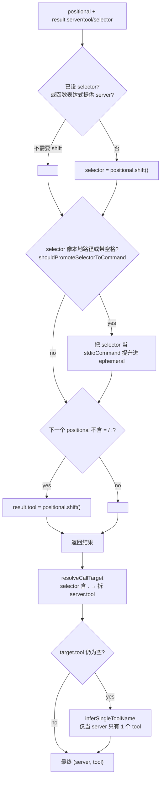
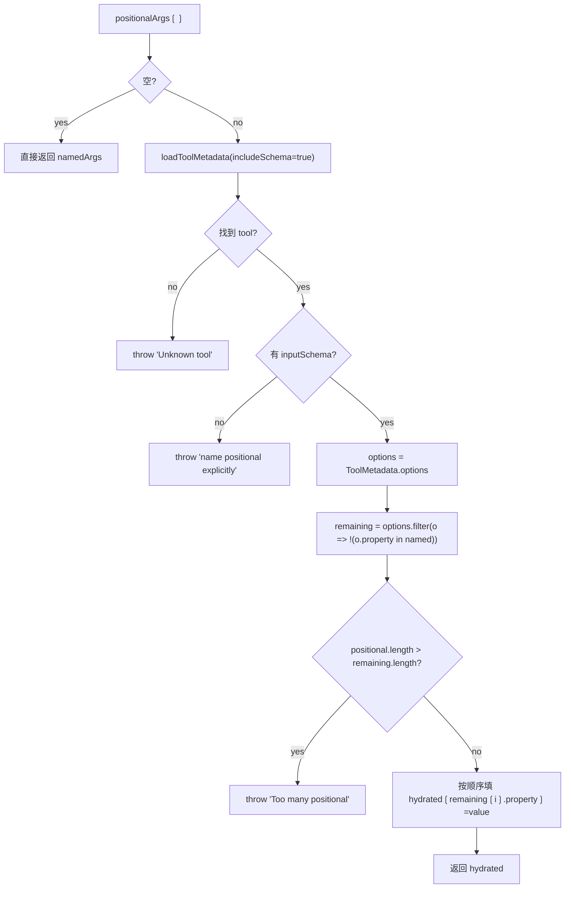
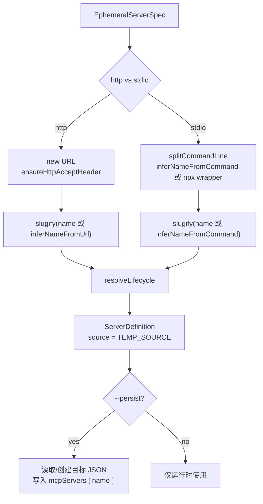

<details>
<summary>相关源文件</summary>

生成本页时使用的主要源文件：

- [src/cli/call-arguments.ts](../../../project-repos/mcporter/src/cli/call-arguments.ts)
- [src/cli/call-argument-values.ts](../../../project-repos/mcporter/src/cli/call-argument-values.ts)
- [src/cli/call-argument-expression.ts](../../../project-repos/mcporter/src/cli/call-argument-expression.ts)
- [src/cli/call-expression-parser.ts](../../../project-repos/mcporter/src/cli/call-expression-parser.ts)
- [src/cli/identifier-helpers.ts](../../../project-repos/mcporter/src/cli/identifier-helpers.ts)
- [src/cli/adhoc-server.ts](../../../project-repos/mcporter/src/cli/adhoc-server.ts)
- [src/cli/ephemeral-flags.ts](../../../project-repos/mcporter/src/cli/ephemeral-flags.ts)
- [src/cli/ephemeral-target.ts](../../../project-repos/mcporter/src/cli/ephemeral-target.ts)
- [src/cli/http-utils.ts](../../../project-repos/mcporter/src/cli/http-utils.ts)

</details>

# 调用语法、自动纠错与临时服务器

`mcporter call` 同时支持四种"调用面"：传统 `--flag` / `key=value` / 函数式表达式 / 全 URL。这些写法最终都被翻译成同一个 `{ server, tool, args }` 三元组。本页拆解参数解析、值类型推导、自动纠错与 `--http-url`/`--stdio` 类临时服务器的注册与持久化。

## 调用面一览

下面这些写法在 0.10.x 都是合法的，调用结果完全一致：

```bash
# 1. 传统 key=value
mcporter call linear.list_issues assignee=me limit=5

# 2. 冒号语法（shell 友好；缺值时支持下一个 token 作为 value）
mcporter call linear.list_issues 'assignee:me' 'limit:5'

# 3. 函数式表达式（用单引号包住整体，让 shell 不动括号）
mcporter call 'linear.list_issues(assignee: "me", limit: 5)'

# 4. URL 选择器（最后一段 .tool 作 tool；URL 自动被识别为 ephemeral）
mcporter call https://mcp.linear.app/mcp.list_issues assignee=me

# 5. 省略 verb（command-inference 隐式补 'call'）
mcporter linear.list_issues assignee=me

# 6. -- 字面量分隔（之后的 token 不再被解析为 flag）
mcporter call linear.create_comment -- "--starts-with-dashes-but-is-data"
```

Sources: [src/cli/call-arguments.ts:67-228](../../../project-repos/mcporter/src/cli/call-arguments.ts#L67-L228), [src/cli/call-argument-expression.ts:7-40](../../../project-repos/mcporter/src/cli/call-argument-expression.ts#L7-L40), [src/cli/call-argument-values.ts:9-65](../../../project-repos/mcporter/src/cli/call-argument-values.ts#L9-L65)

<details class="source-snippets">
<summary>引用源码</summary>

<!-- source-snippets:start -->

#### `src/cli/call-arguments.ts:67-228`

```typescript
export function parseCallArguments(args: string[]): CallArgsParseResult {
  const result: CallArgsParseResult = { args: {}, tailLog: false, output: 'auto' };
  const flagState: FlagParseState = { coercionMode: 'default' };
  const ephemeral = extractEphemeralServerFlags(args);
  result.ephemeral = ephemeral;
  result.output = consumeOutputFormat(args, {
    defaultFormat: 'auto',
  });
  const { positional, literalPositional } = scanCallTokens(args, result, flagState);
  const { callExpressionProvidedServer, callExpressionProvidedTool } = applyLeadingCallExpression(positional, result);
  resolveSelectorAndTool(positional, result, callExpressionProvidedServer, callExpressionProvidedTool);
  applyTrailingArguments(positional, result, flagState);
  appendLiteralPositionalArguments(literalPositional, result, flagState);
  return result;
}

function scanCallTokens(args: string[], result: CallArgsParseResult, state: FlagParseState): ScannedCallTokens {
  const positional: string[] = [];
  const literalPositional: string[] = [];
  let index = 0;
  while (index < args.length) {
    const token = args[index];
    if (!token) {
      index += 1;
      continue;
    }
    if (token === '--') {
      literalPositional.push(...args.slice(index + 1).filter(Boolean));
      break;
    }
    const flagHandler = FLAG_HANDLERS[token];
    if (flagHandler) {
      index = flagHandler({ args, index, result, state });
      continue;
    }
    if (token.startsWith('--')) {
      throw new CliUsageError(buildUnknownCallFlagMessage(token));
    }
    positional.push(token);
    index += 1;
  }
  return { positional, literalPositional };
}

function applyLeadingCallExpression(positional: string[], result: CallArgsParseResult): CallExpressionResolution {
  if (positional.length === 0) {
    return { callExpressionProvidedServer: false, callExpressionProvidedTool: false };
  }
  const rawToken = positional[0] ?? '';
  const callExpression = parseLeadingCallExpression(rawToken);
  if (!callExpression) {
    return { callExpressionProvidedServer: false, callExpressionProvidedTool: false };
  }
  positional.shift();
  if (callExpression.server) {
    if (result.server && result.server !== callExpression.server) {
      throw new Error(
        `Conflicting server names: '${result.server}' from flags and '${callExpression.server}' from call expression.`
      );
    }
    result.server = result.server ?? callExpression.server;
  }
  if (result.tool && result.tool !== callExpression.tool) {
    throw new Error(
      `Conflicting tool names: '${result.tool}' from flags and '${callExpression.tool}' from call expression.`
    );
  }
  result.tool = callExpression.tool;
  Object.assign(result.args, callExpression.args);
  if (callExpression.positionalArgs && callExpression.positionalArgs.length > 0) {
    result.positionalArgs = [...(result.positionalArgs ?? []), ...callExpression.positionalArgs];
  }
  return {
    callExpressionProvidedServer: Boolean(callExpression.server),
    callExpressionProvidedTool: Boolean(callExpression.tool),
  };
}

function resolveSelectorAndTool(
  positional: string[],
  result: CallArgsParseResult,
  callExpressionProvidedServer: boolean,
  callExpressionProvidedTool: boolean
): void {
  if (!result.selector && positional.length > 0 && !callExpressionProvidedServer && !result.server) {
    result.selector = positional.shift();
  }
  if (
    !result.server &&
    result.selector &&
    shouldPromoteSelectorToCommand(result.selector) &&
    !result.ephemeral?.stdioCommand
  ) {
    result.ephemeral = { ...result.ephemeral, stdioCommand: result.selector };
    result.selector = undefined;
  }
  const nextPositional = positional[0];
  if (
    !result.tool &&
    nextPositional !== undefined &&
    !nextPositional.includes('=') &&
    !nextPositional.includes(':') &&
    !callExpressionProvidedTool
  ) {
    result.tool = positional.shift();
  }
}

function applyTrailingArguments(positional: string[], result: CallArgsParseResult, state: FlagParseState): void {
  const trailingPositional: unknown[] = [];
  for (let index = 0; index < positional.length; ) {
    const token = positional[index];
    if (!token) {
      index += 1;
      continue;
    }
    const parsed = parseKeyValueToken(token, positional[index + 1]);
    if (!parsed) {
      trailingPositional.push(coerceValue(token, state.coercionMode));
      index += 1;
... snippet truncated ...
```

#### `src/cli/call-argument-expression.ts:7-40`

```typescript
export function parseLeadingCallExpression(rawToken: string): ParsedCallExpression | null {
  try {
    return extractHttpCallExpression(rawToken) ?? parseCallExpressionFragment(rawToken);
  } catch (error) {
    throw buildCallExpressionUsageError(error);
  }
}

function extractHttpCallExpression(raw: string): ParsedCallExpression | null {
  const trimmed = raw.trim();
  const openParen = trimmed.indexOf('(');
  const prefix = openParen === -1 ? trimmed : trimmed.slice(0, openParen);
  const split = splitHttpToolSelector(prefix);
  if (!split) {
    return null;
  }
  if (openParen === -1) {
    return { server: split.baseUrl, tool: split.tool, args: {} };
  }
  if (!trimmed.endsWith(')')) {
    throw new Error('Function-call syntax requires a closing ) character.');
  }
  const argsPortion = trimmed.slice(openParen);
  const parsed = parseCallExpressionFragment(`${split.tool}${argsPortion}`);
  if (!parsed) {
    return { server: split.baseUrl, tool: split.tool, args: {} };
  }
  return {
    server: split.baseUrl,
    tool: split.tool,
    args: parsed.args,
    positionalArgs: parsed.positionalArgs ?? [],
  };
}
```

#### `src/cli/call-argument-values.ts:9-65`

```typescript
export function parseKeyValueToken(token: string, nextToken: string | undefined): ParsedKeyValueToken | undefined {
  const eqIndex = token.indexOf('=');
  if (eqIndex !== -1) {
    const key = token.slice(0, eqIndex);
    const rawValue = token.slice(eqIndex + 1);
    if (!key) {
      return undefined;
    }
    return { key, rawValue, consumed: 1 };
  }

  const colonIndex = token.indexOf(':');
  if (colonIndex !== -1) {
    const key = token.slice(0, colonIndex);
    const remainder = token.slice(colonIndex + 1);
    if (!key) {
      return undefined;
    }
    if (remainder.length > 0) {
      return { key, rawValue: remainder, consumed: 1 };
    }
    if (nextToken !== undefined) {
      return { key, rawValue: nextToken, consumed: 2 };
    }
    warnMissingNamedArgumentValue(key);
    return { key, rawValue: '', consumed: 1 };
  }

  return undefined;
}

export function coerceValue(value: string, coercionMode: CoercionMode = 'default'): unknown {
  const trimmed = value.trim();
  if (trimmed === '') {
    return '';
  }
  if (coercionMode === 'none') {
    return trimmed;
  }
  if (trimmed === 'true' || trimmed === 'false') {
    return trimmed === 'true';
  }
  if (trimmed === 'null' || trimmed === 'none') {
    return null;
  }
  if (coercionMode === 'default' && !Number.isNaN(Number(trimmed)) && trimmed === `${Number(trimmed)}`) {
    return Number(trimmed);
  }
  if ((trimmed.startsWith('{') && trimmed.endsWith('}')) || (trimmed.startsWith('[') && trimmed.endsWith(']'))) {
    try {
      return JSON.parse(trimmed);
    } catch {
      return trimmed;
    }
  }
  return trimmed;
}
```

<!-- source-snippets:end -->
</details>

## 解析管线

`parseCallArguments(args)` 是入口（[src/cli/call-arguments.ts:67-81]()）。它分 5 步把原始 argv 逐步压缩为 `CallArgsParseResult`：



`FLAG_HANDLERS` 在 [src/cli/call-arguments.ts:54-65]() 定义：`--server` / `--mcp` / `--tool` / `--timeout` / `--tail-log` / `--save-images` / `--yes` / `--raw-strings` / `--no-coerce` / `--args`。任何**未注册的 `--xxx`** 直接抛 `CliUsageError`（[src/cli/call-arguments.ts:101-104]()），避免悄悄退化成位置参数。

`applyTrailingArguments` 把剩余 positional 用 `parseKeyValueToken` 处理（[src/cli/call-argument-values.ts:9-38]()）：

- `key=value`：直接拆，单 token consumed=1。
- `key:value`：colon 后非空 → 单 token；colon 后空（`limit:`）→ 看下一个 token 当 value，consumed=2；如果再没有就警告"missing value"，返回空字符串。
- 没有 `=` 也没有 `:`：当成 trailing positional 收集，最后并入 `result.positionalArgs`。

Sources: [src/cli/call-arguments.ts:67-214](../../../project-repos/mcporter/src/cli/call-arguments.ts#L67-L214), [src/cli/call-argument-values.ts:9-95](../../../project-repos/mcporter/src/cli/call-argument-values.ts#L9-L95)

<details class="source-snippets">
<summary>引用源码</summary>

<!-- source-snippets:start -->

#### `src/cli/call-arguments.ts:67-214`

```typescript
export function parseCallArguments(args: string[]): CallArgsParseResult {
  const result: CallArgsParseResult = { args: {}, tailLog: false, output: 'auto' };
  const flagState: FlagParseState = { coercionMode: 'default' };
  const ephemeral = extractEphemeralServerFlags(args);
  result.ephemeral = ephemeral;
  result.output = consumeOutputFormat(args, {
    defaultFormat: 'auto',
  });
  const { positional, literalPositional } = scanCallTokens(args, result, flagState);
  const { callExpressionProvidedServer, callExpressionProvidedTool } = applyLeadingCallExpression(positional, result);
  resolveSelectorAndTool(positional, result, callExpressionProvidedServer, callExpressionProvidedTool);
  applyTrailingArguments(positional, result, flagState);
  appendLiteralPositionalArguments(literalPositional, result, flagState);
  return result;
}

function scanCallTokens(args: string[], result: CallArgsParseResult, state: FlagParseState): ScannedCallTokens {
  const positional: string[] = [];
  const literalPositional: string[] = [];
  let index = 0;
  while (index < args.length) {
    const token = args[index];
    if (!token) {
      index += 1;
      continue;
    }
    if (token === '--') {
      literalPositional.push(...args.slice(index + 1).filter(Boolean));
      break;
    }
    const flagHandler = FLAG_HANDLERS[token];
    if (flagHandler) {
      index = flagHandler({ args, index, result, state });
      continue;
    }
    if (token.startsWith('--')) {
      throw new CliUsageError(buildUnknownCallFlagMessage(token));
    }
    positional.push(token);
    index += 1;
  }
  return { positional, literalPositional };
}

function applyLeadingCallExpression(positional: string[], result: CallArgsParseResult): CallExpressionResolution {
  if (positional.length === 0) {
    return { callExpressionProvidedServer: false, callExpressionProvidedTool: false };
  }
  const rawToken = positional[0] ?? '';
  const callExpression = parseLeadingCallExpression(rawToken);
  if (!callExpression) {
    return { callExpressionProvidedServer: false, callExpressionProvidedTool: false };
  }
  positional.shift();
  if (callExpression.server) {
    if (result.server && result.server !== callExpression.server) {
      throw new Error(
        `Conflicting server names: '${result.server}' from flags and '${callExpression.server}' from call expression.`
      );
    }
    result.server = result.server ?? callExpression.server;
  }
  if (result.tool && result.tool !== callExpression.tool) {
    throw new Error(
      `Conflicting tool names: '${result.tool}' from flags and '${callExpression.tool}' from call expression.`
    );
  }
  result.tool = callExpression.tool;
  Object.assign(result.args, callExpression.args);
  if (callExpression.positionalArgs && callExpression.positionalArgs.length > 0) {
    result.positionalArgs = [...(result.positionalArgs ?? []), ...callExpression.positionalArgs];
  }
  return {
    callExpressionProvidedServer: Boolean(callExpression.server),
    callExpressionProvidedTool: Boolean(callExpression.tool),
  };
}

function resolveSelectorAndTool(
  positional: string[],
  result: CallArgsParseResult,
  callExpressionProvidedServer: boolean,
  callExpressionProvidedTool: boolean
): void {
  if (!result.selector && positional.length > 0 && !callExpressionProvidedServer && !result.server) {
    result.selector = positional.shift();
  }
  if (
    !result.server &&
    result.selector &&
    shouldPromoteSelectorToCommand(result.selector) &&
    !result.ephemeral?.stdioCommand
  ) {
    result.ephemeral = { ...result.ephemeral, stdioCommand: result.selector };
    result.selector = undefined;
  }
  const nextPositional = positional[0];
  if (
    !result.tool &&
    nextPositional !== undefined &&
    !nextPositional.includes('=') &&
    !nextPositional.includes(':') &&
    !callExpressionProvidedTool
  ) {
    result.tool = positional.shift();
  }
}

function applyTrailingArguments(positional: string[], result: CallArgsParseResult, state: FlagParseState): void {
  const trailingPositional: unknown[] = [];
  for (let index = 0; index < positional.length; ) {
    const token = positional[index];
    if (!token) {
      index += 1;
      continue;
    }
    const parsed = parseKeyValueToken(token, positional[index + 1]);
    if (!parsed) {
      trailingPositional.push(coerceValue(token, state.coercionMode));
      index += 1;
... snippet truncated ...
```

#### `src/cli/call-argument-values.ts:9-95`

```typescript
export function parseKeyValueToken(token: string, nextToken: string | undefined): ParsedKeyValueToken | undefined {
  const eqIndex = token.indexOf('=');
  if (eqIndex !== -1) {
    const key = token.slice(0, eqIndex);
    const rawValue = token.slice(eqIndex + 1);
    if (!key) {
      return undefined;
    }
    return { key, rawValue, consumed: 1 };
  }

  const colonIndex = token.indexOf(':');
  if (colonIndex !== -1) {
    const key = token.slice(0, colonIndex);
    const remainder = token.slice(colonIndex + 1);
    if (!key) {
      return undefined;
    }
    if (remainder.length > 0) {
      return { key, rawValue: remainder, consumed: 1 };
    }
    if (nextToken !== undefined) {
      return { key, rawValue: nextToken, consumed: 2 };
    }
    warnMissingNamedArgumentValue(key);
    return { key, rawValue: '', consumed: 1 };
  }

  return undefined;
}

export function coerceValue(value: string, coercionMode: CoercionMode = 'default'): unknown {
  const trimmed = value.trim();
  if (trimmed === '') {
    return '';
  }
  if (coercionMode === 'none') {
    return trimmed;
  }
  if (trimmed === 'true' || trimmed === 'false') {
    return trimmed === 'true';
  }
  if (trimmed === 'null' || trimmed === 'none') {
    return null;
  }
  if (coercionMode === 'default' && !Number.isNaN(Number(trimmed)) && trimmed === `${Number(trimmed)}`) {
    return Number(trimmed);
  }
  if ((trimmed.startsWith('{') && trimmed.endsWith('}')) || (trimmed.startsWith('[') && trimmed.endsWith(']'))) {
    try {
      return JSON.parse(trimmed);
    } catch {
      return trimmed;
    }
  }
  return trimmed;
}

export function shouldPromoteSelectorToCommand(selector: string): boolean {
  const trimmed = selector.trim();
  if (!trimmed) {
    return false;
  }
  if (/\s/.test(trimmed)) {
    return true;
  }
  if (/^(?:\.{1,2}\/|~\/|\/)/.test(trimmed)) {
    return true;
  }
  if (/^[A-Za-z]:\\/.test(trimmed) || trimmed.startsWith('\\\\')) {
    return true;
  }
  return false;
}

function warnMissingNamedArgumentValue(key: string): void {
  const hint =
    key === 'command' ? `Example: mcporter call iterm-mcp.write_to_terminal --args '{"command":"echo hi"}'` : undefined;
  const lines = [
    `[mcporter] Argument '${key}' was provided without a value.`,
    `Wrap the entire key/value pair in quotes (e.g., 'command: "echo hi"') or use --args with JSON.`,
  ];
  if (hint) {
    lines.push(hint);
  }
  console.warn(lines.join(' '));
}
```

<!-- source-snippets:end -->
</details>

## 值类型推导（`coerceValue`）

`coerceValue(value, mode)` 决定一个字符串字面量在没有 schema 信息时被翻译成什么 JS 值（[src/cli/call-argument-values.ts:40-65]()）：

| mode | 处理顺序 |
|------|----------|
| `'default'`（默认） | trim → `'true'/'false'` → `'null'/'none'` → 数字（`Number(trimmed) === ${Number(...)}` 防止"1e3" 这种 lossy round-trip）→ `{...}` / `[...]` JSON.parse → 原字符串 |
| `'raw-strings'` | 同 default 但跳过数字分支 |
| `'none'`（`--no-coerce`） | 一律返回 trimmed 字符串 |

由于 `Number(trimmed) === \`${Number(trimmed)}\`` 这个等价检查，形如 `12345`、`1.5`、`-3` 会被识别为数字，但 `12345abc`、`123_456`、`1e3`（在某些情况下）不会被强制转换。

**这一切只是"无 schema"的兜底**。`call-command.ts` 里的 `enforceSchemaStringTypes`（[src/cli/call-command.ts:268-303]()）在拿到 schema 后会把"看起来像数字但 schema 是 string"的字段还原成原始字符串，避免把 issue ID `12345` 误传成 number 12345。`schemaStringCoercionCandidates` 里记的就是 raw 字符串副本（[src/cli/call-arguments.ts:204-208]()）。
Sources: [src/cli/call-argument-values.ts:40-65](../../../project-repos/mcporter/src/cli/call-argument-values.ts#L40-L65), [src/cli/call-arguments.ts:175-213](../../../project-repos/mcporter/src/cli/call-arguments.ts#L175-L213), [src/cli/call-command.ts:268-303](../../../project-repos/mcporter/src/cli/call-command.ts#L268-L303)

<details class="source-snippets">
<summary>引用源码</summary>

<!-- source-snippets:start -->

#### `src/cli/call-argument-values.ts:40-65`

```typescript
export function coerceValue(value: string, coercionMode: CoercionMode = 'default'): unknown {
  const trimmed = value.trim();
  if (trimmed === '') {
    return '';
  }
  if (coercionMode === 'none') {
    return trimmed;
  }
  if (trimmed === 'true' || trimmed === 'false') {
    return trimmed === 'true';
  }
  if (trimmed === 'null' || trimmed === 'none') {
    return null;
  }
  if (coercionMode === 'default' && !Number.isNaN(Number(trimmed)) && trimmed === `${Number(trimmed)}`) {
    return Number(trimmed);
  }
  if ((trimmed.startsWith('{') && trimmed.endsWith('}')) || (trimmed.startsWith('[') && trimmed.endsWith(']'))) {
    try {
      return JSON.parse(trimmed);
    } catch {
      return trimmed;
    }
  }
  return trimmed;
}
```

#### `src/cli/call-arguments.ts:175-213`

```typescript
function applyTrailingArguments(positional: string[], result: CallArgsParseResult, state: FlagParseState): void {
  const trailingPositional: unknown[] = [];
  for (let index = 0; index < positional.length; ) {
    const token = positional[index];
    if (!token) {
      index += 1;
      continue;
    }
    const parsed = parseKeyValueToken(token, positional[index + 1]);
    if (!parsed) {
      trailingPositional.push(coerceValue(token, state.coercionMode));
      index += 1;
      continue;
    }
    index += parsed.consumed;
    const value = coerceValue(parsed.rawValue, state.coercionMode);
    if (parsed.key === 'tool' && !result.tool) {
      if (typeof value !== 'string') {
        throw new Error("Argument 'tool' must be a string value.");
      }
      result.tool = value as string;
      continue;
    }
    if (parsed.key === 'server' && !result.server) {
      if (typeof value !== 'string') {
        throw new Error("Argument 'server' must be a string value.");
      }
      result.server = value as string;
      continue;
    }
    if (state.coercionMode === 'default' && typeof value === 'number') {
      result.schemaStringCoercionCandidates ??= {};
      result.schemaStringCoercionCandidates[parsed.key] = parsed.rawValue;
    }
    result.args[parsed.key] = value;
  }
  if (trailingPositional.length > 0) {
    result.positionalArgs = [...(result.positionalArgs ?? []), ...trailingPositional];
  }
```

#### `src/cli/call-command.ts:268-303`

```typescript
async function enforceSchemaStringTypes(
  runtime: Awaited<ReturnType<(typeof import('../runtime.js'))['createRuntime']>>,
  server: string,
  tool: string,
  args: Record<string, unknown>,
  rawCandidates: Record<string, string> | undefined,
  timeoutMs: number
): Promise<Record<string, unknown>> {
  if (!rawCandidates || Object.keys(rawCandidates).length === 0) {
    return args;
  }

  const tools = await withTimeout(loadToolMetadata(runtime, server, { includeSchema: true }), timeoutMs).catch(
    () => undefined
  );
  if (!tools) {
    return args;
  }
  const toolInfo = tools.find((entry) => entry.tool.name === tool);
  const schema = toolInfo?.tool.inputSchema as { properties?: Record<string, unknown> } | undefined;
  if (!schema?.properties) {
    return args;
  }

  let corrected: Record<string, unknown> | undefined;
  for (const [key, rawValue] of Object.entries(rawCandidates)) {
    if (typeof args[key] !== 'number') {
      continue;
    }
    if (!schemaAllowsString(schema.properties[key])) {
      continue;
    }
    corrected ??= { ...args };
    corrected[key] = rawValue;
  }
  return corrected ?? args;
```

<!-- source-snippets:end -->
</details>

## 函数式调用表达式

第一个 positional 如果包含 `(` 且以 `)` 结尾，进入 `parseLeadingCallExpression`（[src/cli/call-argument-expression.ts:7-13]()）。它会先尝试 `extractHttpCallExpression`（处理 `https://host/path.tool(...)` 这种 URL + 函数调用混合），再回退到通用的 `parseCallExpressionFragment`。

`parseCallExpressionFragment`（[src/cli/call-expression-parser.ts:24-92]()）的实现：

1. 拆 `prefix(args)` 成 prefix（`server.tool`）与 args portion。
2. 用 `acorn.parseExpressionAt('__call(...)')` 把 `(...)` 解析成 `CallExpression` 节点。`buildParseAttempts` 会尝试若干 candidate（处理可能的 trailing comma、bare key 等）。
3. 如果只有一个 ObjectExpression 实参 → 抽取键值对到 `args: Record<string, unknown>`。
4. 否则把每个实参视为位置参数，转换 Literal / ArrayExpression / ObjectExpression / UnaryExpression 字面量为 JS 值。
5. `splitPrefix` 拆 `server.tool` 或 `tool`（`server` 可缺省，由 selector 流程补）。



Sources: [src/cli/call-argument-expression.ts:7-40](../../../project-repos/mcporter/src/cli/call-argument-expression.ts#L7-L40), [src/cli/call-expression-parser.ts:24-92](../../../project-repos/mcporter/src/cli/call-expression-parser.ts#L24-L92)

<details class="source-snippets">
<summary>引用源码</summary>

<!-- source-snippets:start -->

#### `src/cli/call-argument-expression.ts:7-40`

```typescript
export function parseLeadingCallExpression(rawToken: string): ParsedCallExpression | null {
  try {
    return extractHttpCallExpression(rawToken) ?? parseCallExpressionFragment(rawToken);
  } catch (error) {
    throw buildCallExpressionUsageError(error);
  }
}

function extractHttpCallExpression(raw: string): ParsedCallExpression | null {
  const trimmed = raw.trim();
  const openParen = trimmed.indexOf('(');
  const prefix = openParen === -1 ? trimmed : trimmed.slice(0, openParen);
  const split = splitHttpToolSelector(prefix);
  if (!split) {
    return null;
  }
  if (openParen === -1) {
    return { server: split.baseUrl, tool: split.tool, args: {} };
  }
  if (!trimmed.endsWith(')')) {
    throw new Error('Function-call syntax requires a closing ) character.');
  }
  const argsPortion = trimmed.slice(openParen);
  const parsed = parseCallExpressionFragment(`${split.tool}${argsPortion}`);
  if (!parsed) {
    return { server: split.baseUrl, tool: split.tool, args: {} };
  }
  return {
    server: split.baseUrl,
    tool: split.tool,
    args: parsed.args,
    positionalArgs: parsed.positionalArgs ?? [],
  };
}
```

#### `src/cli/call-expression-parser.ts:24-92`

```typescript
export function parseCallExpressionFragment(raw: string): ParsedCallExpression | null {
  const trimmed = raw.trim();
  const openParen = trimmed.indexOf('(');
  if (openParen === -1 || !trimmed.endsWith(')')) {
    return null;
  }

  const prefix = trimmed.slice(0, openParen).trim();
  if (!prefix) {
    throw new Error('Expected a tool name before the argument list.');
  }

  const argsPortion = trimmed.slice(openParen + 1, -1);
  const trimmedArgs = argsPortion.trim();
  const attempts = buildParseAttempts(trimmedArgs);
  let callExpression: CallExpression | undefined;
  let parseError: Error | undefined;

  for (const candidate of attempts) {
    try {
      const expression = parseExpressionAt(`__call${candidate}`, 0, ACORN_OPTIONS);
      if (expression.type === 'CallExpression') {
        callExpression = expression as CallExpression;
        break;
      }
    } catch (error) {
      parseError = error instanceof Error ? error : new Error(String(error));
    }
  }

  if (!callExpression) {
    const message = parseError?.message ?? 'Unexpected token';
    throw new Error(`Unable to parse call expression: ${message}`);
  }

  if (callExpression.arguments.length === 0) {
    return {
      ...splitPrefix(prefix),
      args: {},
    };
  }

  if (callExpression.arguments.length === 1 && callExpression.arguments[0]?.type === 'ObjectExpression') {
    const argument = callExpression.arguments[0];
    if (!argument || argument.type !== 'ObjectExpression') {
      throw new Error('Function-call syntax requires named arguments (e.g. issueId: 123).');
    }
    const args = extractObject(argument);
    return { ...splitPrefix(prefix), args };
  }

  // At this point we know the call expression isn't a plain object literal, so we interpret
  // whatever arguments remain positionally. We still reuse the literal extractor so nested
  // arrays/objects stay supported.
  const positionalArgs = callExpression.arguments.map((argument) => {
    if (!argument) {
      throw new Error('Unsupported empty argument in call expression.');
    }
    if (argument.type === 'SpreadElement') {
      throw new Error('Spread elements are not supported in call expressions.');
    }
    if (!isSupportedValue(argument as Expression)) {
      throw new Error(`Unsupported argument expression: ${argument.type}.`);
    }
    return extractValue(argument as Expression);
  });

  return { ...splitPrefix(prefix), args: {}, positionalArgs };
}
```

<!-- source-snippets:end -->
</details>

## URL 选择器

`splitHttpToolSelector(token)`（在 `src/cli/http-utils.ts` 中）识别 `https://host/path.tool` 这样的形态——把 URL 作为 `baseUrl`，最后一段 `.tool` 作为 tool 名。它在三处被调用：

| 调用方 | 作用 |
|--------|------|
| `command-inference.isHttpToolToken` | 决定 `mcporter https://host/m.tool` 是否要被改写成 `call` |
| `extractHttpCallExpression` | URL + 函数式调用混合时拆分 |
| `list-command` 的 target 解析 | `mcporter list https://host/m.tool` 把 `m.tool` 也放进 selector |

URL 在 `parseCallArguments` 通过 `absorbUrlCandidate`（[src/cli/call-command.ts:80-94]()）变成 ephemeral spec：先调 `normalizeHttpUrlCandidate`（处理 `host/path` 缺协议的情况），命中即把 `parsed.server` / `parsed.selector` 替换成 ephemeral httpUrl。
Sources: [src/cli/http-utils.ts](../../../project-repos/mcporter/src/cli/http-utils.ts), [src/cli/call-command.ts:77-124](../../../project-repos/mcporter/src/cli/call-command.ts#L77-L124)

<details class="source-snippets">
<summary>引用源码</summary>

<!-- source-snippets:start -->

#### `src/cli/http-utils.ts`

```typescript
const DOMAIN_WITH_PATH_PATTERN = /^[A-Za-z0-9](?:[A-Za-z0-9.-]*)(?::\d+)?\//;

export function normalizeHttpUrlCandidate(value?: string): string | undefined {
  if (!value) {
    return undefined;
  }
  const trimmed = value.trim();
  if (!trimmed) {
    return undefined;
  }
  const hasScheme = /^https?:\/\//i.test(trimmed);
  const candidate = hasScheme ? trimmed : DOMAIN_WITH_PATH_PATTERN.test(trimmed) ? `https://${trimmed}` : null;
  if (!candidate) {
    return undefined;
  }
  try {
    const url = new URL(candidate);
    return url.href;
  } catch {
    return undefined;
  }
}

export function looksLikeHttpUrl(value?: string): boolean {
  return Boolean(normalizeHttpUrlCandidate(value));
}

export function splitHttpToolSelector(input: string): { baseUrl: string; tool: string } | null {
  const trimmed = input.trim();
  const candidate = (() => {
    const openParen = trimmed.indexOf('(');
    if (openParen === -1) {
      return trimmed;
    }
    return trimmed.slice(0, openParen);
  })();
  const normalized = normalizeHttpUrlCandidate(candidate);
  if (!normalized) {
    return null;
  }
  let url: URL;
  try {
    url = new URL(normalized);
  } catch {
    return null;
  }
  const pathname = url.pathname || '/';
  const lastSlash = pathname.lastIndexOf('/');
  const segment = pathname.slice(lastSlash + 1);
  const dotIndex = segment.lastIndexOf('.');
  if (dotIndex <= 0) {
    return null;
  }
  const tool = segment.slice(dotIndex + 1);
  if (!tool || !/^[A-Za-z0-9_-]+$/.test(tool)) {
    return null;
  }
  const baseSegment = segment.slice(0, dotIndex);
  if (!baseSegment) {
    return null;
  }
  const basePath = `${pathname.slice(0, Math.max(0, lastSlash + 1))}${baseSegment}`;
  const normalizedPath = basePath.startsWith('/') ? basePath : `/${basePath}`;
  const baseUrl = `${url.origin}${normalizedPath}`;
  return { baseUrl, tool };
}

export function normalizeHttpUrl(value: string | URL): string | undefined {
  try {
    const url = value instanceof URL ? new URL(value.href) : new URL(value);
    url.protocol = url.protocol.toLowerCase();
    url.hostname = url.hostname.replace(/^www\./i, '').toLowerCase();
    if (!url.pathname) {
      url.pathname = '/';
    }
    return url.href.replace(/\/$/, '/');
  } catch {
    return undefined;
  }
}

export function extractHttpServerTarget(value: string): string | undefined {
  const split = splitHttpToolSelector(value);
  if (split) {
    return split.baseUrl;
  }
  const normalized = normalizeHttpUrlCandidate(value);
  return normalized ?? undefined;
}
```

#### `src/cli/call-command.ts:77-124`

```typescript
async function normalizeParsedCallArguments(runtime: Runtime, parsed: CallArgsParseResult): Promise<void> {
  let ephemeralSpec = parsed.ephemeral ? { ...parsed.ephemeral } : undefined;
  const nameHints: string[] = [];
  const absorbUrlCandidate = (value: string | undefined): string | undefined => {
    if (!value) {
      return value;
    }
    const normalized = normalizeHttpUrlCandidate(value);
    if (!normalized) {
      return value;
    }
    if (!ephemeralSpec) {
      ephemeralSpec = { httpUrl: normalized };
    } else if (!ephemeralSpec.httpUrl) {
      ephemeralSpec = { ...ephemeralSpec, httpUrl: normalized };
    }
    return undefined;
  };

  parsed.server = absorbUrlCandidate(parsed.server);
  parsed.selector = absorbUrlCandidate(parsed.selector);

  if (ephemeralSpec && parsed.server && !looksLikeHttpUrl(parsed.server)) {
    nameHints.push(parsed.server);
    parsed.server = undefined;
  }

  if (ephemeralSpec?.httpUrl && !ephemeralSpec.name && parsed.tool) {
    const candidate = parsed.selector && !looksLikeHttpUrl(parsed.selector) ? parsed.selector : undefined;
    if (candidate) {
      nameHints.push(candidate);
      parsed.selector = undefined;
    }
  }

  const prepared = await prepareEphemeralServerTarget({
    runtime,
    target: parsed.server,
    ephemeral: ephemeralSpec,
    nameHints,
    reuseFromSpec: true,
  });

  parsed.server = prepared.target;
  if (!parsed.selector) {
    parsed.selector = prepared.target;
  }
}
```

<!-- source-snippets:end -->
</details>

## 选择器决议（server / tool）

`resolveSelectorAndTool`（[src/cli/call-arguments.ts:145-173]()）+ `resolveServerAndTool`（[src/cli/call-command.ts:126-140]()）共同决定最终 `(server, tool)`：



`shouldPromoteSelectorToCommand`（[src/cli/call-argument-values.ts:67-82]()）的判定条件：含空白、以 `./` / `../` / `~/` / `/` 开头、Windows 盘符 / UNC 路径。命中即把 selector 整段当作临时 stdio 命令——这是为什么 `mcporter call "bun run ./local-server.ts" --tool foo` 能跑。

`inferSingleToolName`（[src/cli/call-command.ts:377-391]()）的语义：如果 server 只有一个 tool，自动选它，并打印 dim 提示 `[auto] X exposes a single tool (Y); using it.`。这对 chrome-devtools 这类只暴露少数命令的服务器很有用。
Sources: [src/cli/call-arguments.ts:145-173](../../../project-repos/mcporter/src/cli/call-arguments.ts#L145-L173), [src/cli/call-command.ts:126-140](../../../project-repos/mcporter/src/cli/call-command.ts#L126-L140), [src/cli/call-argument-values.ts:67-82](../../../project-repos/mcporter/src/cli/call-argument-values.ts#L67-L82)

<details class="source-snippets">
<summary>引用源码</summary>

<!-- source-snippets:start -->

#### `src/cli/call-arguments.ts:145-173`

```typescript
function resolveSelectorAndTool(
  positional: string[],
  result: CallArgsParseResult,
  callExpressionProvidedServer: boolean,
  callExpressionProvidedTool: boolean
): void {
  if (!result.selector && positional.length > 0 && !callExpressionProvidedServer && !result.server) {
    result.selector = positional.shift();
  }
  if (
    !result.server &&
    result.selector &&
    shouldPromoteSelectorToCommand(result.selector) &&
    !result.ephemeral?.stdioCommand
  ) {
    result.ephemeral = { ...result.ephemeral, stdioCommand: result.selector };
    result.selector = undefined;
  }
  const nextPositional = positional[0];
  if (
    !result.tool &&
    nextPositional !== undefined &&
    !nextPositional.includes('=') &&
    !nextPositional.includes(':') &&
    !callExpressionProvidedTool
  ) {
    result.tool = positional.shift();
  }
}
```

#### `src/cli/call-command.ts:126-140`

```typescript
async function resolveServerAndTool(runtime: Runtime, parsed: CallArgsParseResult): Promise<ResolvedCallTarget> {
  const target = resolveCallTarget(parsed, { allowMissingTool: true });
  const server = target.server;
  let tool = target.tool;
  if (!server) {
    throw new Error('Missing server name. Provide it via <server>.<tool> or --server.');
  }
  if (!tool) {
    tool = await inferSingleToolName(runtime, server);
    if (!tool) {
      throw new Error('Missing tool name. Provide it via <server>.<tool> or --tool.');
    }
  }
  return { server, tool };
}
```

#### `src/cli/call-argument-values.ts:67-82`

```typescript
export function shouldPromoteSelectorToCommand(selector: string): boolean {
  const trimmed = selector.trim();
  if (!trimmed) {
    return false;
  }
  if (/\s/.test(trimmed)) {
    return true;
  }
  if (/^(?:\.{1,2}\/|~\/|\/)/.test(trimmed)) {
    return true;
  }
  if (/^[A-Za-z]:\\/.test(trimmed) || trimmed.startsWith('\\\\')) {
    return true;
  }
  return false;
}
```

<!-- source-snippets:end -->
</details>

## Schema 驱动的位置参数 hydration

CLI 收到的位置参数（裸值或函数表达式中的非 named arg）会被 `hydratePositionalArguments` 映射到 schema 字段（[src/cli/call-command.ts:327-373]()）：



`options` 的顺序由 `extractOptions` 决定（[src/cli/generate/tools.ts:63-97]()）：先按 schema `properties` 列表，required 标记决定 `required`。`hydrate` 只填还未通过 named arg 提供的字段，避免重复。
Sources: [src/cli/call-command.ts:327-373](../../../project-repos/mcporter/src/cli/call-command.ts#L327-L373), [src/cli/generate/tools.ts:63-97](../../../project-repos/mcporter/src/cli/generate/tools.ts#L63-L97)

<details class="source-snippets">
<summary>引用源码</summary>

<!-- source-snippets:start -->

#### `src/cli/call-command.ts:327-373`

```typescript
async function hydratePositionalArguments(
  runtime: Awaited<ReturnType<(typeof import('../runtime.js'))['createRuntime']>>,
  server: string,
  tool: string,
  namedArgs: Record<string, unknown>,
  positionalArgs: unknown[] | undefined
): Promise<Record<string, unknown>> {
  if (!positionalArgs || positionalArgs.length === 0) {
    return namedArgs;
  }
  // We need the schema order to know which field each positional argument maps to; pull the
  // tool list with schemas instead of guessing locally so optional/required order stays correct.
  const tools = await loadToolMetadata(runtime, server, { includeSchema: true }).catch(() => undefined);
  if (!tools) {
    throw new Error('Unable to load tool metadata; name positional arguments explicitly.');
  }
  const toolInfo = tools.find((entry) => entry.tool.name === tool);
  if (!toolInfo) {
    throw new Error(
      `Unknown tool '${tool}' on server '${server}'. Double-check the name or run mcporter list ${server}.`
    );
  }
  if (!toolInfo.tool.inputSchema) {
    throw new Error(`Tool '${tool}' does not expose an input schema; name positional arguments explicitly.`);
  }
  const options = toolInfo.options;
  if (options.length === 0) {
    throw new Error(`Tool '${tool}' has no declared parameters; remove positional arguments.`);
  }
  // Respect whichever parameters the user already supplied by name so positional values only
  // populate the fields that are still unset.
  const remaining = options.filter((option) => !(option.property in namedArgs));
  if (positionalArgs.length > remaining.length) {
    throw new Error(
      `Too many positional arguments (${positionalArgs.length}) supplied; only ${remaining.length} parameter${remaining.length === 1 ? '' : 's'} remain on ${tool}.`
    );
  }
  const hydrated: Record<string, unknown> = { ...namedArgs };
  positionalArgs.forEach((value, index) => {
    const target = remaining[index];
    if (!target) {
      return;
    }
    hydrated[target.property] = value;
  });
  return hydrated;
}
```

#### `src/cli/generate/tools.ts:63-97`

```typescript
export function extractOptions(tool: ServerToolInfo): GeneratedOption[] {
  const schema = tool.inputSchema;
  if (!schema || typeof schema !== 'object') {
    return [];
  }
  const record = schema as Record<string, unknown>;
  if (record.type !== 'object' || typeof record.properties !== 'object') {
    return [];
  }
  // Flatten schema properties into Commander-friendly option descriptors.
  const properties = record.properties as Record<string, unknown>;
  const requiredList = Array.isArray(record.required) ? (record.required as string[]) : [];
  return Object.entries(properties).map(([property, descriptor]) => {
    const type = inferType(descriptor);
    const arrayItemType = type === 'array' ? inferArrayItemType(descriptor) : undefined;
    const enumValues = getEnumValues(descriptor);
    const defaultValue = getDescriptorDefault(descriptor);
    const formatInfo = getDescriptorFormatHint(descriptor);
    const placeholder = buildPlaceholder(property, type, enumValues, formatInfo?.slug);
    const exampleValue = buildExampleValue(property, type, enumValues, defaultValue);
    return {
      property,
      cliName: toCliOption(property),
      description: getDescriptorDescription(descriptor),
      required: requiredList.includes(property),
      type,
      arrayItemType,
      placeholder,
      exampleValue,
      enumValues,
      defaultValue,
      formatHint: formatInfo?.display,
    };
  });
}
```

<!-- source-snippets:end -->
</details>

## 自动纠错（Levenshtein）

`identifier-helpers.ts` 提供两类纠错：server 名（在 `command-inference` 与 `list-command` 使用）与 tool 名（在 `call-command.attemptCall` 失败路径上使用）。

```ts
// AUTO_THRESHOLD_RATIO = 0.3, AUTO_THRESHOLD_MIN = 2
chooseClosestIdentifier(input, candidates)
```

`chooseClosestIdentifier`（[src/cli/identifier-helpers.ts:6-43]()）：

1. **完全匹配三连**：原值相等 / `normalizeIdentifier`（去掉非字母数字）相等 / 大小写不敏感相等 → 立即返回 `kind: 'auto'`。
2. **Levenshtein 距离**：对剩余候选用纯 JS DP 计算（[identifier-helpers.ts:77-100]()）。
3. **阈值**：`threshold = max(2, floor(maxLen × 0.3))`。`bestScore <= threshold` → `kind: 'auto'`，否则 `kind: 'suggest'`。
4. CLI 端：`auto` 模式直接换名重试 + 打印 dim 提示；`suggest` 模式打印黄色 `[mcporter] Did you mean X?` 然后退出 1。

工具名纠错的触发要求是 server 端真正回的 `Tool xxx not found` 错误（`extractMissingToolFromError` 用正则提取，[src/cli/call-command.ts:485-492]()），而且 tail 名字必须等于尝试值——避免把不相关错误当成 tool not found。
Sources: [src/cli/identifier-helpers.ts:1-100](../../../project-repos/mcporter/src/cli/identifier-helpers.ts#L1-L100), [src/cli/call-command.ts:454-483](../../../project-repos/mcporter/src/cli/call-command.ts#L454-L483)

<details class="source-snippets">
<summary>引用源码</summary>

<!-- source-snippets:start -->

#### `src/cli/identifier-helpers.ts:1-100`

```typescript
const AUTO_THRESHOLD_RATIO = 0.3;
const AUTO_THRESHOLD_MIN = 2;

export type IdentifierResolution = { kind: 'auto'; value: string } | { kind: 'suggest'; value: string };

export function chooseClosestIdentifier(input: string, candidates: string[]): IdentifierResolution | undefined {
  if (candidates.length === 0) {
    return undefined;
  }
  const normalizedInput = normalizeIdentifier(input);
  let bestName: string | undefined;
  let bestScore = Number.POSITIVE_INFINITY;

  for (const candidate of candidates) {
    if (candidate === input) {
      return { kind: 'auto', value: candidate };
    }
    const normalizedCandidate = normalizeIdentifier(candidate);
    if (normalizedCandidate === normalizedInput) {
      return { kind: 'auto', value: candidate };
    }
    if (candidate.toLowerCase() === input.toLowerCase()) {
      return { kind: 'auto', value: candidate };
    }
    const score = levenshtein(normalizedInput, normalizedCandidate);
    if (score < bestScore) {
      bestScore = score;
      bestName = candidate;
    }
  }

  if (!bestName) {
    return undefined;
  }

  const normalizedBest = normalizeIdentifier(bestName);
  const lengthBaseline = Math.max(normalizedInput.length, normalizedBest.length, 1);
  const threshold = Math.max(AUTO_THRESHOLD_MIN, Math.floor(lengthBaseline * AUTO_THRESHOLD_RATIO));
  if (bestScore <= threshold) {
    return { kind: 'auto', value: bestName };
  }
  return { kind: 'suggest', value: bestName };
}

export function normalizeIdentifier(value: string): string {
  return value.replace(/[^a-z0-9]/gi, '').toLowerCase();
}

export interface IdentifierResolutionContext {
  entity: 'server' | 'tool';
  attempted: string;
  resolution: IdentifierResolution;
  scope?: string;
}

export function renderIdentifierResolutionMessages(context: IdentifierResolutionContext): {
  auto?: string;
  suggest?: string;
} {
  const resolvedDisplay =
    context.entity === 'tool' && context.scope
      ? `${context.scope}.${context.resolution.value}`
      : context.resolution.value;
  const attemptedDisplay =
    context.entity === 'tool' && context.scope ? `${context.scope}.${context.attempted}` : context.attempted;
  if (context.resolution.kind === 'auto') {
    const noun = context.entity === 'tool' ? 'tool call' : 'server name';
    return {
      auto: `[mcporter] Auto-corrected ${noun} to ${resolvedDisplay} (input: ${attemptedDisplay}).`,
    };
  }
  return {
    suggest: `[mcporter] Did you mean ${resolvedDisplay}?`,
  };
}

function levenshtein(a: string, b: string): number {
  if (a === b) {
    return 0;
  }
  if (a.length === 0) {
    return b.length;
  }
  if (b.length === 0) {
    return a.length;
  }

  const previous: number[] = Array.from({ length: b.length + 1 }, (_, index) => index);
  const current: number[] = Array.from({ length: b.length + 1 }, () => 0);

  for (let i = 1; i <= a.length; i += 1) {
    current[0] = i;
    const charA = a[i - 1];
    for (let j = 1; j <= b.length; j += 1) {
      const charB = b[j - 1];
      const insertCost = (current[j - 1] ?? Number.POSITIVE_INFINITY) + 1;
      const deleteCost = (previous[j] ?? Number.POSITIVE_INFINITY) + 1;
      const replaceCost = (previous[j - 1] ?? Number.POSITIVE_INFINITY) + (charA === charB ? 0 : 1);
      current[j] = Math.min(insertCost, deleteCost, replaceCost);
    }
```

#### `src/cli/call-command.ts:454-483`

```typescript
async function maybeResolveToolName(
  runtime: Awaited<ReturnType<(typeof import('../runtime.js'))['createRuntime']>>,
  server: string,
  attemptedTool: string,
  error: unknown
): Promise<ToolResolution | undefined> {
  const missingName = extractMissingToolFromError(error);
  if (!missingName) {
    return undefined;
  }

  // Only attempt a suggestion if the server explicitly rejected the tool we tried.
  if (normalizeIdentifier(missingName) !== normalizeIdentifier(attemptedTool)) {
    return undefined;
  }

  const tools = await loadToolMetadata(runtime, server, { includeSchema: false }).catch(() => undefined);
  if (!tools) {
    return undefined;
  }

  const resolution = chooseClosestIdentifier(
    attemptedTool,
    tools.map((entry) => entry.tool.name)
  );
  if (!resolution) {
    return undefined;
  }
  return resolution;
}
```

<!-- source-snippets:end -->
</details>

## 临时服务器（`--http-url` / `--stdio`）

`extractEphemeralServerFlags`（[src/cli/ephemeral-flags.ts:9-128]()）扫描 argv 抽走以下 flag：

| flag | 字段 | 备注 |
|------|------|------|
| `--http-url <url>` 或 `--sse <url>` | `httpUrl` | URL 是 http:// 时还需要 `--allow-http` |
| `--allow-http` / `--insecure` | `allowInsecureHttp` | |
| `--stdio "<command>"` | `stdioCommand` | 整段命令字符串 |
| `--stdio-arg <value>` | `stdioArgs[]` | 可重复 |
| `--env KEY=value` | `env` | 可重复，merge 到对象 |
| `--cwd <path>` | `cwd` | 仅 stdio 有意义 |
| `--name <value>` | `name` | 覆盖推断的 slug |
| `--description <text>` | `description` | |
| `--persist <path>` | `persistPath` | 写回 mcporter.json，可关闭 (`allowPersist=false`) |

`prepareEphemeralServerTarget`（在 `src/cli/ephemeral-target.ts`）把这个 spec 跑 `resolveEphemeralServer` 拿到 `ServerDefinition`、调 `runtime.registerDefinition({ overwrite: true })` 注册进运行时（与本地 config 同名时仍然覆盖）、按 `persistPath` 调 `persistEphemeralServer` 把 entry 序列化写回 JSON。

`resolveEphemeralServer`（[src/cli/adhoc-server.ts:28-105]()）的核心规则：

- HTTP：必须 https:// 或带 `--allow-http` 的 http://；header 自动添加 `application/json, text/event-stream`。
- stdio：用 `splitCommandLine` 分词（支持单/双引号 + 反斜杠转义）。如果包名是 `npx -y <pkg>`，会用 `inferPackageFromWrapper` + `stripPackageVersion` 把 `pkg@latest` 提成 `pkg`，再 slugify 成 server name。
- `canonicalKeepAliveName`：如果命令包含 `chrome-devtools-mcp` / `@mobilenext/mobile-mcp` / `@playwright/mcp`，把名字归一成 `chrome-devtools` / `mobile-mcp` / `playwright`，并接管它们的默认 keep-alive 行为。
- `lifecycle`：通过 `resolveLifecycle(name, undefined, command)` 判断（默认名单 + 环境覆盖）。



Sources: [src/cli/adhoc-server.ts:28-264](../../../project-repos/mcporter/src/cli/adhoc-server.ts#L28-L264), [src/cli/ephemeral-flags.ts:9-128](../../../project-repos/mcporter/src/cli/ephemeral-flags.ts#L9-L128)

<details class="source-snippets">
<summary>引用源码</summary>

<!-- source-snippets:start -->

#### `src/cli/adhoc-server.ts:28-264`

```typescript
export function resolveEphemeralServer(spec: EphemeralServerSpec): EphemeralServerResolution {
  if (!spec.httpUrl && !spec.stdioCommand) {
    throw new Error('Ad-hoc servers require either --http-url or --stdio.');
  }
  if (spec.httpUrl && spec.stdioCommand) {
    throw new Error('Cannot combine --http-url and --stdio in the same ad-hoc server.');
  }

  if (spec.httpUrl) {
    const url = new URL(spec.httpUrl);
    if (url.protocol !== 'https:' && url.protocol !== 'http:') {
      throw new Error(`Unsupported protocol '${url.protocol}' for --http-url.`);
    }
    if (url.protocol === 'http:' && !spec.allowInsecureHttp) {
      throw new Error('HTTP endpoints require --allow-http to confirm insecure usage.');
    }
    const command: CommandSpec = {
      kind: 'http',
      url,
      headers: __configInternals.ensureHttpAcceptHeader(undefined),
    };
    const canonical = spec.name ? undefined : canonicalKeepAliveName(command);
    const name = slugify(spec.name ?? canonical ?? inferNameFromUrl(url));
    const lifecycle = resolveLifecycle(name, undefined, command);
    const definition: ServerDefinition = {
      name,
      description: spec.description,
      command,
      env: spec.env && Object.keys(spec.env).length > 0 ? spec.env : undefined,
      source: TEMP_SOURCE,
      lifecycle,
    };
    const persistedEntry: Record<string, unknown> = {
      baseUrl: url.href,
      ...(spec.description ? { description: spec.description } : {}),
      ...(spec.env && Object.keys(spec.env).length > 0 ? { env: spec.env } : {}),
      ...(lifecycle ? { lifecycle: serializeLifecycle(lifecycle) } : {}),
    };
    return { definition, name, persistedEntry };
  }

  const stdioCommand = spec.stdioCommand as string;
  const parts = splitCommandLine(stdioCommand);
  if (parts.length === 0) {
    throw new Error('--stdio requires a non-empty command.');
  }
  const [commandBinary, ...commandRest] = parts as [string, ...string[]];
  const commandArgs = commandRest.concat(spec.stdioArgs ?? []);
  const cwd = spec.cwd ? path.resolve(spec.cwd) : process.cwd();
  const command: CommandSpec = {
    kind: 'stdio',
    command: commandBinary,
    args: commandArgs,
    cwd,
  };
  const canonical = spec.name ? undefined : canonicalKeepAliveName(command);
  const name = slugify(spec.name ?? canonical ?? inferNameFromCommand(parts));
  const lifecycle = resolveLifecycle(name, undefined, command);
  const definition: ServerDefinition = {
    name,
    description: spec.description,
    command,
    env: spec.env && Object.keys(spec.env).length > 0 ? spec.env : undefined,
    source: TEMP_SOURCE,
    lifecycle,
  };
  const persistedEntry: Record<string, unknown> = {
    command: commandBinary,
    ...(commandArgs.length > 0 ? { args: commandArgs } : {}),
    ...(spec.description ? { description: spec.description } : {}),
    ...(spec.env && Object.keys(spec.env).length > 0 ? { env: spec.env } : {}),
    ...(lifecycle ? { lifecycle: serializeLifecycle(lifecycle) } : {}),
  };
  if (spec.cwd) {
    persistedEntry.cwd = spec.cwd;
  }
  return { definition, name, persistedEntry };
}

export async function persistEphemeralServer(resolution: EphemeralServerResolution, rawPath: string): Promise<void> {
  const resolvedPath = path.resolve(expandHome(rawPath));
  let existing: Record<string, unknown>;
  try {
    const buffer = await fs.readFile(resolvedPath, 'utf8');
    existing = JSON.parse(buffer) as Record<string, unknown>;
  } catch (error) {
    if ((error as NodeJS.ErrnoException).code !== 'ENOENT') {
      throw error;
    }
    existing = { mcpServers: {} };
  }

  if (typeof existing.mcpServers !== 'object' || existing.mcpServers === null) {
    existing.mcpServers = {};
  }
  const servers = existing.mcpServers as Record<string, unknown>;
  servers[resolution.name] = resolution.persistedEntry;

  await fs.mkdir(path.dirname(resolvedPath), { recursive: true });
  const serialized = `${JSON.stringify(existing, null, 2)}\n`;
  await fs.writeFile(resolvedPath, serialized, 'utf8');
}

function inferNameFromUrl(url: URL): string {
  const host = url.hostname.replace(/^www\./, '');
  const pathSegments = url.pathname.split('/').filter(Boolean);
  if (pathSegments.length === 0) {
    return host;
  }
  return `${host}-${pathSegments[pathSegments.length - 1]}`;
}

function inferNameFromCommand(parts: string[]): string {
  const wrapperPackage = inferPackageFromWrapper(parts);
  if (wrapperPackage) {
    return wrapperPackage;
  }
  const executable = path.basename(parts[0] ?? 'command');
  if (parts.length === 1) {
    return executable;
... snippet truncated ...
```

#### `src/cli/ephemeral-flags.ts:9-128`

```typescript
export function extractEphemeralServerFlags(
  args: string[],
  options: ExtractOptions = {}
): EphemeralServerSpec | undefined {
  let spec: EphemeralServerSpec | undefined;
  const ensureSpec = (): EphemeralServerSpec => {
    if (!spec) {
      spec = {};
    }
    return spec;
  };

  const allowPersist = options.allowPersist ?? true;
  let index = 0;
  while (index < args.length) {
    const token = args[index];
    if (!token) {
      index += 1;
      continue;
    }

    if (token === '--http-url' || token === '--sse') {
      const value = args[index + 1];
      if (!value) {
        throw new Error("Flag '--http-url' requires a value.");
      }
      ensureSpec().httpUrl = value;
      args.splice(index, 2);
      continue;
    }

    if (token === '--allow-http' || token === '--insecure') {
      ensureSpec().allowInsecureHttp = true;
      args.splice(index, 1);
      continue;
    }

    if (token === '--stdio') {
      const value = args[index + 1];
      if (!value) {
        throw new Error("Flag '--stdio' requires a value.");
      }
      ensureSpec().stdioCommand = value;
      args.splice(index, 2);
      continue;
    }

    if (token === '--stdio-arg') {
      const value = args[index + 1];
      if (!value) {
        throw new Error("Flag '--stdio-arg' requires a value.");
      }
      const current = ensureSpec();
      current.stdioArgs = [...(current.stdioArgs ?? []), value];
      args.splice(index, 2);
      continue;
    }

    if (token === '--env') {
      const value = args[index + 1];
      if (!value?.includes('=')) {
        throw new Error("Flag '--env' requires KEY=value.");
      }
      const [key, ...rest] = value.split('=');
      if (!key) {
        throw new Error("Flag '--env' requires KEY=value.");
      }
      const current = ensureSpec();
      const envMap = current.env ? { ...current.env } : {};
      envMap[key] = rest.join('=');
      current.env = envMap;
      args.splice(index, 2);
      continue;
    }

    if (token === '--cwd') {
      const value = args[index + 1];
      if (!value) {
        throw new Error("Flag '--cwd' requires a value.");
      }
      ensureSpec().cwd = value;
      args.splice(index, 2);
      continue;
    }

    if (token === '--name') {
      const value = args[index + 1];
      if (!value) {
        throw new Error("Flag '--name' requires a value.");
      }
      ensureSpec().name = value;
      args.splice(index, 2);
      continue;
    }

    if (token === '--description') {
      const value = args[index + 1];
      if (!value) {
        throw new Error("Flag '--description' requires a value.");
      }
      ensureSpec().description = value;
      args.splice(index, 2);
      continue;
    }

    if (allowPersist && token === '--persist') {
      const value = args[index + 1];
      if (!value) {
        throw new Error("Flag '--persist' requires a value.");
      }
      ensureSpec().persistPath = value;
      args.splice(index, 2);
      continue;
    }

    index += 1;
  }

  return spec;
}
```

<!-- source-snippets:end -->
</details>

## 几个边界规则

- `--` **后**的 token 全部当作字面量位置参数：`mcporter call x.y -- --start-with-dashes` 把 `--start-with-dashes` 当成 string 传给 tool（[src/cli/call-arguments.ts:93-95](), [src/cli/call-arguments.ts:216-228]()）。
- `--args '{"a":1}'` 与 `key=value` 同时使用时，trailing args 后写入会**覆盖** `--args` 提供的同名字段（[src/cli/call-arguments.ts:281-293]()）；这是因为 `Object.assign(result.args, decoded)` 在前、scan 在后。
- 函数表达式与 flag **冲突**报错：`mcporter call --server linear 'context7.tool()'` 抛 `Conflicting server names`（[src/cli/call-arguments.ts:121-135]()）。
- `tool` / `server` 作为 trailing key（如 `mcporter call x.y tool=other`）会被提升成正式选择器，但只在还没设置时生效（[src/cli/call-arguments.ts:191-204]()）。
- ephemeral 与 named server 同名持久化：`--persist` 会把同名 key 替换为 ephemeral 的 entry（[src/cli/adhoc-server.ts:107-129]()），相当于 `mcporter config add` 的快捷方式。

Sources: [src/cli/call-arguments.ts:67-228](../../../project-repos/mcporter/src/cli/call-arguments.ts#L67-L228), [src/cli/adhoc-server.ts:107-129](../../../project-repos/mcporter/src/cli/adhoc-server.ts#L107-L129)

<details class="source-snippets">
<summary>引用源码</summary>

<!-- source-snippets:start -->

#### `src/cli/call-arguments.ts:67-228`

```typescript
export function parseCallArguments(args: string[]): CallArgsParseResult {
  const result: CallArgsParseResult = { args: {}, tailLog: false, output: 'auto' };
  const flagState: FlagParseState = { coercionMode: 'default' };
  const ephemeral = extractEphemeralServerFlags(args);
  result.ephemeral = ephemeral;
  result.output = consumeOutputFormat(args, {
    defaultFormat: 'auto',
  });
  const { positional, literalPositional } = scanCallTokens(args, result, flagState);
  const { callExpressionProvidedServer, callExpressionProvidedTool } = applyLeadingCallExpression(positional, result);
  resolveSelectorAndTool(positional, result, callExpressionProvidedServer, callExpressionProvidedTool);
  applyTrailingArguments(positional, result, flagState);
  appendLiteralPositionalArguments(literalPositional, result, flagState);
  return result;
}

function scanCallTokens(args: string[], result: CallArgsParseResult, state: FlagParseState): ScannedCallTokens {
  const positional: string[] = [];
  const literalPositional: string[] = [];
  let index = 0;
  while (index < args.length) {
    const token = args[index];
    if (!token) {
      index += 1;
      continue;
    }
    if (token === '--') {
      literalPositional.push(...args.slice(index + 1).filter(Boolean));
      break;
    }
    const flagHandler = FLAG_HANDLERS[token];
    if (flagHandler) {
      index = flagHandler({ args, index, result, state });
      continue;
    }
    if (token.startsWith('--')) {
      throw new CliUsageError(buildUnknownCallFlagMessage(token));
    }
    positional.push(token);
    index += 1;
  }
  return { positional, literalPositional };
}

function applyLeadingCallExpression(positional: string[], result: CallArgsParseResult): CallExpressionResolution {
  if (positional.length === 0) {
    return { callExpressionProvidedServer: false, callExpressionProvidedTool: false };
  }
  const rawToken = positional[0] ?? '';
  const callExpression = parseLeadingCallExpression(rawToken);
  if (!callExpression) {
    return { callExpressionProvidedServer: false, callExpressionProvidedTool: false };
  }
  positional.shift();
  if (callExpression.server) {
    if (result.server && result.server !== callExpression.server) {
      throw new Error(
        `Conflicting server names: '${result.server}' from flags and '${callExpression.server}' from call expression.`
      );
    }
    result.server = result.server ?? callExpression.server;
  }
  if (result.tool && result.tool !== callExpression.tool) {
    throw new Error(
      `Conflicting tool names: '${result.tool}' from flags and '${callExpression.tool}' from call expression.`
    );
  }
  result.tool = callExpression.tool;
  Object.assign(result.args, callExpression.args);
  if (callExpression.positionalArgs && callExpression.positionalArgs.length > 0) {
    result.positionalArgs = [...(result.positionalArgs ?? []), ...callExpression.positionalArgs];
  }
  return {
    callExpressionProvidedServer: Boolean(callExpression.server),
    callExpressionProvidedTool: Boolean(callExpression.tool),
  };
}

function resolveSelectorAndTool(
  positional: string[],
  result: CallArgsParseResult,
  callExpressionProvidedServer: boolean,
  callExpressionProvidedTool: boolean
): void {
  if (!result.selector && positional.length > 0 && !callExpressionProvidedServer && !result.server) {
    result.selector = positional.shift();
  }
  if (
    !result.server &&
    result.selector &&
    shouldPromoteSelectorToCommand(result.selector) &&
    !result.ephemeral?.stdioCommand
  ) {
    result.ephemeral = { ...result.ephemeral, stdioCommand: result.selector };
    result.selector = undefined;
  }
  const nextPositional = positional[0];
  if (
    !result.tool &&
    nextPositional !== undefined &&
    !nextPositional.includes('=') &&
    !nextPositional.includes(':') &&
    !callExpressionProvidedTool
  ) {
    result.tool = positional.shift();
  }
}

function applyTrailingArguments(positional: string[], result: CallArgsParseResult, state: FlagParseState): void {
  const trailingPositional: unknown[] = [];
  for (let index = 0; index < positional.length; ) {
    const token = positional[index];
    if (!token) {
      index += 1;
      continue;
    }
    const parsed = parseKeyValueToken(token, positional[index + 1]);
    if (!parsed) {
      trailingPositional.push(coerceValue(token, state.coercionMode));
      index += 1;
... snippet truncated ...
```

#### `src/cli/adhoc-server.ts:107-129`

```typescript
export async function persistEphemeralServer(resolution: EphemeralServerResolution, rawPath: string): Promise<void> {
  const resolvedPath = path.resolve(expandHome(rawPath));
  let existing: Record<string, unknown>;
  try {
    const buffer = await fs.readFile(resolvedPath, 'utf8');
    existing = JSON.parse(buffer) as Record<string, unknown>;
  } catch (error) {
    if ((error as NodeJS.ErrnoException).code !== 'ENOENT') {
      throw error;
    }
    existing = { mcpServers: {} };
  }

  if (typeof existing.mcpServers !== 'object' || existing.mcpServers === null) {
    existing.mcpServers = {};
  }
  const servers = existing.mcpServers as Record<string, unknown>;
  servers[resolution.name] = resolution.persistedEntry;

  await fs.mkdir(path.dirname(resolvedPath), { recursive: true });
  const serialized = `${JSON.stringify(existing, null, 2)}\n`;
  await fs.writeFile(resolvedPath, serialized, 'utf8');
}
```

<!-- source-snippets:end -->
</details>

## 最终的 CallArgsParseResult

CallArgsParseResult 是这一切解析的输出（[src/cli/call-arguments.ts:16-29]()）：

```ts
{
  selector?: string;       // 原始 server.tool 选择器
  server?: string;
  tool?: string;
  args: Record<string, unknown>;            // named + JSON --args + 函数表达式 args
  schemaStringCoercionCandidates?: Record<string, string>; // 数字字面量原文，schema 检查时回填
  positionalArgs?: unknown[];               // 函数表达式的位置参数 + trailing 裸值 + -- 后字面量
  tailLog: boolean;
  output: 'auto'|'text'|'json'|'raw'|...;
  timeoutMs?: number;
  ephemeral?: EphemeralServerSpec;
  rawStrings?: boolean;
  saveImagesDir?: string;
}
```

它会被 `prepareCallRequest` 立刻转成 `PreparedCallRequest`，进入 `runtime.callTool` 流程。
Sources: [src/cli/call-arguments.ts:16-81](../../../project-repos/mcporter/src/cli/call-arguments.ts#L16-L81), [src/cli/call-command.ts:55-75](../../../project-repos/mcporter/src/cli/call-command.ts#L55-L75)

<details class="source-snippets">
<summary>引用源码</summary>

<!-- source-snippets:start -->

#### `src/cli/call-arguments.ts:16-81`

```typescript
export interface CallArgsParseResult {
  selector?: string;
  server?: string;
  tool?: string;
  args: Record<string, unknown>;
  schemaStringCoercionCandidates?: Record<string, string>;
  positionalArgs?: unknown[];
  tailLog: boolean;
  output: OutputFormat;
  timeoutMs?: number;
  ephemeral?: EphemeralServerSpec;
  rawStrings?: boolean;
  saveImagesDir?: string;
}

interface FlagParseState {
  coercionMode: CoercionMode;
}

interface FlagHandlerContext {
  args: string[];
  index: number;
  result: CallArgsParseResult;
  state: FlagParseState;
}

type FlagHandler = (context: FlagHandlerContext) => number;

interface ScannedCallTokens {
  positional: string[];
  literalPositional: string[];
}

interface CallExpressionResolution {
  callExpressionProvidedServer: boolean;
  callExpressionProvidedTool: boolean;
}

const FLAG_HANDLERS: Record<string, FlagHandler> = {
  '--server': handleServerFlag,
  '--mcp': handleServerFlag,
  '--tool': handleToolFlag,
  '--timeout': handleTimeoutFlag,
  '--tail-log': handleTailLogFlag,
  '--save-images': handleSaveImagesFlag,
  '--yes': handleNoopFlag,
  '--raw-strings': handleRawStringsFlag,
  '--no-coerce': handleNoCoerceFlag,
  '--args': handleArgsFlag,
};

export function parseCallArguments(args: string[]): CallArgsParseResult {
  const result: CallArgsParseResult = { args: {}, tailLog: false, output: 'auto' };
  const flagState: FlagParseState = { coercionMode: 'default' };
  const ephemeral = extractEphemeralServerFlags(args);
  result.ephemeral = ephemeral;
  result.output = consumeOutputFormat(args, {
    defaultFormat: 'auto',
  });
  const { positional, literalPositional } = scanCallTokens(args, result, flagState);
  const { callExpressionProvidedServer, callExpressionProvidedTool } = applyLeadingCallExpression(positional, result);
  resolveSelectorAndTool(positional, result, callExpressionProvidedServer, callExpressionProvidedTool);
  applyTrailingArguments(positional, result, flagState);
  appendLiteralPositionalArguments(literalPositional, result, flagState);
  return result;
}
```

#### `src/cli/call-command.ts:55-75`

```typescript
async function prepareCallRequest(runtime: Runtime, args: string[]): Promise<PreparedCallRequest | undefined> {
  const parsed = parseCallArguments(args);
  await normalizeParsedCallArguments(runtime, parsed);
  const { server, tool } = await resolveServerAndTool(runtime, parsed);

  if (await maybeDescribeServer(runtime, server, tool, parsed.output)) {
    return undefined;
  }

  const timeoutMs = resolveCallTimeout(parsed.timeoutMs);
  const hydratedArgs = await hydratePositionalArguments(runtime, server, tool, parsed.args, parsed.positionalArgs);
  const schemaAwareArgs = await enforceSchemaStringTypes(
    runtime,
    server,
    tool,
    hydratedArgs,
    parsed.schemaStringCoercionCandidates,
    timeoutMs
  );
  return { parsed, server, tool, hydratedArgs: schemaAwareArgs, timeoutMs };
}
```

<!-- source-snippets:end -->
</details>

## 相关页面

- [CLI 命令体系](cli-commands.md)
- [运行时与传输层](runtime-transport.md)
