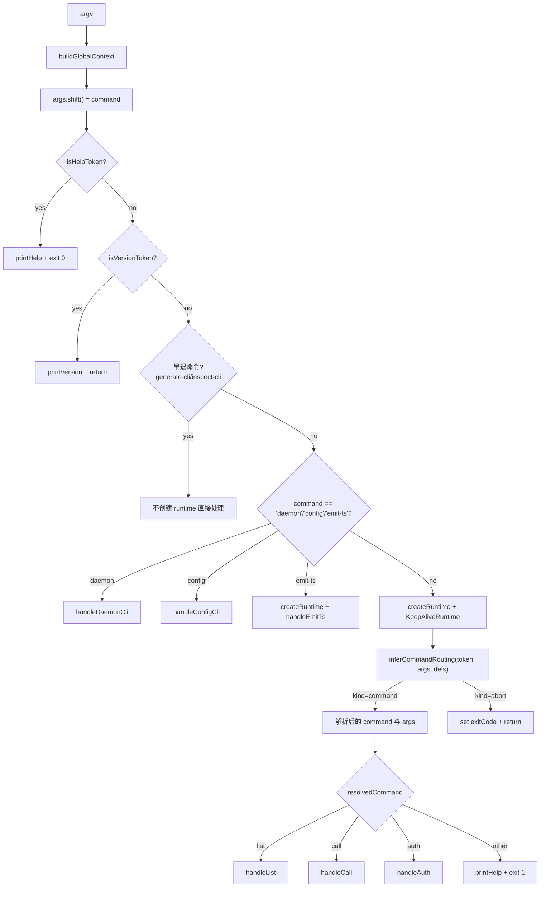
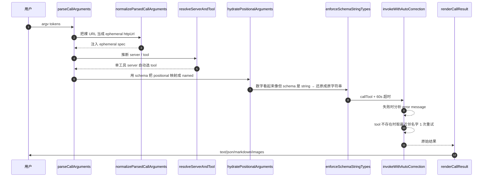
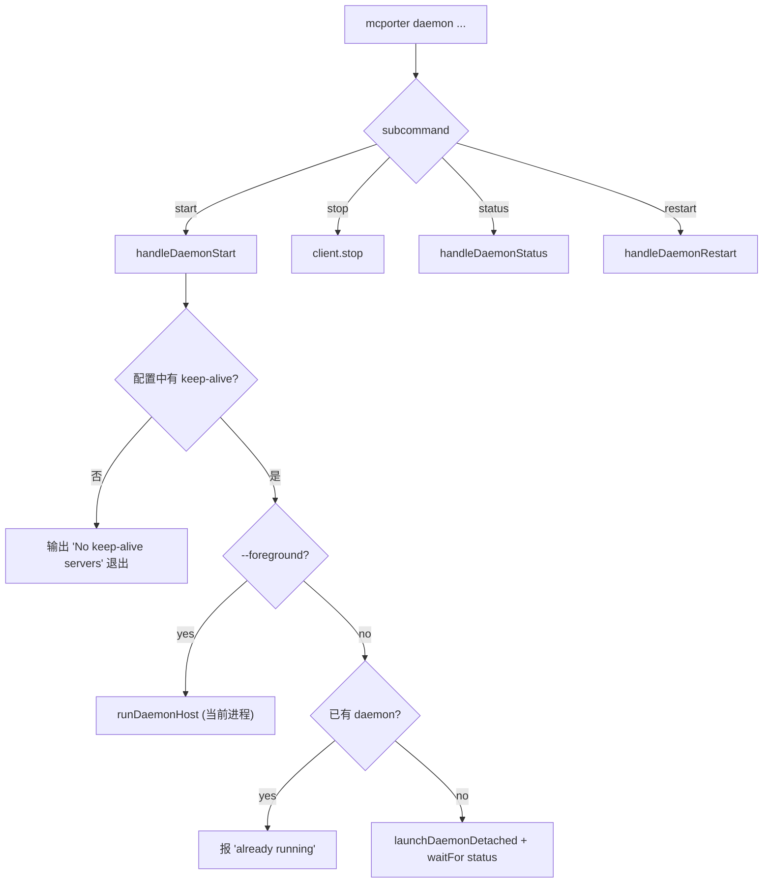

<details>
<summary>相关源文件</summary>

生成本页时使用的主要源文件：

- [src/cli.ts](../../../project-repos/mcporter/src/cli.ts)
- [src/cli/cli-factory.ts](../../../project-repos/mcporter/src/cli/cli-factory.ts)
- [src/cli/command-inference.ts](../../../project-repos/mcporter/src/cli/command-inference.ts)
- [src/cli/list-command.ts](../../../project-repos/mcporter/src/cli/list-command.ts)
- [src/cli/call-command.ts](../../../project-repos/mcporter/src/cli/call-command.ts)
- [src/cli/auth-command.ts](../../../project-repos/mcporter/src/cli/auth-command.ts)
- [src/cli/config-command.ts](../../../project-repos/mcporter/src/cli/config-command.ts)
- [src/cli/daemon-command.ts](../../../project-repos/mcporter/src/cli/daemon-command.ts)
- [src/cli/generate-cli-runner.ts](../../../project-repos/mcporter/src/cli/generate-cli-runner.ts)
- [src/cli/inspect-cli-command.ts](../../../project-repos/mcporter/src/cli/inspect-cli-command.ts)
- [src/cli/emit-ts-command.ts](../../../project-repos/mcporter/src/cli/emit-ts-command.ts)
- [src/cli/help-output.ts](../../../project-repos/mcporter/src/cli/help-output.ts)

</details>

# CLI 命令体系

`mcporter` 的 CLI 不使用 `commander` 命令注册的常规模式来分发，而是手写了一个"路由 + 命令处理器"组合：[runCli](../../../project-repos/mcporter/src/cli.ts#L30-L207) 解析全局 flag 后，先把第一个 token 喂给 `inferCommandRouting` 决定真正的子命令，再调用对应的 handler。这一节把它的命令面、命令推断、help 与版本分支拆开讲清楚。

## 顶层命令面

`printHelp` 把命令分成 4 组（[src/cli/help-output.ts:46-107]()）：

| 组别 | 命令 | 用法 |
|------|------|------|
| Core | `list`, `call`, `auth` | 列出/调用/授权 |
| Generator & tooling | `generate-cli`, `inspect-cli`, `emit-ts` | 代码生成与产物反查 |
| Configuration | `config` | 8 个子命令（list/get/add/remove/import/login/logout/doctor） |
| Daemon | `daemon` | start/status/stop/restart |

全局 flag（在所有命令前可用）：

| flag | 等价环境变量 | 含义 |
|------|--------------|------|
| `--config <path>` | `MCPORTER_CONFIG` | 强制使用某个 mcporter.json |
| `--root <path>` | — | stdio 子进程 / config 解析的工作目录 |
| `--log-level <level>` | `MCPORTER_LOG_LEVEL` | `debug \| info \| warn \| error`（默认 warn） |
| `--oauth-timeout <ms>` | `MCPORTER_OAUTH_TIMEOUT_MS` / `_TIMEOUT` | 浏览器授权码等待超时（默认 60s） |

`buildGlobalContext`（[src/cli/cli-factory.ts:17-51]()）把这些 flag 抽出来，并提前调用 `resolveConfigPath`：只有 `--config` / `MCPORTER_CONFIG` 显式提供时才把 `runtimeOptions.configPath` 置为已解析路径，否则保持 undefined 让 `loadConfigLayers` 自己做兜底（避免不存在的默认 config 触发 ENOENT）。
Sources: [src/cli/help-output.ts:46-145](../../../project-repos/mcporter/src/cli/help-output.ts#L46-L145), [src/cli/cli-factory.ts:17-51](../../../project-repos/mcporter/src/cli/cli-factory.ts#L17-L51)

<details class="source-snippets">
<summary>引用源码</summary>

<!-- source-snippets:start -->

#### `src/cli/help-output.ts:46-145`

```typescript
  const sections: HelpSection[] = [
    {
      title: 'Core commands',
      entries: [
        {
          name: 'list',
          summary: 'List configured servers (add --schema for tool docs)',
          usage: 'mcporter list [name] [--schema] [--json]',
        },
        {
          name: 'call',
          summary: 'Call a tool by selector (server.tool) or HTTP URL; key=value flags supported',
          usage: 'mcporter call <selector> [key=value ...]',
        },
        {
          name: 'auth',
          summary: 'Complete OAuth for a server without listing tools',
          usage: 'mcporter auth <server | url> [--reset]',
        },
      ],
    },
    {
      title: 'Generator & tooling',
      entries: [
        {
          name: 'generate-cli',
          summary: 'Emit a standalone CLI (supports HTTP, stdio, and inline commands)',
          usage: 'mcporter generate-cli --server <name> | --command <ref> [options]',
        },
        {
          name: 'inspect-cli',
          summary: 'Show metadata and regen instructions for a generated CLI',
          usage: 'mcporter inspect-cli <path> [--json]',
        },
        {
          name: 'emit-ts',
          summary: 'Generate TypeScript client/types for a server',
          usage: 'mcporter emit-ts <server> --mode client|types [options]',
        },
      ],
    },
    {
      title: 'Configuration',
      entries: [
        {
          name: 'config',
          summary: 'Inspect or edit config files (list, get, add, remove, import, login, logout)',
          usage: 'mcporter config <command> [options]',
        },
      ],
    },
    {
      title: 'Daemon',
      entries: [
        {
          name: 'daemon',
          summary: 'Manage the keep-alive daemon (start | status | stop | restart)',
          usage: 'mcporter daemon <subcommand>',
        },
      ],
    },
  ];
  return sections.flatMap((section) => formatCommandSection(section, colorize));
}

function formatCommandSection(section: HelpSection, colorize: boolean): string[] {
  const maxNameLength = Math.max(...section.entries.map((entry) => entry.name.length));
  const header = colorize ? boldText(section.title) : section.title;
  const lines = [header];
  section.entries.forEach((entry) => {
    const paddedName = entry.name.padEnd(maxNameLength);
    const renderedName = colorize ? boldText(paddedName) : paddedName;
    const summary = colorize ? dimText(entry.summary) : entry.summary;
    lines.push(`  ${renderedName}  ${summary}`);
    lines.push(`    ${extraDimText('usage:')} ${entry.usage}`);
  });
  return [...lines, ''];
}

function formatGlobalFlags(colorize: boolean): string {
  const title = colorize ? boldText('Global flags') : 'Global flags';
  const entries = [
    {
      flag: '--config <path>',
      summary: 'Path to mcporter.json (defaults to ./config/mcporter.json)',
    },
    {
      flag: '--root <path>',
      summary: 'Working directory for stdio servers',
    },
    {
      flag: '--log-level <debug|info|warn|error>',
      summary: 'Adjust CLI logging (defaults to warn)',
    },
    {
      flag: '--oauth-timeout <ms>',
      summary: 'Time to wait for browser-based OAuth before giving up (default 60000)',
    },
  ];
  const formatted = entries.map((entry) => `  ${entry.flag.padEnd(34)}${entry.summary}`);
```

#### `src/cli/cli-factory.ts:17-51`

```typescript
export function buildGlobalContext(argv: string[]): GlobalCliContext | { exit: true; code: number } {
  const globalFlags = extractFlags(argv, ['--config', '--root', '--log-level', '--oauth-timeout']);
  if (globalFlags['--log-level']) {
    try {
      const parsedLevel = parseLogLevel(globalFlags['--log-level'], getActiveLogLevel());
      setLogLevel(parsedLevel);
    } catch (error) {
      const message = error instanceof Error ? error.message : String(error);
      logError(message, error instanceof Error ? error : undefined);
      return { exit: true, code: 1 };
    }
  }

  let oauthTimeoutOverride: number | undefined;
  if (globalFlags['--oauth-timeout']) {
    const parsed = Number.parseInt(globalFlags['--oauth-timeout'], 10);
    if (!Number.isFinite(parsed) || parsed <= 0) {
      logError("Flag '--oauth-timeout' must be a positive integer (milliseconds).");
      return { exit: true, code: 1 };
    }
    oauthTimeoutOverride = parsed;
  }

  const rootOverride = globalFlags['--root'];
  const configResolution = resolveConfigPath(globalFlags['--config'], rootOverride ?? process.cwd());

  const runtimeOptions = {
    configPath: configResolution.explicit ? configResolution.path : undefined,
    rootDir: rootOverride,
    logger: getActiveLogger(),
    oauthTimeoutMs: oauthTimeoutOverride,
  };

  return { globalFlags, oauthTimeoutOverride, runtimeOptions };
}
```

<!-- source-snippets:end -->
</details>
## 命令路由与隐式命令

`runCli` 的命令分发流程：



`inferCommandRouting`（[src/cli/command-inference.ts:10-74]()）就是"`mcporter linear`"或"`mcporter linear.list_issues`" 这种省略动词写法能跑的原因。具体规则：

| 输入示例 | 推断结果 | 触发条件 |
|----------|----------|----------|
| `mcporter list ...` / `mcporter call ...` / `mcporter auth ...` | 透传 | `isExplicitCommand` ([command-inference.ts:86-88]()) |
| `mcporter describe linear` | `list linear` | 别名 |
| `mcporter list-tools` | `list` | 历史别名（隐藏） |
| `mcporter https://host/mcp.tool` | `call https://host/mcp.tool` | `splitHttpToolSelector` 命中 → 视为 HTTP 工具调用 |
| `mcporter https://host/mcp` | `list https://host/mcp` | URL 但无 `.tool` 后缀 |
| `mcporter linear.list_issues` | `call linear.list_issues` | `[.(]` 模式 |
| `mcporter 'linear.list_issues(...)'` | `call '...'` | 同上 |
| `mcporter linear` | `list linear` | 命中已配置 server 名 |
| `mcporter lnear`（拼错） | `list linear`（自动纠错）或 `Did you mean linear?` 退出 | Levenshtein 距离 ≤ `floor(maxLen × 0.3)` 自动纠正，否则给 suggest 后退出 |
| `mcporter lnear` 配置为空 | 透传给 commander → 报 "Unknown command" | `definitions.length === 0` 时不做匹配 |

Sources: [src/cli.ts:60-167](../../../project-repos/mcporter/src/cli.ts#L60-L167), [src/cli/command-inference.ts:10-99](../../../project-repos/mcporter/src/cli/command-inference.ts#L10-L99)

<details class="source-snippets">
<summary>引用源码</summary>

<!-- source-snippets:start -->

#### `src/cli.ts:60-167`

```typescript
    return;
  }

  // Early-exit command handlers that don't require runtime inference.
  if (command === 'generate-cli') {
    await handleGenerateCli(args, globalFlags);
    return;
  }
  if (command === 'inspect-cli') {
    await handleInspectCli(args);
    return;
  }
  const rootOverride = globalFlags['--root'];
  const configPath = runtimeOptions.configPath ?? globalFlags['--config'];
  const configResolution = resolveConfigPath(globalFlags['--config'], rootOverride ?? process.cwd());
  const configPathResolved = configPath ?? configResolution.path;
  // Only pass configPath to runtime options if it was explicitly provided (via --config flag or env var).
  // If not explicit, let loadConfigLayers handle the default resolution to avoid ENOENT on missing config.
  const runtimeOptionsWithPath = {
    ...runtimeOptions,
    configPath: configResolution.explicit ? configPathResolved : runtimeOptions.configPath,
  };

  if (command === 'daemon') {
    await handleDaemonCli(args, {
      configPath: configPathResolved,
      configExplicit: configResolution.explicit,
      rootDir: rootOverride,
    });
    return;
  }

  if (command === 'config') {
    await handleConfigCli(
      {
        loadOptions: { configPath, rootDir: rootOverride },
        invokeAuth: (authArgs) => invokeAuthCommand(runtimeOptionsWithPath, authArgs),
      },
      args
    );
    return;
  }

  if (command === 'emit-ts') {
    const runtime = await createRuntime(runtimeOptionsWithPath);
    try {
      await handleEmitTs(runtime, args);
    } finally {
      await runtime.close().catch(() => {});
    }
    return;
  }

  const baseRuntime = await createRuntime(runtimeOptionsWithPath);
  const keepAliveServers = new Set(
    baseRuntime
      .getDefinitions()
      .filter(isKeepAliveServer)
      .map((entry) => entry.name)
  );
  const daemonClient =
    keepAliveServers.size > 0
      ? new DaemonClient({
          configPath: configResolution.path,
          configExplicit: configResolution.explicit,
          rootDir: rootOverride,
        })
      : null;
  const runtime = createKeepAliveRuntime(baseRuntime, { daemonClient, keepAliveServers });

  const inference = inferCommandRouting(command, args, runtime.getDefinitions());
  if (inference.kind === 'abort') {
    process.exitCode = inference.exitCode;
    return;
  }
  const resolvedCommand = inference.command;
  const resolvedArgs = inference.args;

  try {
    if (resolvedCommand === 'list') {
      if (consumeHelpTokens(resolvedArgs)) {
        printListHelp();
        process.exitCode = 0;
        return;
      }
      await handleList(runtime, resolvedArgs);
      return;
    }

    if (resolvedCommand === 'call') {
      if (consumeHelpTokens(resolvedArgs)) {
        printCallHelp();
        process.exitCode = 0;
        return;
      }
      await runHandleCall(runtime, resolvedArgs);
      return;
    }

    if (resolvedCommand === 'auth') {
      if (consumeHelpTokens(resolvedArgs)) {
        printAuthHelp();
        process.exitCode = 0;
        return;
      }
      await handleAuth(runtime, resolvedArgs);
      return;
    }
```

#### `src/cli/command-inference.ts:10-99`

```typescript
export function inferCommandRouting(
  token: string,
  args: string[],
  definitions: readonly ServerDefinition[]
): CommandResult {
  if (!token) {
    return { kind: 'command', command: token, args };
  }

  if (token === 'describe') {
    return { kind: 'command', command: 'list', args };
  }

  // Hidden alias kept for muscle memory / older docs.
  if (token === 'list-tools') {
    return { kind: 'command', command: 'list', args };
  }

  if (isExplicitCommand(token)) {
    return { kind: 'command', command: token, args };
  }

  if (isHttpToolToken(token)) {
    return { kind: 'command', command: 'call', args: [token, ...args] };
  }

  if (isUrlToken(token)) {
    return { kind: 'command', command: 'list', args: [token, ...args] };
  }

  if (isCallLikeToken(token)) {
    return { kind: 'command', command: 'call', args: [token, ...args] };
  }

  if (definitions.length === 0) {
    return { kind: 'command', command: token, args };
  }

  const serverNames = definitions.map((entry) => entry.name);
  if (serverNames.includes(token)) {
    return { kind: 'command', command: 'list', args: [token, ...args] };
  }

  const resolution = chooseClosestIdentifier(token, serverNames);
  if (!resolution) {
    return { kind: 'command', command: token, args };
  }

  const messages = renderIdentifierResolutionMessages({
    entity: 'server',
    attempted: token,
    resolution,
  });

  if (resolution.kind === 'auto' && messages.auto) {
    console.log(dimText(messages.auto));
    return { kind: 'command', command: 'list', args: [resolution.value, ...args] };
  }

  if (messages.suggest) {
    console.error(yellowText(messages.suggest));
  }
  console.error(`Unknown MCP server '${token}'.`);
  return { kind: 'abort', exitCode: 1 };
}

function isCallLikeToken(token: string): boolean {
  if (!token) {
    return false;
  }
  if (looksLikeHttpUrl(token)) {
    return false;
  }
  return CALL_TOKEN_PATTERN.test(token);
}

function isExplicitCommand(token: string): boolean {
  return token === 'list' || token === 'call' || token === 'auth';
}

function isUrlToken(token: string): boolean {
  return looksLikeHttpUrl(token);
}

function isHttpToolToken(token: string): boolean {
  if (!token) {
    return false;
  }
  return splitHttpToolSelector(token) !== null;
}
```

<!-- source-snippets:end -->
</details>
## 命令分组详解

### `mcporter list`

`handleList`（[src/cli/list-command.ts:88-352]()）有两条路径：

1. **多服务器模式（`mcporter list`）**
   - `runtime.getDefinitions()` 扫一遍，对每个 server 用 `Promise` 并行跑 `runtime.listTools(name, { autoAuthorize: false, allowCachedAuth: true })`，按 `LIST_TIMEOUT_MS`（默认 30s）做超时切片。
   - TTY 下用 `ora` 显示 spinner，每完成一行调用 `renderServerListRow` 立即落屏。
   - 末尾汇总：`✔ Listed N servers (X healthy; Y auth required; Z offline; ...)`。
   - `--json` 切换到结构化输出，包含 `mode`/`counts`/`servers[]`。每个 entry 含 `status: 'ok'|'auth'|'offline'|'http'|'error'`、`durationMs`、错误信封等。

2. **单服务器模式（`mcporter list <name>`）**
   - 用 `loadToolMetadata(runtime, name, { includeSchema: true })` 拉到 `ToolMetadata[]`。
   - `printToolDetail` 把每个 tool 渲染成 TS 风格签名 + 注释。
   - 默认隐藏 optional 参数（按规则：required <4 且 optional ≤2 时全显，否则只显示 5 个；`--all-parameters` 强制全显）。
   - 末尾打印 `Examples:` 区块（CLI 调用样例）。
   - `--schema` 顺带展示完整 JSON schema。

`extractListFlags` 支持 `--http-url` / `--stdio` / `--env` / `--cwd` / `--name` / `--persist` / `--allow-http` 等临时服务器 flag。这些 flag 由 `prepareEphemeralServerTarget` 在 `runtime` 上注册一个 in-memory `ServerDefinition`（[src/cli/ephemeral-target.ts]()），与持久配置共享同一调用路径。
Sources: [src/cli/list-command.ts:88-352](../../../project-repos/mcporter/src/cli/list-command.ts#L88-L352), [src/cli/list-output.ts:35-69](../../../project-repos/mcporter/src/cli/list-output.ts#L35-L69)

<details class="source-snippets">
<summary>引用源码</summary>

<!-- source-snippets:start -->

#### `src/cli/list-command.ts:88-352`

```typescript
export async function handleList(
  runtime: Awaited<ReturnType<(typeof import('../runtime.js'))['createRuntime']>>,
  args: string[]
): Promise<void> {
  const flags = extractListFlags(args);
  let target = args.shift();

  if (target) {
    const split = splitHttpToolSelector(target);
    if (split) {
      target = split.baseUrl;
    }
  }

  const prepared = await prepareEphemeralServerTarget({
    runtime,
    target,
    ephemeral: flags.ephemeral,
  });
  target = prepared.target;

  if (!target) {
    const previousStdioLogMode = setStdioLogMode('silent');
    try {
      const servers = runtime.getDefinitions();
      const perServerTimeoutMs = flags.timeoutMs ?? LIST_TIMEOUT_MS;
      const perServerTimeoutSeconds = Math.round(perServerTimeoutMs / 1000);

      if (servers.length === 0) {
        if (flags.format === 'json') {
          const payload = {
            mode: 'list',
            counts: createEmptyStatusCounts(),
            servers: [] as ListJsonServerEntry[],
          };
          console.log(JSON.stringify(payload, null, 2));
        } else {
          console.log('No MCP servers configured.');
        }
        return;
      }

      if (flags.format === 'text') {
        console.log(
          `mcporter ${MCPORTER_VERSION} — Listing ${servers.length} server(s) (per-server timeout: ${perServerTimeoutSeconds}s)`
        );
      }
      const spinner =
        flags.format === 'text' && supportsSpinner
          ? ora(`Discovering ${servers.length} server(s)…`).start()
          : undefined;
      const renderedResults =
        flags.format === 'text'
          ? (Array.from({ length: servers.length }, () => undefined) as Array<
              ReturnType<typeof renderServerListRow> | undefined
            >)
          : undefined;
      const summaryResults: Array<ListSummaryResult | undefined> = Array.from(
        { length: servers.length },
        () => undefined
      );
      let completedCount = 0;

      const tasks = servers.map((server, index) =>
        (async (): Promise<ListSummaryResult> => {
          const startedAt = Date.now();
          try {
            const tools = await withTimeout(
              runtime.listTools(server.name, { autoAuthorize: false, allowCachedAuth: true }),
              perServerTimeoutMs
            );
            return {
              server,
              status: 'ok' as const,
              tools,
              durationMs: Date.now() - startedAt,
            };
          } catch (error) {
            return {
              server,
              status: 'error' as const,
              error,
              durationMs: Date.now() - startedAt,
            };
          }
        })().then((result) => {
          summaryResults[index] = result;
          if (renderedResults) {
            const rendered = renderServerListRow(result, perServerTimeoutMs, { verbose: flags.verbose });
            renderedResults[index] = rendered;
            completedCount += 1;
            if (spinner) {
              spinner.stop();
              console.log(rendered.line);
              const remaining = servers.length - completedCount;
              if (remaining > 0) {
                spinner.text = `Listing servers… ${completedCount}/${servers.length}`;
                spinner.start();
              }
            } else {
              console.log(rendered.line);
            }
          }
          return result;
        })
      );

      await Promise.all(tasks);

      if (flags.format === 'json') {
        const jsonEntries = summaryResults.map((entry, index) => {
          const serverDefinition = servers[index] ?? entry?.server ?? servers[0];
          if (!serverDefinition) {
            throw new Error('Unable to resolve server definition for JSON output.');
          }
          const normalizedEntry = entry ?? createUnknownResult(serverDefinition);
          return buildJsonListEntry(normalizedEntry, perServerTimeoutSeconds, {
            includeSchemas: Boolean(flags.schema),
            includeSources: Boolean(flags.verbose || flags.includeSources),
          });
... snippet truncated ...
```

#### `src/cli/list-output.ts:35-69`

```typescript
export function printSingleServerHeader(
  definition: ReturnType<Awaited<ReturnType<(typeof import('../runtime.js'))['createRuntime']>>['getDefinition']>,
  toolCount: number | undefined,
  durationMs: number | undefined,
  transportSummary: string,
  sourcePath: string | undefined,
  options?: { printSummaryNow?: boolean }
): string {
  const prefix = boldText(definition.name);
  if (definition.description) {
    console.log(`${prefix} - ${extraDimText(definition.description)}`);
  } else {
    console.log(prefix);
  }
  const summaryParts: string[] = [];
  summaryParts.push(
    extraDimText(typeof toolCount === 'number' ? `${toolCount} tool${toolCount === 1 ? '' : 's'}` : 'tools unavailable')
  );
  if (typeof durationMs === 'number') {
    summaryParts.push(extraDimText(`${durationMs}ms`));
  }
  if (transportSummary) {
    summaryParts.push(extraDimText(transportSummary));
  }
  if (sourcePath) {
    summaryParts.push(sourcePath);
  }
  const summaryLine = `  ${summaryParts.join(extraDimText(' · '))}`;
  if (options?.printSummaryNow === false) {
    console.log('');
  } else {
    console.log(summaryLine);
    console.log('');
  }
  return summaryLine;
```

<!-- source-snippets:end -->
</details>
### `mcporter call`

`handleCall`（[src/cli/call-command.ts:41-53]()）的执行流：



关键安全/体验细节：

- **未知长 flag 不再静默吃掉**（[src/cli/call-arguments.ts:101-104]()）：`mcporter call x.y --source import` 直接报错；要传同名参数请用 `source=import` 或 `--args '{"source":"import"}'`。
- **数字字面量保护**：用户输入 `id=12345` 默认会被 `coerceValue` 转成 number；但如果 schema 声明字段是 string，`enforceSchemaStringTypes` 把它还原成原字符串（[src/cli/call-command.ts:268-303]()），避免 GitHub issue 类被 coerce 错。`--raw-strings` / `--no-coerce` 全局关闭转换。
- **自动纠错**：`maybeResolveToolName` 通过提取 `Tool xxx not found` 错误，再在该 server 的工具列表中找 Levenshtein 最近邻；命中 auto 阈值则换名字重试一次，否则只打印 `Did you mean ...?`（[src/cli/call-command.ts:454-483]()）。
- **`list_tools` / `help` 双重路由**：`maybeDescribeServer` 拦截 `mcporter call x.list_tools` 与（不存在 help 工具时的）`mcporter call x.help`，转发给 `handleList`（[src/cli/call-command.ts:201-234]()）。
- **`tool` 与 `server` 缩写**：在 trailing 参数里写 `tool=foo` / `server=bar` 而 result 里还没有这两个字段时，会被提升成正式选择器（[src/cli/call-arguments.ts:191-204]()）。

`--output` 控制输出：`auto` 根据响应自动决定 text/json/markdown；`text` / `json` / `raw` 强制；`--save-images <dir>` 把 image content 落盘；`--tail-log` 在响应里有 `log_path` 时尾追日志。
Sources: [src/cli/call-command.ts:41-167](../../../project-repos/mcporter/src/cli/call-command.ts#L41-L167), [src/cli/call-arguments.ts:67-228](../../../project-repos/mcporter/src/cli/call-arguments.ts#L67-L228)

<details class="source-snippets">
<summary>引用源码</summary>

<!-- source-snippets:start -->

#### `src/cli/call-command.ts:41-167`

```typescript
export async function handleCall(runtime: Runtime, args: string[]): Promise<void> {
  const prepared = await prepareCallRequest(runtime, args);
  if (!prepared) {
    return;
  }

  const invocation = await invokePreparedCall(runtime, prepared);
  if (!invocation) {
    return;
  }

  renderCallResult(invocation.result, prepared.parsed);
}

async function prepareCallRequest(runtime: Runtime, args: string[]): Promise<PreparedCallRequest | undefined> {
  const parsed = parseCallArguments(args);
  await normalizeParsedCallArguments(runtime, parsed);
  const { server, tool } = await resolveServerAndTool(runtime, parsed);

  if (await maybeDescribeServer(runtime, server, tool, parsed.output)) {
    return undefined;
  }

  const timeoutMs = resolveCallTimeout(parsed.timeoutMs);
  const hydratedArgs = await hydratePositionalArguments(runtime, server, tool, parsed.args, parsed.positionalArgs);
  const schemaAwareArgs = await enforceSchemaStringTypes(
    runtime,
    server,
    tool,
    hydratedArgs,
    parsed.schemaStringCoercionCandidates,
    timeoutMs
  );
  return { parsed, server, tool, hydratedArgs: schemaAwareArgs, timeoutMs };
}

async function normalizeParsedCallArguments(runtime: Runtime, parsed: CallArgsParseResult): Promise<void> {
  let ephemeralSpec = parsed.ephemeral ? { ...parsed.ephemeral } : undefined;
  const nameHints: string[] = [];
  const absorbUrlCandidate = (value: string | undefined): string | undefined => {
    if (!value) {
      return value;
    }
    const normalized = normalizeHttpUrlCandidate(value);
    if (!normalized) {
      return value;
    }
    if (!ephemeralSpec) {
      ephemeralSpec = { httpUrl: normalized };
    } else if (!ephemeralSpec.httpUrl) {
      ephemeralSpec = { ...ephemeralSpec, httpUrl: normalized };
    }
    return undefined;
  };

  parsed.server = absorbUrlCandidate(parsed.server);
  parsed.selector = absorbUrlCandidate(parsed.selector);

  if (ephemeralSpec && parsed.server && !looksLikeHttpUrl(parsed.server)) {
    nameHints.push(parsed.server);
    parsed.server = undefined;
  }

  if (ephemeralSpec?.httpUrl && !ephemeralSpec.name && parsed.tool) {
    const candidate = parsed.selector && !looksLikeHttpUrl(parsed.selector) ? parsed.selector : undefined;
    if (candidate) {
      nameHints.push(candidate);
      parsed.selector = undefined;
    }
  }

  const prepared = await prepareEphemeralServerTarget({
    runtime,
    target: parsed.server,
    ephemeral: ephemeralSpec,
    nameHints,
    reuseFromSpec: true,
  });

  parsed.server = prepared.target;
  if (!parsed.selector) {
    parsed.selector = prepared.target;
  }
}

async function resolveServerAndTool(runtime: Runtime, parsed: CallArgsParseResult): Promise<ResolvedCallTarget> {
  const target = resolveCallTarget(parsed, { allowMissingTool: true });
  const server = target.server;
  let tool = target.tool;
  if (!server) {
    throw new Error('Missing server name. Provide it via <server>.<tool> or --server.');
  }
  if (!tool) {
    tool = await inferSingleToolName(runtime, server);
    if (!tool) {
      throw new Error('Missing tool name. Provide it via <server>.<tool> or --tool.');
    }
  }
  return { server, tool };
}

async function invokePreparedCall(
  runtime: Runtime,
  prepared: PreparedCallRequest
): Promise<{ result: unknown; resolvedTool: string } | undefined> {
  let invocation: { result: unknown; resolvedTool: string };
  try {
    invocation = await invokeWithAutoCorrection(
      runtime,
      prepared.server,
      prepared.tool,
      prepared.hydratedArgs,
      prepared.timeoutMs
    );
  } catch (error) {
    const issue = maybeReportConnectionIssue(prepared.server, prepared.tool, error);
    if (prepared.parsed.output === 'json' || prepared.parsed.output === 'raw') {
      const payload = buildConnectionIssueEnvelope({ server: prepared.server, tool: prepared.tool, error, issue });
      console.log(JSON.stringify(payload, null, 2));
      process.exitCode = 1;
... snippet truncated ...
```

#### `src/cli/call-arguments.ts:67-228`

```typescript
export function parseCallArguments(args: string[]): CallArgsParseResult {
  const result: CallArgsParseResult = { args: {}, tailLog: false, output: 'auto' };
  const flagState: FlagParseState = { coercionMode: 'default' };
  const ephemeral = extractEphemeralServerFlags(args);
  result.ephemeral = ephemeral;
  result.output = consumeOutputFormat(args, {
    defaultFormat: 'auto',
  });
  const { positional, literalPositional } = scanCallTokens(args, result, flagState);
  const { callExpressionProvidedServer, callExpressionProvidedTool } = applyLeadingCallExpression(positional, result);
  resolveSelectorAndTool(positional, result, callExpressionProvidedServer, callExpressionProvidedTool);
  applyTrailingArguments(positional, result, flagState);
  appendLiteralPositionalArguments(literalPositional, result, flagState);
  return result;
}

function scanCallTokens(args: string[], result: CallArgsParseResult, state: FlagParseState): ScannedCallTokens {
  const positional: string[] = [];
  const literalPositional: string[] = [];
  let index = 0;
  while (index < args.length) {
    const token = args[index];
    if (!token) {
      index += 1;
      continue;
    }
    if (token === '--') {
      literalPositional.push(...args.slice(index + 1).filter(Boolean));
      break;
    }
    const flagHandler = FLAG_HANDLERS[token];
    if (flagHandler) {
      index = flagHandler({ args, index, result, state });
      continue;
    }
    if (token.startsWith('--')) {
      throw new CliUsageError(buildUnknownCallFlagMessage(token));
    }
    positional.push(token);
    index += 1;
  }
  return { positional, literalPositional };
}

function applyLeadingCallExpression(positional: string[], result: CallArgsParseResult): CallExpressionResolution {
  if (positional.length === 0) {
    return { callExpressionProvidedServer: false, callExpressionProvidedTool: false };
  }
  const rawToken = positional[0] ?? '';
  const callExpression = parseLeadingCallExpression(rawToken);
  if (!callExpression) {
    return { callExpressionProvidedServer: false, callExpressionProvidedTool: false };
  }
  positional.shift();
  if (callExpression.server) {
    if (result.server && result.server !== callExpression.server) {
      throw new Error(
        `Conflicting server names: '${result.server}' from flags and '${callExpression.server}' from call expression.`
      );
    }
    result.server = result.server ?? callExpression.server;
  }
  if (result.tool && result.tool !== callExpression.tool) {
    throw new Error(
      `Conflicting tool names: '${result.tool}' from flags and '${callExpression.tool}' from call expression.`
    );
  }
  result.tool = callExpression.tool;
  Object.assign(result.args, callExpression.args);
  if (callExpression.positionalArgs && callExpression.positionalArgs.length > 0) {
    result.positionalArgs = [...(result.positionalArgs ?? []), ...callExpression.positionalArgs];
  }
  return {
    callExpressionProvidedServer: Boolean(callExpression.server),
    callExpressionProvidedTool: Boolean(callExpression.tool),
  };
}

function resolveSelectorAndTool(
  positional: string[],
  result: CallArgsParseResult,
  callExpressionProvidedServer: boolean,
  callExpressionProvidedTool: boolean
): void {
  if (!result.selector && positional.length > 0 && !callExpressionProvidedServer && !result.server) {
    result.selector = positional.shift();
  }
  if (
    !result.server &&
    result.selector &&
    shouldPromoteSelectorToCommand(result.selector) &&
    !result.ephemeral?.stdioCommand
  ) {
    result.ephemeral = { ...result.ephemeral, stdioCommand: result.selector };
    result.selector = undefined;
  }
  const nextPositional = positional[0];
  if (
    !result.tool &&
    nextPositional !== undefined &&
    !nextPositional.includes('=') &&
    !nextPositional.includes(':') &&
    !callExpressionProvidedTool
  ) {
    result.tool = positional.shift();
  }
}

function applyTrailingArguments(positional: string[], result: CallArgsParseResult, state: FlagParseState): void {
  const trailingPositional: unknown[] = [];
  for (let index = 0; index < positional.length; ) {
    const token = positional[index];
    if (!token) {
      index += 1;
      continue;
    }
    const parsed = parseKeyValueToken(token, positional[index + 1]);
    if (!parsed) {
      trailingPositional.push(coerceValue(token, state.coercionMode));
      index += 1;
... snippet truncated ...
```

<!-- source-snippets:end -->
</details>
### `mcporter auth`

`handleAuth`（[src/cli/auth-command.ts:16-86]()）：

- 支持 `--reset`：清空目标 server 的 OAuth 缓存（vault + 自定义 dir + 已知遗留路径如 `~/.gmail-mcp/credentials.json`）。
- 支持 `--http-url` / `--stdio` 临时 server——和 `list` / `call` 共享 `prepareEphemeralServerTarget`。
- stdio + 显式 `oauthCommand` 的场景（如 gmail）会直接 `spawn(definition.command.command, [...args, ...oauthCommand.args], { stdio: 'inherit' })`，让用户跟着 stdout/stderr 提示走。
- HTTP 场景直接调 `runtime.listTools(target, { autoAuthorize: true })`：listTools 在底层会触发 `connectWithAuth`，浏览器授权完成后立即返回工具数量作为成功信号。
- 一次失败若是 `auth` 类（说明服务器在初次匿名连接后 401），自动重试一轮浏览器流程；第二次仍失败按 text 抛错，`--json` 模式则输出 `buildConnectionIssueEnvelope`（[src/cli/auth-command.ts:67-83]()）。

Sources: [src/cli/auth-command.ts:16-86](../../../project-repos/mcporter/src/cli/auth-command.ts#L16-L86)

<details class="source-snippets">
<summary>引用源码</summary>

<!-- source-snippets:start -->

#### `src/cli/auth-command.ts:16-86`

```typescript
export async function handleAuth(runtime: Runtime, args: string[]): Promise<void> {
  const resetIndex = args.indexOf('--reset');
  const shouldReset = resetIndex !== -1;
  if (shouldReset) {
    args.splice(resetIndex, 1);
  }
  const format = consumeOutputFormat(args, {
    defaultFormat: 'text',
    allowed: ['text', 'json'],
    enableRawShortcut: false,
    jsonShortcutFlag: '--json',
  }) as 'text' | 'json';
  const ephemeralSpec: EphemeralServerSpec | undefined = extractEphemeralServerFlags(args);
  let target = args.shift();
  const nameHints: string[] = [];
  if (ephemeralSpec && target && !looksLikeHttpUrl(target)) {
    nameHints.push(target);
  }

  const prepared = await prepareEphemeralServerTarget({
    runtime,
    target,
    ephemeral: ephemeralSpec,
    nameHints,
    reuseFromSpec: true,
  });
  target = prepared.target;

  if (!target) {
    throw new Error('Usage: mcporter auth <server | url> [--http-url <url> | --stdio <command>]');
  }

  const definition = runtime.getDefinition(target);
  if (shouldReset) {
    await clearOAuthCaches(definition);
    logInfo(`Cleared cached credentials for '${target}'.`);
  }

  if (definition.command.kind === 'stdio' && definition.oauthCommand) {
    logInfo(`Starting auth helper for '${target}' (stdio). Leave this running until the browser flow completes.`);
    await runStdioAuth(definition);
    logInfo(`Auth helper for '${target}' finished. You can now call tools.`);
    return;
  }

  for (let attempt = 0; attempt < 2; attempt += 1) {
    try {
      logInfo(`Initiating OAuth flow for '${target}'...`);
      const tools = await runtime.listTools(target, { autoAuthorize: true });
      logInfo(`Authorization complete. ${tools.length} tool${tools.length === 1 ? '' : 's'} available.`);
      return;
    } catch (error) {
      if (attempt === 0 && shouldRetryAuthError(error)) {
        logWarn('Server signaled OAuth after the initial attempt. Retrying with browser flow...');
        continue;
      }
      const message = error instanceof Error ? error.message : String(error);
      if (format === 'json') {
        const payload = buildConnectionIssueEnvelope({
          server: target,
          error,
          issue: analyzeConnectionError(error),
        });
        console.log(JSON.stringify(payload, null, 2));
        process.exitCode = 1;
        return;
      }
      throw new Error(`Failed to authorize '${target}': ${message}`, { cause: error });
    }
  }
}
```

<!-- source-snippets:end -->
</details>
### `mcporter config`

`handleConfigCli` 是一个简单的子命令分发表（[src/cli/config-command.ts:12-67]()）：

| 子命令 | 文件 | 行为概览 |
|--------|------|----------|
| `list` | `src/cli/config/list.ts` | 默认仅展示 local 条目，TTY 下额外列出每个 import 来源的统计 + 样例名；`--source import` 切换查看 |
| `get` | `src/cli/config/get.ts` | 模糊匹配名字 + 文本/JSON 输出 |
| `add` | `src/cli/config/add.ts` | `--scope home/project`、`--persist <path>`、`--copy-from`、`--dry-run` |
| `remove` | `src/cli/config/remove.ts` | 反向操作；模糊纠错 |
| `import` | `src/cli/config/import.ts` | `mcporter config import <kind> --copy` 把编辑器 entries 拷到本地 |
| `login` / `logout` | `src/cli/config/auth.ts` | 同 auth 命令路径 |
| `doctor` | `src/cli/config/doctor.ts` | 体检：layer 路径 + 占位符解析 + 权限 |
| `help` | `src/cli/config/help.ts` | 输出 config 子命令 help |

每个子命令都遵循"`--config` / `--root` 与全局 flag 共用，写操作前 `resolveWriteTarget` 选定目标文件"。`add` 的写入路径解析见 [配置加载与导入](configuration.md)。
Sources: [src/cli/config-command.ts:12-67](../../../project-repos/mcporter/src/cli/config-command.ts#L12-L67)

<details class="source-snippets">
<summary>引用源码</summary>

<!-- source-snippets:start -->

#### `src/cli/config-command.ts:12-67`

```typescript
export async function handleConfigCli(options: ConfigCliOptions, args: string[]): Promise<void> {
  const initialToken = args[0];
  if (args.length === 0 || (initialToken && isHelpToken(initialToken))) {
    printConfigHelp();
    return;
  }

  const subcommand = args.shift();
  if (!subcommand) {
    printConfigHelp();
    return;
  }

  if (subcommand === 'help') {
    const target = args[0];
    if (!target || isHelpToken(target)) {
      printConfigHelp();
    } else {
      printConfigHelp(target);
    }
    return;
  }

  if (consumeInlineHelpTokens(args)) {
    printConfigHelp(subcommand);
    return;
  }

  switch (subcommand as ConfigSubcommand) {
    case 'list':
      await handleListCommand(options, args);
      return;
    case 'get':
      await handleGetCommand(options, args);
      return;
    case 'add':
      await handleAddCommand(options, args);
      return;
    case 'remove':
      await handleRemoveCommand(options, args);
      return;
    case 'import':
      await handleImportCommand(options, args);
      return;
    case 'login':
      await handleLoginCommand(options, args);
      return;
    case 'logout':
      await handleLogoutCommand(options, args);
      return;
    case 'doctor':
      await handleDoctorCommand(options, args);
      return;
    default:
      throw new CliUsageError(`Unknown config subcommand '${subcommand}'. Run 'mcporter config --help'.`);
  }
```

<!-- source-snippets:end -->
</details>
### `mcporter daemon`

`handleDaemonCli`（[src/cli/daemon-command.ts:26-58]()）只有 4 个动作：



附加 flag：`--log` / `--log-file <path>` / `--log-servers a,b` 控制日志覆盖。具体协议详见 [daemon 章节](daemon.md)。
Sources: [src/cli/daemon-command.ts:26-138](../../../project-repos/mcporter/src/cli/daemon-command.ts#L26-L138)

<details class="source-snippets">
<summary>引用源码</summary>

<!-- source-snippets:start -->

#### `src/cli/daemon-command.ts:26-138`

```typescript
export async function handleDaemonCli(args: string[], options: DaemonCliOptions): Promise<void> {
  const subcommand = args.shift();
  if (!subcommand || subcommand === 'help' || subcommand === '--help') {
    printDaemonHelp();
    return;
  }

  const client = new DaemonClient({
    configPath: options.configPath,
    configExplicit: options.configExplicit,
    rootDir: options.rootDir,
  });

  if (subcommand === 'start') {
    await handleDaemonStart(args, options, client);
    return;
  }
  if (subcommand === 'status') {
    await handleDaemonStatus(client);
    return;
  }
  if (subcommand === 'stop') {
    await client.stop();
    console.log('Daemon stopped (if it was running).');
    return;
  }
  if (subcommand === 'restart') {
    await handleDaemonRestart(args, options, client);
    return;
  }

  throw new Error(`Unknown daemon subcommand '${subcommand}'.`);
}

function printDaemonHelp(): void {
  console.log(`Usage: mcporter daemon <start|status|stop|restart>

Commands:
  start    Start the keep-alive daemon (auto-detects keep-alive servers).
  status   Show whether the daemon is running and which servers are active.
  stop     Shut down the daemon and all managed servers.
  restart  Stop the daemon (if running) and start a fresh instance.

Flags:
  --foreground        Run the daemon in the current process (debug only).
  --log               Enable daemon logging (defaults to ~/.mcporter/daemon/daemon-<hash>.log).
  --log-file <path>   Write daemon stdout/stderr to a specific log file.
  --log-servers <csv> Only log call activity for the listed servers (implies --log).`);
}

async function handleDaemonStart(args: string[], options: DaemonCliOptions, client: DaemonClient): Promise<void> {
  const foregroundFlag = consumeFlag(args, '--foreground');
  const isChildLaunch = process.env.MCPORTER_DAEMON_CHILD === '1';
  const foreground = foregroundFlag || isChildLaunch;

  const paths = resolveDaemonPaths(options.configPath);
  const socketPath = process.env.MCPORTER_DAEMON_SOCKET ?? paths.socketPath;
  const metadataPath = process.env.MCPORTER_DAEMON_METADATA ?? paths.metadataPath;
  const logging = await resolveDaemonLoggingOptions(args, paths.key);

  const runtime = await createRuntime({
    configPath: options.configExplicit ? options.configPath : undefined,
    rootDir: options.rootDir,
  });
  const keepAlive = runtime.getDefinitions().filter(isKeepAliveServer);
  await runtime.close().catch(() => {});
  if (keepAlive.length === 0) {
    console.log('No MCP servers are configured for keep-alive; daemon not started.');
    return;
  }

  if (foreground) {
    await runDaemonHost({
      socketPath,
      metadataPath,
      configPath: options.configPath,
      configExplicit: options.configExplicit,
      rootDir: options.rootDir,
      logPath: logging.enabled ? logging.logPath : undefined,
      logServers: logging.serverFilter,
      logAllServers: logging.logAllServers,
    });
    return;
  }

  const existing = await client.status();
  if (existing) {
    console.log(`Daemon already running (pid ${existing.pid}).`);
    return;
  }

  const forwardedArgs: string[] = [];
  if (logging.enabled && logging.logPath) {
    forwardedArgs.push('--log-file', logging.logPath);
  }
  if (logging.serverFilter.size > 0) {
    forwardedArgs.push('--log-servers', Array.from(logging.serverFilter).join(','));
  }

  launchDaemonDetached({
    configPath: options.configPath,
    configExplicit: options.configExplicit,
    rootDir: options.rootDir,
    metadataPath,
    socketPath,
    extraArgs: forwardedArgs,
  });
  const ready = await waitFor(() => client.status(), 10_000, 100);
  if (!ready) {
    throw new Error('Failed to start daemon before timeout expired.');
  }
  console.log(`Daemon started for ${keepAlive.length} server(s).`);
}
```

<!-- source-snippets:end -->
</details>
### `mcporter generate-cli` / `inspect-cli` / `emit-ts`

这三个生成相关命令的入口在 [代码生成章节](code-generation.md) 详细展开。从命令路由角度看：

- `generate-cli` 与 `inspect-cli` 在 [src/cli.ts:64-71]() 被列为"early-exit 命令"——**不创建 runtime**，直接处理参数。原因是 generate 默认通过 `--server` / `--command` 自带服务器引用，不需要预加载完整 config layers。
- `emit-ts` 走 runtime 路径但用单独的 `try { handleEmitTs } finally { runtime.close() }`，用完即关，不参与 keep-alive daemon 包装（[src/cli.ts:103-111]()）。

Sources: [src/cli.ts:64-111](../../../project-repos/mcporter/src/cli.ts#L64-L111), [src/cli/generate-cli-runner.ts:10-83](../../../project-repos/mcporter/src/cli/generate-cli-runner.ts#L10-L83), [src/cli/inspect-cli-command.ts:13-50](../../../project-repos/mcporter/src/cli/inspect-cli-command.ts#L13-L50)

<details class="source-snippets">
<summary>引用源码</summary>

<!-- source-snippets:start -->

#### `src/cli.ts:64-111`

```typescript
  if (command === 'generate-cli') {
    await handleGenerateCli(args, globalFlags);
    return;
  }
  if (command === 'inspect-cli') {
    await handleInspectCli(args);
    return;
  }
  const rootOverride = globalFlags['--root'];
  const configPath = runtimeOptions.configPath ?? globalFlags['--config'];
  const configResolution = resolveConfigPath(globalFlags['--config'], rootOverride ?? process.cwd());
  const configPathResolved = configPath ?? configResolution.path;
  // Only pass configPath to runtime options if it was explicitly provided (via --config flag or env var).
  // If not explicit, let loadConfigLayers handle the default resolution to avoid ENOENT on missing config.
  const runtimeOptionsWithPath = {
    ...runtimeOptions,
    configPath: configResolution.explicit ? configPathResolved : runtimeOptions.configPath,
  };

  if (command === 'daemon') {
    await handleDaemonCli(args, {
      configPath: configPathResolved,
      configExplicit: configResolution.explicit,
      rootDir: rootOverride,
    });
    return;
  }

  if (command === 'config') {
    await handleConfigCli(
      {
        loadOptions: { configPath, rootDir: rootOverride },
        invokeAuth: (authArgs) => invokeAuthCommand(runtimeOptionsWithPath, authArgs),
      },
      args
    );
    return;
  }

  if (command === 'emit-ts') {
    const runtime = await createRuntime(runtimeOptionsWithPath);
    try {
      await handleEmitTs(runtime, args);
    } finally {
      await runtime.close().catch(() => {});
    }
    return;
  }
```

#### `src/cli/generate-cli-runner.ts:10-83`

```typescript
export async function handleGenerateCli(args: string[], globalFlags: FlagMap): Promise<void> {
  const parsed = parseGenerateFlags(args);
  if (parsed.includeTools && parsed.excludeTools) {
    throw new Error('--include-tools and --exclude-tools cannot be used together.');
  }
  if (parsed.includeTools && parsed.includeTools.length === 0) {
    throw new Error('--include-tools requires at least one tool name.');
  }
  if (parsed.excludeTools && parsed.excludeTools.length === 0) {
    throw new Error('--exclude-tools requires at least one tool name.');
  }
  if (parsed.from && (parsed.command || parsed.description || parsed.name)) {
    throw new Error('--from cannot be combined with --command/--description/--name.');
  }
  if (parsed.dryRun && !parsed.from) {
    throw new Error('--dry-run currently requires --from <artifact>.');
  }

  if (parsed.from) {
    const metadata = await readCliMetadata(parsed.from);
    const request = resolveGenerateRequestFromArtifact(parsed, metadata, globalFlags);
    if (parsed.dryRun) {
      const command = buildGenerateCliCommand(
        {
          serverRef: request.serverRef,
          configPath: request.configPath,
          rootDir: request.rootDir,
          outputPath: request.outputPath,
          bundle: request.bundle,
          compile: request.compile,
          runtime: request.runtime ?? 'node',
          timeoutMs: request.timeoutMs ?? 30_000,
          minify: request.minify ?? false,
          includeTools: request.includeTools,
          excludeTools: request.excludeTools,
        },
        metadata.server.definition,
        globalFlags
      );
      console.log('Dry run — would execute:');
      console.log(`  ${command}`);
      return;
    }
    await performGenerateFromArtifact(metadata, request);
    return;
  }

  const inferredName = parsed.name ?? (parsed.command ? inferNameFromCommand(parsed.command) : undefined);
  const serverRef =
    parsed.server ??
    (parsed.command && inferredName
      ? JSON.stringify(buildInlineServerDefinition(inferredName, parsed.command, parsed.description))
      : undefined);
  if (!serverRef) {
    throw new Error(
      'Provide --server with a definition or a command we can infer a name from (use --name to override).'
    );
  }
  await performGenerateFromRequest({
    serverRef,
    configPath: globalFlags['--config'],
    rootDir: globalFlags['--root'],
    outputPath: parsed.output,
    runtime: parsed.runtime,
    bundler: parsed.bundler,
    bundle: parsed.bundle,
    timeoutMs: parsed.timeout,
    compile: parsed.compile,
    minify: parsed.minify ?? false,
    includeTools: parsed.includeTools,
    excludeTools: parsed.excludeTools,
  });
}
```

#### `src/cli/inspect-cli-command.ts:13-50`

```typescript
export async function handleInspectCli(args: string[]): Promise<void> {
  const parsed = parseInspectFlags(args);
  const metadata = await readCliMetadata(parsed.artifactPath);
  if (parsed.format === 'json') {
    console.log(JSON.stringify(metadata, null, 2));
    return;
  }
  console.log(`Artifact: ${formatPathForDisplay(metadata.artifact.path)} (${metadata.artifact.kind})`);
  console.log(`Server: ${metadata.server.name}`);
  if (metadata.server.source) {
    const suffix = formatSourceSuffix(metadata.server.source, true);
    if (suffix) {
      console.log(`Source: ${suffix}`);
    }
  }
  console.log(
    `Generated: ${new Date(metadata.generatedAt).toISOString()} via ${metadata.generator.name}@${
      metadata.generator.version
    }`
  );
  if (metadata.invocation.runtime) {
    console.log(`Runtime: ${metadata.invocation.runtime}`);
  }
  console.log('Invocation flags:');
  for (const [key, value] of Object.entries(metadata.invocation)) {
    if (value === undefined || value === null || key === 'runtime') {
      continue;
    }
    console.log(`  ${key}: ${Array.isArray(value) ? JSON.stringify(value) : String(value)}`);
  }
  const dryRunCommand = buildGenerateCliCommand(metadata.invocation, metadata.server.definition);
  console.log('Regenerate with:');
  console.log(`  mcporter generate-cli --from ${shellQuote(parsed.artifactPath)}`);
  if (dryRunCommand) {
    console.log('Underlying generate-cli command:');
    console.log(`  ${dryRunCommand}`);
  }
}
```

<!-- source-snippets:end -->
</details>
## Help / version 路由

`isHelpToken` / `isVersionToken` 在 [src/cli/help-output.ts:174-192]() 定义，识别 `--help|-h|help` 与 `--version|-v|-V`。`consumeHelpTokens` 反向扫描 args 数组、把所有 help token 摘掉（[src/cli/help-output.ts:178-188]()）——这让 `mcporter list --help`、`mcporter call linear --help linear.list_issues` 这样的写法都能进入对应子命令的 `printXxxHelp`。

`printVersion` 优先读 `package.json`（开发模式 / 安装到 dist 都有效），失败时回退 `MCPORTER_VERSION` 常量。
Sources: [src/cli/help-output.ts:174-208](../../../project-repos/mcporter/src/cli/help-output.ts#L174-L208)

<details class="source-snippets">
<summary>引用源码</summary>

<!-- source-snippets:start -->

#### `src/cli/help-output.ts:174-208`

```typescript
export function isHelpToken(token: string): boolean {
  return token === '--help' || token === '-h' || token === 'help';
}

export function consumeHelpTokens(args: string[]): boolean {
  let found = false;
  for (let index = args.length - 1; index >= 0; index -= 1) {
    const token = args[index];
    if (token && isHelpToken(token)) {
      args.splice(index, 1);
      found = true;
    }
  }
  return found;
}

export function isVersionToken(token: string): boolean {
  return token === '--version' || token === '-v' || token === '-V';
}

export async function printVersion(): Promise<void> {
  console.log(await resolveCliVersion());
}

async function resolveCliVersion(): Promise<string> {
  try {
    const packageJsonPath = new URL('../../package.json', import.meta.url);
    const buffer = await fsPromises.readFile(packageJsonPath, 'utf8');
    const pkg = JSON.parse(buffer) as { version?: string };
    return pkg.version ?? MCPORTER_VERSION;
  } catch {
    return MCPORTER_VERSION;
  }
}
```

<!-- source-snippets:end -->
</details>
## 进程退出与"force exit"

`runCli` 的 finally 块（[src/cli.ts:168-203]()）执行三步：

1. `runtime.close()`（带 hang 调试输出当 `MCPORTER_DEBUG_HANG=1`）。
2. `terminateChildProcesses('runtime.finally')`：兜底杀掉残留 stdio 子进程。
3. `process.exit(0)` 或 `setImmediate(scheduleExit)`：默认强制退出，避免 stdio 句柄泄漏阻塞 Node event loop。

`MCPORTER_NO_FORCE_EXIT=1` 关闭强制退出（开发场景需要 hot-reload 时使用）；`MCPORTER_FORCE_EXIT=1` 即使在 `MCPORTER_NO_FORCE_EXIT=1` 下也强制退出（用于测试覆盖）。
Sources: [src/cli.ts:168-204](../../../project-repos/mcporter/src/cli.ts#L168-L204)

<details class="source-snippets">
<summary>引用源码</summary>

<!-- source-snippets:start -->

#### `src/cli.ts:168-204`

```typescript
  } finally {
    const closeStart = Date.now();
    if (DEBUG_HANG) {
      logInfo('[debug] beginning runtime.close()');
      dumpActiveHandles('before runtime.close');
    }
    try {
      await runtime.close();
      if (DEBUG_HANG) {
        const duration = Date.now() - closeStart;
        logInfo(`[debug] runtime.close() completed in ${duration}ms`);
        dumpActiveHandles('after runtime.close');
      }
    } catch (error) {
      if (DEBUG_HANG) {
        logError('[debug] runtime.close() failed', error);
      }
    } finally {
      terminateChildProcesses('runtime.finally');
      // By default we force an exit after cleanup so Node doesn't hang on lingering stdio handles
      // (see typescript-sdk#579/#780/#1049). Opt out by exporting MCPORTER_NO_FORCE_EXIT=1.
      const disableForceExit = process.env.MCPORTER_NO_FORCE_EXIT === '1';
      if (DEBUG_HANG) {
        dumpActiveHandles('after terminateChildProcesses');
        if (!disableForceExit || process.env.MCPORTER_FORCE_EXIT === '1') {
          process.exit(0);
        }
      } else {
        const scheduleExit = () => {
          if (!disableForceExit || process.env.MCPORTER_FORCE_EXIT === '1') {
            process.exit(0);
          }
        };
        setImmediate(scheduleExit);
      }
    }
  }
```

<!-- source-snippets:end -->
</details>
## CliUsageError 与统一错误信封

`runCli` 抛 `CliUsageError` 时仅打印 message + 退出 1，不带 stacktrace（[src/cli.ts:215-223]()）。其它 Error 走默认 `logError(message, error)`。`call` / `auth` / `list` 在 `--output json` 模式下统一用 `buildConnectionIssueEnvelope` 输出 `{ server, tool?, issue: { kind, statusCode, ... }, error: <message> }`，方便上游脚本机读处理。
Sources: [src/cli.ts:215-223](../../../project-repos/mcporter/src/cli.ts#L215-L223), [src/cli/json-output.ts](../../../project-repos/mcporter/src/cli/json-output.ts), [src/cli/call-command.ts:494-521](../../../project-repos/mcporter/src/cli/call-command.ts#L494-L521)

<details class="source-snippets">
<summary>引用源码</summary>

<!-- source-snippets:start -->

#### `src/cli.ts:215-223`

```typescript
  main().catch((error) => {
    if (error instanceof CliUsageError) {
      logError(error.message);
      process.exit(1);
      return;
    }
    const message = error instanceof Error ? error.message : String(error);
    logError(message, error instanceof Error ? error : undefined);
    process.exit(1);
```

#### `src/cli/json-output.ts`

```typescript
import type { ConnectionIssue } from '../error-classifier.js';

export interface ConnectionIssueEnvelope {
  server: string;
  tool?: string;
  error: string;
  issue?: SerializedConnectionIssue;
}

export interface SerializedConnectionIssue {
  kind: ConnectionIssue['kind'];
  statusCode?: number;
  stdioExitCode?: number;
  stdioSignal?: string;
  rawMessage?: string;
}

export function buildConnectionIssueEnvelope(params: {
  server: string;
  tool?: string;
  error: unknown;
  issue?: ConnectionIssue;
}): ConnectionIssueEnvelope {
  return {
    server: params.server,
    tool: params.tool,
    error: formatErrorMessage(params.error),
    issue: serializeConnectionIssue(params.issue),
  };
}

export function serializeConnectionIssue(issue?: ConnectionIssue): SerializedConnectionIssue | undefined {
  if (!issue) {
    return undefined;
  }
  return {
    kind: issue.kind,
    statusCode: issue.statusCode,
    stdioExitCode: issue.stdioExitCode,
    stdioSignal: issue.stdioSignal,
    rawMessage: issue.rawMessage,
  };
}

export function formatErrorMessage(error: unknown): string {
  if (error instanceof Error) {
    return error.message ?? 'Unknown error';
  }
  if (typeof error === 'string') {
    return error;
  }
  if (error === undefined || error === null) {
    return 'Unknown error';
  }
  try {
    return JSON.stringify(error);
  } catch {
    return 'Unknown error';
  }
}
```

#### `src/cli/call-command.ts:494-521`

```typescript
function maybeReportConnectionIssue(server: string, tool: string, error: unknown): ConnectionIssue | undefined {
  const issue = analyzeConnectionError(error);
  const detail = summarizeIssueMessage(issue.rawMessage);
  if (issue.kind === 'auth') {
    const authCommand = `mcporter auth ${server}`;
    const hint = `[mcporter] Authorization required for ${server}. Run '${authCommand}'.${detail ? ` (${detail})` : ''}`;
    console.error(yellowText(hint));
    return issue;
  }
  if (issue.kind === 'offline') {
    const hint = `[mcporter] ${server} appears offline${detail ? ` (${detail})` : ''}.`;
    console.error(redText(hint));
    return issue;
  }
  if (issue.kind === 'http') {
    const status = issue.statusCode ? `HTTP ${issue.statusCode}` : 'an HTTP error';
    const hint = `[mcporter] ${server}.${tool} responded with ${status}${detail ? ` (${detail})` : ''}.`;
    console.error(dimText(hint));
    return issue;
  }
  if (issue.kind === 'stdio-exit') {
    const exit = typeof issue.stdioExitCode === 'number' ? `code ${issue.stdioExitCode}` : 'an unknown status';
    const signal = issue.stdioSignal ? ` (signal ${issue.stdioSignal})` : '';
    const hint = `[mcporter] STDIO server for ${server} exited with ${exit}${signal}.`;
    console.error(redText(hint));
  }
  return issue;
}
```

<!-- source-snippets:end -->
</details>
## 相关页面

- [调用语法、自动纠错与临时服务器](call-syntax.md)
- [代码生成：generate-cli 与 emit-ts](code-generation.md)
- [Keep-Alive 守护进程](daemon.md)
- [OAuth 与凭证仓库](oauth.md)
