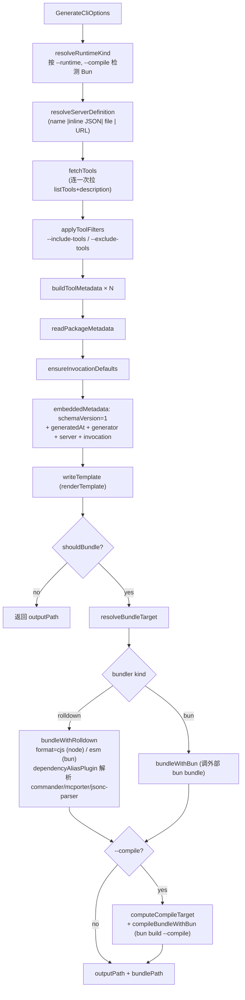
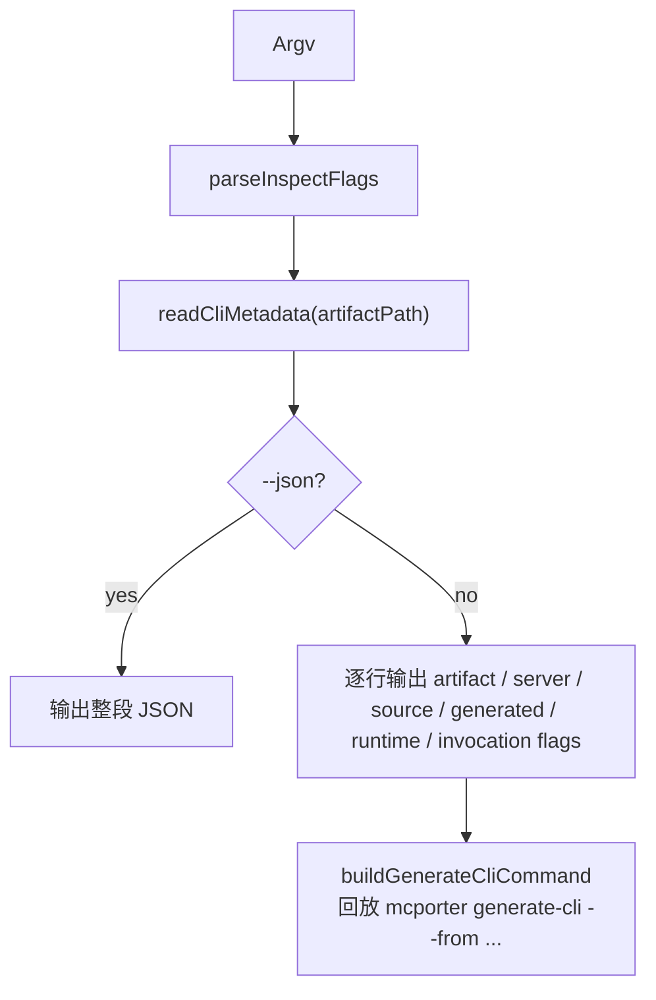
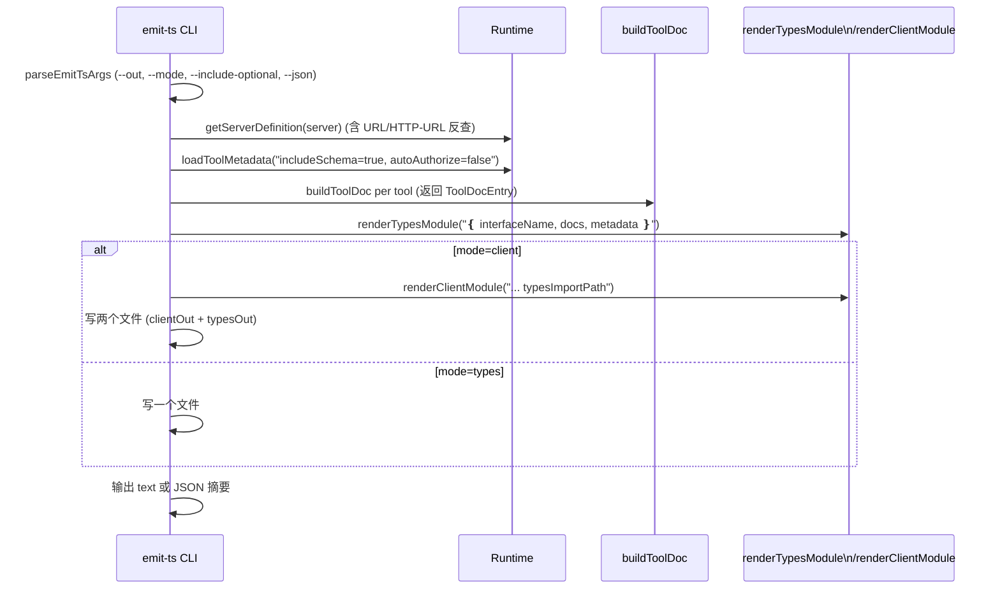

<details>
<summary>相关源文件</summary>

生成本页时使用的主要源文件：

- [src/generate-cli.ts](../../../project-repos/mcporter/src/generate-cli.ts)
- [src/cli/generate-cli-runner.ts](../../../project-repos/mcporter/src/cli/generate-cli-runner.ts)
- [src/cli/generate/template.ts](../../../project-repos/mcporter/src/cli/generate/template.ts)
- [src/cli/generate/template-data.ts](../../../project-repos/mcporter/src/cli/generate/template-data.ts)
- [src/cli/generate/template-help.ts](../../../project-repos/mcporter/src/cli/generate/template-help.ts)
- [src/cli/generate/tools.ts](../../../project-repos/mcporter/src/cli/generate/tools.ts)
- [src/cli/generate/definition.ts](../../../project-repos/mcporter/src/cli/generate/definition.ts)
- [src/cli/generate/artifacts.ts](../../../project-repos/mcporter/src/cli/generate/artifacts.ts)
- [src/cli/generate/runtime.ts](../../../project-repos/mcporter/src/cli/generate/runtime.ts)
- [src/cli/emit-ts-command.ts](../../../project-repos/mcporter/src/cli/emit-ts-command.ts)
- [src/cli/emit-ts-templates.ts](../../../project-repos/mcporter/src/cli/emit-ts-templates.ts)
- [src/cli-metadata.ts](../../../project-repos/mcporter/src/cli-metadata.ts)
- [src/cli/inspect-cli-command.ts](../../../project-repos/mcporter/src/cli/inspect-cli-command.ts)

</details>

# 代码生成：generate-cli 与 emit-ts

mcporter 把"如何把 MCP 服务器物化为可分发产物"这件事抽象成了两条管线：

- `mcporter generate-cli` → 生成单文件 TypeScript CLI 模板，可选地用 Rolldown / Bun 打包成 bundle，并可进一步用 Bun 编译成单文件二进制。
- `mcporter emit-ts` → 生成 `.d.ts` 类型接口，或同时生成基于 `createServerProxy` 的客户端模块。

两条管线共享 `ToolMetadata` / 文档构建（`buildToolDoc`） / 服务器解析（`resolveServerDefinition`），但在产物形态、运行环境、嵌入元数据上有不同的取舍。

## 公共数据模型

`ToolMetadata`（[src/cli/generate/tools.ts:1-21]()）：

```ts
interface ToolMetadata {
  tool: ServerToolInfo;        // 来自 runtime.listTools(includeSchema: true)
  methodName: string;          // toProxyMethodName(tool.name)
  options: GeneratedOption[];  // schema properties → CLI flag 描述
}

interface GeneratedOption {
  property: string;
  cliName: string;             // toCliOption: kebab + 规范化
  description?: string;
  required: boolean;
  type: 'string' | 'number' | 'boolean' | 'array' | 'object' | 'unknown';
  arrayItemType?: 'string' | 'number' | 'boolean' | 'unknown';
  placeholder: string;
  exampleValue?: string;
  enumValues?: string[];
  defaultValue?: unknown;
  formatHint?: string;
}
```

`extractOptions` 只处理 `type: 'object' && properties: {...}` 的根 schema（[src/cli/generate/tools.ts:63-97]()）。每个 property 解析出 type、enum、default、format 后构造 placeholder（如 `<number>`、`<color>`）与 example value。`buildEmbeddedSchemaMap` 把每个 tool 的 inputSchema 原样塞进生成产物里供运行期 commander 校验复用。
Sources: [src/cli/generate/tools.ts:1-97](../../../project-repos/mcporter/src/cli/generate/tools.ts#L1-L97)

<details class="source-snippets">
<summary>引用源码</summary>

<!-- source-snippets:start -->

#### `src/cli/generate/tools.ts:1-97`

```typescript
import type { ServerToolInfo } from '../../runtime.js';

export interface ToolMetadata {
  tool: ServerToolInfo;
  methodName: string;
  options: GeneratedOption[];
}

export interface GeneratedOption {
  property: string;
  cliName: string;
  description?: string;
  required: boolean;
  type: 'string' | 'number' | 'boolean' | 'array' | 'object' | 'unknown';
  arrayItemType?: 'string' | 'number' | 'boolean' | 'unknown';
  placeholder: string;
  exampleValue?: string;
  enumValues?: string[];
  defaultValue?: unknown;
  formatHint?: string;
}

function resolveSchemaType(value: unknown): GeneratedOption['type'] | undefined {
  if (value === 'integer') {
    return 'number';
  }
  if (value === 'string' || value === 'number' || value === 'boolean' || value === 'array' || value === 'object') {
    return value;
  }
  return undefined;
}

function resolveArrayItemType(value: unknown): GeneratedOption['arrayItemType'] | undefined {
  if (value === 'integer') {
    return 'number';
  }
  if (value === 'string' || value === 'number' || value === 'boolean') {
    return value;
  }
  return undefined;
}

export function buildToolMetadata(tool: ServerToolInfo): ToolMetadata {
  const methodName = toProxyMethodName(tool.name);
  const properties = extractOptions(tool);
  return {
    tool,
    methodName,
    options: properties,
  };
}

export function buildEmbeddedSchemaMap(tools: ToolMetadata[]): Record<string, unknown> {
  const result: Record<string, unknown> = {};
  for (const entry of tools) {
    if (entry.tool.inputSchema && typeof entry.tool.inputSchema === 'object') {
      result[entry.tool.name] = entry.tool.inputSchema;
    }
  }
  return result;
}

export function extractOptions(tool: ServerToolInfo): GeneratedOption[] {
  const schema = tool.inputSchema;
  if (!schema || typeof schema !== 'object') {
    return [];
  }
  const record = schema as Record<string, unknown>;
  if (record.type !== 'object' || typeof record.properties !== 'object') {
    return [];
  }
  // Flatten schema properties into Commander-friendly option descriptors.
  const properties = record.properties as Record<string, unknown>;
  const requiredList = Array.isArray(record.required) ? (record.required as string[]) : [];
  return Object.entries(properties).map(([property, descriptor]) => {
    const type = inferType(descriptor);
    const arrayItemType = type === 'array' ? inferArrayItemType(descriptor) : undefined;
    const enumValues = getEnumValues(descriptor);
    const defaultValue = getDescriptorDefault(descriptor);
    const formatInfo = getDescriptorFormatHint(descriptor);
    const placeholder = buildPlaceholder(property, type, enumValues, formatInfo?.slug);
    const exampleValue = buildExampleValue(property, type, enumValues, defaultValue);
    return {
      property,
      cliName: toCliOption(property),
      description: getDescriptorDescription(descriptor),
      required: requiredList.includes(property),
      type,
      arrayItemType,
      placeholder,
      exampleValue,
      enumValues,
      defaultValue,
      formatHint: formatInfo?.display,
    };
  });
}
```

<!-- source-snippets:end -->
</details>
## `generate-cli` 主流程

`generateCli(options)`（[src/generate-cli.ts:33-152]()）的核心步骤：



Sources: [src/generate-cli.ts:33-152](../../../project-repos/mcporter/src/generate-cli.ts#L33-L152), [src/cli/generate/runtime.ts:3-15](../../../project-repos/mcporter/src/cli/generate/runtime.ts#L3-L15), [src/cli/generate/artifacts.ts:1-100](../../../project-repos/mcporter/src/cli/generate/artifacts.ts#L1-L100)

<details class="source-snippets">
<summary>引用源码</summary>

<!-- source-snippets:start -->

#### `src/generate-cli.ts:33-152`

```typescript
export async function generateCli(
  options: GenerateCliOptions
): Promise<{ outputPath: string; bundlePath?: string; compilePath?: string }> {
  const runtimeKind = await resolveRuntimeKind(options.runtime, options.compile);
  const bundlerKind = options.bundler ?? (runtimeKind === 'bun' ? 'bun' : 'rolldown');
  if (bundlerKind === 'bun' && runtimeKind !== 'bun') {
    throw new Error('--bundler bun currently requires --runtime bun.');
  }
  const timeoutMs = options.timeoutMs ?? 30_000;
  const { definition: baseDefinition, name } = await resolveServerDefinition(
    options.serverRef,
    options.configPath,
    options.rootDir
  );
  const { tools: allTools, derivedDescription } = await fetchTools(
    baseDefinition,
    name,
    options.configPath,
    options.rootDir
  );
  const tools = applyToolFilters(allTools, options.includeTools, options.excludeTools);
  const definition =
    baseDefinition.description || !derivedDescription
      ? baseDefinition
      : { ...baseDefinition, description: derivedDescription };
  const toolMetadata: ToolMetadata[] = tools.map((tool) => buildToolMetadata(tool));
  const generator = await readPackageMetadata();
  const baseInvocation = ensureInvocationDefaults(
    {
      serverRef: options.serverRef,
      configPath: options.configPath,
      rootDir: options.rootDir,
      runtime: runtimeKind,
      bundler: bundlerKind,
      outputPath: options.outputPath,
      bundle: options.bundle,
      compile: options.compile,
      timeoutMs,
      minify: options.minify ?? false,
      includeTools: options.includeTools,
      excludeTools: options.excludeTools,
    },
    definition
  );
  const embeddedMetadata: CliArtifactMetadata = {
    schemaVersion: 1,
    generatedAt: new Date().toISOString(),
    generator,
    server: {
      name,
      source: definition.source,
      definition: serializeDefinition(definition),
    },
    artifact: {
      path: '',
      kind: 'template',
    },
    invocation: baseInvocation,
  };

  let templateTmpDir: string | undefined;
  let templateOutputPath = options.outputPath;
  if (!templateOutputPath && options.compile) {
    const tmpPrefix = path.join(process.cwd(), 'tmp', 'mcporter-cli-');
    await fs.mkdir(path.dirname(tmpPrefix), { recursive: true });
    templateTmpDir = await fs.mkdtemp(tmpPrefix);
    templateOutputPath = path.join(templateTmpDir, `${name}.ts`);
  }

  const outputPath = await writeTemplate({
    outputPath: templateOutputPath,
    runtimeKind,
    timeoutMs,
    definition,
    serverName: name,
    tools: toolMetadata,
    generator,
    metadata: embeddedMetadata,
  });

  let bundlePath: string | undefined;
  let compilePath: string | undefined;

  try {
    const shouldBundle = Boolean(options.bundle ?? options.compile);
    if (shouldBundle) {
      const targetPath = resolveBundleTarget({
        bundle: options.bundle,
        compile: options.compile,
        outputPath,
      });
      bundlePath = await bundleOutput({
        sourcePath: outputPath,
        runtimeKind,
        targetPath,
        minify: options.minify ?? false,
        bundler: bundlerKind,
      });

      if (options.compile) {
        if (runtimeKind !== 'bun') {
          throw new Error('--compile is only supported when --runtime bun');
        }
        const compileTarget = computeCompileTarget(options.compile, bundlePath, name);
        await compileBundleWithBun(bundlePath, compileTarget);
        compilePath = compileTarget;
        if (!options.bundle) {
          await fs.rm(bundlePath).catch(() => {});
          bundlePath = undefined;
        }
      }
    }
  } finally {
    if (templateTmpDir) {
      await fs.rm(templateTmpDir, { recursive: true, force: true }).catch(() => {});
    }
  }

  return { outputPath: options.outputPath ?? outputPath, bundlePath, compilePath };
}
```

#### `src/cli/generate/runtime.ts:3-15`

```typescript
export async function resolveRuntimeKind(
  runtimeOption: 'node' | 'bun' | undefined,
  compileOption: boolean | string | undefined
): Promise<'node' | 'bun'> {
  if (runtimeOption) {
    return runtimeOption;
  }
  const bunAvailable = await isBunAvailable();
  if (compileOption && !bunAvailable) {
    throw new Error('--compile requires Bun. Install Bun or set BUN_BIN to the bun executable.');
  }
  return bunAvailable ? 'bun' : 'node';
}
```

#### `src/cli/generate/artifacts.ts:1-100`

```typescript
import { execFile } from 'node:child_process';
import fsSync from 'node:fs';
import fs from 'node:fs/promises';
import { createRequire } from 'node:module';
import path from 'node:path';
import { fileURLToPath } from 'node:url';
import type { RolldownPlugin } from 'rolldown';
import { markExecutable, safeCopyFile } from './fs-helpers.js';
import { verifyBunAvailable } from './runtime.js';

const localRequire = createRequire(import.meta.url);
const packageRoot = fileURLToPath(new URL('../../..', import.meta.url));
// Generated CLIs import commander/mcporter, but end-users run mcporter from directories
// that often lack node_modules. Pre-resolve those deps to this package so bundling works
// even in empty temp dirs (fixes #1).
const BUNDLED_DEPENDENCIES = ['commander', 'mcporter', 'jsonc-parser'] as const;
const dependencyAliasPlugin = createLocalDependencyAliasPlugin([...BUNDLED_DEPENDENCIES]);

export async function bundleOutput({
  sourcePath,
  targetPath,
  runtimeKind,
  minify,
  bundler,
}: {
  sourcePath: string;
  targetPath: string;
  runtimeKind: 'node' | 'bun';
  minify: boolean;
  bundler: 'rolldown' | 'bun';
}): Promise<string> {
  if (bundler === 'bun') {
    return await bundleWithBun({ sourcePath, targetPath, runtimeKind, minify });
  }
  return await bundleWithRolldown({ sourcePath, targetPath, runtimeKind, minify });
}

async function bundleWithRolldown({
  sourcePath,
  targetPath,
  runtimeKind,
  minify,
}: {
  sourcePath: string;
  targetPath: string;
  runtimeKind: 'node' | 'bun';
  minify: boolean;
}): Promise<string> {
  let rolldownImpl: (typeof import('rolldown'))['rolldown'];
  try {
    ({ rolldown: rolldownImpl } = await import('rolldown'));
  } catch (error) {
    const message =
      'Rolldown bundling is unavailable in this build of mcporter; rerun with --bundler bun or install mcporter via npm (Node.js) to use the Rolldown bundler.';
    if (error instanceof Error) {
      error.message = `${message}\n\n${error.message}`;
      throw error;
    }
    throw new Error(message, { cause: error });
  }
  const absTarget = path.resolve(targetPath);
  await fs.mkdir(path.dirname(absTarget), { recursive: true });
  const plugins = dependencyAliasPlugin ? [dependencyAliasPlugin] : undefined;
  const bundle = await rolldownImpl({
    input: sourcePath,
    treeshake: false,
    plugins,
    onLog(level, log, handler) {
      if (typeof (log as { code?: string }).code === 'string' && (log as { code?: string }).code === 'EVAL') {
        return;
      }
      handler(level, log);
    },
  });
  await bundle.write({
    file: absTarget,
    format: runtimeKind === 'bun' ? 'esm' : 'cjs',
    sourcemap: false,
    minify,
  });
  await markExecutable(absTarget);
  return absTarget;
}

async function bundleWithBun({
  sourcePath,
  targetPath,
  runtimeKind,
  minify,
}: {
  sourcePath: string;
  targetPath: string;
  runtimeKind: 'node' | 'bun';
  minify: boolean;
}): Promise<string> {
  const absTarget = path.resolve(targetPath);
  await fs.mkdir(path.dirname(absTarget), { recursive: true });
  const bunBin = await verifyBunAvailable();
  const tmpRoot = path.join(packageRoot, 'tmp');
  await fs.mkdir(tmpRoot, { recursive: true });
```

<!-- source-snippets:end -->
</details>
### server 引用解析

`resolveServerDefinition(serverRef, configPath?, rootDir?)`（[src/cli/generate/definition.ts:46-122]()）按优先级尝试 4 种来源：

1. **inline JSON**：`serverRef.startsWith('{') && endsWith('}')` → 直接 `JSON.parse` 出一个 `ServerDefinition`，要求带 `name`。`mcporter generate-cli --command "npx -y x"` 内部就是把 inferred name + command 拼成 inline JSON 走这条路（[src/cli/generate-cli-runner.ts:57-66]()）。
2. **JSON 配置文件**：`serverRef` 当成路径读 → `parsed.mcpServers` 非空 → 取第一个 entry 作为生成目标。
3. **已知配置 entry**：`loadServerDefinitions(...)` 后按 name 匹配。
4. **HTTP URL**：`extractHttpServerTarget` + `normalizeHttpUrl` 后查找 `command.url` 完全匹配的 entry。

匹配不上时抛 `Unknown MCP server 'X'`。这一步的设计决定了 generate-cli 的"低门槛"：你既可以从配置文件里挑选，也可以直接给 URL / 命令，甚至给 inline JSON，CLI 都能找到入口。
Sources: [src/cli/generate/definition.ts:46-122](../../../project-repos/mcporter/src/cli/generate/definition.ts#L46-L122), [src/cli/generate-cli-runner.ts:57-66](../../../project-repos/mcporter/src/cli/generate-cli-runner.ts#L57-L66)

<details class="source-snippets">
<summary>引用源码</summary>

<!-- source-snippets:start -->

#### `src/cli/generate/definition.ts:46-122`

```typescript
export async function resolveServerDefinition(
  serverRef: string,
  configPath?: string,
  rootDir?: string
): Promise<ResolvedServer> {
  const trimmed = serverRef.trim();

  if (trimmed.startsWith('{') && trimmed.endsWith('}')) {
    // Allow callers to inline a JSON server definition (used by tests + CLI).
    const parsed = JSON.parse(trimmed) as ServerDefinition & { name: string };
    if (!parsed.name) {
      throw new Error("Inline server definition must include a 'name' field.");
    }
    return { definition: normalizeDefinition(parsed), name: parsed.name };
  }

  const possiblePath = path.resolve(trimmed);
  try {
    const buffer = await fs.readFile(possiblePath, 'utf8');
    const parsed = JSON.parse(buffer) as {
      mcpServers?: Record<string, unknown>;
    };
    if (!parsed.mcpServers || typeof parsed.mcpServers !== 'object') {
      throw new Error(`Config file ${possiblePath} does not contain mcpServers.`);
    }
    const entries = Object.entries(parsed.mcpServers);
    if (entries.length === 0) {
      throw new Error(`Config file ${possiblePath} does not define any servers.`);
    }
    const first = entries[0];
    if (!first) {
      throw new Error(`Config file ${possiblePath} does not define any servers.`);
    }
    const [name, value] = first;
    return {
      definition: normalizeDefinition({
        name,
        ...(value as Record<string, unknown>),
      }),
      name,
    };
  } catch (error) {
    if ((error as NodeJS.ErrnoException).code !== 'ENOENT') {
      throw error;
    }
  }

  const definitions = await loadServerDefinitions({
    configPath,
    rootDir,
  });
  const matchByName = definitions.find((def) => def.name === trimmed);
  if (matchByName) {
    return { definition: matchByName, name: matchByName.name };
  }

  const httpTarget = extractHttpServerTarget(trimmed);
  if (httpTarget) {
    const normalizedTarget = normalizeHttpUrl(httpTarget);
    if (normalizedTarget) {
      const matchByUrl = definitions.find((def) => {
        if (def.command.kind !== 'http') {
          return false;
        }
        const normalizedDefinitionUrl = normalizeHttpUrl(def.command.url);
        return normalizedDefinitionUrl === normalizedTarget;
      });
      if (matchByUrl) {
        return { definition: matchByUrl, name: matchByUrl.name };
      }
    }
  }

  throw new Error(
    `Unknown MCP server '${trimmed}'. Provide a name from config, a JSON file, inline JSON, or an HTTP URL that matches a configured server.`
  );
}
```

#### `src/cli/generate-cli-runner.ts:57-66`

```typescript
  const inferredName = parsed.name ?? (parsed.command ? inferNameFromCommand(parsed.command) : undefined);
  const serverRef =
    parsed.server ??
    (parsed.command && inferredName
      ? JSON.stringify(buildInlineServerDefinition(inferredName, parsed.command, parsed.description))
      : undefined);
  if (!serverRef) {
    throw new Error(
      'Provide --server with a definition or a command we can infer a name from (use --name to override).'
    );
```

<!-- source-snippets:end -->
</details>
### `--from <artifact>`：基于既有产物再生成

`resolveGenerateRequestFromArtifact`（在 `template-data.ts`）会读取产物中嵌入的 metadata（schemaVersion=1）并把当时的 `invocation` flags（`runtime/bundle/compile/timeoutMs/minify/includeTools/excludeTools/outputPath`）作为新一次 generate 的默认值。命令选项可以在 CLI 上覆盖任意一个，`--dry-run` 打印 reconstructed `mcporter generate-cli ...` 字符串而不实际执行。

读取产物的入口是 `readCliMetadata`（[src/cli-metadata.ts:71-82]()）：

- 优先读旧版 sidecar 文件 `<artifact>.metadata.json`（向下兼容）。
- 否则把 artifact 当成可执行 / 脚本运行 `<artifact> __mcporter_inspect`，从 stdout 解析 JSON。

`__mcporter_inspect` 是生成模板里硬编码的子命令（参见 `renderEmbeddedHelpSource`，[src/cli/generate/template-help.ts]() 与 `template.ts` 引用），可在没有 sidecar 时 round-trip 取回 metadata。这让二进制产物也能被反查。
Sources: [src/cli/generate-cli-runner.ts:28-55](../../../project-repos/mcporter/src/cli/generate-cli-runner.ts#L28-L55), [src/cli-metadata.ts:32-125](../../../project-repos/mcporter/src/cli-metadata.ts#L32-L125)

<details class="source-snippets">
<summary>引用源码</summary>

<!-- source-snippets:start -->

#### `src/cli/generate-cli-runner.ts:28-55`

```typescript
  if (parsed.from) {
    const metadata = await readCliMetadata(parsed.from);
    const request = resolveGenerateRequestFromArtifact(parsed, metadata, globalFlags);
    if (parsed.dryRun) {
      const command = buildGenerateCliCommand(
        {
          serverRef: request.serverRef,
          configPath: request.configPath,
          rootDir: request.rootDir,
          outputPath: request.outputPath,
          bundle: request.bundle,
          compile: request.compile,
          runtime: request.runtime ?? 'node',
          timeoutMs: request.timeoutMs ?? 30_000,
          minify: request.minify ?? false,
          includeTools: request.includeTools,
          excludeTools: request.excludeTools,
        },
        metadata.server.definition,
        globalFlags
      );
      console.log('Dry run — would execute:');
      console.log(`  ${command}`);
      return;
    }
    await performGenerateFromArtifact(metadata, request);
    return;
  }
```

#### `src/cli-metadata.ts:32-125`

```typescript
export interface CliArtifactMetadata {
  readonly schemaVersion: 1;
  readonly generatedAt: string;
  readonly generator: {
    readonly name: string;
    readonly version: string;
  };
  readonly server: {
    readonly name: string;
    readonly source?: ServerSource;
    readonly definition: SerializedServerDefinition;
  };
  readonly artifact: {
    readonly path: string;
    readonly kind: CliArtifactKind;
  };
  readonly invocation: {
    serverRef?: string;
    configPath?: string;
    rootDir?: string;
    runtime: 'node' | 'bun';
    bundler?: 'rolldown' | 'bun';
    outputPath?: string;
    bundle?: boolean | string;
    compile?: boolean | string;
    timeoutMs: number;
    minify: boolean;
    includeTools?: string[];
    excludeTools?: string[];
  };
}

// metadataPathForArtifact derives the metadata file path for a given artifact output path.
export function metadataPathForArtifact(artifactPath: string): string {
  return `${artifactPath}.metadata.json`;
}

// readCliMetadata loads metadata for a generated CLI artifact, preferring the embedded
// inspect command and falling back to legacy sidecar files.
export async function readCliMetadata(artifactPath: string): Promise<CliArtifactMetadata> {
  const legacyPath = metadataPathForArtifact(artifactPath);
  try {
    const buffer = await fs.readFile(legacyPath, 'utf8');
    return JSON.parse(buffer) as CliArtifactMetadata;
  } catch (error) {
    if (!isErrno(error, 'ENOENT')) {
      throw error;
    }
  }
  return await readMetadataFromCli(artifactPath);
}

async function readMetadataFromCli(artifactPath: string): Promise<CliArtifactMetadata> {
  return await new Promise<CliArtifactMetadata>((resolve, reject) => {
    const child = spawn(artifactPath, ['__mcporter_inspect'], {
      stdio: ['ignore', 'pipe', 'pipe'],
    });
    let stdout = '';
    let stderr = '';
    child.stdout.setEncoding('utf8');
    child.stdout.on('data', (data) => {
      stdout += String(data);
    });
    child.stderr.setEncoding('utf8');
    child.stderr.on('data', (data) => {
      stderr += String(data);
    });
    child.on('error', (error) => reject(error));
    child.on('close', (code) => {
      if (code !== 0) {
        reject(
          new Error(
            `Failed to inspect CLI artifact at ${artifactPath}${
              stderr ? `: ${stderr.trim()}` : ''
            } (exit code ${code ?? -1})`
          )
        );
        return;
      }
      try {
        const parsed = JSON.parse(stdout) as CliArtifactMetadata;
        resolve(parsed);
      } catch (error) {
        reject(
          new Error(
            `Unable to parse embedded metadata from ${artifactPath}: ${
              error instanceof Error ? error.message : String(error)
            }`
          )
        );
      }
    });
  });
}
```

<!-- source-snippets:end -->
</details>
### renderTemplate 输出

`renderTemplate`（[src/cli/generate/template.ts:53-122]()，省略到 410 行）输出一个完整的 Node / Bun 可执行 TypeScript 文件，关键嵌入：

- `embeddedServer`：序列化的 `ServerDefinition`（URL 转字符串）。
- `embeddedSchemas`：每个 tool 的 `inputSchema`，运行期由 commander 用作 help 与解析。
- `embeddedMetadata`：`CliArtifactMetadata`，对应 `__mcporter_inspect` 输出。
- `generatorTools`：每个 tool 的 name + description + 用法提示，用于无参数下 `program.help()` 的默认列表。
- `signatureMap`：`{ commandName: tsSignature }`，用于带颜色的 `--help` 输出。

模板里每个 tool 用 `renderToolCommand` 生成一个 commander subcommand，命令体内部会：

1. `createRuntime({ servers: [embeddedServer] })`
2. `createServerProxy(runtime, name)`
3. 把 commander 解析出的 `options` 重组成 schema-friendly args
4. 调用 `proxy[methodName](args)` → 把 `CallResult` 按 `--raw` / `--output` 渲染成 stdout 文本

Sources: [src/cli/generate/template.ts:53-122](../../../project-repos/mcporter/src/cli/generate/template.ts#L53-L122)

<details class="source-snippets">
<summary>引用源码</summary>

<!-- source-snippets:start -->

#### `src/cli/generate/template.ts:53-122`

```typescript
export function renderTemplate({
  runtimeKind,
  timeoutMs,
  definition,
  serverName,
  tools,
  generator,
  metadata,
}: TemplateInput): string {
  const imports = [
    "import { Command } from 'commander';",
    "import { createRuntime, createServerProxy } from 'mcporter';",
    "import { createCallResult } from 'mcporter';",
  ].join('\n');
  const embedded = JSON.stringify(definition, (_key, value) => (value instanceof URL ? value.toString() : value), 2);
  const generatorHeader = `Generated by ${generator.name}@${generator.version} — https://github.com/steipete/mcporter`;
  const toolDocs = tools.map((tool) => ({
    tool,
    doc: buildToolDoc({
      serverName,
      toolName: tool.tool.name,
      description: tool.tool.description,
      outputSchema: tool.tool.outputSchema,
      options: tool.options,
      requiredOnly: true,
      colorize: false,
      flagExtras: [{ text: '--raw <json>' }],
    }),
  }));
  const renderedTools = toolDocs.map((entry) =>
    Object.assign(renderToolCommand(entry.tool, timeoutMs, serverName, entry.doc), {
      doc: entry.doc,
      tool: entry.tool,
    })
  );
  const toolHelp = renderedTools.map((entry) => ({
    name: entry.commandName,
    description: entry.tool.tool.description ?? '',
    usage: entry.doc.flagUsage ? `${entry.commandName} ${entry.doc.flagUsage}` : undefined,
    flags: entry.doc.flagUsage ?? '',
  }));
  const generatorHeaderLiteral = JSON.stringify(generatorHeader);
  const toolHelpLiteral = JSON.stringify(toolHelp, undefined, 2);
  const embeddedSchemas = JSON.stringify(buildEmbeddedSchemaMap(tools), undefined, 2);
  const embeddedMetadata = JSON.stringify(metadata, undefined, 2);
  const toolBlocks = renderedTools.map((entry) => entry.block).join('\n\n');
  const signatureMap = Object.fromEntries(renderedTools.map((entry) => [entry.commandName, entry.tsSignature]));
  const signatureMapLiteral = JSON.stringify(signatureMap, undefined, 2);
  const generatedHeaderComment = `// @generated by ${generator.name}@${generator.version} on ${
    metadata.generatedAt
  }. DO NOT EDIT.`;
  return `#!/usr/bin/env ${runtimeKind === 'bun' ? 'bun' : 'node'}
${generatedHeaderComment}
${imports}

const embeddedServer = ${embedded} as const;
const embeddedSchemas = ${embeddedSchemas} as const;
const embeddedName = ${JSON.stringify(serverName)};
const embeddedDescription = ${JSON.stringify(
    definition.description ?? `Standalone CLI for the ${serverName} MCP server.`
  )};
const generatorInfo = ${generatorHeaderLiteral};
const generatorTools = ${toolHelpLiteral} as const;
const embeddedMetadata = ${embeddedMetadata} as const;
const artifactKind = determineArtifactKind();
const program = new Command();
program.name(embeddedName);
program.description(embeddedDescription);
program.option('-t, --timeout <ms>', 'Call timeout in milliseconds', (value) => parseInt(value, 10), ${timeoutMs});
program.option('-o, --output <format>', 'Output format: text|markdown|json|raw', 'text');
```

<!-- source-snippets:end -->
</details>
### Bundling

`bundleOutput`（[src/cli/generate/artifacts.ts:19-83]()）有两条实现：

| bundler | 行为 |
|---------|------|
| `rolldown`（默认 Node 目标） | 动态 import rolldown；用 `dependencyAliasPlugin` 把 `commander` / `mcporter` / `jsonc-parser` 解析到本包的 `node_modules`，避免最终用户在空目录运行打包后还需要安装 deps；输出 `cjs`（node）或 `esm`（bun）。treeshake 关闭以保证嵌入的 schema 不被错误地清理。 |
| `bun` | 通过 `child_process.execFile(bun, ['build', '--target=...', '--outfile=...', sourcePath])` 调外部 bun。运行环境必须有 bun，否则 `verifyBunAvailable` 抛错（[src/cli/generate/runtime.ts:17-29]()）。 |

`--compile` 还需要 `runtimeKind === 'bun'`，`computeCompileTarget` + `compileBundleWithBun` 用 `bun build --compile` 把 bundle 编成单文件二进制；如果调用方没单独传 `--bundle` 则会在最后清理临时 bundle，只留二进制（[src/generate-cli.ts:131-144]()）。
Sources: [src/cli/generate/artifacts.ts:19-100](../../../project-repos/mcporter/src/cli/generate/artifacts.ts#L19-L100), [src/cli/generate/runtime.ts:17-38](../../../project-repos/mcporter/src/cli/generate/runtime.ts#L17-L38)

<details class="source-snippets">
<summary>引用源码</summary>

<!-- source-snippets:start -->

#### `src/cli/generate/artifacts.ts:19-100`

```typescript
export async function bundleOutput({
  sourcePath,
  targetPath,
  runtimeKind,
  minify,
  bundler,
}: {
  sourcePath: string;
  targetPath: string;
  runtimeKind: 'node' | 'bun';
  minify: boolean;
  bundler: 'rolldown' | 'bun';
}): Promise<string> {
  if (bundler === 'bun') {
    return await bundleWithBun({ sourcePath, targetPath, runtimeKind, minify });
  }
  return await bundleWithRolldown({ sourcePath, targetPath, runtimeKind, minify });
}

async function bundleWithRolldown({
  sourcePath,
  targetPath,
  runtimeKind,
  minify,
}: {
  sourcePath: string;
  targetPath: string;
  runtimeKind: 'node' | 'bun';
  minify: boolean;
}): Promise<string> {
  let rolldownImpl: (typeof import('rolldown'))['rolldown'];
  try {
    ({ rolldown: rolldownImpl } = await import('rolldown'));
  } catch (error) {
    const message =
      'Rolldown bundling is unavailable in this build of mcporter; rerun with --bundler bun or install mcporter via npm (Node.js) to use the Rolldown bundler.';
    if (error instanceof Error) {
      error.message = `${message}\n\n${error.message}`;
      throw error;
    }
    throw new Error(message, { cause: error });
  }
  const absTarget = path.resolve(targetPath);
  await fs.mkdir(path.dirname(absTarget), { recursive: true });
  const plugins = dependencyAliasPlugin ? [dependencyAliasPlugin] : undefined;
  const bundle = await rolldownImpl({
    input: sourcePath,
    treeshake: false,
    plugins,
    onLog(level, log, handler) {
      if (typeof (log as { code?: string }).code === 'string' && (log as { code?: string }).code === 'EVAL') {
        return;
      }
      handler(level, log);
    },
  });
  await bundle.write({
    file: absTarget,
    format: runtimeKind === 'bun' ? 'esm' : 'cjs',
    sourcemap: false,
    minify,
  });
  await markExecutable(absTarget);
  return absTarget;
}

async function bundleWithBun({
  sourcePath,
  targetPath,
  runtimeKind,
  minify,
}: {
  sourcePath: string;
  targetPath: string;
  runtimeKind: 'node' | 'bun';
  minify: boolean;
}): Promise<string> {
  const absTarget = path.resolve(targetPath);
  await fs.mkdir(path.dirname(absTarget), { recursive: true });
  const bunBin = await verifyBunAvailable();
  const tmpRoot = path.join(packageRoot, 'tmp');
  await fs.mkdir(tmpRoot, { recursive: true });
```

#### `src/cli/generate/runtime.ts:17-38`

```typescript
export async function verifyBunAvailable(): Promise<string> {
  const bunBin = process.env.BUN_BIN ?? 'bun';
  await new Promise<void>((resolve, reject) => {
    execFile(bunBin, ['--version'], { cwd: process.cwd(), env: process.env }, (error) => {
      if (error) {
        reject(new Error('Unable to locate Bun runtime. Install Bun or set BUN_BIN to the bun executable.'));
        return;
      }
      resolve();
    });
  });
  return bunBin;
}

async function isBunAvailable(): Promise<boolean> {
  try {
    await verifyBunAvailable();
    return true;
  } catch {
    return false;
  }
}
```

<!-- source-snippets:end -->
</details>
## 工具过滤与 description 推导

`fetchTools(definition, name, configPath, rootDir)` 在 `src/cli/generate/definition.ts` 中实现：连一次 runtime 拉 `listTools(includeSchema: true)`，如果 server 自身没填 description，再用 `client.listResources` / 服务端返回的 metadata 反推 description（具体在 `definition.ts` 后半部分）。`applyToolFilters`（[src/generate-cli.ts:154-209]()）实现 `--include-tools` / `--exclude-tools` 的互斥校验与缺名错误提示。
Sources: [src/generate-cli.ts:42-58](../../../project-repos/mcporter/src/generate-cli.ts#L42-L58), [src/generate-cli.ts:154-209](../../../project-repos/mcporter/src/generate-cli.ts#L154-L209)

<details class="source-snippets">
<summary>引用源码</summary>

<!-- source-snippets:start -->

#### `src/generate-cli.ts:42-58`

```typescript
  const { definition: baseDefinition, name } = await resolveServerDefinition(
    options.serverRef,
    options.configPath,
    options.rootDir
  );
  const { tools: allTools, derivedDescription } = await fetchTools(
    baseDefinition,
    name,
    options.configPath,
    options.rootDir
  );
  const tools = applyToolFilters(allTools, options.includeTools, options.excludeTools);
  const definition =
    baseDefinition.description || !derivedDescription
      ? baseDefinition
      : { ...baseDefinition, description: derivedDescription };
  const toolMetadata: ToolMetadata[] = tools.map((tool) => buildToolMetadata(tool));
```

#### `src/generate-cli.ts:154-209`

```typescript
function applyToolFilters(tools: ServerToolInfo[], includeTools?: string[], excludeTools?: string[]): ServerToolInfo[] {
  if (includeTools && excludeTools) {
    throw new Error('Internal error: both includeTools and excludeTools provided to generateCli.');
  }
  if (includeTools && includeTools.length === 0) {
    throw new Error('--include-tools requires at least one tool name.');
  }
  if (excludeTools && excludeTools.length === 0) {
    throw new Error('--exclude-tools requires at least one tool name.');
  }

  if (!includeTools && !excludeTools) {
    return tools;
  }

  const toolMap = new Map(tools.map((tool) => [tool.name, tool]));

  if (includeTools && includeTools.length > 0) {
    const result: ServerToolInfo[] = [];
    const missing: string[] = [];

    for (const name of includeTools) {
      const match = toolMap.get(name);
      if (match) {
        result.push(match);
      } else {
        missing.push(name);
      }
    }

    if (missing.length > 0) {
      throw new Error(
        `Requested tools not found on server: ${missing.join(', ')}. Available tools: ${tools.map((tool) => tool.name).join(', ')}`
      );
    }

    if (result.length === 0) {
      throw new Error('No tools remain after applying --include-tools filter.');
    }

    return result;
  }

  if (excludeTools && excludeTools.length > 0) {
    const excludeSet = new Set(excludeTools);
    const filtered = tools.filter((tool) => !excludeSet.has(tool.name));
    if (filtered.length === 0) {
      throw new Error(
        `All tools were excluded. Exclude list: ${[...excludeSet].join(', ')}. Available tools: ${tools.map((tool) => tool.name).join(', ')}`
      );
    }
    return filtered;
  }

  return tools;
}
```

<!-- source-snippets:end -->
</details>
## `inspect-cli`

`handleInspectCli(args)`（[src/cli/inspect-cli-command.ts:13-50]()）：



文本模式输出的 `Underlying generate-cli command:` 只在能从 metadata 重建出"等价无歧义"的命令时才打印；否则只显示 `Regenerate with: mcporter generate-cli --from ...`。
Sources: [src/cli/inspect-cli-command.ts:13-50](../../../project-repos/mcporter/src/cli/inspect-cli-command.ts#L13-L50)

<details class="source-snippets">
<summary>引用源码</summary>

<!-- source-snippets:start -->

#### `src/cli/inspect-cli-command.ts:13-50`

```typescript
export async function handleInspectCli(args: string[]): Promise<void> {
  const parsed = parseInspectFlags(args);
  const metadata = await readCliMetadata(parsed.artifactPath);
  if (parsed.format === 'json') {
    console.log(JSON.stringify(metadata, null, 2));
    return;
  }
  console.log(`Artifact: ${formatPathForDisplay(metadata.artifact.path)} (${metadata.artifact.kind})`);
  console.log(`Server: ${metadata.server.name}`);
  if (metadata.server.source) {
    const suffix = formatSourceSuffix(metadata.server.source, true);
    if (suffix) {
      console.log(`Source: ${suffix}`);
    }
  }
  console.log(
    `Generated: ${new Date(metadata.generatedAt).toISOString()} via ${metadata.generator.name}@${
      metadata.generator.version
    }`
  );
  if (metadata.invocation.runtime) {
    console.log(`Runtime: ${metadata.invocation.runtime}`);
  }
  console.log('Invocation flags:');
  for (const [key, value] of Object.entries(metadata.invocation)) {
    if (value === undefined || value === null || key === 'runtime') {
      continue;
    }
    console.log(`  ${key}: ${Array.isArray(value) ? JSON.stringify(value) : String(value)}`);
  }
  const dryRunCommand = buildGenerateCliCommand(metadata.invocation, metadata.server.definition);
  console.log('Regenerate with:');
  console.log(`  mcporter generate-cli --from ${shellQuote(parsed.artifactPath)}`);
  if (dryRunCommand) {
    console.log('Underlying generate-cli command:');
    console.log(`  ${dryRunCommand}`);
  }
}
```

<!-- source-snippets:end -->
</details>
## emit-ts：类型与客户端模块

`handleEmitTs`（[src/cli/emit-ts-command.ts:30-94]()）有两种模式：

| `--mode` | 输出 |
|----------|------|
| `types`（默认） | 单个 `.d.ts` 或 `.ts`，导出 `interface <Server>Tools { ... }` 与每个 method 的 Promise 签名 |
| `client` | 一个 `.ts` 客户端 + 关联 `.d.ts`；客户端封装 `createRuntime` / `createServerProxy`，导出工厂函数 |

调用流：



`buildInterfaceName(serverName)` 把 server 名 PascalCase 化（去掉非字母数字、首字母大写）+ 加 `Tools` 后缀，`linear-mcp` → `LinearMcpTools`（[src/cli/emit-ts-command.ts:223-231]()）。`computeImportPath` 以 client 文件位置为基准对 types 文件做相对路径，保证不同输出目录下 `import type` 仍然有效（[src/cli/emit-ts-command.ts:244-252]()）。

`--include-optional` 切换 `requiredOnly`，与 `mcporter list --all-parameters` 行为一致；不加时只暴露必填参数，与 CLI 列表呈现保持一致。
Sources: [src/cli/emit-ts-command.ts:30-260](../../../project-repos/mcporter/src/cli/emit-ts-command.ts#L30-L260), [src/cli/emit-ts-templates.ts](../../../project-repos/mcporter/src/cli/emit-ts-templates.ts)

<details class="source-snippets">
<summary>引用源码</summary>

<!-- source-snippets:start -->

#### `src/cli/emit-ts-command.ts:30-260`

```typescript
export async function handleEmitTs(runtime: Runtime, args: string[]): Promise<void> {
  const options = parseEmitTsArgs(args);
  const definition = getServerDefinition(runtime, options.server);
  const metadataEntries = await loadToolMetadata(runtime, options.server, {
    includeSchema: true,
    autoAuthorize: false,
  });
  const generator = await readPackageMetadata();
  const metadata: EmitMetadata = {
    server: definition,
    generatorLabel: `${generator.name}@${generator.version}`,
    generatedAt: new Date(),
  };
  const docEntries = buildDocEntries(options.server, metadataEntries, options.includeOptional);
  const interfaceName = buildInterfaceName(options.server);

  if (options.mode === 'types') {
    const source = renderTypesModule({ interfaceName, docs: docEntries, metadata });
    await writeFile(options.outPath, source);
    if (options.format === 'json') {
      console.log(
        JSON.stringify(
          {
            mode: 'types',
            server: options.server,
            outPath: options.outPath,
          },
          null,
          2
        )
      );
    } else {
      console.log(`Emitted TypeScript definitions for ${options.server} → ${options.outPath}`);
    }
    return;
  }

  const typesOutPath = options.typesOutPath ?? deriveTypesOutPath(options.outPath);
  const relativeImportPath = computeImportPath(options.outPath, typesOutPath);
  const typesSource = renderTypesModule({ interfaceName, docs: docEntries, metadata });
  const clientSource = renderClientModule({
    interfaceName,
    docs: docEntries,
    metadata,
    typesImportPath: relativeImportPath,
  });
  await writeFile(typesOutPath, typesSource);
  await writeFile(options.outPath, clientSource);
  if (options.format === 'json') {
    console.log(
      JSON.stringify(
        {
          mode: 'client',
          server: options.server,
          clientOutPath: options.outPath,
          typesOutPath,
        },
        null,
        2
      )
    );
  } else {
    console.log(`Emitted client + types for ${options.server} → ${options.outPath} / ${typesOutPath}`);
  }
}

function parseEmitTsArgs(args: string[]): ParsedEmitTsOptions {
  const flags: EmitTsFlags = {
    mode: 'types',
    includeOptional: false,
    format: 'text',
  };
  const common = extractGeneratorFlags(args, { allowIncludeOptional: true });
  if (common.includeOptional) {
    flags.includeOptional = true;
  }
  flags.format = consumeOutputFormat(args, {
    defaultFormat: 'text',
    allowed: ['text', 'json'],
    enableRawShortcut: false,
    jsonShortcutFlag: '--json',
  }) as EmitTsFlags['format'];
  let index = 0;
  while (index < args.length) {
    const token = args[index];
    if (!token) {
      index += 1;
      continue;
    }
    if (token === '--out') {
      const value = args[index + 1];
      if (!value) {
        throw new Error("Flag '--out' requires a path.");
      }
      flags.outPath = value;
      args.splice(index, 2);
      continue;
    }
    if (token === '--types-out') {
      const value = args[index + 1];
      if (!value) {
        throw new Error("Flag '--types-out' requires a path.");
      }
      flags.typesOutPath = value;
      args.splice(index, 2);
      continue;
    }
    if (token === '--mode') {
      const value = args[index + 1];
      if (value !== 'types' && value !== 'client') {
        throw new Error("--mode must be 'types' or 'client'.");
      }
      flags.mode = value;
      args.splice(index, 2);
      continue;
    }
    if (token.startsWith('--')) {
      throw new Error(`Unknown flag '${token}' for emit-ts.`);
    }
    index += 1;
... snippet truncated ...
```

#### `src/cli/emit-ts-templates.ts`

```typescript
import path from 'node:path';
import type { ServerDefinition } from '../config.js';
import type { ToolDocModel } from './list-detail-helpers.js';

export interface ToolDocEntry {
  toolName: string;
  methodName: string;
  doc: ToolDocModel;
}

export interface EmitMetadata {
  server: ServerDefinition;
  generatorLabel: string;
  generatedAt: Date;
}

export interface EmitTypesTemplateInput {
  interfaceName: string;
  docs: ToolDocEntry[];
  metadata: EmitMetadata;
}

export interface EmitClientTemplateInput extends EmitTypesTemplateInput {
  typesImportPath: string;
}

export function renderTypesModule(input: EmitTypesTemplateInput): string {
  const lines: string[] = [];
  lines.push(...renderHeader(input.metadata));
  lines.push("import type { CallResult } from 'mcporter';");
  lines.push('');
  lines.push(`export interface ${input.interfaceName} {`);
  input.docs.forEach((entry, index) => {
    lines.push(...renderDocComment(entry.doc.docLines, '  '));
    const methodSignature = toInterfaceSignature(entry.doc.tsSignature, { wrapInPromise: true });
    lines.push(`  ${methodSignature}`);
    if (entry.doc.optionalSummary) {
      lines.push(`  // ${entry.doc.optionalSummary.replace(/^\/\//, '').trim()}`);
    }
    if (index !== input.docs.length - 1) {
      lines.push('');
    }
  });
  if (input.docs.length === 0) {
    lines.push('  // No tools reported for this server.');
  }
  lines.push('}');
  lines.push('');
  return lines.join('\n');
}

export function renderClientModule(input: EmitClientTemplateInput): string {
  const lines: string[] = [];
  lines.push(...renderHeader(input.metadata));
  lines.push("import { createRuntime, createServerProxy, wrapCallResult } from 'mcporter';");
  lines.push(`import type { ${input.interfaceName} } from '${input.typesImportPath}';`);
  lines.push('');
  lines.push('type RuntimeInstance = Awaited<ReturnType<typeof createRuntime>>;');
  const clientType = `${input.interfaceName.replace(/Tools$/, 'Client')}`;
  const factoryName = `create${input.interfaceName.replace(/Tools$/, '')}Client`;
  const serverName = input.metadata.server.name;
  lines.push(`export type ${clientType} = ${input.interfaceName} & { close(): Promise<void> };`);
  lines.push('');
  lines.push('export interface CreateClientOptions {');
  lines.push('  runtime?: RuntimeInstance;');
  lines.push('  configPath?: string;');
  lines.push('  rootDir?: string;');
  lines.push('}');
  lines.push('');
  lines.push(`export async function ${factoryName}(options: CreateClientOptions = {}): Promise<${clientType}> {`);
  lines.push('  const runtime = options.runtime ?? (await createRuntime({');
  lines.push('    configPath: options.configPath,');
  lines.push('    rootDir: options.rootDir,');
  lines.push('  }));');
  lines.push('  const ownsRuntime = !options.runtime;');
  lines.push(`  const proxy = createServerProxy(runtime, ${JSON.stringify(serverName)});`);
  lines.push(`  const client: ${clientType} = {`);
  input.docs.forEach((entry, _index) => {
    const methodName = entry.doc.tsSignature.match(/^function\s+([^()]+)/)?.[1] ?? entry.toolName;
    lines.push(`    async ${methodName}(params: Parameters<${input.interfaceName}['${methodName}']>[0]) {`);
    lines.push(
      `      const tool = proxy.${entry.methodName} as (args: Parameters<${input.interfaceName}['${methodName}']>[0]) => Promise<unknown>;`
    );
    lines.push('      const raw = await tool(params);');
    lines.push('      return wrapCallResult(raw).callResult;');
    lines.push('    },');
    lines.push('');
  });
  lines.push('    async close() {');
  lines.push('      if (ownsRuntime) {');
  lines.push(`        await runtime.close(${JSON.stringify(serverName)}).catch(() => {});`);
  lines.push('      }');
  lines.push('    },');
  lines.push('  };');
  lines.push('  return client;');
  lines.push('}');
  lines.push('');
  return lines.join('\n');
}

function renderHeader(metadata: EmitMetadata): string[] {
  const lines: string[] = [];
  const timestamp = metadata.generatedAt.toISOString();
  lines.push(`// Generated on ${timestamp} by ${metadata.generatorLabel}`);
  if (metadata.server.description) {
    lines.push(`// Server: ${metadata.server.name} — ${metadata.server.description}`);
  } else {
    lines.push(`// Server: ${metadata.server.name}`);
  }
  const source = describeSource(metadata.server);
  if (source) {
    lines.push(`// Source: ${source}`);
  }
  const transport = describeTransport(metadata.server);
  if (transport) {
    lines.push(`// Transport: ${transport}`);
  }
  lines.push('');
  return lines;
}
```

<!-- source-snippets:end -->
</details>
## 嵌入元数据（CliArtifactMetadata）

`CliArtifactMetadata`（[src/cli-metadata.ts:32-62]()）是 generate 与 inspect 之间的合约：

```ts
interface CliArtifactMetadata {
  schemaVersion: 1;
  generatedAt: string;
  generator: { name: string; version: string };
  server: {
    name: string;
    source?: ServerSource;
    definition: SerializedServerDefinition;  // URL 转字符串后的 ServerDefinition
  };
  artifact: { path: string; kind: 'template' | 'bundle' | 'binary' };
  invocation: {
    serverRef?, configPath?, rootDir?,
    runtime: 'node' | 'bun',
    bundler?, outputPath?, bundle?, compile?, timeoutMs, minify,
    includeTools?, excludeTools?,
  };
}
```

`serializeDefinition`（[src/cli-metadata.ts:132-170]()）确保 URL 等非 JSON-safe 值被转成字符串。这是 generate-cli 输出的 metadata 与 generate-cli `--from` 复用之间的桥梁。

`metadataPathForArtifact(artifactPath) = ${artifactPath}.metadata.json`（[src/cli-metadata.ts:65-67]()）作为 sidecar 路径，遗留语义保留。新版默认走 `__mcporter_inspect` 子进程协议。
Sources: [src/cli-metadata.ts:32-170](../../../project-repos/mcporter/src/cli-metadata.ts#L32-L170)

<details class="source-snippets">
<summary>引用源码</summary>

<!-- source-snippets:start -->

#### `src/cli-metadata.ts:32-170`

```typescript
export interface CliArtifactMetadata {
  readonly schemaVersion: 1;
  readonly generatedAt: string;
  readonly generator: {
    readonly name: string;
    readonly version: string;
  };
  readonly server: {
    readonly name: string;
    readonly source?: ServerSource;
    readonly definition: SerializedServerDefinition;
  };
  readonly artifact: {
    readonly path: string;
    readonly kind: CliArtifactKind;
  };
  readonly invocation: {
    serverRef?: string;
    configPath?: string;
    rootDir?: string;
    runtime: 'node' | 'bun';
    bundler?: 'rolldown' | 'bun';
    outputPath?: string;
    bundle?: boolean | string;
    compile?: boolean | string;
    timeoutMs: number;
    minify: boolean;
    includeTools?: string[];
    excludeTools?: string[];
  };
}

// metadataPathForArtifact derives the metadata file path for a given artifact output path.
export function metadataPathForArtifact(artifactPath: string): string {
  return `${artifactPath}.metadata.json`;
}

// readCliMetadata loads metadata for a generated CLI artifact, preferring the embedded
// inspect command and falling back to legacy sidecar files.
export async function readCliMetadata(artifactPath: string): Promise<CliArtifactMetadata> {
  const legacyPath = metadataPathForArtifact(artifactPath);
  try {
    const buffer = await fs.readFile(legacyPath, 'utf8');
    return JSON.parse(buffer) as CliArtifactMetadata;
  } catch (error) {
    if (!isErrno(error, 'ENOENT')) {
      throw error;
    }
  }
  return await readMetadataFromCli(artifactPath);
}

async function readMetadataFromCli(artifactPath: string): Promise<CliArtifactMetadata> {
  return await new Promise<CliArtifactMetadata>((resolve, reject) => {
    const child = spawn(artifactPath, ['__mcporter_inspect'], {
      stdio: ['ignore', 'pipe', 'pipe'],
    });
    let stdout = '';
    let stderr = '';
    child.stdout.setEncoding('utf8');
    child.stdout.on('data', (data) => {
      stdout += String(data);
    });
    child.stderr.setEncoding('utf8');
    child.stderr.on('data', (data) => {
      stderr += String(data);
    });
    child.on('error', (error) => reject(error));
    child.on('close', (code) => {
      if (code !== 0) {
        reject(
          new Error(
            `Failed to inspect CLI artifact at ${artifactPath}${
              stderr ? `: ${stderr.trim()}` : ''
            } (exit code ${code ?? -1})`
          )
        );
        return;
      }
      try {
        const parsed = JSON.parse(stdout) as CliArtifactMetadata;
        resolve(parsed);
      } catch (error) {
        reject(
          new Error(
            `Unable to parse embedded metadata from ${artifactPath}: ${
              error instanceof Error ? error.message : String(error)
            }`
          )
        );
      }
    });
  });
}

function isErrno(error: unknown, code: string): error is NodeJS.ErrnoException {
  return Boolean(error && typeof error === 'object' && (error as NodeJS.ErrnoException).code === code);
}

// serializeDefinition converts an in-memory server definition into the metadata-friendly JSON form.
export function serializeDefinition(definition: ServerDefinition): SerializedServerDefinition {
  if (definition.command.kind === 'http') {
    return {
      name: definition.name,
      description: definition.description,
      command: {
        kind: 'http',
        url: definition.command.url.toString(),
        headers: definition.command.headers,
      },
      env: definition.env,
      auth: definition.auth,
      tokenCacheDir: definition.tokenCacheDir,
      clientName: definition.clientName,
      oauthRedirectUrl: definition.oauthRedirectUrl,
      oauthScope: definition.oauthScope,
      allowedTools: definition.allowedTools,
      blockedTools: definition.blockedTools,
    };
  }
... snippet truncated ...
```

<!-- source-snippets:end -->
</details>
## 一些设计决策

- **listTools 在 generate 阶段就拉一次** — 由 `fetchTools` 完成，确保 schema 在生成时被冻结。即使后续 server 端工具列表变了，旧产物仍然是确定性的可执行单文件；要更新产物只需 `generate-cli --from`。
- **DependencyAlias 插件兜底** — 用户在空目录里跑 bundle 时不会因为缺 `commander` / `mcporter` 而失败，dependency 直接打包进产物（[src/cli/generate/artifacts.ts:11-17]()）。
- **runtime kind 自动判断 bun** — `resolveRuntimeKind` 优先看 `--runtime`，其次根据是否检测到 Bun 决定 default。`--compile` 一定需要 Bun（[src/cli/generate/runtime.ts:3-15]()）。
- **inline JSON server** — generate-cli 最快的路径是 `mcporter generate-cli --command "npx -y X"` —— `generate-cli-runner.ts:57-66` 把 inferred name + command 拼成 inline JSON，定义解析器 `resolveServerDefinition` 直接吃下，不需要写任何文件。
- **emit-ts 不参与 daemon** — `cli.ts:103-111` 单独 `try { handleEmitTs(runtime, args) } finally { runtime.close() }`，避免 emit-ts 跟 daemon 的 keep-alive 缓存搅在一起。

Sources: [src/generate-cli.ts:33-152](../../../project-repos/mcporter/src/generate-cli.ts#L33-L152), [src/cli/generate/artifacts.ts:11-17](../../../project-repos/mcporter/src/cli/generate/artifacts.ts#L11-L17), [src/cli/generate-cli-runner.ts:10-83](../../../project-repos/mcporter/src/cli/generate-cli-runner.ts#L10-L83), [src/cli.ts:64-111](../../../project-repos/mcporter/src/cli.ts#L64-L111)

<details class="source-snippets">
<summary>引用源码</summary>

<!-- source-snippets:start -->

#### `src/generate-cli.ts:33-152`

```typescript
export async function generateCli(
  options: GenerateCliOptions
): Promise<{ outputPath: string; bundlePath?: string; compilePath?: string }> {
  const runtimeKind = await resolveRuntimeKind(options.runtime, options.compile);
  const bundlerKind = options.bundler ?? (runtimeKind === 'bun' ? 'bun' : 'rolldown');
  if (bundlerKind === 'bun' && runtimeKind !== 'bun') {
    throw new Error('--bundler bun currently requires --runtime bun.');
  }
  const timeoutMs = options.timeoutMs ?? 30_000;
  const { definition: baseDefinition, name } = await resolveServerDefinition(
    options.serverRef,
    options.configPath,
    options.rootDir
  );
  const { tools: allTools, derivedDescription } = await fetchTools(
    baseDefinition,
    name,
    options.configPath,
    options.rootDir
  );
  const tools = applyToolFilters(allTools, options.includeTools, options.excludeTools);
  const definition =
    baseDefinition.description || !derivedDescription
      ? baseDefinition
      : { ...baseDefinition, description: derivedDescription };
  const toolMetadata: ToolMetadata[] = tools.map((tool) => buildToolMetadata(tool));
  const generator = await readPackageMetadata();
  const baseInvocation = ensureInvocationDefaults(
    {
      serverRef: options.serverRef,
      configPath: options.configPath,
      rootDir: options.rootDir,
      runtime: runtimeKind,
      bundler: bundlerKind,
      outputPath: options.outputPath,
      bundle: options.bundle,
      compile: options.compile,
      timeoutMs,
      minify: options.minify ?? false,
      includeTools: options.includeTools,
      excludeTools: options.excludeTools,
    },
    definition
  );
  const embeddedMetadata: CliArtifactMetadata = {
    schemaVersion: 1,
    generatedAt: new Date().toISOString(),
    generator,
    server: {
      name,
      source: definition.source,
      definition: serializeDefinition(definition),
    },
    artifact: {
      path: '',
      kind: 'template',
    },
    invocation: baseInvocation,
  };

  let templateTmpDir: string | undefined;
  let templateOutputPath = options.outputPath;
  if (!templateOutputPath && options.compile) {
    const tmpPrefix = path.join(process.cwd(), 'tmp', 'mcporter-cli-');
    await fs.mkdir(path.dirname(tmpPrefix), { recursive: true });
    templateTmpDir = await fs.mkdtemp(tmpPrefix);
    templateOutputPath = path.join(templateTmpDir, `${name}.ts`);
  }

  const outputPath = await writeTemplate({
    outputPath: templateOutputPath,
    runtimeKind,
    timeoutMs,
    definition,
    serverName: name,
    tools: toolMetadata,
    generator,
    metadata: embeddedMetadata,
  });

  let bundlePath: string | undefined;
  let compilePath: string | undefined;

  try {
    const shouldBundle = Boolean(options.bundle ?? options.compile);
    if (shouldBundle) {
      const targetPath = resolveBundleTarget({
        bundle: options.bundle,
        compile: options.compile,
        outputPath,
      });
      bundlePath = await bundleOutput({
        sourcePath: outputPath,
        runtimeKind,
        targetPath,
        minify: options.minify ?? false,
        bundler: bundlerKind,
      });

      if (options.compile) {
        if (runtimeKind !== 'bun') {
          throw new Error('--compile is only supported when --runtime bun');
        }
        const compileTarget = computeCompileTarget(options.compile, bundlePath, name);
        await compileBundleWithBun(bundlePath, compileTarget);
        compilePath = compileTarget;
        if (!options.bundle) {
          await fs.rm(bundlePath).catch(() => {});
          bundlePath = undefined;
        }
      }
    }
  } finally {
    if (templateTmpDir) {
      await fs.rm(templateTmpDir, { recursive: true, force: true }).catch(() => {});
    }
  }

  return { outputPath: options.outputPath ?? outputPath, bundlePath, compilePath };
}
```

#### `src/cli/generate/artifacts.ts:11-17`

```typescript
const localRequire = createRequire(import.meta.url);
const packageRoot = fileURLToPath(new URL('../../..', import.meta.url));
// Generated CLIs import commander/mcporter, but end-users run mcporter from directories
// that often lack node_modules. Pre-resolve those deps to this package so bundling works
// even in empty temp dirs (fixes #1).
const BUNDLED_DEPENDENCIES = ['commander', 'mcporter', 'jsonc-parser'] as const;
const dependencyAliasPlugin = createLocalDependencyAliasPlugin([...BUNDLED_DEPENDENCIES]);
```

#### `src/cli/generate-cli-runner.ts:10-83`

```typescript
export async function handleGenerateCli(args: string[], globalFlags: FlagMap): Promise<void> {
  const parsed = parseGenerateFlags(args);
  if (parsed.includeTools && parsed.excludeTools) {
    throw new Error('--include-tools and --exclude-tools cannot be used together.');
  }
  if (parsed.includeTools && parsed.includeTools.length === 0) {
    throw new Error('--include-tools requires at least one tool name.');
  }
  if (parsed.excludeTools && parsed.excludeTools.length === 0) {
    throw new Error('--exclude-tools requires at least one tool name.');
  }
  if (parsed.from && (parsed.command || parsed.description || parsed.name)) {
    throw new Error('--from cannot be combined with --command/--description/--name.');
  }
  if (parsed.dryRun && !parsed.from) {
    throw new Error('--dry-run currently requires --from <artifact>.');
  }

  if (parsed.from) {
    const metadata = await readCliMetadata(parsed.from);
    const request = resolveGenerateRequestFromArtifact(parsed, metadata, globalFlags);
    if (parsed.dryRun) {
      const command = buildGenerateCliCommand(
        {
          serverRef: request.serverRef,
          configPath: request.configPath,
          rootDir: request.rootDir,
          outputPath: request.outputPath,
          bundle: request.bundle,
          compile: request.compile,
          runtime: request.runtime ?? 'node',
          timeoutMs: request.timeoutMs ?? 30_000,
          minify: request.minify ?? false,
          includeTools: request.includeTools,
          excludeTools: request.excludeTools,
        },
        metadata.server.definition,
        globalFlags
      );
      console.log('Dry run — would execute:');
      console.log(`  ${command}`);
      return;
    }
    await performGenerateFromArtifact(metadata, request);
    return;
  }

  const inferredName = parsed.name ?? (parsed.command ? inferNameFromCommand(parsed.command) : undefined);
  const serverRef =
    parsed.server ??
    (parsed.command && inferredName
      ? JSON.stringify(buildInlineServerDefinition(inferredName, parsed.command, parsed.description))
      : undefined);
  if (!serverRef) {
    throw new Error(
      'Provide --server with a definition or a command we can infer a name from (use --name to override).'
    );
  }
  await performGenerateFromRequest({
    serverRef,
    configPath: globalFlags['--config'],
    rootDir: globalFlags['--root'],
    outputPath: parsed.output,
    runtime: parsed.runtime,
    bundler: parsed.bundler,
    bundle: parsed.bundle,
    timeoutMs: parsed.timeout,
    compile: parsed.compile,
    minify: parsed.minify ?? false,
    includeTools: parsed.includeTools,
    excludeTools: parsed.excludeTools,
  });
}
```

#### `src/cli.ts:64-111`

```typescript
  if (command === 'generate-cli') {
    await handleGenerateCli(args, globalFlags);
    return;
  }
  if (command === 'inspect-cli') {
    await handleInspectCli(args);
    return;
  }
  const rootOverride = globalFlags['--root'];
  const configPath = runtimeOptions.configPath ?? globalFlags['--config'];
  const configResolution = resolveConfigPath(globalFlags['--config'], rootOverride ?? process.cwd());
  const configPathResolved = configPath ?? configResolution.path;
  // Only pass configPath to runtime options if it was explicitly provided (via --config flag or env var).
  // If not explicit, let loadConfigLayers handle the default resolution to avoid ENOENT on missing config.
  const runtimeOptionsWithPath = {
    ...runtimeOptions,
    configPath: configResolution.explicit ? configPathResolved : runtimeOptions.configPath,
  };

  if (command === 'daemon') {
    await handleDaemonCli(args, {
      configPath: configPathResolved,
      configExplicit: configResolution.explicit,
      rootDir: rootOverride,
    });
    return;
  }

  if (command === 'config') {
    await handleConfigCli(
      {
        loadOptions: { configPath, rootDir: rootOverride },
        invokeAuth: (authArgs) => invokeAuthCommand(runtimeOptionsWithPath, authArgs),
      },
      args
    );
    return;
  }

  if (command === 'emit-ts') {
    const runtime = await createRuntime(runtimeOptionsWithPath);
    try {
      await handleEmitTs(runtime, args);
    } finally {
      await runtime.close().catch(() => {});
    }
    return;
  }
```

<!-- source-snippets:end -->
</details>
## 相关页面

- [CLI 命令体系](cli-commands.md)
- [运行时与传输层](runtime-transport.md)
