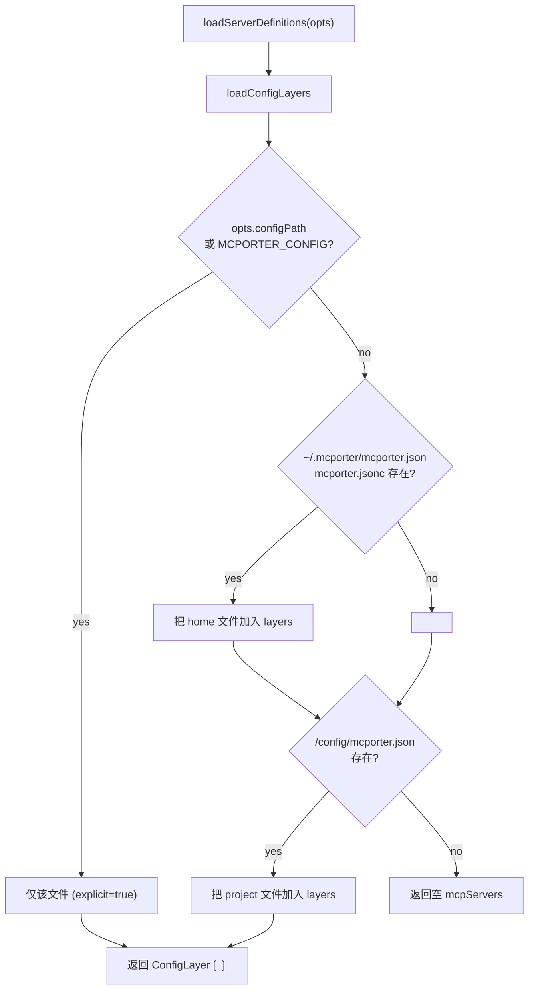
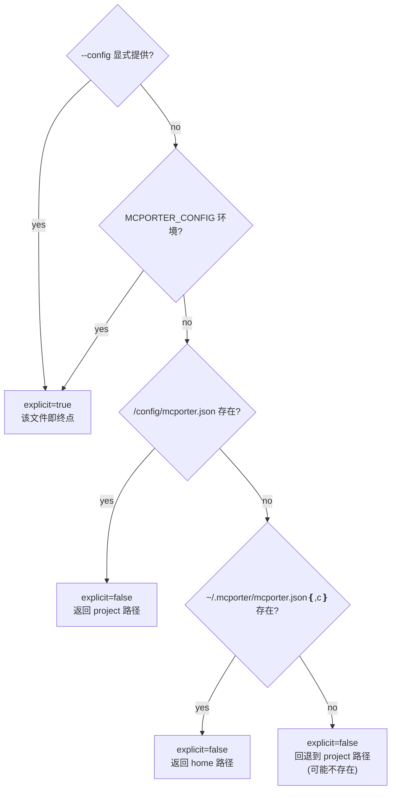
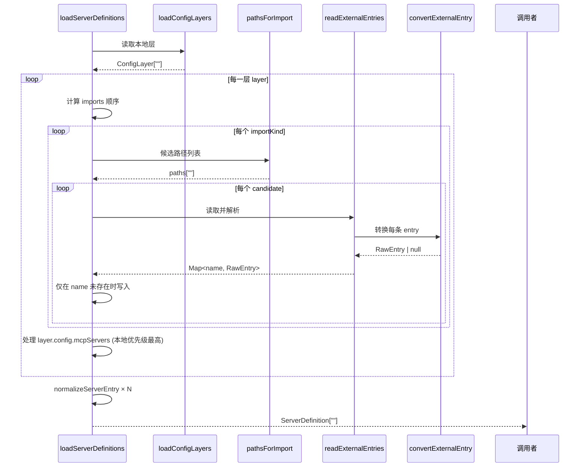
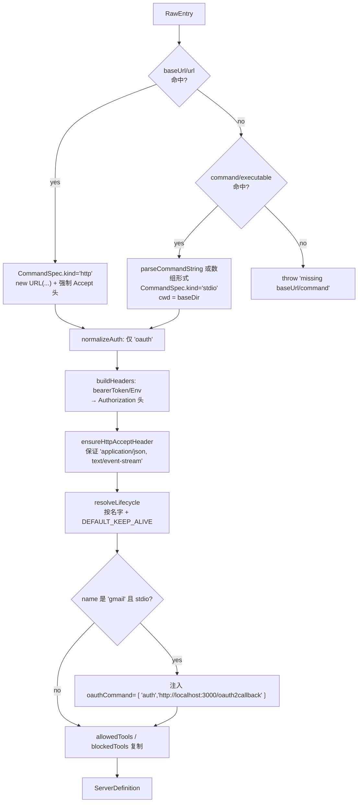
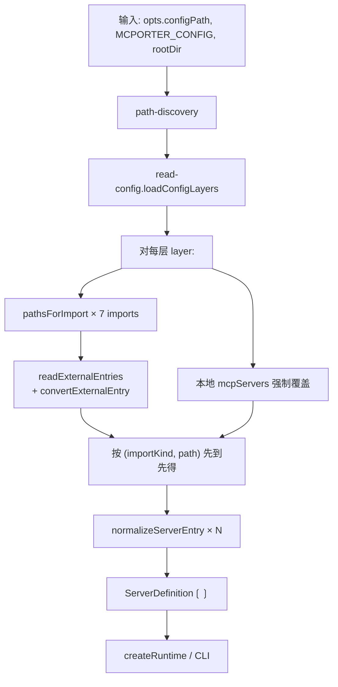

<details>
<summary>相关源文件</summary>

生成本页时使用的主要源文件：

- [src/config.ts](../../../project-repos/mcporter/src/config.ts)
- [src/config-schema.ts](../../../project-repos/mcporter/src/config-schema.ts)
- [src/config-normalize.ts](../../../project-repos/mcporter/src/config-normalize.ts)
- [src/config/path-discovery.ts](../../../project-repos/mcporter/src/config/path-discovery.ts)
- [src/config/read-config.ts](../../../project-repos/mcporter/src/config/read-config.ts)
- [src/config/imports/external.ts](../../../project-repos/mcporter/src/config/imports/external.ts)
- [src/config/imports/paths.ts](../../../project-repos/mcporter/src/config/imports/paths.ts)
- [src/env.ts](../../../project-repos/mcporter/src/env.ts)

</details>

# 配置加载与导入

mcporter 的配置子系统要回答的核心问题是：**给定当前进程的工作目录与环境变量，应该从哪些文件读 MCP 服务器，按怎样的顺序合并冲突，最终输出什么形状的 `ServerDefinition`？** 这一节按 "解析顺序 → 文件 schema → imports 来源 → 规范化 → 环境变量插值" 的顺序展开。

## 配置查找的两类入口

`loadServerDefinitions(options)` 是公共入口（[src/config.ts:36-104]()），实际的 layer 收集发生在 `loadConfigLayers`（[src/config/read-config.ts:14-41]()）。它要解决两个不同的概念：

- **primary config layers**：来自 `mcporter.json` / `mcporter.jsonc` 自己的层（home + project，按存在性叠加）。
- **imports**：来自其它编辑器/CLI 工具的 MCP 配置，通过 `imports` 字段控制启用列表。



注意：`config/mcporter.json` 与 `~/.mcporter/mcporter.json` **会同时叠加**——不是互斥的。两层都存在时，`loadServerDefinitions` 按 layer 数组顺序遍历，**本地（local）项永远覆盖 imports**，但同一项在 home + project 并存时由代码顺序决定胜出方（先 home 再 project，所以 project 文件最后写入 → 覆盖 home）。
Sources: [src/config/read-config.ts:14-41](../../../project-repos/mcporter/src/config/read-config.ts#L14-L41), [src/config.ts:42-96](../../../project-repos/mcporter/src/config.ts#L42-L96)

<details class="source-snippets">
<summary>引用源码</summary>

<!-- source-snippets:start -->

#### `src/config/read-config.ts:14-41`

```typescript
export async function loadConfigLayers(options: LoadConfigOptions, rootDir: string): Promise<ConfigLayer[]> {
  const explicitPath = options.configPath ?? process.env.MCPORTER_CONFIG;
  if (explicitPath) {
    const resolvedPath = path.resolve(expandHome(explicitPath.trim()));
    const config = await readConfigFile(resolvedPath, true);
    return [{ config, path: resolvedPath, explicit: true }];
  }

  const layers: ConfigLayer[] = [];

  const homeCandidates = homeConfigCandidates();
  const existingHome = homeCandidates.find((candidate) => pathExists(candidate));
  if (existingHome) {
    layers.push({ config: await readConfigFile(existingHome, false), path: existingHome, explicit: false });
  }

  const projectPath = path.resolve(rootDir, 'config', 'mcporter.json');
  if (pathExists(projectPath)) {
    layers.push({ config: await readConfigFile(projectPath, false), path: projectPath, explicit: false });
  }

  if (layers.length === 0) {
    // Preserve prior behavior: a missing default config returns an empty list and assumes the project path.
    layers.push({ config: { mcpServers: {} }, path: projectPath, explicit: false });
  }

  return layers;
}
```

#### `src/config.ts:42-96`

```typescript
  for (const layer of layers) {
    const configuredImports = layer.config.imports;
    const imports = configuredImports
      ? configuredImports.length === 0
        ? configuredImports
        : [...configuredImports, ...DEFAULT_IMPORTS.filter((kind) => !configuredImports.includes(kind))]
      : DEFAULT_IMPORTS;

    for (const importKind of imports) {
      const candidates = pathsForImport(importKind, rootDir);
      for (const candidate of candidates) {
        const resolved = expandHome(candidate);
        const entries = await readExternalEntries(resolved, { projectRoot: rootDir, importKind: importKind });
        if (!entries) {
          continue;
        }
        for (const [name, rawEntry] of entries) {
          if (merged.has(name)) {
            continue;
          }
          const source: ServerSource = { kind: 'import', path: resolved, importKind };
          const existing = merged.get(name);
          // Keep the first-seen source as canonical while tracking all alternates
          if (existing) {
            existing.sources.push(source);
            continue;
          }
          merged.set(name, {
            raw: rawEntry,
            baseDir: path.dirname(resolved),
            source,
            sources: [source],
          });
        }
      }
    }

    for (const [name, entryRaw] of Object.entries(layer.config.mcpServers)) {
      const source: ServerSource = { kind: 'local', path: layer.path };
      const parsed = RawEntrySchema.parse(entryRaw);
      const existing = merged.get(name);
      // Local definitions win; stash any prior imports after the local path
      if (existing) {
        const sources = [source, ...existing.sources];
        merged.set(name, { raw: parsed, baseDir: path.dirname(layer.path), source, sources });
        continue;
      }
      merged.set(name, {
        raw: parsed,
        baseDir: path.dirname(layer.path),
        source,
        sources: [source],
      });
    }
  }
```

<!-- source-snippets:end -->
</details>
## 解析顺序与显式 vs 隐式

`resolveConfigPath(configPath, rootDir)` 用同样的优先级表决定**单次写操作**的目标文件路径（[src/config/path-discovery.ts:37-55]()）。`mcporter config add/remove` 命令使用它，运行时则使用更宽松的 `loadConfigLayers`：



`explicit=true` 与 `false` 的区别在 `read-config.ts:43-59`：显式打开的文件即使 `ENOENT` 也会向上抛错，隐式打开则降级返回空 `mcpServers`，对默认值场景更友好。
Sources: [src/config/path-discovery.ts:37-80](../../../project-repos/mcporter/src/config/path-discovery.ts#L37-L80), [src/config/read-config.ts:43-59](../../../project-repos/mcporter/src/config/read-config.ts#L43-L59), [src/cli/cli-factory.ts:40-48](../../../project-repos/mcporter/src/cli/cli-factory.ts#L40-L48)

<details class="source-snippets">
<summary>引用源码</summary>

<!-- source-snippets:start -->

#### `src/config/path-discovery.ts:37-80`

```typescript
export function resolveConfigPath(configPath: string | undefined, rootDir: string): ResolvedConfigPath {
  if (configPath) {
    return { path: path.resolve(configPath), explicit: true };
  }
  const envConfig = process.env.MCPORTER_CONFIG;
  if (envConfig && envConfig.trim().length > 0) {
    return { path: path.resolve(expandHome(envConfig.trim())), explicit: true };
  }
  const projectPath = path.resolve(rootDir, 'config', 'mcporter.json');
  if (pathExists(projectPath)) {
    return { path: projectPath, explicit: false };
  }
  const homeCandidates = homeConfigCandidates();
  const existingHome = homeCandidates.find((candidate) => pathExists(candidate));
  if (existingHome) {
    return { path: existingHome, explicit: false };
  }
  return { path: projectPath, explicit: false };
}

export function homeConfigCandidates(): string[] {
  const homeDir = os.homedir();
  const base = path.join(homeDir, '.mcporter');
  return [path.join(base, 'mcporter.json'), path.join(base, 'mcporter.jsonc')];
}

export function pathExists(filePath: string): boolean {
  try {
    fsSync.accessSync(filePath);
    return true;
  } catch {
    return false;
  }
}

export async function pathExistsAsync(filePath: string): Promise<boolean> {
  try {
    await fs.access(filePath);
    return true;
  } catch {
    return false;
  }
}
```

#### `src/config/read-config.ts:43-59`

```typescript
export async function readConfigFile(configPath: string, explicit: boolean): Promise<RawConfig> {
  if (!explicit && !(await pathExistsAsync(configPath))) {
    return { mcpServers: {} };
  }
  try {
    const buffer = await fs.readFile(configPath, 'utf8');
    return RawConfigSchema.parse(parseJsonBuffer(buffer));
  } catch (error) {
    if (!explicit && isMissingConfigError(error)) {
      return { mcpServers: {} };
    }
    if (!explicit && isSyntaxError(error)) {
      warnConfigFallback(configPath, error);
      return { mcpServers: {} };
    }
    throw error;
  }
```

#### `src/cli/cli-factory.ts:40-48`

```typescript
  const rootOverride = globalFlags['--root'];
  const configResolution = resolveConfigPath(globalFlags['--config'], rootOverride ?? process.cwd());

  const runtimeOptions = {
    configPath: configResolution.explicit ? configResolution.path : undefined,
    rootDir: rootOverride,
    logger: getActiveLogger(),
    oauthTimeoutMs: oauthTimeoutOverride,
  };
```

<!-- source-snippets:end -->
</details>
## 配置文件 schema

`mcporter.json` / `mcporter.jsonc` 的根 schema 定义在 [src/config-schema.ts:121-129]()：

```ts
RawConfigSchema = z.object({
  mcpServers: z.record(z.string(), RawEntrySchema),
  imports: z.array(ImportKindSchema).optional(),
});
```

`RawEntry` 字段非常宽容：

| 字段 | 类型 | 用途 |
|------|------|------|
| `description` | `string` | 列表/帮助里展示 |
| `baseUrl` / `base_url` / `url` / `serverUrl` / `server_url` | `string` | HTTP/SSE 端点（5 种别名同时支持） |
| `command` | `string` 或 `string[]` | stdio 命令；字符串时由 `parseCommandString` 自行 token 化 |
| `executable` | `string` | `command` 的别名（兼容某些编辑器） |
| `args` | `string[]` | 当 `command` 是字符串时的额外参数 |
| `headers` | `Record<string, string>` | 静态或带 `${VAR}` / `$env:VAR` 占位符的 HTTP 头 |
| `env` | `Record<string, string>` | stdio 进程注入的环境变量 |
| `auth` | `string` | 仅识别 `"oauth"` |
| `tokenCacheDir` / `token_cache_dir` | `string` | 自定义 OAuth 缓存目录（覆盖 vault 默认） |
| `clientName` / `client_name` | `string` | 上报给 OAuth 的客户端名 |
| `oauthRedirectUrl` / `oauth_redirect_url` | `string` | 自定义回调 URL（覆盖动态端口） |
| `oauthScope` / `oauth_scope` | `string` | scope 覆盖；空字符串保留 |
| `oauthCommand` / `oauth_command` | `{ args: string[] }` | stdio MCP 的 OAuth 辅助子命令（如 gmail） |
| `bearerToken` / `bearer_token` | `string` | 静态 bearer，注入为 `Authorization: Bearer <token>` |
| `bearerTokenEnv` / `bearer_token_env` | `string` | 动态 bearer，注入为 `Authorization: $env:NAME` |
| `lifecycle` | `"keep-alive" \| "ephemeral" \| { mode, idleTimeoutMs }` | 由 daemon 使用 |
| `logging.daemon.enabled` | `boolean` | 让 daemon 详细记录该 server |
| `allowedTools` / `blockedTools` | `string[]` | 工具过滤（互斥） |

`superRefine` 校验 `allowedTools` 与 `blockedTools` 不能同时出现（[src/config-schema.ts:108-118]()）。
Sources: [src/config-schema.ts:51-130](../../../project-repos/mcporter/src/config-schema.ts#L51-L130)

<details class="source-snippets">
<summary>引用源码</summary>

<!-- source-snippets:start -->

#### `src/config-schema.ts:51-130`

```typescript
export const RawEntrySchema = z
  .object({
    description: z.string().optional().describe('Human-readable description of the server'),
    baseUrl: z.string().optional().describe('Base URL for HTTP/SSE transport (camelCase)'),
    base_url: z.string().optional().describe('Base URL for HTTP/SSE transport (snake_case)'),
    url: z.string().optional().describe('Server URL for HTTP/SSE transport'),
    serverUrl: z.string().optional().describe('Server URL for HTTP/SSE transport (camelCase)'),
    server_url: z.string().optional().describe('Server URL for HTTP/SSE transport (snake_case)'),
    command: z
      .union([z.string(), z.array(z.string())])
      .optional()
      .describe('Command to spawn for stdio transport (string or array of arguments)'),
    executable: z.string().optional().describe('Executable path for stdio transport'),
    args: z.array(z.string()).optional().describe('Arguments to pass to the stdio command'),
    headers: z
      .record(z.string(), z.string())
      .optional()
      .describe('HTTP headers for requests. Supports $VAR and $env:VAR placeholders'),
    env: z
      .record(z.string(), z.string())
      .optional()
      .describe('Environment variables for stdio commands. Supports $VAR and fallback syntax'),
    auth: z.string().optional().describe('Authentication method (e.g., "oauth")'),
    tokenCacheDir: z.string().optional().describe('Directory for caching OAuth tokens (camelCase)'),
    token_cache_dir: z.string().optional().describe('Directory for caching OAuth tokens (snake_case)'),
    clientName: z.string().optional().describe('Client identifier for server telemetry (camelCase)'),
    client_name: z.string().optional().describe('Client identifier for server telemetry (snake_case)'),
    oauthRedirectUrl: z.string().optional().describe('Custom OAuth redirect URL (camelCase)'),
    oauth_redirect_url: z.string().optional().describe('Custom OAuth redirect URL (snake_case)'),
    oauthScope: z.string().optional().describe('OAuth scope override (camelCase)'),
    oauth_scope: z.string().optional().describe('OAuth scope override (snake_case)'),
    oauthCommand: z
      .object({
        args: z.array(z.string()).describe('Arguments for the OAuth command'),
      })
      .optional()
      .describe('Custom OAuth command configuration for stdio servers (camelCase)'),
    oauth_command: z
      .object({
        args: z.array(z.string()).describe('Arguments for the OAuth command'),
      })
      .optional()
      .describe('Custom OAuth command configuration for stdio servers (snake_case)'),
    bearerToken: z.string().optional().describe('Static bearer token for authentication (camelCase)'),
    bearer_token: z.string().optional().describe('Static bearer token for authentication (snake_case)'),
    bearerTokenEnv: z.string().optional().describe('Environment variable name containing the bearer token (camelCase)'),
    bearer_token_env: z
      .string()
      .optional()
      .describe('Environment variable name containing the bearer token (snake_case)'),
    lifecycle: RawLifecycleSchema.optional(),
    logging: RawLoggingSchema,
    allowedTools: ToolNamesSchema.optional().describe('Only these exact tool names are exposed (camelCase)'),
    allowed_tools: ToolNamesSchema.optional().describe('Only these exact tool names are exposed (snake_case)'),
    blockedTools: ToolNamesSchema.optional().describe('These exact tool names are hidden and blocked (camelCase)'),
    blocked_tools: ToolNamesSchema.optional().describe('These exact tool names are hidden and blocked (snake_case)'),
  })
  .superRefine((entry, ctx) => {
    const hasAllowed = entry.allowedTools !== undefined || entry.allowed_tools !== undefined;
    const hasBlocked = entry.blockedTools !== undefined || entry.blocked_tools !== undefined;
    if (hasAllowed && hasBlocked) {
      ctx.addIssue({
        code: 'custom',
        message: 'Specify either allowedTools or blockedTools, not both.',
        path: ['allowedTools'],
      });
    }
  })
  .describe('MCP server definition supporting both HTTP/SSE and stdio transports');

export const RawConfigSchema = z
  .object({
    mcpServers: z.record(z.string(), RawEntrySchema).describe('Map of server names to their configurations'),
    imports: z
      .array(ImportKindSchema)
      .optional()
      .describe('Editor configurations to import servers from. Omit to use defaults, or set to [] to disable imports'),
  })
  .describe('mcporter configuration file schema');

```

<!-- source-snippets:end -->
</details>
### `mcpServers` 与 `imports` 的相互作用

`imports` 默认值定义在 [src/config-schema.ts:9-17]()：

```ts
DEFAULT_IMPORTS = ['cursor', 'claude-code', 'claude-desktop', 'codex', 'windsurf', 'opencode', 'vscode'];
```

`loadServerDefinitions` 的 `imports` 解析逻辑（[src/config.ts:43-49]()）：

- `imports: undefined` → 用全部 7 个默认值。
- `imports: []` → 完全关闭外部导入。
- `imports: ['cursor']` → 把 `'cursor'` 排在最前，再追加默认值里**还没出现**的其它 6 项。**这一步不是 strict 替换，而是优先级前置 + 兜底叠加**——一行 JSON 改不掉默认行为，需要写 `[]` 才能彻底关闭。

## imports 文件路径

`pathsForImport(kind, rootDir)` 列出每种 import 的候选路径（[src/config/imports/paths.ts:5-36]()）。每种来源都先看 project 局部，再看用户 home，再看平台特定的应用支持目录。

| import | project 局部 | user home | 系统目录 |
|--------|--------------|-----------|----------|
| cursor | `<root>/.cursor/mcp.json` | `~/.cursor/mcp.json` | macOS: `~/Library/Application Support/Cursor/User/mcp.json`，Windows: `%APPDATA%/Cursor/User/mcp.json` |
| claude-code | `<root>/.claude/settings.local.json` → `settings.json` → `mcp.json` | `~/.claude/settings.local.json` → `settings.json` → `mcp.json` → `~/.claude.json` | — |
| claude-desktop | — | macOS: `~/Library/Application Support/Claude/settings.json`；Win: `%AppData%/Claude/settings.json`；Linux: `~/.config/Claude/settings.json` | — |
| codex | `<root>/.codex/config.toml` | `~/.codex/config.toml` | — |
| windsurf | — | `~/.codeium/windsurf/mcp_config.json` 等 4 个候选 | Windows: `%APPDATA%/Codeium/windsurf/mcp_config.json` |
| opencode | `<root>/opencode.jsonc` / `.json`，`OPENCODE_CONFIG_DIR` 指向的目录 | `~/.config/opencode/opencode.{jsonc,json}` 等 | 受 `XDG_CONFIG_HOME` / `OPENCODE_CONFIG` 环境覆盖 |
| vscode | `<root>/.vscode/mcp.json` | macOS: `~/Library/Application Support/Code/User/mcp.json`（含 Insiders）；Windows: `%APPDATA%/Code/User/mcp.json`；Linux: `~/.config/Code/User/mcp.json` | — |

Sources: [src/config/imports/paths.ts:5-145](../../../project-repos/mcporter/src/config/imports/paths.ts#L5-L145)

<details class="source-snippets">
<summary>引用源码</summary>

<!-- source-snippets:start -->

#### `src/config/imports/paths.ts:5-145`

```typescript
export function pathsForImport(kind: ImportKind, rootDir: string): string[] {
  switch (kind) {
    case 'cursor':
      return dedupePaths([
        path.resolve(rootDir, '.cursor', 'mcp.json'),
        path.join(os.homedir(), '.cursor', 'mcp.json'),
        ...defaultCursorUserConfigPaths(),
      ]);
    case 'claude-code':
      return dedupePaths([
        path.resolve(rootDir, '.claude', 'settings.local.json'),
        path.resolve(rootDir, '.claude', 'settings.json'),
        path.resolve(rootDir, '.claude', 'mcp.json'),
        path.join(os.homedir(), '.claude', 'settings.local.json'),
        path.join(os.homedir(), '.claude', 'settings.json'),
        path.join(os.homedir(), '.claude', 'mcp.json'),
        path.join(os.homedir(), '.claude.json'),
      ]);
    case 'claude-desktop':
      return [defaultClaudeDesktopConfigPath()];
    case 'codex':
      return [path.resolve(rootDir, '.codex', 'config.toml'), path.join(os.homedir(), '.codex', 'config.toml')];
    case 'windsurf':
      return defaultWindsurfConfigPaths();
    case 'opencode':
      return opencodeConfigPaths(rootDir);
    case 'vscode':
      return dedupePaths([path.resolve(rootDir, '.vscode', 'mcp.json'), ...defaultVscodeConfigPaths()]);
    default:
      return [];
  }
}

function defaultCursorUserConfigPaths(): string[] {
  const xdgConfig = process.env.XDG_CONFIG_HOME;
  const configs = xdgConfig ? [path.join(xdgConfig, 'Cursor', 'User', 'mcp.json')] : [];
  return dedupePaths([
    path.join(os.homedir(), 'AppData', 'Roaming', 'Cursor', 'User', 'mcp.json'),
    path.join(os.homedir(), 'Library', 'Application Support', 'Cursor', 'User', 'mcp.json'),
    ...configs,
  ]);
}

function defaultWindsurfConfigPaths(): string[] {
  const homeDir = os.homedir();
  const paths = [
    path.join(homeDir, '.codeium', 'windsurf', 'mcp_config.json'),
    path.join(homeDir, '.codeium', 'windsurf-next', 'mcp_config.json'),
    path.join(homeDir, '.windsurf', 'mcp_config.json'),
    path.join(homeDir, '.config', '.codeium', 'windsurf', 'mcp_config.json'),
  ];
  if (process.platform === 'win32') {
    const appData = process.env.APPDATA ?? path.join(homeDir, 'AppData', 'Roaming');
    paths.push(path.join(appData, 'Codeium', 'windsurf', 'mcp_config.json'));
  }
  return dedupePaths(paths);
}

function defaultVscodeConfigPaths(): string[] {
  if (process.platform === 'darwin') {
    return [
      path.join(os.homedir(), 'Library', 'Application Support', 'Code', 'User', 'mcp.json'),
      path.join(os.homedir(), 'Library', 'Application Support', 'Code - Insiders', 'User', 'mcp.json'),
    ];
  }
  if (process.platform === 'win32') {
    const appData = process.env.APPDATA ?? path.join(os.homedir(), 'AppData', 'Roaming');
    return [path.join(appData, 'Code', 'User', 'mcp.json'), path.join(appData, 'Code - Insiders', 'User', 'mcp.json')];
  }
  return [
    path.join(os.homedir(), '.config', 'Code', 'User', 'mcp.json'),
    path.join(os.homedir(), '.config', 'Code - Insiders', 'User', 'mcp.json'),
  ];
}

function opencodeConfigPaths(rootDir: string): string[] {
  const overrideConfig = process.env.OPENCODE_CONFIG;
  const overrideDir = process.env.OPENCODE_CONFIG_DIR;
  const envConfigPath = process.env.OPENAI_WORKDIR;
  const xdg = process.env.XDG_CONFIG_HOME;
  const configHome = xdg ?? path.join(process.env.HOME ?? '', '.config');
  const paths: string[] = [
    overrideConfig ?? '',
    path.resolve(rootDir, 'opencode.jsonc'),
    path.resolve(rootDir, 'opencode.json'),
  ];
  if (overrideDir && overrideDir.length > 0) {
    paths.push(path.join(overrideDir, 'opencode.jsonc'), path.join(overrideDir, 'opencode.json'));
  }
  paths.push(
    path.resolve(rootDir, '.openai', 'config.json'),
    envConfigPath ? path.resolve(envConfigPath, '.openai', 'config.json') : '',
    path.join(configHome, 'openai', 'config.json')
  );
  for (const dir of defaultOpencodeConfigDirs()) {
    paths.push(path.join(dir, 'opencode.jsonc'), path.join(dir, 'opencode.json'));
  }
  return dedupePaths(paths);
}

function defaultOpencodeConfigDirs(): string[] {
  const dirs: string[] = [];
  const xdg = process.env.XDG_CONFIG_HOME;
  if (xdg && xdg.length > 0) {
    dirs.push(path.join(xdg, 'opencode'));
  } else if (process.platform === 'win32') {
    const appData = process.env.APPDATA ?? path.join(os.homedir(), 'AppData', 'Roaming');
    dirs.push(path.join(appData, 'opencode'));
  } else {
    dirs.push(path.join(os.homedir(), '.config', 'opencode'));
  }
  return dirs;
}

function defaultClaudeDesktopConfigPath(): string {
  const homeDir = os.homedir();
  const darwinPath = path.join(homeDir, 'Library', 'Application Support', 'Claude', 'settings.json');
  const windowsPath = path.join(homeDir, 'AppData', 'Roaming', 'Claude', 'settings.json');
  const linuxPath = path.join(homeDir, '.config', 'Claude', 'settings.json');
  const platform = process.platform;
... snippet truncated ...
```

<!-- source-snippets:end -->
</details>
`readExternalEntries(filePath, opts)` 处理读取与解析（[src/config/imports/external.ts:14-41]()）：

- `.toml` → `parseToml` → 抽取 `mcp_servers` 节（codex 风格）。
- 其它（`.json` / `.jsonc`）→ 通过 `parseJsonBuffer`（容忍 JSONC 注释与尾逗号）。
- 同一个 JSON 可以挂在 `mcpServers` / `servers` / `mcp` 三个键之一，`opencode` 强制用 `mcp`，其它来源放宽 `allowRootFallback`。
- `claude-code` 还会扫描 `~/.claude.json` 的 `projects[<projectRoot>].mcpServers`，用 `normalizeProjectPath` 把绝对路径标准化（[src/config/imports/external.ts:182-200]()）。
- `convertExternalEntry` 把外部对象 squash 成 `RawEntry` 并跑 `RawEntrySchema.safeParse`，校验失败的整体丢弃（[src/config/imports/external.ts:102-159]()）。



Sources: [src/config.ts:36-104](../../../project-repos/mcporter/src/config.ts#L36-L104), [src/config/imports/external.ts:14-200](../../../project-repos/mcporter/src/config/imports/external.ts#L14-L200)

<details class="source-snippets">
<summary>引用源码</summary>

<!-- source-snippets:start -->

#### `src/config.ts:36-104`

```typescript
export async function loadServerDefinitions(options: LoadConfigOptions = {}): Promise<ServerDefinition[]> {
  const rootDir = options.rootDir ?? process.cwd();
  const layers = await loadConfigLayers(options, rootDir);

  const merged = new Map<string, { raw: RawEntry; baseDir: string; source: ServerSource; sources: ServerSource[] }>();

  for (const layer of layers) {
    const configuredImports = layer.config.imports;
    const imports = configuredImports
      ? configuredImports.length === 0
        ? configuredImports
        : [...configuredImports, ...DEFAULT_IMPORTS.filter((kind) => !configuredImports.includes(kind))]
      : DEFAULT_IMPORTS;

    for (const importKind of imports) {
      const candidates = pathsForImport(importKind, rootDir);
      for (const candidate of candidates) {
        const resolved = expandHome(candidate);
        const entries = await readExternalEntries(resolved, { projectRoot: rootDir, importKind: importKind });
        if (!entries) {
          continue;
        }
        for (const [name, rawEntry] of entries) {
          if (merged.has(name)) {
            continue;
          }
          const source: ServerSource = { kind: 'import', path: resolved, importKind };
          const existing = merged.get(name);
          // Keep the first-seen source as canonical while tracking all alternates
          if (existing) {
            existing.sources.push(source);
            continue;
          }
          merged.set(name, {
            raw: rawEntry,
            baseDir: path.dirname(resolved),
            source,
            sources: [source],
          });
        }
      }
    }

    for (const [name, entryRaw] of Object.entries(layer.config.mcpServers)) {
      const source: ServerSource = { kind: 'local', path: layer.path };
      const parsed = RawEntrySchema.parse(entryRaw);
      const existing = merged.get(name);
      // Local definitions win; stash any prior imports after the local path
      if (existing) {
        const sources = [source, ...existing.sources];
        merged.set(name, { raw: parsed, baseDir: path.dirname(layer.path), source, sources });
        continue;
      }
      merged.set(name, {
        raw: parsed,
        baseDir: path.dirname(layer.path),
        source,
        sources: [source],
      });
    }
  }

  const servers: ServerDefinition[] = [];
  for (const [name, { raw, baseDir: entryBaseDir, source, sources }] of merged) {
    servers.push(normalizeServerEntry(name, raw, entryBaseDir, source, sources));
  }

  return servers;
}
```

#### `src/config/imports/external.ts:14-200`

```typescript
export async function readExternalEntries(
  filePath: string,
  options: ReadExternalEntryOptions = {}
): Promise<Map<string, RawEntry> | null> {
  if (!(await fileExists(filePath))) {
    return null;
  }

  const buffer = await fs.readFile(filePath, 'utf8');
  if (!buffer.trim()) {
    return new Map<string, RawEntry>();
  }

  try {
    if (filePath.endsWith('.toml')) {
      const parsed = parseToml(buffer) as Record<string, unknown>;
      return extractFromCodexConfig(parsed);
    }

    const parsed = parseJsonBuffer(buffer);
    return extractFromMcpJson(parsed, options, filePath);
  } catch (error) {
    if (shouldIgnoreParseError(error)) {
      return new Map<string, RawEntry>();
    }
    throw error;
  }
}

function extractFromMcpJson(raw: unknown, options: ReadExternalEntryOptions, filePath?: string): Map<string, RawEntry> {
  const map = new Map<string, RawEntry>();
  if (!isRecord(raw)) {
    return map;
  }

  const { importKind, projectRoot } = options;
  const descriptor = resolveContainerDescriptor(importKind, filePath);

  const containers: Record<string, unknown>[] = [];
  if (descriptor.allowMcpServers && isRecord(raw.mcpServers)) {
    containers.push(raw.mcpServers);
  }
  if (descriptor.allowServers && isRecord(raw.servers)) {
    containers.push(raw.servers);
  }
  if (descriptor.allowMcp && isRecord(raw.mcp)) {
    containers.push(raw.mcp);
  }
  if (descriptor.allowRootFallback && containers.length === 0) {
    containers.push(raw);
  }

  for (const container of containers) {
    addEntriesFromContainer(container, map);
  }

  if (projectRoot) {
    const projectEntries = extractClaudeProjectEntries(raw, projectRoot);
    for (const [name, entry] of projectEntries) {
      if (!map.has(name)) {
        map.set(name, entry);
      }
    }
  }

  return map;
}

function extractFromCodexConfig(raw: Record<string, unknown>): Map<string, RawEntry> {
  const map = new Map<string, RawEntry>();
  const serversRaw = raw.mcp_servers;
  if (!serversRaw || typeof serversRaw !== 'object') {
    return map;
  }

  for (const [name, value] of Object.entries(serversRaw as Record<string, unknown>)) {
    if (!value || typeof value !== 'object') {
      continue;
    }
    const entry = convertExternalEntry(value as Record<string, unknown>);
    if (entry) {
      map.set(name, entry);
    }
  }

  return map;
}

function convertExternalEntry(value: Record<string, unknown>): RawEntry | null {
  const result: Record<string, unknown> = {};

  if (typeof value.description === 'string') {
    result.description = value.description;
  }

  const env = asStringRecord(value.env);
  if (env) {
    result.env = env;
  }

  const headers = buildExternalHeaders(value);
  if (headers) {
    result.headers = headers;
  }

  const auth = asString(value.auth);
  if (auth) {
    result.auth = auth;
  }

  const tokenCacheDir = asString(value.tokenCacheDir ?? value.token_cache_dir ?? value.token_cacheDir);
  if (tokenCacheDir) {
    result.tokenCacheDir = tokenCacheDir;
  }

  const clientName = asString(value.clientName ?? value.client_name);
  if (clientName) {
    result.clientName = clientName;
  }

... snippet truncated ...
```

<!-- source-snippets:end -->
</details>
## 优先级与冲突解决规则

合并循环里有两条铁律（[src/config.ts:60-95]()）：

1. **同名 import 之间**先到先得：第一个找到的 `importKind + path` 写入 `merged`，后续仅追加到 `sources` 数组以便 `--verbose` 展示，不替换 raw entry。
2. **本地永远优先**：`layer.config.mcpServers` 在每一层 layer 末尾遍历，对每个名字直接覆盖 `merged.get(name)?.raw`，原 imports 被压到 `sources` 数组后面。

这意味着如果你想**改写 Cursor 导入的某个服务器**，最直接的方法是在 `config/mcporter.json` 里写同名条目；要**完全屏蔽某个来源**则把 `imports` 改成不含它的子集（写空数组关掉所有 imports）。
Sources: [src/config.ts:42-96](../../../project-repos/mcporter/src/config.ts#L42-L96)

<details class="source-snippets">
<summary>引用源码</summary>

<!-- source-snippets:start -->

#### `src/config.ts:42-96`

```typescript
  for (const layer of layers) {
    const configuredImports = layer.config.imports;
    const imports = configuredImports
      ? configuredImports.length === 0
        ? configuredImports
        : [...configuredImports, ...DEFAULT_IMPORTS.filter((kind) => !configuredImports.includes(kind))]
      : DEFAULT_IMPORTS;

    for (const importKind of imports) {
      const candidates = pathsForImport(importKind, rootDir);
      for (const candidate of candidates) {
        const resolved = expandHome(candidate);
        const entries = await readExternalEntries(resolved, { projectRoot: rootDir, importKind: importKind });
        if (!entries) {
          continue;
        }
        for (const [name, rawEntry] of entries) {
          if (merged.has(name)) {
            continue;
          }
          const source: ServerSource = { kind: 'import', path: resolved, importKind };
          const existing = merged.get(name);
          // Keep the first-seen source as canonical while tracking all alternates
          if (existing) {
            existing.sources.push(source);
            continue;
          }
          merged.set(name, {
            raw: rawEntry,
            baseDir: path.dirname(resolved),
            source,
            sources: [source],
          });
        }
      }
    }

    for (const [name, entryRaw] of Object.entries(layer.config.mcpServers)) {
      const source: ServerSource = { kind: 'local', path: layer.path };
      const parsed = RawEntrySchema.parse(entryRaw);
      const existing = merged.get(name);
      // Local definitions win; stash any prior imports after the local path
      if (existing) {
        const sources = [source, ...existing.sources];
        merged.set(name, { raw: parsed, baseDir: path.dirname(layer.path), source, sources });
        continue;
      }
      merged.set(name, {
        raw: parsed,
        baseDir: path.dirname(layer.path),
        source,
        sources: [source],
      });
    }
  }
```

<!-- source-snippets:end -->
</details>
## RawEntry → ServerDefinition 的规范化

`normalizeServerEntry` 是规范化的核心（[src/config-normalize.ts:5-73]()）。它的输入是 `RawEntry + baseDir + source + sources`，输出是稳定的 `ServerDefinition`：



几个值得注意的细节：

- **`ensureHttpAcceptHeader`**：MCP 远端要求 `Accept` 头同时包含 `application/json` 与 `text/event-stream`，因此即使用户没显式设置，规范化阶段也会强制写入（[src/config-normalize.ts:146-160]()）。
- **`baseDir`**：stdio 命令的 `cwd` 直接取自 `entry baseDir`——也就是声明该 entry 的 JSON 文件所在目录。这样 `npx -y …` 类命令能继承调用者期望的工作目录而不是当前 shell 的 cwd。
- **`auth` 仅识别 `'oauth'`**：其它字符串会被抹成 `undefined`，避免上游编辑器的自定义值传染到 OAuth 流程（[src/config-normalize.ts:79-87]()）。
- **gmail 特例**：在没有显式 `oauthCommand` 时为 stdio 形式的 gmail 注入 `auth http://localhost:3000/oauth2callback`，对应 gmail-mcp 包的内部约定（[src/config-normalize.ts:50-54]()）。
- **`source` vs `sources`**：`source` 是当前胜出的来源，`sources` 是所有出现过该名字的位置。`mcporter list --verbose` / `--sources` 会展示后者用于排查"为什么 Cursor 改了配置但 mcporter 没生效"。

Sources: [src/config-normalize.ts:5-160](../../../project-repos/mcporter/src/config-normalize.ts#L5-L160), [src/config-schema.ts:147-191](../../../project-repos/mcporter/src/config-schema.ts#L147-L191)

<details class="source-snippets">
<summary>引用源码</summary>

<!-- source-snippets:start -->

#### `src/config-normalize.ts:5-160`

```typescript
export function normalizeServerEntry(
  name: string,
  raw: RawEntry,
  baseDir: string,
  source: ServerSource,
  sources: readonly ServerSource[]
): ServerDefinition {
  const description = raw.description;
  const env = raw.env ? { ...raw.env } : undefined;
  const auth = normalizeAuth(raw.auth);
  const tokenCacheDir = normalizePath(raw.tokenCacheDir ?? raw.token_cache_dir);
  const clientName = raw.clientName ?? raw.client_name;
  const oauthRedirectUrl = raw.oauthRedirectUrl ?? raw.oauth_redirect_url ?? undefined;
  const oauthScope = raw.oauthScope ?? raw.oauth_scope ?? undefined;
  const oauthCommandRaw = raw.oauthCommand ?? raw.oauth_command;
  const oauthCommand = oauthCommandRaw ? { args: [...oauthCommandRaw.args] } : undefined;
  const headers = buildHeaders(raw);

  const httpUrl = getUrl(raw);
  const stdio = getCommand(raw);

  let command: CommandSpec;

  if (httpUrl) {
    command = {
      kind: 'http',
      url: new URL(httpUrl),
      headers: ensureHttpAcceptHeader(headers),
    };
  } else if (stdio) {
    command = {
      kind: 'stdio',
      command: stdio.command,
      args: stdio.args,
      cwd: baseDir,
    };
  } else {
    throw new Error(`Server '${name}' is missing a baseUrl/url or command definition in mcporter.json`);
  }

  const lifecycle = resolveLifecycle(name, raw.lifecycle, command);
  const logging = normalizeLogging(raw.logging);
  const allowedTools = raw.allowedTools ?? raw.allowed_tools;
  const blockedTools = raw.blockedTools ?? raw.blocked_tools;

  const defaultedOauthCommand =
    !oauthCommand && name.toLowerCase() === 'gmail' && command.kind === 'stdio'
      ? { args: ['auth', 'http://localhost:3000/oauth2callback'] }
      : oauthCommand;

  return {
    name,
    description,
    command,
    env,
    auth,
    tokenCacheDir,
    clientName,
    oauthRedirectUrl,
    oauthScope,
    oauthCommand: defaultedOauthCommand,
    source,
    sources,
    lifecycle,
    logging,
    ...(allowedTools !== undefined ? { allowedTools: [...allowedTools] } : {}),
    ...(blockedTools !== undefined ? { blockedTools: [...blockedTools] } : {}),
  };
}

export const __configInternals = {
  ensureHttpAcceptHeader,
};

function normalizeAuth(auth: string | undefined): string | undefined {
  if (!auth) {
    return undefined;
  }
  if (auth.toLowerCase() === 'oauth') {
    return 'oauth';
  }
  return undefined;
}

function normalizePath(input: string | undefined): string | undefined {
  if (!input) {
    return undefined;
  }
  return expandHome(input);
}

function getUrl(raw: RawEntry): string | undefined {
  return raw.baseUrl ?? raw.base_url ?? raw.url ?? raw.serverUrl ?? raw.server_url ?? undefined;
}

function getCommand(raw: RawEntry): { command: string; args: string[] } | undefined {
  const commandValue = raw.command ?? raw.executable;
  if (Array.isArray(commandValue)) {
    if (commandValue.length === 0 || typeof commandValue[0] !== 'string') {
      return undefined;
    }
    return { command: commandValue[0], args: commandValue.slice(1) };
  }
  if (typeof commandValue === 'string' && commandValue.length > 0) {
    const args = Array.isArray(raw.args) ? raw.args : [];
    if (args.length > 0) {
      return { command: commandValue, args };
    }
    const tokens = parseCommandString(commandValue);
    if (tokens.length === 0) {
      return undefined;
    }
    const [commandToken, ...rest] = tokens;
    if (!commandToken) {
      return undefined;
    }
    return { command: commandToken, args: rest };
  }
  return undefined;
}
... snippet truncated ...
```

#### `src/config-schema.ts:147-191`

```typescript
export type CommandSpec = HttpCommand | StdioCommand;

export interface ServerSource {
  readonly kind: 'local' | 'import';
  readonly path: string;
  readonly importKind?: ImportKind;
}

export type ServerLifecycle =
  | {
      mode: 'keep-alive';
      idleTimeoutMs?: number;
    }
  | {
      mode: 'ephemeral';
    };

export interface ServerLoggingOptions {
  readonly daemon?: {
    readonly enabled?: boolean;
  };
}

export interface ServerDefinition {
  readonly name: string;
  readonly description?: string;
  readonly command: CommandSpec;
  readonly env?: Record<string, string>;
  readonly auth?: string;
  readonly tokenCacheDir?: string;
  readonly clientName?: string;
  readonly oauthRedirectUrl?: string;
  readonly oauthScope?: string;
  readonly oauthCommand?: {
    readonly args: string[];
  };
  readonly source?: ServerSource;
  readonly sources?: readonly ServerSource[];
  readonly lifecycle?: ServerLifecycle;
  readonly logging?: ServerLoggingOptions;
  /** When specified, only these exact tool names are exposed. Empty array blocks all tools. */
  readonly allowedTools?: readonly string[];
  /** When specified, these exact tool names are hidden and blocked. Cannot be combined with allowedTools. */
  readonly blockedTools?: readonly string[];
}
```

<!-- source-snippets:end -->
</details>
## 环境变量与占位符

`env.ts` 提供三种 token：

| 形式 | 行为 | 入口 |
|------|------|------|
| `${VAR}` | 在 headers 里替换为 `process.env[VAR]`；缺失则抛出"required for MCP header substitution" | `resolveEnvPlaceholders` ([src/env.ts:50-76]()) |
| `${VAR:-fallback}` | env 缺失时使用 fallback | `resolveEnvValue` 走 `ENV_DEFAULT_PATTERN` ([src/env.ts:23-47]()) |
| `$env:VAR` | header / env 中的"必须存在"语义；缺失即抛 | `resolveEnvPlaceholders` 前缀分支 ([src/env.ts:51-58]()) |

`withEnvOverrides(envMap, fn)` 在调用 stdio MCP 时按需把 `env` 临时塞进 `process.env`（已有同名 key 的不覆盖），fn 退出时清理（[src/env.ts:79-107]()）。`expandHome('~/...')` 处理用户主目录展开（[src/env.ts:7-20]()），用于 `tokenCacheDir`、`MCPORTER_CONFIG` 等路径字段。
Sources: [src/env.ts:1-107](../../../project-repos/mcporter/src/env.ts#L1-L107)

<details class="source-snippets">
<summary>引用源码</summary>

<!-- source-snippets:start -->

#### `src/env.ts:1-107`

```typescript
import os from 'node:os';

const ENV_DEFAULT_PATTERN = /^\$\{([A-Za-z_][A-Za-z0-9_]*)(?::-|:|-)?([^}]*)\}$/;
const ENV_INTERPOLATION_PATTERN = /\\?\$\{([A-Za-z_][A-Za-z0-9_]*)\}/g;
const ENV_DIRECT_PREFIX = '$env:';

// expandHome replaces a leading '~' with the current user's home directory.
export function expandHome(input: string): string {
  if (!input.startsWith('~')) {
    return input;
  }
  const home = os.homedir();
  if (input === '~') {
    return home;
  }
  if (input.startsWith('~/')) {
    return `${home}/${input.slice(2)}`;
  }
  return input;
}

// resolveEnvValue interprets ${VAR:-default} syntax and other primitive values for env overrides.
export function resolveEnvValue(raw: unknown): string {
  if (typeof raw !== 'string') {
    return String(raw);
  }

  const match = ENV_DEFAULT_PATTERN.exec(raw);
  if (match) {
    const envName = match[1];
    const defaultValue = match[2] ?? '';
    if (!envName) {
      return raw;
    }
    const existing = process.env[envName];
    if (existing && existing !== '') {
      return existing;
    }
    return defaultValue;
  }

  if (raw.startsWith('$')) {
    return resolveEnvPlaceholders(raw);
  }

  return raw;
}

// resolveEnvPlaceholders replaces ${VAR} or $env:VAR references using process.env, enforcing required values.
export function resolveEnvPlaceholders(value: string): string {
  if (value.startsWith(ENV_DIRECT_PREFIX)) {
    const envName = value.slice(ENV_DIRECT_PREFIX.length);
    const envValue = process.env[envName];
    if (envValue === undefined) {
      throw new Error(`Environment variable '${envName}' is required for MCP header substitution.`);
    }
    return envValue;
  }

  const missing = new Set<string>();
  const replaced = value.replace(ENV_INTERPOLATION_PATTERN, (placeholder, envName: string) => {
    const envValue = process.env[envName];
    if (envValue === undefined) {
      missing.add(envName);
      return placeholder;
    }
    return envValue;
  });

  if (missing.size > 0) {
    const names = [...missing].toSorted().join(', ');
    throw new Error(`Environment variable(s) ${names} must be set for MCP header substitution.`);
  }

  return replaced;
}

// withEnvOverrides temporarily populates process.env keys while executing the provided callback.
export async function withEnvOverrides<T>(
  envOverrides: Record<string, string> | undefined,
  fn: () => Promise<T> | T
): Promise<T> {
  if (!envOverrides || Object.keys(envOverrides).length === 0) {
    return await fn();
  }

  const applied: string[] = [];
  for (const [key, rawValue] of Object.entries(envOverrides)) {
    if (process.env[key]) {
      continue;
    }
    const resolved = resolveEnvValue(rawValue);
    if (resolved === '') {
      continue;
    }
    process.env[key] = resolved;
    applied.push(key);
  }

  try {
    return await fn();
  } finally {
    for (const key of applied) {
      delete process.env[key];
    }
  }
}
```

<!-- source-snippets:end -->
</details>
## `mcporter config` 命令

`mcporter config <subcommand>` 是把上面这套加载/规范化流程暴露成可读写操作的命令族，路由在 [src/cli/config-command.ts:12-67]()：

| 子命令 | 入口文件 | 主要语义 |
|--------|----------|----------|
| `list` | `src/cli/config/list.ts` | 默认仅列本地，TTY 下额外汇总每个 import 来源；`--source import` 切换 |
| `get` | `src/cli/config/get.ts` | 模糊匹配名字，文本/JSON 输出 |
| `add` | `src/cli/config/add.ts` | `--scope home/project` / `--persist <path>` 选写入位置 ([add.ts:87-101]()) |
| `remove` | `src/cli/config/remove.ts` | 反向操作，支持模糊纠错 |
| `import` | `src/cli/config/import.ts` | 把某个 IDE 的 entries 拷到本地 |
| `login` / `logout` | `src/cli/config/auth.ts` | 走 `auth-command` 同款 OAuth |
| `doctor` | `src/cli/config/doctor.ts` | 一键体检（路径、JSONC、env 占位符） |

`config add` 的写入路径解析尤其重要：`--persist` 优先 → `--scope home/project` → `loadOptions.configPath` → `<root>/config/mcporter.json`。这意味着 `config add` 默认写到 project，不会污染用户 home。
Sources: [src/cli/config-command.ts:12-67](../../../project-repos/mcporter/src/cli/config-command.ts#L12-L67), [src/cli/config/add.ts:87-101](../../../project-repos/mcporter/src/cli/config/add.ts#L87-L101)

<details class="source-snippets">
<summary>引用源码</summary>

<!-- source-snippets:start -->

#### `src/cli/config-command.ts:12-67`

```typescript
export async function handleConfigCli(options: ConfigCliOptions, args: string[]): Promise<void> {
  const initialToken = args[0];
  if (args.length === 0 || (initialToken && isHelpToken(initialToken))) {
    printConfigHelp();
    return;
  }

  const subcommand = args.shift();
  if (!subcommand) {
    printConfigHelp();
    return;
  }

  if (subcommand === 'help') {
    const target = args[0];
    if (!target || isHelpToken(target)) {
      printConfigHelp();
    } else {
      printConfigHelp(target);
    }
    return;
  }

  if (consumeInlineHelpTokens(args)) {
    printConfigHelp(subcommand);
    return;
  }

  switch (subcommand as ConfigSubcommand) {
    case 'list':
      await handleListCommand(options, args);
      return;
    case 'get':
      await handleGetCommand(options, args);
      return;
    case 'add':
      await handleAddCommand(options, args);
      return;
    case 'remove':
      await handleRemoveCommand(options, args);
      return;
    case 'import':
      await handleImportCommand(options, args);
      return;
    case 'login':
      await handleLoginCommand(options, args);
      return;
    case 'logout':
      await handleLogoutCommand(options, args);
      return;
    case 'doctor':
      await handleDoctorCommand(options, args);
      return;
    default:
      throw new CliUsageError(`Unknown config subcommand '${subcommand}'. Run 'mcporter config --help'.`);
  }
```

#### `src/cli/config/add.ts:87-101`

```typescript
export function resolveWriteTarget(flags: AddFlags, loadOptions: LoadConfigOptions, rootDir: string): string {
  if (flags.persistPath) {
    return path.resolve(expandHome(flags.persistPath));
  }
  if (flags.scope === 'home') {
    return path.join(os.homedir(), '.mcporter', 'mcporter.json');
  }
  if (flags.scope === 'project') {
    return path.resolve(rootDir, 'config', 'mcporter.json');
  }
  if (loadOptions.configPath) {
    return path.resolve(expandHome(loadOptions.configPath));
  }
  return path.resolve(rootDir, 'config', 'mcporter.json');
}
```

<!-- source-snippets:end -->
</details>
## 失败模式与降级

`readConfigFile` 在隐式打开时对两类错误做降级，避免开发机上没有任何配置就直接报错：

```ts
if (!explicit && isMissingConfigError(error)) return { mcpServers: {} };
if (!explicit && isSyntaxError(error)) {
  warnConfigFallback(configPath, error);  // 仅一次
  return { mcpServers: {} };
}
```

外部 imports 文件遇到 JSON SyntaxError / TOML 解析错误（带 `fromTOML` 标记）也会被忽略（[src/config/imports/external.ts:276-283]()）。这个策略让一台机器上某个 IDE 的配置坏掉时，mcporter 仍然能继续工作。
Sources: [src/config/read-config.ts:43-59](../../../project-repos/mcporter/src/config/read-config.ts#L43-L59), [src/config/imports/external.ts:276-284](../../../project-repos/mcporter/src/config/imports/external.ts#L276-L284)

<details class="source-snippets">
<summary>引用源码</summary>

<!-- source-snippets:start -->

#### `src/config/read-config.ts:43-59`

```typescript
export async function readConfigFile(configPath: string, explicit: boolean): Promise<RawConfig> {
  if (!explicit && !(await pathExistsAsync(configPath))) {
    return { mcpServers: {} };
  }
  try {
    const buffer = await fs.readFile(configPath, 'utf8');
    return RawConfigSchema.parse(parseJsonBuffer(buffer));
  } catch (error) {
    if (!explicit && isMissingConfigError(error)) {
      return { mcpServers: {} };
    }
    if (!explicit && isSyntaxError(error)) {
      warnConfigFallback(configPath, error);
      return { mcpServers: {} };
    }
    throw error;
  }
```

#### `src/config/imports/external.ts:276-284`

```typescript
function shouldIgnoreParseError(error: unknown): boolean {
  if (error instanceof SyntaxError) {
    return true;
  }
  if (!error || typeof error !== 'object') {
    return false;
  }
  return 'fromTOML' in error;
}
```

<!-- source-snippets:end -->
</details>
## 一图总结



Sources: [src/config.ts:36-104](../../../project-repos/mcporter/src/config.ts#L36-L104), [src/config/read-config.ts:14-41](../../../project-repos/mcporter/src/config/read-config.ts#L14-L41), [src/config-normalize.ts:5-73](../../../project-repos/mcporter/src/config-normalize.ts#L5-L73)

<details class="source-snippets">
<summary>引用源码</summary>

<!-- source-snippets:start -->

#### `src/config.ts:36-104`

```typescript
export async function loadServerDefinitions(options: LoadConfigOptions = {}): Promise<ServerDefinition[]> {
  const rootDir = options.rootDir ?? process.cwd();
  const layers = await loadConfigLayers(options, rootDir);

  const merged = new Map<string, { raw: RawEntry; baseDir: string; source: ServerSource; sources: ServerSource[] }>();

  for (const layer of layers) {
    const configuredImports = layer.config.imports;
    const imports = configuredImports
      ? configuredImports.length === 0
        ? configuredImports
        : [...configuredImports, ...DEFAULT_IMPORTS.filter((kind) => !configuredImports.includes(kind))]
      : DEFAULT_IMPORTS;

    for (const importKind of imports) {
      const candidates = pathsForImport(importKind, rootDir);
      for (const candidate of candidates) {
        const resolved = expandHome(candidate);
        const entries = await readExternalEntries(resolved, { projectRoot: rootDir, importKind: importKind });
        if (!entries) {
          continue;
        }
        for (const [name, rawEntry] of entries) {
          if (merged.has(name)) {
            continue;
          }
          const source: ServerSource = { kind: 'import', path: resolved, importKind };
          const existing = merged.get(name);
          // Keep the first-seen source as canonical while tracking all alternates
          if (existing) {
            existing.sources.push(source);
            continue;
          }
          merged.set(name, {
            raw: rawEntry,
            baseDir: path.dirname(resolved),
            source,
            sources: [source],
          });
        }
      }
    }

    for (const [name, entryRaw] of Object.entries(layer.config.mcpServers)) {
      const source: ServerSource = { kind: 'local', path: layer.path };
      const parsed = RawEntrySchema.parse(entryRaw);
      const existing = merged.get(name);
      // Local definitions win; stash any prior imports after the local path
      if (existing) {
        const sources = [source, ...existing.sources];
        merged.set(name, { raw: parsed, baseDir: path.dirname(layer.path), source, sources });
        continue;
      }
      merged.set(name, {
        raw: parsed,
        baseDir: path.dirname(layer.path),
        source,
        sources: [source],
      });
    }
  }

  const servers: ServerDefinition[] = [];
  for (const [name, { raw, baseDir: entryBaseDir, source, sources }] of merged) {
    servers.push(normalizeServerEntry(name, raw, entryBaseDir, source, sources));
  }

  return servers;
}
```

#### `src/config/read-config.ts:14-41`

```typescript
export async function loadConfigLayers(options: LoadConfigOptions, rootDir: string): Promise<ConfigLayer[]> {
  const explicitPath = options.configPath ?? process.env.MCPORTER_CONFIG;
  if (explicitPath) {
    const resolvedPath = path.resolve(expandHome(explicitPath.trim()));
    const config = await readConfigFile(resolvedPath, true);
    return [{ config, path: resolvedPath, explicit: true }];
  }

  const layers: ConfigLayer[] = [];

  const homeCandidates = homeConfigCandidates();
  const existingHome = homeCandidates.find((candidate) => pathExists(candidate));
  if (existingHome) {
    layers.push({ config: await readConfigFile(existingHome, false), path: existingHome, explicit: false });
  }

  const projectPath = path.resolve(rootDir, 'config', 'mcporter.json');
  if (pathExists(projectPath)) {
    layers.push({ config: await readConfigFile(projectPath, false), path: projectPath, explicit: false });
  }

  if (layers.length === 0) {
    // Preserve prior behavior: a missing default config returns an empty list and assumes the project path.
    layers.push({ config: { mcpServers: {} }, path: projectPath, explicit: false });
  }

  return layers;
}
```

#### `src/config-normalize.ts:5-73`

```typescript
export function normalizeServerEntry(
  name: string,
  raw: RawEntry,
  baseDir: string,
  source: ServerSource,
  sources: readonly ServerSource[]
): ServerDefinition {
  const description = raw.description;
  const env = raw.env ? { ...raw.env } : undefined;
  const auth = normalizeAuth(raw.auth);
  const tokenCacheDir = normalizePath(raw.tokenCacheDir ?? raw.token_cache_dir);
  const clientName = raw.clientName ?? raw.client_name;
  const oauthRedirectUrl = raw.oauthRedirectUrl ?? raw.oauth_redirect_url ?? undefined;
  const oauthScope = raw.oauthScope ?? raw.oauth_scope ?? undefined;
  const oauthCommandRaw = raw.oauthCommand ?? raw.oauth_command;
  const oauthCommand = oauthCommandRaw ? { args: [...oauthCommandRaw.args] } : undefined;
  const headers = buildHeaders(raw);

  const httpUrl = getUrl(raw);
  const stdio = getCommand(raw);

  let command: CommandSpec;

  if (httpUrl) {
    command = {
      kind: 'http',
      url: new URL(httpUrl),
      headers: ensureHttpAcceptHeader(headers),
    };
  } else if (stdio) {
    command = {
      kind: 'stdio',
      command: stdio.command,
      args: stdio.args,
      cwd: baseDir,
    };
  } else {
    throw new Error(`Server '${name}' is missing a baseUrl/url or command definition in mcporter.json`);
  }

  const lifecycle = resolveLifecycle(name, raw.lifecycle, command);
  const logging = normalizeLogging(raw.logging);
  const allowedTools = raw.allowedTools ?? raw.allowed_tools;
  const blockedTools = raw.blockedTools ?? raw.blocked_tools;

  const defaultedOauthCommand =
    !oauthCommand && name.toLowerCase() === 'gmail' && command.kind === 'stdio'
      ? { args: ['auth', 'http://localhost:3000/oauth2callback'] }
      : oauthCommand;

  return {
    name,
    description,
    command,
    env,
    auth,
    tokenCacheDir,
    clientName,
    oauthRedirectUrl,
    oauthScope,
    oauthCommand: defaultedOauthCommand,
    source,
    sources,
    lifecycle,
    logging,
    ...(allowedTools !== undefined ? { allowedTools: [...allowedTools] } : {}),
    ...(blockedTools !== undefined ? { blockedTools: [...blockedTools] } : {}),
  };
}
```

<!-- source-snippets:end -->
</details>
## 相关页面

- [项目概览](overview.md)
- [系统架构](system-architecture.md)
- [运行时与传输层](runtime-transport.md)
