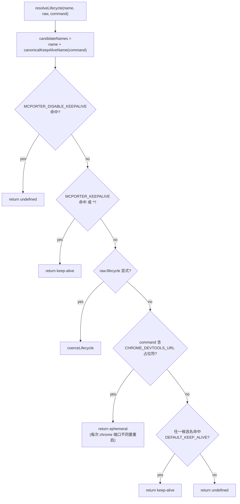
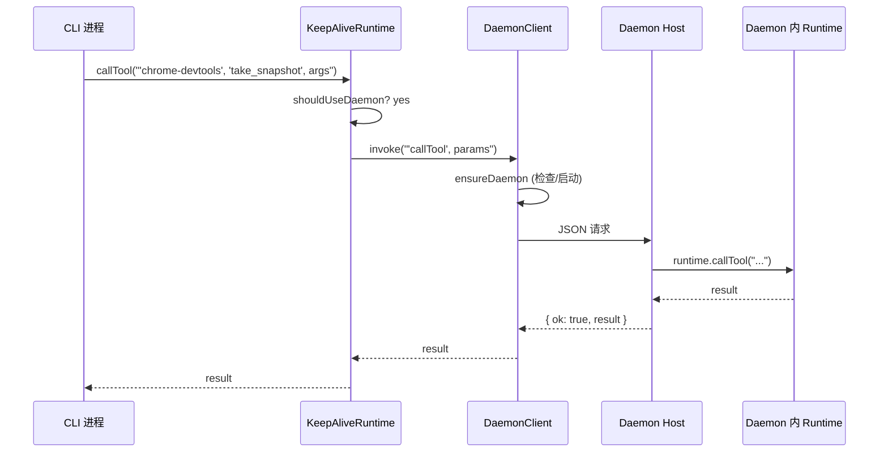
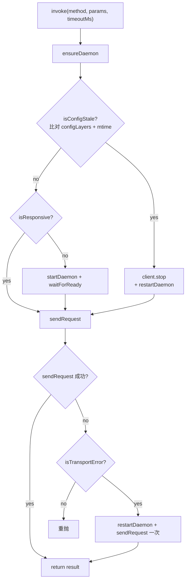
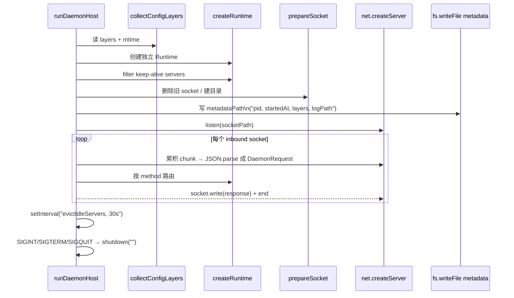
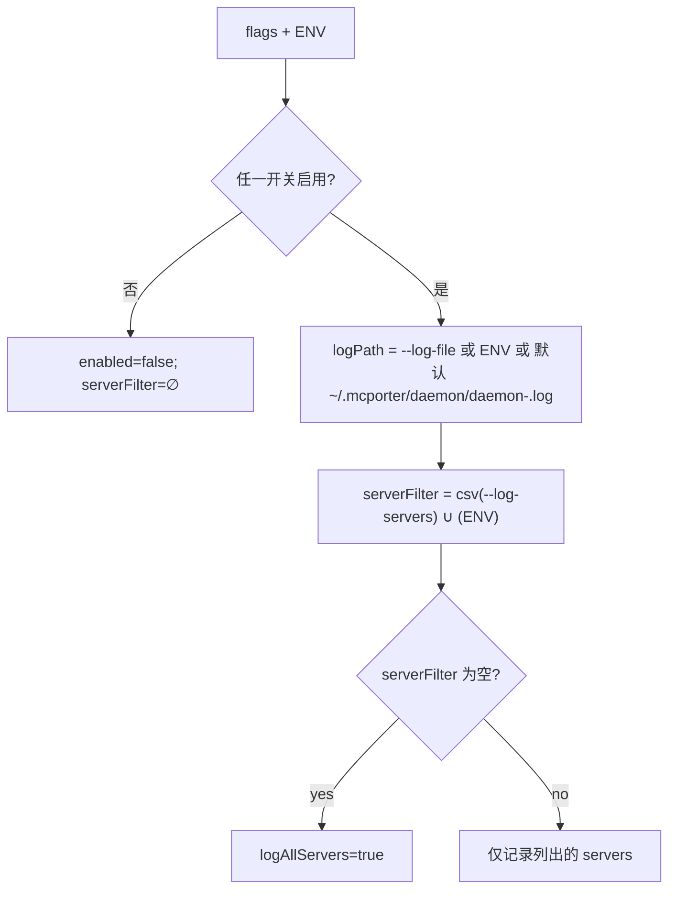

<details>
<summary>相关源文件</summary>

生成本页时使用的主要源文件：

- [src/daemon/host.ts](../../../project-repos/mcporter/src/daemon/host.ts)
- [src/daemon/client.ts](../../../project-repos/mcporter/src/daemon/client.ts)
- [src/daemon/runtime-wrapper.ts](../../../project-repos/mcporter/src/daemon/runtime-wrapper.ts)
- [src/daemon/protocol.ts](../../../project-repos/mcporter/src/daemon/protocol.ts)
- [src/daemon/launch.ts](../../../project-repos/mcporter/src/daemon/launch.ts)
- [src/daemon/paths.ts](../../../project-repos/mcporter/src/daemon/paths.ts)
- [src/daemon/config-layers.ts](../../../project-repos/mcporter/src/daemon/config-layers.ts)
- [src/daemon/log-context.ts](../../../project-repos/mcporter/src/daemon/log-context.ts)
- [src/daemon/request-utils.ts](../../../project-repos/mcporter/src/daemon/request-utils.ts)
- [src/lifecycle.ts](../../../project-repos/mcporter/src/lifecycle.ts)
- [src/cli/daemon-command.ts](../../../project-repos/mcporter/src/cli/daemon-command.ts)

</details>

# Keep-Alive 守护进程

某些 stdio MCP 服务器（chrome-devtools-mcp、@mobilenext/mobile-mcp、@playwright/mcp）维持着外部状态：浏览器/手机的连接会话。每次 `mcporter call` 都重新启动它们既慢又会丢上下文。Daemon 子系统的目标是**为这类服务器在后台跑一个共享 Runtime**，多个 CLI 进程共享同一份连接。本页讲清楚谁会被 daemon 接管、协议长什么样、宿主和客户端怎么协作。

## 哪些服务器会走 daemon

判定逻辑由 `lifecycle.ts` 决定（[src/lifecycle.ts:26-60]()）：



`DEFAULT_KEEP_ALIVE = {'chrome-devtools', 'mobile-mcp', 'playwright'}`（[src/lifecycle.ts:3]()）。`canonicalKeepAliveName` 通过扫描命令 token 是否包含 `chrome-devtools-mcp` / `@mobilenext/mobile-mcp` / `@playwright/mcp` 等 fragment 来归一名字（[src/lifecycle.ts:62-71]()）。这意味着即使你给 chrome-devtools 取了别名 `browser-debug`，只要命令里仍是 `npx -y chrome-devtools-mcp`，依然会被 daemon 管理。

`MCPORTER_KEEPALIVE` / `MCPORTER_DISABLE_KEEPALIVE`（或 `MCPORTER_NO_KEEPALIVE`）支持 csv 列表与 `*` 通配，让用户在不改配置的情况下临时拨开关。
Sources: [src/lifecycle.ts:1-138](../../../project-repos/mcporter/src/lifecycle.ts#L1-L138)

<details class="source-snippets">
<summary>引用源码</summary>

<!-- source-snippets:start -->

#### `src/lifecycle.ts:1-138`

```typescript
import type { CommandSpec, RawLifecycle, ServerDefinition, ServerLifecycle } from './config-schema.js';

const DEFAULT_KEEP_ALIVE = new Set(['chrome-devtools', 'mobile-mcp', 'playwright']);

const includeOverride = parseList(process.env.MCPORTER_KEEPALIVE);
const excludeOverride = parseList(process.env.MCPORTER_DISABLE_KEEPALIVE ?? process.env.MCPORTER_NO_KEEPALIVE);

interface OverrideSet {
  readonly all: boolean;
  readonly names: Set<string>;
}

interface CommandSignature {
  readonly label: string;
  readonly fragments: string[];
}

const KEEP_ALIVE_COMMANDS: CommandSignature[] = [
  { label: 'chrome-devtools', fragments: ['chrome-devtools-mcp'] },
  { label: 'mobile-mcp', fragments: ['@mobilenext/mobile-mcp', 'mobile-mcp'] },
  { label: 'playwright', fragments: ['@playwright/mcp', 'playwright/mcp'] },
];

const CHROME_DEVTOOLS_URL_PLACEHOLDERS = [String.raw`\${CHROME_DEVTOOLS_URL}`, '$env:CHROME_DEVTOOLS_URL'];

export function resolveLifecycle(
  name: string,
  rawLifecycle: RawLifecycle | undefined,
  command: CommandSpec
): ServerLifecycle | undefined {
  const normalizedName = name.toLowerCase();
  const canonicalName = canonicalKeepAliveName(command);
  const candidateNames = new Set<string>([normalizedName]);
  if (canonicalName) {
    candidateNames.add(canonicalName);
  }
  const forcedDisable = excludeOverride.all || matchesOverride(excludeOverride.names, candidateNames);
  const forcedEnable = includeOverride.all || matchesOverride(includeOverride.names, candidateNames);

  if (forcedEnable) {
    return { mode: 'keep-alive' };
  }
  if (forcedDisable) {
    return undefined;
  }

  const lifecycle = rawLifecycle ? coerceLifecycle(rawLifecycle) : undefined;
  if (lifecycle) {
    return lifecycle;
  }
  if (commandRequiresDynamicChromePort(command)) {
    // Each Chrome DevTools MCP instance is tied to a specific Chrome port. Opt out of keep-alive so
    // the runtime (and daemon) relaunches the bridge whenever CHROME_DEVTOOLS_URL changes.
    return { mode: 'ephemeral' };
  }
  if (Array.from(candidateNames).some((candidate) => DEFAULT_KEEP_ALIVE.has(candidate))) {
    return { mode: 'keep-alive' };
  }
  return undefined;
}

export function canonicalKeepAliveName(command: CommandSpec): string | undefined {
  if (command.kind !== 'stdio') {
    return undefined;
  }
  const tokens = [command.command, ...command.args].map((token) => token.toLowerCase());
  const match = KEEP_ALIVE_COMMANDS.find((signature) =>
    signature.fragments.some((fragment) => tokens.some((token) => token.includes(fragment)))
  );
  return match?.label;
}

function commandRequiresDynamicChromePort(command: CommandSpec): boolean {
  if (command.kind !== 'stdio') {
    return false;
  }
  const tokens = [command.command, ...command.args];
  return tokens.some((token) => CHROME_DEVTOOLS_URL_PLACEHOLDERS.some((placeholder) => token.includes(placeholder)));
}

function parseList(value: string | undefined): OverrideSet {
  if (!value) {
    return { all: false, names: new Set() };
  }
  const names = value
    .split(',')
    .map((token) => token.trim().toLowerCase())
    .filter((token) => token.length > 0);
  if (names.includes('*')) {
    return { all: true, names: new Set() };
  }
  return { all: false, names: new Set(names) };
}

function matchesOverride(names: Set<string>, candidates: Set<string>): boolean {
  for (const candidate of candidates) {
    if (names.has(candidate)) {
      return true;
    }
  }
  return false;
}

function coerceLifecycle(raw: RawLifecycle): ServerLifecycle | undefined {
  if (typeof raw === 'string') {
    if (raw === 'keep-alive') {
      return { mode: 'keep-alive' };
    }
    if (raw === 'ephemeral') {
      return { mode: 'ephemeral' };
    }
    return undefined;
  }
  if (raw.mode === 'keep-alive') {
    const timeout =
      typeof raw.idleTimeoutMs === 'number' && Number.isFinite(raw.idleTimeoutMs) && raw.idleTimeoutMs > 0
        ? Math.trunc(raw.idleTimeoutMs)
        : undefined;
    return timeout ? { mode: 'keep-alive', idleTimeoutMs: timeout } : { mode: 'keep-alive' };
  }
... snippet truncated ...
```

<!-- source-snippets:end -->
</details>
## 客户端：KeepAliveRuntime

`createKeepAliveRuntime(base, opts)` 在 [src/daemon/runtime-wrapper.ts:13-18]() 实现：

```ts
if (!opts.daemonClient || opts.keepAliveServers.size === 0) return base;
return new KeepAliveRuntime(base, opts.daemonClient, opts.keepAliveServers);
```

它实现了与 `Runtime` 完全一致的接口（[src/daemon/runtime-wrapper.ts:20-100]()）。决策点是 `shouldUseDaemon(server)`，仅 `keepAliveServers` 集合中的名字走 daemon，其它直接透传 `base`。



KeepAliveRuntime 还为"daemon 端 stdio 子进程崩溃"做了一次重试：`invokeWithRestart(server, op, action)`（[src/daemon/runtime-wrapper.ts:106-119]()）。判定是否要重启用 `shouldRestartDaemonServer`（[src/daemon/runtime-wrapper.ts:138-148]()）：仅 `McpError` 的 `InvalidRequest / MethodNotFound / InvalidParams` 三类视为业务错误不重启，其它一律 close + retry。重启过程被 `restartPromises` 去重，避免并发请求都触发重启。

`registerDefinition` 也被重写（[src/daemon/runtime-wrapper.ts:41-48]()）：动态加进来的 ephemeral server 如果 `isKeepAliveServer` 为真就会自动加入 `keepAliveServers` 集合，反之踢出。**注意**：当前实现里 ephemeral STDIO/HTTP 默认仍是 per-process 的（README 第 197-198 行 explicitly 说明了这一点）；只有 `chrome-devtools` 这类**命名对应**的 ephemeral 才会被识别。
Sources: [src/daemon/runtime-wrapper.ts:13-148](../../../project-repos/mcporter/src/daemon/runtime-wrapper.ts#L13-L148)

<details class="source-snippets">
<summary>引用源码</summary>

<!-- source-snippets:start -->

#### `src/daemon/runtime-wrapper.ts:13-148`

```typescript
export function createKeepAliveRuntime(base: Runtime, options: KeepAliveRuntimeOptions): Runtime {
  if (!options.daemonClient || options.keepAliveServers.size === 0) {
    return base;
  }
  return new KeepAliveRuntime(base, options.daemonClient, options.keepAliveServers);
}

class KeepAliveRuntime implements Runtime {
  private readonly restartPromises = new Map<string, Promise<void>>();

  constructor(
    private readonly base: Runtime,
    private readonly daemon: DaemonClient,
    private readonly keepAliveServers: Set<string>
  ) {}

  listServers(): string[] {
    return this.base.listServers();
  }

  getDefinitions(): ServerDefinition[] {
    return this.base.getDefinitions();
  }

  getDefinition(server: string): ServerDefinition {
    return this.base.getDefinition(server);
  }

  registerDefinition(definition: ServerDefinition, options?: { overwrite?: boolean }): void {
    this.base.registerDefinition(definition, options);
    if (isKeepAliveServer(definition)) {
      this.keepAliveServers.add(definition.name);
    } else {
      this.keepAliveServers.delete(definition.name);
    }
  }

  async listTools(server: string, options?: ListToolsOptions): Promise<Awaited<ReturnType<Runtime['listTools']>>> {
    if (this.shouldUseDaemon(server)) {
      return (await this.invokeWithRestart(server, 'listTools', () =>
        this.daemon.listTools({
          server,
          includeSchema: options?.includeSchema,
          autoAuthorize: options?.autoAuthorize,
        })
      )) as Awaited<ReturnType<Runtime['listTools']>>;
    }
    return this.base.listTools(server, options);
  }

  async callTool(server: string, toolName: string, options?: CallOptions): Promise<unknown> {
    if (this.shouldUseDaemon(server)) {
      return this.invokeWithRestart(server, 'callTool', () =>
        this.daemon.callTool({
          server,
          tool: toolName,
          args: options?.args,
          timeoutMs: options?.timeoutMs,
        })
      );
    }
    return this.base.callTool(server, toolName, options);
  }

  async listResources(server: string, options?: Partial<ListResourcesRequest['params']>): Promise<unknown> {
    if (this.shouldUseDaemon(server)) {
      return this.invokeWithRestart(server, 'listResources', () =>
        this.daemon.listResources({ server, params: options ?? {} })
      );
    }
    return this.base.listResources(server, options);
  }

  async connect(server: string): Promise<Awaited<ReturnType<Runtime['connect']>>> {
    return this.base.connect(server);
  }

  async close(server?: string): Promise<void> {
    if (!server) {
      await this.base.close();
      return;
    }
    if (this.shouldUseDaemon(server)) {
      await this.daemon.closeServer({ server }).catch(() => {});
      return;
    }
    await this.base.close(server);
  }

  private shouldUseDaemon(server: string): boolean {
    return this.keepAliveServers.has(server);
  }

  private async invokeWithRestart<T>(server: string, operation: string, action: () => Promise<T>): Promise<T> {
    try {
      return await action();
    } catch (error) {
      if (!shouldRestartDaemonServer(error)) {
        throw error;
      }
      // The daemon keeps STDIO transports warm; if a call fails due to a fatal error,
      // force-close the cached server so the retry launches a fresh Chrome instance.
      logDaemonRetry(server, operation, error);
      await this.restartServer(server);
      return action();
    }
  }

  private async restartServer(server: string): Promise<void> {
    const existing = this.restartPromises.get(server);
    if (existing) {
      await existing;
      return;
    }

    const restart = this.daemon.closeServer({ server }).catch(() => {});
    this.restartPromises.set(server, restart);
    try {
      await restart;
    } finally {
... snippet truncated ...
```

<!-- source-snippets:end -->
</details>
## DaemonClient

`DaemonClient`（[src/daemon/client.ts:52-271]()）是与 daemon 通信的入口。每个 `DaemonClient` 实例都绑定一组 `(socketPath, metadataPath)`，由 `resolveDaemonPaths(configPath)` 通过对 `configPath` 求 SHA-1 前 12 字符派生（[src/daemon/client.ts:43-50](), [src/daemon/client.ts:273-276]()）。**这意味着不同的主 config 路径对应不同的 daemon 实例**——切换 `--config` 不会污染默认 daemon。

`invoke(method, params, timeoutMs)` 的核心流程（[src/daemon/client.ts:101-112]()）：



几个关键点：

- **socket 等价 IPC**：`net.createConnection(socketPath)`，写入一段 JSON 即可。响应也是 JSON（[src/daemon/client.ts:199-269]()）。
- **超时**：`MCPORTER_DAEMON_TIMEOUT_MS` 控制单次请求超时（默认 30s）；`callTool` 路径还会把 caller 的 `timeoutMs` 透传（[src/daemon/client.ts:63-65]()），让长任务（如 GPT-5 Pro tool call）不被默认 30s kill。
- **transport 错误判定**：`ECONNREFUSED / ENOENT / ETIMEDOUT / ECONNRESET` 视为可重试（[src/daemon/client.ts:278-284]()），其它错误（业务/MCP）原样上抛。
- **配置 staleness**：`isConfigStale` 把当前 config layer 的 path + mtime 与 daemon 启动时记录的对比（[src/daemon/client.ts:177-197](), [src/daemon/config-layers.ts]()）。任一文件 mtime 变了或 layer 数量不同 → 判定 stale → stop & restart。这让用户改完 `~/.cursor/mcp.json` 后下一次调用就拿到新定义。

`launchDaemonDetached`（[src/daemon/launch.ts:13-37]()）：

```ts
spawn(process.execPath, [...execArgv, cliEntry, ...configArgs, ...rootArgs, 'daemon', 'start', '--foreground'], {
  detached: true,
  stdio: 'ignore',
  env: { ...process.env, MCPORTER_DAEMON_CHILD: '1', MCPORTER_DAEMON_SOCKET, MCPORTER_DAEMON_METADATA },
});
child.unref();
```

`MCPORTER_DAEMON_CHILD=1` 让被派生的进程在 `handleDaemonStart` 里直接进入 `--foreground` 路径（[src/cli/daemon-command.ts:78-110]()），不会再次尝试启动子进程。Bun 编译产物的 argv[1] 是 `/$bunfs/...` 虚路径，`launch.ts` 显式跳过这一段以避免子进程参数解析错乱（[src/daemon/launch.ts:46-50]()）。

Sources: [src/daemon/client.ts:52-350](../../../project-repos/mcporter/src/daemon/client.ts#L52-L350), [src/daemon/launch.ts:1-52](../../../project-repos/mcporter/src/daemon/launch.ts#L1-L52)

<details class="source-snippets">
<summary>引用源码</summary>

<!-- source-snippets:start -->

#### `src/daemon/client.ts:52-350`

```typescript
export class DaemonClient {
  private readonly socketPath: string;
  private readonly metadataPath: string;
  private startingPromise: Promise<void> | null = null;

  constructor(private readonly options: DaemonClientOptions) {
    const paths = resolveDaemonPaths(options.configPath);
    this.socketPath = paths.socketPath;
    this.metadataPath = paths.metadataPath;
  }

  async callTool(params: CallToolParams): Promise<unknown> {
    return this.invoke('callTool', params, params.timeoutMs);
  }

  async listTools(params: ListToolsParams): Promise<unknown> {
    return this.invoke('listTools', params);
  }

  async listResources(params: ListResourcesParams): Promise<unknown> {
    return this.invoke('listResources', params);
  }

  async closeServer(params: CloseServerParams): Promise<void> {
    await this.invoke('closeServer', params);
  }

  async status(): Promise<StatusResult | null> {
    try {
      return (await this.sendRequest<StatusResult>('status', {})) as StatusResult;
    } catch (error) {
      if (isTransportError(error)) {
        return null;
      }
      throw error;
    }
  }

  async stop(): Promise<void> {
    try {
      await this.sendRequest('stop', {});
    } catch (error) {
      if (isTransportError(error)) {
        return;
      }
      throw error;
    }
  }

  private async invoke<T = unknown>(method: DaemonRequestMethod, params: unknown, timeoutMs?: number): Promise<T> {
    await this.ensureDaemon();
    try {
      return (await this.sendRequest<T>(method, params, timeoutMs)) as T;
    } catch (error) {
      if (isTransportError(error)) {
        await this.restartDaemon();
        return (await this.sendRequest<T>(method, params, timeoutMs)) as T;
      }
      throw error;
    }
  }

  private async ensureDaemon(): Promise<void> {
    if (await this.isConfigStale()) {
      await this.stop().catch(() => {});
      await this.restartDaemon();
      return;
    }
    const available = await this.isResponsive();
    if (available) {
      return;
    }
    await this.startDaemon();
    await this.waitForReady();
  }

  private async restartDaemon(): Promise<void> {
    await this.startDaemon();
    await this.waitForReady();
  }

  private async startDaemon(): Promise<void> {
    if (this.startingPromise) {
      await this.startingPromise;
      return;
    }
    this.startingPromise = Promise.resolve()
      .then(() => {
        launchDaemonDetached({
          configPath: this.options.configPath,
          configExplicit: this.options.configExplicit,
          rootDir: this.options.rootDir,
          metadataPath: this.metadataPath,
          socketPath: this.socketPath,
        });
      })
      .finally(() => {
        this.startingPromise = null;
      });
    await this.startingPromise;
  }

  private async waitForReady(): Promise<void> {
    const deadline = Date.now() + 10_000;
    while (Date.now() < deadline) {
      if (await this.isResponsive()) {
        return;
      }
      await delay(100);
    }
    throw new Error('Timeout while waiting for MCPorter daemon to start.');
  }

  private async isResponsive(): Promise<boolean> {
    try {
      await this.sendRequest('status', {});
      return true;
    } catch (error) {
      if (isTransportError(error)) {
        return false;
... snippet truncated ...
```

#### `src/daemon/launch.ts:1-52`

```typescript
import { spawn } from 'node:child_process';
import path from 'node:path';

export interface DaemonLaunchOptions {
  readonly configPath: string;
  readonly configExplicit?: boolean;
  readonly rootDir?: string;
  readonly socketPath: string;
  readonly metadataPath: string;
  readonly extraArgs?: string[];
}

export function launchDaemonDetached(options: DaemonLaunchOptions): void {
  const cliEntry = resolveCliEntry();
  const configArgs = options.configExplicit ? ['--config', options.configPath] : [];
  const args = [
    ...process.execArgv,
    ...(cliEntry ? [cliEntry] : []),
    ...configArgs,
    ...(options.rootDir ? ['--root', options.rootDir] : []),
    'daemon',
    'start',
    '--foreground',
    ...(options.extraArgs ?? []),
  ];
  const child = spawn(process.execPath, args, {
    detached: true,
    stdio: 'ignore',
    env: {
      ...process.env,
      MCPORTER_DAEMON_CHILD: '1',
      MCPORTER_DAEMON_SOCKET: options.socketPath,
      MCPORTER_DAEMON_METADATA: options.metadataPath,
    },
  });
  child.unref();
}

function resolveCliEntry(): string | undefined {
  const entry = process.argv[1];
  if (!entry) {
    throw new Error('Unable to resolve mcporter entry script.');
  }
  // In Bun compiled binaries, argv[1] is a virtual /$bunfs/... path that Bun
  // auto-injects into every spawned child.  Including it explicitly would
  // duplicate it and break CLI argument parsing in the child process.
  if (entry.startsWith('/$bunfs/')) {
    return undefined;
  }
  return path.resolve(entry);
}
```

<!-- source-snippets:end -->
</details>
## Daemon 协议

定义在 [src/daemon/protocol.ts:1-58]()：

```ts
type DaemonRequestMethod = 'callTool' | 'listTools' | 'listResources' | 'closeServer' | 'status' | 'stop';

interface DaemonRequest { id: string; method: ...; params: ...; }
interface DaemonResponse { id; ok: boolean; result?; error?: { message; code? }; }

interface CallToolParams { server; tool; args?; timeoutMs?; }
interface ListToolsParams { server; includeSchema?; autoAuthorize?; }
interface ListResourcesParams { server; params?; }
interface CloseServerParams { server; }
interface StatusResult {
  pid; startedAt; configPath;
  configMtimeMs?, configLayers?: [{path, mtimeMs}];
  socketPath; logPath?;
  servers: [{ name; connected; lastUsedAt? }];
}
```

每个请求只有一行 JSON、写完 socket 后等 server `socket.end()`。这种"一次一连接"协议设计对调试友好但不适合高频小请求；好在 keep-alive 服务器单次 call 的频率本来就低，权衡可接受。
Sources: [src/daemon/protocol.ts:1-58](../../../project-repos/mcporter/src/daemon/protocol.ts#L1-L58)

<details class="source-snippets">
<summary>引用源码</summary>

<!-- source-snippets:start -->

#### `src/daemon/protocol.ts:1-58`

```typescript
export type DaemonRequestMethod = 'callTool' | 'listTools' | 'listResources' | 'closeServer' | 'status' | 'stop';

export interface DaemonRequest<T extends DaemonRequestMethod = DaemonRequestMethod, P = unknown> {
  readonly id: string;
  readonly method: T;
  readonly params: P;
}

export interface DaemonResponse<T = unknown> {
  readonly id: string;
  readonly ok: boolean;
  readonly result?: T;
  readonly error?: {
    readonly message: string;
    readonly code?: string;
  };
}

export interface CallToolParams {
  readonly server: string;
  readonly tool: string;
  readonly args?: Record<string, unknown>;
  readonly timeoutMs?: number;
}

export interface ListToolsParams {
  readonly server: string;
  readonly includeSchema?: boolean;
  readonly autoAuthorize?: boolean;
}

export interface ListResourcesParams {
  readonly server: string;
  readonly params?: Record<string, unknown>;
}

export interface CloseServerParams {
  readonly server: string;
}

export interface StatusResult {
  readonly pid: number;
  readonly startedAt: number;
  readonly configPath: string;
  readonly configMtimeMs?: number | null;
  readonly configLayers?: Array<{
    readonly path: string;
    readonly mtimeMs: number | null;
  }>;
  readonly socketPath: string;
  readonly logPath?: string;
  readonly servers: Array<{
    readonly name: string;
    readonly connected: boolean;
    readonly lastUsedAt?: number;
  }>;
}
```

<!-- source-snippets:end -->
</details>
## Daemon Host 主循环

`runDaemonHost(options)`（[src/daemon/host.ts:44-194]()）启动后做的事：



请求处理 `processRequest`（[src/daemon/host.ts:261-436]()）按 method 分支：

| method | 行为 | 副作用 |
|--------|------|--------|
| `callTool` | `runtime.callTool(server, tool, { args, timeoutMs })` | `markActivity` 更新 `lastUsedAt` |
| `listTools` | `runtime.listTools(server, { includeSchema, autoAuthorize })` | `markActivity` |
| `listResources` | `runtime.listResources(server, params)` | `markActivity` |
| `closeServer` | `runtime.close(server)` | activity = `{connected: false}` |
| `status` | 不调用 runtime，组装 `StatusResult` | — |
| `stop` | `shouldShutdown = true`，由调用者关 socket 后再走 `shutdown()` | 整个 host 退出 |

每个分支前先调 `ensureManaged` 校验该 server 在 `managedServers` 集合中（避免代码外部偷偷 daemonize 普通 server）。错误统一被 catch 后 `buildErrorResponse(id, 'runtime_error', error)`，保证 socket 一定有响应（[src/daemon/request-utils.ts:52-67]()）。
Sources: [src/daemon/host.ts:44-436](../../../project-repos/mcporter/src/daemon/host.ts#L44-L436), [src/daemon/request-utils.ts:11-50](../../../project-repos/mcporter/src/daemon/request-utils.ts#L11-L50)

<details class="source-snippets">
<summary>引用源码</summary>

<!-- source-snippets:start -->

#### `src/daemon/host.ts:44-436`

```typescript
export async function runDaemonHost(options: DaemonHostOptions): Promise<void> {
  const configLayers = await collectConfigLayers({
    configPath: options.configExplicit ? options.configPath : undefined,
    rootDir: options.rootDir,
  });
  const runtime = await createRuntime({
    configPath: options.configExplicit ? options.configPath : undefined,
    rootDir: options.rootDir,
  });
  const keepAliveDefinitions = runtime.getDefinitions().filter(isKeepAliveServer);
  if (keepAliveDefinitions.length === 0) {
    throw new Error('No MCP servers require keep-alive; daemon will not start.');
  }
  const managedServers = new Map<string, ServerDefinition>();
  for (const definition of keepAliveDefinitions) {
    managedServers.set(definition.name, definition);
  }
  const serverLoggingOverrides = new Set<string>();
  for (const definition of keepAliveDefinitions) {
    if (definition.logging?.daemon?.enabled) {
      serverLoggingOverrides.add(definition.name);
    }
  }
  const combinedServerLogs = new Set<string>([
    ...serverLoggingOverrides,
    ...(options.logServers ? Array.from(options.logServers) : []),
  ]);
  const logContext = createLogContext({
    enabled: Boolean(options.logPath),
    logAllServers: options.logAllServers ?? false,
    servers: combinedServerLogs,
    logPath: options.logPath,
  });

  await prepareSocket(options.socketPath);
  await fs.mkdir(path.dirname(options.metadataPath), { recursive: true });
  const configMtimeMs = await statConfigMtime(options.configPath);

  const activity = new Map<string, ServerActivity>();
  for (const definition of keepAliveDefinitions) {
    activity.set(definition.name, { connected: false });
  }

  const idleWatcher = setInterval(() => {
    void evictIdleServers(runtime, managedServers, activity);
  }, 30_000);
  idleWatcher.unref();

  logEvent(logContext, 'Daemon host started.');

  const startedAt = Date.now();
  const server = net.createServer({ allowHalfOpen: true }, (socket) => {
    socket.setEncoding('utf8');
    let buffer = '';
    let handled = false;
    const tryHandle = () => {
      if (handled) {
        return;
      }
      const trimmed = buffer.trim();
      if (trimmed.length === 0) {
        return;
      }
      // Attempt to parse immediately; if it parses, handle the request now.
      let parsedRequest: DaemonRequest;
      try {
        parsedRequest = JSON.parse(trimmed) as DaemonRequest;
      } catch {
        // Not a complete JSON yet; wait for more data or 'end'
        return;
      }
      handled = true;
      void handleSocketRequest(
        trimmed,
        socket,
        runtime,
        managedServers,
        activity,
        {
          configPath: options.configPath,
          configLayers,
          socketPath: options.socketPath,
          startedAt,
          logPath: options.logPath ?? null,
          configMtimeMs,
        },
        logContext,
        shutdown,
        parsedRequest
      );
    };
    socket.on('data', (chunk) => {
      buffer += chunk;
      tryHandle();
    });
    socket.on('end', () => {
      // Fallback: if we haven't handled yet, try now (for compatibility)
      if (!handled) {
        tryHandle();
      }
    });
    socket.on('error', () => {
      socket.destroy();
    });
  });

  await new Promise<void>((resolve, reject) => {
    server.once('error', reject);
    server.listen(options.socketPath, () => {
      server.off('error', reject);
      resolve();
    });
  });

  await fs.writeFile(
    options.metadataPath,
    JSON.stringify(
      {
        pid: process.pid,
        socketPath: options.socketPath,
... snippet truncated ...
```

#### `src/daemon/request-utils.ts:11-50`

```typescript
export function ensureManaged(server: string, managedServers: Map<string, ServerDefinition>): void {
  if (!managedServers.has(server)) {
    throw new Error(`Server '${server}' is not managed by the daemon.`);
  }
}

export function markActivity(server: string, activity: Map<string, ServerActivity>): void {
  const entry = activity.get(server);
  if (entry) {
    entry.connected = true;
    entry.lastUsedAt = Date.now();
  } else {
    activity.set(server, { connected: true, lastUsedAt: Date.now() });
  }
}

export async function evictIdleServers(
  runtime: Runtime,
  managedServers: Map<string, ServerDefinition>,
  activity: Map<string, ServerActivity>
): Promise<void> {
  const now = Date.now();
  await Promise.all(
    Array.from(managedServers.entries()).map(async ([name, definition]) => {
      const timeout = keepAliveIdleTimeout(definition);
      if (!timeout) {
        return;
      }
      const entry = activity.get(name);
      if (!entry?.lastUsedAt) {
        return;
      }
      if (now - entry.lastUsedAt < timeout) {
        return;
      }
      await runtime.close(name).catch(() => {});
      activity.set(name, { connected: false });
    })
  );
}
```

<!-- source-snippets:end -->
</details>
### 空闲清理

`evictIdleServers`（[src/daemon/request-utils.ts:27-50]()）每 30s 跑一次：

- 仅对 `lifecycle.idleTimeoutMs` 显式设置过的 keep-alive server 生效（默认值不会触发）。
- `now - lastUsedAt >= timeout` → `runtime.close(name)` 释放对应 stdio 子进程，`activity` 标记 disconnected。

这让用户可以为某些"经常用又不希望长占内存"的 server 配置 `lifecycle: { mode: 'keep-alive', idleTimeoutMs: 600000 }`，daemon 在闲置 10min 后自动收回。
Sources: [src/daemon/request-utils.ts:27-50](../../../project-repos/mcporter/src/daemon/request-utils.ts#L27-L50)

<details class="source-snippets">
<summary>引用源码</summary>

<!-- source-snippets:start -->

#### `src/daemon/request-utils.ts:27-50`

```typescript
export async function evictIdleServers(
  runtime: Runtime,
  managedServers: Map<string, ServerDefinition>,
  activity: Map<string, ServerActivity>
): Promise<void> {
  const now = Date.now();
  await Promise.all(
    Array.from(managedServers.entries()).map(async ([name, definition]) => {
      const timeout = keepAliveIdleTimeout(definition);
      if (!timeout) {
        return;
      }
      const entry = activity.get(name);
      if (!entry?.lastUsedAt) {
        return;
      }
      if (now - entry.lastUsedAt < timeout) {
        return;
      }
      await runtime.close(name).catch(() => {});
      activity.set(name, { connected: false });
    })
  );
}
```

<!-- source-snippets:end -->
</details>
## 路径布局

| 文件 | 默认位置 | 用途 |
|------|----------|------|
| socket | `~/.mcporter/daemon/daemon-<key>.sock`（Unix）<br>`\\.\pipe\mcporter-daemon-<key>`（Windows） | IPC 端点 |
| metadata | `~/.mcporter/daemon/daemon-<key>.json` | 含 `pid/startedAt/configLayers/socketPath/logPath` |
| log | `~/.mcporter/daemon/daemon-<key>.log` | `--log` 启用时的 stdout/stderr 流 |

`<key>` 是 `sha1(absolute(configPath)).slice(0, 12)`。`MCPORTER_DAEMON_DIR` 可以整体覆盖 base 目录（[src/daemon/paths.ts:1-15]()）。
Sources: [src/daemon/paths.ts:1-35](../../../project-repos/mcporter/src/daemon/paths.ts#L1-L35)

<details class="source-snippets">
<summary>引用源码</summary>

<!-- source-snippets:start -->

#### `src/daemon/paths.ts:1-35`

```typescript
import os from 'node:os';
import path from 'node:path';
import { expandHome } from '../env.js';

function resolveBaseDir(): string {
  const override = process.env.MCPORTER_DAEMON_DIR;
  if (override && override.trim().length > 0) {
    return path.resolve(expandHome(override.trim()));
  }
  return path.join(os.homedir(), '.mcporter');
}

function ensureRunDir(): string {
  return path.join(resolveBaseDir(), 'daemon');
}

export function getDaemonMetadataPath(configKey: string): string {
  return path.join(ensureRunDir(), `daemon-${configKey}.json`);
}

export function getDaemonSocketPath(configKey: string): string {
  const runDir = ensureRunDir();
  if (process.platform === 'win32') {
    return `\\\\.\\pipe\\mcporter-daemon-${configKey}`;
  }
  return path.join(runDir, `daemon-${configKey}.sock`);
}

export function getDaemonLogPath(configKey: string): string {
  return path.join(ensureRunDir(), `daemon-${configKey}.log`);
}

export function getDaemonDir(): string {
  return ensureRunDir();
}
```

<!-- source-snippets:end -->
</details>
## 日志策略

`--log` / `--log-file` / `--log-servers` 三个 flag 共同决定 daemon 的日志行为，由 `resolveDaemonLoggingOptions` 解析（[src/cli/daemon-command.ts:220-249]()）。



`createLogContext` + `shouldLogServer` 在 host 主循环的每个分支前判断要不要 `logEvent`。配置中的 `logging.daemon.enabled = true` 会被自动并入 `serverFilter`（[src/daemon/host.ts:60-70]()），让用户在 server 定义里就能开关详细日志而无需 CLI flag。
Sources: [src/cli/daemon-command.ts:220-260](../../../project-repos/mcporter/src/cli/daemon-command.ts#L220-L260), [src/daemon/host.ts:60-95](../../../project-repos/mcporter/src/daemon/host.ts#L60-L95), [src/daemon/log-context.ts](../../../project-repos/mcporter/src/daemon/log-context.ts)

<details class="source-snippets">
<summary>引用源码</summary>

<!-- source-snippets:start -->

#### `src/cli/daemon-command.ts:220-260`

```typescript
async function resolveDaemonLoggingOptions(args: string[], configKey: string): Promise<DaemonLoggingOptions> {
  const logFlag = consumeFlag(args, '--log');
  const logFileValue = consumeValueFlag(args, '--log-file');
  const logServersValue = consumeValueFlag(args, '--log-servers');
  const envLogEnabled = process.env.MCPORTER_DAEMON_LOG === '1';
  const envLogPath = process.env.MCPORTER_DAEMON_LOG_PATH;
  const envLogServers = process.env.MCPORTER_DAEMON_LOG_SERVERS;
  const serverFilter = parseServerList(logServersValue ?? envLogServers);
  const explicitServerLogging = serverFilter.size > 0;
  const resolvedFileFlag = logFileValue ? path.resolve(expandHome(logFileValue)) : undefined;
  const resolvedEnvFile = envLogPath ? path.resolve(expandHome(envLogPath)) : undefined;
  const enabled =
    logFlag || Boolean(resolvedFileFlag) || envLogEnabled || Boolean(resolvedEnvFile) || explicitServerLogging;
  if (!enabled) {
    return {
      enabled: false,
      logPath: undefined,
      logAllServers: false,
      serverFilter,
    };
  }
  const logPath = resolvedFileFlag ?? resolvedEnvFile ?? getDaemonLogPath(configKey);
  await fsPromises.mkdir(path.dirname(logPath), { recursive: true });
  return {
    enabled: true,
    logPath,
    logAllServers: serverFilter.size === 0,
    serverFilter,
  };
}

function parseServerList(value: string | undefined): Set<string> {
  if (!value) {
    return new Set();
  }
  const entries = value
    .split(',')
    .map((entry) => entry.trim())
    .filter((entry) => entry.length > 0);
  return new Set(entries);
}
```

#### `src/daemon/host.ts:60-95`

```typescript
  }
  const serverLoggingOverrides = new Set<string>();
  for (const definition of keepAliveDefinitions) {
    if (definition.logging?.daemon?.enabled) {
      serverLoggingOverrides.add(definition.name);
    }
  }
  const combinedServerLogs = new Set<string>([
    ...serverLoggingOverrides,
    ...(options.logServers ? Array.from(options.logServers) : []),
  ]);
  const logContext = createLogContext({
    enabled: Boolean(options.logPath),
    logAllServers: options.logAllServers ?? false,
    servers: combinedServerLogs,
    logPath: options.logPath,
  });

  await prepareSocket(options.socketPath);
  await fs.mkdir(path.dirname(options.metadataPath), { recursive: true });
  const configMtimeMs = await statConfigMtime(options.configPath);

  const activity = new Map<string, ServerActivity>();
  for (const definition of keepAliveDefinitions) {
    activity.set(definition.name, { connected: false });
  }

  const idleWatcher = setInterval(() => {
    void evictIdleServers(runtime, managedServers, activity);
  }, 30_000);
  idleWatcher.unref();

  logEvent(logContext, 'Daemon host started.');

  const startedAt = Date.now();
  const server = net.createServer({ allowHalfOpen: true }, (socket) => {
```

#### `src/daemon/log-context.ts`

```typescript
import fsSync from 'node:fs';
import path from 'node:path';

export interface LogContext {
  enabled: boolean;
  logAllServers: boolean;
  servers: Set<string>;
  writer?: fsSync.WriteStream;
}

export function createLogContext(options: {
  enabled: boolean;
  logAllServers: boolean;
  servers: Set<string>;
  logPath?: string;
}): LogContext {
  const derivedEnabled = options.enabled || options.logAllServers || options.servers.size > 0;
  const context: LogContext = {
    enabled: derivedEnabled,
    logAllServers: options.logAllServers,
    servers: options.servers,
  };
  if (derivedEnabled && options.logPath) {
    try {
      fsSync.mkdirSync(path.dirname(options.logPath), { recursive: true });
      context.writer = fsSync.createWriteStream(options.logPath, {
        flags: 'a',
      });
    } catch (error) {
      console.warn(`[daemon] Failed to open log file ${options.logPath}: ${(error as Error).message}`);
    }
  }
  return context;
}

export function logEvent(context: LogContext, message: string): void {
  if (!context.enabled) {
    return;
  }
  const line = `[daemon] ${new Date().toISOString()} ${message}`;
  console.log(line);
  try {
    context.writer?.write(`${line}\n`);
  } catch {
    // ignore file write failures
  }
}

export async function disposeLogContext(context: LogContext): Promise<void> {
  const writer = context.writer;
  if (!writer) {
    return;
  }
  await new Promise<void>((resolve) => {
    writer.end(() => resolve());
    writer.on('error', () => resolve());
  });
}

export function shouldLogServer(context: LogContext, server: string): boolean {
  if (!context.enabled) {
    return false;
  }
  if (context.logAllServers) {
    return true;
  }
  return context.servers.has(server);
}

export function formatError(error: unknown): string {
  if (error instanceof Error) {
    return error.message;
  }
  if (typeof error === 'string') {
    return error;
  }
  return 'unknown';
}
```

<!-- source-snippets:end -->
</details>
## CLI 入口（再看一遍）

`mcporter daemon start/stop/status/restart` 在 [src/cli/daemon-command.ts:26-138]() 的逻辑：

- `start` → `handleDaemonStart`：先 `createRuntime` 看一遍是否真的有 keep-alive server（避免空 daemon 启动），有的话按 `--foreground` 决定是直接 `runDaemonHost` 还是 `launchDaemonDetached`。
- `stop` → `client.stop()`：发 `stop` 请求，宿主收到后 ack 再退出。
- `status` → `client.status()`：拉 `StatusResult` 并列每个 server 的状态。
- `restart` → `stop` + `waitFor(...)` + `start`：先确认 daemon 真的退干净（`status` 返回 null）再启动新的。

CLI 启动 daemon 之外，**普通 `mcporter call` 也会自动启动**：[src/cli.ts:113-128]() 在创建 `KeepAliveRuntime` 时就会构造 `DaemonClient`，第一次需要时通过 `ensureDaemon()` 自启。
Sources: [src/cli/daemon-command.ts:26-178](../../../project-repos/mcporter/src/cli/daemon-command.ts#L26-L178), [src/cli.ts:113-128](../../../project-repos/mcporter/src/cli.ts#L113-L128)

<details class="source-snippets">
<summary>引用源码</summary>

<!-- source-snippets:start -->

#### `src/cli/daemon-command.ts:26-178`

```typescript
export async function handleDaemonCli(args: string[], options: DaemonCliOptions): Promise<void> {
  const subcommand = args.shift();
  if (!subcommand || subcommand === 'help' || subcommand === '--help') {
    printDaemonHelp();
    return;
  }

  const client = new DaemonClient({
    configPath: options.configPath,
    configExplicit: options.configExplicit,
    rootDir: options.rootDir,
  });

  if (subcommand === 'start') {
    await handleDaemonStart(args, options, client);
    return;
  }
  if (subcommand === 'status') {
    await handleDaemonStatus(client);
    return;
  }
  if (subcommand === 'stop') {
    await client.stop();
    console.log('Daemon stopped (if it was running).');
    return;
  }
  if (subcommand === 'restart') {
    await handleDaemonRestart(args, options, client);
    return;
  }

  throw new Error(`Unknown daemon subcommand '${subcommand}'.`);
}

function printDaemonHelp(): void {
  console.log(`Usage: mcporter daemon <start|status|stop|restart>

Commands:
  start    Start the keep-alive daemon (auto-detects keep-alive servers).
  status   Show whether the daemon is running and which servers are active.
  stop     Shut down the daemon and all managed servers.
  restart  Stop the daemon (if running) and start a fresh instance.

Flags:
  --foreground        Run the daemon in the current process (debug only).
  --log               Enable daemon logging (defaults to ~/.mcporter/daemon/daemon-<hash>.log).
  --log-file <path>   Write daemon stdout/stderr to a specific log file.
  --log-servers <csv> Only log call activity for the listed servers (implies --log).`);
}

async function handleDaemonStart(args: string[], options: DaemonCliOptions, client: DaemonClient): Promise<void> {
  const foregroundFlag = consumeFlag(args, '--foreground');
  const isChildLaunch = process.env.MCPORTER_DAEMON_CHILD === '1';
  const foreground = foregroundFlag || isChildLaunch;

  const paths = resolveDaemonPaths(options.configPath);
  const socketPath = process.env.MCPORTER_DAEMON_SOCKET ?? paths.socketPath;
  const metadataPath = process.env.MCPORTER_DAEMON_METADATA ?? paths.metadataPath;
  const logging = await resolveDaemonLoggingOptions(args, paths.key);

  const runtime = await createRuntime({
    configPath: options.configExplicit ? options.configPath : undefined,
    rootDir: options.rootDir,
  });
  const keepAlive = runtime.getDefinitions().filter(isKeepAliveServer);
  await runtime.close().catch(() => {});
  if (keepAlive.length === 0) {
    console.log('No MCP servers are configured for keep-alive; daemon not started.');
    return;
  }

  if (foreground) {
    await runDaemonHost({
      socketPath,
      metadataPath,
      configPath: options.configPath,
      configExplicit: options.configExplicit,
      rootDir: options.rootDir,
      logPath: logging.enabled ? logging.logPath : undefined,
      logServers: logging.serverFilter,
      logAllServers: logging.logAllServers,
    });
    return;
  }

  const existing = await client.status();
  if (existing) {
    console.log(`Daemon already running (pid ${existing.pid}).`);
    return;
  }

  const forwardedArgs: string[] = [];
  if (logging.enabled && logging.logPath) {
    forwardedArgs.push('--log-file', logging.logPath);
  }
  if (logging.serverFilter.size > 0) {
    forwardedArgs.push('--log-servers', Array.from(logging.serverFilter).join(','));
  }

  launchDaemonDetached({
    configPath: options.configPath,
    configExplicit: options.configExplicit,
    rootDir: options.rootDir,
    metadataPath,
    socketPath,
    extraArgs: forwardedArgs,
  });
  const ready = await waitFor(() => client.status(), 10_000, 100);
  if (!ready) {
    throw new Error('Failed to start daemon before timeout expired.');
  }
  console.log(`Daemon started for ${keepAlive.length} server(s).`);
}

async function handleDaemonRestart(args: string[], options: DaemonCliOptions, client: DaemonClient): Promise<void> {
  await client.stop();
  console.log('Daemon stopped (if it was running).');

  const stopped = await waitFor(
    async () => {
... snippet truncated ...
```

#### `src/cli.ts:113-128`

```typescript
  const baseRuntime = await createRuntime(runtimeOptionsWithPath);
  const keepAliveServers = new Set(
    baseRuntime
      .getDefinitions()
      .filter(isKeepAliveServer)
      .map((entry) => entry.name)
  );
  const daemonClient =
    keepAliveServers.size > 0
      ? new DaemonClient({
          configPath: configResolution.path,
          configExplicit: configResolution.explicit,
          rootDir: rootOverride,
        })
      : null;
  const runtime = createKeepAliveRuntime(baseRuntime, { daemonClient, keepAliveServers });
```

<!-- source-snippets:end -->
</details>
## 设计取舍

- **shared runtime in daemon**：daemon 内部的 `Runtime` 与 CLI 进程的 `Runtime` 是不同实例，但**共享同一份 stdio 子进程**——chrome 浏览器、mobile-mcp 的设备会话等只活在 daemon 里，多个 agent 共用。
- **per-config-key daemon**：socket 名按 config 路径派生。这样 monorepo 里多个项目并行用 mcporter 不会相互踩；但同一台机器上重复 daemon 是允许的（每个项目一个）。
- **daemon 不感知 OAuth**：keep-alive 默认名单都是 stdio 服务器（chrome-devtools / mobile-mcp / playwright），其 OAuth 需求要么不存在要么由它们自己的 oauthCommand 流程承担。HTTP MCP 走 OAuth 时仍由 CLI 进程处理，不上 daemon。
- **stale 检查 ≠ hot reload**：daemon 不监听 inotify，stale 检查只在每次客户端请求时发生。用户改完配置必须再发一次请求才会看到 daemon 重启。
- **failure → restart 不无限重试**：`invokeWithRestart` 只重试一次，避免 daemon 崩溃陷入死循环。第二次失败原样上抛，由 CLI 翻译成可读错误。

Sources: [src/daemon/host.ts:44-194](../../../project-repos/mcporter/src/daemon/host.ts#L44-L194), [src/daemon/client.ts:43-50](../../../project-repos/mcporter/src/daemon/client.ts#L43-L50), [src/daemon/runtime-wrapper.ts:106-119](../../../project-repos/mcporter/src/daemon/runtime-wrapper.ts#L106-L119)

<details class="source-snippets">
<summary>引用源码</summary>

<!-- source-snippets:start -->

#### `src/daemon/host.ts:44-194`

```typescript
export async function runDaemonHost(options: DaemonHostOptions): Promise<void> {
  const configLayers = await collectConfigLayers({
    configPath: options.configExplicit ? options.configPath : undefined,
    rootDir: options.rootDir,
  });
  const runtime = await createRuntime({
    configPath: options.configExplicit ? options.configPath : undefined,
    rootDir: options.rootDir,
  });
  const keepAliveDefinitions = runtime.getDefinitions().filter(isKeepAliveServer);
  if (keepAliveDefinitions.length === 0) {
    throw new Error('No MCP servers require keep-alive; daemon will not start.');
  }
  const managedServers = new Map<string, ServerDefinition>();
  for (const definition of keepAliveDefinitions) {
    managedServers.set(definition.name, definition);
  }
  const serverLoggingOverrides = new Set<string>();
  for (const definition of keepAliveDefinitions) {
    if (definition.logging?.daemon?.enabled) {
      serverLoggingOverrides.add(definition.name);
    }
  }
  const combinedServerLogs = new Set<string>([
    ...serverLoggingOverrides,
    ...(options.logServers ? Array.from(options.logServers) : []),
  ]);
  const logContext = createLogContext({
    enabled: Boolean(options.logPath),
    logAllServers: options.logAllServers ?? false,
    servers: combinedServerLogs,
    logPath: options.logPath,
  });

  await prepareSocket(options.socketPath);
  await fs.mkdir(path.dirname(options.metadataPath), { recursive: true });
  const configMtimeMs = await statConfigMtime(options.configPath);

  const activity = new Map<string, ServerActivity>();
  for (const definition of keepAliveDefinitions) {
    activity.set(definition.name, { connected: false });
  }

  const idleWatcher = setInterval(() => {
    void evictIdleServers(runtime, managedServers, activity);
  }, 30_000);
  idleWatcher.unref();

  logEvent(logContext, 'Daemon host started.');

  const startedAt = Date.now();
  const server = net.createServer({ allowHalfOpen: true }, (socket) => {
    socket.setEncoding('utf8');
    let buffer = '';
    let handled = false;
    const tryHandle = () => {
      if (handled) {
        return;
      }
      const trimmed = buffer.trim();
      if (trimmed.length === 0) {
        return;
      }
      // Attempt to parse immediately; if it parses, handle the request now.
      let parsedRequest: DaemonRequest;
      try {
        parsedRequest = JSON.parse(trimmed) as DaemonRequest;
      } catch {
        // Not a complete JSON yet; wait for more data or 'end'
        return;
      }
      handled = true;
      void handleSocketRequest(
        trimmed,
        socket,
        runtime,
        managedServers,
        activity,
        {
          configPath: options.configPath,
          configLayers,
          socketPath: options.socketPath,
          startedAt,
          logPath: options.logPath ?? null,
          configMtimeMs,
        },
        logContext,
        shutdown,
        parsedRequest
      );
    };
    socket.on('data', (chunk) => {
      buffer += chunk;
      tryHandle();
    });
    socket.on('end', () => {
      // Fallback: if we haven't handled yet, try now (for compatibility)
      if (!handled) {
        tryHandle();
      }
    });
    socket.on('error', () => {
      socket.destroy();
    });
  });

  await new Promise<void>((resolve, reject) => {
    server.once('error', reject);
    server.listen(options.socketPath, () => {
      server.off('error', reject);
      resolve();
    });
  });

  await fs.writeFile(
    options.metadataPath,
    JSON.stringify(
      {
        pid: process.pid,
        socketPath: options.socketPath,
... snippet truncated ...
```

#### `src/daemon/client.ts:43-50`

```typescript
export function resolveDaemonPaths(configPath: string): DaemonPaths {
  const key = deriveConfigKey(configPath);
  return {
    key,
    socketPath: getDaemonSocketPath(key),
    metadataPath: getDaemonMetadataPath(key),
  };
}
```

#### `src/daemon/runtime-wrapper.ts:106-119`

```typescript
  private async invokeWithRestart<T>(server: string, operation: string, action: () => Promise<T>): Promise<T> {
    try {
      return await action();
    } catch (error) {
      if (!shouldRestartDaemonServer(error)) {
        throw error;
      }
      // The daemon keeps STDIO transports warm; if a call fails due to a fatal error,
      // force-close the cached server so the retry launches a fresh Chrome instance.
      logDaemonRetry(server, operation, error);
      await this.restartServer(server);
      return action();
    }
  }
```

<!-- source-snippets:end -->
</details>
## 相关页面

- [运行时与传输层](runtime-transport.md)
- [系统架构](system-architecture.md)
- [CLI 命令体系](cli-commands.md)
