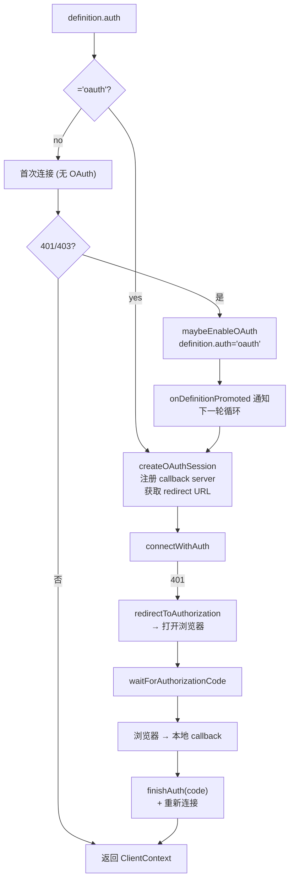
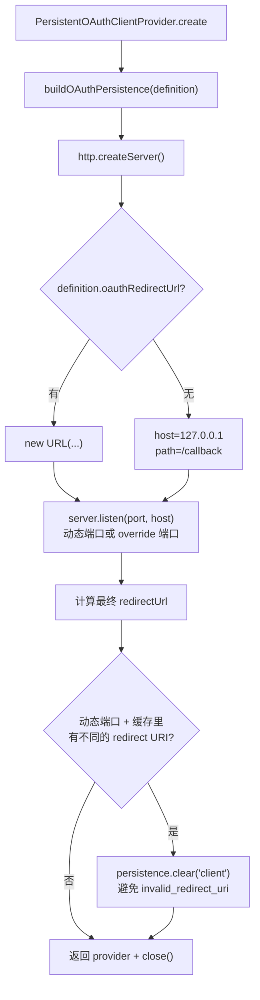
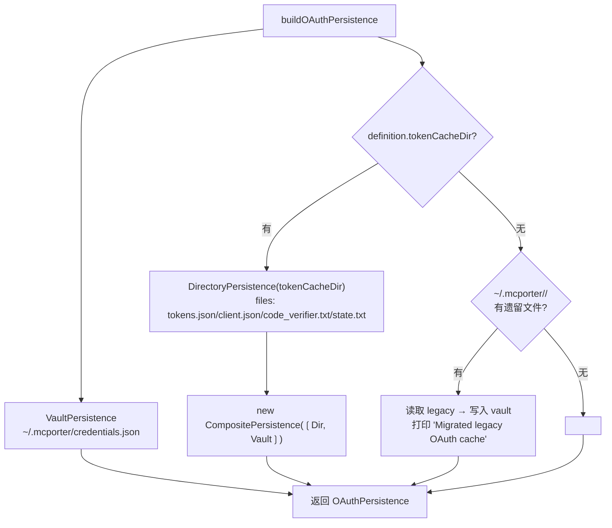

<details>
<summary>相关源文件</summary>

生成本页时使用的主要源文件：

- [src/oauth.ts](../../../project-repos/mcporter/src/oauth.ts)
- [src/oauth-persistence.ts](../../../project-repos/mcporter/src/oauth-persistence.ts)
- [src/oauth-vault.ts](../../../project-repos/mcporter/src/oauth-vault.ts)
- [src/runtime/oauth.ts](../../../project-repos/mcporter/src/runtime/oauth.ts)
- [src/runtime-oauth-support.ts](../../../project-repos/mcporter/src/runtime-oauth-support.ts)
- [src/runtime-header-utils.ts](../../../project-repos/mcporter/src/runtime-header-utils.ts)
- [src/runtime/transport.ts](../../../project-repos/mcporter/src/runtime/transport.ts)
- [src/cli/auth-command.ts](../../../project-repos/mcporter/src/cli/auth-command.ts)
- [src/cli/config/auth.ts](../../../project-repos/mcporter/src/cli/config/auth.ts)

</details>

# OAuth 流程与凭证仓库

mcporter 同时支持两种 OAuth 形态：

1. **HTTP MCP（OAuth 2.0 Authorization Code + PKCE）** — 由 SDK `OAuthClientProvider` 负责，mcporter 实现 `PersistentOAuthClientProvider` 把客户端注册、PKCE verifier、tokens、state 与 callback 服务器绑定到一起。
2. **stdio MCP 自带 OAuth 子命令** — 用 `oauthCommand.args` 描述（如 gmail：`['auth', 'http://localhost:3000/oauth2callback']`），由 mcporter 派生子进程并 `stdio: 'inherit'` 让用户看着浏览器流程走完。

本页拆解 HTTP OAuth 的提供者类、本地回调 server、持久化策略、如何与 transport 协同，以及 CLI 端 `auth` / `config login|logout` 的入口。

## 何时触发 OAuth

`runtime/transport.ts` 的 `attemptHttpClientContext`（[src/runtime/transport.ts:241-296]()）在两种情况下创建 `OAuthSession`：

- `definition.auth === 'oauth'` 显式声明，第一次连接前就建 session。
- 初次连接收到 401/403（被 `isUnauthorizedError` 识别），调用 `maybeEnableOAuth(definition, logger)` 把 `definition.auth = 'oauth'` 写回（[src/runtime-oauth-support.ts:5-19]()），然后下一轮 `retryHttpTransportWithFallback` 循环创建 session。这是 README 提到的 "auto-promote to OAuth" 行为，特别处理了 Supabase / Vercel 这类要求登录的远端。



Sources: [src/runtime/transport.ts:241-296](../../../project-repos/mcporter/src/runtime/transport.ts#L241-L296), [src/runtime-oauth-support.ts:5-24](../../../project-repos/mcporter/src/runtime-oauth-support.ts#L5-L24), [src/runtime/oauth.ts:79-123](../../../project-repos/mcporter/src/runtime/oauth.ts#L79-L123)

<details class="source-snippets">
<summary>引用源码</summary>

<!-- source-snippets:start -->

#### `src/runtime/transport.ts:241-296`

```typescript
async function attemptHttpClientContext(
  client: Client,
  activeDefinition: ServerDefinition,
  logger: Logger,
  options: CreateClientContextOptions
): Promise<HttpClientContextAttempt> {
  const command = activeDefinition.command;
  if (command.kind !== 'http') {
    throw new Error(`Server '${activeDefinition.name}' is not configured for HTTP transport.`);
  }
  let oauthSession: OAuthSession | undefined;
  const shouldEstablishOAuth = activeDefinition.auth === 'oauth' && options.maxOAuthAttempts !== 0;
  if (shouldEstablishOAuth) {
    oauthSession = await createOAuthSession(activeDefinition, logger);
  }
  const transportOptions = createHttpTransportOptions(activeDefinition, oauthSession, shouldEstablishOAuth);

  try {
    const context = await connectPrimaryHttpTransport(
      client,
      activeDefinition,
      command,
      transportOptions,
      oauthSession,
      logger,
      options
    );
    return { context };
  } catch (primaryError) {
    if (shouldAbortSseFallback(primaryError)) {
      await closeOAuthSession(oauthSession);
      throw primaryError;
    }
    if (isUnauthorizedError(primaryError)) {
      await closeOAuthSession(oauthSession);
      const promoted = maybePromoteHttpDefinition(activeDefinition, logger, options);
      if (promoted) {
        return { nextDefinition: promoted };
      }
      oauthSession = undefined;
    }
    if (primaryError instanceof Error) {
      logger.info(`Falling back to SSE transport for '${activeDefinition.name}': ${primaryError.message}`);
    }
    return {
      context: await connectSseFallbackTransport(
        client,
        activeDefinition,
        command,
        transportOptions,
        oauthSession,
        logger,
        options
      ),
    };
  }
```

#### `src/runtime-oauth-support.ts:5-24`

```typescript
export function maybeEnableOAuth(definition: ServerDefinition, logger: Logger): ServerDefinition | undefined {
  if (definition.auth === 'oauth') {
    return undefined;
  }
  if (definition.command.kind !== 'http') {
    return undefined;
  }
  // Allow OAuth promotion for any HTTP server that returns 401,
  // not just ad-hoc servers (fixes issue #38)
  logger.info(`Detected OAuth requirement for '${definition.name}'. Launching browser flow...`);
  return {
    ...definition,
    auth: 'oauth',
  };
}

export function isUnauthorizedError(error: unknown): boolean {
  const issue = analyzeConnectionError(error);
  return issue.kind === 'auth';
}
```

#### `src/runtime/oauth.ts:79-123`

```typescript
export async function connectWithAuth(
  client: Client,
  transport: OAuthCapableTransport,
  session: OAuthSession | undefined,
  logger: Logger,
  options: ConnectWithAuthOptions = {}
): Promise<OAuthCapableTransport> {
  const { serverName, maxAttempts = 3, oauthTimeoutMs = DEFAULT_OAUTH_CODE_TIMEOUT_MS, recreateTransport } = options;
  const state: OAuthConnectState = {
    activeTransport: transport,
    attempt: 0,
    hasCompletedAuthFlow: false,
  };

  while (true) {
    try {
      return await attemptTransportConnect(client, state);
    } catch (error) {
      const unauthorized = isUnauthorizedError(error);
      if (!shouldRetryAuthorization(state, unauthorized, session)) {
        await closeReplacementTransport(transport, state.activeTransport);
        throw state.hasCompletedAuthFlow && !unauthorized ? markPostAuthConnectError(error) : error;
      }
      state.attempt += 1;
      if (state.attempt > maxAttempts) {
        await closeReplacementTransport(transport, state.activeTransport);
        throw state.hasCompletedAuthFlow ? markPostAuthConnectError(error) : error;
      }
      logger.warn(`OAuth authorization required for '${serverName ?? 'unknown'}'. Waiting for browser approval...`);
      try {
        state.activeTransport = await completeAuthorizationChallenge(state.activeTransport, session, logger, error, {
          serverName,
          oauthTimeoutMs,
          recreateTransport,
        });
        state.hasCompletedAuthFlow = true;
        logger.info('Authorization code accepted. Retrying connection...');
      } catch (authError) {
        logger.error('OAuth authorization failed while waiting for callback.', authError);
        await closeReplacementTransport(transport, state.activeTransport);
        throw markOAuthFlowError(authError);
      }
    }
  }
}
```

<!-- source-snippets:end -->
</details>
## PersistentOAuthClientProvider

`PersistentOAuthClientProvider` 在 [src/oauth.ts:64-307]() 实现 `OAuthClientProvider` 接口。`create(definition, logger)` 静态构造器（[src/oauth.ts:96-167]()）做的事比类名暗示的多：



为什么要在动态端口下清理 client cache？因为 OAuth server 端会校验 `redirect_uri` 与注册时一致；端口变了就要重新走 dynamic client registration。`oauthRedirectUrl` 显式设置时这一步跳过，便于走 reverse proxy 等固定回调的环境。
Sources: [src/oauth.ts:96-167](../../../project-repos/mcporter/src/oauth.ts#L96-L167)

<details class="source-snippets">
<summary>引用源码</summary>

<!-- source-snippets:start -->

#### `src/oauth.ts:96-167`

```typescript
  static async create(
    definition: ServerDefinition,
    logger: OAuthLogger
  ): Promise<{
    provider: PersistentOAuthClientProvider;
    close: () => Promise<void>;
  }> {
    const persistence = await buildOAuthPersistence(definition, logger);

    const server = http.createServer();
    const overrideRedirect = definition.oauthRedirectUrl ? new URL(definition.oauthRedirectUrl) : null;
    const listenHost = overrideRedirect?.hostname ?? CALLBACK_HOST;
    const overridePort = overrideRedirect?.port ?? '';
    const usesDynamicPort = !overrideRedirect || overridePort === '' || overridePort === '0';
    const desiredPort = usesDynamicPort ? undefined : Number.parseInt(overridePort, 10);
    const callbackPath =
      overrideRedirect?.pathname && overrideRedirect.pathname !== '/' ? overrideRedirect.pathname : CALLBACK_PATH;
    const port = await new Promise<number>((resolve, reject) => {
      server.listen(desiredPort ?? 0, listenHost, () => {
        const address = server.address();
        if (typeof address === 'object' && address && 'port' in address) {
          resolve(address.port);
        } else {
          reject(new Error('Failed to determine callback port'));
        }
      });
      server.once('error', (error) => reject(error));
    });

    const redirectUrl = overrideRedirect
      ? new URL(overrideRedirect.toString())
      : new URL(`http://${listenHost}:${port}${callbackPath}`);
    if (usesDynamicPort) {
      redirectUrl.port = String(port);
    }
    if (!overrideRedirect || overrideRedirect.pathname === '/' || overrideRedirect.pathname === '') {
      redirectUrl.pathname = callbackPath;
    }

    // When using a dynamic port, the redirect URI changes every run.  If a
    // previous client registration is cached with a different redirect URI the
    // auth server will reject the request with `invalid_redirect_uri`.  Clear
    // the stale registration so the next flow re-registers with the new URI.
    // Wrapped in try/catch so persistence errors (malformed JSON, permission
    // issues) close the already-bound callback server instead of leaking it.
    if (usesDynamicPort) {
      try {
        const cachedClient = await persistence.readClientInfo();
        const cachedRedirect = firstRedirectUri(cachedClient);
        if (cachedRedirect && cachedRedirect !== redirectUrl.toString()) {
          logger.info(
            `Redirect URI changed (${cachedRedirect} → ${redirectUrl.toString()}); clearing stale client registration.`
          );
          await persistence.clear('client');
        }
      } catch (error) {
        await new Promise<void>((resolve) => {
          server.close(() => resolve());
        });
        throw error;
      }
    }

    const provider = new PersistentOAuthClientProvider(definition, persistence, redirectUrl, logger);
    provider.attachServer(server);
    return {
      provider,
      close: async () => {
        await provider.close();
      },
    };
  }
```

<!-- source-snippets:end -->
</details>
### `clientMetadata` / `state` / 授权码

`PersistentOAuthClientProvider` 实现的 `OAuthClientProvider` 关键方法：

| 方法 | 行为 |
|------|------|
| `clientMetadata` | 提供 `client_name`（默认 `mcporter (<name>)`，可覆盖）、`redirect_uris=[redirectUrl]`、`grant_types=['authorization_code', 'refresh_token']`、`response_types=['code']`、`token_endpoint_auth_method='none'`；`scope` 仅在 `oauthScope` 显式时传，避免硬编码 `'mcp:tools'` 把 Granola 这类自定义 scope 服务器搞炸（[src/oauth.ts:81-93]()） |
| `state()` | 优先复用 persistence 已存的 state，否则生成 `randomUUID` 并落盘 |
| `clientInformation` / `saveClientInformation` | 透传 persistence |
| `tokens` / `saveTokens` | 同上；`saveTokens` 后会 logger.info `Saved OAuth tokens for X (...)` |
| `redirectToAuthorization(url)` | `ensureAuthorizationDeferred()` 创建 deferred，调 `__oauthInternals.openExternal(url.toString())` 打开浏览器；同时打印 `If the browser did not open, visit ... manually.` |
| `saveCodeVerifier` / `codeVerifier` | PKCE verifier 持久化与读取 |
| `invalidateCredentials(scope)` | 把 `client/tokens/verifier/state/all` 中的某一类清掉 |
| `waitForAuthorizationCode` | 返回当前 deferred 的 promise，由 callback handler 在收到 code 后 resolve |

`attachServer(server)`（[src/oauth.ts:170-218]()）拦截每个 callback 请求：path 匹配 → 校验 `state` → resolve 或 reject deferred → HTML 响应 "Authorization successful / failed"。这一段 HTML 是面向终端用户的，文案足够说明该回到 CLI 看结果了。
Sources: [src/oauth.ts:64-307](../../../project-repos/mcporter/src/oauth.ts#L64-L307)

<details class="source-snippets">
<summary>引用源码</summary>

<!-- source-snippets:start -->

#### `src/oauth.ts:64-307`

```typescript
class PersistentOAuthClientProvider implements OAuthClientProvider {
  private readonly metadata: OAuthClientMetadata;
  private readonly logger: OAuthLogger;
  private readonly persistence: OAuthPersistence;
  private redirectUrlValue: URL;
  private authorizationDeferred: Deferred<string> | null = null;
  private server?: http.Server;

  private constructor(
    private readonly definition: ServerDefinition,
    persistence: OAuthPersistence,
    redirectUrl: URL,
    logger: OAuthLogger
  ) {
    this.redirectUrlValue = redirectUrl;
    this.logger = logger;
    this.persistence = persistence;
    this.metadata = {
      client_name: definition.clientName ?? `mcporter (${definition.name})`,
      redirect_uris: [this.redirectUrlValue.toString()],
      grant_types: ['authorization_code', 'refresh_token'],
      response_types: ['code'],
      token_endpoint_auth_method: 'none',
      // Omit scope so the MCP SDK can derive it from the server's metadata
      // (resource metadata scopes_supported or auth server scopes_supported).
      // Hardcoding 'mcp:tools' breaks providers like Granola whose auth server
      // does not recognise that scope value.
      // If oauthScope is explicitly configured, prefer that exact value.
      ...(definition.oauthScope !== undefined ? { scope: definition.oauthScope || undefined } : {}),
    };
  }

  static async create(
    definition: ServerDefinition,
    logger: OAuthLogger
  ): Promise<{
    provider: PersistentOAuthClientProvider;
    close: () => Promise<void>;
  }> {
    const persistence = await buildOAuthPersistence(definition, logger);

    const server = http.createServer();
    const overrideRedirect = definition.oauthRedirectUrl ? new URL(definition.oauthRedirectUrl) : null;
    const listenHost = overrideRedirect?.hostname ?? CALLBACK_HOST;
    const overridePort = overrideRedirect?.port ?? '';
    const usesDynamicPort = !overrideRedirect || overridePort === '' || overridePort === '0';
    const desiredPort = usesDynamicPort ? undefined : Number.parseInt(overridePort, 10);
    const callbackPath =
      overrideRedirect?.pathname && overrideRedirect.pathname !== '/' ? overrideRedirect.pathname : CALLBACK_PATH;
    const port = await new Promise<number>((resolve, reject) => {
      server.listen(desiredPort ?? 0, listenHost, () => {
        const address = server.address();
        if (typeof address === 'object' && address && 'port' in address) {
          resolve(address.port);
        } else {
          reject(new Error('Failed to determine callback port'));
        }
      });
      server.once('error', (error) => reject(error));
    });

    const redirectUrl = overrideRedirect
      ? new URL(overrideRedirect.toString())
      : new URL(`http://${listenHost}:${port}${callbackPath}`);
    if (usesDynamicPort) {
      redirectUrl.port = String(port);
    }
    if (!overrideRedirect || overrideRedirect.pathname === '/' || overrideRedirect.pathname === '') {
      redirectUrl.pathname = callbackPath;
    }

    // When using a dynamic port, the redirect URI changes every run.  If a
    // previous client registration is cached with a different redirect URI the
    // auth server will reject the request with `invalid_redirect_uri`.  Clear
    // the stale registration so the next flow re-registers with the new URI.
    // Wrapped in try/catch so persistence errors (malformed JSON, permission
    // issues) close the already-bound callback server instead of leaking it.
    if (usesDynamicPort) {
      try {
        const cachedClient = await persistence.readClientInfo();
        const cachedRedirect = firstRedirectUri(cachedClient);
        if (cachedRedirect && cachedRedirect !== redirectUrl.toString()) {
          logger.info(
            `Redirect URI changed (${cachedRedirect} → ${redirectUrl.toString()}); clearing stale client registration.`
          );
          await persistence.clear('client');
        }
      } catch (error) {
        await new Promise<void>((resolve) => {
          server.close(() => resolve());
        });
        throw error;
      }
    }

    const provider = new PersistentOAuthClientProvider(definition, persistence, redirectUrl, logger);
    provider.attachServer(server);
    return {
      provider,
      close: async () => {
        await provider.close();
      },
    };
  }

  // attachServer listens for the OAuth redirect and resolves/rejects the deferred code promise.
  private attachServer(server: http.Server) {
    this.server = server;
    server.on('request', async (req, res) => {
      try {
        const url = req.url ?? '';
        const parsed = new URL(url, this.redirectUrlValue);
        const expectedPath = this.redirectUrlValue.pathname || '/callback';
        if (parsed.pathname !== expectedPath) {
          res.statusCode = 404;
          res.end('Not found');
          return;
        }
        const code = parsed.searchParams.get('code');
        const error = parsed.searchParams.get('error');
... snippet truncated ...
```

<!-- source-snippets:end -->
</details>
### 跨平台浏览器打开

`openExternal(url, platform, launch)`（[src/oauth.ts:36-61]()）：

| 平台 | 命令 |
|------|------|
| `darwin` | `open <url>` |
| `win32` | `cmd /s /c start "" "<url>"`（`windowsVerbatimArguments: true` 保证 URL 中的 `&` 不被解释） |
| 其它 | `xdg-open <url>`，`error` 事件被静默处理（headless 服务器没有 xdg-open） |

`spawn` 都带 `detached: true` + `stdio: 'ignore'` + `child.unref()`，确保 mcporter 进程不会等浏览器子进程退出。这是 Windows OAuth URL 在 0.9.0 修过的关键 bug 之一。
Sources: [src/oauth.ts:36-61](../../../project-repos/mcporter/src/oauth.ts#L36-L61)

<details class="source-snippets">
<summary>引用源码</summary>

<!-- source-snippets:start -->

#### `src/oauth.ts:36-61`

```typescript
function openExternal(url: string, platform: NodeJS.Platform = process.platform, launch: typeof spawn = spawn) {
  const stdio = 'ignore';
  try {
    if (platform === 'darwin') {
      const child = launch('open', [url], { stdio, detached: true });
      child.unref();
    } else if (platform === 'win32') {
      const child = launch('cmd', ['/s', '/c', `start "" "${url}"`], {
        stdio,
        detached: true,
        windowsVerbatimArguments: true,
      });
      child.unref();
    } else {
      try {
        const child = launch('xdg-open', [url], { stdio, detached: true });
        child.on('error', () => {}); // swallow ENOENT on headless servers
        child.unref();
      } catch {
        // headless server — no browser available
      }
    }
  } catch {
    // best-effort: fall back to printing URL
  }
}
```

<!-- source-snippets:end -->
</details>
## 持久化分层

`buildOAuthPersistence(definition, logger)` 在 [src/oauth-persistence.ts:233-267]() 创建一个分层 persistence：



三种实现（[src/oauth-persistence.ts:25-231]()）：

| 类 | 描述 | 默认场景 |
|----|------|----------|
| `DirectoryPersistence` | 把 4 类工件写在用户配置的目录里 | 只在 `tokenCacheDir` 显式存在时使用 |
| `VaultPersistence` | 全部塞进单个 `credentials.json` 的 `entries[<key>]`，`<key>` 由 `name + sha256(server descriptor).slice(0,16)` 派生 | 默认存储 |
| `CompositePersistence` | "读优先 dir，写两边都写" | 当用户既配 `tokenCacheDir` 又允许 vault 时 |

VaultEntry 包含 `serverName/serverUrl/tokens/clientInfo/codeVerifier/state/updatedAt`（[src/oauth-vault.ts:11-19]()）。`vaultKeyForDefinition` 用 server name + 描述（含 URL 或 stdio command/args）的 sha256 派生 key（[src/oauth-vault.ts:57-68]()），这意味着即使两个 server 同名但 URL 不同，凭证也不会串。
Sources: [src/oauth-persistence.ts:25-267](../../../project-repos/mcporter/src/oauth-persistence.ts#L25-L267), [src/oauth-vault.ts:1-120](../../../project-repos/mcporter/src/oauth-vault.ts#L1-L120)

<details class="source-snippets">
<summary>引用源码</summary>

<!-- source-snippets:start -->

#### `src/oauth-persistence.ts:25-267`

```typescript
class DirectoryPersistence implements OAuthPersistence {
  private readonly tokenPath: string;
  private readonly clientInfoPath: string;
  private readonly codeVerifierPath: string;
  private readonly statePath: string;

  constructor(
    private readonly root: string,
    private readonly logger?: Logger
  ) {
    this.tokenPath = path.join(root, 'tokens.json');
    this.clientInfoPath = path.join(root, 'client.json');
    this.codeVerifierPath = path.join(root, 'code_verifier.txt');
    this.statePath = path.join(root, 'state.txt');
  }

  describe(): string {
    return this.root;
  }

  private async ensureDir() {
    await fs.mkdir(this.root, { recursive: true });
  }

  async readTokens(): Promise<OAuthTokens | undefined> {
    return readJsonFile<OAuthTokens>(this.tokenPath);
  }

  async saveTokens(tokens: OAuthTokens): Promise<void> {
    await this.ensureDir();
    await writeJsonFile(this.tokenPath, tokens);
    this.logger?.debug?.(`Saved tokens to ${this.tokenPath}`);
  }

  async readClientInfo(): Promise<OAuthClientInformationMixed | undefined> {
    return readJsonFile<OAuthClientInformationMixed>(this.clientInfoPath);
  }

  async saveClientInfo(info: OAuthClientInformationMixed): Promise<void> {
    await this.ensureDir();
    await writeJsonFile(this.clientInfoPath, info);
  }

  async readCodeVerifier(): Promise<string | undefined> {
    try {
      return (await fs.readFile(this.codeVerifierPath, 'utf8')).trim();
    } catch (error) {
      if ((error as NodeJS.ErrnoException).code === 'ENOENT') {
        return undefined;
      }
      throw error;
    }
  }

  async saveCodeVerifier(value: string): Promise<void> {
    await this.ensureDir();
    await fs.writeFile(this.codeVerifierPath, value, 'utf8');
  }

  async readState(): Promise<string | undefined> {
    return readJsonFile<string>(this.statePath);
  }

  async saveState(value: string): Promise<void> {
    await this.ensureDir();
    await writeJsonFile(this.statePath, value);
  }

  async clear(scope: OAuthClearScope): Promise<void> {
    const files: string[] = [];
    if (scope === 'all' || scope === 'tokens') {
      files.push(this.tokenPath);
    }
    if (scope === 'all' || scope === 'client') {
      files.push(this.clientInfoPath);
    }
    if (scope === 'all' || scope === 'verifier') {
      files.push(this.codeVerifierPath);
    }
    if (scope === 'all' || scope === 'state') {
      files.push(this.statePath);
    }
    await Promise.all(
      files.map(async (file) => {
        try {
          await fs.unlink(file);
        } catch (error) {
          if ((error as NodeJS.ErrnoException).code !== 'ENOENT') {
            throw error;
          }
        }
      })
    );
  }
}

class VaultPersistence implements OAuthPersistence {
  constructor(private readonly definition: ServerDefinition) {}

  describe(): string {
    return '~/.mcporter/credentials.json (vault)';
  }

  async readTokens(): Promise<OAuthTokens | undefined> {
    return (await loadVaultEntry(this.definition))?.tokens;
  }

  async saveTokens(tokens: OAuthTokens): Promise<void> {
    await saveVaultEntry(this.definition, { tokens });
  }

  async readClientInfo(): Promise<OAuthClientInformationMixed | undefined> {
    return (await loadVaultEntry(this.definition))?.clientInfo;
  }

  async saveClientInfo(info: OAuthClientInformationMixed): Promise<void> {
    await saveVaultEntry(this.definition, { clientInfo: info });
  }

  async readCodeVerifier(): Promise<string | undefined> {
... snippet truncated ...
```

#### `src/oauth-vault.ts:1-120`

```typescript
import crypto from 'node:crypto';
import fs from 'node:fs/promises';
import os from 'node:os';
import path from 'node:path';
import type { OAuthClientInformationMixed, OAuthTokens } from '@modelcontextprotocol/sdk/shared/auth.js';
import type { ServerDefinition } from './config.js';
import { readJsonFile, writeJsonFile } from './fs-json.js';

type VaultKey = string;

export interface VaultEntry {
  serverName: string;
  serverUrl?: string;
  tokens?: OAuthTokens;
  clientInfo?: OAuthClientInformationMixed;
  codeVerifier?: string;
  state?: string;
  updatedAt: string;
}

interface VaultFile {
  version: 1;
  entries: Record<VaultKey, VaultEntry>;
}

function vaultPath(): string {
  return path.join(os.homedir(), '.mcporter', 'credentials.json');
}

async function readVault(): Promise<VaultFile> {
  let shouldRewrite = false;
  try {
    const existing = await readJsonFile<VaultFile>(vaultPath());
    if (existing && existing.version === 1 && existing.entries && typeof existing.entries === 'object') {
      return existing;
    }
    // Unexpected shape; rewrite.
    shouldRewrite = true;
  } catch {
    // Corrupt or unreadable vault; reset to empty.
    shouldRewrite = true;
  }
  const empty: VaultFile = { version: 1, entries: {} };
  if (shouldRewrite) {
    await writeVault(empty);
  }
  return empty;
}

async function writeVault(contents: VaultFile): Promise<void> {
  const filePath = vaultPath();
  const dir = path.dirname(filePath);
  await fs.mkdir(dir, { recursive: true });
  await writeJsonFile(filePath, contents);
}

export function vaultKeyForDefinition(definition: ServerDefinition): VaultKey {
  const descriptor = {
    name: definition.name,
    url: definition.command.kind === 'http' ? definition.command.url.toString() : null,
    command:
      definition.command.kind === 'stdio'
        ? { command: definition.command.command, args: definition.command.args ?? [] }
        : null,
  };
  const hash = crypto.createHash('sha256').update(JSON.stringify(descriptor)).digest('hex').slice(0, 16);
  return `${definition.name}|${hash}`;
}

export async function loadVaultEntry(definition: ServerDefinition): Promise<VaultEntry | undefined> {
  const vault = await readVault();
  return vault.entries[vaultKeyForDefinition(definition)];
}

export async function saveVaultEntry(definition: ServerDefinition, patch: Partial<VaultEntry>): Promise<void> {
  const vault = await readVault();
  const key = vaultKeyForDefinition(definition);
  const current = vault.entries[key] ?? {
    serverName: definition.name,
    serverUrl: definition.command.kind === 'http' ? definition.command.url.toString() : undefined,
    updatedAt: new Date().toISOString(),
  };
  vault.entries[key] = {
    ...current,
    ...patch,
    updatedAt: new Date().toISOString(),
  };
  await writeVault(vault);
}

export async function clearVaultEntry(
  definition: ServerDefinition,
  scope: 'all' | 'tokens' | 'client' | 'verifier' | 'state'
): Promise<void> {
  const vault = await readVault();
  const key = vaultKeyForDefinition(definition);
  const existing = vault.entries[key];
  if (!existing) {
    return;
  }
  if (scope === 'all') {
    delete vault.entries[key];
  } else {
    const updated: VaultEntry = { ...existing };
    if (scope === 'tokens') {
      delete updated.tokens;
    }
    if (scope === 'client') {
      delete updated.clientInfo;
    }
    if (scope === 'verifier') {
      delete updated.codeVerifier;
    }
    if (scope === 'state') {
      delete updated.state;
    }
    updated.updatedAt = new Date().toISOString();
    vault.entries[key] = updated;
  }
  await writeVault(vault);
```

<!-- source-snippets:end -->
</details>
### 缓存 token 直接注入（fast-path）

`applyCachedOAuthHeaderIfAvailable`（[src/runtime/transport.ts:151-187]()）在 OAuth 流程之前先尝试一次"fast-path"：如果 vault/dir 里已经有 `access_token`，且 definition headers 里没有 Authorization，就**临时 clone 一份 definition**，把 `Authorization: Bearer ${cached}` 注入头里。如果服务器接受 → 直接 200，没必要建 callback server。如果服务器 401 → 走完整 OAuth 流程刷 token。

`readCachedAccessToken`（[src/oauth-persistence.ts:306-316]()）的实现就是 `buildOAuthPersistence().readTokens()` 然后看 `access_token` 字符串是否非空，简单且对 token TTL 不做判断——把刷新交给 SDK / 服务器。

这一行为只在 `allowCachedAuth: true` 时启用。`mcporter list` 默认 `allowCachedAuth: true` 让健康检查更快；`mcporter auth` / `mcporter call` 不开。
Sources: [src/runtime/transport.ts:151-187](../../../project-repos/mcporter/src/runtime/transport.ts#L151-L187), [src/oauth-persistence.ts:306-316](../../../project-repos/mcporter/src/oauth-persistence.ts#L306-L316), [src/runtime.ts:155-164](../../../project-repos/mcporter/src/runtime.ts#L155-L164)

<details class="source-snippets">
<summary>引用源码</summary>

<!-- source-snippets:start -->

#### `src/runtime/transport.ts:151-187`

```typescript
async function applyCachedOAuthHeaderIfAvailable(
  definition: ServerDefinition,
  logger: Logger,
  allowCachedAuth: boolean | undefined
): Promise<ServerDefinition> {
  if (!allowCachedAuth || definition.auth !== 'oauth' || definition.command.kind !== 'http') {
    return definition;
  }
  try {
    const cached = await readCachedAccessToken(definition, logger);
    if (!cached) {
      return definition;
    }
    const existingHeaders = definition.command.headers ?? {};
    if ('Authorization' in existingHeaders) {
      return definition;
    }
    logger.debug?.(`Using cached OAuth access token for '${definition.name}' (non-interactive).`);
    return {
      ...definition,
      command: {
        ...definition.command,
        headers: {
          ...existingHeaders,
          Authorization: `Bearer ${cached}`,
        },
      },
    };
  } catch (error) {
    logger.debug?.(
      `Failed to read cached OAuth token for '${definition.name}': ${
        error instanceof Error ? error.message : String(error)
      }`
    );
    return definition;
  }
}
```

#### `src/oauth-persistence.ts:306-316`

```typescript
export async function readCachedAccessToken(
  definition: ServerDefinition,
  logger?: Logger
): Promise<string | undefined> {
  const persistence = await buildOAuthPersistence(definition, logger);
  const tokens = await persistence.readTokens();
  if (tokens && typeof tokens.access_token === 'string' && tokens.access_token.trim().length > 0) {
    return tokens.access_token;
  }
  return undefined;
}
```

#### `src/runtime.ts:155-164`

```typescript
  // listTools queries tool metadata and optionally includes schemas when requested.
  async listTools(server: string, options: ListToolsOptions = {}): Promise<ServerToolInfo[]> {
    // Toggle auto authorization so list can run without forcing OAuth flows.
    const autoAuthorize = options.autoAuthorize !== false;
    const context = await this.connect(server, {
      maxOAuthAttempts: autoAuthorize ? undefined : 0,
      skipCache: !autoAuthorize,
      allowCachedAuth: options.allowCachedAuth,
    });
    try {
```

<!-- source-snippets:end -->
</details>
## OAuth header 物化

HTTP 头里支持 `${VAR}` / `$env:VAR` 占位符，每次请求前由 `materializeHeaders` 解析（[src/runtime-header-utils.ts:4-23]()）。OAuth 启用时 `removeAuthorizationHeader` 把任何静态 Authorization 头去掉，由 SDK 自己注入 token（[src/runtime/transport.ts:85-95]()）；没启用 OAuth 时静态头保留，包括 `bearerToken` / `bearerTokenEnv` 在 normalize 阶段写入的 `Authorization: Bearer $env:NAME`。
Sources: [src/runtime-header-utils.ts:1-23](../../../project-repos/mcporter/src/runtime-header-utils.ts#L1-L23), [src/runtime/transport.ts:85-112](../../../project-repos/mcporter/src/runtime/transport.ts#L85-L112)

<details class="source-snippets">
<summary>引用源码</summary>

<!-- source-snippets:start -->

#### `src/runtime-header-utils.ts:1-23`

```typescript
import { resolveEnvPlaceholders } from './env.js';

// materializeHeaders resolves environment placeholders in server header definitions.
export function materializeHeaders(
  headers: Record<string, string> | undefined,
  serverName: string
): Record<string, string> | undefined {
  if (!headers) {
    return undefined;
  }

  const resolved: Record<string, string> = {};
  for (const [key, value] of Object.entries(headers)) {
    try {
      resolved[key] = resolveEnvPlaceholders(value);
    } catch (error) {
      const message = error instanceof Error ? error.message : String(error);
      throw new Error(`Failed to resolve header '${key}' for server '${serverName}': ${message}`, { cause: error });
    }
  }

  return resolved;
}
```

#### `src/runtime/transport.ts:85-112`

```typescript
function removeAuthorizationHeader(headers: Record<string, string> | undefined): Record<string, string> | undefined {
  if (!headers) {
    return undefined;
  }
  for (const key of Object.keys(headers)) {
    if (key.toLowerCase() === 'authorization') {
      delete headers[key];
    }
  }
  return Object.keys(headers).length > 0 ? headers : undefined;
}

function createHttpTransportOptions(
  definition: ServerDefinition,
  oauthSession: OAuthSession | undefined,
  shouldEstablishOAuth: boolean
): ResolvedHttpTransportOptions {
  const command = definition.command;
  if (command.kind !== 'http') {
    throw new Error(`Server '${definition.name}' is not configured for HTTP transport.`);
  }
  const resolvedHeaders = materializeHeaders(command.headers, definition.name);
  const effectiveHeaders = shouldEstablishOAuth ? removeAuthorizationHeader(resolvedHeaders) : resolvedHeaders;
  return {
    requestInit: effectiveHeaders ? { headers: effectiveHeaders as HeadersInit } : undefined,
    authProvider: oauthSession?.provider,
  };
}
```

<!-- source-snippets:end -->
</details>
## connectWithAuth 重试模型

`connectWithAuth`（[src/runtime/oauth.ts:79-123]()）已经在 [运行时与传输层](runtime-transport.md) 概要描述。这里补充几点：

- `OAuthTimeoutError`（[src/runtime/oauth.ts:29-40]()）封装 `60s` 默认超时（可被 `--oauth-timeout` / `MCPORTER_OAUTH_TIMEOUT_MS` 覆盖）。OAuth 超时是与 HTTP / list 超时**正交**的，只控制等浏览器拿 code。
- `markOAuthFlowError` / `markPostAuthConnectError` 用 `Symbol` 给 error 打不可枚举标记，便于上层分流（[src/runtime/oauth.ts:42-77]()）：
  - `OAuthFlowError`：浏览器流程本身失败（用户拒绝、超时、回调端口被占）。
  - `PostAuthConnectError`：完成 OAuth 后再次 connect 失败（典型是 token 一拿到就被服务端立即 revoke、resource server 不接受 token）。
- 重试上限 `maxAttempts=3`：每次 401 都触发一次 `completeAuthorizationChallenge` 重新走浏览器，超过 3 次原样抛错。`recreateTransport` 让上层（StreamableHTTP）能在 OAuth 完成后用同一参数 new 一份新 transport，避免 reuse 已经 close 的实例。

Sources: [src/runtime/oauth.ts:1-150](../../../project-repos/mcporter/src/runtime/oauth.ts#L1-L150)

<details class="source-snippets">
<summary>引用源码</summary>

<!-- source-snippets:start -->

#### `src/runtime/oauth.ts:1-150`

```typescript
import type { Client } from '@modelcontextprotocol/sdk/client/index.js';
import type { Transport } from '@modelcontextprotocol/sdk/shared/transport.js';
import type { Logger } from '../logging.js';
import type { OAuthSession } from '../oauth.js';
import { isUnauthorizedError } from '../runtime-oauth-support.js';

export const DEFAULT_OAUTH_CODE_TIMEOUT_MS = 60_000;
const OAUTH_FLOW_ERROR = Symbol('oauth-flow-error');
const POST_AUTH_CONNECT_ERROR = Symbol('post-auth-connect-error');

export interface OAuthCapableTransport extends Transport {
  close(): Promise<void>;
  finishAuth?: (authorizationCode: string) => Promise<void>;
}

export interface ConnectWithAuthOptions {
  serverName?: string;
  maxAttempts?: number;
  oauthTimeoutMs?: number;
  recreateTransport?: (transport: OAuthCapableTransport) => Promise<OAuthCapableTransport>;
}

interface OAuthConnectState {
  activeTransport: OAuthCapableTransport;
  attempt: number;
  hasCompletedAuthFlow: boolean;
}

export class OAuthTimeoutError extends Error {
  public readonly timeoutMs: number;
  public readonly serverName: string;

  constructor(serverName: string, timeoutMs: number) {
    const seconds = Math.round(timeoutMs / 1000);
    super(`OAuth authorization for '${serverName}' timed out after ${seconds}s; aborting.`);
    this.name = 'OAuthTimeoutError';
    this.timeoutMs = timeoutMs;
    this.serverName = serverName;
  }
}

export function markOAuthFlowError(error: unknown): unknown {
  return markError(error, OAUTH_FLOW_ERROR);
}

export function isOAuthFlowError(error: unknown): boolean {
  return hasErrorMarker(error, OAUTH_FLOW_ERROR);
}

export function markPostAuthConnectError(error: unknown): unknown {
  return markError(error, POST_AUTH_CONNECT_ERROR);
}

export function isPostAuthConnectError(error: unknown): boolean {
  return hasErrorMarker(error, POST_AUTH_CONNECT_ERROR);
}

function markError(error: unknown, marker: symbol): unknown {
  if (!error || (typeof error !== 'object' && typeof error !== 'function')) {
    return error;
  }
  Object.defineProperty(error, marker, {
    value: true,
    enumerable: false,
    configurable: true,
  });
  return error;
}

function hasErrorMarker(error: unknown, marker: symbol): boolean {
  return (
    !!error &&
    (typeof error === 'object' || typeof error === 'function') &&
    marker in error &&
    Boolean((error as Record<PropertyKey, unknown>)[marker])
  );
}

export async function connectWithAuth(
  client: Client,
  transport: OAuthCapableTransport,
  session: OAuthSession | undefined,
  logger: Logger,
  options: ConnectWithAuthOptions = {}
): Promise<OAuthCapableTransport> {
  const { serverName, maxAttempts = 3, oauthTimeoutMs = DEFAULT_OAUTH_CODE_TIMEOUT_MS, recreateTransport } = options;
  const state: OAuthConnectState = {
    activeTransport: transport,
    attempt: 0,
    hasCompletedAuthFlow: false,
  };

  while (true) {
    try {
      return await attemptTransportConnect(client, state);
    } catch (error) {
      const unauthorized = isUnauthorizedError(error);
      if (!shouldRetryAuthorization(state, unauthorized, session)) {
        await closeReplacementTransport(transport, state.activeTransport);
        throw state.hasCompletedAuthFlow && !unauthorized ? markPostAuthConnectError(error) : error;
      }
      state.attempt += 1;
      if (state.attempt > maxAttempts) {
        await closeReplacementTransport(transport, state.activeTransport);
        throw state.hasCompletedAuthFlow ? markPostAuthConnectError(error) : error;
      }
      logger.warn(`OAuth authorization required for '${serverName ?? 'unknown'}'. Waiting for browser approval...`);
      try {
        state.activeTransport = await completeAuthorizationChallenge(state.activeTransport, session, logger, error, {
          serverName,
          oauthTimeoutMs,
          recreateTransport,
        });
        state.hasCompletedAuthFlow = true;
        logger.info('Authorization code accepted. Retrying connection...');
      } catch (authError) {
        logger.error('OAuth authorization failed while waiting for callback.', authError);
        await closeReplacementTransport(transport, state.activeTransport);
        throw markOAuthFlowError(authError);
      }
... snippet truncated ...
```

<!-- source-snippets:end -->
</details>
## CLI 入口

### `mcporter auth <server | url>`

`handleAuth`（[src/cli/auth-command.ts:16-86]()）行为：

- `--reset` → `clearOAuthCaches(definition)`：清 vault entry + 自定义 dir + 已知遗留文件（如 `~/.gmail-mcp/credentials.json`）。
- ad-hoc 标记（`--http-url` / `--stdio` / `--env` 等）→ 与 `list/call` 共享 `prepareEphemeralServerTarget`，临时注册一个 in-memory definition。
- stdio + 显式 `oauthCommand` → `runStdioAuth(definition)` 直接 spawn 子进程 `stdio: 'inherit'`，让用户跟终端 prompt 互动（[src/cli/auth-command.ts:88-108]()）。
- HTTP → `runtime.listTools(target, { autoAuthorize: true })` 触发完整 OAuth + listTools，成功后打印 `Authorization complete. N tools available.`。失败若属 `auth` kind 自动多重试一次。
- `--json` 失败时输出 `buildConnectionIssueEnvelope({server, error, issue})`，便于脚本监控。

### `mcporter config login <name|url>` / `logout <name>`

`handleLoginCommand`（[src/cli/config/auth.ts:7-12]()）只是一层薄壳，调 `options.invokeAuth(args)`，由 `cli.ts:227-234` 创建一个独立 runtime 跑 `handleAuth`。`handleLogoutCommand`（[src/cli/config/auth.ts:14-23]()）则直接 `clearOAuthCaches`。
Sources: [src/cli/auth-command.ts:16-108](../../../project-repos/mcporter/src/cli/auth-command.ts#L16-L108), [src/cli/config/auth.ts:7-24](../../../project-repos/mcporter/src/cli/config/auth.ts#L7-L24), [src/cli.ts:227-234](../../../project-repos/mcporter/src/cli.ts#L227-L234)

<details class="source-snippets">
<summary>引用源码</summary>

<!-- source-snippets:start -->

#### `src/cli/auth-command.ts:16-108`

```typescript
export async function handleAuth(runtime: Runtime, args: string[]): Promise<void> {
  const resetIndex = args.indexOf('--reset');
  const shouldReset = resetIndex !== -1;
  if (shouldReset) {
    args.splice(resetIndex, 1);
  }
  const format = consumeOutputFormat(args, {
    defaultFormat: 'text',
    allowed: ['text', 'json'],
    enableRawShortcut: false,
    jsonShortcutFlag: '--json',
  }) as 'text' | 'json';
  const ephemeralSpec: EphemeralServerSpec | undefined = extractEphemeralServerFlags(args);
  let target = args.shift();
  const nameHints: string[] = [];
  if (ephemeralSpec && target && !looksLikeHttpUrl(target)) {
    nameHints.push(target);
  }

  const prepared = await prepareEphemeralServerTarget({
    runtime,
    target,
    ephemeral: ephemeralSpec,
    nameHints,
    reuseFromSpec: true,
  });
  target = prepared.target;

  if (!target) {
    throw new Error('Usage: mcporter auth <server | url> [--http-url <url> | --stdio <command>]');
  }

  const definition = runtime.getDefinition(target);
  if (shouldReset) {
    await clearOAuthCaches(definition);
    logInfo(`Cleared cached credentials for '${target}'.`);
  }

  if (definition.command.kind === 'stdio' && definition.oauthCommand) {
    logInfo(`Starting auth helper for '${target}' (stdio). Leave this running until the browser flow completes.`);
    await runStdioAuth(definition);
    logInfo(`Auth helper for '${target}' finished. You can now call tools.`);
    return;
  }

  for (let attempt = 0; attempt < 2; attempt += 1) {
    try {
      logInfo(`Initiating OAuth flow for '${target}'...`);
      const tools = await runtime.listTools(target, { autoAuthorize: true });
      logInfo(`Authorization complete. ${tools.length} tool${tools.length === 1 ? '' : 's'} available.`);
      return;
    } catch (error) {
      if (attempt === 0 && shouldRetryAuthError(error)) {
        logWarn('Server signaled OAuth after the initial attempt. Retrying with browser flow...');
        continue;
      }
      const message = error instanceof Error ? error.message : String(error);
      if (format === 'json') {
        const payload = buildConnectionIssueEnvelope({
          server: target,
          error,
          issue: analyzeConnectionError(error),
        });
        console.log(JSON.stringify(payload, null, 2));
        process.exitCode = 1;
        return;
      }
      throw new Error(`Failed to authorize '${target}': ${message}`, { cause: error });
    }
  }
}

async function runStdioAuth(definition: ServerDefinition): Promise<void> {
  const authArgs = [...(definition.command.kind === 'stdio' ? (definition.command.args ?? []) : [])];
  if (definition.oauthCommand) {
    authArgs.push(...definition.oauthCommand.args);
  }
  return new Promise((resolve, reject) => {
    const child = spawn(definition.command.kind === 'stdio' ? definition.command.command : '', authArgs, {
      stdio: 'inherit',
      cwd: definition.command.kind === 'stdio' ? definition.command.cwd : process.cwd(),
      env: process.env,
    });
    child.on('error', reject);
    child.on('exit', (code) => {
      if (code === 0) {
        resolve();
      } else {
        reject(new Error(`Auth helper exited with code ${code ?? 'null'}`));
      }
    });
  });
}
```

#### `src/cli/config/auth.ts:7-24`

```typescript
export async function handleLoginCommand(options: ConfigCliOptions, args: string[]): Promise<void> {
  if (args.length === 0) {
    throw new CliUsageError('Usage: mcporter config login <name|url>');
  }
  await options.invokeAuth([...args]);
}

export async function handleLogoutCommand(options: ConfigCliOptions, args: string[]): Promise<void> {
  const name = args.shift();
  if (!name) {
    throw new CliUsageError('Usage: mcporter config logout <name>');
  }
  const servers = await loadServerDefinitions(options.loadOptions);
  const target = resolveServerDefinition(name, servers);
  await clearOAuthCaches(target);
  console.log(`Cleared cached credentials for '${target.name}'`);
}
```

#### `src/cli.ts:227-234`

```typescript
async function invokeAuthCommand(runtimeOptions: Parameters<typeof createRuntime>[0], args: string[]): Promise<void> {
  const runtime = await createRuntime(runtimeOptions);
  try {
    await handleAuth(runtime, args);
  } finally {
    await runtime.close().catch(() => {});
  }
}
```

<!-- source-snippets:end -->
</details>
## 失败模式速览

| 现象 | 触发 | 处理 |
|------|------|------|
| 浏览器没自动打开 | `xdg-open` 不存在 / `open` 失败 | 在 logger.info 输出 "If the browser did not open, visit ..." 让用户手动复制 |
| `invalid_redirect_uri` | 动态端口下注册过的 redirect URI 已变 | `create()` 启动时清掉 cached client，重新走 dynamic registration |
| 授权后服务器仍 401 | token 立刻被服务端 revoke / resource scope mismatch | `connectWithAuth` 第二次循环再触发 OAuth；超过 `maxAttempts` 抛 `PostAuthConnectError` |
| 用户关 CLI 时浏览器流程未完 | `runtime.close` → `oauthSession.close()` | deferred 被 reject `OAuth session closed before receiving authorization code.`，避免阻塞 shutdown |
| state mismatch | callback 携带的 state ≠ 落盘 state | 返回 400 HTML、reject deferred 为 `Invalid OAuth state` |
| 未知 grant_type / scope mismatch | server 端不接受默认 metadata | 用户在 config 里显式设 `oauthScope` 或 `oauthRedirectUrl` 调整 |

Sources: [src/oauth.ts:170-307](../../../project-repos/mcporter/src/oauth.ts#L170-L307), [src/runtime/oauth.ts:79-123](../../../project-repos/mcporter/src/runtime/oauth.ts#L79-L123)

<details class="source-snippets">
<summary>引用源码</summary>

<!-- source-snippets:start -->

#### `src/oauth.ts:170-307`

```typescript
  private attachServer(server: http.Server) {
    this.server = server;
    server.on('request', async (req, res) => {
      try {
        const url = req.url ?? '';
        const parsed = new URL(url, this.redirectUrlValue);
        const expectedPath = this.redirectUrlValue.pathname || '/callback';
        if (parsed.pathname !== expectedPath) {
          res.statusCode = 404;
          res.end('Not found');
          return;
        }
        const code = parsed.searchParams.get('code');
        const error = parsed.searchParams.get('error');
        const receivedState = parsed.searchParams.get('state');
        const expectedState = await this.persistence.readState();
        if (expectedState && receivedState && receivedState !== expectedState) {
          res.statusCode = 400;
          res.setHeader('Content-Type', 'text/html');
          res.end('<html><body><h1>Authorization failed</h1><p>Invalid OAuth state</p></body></html>');
          this.authorizationDeferred?.reject(new Error('Invalid OAuth state'));
          this.authorizationDeferred = null;
          return;
        }
        if (code) {
          this.logger.info(`Received OAuth authorization code for ${this.definition.name}`);
          res.statusCode = 200;
          res.setHeader('Content-Type', 'text/html');
          res.end('<html><body><h1>Authorization successful</h1><p>You can return to the CLI.</p></body></html>');
          this.authorizationDeferred?.resolve(code);
          this.authorizationDeferred = null;
        } else if (error) {
          res.statusCode = 400;
          res.setHeader('Content-Type', 'text/html');
          res.end(`<html><body><h1>Authorization failed</h1><p>${error}</p></body></html>`);
          this.authorizationDeferred?.reject(new Error(`OAuth error: ${error}`));
          this.authorizationDeferred = null;
        } else {
          res.statusCode = 400;
          res.end('Missing authorization code');
          this.authorizationDeferred?.reject(new Error('Missing authorization code'));
          this.authorizationDeferred = null;
        }
      } catch (error) {
        this.authorizationDeferred?.reject(error);
        this.authorizationDeferred = null;
      }
    });
  }

  get redirectUrl(): string | URL {
    return this.redirectUrlValue;
  }

  get clientMetadata(): OAuthClientMetadata {
    return this.metadata;
  }

  async state(): Promise<string> {
    const existing = await this.persistence.readState();
    if (existing) {
      return existing;
    }
    const state = randomUUID();
    await this.persistence.saveState(state);
    return state;
  }

  async clientInformation(): Promise<OAuthClientInformationMixed | undefined> {
    return this.persistence.readClientInfo();
  }

  async saveClientInformation(clientInformation: OAuthClientInformationMixed): Promise<void> {
    await this.persistence.saveClientInfo(clientInformation);
  }

  async tokens(): Promise<OAuthTokens | undefined> {
    return this.persistence.readTokens();
  }

  async saveTokens(tokens: OAuthTokens): Promise<void> {
    await this.persistence.saveTokens(tokens);
    this.logger.info(`Saved OAuth tokens for ${this.definition.name} (${this.persistence.describe()})`);
  }

  async redirectToAuthorization(authorizationUrl: URL): Promise<void> {
    this.logger.info(`Authorization required for ${this.definition.name}. Opening browser...`);
    this.ensureAuthorizationDeferred();
    __oauthInternals.openExternal(authorizationUrl.toString());
    this.logger.info(`If the browser did not open, visit ${authorizationUrl.toString()} manually.`);
  }

  async saveCodeVerifier(codeVerifier: string): Promise<void> {
    await this.persistence.saveCodeVerifier(codeVerifier);
  }

  async codeVerifier(): Promise<string> {
    const value = await this.persistence.readCodeVerifier();
    if (!value) {
      throw new Error(`Missing PKCE code verifier for ${this.definition.name}`);
    }
    return value.trim();
  }

  // invalidateCredentials removes cached files to force the next OAuth flow.
  async invalidateCredentials(scope: 'all' | 'client' | 'tokens' | 'verifier'): Promise<void> {
    await this.persistence.clear(scope);
  }

  // waitForAuthorizationCode resolves once the local callback server captures a redirect.
  // The same deferred is shared with redirectToAuthorization so callback resolution is stable.
  async waitForAuthorizationCode(): Promise<string> {
    return this.ensureAuthorizationDeferred().promise;
  }

  // close stops the temporary callback server created for the OAuth session.
  async close(): Promise<void> {
    if (this.authorizationDeferred) {
      // If the CLI is tearing down mid-flow, reject the pending wait promise so runtime shutdown isn't blocked.
      this.authorizationDeferred.reject(new Error('OAuth session closed before receiving authorization code.'));
... snippet truncated ...
```

#### `src/runtime/oauth.ts:79-123`

```typescript
export async function connectWithAuth(
  client: Client,
  transport: OAuthCapableTransport,
  session: OAuthSession | undefined,
  logger: Logger,
  options: ConnectWithAuthOptions = {}
): Promise<OAuthCapableTransport> {
  const { serverName, maxAttempts = 3, oauthTimeoutMs = DEFAULT_OAUTH_CODE_TIMEOUT_MS, recreateTransport } = options;
  const state: OAuthConnectState = {
    activeTransport: transport,
    attempt: 0,
    hasCompletedAuthFlow: false,
  };

  while (true) {
    try {
      return await attemptTransportConnect(client, state);
    } catch (error) {
      const unauthorized = isUnauthorizedError(error);
      if (!shouldRetryAuthorization(state, unauthorized, session)) {
        await closeReplacementTransport(transport, state.activeTransport);
        throw state.hasCompletedAuthFlow && !unauthorized ? markPostAuthConnectError(error) : error;
      }
      state.attempt += 1;
      if (state.attempt > maxAttempts) {
        await closeReplacementTransport(transport, state.activeTransport);
        throw state.hasCompletedAuthFlow ? markPostAuthConnectError(error) : error;
      }
      logger.warn(`OAuth authorization required for '${serverName ?? 'unknown'}'. Waiting for browser approval...`);
      try {
        state.activeTransport = await completeAuthorizationChallenge(state.activeTransport, session, logger, error, {
          serverName,
          oauthTimeoutMs,
          recreateTransport,
        });
        state.hasCompletedAuthFlow = true;
        logger.info('Authorization code accepted. Retrying connection...');
      } catch (authError) {
        logger.error('OAuth authorization failed while waiting for callback.', authError);
        await closeReplacementTransport(transport, state.activeTransport);
        throw markOAuthFlowError(authError);
      }
    }
  }
}
```

<!-- source-snippets:end -->
</details>
## 设计取舍

- **Vault 默认而非 keychain**：跨平台一致；用 sha256 哈希派生 key，不在凭证仓库里存裸服务器 URL。代价是没有系统级加密保护，靠文件权限隔离。
- **per-server scope 可空**：硬编码 `mcp:tools` 历史上对某些 IdP 不工作（README 提到 Granola），所以 scope 默认从 server metadata 自推导。`oauthScope: ''` 显式写空字符串则保留为空（`scope: undefined`）。
- **fast-path 注入而不是 always rebuild**：vault 里有 token 时直接当静态 header 用，跳过 callback server。401 时再走完整流程并自动刷新——少一次 round-trip，多一份 token 能用就先用。
- **stdio OAuth 让 stderr 直通**：因为 gmail-mcp 这类工具在 OAuth 阶段需要打印 device code、prompt 等，`stdio: 'inherit'` 是最稳妥的方式。代价是 mcporter 自己的 stdout 在这段时间被中断。
- **legacy migration 自动化**：`buildOAuthPersistence` 检测 `~/.mcporter/<name>/` 老路径，**首次构造时**搬到 vault。这个迁移仅在没有 `tokenCacheDir` 显式设置时进行，确保用户不会丢手动配置。

Sources: [src/oauth-persistence.ts:241-267](../../../project-repos/mcporter/src/oauth-persistence.ts#L241-L267), [src/oauth.ts:81-93](../../../project-repos/mcporter/src/oauth.ts#L81-L93), [src/runtime/transport.ts:151-187](../../../project-repos/mcporter/src/runtime/transport.ts#L151-L187)

<details class="source-snippets">
<summary>引用源码</summary>

<!-- source-snippets:start -->

#### `src/oauth-persistence.ts:241-267`

```typescript
  // Migrate legacy default per-server cache (~/.mcporter/<name>) into the vault if present.
  const legacyDir = path.join(os.homedir(), '.mcporter', definition.name);
  if (!definition.tokenCacheDir && legacyDir) {
    const legacy = new DirectoryPersistence(legacyDir, logger);
    const legacyTokens = await legacy.readTokens();
    const legacyClient = await legacy.readClientInfo();
    const legacyVerifier = await legacy.readCodeVerifier();
    const legacyState = await legacy.readState();
    if (legacyTokens || legacyClient || legacyVerifier || legacyState) {
      if (legacyTokens) {
        await vault.saveTokens(legacyTokens);
      }
      if (legacyClient) {
        await vault.saveClientInfo(legacyClient);
      }
      if (legacyVerifier) {
        await vault.saveCodeVerifier(legacyVerifier);
      }
      if (legacyState) {
        await vault.saveState(legacyState);
      }
      logger?.info?.(`Migrated legacy OAuth cache for '${definition.name}' into vault.`);
    }
  }

  return stores.length === 1 ? vault : new CompositePersistence(stores);
}
```

#### `src/oauth.ts:81-93`

```typescript
    this.metadata = {
      client_name: definition.clientName ?? `mcporter (${definition.name})`,
      redirect_uris: [this.redirectUrlValue.toString()],
      grant_types: ['authorization_code', 'refresh_token'],
      response_types: ['code'],
      token_endpoint_auth_method: 'none',
      // Omit scope so the MCP SDK can derive it from the server's metadata
      // (resource metadata scopes_supported or auth server scopes_supported).
      // Hardcoding 'mcp:tools' breaks providers like Granola whose auth server
      // does not recognise that scope value.
      // If oauthScope is explicitly configured, prefer that exact value.
      ...(definition.oauthScope !== undefined ? { scope: definition.oauthScope || undefined } : {}),
    };
```

#### `src/runtime/transport.ts:151-187`

```typescript
async function applyCachedOAuthHeaderIfAvailable(
  definition: ServerDefinition,
  logger: Logger,
  allowCachedAuth: boolean | undefined
): Promise<ServerDefinition> {
  if (!allowCachedAuth || definition.auth !== 'oauth' || definition.command.kind !== 'http') {
    return definition;
  }
  try {
    const cached = await readCachedAccessToken(definition, logger);
    if (!cached) {
      return definition;
    }
    const existingHeaders = definition.command.headers ?? {};
    if ('Authorization' in existingHeaders) {
      return definition;
    }
    logger.debug?.(`Using cached OAuth access token for '${definition.name}' (non-interactive).`);
    return {
      ...definition,
      command: {
        ...definition.command,
        headers: {
          ...existingHeaders,
          Authorization: `Bearer ${cached}`,
        },
      },
    };
  } catch (error) {
    logger.debug?.(
      `Failed to read cached OAuth token for '${definition.name}': ${
        error instanceof Error ? error.message : String(error)
      }`
    );
    return definition;
  }
}
```

<!-- source-snippets:end -->
</details>
## 相关页面

- [运行时与传输层](runtime-transport.md)
- [配置加载与导入](configuration.md)
- [CLI 命令体系](cli-commands.md)
