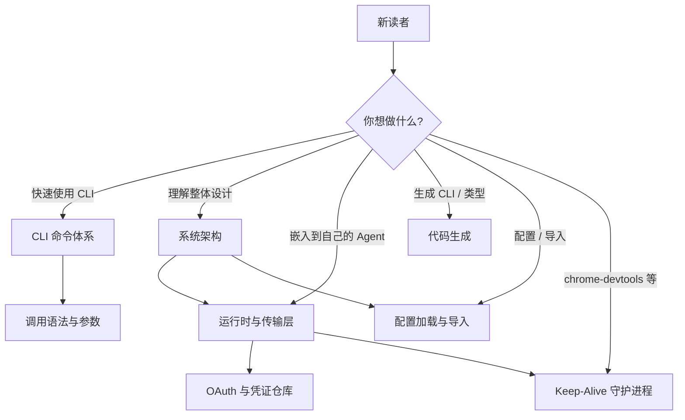

<details>
<summary>相关源文件</summary>

生成本页时使用的主要源文件：

- [README.md](../../../project-repos/mcporter/README.md)
- [package.json](../../../project-repos/mcporter/package.json)
- [src/index.ts](../../../project-repos/mcporter/src/index.ts)
- [src/cli.ts](../../../project-repos/mcporter/src/cli.ts)
- [CHANGELOG.md](../../../project-repos/mcporter/CHANGELOG.md)

</details>

# 项目概览

`mcporter` 是 **Model Context Protocol（MCP）** 的 TypeScript 运行时与 CLI 工具集。它把"如何发现已配置的 MCP 服务器、如何发起一次工具调用、如何把 MCP 工具固化为可分发的产物"这条链路抽象成了一组首要可重用的 npm 库与单一的 `mcporter` CLI 二进制。

仓库整体按"运行库（`src/index.ts` 暴露的公共面）+ CLI 入口（`bin/mcporter`→`dist/cli.js`）+ 守护进程"的三段式组织。npm 包同时提供库导出与 CLI bin 安装两种使用形态，由 `package.json` 的 `bin` 字段定义。
Sources: [package.json:17-38](../../../project-repos/mcporter/package.json#L17-L38), [src/index.ts:1-9](../../../project-repos/mcporter/src/index.ts#L1-L9), [src/cli.ts:30-211](../../../project-repos/mcporter/src/cli.ts#L30-L211)

<details class="source-snippets">
<summary>引用源码</summary>

<!-- source-snippets:start -->

#### `package.json:17-38`

```json
  "bin": {
    "mcporter": "dist/cli.js"
  },
  "files": [
    "dist",
    "README.md",
    "LICENSE"
  ],
  "type": "module",
  "main": "dist/index.js",
  "module": "dist/index.js",
  "types": "dist/index.d.ts",
  "exports": {
    ".": {
      "import": "./dist/index.js",
      "types": "./dist/index.d.ts"
    },
    "./cli": {
      "import": "./dist/cli.js",
      "types": "./dist/cli.d.ts"
    }
  },
```

#### `src/index.ts:1-9`

```typescript
export type { CommandSpec, ServerDefinition } from './config.js';
export { loadServerDefinitions } from './config.js';
export type { CallResult, ConnectionIssue, ImageContent } from './result-utils.js';
export { createCallResult, describeConnectionIssue, wrapCallResult } from './result-utils.js';
export type { CallOptions, ListToolsOptions, Runtime, RuntimeLogger, ServerToolInfo } from './runtime.js';
export { callOnce, createRuntime } from './runtime.js';
export type { ServerProxyOptions } from './server-proxy.js';
export { createServerProxy } from './server-proxy.js';
```

#### `src/cli.ts:30-211`

```typescript
export async function runCli(argv: string[]): Promise<void> {
  const args = [...argv];
  if (args.length === 0) {
    printHelp();
    process.exit(1);
    return;
  }

  const context = buildGlobalContext(args);
  if ('exit' in context) {
    process.exit(context.code);
    return;
  }
  const { globalFlags, runtimeOptions } = context;
  const command = args.shift();

  if (!command) {
    printHelp();
    process.exit(1);
    return;
  }

  if (isHelpToken(command)) {
    printHelp();
    process.exitCode = 0;
    return;
  }

  if (isVersionToken(command)) {
    await printVersion();
    return;
  }

  // Early-exit command handlers that don't require runtime inference.
  if (command === 'generate-cli') {
    await handleGenerateCli(args, globalFlags);
    return;
  }
  if (command === 'inspect-cli') {
    await handleInspectCli(args);
    return;
  }
  const rootOverride = globalFlags['--root'];
  const configPath = runtimeOptions.configPath ?? globalFlags['--config'];
  const configResolution = resolveConfigPath(globalFlags['--config'], rootOverride ?? process.cwd());
  const configPathResolved = configPath ?? configResolution.path;
  // Only pass configPath to runtime options if it was explicitly provided (via --config flag or env var).
  // If not explicit, let loadConfigLayers handle the default resolution to avoid ENOENT on missing config.
  const runtimeOptionsWithPath = {
    ...runtimeOptions,
    configPath: configResolution.explicit ? configPathResolved : runtimeOptions.configPath,
  };

  if (command === 'daemon') {
    await handleDaemonCli(args, {
      configPath: configPathResolved,
      configExplicit: configResolution.explicit,
      rootDir: rootOverride,
    });
    return;
  }

  if (command === 'config') {
    await handleConfigCli(
      {
        loadOptions: { configPath, rootDir: rootOverride },
        invokeAuth: (authArgs) => invokeAuthCommand(runtimeOptionsWithPath, authArgs),
      },
      args
    );
    return;
  }

  if (command === 'emit-ts') {
    const runtime = await createRuntime(runtimeOptionsWithPath);
    try {
      await handleEmitTs(runtime, args);
    } finally {
      await runtime.close().catch(() => {});
    }
    return;
  }

  const baseRuntime = await createRuntime(runtimeOptionsWithPath);
  const keepAliveServers = new Set(
    baseRuntime
      .getDefinitions()
      .filter(isKeepAliveServer)
      .map((entry) => entry.name)
  );
  const daemonClient =
    keepAliveServers.size > 0
      ? new DaemonClient({
          configPath: configResolution.path,
          configExplicit: configResolution.explicit,
          rootDir: rootOverride,
        })
      : null;
  const runtime = createKeepAliveRuntime(baseRuntime, { daemonClient, keepAliveServers });

  const inference = inferCommandRouting(command, args, runtime.getDefinitions());
  if (inference.kind === 'abort') {
    process.exitCode = inference.exitCode;
    return;
  }
  const resolvedCommand = inference.command;
  const resolvedArgs = inference.args;

  try {
    if (resolvedCommand === 'list') {
      if (consumeHelpTokens(resolvedArgs)) {
        printListHelp();
        process.exitCode = 0;
        return;
      }
      await handleList(runtime, resolvedArgs);
      return;
    }

    if (resolvedCommand === 'call') {
... snippet truncated ...
```

<!-- source-snippets:end -->
</details>
## 核心定位

mcporter 解决三个高频痛点：

1. **跨编辑器配置发现** — 开发者已经在 Cursor / Claude Code / Claude Desktop / Codex / Windsurf / OpenCode / VS Code 中配置过 MCP 服务器，再让另一个工具重新写一遍配置是不必要的。`mcporter` 默认启用 7 个编辑器配置导入（[src/config-schema.ts:9-17]()），把这些 `mcp.json` / `settings.json` / `config.toml` 合并成同一个名字空间。
2. **统一调用面** — 不论目标 MCP 是 HTTPS（StreamableHTTP / SSE）还是 stdio（本地子进程），CLI 与 SDK 都以 `<server>.<tool>` 选择器、`createRuntime()` 与 `createServerProxy()` 三种形态对外暴露。
3. **代码生成** — `generate-cli` 把任一 MCP 服务器物化为独立 CLI（含 Rolldown / Bun bundle、Bun 编译为单文件二进制），`emit-ts` 输出 `.d.ts` 类型或客户端封装（[src/cli/emit-ts-command.ts:46-94]()）。生成产物自带元数据，可用 `inspect-cli` 反查与 `generate-cli --from` 复用旧参数重新生成。

## 关键能力

| 能力 | 入口 | 说明 |
|------|------|------|
| 列出已配置 MCP | `mcporter list` | 多服务器并行探测、超时分片、JSON / 文本两种输出，单服务器输出仿 TS 头文件签名 |
| 调用工具 | `mcporter call <server>.<tool>` 或 `mcporter <server>.<tool>` | 支持 `key=value` / `key:value` / `'tool(arg: value)'` / 全 URL / 临时 stdio 命令 |
| OAuth | `mcporter auth <server>` | 启动本地回调服务器，把浏览器里的授权码兑换成 token 并落盘 |
| 配置管理 | `mcporter config list/get/add/remove/import/login/logout/doctor` | 不需要手写 JSON 即可增删与从编辑器导入 |
| Keep-alive 守护 | `mcporter daemon start/status/stop/restart` | 为 chrome-devtools 等需要长连接的 stdio 服务器提供共享守护 |
| 生成单文件 CLI | `mcporter generate-cli` | 输出 `.ts` 模板 + Rolldown/Bun bundle + 可选 Bun 编译二进制 |
| 生成 TS 类型 | `mcporter emit-ts <server>` | `--mode types` 出 `.d.ts`，`--mode client` 同时生成 `createServerProxy` 包装 |
| 反查产物 | `mcporter inspect-cli <path>` | 读取已生成 CLI 内嵌的 metadata，回放 `generate-cli --from` |

Sources: [README.md:18-209](../../../project-repos/mcporter/README.md#L18-L209), [src/cli.ts:64-167](../../../project-repos/mcporter/src/cli.ts#L64-L167), [src/cli/emit-ts-command.ts:30-94](../../../project-repos/mcporter/src/cli/emit-ts-command.ts#L30-L94)

<details class="source-snippets">
<summary>引用源码</summary>

<!-- source-snippets:start -->

#### `README.md:18-209`

````markdown
## Key Capabilities

- **Zero-config discovery.** `createRuntime()` merges your home config (`~/.mcporter/mcporter.json[c]`) first, then `config/mcporter.json`, plus Cursor/Claude/Codex/Windsurf/OpenCode/VS Code imports, expands `${ENV}` placeholders, and pools connections so you can reuse transports across multiple calls.
- **One-command CLI generation.** `mcporter generate-cli` turns any MCP server definition into a ready-to-run CLI, with optional bundling/compilation and metadata for easy regeneration.
- **Typed tool clients.** `mcporter emit-ts` emits `.d.ts` interfaces or ready-to-run client wrappers so agents/tests can call MCP servers with strong TypeScript types without hand-writing plumbing.
- **Friendly composable API.** `createServerProxy()` exposes tools as ergonomic camelCase methods, automatically applies JSON-schema defaults, validates required arguments, and hands back a `CallResult` with `.text()`, `.markdown()`, `.json()`, `.images()`, and `.content()` helpers.
- **OAuth and stdio ergonomics.** Built-in OAuth caching, log tailing, and stdio wrappers let you work with HTTP, SSE, and stdio transports from the same interface.
- **Ad-hoc connections.** Point the CLI at _any_ MCP endpoint (HTTP or stdio) without touching config, then persist it later if you want. Hosted MCPs that expect a browser login (Supabase, Vercel, etc.) are auto-detected—just run `mcporter auth <url>` and the CLI promotes the definition to OAuth on the fly. See [docs/adhoc.md](docs/adhoc.md).

## What's New in 0.9.0

- **Per-server tool filtering.** Limit exposed tools with `allowedTools`, or block risky exact-name tools with `blockedTools`; filtered tools disappear from `mcporter list` and are rejected by `mcporter call`.
- **Sturdier stdio shutdown.** Stuck local MCP processes now escalate cleanly instead of hanging after a call finishes.
- **OAuth polish.** Windows OAuth URLs are quoted correctly, OAuth config examples are documented, and `mcporter auth --json` returns structured connection envelopes.
- **Safer call coercion.** Tool arguments declared as strings stay strings, even when the value looks numeric.
- **Release confidence.** `0.9.0` is published on npm and Homebrew, and the live DeepWiki MCP suite is green.

## Quick Start

MCPorter auto-discovers the MCP servers you already configured in Cursor, Claude Code/Desktop, Codex, or local overrides. You can try it immediately with `npx`--no installation required. Need a full command reference (flags, modes, return types)? Check out [docs/cli-reference.md](docs/cli-reference.md).

### Call syntax options

```bash
# Colon-delimited flags (shell-friendly)
npx mcporter call linear.create_comment issueId:ENG-123 body:'Looks good!'

# Function-call style (matches signatures from `mcporter list`)
npx mcporter call 'linear.create_comment(issueId: "ENG-123", body: "Looks good!")'

# Literal positional values that start with `--`
npx mcporter call server.tool -- --raw-value
```

### List your MCP servers

```bash
npx mcporter list
npx mcporter list context7 --schema
npx mcporter list https://mcp.linear.app/mcp --all-parameters
npx mcporter list shadcn.io/api/mcp.getComponents           # URL + tool suffix auto-resolves
npx mcporter list --stdio "bun run ./local-server.ts" --env TOKEN=xyz
```

- Add `--json` to emit a machine-readable summary with per-server statuses (auth/offline/http/error counts) and, for single-server runs, the full tool schema payload.
- Add `--verbose` to show every config source that registered the server name (primary first), both in text and JSON list output.

You can now point `mcporter list` at ad-hoc servers: provide a URL directly or use the new `--http-url/--stdio` flags (plus `--env`, `--cwd`, `--name`, or `--persist`) to describe any MCP endpoint. Until you persist that definition, you still need to repeat the same URL/stdio flags for `mcporter call`—the printed slug only becomes reusable once you merge it into a config via `--persist` or `mcporter config add` (use `--scope home|project` to pick the write target). Follow up with `mcporter auth https://…` (or the same flag set) to finish OAuth without editing config. Full details live in [docs/adhoc.md](docs/adhoc.md).

Single-server listings now read like a TypeScript header file so you can copy/paste the signature straight into `mcporter call`:

```ts
linear - Hosted Linear MCP; exposes issue search, create, and workflow tooling.
  23 tools · 1654ms · HTTP https://mcp.linear.app/mcp

  /**
   * Create a comment on a specific Linear issue
   * @param issueId The issue ID
   * @param body The content of the comment as Markdown
   * @param parentId? A parent comment ID to reply to
   */
  function create_comment(issueId: string, body: string, parentId?: string);
  // optional (3): notifySubscribers, labelIds, mentionIds

  /**
   * List documents in the user's Linear workspace
   * @param query? An optional search query
   * @param projectId? Filter by project ID
   */
  function list_documents(query?: string, projectId?: string);
  // optional (11): limit, before, after, orderBy, initiativeId, ...
```

Here’s what that looks like for Vercel when you run `npx mcporter list vercel`:

```ts
vercel - Vercel MCP (requires OAuth).

  /**
   * Search the Vercel documentation.
   * Use this tool to answer any questions about Vercel’s platform, features, and best practices,
   * including:
   * - Core Concepts: Projects, Deployments, Git Integration, Preview Deployments, Environments
   * - Frontend & Frameworks: Next.js, SvelteKit, Nuxt, Astro, Remix, frameworks configuration and
   *   optimization
   * - APIs: REST API, Vercel SDK, Build Output API
   * - Compute: Fluid Compute, Functions, Routing Middleware, Cron Jobs, OG Image Generation, Sandbox,
   *   Data Cache
   * - AI: Vercel AI SDK, AI Gateway, MCP, v0
   * - Performance & Delivery: Edge Network, Caching, CDN, Image Optimization, Headers, Redirects,
   *   Rewrites
   * - Pricing: Plans, Spend Management, Billing
   * - Security: Audit Logs, Firewall, Bot Management, BotID, OIDC, RBAC, Secure Compute, 2FA
   * - Storage: Blog, Edge Config
   *
   * @param topic Topic to focus the documentation search on (e.g., 'routing', 'data-fetching').
   * @param tokens? Maximum number of tokens to include in the result. Default is 2500.
   */
  function search_vercel_documentation(topic: string, tokens?: number);

  /**
   * Deploy the current project to Vercel
   */
  function deploy_to_vercel();
```

Required parameters always show; optional parameters stay hidden unless (a) there are only one or two of them alongside fewer than four required fields or (b) you pass `--all-parameters`. Whenever MCPorter hides parameters it prints `Optional parameters hidden; run with --all-parameters to view all fields.` so you know how to reveal the full signature. Return types are inferred from the tool schema’s `title`, falling back to omitting the suffix entirely instead of guessing.

### Context7: fetch docs (no auth required)

```bash
npx mcporter call context7.resolve-library-id libraryName=react
npx mcporter call context7.get-library-docs context7CompatibleLibraryID=/websites/react_dev topic=hooks
```

### Linear: search documentation (requires `LINEAR_API_KEY`)

```bash
LINEAR_API_KEY=sk_linear_example npx mcporter call linear.search_documentation query="automations"
```
... snippet truncated ...
````

#### `src/cli.ts:64-167`

```typescript
  if (command === 'generate-cli') {
    await handleGenerateCli(args, globalFlags);
    return;
  }
  if (command === 'inspect-cli') {
    await handleInspectCli(args);
    return;
  }
  const rootOverride = globalFlags['--root'];
  const configPath = runtimeOptions.configPath ?? globalFlags['--config'];
  const configResolution = resolveConfigPath(globalFlags['--config'], rootOverride ?? process.cwd());
  const configPathResolved = configPath ?? configResolution.path;
  // Only pass configPath to runtime options if it was explicitly provided (via --config flag or env var).
  // If not explicit, let loadConfigLayers handle the default resolution to avoid ENOENT on missing config.
  const runtimeOptionsWithPath = {
    ...runtimeOptions,
    configPath: configResolution.explicit ? configPathResolved : runtimeOptions.configPath,
  };

  if (command === 'daemon') {
    await handleDaemonCli(args, {
      configPath: configPathResolved,
      configExplicit: configResolution.explicit,
      rootDir: rootOverride,
    });
    return;
  }

  if (command === 'config') {
    await handleConfigCli(
      {
        loadOptions: { configPath, rootDir: rootOverride },
        invokeAuth: (authArgs) => invokeAuthCommand(runtimeOptionsWithPath, authArgs),
      },
      args
    );
    return;
  }

  if (command === 'emit-ts') {
    const runtime = await createRuntime(runtimeOptionsWithPath);
    try {
      await handleEmitTs(runtime, args);
    } finally {
      await runtime.close().catch(() => {});
    }
    return;
  }

  const baseRuntime = await createRuntime(runtimeOptionsWithPath);
  const keepAliveServers = new Set(
    baseRuntime
      .getDefinitions()
      .filter(isKeepAliveServer)
      .map((entry) => entry.name)
  );
  const daemonClient =
    keepAliveServers.size > 0
      ? new DaemonClient({
          configPath: configResolution.path,
          configExplicit: configResolution.explicit,
          rootDir: rootOverride,
        })
      : null;
  const runtime = createKeepAliveRuntime(baseRuntime, { daemonClient, keepAliveServers });

  const inference = inferCommandRouting(command, args, runtime.getDefinitions());
  if (inference.kind === 'abort') {
    process.exitCode = inference.exitCode;
    return;
  }
  const resolvedCommand = inference.command;
  const resolvedArgs = inference.args;

  try {
    if (resolvedCommand === 'list') {
      if (consumeHelpTokens(resolvedArgs)) {
        printListHelp();
        process.exitCode = 0;
        return;
      }
      await handleList(runtime, resolvedArgs);
      return;
    }

    if (resolvedCommand === 'call') {
      if (consumeHelpTokens(resolvedArgs)) {
        printCallHelp();
        process.exitCode = 0;
        return;
      }
      await runHandleCall(runtime, resolvedArgs);
      return;
    }

    if (resolvedCommand === 'auth') {
      if (consumeHelpTokens(resolvedArgs)) {
        printAuthHelp();
        process.exitCode = 0;
        return;
      }
      await handleAuth(runtime, resolvedArgs);
      return;
    }
```

#### `src/cli/emit-ts-command.ts:30-94`

```typescript
export async function handleEmitTs(runtime: Runtime, args: string[]): Promise<void> {
  const options = parseEmitTsArgs(args);
  const definition = getServerDefinition(runtime, options.server);
  const metadataEntries = await loadToolMetadata(runtime, options.server, {
    includeSchema: true,
    autoAuthorize: false,
  });
  const generator = await readPackageMetadata();
  const metadata: EmitMetadata = {
    server: definition,
    generatorLabel: `${generator.name}@${generator.version}`,
    generatedAt: new Date(),
  };
  const docEntries = buildDocEntries(options.server, metadataEntries, options.includeOptional);
  const interfaceName = buildInterfaceName(options.server);

  if (options.mode === 'types') {
    const source = renderTypesModule({ interfaceName, docs: docEntries, metadata });
    await writeFile(options.outPath, source);
    if (options.format === 'json') {
      console.log(
        JSON.stringify(
          {
            mode: 'types',
            server: options.server,
            outPath: options.outPath,
          },
          null,
          2
        )
      );
    } else {
      console.log(`Emitted TypeScript definitions for ${options.server} → ${options.outPath}`);
    }
    return;
  }

  const typesOutPath = options.typesOutPath ?? deriveTypesOutPath(options.outPath);
  const relativeImportPath = computeImportPath(options.outPath, typesOutPath);
  const typesSource = renderTypesModule({ interfaceName, docs: docEntries, metadata });
  const clientSource = renderClientModule({
    interfaceName,
    docs: docEntries,
    metadata,
    typesImportPath: relativeImportPath,
  });
  await writeFile(typesOutPath, typesSource);
  await writeFile(options.outPath, clientSource);
  if (options.format === 'json') {
    console.log(
      JSON.stringify(
        {
          mode: 'client',
          server: options.server,
          clientOutPath: options.outPath,
          typesOutPath,
        },
        null,
        2
      )
    );
  } else {
    console.log(`Emitted client + types for ${options.server} → ${options.outPath} / ${typesOutPath}`);
  }
}
```

<!-- source-snippets:end -->
</details>
## 公共 API 切面

`src/index.ts` 暴露的入口非常克制——只 9 行。这是 mcporter 作为 npm 库时使用者真正能拿到的全部类型与函数：

```ts
export type { CommandSpec, ServerDefinition } from './config.js';
export { loadServerDefinitions } from './config.js';
export type { CallResult, ConnectionIssue, ImageContent } from './result-utils.js';
export { createCallResult, describeConnectionIssue, wrapCallResult } from './result-utils.js';
export type { CallOptions, ListToolsOptions, Runtime, RuntimeLogger, ServerToolInfo } from './runtime.js';
export { callOnce, createRuntime } from './runtime.js';
export type { ServerProxyOptions } from './server-proxy.js';
export { createServerProxy } from './server-proxy.js';
```

注意：`mcporter` 的 CLI 子模块（`src/cli/**`）**不**对外导出，CLI 只通过 `dist/cli.js` 二进制提供。库使用者需要自己实现 UI / 命令分发的话，从 `createRuntime()` 与 `createServerProxy()` 出发即可。
Sources: [src/index.ts:1-9](../../../project-repos/mcporter/src/index.ts#L1-L9), [package.json:29-38](../../../project-repos/mcporter/package.json#L29-L38)

<details class="source-snippets">
<summary>引用源码</summary>

<!-- source-snippets:start -->

#### `src/index.ts:1-9`

```typescript
export type { CommandSpec, ServerDefinition } from './config.js';
export { loadServerDefinitions } from './config.js';
export type { CallResult, ConnectionIssue, ImageContent } from './result-utils.js';
export { createCallResult, describeConnectionIssue, wrapCallResult } from './result-utils.js';
export type { CallOptions, ListToolsOptions, Runtime, RuntimeLogger, ServerToolInfo } from './runtime.js';
export { callOnce, createRuntime } from './runtime.js';
export type { ServerProxyOptions } from './server-proxy.js';
export { createServerProxy } from './server-proxy.js';
```

#### `package.json:29-38`

```json
  "exports": {
    ".": {
      "import": "./dist/index.js",
      "types": "./dist/index.d.ts"
    },
    "./cli": {
      "import": "./dist/cli.js",
      "types": "./dist/cli.d.ts"
    }
  },
```

<!-- source-snippets:end -->
</details>
## 受众与使用场景

- **写 Agent / 脚本的工程师**：用 `createRuntime()` 直接合并多客户端配置，在脚本里调用 MCP 工具，不需要重新写配置文件。
- **MCP 工具开发者**：用 `mcporter list <server> --schema` 检查 MCP 输入输出 schema 是否符合预期，用 `mcporter generate-cli` 把自家服务器分发出去。
- **平台与团队**：用 `mcporter config import` 拉取 IDE 配置进项目级 `config/mcporter.json`，用 `--persist` 把临时 `--http-url` 固化下来，让团队成员只需 `npx mcporter <name>`。
- **运维 / 调试**：用 `daemon` 解决 Chrome DevTools / mobile-mcp 类有状态服务器在多 agent 之间被反复拉起的损耗（[src/lifecycle.ts:3-22]()），用 `MCPORTER_DEBUG_HANG=1` / `--tail-log` 调查 stdio 进程残留。

## 仓库快照

```text
mcporter/
├── src/
│   ├── cli.ts                     CLI 入口（runCli / main）
│   ├── index.ts                   npm 库公共导出
│   ├── runtime.ts                 createRuntime / callOnce 实现
│   ├── server-proxy.ts            camelCase Proxy + schema 默认值
│   ├── config.ts                  loadServerDefinitions（合并 imports + 本地）
│   ├── config-schema.ts           Zod schema：RawEntry / ServerDefinition / CommandSpec
│   ├── config-normalize.ts        RawEntry → ServerDefinition 规范化
│   ├── config/
│   │   ├── path-discovery.ts      ~/.mcporter / config/mcporter.json 解析顺序
│   │   ├── read-config.ts         JSONC 解析 + 多层 layer
│   │   └── imports/external.ts    Cursor/Claude/Codex/Windsurf/VSCode 解析
│   ├── runtime/
│   │   ├── transport.ts           StreamableHTTP → SSE 回退、stdio 启动
│   │   ├── oauth.ts               connectWithAuth + retryHttpTransportWithFallback
│   │   ├── errors.ts              shouldResetConnection 判定
│   │   └── utils.ts               normalizeTimeout / raceWithTimeout
│   ├── oauth.ts                   PersistentOAuthClientProvider + 回调服务器
│   ├── oauth-persistence.ts       Vault + Directory + Composite 三层持久化
│   ├── oauth-vault.ts             ~/.mcporter/credentials.json
│   ├── daemon/
│   │   ├── host.ts                Unix socket 守护进程 + 请求路由
│   │   ├── client.ts              DaemonClient + 自动启动
│   │   ├── runtime-wrapper.ts     KeepAliveRuntime（按需走 daemon）
│   │   └── protocol.ts            JSON-RPC 风格私有协议
│   ├── lifecycle.ts               keep-alive 默认名单与 env 覆盖
│   ├── tool-filters.ts            allowedTools / blockedTools
│   ├── result-utils.ts            CallResult.text/markdown/json/images
│   ├── error-classifier.ts        auth / offline / http / stdio-exit / other
│   ├── sdk-patches.ts             StdioClientTransport.close 修补（防 hang）
│   ├── generate-cli.ts            generate-cli 主流程
│   └── cli/                       Commander 命令集合（list/call/auth/config/daemon/generate)
├── tests/                         Vitest（≈90 个测试文件）
├── docs/                          adhoc / call-syntax / daemon / mcp 等专题文档
├── scripts/                       build-bun / generate-json-schema 等
├── config/mcporter.json           示例与默认 project 配置位置
└── .github/workflows/ci.yml       Linux + macOS + Windows × Node 24 矩阵
```

Sources: [src/index.ts:1-9](../../../project-repos/mcporter/src/index.ts#L1-L9), [src/cli.ts:1-25](../../../project-repos/mcporter/src/cli.ts#L1-L25), [src/runtime.ts:1-16](../../../project-repos/mcporter/src/runtime.ts#L1-L16), [src/config.ts:1-21](../../../project-repos/mcporter/src/config.ts#L1-L21)

<details class="source-snippets">
<summary>引用源码</summary>

<!-- source-snippets:start -->

#### `src/index.ts:1-9`

```typescript
export type { CommandSpec, ServerDefinition } from './config.js';
export { loadServerDefinitions } from './config.js';
export type { CallResult, ConnectionIssue, ImageContent } from './result-utils.js';
export { createCallResult, describeConnectionIssue, wrapCallResult } from './result-utils.js';
export type { CallOptions, ListToolsOptions, Runtime, RuntimeLogger, ServerToolInfo } from './runtime.js';
export { callOnce, createRuntime } from './runtime.js';
export type { ServerProxyOptions } from './server-proxy.js';
export { createServerProxy } from './server-proxy.js';
```

#### `src/cli.ts:1-25`

```typescript
#!/usr/bin/env node
import { handleAuth, printAuthHelp } from './cli/auth-command.js';
import { printCallHelp, handleCall as runHandleCall } from './cli/call-command.js';
import { buildGlobalContext } from './cli/cli-factory.js';
import { inferCommandRouting } from './cli/command-inference.js';
import { handleConfigCli } from './cli/config-command.js';
import { handleDaemonCli } from './cli/daemon-command.js';
import { handleEmitTs } from './cli/emit-ts-command.js';
import { CliUsageError } from './cli/errors.js';
import { handleGenerateCli } from './cli/generate-cli-runner.js';
import { consumeHelpTokens, isHelpToken, isVersionToken, printHelp, printVersion } from './cli/help-output.js';
import { handleInspectCli } from './cli/inspect-cli-command.js';
import { handleList, printListHelp } from './cli/list-command.js';
import { logError, logInfo } from './cli/logger-context.js';
import { DEBUG_HANG, dumpActiveHandles, terminateChildProcesses } from './cli/runtime-debug.js';
import { resolveConfigPath } from './config.js';
import { DaemonClient } from './daemon/client.js';
import { createKeepAliveRuntime } from './daemon/runtime-wrapper.js';
import { isKeepAliveServer } from './lifecycle.js';
import { createRuntime } from './runtime.js';

export { handleAuth, printAuthHelp } from './cli/auth-command.js';
export { parseCallArguments } from './cli/call-arguments.js';
export { handleCall } from './cli/call-command.js';
export { handleGenerateCli } from './cli/generate-cli-runner.js';
```

#### `src/runtime.ts:1-16`

```typescript
import { createRequire } from 'node:module';

import type { CallToolRequest, ListResourcesRequest } from '@modelcontextprotocol/sdk/types.js';
import { loadServerDefinitions, type ServerDefinition } from './config.js';
import { createPrefixedConsoleLogger, type Logger, type LogLevel, resolveLogLevelFromEnv } from './logging.js';
import { closeTransportAndWait } from './runtime-process-utils.js';
import './sdk-patches.js';
import { shouldResetConnection } from './runtime/errors.js';
import { resolveOAuthTimeoutFromEnv } from './runtime/oauth.js';
import { type ClientContext, createClientContext } from './runtime/transport.js';
import { normalizeTimeout, raceWithTimeout } from './runtime/utils.js';
import { filterTools, isToolAllowed, validateToolFilters } from './tool-filters.js';

const PACKAGE_NAME = 'mcporter';
// Keep version in one place by reading package.json; fall back gracefully when bundled without it (e.g., bun bundle).
const CLIENT_VERSION = (() => {
```

#### `src/config.ts:1-21`

```typescript
import fs from 'node:fs/promises';
import path from 'node:path';
import {
  listConfigLayerPaths as discoverConfigLayerPaths,
  resolveConfigPath as discoverConfigPath,
} from './config/path-discovery.js';
import { loadConfigLayers, readConfigFile } from './config/read-config.js';
import { pathsForImport, readExternalEntries } from './config-imports.js';
import { normalizeServerEntry } from './config-normalize.js';
import {
  DEFAULT_IMPORTS,
  type LoadConfigOptions,
  type RawConfig,
  type RawEntry,
  RawEntrySchema,
  type ServerDefinition,
  type ServerSource,
} from './config-schema.js';
import { expandHome } from './env.js';

export { toFileUrl } from './config-imports.js';
```

<!-- source-snippets:end -->
</details>
## 阅读路径建议



Sources: [README.md:36-205](../../../project-repos/mcporter/README.md#L36-L205), [src/cli.ts:60-170](../../../project-repos/mcporter/src/cli.ts#L60-L170)

<details class="source-snippets">
<summary>引用源码</summary>

<!-- source-snippets:start -->

#### `README.md:36-205`

````markdown

MCPorter auto-discovers the MCP servers you already configured in Cursor, Claude Code/Desktop, Codex, or local overrides. You can try it immediately with `npx`--no installation required. Need a full command reference (flags, modes, return types)? Check out [docs/cli-reference.md](docs/cli-reference.md).

### Call syntax options

```bash
# Colon-delimited flags (shell-friendly)
npx mcporter call linear.create_comment issueId:ENG-123 body:'Looks good!'

# Function-call style (matches signatures from `mcporter list`)
npx mcporter call 'linear.create_comment(issueId: "ENG-123", body: "Looks good!")'

# Literal positional values that start with `--`
npx mcporter call server.tool -- --raw-value
```

### List your MCP servers

```bash
npx mcporter list
npx mcporter list context7 --schema
npx mcporter list https://mcp.linear.app/mcp --all-parameters
npx mcporter list shadcn.io/api/mcp.getComponents           # URL + tool suffix auto-resolves
npx mcporter list --stdio "bun run ./local-server.ts" --env TOKEN=xyz
```

- Add `--json` to emit a machine-readable summary with per-server statuses (auth/offline/http/error counts) and, for single-server runs, the full tool schema payload.
- Add `--verbose` to show every config source that registered the server name (primary first), both in text and JSON list output.

You can now point `mcporter list` at ad-hoc servers: provide a URL directly or use the new `--http-url/--stdio` flags (plus `--env`, `--cwd`, `--name`, or `--persist`) to describe any MCP endpoint. Until you persist that definition, you still need to repeat the same URL/stdio flags for `mcporter call`—the printed slug only becomes reusable once you merge it into a config via `--persist` or `mcporter config add` (use `--scope home|project` to pick the write target). Follow up with `mcporter auth https://…` (or the same flag set) to finish OAuth without editing config. Full details live in [docs/adhoc.md](docs/adhoc.md).

Single-server listings now read like a TypeScript header file so you can copy/paste the signature straight into `mcporter call`:

```ts
linear - Hosted Linear MCP; exposes issue search, create, and workflow tooling.
  23 tools · 1654ms · HTTP https://mcp.linear.app/mcp

  /**
   * Create a comment on a specific Linear issue
   * @param issueId The issue ID
   * @param body The content of the comment as Markdown
   * @param parentId? A parent comment ID to reply to
   */
  function create_comment(issueId: string, body: string, parentId?: string);
  // optional (3): notifySubscribers, labelIds, mentionIds

  /**
   * List documents in the user's Linear workspace
   * @param query? An optional search query
   * @param projectId? Filter by project ID
   */
  function list_documents(query?: string, projectId?: string);
  // optional (11): limit, before, after, orderBy, initiativeId, ...
```

Here’s what that looks like for Vercel when you run `npx mcporter list vercel`:

```ts
vercel - Vercel MCP (requires OAuth).

  /**
   * Search the Vercel documentation.
   * Use this tool to answer any questions about Vercel’s platform, features, and best practices,
   * including:
   * - Core Concepts: Projects, Deployments, Git Integration, Preview Deployments, Environments
   * - Frontend & Frameworks: Next.js, SvelteKit, Nuxt, Astro, Remix, frameworks configuration and
   *   optimization
   * - APIs: REST API, Vercel SDK, Build Output API
   * - Compute: Fluid Compute, Functions, Routing Middleware, Cron Jobs, OG Image Generation, Sandbox,
   *   Data Cache
   * - AI: Vercel AI SDK, AI Gateway, MCP, v0
   * - Performance & Delivery: Edge Network, Caching, CDN, Image Optimization, Headers, Redirects,
   *   Rewrites
   * - Pricing: Plans, Spend Management, Billing
   * - Security: Audit Logs, Firewall, Bot Management, BotID, OIDC, RBAC, Secure Compute, 2FA
   * - Storage: Blog, Edge Config
   *
   * @param topic Topic to focus the documentation search on (e.g., 'routing', 'data-fetching').
   * @param tokens? Maximum number of tokens to include in the result. Default is 2500.
   */
  function search_vercel_documentation(topic: string, tokens?: number);

  /**
   * Deploy the current project to Vercel
   */
  function deploy_to_vercel();
```

Required parameters always show; optional parameters stay hidden unless (a) there are only one or two of them alongside fewer than four required fields or (b) you pass `--all-parameters`. Whenever MCPorter hides parameters it prints `Optional parameters hidden; run with --all-parameters to view all fields.` so you know how to reveal the full signature. Return types are inferred from the tool schema’s `title`, falling back to omitting the suffix entirely instead of guessing.

### Context7: fetch docs (no auth required)

```bash
npx mcporter call context7.resolve-library-id libraryName=react
npx mcporter call context7.get-library-docs context7CompatibleLibraryID=/websites/react_dev topic=hooks
```

### Linear: search documentation (requires `LINEAR_API_KEY`)

```bash
LINEAR_API_KEY=sk_linear_example npx mcporter call linear.search_documentation query="automations"
```

### Chrome DevTools: snapshot the current tab

```bash
npx mcporter call chrome-devtools.take_snapshot
npx mcporter call 'linear.create_comment(issueId: "LNR-123", body: "Hello world")'
npx mcporter call https://mcp.linear.app/mcp.list_issues assignee=me
npx mcporter call shadcn.io/api/mcp.getComponent component=vortex   # protocol optional; defaults to https
npx mcporter call linear.listIssues --tool listIssues   # auto-corrects to list_issues
npx mcporter linear.list_issues                         # shorthand: infers `call`
VERCEL_ACCESS_TOKEN=sk_vercel_example npx mcporter call "npx -y vercel-domains-mcp" domain=answeroverflow.com  # quoted stdio cmd + single-tool inference
```

> Tool calls understand a JavaScript-like call syntax, auto-correct near-miss tool names, and emit richer inline usage hints. See [docs/call-syntax.md](docs/call-syntax.md) for the grammar and [docs/call-heuristic.md](docs/call-heuristic.md) for the auto-correction rules.

Helpful flags:

- `--config <path>` -- custom config file (defaults to `./config/mcporter.json`).
... snippet truncated ...
````

#### `src/cli.ts:60-170`

```typescript
    return;
  }

  // Early-exit command handlers that don't require runtime inference.
  if (command === 'generate-cli') {
    await handleGenerateCli(args, globalFlags);
    return;
  }
  if (command === 'inspect-cli') {
    await handleInspectCli(args);
    return;
  }
  const rootOverride = globalFlags['--root'];
  const configPath = runtimeOptions.configPath ?? globalFlags['--config'];
  const configResolution = resolveConfigPath(globalFlags['--config'], rootOverride ?? process.cwd());
  const configPathResolved = configPath ?? configResolution.path;
  // Only pass configPath to runtime options if it was explicitly provided (via --config flag or env var).
  // If not explicit, let loadConfigLayers handle the default resolution to avoid ENOENT on missing config.
  const runtimeOptionsWithPath = {
    ...runtimeOptions,
    configPath: configResolution.explicit ? configPathResolved : runtimeOptions.configPath,
  };

  if (command === 'daemon') {
    await handleDaemonCli(args, {
      configPath: configPathResolved,
      configExplicit: configResolution.explicit,
      rootDir: rootOverride,
    });
    return;
  }

  if (command === 'config') {
    await handleConfigCli(
      {
        loadOptions: { configPath, rootDir: rootOverride },
        invokeAuth: (authArgs) => invokeAuthCommand(runtimeOptionsWithPath, authArgs),
      },
      args
    );
    return;
  }

  if (command === 'emit-ts') {
    const runtime = await createRuntime(runtimeOptionsWithPath);
    try {
      await handleEmitTs(runtime, args);
    } finally {
      await runtime.close().catch(() => {});
    }
    return;
  }

  const baseRuntime = await createRuntime(runtimeOptionsWithPath);
  const keepAliveServers = new Set(
    baseRuntime
      .getDefinitions()
      .filter(isKeepAliveServer)
      .map((entry) => entry.name)
  );
  const daemonClient =
    keepAliveServers.size > 0
      ? new DaemonClient({
          configPath: configResolution.path,
          configExplicit: configResolution.explicit,
          rootDir: rootOverride,
        })
      : null;
  const runtime = createKeepAliveRuntime(baseRuntime, { daemonClient, keepAliveServers });

  const inference = inferCommandRouting(command, args, runtime.getDefinitions());
  if (inference.kind === 'abort') {
    process.exitCode = inference.exitCode;
    return;
  }
  const resolvedCommand = inference.command;
  const resolvedArgs = inference.args;

  try {
    if (resolvedCommand === 'list') {
      if (consumeHelpTokens(resolvedArgs)) {
        printListHelp();
        process.exitCode = 0;
        return;
      }
      await handleList(runtime, resolvedArgs);
      return;
    }

    if (resolvedCommand === 'call') {
      if (consumeHelpTokens(resolvedArgs)) {
        printCallHelp();
        process.exitCode = 0;
        return;
      }
      await runHandleCall(runtime, resolvedArgs);
      return;
    }

    if (resolvedCommand === 'auth') {
      if (consumeHelpTokens(resolvedArgs)) {
        printAuthHelp();
        process.exitCode = 0;
        return;
      }
      await handleAuth(runtime, resolvedArgs);
      return;
    }
  } finally {
    const closeStart = Date.now();
    if (DEBUG_HANG) {
```

<!-- source-snippets:end -->
</details>
## 0.10.0 与最近迭代

`package.json:3` 声明 `"version": "0.10.0"`，README 的"What's New"块仍记录了 0.9.0 的关键变更（per-server tool filtering、stdio shutdown 加固、Windows OAuth URL、`auth --json` 结构化失败信封、`call` 字符串参数不再被强制数字化等）。日常迭代以 `CHANGELOG.md` 为准，但仓库默认会在 `mcporter list <server>` 输出区分 healthy / auth required / offline / http / 其它错误并按数量汇总（[src/cli/list-command.ts:217-233]()），这是早期版本不具备的能力。
Sources: [package.json:3](../../../project-repos/mcporter/package.json:3), [README.md:27-33](../../../project-repos/mcporter/README.md#L27-L33), [src/cli/list-command.ts:217-234](../../../project-repos/mcporter/src/cli/list-command.ts#L217-L234)

<details class="source-snippets">
<summary>引用源码</summary>

<!-- source-snippets:start -->

#### `package.json:3`

> 未找到引用文件：`package.json:3`

#### `README.md:27-33`

```markdown
## What's New in 0.9.0

- **Per-server tool filtering.** Limit exposed tools with `allowedTools`, or block risky exact-name tools with `blockedTools`; filtered tools disappear from `mcporter list` and are rejected by `mcporter call`.
- **Sturdier stdio shutdown.** Stuck local MCP processes now escalate cleanly instead of hanging after a call finishes.
- **OAuth polish.** Windows OAuth URLs are quoted correctly, OAuth config examples are documented, and `mcporter auth --json` returns structured connection envelopes.
- **Safer call coercion.** Tool arguments declared as strings stay strings, even when the value looks numeric.
- **Release confidence.** `0.9.0` is published on npm and Homebrew, and the live DeepWiki MCP suite is green.
```

#### `src/cli/list-command.ts:217-234`

```typescript
      const errorCounts = createEmptyStatusCounts();
      renderedResults?.forEach((entry) => {
        if (!entry) {
          return;
        }
        const category = entry.category ?? 'error';
        errorCounts[category] = (errorCounts[category] ?? 0) + 1;
      });
      const okSummary = `${errorCounts.ok} healthy`;
      const parts = [
        okSummary,
        ...(errorCounts.auth > 0 ? [`${errorCounts.auth} auth required`] : []),
        ...(errorCounts.offline > 0 ? [`${errorCounts.offline} offline`] : []),
        ...(errorCounts.http > 0 ? [`${errorCounts.http} http errors`] : []),
        ...(errorCounts.error > 0 ? [`${errorCounts.error} errors`] : []),
      ];
      console.log(`✔ Listed ${servers.length} server${servers.length === 1 ? '' : 's'} (${parts.join('; ')}).`);
      return;
```

<!-- source-snippets:end -->
</details>
## 相关页面

- [系统架构](system-architecture.md)
- [CLI 命令体系](cli-commands.md)
- [配置加载与导入](configuration.md)
