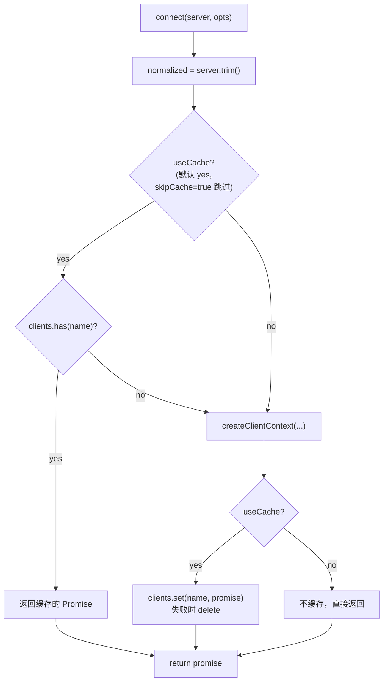
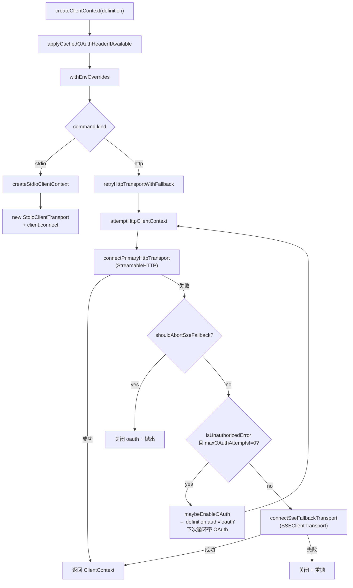
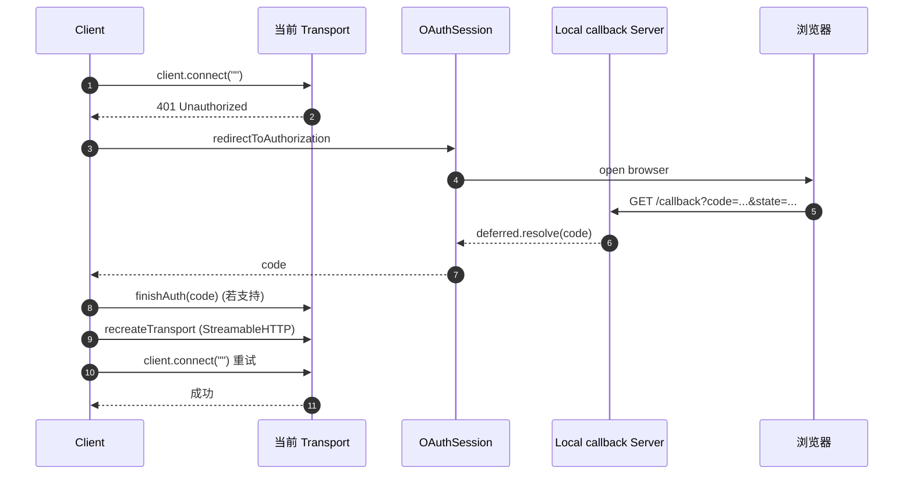
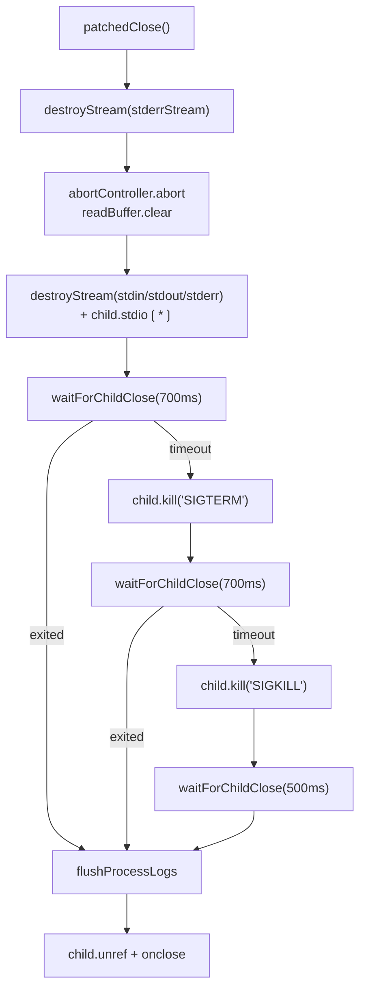
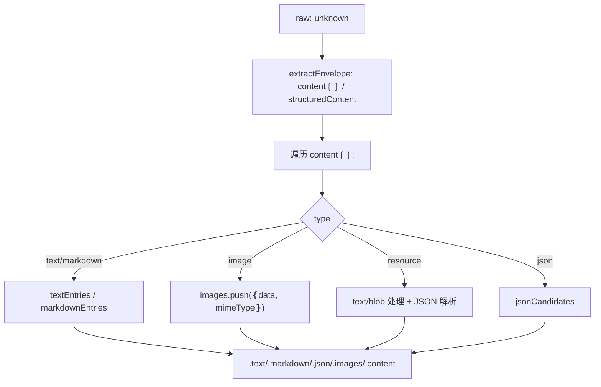

<details>
<summary>相关源文件</summary>

生成本页时使用的主要源文件：

- [src/runtime.ts](../../../project-repos/mcporter/src/runtime.ts)
- [src/runtime/transport.ts](../../../project-repos/mcporter/src/runtime/transport.ts)
- [src/runtime/oauth.ts](../../../project-repos/mcporter/src/runtime/oauth.ts)
- [src/runtime/utils.ts](../../../project-repos/mcporter/src/runtime/utils.ts)
- [src/runtime/errors.ts](../../../project-repos/mcporter/src/runtime/errors.ts)
- [src/server-proxy.ts](../../../project-repos/mcporter/src/server-proxy.ts)
- [src/result-utils.ts](../../../project-repos/mcporter/src/result-utils.ts)
- [src/tool-filters.ts](../../../project-repos/mcporter/src/tool-filters.ts)
- [src/error-classifier.ts](../../../project-repos/mcporter/src/error-classifier.ts)
- [src/sdk-patches.ts](../../../project-repos/mcporter/src/sdk-patches.ts)
- [src/runtime-process-utils.ts](../../../project-repos/mcporter/src/runtime-process-utils.ts)
- [src/runtime-header-utils.ts](../../../project-repos/mcporter/src/runtime-header-utils.ts)

</details>

# 运行时与传输层

Runtime 是 mcporter 库的核心，**只接受 `ServerDefinition`，对外暴露统一的 `Runtime` 接口**。它在 `@modelcontextprotocol/sdk` 提供的三种 Client Transport（StreamableHTTP / SSE / stdio）之上做了连接池、过滤、超时、OAuth 重试、传输回退、错误分类与连接失效自动重置。本页按"创建 Runtime → 连接 Server → 调用 Tool → 关闭"的全生命周期讲解。

## 公共入口

`src/index.ts` 暴露的所有运行时相关 symbol：

```ts
export type { CallOptions, ListToolsOptions, Runtime, RuntimeLogger, ServerToolInfo } from './runtime.js';
export { callOnce, createRuntime } from './runtime.js';
export type { ServerProxyOptions } from './server-proxy.js';
export { createServerProxy } from './server-proxy.js';
export type { CallResult, ConnectionIssue, ImageContent } from './result-utils.js';
export { createCallResult, describeConnectionIssue, wrapCallResult } from './result-utils.js';
```

`createRuntime` / `callOnce` 二选一即可：前者维护连接池，后者一次调用就关闭。
Sources: [src/index.ts:1-9](../../../project-repos/mcporter/src/index.ts#L1-L9), [src/runtime.ts:77-105](../../../project-repos/mcporter/src/runtime.ts#L77-L105)

<details class="source-snippets">
<summary>引用源码</summary>

<!-- source-snippets:start -->

#### `src/index.ts:1-9`

```typescript
export type { CommandSpec, ServerDefinition } from './config.js';
export { loadServerDefinitions } from './config.js';
export type { CallResult, ConnectionIssue, ImageContent } from './result-utils.js';
export { createCallResult, describeConnectionIssue, wrapCallResult } from './result-utils.js';
export type { CallOptions, ListToolsOptions, Runtime, RuntimeLogger, ServerToolInfo } from './runtime.js';
export { callOnce, createRuntime } from './runtime.js';
export type { ServerProxyOptions } from './server-proxy.js';
export { createServerProxy } from './server-proxy.js';
```

#### `src/runtime.ts:77-105`

```typescript
export async function createRuntime(options: RuntimeOptions = {}): Promise<Runtime> {
  // Build the runtime with either the provided server list or the config file contents.
  const servers =
    options.servers ??
    (await loadServerDefinitions({
      configPath: options.configPath,
      rootDir: options.rootDir,
    }));

  const runtime = new McpRuntime(servers, options);
  return runtime;
}

// callOnce connects to a server, invokes a single tool, and disposes the connection immediately.
export async function callOnce(params: {
  server: string;
  toolName: string;
  args?: Record<string, unknown>;
  configPath?: string;
}): Promise<unknown> {
  const runtime = await createRuntime({ configPath: params.configPath });
  try {
    return await runtime.callTool(params.server, params.toolName, {
      args: params.args,
    });
  } finally {
    await runtime.close(params.server);
  }
}
```

<!-- source-snippets:end -->
</details>
## `createRuntime` 与 `McpRuntime`

`createRuntime` 既可以从 `configPath` / `rootDir` 自动加载 `ServerDefinition[]`，也可以接受调用方提供的 `servers` 数组（[src/runtime.ts:77-88]()）。底层实现 `McpRuntime` 在 `src/runtime.ts:107-125` 一次性完成三件事：

1. 对每个 server 跑 `validateToolFilters`（同时声明 allowed + blocked 直接抛错）。
2. 用 `Map<string, ServerDefinition>` 索引按名字快速取定义。
3. 解析 `clientInfo`（默认 `{ name: 'mcporter', version: <package.json> }`），构造默认 console logger（受 `MCPORTER_LOG_LEVEL` 控制）。

`Runtime` 接口契约：

```ts
interface Runtime {
  listServers(): string[];
  getDefinitions(): ServerDefinition[];
  getDefinition(server: string): ServerDefinition;
  registerDefinition(def, opts?): void;
  listTools(server, opts?): Promise<ServerToolInfo[]>;
  callTool(server, toolName, opts?): Promise<unknown>;
  listResources(server, opts?): Promise<unknown>;
  connect(server): Promise<ClientContext>;
  close(server?): Promise<void>;
}
```

Sources: [src/runtime.ts:57-67](../../../project-repos/mcporter/src/runtime.ts#L57-L67), [src/runtime.ts:107-153](../../../project-repos/mcporter/src/runtime.ts#L107-L153)

<details class="source-snippets">
<summary>引用源码</summary>

<!-- source-snippets:start -->

#### `src/runtime.ts:57-67`

```typescript
export interface Runtime {
  listServers(): string[];
  getDefinitions(): ServerDefinition[];
  getDefinition(server: string): ServerDefinition;
  registerDefinition(definition: ServerDefinition, options?: { overwrite?: boolean }): void;
  listTools(server: string, options?: ListToolsOptions): Promise<ServerToolInfo[]>;
  callTool(server: string, toolName: string, options?: CallOptions): Promise<unknown>;
  listResources(server: string, options?: Partial<ListResourcesRequest['params']>): Promise<unknown>;
  connect(server: string): Promise<ClientContext>;
  close(server?: string): Promise<void>;
}
```

#### `src/runtime.ts:107-153`

```typescript
class McpRuntime implements Runtime {
  private readonly definitions: Map<string, ServerDefinition>;
  private readonly clients = new Map<string, Promise<ClientContext>>();
  private readonly logger: RuntimeLogger;
  private readonly clientInfo: { name: string; version: string };
  private readonly oauthTimeoutMs?: number;

  constructor(servers: ServerDefinition[], options: RuntimeOptions = {}) {
    for (const server of servers) {
      validateToolFilters(server.name, server);
    }
    this.definitions = new Map(servers.map((entry) => [entry.name, entry]));
    this.logger = options.logger ?? createConsoleLogger();
    this.clientInfo = options.clientInfo ?? {
      name: PACKAGE_NAME,
      version: CLIENT_VERSION,
    };
    this.oauthTimeoutMs = options.oauthTimeoutMs;
  }

  // listServers returns configured names sorted alphabetically for stable CLI output.
  listServers(): string[] {
    return [...this.definitions.keys()].toSorted((a, b) => a.localeCompare(b));
  }

  // getDefinitions exposes raw server metadata to consumers such as the CLI.
  getDefinitions(): ServerDefinition[] {
    return [...this.definitions.values()];
  }

  // getDefinition throws when the caller requests an unknown server name.
  getDefinition(server: string): ServerDefinition {
    const definition = this.definitions.get(server);
    if (!definition) {
      throw new Error(`Unknown MCP server '${server}'.`);
    }
    return definition;
  }

  registerDefinition(definition: ServerDefinition, options: { overwrite?: boolean } = {}): void {
    validateToolFilters(definition.name, definition);
    if (!options.overwrite && this.definitions.has(definition.name)) {
      throw new Error(`MCP server '${definition.name}' already exists.`);
    }
    this.definitions.set(definition.name, definition);
    this.clients.delete(definition.name);
  }
```

<!-- source-snippets:end -->
</details>
### 连接池

`McpRuntime.connect(server)` 的核心数据结构是 `clients: Map<string, Promise<ClientContext>>`（[src/runtime.ts:109]()）。注意值是 **Promise**，不是已经 resolve 的对象——这样并发的 `connect` 调用会复用同一个 in-flight 连接，避免双开 stdio 子进程或重复触发 OAuth。



`useCache = options.skipCache !== true && options.maxOAuthAttempts === undefined`：OAuth 流程会显式传 `maxOAuthAttempts: 0` / `skipCache: true` 来跳过缓存，避免 in-flight OAuth 把缓存搞坏（[src/runtime.ts:243-279]()）。
Sources: [src/runtime.ts:243-279](../../../project-repos/mcporter/src/runtime.ts#L243-L279)

<details class="source-snippets">
<summary>引用源码</summary>

<!-- source-snippets:start -->

#### `src/runtime.ts:243-279`

```typescript
  async connect(server: string, options: ConnectOptions = {}): Promise<ClientContext> {
    // Reuse cached connections unless the caller explicitly opted out.
    const normalized = server.trim();

    const useCache = options.skipCache !== true && options.maxOAuthAttempts === undefined;

    if (useCache) {
      const existing = this.clients.get(normalized);
      if (existing) {
        return existing;
      }
    }

    const definition = this.definitions.get(normalized);
    if (!definition) {
      throw new Error(`Unknown MCP server '${normalized}'.`);
    }

    const connection = createClientContext(definition, this.logger, this.clientInfo, {
      maxOAuthAttempts: options.maxOAuthAttempts,
      oauthTimeoutMs: this.oauthTimeoutMs ?? OAUTH_CODE_TIMEOUT_MS,
      onDefinitionPromoted: (promoted) => this.definitions.set(promoted.name, promoted),
      allowCachedAuth: options.allowCachedAuth,
    });

    if (useCache) {
      this.clients.set(normalized, connection);
      try {
        return await connection;
      } catch (error) {
        this.clients.delete(normalized);
        throw error;
      }
    }

    return connection;
  }
```

<!-- source-snippets:end -->
</details>
### `listTools` 与过滤

`listTools(server, opts)` 在 [src/runtime.ts:156-193]() 实现。值得注意的几个点：

- 默认 `autoAuthorize: true`。设为 false 时强制 `maxOAuthAttempts: 0` + `skipCache: true`，让 list 命令不引发完整 OAuth 流程。
- 用 cursor + `nextCursor` 循环读完全部页。
- 返回前调用 `filterTools(tools, definition)`，根据 `allowedTools` / `blockedTools` 过滤（[src/tool-filters.ts:25-30]()）。
- `autoAuthorize=false` 模式会**主动**关闭 client / transport / oauthSession，因为这种模式下 connect 不进缓存。

```ts
return filterTools(tools, this.definitions.get(server.trim()));
```

Sources: [src/runtime.ts:156-193](../../../project-repos/mcporter/src/runtime.ts#L156-L193), [src/tool-filters.ts:1-30](../../../project-repos/mcporter/src/tool-filters.ts#L1-L30)

<details class="source-snippets">
<summary>引用源码</summary>

<!-- source-snippets:start -->

#### `src/runtime.ts:156-193`

```typescript
  async listTools(server: string, options: ListToolsOptions = {}): Promise<ServerToolInfo[]> {
    // Toggle auto authorization so list can run without forcing OAuth flows.
    const autoAuthorize = options.autoAuthorize !== false;
    const context = await this.connect(server, {
      maxOAuthAttempts: autoAuthorize ? undefined : 0,
      skipCache: !autoAuthorize,
      allowCachedAuth: options.allowCachedAuth,
    });
    try {
      const tools: ServerToolInfo[] = [];
      let cursor: string | undefined;
      do {
        const response = await context.client.listTools(cursor ? { cursor } : undefined);
        tools.push(
          ...(response.tools ?? []).map((tool) => ({
            name: tool.name,
            description: tool.description ?? undefined,
            inputSchema: options.includeSchema ? tool.inputSchema : undefined,
            outputSchema: options.includeSchema ? tool.outputSchema : undefined,
          }))
        );
        cursor = response.nextCursor ?? undefined;
      } while (cursor);

      return filterTools(tools, this.definitions.get(server.trim()));
    } catch (error) {
      // Keep-alive STDIO transports often die when Chrome closes; drop the cached client
      // so the next call spins up a fresh process instead of reusing the broken handle.
      await this.resetConnectionOnError(server, error);
      throw error;
    } finally {
      if (!autoAuthorize) {
        await context.client.close().catch(() => {});
        await closeTransportAndWait(this.logger, context.transport).catch(() => {});
        await context.oauthSession?.close().catch(() => {});
      }
    }
  }
```

#### `src/tool-filters.ts:1-30`

```typescript
export interface ToolFilterConfig {
  readonly allowedTools?: readonly string[];
  readonly blockedTools?: readonly string[];
}

export function validateToolFilters(name: string, filter: ToolFilterConfig): void {
  if (filter.allowedTools !== undefined && filter.blockedTools !== undefined) {
    throw new Error(`Server '${name}' cannot specify both allowedTools and blockedTools.`);
  }
}

export function isToolAllowed(toolName: string, filter: ToolFilterConfig | undefined): boolean {
  if (!filter) {
    return true;
  }
  if (filter.allowedTools !== undefined) {
    return filter.allowedTools.includes(toolName);
  }
  if (filter.blockedTools !== undefined) {
    return !filter.blockedTools.includes(toolName);
  }
  return true;
}

export function filterTools<T extends { readonly name: string }>(
  tools: readonly T[],
  filter: ToolFilterConfig | undefined
): T[] {
  return tools.filter((tool) => isToolAllowed(tool.name, filter));
}
```

<!-- source-snippets:end -->
</details>
### `callTool` 与超时

`callTool` 把超时管理委托给 SDK 客户端（[src/runtime.ts:196-228]()），同时自己加一层 `raceWithTimeout` 兜底：

```ts
const resultPromise = client.callTool(params, undefined, {
  timeout: timeoutMs,
  resetTimeoutOnProgress: true,
  maxTotalTimeout: timeoutMs,
});
if (!timeoutMs) return await resultPromise;
return await raceWithTimeout(resultPromise, timeoutMs);
```

`resetTimeoutOnProgress: true` 是 GPT-5 Pro 这种长任务必须的——MCP 服务端发 progress 通知时计时器被重置。`raceWithTimeout` 的 reject message 是字面 `'Timeout'`，CLI 的 `attemptCall` 据此判断超时并把缓存连接关闭（[src/cli/call-command.ts:415-422](), [src/runtime/utils.ts:37-54]()）。

`callTool` 还做的一件事：**在抛错路径上调用 `resetConnectionOnError`**——若 `shouldResetConnection(error)` 为真就 `close(server)`，让下次调用获取一个新 ClientContext。`shouldResetConnection` 仅对 `InvalidRequest / MethodNotFound / InvalidParams` 这三类 SDK 自带的"语义错误"返回 false，其它一律重置（[src/runtime/errors.ts:3-16](), [src/runtime.ts:308-323]()）。
Sources: [src/runtime.ts:196-228](../../../project-repos/mcporter/src/runtime.ts#L196-L228), [src/runtime/utils.ts:26-54](../../../project-repos/mcporter/src/runtime/utils.ts#L26-L54), [src/runtime/errors.ts:1-17](../../../project-repos/mcporter/src/runtime/errors.ts#L1-L17)

<details class="source-snippets">
<summary>引用源码</summary>

<!-- source-snippets:start -->

#### `src/runtime.ts:196-228`

```typescript
  async callTool(server: string, toolName: string, options: CallOptions = {}): Promise<unknown> {
    const definition = this.definitions.get(server.trim());
    if (definition && !isToolAllowed(toolName, definition)) {
      throw new Error(
        `Tool '${toolName}' is not accessible on server '${definition.name}' (blocked by configuration).`
      );
    }
    try {
      const { client } = await this.connect(server);
      const params: CallToolRequest['params'] = {
        name: toolName,
        arguments: options.args ?? {},
      };
      // Forward the requested timeout to the MCP client so server-side requests don't hit the SDK's
      // default 60s cap. Keep our own outer race as a second guard.
      const timeoutMs = normalizeTimeout(options.timeoutMs);
      const resultPromise = client.callTool(params, undefined, {
        timeout: timeoutMs,
        // Long runs (e.g., GPT-5 Pro) emit progress/logging; allow that to refresh the timer.
        resetTimeoutOnProgress: true,
        maxTotalTimeout: timeoutMs,
      });
      if (!timeoutMs) {
        return await resultPromise;
      }
      return await raceWithTimeout(resultPromise, timeoutMs);
    } catch (error) {
      // Runtime timeouts and transport crashes should tear down the cached connection so
      // the daemon (or direct runtime) can relaunch the MCP server on the next attempt.
      await this.resetConnectionOnError(server, error);
      throw error;
    }
  }
```

#### `src/runtime/utils.ts:26-54`

```typescript
export function normalizeTimeout(raw?: number): number | undefined {
  if (raw == null) {
    return undefined;
  }
  if (!Number.isFinite(raw)) {
    return undefined;
  }
  const coerced = Math.trunc(raw);
  return coerced > 0 ? coerced : undefined;
}

export function raceWithTimeout<T>(promise: Promise<T>, timeoutMs: number): Promise<T> {
  return new Promise<T>((resolve, reject) => {
    const timer = setTimeout(() => {
      // Reject with a Timeout error; higher-level catch blocks decide whether to recycle the transport.
      reject(new Error('Timeout'));
    }, timeoutMs);
    promise.then(
      (value) => {
        clearTimeout(timer);
        resolve(value);
      },
      (error) => {
        clearTimeout(timer);
        reject(error);
      }
    );
  });
}
```

#### `src/runtime/errors.ts:1-17`

```typescript
import { ErrorCode, McpError } from '@modelcontextprotocol/sdk/types.js';

const NON_FATAL_MCP_ERROR_CODES = new Set([
  ErrorCode.InvalidRequest,
  ErrorCode.MethodNotFound,
  ErrorCode.InvalidParams,
]);

export function shouldResetConnection(error: unknown): boolean {
  if (!error) {
    return false;
  }
  if (error instanceof McpError) {
    return !NON_FATAL_MCP_ERROR_CODES.has(error.code);
  }
  return error instanceof Error;
}
```

<!-- source-snippets:end -->
</details>
## 传输层（`createClientContext`）

`runtime/transport.ts` 是把 `ServerDefinition` 转成 `ClientContext`（client + transport + 可选 oauthSession）的工厂。入口 `createClientContext`（[src/runtime/transport.ts:361-380]()）首先做两件事：

1. `applyCachedOAuthHeaderIfAvailable`：若 `auth: 'oauth'` 且本地有缓存 token，注入 `Authorization: Bearer ...` 让首次连接走 fast-path 而非完整浏览器流程（[src/runtime/transport.ts:151-187]()）。
2. `withEnvOverrides(env, ...)`：把 `definition.env` 临时塞进 `process.env`（仅当原 key 不存在），调用结束后清理。这一步对 stdio 与 HTTP 都生效，因为 HTTP 头里也可能有 `${VAR}` 占位符。

之后按 `command.kind` 分流：



Sources: [src/runtime/transport.ts:224-379](../../../project-repos/mcporter/src/runtime/transport.ts#L224-L379)

<details class="source-snippets">
<summary>引用源码</summary>

<!-- source-snippets:start -->

#### `src/runtime/transport.ts:224-379`

```typescript
async function retryHttpTransportWithFallback(
  client: Client,
  definition: ServerDefinition,
  logger: Logger,
  options: CreateClientContextOptions
): Promise<ClientContext> {
  let activeDefinition = definition;
  while (true) {
    const attempt = await attemptHttpClientContext(client, activeDefinition, logger, options);
    if (!attempt.nextDefinition) {
      return attempt.context;
    }
    activeDefinition = attempt.nextDefinition;
    options.onDefinitionPromoted?.(activeDefinition);
  }
}

async function attemptHttpClientContext(
  client: Client,
  activeDefinition: ServerDefinition,
  logger: Logger,
  options: CreateClientContextOptions
): Promise<HttpClientContextAttempt> {
  const command = activeDefinition.command;
  if (command.kind !== 'http') {
    throw new Error(`Server '${activeDefinition.name}' is not configured for HTTP transport.`);
  }
  let oauthSession: OAuthSession | undefined;
  const shouldEstablishOAuth = activeDefinition.auth === 'oauth' && options.maxOAuthAttempts !== 0;
  if (shouldEstablishOAuth) {
    oauthSession = await createOAuthSession(activeDefinition, logger);
  }
  const transportOptions = createHttpTransportOptions(activeDefinition, oauthSession, shouldEstablishOAuth);

  try {
    const context = await connectPrimaryHttpTransport(
      client,
      activeDefinition,
      command,
      transportOptions,
      oauthSession,
      logger,
      options
    );
    return { context };
  } catch (primaryError) {
    if (shouldAbortSseFallback(primaryError)) {
      await closeOAuthSession(oauthSession);
      throw primaryError;
    }
    if (isUnauthorizedError(primaryError)) {
      await closeOAuthSession(oauthSession);
      const promoted = maybePromoteHttpDefinition(activeDefinition, logger, options);
      if (promoted) {
        return { nextDefinition: promoted };
      }
      oauthSession = undefined;
    }
    if (primaryError instanceof Error) {
      logger.info(`Falling back to SSE transport for '${activeDefinition.name}': ${primaryError.message}`);
    }
    return {
      context: await connectSseFallbackTransport(
        client,
        activeDefinition,
        command,
        transportOptions,
        oauthSession,
        logger,
        options
      ),
    };
  }
}

async function connectPrimaryHttpTransport(
  client: Client,
  definition: ServerDefinition,
  command: Extract<ServerDefinition['command'], { kind: 'http' }>,
  transportOptions: ResolvedHttpTransportOptions,
  oauthSession: OAuthSession | undefined,
  logger: Logger,
  options: CreateClientContextOptions
): Promise<ClientContext> {
  const createStreamableTransport = () => new StreamableHTTPClientTransport(command.url, transportOptions);
  const transport = await connectHttpTransport(client, createStreamableTransport(), oauthSession, logger, {
    serverName: definition.name,
    maxAttempts: options.maxOAuthAttempts,
    oauthTimeoutMs: options.oauthTimeoutMs,
    recreateTransport: async () => createStreamableTransport(),
  });
  return {
    client,
    transport,
    definition,
    oauthSession,
  };
}

async function connectSseFallbackTransport(
  client: Client,
  definition: ServerDefinition,
  command: Extract<ServerDefinition['command'], { kind: 'http' }>,
  transportOptions: ResolvedHttpTransportOptions,
  oauthSession: OAuthSession | undefined,
  logger: Logger,
  options: CreateClientContextOptions
): Promise<ClientContext> {
  try {
    const transport = await connectHttpTransport(
      client,
      new SSEClientTransport(command.url, transportOptions),
      oauthSession,
      logger,
      {
        serverName: definition.name,
        maxAttempts: options.maxOAuthAttempts,
        oauthTimeoutMs: options.oauthTimeoutMs,
      }
    );
... snippet truncated ...
```

<!-- source-snippets:end -->
</details>
### StreamableHTTP → SSE 回退

mcporter 默认假设远端支持 [Streamable HTTP](https://modelcontextprotocol.io/) 传输；当首次连接失败时会按以下规则判断是否回退到 SSE（[src/runtime/transport.ts:46-55]()，[src/runtime/transport.ts:269-296]()）：

- `StreamableHTTPError(code 404|405)` 或上游错误能被 `analyzeConnectionError` 解析为 `kind: 'http' && statusCode in {404,405}` → 视为旧版 SSE-only MCP，触发回退。
- 如果错误已被标成 `OAuthFlowError` 或 `PostAuthConnectError`（来自 `runtime/oauth.ts`），且不是 404/405，就放弃回退、原样抛出，避免 OAuth 流程在两种 transport 之间来回切换。
- 401/403 → 标成 `unauthorized`，调用 `maybePromoteHttpDefinition`（即 `maybeEnableOAuth`）把 `definition.auth='oauth'` 写回，再 `onDefinitionPromoted` 通知上层缓存（`McpRuntime.connect` 会更新 `this.definitions`），下一轮重新建连。

`retryHttpTransportWithFallback` 是个 while-true 循环：每次 `attemptHttpClientContext` 要么返回 `ClientContext`，要么返回新的 `ServerDefinition`（OAuth 升级），不存在第三种状态。
Sources: [src/runtime/transport.ts:224-296](../../../project-repos/mcporter/src/runtime/transport.ts#L224-L296), [src/runtime-oauth-support.ts:5-19](../../../project-repos/mcporter/src/runtime-oauth-support.ts#L5-L19)

<details class="source-snippets">
<summary>引用源码</summary>

<!-- source-snippets:start -->

#### `src/runtime/transport.ts:224-296`

```typescript
async function retryHttpTransportWithFallback(
  client: Client,
  definition: ServerDefinition,
  logger: Logger,
  options: CreateClientContextOptions
): Promise<ClientContext> {
  let activeDefinition = definition;
  while (true) {
    const attempt = await attemptHttpClientContext(client, activeDefinition, logger, options);
    if (!attempt.nextDefinition) {
      return attempt.context;
    }
    activeDefinition = attempt.nextDefinition;
    options.onDefinitionPromoted?.(activeDefinition);
  }
}

async function attemptHttpClientContext(
  client: Client,
  activeDefinition: ServerDefinition,
  logger: Logger,
  options: CreateClientContextOptions
): Promise<HttpClientContextAttempt> {
  const command = activeDefinition.command;
  if (command.kind !== 'http') {
    throw new Error(`Server '${activeDefinition.name}' is not configured for HTTP transport.`);
  }
  let oauthSession: OAuthSession | undefined;
  const shouldEstablishOAuth = activeDefinition.auth === 'oauth' && options.maxOAuthAttempts !== 0;
  if (shouldEstablishOAuth) {
    oauthSession = await createOAuthSession(activeDefinition, logger);
  }
  const transportOptions = createHttpTransportOptions(activeDefinition, oauthSession, shouldEstablishOAuth);

  try {
    const context = await connectPrimaryHttpTransport(
      client,
      activeDefinition,
      command,
      transportOptions,
      oauthSession,
      logger,
      options
    );
    return { context };
  } catch (primaryError) {
    if (shouldAbortSseFallback(primaryError)) {
      await closeOAuthSession(oauthSession);
      throw primaryError;
    }
    if (isUnauthorizedError(primaryError)) {
      await closeOAuthSession(oauthSession);
      const promoted = maybePromoteHttpDefinition(activeDefinition, logger, options);
      if (promoted) {
        return { nextDefinition: promoted };
      }
      oauthSession = undefined;
    }
    if (primaryError instanceof Error) {
      logger.info(`Falling back to SSE transport for '${activeDefinition.name}': ${primaryError.message}`);
    }
    return {
      context: await connectSseFallbackTransport(
        client,
        activeDefinition,
        command,
        transportOptions,
        oauthSession,
        logger,
        options
      ),
    };
  }
```

#### `src/runtime-oauth-support.ts:5-19`

```typescript
export function maybeEnableOAuth(definition: ServerDefinition, logger: Logger): ServerDefinition | undefined {
  if (definition.auth === 'oauth') {
    return undefined;
  }
  if (definition.command.kind !== 'http') {
    return undefined;
  }
  // Allow OAuth promotion for any HTTP server that returns 401,
  // not just ad-hoc servers (fixes issue #38)
  logger.info(`Detected OAuth requirement for '${definition.name}'. Launching browser flow...`);
  return {
    ...definition,
    auth: 'oauth',
  };
}
```

<!-- source-snippets:end -->
</details>
### `connectWithAuth` 的重试循环

最里层的 `connectWithAuth`（[src/runtime/oauth.ts:79-123]()）负责真正的 OAuth challenge：



每次 401 触发的重试有上限：默认 `maxAttempts=3`、`oauthTimeoutMs=60_000`。若 `state.hasCompletedAuthFlow=true` 之后再失败，错误会被打上 `POST_AUTH_CONNECT_ERROR` 标记，上层就能区分"OAuth 还没完成"与"OAuth 完成但服务端再 401"——后者通常意味着 token 立刻被 revoke，retry 逻辑就需要重新走完整 OAuth。
Sources: [src/runtime/oauth.ts:79-150](../../../project-repos/mcporter/src/runtime/oauth.ts#L79-L150)

<details class="source-snippets">
<summary>引用源码</summary>

<!-- source-snippets:start -->

#### `src/runtime/oauth.ts:79-150`

```typescript
export async function connectWithAuth(
  client: Client,
  transport: OAuthCapableTransport,
  session: OAuthSession | undefined,
  logger: Logger,
  options: ConnectWithAuthOptions = {}
): Promise<OAuthCapableTransport> {
  const { serverName, maxAttempts = 3, oauthTimeoutMs = DEFAULT_OAUTH_CODE_TIMEOUT_MS, recreateTransport } = options;
  const state: OAuthConnectState = {
    activeTransport: transport,
    attempt: 0,
    hasCompletedAuthFlow: false,
  };

  while (true) {
    try {
      return await attemptTransportConnect(client, state);
    } catch (error) {
      const unauthorized = isUnauthorizedError(error);
      if (!shouldRetryAuthorization(state, unauthorized, session)) {
        await closeReplacementTransport(transport, state.activeTransport);
        throw state.hasCompletedAuthFlow && !unauthorized ? markPostAuthConnectError(error) : error;
      }
      state.attempt += 1;
      if (state.attempt > maxAttempts) {
        await closeReplacementTransport(transport, state.activeTransport);
        throw state.hasCompletedAuthFlow ? markPostAuthConnectError(error) : error;
      }
      logger.warn(`OAuth authorization required for '${serverName ?? 'unknown'}'. Waiting for browser approval...`);
      try {
        state.activeTransport = await completeAuthorizationChallenge(state.activeTransport, session, logger, error, {
          serverName,
          oauthTimeoutMs,
          recreateTransport,
        });
        state.hasCompletedAuthFlow = true;
        logger.info('Authorization code accepted. Retrying connection...');
      } catch (authError) {
        logger.error('OAuth authorization failed while waiting for callback.', authError);
        await closeReplacementTransport(transport, state.activeTransport);
        throw markOAuthFlowError(authError);
      }
    }
  }
}

async function attemptTransportConnect(client: Client, state: OAuthConnectState): Promise<OAuthCapableTransport> {
  await client.connect(state.activeTransport);
  return state.activeTransport;
}

function shouldRetryAuthorization(
  _state: OAuthConnectState,
  unauthorized: boolean,
  session: OAuthSession | undefined
): session is OAuthSession {
  if (!session || !unauthorized) {
    return false;
  }
  return true;
}

async function closeReplacementTransport(
  originalTransport: OAuthCapableTransport,
  activeTransport: OAuthCapableTransport
): Promise<void> {
  if (activeTransport === originalTransport) {
    return;
  }
  await activeTransport.close().catch(() => {});
}

```

<!-- source-snippets:end -->
</details>
### stdio 子进程

`createStdioClientContext`（[src/runtime/transport.ts:189-222]()）：

- 对 `definition.env` 跑 `resolveEnvValue` 解析 `${VAR:-fallback}` / `$env:VAR`，过滤掉空字符串。
- 把过滤后的 env 与 `process.env` 合并（`process.env` 优先级低，被覆盖），传给 `StdioClientTransport`。
- `command` / `args` 同样跑 `resolveCommandArgument` 做占位符展开，但**不**做 shell tokenization（命令分词在 `config-normalize.ts` 已经完成）。
- `MCPORTER_STDIO_TRACE=1` 时附加 stdio 跟踪 hook（详见 sdk-patches）。

子进程退出/异常时的清理由 `closeTransportAndWait` 统一处理（[src/runtime-process-utils.ts:8-32]()）：先调 `transport.close()`，等子进程的 `close` / `exit` 事件最多 1 秒，再用 `kill -0` / 对应平台 `taskkill` 兜底确认进程树没有残留。
Sources: [src/runtime/transport.ts:189-222](../../../project-repos/mcporter/src/runtime/transport.ts#L189-L222), [src/runtime-process-utils.ts:8-32](../../../project-repos/mcporter/src/runtime-process-utils.ts#L8-L32), [src/runtime/utils.ts:5-24](../../../project-repos/mcporter/src/runtime/utils.ts#L5-L24)

<details class="source-snippets">
<summary>引用源码</summary>

<!-- source-snippets:start -->

#### `src/runtime/transport.ts:189-222`

```typescript
async function createStdioClientContext(
  client: Client,
  definition: ServerDefinition & { command: Extract<ServerDefinition['command'], { kind: 'stdio' }> },
  logger: Logger
): Promise<ClientContext> {
  const resolvedEnvOverrides =
    definition.env && Object.keys(definition.env).length > 0
      ? Object.fromEntries(
          Object.entries(definition.env)
            .map(([key, raw]) => [key, resolveEnvValue(raw)])
            .filter(([, value]) => value !== '')
        )
      : undefined;
  const mergedEnv =
    resolvedEnvOverrides && Object.keys(resolvedEnvOverrides).length > 0
      ? { ...process.env, ...resolvedEnvOverrides }
      : { ...process.env };
  const transport = new StdioClientTransport({
    command: resolveCommandArgument(definition.command.command),
    args: resolveCommandArguments(definition.command.args),
    cwd: definition.command.cwd,
    env: mergedEnv,
  });
  if (STDIO_TRACE_ENABLED) {
    attachStdioTraceLogging(transport, definition.name ?? definition.command.command);
  }
  try {
    await client.connect(transport);
  } catch (error) {
    await closeTransportAndWait(logger, transport).catch(() => {});
    throw error;
  }
  return { client, transport, definition, oauthSession: undefined };
}
```

#### `src/runtime-process-utils.ts:8-32`

```typescript
export async function closeTransportAndWait(
  logger: Logger,
  transport: Transport & { close(): Promise<void> }
): Promise<void> {
  const pidBeforeClose = getTransportPid(transport);
  const childProcess =
    transport instanceof StdioClientTransport
      ? ((transport as unknown as { _process?: ChildProcess | null })._process ?? null)
      : null;
  try {
    await transport.close();
  } catch (error) {
    logger.warn(`Failed to close transport cleanly: ${(error as Error).message}`);
  }

  if (childProcess) {
    await waitForChildClose(childProcess, 1_000).catch(() => {});
  }

  if (!pidBeforeClose) {
    return;
  }

  await ensureProcessTerminated(logger, pidBeforeClose);
}
```

#### `src/runtime/utils.ts:5-24`

```typescript
export function resolveCommandArgument(value: string): string {
  if (!value) {
    return value;
  }
  if (!value.includes('$')) {
    return value;
  }
  const needsInterpolation = value.startsWith('$env:') || ENV_PLACEHOLDER_PATTERN.test(value);
  if (!needsInterpolation) {
    return value;
  }
  return resolveEnvPlaceholders(value);
}

export function resolveCommandArguments(args: readonly string[]): string[] {
  if (!args || args.length === 0) {
    return [];
  }
  return args.map((arg) => resolveCommandArgument(arg));
}
```

<!-- source-snippets:end -->
</details>
## SDK Patches：StdioClientTransport.close

mcporter 在 [src/sdk-patches.ts:236-336]() 直接 monkey-patch `StdioClientTransport.prototype.close`，原因是上游 SDK 在某些 npm wrapper（`npx`、`npm exec`）下不会真正杀掉子进程：



附加好处：`patchStdioStart` 拦截子进程的 stderr，按 `MCPORTER_STDIO_LOGS` / 退出码决定是否在 `mcporter` 关闭时再把 stderr 回放到 stdout，方便排查。`patchStdioSend` 则在 `MCPORTER_STDIO_TRACE=1` 时记录 stdin。
Sources: [src/sdk-patches.ts:1-50](../../../project-repos/mcporter/src/sdk-patches.ts#L1-L50), [src/sdk-patches.ts:236-336](../../../project-repos/mcporter/src/sdk-patches.ts#L236-L336)

<details class="source-snippets">
<summary>引用源码</summary>

<!-- source-snippets:start -->

#### `src/sdk-patches.ts:1-50`

```typescript
import type { ChildProcess } from 'node:child_process';
import type { PassThrough } from 'node:stream';
import { StdioClientTransport } from '@modelcontextprotocol/sdk/client/stdio.js';
import type { JSONRPCMessage } from '@modelcontextprotocol/sdk/types.js';

// Upstream TODO: Once typescript-sdk#579/#780/#1049 land, this shim can be dropped.
// We monkey-patch the transport so child processes actually exit and their stdio
// streams are destroyed; otherwise Node keeps the handles alive and mcporter hangs.

type MaybeChildProcess = ChildProcess & {
  stdio?: Array<unknown>;
};

interface ProcessStreamMeta {
  stderrChunks: string[];
  stdoutChunks?: string[];
  stdinChunks?: string[];
  command?: string;
  code?: number | null;
  flushed?: boolean;
  child?: MaybeChildProcess | null;
  transport?: object;
  listeners: Array<{
    stream: NodeJS.EventEmitter & { removeListener?: (event: string, listener: (...args: unknown[]) => void) => void };
    event: string;
    handler: (...args: unknown[]) => void;
  }>;
}

const PROCESS_BUFFERS = new WeakMap<MaybeChildProcess, ProcessStreamMeta>();
const TRANSPORT_BUFFERS = new WeakMap<object, ProcessStreamMeta>();
const STDIO_LOGS_FORCED = process.env.MCPORTER_STDIO_LOGS === '1';
const STDIO_TRACE_ENABLED = process.env.MCPORTER_STDIO_TRACE === '1';

export type StdioLogMode = 'auto' | 'always' | 'silent';

let stdioLogMode: StdioLogMode = STDIO_LOGS_FORCED ? 'always' : 'auto';

export function getStdioLogMode(): StdioLogMode {
  return stdioLogMode;
}

export function setStdioLogMode(mode: StdioLogMode): StdioLogMode {
  const previous = stdioLogMode;
  if (!STDIO_LOGS_FORCED) {
    stdioLogMode = mode;
  }
  return previous;
}

```

#### `src/sdk-patches.ts:236-336`

```typescript
function patchStdioClose(): void {
  const marker = Symbol.for('mcporter.stdio.patched');
  const proto = StdioClientTransport.prototype as unknown as Record<symbol, unknown>;
  if (proto[marker]) {
    return;
  }

  patchStdioStart();

  StdioClientTransport.prototype.close = async function patchedClose(): Promise<void> {
    const transport = this as unknown as {
      _process?: MaybeChildProcess | null;
      _stderrStream?: PassThrough | null;
      _abortController?: AbortController | null;
      _readBuffer?: { clear(): void } | null;
      onclose?: () => void;
    };
    const child = transport._process ?? null;
    const stderrStream = transport._stderrStream ?? null;
    const meta = (child ? PROCESS_BUFFERS.get(child) : undefined) ?? TRANSPORT_BUFFERS.get(transport as object);

    if (stderrStream) {
      // Ensure any piped stderr stream is torn down so no file descriptors linger.
      destroyStream(stderrStream);
      transport._stderrStream = null;
    }

    // Abort active reads/writes and clear buffered state just like the SDK does.
    transport._abortController?.abort();
    transport._abortController = null;
    transport._readBuffer?.clear?.();
    transport._readBuffer = null;

    if (!child) {
      transport.onclose?.();
      return;
    }

    // Closing stdin/stdout/stderr proactively lets Node release the handles even
    // when the child ignores SIGTERM (common with npm/npx wrappers).
    destroyStream(child.stdin);
    destroyStream(child.stdout);
    destroyStream(child.stderr);

    const stdio = Array.isArray(child.stdio) ? child.stdio : [];
    for (const stream of stdio) {
      destroyStream(stream);
    }

    let exited = await waitForChildClose(child, 700).then(
      () => true,
      () => false
    );

    if (!exited) {
      // First escalation: polite SIGTERM.
      try {
        child.kill('SIGTERM');
      } catch {
        // ignore
      }
      exited = await waitForChildClose(child, 700).then(
        () => true,
        () => false
      );
    }

    if (!exited) {
      // Final escalation: SIGKILL. If this still fails, fall through and warn.
      try {
        child.kill('SIGKILL');
      } catch {
        // ignore
      }
      await waitForChildClose(child, 500).catch(() => {});
    }

    destroyStream(child.stdin);
    destroyStream(child.stdout);
    destroyStream(child.stderr);

    const stdioAfter = Array.isArray(child.stdio) ? child.stdio : [];
    for (const stream of stdioAfter) {
      // Some transports mutate stdio in-place; run the destroy sweep again to be sure.
      destroyStream(stream);
    }

    child.unref?.();

    if (meta) {
      flushProcessLogs(meta.child ?? child, meta);
    } else if (STDIO_TRACE_ENABLED) {
      console.log('[mcporter] STDIO trace: attempted to close transport without recorded metadata.');
    }

    transport._process = null;
    transport.onclose?.();
  };

  proto[marker] = true;
}
```

<!-- source-snippets:end -->
</details>
## `ServerProxy` 与 `CallResult`

`createServerProxy(runtime, name)` 是面向"对象式"用法的薄封装。它把每个属性访问转成 kebab-case 工具调用：

```ts
const linear = createServerProxy(runtime, 'linear');
const docs = await linear.searchDocumentation({ query: 'automations', page: 0 });
console.log(docs.json());
```

实现要点（[src/server-proxy.ts:283-407]()）：

| 步骤 | 行为 |
|------|------|
| 属性映射 | `defaultToolNameMapper` 把 camelCase/PascalCase → kebab-case |
| Schema 缓存 | 用 `runtime.listTools(server, { includeSchema: true })` 拉一次后存 `~/.mcporter/<server>/schema.json`，下次直接读 |
| 别名 | `canonicalizeToolName` 抹掉非字母数字字符，把 `take_snapshot` / `takeSnapshot` 都指向同一 schema |
| 默认值 | `applyDefaults` 把 schema 里的 `default` 字段填充进调用参数 |
| 必填校验 | `validateRequired` 检查 `required` 列表，缺失项立即抛 `Missing required arguments: ...` |
| 位置参数 | 多于 `orderedKeys.length` 报错；按 `required` 优先 + `properties` 顺序映射 |
| 选项穿透 | `KNOWN_OPTION_KEYS = {tailLog, timeout, stream, streamLog, mimeType, metadata, log}` 时当选项透传，否则当 args 用 |

调用结果统一被 `createCallResult` 包裹（[src/result-utils.ts:227-310]()）。`CallResult` 提供 `.text() / .markdown() / .json() / .images() / .content() / .structuredContent() / .raw`，内部 lazy-collect：



`json()` 的解析顺序：`structuredContent` 优先（自动 unwrap `{ json: ... }` / `{ data: ... }` 包装），再退到 `content` 中的 JSON 字符串解析，再退到原始字符串解析、再退到 text / markdown 字符串解析。`null` 表示无法解析为对象。
Sources: [src/server-proxy.ts:108-407](../../../project-repos/mcporter/src/server-proxy.ts#L108-L407), [src/result-utils.ts:31-310](../../../project-repos/mcporter/src/result-utils.ts#L31-L310)

<details class="source-snippets">
<summary>引用源码</summary>

<!-- source-snippets:start -->

#### `src/server-proxy.ts:108-407`

```typescript
// validateRequired ensures all schema-required fields are present before invocation.
function validateRequired(meta: ToolSchemaInfo, args?: ToolArguments): void {
  if (meta.requiredKeys.length === 0) {
    return;
  }
  if (!isPlainObject(args)) {
    throw new Error(`Missing required arguments: ${meta.requiredKeys.join(', ')}`);
  }
  const missing = meta.requiredKeys.filter((key) => (args as Record<string, unknown>)[key] === undefined);
  if (missing.length > 0) {
    throw new Error(`Missing required arguments: ${missing.join(', ')}`);
  }
}

// createServerProxy returns a proxy that maps property access to MCP tool invocations.
export function createServerProxy(
  runtime: Runtime,
  serverName: string,
  mapOrOptions?: ((property: string | symbol) => string) | ServerProxyOptions,
  maybeOptions?: ServerProxyOptions
): ServerProxy {
  let mapPropertyToTool = defaultToolNameMapper;
  let options: ServerProxyOptions | undefined;

  if (typeof mapOrOptions === 'function') {
    mapPropertyToTool = mapOrOptions;
    options = maybeOptions;
  } else if (mapOrOptions) {
    options = mapOrOptions;
    if (typeof mapOrOptions.mapPropertyToTool === 'function') {
      mapPropertyToTool = mapOrOptions.mapPropertyToTool;
    }
  }

  const cacheSchemas = options?.cacheSchemas ?? true;
  const initialSchemas = options?.initialSchemas ?? undefined;

  const toolSchemaCache = new Map<string, ToolSchemaInfo>();
  const persistedSchemas = new Map<string, Record<string, unknown>>();
  const toolAliasMap = new Map<string, string>();
  let schemaFetch: Promise<void> | null = null;
  let diskLoad: Promise<void> | null = null;
  let persistPromise: Promise<void> | null = null;
  let refreshPending = false;

  let definitionForCache: ReturnType<Runtime['getDefinition']> | undefined;
  if (cacheSchemas) {
    try {
      definitionForCache = runtime.getDefinition(serverName);
    } catch {
      definitionForCache = undefined;
    }
  }

  if (cacheSchemas && !initialSchemas && definitionForCache) {
    diskLoad = loadSchemasFromDisk(definitionForCache);
    refreshPending = true;
  }

  if (initialSchemas) {
    for (const [key, schemaRaw] of Object.entries(initialSchemas)) {
      storeSchema(key, schemaRaw);
    }
    persistPromise = persistSchemas();
  }

  // consumePersist waits for any in-flight disk persistence to finish before reading from cache maps.
  async function consumePersist(): Promise<void> {
    if (!persistPromise) {
      return;
    }
    try {
      await persistPromise;
    } finally {
      persistPromise = null;
    }
  }

  // ensureMetadata loads schema information for the requested tool, optionally refreshing from the server.
  async function ensureMetadata(toolName: string): Promise<ToolSchemaInfo | undefined> {
    await consumePersist();
    const cached = toolSchemaCache.get(toolName);
    if (cached && !refreshPending) {
      return cached;
    }

    if (diskLoad) {
      try {
        await diskLoad;
      } finally {
        diskLoad = null;
      }
      if (toolSchemaCache.has(toolName) && !refreshPending) {
        return toolSchemaCache.get(toolName);
      }
    }

    if (!schemaFetch) {
      schemaFetch = runtime
        .listTools(serverName, { includeSchema: true })
        .then((tools) => {
          for (const tool of tools) {
            if (!tool.inputSchema || typeof tool.inputSchema !== 'object') {
              continue;
            }
            storeSchema(tool.name, tool.inputSchema);
          }
          persistPromise = persistSchemas();
          refreshPending = false;
        })
        .catch((error) => {
          schemaFetch = null;
          throw error;
        });
    }

    await schemaFetch;
    await consumePersist();
    return toolSchemaCache.get(toolName);
  }
... snippet truncated ...
```

#### `src/result-utils.ts:31-310`

```typescript

function extractEnvelope(raw: unknown): ExtractedEnvelope {
  if (!raw || typeof raw !== 'object') {
    return { content: null, structuredContent: null };
  }

  const obj = raw as Record<string, unknown>;
  let content: unknown[] | null = null;
  let structuredContent: unknown = null;

  if ('content' in obj && Array.isArray(obj.content)) {
    content = obj.content as unknown[];
  }
  if ('structuredContent' in obj) {
    structuredContent = obj.structuredContent;
  }

  if ('raw' in obj && obj.raw && typeof obj.raw === 'object') {
    const nested = obj.raw as Record<string, unknown>;
    if (!content && 'content' in nested && Array.isArray(nested.content)) {
      content = nested.content as unknown[];
    }
    if (structuredContent === null && 'structuredContent' in nested) {
      structuredContent = nested.structuredContent;
    }
  }

  return { content, structuredContent };
}

// asString converts known content/value shapes into plain strings.
function asString(value: unknown): string | null {
  if (typeof value === 'string') {
    return value;
  }
  if (value && typeof value === 'object' && 'text' in value) {
    const text = (value as Record<string, unknown>).text;
    return typeof text === 'string' ? text : null;
  }
  return null;
}

function collectCallContent(raw: unknown): CollectedCallContent {
  const envelope = extractEnvelope(raw);
  const textEntries: string[] = [];
  const markdownEntries: string[] = [];
  const jsonCandidates: unknown[] = [];
  const images: ImageContent[] = [];

  if (!envelope.content) {
    return {
      content: envelope.content,
      structuredContent: envelope.structuredContent,
      textEntries,
      markdownEntries,
      jsonCandidates,
      images,
    };
  }

  for (const entry of envelope.content) {
    if (typeof entry === 'string') {
      const parsed = tryParseJson(entry);
      if (parsed !== null) {
        jsonCandidates.push(parsed);
      }
      continue;
    }
    if (!entry || typeof entry !== 'object' || !('type' in entry)) {
      continue;
    }

    const typedEntry = entry as Record<string, unknown>;
    if (typedEntry.type === 'json') {
      const parsed = tryParseJson(entry);
      if (parsed !== null) {
        jsonCandidates.push(parsed);
      }
      continue;
    }
    if (typedEntry.type === 'image') {
      const data = typedEntry.data;
      const mimeType = typedEntry.mimeType ?? 'image/png';
      if (typeof data === 'string' && typeof mimeType === 'string') {
        images.push({ data, mimeType });
      }
      continue;
    }
    if (typedEntry.type === 'resource') {
      const resource = typedEntry.resource as Record<string, unknown> | undefined;
      if (resource && typeof resource === 'object') {
        const uri = typeof resource.uri === 'string' ? resource.uri : '';
        const mimeType = typeof resource.mimeType === 'string' ? resource.mimeType : '';
        if (typeof resource.text === 'string') {
          textEntries.push(resource.text);
          if (mimeType.toLowerCase().includes('markdown')) {
            markdownEntries.push(resource.text);
          }
          const parsed = tryParseJson(resource.text);
          if (parsed !== null) {
            jsonCandidates.push(parsed);
          }
        } else if (typeof resource.blob === 'string') {
          textEntries.push(`[Binary resource: ${uri}]`);
        }
      }
      continue;
    }
    if (typedEntry.type !== 'text' && typedEntry.type !== 'markdown') {
      continue;
    }

    const text = asString(entry);
    if (!text) {
      continue;
    }
    textEntries.push(text);
    if (typedEntry.type === 'markdown') {
      markdownEntries.push(text);
    }
... snippet truncated ...
```

<!-- source-snippets:end -->
</details>
## 错误分类

`describeConnectionIssue(error)` 把 SDK / fetch / stdio 的混合错误归一化（[src/error-classifier.ts:41-63]()）：

| `kind` | 触发条件 | 典型场景 |
|--------|----------|----------|
| `auth` | `UnauthorizedError`，状态码 401/403，message 含 `unauthorized/invalid_token/forbidden` 或 `401` | OAuth 未完成、token 过期 |
| `offline` | message 含 `econnrefused/timed out/getaddrinfo/enotfound/spawn enoent` 等 | 远端宕机、命令不存在 |
| `http` | 状态码 ≥400 但不在 auth 集合 | 4xx / 5xx 业务错误 |
| `stdio-exit` | message 含 `exit ... code N` 或 `signal X` | 子进程异常退出 |
| `other` | 其它 | 未识别 |

CLI 把这些 kind 翻译成有色的可读提示，并在 `--output json` 模式下以 `{ kind, statusCode, stdioExitCode, stdioSignal, rawMessage }` 信封返回（参见 [CLI 命令体系](cli-commands.md)）。
Sources: [src/error-classifier.ts:1-153](../../../project-repos/mcporter/src/error-classifier.ts#L1-L153), [src/cli/call-command.ts:494-521](../../../project-repos/mcporter/src/cli/call-command.ts#L494-L521)

<details class="source-snippets">
<summary>引用源码</summary>

<!-- source-snippets:start -->

#### `src/error-classifier.ts:1-153`

```typescript
import { UnauthorizedError } from '@modelcontextprotocol/sdk/client/auth.js';

export type ConnectionIssueKind = 'auth' | 'offline' | 'http' | 'stdio-exit' | 'other';

export interface ConnectionIssue {
  kind: ConnectionIssueKind;
  rawMessage: string;
  statusCode?: number;
  stdioExitCode?: number;
  stdioSignal?: string;
}

const AUTH_STATUSES = new Set([401, 403]);
const OFFLINE_PATTERNS = [
  'fetch failed',
  'econnrefused',
  'connection refused',
  'connection closed',
  'connection reset',
  'socket hang up',
  'connect timeout',
  'network is unreachable',
  'timed out',
  'timeout',
  'timeout after',
  'getaddrinfo',
  'enotfound',
  'enoent',
  'eai_again',
  'econnaborted',
  'ehostunreach',
  'no such host',
  'failed to start',
  'spawn enoent',
];
const HTTP_STATUS_FALLBACK = /\bhttps?:\/\/[^\s]+(?:\s+returned\s+)?(?:status|code)?\s*(\d{3})\b/i;
const STATUS_DIRECT_PATTERN = /\b(?:status(?:\s+code)?|http(?:\s+(?:status|code|error))?)[:\s]*(\d{3})\b/i;
const STDIO_EXIT_PATTERN = /exit(?:ed)?(?:\s+with)?(?:\s+(?:code|status))\s+(-?\d+)/i;
const STDIO_SIGNAL_PATTERN = /signal\s+([A-Z0-9]+)/i;

export function analyzeConnectionError(error: unknown): ConnectionIssue {
  const rawMessage = extractMessage(error);
  if (error instanceof UnauthorizedError) {
    return { kind: 'auth', rawMessage };
  }
  const stdio = extractStdioExit(rawMessage);
  if (stdio) {
    return { kind: 'stdio-exit', rawMessage, ...stdio };
  }
  const errorCode = extractErrorCode(error);
  const statusCode = errorCode ?? extractStatusCode(rawMessage);
  const normalized = rawMessage.toLowerCase();
  if (AUTH_STATUSES.has(statusCode ?? -1) || containsAuthToken(normalized)) {
    return { kind: 'auth', rawMessage, statusCode };
  }
  if (statusCode && statusCode >= 400) {
    return { kind: 'http', rawMessage, statusCode };
  }
  if (OFFLINE_PATTERNS.some((pattern) => normalized.includes(pattern))) {
    return { kind: 'offline', rawMessage };
  }
  return { kind: 'other', rawMessage };
}

export function isAuthIssue(issue: ConnectionIssue): boolean {
  return issue.kind === 'auth';
}

function extractMessage(error: unknown): string {
  if (error instanceof Error) {
    return error.message ?? '';
  }
  if (typeof error === 'string') {
    return error;
  }
  if (error === undefined || error === null) {
    return '';
  }
  try {
    return JSON.stringify(error);
  } catch {
    return '';
  }
}

function extractErrorCode(error: unknown): number | undefined {
  if (typeof error === 'object' && error !== null && 'code' in error) {
    const code = (error as Record<string, unknown>).code;
    if (typeof code === 'number' && Number.isFinite(code) && code >= 100 && code < 600) {
      return code;
    }
  }
  return undefined;
}

function extractStatusCode(message: string): number | undefined {
  const candidates = [
    message.match(/status code\s*\((\d{3})\)/i)?.[1],
    message.match(STATUS_DIRECT_PATTERN)?.[1],
    message.match(HTTP_STATUS_FALLBACK)?.[1],
  ].filter(Boolean) as string[];
  for (const candidate of candidates) {
    const parsed = Number.parseInt(candidate, 10);
    if (Number.isFinite(parsed)) {
      return parsed;
    }
  }
  const trimmed = message.trim();
  if (trimmed.startsWith('{')) {
    try {
      const parsed = JSON.parse(trimmed);
      const candidate = findStatusInObject(parsed);
      if (typeof candidate === 'number') {
        return candidate;
      }
      if (typeof candidate === 'string') {
        const numeric = Number.parseInt(candidate, 10);
        if (Number.isFinite(numeric)) {
          return numeric;
        }
... snippet truncated ...
```

#### `src/cli/call-command.ts:494-521`

```typescript
function maybeReportConnectionIssue(server: string, tool: string, error: unknown): ConnectionIssue | undefined {
  const issue = analyzeConnectionError(error);
  const detail = summarizeIssueMessage(issue.rawMessage);
  if (issue.kind === 'auth') {
    const authCommand = `mcporter auth ${server}`;
    const hint = `[mcporter] Authorization required for ${server}. Run '${authCommand}'.${detail ? ` (${detail})` : ''}`;
    console.error(yellowText(hint));
    return issue;
  }
  if (issue.kind === 'offline') {
    const hint = `[mcporter] ${server} appears offline${detail ? ` (${detail})` : ''}.`;
    console.error(redText(hint));
    return issue;
  }
  if (issue.kind === 'http') {
    const status = issue.statusCode ? `HTTP ${issue.statusCode}` : 'an HTTP error';
    const hint = `[mcporter] ${server}.${tool} responded with ${status}${detail ? ` (${detail})` : ''}.`;
    console.error(dimText(hint));
    return issue;
  }
  if (issue.kind === 'stdio-exit') {
    const exit = typeof issue.stdioExitCode === 'number' ? `code ${issue.stdioExitCode}` : 'an unknown status';
    const signal = issue.stdioSignal ? ` (signal ${issue.stdioSignal})` : '';
    const hint = `[mcporter] STDIO server for ${server} exited with ${exit}${signal}.`;
    console.error(redText(hint));
  }
  return issue;
}
```

<!-- source-snippets:end -->
</details>
## 关闭与清理

`runtime.close(server?)`：

- 不传 server 时遍历 `clients` 全部关闭。
- 每个 ClientContext 按顺序：`client.close()` → `closeTransportAndWait(transport)` → `oauthSession?.close()`，所有 await 都吃异常，确保单个失败不会阻塞其它清理。
- `clients.delete(name)` 保证幂等。

`closeTransportAndWait` 的关键是 stdio 进程退出确认 + PID 终结（[src/runtime-process-utils.ts:8-32]()）。CLI 进一步在 `process.exit` 前调用 `terminateChildProcesses` 兜底；这是为什么 mcporter 进程不会在 `mcporter call` 返回后挂起在 stdio 子进程的句柄上（[src/cli.ts:185-203]()）。
Sources: [src/runtime.ts:282-306](../../../project-repos/mcporter/src/runtime.ts#L282-L306), [src/runtime-process-utils.ts:8-32](../../../project-repos/mcporter/src/runtime-process-utils.ts#L8-L32)

<details class="source-snippets">
<summary>引用源码</summary>

<!-- source-snippets:start -->

#### `src/runtime.ts:282-306`

```typescript
  async close(server?: string): Promise<void> {
    if (server) {
      const normalized = server.trim();
      const context = await this.clients.get(normalized);
      if (!context) {
        return;
      }
      await context.client.close().catch(() => {});
      await closeTransportAndWait(this.logger, context.transport).catch(() => {});
      await context.oauthSession?.close().catch(() => {});
      this.clients.delete(normalized);
      return;
    }

    for (const [name, promise] of this.clients.entries()) {
      try {
        const context = await promise;
        await context.client.close().catch(() => {});
        await closeTransportAndWait(this.logger, context.transport).catch(() => {});
        await context.oauthSession?.close().catch(() => {});
      } finally {
        this.clients.delete(name);
      }
    }
  }
```

#### `src/runtime-process-utils.ts:8-32`

```typescript
export async function closeTransportAndWait(
  logger: Logger,
  transport: Transport & { close(): Promise<void> }
): Promise<void> {
  const pidBeforeClose = getTransportPid(transport);
  const childProcess =
    transport instanceof StdioClientTransport
      ? ((transport as unknown as { _process?: ChildProcess | null })._process ?? null)
      : null;
  try {
    await transport.close();
  } catch (error) {
    logger.warn(`Failed to close transport cleanly: ${(error as Error).message}`);
  }

  if (childProcess) {
    await waitForChildClose(childProcess, 1_000).catch(() => {});
  }

  if (!pidBeforeClose) {
    return;
  }

  await ensureProcessTerminated(logger, pidBeforeClose);
}
```

<!-- source-snippets:end -->
</details>
## OAuth header 物化

HTTP 头里的 `${VAR}` / `$env:VAR` 在每次请求前由 `materializeHeaders` 解析（[src/runtime-header-utils.ts:4-23]()）。OAuth 流程会**移除** `Authorization` 头让 SDK 自己写入 token（`removeAuthorizationHeader`，[src/runtime/transport.ts:85-95]()），避免静态 bearer 与浏览器流程冲突；非 OAuth 路径则保留头不变。
Sources: [src/runtime-header-utils.ts:1-23](../../../project-repos/mcporter/src/runtime-header-utils.ts#L1-L23), [src/runtime/transport.ts:85-112](../../../project-repos/mcporter/src/runtime/transport.ts#L85-L112)

<details class="source-snippets">
<summary>引用源码</summary>

<!-- source-snippets:start -->

#### `src/runtime-header-utils.ts:1-23`

```typescript
import { resolveEnvPlaceholders } from './env.js';

// materializeHeaders resolves environment placeholders in server header definitions.
export function materializeHeaders(
  headers: Record<string, string> | undefined,
  serverName: string
): Record<string, string> | undefined {
  if (!headers) {
    return undefined;
  }

  const resolved: Record<string, string> = {};
  for (const [key, value] of Object.entries(headers)) {
    try {
      resolved[key] = resolveEnvPlaceholders(value);
    } catch (error) {
      const message = error instanceof Error ? error.message : String(error);
      throw new Error(`Failed to resolve header '${key}' for server '${serverName}': ${message}`, { cause: error });
    }
  }

  return resolved;
}
```

#### `src/runtime/transport.ts:85-112`

```typescript
function removeAuthorizationHeader(headers: Record<string, string> | undefined): Record<string, string> | undefined {
  if (!headers) {
    return undefined;
  }
  for (const key of Object.keys(headers)) {
    if (key.toLowerCase() === 'authorization') {
      delete headers[key];
    }
  }
  return Object.keys(headers).length > 0 ? headers : undefined;
}

function createHttpTransportOptions(
  definition: ServerDefinition,
  oauthSession: OAuthSession | undefined,
  shouldEstablishOAuth: boolean
): ResolvedHttpTransportOptions {
  const command = definition.command;
  if (command.kind !== 'http') {
    throw new Error(`Server '${definition.name}' is not configured for HTTP transport.`);
  }
  const resolvedHeaders = materializeHeaders(command.headers, definition.name);
  const effectiveHeaders = shouldEstablishOAuth ? removeAuthorizationHeader(resolvedHeaders) : resolvedHeaders;
  return {
    requestInit: effectiveHeaders ? { headers: effectiveHeaders as HeadersInit } : undefined,
    authProvider: oauthSession?.provider,
  };
}
```

<!-- source-snippets:end -->
</details>
## 设计取舍

- **缓存的是 Promise 不是值** — 让并发的同名 `connect()` 自动合流；缺点是 reject 后必须主动 `delete`，否则下次会拿到失败 promise。代码里在 catch 中显式 `clients.delete(normalized)`（[src/runtime.ts:268-275]()）。
- **回退而非协议探测** — 不主动询问远端支持哪种 transport，而是先打 StreamableHTTP，按 404/405 自动回退到 SSE。少一次 round-trip，但要求错误分类够鲁棒。
- **OAuth 升级在循环里完成** — 把 `auth='oauth'` 的写回当成一次 `definition` 的"演进"，外层 while-true 简单；缺点是配置对象要被复制成新引用。
- **patch 而非 wait** — 与其等上游 SDK 修 #579/#780/#1049，先用 monkey-patch 把 stdio close 做到位，并写测试钉死期望。
- **CallResult 的 lazy 收集** — 第一次访问任意 helper 才解析 content，后续调用走缓存。对图像/markdown/JSON 的多消费者场景比较友好。

Sources: [src/runtime.ts:243-279](../../../project-repos/mcporter/src/runtime.ts#L243-L279), [src/runtime/transport.ts:224-296](../../../project-repos/mcporter/src/runtime/transport.ts#L224-L296), [src/sdk-patches.ts:236-336](../../../project-repos/mcporter/src/sdk-patches.ts#L236-L336), [src/result-utils.ts:227-310](../../../project-repos/mcporter/src/result-utils.ts#L227-L310)

<details class="source-snippets">
<summary>引用源码</summary>

<!-- source-snippets:start -->

#### `src/runtime.ts:243-279`

```typescript
  async connect(server: string, options: ConnectOptions = {}): Promise<ClientContext> {
    // Reuse cached connections unless the caller explicitly opted out.
    const normalized = server.trim();

    const useCache = options.skipCache !== true && options.maxOAuthAttempts === undefined;

    if (useCache) {
      const existing = this.clients.get(normalized);
      if (existing) {
        return existing;
      }
    }

    const definition = this.definitions.get(normalized);
    if (!definition) {
      throw new Error(`Unknown MCP server '${normalized}'.`);
    }

    const connection = createClientContext(definition, this.logger, this.clientInfo, {
      maxOAuthAttempts: options.maxOAuthAttempts,
      oauthTimeoutMs: this.oauthTimeoutMs ?? OAUTH_CODE_TIMEOUT_MS,
      onDefinitionPromoted: (promoted) => this.definitions.set(promoted.name, promoted),
      allowCachedAuth: options.allowCachedAuth,
    });

    if (useCache) {
      this.clients.set(normalized, connection);
      try {
        return await connection;
      } catch (error) {
        this.clients.delete(normalized);
        throw error;
      }
    }

    return connection;
  }
```

#### `src/runtime/transport.ts:224-296`

```typescript
async function retryHttpTransportWithFallback(
  client: Client,
  definition: ServerDefinition,
  logger: Logger,
  options: CreateClientContextOptions
): Promise<ClientContext> {
  let activeDefinition = definition;
  while (true) {
    const attempt = await attemptHttpClientContext(client, activeDefinition, logger, options);
    if (!attempt.nextDefinition) {
      return attempt.context;
    }
    activeDefinition = attempt.nextDefinition;
    options.onDefinitionPromoted?.(activeDefinition);
  }
}

async function attemptHttpClientContext(
  client: Client,
  activeDefinition: ServerDefinition,
  logger: Logger,
  options: CreateClientContextOptions
): Promise<HttpClientContextAttempt> {
  const command = activeDefinition.command;
  if (command.kind !== 'http') {
    throw new Error(`Server '${activeDefinition.name}' is not configured for HTTP transport.`);
  }
  let oauthSession: OAuthSession | undefined;
  const shouldEstablishOAuth = activeDefinition.auth === 'oauth' && options.maxOAuthAttempts !== 0;
  if (shouldEstablishOAuth) {
    oauthSession = await createOAuthSession(activeDefinition, logger);
  }
  const transportOptions = createHttpTransportOptions(activeDefinition, oauthSession, shouldEstablishOAuth);

  try {
    const context = await connectPrimaryHttpTransport(
      client,
      activeDefinition,
      command,
      transportOptions,
      oauthSession,
      logger,
      options
    );
    return { context };
  } catch (primaryError) {
    if (shouldAbortSseFallback(primaryError)) {
      await closeOAuthSession(oauthSession);
      throw primaryError;
    }
    if (isUnauthorizedError(primaryError)) {
      await closeOAuthSession(oauthSession);
      const promoted = maybePromoteHttpDefinition(activeDefinition, logger, options);
      if (promoted) {
        return { nextDefinition: promoted };
      }
      oauthSession = undefined;
    }
    if (primaryError instanceof Error) {
      logger.info(`Falling back to SSE transport for '${activeDefinition.name}': ${primaryError.message}`);
    }
    return {
      context: await connectSseFallbackTransport(
        client,
        activeDefinition,
        command,
        transportOptions,
        oauthSession,
        logger,
        options
      ),
    };
  }
```

#### `src/sdk-patches.ts:236-336`

```typescript
function patchStdioClose(): void {
  const marker = Symbol.for('mcporter.stdio.patched');
  const proto = StdioClientTransport.prototype as unknown as Record<symbol, unknown>;
  if (proto[marker]) {
    return;
  }

  patchStdioStart();

  StdioClientTransport.prototype.close = async function patchedClose(): Promise<void> {
    const transport = this as unknown as {
      _process?: MaybeChildProcess | null;
      _stderrStream?: PassThrough | null;
      _abortController?: AbortController | null;
      _readBuffer?: { clear(): void } | null;
      onclose?: () => void;
    };
    const child = transport._process ?? null;
    const stderrStream = transport._stderrStream ?? null;
    const meta = (child ? PROCESS_BUFFERS.get(child) : undefined) ?? TRANSPORT_BUFFERS.get(transport as object);

    if (stderrStream) {
      // Ensure any piped stderr stream is torn down so no file descriptors linger.
      destroyStream(stderrStream);
      transport._stderrStream = null;
    }

    // Abort active reads/writes and clear buffered state just like the SDK does.
    transport._abortController?.abort();
    transport._abortController = null;
    transport._readBuffer?.clear?.();
    transport._readBuffer = null;

    if (!child) {
      transport.onclose?.();
      return;
    }

    // Closing stdin/stdout/stderr proactively lets Node release the handles even
    // when the child ignores SIGTERM (common with npm/npx wrappers).
    destroyStream(child.stdin);
    destroyStream(child.stdout);
    destroyStream(child.stderr);

    const stdio = Array.isArray(child.stdio) ? child.stdio : [];
    for (const stream of stdio) {
      destroyStream(stream);
    }

    let exited = await waitForChildClose(child, 700).then(
      () => true,
      () => false
    );

    if (!exited) {
      // First escalation: polite SIGTERM.
      try {
        child.kill('SIGTERM');
      } catch {
        // ignore
      }
      exited = await waitForChildClose(child, 700).then(
        () => true,
        () => false
      );
    }

    if (!exited) {
      // Final escalation: SIGKILL. If this still fails, fall through and warn.
      try {
        child.kill('SIGKILL');
      } catch {
        // ignore
      }
      await waitForChildClose(child, 500).catch(() => {});
    }

    destroyStream(child.stdin);
    destroyStream(child.stdout);
    destroyStream(child.stderr);

    const stdioAfter = Array.isArray(child.stdio) ? child.stdio : [];
    for (const stream of stdioAfter) {
      // Some transports mutate stdio in-place; run the destroy sweep again to be sure.
      destroyStream(stream);
    }

    child.unref?.();

    if (meta) {
      flushProcessLogs(meta.child ?? child, meta);
    } else if (STDIO_TRACE_ENABLED) {
      console.log('[mcporter] STDIO trace: attempted to close transport without recorded metadata.');
    }

    transport._process = null;
    transport.onclose?.();
  };

  proto[marker] = true;
}
```

#### `src/result-utils.ts:227-310`

```typescript
// createCallResult wraps a tool response with helpers for common content types.
export function createCallResult<T = unknown>(raw: T): CallResult<T> {
  let cachedContent: CollectedCallContent | undefined;
  const getCollectedContent = (): CollectedCallContent => {
    if (cachedContent) {
      return cachedContent;
    }
    cachedContent = collectCallContent(raw);
    return cachedContent;
  };

  return {
    raw,
    text(joiner = '\n') {
      if (raw == null) {
        return null;
      }
      if (typeof raw === 'string') {
        return raw;
      }

      const collected = getCollectedContent();
      const combinedText = collectText(collected.textEntries, joiner);
      if (combinedText) {
        return combinedText;
      }
      return asString(collected.structuredContent);
    },
    markdown(joiner = '\n') {
      const collected = getCollectedContent();
      const structured = collected.structuredContent;
      if (structured && typeof structured === 'object') {
        const markdown = (structured as Record<string, unknown>).markdown;
        if (typeof markdown === 'string') {
          return markdown;
        }
      }
      return collectText(collected.markdownEntries, joiner);
    },
    json<J = unknown>() {
      const collected = getCollectedContent();
      const parsedStructured = parseStructuredContent(collected.structuredContent);
      if (parsedStructured !== null) {
        return parsedStructured as J;
      }
      if (collected.jsonCandidates.length === 1) {
        return collected.jsonCandidates[0] as J;
      }
      if (collected.jsonCandidates.length > 1) {
        return collected.jsonCandidates as J;
      }
      if (typeof raw === 'string') {
        const parsedRaw = tryParseJson(raw);
        if (parsedRaw !== null) {
          return parsedRaw as J;
        }
      }
      const textContent = this.text?.();
      if (typeof textContent === 'string') {
        const parsedText = tryParseJson(textContent);
        if (parsedText !== null) {
          return parsedText as J;
        }
      }
      const markdownContent = this.markdown?.();
      if (typeof markdownContent === 'string') {
        const parsedMarkdown = tryParseJson(markdownContent);
        if (parsedMarkdown !== null) {
          return parsedMarkdown as J;
        }
      }
      return null;
    },
    images() {
      const collected = getCollectedContent();
      return collectImages(collected.images);
    },
    content() {
      return getCollectedContent().content;
    },
    structuredContent() {
      return getCollectedContent().structuredContent;
    },
  };
```

<!-- source-snippets:end -->
</details>
## 相关页面

- [系统架构](system-architecture.md)
- [OAuth 与凭证仓库](oauth.md)
- [Keep-Alive 守护进程](daemon.md)
- [调用语法、自动纠错与临时服务器](call-syntax.md)
