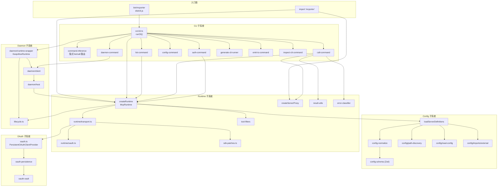
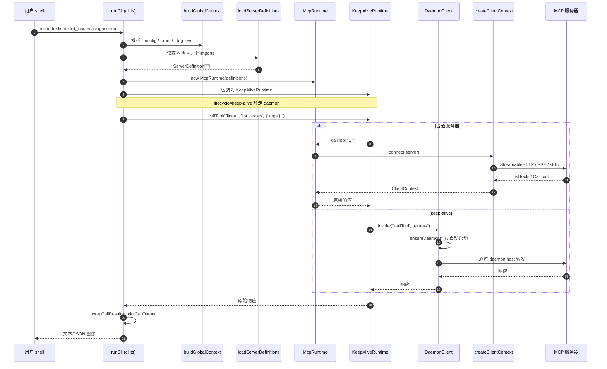
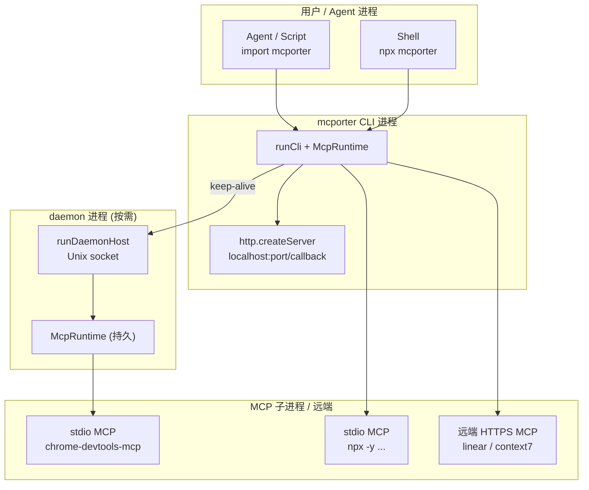
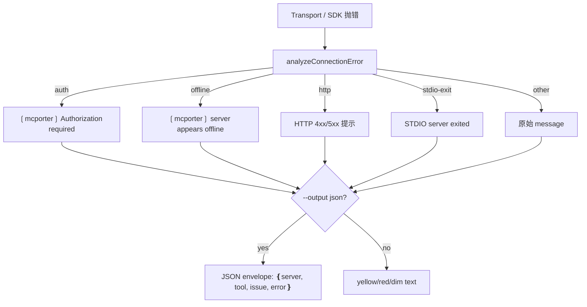

<details>
<summary>相关源文件</summary>

生成本页时使用的主要源文件：

- [src/cli.ts](../../../project-repos/mcporter/src/cli.ts)
- [src/runtime.ts](../../../project-repos/mcporter/src/runtime.ts)
- [src/config.ts](../../../project-repos/mcporter/src/config.ts)
- [src/server-proxy.ts](../../../project-repos/mcporter/src/server-proxy.ts)
- [src/daemon/runtime-wrapper.ts](../../../project-repos/mcporter/src/daemon/runtime-wrapper.ts)
- [src/daemon/host.ts](../../../project-repos/mcporter/src/daemon/host.ts)
- [src/index.ts](../../../project-repos/mcporter/src/index.ts)
- [src/runtime/transport.ts](../../../project-repos/mcporter/src/runtime/transport.ts)

</details>

# 系统架构

mcporter 的运行模型可以拆成五个相对独立的子系统：**CLI 入口**、**Runtime 核心**、**Config 加载**、**Daemon 守护进程**、**OAuth 与凭证**。CLI 是这些组件的 orchestrator，库使用者则会绕过 CLI、直接组合 Runtime 与 Config。这一节说明它们的边界、依赖方向以及一次完整调用的请求路径。

## 顶层模块拓扑



Sources: [src/cli.ts:1-30](../../../project-repos/mcporter/src/cli.ts#L1-L30), [src/runtime.ts:107-126](../../../project-repos/mcporter/src/runtime.ts#L107-L126), [src/daemon/runtime-wrapper.ts:13-48](../../../project-repos/mcporter/src/daemon/runtime-wrapper.ts#L13-L48), [src/daemon/host.ts:44-95](../../../project-repos/mcporter/src/daemon/host.ts#L44-L95), [src/index.ts:1-9](../../../project-repos/mcporter/src/index.ts#L1-L9)

<details class="source-snippets">
<summary>引用源码</summary>

<!-- source-snippets:start -->

#### `src/cli.ts:1-30`

```typescript
#!/usr/bin/env node
import { handleAuth, printAuthHelp } from './cli/auth-command.js';
import { printCallHelp, handleCall as runHandleCall } from './cli/call-command.js';
import { buildGlobalContext } from './cli/cli-factory.js';
import { inferCommandRouting } from './cli/command-inference.js';
import { handleConfigCli } from './cli/config-command.js';
import { handleDaemonCli } from './cli/daemon-command.js';
import { handleEmitTs } from './cli/emit-ts-command.js';
import { CliUsageError } from './cli/errors.js';
import { handleGenerateCli } from './cli/generate-cli-runner.js';
import { consumeHelpTokens, isHelpToken, isVersionToken, printHelp, printVersion } from './cli/help-output.js';
import { handleInspectCli } from './cli/inspect-cli-command.js';
import { handleList, printListHelp } from './cli/list-command.js';
import { logError, logInfo } from './cli/logger-context.js';
import { DEBUG_HANG, dumpActiveHandles, terminateChildProcesses } from './cli/runtime-debug.js';
import { resolveConfigPath } from './config.js';
import { DaemonClient } from './daemon/client.js';
import { createKeepAliveRuntime } from './daemon/runtime-wrapper.js';
import { isKeepAliveServer } from './lifecycle.js';
import { createRuntime } from './runtime.js';

export { handleAuth, printAuthHelp } from './cli/auth-command.js';
export { parseCallArguments } from './cli/call-arguments.js';
export { handleCall } from './cli/call-command.js';
export { handleGenerateCli } from './cli/generate-cli-runner.js';
export { handleInspectCli } from './cli/inspect-cli-command.js';
export { extractListFlags, handleList } from './cli/list-command.js';
export { resolveCallTimeout } from './cli/timeouts.js';

export async function runCli(argv: string[]): Promise<void> {
```

#### `src/runtime.ts:107-126`

```typescript
class McpRuntime implements Runtime {
  private readonly definitions: Map<string, ServerDefinition>;
  private readonly clients = new Map<string, Promise<ClientContext>>();
  private readonly logger: RuntimeLogger;
  private readonly clientInfo: { name: string; version: string };
  private readonly oauthTimeoutMs?: number;

  constructor(servers: ServerDefinition[], options: RuntimeOptions = {}) {
    for (const server of servers) {
      validateToolFilters(server.name, server);
    }
    this.definitions = new Map(servers.map((entry) => [entry.name, entry]));
    this.logger = options.logger ?? createConsoleLogger();
    this.clientInfo = options.clientInfo ?? {
      name: PACKAGE_NAME,
      version: CLIENT_VERSION,
    };
    this.oauthTimeoutMs = options.oauthTimeoutMs;
  }

```

#### `src/daemon/runtime-wrapper.ts:13-48`

```typescript
export function createKeepAliveRuntime(base: Runtime, options: KeepAliveRuntimeOptions): Runtime {
  if (!options.daemonClient || options.keepAliveServers.size === 0) {
    return base;
  }
  return new KeepAliveRuntime(base, options.daemonClient, options.keepAliveServers);
}

class KeepAliveRuntime implements Runtime {
  private readonly restartPromises = new Map<string, Promise<void>>();

  constructor(
    private readonly base: Runtime,
    private readonly daemon: DaemonClient,
    private readonly keepAliveServers: Set<string>
  ) {}

  listServers(): string[] {
    return this.base.listServers();
  }

  getDefinitions(): ServerDefinition[] {
    return this.base.getDefinitions();
  }

  getDefinition(server: string): ServerDefinition {
    return this.base.getDefinition(server);
  }

  registerDefinition(definition: ServerDefinition, options?: { overwrite?: boolean }): void {
    this.base.registerDefinition(definition, options);
    if (isKeepAliveServer(definition)) {
      this.keepAliveServers.add(definition.name);
    } else {
      this.keepAliveServers.delete(definition.name);
    }
  }
```

#### `src/daemon/host.ts:44-95`

```typescript
export async function runDaemonHost(options: DaemonHostOptions): Promise<void> {
  const configLayers = await collectConfigLayers({
    configPath: options.configExplicit ? options.configPath : undefined,
    rootDir: options.rootDir,
  });
  const runtime = await createRuntime({
    configPath: options.configExplicit ? options.configPath : undefined,
    rootDir: options.rootDir,
  });
  const keepAliveDefinitions = runtime.getDefinitions().filter(isKeepAliveServer);
  if (keepAliveDefinitions.length === 0) {
    throw new Error('No MCP servers require keep-alive; daemon will not start.');
  }
  const managedServers = new Map<string, ServerDefinition>();
  for (const definition of keepAliveDefinitions) {
    managedServers.set(definition.name, definition);
  }
  const serverLoggingOverrides = new Set<string>();
  for (const definition of keepAliveDefinitions) {
    if (definition.logging?.daemon?.enabled) {
      serverLoggingOverrides.add(definition.name);
    }
  }
  const combinedServerLogs = new Set<string>([
    ...serverLoggingOverrides,
    ...(options.logServers ? Array.from(options.logServers) : []),
  ]);
  const logContext = createLogContext({
    enabled: Boolean(options.logPath),
    logAllServers: options.logAllServers ?? false,
    servers: combinedServerLogs,
    logPath: options.logPath,
  });

  await prepareSocket(options.socketPath);
  await fs.mkdir(path.dirname(options.metadataPath), { recursive: true });
  const configMtimeMs = await statConfigMtime(options.configPath);

  const activity = new Map<string, ServerActivity>();
  for (const definition of keepAliveDefinitions) {
    activity.set(definition.name, { connected: false });
  }

  const idleWatcher = setInterval(() => {
    void evictIdleServers(runtime, managedServers, activity);
  }, 30_000);
  idleWatcher.unref();

  logEvent(logContext, 'Daemon host started.');

  const startedAt = Date.now();
  const server = net.createServer({ allowHalfOpen: true }, (socket) => {
```

#### `src/index.ts:1-9`

```typescript
export type { CommandSpec, ServerDefinition } from './config.js';
export { loadServerDefinitions } from './config.js';
export type { CallResult, ConnectionIssue, ImageContent } from './result-utils.js';
export { createCallResult, describeConnectionIssue, wrapCallResult } from './result-utils.js';
export type { CallOptions, ListToolsOptions, Runtime, RuntimeLogger, ServerToolInfo } from './runtime.js';
export { callOnce, createRuntime } from './runtime.js';
export type { ServerProxyOptions } from './server-proxy.js';
export { createServerProxy } from './server-proxy.js';
```

<!-- source-snippets:end -->
</details>
## 子系统边界与依赖方向

mcporter 的设计目标是让"库使用者"只看到 Runtime 与 Config 这两个子系统，CLI 与 Daemon 完全可选。下表把每个子系统的输入、输出和外部依赖列清楚：

| 子系统 | 入口 | 主要输出 | 关键外部依赖 |
|--------|------|----------|--------------|
| Config | `loadServerDefinitions(opts)` | `ServerDefinition[]` | 文件系统、JSONC（`jsonc-parser`）、TOML（`@iarna/toml`）、Zod |
| Runtime | `createRuntime(opts)` / `callOnce(...)` | `Runtime` 实例与原始 MCP 响应 | `@modelcontextprotocol/sdk` Client + 三种 Transport |
| ServerProxy | `createServerProxy(runtime, name)` | camelCase Proxy + schema 默认值 + `CallResult` | `Runtime` |
| CLI | `runCli(argv)` | 进程退出码 + stdout / stderr | `commander`、`ora`、`acorn`（call-expression-parser） |
| Daemon | `mcporter daemon`、自动启动 | Unix domain socket + JSON-RPC 协议 | `net`、`child_process`、底层 `Runtime` |
| OAuth | `createOAuthSession(definition, logger)` | `OAuthSession` + 回调 HTTP 服务器 | `node:http`、SDK `OAuthClientProvider` |

CLI 依赖 Runtime、Config、Daemon、OAuth；Runtime 依赖 Config、OAuth、SDK Patches；Daemon 内部又组合 Runtime（不组合 CLI）。这一关系在 `src/cli.ts:113-128` 表现得最直接：CLI 先 `createRuntime`，再用 `KeepAliveRuntime` 包一层 daemon 路由。

```ts
const baseRuntime = await createRuntime(runtimeOptionsWithPath);
const keepAliveServers = new Set(
  baseRuntime.getDefinitions().filter(isKeepAliveServer).map((entry) => entry.name)
);
const daemonClient = keepAliveServers.size > 0 ? new DaemonClient({...}) : null;
const runtime = createKeepAliveRuntime(baseRuntime, { daemonClient, keepAliveServers });
```

Sources: [src/cli.ts:113-128](../../../project-repos/mcporter/src/cli.ts#L113-L128), [src/index.ts:1-9](../../../project-repos/mcporter/src/index.ts#L1-L9), [src/runtime.ts:57-67](../../../project-repos/mcporter/src/runtime.ts#L57-L67)

<details class="source-snippets">
<summary>引用源码</summary>

<!-- source-snippets:start -->

#### `src/cli.ts:113-128`

```typescript
  const baseRuntime = await createRuntime(runtimeOptionsWithPath);
  const keepAliveServers = new Set(
    baseRuntime
      .getDefinitions()
      .filter(isKeepAliveServer)
      .map((entry) => entry.name)
  );
  const daemonClient =
    keepAliveServers.size > 0
      ? new DaemonClient({
          configPath: configResolution.path,
          configExplicit: configResolution.explicit,
          rootDir: rootOverride,
        })
      : null;
  const runtime = createKeepAliveRuntime(baseRuntime, { daemonClient, keepAliveServers });
```

#### `src/index.ts:1-9`

```typescript
export type { CommandSpec, ServerDefinition } from './config.js';
export { loadServerDefinitions } from './config.js';
export type { CallResult, ConnectionIssue, ImageContent } from './result-utils.js';
export { createCallResult, describeConnectionIssue, wrapCallResult } from './result-utils.js';
export type { CallOptions, ListToolsOptions, Runtime, RuntimeLogger, ServerToolInfo } from './runtime.js';
export { callOnce, createRuntime } from './runtime.js';
export type { ServerProxyOptions } from './server-proxy.js';
export { createServerProxy } from './server-proxy.js';
```

#### `src/runtime.ts:57-67`

```typescript
export interface Runtime {
  listServers(): string[];
  getDefinitions(): ServerDefinition[];
  getDefinition(server: string): ServerDefinition;
  registerDefinition(definition: ServerDefinition, options?: { overwrite?: boolean }): void;
  listTools(server: string, options?: ListToolsOptions): Promise<ServerToolInfo[]>;
  callTool(server: string, toolName: string, options?: CallOptions): Promise<unknown>;
  listResources(server: string, options?: Partial<ListResourcesRequest['params']>): Promise<unknown>;
  connect(server: string): Promise<ClientContext>;
  close(server?: string): Promise<void>;
}
```

<!-- source-snippets:end -->
</details>
## 一次 `mcporter call` 的请求路径



Sources: [src/cli.ts:113-167](../../../project-repos/mcporter/src/cli.ts#L113-L167), [src/cli/call-command.ts:393-451](../../../project-repos/mcporter/src/cli/call-command.ts#L393-L451), [src/runtime.ts:196-228](../../../project-repos/mcporter/src/runtime.ts#L196-L228), [src/daemon/runtime-wrapper.ts:63-75](../../../project-repos/mcporter/src/daemon/runtime-wrapper.ts#L63-L75)

<details class="source-snippets">
<summary>引用源码</summary>

<!-- source-snippets:start -->

#### `src/cli.ts:113-167`

```typescript
  const baseRuntime = await createRuntime(runtimeOptionsWithPath);
  const keepAliveServers = new Set(
    baseRuntime
      .getDefinitions()
      .filter(isKeepAliveServer)
      .map((entry) => entry.name)
  );
  const daemonClient =
    keepAliveServers.size > 0
      ? new DaemonClient({
          configPath: configResolution.path,
          configExplicit: configResolution.explicit,
          rootDir: rootOverride,
        })
      : null;
  const runtime = createKeepAliveRuntime(baseRuntime, { daemonClient, keepAliveServers });

  const inference = inferCommandRouting(command, args, runtime.getDefinitions());
  if (inference.kind === 'abort') {
    process.exitCode = inference.exitCode;
    return;
  }
  const resolvedCommand = inference.command;
  const resolvedArgs = inference.args;

  try {
    if (resolvedCommand === 'list') {
      if (consumeHelpTokens(resolvedArgs)) {
        printListHelp();
        process.exitCode = 0;
        return;
      }
      await handleList(runtime, resolvedArgs);
      return;
    }

    if (resolvedCommand === 'call') {
      if (consumeHelpTokens(resolvedArgs)) {
        printCallHelp();
        process.exitCode = 0;
        return;
      }
      await runHandleCall(runtime, resolvedArgs);
      return;
    }

    if (resolvedCommand === 'auth') {
      if (consumeHelpTokens(resolvedArgs)) {
        printAuthHelp();
        process.exitCode = 0;
        return;
      }
      await handleAuth(runtime, resolvedArgs);
      return;
    }
```

#### `src/cli/call-command.ts:393-451`

```typescript
async function invokeWithAutoCorrection(
  runtime: Awaited<ReturnType<(typeof import('../runtime.js'))['createRuntime']>>,
  server: string,
  tool: string,
  args: Record<string, unknown>,
  timeoutMs: number
): Promise<{ result: unknown; resolvedTool: string }> {
  // Attempt the original request first; if it fails with a "tool not found" we opportunistically retry once with a better match.
  return attemptCall(runtime, server, tool, args, timeoutMs, true);
}

async function attemptCall(
  runtime: Awaited<ReturnType<(typeof import('../runtime.js'))['createRuntime']>>,
  server: string,
  tool: string,
  args: Record<string, unknown>,
  timeoutMs: number,
  allowCorrection: boolean
): Promise<{ result: unknown; resolvedTool: string }> {
  try {
    const result = await withTimeout(runtime.callTool(server, tool, { args, timeoutMs }), timeoutMs);
    return { result, resolvedTool: tool };
  } catch (error) {
    if (error instanceof Error && error.message === 'Timeout') {
      const timeoutDisplay = `${timeoutMs}ms`;
      await runtime.close(server).catch(() => {});
      throw new Error(
        `Call to ${server}.${tool} timed out after ${timeoutDisplay}. Override MCPORTER_CALL_TIMEOUT or pass --timeout to adjust.`,
        { cause: error }
      );
    }

    if (!allowCorrection) {
      throw error;
    }

    const resolution = await maybeResolveToolName(runtime, server, tool, error);
    if (!resolution) {
      maybeReportConnectionIssue(server, tool, error);
      throw error;
    }

    const messages = renderIdentifierResolutionMessages({
      entity: 'tool',
      attempted: tool,
      resolution,
      scope: server,
    });
    if (resolution.kind === 'suggest') {
      if (messages.suggest) {
        console.error(dimText(messages.suggest));
      }
      throw error;
    }
    if (messages.auto) {
      console.log(dimText(messages.auto));
    }
    return attemptCall(runtime, server, resolution.value, args, timeoutMs, false);
  }
```

#### `src/runtime.ts:196-228`

```typescript
  async callTool(server: string, toolName: string, options: CallOptions = {}): Promise<unknown> {
    const definition = this.definitions.get(server.trim());
    if (definition && !isToolAllowed(toolName, definition)) {
      throw new Error(
        `Tool '${toolName}' is not accessible on server '${definition.name}' (blocked by configuration).`
      );
    }
    try {
      const { client } = await this.connect(server);
      const params: CallToolRequest['params'] = {
        name: toolName,
        arguments: options.args ?? {},
      };
      // Forward the requested timeout to the MCP client so server-side requests don't hit the SDK's
      // default 60s cap. Keep our own outer race as a second guard.
      const timeoutMs = normalizeTimeout(options.timeoutMs);
      const resultPromise = client.callTool(params, undefined, {
        timeout: timeoutMs,
        // Long runs (e.g., GPT-5 Pro) emit progress/logging; allow that to refresh the timer.
        resetTimeoutOnProgress: true,
        maxTotalTimeout: timeoutMs,
      });
      if (!timeoutMs) {
        return await resultPromise;
      }
      return await raceWithTimeout(resultPromise, timeoutMs);
    } catch (error) {
      // Runtime timeouts and transport crashes should tear down the cached connection so
      // the daemon (or direct runtime) can relaunch the MCP server on the next attempt.
      await this.resetConnectionOnError(server, error);
      throw error;
    }
  }
```

#### `src/daemon/runtime-wrapper.ts:63-75`

```typescript
  async callTool(server: string, toolName: string, options?: CallOptions): Promise<unknown> {
    if (this.shouldUseDaemon(server)) {
      return this.invokeWithRestart(server, 'callTool', () =>
        this.daemon.callTool({
          server,
          tool: toolName,
          args: options?.args,
          timeoutMs: options?.timeoutMs,
        })
      );
    }
    return this.base.callTool(server, toolName, options);
  }
```

<!-- source-snippets:end -->
</details>
## 关键抽象的责任划分

### `ServerDefinition` 是合约边界

所有子系统对外都以 `ServerDefinition` 作为统一句柄。它在 [src/config-schema.ts:170-191]() 定义，把 HTTP / stdio 两种传输和 OAuth、生命周期、`allowedTools/blockedTools`、日志开关合并到同一个对象里。Runtime 不关心定义来自本地、来自 Cursor、还是临时的 `--http-url`，全部统一处理。

### `Runtime` 接口是最小公约数

`src/runtime.ts:57-67` 定义的 `Runtime` 接口只有 8 个方法：`listServers / getDefinitions / getDefinition / registerDefinition / listTools / callTool / listResources / connect / close`。两个具体实现共享同一接口：

- `McpRuntime`（基础实现）：内部用 `Map<string, Promise<ClientContext>>` 做连接池缓存（[src/runtime.ts:243-279]()）。
- `KeepAliveRuntime`（daemon 包装）：当 server 在 `keepAliveServers` 集合里时把 `listTools / callTool / listResources / close` 转发给 `DaemonClient`，否则透传基础实现（[src/daemon/runtime-wrapper.ts:50-100]()）。

这层薄抽象是 daemon 引入后保持原 API 兼容的关键——库使用者依然得到 `Runtime`，daemon 仅在 CLI 路径上自动激活。

Sources: [src/runtime.ts:57-126](../../../project-repos/mcporter/src/runtime.ts#L57-L126), [src/daemon/runtime-wrapper.ts:13-48](../../../project-repos/mcporter/src/daemon/runtime-wrapper.ts#L13-L48), [src/config-schema.ts:170-191](../../../project-repos/mcporter/src/config-schema.ts#L170-L191)

<details class="source-snippets">
<summary>引用源码</summary>

<!-- source-snippets:start -->

#### `src/runtime.ts:57-126`

```typescript
export interface Runtime {
  listServers(): string[];
  getDefinitions(): ServerDefinition[];
  getDefinition(server: string): ServerDefinition;
  registerDefinition(definition: ServerDefinition, options?: { overwrite?: boolean }): void;
  listTools(server: string, options?: ListToolsOptions): Promise<ServerToolInfo[]>;
  callTool(server: string, toolName: string, options?: CallOptions): Promise<unknown>;
  listResources(server: string, options?: Partial<ListResourcesRequest['params']>): Promise<unknown>;
  connect(server: string): Promise<ClientContext>;
  close(server?: string): Promise<void>;
}

export interface ServerToolInfo {
  readonly name: string;
  readonly description?: string;
  readonly inputSchema?: unknown;
  readonly outputSchema?: unknown;
}

// createRuntime spins up a pooled MCP runtime from config JSON or provided definitions.
export async function createRuntime(options: RuntimeOptions = {}): Promise<Runtime> {
  // Build the runtime with either the provided server list or the config file contents.
  const servers =
    options.servers ??
    (await loadServerDefinitions({
      configPath: options.configPath,
      rootDir: options.rootDir,
    }));

  const runtime = new McpRuntime(servers, options);
  return runtime;
}

// callOnce connects to a server, invokes a single tool, and disposes the connection immediately.
export async function callOnce(params: {
  server: string;
  toolName: string;
  args?: Record<string, unknown>;
  configPath?: string;
}): Promise<unknown> {
  const runtime = await createRuntime({ configPath: params.configPath });
  try {
    return await runtime.callTool(params.server, params.toolName, {
      args: params.args,
    });
  } finally {
    await runtime.close(params.server);
  }
}

class McpRuntime implements Runtime {
  private readonly definitions: Map<string, ServerDefinition>;
  private readonly clients = new Map<string, Promise<ClientContext>>();
  private readonly logger: RuntimeLogger;
  private readonly clientInfo: { name: string; version: string };
  private readonly oauthTimeoutMs?: number;

  constructor(servers: ServerDefinition[], options: RuntimeOptions = {}) {
    for (const server of servers) {
      validateToolFilters(server.name, server);
    }
    this.definitions = new Map(servers.map((entry) => [entry.name, entry]));
    this.logger = options.logger ?? createConsoleLogger();
    this.clientInfo = options.clientInfo ?? {
      name: PACKAGE_NAME,
      version: CLIENT_VERSION,
    };
    this.oauthTimeoutMs = options.oauthTimeoutMs;
  }

```

#### `src/daemon/runtime-wrapper.ts:13-48`

```typescript
export function createKeepAliveRuntime(base: Runtime, options: KeepAliveRuntimeOptions): Runtime {
  if (!options.daemonClient || options.keepAliveServers.size === 0) {
    return base;
  }
  return new KeepAliveRuntime(base, options.daemonClient, options.keepAliveServers);
}

class KeepAliveRuntime implements Runtime {
  private readonly restartPromises = new Map<string, Promise<void>>();

  constructor(
    private readonly base: Runtime,
    private readonly daemon: DaemonClient,
    private readonly keepAliveServers: Set<string>
  ) {}

  listServers(): string[] {
    return this.base.listServers();
  }

  getDefinitions(): ServerDefinition[] {
    return this.base.getDefinitions();
  }

  getDefinition(server: string): ServerDefinition {
    return this.base.getDefinition(server);
  }

  registerDefinition(definition: ServerDefinition, options?: { overwrite?: boolean }): void {
    this.base.registerDefinition(definition, options);
    if (isKeepAliveServer(definition)) {
      this.keepAliveServers.add(definition.name);
    } else {
      this.keepAliveServers.delete(definition.name);
    }
  }
```

#### `src/config-schema.ts:170-191`

```typescript
export interface ServerDefinition {
  readonly name: string;
  readonly description?: string;
  readonly command: CommandSpec;
  readonly env?: Record<string, string>;
  readonly auth?: string;
  readonly tokenCacheDir?: string;
  readonly clientName?: string;
  readonly oauthRedirectUrl?: string;
  readonly oauthScope?: string;
  readonly oauthCommand?: {
    readonly args: string[];
  };
  readonly source?: ServerSource;
  readonly sources?: readonly ServerSource[];
  readonly lifecycle?: ServerLifecycle;
  readonly logging?: ServerLoggingOptions;
  /** When specified, only these exact tool names are exposed. Empty array blocks all tools. */
  readonly allowedTools?: readonly string[];
  /** When specified, these exact tool names are hidden and blocked. Cannot be combined with allowedTools. */
  readonly blockedTools?: readonly string[];
}
```

<!-- source-snippets:end -->
</details>
### `ServerProxy` 把 MCP "对象化"

`createServerProxy(runtime, name)` 返回一个 ES Proxy，把 `proxy.takeSnapshot()` 这样的 camelCase 调用映射到 kebab-case 工具名（`take-snapshot`）。它在 [src/server-proxy.ts:283-407]() 实现，并对 schema 做了三件事：

1. 调 `runtime.listTools(server, { includeSchema: true })` 拉取 schema 并按 `tool.name` 缓存（含磁盘持久化 `~/.mcporter/<server>/schema.json`）。
2. 把位置参数按 `required` + `properties` 顺序映射成对象。
3. 应用 schema `default` 值，并在缺失必填字段时直接抛错（`Missing required arguments: ...`）。

`ServerProxy` 调用最终回到 `runtime.callTool`，结果用 `createCallResult` 包装，调用者可以选择 `.text()` / `.json()` / `.markdown()` / `.images()` / `.content()`。

Sources: [src/server-proxy.ts:108-122](../../../project-repos/mcporter/src/server-proxy.ts#L108-L122), [src/server-proxy.ts:283-407](../../../project-repos/mcporter/src/server-proxy.ts#L283-L407), [src/result-utils.ts:227-310](../../../project-repos/mcporter/src/result-utils.ts#L227-L310)

<details class="source-snippets">
<summary>引用源码</summary>

<!-- source-snippets:start -->

#### `src/server-proxy.ts:108-122`

```typescript
// validateRequired ensures all schema-required fields are present before invocation.
function validateRequired(meta: ToolSchemaInfo, args?: ToolArguments): void {
  if (meta.requiredKeys.length === 0) {
    return;
  }
  if (!isPlainObject(args)) {
    throw new Error(`Missing required arguments: ${meta.requiredKeys.join(', ')}`);
  }
  const missing = meta.requiredKeys.filter((key) => (args as Record<string, unknown>)[key] === undefined);
  if (missing.length > 0) {
    throw new Error(`Missing required arguments: ${missing.join(', ')}`);
  }
}

// createServerProxy returns a proxy that maps property access to MCP tool invocations.
```

#### `src/server-proxy.ts:283-407`

```typescript
  const base: ServerProxy = {
    call: async (toolName: string, callOptions?: ToolCallOptions) => {
      const result = await runtime.callTool(serverName, toolName, callOptions ?? {});
      return createCallResult(result);
    },
    listTools: (listOptions) => runtime.listTools(serverName, listOptions),
  };

  return new Proxy(base as ServerProxy & Record<string | symbol, unknown>, {
    get(target, property, receiver) {
      if (Reflect.has(target, property)) {
        return Reflect.get(target, property, receiver);
      }
      const propertyKey = property;
      const canonicalKey = typeof propertyKey === 'string' ? canonicalizeToolName(propertyKey) : null;
      let resolvedToolName =
        typeof propertyKey === 'string' && canonicalKey
          ? (toolAliasMap.get(canonicalKey) ?? mapPropertyToTool(propertyKey))
          : mapPropertyToTool(propertyKey);

      return async (...callArgs: unknown[]) => {
        let schemaInfo: ToolSchemaInfo | undefined;
        try {
          schemaInfo = await ensureMetadata(resolvedToolName);
        } catch {
          schemaInfo = undefined;
        }
        if (typeof propertyKey === 'string' && canonicalKey) {
          const alias = toolAliasMap.get(canonicalKey);
          if (alias && alias !== resolvedToolName) {
            resolvedToolName = alias;
            try {
              schemaInfo = await ensureMetadata(resolvedToolName);
            } catch {
              // ignore and keep prior schema if available
            }
          }
        }

        const positional: unknown[] = [];
        const argsAccumulator: Record<string, unknown> = {};
        const optionsAccumulator: ToolCallOptions = {};

        for (const arg of callArgs) {
          if (isPlainObject(arg)) {
            const keys = Object.keys(arg);
            const treatAsArgs =
              schemaInfo !== undefined &&
              keys.length > 0 &&
              (keys.every((key) => schemaInfo.propertySet.has(key)) ||
                keys.every((key) => !KNOWN_OPTION_KEYS.has(key)));

            if (treatAsArgs) {
              Object.assign(argsAccumulator, arg as Record<string, unknown>);
            } else {
              Object.assign(optionsAccumulator, arg as ToolCallOptions);
            }
          } else {
            positional.push(arg);
          }
        }

        const explicitArgs = optionsAccumulator.args as ToolArguments | undefined;
        if (explicitArgs !== undefined) {
          delete (optionsAccumulator as Record<string, unknown>).args;
        }

        const finalOptions: ToolCallOptions = { ...optionsAccumulator };
        let combinedArgs: ToolArguments | undefined = explicitArgs;

        if (schemaInfo) {
          const schema = schemaInfo;

          if (positional.length > schema.orderedKeys.length) {
            throw new Error(`Too many positional arguments for tool "${resolvedToolName}"`);
          }

          if (positional.length > 0) {
            const baseArgs = isPlainObject(combinedArgs) ? { ...(combinedArgs as Record<string, unknown>) } : {};
            positional.forEach((value, idx) => {
              const key = schema.orderedKeys[idx];
              if (key) {
                baseArgs[key] = value;
              }
            });
            combinedArgs = baseArgs as ToolArguments;
          }

          if (Object.keys(argsAccumulator).length > 0) {
            const baseArgs = isPlainObject(combinedArgs) ? { ...(combinedArgs as Record<string, unknown>) } : {};
            Object.assign(baseArgs, argsAccumulator);
            combinedArgs = baseArgs as ToolArguments;
          }

          if (combinedArgs !== undefined) {
            combinedArgs = applyDefaults(schema, combinedArgs);
          } else {
            const defaults = applyDefaults(schema, undefined);
            if (defaults && typeof defaults === 'object') {
              combinedArgs = defaults as ToolArguments;
            }
          }

          validateRequired(schema, combinedArgs);
        } else {
          if (positional.length > 0) {
            combinedArgs = positional as unknown as ToolArguments;
          }
          if (Object.keys(argsAccumulator).length > 0) {
            const baseArgs = isPlainObject(combinedArgs) ? { ...(combinedArgs as Record<string, unknown>) } : {};
            Object.assign(baseArgs, argsAccumulator);
            combinedArgs = baseArgs as ToolArguments;
          }
        }

        if (combinedArgs !== undefined) {
          finalOptions.args = combinedArgs;
        }

        const result = await runtime.callTool(serverName, resolvedToolName, finalOptions);
... snippet truncated ...
```

#### `src/result-utils.ts:227-310`

```typescript
// createCallResult wraps a tool response with helpers for common content types.
export function createCallResult<T = unknown>(raw: T): CallResult<T> {
  let cachedContent: CollectedCallContent | undefined;
  const getCollectedContent = (): CollectedCallContent => {
    if (cachedContent) {
      return cachedContent;
    }
    cachedContent = collectCallContent(raw);
    return cachedContent;
  };

  return {
    raw,
    text(joiner = '\n') {
      if (raw == null) {
        return null;
      }
      if (typeof raw === 'string') {
        return raw;
      }

      const collected = getCollectedContent();
      const combinedText = collectText(collected.textEntries, joiner);
      if (combinedText) {
        return combinedText;
      }
      return asString(collected.structuredContent);
    },
    markdown(joiner = '\n') {
      const collected = getCollectedContent();
      const structured = collected.structuredContent;
      if (structured && typeof structured === 'object') {
        const markdown = (structured as Record<string, unknown>).markdown;
        if (typeof markdown === 'string') {
          return markdown;
        }
      }
      return collectText(collected.markdownEntries, joiner);
    },
    json<J = unknown>() {
      const collected = getCollectedContent();
      const parsedStructured = parseStructuredContent(collected.structuredContent);
      if (parsedStructured !== null) {
        return parsedStructured as J;
      }
      if (collected.jsonCandidates.length === 1) {
        return collected.jsonCandidates[0] as J;
      }
      if (collected.jsonCandidates.length > 1) {
        return collected.jsonCandidates as J;
      }
      if (typeof raw === 'string') {
        const parsedRaw = tryParseJson(raw);
        if (parsedRaw !== null) {
          return parsedRaw as J;
        }
      }
      const textContent = this.text?.();
      if (typeof textContent === 'string') {
        const parsedText = tryParseJson(textContent);
        if (parsedText !== null) {
          return parsedText as J;
        }
      }
      const markdownContent = this.markdown?.();
      if (typeof markdownContent === 'string') {
        const parsedMarkdown = tryParseJson(markdownContent);
        if (parsedMarkdown !== null) {
          return parsedMarkdown as J;
        }
      }
      return null;
    },
    images() {
      const collected = getCollectedContent();
      return collectImages(collected.images);
    },
    content() {
      return getCollectedContent().content;
    },
    structuredContent() {
      return getCollectedContent().structuredContent;
    },
  };
```

<!-- source-snippets:end -->
</details>
## 进程模型与执行环境



实际部署里有几个关键事实：

- 默认情况下 `mcporter` CLI 是短命进程：`runCli` 完成后会 `process.exit(0)`，并主动 destroy 子进程（[src/cli.ts:185-203]()）。这是为了规避 typescript-sdk #579/#780/#1049 中描述的 stdio 句柄泄漏问题；`MCPORTER_NO_FORCE_EXIT=1` 可以关闭。
- OAuth 流程的本地回调服务器是临时的，每次 OAuth 会话开一个新的 `http.Server`，授权码到手后立刻 `server.close()`（[src/oauth.ts:170-218](), [src/oauth.ts:286-299]()）。
- daemon 是常驻的：第一次访问 keep-alive 服务器时由 `DaemonClient.startDaemon()` 自动以 `MCPORTER_DAEMON_CHILD=1` 派生一个 detached 子进程（[src/daemon/client.ts:133-152](), [src/daemon/launch.ts]()），通过 socket 与 metadata 文件锚定。

Sources: [src/cli.ts:168-204](../../../project-repos/mcporter/src/cli.ts#L168-L204), [src/oauth.ts:104-167](../../../project-repos/mcporter/src/oauth.ts#L104-L167), [src/daemon/client.ts:114-163](../../../project-repos/mcporter/src/daemon/client.ts#L114-L163)

<details class="source-snippets">
<summary>引用源码</summary>

<!-- source-snippets:start -->

#### `src/cli.ts:168-204`

```typescript
  } finally {
    const closeStart = Date.now();
    if (DEBUG_HANG) {
      logInfo('[debug] beginning runtime.close()');
      dumpActiveHandles('before runtime.close');
    }
    try {
      await runtime.close();
      if (DEBUG_HANG) {
        const duration = Date.now() - closeStart;
        logInfo(`[debug] runtime.close() completed in ${duration}ms`);
        dumpActiveHandles('after runtime.close');
      }
    } catch (error) {
      if (DEBUG_HANG) {
        logError('[debug] runtime.close() failed', error);
      }
    } finally {
      terminateChildProcesses('runtime.finally');
      // By default we force an exit after cleanup so Node doesn't hang on lingering stdio handles
      // (see typescript-sdk#579/#780/#1049). Opt out by exporting MCPORTER_NO_FORCE_EXIT=1.
      const disableForceExit = process.env.MCPORTER_NO_FORCE_EXIT === '1';
      if (DEBUG_HANG) {
        dumpActiveHandles('after terminateChildProcesses');
        if (!disableForceExit || process.env.MCPORTER_FORCE_EXIT === '1') {
          process.exit(0);
        }
      } else {
        const scheduleExit = () => {
          if (!disableForceExit || process.env.MCPORTER_FORCE_EXIT === '1') {
            process.exit(0);
          }
        };
        setImmediate(scheduleExit);
      }
    }
  }
```

#### `src/oauth.ts:104-167`

```typescript

    const server = http.createServer();
    const overrideRedirect = definition.oauthRedirectUrl ? new URL(definition.oauthRedirectUrl) : null;
    const listenHost = overrideRedirect?.hostname ?? CALLBACK_HOST;
    const overridePort = overrideRedirect?.port ?? '';
    const usesDynamicPort = !overrideRedirect || overridePort === '' || overridePort === '0';
    const desiredPort = usesDynamicPort ? undefined : Number.parseInt(overridePort, 10);
    const callbackPath =
      overrideRedirect?.pathname && overrideRedirect.pathname !== '/' ? overrideRedirect.pathname : CALLBACK_PATH;
    const port = await new Promise<number>((resolve, reject) => {
      server.listen(desiredPort ?? 0, listenHost, () => {
        const address = server.address();
        if (typeof address === 'object' && address && 'port' in address) {
          resolve(address.port);
        } else {
          reject(new Error('Failed to determine callback port'));
        }
      });
      server.once('error', (error) => reject(error));
    });

    const redirectUrl = overrideRedirect
      ? new URL(overrideRedirect.toString())
      : new URL(`http://${listenHost}:${port}${callbackPath}`);
    if (usesDynamicPort) {
      redirectUrl.port = String(port);
    }
    if (!overrideRedirect || overrideRedirect.pathname === '/' || overrideRedirect.pathname === '') {
      redirectUrl.pathname = callbackPath;
    }

    // When using a dynamic port, the redirect URI changes every run.  If a
    // previous client registration is cached with a different redirect URI the
    // auth server will reject the request with `invalid_redirect_uri`.  Clear
    // the stale registration so the next flow re-registers with the new URI.
    // Wrapped in try/catch so persistence errors (malformed JSON, permission
    // issues) close the already-bound callback server instead of leaking it.
    if (usesDynamicPort) {
      try {
        const cachedClient = await persistence.readClientInfo();
        const cachedRedirect = firstRedirectUri(cachedClient);
        if (cachedRedirect && cachedRedirect !== redirectUrl.toString()) {
          logger.info(
            `Redirect URI changed (${cachedRedirect} → ${redirectUrl.toString()}); clearing stale client registration.`
          );
          await persistence.clear('client');
        }
      } catch (error) {
        await new Promise<void>((resolve) => {
          server.close(() => resolve());
        });
        throw error;
      }
    }

    const provider = new PersistentOAuthClientProvider(definition, persistence, redirectUrl, logger);
    provider.attachServer(server);
    return {
      provider,
      close: async () => {
        await provider.close();
      },
    };
  }
```

#### `src/daemon/client.ts:114-163`

```typescript
  private async ensureDaemon(): Promise<void> {
    if (await this.isConfigStale()) {
      await this.stop().catch(() => {});
      await this.restartDaemon();
      return;
    }
    const available = await this.isResponsive();
    if (available) {
      return;
    }
    await this.startDaemon();
    await this.waitForReady();
  }

  private async restartDaemon(): Promise<void> {
    await this.startDaemon();
    await this.waitForReady();
  }

  private async startDaemon(): Promise<void> {
    if (this.startingPromise) {
      await this.startingPromise;
      return;
    }
    this.startingPromise = Promise.resolve()
      .then(() => {
        launchDaemonDetached({
          configPath: this.options.configPath,
          configExplicit: this.options.configExplicit,
          rootDir: this.options.rootDir,
          metadataPath: this.metadataPath,
          socketPath: this.socketPath,
        });
      })
      .finally(() => {
        this.startingPromise = null;
      });
    await this.startingPromise;
  }

  private async waitForReady(): Promise<void> {
    const deadline = Date.now() + 10_000;
    while (Date.now() < deadline) {
      if (await this.isResponsive()) {
        return;
      }
      await delay(100);
    }
    throw new Error('Timeout while waiting for MCPorter daemon to start.');
  }
```

<!-- source-snippets:end -->
</details>
## 跨边界的错误模型

错误从底层传输冒到 CLI 时会被 `analyzeConnectionError` 归一成 5 类：`auth | offline | http | stdio-exit | other`（[src/error-classifier.ts:3-63]()）。`callTool` 失败时 Runtime 会根据 `shouldResetConnection` 决定是否重置缓存的 `ClientContext`（[src/runtime.ts:308-323]()）；CLI 层进一步把这些分类翻译成黄/红/dim 的可读提示，并在 `--output json` 模式下封装成 `{ server, tool, issue, error }` 的稳定信封（[src/cli/call-command.ts:494-521](), [src/cli/json-output.ts]()）。



Sources: [src/error-classifier.ts:41-63](../../../project-repos/mcporter/src/error-classifier.ts#L41-L63), [src/cli/call-command.ts:494-521](../../../project-repos/mcporter/src/cli/call-command.ts#L494-L521), [src/runtime.ts:308-323](../../../project-repos/mcporter/src/runtime.ts#L308-L323)

<details class="source-snippets">
<summary>引用源码</summary>

<!-- source-snippets:start -->

#### `src/error-classifier.ts:41-63`

```typescript
export function analyzeConnectionError(error: unknown): ConnectionIssue {
  const rawMessage = extractMessage(error);
  if (error instanceof UnauthorizedError) {
    return { kind: 'auth', rawMessage };
  }
  const stdio = extractStdioExit(rawMessage);
  if (stdio) {
    return { kind: 'stdio-exit', rawMessage, ...stdio };
  }
  const errorCode = extractErrorCode(error);
  const statusCode = errorCode ?? extractStatusCode(rawMessage);
  const normalized = rawMessage.toLowerCase();
  if (AUTH_STATUSES.has(statusCode ?? -1) || containsAuthToken(normalized)) {
    return { kind: 'auth', rawMessage, statusCode };
  }
  if (statusCode && statusCode >= 400) {
    return { kind: 'http', rawMessage, statusCode };
  }
  if (OFFLINE_PATTERNS.some((pattern) => normalized.includes(pattern))) {
    return { kind: 'offline', rawMessage };
  }
  return { kind: 'other', rawMessage };
}
```

#### `src/cli/call-command.ts:494-521`

```typescript
function maybeReportConnectionIssue(server: string, tool: string, error: unknown): ConnectionIssue | undefined {
  const issue = analyzeConnectionError(error);
  const detail = summarizeIssueMessage(issue.rawMessage);
  if (issue.kind === 'auth') {
    const authCommand = `mcporter auth ${server}`;
    const hint = `[mcporter] Authorization required for ${server}. Run '${authCommand}'.${detail ? ` (${detail})` : ''}`;
    console.error(yellowText(hint));
    return issue;
  }
  if (issue.kind === 'offline') {
    const hint = `[mcporter] ${server} appears offline${detail ? ` (${detail})` : ''}.`;
    console.error(redText(hint));
    return issue;
  }
  if (issue.kind === 'http') {
    const status = issue.statusCode ? `HTTP ${issue.statusCode}` : 'an HTTP error';
    const hint = `[mcporter] ${server}.${tool} responded with ${status}${detail ? ` (${detail})` : ''}.`;
    console.error(dimText(hint));
    return issue;
  }
  if (issue.kind === 'stdio-exit') {
    const exit = typeof issue.stdioExitCode === 'number' ? `code ${issue.stdioExitCode}` : 'an unknown status';
    const signal = issue.stdioSignal ? ` (signal ${issue.stdioSignal})` : '';
    const hint = `[mcporter] STDIO server for ${server} exited with ${exit}${signal}.`;
    console.error(redText(hint));
  }
  return issue;
}
```

#### `src/runtime.ts:308-323`

```typescript
  private async resetConnectionOnError(server: string, error: unknown): Promise<void> {
    if (!shouldResetConnection(error)) {
      return;
    }
    const normalized = server.trim();
    if (!this.clients.has(normalized)) {
      return;
    }
    try {
      // Reuse the existing close() helper so transport shutdown stays consistent with
      // normal runtime disposal (wait for STDIO children, close OAuth sessions, etc.).
      await this.close(normalized);
    } catch (closeError) {
      const detail = closeError instanceof Error ? closeError.message : String(closeError);
      this.logger.warn(`Failed to reset '${normalized}' after error: ${detail}`);
    }
```

<!-- source-snippets:end -->
</details>
## 设计取舍

- **库优先 vs CLI 优先** — 公共 API 仅 9 行（[src/index.ts]()），把绝大多数复杂度藏在 `src/cli/**`。库使用者拿到的依然是干净的 `Runtime`，CLI 是它的一个调用方而不是反过来。
- **乐观并发 + 强制收敛** — `McpRuntime` 用 `Map<string, Promise<ClientContext>>` 存连接，并在调用失败时按 `shouldResetConnection` 主动逐出缓存。失败重连不依赖任何"健康检查"，只依赖错误分类。
- **避免引入新协议** — daemon 没有用 gRPC / HTTP，只用 Unix socket + 一行 JSON。请求结构定义在 [src/daemon/protocol.ts:1-58]() 的不到 60 行里，便于 CLI 与 daemon 在同一进程下被独立测试。
- **强 Patch 而非 Wait** — `sdk-patches.ts` 直接 monkey-patch `StdioClientTransport.prototype.close`，宁愿吃掉一段维护成本也要保证子进程能在 700ms / SIGTERM / SIGKILL 三段升级里退干净（[src/sdk-patches.ts:236-336]()）。
- **配置可叠加而非合并冲突** — `loadServerDefinitions` 用"先到先得"语义合并 7 个编辑器导入与多层 `mcporter.json`：本地永远赢导入，导入按 `imports` 数组顺序优先（[src/config.ts:36-104]()）。

Sources: [src/index.ts:1-9](../../../project-repos/mcporter/src/index.ts#L1-L9), [src/runtime.ts:243-279](../../../project-repos/mcporter/src/runtime.ts#L243-L279), [src/sdk-patches.ts:236-336](../../../project-repos/mcporter/src/sdk-patches.ts#L236-L336), [src/config.ts:36-104](../../../project-repos/mcporter/src/config.ts#L36-L104)

<details class="source-snippets">
<summary>引用源码</summary>

<!-- source-snippets:start -->

#### `src/index.ts:1-9`

```typescript
export type { CommandSpec, ServerDefinition } from './config.js';
export { loadServerDefinitions } from './config.js';
export type { CallResult, ConnectionIssue, ImageContent } from './result-utils.js';
export { createCallResult, describeConnectionIssue, wrapCallResult } from './result-utils.js';
export type { CallOptions, ListToolsOptions, Runtime, RuntimeLogger, ServerToolInfo } from './runtime.js';
export { callOnce, createRuntime } from './runtime.js';
export type { ServerProxyOptions } from './server-proxy.js';
export { createServerProxy } from './server-proxy.js';
```

#### `src/runtime.ts:243-279`

```typescript
  async connect(server: string, options: ConnectOptions = {}): Promise<ClientContext> {
    // Reuse cached connections unless the caller explicitly opted out.
    const normalized = server.trim();

    const useCache = options.skipCache !== true && options.maxOAuthAttempts === undefined;

    if (useCache) {
      const existing = this.clients.get(normalized);
      if (existing) {
        return existing;
      }
    }

    const definition = this.definitions.get(normalized);
    if (!definition) {
      throw new Error(`Unknown MCP server '${normalized}'.`);
    }

    const connection = createClientContext(definition, this.logger, this.clientInfo, {
      maxOAuthAttempts: options.maxOAuthAttempts,
      oauthTimeoutMs: this.oauthTimeoutMs ?? OAUTH_CODE_TIMEOUT_MS,
      onDefinitionPromoted: (promoted) => this.definitions.set(promoted.name, promoted),
      allowCachedAuth: options.allowCachedAuth,
    });

    if (useCache) {
      this.clients.set(normalized, connection);
      try {
        return await connection;
      } catch (error) {
        this.clients.delete(normalized);
        throw error;
      }
    }

    return connection;
  }
```

#### `src/sdk-patches.ts:236-336`

```typescript
function patchStdioClose(): void {
  const marker = Symbol.for('mcporter.stdio.patched');
  const proto = StdioClientTransport.prototype as unknown as Record<symbol, unknown>;
  if (proto[marker]) {
    return;
  }

  patchStdioStart();

  StdioClientTransport.prototype.close = async function patchedClose(): Promise<void> {
    const transport = this as unknown as {
      _process?: MaybeChildProcess | null;
      _stderrStream?: PassThrough | null;
      _abortController?: AbortController | null;
      _readBuffer?: { clear(): void } | null;
      onclose?: () => void;
    };
    const child = transport._process ?? null;
    const stderrStream = transport._stderrStream ?? null;
    const meta = (child ? PROCESS_BUFFERS.get(child) : undefined) ?? TRANSPORT_BUFFERS.get(transport as object);

    if (stderrStream) {
      // Ensure any piped stderr stream is torn down so no file descriptors linger.
      destroyStream(stderrStream);
      transport._stderrStream = null;
    }

    // Abort active reads/writes and clear buffered state just like the SDK does.
    transport._abortController?.abort();
    transport._abortController = null;
    transport._readBuffer?.clear?.();
    transport._readBuffer = null;

    if (!child) {
      transport.onclose?.();
      return;
    }

    // Closing stdin/stdout/stderr proactively lets Node release the handles even
    // when the child ignores SIGTERM (common with npm/npx wrappers).
    destroyStream(child.stdin);
    destroyStream(child.stdout);
    destroyStream(child.stderr);

    const stdio = Array.isArray(child.stdio) ? child.stdio : [];
    for (const stream of stdio) {
      destroyStream(stream);
    }

    let exited = await waitForChildClose(child, 700).then(
      () => true,
      () => false
    );

    if (!exited) {
      // First escalation: polite SIGTERM.
      try {
        child.kill('SIGTERM');
      } catch {
        // ignore
      }
      exited = await waitForChildClose(child, 700).then(
        () => true,
        () => false
      );
    }

    if (!exited) {
      // Final escalation: SIGKILL. If this still fails, fall through and warn.
      try {
        child.kill('SIGKILL');
      } catch {
        // ignore
      }
      await waitForChildClose(child, 500).catch(() => {});
    }

    destroyStream(child.stdin);
    destroyStream(child.stdout);
    destroyStream(child.stderr);

    const stdioAfter = Array.isArray(child.stdio) ? child.stdio : [];
    for (const stream of stdioAfter) {
      // Some transports mutate stdio in-place; run the destroy sweep again to be sure.
      destroyStream(stream);
    }

    child.unref?.();

    if (meta) {
      flushProcessLogs(meta.child ?? child, meta);
    } else if (STDIO_TRACE_ENABLED) {
      console.log('[mcporter] STDIO trace: attempted to close transport without recorded metadata.');
    }

    transport._process = null;
    transport.onclose?.();
  };

  proto[marker] = true;
}
```

#### `src/config.ts:36-104`

```typescript
export async function loadServerDefinitions(options: LoadConfigOptions = {}): Promise<ServerDefinition[]> {
  const rootDir = options.rootDir ?? process.cwd();
  const layers = await loadConfigLayers(options, rootDir);

  const merged = new Map<string, { raw: RawEntry; baseDir: string; source: ServerSource; sources: ServerSource[] }>();

  for (const layer of layers) {
    const configuredImports = layer.config.imports;
    const imports = configuredImports
      ? configuredImports.length === 0
        ? configuredImports
        : [...configuredImports, ...DEFAULT_IMPORTS.filter((kind) => !configuredImports.includes(kind))]
      : DEFAULT_IMPORTS;

    for (const importKind of imports) {
      const candidates = pathsForImport(importKind, rootDir);
      for (const candidate of candidates) {
        const resolved = expandHome(candidate);
        const entries = await readExternalEntries(resolved, { projectRoot: rootDir, importKind: importKind });
        if (!entries) {
          continue;
        }
        for (const [name, rawEntry] of entries) {
          if (merged.has(name)) {
            continue;
          }
          const source: ServerSource = { kind: 'import', path: resolved, importKind };
          const existing = merged.get(name);
          // Keep the first-seen source as canonical while tracking all alternates
          if (existing) {
            existing.sources.push(source);
            continue;
          }
          merged.set(name, {
            raw: rawEntry,
            baseDir: path.dirname(resolved),
            source,
            sources: [source],
          });
        }
      }
    }

    for (const [name, entryRaw] of Object.entries(layer.config.mcpServers)) {
      const source: ServerSource = { kind: 'local', path: layer.path };
      const parsed = RawEntrySchema.parse(entryRaw);
      const existing = merged.get(name);
      // Local definitions win; stash any prior imports after the local path
      if (existing) {
        const sources = [source, ...existing.sources];
        merged.set(name, { raw: parsed, baseDir: path.dirname(layer.path), source, sources });
        continue;
      }
      merged.set(name, {
        raw: parsed,
        baseDir: path.dirname(layer.path),
        source,
        sources: [source],
      });
    }
  }

  const servers: ServerDefinition[] = [];
  for (const [name, { raw, baseDir: entryBaseDir, source, sources }] of merged) {
    servers.push(normalizeServerEntry(name, raw, entryBaseDir, source, sources));
  }

  return servers;
}
```

<!-- source-snippets:end -->
</details>
## 相关页面

- [运行时与传输层](runtime-transport.md)
- [配置加载与导入](configuration.md)
- [Keep-Alive 守护进程](daemon.md)
- [CLI 命令体系](cli-commands.md)
