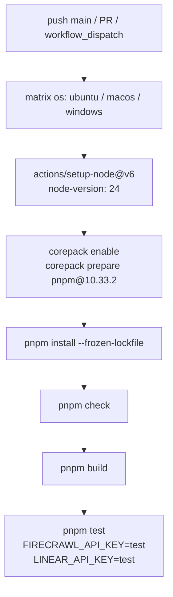
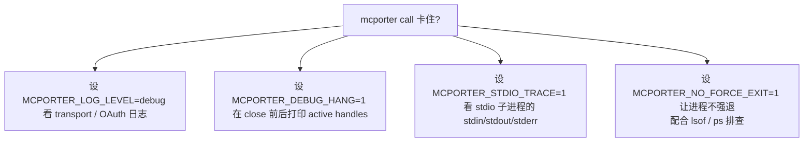

<details>
<summary>相关源文件</summary>

生成本页时使用的主要源文件：

- [.github/workflows/ci.yml](../../../project-repos/mcporter/.github/workflows/ci.yml)
- [package.json](../../../project-repos/mcporter/package.json)
- [scripts/test-runner.js](../../../project-repos/mcporter/scripts/test-runner.js)
- [tests/build-bun.test.ts](../../../project-repos/mcporter/tests/build-bun.test.ts)
- [tests/daemon.integration.test.ts](../../../project-repos/mcporter/tests/daemon.integration.test.ts)
- [tests/cli-call-execution.test.ts](../../../project-repos/mcporter/tests/cli-call-execution.test.ts)
- [tests/live/deepwiki-live.test.ts](../../../project-repos/mcporter/tests/live/deepwiki-live.test.ts)
- [src/cli/runtime-debug.ts](../../../project-repos/mcporter/src/cli/runtime-debug.ts)
- [src/sdk-patches.ts](../../../project-repos/mcporter/src/sdk-patches.ts)
- [src/logging.ts](../../../project-repos/mcporter/src/logging.ts)

</details>

# 测试、CI 与可观测性

mcporter 的可信度建立在三层之上：**Vitest 单元 + 集成套件**、**跨 OS 的 GitHub Actions CI 矩阵**、**运行时可观测性钩子**（hang 调试 + stdio trace + 日志级别）。这一节梳理这三层的入口、覆盖范围与本地排查手法。

## 测试集合概览

`tests/` 含 106 个 `.test.ts` 文件 + `tests/fixtures/` 与 `tests/live/` 两个特殊子目录：

| 类别 | 数量 | 代表文件 |
|------|------|----------|
| `cli-*.test.ts` | 27 | CLI 路由 / call 参数 / list 输出 / config 子命令 / generate-cli / inspect-cli |
| `config-*.test.ts` | 22 | layered config / import 各 IDE / mcporter.json schema / doctor |
| `daemon-*.test.ts` + `daemon.integration.test.ts` | 6 | DaemonClient / 协议 / runtime-wrapper / 真启动 |
| 直 `*.test.ts` 单元测试 | 全部其它 | runtime / config / oauth / result-utils / lifecycle / generate-cli 等 |
| `tests/fixtures/` | — | imports 配置范例（Cursor/Claude/Codex/Windsurf/VSCode/OpenCode） + stdio test servers |
| `tests/live/` | 1 | `deepwiki-live.test.ts`，需要 `MCP_LIVE_TESTS=1` 才跑 |

`tests/fixtures/imports/` 提供 7 种编辑器的最小化合法配置文件，让 `loadServerDefinitions` 测试能驱动真正的 import 解析路径而不仅是 mock。`tests/fixtures/stdio-*.mjs` 是迷你 MCP 服务器的实现，专门给 `cli-call-execution.test.ts` / `daemon.integration.test.ts` 用作不依赖网络的端到端目标。
Sources: [tests/fixtures/](../../../project-repos/mcporter/tests/fixtures), [package.json:53-58](../../../project-repos/mcporter/package.json#L53-L58)

<details class="source-snippets">
<summary>引用源码</summary>

<!-- source-snippets:start -->

#### `tests/fixtures/`

> 引用目标是目录，无法展开源码片段：`tests/fixtures/`

#### `package.json:53-58`

```json
    "test": "cross-env MCPORTER_TEST_REPORTER=quiet pnpm test:verbose",
    "test:quiet": "cross-env MCPORTER_TEST_REPORTER=quiet pnpm test:verbose",
    "test:verbose": "node scripts/test-runner.js",
    "test:live": "MCP_LIVE_TESTS=1 vitest run tests/live",
    "clean": "rimraf dist",
    "dev": "tsgo -w -p tsconfig.build.json",
```

<!-- source-snippets:end -->
</details>

## 测试入口与脚本

`package.json` 暴露的命令：

| script | 命令 | 用途 |
|--------|------|------|
| `pnpm check` | `pnpm format:check && pnpm lint:oxlint && pnpm typecheck` | 三连检查 |
| `pnpm format` | `oxfmt .` | 代码格式化 |
| `pnpm lint:oxlint` | `oxlint --type-aware --tsconfig tsconfig.json --report-unused-disable-directives --deny-warnings --max-warnings=0 ...` | 静态检查（基于 oxc + ts-go） |
| `pnpm typecheck` | `tsgo --project tsconfig.json --noEmit` | 编译只为类型检查（不出 dist） |
| `pnpm build` | `tsgo -p tsconfig.build.json` | 出 `dist/` |
| `pnpm build:bun` | `bun scripts/build-bun.ts` | Bun 单文件 binary 用于发布 |
| `pnpm test` | `MCPORTER_TEST_REPORTER=quiet pnpm test:verbose` | 默认 quiet reporter |
| `pnpm test:verbose` | `node scripts/test-runner.js` | 真正入口 |
| `pnpm test:live` | `MCP_LIVE_TESTS=1 vitest run tests/live` | 跑活路径（需要网络） |
| `pnpm prepublishOnly` | `pnpm check && pnpm test && pnpm build` | 发包前流水线 |

`scripts/test-runner.js` 是个 ~40 行 wrapper（[scripts/test-runner.js:5-39]()），唯一目的：把 `pnpm test --filter foo` 翻译成 vitest 的 include glob——vitest 不直接接受 `--filter` 标志，作者用一个 spawnSync 桥接，避免命令行体验割裂。
Sources: [package.json:42-64](../../../project-repos/mcporter/package.json#L42-L64), [scripts/test-runner.js:5-39](../../../project-repos/mcporter/scripts/test-runner.js#L5-L39)

<details class="source-snippets">
<summary>引用源码</summary>

<!-- source-snippets:start -->

#### `package.json:42-64`

```json
  "scripts": {
    "mcporter": "tsx src/cli.ts",
    "mcp": "pnpm exec tsx src/cli.ts",
    "build": "tsgo -p tsconfig.build.json",
    "build:bun": "bun scripts/build-bun.ts",
    "check": "pnpm format:check && pnpm lint:oxlint && pnpm typecheck",
    "format": "oxfmt .",
    "format:check": "oxfmt --check .",
    "lint": "pnpm check",
    "lint:oxlint": "oxlint --type-aware --tsconfig tsconfig.json --report-unused-disable-directives --deny-warnings --max-warnings=0 --allow eslint/no-underscore-dangle",
    "typecheck": "tsgo --project tsconfig.json --noEmit",
    "test": "cross-env MCPORTER_TEST_REPORTER=quiet pnpm test:verbose",
    "test:quiet": "cross-env MCPORTER_TEST_REPORTER=quiet pnpm test:verbose",
    "test:verbose": "node scripts/test-runner.js",
    "test:live": "MCP_LIVE_TESTS=1 vitest run tests/live",
    "clean": "rimraf dist",
    "dev": "tsgo -w -p tsconfig.build.json",
    "prepublishOnly": "pnpm check && pnpm test && pnpm build",
    "docs:list": "pnpm exec tsx scripts/docs-list.ts",
    "generate:schema": "tsx scripts/generate-json-schema.ts",
    "mcporter:list": "pnpm exec tsx src/cli.ts list",
    "mcporter:call": "pnpm exec tsx src/cli.ts call"
  },
```

#### `scripts/test-runner.js:5-39`

```javascript

import { spawnSync } from 'node:child_process';
import { createRequire } from 'node:module';
import path from 'node:path';

const args = process.argv.slice(2);
const translated = [];
const positional = [];

for (let i = 0; i < args.length; i += 1) {
  const token = args[i];
  if (token === '--filter' || token === '-f') {
    const pattern = args[i + 1];
    if (!pattern) {
      console.error('[test-runner] --filter requires a pattern');
      process.exit(1);
    }
    positional.push(pattern);
    i += 1; // skip pattern
    continue;
  }
  translated.push(token);
}

const require = createRequire(import.meta.url);
const vitestPkg = require.resolve('vitest/package.json');
const vitestRoot = path.dirname(vitestPkg);
const vitestBin = path.join(vitestRoot, 'vitest.mjs');

const result = spawnSync(process.execPath, [vitestBin, 'run', ...positional, ...translated], {
  stdio: 'inherit',
  env: process.env,
});

process.exit(result.status ?? 1);
```

<!-- source-snippets:end -->
</details>

## CI 矩阵

`.github/workflows/ci.yml` 配置极简但重要（[.github/workflows/ci.yml:1-31]()）：



关键事实：

- **3 个 OS × 1 个 Node 版本（24）**——package.json 的 `engines.node = '>=24'` 与 `devEngines.runtime` 同步要求。Node 22 / 20 故意不在矩阵里，这是 0.10.0 的版本要求决策（commit 324fb7a 的 message 即 "build: require node 24 and tsgo"）。
- **pnpm 版本固定**：`packageManager: 'pnpm@10.33.2'` + corepack。lockfile 在 CI 强制 frozen。
- **环境变量伪造**：`FIRECRAWL_API_KEY=test` / `LINEAR_API_KEY=test` 让需要这些 env 的 import / config 路径不在 CI 里报缺值——但**不会**真的连远端。`MCPORTER_LIVE_TESTS=1` 没有出现，所以 live 测试默认不跑。

注意：`pnpm:overrides` 在 `package.json:106-111` 强制 `body-parser=2.2.1` 与 `vite=8.0.10`，是 vitest 4.x 与 vite 之间兼容性的临时锁定。
Sources: [github/workflows/ci.yml:1-31](../../../project-repos/mcporter/.github/workflows/ci.yml#L1-L31), [package.json:94-111](../../../project-repos/mcporter/package.json#L94-L111)

<details class="source-snippets">
<summary>引用源码</summary>

<!-- source-snippets:start -->

#### `github/workflows/ci.yml:1-31`

```yaml
name: CI

on:
  push:
    branches: [main]
  pull_request:
    branches: [main]
  workflow_dispatch:

jobs:
  build:
    strategy:
      matrix:
        os: [ubuntu-latest, macos-latest, windows-latest]
    runs-on: $&#123;&#123; matrix.os &#125;&#125;
    steps:
      - uses: actions/checkout@v6
      - uses: actions/setup-node@v6
        with:
          node-version: 24
      - run: corepack enable
      - run: corepack prepare pnpm@10.33.2 --activate
      - run: pnpm install --frozen-lockfile
      - run: pnpm --version
      - run: pnpm check
      - run: pnpm build
      - run: pnpm test
        env:
          FIRECRAWL_API_KEY: test
          LINEAR_API_KEY: test
```

#### `package.json:94-111`

```json
  "devEngines": {
    "runtime": [
      {
        "name": "node",
        "version": ">=24"
      }
    ]
  },
  "engines": {
    "node": ">=24"
  },
  "packageManager": "pnpm@10.33.2",
  "pnpm": {
    "overrides": {
      "body-parser": "2.2.1",
      "vite": "8.0.10"
    }
  }
```

<!-- source-snippets:end -->
</details>

## 单元测试的几个亮点

### `cli-call-execution.test.ts`（348 行）

驱动 `runCli(['call', ...])` 实际执行，覆盖：

- key=value / key:value / 函数表达式三种语法都能成功 callTool。
- positional args 通过 schema hydration 命中正确字段。
- 数字字面量在 string 字段下保持原文（schema-aware coercion）。
- `--args '{"a":1}'` + key=value 的合并/覆盖语义。
- 工具名拼错时的 auto / suggest 分支。
- ephemeral `--http-url` / `--stdio` 注册 + persist。

测试通过 `tests/fixtures/stdio-memory-server.mjs` 这个本地 stdio MCP 不依赖网络。
Sources: [tests/cli-call-execution.test.ts:1-80](../../../project-repos/mcporter/tests/cli-call-execution.test.ts#L1-L80), [tests/fixtures/stdio-memory-server.mjs](../../../project-repos/mcporter/tests/fixtures/stdio-memory-server.mjs)

<details class="source-snippets">
<summary>引用源码</summary>

<!-- source-snippets:start -->

#### `tests/cli-call-execution.test.ts:1-80`

```typescript
import { describe, expect, it, vi } from 'vitest';
import { resolveEphemeralServer } from '../src/cli/adhoc-server.js';
import type { ServerDefinition } from '../src/config.js';

process.env.MCPORTER_DISABLE_AUTORUN = '1';
const cliModulePromise = import('../src/cli.js');

describe('CLI call execution behavior', () => {
  it('auto-selects the sole tool when omitted', async () => {
    const toolName = 'list_issues';
    const { handleCall } = await cliModulePromise;
    const { runtime, callTool } = createRuntimeStub(
      {
        linear: [
          {
            name: toolName,
            description: 'List issues',
            inputSchema: {
              type: 'object',
              properties: {
                limit: { type: 'number' },
              },
              required: [],
            },
          },
        ],
      },
      {
        definitions: [
          {
            name: 'linear',
            command: { kind: 'stdio', command: 'linear', args: [], cwd: process.cwd() },
            source: { kind: 'local', path: '<test>' },
          },
        ],
      }
    );
    const logSpy = vi.spyOn(console, 'log').mockImplementation(() => {});
    await handleCall(runtime, ['linear', 'limit=5']);
    expect(callTool).toHaveBeenCalledWith('linear', toolName, expect.objectContaining({ args: { limit: 5 } }));
    logSpy.mockRestore();
  });

  it('restores numeric-looking key=value args to schema-declared strings', async () => {
    const { handleCall } = await cliModulePromise;
    const { runtime, callTool, listTools } = createRuntimeStub({
      slack: [
        {
          name: 'conversations_replies',
          inputSchema: {
            type: 'object',
            properties: {
              channel_id: { type: 'string' },
              thread_ts: { type: 'string' },
              latest: { anyOf: [{ type: 'string' }, { type: 'null' }] },
              limit: { type: 'number' },
            },
            required: ['channel_id', 'thread_ts'],
          },
        },
      ],
    });
    const logSpy = vi.spyOn(console, 'log').mockImplementation(() => {});

    await handleCall(runtime, [
      'slack.conversations_replies',
      'channel_id=C1234567890',
      'thread_ts=1234567890.123456',
      'latest=1234567899.987654',
      'limit=1',
    ]);

    expect(callTool).toHaveBeenCalledWith(
      'slack',
      'conversations_replies',
      expect.objectContaining({
        args: {
          channel_id: 'C1234567890',
          thread_ts: '1234567890.123456',
          latest: '1234567899.987654',
```

#### `tests/fixtures/stdio-memory-server.mjs`

```javascript
#!/usr/bin/env node

import { McpServer } from '@modelcontextprotocol/sdk/server/mcp.js';
import { StdioServerTransport } from '@modelcontextprotocol/sdk/server/stdio.js';
import { z } from 'zod';

const server = new McpServer({ name: 'memory-fixture', version: '1.0.0' });
const memory = new Set();

server.registerTool(
  'create_entities',
  {
    title: 'Create Entities',
    description: 'Insert the provided entity names into the in-memory store',
    inputSchema: {
      entities: z.array(z.string()),
    },
    outputSchema: {
      count: z.number(),
    },
  },
  async ({ entities }) => {
    for (const entity of entities) {
      if (entity.trim().length > 0) {
        memory.add(entity.trim());
      }
    }
    return {
      content: [{ type: 'text', text: `Stored ${memory.size} entities` }],
      structuredContent: { count: memory.size },
    };
  }
);

server.registerTool(
  'list_entities',
  {
    title: 'List Entities',
    description: 'Return all previously stored entities',
    inputSchema: {},
    outputSchema: {
      entities: z.array(z.string()),
    },
  },
  async () => {
    return {
      content: [{ type: 'text', text: JSON.stringify(Array.from(memory)) }],
      structuredContent: { entities: Array.from(memory) },
    };
  }
);

const transport = new StdioServerTransport();
await server.connect(transport);
await new Promise((resolve, reject) => {
  transport.onclose = resolve;
  transport.onerror = reject;
});
```

<!-- source-snippets:end -->
</details>

### `daemon.integration.test.ts`（175 行）

真启 daemon（`runDaemonHost` foreground 模式 + 临时 socket / metadata 路径）→ 通过 `DaemonClient` 发请求 → 校验 status / callTool / closeServer / stop 行为闭环。这是验证私有 JSON 协议、stale config 检测、idle eviction 的端到端测试。
Sources: [tests/daemon.integration.test.ts:1-80](../../../project-repos/mcporter/tests/daemon.integration.test.ts#L1-L80)

<details class="source-snippets">
<summary>引用源码</summary>

<!-- source-snippets:start -->

#### `tests/daemon.integration.test.ts:1-80`

```typescript
import { execFile } from 'node:child_process';
import fs from 'node:fs/promises';
import { createRequire } from 'node:module';
import os from 'node:os';
import path from 'node:path';
import { fileURLToPath, pathToFileURL } from 'node:url';
import { describe, expect, it } from 'vitest';

const CLI_ENTRY = fileURLToPath(new URL('../dist/cli.js', import.meta.url));
const testRequire = createRequire(import.meta.url);
const MCP_SERVER_MODULE = pathToFileURL(testRequire.resolve('@modelcontextprotocol/sdk/server/mcp.js')).href;
const STDIO_SERVER_MODULE = pathToFileURL(testRequire.resolve('@modelcontextprotocol/sdk/server/stdio.js')).href;
const ZOD_MODULE = pathToFileURL(testRequire.resolve('zod')).href;
const describeDaemon = process.platform === 'win32' ? describe.skip : describe;
const PNPM_COMMAND = process.platform === 'win32' ? 'cmd.exe' : 'pnpm';
const PNPM_ARGS_PREFIX = process.platform === 'win32' ? ['/d', '/s', '/c', 'pnpm'] : [];

function pnpmArgs(args: string[]): string[] {
  return [...PNPM_ARGS_PREFIX, ...args];
}

async function readFileWithRetries(filePath: string, retries = 20, delayMs = 100): Promise<string> {
  let lastError: unknown;
  for (let attempt = 0; attempt < retries; attempt++) {
    try {
      return await fs.readFile(filePath, 'utf8');
    } catch (error) {
      lastError = error;
      if ((error as NodeJS.ErrnoException).code !== 'ENOENT') {
        throw error;
      }
    }
    await new Promise((resolve) => setTimeout(resolve, delayMs));
  }
  throw lastError ?? new Error(`Failed to read ${filePath}`);
}

async function ensureDistBuilt(): Promise<void> {
  try {
    await fs.access(CLI_ENTRY);
  } catch {
    await new Promise<void>((resolve, reject) => {
      execFile(PNPM_COMMAND, pnpmArgs(['build']), { cwd: process.cwd(), env: process.env }, (error) => {
        if (error) {
          reject(error);
          return;
        }
        resolve();
      });
    });
  }
}

async function runCli(
  args: string[],
  configPath: string,
  envOverrides: Record<string, string> = {}
): Promise<{ stdout: string; stderr: string }> {
  return await new Promise((resolve, reject) => {
    execFile(
      process.execPath,
      [CLI_ENTRY, '--config', configPath, ...args],
      {
        env: { ...process.env, MCPORTER_NO_FORCE_EXIT: '1', ...envOverrides },
      },
      (error, stdout, stderr) => {
        if (error) {
          const wrapped = new Error(`${error.message}\nSTDOUT:\n${stdout}\nSTDERR:\n${stderr}`);
          reject(wrapped);
          return;
        }
        resolve({ stdout, stderr });
      }
    );
  });
}

function parseCliJson(output: string): { instanceId: string; count: number } {
  const trimmed = output.trim();
  const start = trimmed.indexOf('{');
```

<!-- source-snippets:end -->
</details>

### `build-bun.test.ts`

只有 16 行：`describe.skip` 包了一个真正调外部 `bun build` 的检查。它不在默认 CI 上跑（OS 矩阵不要求装 Bun），用作开发者本地手动验证。Bun 编译路径主要靠 `cli-generate-cli.integration.test.ts` 提供间接覆盖。
Sources: [tests/build-bun.test.ts:1-16](../../../project-repos/mcporter/tests/build-bun.test.ts#L1-L16)

<details class="source-snippets">
<summary>引用源码</summary>

<!-- source-snippets:start -->

#### `tests/build-bun.test.ts:1-16`

```typescript
import path from 'node:path';
import { describe, expect, it } from 'vitest';

import { createCompiledEntrypoint } from '../scripts/build-bun';

describe('build-bun entrypoint', () => {
  it('embeds the package version before importing the CLI', () => {
    const projectRoot = '/tmp/mcporter';
    const version = '0.8.1';

    const entrypoint = createCompiledEntrypoint(projectRoot, version);

    expect(entrypoint).toContain(`process.env.MCPORTER_VERSION ??= "${version}";`);
    expect(entrypoint).toContain(`await import(${JSON.stringify(path.join(projectRoot, 'src', 'cli.ts'))});`);
  });
});
```

<!-- source-snippets:end -->
</details>

### Live 测试 `tests/live/deepwiki-live.test.ts`

```ts
describe.skipIf(Boolean(skipReason()))('deepwiki live', () => {
  it('lists wiki structure via streamable-http', async () => { ... });
  it('prints the readable result when default output is used via streamable-http', ...);
  it('reports the deprecated sse endpoint as a structured 410 issue', ...);
});
```

需要 `MCP_LIVE_TESTS=1` 显式打开，作者用 `https://mcp.deepwiki.com/mcp` 的实际生产服务器作为冒烟。0.9.0 的 release confidence 就建立在它绿色之上。CI 默认不跑，避免外部依赖让构建变红。
Sources: [tests/live/deepwiki-live.test.ts:1-63](../../../project-repos/mcporter/tests/live/deepwiki-live.test.ts#L1-L63)

<details class="source-snippets">
<summary>引用源码</summary>

<!-- source-snippets:start -->

#### `tests/live/deepwiki-live.test.ts:1-63`

```typescript
import { execFile } from 'node:child_process';
import { promisify } from 'node:util';
import { describe, expect, it } from 'vitest';

const LIVE_FLAG = process.env.MCP_LIVE_TESTS === '1';
const STREAMABLE_HTTP_URL = 'https://mcp.deepwiki.com/mcp';
const SSE_URL = 'https://mcp.deepwiki.com/sse';

const execFileAsync = promisify(execFile);

function skipReason(): string | undefined {
  if (!LIVE_FLAG) {
    return 'set MCP_LIVE_TESTS=1 to run live MCP tests';
  }
  return undefined;
}

describe.skipIf(Boolean(skipReason()))('deepwiki live', () => {
  it('lists wiki structure via streamable-http', async () => {
    const { stdout, stderr } = await execFileAsync('node', [
      'dist/cli.js',
      'call',
      STREAMABLE_HTTP_URL,
      'read_wiki_structure',
      'repoName:facebook/react',
      '--output',
      'json',
    ]);
    const normalized = stdout.trim() || stderr.trim();
    expect(normalized).toContain('Available pages for facebook/react');
    expect(normalized).toContain('Overview');
  }, 30_000);

  it('prints the readable result when default output is used via streamable-http', async () => {
    const { stdout, stderr } = await execFileAsync('node', [
      'dist/cli.js',
      'call',
      STREAMABLE_HTTP_URL,
      'read_wiki_structure',
      'repoName:facebook/react',
    ]);
    const normalized = (stdout || stderr).trim();
    expect(normalized).toContain('Available pages for facebook/react');
    expect(normalized).toContain('Overview');
    expect(normalized).not.toContain('"type"');
  }, 30_000);

  it('reports the deprecated sse endpoint as a structured 410 issue', async () => {
    const { stdout, stderr } = await execFileAsync('node', [
      'dist/cli.js',
      'call',
      SSE_URL,
      'read_wiki_structure',
      'repoName:facebook/react',
      '--output',
      'json',
    ]);
    const normalized = stdout.trim() || stderr.trim();
    expect(normalized).toContain('"statusCode": 410');
    expect(normalized).toContain('"kind": "http"');
  }, 30_000);
});
```

<!-- source-snippets:end -->
</details>

## helpers/runtime-test-helpers.ts

`tests/helpers/runtime-test-helpers.ts` 提供 mock Transport / Logger / OAuthSession 与 fluent stub builder（如 `stubHttpDefinition` / `stubOAuthHttpDefinition` / `createPromotionRecorder`）。这是 `runtime/transport.ts` 与 `runtime/oauth.ts` 大量分支被覆盖的关键——单测不需要真打开浏览器或开 socket。
Sources: [tests/helpers/runtime-test-helpers.ts:1-52](../../../project-repos/mcporter/tests/helpers/runtime-test-helpers.ts#L1-L52)

<details class="source-snippets">
<summary>引用源码</summary>

<!-- source-snippets:start -->

#### `tests/helpers/runtime-test-helpers.ts:1-52`

```typescript
import type { Transport, TransportSendOptions } from '@modelcontextprotocol/sdk/shared/transport.js';
import type { JSONRPCMessage } from '@modelcontextprotocol/sdk/types.js';
import { vi } from 'vitest';
import type { ServerDefinition } from '../../src/config.js';
import type { Logger } from '../../src/logging.js';
import type { OAuthSession } from '../../src/oauth.js';

export const clientInfo = { name: 'mcporter', version: '0.0.0-test' };

export interface LoggerSpy extends Logger {
  info: ReturnType<typeof vi.fn<(message: string) => void>>;
  warn: ReturnType<typeof vi.fn<(message: string) => void>>;
  error: ReturnType<typeof vi.fn<(message: string, error?: unknown) => void>>;
}

export function createLogger(): LoggerSpy {
  return {
    info: vi.fn(),
    warn: vi.fn(),
    error: vi.fn(),
  };
}

export function resetLogger(logger: LoggerSpy): void {
  logger.info.mockReset();
  logger.warn.mockReset();
  logger.error.mockReset();
}

export function stubHttpDefinition(url: string): ServerDefinition {
  return {
    name: 'http-server',
    command: { kind: 'http', url: new URL(url) },
    source: { kind: 'local', path: '<adhoc>' },
  };
}

export function stubOAuthHttpDefinition(url: string): ServerDefinition {
  return {
    ...stubHttpDefinition(url),
    auth: 'oauth',
  };
}

export function createPromotionRecorder() {
  const promotedDefinitions: ServerDefinition[] = [];
  return {
    promotedDefinitions,
    onDefinitionPromoted: (promoted: ServerDefinition) => {
      promotedDefinitions.push(promoted);
    },
  };
```

<!-- source-snippets:end -->
</details>

## 可观测性与排查工具

mcporter 在不依赖外部 APM 的前提下提供 4 类内置开关，全部通过环境变量启用：

| 变量 | 默认 | 作用 |
|------|------|------|
| `MCPORTER_LOG_LEVEL` | `warn` | `debug \| info \| warn \| error`，由 `parseLogLevel` 解析（[src/logging.ts:25-42]()），无效值 fall back 并打印 warning |
| `MCPORTER_DEBUG_HANG` | unset | CLI 在 `runtime.close()` 前后 + `terminateChildProcesses` 后调 `dumpActiveHandles` 打印每个 active handle / request 的 ctor + pid + fd（[src/cli/runtime-debug.ts:69-83](), [src/cli.ts:170-203]()） |
| `MCPORTER_STDIO_TRACE` | unset | sdk-patches 拦截 stdio start / stdin send / stderr data，关闭时一次性 flush 到 stdout（[src/sdk-patches.ts:32-34](), [src/sdk-patches.ts:179-234]()） |
| `MCPORTER_STDIO_LOGS` | unset | 永远把 stdio 子进程 stderr 回放到 mcporter stdout（默认仅在子进程非零退出时打印） |
| `MCPORTER_NO_FORCE_EXIT` / `MCPORTER_FORCE_EXIT` | unset | 关闭/强制 `process.exit(0)`（参见 [CLI 命令体系](cli-commands.md)） |



`docs/hang-debug.md` 与 `docs/tmux.md` 提供进一步的排查脚本（用 tmux 把长跑命令塞到背景里再 capture）。
Sources: [src/cli/runtime-debug.ts:1-141](../../../project-repos/mcporter/src/cli/runtime-debug.ts#L1-L141), [src/sdk-patches.ts:32-100](../../../project-repos/mcporter/src/sdk-patches.ts#L32-L100)

<details class="source-snippets">
<summary>引用源码</summary>

<!-- source-snippets:start -->

#### `src/cli/runtime-debug.ts:1-141`

```typescript
import type { ChildProcess } from 'node:child_process';
import { logInfo, logWarn } from './logger-context.js';

export const DEBUG_HANG = process.env.MCPORTER_DEBUG_HANG === '1';

type ProcessWithHandles = NodeJS.Process & {
  _getActiveHandles?: () => unknown[];
  _getActiveRequests?: () => unknown[];
};

function describeHandle(handle: unknown): string {
  if (!handle || (typeof handle !== 'object' && typeof handle !== 'function')) {
    return String(handle);
  }
  const ctor = (handle as { constructor?: { name?: string } }).constructor?.name ?? typeof handle;
  if (ctor === 'Socket') {
    try {
      const socket = handle as {
        localAddress?: string;
        localPort?: number;
        remoteAddress?: string;
        remotePort?: number;
      };
      const parts: string[] = ['Socket'];
      if (socket.localAddress) {
        parts.push(`local=${socket.localAddress}:${socket.localPort ?? '?'}`);
      }
      if (socket.remoteAddress) {
        parts.push(`remote=${socket.remoteAddress}:${socket.remotePort ?? '?'}`);
      }
      if (typeof (socket as { address?: () => { address: string; port: number } | null }).address === 'function') {
        const addr = (socket as { address?: () => { address: string; port: number } | null }).address?.();
        if (addr) {
          parts.push(`addr=${addr.address}:${addr.port}`);
        }
      }
      const host = (handle as { _host?: string })._host;
      if (host) {
        parts.push(`host=${host}`);
      }
      const pipeName = (handle as { path?: string }).path;
      if (pipeName) {
        parts.push(`path=${pipeName}`);
      }
      const extraKeys = Reflect.ownKeys(handle as Record<string | symbol, unknown>)
        .filter((key) => typeof key === 'string' && key.startsWith('_') && !['_events', '_eventsCount'].includes(key))
        .slice(0, 4) as string[];
      if (extraKeys.length > 0) {
        parts.push(`keys=${extraKeys.join(',')}`);
      }
      return parts.join(' ');
    } catch {
      return ctor;
    }
  }
  if (typeof handle === 'object') {
    const pid = (handle as { pid?: number }).pid;
    if (typeof pid === 'number') {
      return `${ctor} (pid=${pid})`;
    }
    const fd = (handle as { fd?: number }).fd;
    if (typeof fd === 'number') {
      return `${ctor} (fd=${fd})`;
    }
  }
  return ctor;
}

export function dumpActiveHandles(label: string): void {
  if (!DEBUG_HANG) {
    return;
  }
  const proc = process as ProcessWithHandles;
  const activeHandles = proc._getActiveHandles?.() ?? [];
  const activeRequests = proc._getActiveRequests?.() ?? [];
  logInfo(`[debug] ${label}: ${activeHandles.length} active handle(s), ${activeRequests.length} request(s)`);
  for (const handle of activeHandles) {
    logInfo(`[debug] handle => ${describeHandle(handle)}`);
  }
  for (const request of activeRequests) {
    logInfo(`[debug] request => ${describeHandle(request)}`);
  }
}

export function terminateChildProcesses(label: string): void {
  const proc = process as ProcessWithHandles;
  const handles = proc._getActiveHandles?.() ?? [];
  for (const handle of handles) {
    if (!handle || typeof handle !== 'object') {
      continue;
    }
    const candidate = handle as ChildProcess;
    const ctor = (handle as { constructor?: { name?: string } }).constructor?.name ?? '';
    if (ctor === 'Socket' && typeof (handle as { destroy?: () => void }).destroy === 'function') {
      try {
        (handle as { destroy?: () => void }).destroy?.();
        if (typeof (handle as { unref?: () => void }).unref === 'function') {
          (handle as { unref?: () => void }).unref?.();
        }
      } catch {
        // ignore
      }
    }
    if (typeof (candidate.stdout as { destroy?: () => void } | undefined)?.destroy === 'function') {
      try {
        (candidate.stdout as { destroy?: () => void }).destroy?.();
      } catch {
        // ignore
      }
    }
    if (typeof (candidate.stderr as { destroy?: () => void } | undefined)?.destroy === 'function') {
      try {
        (candidate.stderr as { destroy?: () => void }).destroy?.();
      } catch {
        // ignore
      }
    }
    if (typeof (candidate.stdin as { end?: () => void } | undefined)?.end === 'function') {
      try {
        (candidate.stdin as { end?: () => void }).end?.();
... snippet truncated ...
```

#### `src/sdk-patches.ts:32-100`

```typescript
const STDIO_LOGS_FORCED = process.env.MCPORTER_STDIO_LOGS === '1';
const STDIO_TRACE_ENABLED = process.env.MCPORTER_STDIO_TRACE === '1';

export type StdioLogMode = 'auto' | 'always' | 'silent';

let stdioLogMode: StdioLogMode = STDIO_LOGS_FORCED ? 'always' : 'auto';

export function getStdioLogMode(): StdioLogMode {
  return stdioLogMode;
}

export function setStdioLogMode(mode: StdioLogMode): StdioLogMode {
  const previous = stdioLogMode;
  if (!STDIO_LOGS_FORCED) {
    stdioLogMode = mode;
  }
  return previous;
}

export function evaluateStdioLogPolicy(
  mode: StdioLogMode,
  hasStderr: boolean,
  exitCode: number | null | undefined
): boolean {
  if (!hasStderr) {
    return false;
  }
  if (mode === 'silent') {
    return false;
  }
  if (mode === 'always') {
    return true;
  }
  return typeof exitCode === 'number' && exitCode !== 0;
}

function shouldPrintStdioLogs(meta: ProcessStreamMeta): boolean {
  return evaluateStdioLogPolicy(stdioLogMode, meta.stderrChunks.length > 0, meta.code);
}

if (STDIO_TRACE_ENABLED) {
  console.log('[mcporter] STDIO trace logging enabled (set MCPORTER_STDIO_TRACE=0 to disable).');
}

function ignoreEmitterError(): void {}

function destroyStream(stream: unknown): void {
  if (!stream || typeof stream !== 'object') {
    return;
  }
  const emitter = stream as {
    on?: (event: string, listener: () => void) => void;
    off?: (event: string, listener: () => void) => void;
    removeListener?: (event: string, listener: () => void) => void;
    destroy?: () => void;
    end?: () => void;
    unref?: () => void;
  };
  try {
    emitter.on?.('error', ignoreEmitterError);
  } catch {
    // ignore
  }
  try {
    emitter.destroy?.();
  } catch {
    // ignore
  }
  try {
```

<!-- source-snippets:end -->
</details>

## 失败模式 & flake 治理

仓库里几个值得记的事实：

- **强制退出策略** 是 `mcporter` CLI 的"隐形 flake 修复"：测试套件因 stdio 子进程 fd 泄漏 hang 在 Node event loop 的 case 在历史上多次被踩到。`process.exit(0)` 一锤子定音让 CI 不会因为这个 hang。开发者排查 hang 时需要 `MCPORTER_NO_FORCE_EXIT=1`。
- **`pnpm test` 默认 quiet reporter**：`MCPORTER_TEST_REPORTER=quiet` 让 vitest 输出只在失败时膨胀；`pnpm test:verbose` 则不挂这个 env。
- **依赖 override**：`body-parser=2.2.1` / `vite=8.0.10` 是 vitest 4.x + vite 8 + body-parser 间的兼容性手动锁定，写在 `package.json:106-111`。
- **fixtures 真实性**：`tests/fixtures/imports/` 里的 7 个 IDE 配置不是手写 mock，而是从真实 IDE 导出后裁剪过的最小化合法样本——这意味着新 IDE 改 schema 时只需更新 fixture，不必动测试逻辑。

Sources: [package.json:53-111](../../../project-repos/mcporter/package.json#L53-L111), [src/cli.ts:185-203](../../../project-repos/mcporter/src/cli.ts#L185-L203)

<details class="source-snippets">
<summary>引用源码</summary>

<!-- source-snippets:start -->

#### `package.json:53-111`

```json
    "test": "cross-env MCPORTER_TEST_REPORTER=quiet pnpm test:verbose",
    "test:quiet": "cross-env MCPORTER_TEST_REPORTER=quiet pnpm test:verbose",
    "test:verbose": "node scripts/test-runner.js",
    "test:live": "MCP_LIVE_TESTS=1 vitest run tests/live",
    "clean": "rimraf dist",
    "dev": "tsgo -w -p tsconfig.build.json",
    "prepublishOnly": "pnpm check && pnpm test && pnpm build",
    "docs:list": "pnpm exec tsx scripts/docs-list.ts",
    "generate:schema": "tsx scripts/generate-json-schema.ts",
    "mcporter:list": "pnpm exec tsx src/cli.ts list",
    "mcporter:call": "pnpm exec tsx src/cli.ts call"
  },
  "dependencies": {
    "@iarna/toml": "^2.2.5",
    "@modelcontextprotocol/sdk": "^1.29.0",
    "acorn": "^8.16.0",
    "commander": "^14.0.3",
    "es-toolkit": "^1.46.0",
    "jsonc-parser": "^3.3.1",
    "ora": "^9.4.0",
    "rolldown": "1.0.0-rc.17",
    "zod": "^4.3.6"
  },
  "devDependencies": {
    "@types/estree": "^1.0.8",
    "@types/express": "^5.0.6",
    "@types/node": "^25.6.0",
    "@typescript/native-preview": "7.0.0-dev.20260427.1",
    "@vitest/coverage-v8": "^4.1.5",
    "bun-types": "^1.3.13",
    "cross-env": "^10.1.0",
    "express": "^5.2.1",
    "oxfmt": "^0.47.0",
    "oxlint": "^1.62.0",
    "oxlint-tsgolint": "^0.22.0",
    "rimraf": "^6.1.3",
    "tsx": "^4.21.0",
    "typescript": "^6.0.3",
    "vite": "8.0.10",
    "vitest": "^4.1.5"
  },
  "devEngines": {
    "runtime": [
      {
        "name": "node",
        "version": ">=24"
      }
    ]
  },
  "engines": {
    "node": ">=24"
  },
  "packageManager": "pnpm@10.33.2",
  "pnpm": {
    "overrides": {
      "body-parser": "2.2.1",
      "vite": "8.0.10"
    }
  }
```

#### `src/cli.ts:185-203`

```typescript
    } finally {
      terminateChildProcesses('runtime.finally');
      // By default we force an exit after cleanup so Node doesn't hang on lingering stdio handles
      // (see typescript-sdk#579/#780/#1049). Opt out by exporting MCPORTER_NO_FORCE_EXIT=1.
      const disableForceExit = process.env.MCPORTER_NO_FORCE_EXIT === '1';
      if (DEBUG_HANG) {
        dumpActiveHandles('after terminateChildProcesses');
        if (!disableForceExit || process.env.MCPORTER_FORCE_EXIT === '1') {
          process.exit(0);
        }
      } else {
        const scheduleExit = () => {
          if (!disableForceExit || process.env.MCPORTER_FORCE_EXIT === '1') {
            process.exit(0);
          }
        };
        setImmediate(scheduleExit);
      }
    }
```

<!-- source-snippets:end -->
</details>

## 本地执行清单

最小化跑通的步骤：

```bash
corepack enable
corepack prepare pnpm@10.33.2 --activate
pnpm install --frozen-lockfile
pnpm check       # format + oxlint + tsgo typecheck
pnpm build       # dist/
pnpm test        # 全部单元 + 集成（不含 live）
# 选项
pnpm test --filter call-arguments   # 走 test-runner.js 翻译为 vitest include
MCP_LIVE_TESTS=1 pnpm test:live     # 真打 deepwiki MCP
MCPORTER_DEBUG_HANG=1 pnpm test     # 排查测试中 stdio hang
```

仅 Node 24 被支持；macOS 14+ 与 Linux glibc 是 CI 验证过的。Bun 路径可选。
Sources: [package.json:42-103](../../../project-repos/mcporter/package.json#L42-L103), [github/workflows/ci.yml:11-30](../../../project-repos/mcporter/.github/workflows/ci.yml#L11-L30)

<details class="source-snippets">
<summary>引用源码</summary>

<!-- source-snippets:start -->

#### `package.json:42-103`

```json
  "scripts": {
    "mcporter": "tsx src/cli.ts",
    "mcp": "pnpm exec tsx src/cli.ts",
    "build": "tsgo -p tsconfig.build.json",
    "build:bun": "bun scripts/build-bun.ts",
    "check": "pnpm format:check && pnpm lint:oxlint && pnpm typecheck",
    "format": "oxfmt .",
    "format:check": "oxfmt --check .",
    "lint": "pnpm check",
    "lint:oxlint": "oxlint --type-aware --tsconfig tsconfig.json --report-unused-disable-directives --deny-warnings --max-warnings=0 --allow eslint/no-underscore-dangle",
    "typecheck": "tsgo --project tsconfig.json --noEmit",
    "test": "cross-env MCPORTER_TEST_REPORTER=quiet pnpm test:verbose",
    "test:quiet": "cross-env MCPORTER_TEST_REPORTER=quiet pnpm test:verbose",
    "test:verbose": "node scripts/test-runner.js",
    "test:live": "MCP_LIVE_TESTS=1 vitest run tests/live",
    "clean": "rimraf dist",
    "dev": "tsgo -w -p tsconfig.build.json",
    "prepublishOnly": "pnpm check && pnpm test && pnpm build",
    "docs:list": "pnpm exec tsx scripts/docs-list.ts",
    "generate:schema": "tsx scripts/generate-json-schema.ts",
    "mcporter:list": "pnpm exec tsx src/cli.ts list",
    "mcporter:call": "pnpm exec tsx src/cli.ts call"
  },
  "dependencies": {
    "@iarna/toml": "^2.2.5",
    "@modelcontextprotocol/sdk": "^1.29.0",
    "acorn": "^8.16.0",
    "commander": "^14.0.3",
    "es-toolkit": "^1.46.0",
    "jsonc-parser": "^3.3.1",
    "ora": "^9.4.0",
    "rolldown": "1.0.0-rc.17",
    "zod": "^4.3.6"
  },
  "devDependencies": {
    "@types/estree": "^1.0.8",
    "@types/express": "^5.0.6",
    "@types/node": "^25.6.0",
    "@typescript/native-preview": "7.0.0-dev.20260427.1",
    "@vitest/coverage-v8": "^4.1.5",
    "bun-types": "^1.3.13",
    "cross-env": "^10.1.0",
    "express": "^5.2.1",
    "oxfmt": "^0.47.0",
    "oxlint": "^1.62.0",
    "oxlint-tsgolint": "^0.22.0",
    "rimraf": "^6.1.3",
    "tsx": "^4.21.0",
    "typescript": "^6.0.3",
    "vite": "8.0.10",
    "vitest": "^4.1.5"
  },
  "devEngines": {
    "runtime": [
      {
        "name": "node",
        "version": ">=24"
      }
    ]
  },
  "engines": {
    "node": ">=24"
```

#### `github/workflows/ci.yml:11-30`

```yaml
  build:
    strategy:
      matrix:
        os: [ubuntu-latest, macos-latest, windows-latest]
    runs-on: $&#123;&#123; matrix.os &#125;&#125;
    steps:
      - uses: actions/checkout@v6
      - uses: actions/setup-node@v6
        with:
          node-version: 24
      - run: corepack enable
      - run: corepack prepare pnpm@10.33.2 --activate
      - run: pnpm install --frozen-lockfile
      - run: pnpm --version
      - run: pnpm check
      - run: pnpm build
      - run: pnpm test
        env:
          FIRECRAWL_API_KEY: test
          LINEAR_API_KEY: test
```

<!-- source-snippets:end -->
</details>

## 相关页面

- [系统架构](system-architecture.md)
- [运行时与传输层](runtime-transport.md)
