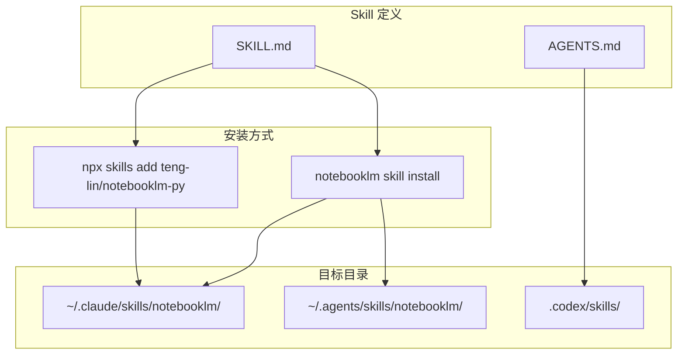
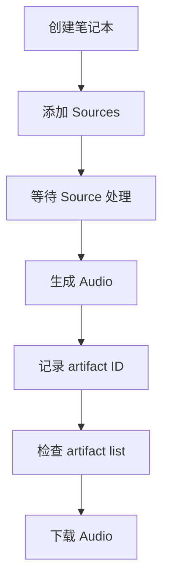
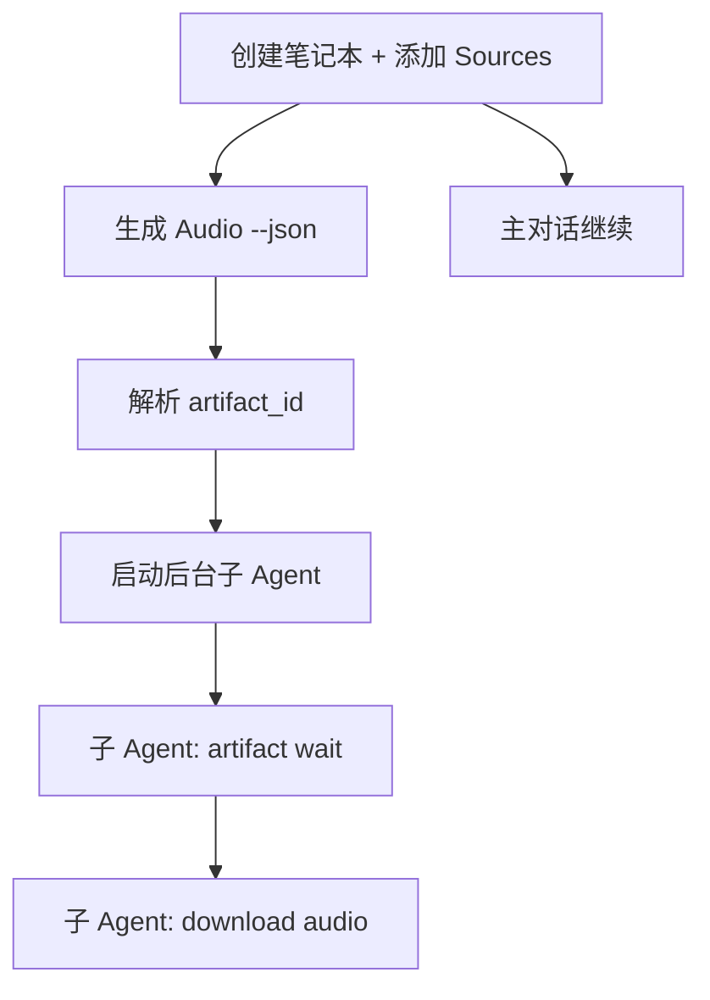
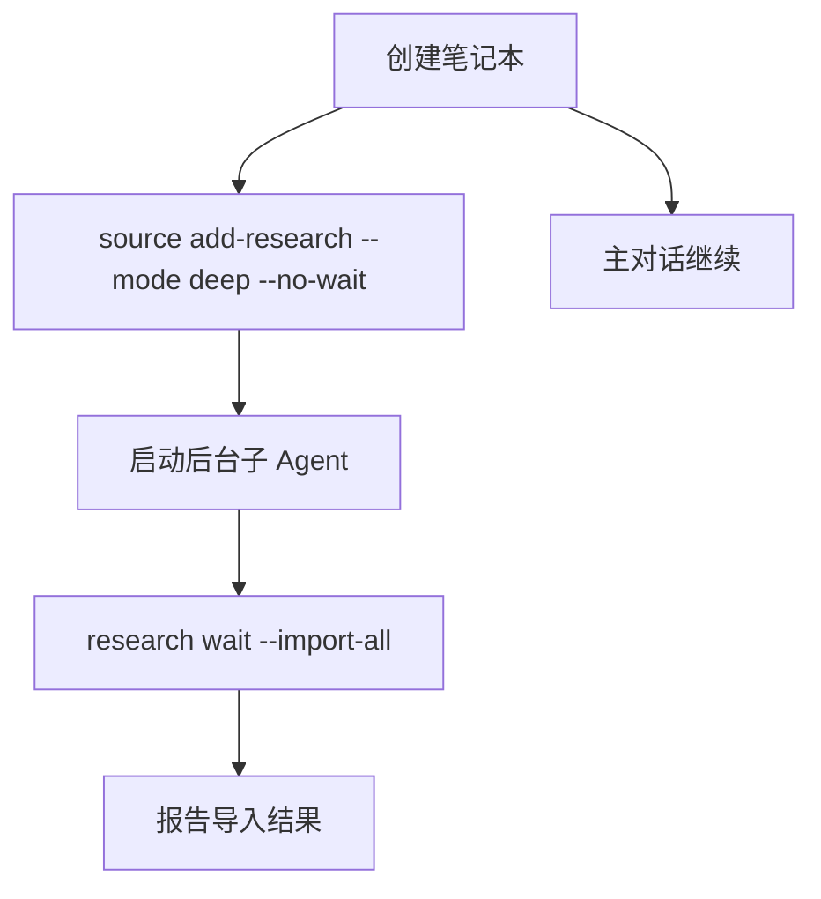

<details>
<summary>相关源文件</summary>

生成本页时使用的主要源文件：

- [SKILL.md](../../../project-repos/notebooklm-py/SKILL.md)
- [AGENTS.md](../../../project-repos/notebooklm-py/AGENTS.md)
- [src/notebooklm/cli/agent.py](../../../project-repos/notebooklm-py/src/notebooklm/cli/agent.py)
- [src/notebooklm/cli/agent_templates.py](../../../project-repos/notebooklm-py/src/notebooklm/cli/agent_templates.py)
- [src/notebooklm/cli/skill.py](../../../project-repos/notebooklm-py/src/notebooklm/cli/skill.py)

</details>

# Agent Skill 集成

notebooklm-py 原生支持 AI Agent 集成，通过 `SKILL.md` 定义 Agent 可理解的技能描述，支持 Claude Code、Codex 和 `npx skills` 生态系统的自动发现与安装。

## Skill 生态架构



Sources: [SKILL.md](../../../project-repos/notebooklm-py/SKILL.md), [AGENTS.md](../../../project-repos/notebooklm-py/AGENTS.md)

<details class="source-snippets">
<summary>引用源码</summary>

<!-- source-snippets:start -->

#### `SKILL.md`

````markdown
---
name: notebooklm
description: Complete API for Google NotebookLM - full programmatic access including features not in the web UI. Create notebooks, add sources, generate all artifact types, download in multiple formats. Activates on explicit /notebooklm or intent like "create a podcast about X"
---

# NotebookLM Automation

Complete programmatic access to Google NotebookLM—including capabilities not exposed in the web UI. Create notebooks, add sources (URLs, YouTube, PDFs, audio, video, images), chat with content, generate all artifact types, and download results in multiple formats.

## Installation

**From PyPI (Recommended):**
```bash
pip install notebooklm-py
```

**From GitHub (use latest release tag, NOT main branch):**
```bash
# Get the latest release tag (using curl)
LATEST_TAG=$(curl -s https://api.github.com/repos/teng-lin/notebooklm-py/releases/latest | grep '"tag_name"' | cut -d'"' -f4)
pip install "git+https://github.com/teng-lin/notebooklm-py@${LATEST_TAG}"
```

⚠️ **DO NOT install from main branch** (`pip install git+https://github.com/teng-lin/notebooklm-py`). The main branch may contain unreleased/unstable changes. Always use PyPI or a specific release tag, unless you are testing unreleased features.

**Skill install methods:**

- `notebooklm skill install` installs this skill into the supported local agent directories managed by the CLI.
- `npx skills add teng-lin/notebooklm-py` installs this skill from the GitHub repository into compatible agent skill directories.
- If you are already reading this file inside an agent skill directory, the skill is already installed. You only need the Python package and authentication below.

**CLI-managed install:**
```bash
notebooklm skill install
```

## Prerequisites

**IMPORTANT:** Before using any command, you MUST authenticate:

```bash
notebooklm login          # Opens browser for Google OAuth
notebooklm list           # Verify authentication works
```

If commands fail with authentication errors, re-run `notebooklm login`.

### CI/CD, Multiple Accounts, and Parallel Agents

For automated environments, multiple accounts, or parallel agent workflows:

| Variable | Purpose |
|----------|---------|
| `NOTEBOOKLM_HOME` | Custom config directory (default: `~/.notebooklm`) |
| `NOTEBOOKLM_PROFILE` | Active profile name (default: `default`) |
| `NOTEBOOKLM_AUTH_JSON` | Inline auth JSON - no file writes needed |

**CI/CD setup:** Set `NOTEBOOKLM_AUTH_JSON` from a secret containing your `storage_state.json` contents.

**Multiple accounts:** Use named profiles (`notebooklm profile create work`, then `notebooklm -p work login`). Alternatively, use different `NOTEBOOKLM_HOME` directories per account.

**Parallel agents:** The CLI stores notebook context in a shared file (`~/.notebooklm/context.json`). Multiple concurrent agents using `notebooklm use` can overwrite each other's context.

**Solutions for parallel workflows:**
1. **Always use explicit notebook ID** (recommended): Pass `-n <notebook_id>` (for `wait`/`download` commands) or `--notebook <notebook_id>` (for others) instead of relying on `use`
2. **Per-agent isolation via profiles:** `export NOTEBOOKLM_PROFILE=agent-$ID` (each profile gets its own context file)
3. **Per-agent isolation via home:** Set unique `NOTEBOOKLM_HOME` per agent: `export NOTEBOOKLM_HOME=/tmp/agent-$ID`
4. **Use full UUIDs:** Avoid partial IDs in automation (they can become ambiguous)

## Agent Setup Verification

Before starting workflows, verify the CLI is ready:

1. `notebooklm status` → Should show "Authenticated as: email@..."
2. `notebooklm list --json` → Should return valid JSON (even if empty notebooks list)
3. If either fails → Run `notebooklm login`

## When This Skill Activates

**Explicit:** User says "/notebooklm", "use notebooklm", or mentions the tool by name

**Intent detection:** Recognize requests like:
- "Create a podcast about [topic]"
- "Summarize these URLs/documents"
- "Generate a quiz from my research"
- "Turn this into an audio overview"
- "Create flashcards for studying"
- "Generate a video explainer"
- "Make an infographic"
- "Create a mind map of the concepts"
- "Download the quiz as markdown"
- "Add these sources to NotebookLM"

## Autonomy Rules

**Run automatically (no confirmation):**
- `notebooklm status` - check context
- `notebooklm auth check` - diagnose auth issues
- `notebooklm list` - list notebooks
- `notebooklm source list` - list sources
- `notebooklm artifact list` - list artifacts
- `notebooklm language list` - list supported languages
- `notebooklm language get` - get current language
- `notebooklm language set` - set language (global setting)
- `notebooklm artifact wait` - wait for artifact completion (in subagent context)
- `notebooklm source wait` - wait for source processing (in subagent context)
- `notebooklm research status` - check research status
- `notebooklm research wait` - wait for research (in subagent context)
- `notebooklm use <id>` - set context (⚠️ SINGLE-AGENT ONLY - use `-n` flag in parallel workflows)
- `notebooklm create` - create notebook
- `notebooklm ask "..."` - chat queries (without `--save-as-note`)
- `notebooklm history` - display conversation history (read-only)
- `notebooklm source add` - add sources
- `notebooklm profile list` - list profiles
- `notebooklm profile create` - create profile
- `notebooklm profile switch` - switch active profile
- `notebooklm doctor` - check environment health

**Ask before running:**
- `notebooklm delete` - destructive
````

#### `AGENTS.md`

````markdown
# Repository Guidelines

**Status:** Active
**Last Updated:** 2026-03-13

## Project Structure & Module Organization

`src/notebooklm/` contains the async client and typed APIs. Internal feature modules use `_` prefixes such as `_sources.py` and `_artifacts.py`; `src/notebooklm/cli/` holds Click commands, and `src/notebooklm/rpc/` handles protocol encoding and decoding. Tests are split by scope: `tests/unit/`, `tests/integration/`, and `tests/e2e/`. Recorded HTTP fixtures live in `tests/cassettes/`. Examples are in `docs/examples/`, and diagnostics live in `scripts/`.

## Build, Test, and Development Commands

Use `uv` for local work:

```bash
uv sync --extra dev --extra browser
uv run pytest
uv run ruff check src/ tests/
uv run ruff format src/ tests/
uv run mypy src/notebooklm
uv run pre-commit run --all-files
```

Run `uv run pytest tests/e2e -m readonly` only after `notebooklm login` and setting test notebook env vars.

## Coding Style & Naming Conventions

Target Python 3.10+, 4-space indentation, and double quotes. Ruff enforces formatting and import order with a 100-character line length. Keep module and test file names in `snake_case`; prefer descriptive Click command names that match existing groups such as `source`, `artifact`, and `research`. Preserve the internal/public split: `_*.py` for implementation, exported types in `src/notebooklm/__init__.py`.

## Testing Guidelines

Put pure logic in `tests/unit/`, VCR-backed flows in `tests/integration/`, and authenticated NotebookLM coverage in `tests/e2e/`. Name tests `test_<behavior>.py` and record cassettes with `NOTEBOOKLM_VCR_RECORD=1 uv run pytest tests/integration/test_vcr_*.py -v`. Coverage is expected to stay at or above the configured 90% threshold.

## Commit, PR, and Agent Notes

Follow the existing commit style: `feat(cli): ...`, `fix(cli): ...`, `refactor(test): ...`, `style: ...`. PRs should include a short summary, linked issue when relevant, and the commands run locally. For Codex or other parallel agents, prefer `--json`, pass explicit notebook IDs instead of relying on `notebooklm use`, and isolate runs with `NOTEBOOKLM_HOME=/tmp/<agent-id>` when multiple agents share one machine.
````

<!-- source-snippets:end -->
</details>
## SKILL.md 结构

`SKILL.md` 是 Agent Skill 的核心定义文件，包含 YAML 前置元数据和完整的技能描述：

### 前置元数据

```yaml
---
name: notebooklm
description: Complete API for Google NotebookLM - full programmatic access...
---
```

- `name`：Skill 标识符，用于发现和安装
- `description`：触发描述，定义何时激活此 Skill

### 内容结构

| 章节 | 内容 |
|------|------|
| **Installation** | PyPI 和 GitHub 安装方式 |
| **Prerequisites** | 认证要求和 CI/CD 配置 |
| **When This Skill Activates** | 显式触发和意图检测规则 |
| **Autonomy Rules** | 自动执行 vs 需确认的操作 |
| **Quick Reference** | 命令速查表 |
| **Generation Types** | 所有制品类型与选项 |
| **Common Workflows** | 典型工作流模板 |
| **Error Handling** | 错误决策树 |
| **Known Limitations** | 限速和不可靠操作 |

Sources: [SKILL.md](../../../project-repos/notebooklm-py/SKILL.md)

<details class="source-snippets">
<summary>引用源码</summary>

<!-- source-snippets:start -->

#### `SKILL.md`

````markdown
---
name: notebooklm
description: Complete API for Google NotebookLM - full programmatic access including features not in the web UI. Create notebooks, add sources, generate all artifact types, download in multiple formats. Activates on explicit /notebooklm or intent like "create a podcast about X"
---

# NotebookLM Automation

Complete programmatic access to Google NotebookLM—including capabilities not exposed in the web UI. Create notebooks, add sources (URLs, YouTube, PDFs, audio, video, images), chat with content, generate all artifact types, and download results in multiple formats.

## Installation

**From PyPI (Recommended):**
```bash
pip install notebooklm-py
```

**From GitHub (use latest release tag, NOT main branch):**
```bash
# Get the latest release tag (using curl)
LATEST_TAG=$(curl -s https://api.github.com/repos/teng-lin/notebooklm-py/releases/latest | grep '"tag_name"' | cut -d'"' -f4)
pip install "git+https://github.com/teng-lin/notebooklm-py@${LATEST_TAG}"
```

⚠️ **DO NOT install from main branch** (`pip install git+https://github.com/teng-lin/notebooklm-py`). The main branch may contain unreleased/unstable changes. Always use PyPI or a specific release tag, unless you are testing unreleased features.

**Skill install methods:**

- `notebooklm skill install` installs this skill into the supported local agent directories managed by the CLI.
- `npx skills add teng-lin/notebooklm-py` installs this skill from the GitHub repository into compatible agent skill directories.
- If you are already reading this file inside an agent skill directory, the skill is already installed. You only need the Python package and authentication below.

**CLI-managed install:**
```bash
notebooklm skill install
```

## Prerequisites

**IMPORTANT:** Before using any command, you MUST authenticate:

```bash
notebooklm login          # Opens browser for Google OAuth
notebooklm list           # Verify authentication works
```

If commands fail with authentication errors, re-run `notebooklm login`.

### CI/CD, Multiple Accounts, and Parallel Agents

For automated environments, multiple accounts, or parallel agent workflows:

| Variable | Purpose |
|----------|---------|
| `NOTEBOOKLM_HOME` | Custom config directory (default: `~/.notebooklm`) |
| `NOTEBOOKLM_PROFILE` | Active profile name (default: `default`) |
| `NOTEBOOKLM_AUTH_JSON` | Inline auth JSON - no file writes needed |

**CI/CD setup:** Set `NOTEBOOKLM_AUTH_JSON` from a secret containing your `storage_state.json` contents.

**Multiple accounts:** Use named profiles (`notebooklm profile create work`, then `notebooklm -p work login`). Alternatively, use different `NOTEBOOKLM_HOME` directories per account.

**Parallel agents:** The CLI stores notebook context in a shared file (`~/.notebooklm/context.json`). Multiple concurrent agents using `notebooklm use` can overwrite each other's context.

**Solutions for parallel workflows:**
1. **Always use explicit notebook ID** (recommended): Pass `-n <notebook_id>` (for `wait`/`download` commands) or `--notebook <notebook_id>` (for others) instead of relying on `use`
2. **Per-agent isolation via profiles:** `export NOTEBOOKLM_PROFILE=agent-$ID` (each profile gets its own context file)
3. **Per-agent isolation via home:** Set unique `NOTEBOOKLM_HOME` per agent: `export NOTEBOOKLM_HOME=/tmp/agent-$ID`
4. **Use full UUIDs:** Avoid partial IDs in automation (they can become ambiguous)

## Agent Setup Verification

Before starting workflows, verify the CLI is ready:

1. `notebooklm status` → Should show "Authenticated as: email@..."
2. `notebooklm list --json` → Should return valid JSON (even if empty notebooks list)
3. If either fails → Run `notebooklm login`

## When This Skill Activates

**Explicit:** User says "/notebooklm", "use notebooklm", or mentions the tool by name

**Intent detection:** Recognize requests like:
- "Create a podcast about [topic]"
- "Summarize these URLs/documents"
- "Generate a quiz from my research"
- "Turn this into an audio overview"
- "Create flashcards for studying"
- "Generate a video explainer"
- "Make an infographic"
- "Create a mind map of the concepts"
- "Download the quiz as markdown"
- "Add these sources to NotebookLM"

## Autonomy Rules

**Run automatically (no confirmation):**
- `notebooklm status` - check context
- `notebooklm auth check` - diagnose auth issues
- `notebooklm list` - list notebooks
- `notebooklm source list` - list sources
- `notebooklm artifact list` - list artifacts
- `notebooklm language list` - list supported languages
- `notebooklm language get` - get current language
- `notebooklm language set` - set language (global setting)
- `notebooklm artifact wait` - wait for artifact completion (in subagent context)
- `notebooklm source wait` - wait for source processing (in subagent context)
- `notebooklm research status` - check research status
- `notebooklm research wait` - wait for research (in subagent context)
- `notebooklm use <id>` - set context (⚠️ SINGLE-AGENT ONLY - use `-n` flag in parallel workflows)
- `notebooklm create` - create notebook
- `notebooklm ask "..."` - chat queries (without `--save-as-note`)
- `notebooklm history` - display conversation history (read-only)
- `notebooklm source add` - add sources
- `notebooklm profile list` - list profiles
- `notebooklm profile create` - create profile
- `notebooklm profile switch` - switch active profile
- `notebooklm doctor` - check environment health

**Ask before running:**
- `notebooklm delete` - destructive
````

<!-- source-snippets:end -->
</details>
## 自主性规则

Skill 定义了明确的自主性边界：

### 自动执行（无需确认）

- `notebooklm status`、`notebooklm list`、`notebooklm source list` 等只读操作
- `notebooklm use <id>` 设置上下文
- `notebooklm create` 创建笔记本
- `notebooklm ask "..."` 提问（不带 `--save-as-note`）
- `notebooklm source add` 添加 Source

### 需要确认

- `notebooklm delete` - 破坏性操作
- `notebooklm generate *` - 长时间运行
- `notebooklm download *` - 写入文件系统
- `notebooklm ask "..." --save-as-note` - 写入笔记

Sources: [SKILL.md](../../../project-repos/notebooklm-py/SKILL.md)

<details class="source-snippets">
<summary>引用源码</summary>

<!-- source-snippets:start -->

#### `SKILL.md`

````markdown
---
name: notebooklm
description: Complete API for Google NotebookLM - full programmatic access including features not in the web UI. Create notebooks, add sources, generate all artifact types, download in multiple formats. Activates on explicit /notebooklm or intent like "create a podcast about X"
---

# NotebookLM Automation

Complete programmatic access to Google NotebookLM—including capabilities not exposed in the web UI. Create notebooks, add sources (URLs, YouTube, PDFs, audio, video, images), chat with content, generate all artifact types, and download results in multiple formats.

## Installation

**From PyPI (Recommended):**
```bash
pip install notebooklm-py
```

**From GitHub (use latest release tag, NOT main branch):**
```bash
# Get the latest release tag (using curl)
LATEST_TAG=$(curl -s https://api.github.com/repos/teng-lin/notebooklm-py/releases/latest | grep '"tag_name"' | cut -d'"' -f4)
pip install "git+https://github.com/teng-lin/notebooklm-py@${LATEST_TAG}"
```

⚠️ **DO NOT install from main branch** (`pip install git+https://github.com/teng-lin/notebooklm-py`). The main branch may contain unreleased/unstable changes. Always use PyPI or a specific release tag, unless you are testing unreleased features.

**Skill install methods:**

- `notebooklm skill install` installs this skill into the supported local agent directories managed by the CLI.
- `npx skills add teng-lin/notebooklm-py` installs this skill from the GitHub repository into compatible agent skill directories.
- If you are already reading this file inside an agent skill directory, the skill is already installed. You only need the Python package and authentication below.

**CLI-managed install:**
```bash
notebooklm skill install
```

## Prerequisites

**IMPORTANT:** Before using any command, you MUST authenticate:

```bash
notebooklm login          # Opens browser for Google OAuth
notebooklm list           # Verify authentication works
```

If commands fail with authentication errors, re-run `notebooklm login`.

### CI/CD, Multiple Accounts, and Parallel Agents

For automated environments, multiple accounts, or parallel agent workflows:

| Variable | Purpose |
|----------|---------|
| `NOTEBOOKLM_HOME` | Custom config directory (default: `~/.notebooklm`) |
| `NOTEBOOKLM_PROFILE` | Active profile name (default: `default`) |
| `NOTEBOOKLM_AUTH_JSON` | Inline auth JSON - no file writes needed |

**CI/CD setup:** Set `NOTEBOOKLM_AUTH_JSON` from a secret containing your `storage_state.json` contents.

**Multiple accounts:** Use named profiles (`notebooklm profile create work`, then `notebooklm -p work login`). Alternatively, use different `NOTEBOOKLM_HOME` directories per account.

**Parallel agents:** The CLI stores notebook context in a shared file (`~/.notebooklm/context.json`). Multiple concurrent agents using `notebooklm use` can overwrite each other's context.

**Solutions for parallel workflows:**
1. **Always use explicit notebook ID** (recommended): Pass `-n <notebook_id>` (for `wait`/`download` commands) or `--notebook <notebook_id>` (for others) instead of relying on `use`
2. **Per-agent isolation via profiles:** `export NOTEBOOKLM_PROFILE=agent-$ID` (each profile gets its own context file)
3. **Per-agent isolation via home:** Set unique `NOTEBOOKLM_HOME` per agent: `export NOTEBOOKLM_HOME=/tmp/agent-$ID`
4. **Use full UUIDs:** Avoid partial IDs in automation (they can become ambiguous)

## Agent Setup Verification

Before starting workflows, verify the CLI is ready:

1. `notebooklm status` → Should show "Authenticated as: email@..."
2. `notebooklm list --json` → Should return valid JSON (even if empty notebooks list)
3. If either fails → Run `notebooklm login`

## When This Skill Activates

**Explicit:** User says "/notebooklm", "use notebooklm", or mentions the tool by name

**Intent detection:** Recognize requests like:
- "Create a podcast about [topic]"
- "Summarize these URLs/documents"
- "Generate a quiz from my research"
- "Turn this into an audio overview"
- "Create flashcards for studying"
- "Generate a video explainer"
- "Make an infographic"
- "Create a mind map of the concepts"
- "Download the quiz as markdown"
- "Add these sources to NotebookLM"

## Autonomy Rules

**Run automatically (no confirmation):**
- `notebooklm status` - check context
- `notebooklm auth check` - diagnose auth issues
- `notebooklm list` - list notebooks
- `notebooklm source list` - list sources
- `notebooklm artifact list` - list artifacts
- `notebooklm language list` - list supported languages
- `notebooklm language get` - get current language
- `notebooklm language set` - set language (global setting)
- `notebooklm artifact wait` - wait for artifact completion (in subagent context)
- `notebooklm source wait` - wait for source processing (in subagent context)
- `notebooklm research status` - check research status
- `notebooklm research wait` - wait for research (in subagent context)
- `notebooklm use <id>` - set context (⚠️ SINGLE-AGENT ONLY - use `-n` flag in parallel workflows)
- `notebooklm create` - create notebook
- `notebooklm ask "..."` - chat queries (without `--save-as-note`)
- `notebooklm history` - display conversation history (read-only)
- `notebooklm source add` - add sources
- `notebooklm profile list` - list profiles
- `notebooklm profile create` - create profile
- `notebooklm profile switch` - switch active profile
- `notebooklm doctor` - check environment health

**Ask before running:**
- `notebooklm delete` - destructive
````

<!-- source-snippets:end -->
</details>
## Agent 工作流模式

### 研究到播客（交互式）



### 研究到播客（子 Agent 自动化）



子 Agent 模式允许主对话继续进行，后台 Agent 负责等待和下载。

### 深度 Web 研究



Sources: [SKILL.md](../../../project-repos/notebooklm-py/SKILL.md)

<details class="source-snippets">
<summary>引用源码</summary>

<!-- source-snippets:start -->

#### `SKILL.md`

````markdown
---
name: notebooklm
description: Complete API for Google NotebookLM - full programmatic access including features not in the web UI. Create notebooks, add sources, generate all artifact types, download in multiple formats. Activates on explicit /notebooklm or intent like "create a podcast about X"
---

# NotebookLM Automation

Complete programmatic access to Google NotebookLM—including capabilities not exposed in the web UI. Create notebooks, add sources (URLs, YouTube, PDFs, audio, video, images), chat with content, generate all artifact types, and download results in multiple formats.

## Installation

**From PyPI (Recommended):**
```bash
pip install notebooklm-py
```

**From GitHub (use latest release tag, NOT main branch):**
```bash
# Get the latest release tag (using curl)
LATEST_TAG=$(curl -s https://api.github.com/repos/teng-lin/notebooklm-py/releases/latest | grep '"tag_name"' | cut -d'"' -f4)
pip install "git+https://github.com/teng-lin/notebooklm-py@${LATEST_TAG}"
```

⚠️ **DO NOT install from main branch** (`pip install git+https://github.com/teng-lin/notebooklm-py`). The main branch may contain unreleased/unstable changes. Always use PyPI or a specific release tag, unless you are testing unreleased features.

**Skill install methods:**

- `notebooklm skill install` installs this skill into the supported local agent directories managed by the CLI.
- `npx skills add teng-lin/notebooklm-py` installs this skill from the GitHub repository into compatible agent skill directories.
- If you are already reading this file inside an agent skill directory, the skill is already installed. You only need the Python package and authentication below.

**CLI-managed install:**
```bash
notebooklm skill install
```

## Prerequisites

**IMPORTANT:** Before using any command, you MUST authenticate:

```bash
notebooklm login          # Opens browser for Google OAuth
notebooklm list           # Verify authentication works
```

If commands fail with authentication errors, re-run `notebooklm login`.

### CI/CD, Multiple Accounts, and Parallel Agents

For automated environments, multiple accounts, or parallel agent workflows:

| Variable | Purpose |
|----------|---------|
| `NOTEBOOKLM_HOME` | Custom config directory (default: `~/.notebooklm`) |
| `NOTEBOOKLM_PROFILE` | Active profile name (default: `default`) |
| `NOTEBOOKLM_AUTH_JSON` | Inline auth JSON - no file writes needed |

**CI/CD setup:** Set `NOTEBOOKLM_AUTH_JSON` from a secret containing your `storage_state.json` contents.

**Multiple accounts:** Use named profiles (`notebooklm profile create work`, then `notebooklm -p work login`). Alternatively, use different `NOTEBOOKLM_HOME` directories per account.

**Parallel agents:** The CLI stores notebook context in a shared file (`~/.notebooklm/context.json`). Multiple concurrent agents using `notebooklm use` can overwrite each other's context.

**Solutions for parallel workflows:**
1. **Always use explicit notebook ID** (recommended): Pass `-n <notebook_id>` (for `wait`/`download` commands) or `--notebook <notebook_id>` (for others) instead of relying on `use`
2. **Per-agent isolation via profiles:** `export NOTEBOOKLM_PROFILE=agent-$ID` (each profile gets its own context file)
3. **Per-agent isolation via home:** Set unique `NOTEBOOKLM_HOME` per agent: `export NOTEBOOKLM_HOME=/tmp/agent-$ID`
4. **Use full UUIDs:** Avoid partial IDs in automation (they can become ambiguous)

## Agent Setup Verification

Before starting workflows, verify the CLI is ready:

1. `notebooklm status` → Should show "Authenticated as: email@..."
2. `notebooklm list --json` → Should return valid JSON (even if empty notebooks list)
3. If either fails → Run `notebooklm login`

## When This Skill Activates

**Explicit:** User says "/notebooklm", "use notebooklm", or mentions the tool by name

**Intent detection:** Recognize requests like:
- "Create a podcast about [topic]"
- "Summarize these URLs/documents"
- "Generate a quiz from my research"
- "Turn this into an audio overview"
- "Create flashcards for studying"
- "Generate a video explainer"
- "Make an infographic"
- "Create a mind map of the concepts"
- "Download the quiz as markdown"
- "Add these sources to NotebookLM"

## Autonomy Rules

**Run automatically (no confirmation):**
- `notebooklm status` - check context
- `notebooklm auth check` - diagnose auth issues
- `notebooklm list` - list notebooks
- `notebooklm source list` - list sources
- `notebooklm artifact list` - list artifacts
- `notebooklm language list` - list supported languages
- `notebooklm language get` - get current language
- `notebooklm language set` - set language (global setting)
- `notebooklm artifact wait` - wait for artifact completion (in subagent context)
- `notebooklm source wait` - wait for source processing (in subagent context)
- `notebooklm research status` - check research status
- `notebooklm research wait` - wait for research (in subagent context)
- `notebooklm use <id>` - set context (⚠️ SINGLE-AGENT ONLY - use `-n` flag in parallel workflows)
- `notebooklm create` - create notebook
- `notebooklm ask "..."` - chat queries (without `--save-as-note`)
- `notebooklm history` - display conversation history (read-only)
- `notebooklm source add` - add sources
- `notebooklm profile list` - list profiles
- `notebooklm profile create` - create profile
- `notebooklm profile switch` - switch active profile
- `notebooklm doctor` - check environment health

**Ask before running:**
- `notebooklm delete` - destructive
````

<!-- source-snippets:end -->
</details>
## CLI Agent 命令

| 命令 | 说明 |
|------|------|
| `notebooklm agent show codex` | 显示 Codex 指令模板 |
| `notebooklm agent show claude` | 显示 Claude Code Skill 模板 |
| `notebooklm skill install` | 安装 Skill 到本地 Agent 目录 |
| `notebooklm skill status` | 检查 Skill 安装状态 |

Sources: [src/notebooklm/cli/agent.py](../../../project-repos/notebooklm-py/src/notebooklm/cli/agent.py), [src/notebooklm/cli/skill.py](../../../project-repos/notebooklm-py/src/notebooklm/cli/skill.py)

<details class="source-snippets">
<summary>引用源码</summary>

<!-- source-snippets:start -->

#### `src/notebooklm/cli/agent.py`

```python
"""Agent integration commands."""

import click

from .agent_templates import get_agent_source_content
from .helpers import console


@click.group()
def agent():
    """Show bundled instructions for supported agent environments."""
    pass


@agent.command("show")
@click.argument("target", type=click.Choice(["codex", "claude"], case_sensitive=False))
def show_agent(target: str):
    """Display instructions for Codex or Claude Code."""
    content = get_agent_source_content(target)
    if content is None:
        console.print(f"[red]Error:[/red] {target} instructions not found in package data.")
        raise SystemExit(1)

    console.print(content)
```

#### `src/notebooklm/cli/skill.py`

```python
"""Skill management commands."""

import re
from dataclasses import dataclass
from pathlib import Path

import click

from .agent_templates import get_agent_source_content
from .helpers import console


@dataclass(frozen=True)
class SkillTarget:
    """Install target metadata."""

    label: str
    relative_path: Path


TARGETS = {
    "claude": SkillTarget("Claude Code", Path(".claude") / "skills" / "notebooklm" / "SKILL.md"),
    "agents": SkillTarget("Agent Skills", Path(".agents") / "skills" / "notebooklm" / "SKILL.md"),
}
SCOPES = ("user", "project")


def get_skill_source_content() -> str | None:
    """Read the skill source file from package data."""
    return get_agent_source_content("claude")


def get_package_version() -> str:
    """Get the current package version."""
    try:
        from .. import __version__

        return __version__
    except ImportError:
        return "unknown"


def get_skill_version(skill_path: Path) -> str | None:
    """Extract version from skill file header comment."""
    if not skill_path.exists():
        return None

    with open(skill_path, encoding="utf-8") as f:
        content = f.read(500)  # Read first 500 chars

    match = re.search(r"notebooklm-py v([\d.]+)", content)
    return match.group(1) if match else None


def get_scope_root(scope: str) -> Path:
    """Resolve the root directory for a given install scope."""
    return Path.home() if scope == "user" else Path.cwd()


def get_skill_path(target: str, scope: str) -> Path:
    """Resolve the installed skill path for a target and scope."""
    return get_scope_root(scope) / TARGETS[target].relative_path


def iter_targets(target: str) -> list[str]:
    """Expand 'all' into concrete targets."""
    return list(TARGETS) if target == "all" else [target]


def add_version_comment(content: str, version: str) -> str:
    """Embed the CLI version into a skill file."""
    version_comment = f"<!-- notebooklm-py v{version} -->\n"

    if "---" in content:
        parts = content.split("---", 2)
        if len(parts) >= 3:
            return f"---{parts[1]}---\n{version_comment}{parts[2].lstrip()}"

    return version_comment + content


def remove_empty_parents(skill_path: Path, scope: str) -> None:
    """Remove empty skill directories without touching the scope root."""
    stop_at = get_scope_root(scope)
    current = skill_path.parent
    while current != stop_at:
        try:
            current.rmdir()
        except OSError:
            break
        current = current.parent


def get_installed_content(target: str, scope: str) -> str | None:
    """Read an installed skill file."""
    skill_path = get_skill_path(target, scope)
    if not skill_path.exists():
        return None
    return skill_path.read_text(encoding="utf-8")


@click.group()
def skill():
    """Manage NotebookLM agent skill integration."""
    pass


@skill.command()
@click.option(
    "--scope",
    type=click.Choice(SCOPES),
    default="user",
    show_default=True,
    help="Install for the current user or into the current project.",
)
@click.option(
    "--target",
    "target_name",
    type=click.Choice(["all", *TARGETS]),
    default="all",
```

<!-- source-snippets:end -->
</details>
## AGENTS.md（Codex 指南）

`AGENTS.md` 为 Codex 和其他并行 Agent 提供仓库级指导：

- **项目结构**：模块组织规则（`_` 前缀为内部模块）
- **构建命令**：`uv sync`、`uv run pytest`、`uv run ruff` 等
- **编码风格**：Python 3.10+、4 空格缩进、双引号、100 字符行宽
- **测试指南**：Unit/Integration/E2E 分层、VCR 录制、90% 覆盖率
- **提交规范**：`feat(cli): ...`、`fix(cli): ...`、`refactor(test): ...`
- **并行 Agent 注意事项**：使用 `--json`、显式 notebook ID、`NOTEBOOKLM_HOME` 隔离

Sources: [AGENTS.md](../../../project-repos/notebooklm-py/AGENTS.md)

<details class="source-snippets">
<summary>引用源码</summary>

<!-- source-snippets:start -->

#### `AGENTS.md`

````markdown
# Repository Guidelines

**Status:** Active
**Last Updated:** 2026-03-13

## Project Structure & Module Organization

`src/notebooklm/` contains the async client and typed APIs. Internal feature modules use `_` prefixes such as `_sources.py` and `_artifacts.py`; `src/notebooklm/cli/` holds Click commands, and `src/notebooklm/rpc/` handles protocol encoding and decoding. Tests are split by scope: `tests/unit/`, `tests/integration/`, and `tests/e2e/`. Recorded HTTP fixtures live in `tests/cassettes/`. Examples are in `docs/examples/`, and diagnostics live in `scripts/`.

## Build, Test, and Development Commands

Use `uv` for local work:

```bash
uv sync --extra dev --extra browser
uv run pytest
uv run ruff check src/ tests/
uv run ruff format src/ tests/
uv run mypy src/notebooklm
uv run pre-commit run --all-files
```

Run `uv run pytest tests/e2e -m readonly` only after `notebooklm login` and setting test notebook env vars.

## Coding Style & Naming Conventions

Target Python 3.10+, 4-space indentation, and double quotes. Ruff enforces formatting and import order with a 100-character line length. Keep module and test file names in `snake_case`; prefer descriptive Click command names that match existing groups such as `source`, `artifact`, and `research`. Preserve the internal/public split: `_*.py` for implementation, exported types in `src/notebooklm/__init__.py`.

## Testing Guidelines

Put pure logic in `tests/unit/`, VCR-backed flows in `tests/integration/`, and authenticated NotebookLM coverage in `tests/e2e/`. Name tests `test_<behavior>.py` and record cassettes with `NOTEBOOKLM_VCR_RECORD=1 uv run pytest tests/integration/test_vcr_*.py -v`. Coverage is expected to stay at or above the configured 90% threshold.

## Commit, PR, and Agent Notes

Follow the existing commit style: `feat(cli): ...`, `fix(cli): ...`, `refactor(test): ...`, `style: ...`. PRs should include a short summary, linked issue when relevant, and the commands run locally. For Codex or other parallel agents, prefer `--json`, pass explicit notebook IDs instead of relying on `notebooklm use`, and isolate runs with `NOTEBOOKLM_HOME=/tmp/<agent-id>` when multiple agents share one machine.
````

<!-- source-snippets:end -->
</details>
## Skill 打包

`SKILL.md` 和 `AGENTS.md` 被打包进 wheel：

```toml
[tool.hatch.build.targets.wheel]
force-include = {
    "SKILL.md" = "notebooklm/data/SKILL.md",
    "AGENTS.md" = "notebooklm/data/CODEX.md"
}
```

CLI 的 `agent show` 和 `skill install` 命令从包内读取这些文件，无需访问 GitHub。

Sources: [pyproject.toml](../../../project-repos/notebooklm-py/pyproject.toml)

<details class="source-snippets">
<summary>引用源码</summary>

<!-- source-snippets:start -->

#### `pyproject.toml`

```toml
[project]
name = "notebooklm-py"
version = "0.3.4"
description = "Unofficial Python library for automating Google NotebookLM"
dynamic = ["readme"]
requires-python = ">=3.10"
license = {text = "MIT"}
authors = [
    {name = "Teng Lin", email = "teng.lin@gmail.com"}
]
keywords = ["notebooklm", "google", "ai", "automation", "rpc", "client", "api"]
classifiers = [
    "Development Status :: 4 - Beta",
    "Intended Audience :: Developers",
    "License :: OSI Approved :: MIT License",
    "Programming Language :: Python :: 3",
    "Programming Language :: Python :: 3.10",
    "Programming Language :: Python :: 3.11",
    "Programming Language :: Python :: 3.12",
    "Programming Language :: Python :: 3.13",
    "Programming Language :: Python :: 3.14",
    "Topic :: Software Development :: Libraries :: Python Modules",
]
dependencies = [
    "httpx>=0.27.0",
    "click>=8.0.0",
    "rich>=13.0.0",
]

[project.urls]
Homepage = "https://github.com/teng-lin/notebooklm-py"
Repository = "https://github.com/teng-lin/notebooklm-py"
Documentation = "https://github.com/teng-lin/notebooklm-py#readme"
Issues = "https://github.com/teng-lin/notebooklm-py/issues"

[project.optional-dependencies]
browser = ["playwright>=1.40.0"]
cookies = ["rookiepy>=0.1.0"]
dev = [
    "pytest>=8.0.0",
    "pytest-asyncio>=0.23.0",
    "pytest-httpx>=0.30.0",
    "pytest-cov>=4.0.0",
    "pytest-rerunfailures>=14.0",
    "pytest-timeout>=2.3.0",
    "python-dotenv>=1.0.0",
    "mypy>=1.0.0",
    "pre-commit>=4.5.1",
    "ruff==0.8.6",
    "vcrpy>=6.0.0",
]
all = ["notebooklm-py[browser,dev]"]

[project.scripts]
notebooklm = "notebooklm.notebooklm_cli:main"

[build-system]
requires = ["hatchling", "hatch-fancy-pypi-readme"]
build-backend = "hatchling.build"

[tool.hatch.metadata.hooks.fancy-pypi-readme]
content-type = "text/markdown"

[[tool.hatch.metadata.hooks.fancy-pypi-readme.fragments]]
path = "README.md"

# Convert relative doc links to version-tagged absolute URLs
[[tool.hatch.metadata.hooks.fancy-pypi-readme.substitutions]]
pattern = '\]\(docs/'
replacement = '](https://github.com/teng-lin/notebooklm-py/blob/v$HFPR_VERSION/docs/'

[[tool.hatch.metadata.hooks.fancy-pypi-readme.substitutions]]
pattern = '\]\(CHANGELOG\.md\)'
replacement = '](https://github.com/teng-lin/notebooklm-py/blob/v$HFPR_VERSION/CHANGELOG.md)'

[[tool.hatch.metadata.hooks.fancy-pypi-readme.substitutions]]
pattern = '\]\(SECURITY\.md\)'
replacement = '](https://github.com/teng-lin/notebooklm-py/blob/v$HFPR_VERSION/SECURITY.md)'

[[tool.hatch.metadata.hooks.fancy-pypi-readme.substitutions]]
pattern = '\]\(LICENSE\)'
replacement = '](https://github.com/teng-lin/notebooklm-py/blob/v$HFPR_VERSION/LICENSE)'

[[tool.hatch.metadata.hooks.fancy-pypi-readme.substitutions]]
pattern = '\]\(SKILL\.md\)'
replacement = '](https://github.com/teng-lin/notebooklm-py/blob/v$HFPR_VERSION/SKILL.md)'

[tool.hatch.build.targets.wheel]
packages = ["src/notebooklm"]
force-include = {"SKILL.md" = "notebooklm/data/SKILL.md", "AGENTS.md" = "notebooklm/data/CODEX.md"}

[tool.pytest.ini_options]
testpaths = ["tests"]
asyncio_mode = "auto"
asyncio_default_fixture_loop_scope = "function"
addopts = "--ignore=tests/e2e"
# Global timeout prevents tests from hanging indefinitely (CI safety net)
# Individual tests can override with @pytest.mark.timeout(seconds)
timeout = 60
markers = [
    "e2e: end-to-end tests requiring authentication (run with pytest tests/e2e -m e2e)",
    "variants: parameter variant tests (skip to save quota)",
    "readonly: read-only tests against user's test notebook",
    "vcr: tests using VCR.py recorded cassettes (run with NOTEBOOKLM_VCR_RECORD=1 to record)",
]

[tool.coverage.run]
source = ["src/notebooklm"]
branch = true

[tool.coverage.report]
show_missing = true
fail_under = 90

[tool.mypy]
python_version = "3.10"
warn_return_any = false
warn_unused_ignores = true
disallow_untyped_defs = false
check_untyped_defs = true
```

<!-- source-snippets:end -->
</details>
## 相关页面

- [CLI 界面](cli-interface.md)
- [项目概览](overview.md)
