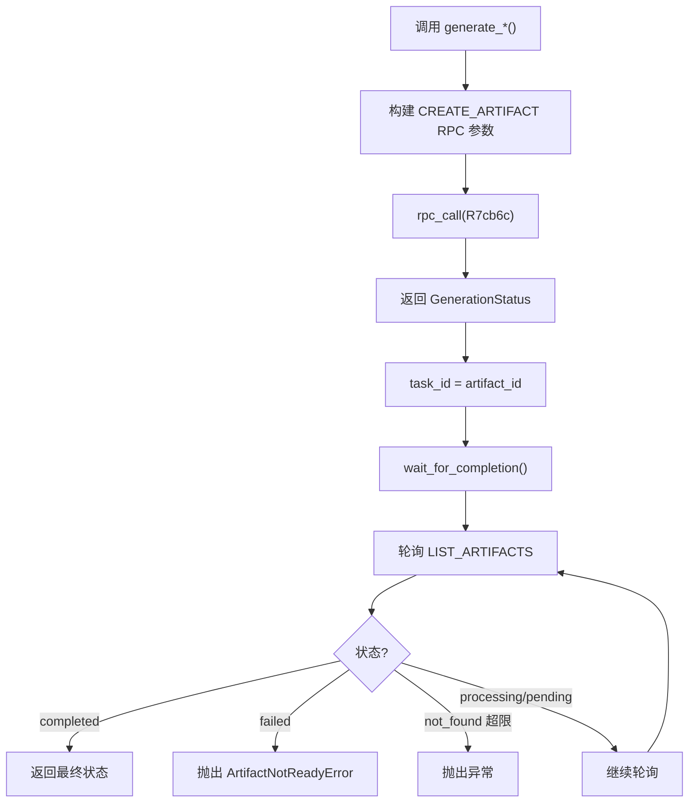
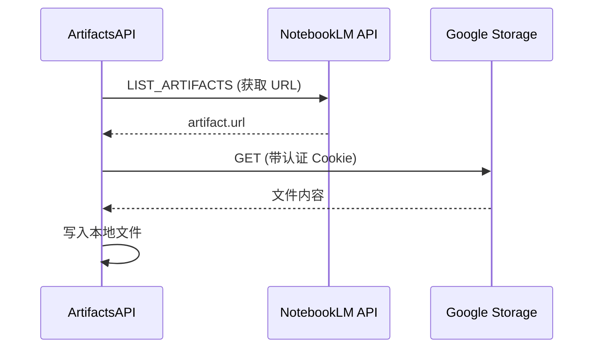

<details>
<summary>相关源文件</summary>

生成本页时使用的主要源文件：

- [src/notebooklm/_artifacts.py](https://github.com/teng-lin/notebooklm-py/blob/d6cef809dee4f03794e89bd089dd426b34a67345/src/notebooklm/_artifacts.py)
- [src/notebooklm/cli/generate.py](https://github.com/teng-lin/notebooklm-py/blob/d6cef809dee4f03794e89bd089dd426b34a67345/src/notebooklm/cli/generate.py)
- [src/notebooklm/cli/download.py](https://github.com/teng-lin/notebooklm-py/blob/d6cef809dee4f03794e89bd089dd426b34a67345/src/notebooklm/cli/download.py)
- [src/notebooklm/cli/download_helpers.py](https://github.com/teng-lin/notebooklm-py/blob/d6cef809dee4f03794e89bd089dd426b34a67345/src/notebooklm/cli/download_helpers.py)

</details>

# 制品生成与下载

制品（Artifact）是 NotebookLM 的 AI 生成内容，包括音频播客、视频、报告、测验、闪卡、思维导图、信息图、幻灯片和数据表。`ArtifactsAPI` 统一管理所有制品类型的生成、轮询、列表和下载。

## 制品类型与配置

| 类型 | ArtifactTypeCode | 生成方法 | 配置选项 | 下载格式 |
|------|------------------|----------|----------|----------|
| **Audio** | 1 | `generate_audio()` | format, length, language | MP3/MP4 |
| **Report** | 2 | `generate_report()` | format, append | Markdown |
| **Video** | 3 | `generate_video()` | format, style, language | MP4 |
| **Quiz** | 4 (variant=2) | `generate_quiz()` | difficulty, quantity | JSON/MD/HTML |
| **Flashcards** | 4 (variant=1) | `generate_flashcards()` | difficulty, quantity | JSON/MD/HTML |
| **Mind Map** | 5 | `generate_mind_map()` | 无（同步即时） | JSON |
| **Infographic** | 7 | `generate_infographic()` | orientation, detail, style | PNG |
| **Slide Deck** | 8 | `generate_slide_deck()` | format, length | PDF/PPTX |
| **Data Table** | 9 | `generate_data_table()` | description | CSV |

Sources: [src/notebooklm/rpc/types.py:103-130](../../../project-repos/notebooklm-py/src/notebooklm/rpc/types.py#L103-L130), [src/notebooklm/_artifacts.py](../../../project-repos/notebooklm-py/src/notebooklm/_artifacts.py)

<details class="source-snippets">
<summary>引用源码</summary>

<!-- source-snippets:start -->

#### `src/notebooklm/rpc/types.py:103-130`

```python
    SLIDE_DECK = 8
    DATA_TABLE = 9


# Deprecated alias for backward compatibility
StudioContentType = ArtifactTypeCode


class ArtifactStatus(int, Enum):
    """Processing status of an artifact.

    Values correspond to artifact_data[4] in API responses.
    """

    PROCESSING = 1  # Artifact is being generated
    PENDING = 2  # Artifact is queued
    COMPLETED = 3  # Artifact is ready for use/download
    FAILED = 4  # Generation failed


_ARTIFACT_STATUS_MAP: dict[int, str] = {
    ArtifactStatus.PROCESSING: "in_progress",
    ArtifactStatus.PENDING: "pending",
    ArtifactStatus.COMPLETED: "completed",
    ArtifactStatus.FAILED: "failed",
}


```

#### `src/notebooklm/_artifacts.py`

```python
"""Artifacts API for NotebookLM studio content.

Provides operations for generating, listing, downloading, and managing
AI-generated artifacts including Audio Overviews, Video Overviews, Reports,
Quizzes, Flashcards, Infographics, Slide Decks, Data Tables, and Mind Maps.
"""

import asyncio
import builtins
import csv
import html
import json
import logging
import re
from pathlib import Path
from typing import TYPE_CHECKING, Any
from urllib.parse import urlparse

import httpx

from ._core import ClientCore
from .auth import load_httpx_cookies
from .exceptions import ValidationError
from .rpc import (
    ArtifactStatus,
    ArtifactTypeCode,
    AudioFormat,
    AudioLength,
    ExportType,
    InfographicDetail,
    InfographicOrientation,
    InfographicStyle,
    QuizDifficulty,
    QuizQuantity,
    ReportFormat,
    RPCError,
    RPCMethod,
    SlideDeckFormat,
    SlideDeckLength,
    VideoFormat,
    VideoStyle,
    artifact_status_to_str,
)
from .types import (
    Artifact,
    ArtifactDownloadError,
    ArtifactNotFoundError,
    ArtifactNotReadyError,
    ArtifactParseError,
    ArtifactType,
    GenerationStatus,
    ReportSuggestion,
)

logger = logging.getLogger(__name__)

# Media artifact types that require URL availability before reporting completion
_MEDIA_ARTIFACT_TYPES = frozenset(
    {
        ArtifactTypeCode.AUDIO.value,
        ArtifactTypeCode.VIDEO.value,
        ArtifactTypeCode.INFOGRAPHIC.value,
        ArtifactTypeCode.SLIDE_DECK.value,
    }
)

if TYPE_CHECKING:
    from ._notes import NotesAPI


def _extract_app_data(html_content: str) -> dict:
    """Extract JSON from data-app-data HTML attribute.

    The quiz/flashcard HTML embeds JSON in a data-app-data attribute
    with HTML-encoded content (e.g., &quot; for quotes).
    """
    match = re.search(r'data-app-data="([^"]+)"', html_content)
    if not match:
        raise ArtifactParseError(
            "quiz/flashcard",
            details="No data-app-data attribute found in HTML",
        )

    encoded_json = match.group(1)
    decoded_json = html.unescape(encoded_json)
    return json.loads(decoded_json)


def _format_quiz_markdown(title: str, questions: list[dict]) -> str:
    """Format quiz as markdown."""
    lines = [f"# {title}", ""]
    for i, q in enumerate(questions, 1):
        lines.append(f"## Question {i}")
        lines.append(q.get("question", ""))
        lines.append("")
        for opt in q.get("answerOptions", []):
            marker = "[x]" if opt.get("isCorrect") else "[ ]"
            lines.append(f"- {marker} {opt.get('text', '')}")
        if q.get("hint"):
            lines.append("")
            lines.append(f"**Hint:** {q['hint']}")
        lines.append("")
    return "\n".join(lines)


def _format_flashcards_markdown(title: str, cards: list[dict]) -> str:
    """Format flashcards as markdown."""
    lines = [f"# {title}", ""]
    for i, card in enumerate(cards, 1):
        front = card.get("f", "")
        back = card.get("b", "")
        lines.extend(
            [
                f"## Card {i}",
                "",
                f"**Q:** {front}",
                "",
                f"**A:** {back}",
                "",
                "---",
```

<!-- source-snippets:end -->
</details>
## 生成流程



### 关键设计：task_id = artifact_id

生成任务返回的 `task_id` 与最终制品的 `artifact_id` 是同一个标识符。生成期间用于轮询状态，完成后作为制品 ID 用于下载。

Sources: [src/notebooklm/_artifacts.py](../../../project-repos/notebooklm-py/src/notebooklm/_artifacts.py)

<details class="source-snippets">
<summary>引用源码</summary>

<!-- source-snippets:start -->

#### `src/notebooklm/_artifacts.py`

```python
"""Artifacts API for NotebookLM studio content.

Provides operations for generating, listing, downloading, and managing
AI-generated artifacts including Audio Overviews, Video Overviews, Reports,
Quizzes, Flashcards, Infographics, Slide Decks, Data Tables, and Mind Maps.
"""

import asyncio
import builtins
import csv
import html
import json
import logging
import re
from pathlib import Path
from typing import TYPE_CHECKING, Any
from urllib.parse import urlparse

import httpx

from ._core import ClientCore
from .auth import load_httpx_cookies
from .exceptions import ValidationError
from .rpc import (
    ArtifactStatus,
    ArtifactTypeCode,
    AudioFormat,
    AudioLength,
    ExportType,
    InfographicDetail,
    InfographicOrientation,
    InfographicStyle,
    QuizDifficulty,
    QuizQuantity,
    ReportFormat,
    RPCError,
    RPCMethod,
    SlideDeckFormat,
    SlideDeckLength,
    VideoFormat,
    VideoStyle,
    artifact_status_to_str,
)
from .types import (
    Artifact,
    ArtifactDownloadError,
    ArtifactNotFoundError,
    ArtifactNotReadyError,
    ArtifactParseError,
    ArtifactType,
    GenerationStatus,
    ReportSuggestion,
)

logger = logging.getLogger(__name__)

# Media artifact types that require URL availability before reporting completion
_MEDIA_ARTIFACT_TYPES = frozenset(
    {
        ArtifactTypeCode.AUDIO.value,
        ArtifactTypeCode.VIDEO.value,
        ArtifactTypeCode.INFOGRAPHIC.value,
        ArtifactTypeCode.SLIDE_DECK.value,
    }
)

if TYPE_CHECKING:
    from ._notes import NotesAPI


def _extract_app_data(html_content: str) -> dict:
    """Extract JSON from data-app-data HTML attribute.

    The quiz/flashcard HTML embeds JSON in a data-app-data attribute
    with HTML-encoded content (e.g., &quot; for quotes).
    """
    match = re.search(r'data-app-data="([^"]+)"', html_content)
    if not match:
        raise ArtifactParseError(
            "quiz/flashcard",
            details="No data-app-data attribute found in HTML",
        )

    encoded_json = match.group(1)
    decoded_json = html.unescape(encoded_json)
    return json.loads(decoded_json)


def _format_quiz_markdown(title: str, questions: list[dict]) -> str:
    """Format quiz as markdown."""
    lines = [f"# {title}", ""]
    for i, q in enumerate(questions, 1):
        lines.append(f"## Question {i}")
        lines.append(q.get("question", ""))
        lines.append("")
        for opt in q.get("answerOptions", []):
            marker = "[x]" if opt.get("isCorrect") else "[ ]"
            lines.append(f"- {marker} {opt.get('text', '')}")
        if q.get("hint"):
            lines.append("")
            lines.append(f"**Hint:** {q['hint']}")
        lines.append("")
    return "\n".join(lines)


def _format_flashcards_markdown(title: str, cards: list[dict]) -> str:
    """Format flashcards as markdown."""
    lines = [f"# {title}", ""]
    for i, card in enumerate(cards, 1):
        front = card.get("f", "")
        back = card.get("b", "")
        lines.extend(
            [
                f"## Card {i}",
                "",
                f"**Q:** {front}",
                "",
                f"**A:** {back}",
                "",
                "---",
```

<!-- source-snippets:end -->
</details>
## 轮询与等待

`wait_for_completion()` 实现了带退避的轮询机制：

| 参数 | 默认值 | 说明 |
|------|--------|------|
| `timeout` | 600s | 最大等待时间 |
| `poll_interval` | 5s | 初始轮询间隔 |
| `max_poll_interval` | 30s | 最大轮询间隔 |
| `max_not_found` | 10 | 连续 not_found 次数上限 |

轮询间隔按 1.5 倍指数退避增长，上限为 `max_poll_interval`。`not_found` 状态表示制品尚未出现在列表中或被服务端静默移除（如配额限制）。

Sources: [src/notebooklm/_artifacts.py](../../../project-repos/notebooklm-py/src/notebooklm/_artifacts.py)

<details class="source-snippets">
<summary>引用源码</summary>

<!-- source-snippets:start -->

#### `src/notebooklm/_artifacts.py`

```python
"""Artifacts API for NotebookLM studio content.

Provides operations for generating, listing, downloading, and managing
AI-generated artifacts including Audio Overviews, Video Overviews, Reports,
Quizzes, Flashcards, Infographics, Slide Decks, Data Tables, and Mind Maps.
"""

import asyncio
import builtins
import csv
import html
import json
import logging
import re
from pathlib import Path
from typing import TYPE_CHECKING, Any
from urllib.parse import urlparse

import httpx

from ._core import ClientCore
from .auth import load_httpx_cookies
from .exceptions import ValidationError
from .rpc import (
    ArtifactStatus,
    ArtifactTypeCode,
    AudioFormat,
    AudioLength,
    ExportType,
    InfographicDetail,
    InfographicOrientation,
    InfographicStyle,
    QuizDifficulty,
    QuizQuantity,
    ReportFormat,
    RPCError,
    RPCMethod,
    SlideDeckFormat,
    SlideDeckLength,
    VideoFormat,
    VideoStyle,
    artifact_status_to_str,
)
from .types import (
    Artifact,
    ArtifactDownloadError,
    ArtifactNotFoundError,
    ArtifactNotReadyError,
    ArtifactParseError,
    ArtifactType,
    GenerationStatus,
    ReportSuggestion,
)

logger = logging.getLogger(__name__)

# Media artifact types that require URL availability before reporting completion
_MEDIA_ARTIFACT_TYPES = frozenset(
    {
        ArtifactTypeCode.AUDIO.value,
        ArtifactTypeCode.VIDEO.value,
        ArtifactTypeCode.INFOGRAPHIC.value,
        ArtifactTypeCode.SLIDE_DECK.value,
    }
)

if TYPE_CHECKING:
    from ._notes import NotesAPI


def _extract_app_data(html_content: str) -> dict:
    """Extract JSON from data-app-data HTML attribute.

    The quiz/flashcard HTML embeds JSON in a data-app-data attribute
    with HTML-encoded content (e.g., &quot; for quotes).
    """
    match = re.search(r'data-app-data="([^"]+)"', html_content)
    if not match:
        raise ArtifactParseError(
            "quiz/flashcard",
            details="No data-app-data attribute found in HTML",
        )

    encoded_json = match.group(1)
    decoded_json = html.unescape(encoded_json)
    return json.loads(decoded_json)


def _format_quiz_markdown(title: str, questions: list[dict]) -> str:
    """Format quiz as markdown."""
    lines = [f"# {title}", ""]
    for i, q in enumerate(questions, 1):
        lines.append(f"## Question {i}")
        lines.append(q.get("question", ""))
        lines.append("")
        for opt in q.get("answerOptions", []):
            marker = "[x]" if opt.get("isCorrect") else "[ ]"
            lines.append(f"- {marker} {opt.get('text', '')}")
        if q.get("hint"):
            lines.append("")
            lines.append(f"**Hint:** {q['hint']}")
        lines.append("")
    return "\n".join(lines)


def _format_flashcards_markdown(title: str, cards: list[dict]) -> str:
    """Format flashcards as markdown."""
    lines = [f"# {title}", ""]
    for i, card in enumerate(cards, 1):
        front = card.get("f", "")
        back = card.get("b", "")
        lines.extend(
            [
                f"## Card {i}",
                "",
                f"**Q:** {front}",
                "",
                f"**A:** {back}",
                "",
                "---",
```

<!-- source-snippets:end -->
</details>
## 下载机制

### 媒体制品下载

Audio、Video、Infographic、Slide Deck 等媒体制品需要先获取下载 URL，再通过认证 HTTP 请求下载：



下载使用 `load_httpx_cookies()` 提供的带域名信息的 Cookie，以支持跨域名重定向。

### Quiz/Flashcard 下载

Quiz 和 Flashcard 支持三种导出格式：

| 格式 | 实现方式 |
|------|----------|
| **JSON** | 从 HTML `data-app-data` 属性提取 JSON |
| **Markdown** | 格式化为 Markdown 列表 |
| **HTML** | 通过 `GET_INTERACTIVE_HTML` RPC 获取原始 HTML |

JSON 提取流程：获取 HTML → 正则匹配 `data-app-data="..."` → HTML 反转义 → JSON 解析。

Sources: [src/notebooklm/_artifacts.py:20-100](../../../project-repos/notebooklm-py/src/notebooklm/_artifacts.py#L20-L100)

<details class="source-snippets">
<summary>引用源码</summary>

<!-- source-snippets:start -->

#### `src/notebooklm/_artifacts.py:20-100`

```python

from ._core import ClientCore
from .auth import load_httpx_cookies
from .exceptions import ValidationError
from .rpc import (
    ArtifactStatus,
    ArtifactTypeCode,
    AudioFormat,
    AudioLength,
    ExportType,
    InfographicDetail,
    InfographicOrientation,
    InfographicStyle,
    QuizDifficulty,
    QuizQuantity,
    ReportFormat,
    RPCError,
    RPCMethod,
    SlideDeckFormat,
    SlideDeckLength,
    VideoFormat,
    VideoStyle,
    artifact_status_to_str,
)
from .types import (
    Artifact,
    ArtifactDownloadError,
    ArtifactNotFoundError,
    ArtifactNotReadyError,
    ArtifactParseError,
    ArtifactType,
    GenerationStatus,
    ReportSuggestion,
)

logger = logging.getLogger(__name__)

# Media artifact types that require URL availability before reporting completion
_MEDIA_ARTIFACT_TYPES = frozenset(
    {
        ArtifactTypeCode.AUDIO.value,
        ArtifactTypeCode.VIDEO.value,
        ArtifactTypeCode.INFOGRAPHIC.value,
        ArtifactTypeCode.SLIDE_DECK.value,
    }
)

if TYPE_CHECKING:
    from ._notes import NotesAPI


def _extract_app_data(html_content: str) -> dict:
    """Extract JSON from data-app-data HTML attribute.

    The quiz/flashcard HTML embeds JSON in a data-app-data attribute
    with HTML-encoded content (e.g., &quot; for quotes).
    """
    match = re.search(r'data-app-data="([^"]+)"', html_content)
    if not match:
        raise ArtifactParseError(
            "quiz/flashcard",
            details="No data-app-data attribute found in HTML",
        )

    encoded_json = match.group(1)
    decoded_json = html.unescape(encoded_json)
    return json.loads(decoded_json)


def _format_quiz_markdown(title: str, questions: list[dict]) -> str:
    """Format quiz as markdown."""
    lines = [f"# {title}", ""]
    for i, q in enumerate(questions, 1):
        lines.append(f"## Question {i}")
        lines.append(q.get("question", ""))
        lines.append("")
        for opt in q.get("answerOptions", []):
            marker = "[x]" if opt.get("isCorrect") else "[ ]"
            lines.append(f"- {marker} {opt.get('text', '')}")
        if q.get("hint"):
            lines.append("")
```

<!-- source-snippets:end -->
</details>
### Mind Map 下载

Mind Map 存储在笔记系统中（非标准制品列表），通过 `GET_NOTES_AND_MIND_MAPS` RPC 获取，返回层级 JSON 结构。

### Data Table 下载

Data Table 以 CSV 格式下载，支持自然语言描述自定义结构。

### Report 下载

Report 以 Markdown 格式下载，支持 `briefing_doc`、`study_guide`、`blog_post` 和 `custom` 四种格式模板，可通过 `append` 参数追加自定义指令。

## 典型处理时间

| 操作 | 典型时间 | 建议超时 |
|------|----------|----------|
| Mind Map | 即时（同步） | N/A |
| Quiz / Flashcards | 5-15 分钟 | 900s |
| Report / Data Table | 5-15 分钟 | 900s |
| Audio 生成 | 10-20 分钟 | 1200s |
| Video 生成 | 15-45 分钟 | 2700s |

## 限速与重试

Audio、Video、Quiz 等制品类型容易触发 Google 的限速。`GenerationStatus.is_rate_limited` 检测限速错误（`USER_DISPLAYABLE_ERROR` 或错误消息包含 "rate limit"/"quota"）。CLI 的 `--retry N` 选项支持自动限速重试，使用指数退避。

Sources: [src/notebooklm/_artifacts.py](../../../project-repos/notebooklm-py/src/notebooklm/_artifacts.py)

<details class="source-snippets">
<summary>引用源码</summary>

<!-- source-snippets:start -->

#### `src/notebooklm/_artifacts.py`

```python
"""Artifacts API for NotebookLM studio content.

Provides operations for generating, listing, downloading, and managing
AI-generated artifacts including Audio Overviews, Video Overviews, Reports,
Quizzes, Flashcards, Infographics, Slide Decks, Data Tables, and Mind Maps.
"""

import asyncio
import builtins
import csv
import html
import json
import logging
import re
from pathlib import Path
from typing import TYPE_CHECKING, Any
from urllib.parse import urlparse

import httpx

from ._core import ClientCore
from .auth import load_httpx_cookies
from .exceptions import ValidationError
from .rpc import (
    ArtifactStatus,
    ArtifactTypeCode,
    AudioFormat,
    AudioLength,
    ExportType,
    InfographicDetail,
    InfographicOrientation,
    InfographicStyle,
    QuizDifficulty,
    QuizQuantity,
    ReportFormat,
    RPCError,
    RPCMethod,
    SlideDeckFormat,
    SlideDeckLength,
    VideoFormat,
    VideoStyle,
    artifact_status_to_str,
)
from .types import (
    Artifact,
    ArtifactDownloadError,
    ArtifactNotFoundError,
    ArtifactNotReadyError,
    ArtifactParseError,
    ArtifactType,
    GenerationStatus,
    ReportSuggestion,
)

logger = logging.getLogger(__name__)

# Media artifact types that require URL availability before reporting completion
_MEDIA_ARTIFACT_TYPES = frozenset(
    {
        ArtifactTypeCode.AUDIO.value,
        ArtifactTypeCode.VIDEO.value,
        ArtifactTypeCode.INFOGRAPHIC.value,
        ArtifactTypeCode.SLIDE_DECK.value,
    }
)

if TYPE_CHECKING:
    from ._notes import NotesAPI


def _extract_app_data(html_content: str) -> dict:
    """Extract JSON from data-app-data HTML attribute.

    The quiz/flashcard HTML embeds JSON in a data-app-data attribute
    with HTML-encoded content (e.g., &quot; for quotes).
    """
    match = re.search(r'data-app-data="([^"]+)"', html_content)
    if not match:
        raise ArtifactParseError(
            "quiz/flashcard",
            details="No data-app-data attribute found in HTML",
        )

    encoded_json = match.group(1)
    decoded_json = html.unescape(encoded_json)
    return json.loads(decoded_json)


def _format_quiz_markdown(title: str, questions: list[dict]) -> str:
    """Format quiz as markdown."""
    lines = [f"# {title}", ""]
    for i, q in enumerate(questions, 1):
        lines.append(f"## Question {i}")
        lines.append(q.get("question", ""))
        lines.append("")
        for opt in q.get("answerOptions", []):
            marker = "[x]" if opt.get("isCorrect") else "[ ]"
            lines.append(f"- {marker} {opt.get('text', '')}")
        if q.get("hint"):
            lines.append("")
            lines.append(f"**Hint:** {q['hint']}")
        lines.append("")
    return "\n".join(lines)


def _format_flashcards_markdown(title: str, cards: list[dict]) -> str:
    """Format flashcards as markdown."""
    lines = [f"# {title}", ""]
    for i, card in enumerate(cards, 1):
        front = card.get("f", "")
        back = card.get("b", "")
        lines.extend(
            [
                f"## Card {i}",
                "",
                f"**Q:** {front}",
                "",
                f"**A:** {back}",
                "",
                "---",
```

<!-- source-snippets:end -->
</details>
## 相关页面

- [客户端 API](client-api.md)
- [数据类型与模型](data-types-and-models.md)
- [RPC 协议层](rpc-protocol.md)
