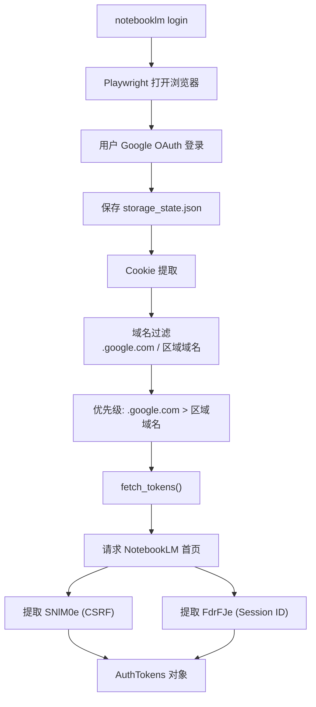
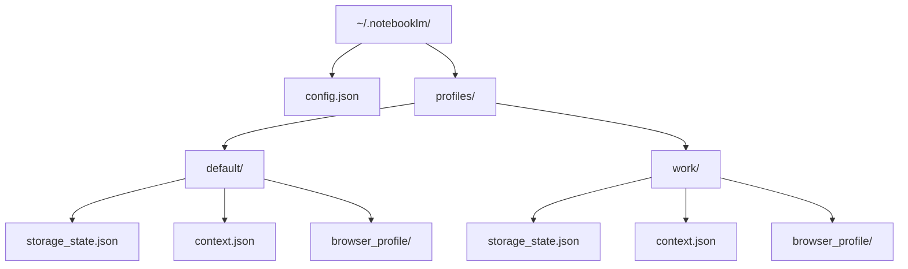

<details>
<summary>相关源文件</summary>

生成本页时使用的主要源文件：

- [src/notebooklm/auth.py](https://github.com/teng-lin/notebooklm-py/blob/d6cef809dee4f03794e89bd089dd426b34a67345/src/notebooklm/auth.py)
- [src/notebooklm/paths.py](https://github.com/teng-lin/notebooklm-py/blob/d6cef809dee4f03794e89bd089dd426b34a67345/src/notebooklm/paths.py)
- [src/notebooklm/_url_utils.py](https://github.com/teng-lin/notebooklm-py/blob/d6cef809dee4f03794e89bd089dd426b34a67345/src/notebooklm/_url_utils.py)
- [src/notebooklm/migration.py](https://github.com/teng-lin/notebooklm-py/blob/d6cef809dee4f03794e89bd089dd426b34a67345/src/notebooklm/migration.py)

</details>

# 认证与安全

notebooklm-py 使用基于 Cookie 的认证方案，通过 Playwright 浏览器自动化获取 Google 会话 Cookie，再从 NotebookLM 首页提取 CSRF Token（SNlM0e）和 Session ID（FdrFJe）。整个认证链涉及 Cookie 提取、域名过滤、Token 获取和多账户 Profile 管理。

## 认证架构



Sources: [src/notebooklm/auth.py](../../../project-repos/notebooklm-py/src/notebooklm/auth.py)

<details class="source-snippets">
<summary>引用源码</summary>

<!-- source-snippets:start -->

#### `src/notebooklm/auth.py`

```python
"""Authentication handling for NotebookLM API.

This module provides authentication utilities for the NotebookLM client:

1. **Cookie-based Authentication**: Loads Google cookies from Playwright storage
   state files created by `notebooklm login`.

2. **Token Extraction**: Fetches CSRF (SNlM0e) and session (FdrFJe) tokens from
   the NotebookLM homepage, required for all RPC calls.

3. **Download Cookies**: Provides httpx-compatible cookies with domain info for
   authenticated downloads from Google content servers.

Usage:
    # Recommended: Use AuthTokens.from_storage() for full initialization
    auth = await AuthTokens.from_storage()
    async with NotebookLMClient(auth) as client:
        ...

    # For authenticated downloads
    cookies = load_httpx_cookies()
    async with httpx.AsyncClient(cookies=cookies) as client:
        response = await client.get(url)

Security Notes:
    - Storage state files contain sensitive session cookies
    - Path traversal protection is enforced on all file operations
"""

import json
import logging
import os
import re
from dataclasses import dataclass
from pathlib import Path
from typing import Any

import httpx

from ._url_utils import contains_google_auth_redirect, is_google_auth_redirect
from .paths import get_storage_path

logger = logging.getLogger(__name__)

# Minimum required cookies (must have at least SID for basic auth)
MINIMUM_REQUIRED_COOKIES = {"SID"}

# Cookie domains to extract from storage state
# Includes googleusercontent.com for authenticated media downloads
ALLOWED_COOKIE_DOMAINS = {
    ".google.com",
    "notebooklm.google.com",
    ".googleusercontent.com",
}

# Regional Google ccTLDs where Google may set auth cookies
# Users in these regions may have SID cookies on regional domains instead of .google.com
# Format: suffix after ".google." (e.g., "com.sg" for ".google.com.sg")
#
# Categories:
# - com.XX: Country-code second-level domains (Singapore, Australia, Brazil, etc.)
# - co.XX: Country domains using .co (UK, Japan, India, Korea, etc.)
# - XX: Single ccTLD countries (Germany, France, Italy, etc.)
GOOGLE_REGIONAL_CCTLDS = frozenset(
    {
        # .google.com.XX pattern (country-code second-level domains)
        "com.sg",  # Singapore
        "com.au",  # Australia
        "com.br",  # Brazil
        "com.mx",  # Mexico
        "com.ar",  # Argentina
        "com.hk",  # Hong Kong
        "com.tw",  # Taiwan
        "com.my",  # Malaysia
        "com.ph",  # Philippines
        "com.vn",  # Vietnam
        "com.pk",  # Pakistan
        "com.bd",  # Bangladesh
        "com.ng",  # Nigeria
        "com.eg",  # Egypt
        "com.tr",  # Turkey
        "com.ua",  # Ukraine
        "com.co",  # Colombia
        "com.pe",  # Peru
        "com.sa",  # Saudi Arabia
        "com.ae",  # UAE
        # .google.co.XX pattern (countries using .co second-level)
        "co.uk",  # United Kingdom
        "co.jp",  # Japan
        "co.in",  # India
        "co.kr",  # South Korea
        "co.za",  # South Africa
        "co.nz",  # New Zealand
        "co.id",  # Indonesia
        "co.th",  # Thailand
        "co.il",  # Israel
        "co.ve",  # Venezuela
        "co.cr",  # Costa Rica
        "co.ke",  # Kenya
        "co.ug",  # Uganda
        "co.tz",  # Tanzania
        "co.ma",  # Morocco
        "co.ao",  # Angola
        "co.mz",  # Mozambique
        "co.zw",  # Zimbabwe
        "co.bw",  # Botswana
        # .google.XX pattern (single ccTLD countries)
        "cn",  # China
        "de",  # Germany
        "fr",  # France
        "it",  # Italy
        "es",  # Spain
        "nl",  # Netherlands
        "pl",  # Poland
        "ru",  # Russia
        "ca",  # Canada
        "be",  # Belgium
        "at",  # Austria
        "ch",  # Switzerland
        "se",  # Sweden
```

<!-- source-snippets:end -->
</details>
## Cookie 提取与域名处理

### 认证来源优先级

`_load_storage_state()` 按以下优先级加载认证信息：

1. **显式路径参数**（`--storage` CLI 标志）
2. **`NOTEBOOKLM_AUTH_JSON` 环境变量**（CI/CD 友好，无需文件写入）
3. **默认文件路径**（`$NOTEBOOKLM_HOME/profiles/<profile>/storage_state.json`）

Sources: [src/notebooklm/auth.py:310-370](../../../project-repos/notebooklm-py/src/notebooklm/auth.py#L310-L370)

<details class="source-snippets">
<summary>引用源码</summary>

<!-- source-snippets:start -->

#### `src/notebooklm/auth.py:310-370`

```python

    Filters cookies to include those from .google.com, notebooklm.google.com,
    .googleusercontent.com domains, and regional Google domains
    (e.g., .google.com.sg, .google.com.au). The regional domains are needed
    because Google sets SID cookies on country-specific domains for users
    in those regions.

    Cookie Priority Rules:
        When the same cookie name exists on multiple domains (e.g., SID on both
        .google.com and .google.com.sg), we use this priority order:

        1. .google.com (base domain) - ALWAYS preferred when present
        2. Regional domains - used as fallback when base domain cookie is missing

        This prevents non-deterministic behavior where dict iteration order would
        determine which cookie value wins. See PR #34 for the bug this fixes.

    Args:
        storage_state: Parsed JSON from Playwright's storage state file.

    Returns:
        Dict mapping cookie names to values.

    Raises:
        ValueError: If required cookies (SID) are missing from storage state.

    Example:
        >>> storage = {"cookies": [
        ...     {"name": "SID", "value": "regional", "domain": ".google.com.sg"},
        ...     {"name": "SID", "value": "base", "domain": ".google.com"},
        ... ]}
        >>> cookies = extract_cookies_from_storage(storage)
        >>> cookies["SID"]
        'base'  # .google.com wins regardless of list order
    """
    cookies = {}
    cookie_domains: dict[str, str] = {}  # Track which domain each cookie came from

    for cookie in storage_state.get("cookies", []):
        domain = cookie.get("domain", "")
        name = cookie.get("name")
        if not _is_allowed_auth_domain(domain) or not name:
            continue

        # Prioritize .google.com cookies over regional domains (e.g., .google.de)
        # to prevent wrong cookie values when the same name exists in multiple domains
        is_base_domain = domain == ".google.com"
        if name not in cookies or is_base_domain:
            if name in cookies and is_base_domain:
                logger.debug(
                    "Cookie %s: using .google.com value (overriding %s)",
                    name,
                    cookie_domains[name],
                )
            cookies[name] = cookie.get("value", "")
            cookie_domains[name] = domain
        else:
            logger.debug(
                "Cookie %s: ignoring duplicate from %s (keeping %s)",
                name,
                domain,
```

<!-- source-snippets:end -->
</details>
### 域名白名单

`extract_cookies_from_storage()` 仅提取以下域名的 Cookie：

| 域名 | 用途 |
|------|------|
| `.google.com` | 主认证域名 |
| `notebooklm.google.com` | NotebookLM 专属 |
| `.googleusercontent.com` | 媒体下载 |
| 区域域名（`.google.com.sg` 等） | 区域用户 SID Cookie |

### Cookie 优先级规则

当同一 Cookie 名存在于多个域名时（如 SID 同时在 `.google.com` 和 `.google.com.sg`），优先使用 `.google.com` 的值。这修复了 PR #34 中因字典迭代顺序不确定导致的非确定性行为。

Sources: [src/notebooklm/auth.py:200-280](../../../project-repos/notebooklm-py/src/notebooklm/auth.py#L200-L280)

<details class="source-snippets">
<summary>引用源码</summary>

<!-- source-snippets:start -->

#### `src/notebooklm/auth.py:200-280`

```python
            path = get_storage_path(profile=profile)
        cookies = load_auth_from_storage(path)
        csrf_token, session_id = await fetch_tokens(cookies)
        return cls(cookies=cookies, csrf_token=csrf_token, session_id=session_id)


def _is_google_domain(domain: str) -> bool:
    """Check if a cookie domain is a valid Google domain.

    Uses a whitelist approach to validate Google domains including:
    - Base domain: .google.com
    - Regional .google.com.XX: .google.com.sg, .google.com.au, etc.
    - Regional .google.co.XX: .google.co.uk, .google.co.jp, etc.
    - Regional .google.XX: .google.de, .google.fr, etc.

    This function is used by both auth cookie extraction and download cookie
    validation to ensure consistent domain handling across the codebase.

    Args:
        domain: Cookie domain to check (e.g., '.google.com', '.google.com.sg')

    Returns:
        True if domain is a valid Google domain.

    Note:
        Uses an explicit whitelist (GOOGLE_REGIONAL_CCTLDS) rather than regex
        to prevent false positives from invalid or malicious domains.
    """
    # Base Google domain
    if domain == ".google.com":
        return True

    # Check regional Google domains using whitelist
    if domain.startswith(".google."):
        suffix = domain[8:]  # Remove ".google." prefix
        return suffix in GOOGLE_REGIONAL_CCTLDS

    return False


def _is_allowed_auth_domain(domain: str) -> bool:
    """Check if a cookie domain is allowed for auth cookie extraction.

    Includes exact matches against ALLOWED_COOKIE_DOMAINS plus regional
    Google domains (e.g., .google.com.sg, .google.co.uk, .google.de) where
    SID cookies may be set for users in those regions.

    Args:
        domain: Cookie domain to check (e.g., '.google.com', '.google.com.sg')

    Returns:
        True if domain is allowed for auth cookies.
    """
    # Check if domain is in the primary allowlist or is a valid Google domain (base or regional)
    return domain in ALLOWED_COOKIE_DOMAINS or _is_google_domain(domain)


def convert_rookiepy_cookies_to_storage_state(
    rookiepy_cookies: list[dict],
) -> dict[str, Any]:
    """Convert rookiepy cookie dicts to Playwright storage_state.json format.

    Key mappings:
    - ``http_only`` → ``httpOnly`` (snake_case to camelCase)
    - ``expires=None`` → ``expires=-1`` (Playwright convention for session cookies)
    - ``sameSite`` always ``"None"`` for cross-site Google cookies

    Args:
        rookiepy_cookies: List of cookie dicts from any ``rookiepy.*()`` call.
            Required keys: ``domain``, ``name``, ``value``.

    Returns:
        Dict matching storage_state.json schema: ``{"cookies": [...], "origins": []}``.
        Cookies missing required fields or from non-Google domains are silently skipped.
    """
    converted = []
    for cookie in rookiepy_cookies:
        domain = cookie.get("domain", "")
        name = cookie.get("name", "")
        value = cookie.get("value", "")

```

<!-- source-snippets:end -->
</details>
### 区域域名支持

`GOOGLE_REGIONAL_CCTLDS` 定义了 60+ 个 Google 区域域名后缀，覆盖三种模式：

- `.google.com.XX`：新加坡、澳大利亚、巴西等
- `.google.co.XX`：英国、日本、印度等
- `.google.XX`：德国、法国、中国等

`_is_google_domain()` 使用显式白名单而非正则匹配，防止恶意域名伪造。

Sources: [src/notebooklm/auth.py:50-110](../../../project-repos/notebooklm-py/src/notebooklm/auth.py#L50-L110)

<details class="source-snippets">
<summary>引用源码</summary>

<!-- source-snippets:start -->

#### `src/notebooklm/auth.py:50-110`

```python
ALLOWED_COOKIE_DOMAINS = {
    ".google.com",
    "notebooklm.google.com",
    ".googleusercontent.com",
}

# Regional Google ccTLDs where Google may set auth cookies
# Users in these regions may have SID cookies on regional domains instead of .google.com
# Format: suffix after ".google." (e.g., "com.sg" for ".google.com.sg")
#
# Categories:
# - com.XX: Country-code second-level domains (Singapore, Australia, Brazil, etc.)
# - co.XX: Country domains using .co (UK, Japan, India, Korea, etc.)
# - XX: Single ccTLD countries (Germany, France, Italy, etc.)
GOOGLE_REGIONAL_CCTLDS = frozenset(
    {
        # .google.com.XX pattern (country-code second-level domains)
        "com.sg",  # Singapore
        "com.au",  # Australia
        "com.br",  # Brazil
        "com.mx",  # Mexico
        "com.ar",  # Argentina
        "com.hk",  # Hong Kong
        "com.tw",  # Taiwan
        "com.my",  # Malaysia
        "com.ph",  # Philippines
        "com.vn",  # Vietnam
        "com.pk",  # Pakistan
        "com.bd",  # Bangladesh
        "com.ng",  # Nigeria
        "com.eg",  # Egypt
        "com.tr",  # Turkey
        "com.ua",  # Ukraine
        "com.co",  # Colombia
        "com.pe",  # Peru
        "com.sa",  # Saudi Arabia
        "com.ae",  # UAE
        # .google.co.XX pattern (countries using .co second-level)
        "co.uk",  # United Kingdom
        "co.jp",  # Japan
        "co.in",  # India
        "co.kr",  # South Korea
        "co.za",  # South Africa
        "co.nz",  # New Zealand
        "co.id",  # Indonesia
        "co.th",  # Thailand
        "co.il",  # Israel
        "co.ve",  # Venezuela
        "co.cr",  # Costa Rica
        "co.ke",  # Kenya
        "co.ug",  # Uganda
        "co.tz",  # Tanzania
        "co.ma",  # Morocco
        "co.ao",  # Angola
        "co.mz",  # Mozambique
        "co.zw",  # Zimbabwe
        "co.bw",  # Botswana
        # .google.XX pattern (single ccTLD countries)
        "cn",  # China
        "de",  # Germany
        "fr",  # France
```

<!-- source-snippets:end -->
</details>
## Token 提取

### CSRF Token（SNlM0e）

从 NotebookLM 页面的 `WIZ_global_data` JavaScript 对象中提取，用于所有 RPC 调用的 `at=` 参数，防止跨站请求伪造。

### Session ID（FdrFJe）

同样从 `WIZ_global_data` 中提取，作为 `f.sid` URL 查询参数传递。

### 提取失败处理

- 如果页面重定向到 Google 登录页，抛出 `ValueError` 提示重新认证
- 如果 Token 模式未找到，提示页面结构可能已变化

Sources: [src/notebooklm/auth.py:280-310](../../../project-repos/notebooklm-py/src/notebooklm/auth.py#L280-L310)

<details class="source-snippets">
<summary>引用源码</summary>

<!-- source-snippets:start -->

#### `src/notebooklm/auth.py:280-310`

```python

        # Validate required fields
        if not name or not value or not domain:
            continue

        if not _is_allowed_auth_domain(domain):
            continue

        path = cookie.get("path", "/")
        http_only = cookie.get("http_only", False)
        secure = cookie.get("secure", False)
        expires = cookie.get("expires")

        converted.append(
            {
                "name": name,
                "value": value,
                "domain": domain,
                "path": path,
                "expires": expires if expires is not None else -1,
                "httpOnly": http_only,
                "secure": secure,
                "sameSite": "None",
            }
        )
    return {"cookies": converted, "origins": []}


def extract_cookies_from_storage(storage_state: dict[str, Any]) -> dict[str, str]:
    """Extract Google cookies from Playwright storage state for NotebookLM auth.

```

<!-- source-snippets:end -->
</details>
## 多账户 Profile 系统



### Profile 解析优先级

`resolve_profile()` 按以下顺序确定活跃 Profile：

1. 显式 `profile` 参数（`--profile` CLI 标志）
2. 模块级 `_active_profile`（CLI 启动时设置）
3. `NOTEBOOKLM_PROFILE` 环境变量
4. `config.json` 中的 `default_profile`
5. 回退到 `"default"`

Sources: [src/notebooklm/paths.py:90-140](../../../project-repos/notebooklm-py/src/notebooklm/paths.py#L90-L140)

<details class="source-snippets">
<summary>引用源码</summary>

<!-- source-snippets:start -->

#### `src/notebooklm/paths.py:90-140`

```python
    Returns:
        Path to the NotebookLM home directory.

    Example:
        >>> import os
        >>> os.environ["NOTEBOOKLM_HOME"] = "/custom/path"
        >>> get_home_dir()
        PosixPath('/custom/path')
    """
    if home := os.environ.get("NOTEBOOKLM_HOME"):
        path = Path(home).expanduser().resolve()
    else:
        path = Path.home() / ".notebooklm"

    if create:
        if sys.platform == "win32":
            # On Windows < Python 3.13, mode= is ignored by mkdir(). On
            # Python 3.13+, mode= applies Windows ACLs that can be overly
            # restrictive (0o700 blocks other same-user processes). Skip mode
            # entirely and let Windows inherit ACLs from the parent directory.
            path.mkdir(parents=True, exist_ok=True)
        else:
            path.mkdir(parents=True, exist_ok=True, mode=0o700)
            # Ensure correct permissions even if directory already existed
            # (protects against TOCTOU race where attacker creates dir with wrong perms)
            path.chmod(0o700)

    return path


_UNSET = object()  # Sentinel to distinguish "not cached" from "cached as None"
_cached_default_profile: str | None | object = _UNSET
_config_mtime: float = 0.0


def _read_default_profile() -> str | None:
    """Read default_profile from config.json (cached by mtime).

    Standalone config reader in paths.py to avoid circular imports
    with cli/language.py (which imports from paths.py).

    Returns:
        The default profile name, or None if not configured or on any error.
    """
    global _cached_default_profile, _config_mtime

    config_path = get_home_dir() / "config.json"
    if not config_path.exists():
        _cached_default_profile = None
        _config_mtime = 0.0
        return None
```

<!-- source-snippets:end -->
</details>
### 路径遍历防护

`get_profile_dir()` 对 Profile 名称进行路径遍历检查：

- 解析后的路径必须在 `profiles/` 目录下
- 不允许 Profile 名称解析到 `profiles/` 根目录本身（如 `profile="."`）

Sources: [src/notebooklm/paths.py:145-175](../../../project-repos/notebooklm-py/src/notebooklm/paths.py#L145-L175)

<details class="source-snippets">
<summary>引用源码</summary>

<!-- source-snippets:start -->

#### `src/notebooklm/paths.py:145-175`

```python
            return _cached_default_profile  # type: ignore[return-value]

        data = json.loads(config_path.read_text(encoding="utf-8"))
        value = data.get("default_profile")
        # Guard against non-string values (e.g., {"default_profile": 123})
        _cached_default_profile = value if isinstance(value, str) else None
        _config_mtime = mtime
        return _cached_default_profile
    except (json.JSONDecodeError, OSError):
        _cached_default_profile = _UNSET
        _config_mtime = 0.0
        return None


def resolve_profile(profile: str | None = None) -> str:
    """Resolve the active profile name.

    Precedence:
    1. Explicit ``profile`` argument (from --profile CLI flag)
    2. Module-level ``_active_profile`` (set via set_active_profile)
    3. ``NOTEBOOKLM_PROFILE`` environment variable
    4. ``default_profile`` from config.json
    5. Fallback: ``"default"``

    Args:
        profile: Explicit profile name. If provided, returned directly.

    Returns:
        Resolved profile name (never None).
    """
    if profile:
```

<!-- source-snippets:end -->
</details>
### 旧版兼容

对于 `"default"` Profile，如果 Profile 目录下的文件不存在，会回退到 `~/.notebooklm/` 根目录的旧版路径，确保升级前的用户无缝迁移。

Sources: [src/notebooklm/paths.py:180-210](../../../project-repos/notebooklm-py/src/notebooklm/paths.py#L180-L210)

<details class="source-snippets">
<summary>引用源码</summary>

<!-- source-snippets:start -->

#### `src/notebooklm/paths.py:180-210`

```python
        return env_profile
    if config_profile := _read_default_profile():
        return config_profile
    return "default"


def get_profile_dir(profile: str | None = None, create: bool = False) -> Path:
    """Get directory for a specific profile.

    Args:
        profile: Profile name. If None, resolves via resolve_profile().
        create: If True, create directory with 0o700 permissions.

    Returns:
        Path to the profile directory (e.g., ~/.notebooklm/profiles/default/).

    Raises:
        ValueError: If the resolved profile name would escape the profiles directory
            (e.g., path traversal via ``../``).
    """
    resolved = resolve_profile(profile)
    profiles_root = get_home_dir() / "profiles"
    path = (profiles_root / resolved).resolve()

    # Guard against path traversal (e.g., profile="../../etc") and names that
    # resolve to the profiles root itself (e.g., profile=".") which would let
    # delete/rename operate on the entire profiles directory.
    resolved_root = profiles_root.resolve()
    if not path.is_relative_to(resolved_root) or path == resolved_root:
        raise ValueError(f"Invalid profile name: {resolved!r}")

```

<!-- source-snippets:end -->
</details>
## 下载认证

`load_httpx_cookies()` 返回带有域名信息的 `httpx.Cookies` 对象（而非简单字典），用于需要跨 Google 域名重定向的认证下载。域名检查使用后缀匹配，允许 `lh3.google.com` 等 Google 子域名。

Sources: [src/notebooklm/auth.py:420-470](../../../project-repos/notebooklm-py/src/notebooklm/auth.py#L420-L470)

<details class="source-snippets">
<summary>引用源码</summary>

<!-- source-snippets:start -->

#### `src/notebooklm/auth.py:420-470`

```python
    if not match:
        # Check if we were redirected to login page
        if is_google_auth_redirect(final_url) or contains_google_auth_redirect(html):
            raise ValueError(
                "Authentication expired or invalid. Run 'notebooklm login' to re-authenticate."
            )
        raise ValueError(
            f"CSRF token not found in HTML. Final URL: {final_url}\n"
            "This may indicate the page structure has changed."
        )
    return match.group(1)


def extract_session_id_from_html(html: str, final_url: str = "") -> str:
    """
    Extract session ID (FdrFJe) from NotebookLM page HTML.

    The session ID is embedded in the page's WIZ_global_data JavaScript object.
    It's passed in URL query parameters for RPC calls.

    Args:
        html: Page HTML content from notebooklm.google.com
        final_url: The final URL after redirects (for error messages)

    Returns:
        Session ID value

    Raises:
        ValueError: If session ID pattern not found in HTML
    """
    # Match "FdrFJe": "<session_id>" or "FdrFJe":"<session_id>" pattern
    match = re.search(r'"FdrFJe"\s*:\s*"([^"]+)"', html)
    if not match:
        if is_google_auth_redirect(final_url) or contains_google_auth_redirect(html):
            raise ValueError(
                "Authentication expired or invalid. Run 'notebooklm login' to re-authenticate."
            )
        raise ValueError(
            f"Session ID not found in HTML. Final URL: {final_url}\n"
            "This may indicate the page structure has changed."
        )
    return match.group(1)


def _load_storage_state(path: Path | None = None) -> dict[str, Any]:
    """Load Playwright storage state from file or environment variable.

    This is a shared helper used by load_auth_from_storage() and load_httpx_cookies()
    to avoid code duplication.

    Precedence:
```

<!-- source-snippets:end -->
</details>
## 安全实践

| 实践 | 实现 |
|------|------|
| Cookie 域名白名单 | 仅提取 Google 域名的 Cookie |
| 路径遍历防护 | Profile 名称验证 |
| 目录权限 | Unix 上 `~/.notebooklm/` 设置 `0o700` |
| Anti-XSSI | 响应前缀剥离 |
| CSRF 保护 | 所有 RPC 请求携带 `at=` Token |
| 环境变量认证 | `NOTEBOOKLM_AUTH_JSON` 支持 CI/CD 无文件部署 |

Sources: [src/notebooklm/auth.py](../../../project-repos/notebooklm-py/src/notebooklm/auth.py), [src/notebooklm/paths.py](../../../project-repos/notebooklm-py/src/notebooklm/paths.py)

<details class="source-snippets">
<summary>引用源码</summary>

<!-- source-snippets:start -->

#### `src/notebooklm/auth.py`

```python
"""Authentication handling for NotebookLM API.

This module provides authentication utilities for the NotebookLM client:

1. **Cookie-based Authentication**: Loads Google cookies from Playwright storage
   state files created by `notebooklm login`.

2. **Token Extraction**: Fetches CSRF (SNlM0e) and session (FdrFJe) tokens from
   the NotebookLM homepage, required for all RPC calls.

3. **Download Cookies**: Provides httpx-compatible cookies with domain info for
   authenticated downloads from Google content servers.

Usage:
    # Recommended: Use AuthTokens.from_storage() for full initialization
    auth = await AuthTokens.from_storage()
    async with NotebookLMClient(auth) as client:
        ...

    # For authenticated downloads
    cookies = load_httpx_cookies()
    async with httpx.AsyncClient(cookies=cookies) as client:
        response = await client.get(url)

Security Notes:
    - Storage state files contain sensitive session cookies
    - Path traversal protection is enforced on all file operations
"""

import json
import logging
import os
import re
from dataclasses import dataclass
from pathlib import Path
from typing import Any

import httpx

from ._url_utils import contains_google_auth_redirect, is_google_auth_redirect
from .paths import get_storage_path

logger = logging.getLogger(__name__)

# Minimum required cookies (must have at least SID for basic auth)
MINIMUM_REQUIRED_COOKIES = {"SID"}

# Cookie domains to extract from storage state
# Includes googleusercontent.com for authenticated media downloads
ALLOWED_COOKIE_DOMAINS = {
    ".google.com",
    "notebooklm.google.com",
    ".googleusercontent.com",
}

# Regional Google ccTLDs where Google may set auth cookies
# Users in these regions may have SID cookies on regional domains instead of .google.com
# Format: suffix after ".google." (e.g., "com.sg" for ".google.com.sg")
#
# Categories:
# - com.XX: Country-code second-level domains (Singapore, Australia, Brazil, etc.)
# - co.XX: Country domains using .co (UK, Japan, India, Korea, etc.)
# - XX: Single ccTLD countries (Germany, France, Italy, etc.)
GOOGLE_REGIONAL_CCTLDS = frozenset(
    {
        # .google.com.XX pattern (country-code second-level domains)
        "com.sg",  # Singapore
        "com.au",  # Australia
        "com.br",  # Brazil
        "com.mx",  # Mexico
        "com.ar",  # Argentina
        "com.hk",  # Hong Kong
        "com.tw",  # Taiwan
        "com.my",  # Malaysia
        "com.ph",  # Philippines
        "com.vn",  # Vietnam
        "com.pk",  # Pakistan
        "com.bd",  # Bangladesh
        "com.ng",  # Nigeria
        "com.eg",  # Egypt
        "com.tr",  # Turkey
        "com.ua",  # Ukraine
        "com.co",  # Colombia
        "com.pe",  # Peru
        "com.sa",  # Saudi Arabia
        "com.ae",  # UAE
        # .google.co.XX pattern (countries using .co second-level)
        "co.uk",  # United Kingdom
        "co.jp",  # Japan
        "co.in",  # India
        "co.kr",  # South Korea
        "co.za",  # South Africa
        "co.nz",  # New Zealand
        "co.id",  # Indonesia
        "co.th",  # Thailand
        "co.il",  # Israel
        "co.ve",  # Venezuela
        "co.cr",  # Costa Rica
        "co.ke",  # Kenya
        "co.ug",  # Uganda
        "co.tz",  # Tanzania
        "co.ma",  # Morocco
        "co.ao",  # Angola
        "co.mz",  # Mozambique
        "co.zw",  # Zimbabwe
        "co.bw",  # Botswana
        # .google.XX pattern (single ccTLD countries)
        "cn",  # China
        "de",  # Germany
        "fr",  # France
        "it",  # Italy
        "es",  # Spain
        "nl",  # Netherlands
        "pl",  # Poland
        "ru",  # Russia
        "ca",  # Canada
        "be",  # Belgium
        "at",  # Austria
        "ch",  # Switzerland
        "se",  # Sweden
```

#### `src/notebooklm/paths.py`

```python
"""Path resolution for NotebookLM configuration files.

This module provides centralized path resolution that respects environment variables
and supports multi-account profiles:

- NOTEBOOKLM_HOME: Base directory for all NotebookLM files (default: ~/.notebooklm)
- NOTEBOOKLM_PROFILE: Override the active profile name

Directory structure (profile-based):
    ~/.notebooklm/
    ├── config.json              # Global config (language, default_profile)
    ├── profiles/
    │   ├── default/
    │   │   ├── storage_state.json
    │   │   ├── context.json
    │   │   └── browser_profile/
    │   ├── work/
    │   │   ├── ...

Legacy (pre-profile) structure is still supported via fallback:
    ~/.notebooklm/
    ├── config.json
    ├── storage_state.json       # Falls back here for "default" profile
    ├── context.json
    └── browser_profile/

Usage:
    from notebooklm.paths import get_home_dir, get_storage_path, resolve_profile

    # Profile-aware paths
    storage = get_storage_path()                  # Uses active profile
    storage = get_storage_path(profile="work")    # Explicit profile

    # Set active profile (CLI startup)
    set_active_profile("work")
"""

import json
import logging
import os
import sys
from pathlib import Path

logger = logging.getLogger(__name__)

# Module-level active profile, set once at CLI startup via set_active_profile().
# Library users should pass profile= explicitly to path functions instead.
_active_profile: str | None = None


def set_active_profile(profile: str | None) -> None:
    """Set the active profile for this process.

    Called once at CLI startup. Library users should pass ``profile``
    explicitly to path functions instead of relying on this global.
    """
    global _active_profile
    _active_profile = profile


def _reset_config_cache() -> None:
    """Reset the ``_read_default_profile`` mtime cache.

    Exposed for test fixtures that modify ``config.json`` between tests.
    """
    global _cached_default_profile, _config_mtime
    _cached_default_profile = _UNSET
    _config_mtime = 0.0


def get_active_profile() -> str | None:
    """Get the currently set active profile, or None if not set."""
    return _active_profile


def get_home_dir(create: bool = False) -> Path:
    """Get NotebookLM home directory.

    Precedence: NOTEBOOKLM_HOME env var > ~/.notebooklm

    Args:
        create: If True, create directory. On Unix, sets 0o700 permissions via
            mkdir + chmod. On Windows, skips mode= and chmod entirely because:
            - Python < 3.13: mode= is silently ignored by mkdir().
            - Python >= 3.13: mode= applies Windows ACLs that can be overly
              restrictive, blocking other processes (even the same user) from
              reading the directory.
            In both cases, Windows inherits ACLs from the parent directory.

    Returns:
        Path to the NotebookLM home directory.

    Example:
        >>> import os
        >>> os.environ["NOTEBOOKLM_HOME"] = "/custom/path"
        >>> get_home_dir()
        PosixPath('/custom/path')
    """
    if home := os.environ.get("NOTEBOOKLM_HOME"):
        path = Path(home).expanduser().resolve()
    else:
        path = Path.home() / ".notebooklm"

    if create:
        if sys.platform == "win32":
            # On Windows < Python 3.13, mode= is ignored by mkdir(). On
            # Python 3.13+, mode= applies Windows ACLs that can be overly
            # restrictive (0o700 blocks other same-user processes). Skip mode
            # entirely and let Windows inherit ACLs from the parent directory.
            path.mkdir(parents=True, exist_ok=True)
        else:
            path.mkdir(parents=True, exist_ok=True, mode=0o700)
            # Ensure correct permissions even if directory already existed
            # (protects against TOCTOU race where attacker creates dir with wrong perms)
            path.chmod(0o700)

    return path


_UNSET = object()  # Sentinel to distinguish "not cached" from "cached as None"
```

<!-- source-snippets:end -->
</details>
## 相关页面

- [RPC 协议层](rpc-protocol.md)
- [客户端 API](client-api.md)
- [CLI 界面](cli-interface.md)
