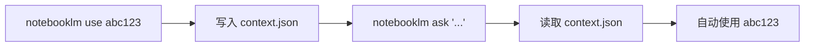

<details>
<summary>相关源文件</summary>

生成本页时使用的主要源文件：

- [src/notebooklm/notebooklm_cli.py](../../../project-repos/notebooklm-py/src/notebooklm/notebooklm_cli.py)
- [src/notebooklm/cli/__init__.py](../../../project-repos/notebooklm-py/src/notebooklm/cli/__init__.py)
- [src/notebooklm/cli/grouped.py](../../../project-repos/notebooklm-py/src/notebooklm/cli/grouped.py)
- [src/notebooklm/cli/session.py](../../../project-repos/notebooklm-py/src/notebooklm/cli/session.py)
- [src/notebooklm/cli/helpers.py](../../../project-repos/notebooklm-py/src/notebooklm/cli/helpers.py)
- [src/notebooklm/cli/error_handler.py](../../../project-repos/notebooklm-py/src/notebooklm/cli/error_handler.py)
- [src/notebooklm/cli/profile.py](../../../project-repos/notebooklm-py/src/notebooklm/cli/profile.py)

</details>

# CLI 界面

notebooklm-py 提供基于 Click 的命令行工具 `notebooklm`，采用分组帮助（SectionedGroup）组织命令，支持 Session 上下文、多账户 Profile 和结构化 JSON 输出。

## 命令结构

```mermaid
graph TD
    ROOT["notebooklm"] --> SESSION["Session"]
    ROOT --> NB_CMD["Notebooks"]
    ROOT --> CHAT_CMD["Chat"]
    ROOT --> GROUPS["Command Groups"]
    ROOT --> ACTIONS["Artifact Actions"]

    SESSION --> LOGIN["login"]
    SESSION --> USE["use"]
    SESSION --> STATUS["status"]
    SESSION --> CLEAR["clear"]
    SESSION --> DOCTOR["doctor"]

    NB_CMD --> LIST["list"]
    NB_CMD --> CREATE["create"]
    NB_CMD --> DELETE["delete"]
    NB_CMD --> RENAME["rename"]
    NB_CMD --> SUMMARY["summary"]

    CHAT_CMD --> ASK["ask"]
    CHAT_CMD --> CONFIGURE["configure"]
    CHAT_CMD --> HISTORY["history"]

    GROUPS --> SOURCE["source"]
    GROUPS --> ARTIFACT["artifact"]
    GROUPS --> NOTE["note"]
    GROUPS --> SHARE["share"]
    GROUPS --> RESEARCH["research"]
    GROUPS --> PROFILE["profile"]

    ACTIONS --> GENERATE["generate"]
    ACTIONS --> DOWNLOAD["download"]
```



Sources: [src/notebooklm/cli/grouped.py](../../../project-repos/notebooklm-py/src/notebooklm/cli/grouped.py), [src/notebooklm/notebooklm_cli.py](../../../project-repos/notebooklm-py/src/notebooklm/notebooklm_cli.py)

<details class="source-snippets">
<summary>引用源码</summary>

<!-- source-snippets:start -->

#### `src/notebooklm/cli/grouped.py`

```python
"""Custom Click group with sectioned help output.

Organizes CLI commands into logical sections for better discoverability.
"""

from collections import OrderedDict

import click


class SectionedGroup(click.Group):
    """Click group that displays commands organized in sections.

    Instead of a flat alphabetical list, commands are grouped by function:
    - Session: login, use, status, clear
    - Notebooks: list, create, delete, rename, summary
    - Chat: ask, configure, history
    - Command Groups: source, artifact, note, share, research (show subcommands)
    - Artifact Actions: generate, download (show types)
    """

    # Regular commands - show help text
    command_sections = OrderedDict(
        [
            ("Session", ["login", "use", "status", "clear", "doctor"]),
            ("Notebooks", ["list", "create", "delete", "rename", "summary"]),
            ("Chat", ["ask", "configure", "history"]),
        ]
    )

    # Command groups - show sorted subcommands instead of help text
    command_groups = OrderedDict(
        [
            (
                "Command Groups (use: notebooklm <group> <command>)",
                ["source", "artifact", "note", "share", "research", "profile"],
            ),
            ("Artifact Actions (use: notebooklm <action> <type>)", ["generate", "download"]),
        ]
    )

    def format_commands(self, ctx, formatter):
        """Override to display commands in sections."""
        commands = {name: self.get_command(ctx, name) for name in self.list_commands(ctx)}

        # Regular command sections (show help text)
        for section, cmd_names in self.command_sections.items():
            rows = []
            for name in cmd_names:
                cmd = commands.get(name)
                if cmd is not None and not cmd.hidden:
                    help_text = cmd.get_short_help_str(limit=formatter.width)
                    rows.append((name, help_text))
            if rows:
                with formatter.section(section):
                    formatter.write_dl(rows)

        # Command group sections (show sorted subcommands)
        for section, group_names in self.command_groups.items():
            rows = []
            for name in group_names:
                if name in commands:
                    cmd = commands[name]
                    if isinstance(cmd, click.Group):
                        subcmds = ", ".join(sorted(cmd.list_commands(ctx)))
                        rows.append((name, subcmds))
            if rows:
                with formatter.section(section):
                    formatter.write_dl(rows)

        # Safety net: show any commands not in any section
        all_listed = set(sum(self.command_sections.values(), []))
        all_listed |= set(sum(self.command_groups.values(), []))
        unlisted = [
            (n, c)
            for n, c in commands.items()
            if n not in all_listed and c is not None and not c.hidden
        ]
        if unlisted:
            with formatter.section("Other"):
                formatter.write_dl(
                    [(n, c.get_short_help_str(limit=formatter.width)) for n, c in unlisted]
                )
```

#### `src/notebooklm/notebooklm_cli.py`

```python
"""CLI interface for NotebookLM automation.

Command structure:
  notebooklm login                    # Authenticate
  notebooklm use <notebook_id>        # Set current notebook context
  notebooklm status                   # Show current context
  notebooklm list                     # List notebooks
  notebooklm create <title>           # Create notebook
  notebooklm ask <question>           # Ask the current notebook a question

  notebooklm source <command>         # Source operations
  notebooklm artifact <command>       # Artifact management
  notebooklm generate <type>          # Generate content
  notebooklm download <type>          # Download content
  notebooklm note <command>           # Note operations
  notebooklm research <command>       # Research status/wait

LLM-friendly design:
  # Set context once, then use simple commands
  notebooklm use nb123
  notebooklm generate video "a funny explainer for kids"
  notebooklm generate audio "deep dive focusing on chapter 3"
  notebooklm ask "what are the key themes?"
"""

# Runtime Python version guard (must run before any PEP 604 syntax is evaluated)
import sys

from ._version_check import check_python_version as _check_python_version

_check_python_version()
del _check_python_version

import asyncio
import logging
import os
from pathlib import Path

# =============================================================================
# WINDOWS COMPATIBILITY FIXES (issue #75, #79, #80)
# Must be applied before any async code runs
# =============================================================================

if sys.platform == "win32":
    # Fix #79: Windows asyncio ProactorEventLoop can hang indefinitely at IOCP layer
    # (GetQueuedCompletionStatus) in certain environments like Sandboxie.
    # SelectorEventLoop avoids this issue.
    import asyncio

    asyncio.set_event_loop_policy(asyncio.WindowsSelectorEventLoopPolicy())

    # Fix #80: Non-English Windows systems (cp950, cp932, etc.) can fail with
    # UnicodeEncodeError when outputting Unicode characters like checkmarks.
    # Setting PYTHONUTF8 ensures consistent UTF-8 encoding.
    os.environ.setdefault("PYTHONUTF8", "1")

import click

from . import __version__

# Import command groups from cli package
from .cli import (
    agent,
    artifact,
    download,
    generate,
    language,
    note,
    profile,
    register_chat_commands,
    register_doctor_command,
    register_notebook_commands,
    # Register functions for top-level commands
    register_session_commands,
    research,
    share,
    skill,
    source,
)
from .cli.grouped import SectionedGroup

# Import helpers needed for backward compatibility with tests


# =============================================================================
# MAIN CLI GROUP
# =============================================================================


@click.group(cls=SectionedGroup)
@click.version_option(version=__version__, prog_name="NotebookLM CLI")
@click.option(
    "--storage",
    type=click.Path(exists=False),
    default=None,
    help="Path to storage_state.json (default: ~/.notebooklm/profiles/<profile>/storage_state.json)",
)
@click.option(
    "-p",
    "--profile",
    default=None,
    help="Profile name (default: from config or 'default'). Use 'notebooklm profile list' to see profiles.",
)
@click.option(
    "-v",
    "--verbose",
    count=True,
    help="Increase verbosity (-v for INFO, -vv for DEBUG)",
)
@click.pass_context
def cli(ctx, storage, profile, verbose):
    """NotebookLM CLI.

    \b
    Quick start:
      notebooklm login              # Authenticate first
      notebooklm list               # List your notebooks
      notebooklm create "My Notes"  # Create a notebook
      notebooklm ask "Hi"           # Ask the current notebook a question

```

<!-- source-snippets:end -->
</details>

## 分组帮助系统

`SectionedGroup` 继承自 `click.Group`，将命令按功能分组显示帮助信息，而非默认的字母序排列：

| 分组 | 命令 |
|------|------|
| **Session** | login, use, status, clear, doctor |
| **Notebooks** | list, create, delete, rename, summary |
| **Chat** | ask, configure, history |
| **Command Groups** | source, artifact, note, share, research, profile |
| **Artifact Actions** | generate, download |

命令组显示子命令列表而非帮助文本，Artifact Actions 显示支持的类型。

Sources: [src/notebooklm/cli/grouped.py:12-50](../../../project-repos/notebooklm-py/src/notebooklm/cli/grouped.py#L12-L50)

<details class="source-snippets">
<summary>引用源码</summary>

<!-- source-snippets:start -->

#### `src/notebooklm/cli/grouped.py:12-50`

```python
    """Click group that displays commands organized in sections.

    Instead of a flat alphabetical list, commands are grouped by function:
    - Session: login, use, status, clear
    - Notebooks: list, create, delete, rename, summary
    - Chat: ask, configure, history
    - Command Groups: source, artifact, note, share, research (show subcommands)
    - Artifact Actions: generate, download (show types)
    """

    # Regular commands - show help text
    command_sections = OrderedDict(
        [
            ("Session", ["login", "use", "status", "clear", "doctor"]),
            ("Notebooks", ["list", "create", "delete", "rename", "summary"]),
            ("Chat", ["ask", "configure", "history"]),
        ]
    )

    # Command groups - show sorted subcommands instead of help text
    command_groups = OrderedDict(
        [
            (
                "Command Groups (use: notebooklm <group> <command>)",
                ["source", "artifact", "note", "share", "research", "profile"],
            ),
            ("Artifact Actions (use: notebooklm <action> <type>)", ["generate", "download"]),
        ]
    )

    def format_commands(self, ctx, formatter):
        """Override to display commands in sections."""
        commands = {name: self.get_command(ctx, name) for name in self.list_commands(ctx)}

        # Regular command sections (show help text)
        for section, cmd_names in self.command_sections.items():
            rows = []
            for name in cmd_names:
                cmd = commands.get(name)
```

<!-- source-snippets:end -->
</details>

## Session 上下文管理

CLI 使用 `context.json` 文件维护当前笔记本上下文，避免每次命令都指定 notebook ID：



### 并发安全

多个并发 Agent 使用 `notebooklm use` 可能互相覆盖上下文。解决方案：

1. **显式指定 notebook ID**（推荐）：使用 `-n <id>` 或 `--notebook <id>` 标志
2. **Per-agent Profile**：`export NOTEBOOKLM_PROFILE=agent-$ID`
3. **Per-agent Home**：`export NOTEBOOKLM_HOME=/tmp/agent-$ID`

Sources: [src/notebooklm/cli/session.py](../../../project-repos/notebooklm-py/src/notebooklm/cli/session.py)

<details class="source-snippets">
<summary>引用源码</summary>

<!-- source-snippets:start -->

#### `src/notebooklm/cli/session.py`

```python
"""Session and context management CLI commands.

Commands:
    login   Log in to NotebookLM via browser
    use     Set the current notebook context
    status  Show current context
    clear   Clear current notebook context
"""

import asyncio
import json
import logging
import os
import shutil
import subprocess
import sys
import time
from collections.abc import Iterator
from contextlib import contextmanager
from pathlib import Path
from typing import TYPE_CHECKING, Any

import click
import httpx
from rich.table import Table

if TYPE_CHECKING:
    from playwright.sync_api import BrowserContext, Page
    from rich.console import Console

from ..auth import (
    ALLOWED_COOKIE_DOMAINS,
    GOOGLE_REGIONAL_CCTLDS,
    AuthTokens,
    convert_rookiepy_cookies_to_storage_state,
    extract_cookies_from_storage,
    fetch_tokens,
)
from ..client import NotebookLMClient
from ..paths import (
    get_browser_profile_dir,
    get_context_path,
    get_path_info,
    get_storage_path,
)
from .helpers import (
    clear_context,
    console,
    get_client,
    get_current_notebook,
    json_output_response,
    resolve_notebook_id,
    run_async,
    set_current_notebook,
)
from .language import set_language

logger = logging.getLogger(__name__)

GOOGLE_ACCOUNTS_URL = "https://accounts.google.com/"
NOTEBOOKLM_URL = "https://notebooklm.google.com/"
NOTEBOOKLM_HOST = "notebooklm.google.com"

# Retryable Playwright connection errors
RETRYABLE_CONNECTION_ERRORS = ("ERR_CONNECTION_CLOSED", "ERR_CONNECTION_RESET")
LOGIN_MAX_RETRIES = 3
# Playwright TargetClosedError substring — matches the default message from
# Playwright's TargetClosedError class (introduced in v1.41). If a future
# version changes this message, the error will propagate unhandled (safe fallback).
TARGET_CLOSED_ERROR = "Target page, context or browser has been closed"
BROWSER_CLOSED_HELP = (
    "[red]The browser window was closed during login.[/red]\n"
    "This can happen when switching Google accounts in a persistent browser session.\n\n"
    "Try:\n"
    "  1. Run: notebooklm login --fresh\n"
    "  2. Or run: notebooklm auth logout && notebooklm login"
)
CONNECTION_ERROR_HELP = (
    "[red]Failed to connect to NotebookLM after multiple retries.[/red]\n"
    "This may be caused by:\n"
    "  • Network connectivity issues\n"
    "  • Firewall or VPN blocking notebooklm.google.com\n"
    "  • Corporate proxy interfering with the connection\n"
    "  • Google rate limiting (too many login attempts)\n\n"
    "Try:\n"
    "  1. Check your internet connection\n"
    "  2. Disable VPN/proxy temporarily\n"
    "  3. Wait a few minutes before retrying\n"
    "  4. Check if notebooklm.google.com is accessible in your browser"
)

# Maps user-facing browser names to rookiepy function names.
_ROOKIEPY_BROWSER_ALIASES: dict[str, str] = {
    "arc": "arc",
    "brave": "brave",
    "chrome": "chrome",
    "chromium": "chromium",
    "edge": "edge",
    "firefox": "firefox",
    "ie": "ie",
    "librewolf": "librewolf",
    "octo": "octo",
    "opera": "opera",
    "opera-gx": "opera_gx",
    "opera_gx": "opera_gx",
    "safari": "safari",
    "vivaldi": "vivaldi",
    "zen": "zen",
}


def _handle_rookiepy_error(e: Exception, browser_name: str) -> None:
    """Print a user-friendly error for rookiepy exceptions."""
    msg = str(e).lower()
    if "lock" in msg or "database" in msg:
        console.print(
            f"[red]Could not read {browser_name} cookies: browser database is locked.[/red]\n"
            "Close your browser and try again."
        )
    elif "permission" in msg or "access" in msg:
```

<!-- source-snippets:end -->
</details>

## 全局选项

| 选项 | 说明 |
|------|------|
| `--storage <path>` | 指定 storage_state.json 路径 |
| `-p, --profile <name>` | 使用指定 Profile |
| `--version` | 显示版本 |
| `--json` | JSON 格式输出（部分命令支持） |

Sources: [src/notebooklm/notebooklm_cli.py:70-100](../../../project-repos/notebooklm-py/src/notebooklm/notebooklm_cli.py#L70-L100)

<details class="source-snippets">
<summary>引用源码</summary>

<!-- source-snippets:start -->

#### `src/notebooklm/notebooklm_cli.py:70-100`

```python
    register_chat_commands,
    register_doctor_command,
    register_notebook_commands,
    # Register functions for top-level commands
    register_session_commands,
    research,
    share,
    skill,
    source,
)
from .cli.grouped import SectionedGroup

# Import helpers needed for backward compatibility with tests


# =============================================================================
# MAIN CLI GROUP
# =============================================================================


@click.group(cls=SectionedGroup)
@click.version_option(version=__version__, prog_name="NotebookLM CLI")
@click.option(
    "--storage",
    type=click.Path(exists=False),
    default=None,
    help="Path to storage_state.json (default: ~/.notebooklm/profiles/<profile>/storage_state.json)",
)
@click.option(
    "-p",
    "--profile",
```

<!-- source-snippets:end -->
</details>

## Profile 管理

| 命令 | 说明 |
|------|------|
| `profile list` | 列出所有 Profile |
| `profile create <name>` | 创建 Profile |
| `profile switch <name>` | 切换活跃 Profile |
| `profile delete <name>` | 删除 Profile |
| `profile rename <old> <new>` | 重命名 Profile |

Sources: [src/notebooklm/cli/profile.py](../../../project-repos/notebooklm-py/src/notebooklm/cli/profile.py)

<details class="source-snippets">
<summary>引用源码</summary>

<!-- source-snippets:start -->

#### `src/notebooklm/cli/profile.py`

```python
"""Profile management CLI commands.

Commands:
    profile list      List all profiles
    profile create    Create a new profile
    profile switch    Set the default profile
    profile delete    Delete a profile
    profile rename    Rename a profile
"""

import json
import os
import re
import shutil

import click
from rich.table import Table

from ..paths import (
    get_config_path,
    get_profile_dir,
    get_storage_path,
    list_profiles,
    resolve_profile,
)
from .helpers import console, json_output_response

# Profile name validation: alphanumeric, hyphens, underscores. Must start with alphanum.
_PROFILE_NAME_RE = re.compile(r"^[a-zA-Z0-9][a-zA-Z0-9_-]*$")


def _validate_profile_name(name: str) -> str:
    """Validate a profile name."""
    if not _PROFILE_NAME_RE.match(name):
        raise click.ClickException(
            f"Invalid profile name '{name}'. "
            "Use alphanumeric characters, hyphens, and underscores. Must start with a letter or digit."
        )
    return name


@click.group("profile")
def profile():
    """Manage authentication profiles for multiple accounts."""
    pass


@profile.command("list")
@click.option("--json", "json_output", is_flag=True, help="Output as JSON")
def list_cmd(json_output):
    """List all profiles and their status."""
    profiles = list_profiles()
    active = resolve_profile()

    if not profiles:
        if json_output:
            json_output_response({"profiles": [], "active": active})
            return
        console.print("[yellow]No profiles found. Run 'notebooklm login' to create one.[/yellow]")
        return

    profile_data = []
    for name in profiles:
        storage = get_storage_path(profile=name)
        is_active = name == active
        authenticated = storage.exists()

        profile_data.append(
            {
                "name": name,
                "active": is_active,
                "authenticated": authenticated,
            }
        )

    if json_output:
        json_output_response({"profiles": profile_data, "active": active})
        return

    table = Table(title="Profiles")
    table.add_column("", width=2)
    table.add_column("Name", style="cyan")
    table.add_column("Auth Status")

    for p in profile_data:
        marker = "[green]*[/green]" if p["active"] else ""
        auth_status = (
            "[green]authenticated[/green]" if p["authenticated"] else "[dim]not authenticated[/dim]"
        )
        table.add_row(marker, str(p["name"]), auth_status)

    console.print(table)
    console.print(f"\n[dim]Active profile: {active}[/dim]")


@profile.command("create")
@click.argument("name")
def create_cmd(name):
    """Create a new profile.

    Creates an empty profile directory. Use 'notebooklm -p NAME login' to authenticate.

    \b
    Example:
      notebooklm profile create work
      notebooklm -p work login
    """
    name = _validate_profile_name(name)

    try:
        profile_dir = get_profile_dir(name)
    except ValueError as e:
        raise click.ClickException(str(e)) from None
    if profile_dir.exists():
        raise click.ClickException(f"Profile '{name}' already exists.")

    get_profile_dir(name, create=True)
    console.print(f"[green]Profile '{name}' created.[/green]")
    console.print(f"[dim]Run 'notebooklm -p {name} login' to authenticate.[/dim]")

```

<!-- source-snippets:end -->
</details>

## 错误处理

`error_handler.py` 提供统一的 CLI 错误处理：

| 退出码 | 含义 |
|--------|------|
| 0 | 成功 |
| 1 | 错误（未找到、处理失败） |
| 2 | 超时（仅 wait 命令） |

常见错误与处理：

| 错误 | 原因 | 操作 |
|------|------|------|
| Auth/cookie error | 会话过期 | `notebooklm login` |
| No notebook context | 上下文未设置 | `-n <id>` 或 `notebooklm use <id>` |
| No result for RPC ID | 限速 | 等待 5-10 分钟后重试 |
| GENERATION_FAILED | Google 限速 | 等待后重试 |
| Download fails | 制品未完成 | 检查 `artifact list` |

Sources: [src/notebooklm/cli/error_handler.py](../../../project-repos/notebooklm-py/src/notebooklm/cli/error_handler.py)

<details class="source-snippets">
<summary>引用源码</summary>

<!-- source-snippets:start -->

#### `src/notebooklm/cli/error_handler.py`

```python
"""Centralized CLI error handling.

This module provides a context manager for consistent error handling
across all CLI commands.
"""

import json
from collections.abc import Generator
from contextlib import contextmanager
from typing import Any

import click

from ..exceptions import (
    AuthError,
    ConfigurationError,
    NetworkError,
    NotebookLMError,
    RateLimitError,
    RPCError,
    ValidationError,
)


def _output_error(
    message: str,
    code: str,
    json_output: bool,
    exit_code: int,
    extra: dict[str, Any] | None = None,
    hint: str | None = None,
) -> None:
    """Output error message in text or JSON format and exit.

    Args:
        message: Human-readable error message
        code: Error code for JSON output (e.g., "RATE_LIMITED", "AUTH_ERROR")
        json_output: If True, output as JSON; otherwise as text
        exit_code: Exit code to use
        extra: Additional fields to include in JSON output
        hint: Additional hint to show in text mode
    """
    if json_output:
        response: dict = {"error": True, "code": code, "message": message}
        if extra:
            response.update(extra)
        click.echo(json.dumps(response, indent=2))
    else:
        click.echo(message, err=True)
        if hint:
            click.echo(hint, err=True)
    raise SystemExit(exit_code)


@contextmanager
def handle_errors(verbose: bool = False, json_output: bool = False) -> Generator[None, None, None]:
    """Context manager for consistent CLI error handling.

    Catches library exceptions and converts them to user-friendly
    error messages with appropriate exit codes.

    Exit codes:
        1: User/application error (validation, auth, rate limit, etc.)
        2: System/unexpected error (bugs, unhandled exceptions)
        130: Keyboard interrupt (128 + signal 2)

    Args:
        verbose: If True, show additional debug info (method_id, etc.)
        json_output: If True, output errors as JSON

    Example:
        @click.command()
        def my_command():
            with handle_errors():
                # ... command logic ...
    """
    try:
        yield
    except KeyboardInterrupt:
        if json_output:
            _output_error("Cancelled by user", "CANCELLED", True, 130)
        else:
            click.echo("\nCancelled.", err=True)
            raise SystemExit(130) from None
    except RateLimitError as e:
        retry_msg = f" Retry after {e.retry_after}s." if e.retry_after else ""
        extra_data: dict[str, Any] = {}
        if e.retry_after:
            extra_data["retry_after"] = e.retry_after
        if verbose and e.method_id:
            extra_data["method_id"] = e.method_id
        _output_error(
            f"Error: Rate limited.{retry_msg}",
            "RATE_LIMITED",
            json_output,
            1,
            extra=extra_data,
        )
    except AuthError as e:
        _output_error(
            f"Authentication error: {e}",
            "AUTH_ERROR",
            json_output,
            1,
            hint="Run 'notebooklm login' to re-authenticate.",
        )
    except ValidationError as e:
        _output_error(f"Validation error: {e}", "VALIDATION_ERROR", json_output, 1)
    except ConfigurationError as e:
        _output_error(f"Configuration error: {e}", "CONFIG_ERROR", json_output, 1)
    except NetworkError as e:
        _output_error(
            f"Network error: {e}",
            "NETWORK_ERROR",
            json_output,
            1,
            hint="Check your internet connection and try again.",
        )
    except NotebookLMError as e:
        extra_info: dict[str, Any] | None = None
```

<!-- source-snippets:end -->
</details>

## Windows 兼容性

CLI 针对 Windows 做了两项特殊处理：

1. **事件循环**：使用 `WindowsSelectorEventLoopPolicy` 替代默认的 `ProactorEventLoop`，避免 IOCP 层挂起
2. **UTF-8 编码**：设置 `PYTHONUTF8=1`，解决非英文 Windows 系统的 Unicode 编码错误

Sources: [src/notebooklm/notebooklm_cli.py:40-60](../../../project-repos/notebooklm-py/src/notebooklm/notebooklm_cli.py#L40-L60)

<details class="source-snippets">
<summary>引用源码</summary>

<!-- source-snippets:start -->

#### `src/notebooklm/notebooklm_cli.py:40-60`

```python
# WINDOWS COMPATIBILITY FIXES (issue #75, #79, #80)
# Must be applied before any async code runs
# =============================================================================

if sys.platform == "win32":
    # Fix #79: Windows asyncio ProactorEventLoop can hang indefinitely at IOCP layer
    # (GetQueuedCompletionStatus) in certain environments like Sandboxie.
    # SelectorEventLoop avoids this issue.
    import asyncio

    asyncio.set_event_loop_policy(asyncio.WindowsSelectorEventLoopPolicy())

    # Fix #80: Non-English Windows systems (cp950, cp932, etc.) can fail with
    # UnicodeEncodeError when outputting Unicode characters like checkmarks.
    # Setting PYTHONUTF8 ensures consistent UTF-8 encoding.
    os.environ.setdefault("PYTHONUTF8", "1")

import click

from . import __version__

```

<!-- source-snippets:end -->
</details>

## 相关页面

- [项目概览](overview.md)
- [客户端 API](client-api.md)
- [认证与安全](auth-and-security.md)
