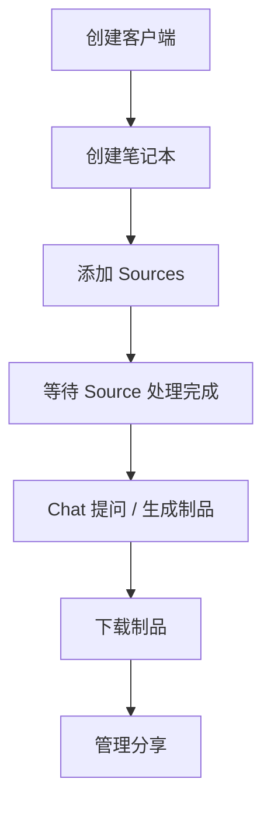
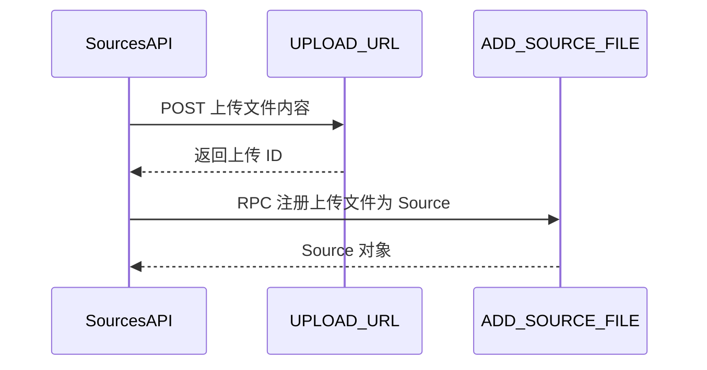

<details>
<summary>相关源文件</summary>

生成本页时使用的主要源文件：

- [src/notebooklm/client.py](https://github.com/teng-lin/notebooklm-py/blob/d6cef809dee4f03794e89bd089dd426b34a67345/src/notebooklm/client.py)
- [src/notebooklm/_notebooks.py](https://github.com/teng-lin/notebooklm-py/blob/d6cef809dee4f03794e89bd089dd426b34a67345/src/notebooklm/_notebooks.py)
- [src/notebooklm/_sources.py](https://github.com/teng-lin/notebooklm-py/blob/d6cef809dee4f03794e89bd089dd426b34a67345/src/notebooklm/_sources.py)
- [src/notebooklm/_chat.py](https://github.com/teng-lin/notebooklm-py/blob/d6cef809dee4f03794e89bd089dd426b34a67345/src/notebooklm/_chat.py)
- [src/notebooklm/_artifacts.py](https://github.com/teng-lin/notebooklm-py/blob/d6cef809dee4f03794e89bd089dd426b34a67345/src/notebooklm/_artifacts.py)
- [src/notebooklm/_research.py](https://github.com/teng-lin/notebooklm-py/blob/d6cef809dee4f03794e89bd089dd426b34a67345/src/notebooklm/_research.py)
- [src/notebooklm/_notes.py](https://github.com/teng-lin/notebooklm-py/blob/d6cef809dee4f03794e89bd089dd426b34a67345/src/notebooklm/_notes.py)
- [src/notebooklm/_settings.py](https://github.com/teng-lin/notebooklm-py/blob/d6cef809dee4f03794e89bd089dd426b34a67345/src/notebooklm/_settings.py)
- [src/notebooklm/_sharing.py](https://github.com/teng-lin/notebooklm-py/blob/d6cef809dee4f03794e89bd089dd426b34a67345/src/notebooklm/_sharing.py)

</details>

# 客户端 API

`NotebookLMClient` 是库的唯一公共入口，通过八个命名空间子 API 暴露所有功能。每个子 API 持有共享的 `ClientCore` 实例，通过 `rpc_call()` 统一发起 RPC 调用。

## 子 API 总览

| 子 API | 属性名 | 核心方法 |
|--------|--------|----------|
| `NotebooksAPI` | `client.notebooks` | `create`, `list`, `get`, `rename`, `delete` |
| `SourcesAPI` | `client.sources` | `add_url`, `add_text`, `add_file`, `add_drive`, `list`, `delete`, `rename`, `refresh`, `get_fulltext`, `get_guide` |
| `ChatAPI` | `client.chat` | `ask`, `get_history`, `get_conversation_turns` |
| `ArtifactsAPI` | `client.artifacts` | `generate_audio`, `generate_video`, `generate_quiz`, `generate_flashcards`, `generate_report`, `generate_mind_map`, `generate_infographic`, `generate_slide_deck`, `generate_data_table`, `list`, `download_*`, `wait_for_completion` |
| `ResearchAPI` | `client.research` | `start`, `poll`, `import_sources` |
| `NotesAPI` | `client.notes` | `create`, `list`, `update`, `delete` |
| `SettingsAPI` | `client.settings` | `get_output_language`, `set_output_language` |
| `SharingAPI` | `client.sharing` | `get_status`, `set_public`, `add_user`, `remove_user` |

Sources: [src/notebooklm/client.py:55-100](../../../project-repos/notebooklm-py/src/notebooklm/client.py#L55-L100)

<details class="source-snippets">
<summary>引用源码</summary>

<!-- source-snippets:start -->

#### `src/notebooklm/client.py:55-100`

```python
        # Create from saved authentication
        async with NotebookLMClient.from_storage() as client:
            notebooks = await client.notebooks.list()

        # Create from AuthTokens directly
        auth = AuthTokens(cookies, csrf_token, session_id)
        async with NotebookLMClient(auth) as client:
            notebooks = await client.notebooks.list()

    Attributes:
        notebooks: NotebooksAPI for notebook operations
        sources: SourcesAPI for source management
        artifacts: ArtifactsAPI for AI-generated content
        chat: ChatAPI for conversations
        research: ResearchAPI for web/drive research
        notes: NotesAPI for user notes
        settings: SettingsAPI for user settings
        sharing: SharingAPI for notebook sharing
        auth: The AuthTokens used for authentication
    """

    def __init__(
        self,
        auth: AuthTokens,
        timeout: float = DEFAULT_TIMEOUT,
        storage_path: Path | None = None,
    ):
        """Initialize the NotebookLM client.

        Args:
            auth: Authentication tokens from browser login.
            timeout: HTTP request timeout in seconds. Defaults to 30 seconds.
            storage_path: Path to the storage state file for loading download cookies.
        """
        # Pass refresh_auth as callback for automatic retry on auth failures
        # Note: refresh_auth calls update_auth_headers internally
        self._core = ClientCore(auth, timeout=timeout, refresh_callback=self.refresh_auth)

        # Initialize sub-client APIs
        # Note: notes must be initialized before artifacts (artifacts uses notes API)
        self.notebooks = NotebooksAPI(self._core)
        self.sources = SourcesAPI(self._core)
        self.notes = NotesAPI(self._core)
        self.artifacts = ArtifactsAPI(self._core, notes_api=self.notes, storage_path=storage_path)
        self.chat = ChatAPI(self._core)
        self.research = ResearchAPI(self._core)
```

<!-- source-snippets:end -->
</details>
## 核心工作流



### 基本使用模式

```python
async with await NotebookLMClient.from_storage() as client:
    nb = await client.notebooks.create("Research")
    await client.sources.add_url(nb.id, "https://example.com", wait=True)
    result = await client.chat.ask(nb.id, "Summarize this")
    status = await client.artifacts.generate_audio(nb.id, instructions="make it fun")
    await client.artifacts.wait_for_completion(nb.id, status.task_id)
    await client.artifacts.download_audio(nb.id, "podcast.mp3")
```

Sources: [src/notebooklm/client.py](../../../project-repos/notebooklm-py/src/notebooklm/client.py)

<details class="source-snippets">
<summary>引用源码</summary>

<!-- source-snippets:start -->

#### `src/notebooklm/client.py`

```python
"""NotebookLM API Client - Main entry point.

This module provides the NotebookLMClient class, a modern async client
for interacting with Google NotebookLM using undocumented RPC APIs.

Example:
    async with NotebookLMClient.from_storage() as client:
        # List notebooks
        notebooks = await client.notebooks.list()

        # Add sources
        source = await client.sources.add_url(notebook_id, "https://example.com")

        # Generate artifacts
        status = await client.artifacts.generate_audio(notebook_id)
        await client.artifacts.wait_for_completion(notebook_id, status.task_id)

        # Chat with the notebook
        result = await client.chat.ask(notebook_id, "What is this about?")
"""

import logging
import re
from pathlib import Path

from ._artifacts import ArtifactsAPI
from ._chat import ChatAPI
from ._core import DEFAULT_TIMEOUT, ClientCore
from ._notebooks import NotebooksAPI
from ._notes import NotesAPI
from ._research import ResearchAPI
from ._settings import SettingsAPI
from ._sharing import SharingAPI
from ._sources import SourcesAPI
from ._url_utils import is_google_auth_redirect
from .auth import AuthTokens

logger = logging.getLogger(__name__)


class NotebookLMClient:
    """Async client for NotebookLM API.

    Provides access to NotebookLM functionality through namespaced sub-clients:
    - notebooks: Create, list, delete, rename notebooks
    - sources: Add, list, delete sources (URLs, text, files, YouTube, Drive)
    - artifacts: Generate and manage AI content (audio, video, reports, etc.)
    - chat: Ask questions and manage conversations
    - research: Start research sessions and import sources
    - notes: Create and manage user notes
    - settings: Manage user settings (output language, etc.)
    - sharing: Manage notebook sharing and permissions

    Usage:
        # Create from saved authentication
        async with NotebookLMClient.from_storage() as client:
            notebooks = await client.notebooks.list()

        # Create from AuthTokens directly
        auth = AuthTokens(cookies, csrf_token, session_id)
        async with NotebookLMClient(auth) as client:
            notebooks = await client.notebooks.list()

    Attributes:
        notebooks: NotebooksAPI for notebook operations
        sources: SourcesAPI for source management
        artifacts: ArtifactsAPI for AI-generated content
        chat: ChatAPI for conversations
        research: ResearchAPI for web/drive research
        notes: NotesAPI for user notes
        settings: SettingsAPI for user settings
        sharing: SharingAPI for notebook sharing
        auth: The AuthTokens used for authentication
    """

    def __init__(
        self,
        auth: AuthTokens,
        timeout: float = DEFAULT_TIMEOUT,
        storage_path: Path | None = None,
    ):
        """Initialize the NotebookLM client.

        Args:
            auth: Authentication tokens from browser login.
            timeout: HTTP request timeout in seconds. Defaults to 30 seconds.
            storage_path: Path to the storage state file for loading download cookies.
        """
        # Pass refresh_auth as callback for automatic retry on auth failures
        # Note: refresh_auth calls update_auth_headers internally
        self._core = ClientCore(auth, timeout=timeout, refresh_callback=self.refresh_auth)

        # Initialize sub-client APIs
        # Note: notes must be initialized before artifacts (artifacts uses notes API)
        self.notebooks = NotebooksAPI(self._core)
        self.sources = SourcesAPI(self._core)
        self.notes = NotesAPI(self._core)
        self.artifacts = ArtifactsAPI(self._core, notes_api=self.notes, storage_path=storage_path)
        self.chat = ChatAPI(self._core)
        self.research = ResearchAPI(self._core)
        self.settings = SettingsAPI(self._core)
        self.sharing = SharingAPI(self._core)

    @property
    def auth(self) -> AuthTokens:
        """Get the authentication tokens."""
        return self._core.auth

    async def __aenter__(self) -> "NotebookLMClient":
        """Open the client connection."""
        logger.debug("Opening NotebookLM client")
        await self._core.open()
        return self

    async def __aexit__(self, exc_type, exc_val, exc_tb):
        """Close the client connection."""
        logger.debug("Closing NotebookLM client")
        await self._core.close()

    @property
```

<!-- source-snippets:end -->
</details>
## NotebooksAPI

提供笔记本的 CRUD 操作：

| 方法 | RPC 方法 | 说明 |
|------|----------|------|
| `create(title)` | `CREATE_NOTEBOOK` | 创建笔记本，返回 `Notebook` |
| `list()` | `LIST_NOTEBOOKS` | 列出所有笔记本 |
| `get(notebook_id)` | `GET_NOTEBOOK` | 获取笔记本详情 |
| `rename(notebook_id, title)` | `RENAME_NOTEBOOK` | 重命名 |
| `delete(notebook_id)` | `DELETE_NOTEBOOK` | 删除 |
| `get_description(notebook_id)` | `SUMMARIZE` | 获取 AI 生成的描述和建议主题 |
| `remove_from_recent(notebook_id)` | `REMOVE_RECENTLY_VIEWED` | 从最近查看中移除 |

Sources: [src/notebooklm/_notebooks.py](../../../project-repos/notebooklm-py/src/notebooklm/_notebooks.py)

<details class="source-snippets">
<summary>引用源码</summary>

<!-- source-snippets:start -->

#### `src/notebooklm/_notebooks.py`

```python
"""Notebook operations API."""

import asyncio
import logging
from typing import TYPE_CHECKING, Any

from ._core import ClientCore
from .rpc import RPCMethod
from .types import Notebook, NotebookDescription, SuggestedTopic

if TYPE_CHECKING:
    from ._sources import SourcesAPI

logger = logging.getLogger(__name__)


class NotebooksAPI:
    """Operations on NotebookLM notebooks.

    Provides methods for listing, creating, getting, deleting, and renaming
    notebooks, as well as getting AI-generated descriptions.

    Usage:
        async with NotebookLMClient.from_storage() as client:
            notebooks = await client.notebooks.list()
            new_nb = await client.notebooks.create("My Research")
            await client.notebooks.rename(new_nb.id, "Better Title")
    """

    def __init__(self, core: ClientCore, sources_api: "SourcesAPI | None" = None):
        """Initialize the notebooks API.

        Args:
            core: The core client infrastructure.
            sources_api: Optional sources API for cross-API calls. If None,
                         creates a new instance (for backward compatibility).
        """
        self._core = core
        # Lazy import to avoid circular dependency
        from ._sources import SourcesAPI

        self._sources = sources_api or SourcesAPI(core)

    async def list(self) -> list[Notebook]:
        """List all notebooks.

        Returns:
            List of Notebook objects.
        """
        logger.debug("Listing notebooks")
        params = [None, 1, None, [2]]
        result = await self._core.rpc_call(RPCMethod.LIST_NOTEBOOKS, params)

        if result and isinstance(result, list) and len(result) > 0:
            raw_notebooks = result[0] if isinstance(result[0], list) else result
            return [Notebook.from_api_response(nb) for nb in raw_notebooks]
        return []

    async def create(self, title: str) -> Notebook:
        """Create a new notebook.

        Args:
            title: The title for the new notebook.

        Returns:
            The created Notebook object.
        """
        logger.debug("Creating notebook: %s", title)
        params = [title, None, None, [2], [1]]
        result = await self._core.rpc_call(RPCMethod.CREATE_NOTEBOOK, params)
        notebook = Notebook.from_api_response(result)
        logger.debug("Created notebook: %s", notebook.id)
        return notebook

    async def get(self, notebook_id: str) -> Notebook:
        """Get notebook details.

        Args:
            notebook_id: The notebook ID.

        Returns:
            Notebook object with details.
        """
        params = [notebook_id, None, [2], None, 0]
        result = await self._core.rpc_call(
            RPCMethod.GET_NOTEBOOK,
            params,
            source_path=f"/notebook/{notebook_id}",
        )
        # get_notebook returns [nb_info, ...] where nb_info contains the notebook data
        nb_info = result[0] if result and isinstance(result, list) and len(result) > 0 else []
        return Notebook.from_api_response(nb_info)

    async def delete(self, notebook_id: str) -> bool:
        """Delete a notebook.

        Args:
            notebook_id: The notebook ID to delete.

        Returns:
            True if deletion succeeded.
        """
        logger.debug("Deleting notebook: %s", notebook_id)
        params = [[notebook_id], [2]]
        await self._core.rpc_call(RPCMethod.DELETE_NOTEBOOK, params)
        return True

    async def rename(self, notebook_id: str, new_title: str) -> Notebook:
        """Rename a notebook.

        Args:
            notebook_id: The notebook ID.
            new_title: The new title for the notebook.

        Returns:
            The renamed Notebook object (fetched after rename).
        """
        logger.debug("Renaming notebook %s to: %s", notebook_id, new_title)
        # Payload format discovered via browser traffic capture:
        # [notebook_id, [[null, null, null, [null, new_title]]]]
```

<!-- source-snippets:end -->
</details>
## SourcesAPI

Source 是笔记本中的知识来源，支持多种类型：

### Source 添加方式

| 方法 | 支持类型 | 说明 |
|------|----------|------|
| `add_url()` | Web 页面、YouTube | 自动检测 URL 类型 |
| `add_text()` | 粘贴文本 | 直接添加文本内容 |
| `add_file()` | PDF、Markdown、Word、音频、视频、图片 | 先上传再注册 |
| `add_drive()` | Google Docs、Slides、Sheets | 通过 Drive MIME 类型 |

### 文件上传流程



文件上传分两步：先将文件内容 POST 到 `UPLOAD_URL`，获取上传 ID 后通过 `ADD_SOURCE_FILE` RPC 注册为 Source。

### Source 状态

| 状态码 | 含义 |
|--------|------|
| 1 | PROCESSING - 正在处理 |
| 2 | READY - 可用 |
| 3 | ERROR - 处理失败 |
| 5 | PREPARING - 上传准备中 |

Sources: [src/notebooklm/_sources.py](../../../project-repos/notebooklm-py/src/notebooklm/_sources.py)

<details class="source-snippets">
<summary>引用源码</summary>

<!-- source-snippets:start -->

#### `src/notebooklm/_sources.py`

```python
"""Source operations API."""

import asyncio
import builtins
import logging
import re
from datetime import datetime
from pathlib import Path
from time import monotonic
from typing import Any
from urllib.parse import parse_qs, urlparse

import httpx

from ._core import ClientCore
from ._url_utils import is_youtube_url
from .exceptions import ValidationError
from .rpc import UPLOAD_URL, RPCError, RPCMethod
from .rpc.types import SourceStatus
from .types import (
    Source,
    SourceAddError,
    SourceFulltext,
    SourceNotFoundError,
    SourceProcessingError,
    SourceTimeoutError,
    _extract_source_url,
)

logger = logging.getLogger(__name__)


class SourcesAPI:
    """Operations on NotebookLM sources.

    Provides methods for adding, listing, getting, deleting, renaming,
    and refreshing sources in notebooks.

    Usage:
        async with NotebookLMClient.from_storage() as client:
            sources = await client.sources.list(notebook_id)
            new_src = await client.sources.add_url(notebook_id, "https://example.com")
            await client.sources.rename(notebook_id, new_src.id, "Better Title")
    """

    def __init__(self, core: ClientCore):
        """Initialize the sources API.

        Args:
            core: The core client infrastructure.
        """
        self._core = core

    async def list(self, notebook_id: str) -> list[Source]:
        """List all sources in a notebook.

        Args:
            notebook_id: The notebook ID.

        Returns:
            List of Source objects.
        """
        # Get notebook data which includes sources
        params = [notebook_id, None, [2], None, 0]
        notebook = await self._core.rpc_call(
            RPCMethod.GET_NOTEBOOK,
            params,
            source_path=f"/notebook/{notebook_id}",
        )

        if not notebook or not isinstance(notebook, list) or len(notebook) == 0:
            logger.warning(
                "Empty or invalid notebook response when listing sources for %s "
                "(API response structure may have changed)",
                notebook_id,
            )
            return []

        nb_info = notebook[0]
        if not isinstance(nb_info, list) or len(nb_info) <= 1:
            logger.warning(
                "Unexpected notebook structure for %s: expected list with sources at index 1 "
                "(API structure may have changed)",
                notebook_id,
            )
            return []

        sources_list = nb_info[1]
        if not isinstance(sources_list, list):
            logger.warning(
                "Sources data for %s is not a list (type=%s), returning empty list "
                "(API structure may have changed)",
                notebook_id,
                type(sources_list).__name__,
            )
            return []

        # Convert raw source data to Source objects
        sources = []
        for src in sources_list:
            if isinstance(src, list) and len(src) > 0:
                # Extract basic info from source structure
                src_id = src[0][0] if isinstance(src[0], list) else src[0]
                title = src[1] if len(src) > 1 else None

                # Extract URL via the shared helper. GET_NOTEBOOK source entries
                # use the same medium-nested metadata shape as
                # Source.from_api_response, which doesn't support the bare-http
                # [0] fallback (metadata[0] can pack unrelated data). Precedence
                # is restricted to [7] > [5]; keep the two call sites aligned.
                url = _extract_source_url(src[2] if len(src) > 2 else None, allow_bare_http=False)

                # Extract timestamp from src[2][2] - [seconds, nanoseconds]
                created_at = None
                if len(src) > 2 and isinstance(src[2], list) and len(src[2]) > 2:
                    timestamp_list = src[2][2]
                    if isinstance(timestamp_list, list) and len(timestamp_list) > 0:
                        try:
                            created_at = datetime.fromtimestamp(timestamp_list[0])
                        except (TypeError, ValueError):
```

<!-- source-snippets:end -->
</details>
## ChatAPI

Chat 使用独立的 `QUERY_URL` 端点（非 batchexecute），支持流式响应：

| 方法 | 说明 |
|------|------|
| `ask(notebook_id, question)` | 提问，返回 `AskResult` |
| `ask(..., conversation_id=)` | 追问，在同一对话中继续 |
| `ask(..., source_ids=)` | 仅查询指定 Source |
| `get_history(notebook_id)` | 获取对话历史 |
| `get_conversation_turns(conversation_id)` | 获取对话轮次详情 |

`AskResult` 包含 `answer`、`conversation_id`、`turn_number`、`references`（源引用列表）。

Sources: [src/notebooklm/_chat.py](../../../project-repos/notebooklm-py/src/notebooklm/_chat.py)

<details class="source-snippets">
<summary>引用源码</summary>

<!-- source-snippets:start -->

#### `src/notebooklm/_chat.py`

```python
"""Chat API for NotebookLM notebook conversations.

Provides operations for asking questions, managing conversations, and
retrieving conversation history.
"""

import json
import logging
import os
import re
import uuid
from typing import Any
from urllib.parse import quote, urlencode

import httpx

from ._core import ClientCore
from .exceptions import ChatError, NetworkError, ValidationError
from .rpc import QUERY_URL, RPCMethod
from .types import AskResult, ChatReference, ConversationTurn

logger = logging.getLogger(__name__)

_DEFAULT_BL = "boq_labs-tailwind-frontend_20260301.03_p0"

# UUID pattern for validating source IDs (compiled once at module level)
_UUID_PATTERN = re.compile(
    r"^[0-9a-f]{8}-[0-9a-f]{4}-[0-9a-f]{4}-[0-9a-f]{4}-[0-9a-f]{12}$",
    re.IGNORECASE,
)


class ChatAPI:
    """Operations for notebook chat/conversations.

    Provides methods for asking questions to notebooks and managing
    conversation history with follow-up support.

    Usage:
        async with NotebookLMClient.from_storage() as client:
            # Ask a question
            result = await client.chat.ask(notebook_id, "What is X?")
            print(result.answer)

            # Follow-up question
            result = await client.chat.ask(
                notebook_id,
                "Can you elaborate?",
                conversation_id=result.conversation_id
            )
    """

    def __init__(self, core: ClientCore):
        """Initialize the chat API.

        Args:
            core: The core client infrastructure.
        """
        self._core = core

    async def ask(
        self,
        notebook_id: str,
        question: str,
        source_ids: list[str] | None = None,
        conversation_id: str | None = None,
    ) -> AskResult:
        """Ask the notebook a question.

        Args:
            notebook_id: The notebook ID.
            question: The question to ask.
            source_ids: Specific source IDs to query. If None, uses all sources.
            conversation_id: Existing conversation ID for follow-up questions.

        Returns:
            AskResult with answer, conversation_id, and turn info.

        Example:
            # New conversation
            result = await client.chat.ask(notebook_id, "What is machine learning?")

            # Follow-up
            result = await client.chat.ask(
                notebook_id,
                "How does it differ from deep learning?",
                conversation_id=result.conversation_id
            )
        """
        logger.debug(
            "Asking question in notebook %s (conversation=%s)",
            notebook_id,
            conversation_id or "new",
        )
        if source_ids is None:
            source_ids = await self._core.get_source_ids(notebook_id)

        is_new_conversation = conversation_id is None
        if is_new_conversation:
            conversation_id = str(uuid.uuid4())
            conversation_history = None
        else:
            assert conversation_id is not None  # Type narrowing for mypy
            conversation_history = self._build_conversation_history(conversation_id)

        sources_array = [[[sid]] for sid in source_ids] if source_ids else []

        params: list[Any] = [
            sources_array,
            question,
            conversation_history,
            [2, None, [1], [1]],
            conversation_id,
            None,  # [5] - always null
            None,  # [6] - always null
            notebook_id,  # [7] - required for server-side conversation persistence
            1,  # [8] - always 1
        ]

        params_json = json.dumps(params, separators=(",", ":"))
```

<!-- source-snippets:end -->
</details>
## ArtifactsAPI

制品生成是库最复杂的子 API，支持 9 种制品类型。详见 [制品生成与下载](artifact-generation.md)。

## ResearchAPI

研究功能支持 Web 和 Google Drive 两种来源：

| 方法 | 说明 |
|------|------|
| `start(notebook_id, query, mode)` | 启动研究（fast/deep 模式） |
| `poll(notebook_id)` | 轮询研究状态 |
| `import_sources(notebook_id, task_id, sources)` | 导入发现的 Source |

研究模式：
- **fast**：快速搜索，5-10 个 Source，数秒完成
- **deep**：深度分析，20+ 个 Source，2-5 分钟

Sources: [src/notebooklm/_research.py](../../../project-repos/notebooklm-py/src/notebooklm/_research.py)

<details class="source-snippets">
<summary>引用源码</summary>

<!-- source-snippets:start -->

#### `src/notebooklm/_research.py`

```python
"""Research API for NotebookLM web/drive research.

Provides operations for starting research sessions, polling for results,
and importing discovered sources into notebooks.
"""

import logging
from typing import Any

from ._core import ClientCore
from .exceptions import ValidationError
from .rpc import RPCMethod

logger = logging.getLogger(__name__)

_RESEARCH_RESULT_TYPE_ALIASES = {
    "web": 1,
    "drive": 2,
    "report": 5,
}


class ResearchAPI:
    """Operations for research sessions (web/drive search).

    Provides methods for starting research, polling for results, and
    importing discovered sources into notebooks.

    Usage:
        async with NotebookLMClient.from_storage() as client:
            # Start research
            task = await client.research.start(notebook_id, "quantum computing")

            # Poll for results
            result = await client.research.poll(notebook_id)
            if result["status"] == "completed":
                # Import selected sources
                imported = await client.research.import_sources(
                    notebook_id, task["task_id"], result["sources"][:5]
                )
    """

    def __init__(self, core: ClientCore):
        """Initialize the research API.

        Args:
            core: The core client infrastructure.
        """
        self._core = core

    @staticmethod
    def _parse_result_type(value: Any) -> int | str:
        """Normalize known research source type tags while keeping unknown tags intact."""
        if isinstance(value, int):
            return value
        if isinstance(value, str):
            return _RESEARCH_RESULT_TYPE_ALIASES.get(value.lower(), value)
        return 1

    @staticmethod
    def _build_report_import_entry(title: str, markdown: str) -> list[Any]:
        """Build the special deep-research report entry used by IMPORT_RESEARCH."""
        return [None, [title, markdown], None, 3, None, None, None, None, None, None, 3]

    @staticmethod
    def _build_web_import_entry(url: str, title: str) -> list[Any]:
        """Build a standard web-source import entry used by IMPORT_RESEARCH."""
        return [None, None, [url, title], None, None, None, None, None, None, None, 2]

    @staticmethod
    def _extract_legacy_report_chunks(src: list[Any]) -> str:
        """Join legacy deep-research report chunks stored in ``src[6]``.

        Legacy deep-research payloads store report markdown as a list of one or
        more string chunks at index 6. Non-string values are ignored. Returns an
        empty string when the field is missing, malformed, or contains no
        string chunks.
        """
        if len(src) <= 6 or not isinstance(src[6], list):
            return ""
        chunks = [chunk for chunk in src[6] if isinstance(chunk, str) and chunk]
        return "\n\n".join(chunks)

    async def start(
        self,
        notebook_id: str,
        query: str,
        source: str = "web",
        mode: str = "fast",
    ) -> dict[str, Any] | None:
        """Start a research session.

        Args:
            notebook_id: The notebook ID.
            query: The research query.
            source: "web" or "drive".
            mode: "fast" or "deep" (deep only available for web).

        Returns:
            Dictionary with task_id, report_id, and metadata.

        Raises:
            ValidationError: If source/mode combination is invalid.
        """
        logger.debug(
            "Starting %s research in notebook %s: %s",
            mode,
            notebook_id,
            query[:50] if query else "",
        )
        source_lower = source.lower()
        mode_lower = mode.lower()

        if source_lower not in ("web", "drive"):
            raise ValidationError(f"Invalid source '{source}'. Use 'web' or 'drive'.")
        if mode_lower not in ("fast", "deep"):
            raise ValidationError(f"Invalid mode '{mode}'. Use 'fast' or 'deep'.")
        if mode_lower == "deep" and source_lower == "drive":
            raise ValidationError("Deep Research only supports Web sources.")

```

<!-- source-snippets:end -->
</details>
## NotesAPI

笔记是用户创建的内容（非 AI 生成），与制品（Artifact）不同：

| 方法 | RPC 方法 | 说明 |
|------|----------|------|
| `create(notebook_id, title, content)` | `CREATE_NOTE` | 创建笔记 |
| `list(notebook_id)` | `GET_NOTES_AND_MIND_MAPS` | 列出笔记和思维导图 |
| `update(notebook_id, note_id, ...)` | `UPDATE_NOTE` | 更新笔记 |
| `delete(notebook_id, note_id)` | `DELETE_NOTE` | 删除笔记 |

Sources: [src/notebooklm/_notes.py](../../../project-repos/notebooklm-py/src/notebooklm/_notes.py)

<details class="source-snippets">
<summary>引用源码</summary>

<!-- source-snippets:start -->

#### `src/notebooklm/_notes.py`

```python
"""Notes API for NotebookLM user-created notes.

Provides operations for creating, updating, listing, and deleting
user-created notes in notebooks. Notes are distinct from artifacts -
they are user-created content, not AI-generated.
"""

import builtins
import logging
from typing import Any

from ._core import ClientCore
from .rpc import RPCMethod
from .types import Note

logger = logging.getLogger(__name__)


class NotesAPI:
    """Operations on NotebookLM notes.

    Notes are user-created content, distinct from AI-generated artifacts.
    Notes support operations like export to Docs/Sheets and conversion to sources.

    Usage:
        async with NotebookLMClient.from_storage() as client:
            # Create and update notes
            note = await client.notes.create(notebook_id, "My Note", "Content here")
            await client.notes.update(notebook_id, note.id, "Updated content", "New Title")

            # List and delete
            notes = await client.notes.list(notebook_id)
            await client.notes.delete(notebook_id, note.id)
    """

    def __init__(self, core: ClientCore):
        """Initialize the notes API.

        Args:
            core: The core client infrastructure.
        """
        self._core = core

    async def list(self, notebook_id: str) -> list[Note]:
        """List all text notes in the notebook.

        This excludes:
        - Mind maps (stored in same structure but contain JSON with 'children'/'nodes')
        - Deleted notes (status=2, content cleared but ID persists)

        Args:
            notebook_id: The notebook ID.

        Returns:
            List of Note objects.
        """
        logger.debug("Listing notes in notebook: %s", notebook_id)
        all_items = await self._get_all_notes_and_mind_maps(notebook_id)
        notes = []

        for item in all_items:
            # Skip deleted items (status=2): ['id', None, 2]
            if self._is_deleted(item):
                continue

            content = self._extract_content(item)
            is_mind_map = content and ('"children":' in content or '"nodes":' in content)
            if not is_mind_map:
                notes.append(self._parse_note(item, notebook_id))

        return notes

    async def get(self, notebook_id: str, note_id: str) -> Note | None:
        """Get a specific note by ID.

        Args:
            notebook_id: The notebook ID.
            note_id: The note ID.

        Returns:
            Note object, or None if not found.
        """
        all_items = await self._get_all_notes_and_mind_maps(notebook_id)
        for item in all_items:
            if isinstance(item, list) and len(item) > 0 and item[0] == note_id:
                return self._parse_note(item, notebook_id)
        return None

    async def create(
        self,
        notebook_id: str,
        title: str = "New Note",
        content: str = "",
    ) -> Note:
        """Create a new note in the notebook.

        Args:
            notebook_id: The notebook ID.
            title: The note title.
            content: The note content.

        Returns:
            The created Note object.
        """
        logger.debug("Creating note in notebook %s: %s", notebook_id, title)
        params = [notebook_id, "", [1], None, "New Note"]
        result = await self._core.rpc_call(
            RPCMethod.CREATE_NOTE,
            params,
            source_path=f"/notebook/{notebook_id}",
        )

        note_id = None
        if result and isinstance(result, list) and len(result) > 0:
            if isinstance(result[0], list) and len(result[0]) > 0:
                note_id = result[0][0]
            elif isinstance(result[0], str):
                note_id = result[0]

        if note_id:
```

<!-- source-snippets:end -->
</details>
## SettingsAPI

管理全局用户设置，当前主要支持输出语言：

| 方法 | 说明 |
|------|------|
| `get_output_language()` | 获取当前输出语言 |
| `set_output_language(code)` | 设置输出语言（如 `zh_Hans`） |

语言设置影响所有制品的生成语言，是账户级全局设置。

Sources: [src/notebooklm/_settings.py](../../../project-repos/notebooklm-py/src/notebooklm/_settings.py)

<details class="source-snippets">
<summary>引用源码</summary>

<!-- source-snippets:start -->

#### `src/notebooklm/_settings.py`

```python
"""User settings API."""

import logging
from collections.abc import Sequence

from ._core import ClientCore
from .rpc import RPCMethod

logger = logging.getLogger(__name__)


def _extract_nested_value(data: list | None, path: Sequence[int]) -> str | None:
    """Extract a value from nested lists by following an index path.

    Args:
        data: The nested list structure to extract from.
        path: Sequence of indices to follow (e.g., [2, 4, 0] for data[2][4][0]).

    Returns:
        The extracted string value, or None if the path is invalid or value is empty.
    """
    try:
        result = data
        for idx in path:
            result = result[idx]  # type: ignore[index]
        return result or None  # type: ignore[return-value]
    except (TypeError, IndexError):
        return None


class SettingsAPI:
    """Operations on NotebookLM user settings.

    Provides methods for managing global user settings like output language.

    Usage:
        async with NotebookLMClient.from_storage() as client:
            lang = await client.settings.get_output_language()
            await client.settings.set_output_language("zh_Hans")
    """

    # Response paths for extracting language code from different RPC responses
    _SET_LANGUAGE_PATH = (2, 4, 0)  # result[2][4][0]
    _GET_SETTINGS_PATH = (0, 2, 4, 0)  # result[0][2][4][0]

    def __init__(self, core: ClientCore) -> None:
        """Initialize the settings API.

        Args:
            core: The core client infrastructure.
        """
        self._core = core

    async def set_output_language(self, language: str) -> str | None:
        """Set the output language for artifact generation.

        This is a global setting that affects all notebooks in your account.

        Note: Use get_output_language() to read the current setting.
        Empty strings are rejected (they would reset to default, not read current).

        Args:
            language: Language code (e.g., "en", "zh_Hans", "ja").
                     Must be a non-empty valid language code.

        Returns:
            The language that was set, or None if the response couldn't be parsed.
        """
        if not language:
            logger.warning(
                "Empty string not supported - use get_output_language() to read the current setting. "
                "Passing empty string to the API would reset the language to default, not read it."
            )
            return None

        logger.debug("Setting output language: %s", language)

        # Params structure: [[[null,[[null,null,null,null,["language_code"]]]]]]
        params = [[[None, [[None, None, None, None, [language]]]]]]

        result = await self._core.rpc_call(
            RPCMethod.SET_USER_SETTINGS,
            params,
            source_path="/",
        )

        current_language = _extract_nested_value(result, self._SET_LANGUAGE_PATH)
        self._log_language_result(current_language, "Output language is now")
        return current_language

    async def get_output_language(self) -> str | None:
        """Get the current output language setting.

        Fetches user settings from the server and extracts the language code.

        Returns:
            The current language code (e.g., "en", "ja", "zh_Hans"),
            or None if not set or couldn't be parsed.
        """
        logger.debug("Fetching user settings to get output language")

        # Params structure: [null,[1,null,null,null,null,null,null,null,null,null,[1]]]
        params = [None, [1, None, None, None, None, None, None, None, None, None, [1]]]

        result = await self._core.rpc_call(
            RPCMethod.GET_USER_SETTINGS,
            params,
            source_path="/",
        )

        current_language = _extract_nested_value(result, self._GET_SETTINGS_PATH)
        self._log_language_result(current_language, "Current output language")
        return current_language

    def _log_language_result(self, language: str | None, success_prefix: str) -> None:
        """Log the result of a language operation."""
        if language:
            logger.debug("%s: %s", success_prefix, language)
        else:
            logger.debug("Could not parse language from response")
```

<!-- source-snippets:end -->
</details>
## SharingAPI

管理笔记本的分享设置：

| 方法 | 说明 |
|------|------|
| `get_status(notebook_id)` | 获取分享状态 |
| `set_public(notebook_id, is_public)` | 设置公开/私密 |
| `add_user(notebook_id, email, permission)` | 添加共享用户 |
| `remove_user(notebook_id, email)` | 移除共享用户 |

Sources: [src/notebooklm/_sharing.py](../../../project-repos/notebooklm-py/src/notebooklm/_sharing.py)

<details class="source-snippets">
<summary>引用源码</summary>

<!-- source-snippets:start -->

#### `src/notebooklm/_sharing.py`

```python
"""Sharing operations API."""

import logging

from ._core import ClientCore
from .rpc import RPCMethod
from .rpc.types import ShareAccess, SharePermission, ShareViewLevel
from .types import ShareStatus

logger = logging.getLogger(__name__)


class SharingAPI:
    """Operations for notebook sharing.

    Provides methods for querying and modifying notebook sharing settings,
    including public link access and user-specific sharing.

    Usage:
        async with NotebookLMClient.from_storage() as client:
            # Get current status
            status = await client.sharing.get_status(notebook_id)

            # Enable public sharing
            await client.sharing.set_public(notebook_id, True)

            # Share with user
            await client.sharing.add_user(
                notebook_id,
                "user@example.com",
                SharePermission.VIEWER,
                notify=True,
                welcome_message="Welcome to my notebook!"
            )
    """

    def __init__(self, core: ClientCore):
        """Initialize the sharing API.

        Args:
            core: The core client infrastructure.
        """
        self._core = core

    async def get_status(self, notebook_id: str) -> ShareStatus:
        """Get current sharing configuration.

        Args:
            notebook_id: The notebook ID.

        Returns:
            ShareStatus with current sharing state and user list.
        """
        logger.debug("Getting share status for notebook: %s", notebook_id)
        params = [notebook_id, [2]]
        result = await self._core.rpc_call(
            RPCMethod.GET_SHARE_STATUS,
            params,
            source_path=f"/notebook/{notebook_id}",
        )
        return ShareStatus.from_api_response(result, notebook_id)

    async def set_public(
        self,
        notebook_id: str,
        public: bool,
    ) -> ShareStatus:
        """Enable or disable public link sharing.

        Args:
            notebook_id: The notebook ID.
            public: True for anyone with link, False for restricted.

        Returns:
            Updated ShareStatus.

        Note:
            This method makes two sequential RPC calls. The returned status
            reflects the state immediately after the operation but may not
            include concurrent changes from other clients.
        """
        logger.debug("Setting notebook %s public=%s", notebook_id, public)
        access = ShareAccess.ANYONE_WITH_LINK if public else ShareAccess.RESTRICTED
        params = [
            [[notebook_id, None, [access.value], [access.value, ""]]],
            1,
            None,
            [2],
        ]
        await self._core.rpc_call(
            RPCMethod.SHARE_NOTEBOOK,
            params,
            source_path=f"/notebook/{notebook_id}",
            allow_null=True,
        )
        return await self.get_status(notebook_id)

    async def set_view_level(
        self,
        notebook_id: str,
        level: ShareViewLevel,
    ) -> ShareStatus:
        """Set what viewers can access.

        Args:
            notebook_id: The notebook ID.
            level: FULL_NOTEBOOK or CHAT_ONLY.

        Returns:
            Updated ShareStatus with the new view_level.

        Note:
            The GET_SHARE_STATUS API does not return view_level, so the
            returned status includes the view_level we just set rather
            than fetching it from the API.
        """
        logger.debug("Setting notebook %s view level to %s", notebook_id, level.name)
        params = [
            notebook_id,
            [[None, None, None, None, None, None, None, None, [[level.value]]]],
```

<!-- source-snippets:end -->
</details>
## 相关页面

- [系统架构](system-architecture.md)
- [RPC 协议层](rpc-protocol.md)
- [数据类型与模型](data-types-and-models.md)
