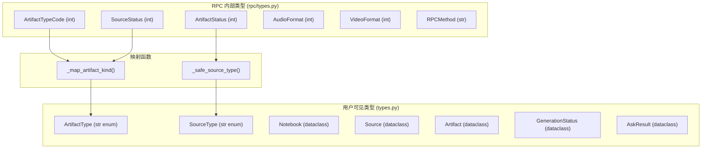
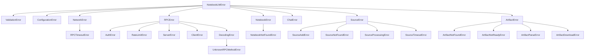

<details>
<summary>相关源文件</summary>

生成本页时使用的主要源文件：

- [src/notebooklm/types.py](https://github.com/teng-lin/notebooklm-py/blob/d6cef809dee4f03794e89bd089dd426b34a67345/src/notebooklm/types.py)
- [src/notebooklm/rpc/types.py](https://github.com/teng-lin/notebooklm-py/blob/d6cef809dee4f03794e89bd089dd426b34a67345/src/notebooklm/rpc/types.py)
- [src/notebooklm/exceptions.py](https://github.com/teng-lin/notebooklm-py/blob/d6cef809dee4f03794e89bd089dd426b34a67345/src/notebooklm/exceptions.py)

</details>

# 数据类型与模型

notebooklm-py 的类型系统分为两层：RPC 内部类型（`rpc/types.py`）使用整数枚举匹配 Google API 的原始编码；用户可见类型（`types.py`）使用字符串枚举和 dataclass 提供更友好的 API。两层之间通过映射函数桥接。

## 类型系统架构



Sources: [src/notebooklm/types.py](../../../project-repos/notebooklm-py/src/notebooklm/types.py), [src/notebooklm/rpc/types.py](../../../project-repos/notebooklm-py/src/notebooklm/rpc/types.py)

<details class="source-snippets">
<summary>引用源码</summary>

<!-- source-snippets:start -->

#### `src/notebooklm/types.py`

```python
"""Data types for NotebookLM API client.

This module contains all dataclasses and re-exports enums from rpc/types.py
for convenient access.

Usage:
    from notebooklm.types import Notebook, Source, Artifact, GenerationStatus
    from notebooklm.types import AudioFormat, VideoFormat
    from notebooklm.types import SourceType, ArtifactType  # str enums for .kind
"""

import warnings
from dataclasses import dataclass, field
from datetime import datetime
from enum import Enum
from typing import Any, Optional

# Import exceptions from centralized module (re-export for backward compatibility)
from .exceptions import (
    ArtifactDownloadError,
    ArtifactError,
    ArtifactNotFoundError,
    ArtifactNotReadyError,
    ArtifactParseError,
    SourceAddError,
    SourceError,
    SourceNotFoundError,
    SourceProcessingError,
    SourceTimeoutError,
)

# Re-export enums from rpc/types.py for convenience
from .rpc.types import (
    ArtifactStatus,
    AudioFormat,
    AudioLength,
    ChatGoal,
    ChatResponseLength,
    DriveMimeType,
    ExportType,
    InfographicDetail,
    InfographicOrientation,
    InfographicStyle,
    QuizDifficulty,
    QuizQuantity,
    ReportFormat,
    ShareAccess,
    SharePermission,
    ShareViewLevel,
    SlideDeckFormat,
    SlideDeckLength,
    SourceStatus,
    VideoFormat,
    VideoStyle,
    artifact_status_to_str,
    source_status_to_str,
)

# =============================================================================
# User-facing Type Enums (str enums for .kind property)
# =============================================================================


class UnknownTypeWarning(UserWarning):
    """Emitted when encountering unrecognized type codes from Google API.

    This warning indicates the API returned a type code that this version
    of notebooklm-py doesn't recognize. Consider updating to the latest version.
    """

    pass


class SourceType(str, Enum):
    """User-facing source types.

    This is a str enum, so comparisons work with both enum members and strings:
        source.kind == SourceType.WEB_PAGE  # True
        source.kind == "web_page"           # Also True
    """

    GOOGLE_DOCS = "google_docs"
    GOOGLE_SLIDES = "google_slides"
    GOOGLE_SPREADSHEET = "google_spreadsheet"
    PDF = "pdf"
    PASTED_TEXT = "pasted_text"
    WEB_PAGE = "web_page"
    GOOGLE_DRIVE_AUDIO = "google_drive_audio"
    GOOGLE_DRIVE_VIDEO = "google_drive_video"
    YOUTUBE = "youtube"
    MARKDOWN = "markdown"
    DOCX = "docx"
    CSV = "csv"
    EPUB = "epub"
    IMAGE = "image"
    MEDIA = "media"
    UNKNOWN = "unknown"


class ArtifactType(str, Enum):
    """User-facing artifact types.

    This is a str enum that hides internal variant complexity. For example,
    quizzes and flashcards are both type 4 internally but distinguished by variant.

    Comparisons work with both enum members and strings:
        artifact.kind == ArtifactType.AUDIO  # True
        artifact.kind == "audio"             # Also True
    """

    AUDIO = "audio"
    VIDEO = "video"
    REPORT = "report"
    QUIZ = "quiz"
    FLASHCARDS = "flashcards"
    MIND_MAP = "mind_map"
    INFOGRAPHIC = "infographic"
    SLIDE_DECK = "slide_deck"
    DATA_TABLE = "data_table"
    UNKNOWN = "unknown"
```

#### `src/notebooklm/rpc/types.py`

```python
"""RPC types and constants for NotebookLM API."""

from enum import Enum

# NotebookLM API endpoints
BATCHEXECUTE_URL = "https://notebooklm.google.com/_/LabsTailwindUi/data/batchexecute"
QUERY_URL = "https://notebooklm.google.com/_/LabsTailwindUi/data/google.internal.labs.tailwind.orchestration.v1.LabsTailwindOrchestrationService/GenerateFreeFormStreamed"
UPLOAD_URL = "https://notebooklm.google.com/upload/_/"


class RPCMethod(str, Enum):
    """RPC method IDs for NotebookLM operations.

    These are obfuscated method identifiers used by the batchexecute API.
    Reverse-engineered from network traffic analysis.
    """

    # Notebook operations
    LIST_NOTEBOOKS = "wXbhsf"
    CREATE_NOTEBOOK = "CCqFvf"
    GET_NOTEBOOK = "rLM1Ne"
    RENAME_NOTEBOOK = "s0tc2d"
    DELETE_NOTEBOOK = "WWINqb"

    # Source operations
    ADD_SOURCE = "izAoDd"
    ADD_SOURCE_FILE = "o4cbdc"  # Register uploaded file as source
    DELETE_SOURCE = "tGMBJ"
    GET_SOURCE = "hizoJc"
    REFRESH_SOURCE = "FLmJqe"
    CHECK_SOURCE_FRESHNESS = "yR9Yof"
    UPDATE_SOURCE = "b7Wfje"
    DISCOVER_SOURCES = "qXyaNe"

    # Summary and query
    SUMMARIZE = "VfAZjd"
    GET_SOURCE_GUIDE = "tr032e"
    GET_SUGGESTED_REPORTS = "ciyUvf"  # AI-suggested report formats

    # Query endpoint (not a batchexecute RPC ID)
    QUERY_ENDPOINT = "/_/LabsTailwindUi/data/google.internal.labs.tailwind.orchestration.v1.LabsTailwindOrchestrationService/GenerateFreeFormStreamed"

    # Artifact operations
    CREATE_ARTIFACT = "R7cb6c"  # Generate any artifact (audio, video, report, quiz, etc.)
    LIST_ARTIFACTS = "gArtLc"  # List all artifacts in a notebook
    DELETE_ARTIFACT = "V5N4be"
    RENAME_ARTIFACT = "rc3d8d"
    EXPORT_ARTIFACT = "Krh3pd"
    SHARE_ARTIFACT = "RGP97b"
    GET_INTERACTIVE_HTML = "v9rmvd"  # Fetch quiz/flashcard HTML content
    REVISE_SLIDE = "KmcKPe"  # Revise individual slide with prompt

    # Research
    START_FAST_RESEARCH = "Ljjv0c"
    START_DEEP_RESEARCH = "QA9ei"
    POLL_RESEARCH = "e3bVqc"
    IMPORT_RESEARCH = "LBwxtb"

    # Note and mind map operations
    GENERATE_MIND_MAP = "yyryJe"  # Generate mind map from sources
    CREATE_NOTE = "CYK0Xb"
    GET_NOTES_AND_MIND_MAPS = "cFji9"  # Returns both notes and mind maps
    UPDATE_NOTE = "cYAfTb"
    DELETE_NOTE = "AH0mwd"

    # Conversation
    GET_LAST_CONVERSATION_ID = "hPTbtc"  # Returns only the most recent conversation ID
    GET_CONVERSATION_TURNS = "khqZz"  # Returns full Q&A turns for a conversation

    # Sharing operations (notebook-level)
    SHARE_NOTEBOOK = "QDyure"  # Set notebook visibility (restricted/anyone with link)
    GET_SHARE_STATUS = "JFMDGd"  # Get notebook share settings
    # Note: SET_SHARE_ACCESS uses RENAME_NOTEBOOK (s0tc2d) with different params

    # Additional notebook operations
    REMOVE_RECENTLY_VIEWED = "fejl7e"

    # User settings
    GET_USER_SETTINGS = "ZwVcOc"  # Get user settings including output language
    SET_USER_SETTINGS = "hT54vc"  # Set user settings (e.g., output language)


class ArtifactTypeCode(int, Enum):
    """Integer codes for artifact types used in RPC calls.

    These are the raw codes used in the CREATE_ARTIFACT (R7cb6c) RPC call.
    Values correspond to artifact_data[2] in API responses.

    Note: This is an internal enum. Users should use ArtifactType (str enum)
    from notebooklm.types for a cleaner API.
    """

    AUDIO = 1
    REPORT = (
        2  # Includes: Briefing Doc, Study Guide, Blog Post, White Paper, Research Proposal, etc.
    )
    VIDEO = 3
    QUIZ = 4  # Also used for flashcards
    QUIZ_FLASHCARD = 4  # Alias for backward compatibility
    MIND_MAP = 5
    # Note: Type 6 appears unused in current API
    INFOGRAPHIC = 7
    SLIDE_DECK = 8
    DATA_TABLE = 9


# Deprecated alias for backward compatibility
StudioContentType = ArtifactTypeCode


class ArtifactStatus(int, Enum):
    """Processing status of an artifact.

    Values correspond to artifact_data[4] in API responses.
    """

    PROCESSING = 1  # Artifact is being generated
    PENDING = 2  # Artifact is queued
    COMPLETED = 3  # Artifact is ready for use/download
    FAILED = 4  # Generation failed
```

<!-- source-snippets:end -->
</details>
## 核心数据类

### Notebook

| 字段 | 类型 | 说明 |
|------|------|------|
| `id` | `str` | 笔记本 UUID |
| `title` | `str` | 标题 |
| `created_at` | `datetime \| None` | 创建时间 |
| `sources_count` | `int` | Source 数量 |
| `is_owner` | `bool` | 是否为所有者 |

`from_api_response()` 处理 API 返回的深层嵌套数组结构，提取标题（去除 `thought\n` 前缀）、ID、时间戳和所有权信息。

Sources: [src/notebooklm/types.py:350-410](../../../project-repos/notebooklm-py/src/notebooklm/types.py#L350-L410)

<details class="source-snippets">
<summary>引用源码</summary>

<!-- source-snippets:start -->

#### `src/notebooklm/types.py:350-410`

```python
    """Predefined chat modes for common use cases."""

    DEFAULT = "default"  # General purpose
    LEARNING_GUIDE = "learning_guide"  # Educational focus
    CONCISE = "concise"  # Brief responses
    DETAILED = "detailed"  # Verbose responses


# =============================================================================
# Notebook Types
# =============================================================================


@dataclass
class SourceSummary:
    """Simplified source information for metadata export.

    This type provides a minimal representation of a source for
    notebook metadata export, focusing on the most commonly needed fields.

    Attributes:
        kind: Source type (e.g., "pdf", "web_page", "youtube").
        title: Source title if available.
        url: Source URL if applicable (web/YouTube sources).
    """

    kind: SourceType
    title: str | None = None
    url: str | None = None

    def to_dict(self) -> dict[str, str | None]:
        """Convert to dictionary for JSON serialization.

        Always includes all keys with null for missing values
        to ensure consistent schema across all source entries.
        """
        return {
            "type": self.kind.value,
            "title": self.title,
            "url": self.url,
        }


@dataclass
class Notebook:
    """Represents a NotebookLM notebook."""

    id: str
    title: str
    created_at: datetime | None = None
    sources_count: int = 0
    is_owner: bool = True

    @classmethod
    def from_api_response(cls, data: list[Any]) -> "Notebook":
        """Parse notebook from API response.

        Args:
            data: Raw API response list.

        Returns:
```

<!-- source-snippets:end -->
</details>
### Source

| 字段 | 类型 | 说明 |
|------|------|------|
| `id` | `str` | Source UUID |
| `title` | `str \| None` | 标题 |
| `url` | `str \| None` | 原始 URL |
| `kind` | `SourceType` | 类型枚举（str enum） |
| `status` | `int` | 处理状态 |
| `is_ready` | `bool` | 是否就绪 |

`kind` 属性通过 `_safe_source_type()` 将内部整数类型码映射为 `SourceType` 枚举，未识别的码返回 `UNKNOWN` 并发出 `UnknownTypeWarning`。

Sources: [src/notebooklm/types.py:430-560](../../../project-repos/notebooklm-py/src/notebooklm/types.py#L430-L560)

<details class="source-snippets">
<summary>引用源码</summary>

<!-- source-snippets:start -->

#### `src/notebooklm/types.py:430-560`

```python

        return cls(id=notebook_id, title=title, created_at=created_at, is_owner=is_owner)


@dataclass
class SuggestedTopic:
    """A suggested topic/question for the notebook."""

    question: str
    prompt: str


@dataclass
class NotebookDescription:
    """AI-generated description and suggested topics for a notebook."""

    summary: str
    suggested_topics: list[SuggestedTopic] = field(default_factory=list)

    @classmethod
    def from_api_response(cls, data: dict[str, Any]) -> "NotebookDescription":
        """Parse from get_notebook_description() response."""
        topics = [
            SuggestedTopic(question=t.get("question", ""), prompt=t.get("prompt", ""))
            for t in data.get("suggested_topics", [])
        ]
        return cls(
            summary=data.get("summary", ""),
            suggested_topics=topics,
        )


@dataclass
class NotebookMetadata:
    """Combined notebook metadata with sources list.

    This composes a Notebook with a list of simplified source information
    for export/overview purposes.

    Attributes:
        notebook: The notebook object with all its details.
        sources: List of simplified source information.
    """

    notebook: Notebook
    sources: list[SourceSummary] = field(default_factory=list)

    @property
    def id(self) -> str:
        """Get notebook ID."""
        return self.notebook.id

    @property
    def title(self) -> str:
        """Get notebook title."""
        return self.notebook.title

    @property
    def created_at(self) -> datetime | None:
        """Get creation timestamp."""
        return self.notebook.created_at

    @property
    def is_owner(self) -> bool:
        """Get owner status."""
        return self.notebook.is_owner

    def to_dict(self) -> dict[str, Any]:
        """Convert to dictionary for JSON serialization.

        Flattens notebook fields for backward compatibility with issue spec.
        """
        return {
            "id": self.id,
            "title": self.title,
            "created_at": self.created_at.isoformat() if self.created_at else None,
            "is_owner": self.is_owner,
            "sources": [s.to_dict() for s in self.sources],
        }


# =============================================================================
# Source Types
# =============================================================================


@dataclass
class Source:
    """Represents a NotebookLM source.

    Attributes:
        id: Unique source identifier.
        title: Source title (may be URL if not yet processed).
        url: Original URL for web/YouTube sources.
        kind: Source type as SourceType enum (str enum, comparable to strings).
        created_at: When the source was added.
        status: Processing status (1=processing, 2=ready, 3=error).

    Example:
        source.kind == SourceType.WEB_PAGE  # True
        source.kind == "web_page"           # Also True (str enum)
        f"Type: {source.kind}"              # "Type: web_page"
    """

    id: str
    title: str | None = None
    url: str | None = None
    _type_code: int | None = field(default=None, repr=False)
    created_at: datetime | None = None
    status: int = SourceStatus.READY  # Default to READY (2)

    @property
    def kind(self) -> SourceType:
        """Get source type as SourceType enum.

        Returns:
            SourceType enum member. Returns SourceType.UNKNOWN for
            unrecognized type codes (with a warning on first occurrence).
        """
        return _safe_source_type(self._type_code)
... snippet truncated ...
```

<!-- source-snippets:end -->
</details>
### Artifact

| 字段 | 类型 | 说明 |
|------|------|------|
| `id` | `str` | 制品 UUID |
| `title` | `str` | 标题 |
| `kind` | `ArtifactType` | 类型枚举（str enum） |
| `status` | `int` | 处理状态 |
| `created_at` | `datetime \| None` | 创建时间 |
| `is_completed` | `bool` | 是否完成 |

Quiz 和 Flashcards 共享内部类型码 4，通过 `variant` 区分（1=flashcards, 2=quiz）。`_map_artifact_kind()` 处理此特殊映射。

Sources: [src/notebooklm/types.py:580-720](../../../project-repos/notebooklm-py/src/notebooklm/types.py#L580-L720)

<details class="source-snippets">
<summary>引用源码</summary>

<!-- source-snippets:start -->

#### `src/notebooklm/types.py:580-720`

```python
    def is_error(self) -> bool:
        """Check if source processing failed (status=ERROR)."""
        return self.status == SourceStatus.ERROR

    @classmethod
    def from_api_response(cls, data: list[Any], notebook_id: str | None = None) -> "Source":
        """Parse source data from various API response formats.

        The API returns different structures for different operations:
        - add_source: [[[[id], title, metadata]]] (deeply nested)
        - list_sources: [[[id], title, metadata], ...] (one level less nesting)
        - rename_source: May return simpler structure

        Note:
            This method does NOT parse the source status field. Sources created
            via this method will have status=READY by default. To get accurate
            status information (PROCESSING, READY, or ERROR), use
            `client.sources.list()` or `client.sources.get()` which parse
            status from the full notebook response structure.
        """
        if not data or not isinstance(data, list):
            raise ValueError(f"Invalid source data: {data}")

        # Try deeply nested format: [[[[id], title, metadata, ...]]]
        if isinstance(data[0], list) and len(data[0]) > 0:
            if isinstance(data[0][0], list) and len(data[0][0]) > 0:
                # Check if deeply nested vs medium nested
                if isinstance(data[0][0][0], list):
                    # Deeply nested: [[[[id], title, ...]]]
                    entry = data[0][0]
                    source_id = entry[0][0] if isinstance(entry[0], list) else entry[0]
                    title = entry[1] if len(entry) > 1 else None
                else:
                    # Medium nested: [[['id'], 'title', ...]]
                    entry = data[0]
                    source_id = entry[0][0] if isinstance(entry[0], list) else entry[0]
                    title = entry[1] if len(entry) > 1 else None

                    # Extract URL and type code from entry[2] via the shared
                    # helper. Medium-nested shapes don't support the bare-http
                    # [0] fallback, so precedence is restricted to [7] > [5].
                    metadata = entry[2] if len(entry) > 2 and isinstance(entry[2], list) else None
                    url = _extract_source_url(metadata, allow_bare_http=False)
                    type_code = (
                        metadata[4]
                        if metadata is not None
                        and len(metadata) > 4
                        and isinstance(metadata[4], int)
                        else None
                    )

                    return cls(id=str(source_id), title=title, url=url, _type_code=type_code)

                # Deeply-nested shape: extract URL (via shared helper) and
                # type code from entry[2] if present. Full precedence applies:
                # [7] > [5] > bare-http at [0].
                metadata = entry[2] if len(entry) > 2 and isinstance(entry[2], list) else None
                url = _extract_source_url(metadata)
                type_code = (
                    metadata[4]
                    if metadata is not None and len(metadata) > 4 and isinstance(metadata[4], int)
                    else None
                )

                return cls(
                    id=str(source_id),
                    title=title,
                    url=url,
                    _type_code=type_code,
                )

        # Simple flat format: [id, title] or [id, title, ...]
        source_id = data[0] if len(data) > 0 else ""
        title = data[1] if len(data) > 1 else None
        return cls(id=str(source_id), title=title, _type_code=None)


@dataclass
class SourceFulltext:
    """Full text content of a source as indexed by NotebookLM.

    This is the raw text content that was extracted/indexed from the source,
    along with metadata. Returned by `client.sources.get_fulltext()`.

    Attributes:
        source_id: The source UUID.
        title: Source title.
        content: Full indexed text content.
        kind: Source type as SourceType enum (use .kind property).
        url: Original URL for web/YouTube sources.
        char_count: Number of characters in the content.

    Example:
        fulltext.kind == SourceType.WEB_PAGE  # True
        fulltext.kind == "web_page"           # Also True (str enum)
    """

    source_id: str
    title: str
    content: str
    _type_code: int | None = field(default=None, repr=False)
    url: str | None = None
    char_count: int = 0

    @property
    def kind(self) -> SourceType:
        """Get source type as SourceType enum."""
        return _safe_source_type(self._type_code)

    @property
    def source_type(self) -> str:
        """Deprecated: Use .kind instead.

        Returns the old-style source type string for backward compatibility.
        Values: "text", "url", "youtube", "text_file"

        .. deprecated:: 0.3.0
            Use the ``.kind`` property which returns a ``SourceType`` enum.
            Will be removed in v0.4.0.
        """
... snippet truncated ...
```

<!-- source-snippets:end -->
</details>
### GenerationStatus

| 字段 | 类型 | 说明 |
|------|------|------|
| `task_id` | `str` | 任务/制品 ID |
| `status` | `str` | pending/in_progress/completed/failed/not_found |
| `url` | `str \| None` | 下载 URL |
| `error` | `str \| None` | 错误信息 |
| `error_code` | `str \| None` | 错误码（如 USER_DISPLAYABLE_ERROR） |
| `is_rate_limited` | `bool` | 是否限速 |

Sources: [src/notebooklm/types.py:730-800](../../../project-repos/notebooklm-py/src/notebooklm/types.py#L730-L800)

<details class="source-snippets">
<summary>引用源码</summary>

<!-- source-snippets:start -->

#### `src/notebooklm/types.py:730-800`

```python
            Empty list if no matches. Position is start of match in content.
        """
        if not cited_text or not self.content:
            return []

        # Use prefix for search (citations are often truncated)
        search_text = cited_text[: min(40, len(cited_text))]

        matches = []
        pos = 0
        while (idx := self.content.find(search_text, pos)) != -1:
            start = max(0, idx - context_chars)
            end = min(len(self.content), idx + len(search_text) + context_chars)
            matches.append((self.content[start:end], idx))
            pos = idx + len(search_text)  # Skip past match to avoid overlaps

        return matches


# =============================================================================
# Artifact Types
# =============================================================================


@dataclass
class Artifact:
    """Represents a NotebookLM artifact (studio content).

    Artifacts are AI-generated content like Audio Overviews, Video Overviews,
    Reports, Quizzes, Flashcards, Mind Maps, Infographics, Slide Decks, and
    Data Tables.

    Attributes:
        id: Unique artifact identifier.
        title: Artifact title.
        kind: Artifact type as ArtifactType enum (str enum, comparable to strings).
        status: Processing status (1=processing, 2=pending, 3=completed, 4=failed).
        created_at: When the artifact was created.
        url: Download URL (if available).

    Example:
        artifact.kind == ArtifactType.AUDIO  # True
        artifact.kind == "audio"             # Also True (str enum)
        f"Type: {artifact.kind}"             # "Type: audio"
    """

    id: str
    title: str
    _artifact_type: int = field(repr=False)  # ArtifactTypeCode enum value
    status: int  # 1=processing, 2=pending, 3=completed, 4=failed
    created_at: datetime | None = None
    url: str | None = None
    _variant: int | None = field(default=None, repr=False)  # For type 4: 1=flashcards, 2=quiz

    @property
    def kind(self) -> ArtifactType:
        """Get artifact type as ArtifactType enum.

        Returns:
            ArtifactType enum member. Returns ArtifactType.UNKNOWN for
            unrecognized type codes (with a warning on first occurrence).
        """
        return _map_artifact_kind(self._artifact_type, self._variant)

    @property
    def artifact_type(self) -> int:
        """Deprecated: Use .kind instead.

        Returns the raw integer type code for backward compatibility.

        .. deprecated:: 0.3.0
```

<!-- source-snippets:end -->
</details>
### AskResult

| 字段 | 类型 | 说明 |
|------|------|------|
| `answer` | `str` | AI 回答 |
| `conversation_id` | `str` | 对话 UUID |
| `turn_number` | `int` | 轮次号 |
| `is_follow_up` | `bool` | 是否追问 |
| `references` | `list[ChatReference]` | 源引用列表 |

Sources: [src/notebooklm/types.py:900-940](../../../project-repos/notebooklm-py/src/notebooklm/types.py#L900-L940)

<details class="source-snippets">
<summary>引用源码</summary>

<!-- source-snippets:start -->

#### `src/notebooklm/types.py:900-940`

```python
        if len(data) > 1 and isinstance(data[1], list):
            inner = data[1]
            # Title is at position [4]
            if len(inner) > 4 and isinstance(inner[4], str):
                title = inner[4]
            # Timestamp is at [2][2][0]
            if len(inner) > 2 and isinstance(inner[2], list) and len(inner[2]) > 2:
                ts_data = inner[2][2]
                if isinstance(ts_data, list) and len(ts_data) > 0:
                    try:
                        created_at = datetime.fromtimestamp(ts_data[0])
                    except (TypeError, ValueError):
                        pass

        return cls(
            id=str(mind_map_id),
            title=title,
            _artifact_type=5,  # ArtifactTypeCode.MIND_MAP
            status=3,  # Mind maps are always "completed" once created
            created_at=created_at,
            _variant=None,
        )

    @property
    def is_completed(self) -> bool:
        """Check if artifact generation is complete (status=COMPLETED)."""
        return self.status == ArtifactStatus.COMPLETED

    @property
    def is_processing(self) -> bool:
        """Check if artifact is being generated (status=PROCESSING)."""
        return self.status == ArtifactStatus.PROCESSING

    @property
    def is_pending(self) -> bool:
        """Check if artifact is queued/transitional (status=PENDING)."""
        return self.status == ArtifactStatus.PENDING

    @property
    def is_failed(self) -> bool:
        """Check if artifact generation failed (status=FAILED)."""
```

<!-- source-snippets:end -->
</details>
## 枚举映射

### SourceType 映射

| 内部码 | SourceType | 说明 |
|--------|------------|------|
| 1 | `GOOGLE_DOCS` | Google 文档 |
| 3 | `PDF` | PDF 文件 |
| 4 | `PASTED_TEXT` | 粘贴文本 |
| 5 | `WEB_PAGE` | 网页 |
| 8 | `MARKDOWN` | Markdown |
| 9 | `YOUTUBE` | YouTube 视频 |
| 11 | `DOCX` | Word 文档 |
| 13 | `IMAGE` | 图片 |
| 14 | `GOOGLE_SPREADSHEET` | Google 表格 |
| 16 | `CSV` | CSV 文件 |
| 17 | `EPUB` | EPUB 电子书 |

### ArtifactType 映射

| 内部码 | variant | ArtifactType | 说明 |
|--------|---------|--------------|------|
| 1 | - | `AUDIO` | 音频播客 |
| 2 | - | `REPORT` | 报告 |
| 3 | - | `VIDEO` | 视频 |
| 4 | 1 | `FLASHCARDS` | 闪卡 |
| 4 | 2 | `QUIZ` | 测验 |
| 5 | - | `MIND_MAP` | 思维导图 |
| 7 | - | `INFOGRAPHIC` | 信息图 |
| 8 | - | `SLIDE_DECK` | 幻灯片 |
| 9 | - | `DATA_TABLE` | 数据表 |

Sources: [src/notebooklm/types.py:60-140](../../../project-repos/notebooklm-py/src/notebooklm/types.py#L60-L140)

<details class="source-snippets">
<summary>引用源码</summary>

<!-- source-snippets:start -->

#### `src/notebooklm/types.py:60-140`

```python
# User-facing Type Enums (str enums for .kind property)
# =============================================================================


class UnknownTypeWarning(UserWarning):
    """Emitted when encountering unrecognized type codes from Google API.

    This warning indicates the API returned a type code that this version
    of notebooklm-py doesn't recognize. Consider updating to the latest version.
    """

    pass


class SourceType(str, Enum):
    """User-facing source types.

    This is a str enum, so comparisons work with both enum members and strings:
        source.kind == SourceType.WEB_PAGE  # True
        source.kind == "web_page"           # Also True
    """

    GOOGLE_DOCS = "google_docs"
    GOOGLE_SLIDES = "google_slides"
    GOOGLE_SPREADSHEET = "google_spreadsheet"
    PDF = "pdf"
    PASTED_TEXT = "pasted_text"
    WEB_PAGE = "web_page"
    GOOGLE_DRIVE_AUDIO = "google_drive_audio"
    GOOGLE_DRIVE_VIDEO = "google_drive_video"
    YOUTUBE = "youtube"
    MARKDOWN = "markdown"
    DOCX = "docx"
    CSV = "csv"
    EPUB = "epub"
    IMAGE = "image"
    MEDIA = "media"
    UNKNOWN = "unknown"


class ArtifactType(str, Enum):
    """User-facing artifact types.

    This is a str enum that hides internal variant complexity. For example,
    quizzes and flashcards are both type 4 internally but distinguished by variant.

    Comparisons work with both enum members and strings:
        artifact.kind == ArtifactType.AUDIO  # True
        artifact.kind == "audio"             # Also True
    """

    AUDIO = "audio"
    VIDEO = "video"
    REPORT = "report"
    QUIZ = "quiz"
    FLASHCARDS = "flashcards"
    MIND_MAP = "mind_map"
    INFOGRAPHIC = "infographic"
    SLIDE_DECK = "slide_deck"
    DATA_TABLE = "data_table"
    UNKNOWN = "unknown"


# Module-level sets for warning deduplication
_warned_source_types: set[int] = set()
_warned_artifact_types: set[tuple[int, int | None]] = set()


# Mapping from internal int codes to SourceType enum
_SOURCE_TYPE_CODE_MAP: dict[int, SourceType] = {
    1: SourceType.GOOGLE_DOCS,
    2: SourceType.GOOGLE_SLIDES,  # Was GOOGLE_OTHER, now more specific
    3: SourceType.PDF,
    4: SourceType.PASTED_TEXT,
    5: SourceType.WEB_PAGE,
    8: SourceType.MARKDOWN,
    9: SourceType.YOUTUBE,
    10: SourceType.MEDIA,
    11: SourceType.DOCX,
    13: SourceType.IMAGE,
    14: SourceType.GOOGLE_SPREADSHEET,
```

<!-- source-snippets:end -->
</details>
## 异常层级



所有异常继承自 `NotebookLMError`，用户可通过单个 `except NotebookLMError` 捕获所有库错误。域异常（Source/Artifact/Notebook）提供更细粒度的错误处理。

Sources: [src/notebooklm/exceptions.py](../../../project-repos/notebooklm-py/src/notebooklm/exceptions.py)

<details class="source-snippets">
<summary>引用源码</summary>

<!-- source-snippets:start -->

#### `src/notebooklm/exceptions.py`

```python
"""Exceptions for notebooklm-py.

All library exceptions inherit from NotebookLMError, allowing users to catch
all library errors with a single except clause.

Stability: NotebookLMError and its direct subclasses are part of the public API.

Example:
    try:
        await client.notebooks.list()
    except NotebookLMError as e:
        handle_error(e)
"""

from __future__ import annotations

__all__ = [
    # Base
    "NotebookLMError",
    # Validation/Config
    "ValidationError",
    "ConfigurationError",
    # Network (NOT under RPC - happens before RPC)
    "NetworkError",
    # RPC Protocol
    "RPCError",
    "DecodingError",
    "UnknownRPCMethodError",
    "AuthError",
    "RateLimitError",
    "ServerError",
    "ClientError",
    "RPCTimeoutError",
    # Domain: Notebooks
    "NotebookError",
    "NotebookNotFoundError",
    # Domain: Chat
    "ChatError",
    # Domain: Sources
    "SourceError",
    "SourceAddError",
    "SourceNotFoundError",
    "SourceProcessingError",
    "SourceTimeoutError",
    # Domain: Artifacts
    "ArtifactError",
    "ArtifactNotFoundError",
    "ArtifactNotReadyError",
    "ArtifactParseError",
    "ArtifactDownloadError",
]


# =============================================================================
# Base Exception
# =============================================================================


class NotebookLMError(Exception):
    """Base exception for all notebooklm-py errors.

    Users can catch all library errors with:
        try:
            await client.notebooks.list()
        except NotebookLMError as e:
            handle_error(e)
    """


# =============================================================================
# Validation/Configuration
# =============================================================================


class ValidationError(NotebookLMError):
    """Invalid user input or parameters."""


class ConfigurationError(NotebookLMError):
    """Missing or invalid configuration (auth, storage)."""


# =============================================================================
# Network (NOT under RPC - happens before RPC processing)
# =============================================================================


class NetworkError(NotebookLMError):
    """Connection failures, DNS errors, timeouts before RPC.

    Users may want to retry on NetworkError but not on RPCError.

    Attributes:
        method_id: The RPC method ID that failed (if known).
        original_error: The underlying network exception.
    """

    def __init__(
        self,
        message: str,
        *,
        method_id: str | None = None,
        original_error: Exception | None = None,
    ):
        super().__init__(message)
        self.method_id = method_id
        self.original_error = original_error


# =============================================================================
# RPC Protocol
# =============================================================================


class RPCError(NotebookLMError):
    """Base for RPC-specific failures after connection established.

    Attributes:
        method_id: The RPC method ID (e.g., "abc123") for debugging.
        raw_response: First 500 chars of raw response for debugging.
```

<!-- source-snippets:end -->
</details>
## 弃用策略

库采用渐进式弃用策略，通过 `__getattr__` 和属性级 `warnings.warn` 实现向后兼容：

| 弃用项 | 替代 | 移除版本 |
|--------|------|----------|
| `Source.source_type` | `Source.kind` | v0.4.0 |
| `Artifact.artifact_type` | `Artifact.kind` | v0.4.0 |
| `Artifact.variant` | `Artifact.kind` / `is_quiz` / `is_flashcards` | v0.4.0 |
| `StudioContentType` | `ArtifactTypeCode` | v0.4.0 |
| `DEFAULT_STORAGE_PATH` | `get_storage_path()` | v0.5.0 |

Sources: [src/notebooklm/types.py](../../../project-repos/notebooklm-py/src/notebooklm/types.py), [src/notebooklm/__init__.py:220-250](../../../project-repos/notebooklm-py/src/notebooklm/__init__.py#L220-L250)

<details class="source-snippets">
<summary>引用源码</summary>

<!-- source-snippets:start -->

#### `src/notebooklm/types.py`

```python
"""Data types for NotebookLM API client.

This module contains all dataclasses and re-exports enums from rpc/types.py
for convenient access.

Usage:
    from notebooklm.types import Notebook, Source, Artifact, GenerationStatus
    from notebooklm.types import AudioFormat, VideoFormat
    from notebooklm.types import SourceType, ArtifactType  # str enums for .kind
"""

import warnings
from dataclasses import dataclass, field
from datetime import datetime
from enum import Enum
from typing import Any, Optional

# Import exceptions from centralized module (re-export for backward compatibility)
from .exceptions import (
    ArtifactDownloadError,
    ArtifactError,
    ArtifactNotFoundError,
    ArtifactNotReadyError,
    ArtifactParseError,
    SourceAddError,
    SourceError,
    SourceNotFoundError,
    SourceProcessingError,
    SourceTimeoutError,
)

# Re-export enums from rpc/types.py for convenience
from .rpc.types import (
    ArtifactStatus,
    AudioFormat,
    AudioLength,
    ChatGoal,
    ChatResponseLength,
    DriveMimeType,
    ExportType,
    InfographicDetail,
    InfographicOrientation,
    InfographicStyle,
    QuizDifficulty,
    QuizQuantity,
    ReportFormat,
    ShareAccess,
    SharePermission,
    ShareViewLevel,
    SlideDeckFormat,
    SlideDeckLength,
    SourceStatus,
    VideoFormat,
    VideoStyle,
    artifact_status_to_str,
    source_status_to_str,
)

# =============================================================================
# User-facing Type Enums (str enums for .kind property)
# =============================================================================


class UnknownTypeWarning(UserWarning):
    """Emitted when encountering unrecognized type codes from Google API.

    This warning indicates the API returned a type code that this version
    of notebooklm-py doesn't recognize. Consider updating to the latest version.
    """

    pass


class SourceType(str, Enum):
    """User-facing source types.

    This is a str enum, so comparisons work with both enum members and strings:
        source.kind == SourceType.WEB_PAGE  # True
        source.kind == "web_page"           # Also True
    """

    GOOGLE_DOCS = "google_docs"
    GOOGLE_SLIDES = "google_slides"
    GOOGLE_SPREADSHEET = "google_spreadsheet"
    PDF = "pdf"
    PASTED_TEXT = "pasted_text"
    WEB_PAGE = "web_page"
    GOOGLE_DRIVE_AUDIO = "google_drive_audio"
    GOOGLE_DRIVE_VIDEO = "google_drive_video"
    YOUTUBE = "youtube"
    MARKDOWN = "markdown"
    DOCX = "docx"
    CSV = "csv"
    EPUB = "epub"
    IMAGE = "image"
    MEDIA = "media"
    UNKNOWN = "unknown"


class ArtifactType(str, Enum):
    """User-facing artifact types.

    This is a str enum that hides internal variant complexity. For example,
    quizzes and flashcards are both type 4 internally but distinguished by variant.

    Comparisons work with both enum members and strings:
        artifact.kind == ArtifactType.AUDIO  # True
        artifact.kind == "audio"             # Also True
    """

    AUDIO = "audio"
    VIDEO = "video"
    REPORT = "report"
    QUIZ = "quiz"
    FLASHCARDS = "flashcards"
    MIND_MAP = "mind_map"
    INFOGRAPHIC = "infographic"
    SLIDE_DECK = "slide_deck"
    DATA_TABLE = "data_table"
    UNKNOWN = "unknown"
```

#### `src/notebooklm/__init__.py:220-250`

```python

    This allows us to provide backward-compatible imports with warnings.
    Uses globals() caching to avoid duplicate warnings on repeated access.
    """
    import warnings

    if name == "DEFAULT_STORAGE_PATH":
        from .paths import get_storage_path

        warnings.warn(
            "DEFAULT_STORAGE_PATH is deprecated, use notebooklm.paths.get_storage_path() instead. "
            "Will be removed in v0.5.0.",
            DeprecationWarning,
            stacklevel=2,
        )
        val = get_storage_path()
        globals()[name] = val
        return val

    if name == "StudioContentType":
        from .rpc.types import ArtifactTypeCode

        warnings.warn(
            "StudioContentType is deprecated, use ArtifactType instead. Will be removed in v0.4.0.",
            DeprecationWarning,
            stacklevel=2,
        )
        # Cache to prevent duplicate warnings on repeated access
        globals()[name] = ArtifactTypeCode
        return ArtifactTypeCode

```

<!-- source-snippets:end -->
</details>
## 相关页面

- [客户端 API](client-api.md)
- [制品生成与下载](artifact-generation.md)
- [RPC 协议层](rpc-protocol.md)
