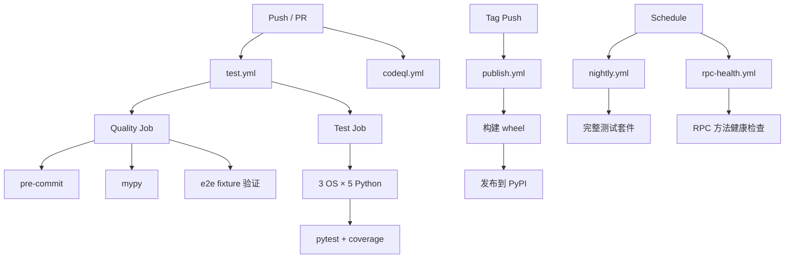
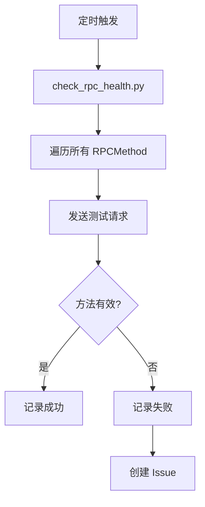

<details>
<summary>相关源文件</summary>

生成本页时使用的主要源文件：

- [.github/workflows/test.yml](https://github.com/teng-lin/notebooklm-py/blob/d6cef809dee4f03794e89bd089dd426b34a67345/.github/workflows/test.yml)
- [.github/workflows/publish.yml](https://github.com/teng-lin/notebooklm-py/blob/d6cef809dee4f03794e89bd089dd426b34a67345/.github/workflows/publish.yml)
- [.github/workflows/rpc-health.yml](https://github.com/teng-lin/notebooklm-py/blob/d6cef809dee4f03794e89bd089dd426b34a67345/.github/workflows/rpc-health.yml)
- [.github/workflows/verify-artifacts.yml](https://github.com/teng-lin/notebooklm-py/blob/d6cef809dee4f03794e89bd089dd426b34a67345/.github/workflows/verify-artifacts.yml)
- [pyproject.toml](https://github.com/teng-lin/notebooklm-py/blob/d6cef809dee4f03794e89bd089dd426b34a67345/pyproject.toml)
- [scripts/check_rpc_health.py](https://github.com/teng-lin/notebooklm-py/blob/d6cef809dee4f03794e89bd089dd426b34a67345/scripts/check_rpc_health.py)

</details>

# 部署与 CI/CD

notebooklm-py 使用 hatchling 构建，通过 PyPI 分发，GitHub Actions 管理 CI/CD 流水线。由于依赖逆向工程的 Google API，项目特别关注 RPC 健康检查和制品验证。

## 构建与发布

### 构建系统

```toml
[build-system]
requires = ["hatchling", "hatch-fancy-pypi-readme"]
build-backend = "hatchling.build"
```

`hatch-fancy-pypi-readme` 将 README.md 作为 PyPI 长描述，并自动将相对文档链接转换为版本标签的绝对 URL。

### 打包特殊处理

```toml
[tool.hatch.build.targets.wheel]
force-include = {"SKILL.md" = "notebooklm/data/SKILL.md", "AGENTS.md" = "notebooklm/data/CODEX.md"}
```

`SKILL.md` 和 `AGENTS.md` 被包含在 wheel 包中，供 CLI 的 `agent show` 和 `skill install` 命令使用。

Sources: [pyproject.toml:1-50](../../../project-repos/notebooklm-py/pyproject.toml#L1-L50)

<details class="source-snippets">
<summary>引用源码</summary>

<!-- source-snippets:start -->

#### `pyproject.toml:1-50`

```toml
[project]
name = "notebooklm-py"
version = "0.3.4"
description = "Unofficial Python library for automating Google NotebookLM"
dynamic = ["readme"]
requires-python = ">=3.10"
license = {text = "MIT"}
authors = [
    {name = "Teng Lin", email = "teng.lin@gmail.com"}
]
keywords = ["notebooklm", "google", "ai", "automation", "rpc", "client", "api"]
classifiers = [
    "Development Status :: 4 - Beta",
    "Intended Audience :: Developers",
    "License :: OSI Approved :: MIT License",
    "Programming Language :: Python :: 3",
    "Programming Language :: Python :: 3.10",
    "Programming Language :: Python :: 3.11",
    "Programming Language :: Python :: 3.12",
    "Programming Language :: Python :: 3.13",
    "Programming Language :: Python :: 3.14",
    "Topic :: Software Development :: Libraries :: Python Modules",
]
dependencies = [
    "httpx>=0.27.0",
    "click>=8.0.0",
    "rich>=13.0.0",
]

[project.urls]
Homepage = "https://github.com/teng-lin/notebooklm-py"
Repository = "https://github.com/teng-lin/notebooklm-py"
Documentation = "https://github.com/teng-lin/notebooklm-py#readme"
Issues = "https://github.com/teng-lin/notebooklm-py/issues"

[project.optional-dependencies]
browser = ["playwright>=1.40.0"]
cookies = ["rookiepy>=0.1.0"]
dev = [
    "pytest>=8.0.0",
    "pytest-asyncio>=0.23.0",
    "pytest-httpx>=0.30.0",
    "pytest-cov>=4.0.0",
    "pytest-rerunfailures>=14.0",
    "pytest-timeout>=2.3.0",
    "python-dotenv>=1.0.0",
    "mypy>=1.0.0",
    "pre-commit>=4.5.1",
    "ruff==0.8.6",
    "vcrpy>=6.0.0",
```

<!-- source-snippets:end -->
</details>
### 入口点

```toml
[project.scripts]
notebooklm = "notebooklm.notebooklm_cli:main"
```

安装后提供 `notebooklm` 命令行入口。

## CI/CD 工作流



### 工作流清单

| 工作流 | 触发条件 | 用途 |
|--------|----------|------|
| `test.yml` | Push/PR to main | 代码质量 + 跨平台测试 |
| `publish.yml` | Tag push | 发布到 PyPI |
| `testpypi-publish.yml` | 手动 | 发布到 TestPyPI |
| `nightly.yml` | 定时 | 夜间完整测试 |
| `rpc-health.yml` | 定时 | RPC 方法健康检查 |
| `verify-artifacts.yml` | 手动 | 验证 wheel 包内容 |
| `verify-package.yml` | 手动 | 验证包安装 |
| `codeql.yml` | Push/PR | 安全扫描 |

Sources: [github/workflows/](../../../project-repos/notebooklm-py/.github/workflows)

<details class="source-snippets">
<summary>引用源码</summary>

<!-- source-snippets:start -->

#### `github/workflows/`

> 引用目标是目录，无法展开源码片段：`github/workflows/`

<!-- source-snippets:end -->
</details>
## RPC 健康检查

`rpc-health.yml` 是项目特有的 CI 工作流，定期验证 Google NotebookLM 的 RPC 方法标识是否仍然有效：



由于 Google 可能随时更改混淆后的 RPC 方法标识，健康检查能及时发现 API 变化，避免用户遇到运行时错误。

Sources: [scripts/check_rpc_health.py](../../../project-repos/notebooklm-py/scripts/check_rpc_health.py), [github/workflows/rpc-health.yml](../../../project-repos/notebooklm-py/.github/workflows/rpc-health.yml)

<details class="source-snippets">
<summary>引用源码</summary>

<!-- source-snippets:start -->

#### `scripts/check_rpc_health.py`

```python
#!/usr/bin/env python3
"""RPC Health Check - Verify NotebookLM RPC method IDs are still valid.

This script makes minimal API calls to exercise RPC methods and verify
that the method IDs in rpc/types.py still match what the API returns.

Exit codes:
    0 - All RPC methods OK (or transient errors only)
    1 - One or more RPC methods have mismatched IDs
    2 - Authentication or infrastructure failure (not an RPC problem)

Environment variables:
    NOTEBOOKLM_AUTH_JSON - Playwright storage state JSON (required)
    NOTEBOOKLM_READ_ONLY_NOTEBOOK_ID - Notebook ID for read operations
    NOTEBOOKLM_GENERATION_NOTEBOOK_ID - Notebook ID for write operations
    NOTEBOOKLM_RPC_DELAY - Delay between RPC calls in seconds (default: 1.0)

Usage:
    python scripts/check_rpc_health.py          # Quick mode (skip destructive)
    python scripts/check_rpc_health.py --full   # Full mode (create temp notebook)
"""

from __future__ import annotations

import argparse
import asyncio
import json
import os
import sys
from collections import Counter
from dataclasses import dataclass
from enum import Enum
from typing import Any
from urllib.parse import quote
from uuid import uuid4

import httpx

from notebooklm.auth import AuthTokens, fetch_tokens, load_auth_from_storage
from notebooklm.rpc import (
    BATCHEXECUTE_URL,
    RPCError,
    RPCMethod,
    build_request_body,
    encode_rpc_request,
)
from notebooklm.rpc.decoder import (
    collect_rpc_ids,
    decode_response,
    parse_chunked_response,
    strip_anti_xssi,
)


class CheckStatus(str, Enum):
    """Result status for an RPC check."""

    OK = "OK"
    MISMATCH = "MISMATCH"
    ERROR = "ERROR"
    SKIPPED = "SKIPPED"


@dataclass
class CheckResult:
    """Result of checking a single RPC method."""

    method: RPCMethod
    status: CheckStatus
    expected_id: str
    found_ids: list[str]
    error: str | None = None


# Delay between RPC calls to avoid rate limiting (seconds)
# Can be overridden via NOTEBOOKLM_RPC_DELAY env var
CALL_DELAY = float(os.environ.get("NOTEBOOKLM_RPC_DELAY", "1.0"))

# Status display icons
STATUS_ICONS = {
    CheckStatus.OK: "OK",
    CheckStatus.MISMATCH: "MISMATCH",
    CheckStatus.ERROR: "ERROR",
    CheckStatus.SKIPPED: "SKIP",
}

# Methods that are duplicates (same ID, different name)
# Currently empty - no duplicate method IDs in use
DUPLICATE_METHODS: set[RPCMethod] = set()

# Methods that require real resource IDs (fail with placeholders).
# These return HTTP 400 with placeholder IDs but would work with real IDs.
# Currently empty but kept for future additions.
PLACEHOLDER_FAIL_METHODS: set[RPCMethod] = set()

# Methods that can only be tested in full mode (with temp notebook)
# These are destructive or create resources
FULL_MODE_ONLY_METHODS = {
    # Create operations
    RPCMethod.CREATE_NOTEBOOK,
    RPCMethod.ADD_SOURCE,
    RPCMethod.ADD_SOURCE_FILE,  # Registers file source intent (no upload needed)
    RPCMethod.CREATE_NOTE,
    RPCMethod.CREATE_ARTIFACT,  # Main RPC for all artifacts - test with flashcards (fast)
    RPCMethod.START_FAST_RESEARCH,  # Starts research (verify RPC ID, don't wait)
    # Delete operations (tested after creates)
    RPCMethod.DELETE_NOTE,
    RPCMethod.DELETE_SOURCE,
    RPCMethod.DELETE_ARTIFACT,  # Main RPC for artifact deletion
    RPCMethod.DELETE_NOTEBOOK,
}

# Methods always skipped (even in full mode)
ALWAYS_SKIP_METHODS = {
    # Not a batchexecute RPC
    RPCMethod.QUERY_ENDPOINT,
    # Takes too long
    RPCMethod.START_DEEP_RESEARCH,
    # Not fully rolled out by Google - fails with any IDs
    RPCMethod.DISCOVER_SOURCES,
```

#### `github/workflows/rpc-health.yml`

```yaml
name: RPC Health Check

on:
  schedule:
    # Run at 7 AM UTC daily (1 hour after nightly E2E tests)
    - cron: '0 7 * * *'
  workflow_dispatch:  # Allow manual trigger

concurrency:
  group: ${{ github.workflow }}
  cancel-in-progress: true

permissions:
  contents: read
  issues: write

jobs:
  health-check:
    name: RPC Health Check
    runs-on: ubuntu-latest
    # Only run on main repo (not forks) due to secrets requirement
    if: github.repository == 'teng-lin/notebooklm-py'

    steps:
    - uses: actions/checkout@v6

    - name: Set up Python
      uses: actions/setup-python@v6
      with:
        python-version: "3.12"
        cache: 'pip'

    - name: Install dependencies
      run: |
        python -m pip install --upgrade pip
        pip install -e .

    - name: Run RPC Health Check
      id: health
      continue-on-error: true
      shell: bash
      env:
        NOTEBOOKLM_AUTH_JSON: ${{ secrets.NOTEBOOKLM_AUTH_JSON }}
        NOTEBOOKLM_READ_ONLY_NOTEBOOK_ID: ${{ secrets.NOTEBOOKLM_READ_ONLY_NOTEBOOK_ID }}
        NOTEBOOKLM_GENERATION_NOTEBOOK_ID: ${{ secrets.NOTEBOOKLM_GENERATION_NOTEBOOK_ID }}
      run: |
        set +e
        python scripts/check_rpc_health.py --full 2>&1 | tee health-report.txt
        exit_code=${PIPESTATUS[0]}
        echo "exit_code=${exit_code}" >> "$GITHUB_OUTPUT"
        exit $exit_code

    - name: Add Summary
      if: always()
      shell: bash
      run: |
        echo "## RPC Health Check Results" >> $GITHUB_STEP_SUMMARY
        grep -A 10 "^SUMMARY$" health-report.txt >> $GITHUB_STEP_SUMMARY || echo "No summary found" >> $GITHUB_STEP_SUMMARY

    - name: Create Issue on RPC Mismatch
      if: steps.health.outputs.exit_code == '1'
      uses: peter-evans/create-issue-from-file@v6
      with:
        title: "RPC ID Mismatch Detected"
        content-filepath: health-report.txt
        labels: bug, rpc-breakage, automated

    - name: Create Issue on Auth Failure
      if: steps.health.outputs.exit_code == '2'
      uses: peter-evans/create-issue-from-file@v6
      with:
        title: "RPC Health Check: Authentication Failure"
        content-filepath: health-report.txt
        labels: bug, automated

    - name: Upload Report
      if: always()
      uses: actions/upload-artifact@v7
      with:
        name: rpc-health-report
        path: health-report.txt
        retention-days: 30

    - name: Fail if health check failed
      if: steps.health.outcome == 'failure'
      run: |
        echo "RPC Health Check failed (exit code: ${{ steps.health.outputs.exit_code }}). See report above."
        exit 1
```

<!-- source-snippets:end -->
</details>
## 制品验证

`verify-artifacts.yml` 验证构建产物：

1. 构建 wheel 和 sdist
2. 检查 wheel 包含所有预期文件
3. 验证 `SKILL.md` 和 `AGENTS.md` 被正确包含
4. 确认入口点可执行

Sources: [github/workflows/verify-artifacts.yml](../../../project-repos/notebooklm-py/.github/workflows/verify-artifacts.yml)

<details class="source-snippets">
<summary>引用源码</summary>

<!-- source-snippets:start -->

#### `github/workflows/verify-artifacts.yml`

```yaml
name: Verify Generated Artifacts

on:
  schedule:
    # Run at 8 AM UTC daily (2 hours after nightly e2e tests)
    - cron: '0 8 * * *'
  workflow_dispatch:  # Allow manual trigger

jobs:
  verify:
    name: Verify Artifacts
    runs-on: ubuntu-latest
    if: github.repository == 'teng-lin/notebooklm-py'

    steps:
    - uses: actions/checkout@v6

    - name: Set up Python
      uses: actions/setup-python@v6
      with:
        python-version: "3.12"
        cache: 'pip'

    - name: Install dependencies
      run: |
        python -m pip install --upgrade pip
        pip install -e "."

    - name: Verify artifacts exist
      env:
        NOTEBOOKLM_AUTH_JSON: ${{ secrets.NOTEBOOKLM_AUTH_JSON }}
        NOTEBOOKLM_GENERATION_NOTEBOOK_ID: ${{ secrets.NOTEBOOKLM_GENERATION_NOTEBOOK_ID }}
      run: |
        python -c "
        import asyncio
        import os
        import sys
        from notebooklm import NotebookLMClient

        # Type ID to display name mapping
        TYPE_NAMES = {
            1: 'Audio',
            2: 'Report',  # Study Guide, Briefing Doc, Blog Post
            3: 'Video',
            4: 'Quiz/Flashcards',
            5: 'Mind Map',
            7: 'Infographic',
            8: 'Slide Deck',
            9: 'Data Table',
        }

        # Expected type IDs from generation tests
        # Note: Type 2 is Reports (study guide), Type 4 is Quiz+Flashcards
        EXPECTED_TYPES = {1, 2, 3, 4, 5, 7, 8, 9}

        async def verify():
            async with await NotebookLMClient.from_storage() as client:
                nb_id = os.environ['NOTEBOOKLM_GENERATION_NOTEBOOK_ID']
                print(f'Checking notebook: {nb_id}')

                # List artifacts
                artifacts = await client.artifacts.list(nb_id)
                print(f'\nTotal artifacts: {len(artifacts)}')

                # Group by type and status
                by_type = {}
                for a in artifacts:
                    key = a._artifact_type
                    if key not in by_type:
                        by_type[key] = []
                    by_type[key].append(a)

                print('\nArtifacts by type:')
                for t in sorted(by_type.keys()):
                    items = by_type[t]
                    type_name = TYPE_NAMES.get(t, f'Unknown({t})')
                    print(f'  {type_name} (type {t}): {len(items)}')
                    for a in items:
                        status = a.status_str
                        variant_info = f', variant={a._variant}' if a._variant else ''
                        print(f'    - {a.title} ({status}{variant_info})')

                # Check expected types
                found = set(by_type.keys())
                missing = EXPECTED_TYPES - found

                print(f'\nExpected types: {len(EXPECTED_TYPES)}')
                print(f'Found types: {len(found)}')

                if missing:
                    missing_names = [TYPE_NAMES.get(t, str(t)) for t in missing]
                    print(f'\nWARNING: Missing artifact types: {missing_names}')

                # Check for completed artifacts
                completed = sum(1 for a in artifacts if a.is_completed)
                processing = sum(1 for a in artifacts if a.is_processing)
                failed = sum(1 for a in artifacts if a.is_failed)

                print(f'\nStatus summary:')
                print(f'  Completed: {completed}')
                print(f'  Processing: {processing}')
                print(f'  Failed: {failed}')

                # List notes
                notes = await client.notes.list(nb_id)
                print(f'\nTotal notes: {len(notes)}')
                for n in notes[:10]:
                    print(f'  - {n.title or \"(untitled)\"}')
                if len(notes) > 10:
                    print(f'  ... and {len(notes) - 10} more')

                # Fail if too many failures or no artifacts at all
                if len(artifacts) == 0:
                    print('\nERROR: No artifacts found!')
                    sys.exit(1)
                if failed > len(artifacts) // 2:
                    print(f'\nERROR: Too many failed artifacts ({failed}/{len(artifacts)})')
                    sys.exit(1)

                print('\nVerification complete!')
```

<!-- source-snippets:end -->
</details>
## 发布流程

1. 更新 `pyproject.toml` 中的版本号
2. 更新 `CHANGELOG.md`
3. 创建 Git tag（如 `v0.3.4`）
4. 推送 tag 触发 `publish.yml`
5. GitHub Actions 构建并发布到 PyPI

### 版本策略

当前版本 `0.3.4`，处于 Beta 阶段（`Development Status :: 4 - Beta`）。由于依赖未公开的 Google API，主版本号 0 表示 API 可能随时变化。

Sources: [pyproject.toml](../../../project-repos/notebooklm-py/pyproject.toml)

<details class="source-snippets">
<summary>引用源码</summary>

<!-- source-snippets:start -->

#### `pyproject.toml`

```toml
[project]
name = "notebooklm-py"
version = "0.3.4"
description = "Unofficial Python library for automating Google NotebookLM"
dynamic = ["readme"]
requires-python = ">=3.10"
license = {text = "MIT"}
authors = [
    {name = "Teng Lin", email = "teng.lin@gmail.com"}
]
keywords = ["notebooklm", "google", "ai", "automation", "rpc", "client", "api"]
classifiers = [
    "Development Status :: 4 - Beta",
    "Intended Audience :: Developers",
    "License :: OSI Approved :: MIT License",
    "Programming Language :: Python :: 3",
    "Programming Language :: Python :: 3.10",
    "Programming Language :: Python :: 3.11",
    "Programming Language :: Python :: 3.12",
    "Programming Language :: Python :: 3.13",
    "Programming Language :: Python :: 3.14",
    "Topic :: Software Development :: Libraries :: Python Modules",
]
dependencies = [
    "httpx>=0.27.0",
    "click>=8.0.0",
    "rich>=13.0.0",
]

[project.urls]
Homepage = "https://github.com/teng-lin/notebooklm-py"
Repository = "https://github.com/teng-lin/notebooklm-py"
Documentation = "https://github.com/teng-lin/notebooklm-py#readme"
Issues = "https://github.com/teng-lin/notebooklm-py/issues"

[project.optional-dependencies]
browser = ["playwright>=1.40.0"]
cookies = ["rookiepy>=0.1.0"]
dev = [
    "pytest>=8.0.0",
    "pytest-asyncio>=0.23.0",
    "pytest-httpx>=0.30.0",
    "pytest-cov>=4.0.0",
    "pytest-rerunfailures>=14.0",
    "pytest-timeout>=2.3.0",
    "python-dotenv>=1.0.0",
    "mypy>=1.0.0",
    "pre-commit>=4.5.1",
    "ruff==0.8.6",
    "vcrpy>=6.0.0",
]
all = ["notebooklm-py[browser,dev]"]

[project.scripts]
notebooklm = "notebooklm.notebooklm_cli:main"

[build-system]
requires = ["hatchling", "hatch-fancy-pypi-readme"]
build-backend = "hatchling.build"

[tool.hatch.metadata.hooks.fancy-pypi-readme]
content-type = "text/markdown"

[[tool.hatch.metadata.hooks.fancy-pypi-readme.fragments]]
path = "README.md"

# Convert relative doc links to version-tagged absolute URLs
[[tool.hatch.metadata.hooks.fancy-pypi-readme.substitutions]]
pattern = '\]\(docs/'
replacement = '](https://github.com/teng-lin/notebooklm-py/blob/v$HFPR_VERSION/docs/'

[[tool.hatch.metadata.hooks.fancy-pypi-readme.substitutions]]
pattern = '\]\(CHANGELOG\.md\)'
replacement = '](https://github.com/teng-lin/notebooklm-py/blob/v$HFPR_VERSION/CHANGELOG.md)'

[[tool.hatch.metadata.hooks.fancy-pypi-readme.substitutions]]
pattern = '\]\(SECURITY\.md\)'
replacement = '](https://github.com/teng-lin/notebooklm-py/blob/v$HFPR_VERSION/SECURITY.md)'

[[tool.hatch.metadata.hooks.fancy-pypi-readme.substitutions]]
pattern = '\]\(LICENSE\)'
replacement = '](https://github.com/teng-lin/notebooklm-py/blob/v$HFPR_VERSION/LICENSE)'

[[tool.hatch.metadata.hooks.fancy-pypi-readme.substitutions]]
pattern = '\]\(SKILL\.md\)'
replacement = '](https://github.com/teng-lin/notebooklm-py/blob/v$HFPR_VERSION/SKILL.md)'

[tool.hatch.build.targets.wheel]
packages = ["src/notebooklm"]
force-include = {"SKILL.md" = "notebooklm/data/SKILL.md", "AGENTS.md" = "notebooklm/data/CODEX.md"}

[tool.pytest.ini_options]
testpaths = ["tests"]
asyncio_mode = "auto"
asyncio_default_fixture_loop_scope = "function"
addopts = "--ignore=tests/e2e"
# Global timeout prevents tests from hanging indefinitely (CI safety net)
# Individual tests can override with @pytest.mark.timeout(seconds)
timeout = 60
markers = [
    "e2e: end-to-end tests requiring authentication (run with pytest tests/e2e -m e2e)",
    "variants: parameter variant tests (skip to save quota)",
    "readonly: read-only tests against user's test notebook",
    "vcr: tests using VCR.py recorded cassettes (run with NOTEBOOKLM_VCR_RECORD=1 to record)",
]

[tool.coverage.run]
source = ["src/notebooklm"]
branch = true

[tool.coverage.report]
show_missing = true
fail_under = 90

[tool.mypy]
python_version = "3.10"
warn_return_any = false
warn_unused_ignores = true
disallow_untyped_defs = false
check_untyped_defs = true
```

<!-- source-snippets:end -->
</details>
## 依赖管理

### 运行时依赖

| 依赖 | 版本 | 用途 |
|------|------|------|
| `httpx` | >=0.27.0 | 异步 HTTP 客户端 |
| `click` | >=8.0.0 | CLI 框架 |
| `rich` | >=13.0.0 | 终端富文本输出 |

### 可选依赖

| 组 | 依赖 | 用途 |
|----|------|------|
| `browser` | `playwright>=1.40.0` | 浏览器登录 |
| `cookies` | `rookiepy>=0.1.0` | Cookie 导入 |
| `dev` | pytest, mypy, ruff, vcrpy 等 | 开发工具 |

Sources: [pyproject.toml:20-45](../../../project-repos/notebooklm-py/pyproject.toml#L20-L45)

<details class="source-snippets">
<summary>引用源码</summary>

<!-- source-snippets:start -->

#### `pyproject.toml:20-45`

```toml
    "Programming Language :: Python :: 3.13",
    "Programming Language :: Python :: 3.14",
    "Topic :: Software Development :: Libraries :: Python Modules",
]
dependencies = [
    "httpx>=0.27.0",
    "click>=8.0.0",
    "rich>=13.0.0",
]

[project.urls]
Homepage = "https://github.com/teng-lin/notebooklm-py"
Repository = "https://github.com/teng-lin/notebooklm-py"
Documentation = "https://github.com/teng-lin/notebooklm-py#readme"
Issues = "https://github.com/teng-lin/notebooklm-py/issues"

[project.optional-dependencies]
browser = ["playwright>=1.40.0"]
cookies = ["rookiepy>=0.1.0"]
dev = [
    "pytest>=8.0.0",
    "pytest-asyncio>=0.23.0",
    "pytest-httpx>=0.30.0",
    "pytest-cov>=4.0.0",
    "pytest-rerunfailures>=14.0",
    "pytest-timeout>=2.3.0",
```

<!-- source-snippets:end -->
</details>
## 相关页面

- [测试与质量](testing-and-quality.md)
- [项目概览](overview.md)
