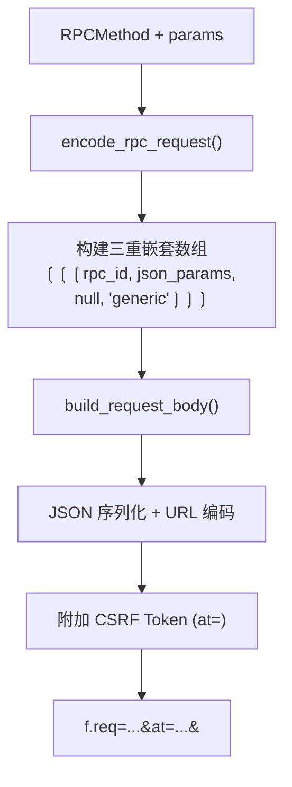
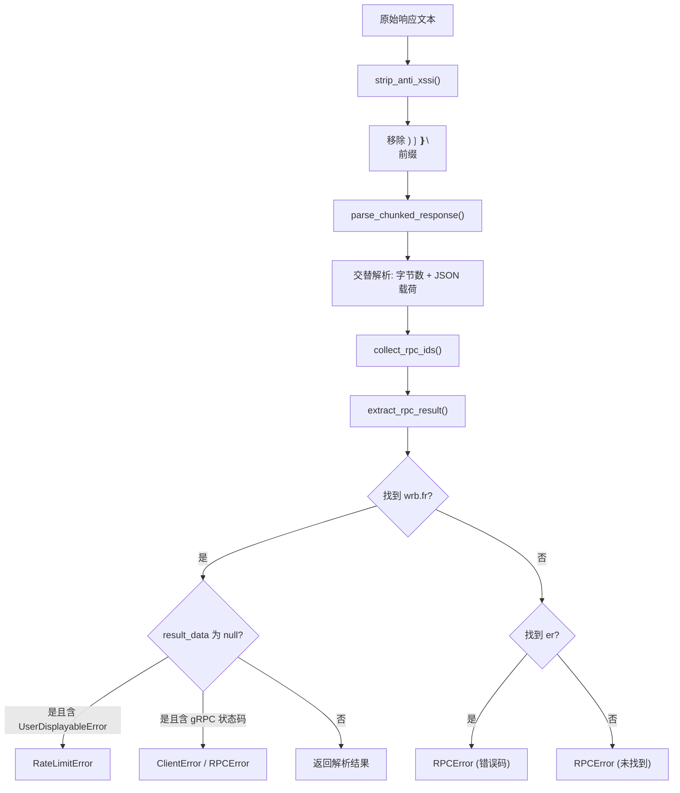
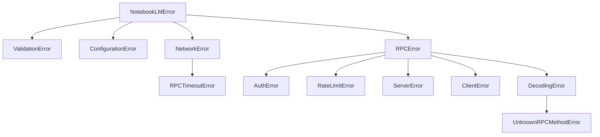

<details>
<summary>相关源文件</summary>

生成本页时使用的主要源文件：

- [src/notebooklm/rpc/__init__.py](https://github.com/teng-lin/notebooklm-py/blob/d6cef809dee4f03794e89bd089dd426b34a67345/src/notebooklm/rpc/__init__.py)
- [src/notebooklm/rpc/encoder.py](https://github.com/teng-lin/notebooklm-py/blob/d6cef809dee4f03794e89bd089dd426b34a67345/src/notebooklm/rpc/encoder.py)
- [src/notebooklm/rpc/decoder.py](https://github.com/teng-lin/notebooklm-py/blob/d6cef809dee4f03794e89bd089dd426b34a67345/src/notebooklm/rpc/decoder.py)
- [src/notebooklm/rpc/types.py](https://github.com/teng-lin/notebooklm-py/blob/d6cef809dee4f03794e89bd089dd426b34a67345/src/notebooklm/rpc/types.py)

</details>

# RPC 协议层

notebooklm-py 通过逆向工程 Google NotebookLM 的 batchexecute RPC 协议实现与后端的通信。该协议基于 HTTP POST，使用 Google 独有的请求编码格式和分块响应格式，所有 RPC 方法使用混淆后的短字符串标识。

## 协议端点

| 端点 | 用途 |
|------|------|
| `BATCHEXECUTE_URL` | 大部分 RPC 调用（CRUD 操作、制品生成等） |
| `QUERY_URL` | Chat 流式查询（GenerateFreeFormStreamed） |
| `UPLOAD_URL` | 文件上传 |

Sources: [src/notebooklm/rpc/types.py:5-7](../../../project-repos/notebooklm-py/src/notebooklm/rpc/types.py#L5-L7)

<details class="source-snippets">
<summary>引用源码</summary>

<!-- source-snippets:start -->

#### `src/notebooklm/rpc/types.py:5-7`

```python
# NotebookLM API endpoints
BATCHEXECUTE_URL = "https://notebooklm.google.com/_/LabsTailwindUi/data/batchexecute"
QUERY_URL = "https://notebooklm.google.com/_/LabsTailwindUi/data/google.internal.labs.tailwind.orchestration.v1.LabsTailwindOrchestrationService/GenerateFreeFormStreamed"
```

<!-- source-snippets:end -->
</details>
## 请求编码流程



### 编码细节

`encode_rpc_request()` 将 RPC 调用编码为 batchexecute 格式：

1. 参数列表 `params` 先 JSON 序列化为紧凑格式（无空格）
2. 构建内部数组 `[rpc_id, json_params, null, "generic"]`
3. 三重嵌套为 `[[inner]]`

`build_request_body()` 将编码后的请求转为 form-encoded body：

1. 将三重嵌套数组 JSON 序列化
2. URL 编码所有特殊字符（`safe=''`）
3. 附加 CSRF Token（`at=` 参数）
4. 末尾加 `&`

Sources: [src/notebooklm/rpc/encoder.py:11-104](../../../project-repos/notebooklm-py/src/notebooklm/rpc/encoder.py#L11-L104)

<details class="source-snippets">
<summary>引用源码</summary>

<!-- source-snippets:start -->

#### `src/notebooklm/rpc/encoder.py:11-104`

```python


def encode_rpc_request(method: RPCMethod, params: list[Any]) -> list:
    """
    Encode an RPC request into batchexecute format.

    The batchexecute API expects a triple-nested array structure:
    [[[rpc_id, json_params, null, "generic"]]]

    Args:
        method: The RPC method ID enum
        params: Parameters for the RPC call

    Returns:
        Triple-nested array structure for batchexecute
    """
    # JSON-encode params without spaces (compact format matching Chrome)
    params_json = json.dumps(params, separators=(",", ":"))
    logger.debug("Encoding RPC: method=%s, param_count=%d", method.value, len(params))

    # Build inner request: [rpc_id, json_params, null, "generic"]
    inner = [method.value, params_json, None, "generic"]

    # Triple-nest the request
    return [[inner]]


def build_request_body(
    rpc_request: list,
    csrf_token: str | None = None,
    session_id: str | None = None,
) -> str:
    """
    Build form-encoded request body for batchexecute.

    Args:
        rpc_request: Encoded RPC request from encode_rpc_request
        csrf_token: CSRF token (SNlM0e value) - optional but recommended
        session_id: Session ID (FdrFJe value) - optional

    Returns:
        Form-encoded body string with trailing &
    """
    # JSON-encode the request (compact, no spaces)
    f_req = json.dumps(rpc_request, separators=(",", ":"))

    # URL encode with safe='' to encode all special characters
    body_parts = [f"f.req={quote(f_req, safe='')}"]

    # Add CSRF token if provided
    if csrf_token:
        body_parts.append(f"at={quote(csrf_token, safe='')}")

    # Note: session_id is typically passed in URL query params, not body
    # but we support it here for flexibility

    # Join with & and add trailing &
    body = "&".join(body_parts) + "&"
    logger.debug("Built request body: size=%d bytes", len(body))
    return body


def build_url_params(
    rpc_method: RPCMethod,
    source_path: str = "/",
    session_id: str | None = None,
    bl: str | None = None,
) -> dict[str, str]:
    """
    Build URL query parameters for batchexecute request.

    Args:
        rpc_method: RPC method being called
        source_path: Source path context (e.g., /notebook/{id})
        session_id: Session ID (FdrFJe value)
        bl: Build label (changes periodically, optional)

    Returns:
        Dict of query parameters
    """
    params = {
        "rpcids": rpc_method.value,
        "source-path": source_path,
        "hl": "en",
        "rt": "c",  # Chunked response mode
    }

    if session_id:
        params["f.sid"] = session_id

    if bl:
        params["bl"] = bl

    return params
```

<!-- source-snippets:end -->
</details>
## 响应解码流程



### Anti-XSSI 剥离

Google API 在响应前添加 `)]}'` 前缀以防止 XSSI 攻击。`strip_anti_xssi()` 检测并移除该前缀及随后的换行符。

### 分块响应解析

batchexecute 使用 `rt=c`（chunked）模式返回数据，格式为交替的"字节数行"和"JSON 载荷行"。`parse_chunked_response()` 按此格式解析，跳过畸形块，当畸形率超过 10% 时抛出 `RPCError`。

### 结果提取

`extract_rpc_result()` 在解析后的块中查找目标 RPC ID：

- **`wrb.fr` 条目**：成功响应，`item[2]` 为结果数据
- **`er` 条目**：错误响应，`item[2]` 为错误码
- **null 结果**：检查 `item[5]` 是否包含 `UserDisplayableError`（限速）或 gRPC 状态码

Sources: [src/notebooklm/rpc/decoder.py:1-519](../../../project-repos/notebooklm-py/src/notebooklm/rpc/decoder.py#L1-L519)

<details class="source-snippets">
<summary>引用源码</summary>

<!-- source-snippets:start -->

#### `src/notebooklm/rpc/decoder.py:1-519`

```python
"""Decode RPC responses from NotebookLM batchexecute API."""

import json
import logging
import re
from enum import IntEnum
from typing import Any

# Import exceptions from centralized module
from ..exceptions import (
    AuthError,
    ClientError,
    NetworkError,
    RateLimitError,
    RPCError,
    RPCTimeoutError,
    ServerError,
)

# Re-export for backward compatibility (imports from notebooklm.rpc.decoder still work)
__all__ = [
    "RPCError",
    "AuthError",
    "NetworkError",
    "RPCTimeoutError",
    "RateLimitError",
    "ServerError",
    "ClientError",
    "RPCErrorCode",
    "get_error_message_for_code",
    "strip_anti_xssi",
    "parse_chunked_response",
    "collect_rpc_ids",
    "extract_rpc_result",
    "decode_response",
]

logger = logging.getLogger(__name__)


class RPCErrorCode(IntEnum):
    """Known RPC error codes from the batchexecute API.

    These codes are discovered through network traffic analysis and may not be
    exhaustive. Unknown codes will still be reported but without specific handling.
    """

    # Common error codes (discovered through testing)
    UNKNOWN = 0  # Generic/unspecified error
    INVALID_REQUEST = 400  # Malformed request
    UNAUTHORIZED = 401  # Authentication required
    FORBIDDEN = 403  # Insufficient permissions
    NOT_FOUND = 404  # Resource not found
    RATE_LIMITED = 429  # Too many requests
    SERVER_ERROR = 500  # Internal server error


# gRPC canonical status codes (google.rpc.Code) embedded by the batchexecute
# backend at index 5 of a `wrb.fr` response when the RPC returns null result
# data. The bare single-element form `[code]` is what issues #114 and #294
# observed on the wire.
_GRPC_STATUS_MESSAGES: dict[int, str] = {
    0: "OK",
    1: "Cancelled",
    2: "Unknown",
    3: "Invalid argument",
    4: "Deadline exceeded",
    5: "Not found",
    6: "Already exists",
    7: "Permission denied",
    8: "Resource exhausted",
    9: "Failed precondition",
    10: "Aborted",
    11: "Out of range",
    12: "Not implemented",
    13: "Internal",
    14: "Unavailable",
    15: "Data loss",
    16: "Unauthenticated",
}

# Hint appended to NOT_FOUND / PERMISSION_DENIED messages. Deliberately avoids
# the substrings checked by AUTH_ERROR_PATTERNS in _core.py so these errors
# don't incorrectly trigger the auth-refresh retry path.
_ACCOUNT_MISMATCH_HINT = (
    " If you have multiple Google accounts signed in, this is commonly an "
    "account-routing mismatch — the request defaults to account index 0 when "
    "no authuser is set. See issues #114 and #294 for context."
)


# Error code to human-readable message mapping
_ERROR_CODE_MESSAGES: dict[int, tuple[str, bool]] = {
    # (message, is_retryable)
    RPCErrorCode.INVALID_REQUEST: (
        "Invalid request parameters. Check your input and try again.",
        False,
    ),
    RPCErrorCode.UNAUTHORIZED: (
        "Authentication required. Run 'notebooklm login' to re-authenticate.",
        False,
    ),
    RPCErrorCode.FORBIDDEN: (
        "Insufficient permissions for this operation.",
        False,
    ),
    RPCErrorCode.NOT_FOUND: (
        "Requested resource not found.",
        False,
    ),
    RPCErrorCode.RATE_LIMITED: (
        "API rate limit exceeded. Please wait before retrying.",
        True,
    ),
    RPCErrorCode.SERVER_ERROR: (
        "Server error occurred. This is usually temporary - try again later.",
        True,
    ),
}

... snippet truncated ...
```

<!-- source-snippets:end -->
</details>
## RPC 方法标识

所有 RPC 方法使用混淆后的短字符串标识，通过 `RPCMethod` 枚举管理：

| 方法 | 标识 | 用途 |
|------|------|------|
| `LIST_NOTEBOOKS` | `wXbhsf` | 列出笔记本 |
| `CREATE_NOTEBOOK` | `CCqFvf` | 创建笔记本 |
| `GET_NOTEBOOK` | `rLM1Ne` | 获取笔记本详情 |
| `RENAME_NOTEBOOK` | `s0tc2d` | 重命名笔记本 |
| `DELETE_NOTEBOOK` | `WWINqb` | 删除笔记本 |
| `ADD_SOURCE` | `izAoDd` | 添加 Source |
| `ADD_SOURCE_FILE` | `o4cbdc` | 注册上传文件为 Source |
| `DELETE_SOURCE` | `tGMBJ` | 删除 Source |
| `CREATE_ARTIFACT` | `R7cb6c` | 生成制品 |
| `LIST_ARTIFACTS` | `gArtLc` | 列出制品 |
| `DELETE_ARTIFACT` | `V5N4be` | 删除制品 |
| `START_FAST_RESEARCH` | `Ljjv0c` | 快速研究 |
| `START_DEEP_RESEARCH` | `QA9ei` | 深度研究 |
| `GENERATE_MIND_MAP` | `yyryJe` | 生成思维导图 |
| `GET_SHARE_STATUS` | `JFMDGd` | 获取分享状态 |
| `GET_USER_SETTINGS` | `ZwVcOc` | 获取用户设置 |

> ⚠️ 这些标识符可能随 Google 后端更新而变化，是库不稳定性的主要来源。

Sources: [src/notebooklm/rpc/types.py:11-100](../../../project-repos/notebooklm-py/src/notebooklm/rpc/types.py#L11-L100)

<details class="source-snippets">
<summary>引用源码</summary>

<!-- source-snippets:start -->

#### `src/notebooklm/rpc/types.py:11-100`

```python
class RPCMethod(str, Enum):
    """RPC method IDs for NotebookLM operations.

    These are obfuscated method identifiers used by the batchexecute API.
    Reverse-engineered from network traffic analysis.
    """

    # Notebook operations
    LIST_NOTEBOOKS = "wXbhsf"
    CREATE_NOTEBOOK = "CCqFvf"
    GET_NOTEBOOK = "rLM1Ne"
    RENAME_NOTEBOOK = "s0tc2d"
    DELETE_NOTEBOOK = "WWINqb"

    # Source operations
    ADD_SOURCE = "izAoDd"
    ADD_SOURCE_FILE = "o4cbdc"  # Register uploaded file as source
    DELETE_SOURCE = "tGMBJ"
    GET_SOURCE = "hizoJc"
    REFRESH_SOURCE = "FLmJqe"
    CHECK_SOURCE_FRESHNESS = "yR9Yof"
    UPDATE_SOURCE = "b7Wfje"
    DISCOVER_SOURCES = "qXyaNe"

    # Summary and query
    SUMMARIZE = "VfAZjd"
    GET_SOURCE_GUIDE = "tr032e"
    GET_SUGGESTED_REPORTS = "ciyUvf"  # AI-suggested report formats

    # Query endpoint (not a batchexecute RPC ID)
    QUERY_ENDPOINT = "/_/LabsTailwindUi/data/google.internal.labs.tailwind.orchestration.v1.LabsTailwindOrchestrationService/GenerateFreeFormStreamed"

    # Artifact operations
    CREATE_ARTIFACT = "R7cb6c"  # Generate any artifact (audio, video, report, quiz, etc.)
    LIST_ARTIFACTS = "gArtLc"  # List all artifacts in a notebook
    DELETE_ARTIFACT = "V5N4be"
    RENAME_ARTIFACT = "rc3d8d"
    EXPORT_ARTIFACT = "Krh3pd"
    SHARE_ARTIFACT = "RGP97b"
    GET_INTERACTIVE_HTML = "v9rmvd"  # Fetch quiz/flashcard HTML content
    REVISE_SLIDE = "KmcKPe"  # Revise individual slide with prompt

    # Research
    START_FAST_RESEARCH = "Ljjv0c"
    START_DEEP_RESEARCH = "QA9ei"
    POLL_RESEARCH = "e3bVqc"
    IMPORT_RESEARCH = "LBwxtb"

    # Note and mind map operations
    GENERATE_MIND_MAP = "yyryJe"  # Generate mind map from sources
    CREATE_NOTE = "CYK0Xb"
    GET_NOTES_AND_MIND_MAPS = "cFji9"  # Returns both notes and mind maps
    UPDATE_NOTE = "cYAfTb"
    DELETE_NOTE = "AH0mwd"

    # Conversation
    GET_LAST_CONVERSATION_ID = "hPTbtc"  # Returns only the most recent conversation ID
    GET_CONVERSATION_TURNS = "khqZz"  # Returns full Q&A turns for a conversation

    # Sharing operations (notebook-level)
    SHARE_NOTEBOOK = "QDyure"  # Set notebook visibility (restricted/anyone with link)
    GET_SHARE_STATUS = "JFMDGd"  # Get notebook share settings
    # Note: SET_SHARE_ACCESS uses RENAME_NOTEBOOK (s0tc2d) with different params

    # Additional notebook operations
    REMOVE_RECENTLY_VIEWED = "fejl7e"

    # User settings
    GET_USER_SETTINGS = "ZwVcOc"  # Get user settings including output language
    SET_USER_SETTINGS = "hT54vc"  # Set user settings (e.g., output language)


class ArtifactTypeCode(int, Enum):
    """Integer codes for artifact types used in RPC calls.

    These are the raw codes used in the CREATE_ARTIFACT (R7cb6c) RPC call.
    Values correspond to artifact_data[2] in API responses.

    Note: This is an internal enum. Users should use ArtifactType (str enum)
    from notebooklm.types for a cleaner API.
    """

    AUDIO = 1
    REPORT = (
        2  # Includes: Briefing Doc, Study Guide, Blog Post, White Paper, Research Proposal, etc.
    )
    VIDEO = 3
    QUIZ = 4  # Also used for flashcards
    QUIZ_FLASHCARD = 4  # Alias for backward compatibility
    MIND_MAP = 5
```

<!-- source-snippets:end -->
</details>
## 错误处理层级



解码器将 HTTP 状态码和 RPC 错误码映射到对应的异常类型：

| HTTP 状态码 | 异常 |
|-------------|------|
| 429 | `RateLimitError` |
| 5xx | `ServerError` |
| 4xx（非 401/403） | `ClientError` |
| 401/403 | `RPCError`（触发认证刷新） |
| 连接超时 | `NetworkError` |
| 请求超时 | `RPCTimeoutError` |

Sources: [src/notebooklm/rpc/decoder.py:230-350](../../../project-repos/notebooklm-py/src/notebooklm/rpc/decoder.py#L230-L350), [src/notebooklm/exceptions.py](../../../project-repos/notebooklm-py/src/notebooklm/exceptions.py)

<details class="source-snippets">
<summary>引用源码</summary>

<!-- source-snippets:start -->

#### `src/notebooklm/rpc/decoder.py:230-350`

```python
                chunks.append(chunk)
            except json.JSONDecodeError as e:
                # Skip non-JSON lines but warn
                skipped_count += 1
                logger.warning(
                    "Skipping non-JSON line at %d: %s. Preview: %s",
                    i + 1,
                    e,
                    line[:100],
                )
            i += 1

    # Fail if error rate is too high (indicates API problems)
    if skipped_count > 0:
        error_rate = skipped_count / len(lines) if lines else 0
        if error_rate > 0.1:  # More than 10% malformed
            raise RPCError(
                f"Response parsing failed: {skipped_count} of {len(lines)} chunks malformed. "
                f"This may indicate API changes or data corruption.",
                raw_response=response[:500],
            )
        # Non-critical but warn user results may be incomplete
        logger.warning(
            "Parsed response but skipped %d malformed chunks (%d%%). Results may be incomplete.",
            skipped_count,
            int(error_rate * 100),
        )

    return chunks


def collect_rpc_ids(chunks: list[Any]) -> list[str]:
    """Collect all RPC IDs found in response chunks.

    Collects IDs from both successful (wrb.fr) and error (er) responses.
    Useful for debugging when expected RPC ID is not found.

    Args:
        chunks: Parsed response chunks from parse_chunked_response().

    Returns:
        List of RPC method IDs found in the response.
    """
    found_ids = []
    for chunk in chunks:
        if not isinstance(chunk, list):
            continue

        items = chunk if (chunk and isinstance(chunk[0], list)) else [chunk]

        for item in items:
            if not isinstance(item, list) or len(item) < 2:
                continue

            if item[0] in ("wrb.fr", "er") and isinstance(item[1], str):
                found_ids.append(item[1])

    return found_ids


def _extract_status_code(error_info: Any) -> tuple[int, str] | None:
    """Extract a bare status code from a wrb.fr error_info block.

    Returns ``(code, label)`` only for the bare single-element form ``[code]``
    in the gRPC canonical range (0-16). Longer structures (e.g. the
    ``[8, None, [[UserDisplayableError, ...]]]`` rate-limit shape) are handled
    by the UserDisplayableError path and fall through here by returning
    ``None``.

    Note: we do not claim these codes are unambiguously gRPC — REMOVE_RECENTLY_VIEWED
    returns ``[13]`` on what the client treats as a successful no-op (see
    tests/cassettes/notebooks_remove_from_recent.yaml). Callers must respect
    ``allow_null`` semantics before treating the code as an error.

    Args:
        error_info: Value at index 5 of a ``wrb.fr`` response item.

    Returns:
        ``(code, label)`` tuple for a recognized bare status, else ``None``.
    """
    if not isinstance(error_info, list) or len(error_info) != 1:
        return None
    code = error_info[0]
    # type(code) is int (not isinstance) — bool is a subclass of int, so
    # isinstance(True, int) is True and would accept [true] as code 1.
    # Gate on _GRPC_STATUS_MESSAGES membership so this auto-tracks the table.
    if type(code) is not int or code not in _GRPC_STATUS_MESSAGES:
        return None
    return code, _GRPC_STATUS_MESSAGES[code]


def _find_wrb_status(chunks: list[Any], rpc_id: str) -> tuple[int, str] | None:
    """Locate bare status code at index 5 of a wrb.fr entry for ``rpc_id``.

    Used by ``decode_response`` to enrich the null-result error message when
    the server explicitly flagged the RPC with a status code.
    """
    for chunk in chunks:
        if not isinstance(chunk, list):
            continue
        items = chunk if (chunk and isinstance(chunk[0], list)) else [chunk]
        for item in items:
            if not isinstance(item, list) or len(item) < 6:
                continue
            if item[0] != "wrb.fr" or item[1] != rpc_id:
                continue
            if item[2] is not None or item[5] is None:
                continue
            status = _extract_status_code(item[5])
            if status is not None:
                return status
    return None


def _contains_user_displayable_error(obj: Any) -> bool:
    """Check if object contains a UserDisplayableError marker.

    Google's API embeds error information in index 5 of wrb.fr responses
    when the operation fails due to rate limiting, quota, or other
    user-facing restrictions.
... snippet truncated ...
```

#### `src/notebooklm/exceptions.py`

```python
"""Exceptions for notebooklm-py.

All library exceptions inherit from NotebookLMError, allowing users to catch
all library errors with a single except clause.

Stability: NotebookLMError and its direct subclasses are part of the public API.

Example:
    try:
        await client.notebooks.list()
    except NotebookLMError as e:
        handle_error(e)
"""

from __future__ import annotations

__all__ = [
    # Base
    "NotebookLMError",
    # Validation/Config
    "ValidationError",
    "ConfigurationError",
    # Network (NOT under RPC - happens before RPC)
    "NetworkError",
    # RPC Protocol
    "RPCError",
    "DecodingError",
    "UnknownRPCMethodError",
    "AuthError",
    "RateLimitError",
    "ServerError",
    "ClientError",
    "RPCTimeoutError",
    # Domain: Notebooks
    "NotebookError",
    "NotebookNotFoundError",
    # Domain: Chat
    "ChatError",
    # Domain: Sources
    "SourceError",
    "SourceAddError",
    "SourceNotFoundError",
    "SourceProcessingError",
    "SourceTimeoutError",
    # Domain: Artifacts
    "ArtifactError",
    "ArtifactNotFoundError",
    "ArtifactNotReadyError",
    "ArtifactParseError",
    "ArtifactDownloadError",
]


# =============================================================================
# Base Exception
# =============================================================================


class NotebookLMError(Exception):
    """Base exception for all notebooklm-py errors.

    Users can catch all library errors with:
        try:
            await client.notebooks.list()
        except NotebookLMError as e:
            handle_error(e)
    """


# =============================================================================
# Validation/Configuration
# =============================================================================


class ValidationError(NotebookLMError):
    """Invalid user input or parameters."""


class ConfigurationError(NotebookLMError):
    """Missing or invalid configuration (auth, storage)."""


# =============================================================================
# Network (NOT under RPC - happens before RPC processing)
# =============================================================================


class NetworkError(NotebookLMError):
    """Connection failures, DNS errors, timeouts before RPC.

    Users may want to retry on NetworkError but not on RPCError.

    Attributes:
        method_id: The RPC method ID that failed (if known).
        original_error: The underlying network exception.
    """

    def __init__(
        self,
        message: str,
        *,
        method_id: str | None = None,
        original_error: Exception | None = None,
    ):
        super().__init__(message)
        self.method_id = method_id
        self.original_error = original_error


# =============================================================================
# RPC Protocol
# =============================================================================


class RPCError(NotebookLMError):
    """Base for RPC-specific failures after connection established.

    Attributes:
        method_id: The RPC method ID (e.g., "abc123") for debugging.
        raw_response: First 500 chars of raw response for debugging.
```

<!-- source-snippets:end -->
</details>
## 相关页面

- [系统架构](system-architecture.md)
- [认证与安全](auth-and-security.md)
- [客户端 API](client-api.md)
