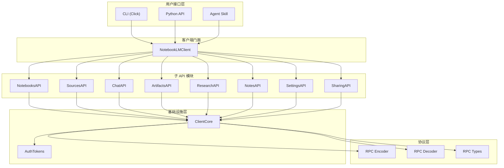
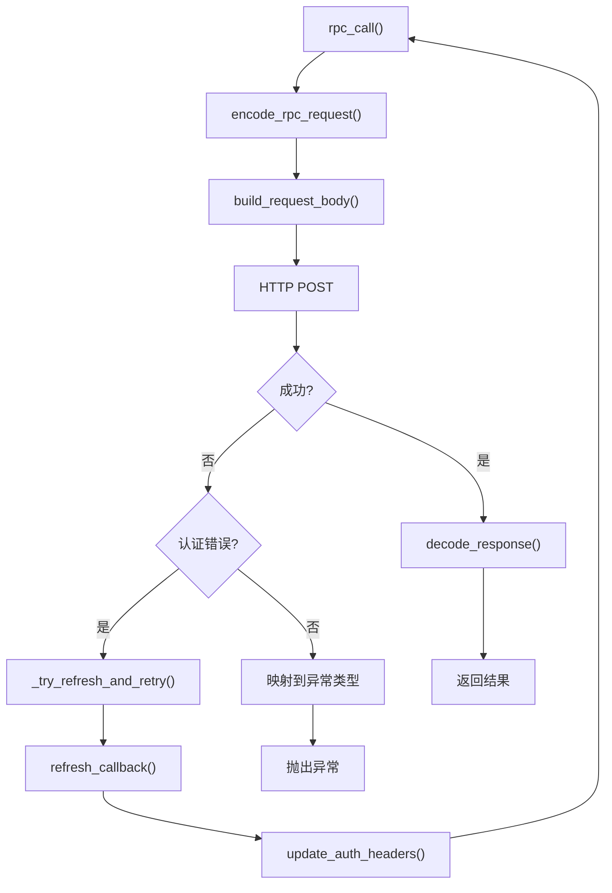
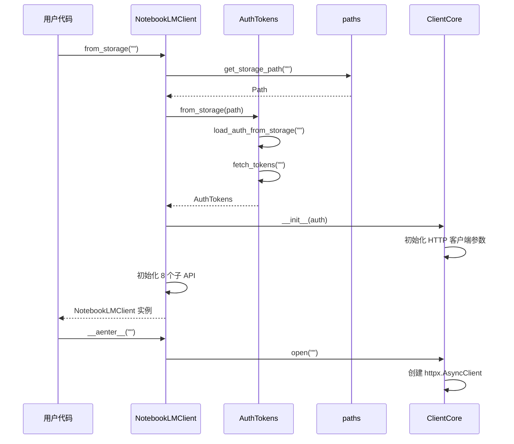

<details>
<summary>相关源文件</summary>

生成本页时使用的主要源文件：

- [src/notebooklm/client.py](../../../project-repos/notebooklm-py/src/notebooklm/client.py)
- [src/notebooklm/_core.py](../../../project-repos/notebooklm-py/src/notebooklm/_core.py)
- [src/notebooklm/__init__.py](../../../project-repos/notebooklm-py/src/notebooklm/__init__.py)
- [pyproject.toml](../../../project-repos/notebooklm-py/pyproject.toml)

</details>

# 系统架构

notebooklm-py 采用分层架构，从底到顶依次为：RPC 协议层 → ClientCore 基础设施 → 子 API 模块 → NotebookLMClient 门面 → CLI/Agent 接口。每一层职责明确，依赖方向严格自上而下。

## 顶层架构



上图展示了从用户接口到 RPC 协议的完整调用链。`NotebookLMClient` 是唯一的公共入口，内部持有 `ClientCore` 实例和八个命名空间子 API。

Sources: [src/notebooklm/client.py](../../../project-repos/notebooklm-py/src/notebooklm/client.py), [src/notebooklm/_core.py](../../../project-repos/notebooklm-py/src/notebooklm/_core.py)

<details class="source-snippets">
<summary>引用源码</summary>

<!-- source-snippets:start -->

#### `src/notebooklm/client.py`

```python
"""NotebookLM API Client - Main entry point.

This module provides the NotebookLMClient class, a modern async client
for interacting with Google NotebookLM using undocumented RPC APIs.

Example:
    async with NotebookLMClient.from_storage() as client:
        # List notebooks
        notebooks = await client.notebooks.list()

        # Add sources
        source = await client.sources.add_url(notebook_id, "https://example.com")

        # Generate artifacts
        status = await client.artifacts.generate_audio(notebook_id)
        await client.artifacts.wait_for_completion(notebook_id, status.task_id)

        # Chat with the notebook
        result = await client.chat.ask(notebook_id, "What is this about?")
"""

import logging
import re
from pathlib import Path

from ._artifacts import ArtifactsAPI
from ._chat import ChatAPI
from ._core import DEFAULT_TIMEOUT, ClientCore
from ._notebooks import NotebooksAPI
from ._notes import NotesAPI
from ._research import ResearchAPI
from ._settings import SettingsAPI
from ._sharing import SharingAPI
from ._sources import SourcesAPI
from ._url_utils import is_google_auth_redirect
from .auth import AuthTokens

logger = logging.getLogger(__name__)


class NotebookLMClient:
    """Async client for NotebookLM API.

    Provides access to NotebookLM functionality through namespaced sub-clients:
    - notebooks: Create, list, delete, rename notebooks
    - sources: Add, list, delete sources (URLs, text, files, YouTube, Drive)
    - artifacts: Generate and manage AI content (audio, video, reports, etc.)
    - chat: Ask questions and manage conversations
    - research: Start research sessions and import sources
    - notes: Create and manage user notes
    - settings: Manage user settings (output language, etc.)
    - sharing: Manage notebook sharing and permissions

    Usage:
        # Create from saved authentication
        async with NotebookLMClient.from_storage() as client:
            notebooks = await client.notebooks.list()

        # Create from AuthTokens directly
        auth = AuthTokens(cookies, csrf_token, session_id)
        async with NotebookLMClient(auth) as client:
            notebooks = await client.notebooks.list()

    Attributes:
        notebooks: NotebooksAPI for notebook operations
        sources: SourcesAPI for source management
        artifacts: ArtifactsAPI for AI-generated content
        chat: ChatAPI for conversations
        research: ResearchAPI for web/drive research
        notes: NotesAPI for user notes
        settings: SettingsAPI for user settings
        sharing: SharingAPI for notebook sharing
        auth: The AuthTokens used for authentication
    """

    def __init__(
        self,
        auth: AuthTokens,
        timeout: float = DEFAULT_TIMEOUT,
        storage_path: Path | None = None,
    ):
        """Initialize the NotebookLM client.

        Args:
            auth: Authentication tokens from browser login.
            timeout: HTTP request timeout in seconds. Defaults to 30 seconds.
            storage_path: Path to the storage state file for loading download cookies.
        """
        # Pass refresh_auth as callback for automatic retry on auth failures
        # Note: refresh_auth calls update_auth_headers internally
        self._core = ClientCore(auth, timeout=timeout, refresh_callback=self.refresh_auth)

        # Initialize sub-client APIs
        # Note: notes must be initialized before artifacts (artifacts uses notes API)
        self.notebooks = NotebooksAPI(self._core)
        self.sources = SourcesAPI(self._core)
        self.notes = NotesAPI(self._core)
        self.artifacts = ArtifactsAPI(self._core, notes_api=self.notes, storage_path=storage_path)
        self.chat = ChatAPI(self._core)
        self.research = ResearchAPI(self._core)
        self.settings = SettingsAPI(self._core)
        self.sharing = SharingAPI(self._core)

    @property
    def auth(self) -> AuthTokens:
        """Get the authentication tokens."""
        return self._core.auth

    async def __aenter__(self) -> "NotebookLMClient":
        """Open the client connection."""
        logger.debug("Opening NotebookLM client")
        await self._core.open()
        return self

    async def __aexit__(self, exc_type, exc_val, exc_tb):
        """Close the client connection."""
        logger.debug("Closing NotebookLM client")
        await self._core.close()

    @property
```

#### `src/notebooklm/_core.py`

```python
"""Core infrastructure for NotebookLM API client."""

import asyncio
import logging
import time
from collections import OrderedDict
from collections.abc import Awaitable, Callable, Coroutine
from typing import Any, cast
from urllib.parse import urlencode

import httpx

from .auth import AuthTokens
from .rpc import (
    BATCHEXECUTE_URL,
    AuthError,
    ClientError,
    NetworkError,
    RateLimitError,
    RPCError,
    RPCMethod,
    RPCTimeoutError,
    ServerError,
    build_request_body,
    decode_response,
    encode_rpc_request,
)

logger = logging.getLogger(__name__)

# Maximum number of conversations to cache (FIFO eviction)
MAX_CONVERSATION_CACHE_SIZE = 100

# Default HTTP timeouts in seconds
DEFAULT_TIMEOUT = 30.0
DEFAULT_CONNECT_TIMEOUT = 10.0  # Connection establishment timeout

# Auth error detection patterns (case-insensitive)
AUTH_ERROR_PATTERNS = (
    "authentication",
    "expired",
    "unauthorized",
    "login",
    "re-authenticate",
)


def is_auth_error(error: Exception) -> bool:
    """Check if an exception indicates an authentication failure.

    Args:
        error: The exception to check.

    Returns:
        True if the error is likely due to authentication issues.
    """
    # AuthError is always an auth error
    if isinstance(error, AuthError):
        return True

    # Don't treat network/rate limit/server errors as auth errors
    # even if they're subclasses of RPCError
    if isinstance(
        error,
        NetworkError | RPCTimeoutError | RateLimitError | ServerError | ClientError,
    ):
        return False

    # HTTP 401/403 are auth errors
    if isinstance(error, httpx.HTTPStatusError):
        return error.response.status_code in (401, 403)

    # RPCError with auth-related message
    if isinstance(error, RPCError):
        message = str(error).lower()
        return any(pattern in message for pattern in AUTH_ERROR_PATTERNS)

    return False


class ClientCore:
    """Core client infrastructure for HTTP and RPC operations.

    Handles:
    - HTTP client lifecycle (open/close)
    - RPC call encoding/decoding
    - Authentication headers
    - Conversation cache

    This class is used internally by the sub-client APIs (NotebooksAPI,
    ArtifactsAPI, etc.) and should not be used directly.
    """

    def __init__(
        self,
        auth: AuthTokens,
        timeout: float = DEFAULT_TIMEOUT,
        connect_timeout: float = DEFAULT_CONNECT_TIMEOUT,
        refresh_callback: Callable[[], Awaitable[AuthTokens]] | None = None,
        refresh_retry_delay: float = 0.2,
    ):
        """Initialize the core client.

        Args:
            auth: Authentication tokens from browser login.
            timeout: HTTP request timeout in seconds. Defaults to 30 seconds.
                This applies to read/write operations after connection is established.
            connect_timeout: Connection establishment timeout in seconds. Defaults to 10 seconds.
                A shorter connect timeout helps detect network issues faster.
            refresh_callback: Optional async callback to refresh auth tokens on failure.
                If provided, rpc_call will automatically retry once after refreshing.
            refresh_retry_delay: Delay in seconds before retrying after refresh.
        """
        self.auth = auth
        self._timeout = timeout
        self._connect_timeout = connect_timeout
        self._refresh_callback = refresh_callback
        self._refresh_retry_delay = refresh_retry_delay
        self._refresh_lock: asyncio.Lock | None = asyncio.Lock() if refresh_callback else None
        self._refresh_task: asyncio.Task[AuthTokens] | None = None
```

<!-- source-snippets:end -->
</details>

## ClientCore 基础设施

`ClientCore` 是所有子 API 的共享基础设施，职责包括：

1. **HTTP 客户端生命周期**：通过 `httpx.AsyncClient` 管理连接的打开与关闭
2. **RPC 调用编排**：`rpc_call()` 方法统一处理编码 → 发送 → 解码 → 错误映射
3. **认证自动刷新**：检测到认证失败时，通过 `refresh_callback` 自动刷新 Token 并重试一次
4. **会话缓存**：`OrderedDict` 实现的 FIFO 对话缓存，上限 100 条



Sources: [src/notebooklm/_core.py:153-310](../../../project-repos/notebooklm-py/src/notebooklm/_core.py#L153-L310)

<details class="source-snippets">
<summary>引用源码</summary>

<!-- source-snippets:start -->

#### `src/notebooklm/_core.py:153-310`

```python
        """
        if self._http_client:
            await self._http_client.aclose()
            self._http_client = None

    @property
    def is_open(self) -> bool:
        """Check if the HTTP client is open."""
        return self._http_client is not None

    def update_auth_headers(self) -> None:
        """Update HTTP client headers with current auth tokens.

        Call this after modifying auth tokens (e.g., after refresh_auth())
        to ensure the HTTP client uses the updated credentials.

        Raises:
            RuntimeError: If client is not initialized.
        """
        if not self._http_client:
            raise RuntimeError("Client not initialized. Use 'async with' context.")
        self._http_client.headers["Cookie"] = self.auth.cookie_header

    def _build_url(self, rpc_method: RPCMethod, source_path: str = "/") -> str:
        """Build the batchexecute URL for an RPC call.

        Args:
            rpc_method: The RPC method to call.
            source_path: The source path parameter (usually notebook path).

        Returns:
            Full URL with query parameters.
        """
        params = {
            "rpcids": rpc_method.value,
            "source-path": source_path,
            "f.sid": self.auth.session_id,
            "rt": "c",
        }
        return f"{BATCHEXECUTE_URL}?{urlencode(params)}"

    async def rpc_call(
        self,
        method: RPCMethod,
        params: list[Any],
        source_path: str = "/",
        allow_null: bool = False,
        _is_retry: bool = False,
    ) -> Any:
        """Make an RPC call to the NotebookLM API.

        Automatically refreshes authentication tokens and retries once if an
        auth failure is detected and a refresh_callback was provided.

        Args:
            method: The RPC method to call.
            params: Parameters for the RPC call (nested list structure).
            source_path: The source path parameter (usually /notebook/{id}).
            allow_null: If True, don't raise error when response is null.
            _is_retry: Internal flag to prevent infinite retries.

        Returns:
            Decoded response data.

        Raises:
            RuntimeError: If client is not initialized (not in context manager).
            httpx.HTTPStatusError: If HTTP request fails.
            RPCError: If RPC call fails or returns unexpected data.
        """
        if not self._http_client:
            raise RuntimeError("Client not initialized. Use 'async with' context.")

        start = time.perf_counter()
        logger.debug("RPC %s starting", method.name)

        url = self._build_url(method, source_path)
        rpc_request = encode_rpc_request(method, params)
        body = build_request_body(rpc_request, self.auth.csrf_token)

        try:
            response = await self._http_client.post(url, content=body)
            response.raise_for_status()
        except (httpx.HTTPStatusError, httpx.RequestError) as e:
            elapsed = time.perf_counter() - start

            # Check if this is an auth error and we can retry
            if not _is_retry and self._refresh_callback and is_auth_error(e):
                refreshed = await self._try_refresh_and_retry(
                    method, params, source_path, allow_null, e
                )
                if refreshed is not None:
                    return refreshed

            if isinstance(e, httpx.HTTPStatusError):
                status = e.response.status_code
                logger.error(
                    "RPC %s failed after %.3fs: HTTP %s",
                    method.name,
                    elapsed,
                    status,
                )

                # Map HTTP status codes to appropriate exception types
                if status == 429:
                    # Rate limiting - extract retry-after if available
                    retry_after = None
                    retry_after_header = e.response.headers.get("retry-after")
                    if retry_after_header:
                        try:
                            retry_after = int(retry_after_header)
                        except ValueError:
                            pass
                    msg = f"API rate limit exceeded calling {method.name}"
                    if retry_after:
                        msg += f". Retry after {retry_after} seconds"
                    raise RateLimitError(
                        msg, method_id=method.value, retry_after=retry_after
                    ) from e

                if 500 <= status < 600:
... snippet truncated ...
```

<!-- source-snippets:end -->
</details>

## 依赖方向与模块边界

| 层级 | 模块 | 依赖 |
|------|------|------|
| 协议层 | `rpc/` | 无内部依赖 |
| 基础设施 | `_core.py`, `auth.py`, `paths.py` | `rpc/` |
| 子 API | `_notebooks.py`, `_sources.py` 等 | `_core.py` |
| 门面 | `client.py` | 所有子 API + `_core.py` |
| CLI | `cli/` | `client.py` + `types.py` |
| 公共导出 | `__init__.py` | `client.py`, `types.py`, `exceptions.py` |

关键设计原则：

- **内部模块用 `_` 前缀**：`_sources.py`、`_artifacts.py` 等为内部实现，公共 API 通过 `NotebookLMClient` 的命名空间属性暴露
- **异常集中定义**：所有异常类在 `exceptions.py` 中定义，`rpc/decoder.py` 和 `types.py` 从中导入
- **类型与协议分离**：用户可见的数据类在 `types.py`，RPC 内部枚举在 `rpc/types.py`

Sources: [src/notebooklm/__init__.py](../../../project-repos/notebooklm-py/src/notebooklm/__init__.py), [src/notebooklm/client.py](../../../project-repos/notebooklm-py/src/notebooklm/client.py)

<details class="source-snippets">
<summary>引用源码</summary>

<!-- source-snippets:start -->

#### `src/notebooklm/__init__.py`

```python
"""NotebookLM Automation - RPC-based automation for Google NotebookLM.

Example usage:
    from notebooklm import NotebookLMClient

    async with NotebookLMClient.from_storage() as client:
        notebooks = await client.notebooks.list()
        await client.sources.add_url(notebook_id, "https://example.com")
        result = await client.chat.ask(notebook_id, "What is this about?")

Note:
    This library uses undocumented Google APIs that can change without notice.
    See docs/troubleshooting.md for guidance on handling API changes.
"""

# Runtime Python version guard (must run before any PEP 604 syntax is evaluated)
from ._version_check import check_python_version as _check_python_version  # noqa: E402

_check_python_version()
del _check_python_version

# Configure logging (must run before other imports that create loggers)
from ._logging import configure_logging

configure_logging()

# Version sourced from pyproject.toml via importlib.metadata
import logging
from importlib.metadata import PackageNotFoundError, version

_logger = logging.getLogger(__name__)

try:
    __version__ = version("notebooklm-py")
except PackageNotFoundError:
    __version__ = "0.0.0.dev0"  # Fallback when package is not installed
    _logger.debug(
        "Package 'notebooklm-py' not found in metadata. "
        "Using fallback version '%s'. This is normal during development.",
        __version__,
    )

# Public API: Authentication
from .auth import AuthTokens

# Public API: Client
from .client import NotebookLMClient

# Public API: Exceptions (centralized in exceptions.py)
from .exceptions import (
    # Domain: Artifacts
    ArtifactDownloadError,
    ArtifactError,
    ArtifactNotFoundError,
    ArtifactNotReadyError,
    ArtifactParseError,
    # RPC Protocol
    AuthError,
    # Domain: Chat
    ChatError,
    ClientError,
    # Validation/Config
    ConfigurationError,
    DecodingError,
    # Network
    NetworkError,
    # Domain: Notebooks
    NotebookError,
    # Base
    NotebookLMError,
    NotebookNotFoundError,
    RateLimitError,
    RPCError,
    RPCTimeoutError,
    ServerError,
    # Domain: Sources
    SourceAddError,
    SourceError,
    SourceNotFoundError,
    SourceProcessingError,
    SourceTimeoutError,
    UnknownRPCMethodError,
    ValidationError,
)

# Public API: Types and dataclasses
from .types import (
    Artifact,
    ArtifactType,
    AskResult,
    AudioFormat,
    AudioLength,
    ChatGoal,
    ChatMode,
    ChatReference,
    ChatResponseLength,
    ConversationTurn,
    DriveMimeType,
    ExportType,
    GenerationStatus,
    InfographicDetail,
    InfographicOrientation,
    InfographicStyle,
    Note,
    Notebook,
    NotebookDescription,
    NotebookMetadata,
    QuizDifficulty,
    QuizQuantity,
    ReportFormat,
    ReportSuggestion,
    ShareAccess,
    SharedUser,
    SharePermission,
    ShareStatus,
    ShareViewLevel,
    SlideDeckFormat,
    SlideDeckLength,
    Source,
    SourceFulltext,
```

#### `src/notebooklm/client.py`

```python
"""NotebookLM API Client - Main entry point.

This module provides the NotebookLMClient class, a modern async client
for interacting with Google NotebookLM using undocumented RPC APIs.

Example:
    async with NotebookLMClient.from_storage() as client:
        # List notebooks
        notebooks = await client.notebooks.list()

        # Add sources
        source = await client.sources.add_url(notebook_id, "https://example.com")

        # Generate artifacts
        status = await client.artifacts.generate_audio(notebook_id)
        await client.artifacts.wait_for_completion(notebook_id, status.task_id)

        # Chat with the notebook
        result = await client.chat.ask(notebook_id, "What is this about?")
"""

import logging
import re
from pathlib import Path

from ._artifacts import ArtifactsAPI
from ._chat import ChatAPI
from ._core import DEFAULT_TIMEOUT, ClientCore
from ._notebooks import NotebooksAPI
from ._notes import NotesAPI
from ._research import ResearchAPI
from ._settings import SettingsAPI
from ._sharing import SharingAPI
from ._sources import SourcesAPI
from ._url_utils import is_google_auth_redirect
from .auth import AuthTokens

logger = logging.getLogger(__name__)


class NotebookLMClient:
    """Async client for NotebookLM API.

    Provides access to NotebookLM functionality through namespaced sub-clients:
    - notebooks: Create, list, delete, rename notebooks
    - sources: Add, list, delete sources (URLs, text, files, YouTube, Drive)
    - artifacts: Generate and manage AI content (audio, video, reports, etc.)
    - chat: Ask questions and manage conversations
    - research: Start research sessions and import sources
    - notes: Create and manage user notes
    - settings: Manage user settings (output language, etc.)
    - sharing: Manage notebook sharing and permissions

    Usage:
        # Create from saved authentication
        async with NotebookLMClient.from_storage() as client:
            notebooks = await client.notebooks.list()

        # Create from AuthTokens directly
        auth = AuthTokens(cookies, csrf_token, session_id)
        async with NotebookLMClient(auth) as client:
            notebooks = await client.notebooks.list()

    Attributes:
        notebooks: NotebooksAPI for notebook operations
        sources: SourcesAPI for source management
        artifacts: ArtifactsAPI for AI-generated content
        chat: ChatAPI for conversations
        research: ResearchAPI for web/drive research
        notes: NotesAPI for user notes
        settings: SettingsAPI for user settings
        sharing: SharingAPI for notebook sharing
        auth: The AuthTokens used for authentication
    """

    def __init__(
        self,
        auth: AuthTokens,
        timeout: float = DEFAULT_TIMEOUT,
        storage_path: Path | None = None,
    ):
        """Initialize the NotebookLM client.

        Args:
            auth: Authentication tokens from browser login.
            timeout: HTTP request timeout in seconds. Defaults to 30 seconds.
            storage_path: Path to the storage state file for loading download cookies.
        """
        # Pass refresh_auth as callback for automatic retry on auth failures
        # Note: refresh_auth calls update_auth_headers internally
        self._core = ClientCore(auth, timeout=timeout, refresh_callback=self.refresh_auth)

        # Initialize sub-client APIs
        # Note: notes must be initialized before artifacts (artifacts uses notes API)
        self.notebooks = NotebooksAPI(self._core)
        self.sources = SourcesAPI(self._core)
        self.notes = NotesAPI(self._core)
        self.artifacts = ArtifactsAPI(self._core, notes_api=self.notes, storage_path=storage_path)
        self.chat = ChatAPI(self._core)
        self.research = ResearchAPI(self._core)
        self.settings = SettingsAPI(self._core)
        self.sharing = SharingAPI(self._core)

    @property
    def auth(self) -> AuthTokens:
        """Get the authentication tokens."""
        return self._core.auth

    async def __aenter__(self) -> "NotebookLMClient":
        """Open the client connection."""
        logger.debug("Opening NotebookLM client")
        await self._core.open()
        return self

    async def __aexit__(self, exc_type, exc_val, exc_tb):
        """Close the client connection."""
        logger.debug("Closing NotebookLM client")
        await self._core.close()

    @property
```

<!-- source-snippets:end -->
</details>

## NotebookLMClient 初始化流程



`from_storage()` 是推荐的客户端创建方式，自动完成 Cookie 加载 → Token 提取 → 客户端初始化的全流程。也支持直接传入 `AuthTokens` 对象创建。

Sources: [src/notebooklm/client.py:82-165](../../../project-repos/notebooklm-py/src/notebooklm/client.py#L82-L165)

<details class="source-snippets">
<summary>引用源码</summary>

<!-- source-snippets:start -->

#### `src/notebooklm/client.py:82-165`

```python
        """Initialize the NotebookLM client.

        Args:
            auth: Authentication tokens from browser login.
            timeout: HTTP request timeout in seconds. Defaults to 30 seconds.
            storage_path: Path to the storage state file for loading download cookies.
        """
        # Pass refresh_auth as callback for automatic retry on auth failures
        # Note: refresh_auth calls update_auth_headers internally
        self._core = ClientCore(auth, timeout=timeout, refresh_callback=self.refresh_auth)

        # Initialize sub-client APIs
        # Note: notes must be initialized before artifacts (artifacts uses notes API)
        self.notebooks = NotebooksAPI(self._core)
        self.sources = SourcesAPI(self._core)
        self.notes = NotesAPI(self._core)
        self.artifacts = ArtifactsAPI(self._core, notes_api=self.notes, storage_path=storage_path)
        self.chat = ChatAPI(self._core)
        self.research = ResearchAPI(self._core)
        self.settings = SettingsAPI(self._core)
        self.sharing = SharingAPI(self._core)

    @property
    def auth(self) -> AuthTokens:
        """Get the authentication tokens."""
        return self._core.auth

    async def __aenter__(self) -> "NotebookLMClient":
        """Open the client connection."""
        logger.debug("Opening NotebookLM client")
        await self._core.open()
        return self

    async def __aexit__(self, exc_type, exc_val, exc_tb):
        """Close the client connection."""
        logger.debug("Closing NotebookLM client")
        await self._core.close()

    @property
    def is_connected(self) -> bool:
        """Check if the client is connected."""
        return self._core.is_open

    @classmethod
    async def from_storage(
        cls,
        path: str | None = None,
        timeout: float = DEFAULT_TIMEOUT,
        profile: str | None = None,
    ) -> "NotebookLMClient":
        """Create a client from Playwright storage state file.

        This is the recommended way to create a client for programmatic use.
        Handles all authentication setup automatically.

        Args:
            path: Path to storage_state.json. If provided, takes precedence over profile.
            timeout: HTTP request timeout in seconds. Defaults to 30 seconds.
            profile: Profile name to load auth from (e.g., "work", "personal").
                If None, uses the active profile (from CLI flag, env var, or config).

        Returns:
            NotebookLMClient instance (not yet connected).

        Example:
            async with await NotebookLMClient.from_storage() as client:
                notebooks = await client.notebooks.list()

            # Use a specific profile
            async with await NotebookLMClient.from_storage(profile="work") as client:
                notebooks = await client.notebooks.list()
        """
        storage_path = Path(path) if path else None
        auth = await AuthTokens.from_storage(storage_path, profile=profile)
        # Always resolve the storage path so downstream cookie loading
        # (e.g. artifact downloads) uses the correct file, whether the
        # caller provided an explicit path, a named profile, or neither.
        if storage_path is None:
            from .paths import get_storage_path

            storage_path = get_storage_path(profile)
        return cls(auth, timeout=timeout, storage_path=storage_path)

    async def refresh_auth(self) -> AuthTokens:
```

<!-- source-snippets:end -->
</details>

## 认证刷新机制

`ClientCore.rpc_call()` 内置了认证自动刷新逻辑：

1. 捕获 HTTP 错误或 RPC 错误后，通过 `is_auth_error()` 判断是否为认证失败
2. 若是，调用 `_try_refresh_and_retry()`，使用 `asyncio.Lock` 确保并发场景下只有一个刷新任务运行
3. 刷新成功后，更新 HTTP 客户端的 Cookie 头，延迟 0.2 秒后重试原请求
4. 重试标记 `_is_retry=True` 防止无限递归

Sources: [src/notebooklm/_core.py:310-420](../../../project-repos/notebooklm-py/src/notebooklm/_core.py#L310-L420)

<details class="source-snippets">
<summary>引用源码</summary>

<!-- source-snippets:start -->

#### `src/notebooklm/_core.py:310-420`

```python
                        original_error=e,
                    ) from e

                # Connection errors (DNS, network unavailable, etc., excluding ConnectTimeout)
                if isinstance(e, httpx.ConnectError):
                    raise NetworkError(
                        f"Connection failed calling {method.name}: {e}",
                        method_id=method.value,
                        original_error=e,
                    ) from e

                # Other request errors
                raise NetworkError(
                    f"Request failed calling {method.name}: {e}",
                    method_id=method.value,
                    original_error=e,
                ) from e

        try:
            result = decode_response(response.text, method.value, allow_null=allow_null)
            elapsed = time.perf_counter() - start
            logger.debug("RPC %s completed in %.3fs", method.name, elapsed)
            return result
        except RPCError as e:
            elapsed = time.perf_counter() - start

            # Check if this is an auth error and we can retry
            if not _is_retry and self._refresh_callback and is_auth_error(e):
                refreshed = await self._try_refresh_and_retry(
                    method, params, source_path, allow_null, e
                )
                if refreshed is not None:
                    return refreshed

            logger.error("RPC %s failed after %.3fs", method.name, elapsed)
            raise
        except Exception as e:
            elapsed = time.perf_counter() - start
            logger.error("RPC %s failed after %.3fs: %s", method.name, elapsed, e)
            raise RPCError(
                f"Failed to decode response for {method.name}: {e}",
                method_id=method.value,
            ) from e

    async def _try_refresh_and_retry(
        self,
        method: RPCMethod,
        params: list[Any],
        source_path: str,
        allow_null: bool,
        original_error: Exception,
    ) -> Any | None:
        """Attempt to refresh auth tokens and retry the RPC call.

        Uses a shared task pattern to ensure only one refresh operation runs
        at a time. Concurrent callers wait on the same task, preventing
        redundant refresh calls under high concurrency.

        Args:
            method: The RPC method to retry.
            params: Original parameters.
            source_path: Original source path.
            allow_null: Original allow_null setting.
            original_error: The auth error that triggered this retry.

        Returns:
            The RPC result if retry succeeds, None if refresh failed.

        Raises:
            The original error (with refresh error as cause) if refresh fails.
        """
        logger.info(
            "RPC %s auth error detected, attempting token refresh",
            method.name,
        )

        # This function is only called when _refresh_callback is set
        assert self._refresh_callback is not None

        # Use lock to coordinate refresh task creation
        # Note: refresh_callback is expected to update auth headers internally
        # Lock is always created when callback is set (see __init__)
        assert self._refresh_lock is not None

        # Determine which task to await (existing or new)
        async with self._refresh_lock:
            if self._refresh_task is not None and not self._refresh_task.done():
                # Another refresh is in progress, wait on it
                refresh_task = self._refresh_task
                logger.debug("Waiting on existing refresh task for RPC %s", method.name)
            else:
                # Start a new refresh task
                # Cast needed: Awaitable → Coroutine for create_task (async funcs return coroutines)
                coro = cast(Coroutine[Any, Any, AuthTokens], self._refresh_callback())
                self._refresh_task = asyncio.create_task(coro)
                refresh_task = self._refresh_task

        # Await refresh outside the lock so other callers can join
        try:
            await refresh_task
        except Exception as refresh_error:
            logger.warning("Token refresh failed: %s", refresh_error)
            raise original_error from refresh_error

        # Brief delay before retry to avoid hammering the API
        if self._refresh_retry_delay > 0:
            await asyncio.sleep(self._refresh_retry_delay)

        logger.info("Token refresh successful, retrying RPC %s", method.name)

        # Retry with refreshed tokens
```

<!-- source-snippets:end -->
</details>

## 相关页面

- [RPC 协议层](rpc-protocol.md)
- [认证与安全](auth-and-security.md)
- [客户端 API](client-api.md)
