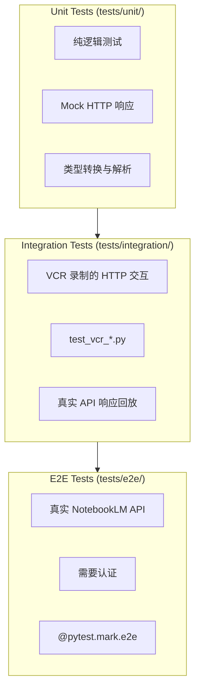

<details>
<summary>相关源文件</summary>

生成本页时使用的主要源文件：

- [tests/conftest.py](../../../project-repos/notebooklm-py/tests/conftest.py)
- [pyproject.toml](../../../project-repos/notebooklm-py/pyproject.toml)
- [.pre-commit-config.yaml](../../../project-repos/notebooklm-py/.pre-commit-config.yaml)
- [.github/workflows/test.yml](../../../project-repos/notebooklm-py/.github/workflows/test.yml)

</details>

# 测试与质量

notebooklm-py 采用三层测试架构（Unit → Integration → E2E），使用 VCR.py 录制 HTTP 交互，覆盖率门槛 90%，配合 Ruff + mypy + pre-commit 构成完整的质量工具链。

## 三层测试架构



| 层级 | 目录 | 运行条件 | 依赖 |
|------|------|----------|------|
| Unit | `tests/unit/` | 始终运行 | 无外部依赖 |
| Integration | `tests/integration/` | 始终运行 | VCR 录制文件（`tests/cassettes/`） |
| E2E | `tests/e2e/` | 需认证 + `-m e2e` | 真实 Google 账户 |

Sources: [pyproject.toml](../../../project-repos/notebooklm-py/pyproject.toml), [AGENTS.md](../../../project-repos/notebooklm-py/AGENTS.md)

<details class="source-snippets">
<summary>引用源码</summary>

<!-- source-snippets:start -->

#### `pyproject.toml`

```toml
[project]
name = "notebooklm-py"
version = "0.3.4"
description = "Unofficial Python library for automating Google NotebookLM"
dynamic = ["readme"]
requires-python = ">=3.10"
license = {text = "MIT"}
authors = [
    {name = "Teng Lin", email = "teng.lin@gmail.com"}
]
keywords = ["notebooklm", "google", "ai", "automation", "rpc", "client", "api"]
classifiers = [
    "Development Status :: 4 - Beta",
    "Intended Audience :: Developers",
    "License :: OSI Approved :: MIT License",
    "Programming Language :: Python :: 3",
    "Programming Language :: Python :: 3.10",
    "Programming Language :: Python :: 3.11",
    "Programming Language :: Python :: 3.12",
    "Programming Language :: Python :: 3.13",
    "Programming Language :: Python :: 3.14",
    "Topic :: Software Development :: Libraries :: Python Modules",
]
dependencies = [
    "httpx>=0.27.0",
    "click>=8.0.0",
    "rich>=13.0.0",
]

[project.urls]
Homepage = "https://github.com/teng-lin/notebooklm-py"
Repository = "https://github.com/teng-lin/notebooklm-py"
Documentation = "https://github.com/teng-lin/notebooklm-py#readme"
Issues = "https://github.com/teng-lin/notebooklm-py/issues"

[project.optional-dependencies]
browser = ["playwright>=1.40.0"]
cookies = ["rookiepy>=0.1.0"]
dev = [
    "pytest>=8.0.0",
    "pytest-asyncio>=0.23.0",
    "pytest-httpx>=0.30.0",
    "pytest-cov>=4.0.0",
    "pytest-rerunfailures>=14.0",
    "pytest-timeout>=2.3.0",
    "python-dotenv>=1.0.0",
    "mypy>=1.0.0",
    "pre-commit>=4.5.1",
    "ruff==0.8.6",
    "vcrpy>=6.0.0",
]
all = ["notebooklm-py[browser,dev]"]

[project.scripts]
notebooklm = "notebooklm.notebooklm_cli:main"

[build-system]
requires = ["hatchling", "hatch-fancy-pypi-readme"]
build-backend = "hatchling.build"

[tool.hatch.metadata.hooks.fancy-pypi-readme]
content-type = "text/markdown"

[[tool.hatch.metadata.hooks.fancy-pypi-readme.fragments]]
path = "README.md"

# Convert relative doc links to version-tagged absolute URLs
[[tool.hatch.metadata.hooks.fancy-pypi-readme.substitutions]]
pattern = '\]\(docs/'
replacement = '](https://github.com/teng-lin/notebooklm-py/blob/v$HFPR_VERSION/docs/'

[[tool.hatch.metadata.hooks.fancy-pypi-readme.substitutions]]
pattern = '\]\(CHANGELOG\.md\)'
replacement = '](https://github.com/teng-lin/notebooklm-py/blob/v$HFPR_VERSION/CHANGELOG.md)'

[[tool.hatch.metadata.hooks.fancy-pypi-readme.substitutions]]
pattern = '\]\(SECURITY\.md\)'
replacement = '](https://github.com/teng-lin/notebooklm-py/blob/v$HFPR_VERSION/SECURITY.md)'

[[tool.hatch.metadata.hooks.fancy-pypi-readme.substitutions]]
pattern = '\]\(LICENSE\)'
replacement = '](https://github.com/teng-lin/notebooklm-py/blob/v$HFPR_VERSION/LICENSE)'

[[tool.hatch.metadata.hooks.fancy-pypi-readme.substitutions]]
pattern = '\]\(SKILL\.md\)'
replacement = '](https://github.com/teng-lin/notebooklm-py/blob/v$HFPR_VERSION/SKILL.md)'

[tool.hatch.build.targets.wheel]
packages = ["src/notebooklm"]
force-include = {"SKILL.md" = "notebooklm/data/SKILL.md", "AGENTS.md" = "notebooklm/data/CODEX.md"}

[tool.pytest.ini_options]
testpaths = ["tests"]
asyncio_mode = "auto"
asyncio_default_fixture_loop_scope = "function"
addopts = "--ignore=tests/e2e"
# Global timeout prevents tests from hanging indefinitely (CI safety net)
# Individual tests can override with @pytest.mark.timeout(seconds)
timeout = 60
markers = [
    "e2e: end-to-end tests requiring authentication (run with pytest tests/e2e -m e2e)",
    "variants: parameter variant tests (skip to save quota)",
    "readonly: read-only tests against user's test notebook",
    "vcr: tests using VCR.py recorded cassettes (run with NOTEBOOKLM_VCR_RECORD=1 to record)",
]

[tool.coverage.run]
source = ["src/notebooklm"]
branch = true

[tool.coverage.report]
show_missing = true
fail_under = 90

[tool.mypy]
python_version = "3.10"
warn_return_any = false
warn_unused_ignores = true
disallow_untyped_defs = false
check_untyped_defs = true
```

#### `AGENTS.md`

````markdown
# Repository Guidelines

**Status:** Active
**Last Updated:** 2026-03-13

## Project Structure & Module Organization

`src/notebooklm/` contains the async client and typed APIs. Internal feature modules use `_` prefixes such as `_sources.py` and `_artifacts.py`; `src/notebooklm/cli/` holds Click commands, and `src/notebooklm/rpc/` handles protocol encoding and decoding. Tests are split by scope: `tests/unit/`, `tests/integration/`, and `tests/e2e/`. Recorded HTTP fixtures live in `tests/cassettes/`. Examples are in `docs/examples/`, and diagnostics live in `scripts/`.

## Build, Test, and Development Commands

Use `uv` for local work:

```bash
uv sync --extra dev --extra browser
uv run pytest
uv run ruff check src/ tests/
uv run ruff format src/ tests/
uv run mypy src/notebooklm
uv run pre-commit run --all-files
```

Run `uv run pytest tests/e2e -m readonly` only after `notebooklm login` and setting test notebook env vars.

## Coding Style & Naming Conventions

Target Python 3.10+, 4-space indentation, and double quotes. Ruff enforces formatting and import order with a 100-character line length. Keep module and test file names in `snake_case`; prefer descriptive Click command names that match existing groups such as `source`, `artifact`, and `research`. Preserve the internal/public split: `_*.py` for implementation, exported types in `src/notebooklm/__init__.py`.

## Testing Guidelines

Put pure logic in `tests/unit/`, VCR-backed flows in `tests/integration/`, and authenticated NotebookLM coverage in `tests/e2e/`. Name tests `test_<behavior>.py` and record cassettes with `NOTEBOOKLM_VCR_RECORD=1 uv run pytest tests/integration/test_vcr_*.py -v`. Coverage is expected to stay at or above the configured 90% threshold.

## Commit, PR, and Agent Notes

Follow the existing commit style: `feat(cli): ...`, `fix(cli): ...`, `refactor(test): ...`, `style: ...`. PRs should include a short summary, linked issue when relevant, and the commands run locally. For Codex or other parallel agents, prefer `--json`, pass explicit notebook IDs instead of relying on `notebooklm use`, and isolate runs with `NOTEBOOKLM_HOME=/tmp/<agent-id>` when multiple agents share one machine.
````

<!-- source-snippets:end -->
</details>

## VCR 录制机制

集成测试使用 VCR.py 录制和回放 HTTP 交互：

- **录制**：`NOTEBOOKLM_VCR_RECORD=1 uv run pytest tests/integration/test_vcr_*.py -v`
- **回放**：默认模式，从 `tests/cassettes/` 读取 YAML 录制文件
- **录制文件**：76 个 YAML 文件，覆盖所有 API 操作

录制文件命名规则：`<domain>_<operation>.yaml`，如 `artifacts_generate_audio.yaml`、`sources_add_url.yaml`。

Sources: [tests/cassettes/](../../../project-repos/notebooklm-py/tests/cassettes)

<details class="source-snippets">
<summary>引用源码</summary>

<!-- source-snippets:start -->

#### `tests/cassettes/`

> 引用目标是目录，无法展开源码片段：`tests/cassettes/`

<!-- source-snippets:end -->
</details>

## 测试配置

```toml
[tool.pytest.ini_options]
testpaths = ["tests"]
asyncio_mode = "auto"
addopts = "--ignore=tests/e2e"
timeout = 60
markers = [
    "e2e: end-to-end tests requiring authentication",
    "variants: parameter variant tests (skip to save quota)",
    "readonly: read-only tests against user's test notebook",
    "vcr: tests using VCR.py recorded cassettes",
]

[tool.coverage.report]
fail_under = 90
```

关键配置：

- **asyncio_mode = "auto"**：自动检测异步测试函数
- **addopts = "--ignore=tests/e2e"**：默认跳过 E2E 测试
- **timeout = 60**：全局超时防止测试挂起
- **fail_under = 90**：覆盖率低于 90% 构建失败

Sources: [pyproject.toml:90-130](../../../project-repos/notebooklm-py/pyproject.toml#L90-L130)

<details class="source-snippets">
<summary>引用源码</summary>

<!-- source-snippets:start -->

#### `pyproject.toml:90-130`

```toml
force-include = {"SKILL.md" = "notebooklm/data/SKILL.md", "AGENTS.md" = "notebooklm/data/CODEX.md"}

[tool.pytest.ini_options]
testpaths = ["tests"]
asyncio_mode = "auto"
asyncio_default_fixture_loop_scope = "function"
addopts = "--ignore=tests/e2e"
# Global timeout prevents tests from hanging indefinitely (CI safety net)
# Individual tests can override with @pytest.mark.timeout(seconds)
timeout = 60
markers = [
    "e2e: end-to-end tests requiring authentication (run with pytest tests/e2e -m e2e)",
    "variants: parameter variant tests (skip to save quota)",
    "readonly: read-only tests against user's test notebook",
    "vcr: tests using VCR.py recorded cassettes (run with NOTEBOOKLM_VCR_RECORD=1 to record)",
]

[tool.coverage.run]
source = ["src/notebooklm"]
branch = true

[tool.coverage.report]
show_missing = true
fail_under = 90

[tool.mypy]
python_version = "3.10"
warn_return_any = false
warn_unused_ignores = true
disallow_untyped_defs = false
check_untyped_defs = true
ignore_missing_imports = true
files = ["src/notebooklm"]
exclude = ["tests/"]

# Key check: catch attribute access on wrong types (would have caught our bugs)
[[tool.mypy.overrides]]
module = "notebooklm.cli.*"
warn_return_any = false
strict_optional = true

```

<!-- source-snippets:end -->
</details>

## 质量工具链

| 工具 | 用途 | 配置 |
|------|------|------|
| **Ruff** | 格式化 + Lint | `line-length = 100`，`target-version = "py310"` |
| **mypy** | 类型检查 | `check_untyped_defs = true`，`ignore_missing_imports = true` |
| **pre-commit** | 提交前检查 | Ruff + mypy + 其他钩子 |
| **pytest-cov** | 覆盖率 | 分支覆盖，90% 门槛 |

### Ruff 规则

启用的规则集：`E`（pycodestyle 错误）、`W`（pycodestyle 警告）、`F`（pyflakes）、`I`（isort）、`B`（bugbear）、`C4`（comprehensions）、`UP`（pyupgrade）、`SIM`（simplify）。

忽略的规则：`E501`（行长度由 formatter 处理）、`B008`（Click 默认参数函数调用）、`SIM102`（嵌套 if 保留可读性）、`SIM105`（显式 try/except 更清晰）。

Sources: [pyproject.toml:140-160](../../../project-repos/notebooklm-py/pyproject.toml#L140-L160)

<details class="source-snippets">
<summary>引用源码</summary>

<!-- source-snippets:start -->

#### `pyproject.toml:140-160`

```toml
    "F",      # pyflakes
    "I",      # isort
    "B",      # flake8-bugbear
    "C4",     # flake8-comprehensions
    "UP",     # pyupgrade
    "SIM",    # flake8-simplify
]
ignore = [
    "E501",   # line too long (handled by formatter)
    "B008",   # function call in default argument (Click uses this)
    "SIM102", # nested ifs - kept for readability in complex data parsing
    "SIM105", # contextlib.suppress - explicit try/except clearer for data parsing
]
per-file-ignores = {"src/notebooklm/__init__.py" = ["E402"], "src/notebooklm/notebooklm_cli.py" = ["E402"]}

[tool.ruff.lint.isort]
known-first-party = ["notebooklm"]

[tool.ruff.format]
quote-style = "double"
indent-style = "space"
```

<!-- source-snippets:end -->
</details>

## CI 测试矩阵

```yaml
strategy:
  matrix:
    os: [ubuntu-latest, macos-latest, windows-latest]
    python-version: ["3.10", "3.11", "3.12", "3.13", "3.14"]
```

共 15 个组合（3 OS × 5 Python 版本），确保跨平台兼容性。CI 流程：

1. **Quality Job**：pre-commit + mypy + e2e fixture 验证
2. **Test Job**：安装依赖 → Playwright 缓存 → 运行测试（覆盖率 70% CI 门槛）

Sources: [github/workflows/test.yml](../../../project-repos/notebooklm-py/.github/workflows/test.yml)

<details class="source-snippets">
<summary>引用源码</summary>

<!-- source-snippets:start -->

#### `github/workflows/test.yml`

```yaml
name: Test

on:
  push:
    branches: [main]
  pull_request:
    branches: [main]

concurrency:
  group: $&#123;&#123; github.workflow &#125;&#125;-$&#123;&#123; github.ref &#125;&#125;
  cancel-in-progress: true

jobs:
  quality:
    name: Code Quality
    runs-on: ubuntu-latest
    steps:
    - uses: actions/checkout@v6

    - name: Set up Python
      uses: actions/setup-python@v6
      with:
        python-version: "3.12"
        cache: 'pip'

    - name: Install dependencies
      run: |
        python -m pip install --upgrade pip
        pip install -e ".[all]"

    - name: Run pre-commit checks
      run: pre-commit run --all-files

    - name: Run type checking
      run: mypy src/notebooklm --ignore-missing-imports

    - name: Verify e2e test fixtures
      run: pytest tests/e2e --collect-only -q

  test:
    name: Test ($&#123;&#123; matrix.os &#125;&#125;, Python $&#123;&#123; matrix.python-version &#125;&#125;)
    runs-on: $&#123;&#123; matrix.os &#125;&#125;
    needs: quality
    strategy:
      fail-fast: false
      matrix:
        os: [ubuntu-latest, macos-latest, windows-latest]
        python-version: ["3.10", "3.11", "3.12", "3.13", "3.14"]

    steps:
    - uses: actions/checkout@v6

    - name: Set up Python $&#123;&#123; matrix.python-version &#125;&#125;
      uses: actions/setup-python@v6
      with:
        python-version: $&#123;&#123; matrix.python-version &#125;&#125;
        cache: 'pip'

    - name: Install dependencies
      run: |
        python -m pip install --upgrade pip
        pip install -e ".[all]"

    - name: Get Playwright version
      id: playwright-version
      shell: bash
      run: |
        echo "version=$(pip show playwright | grep '^Version:' | cut -d' ' -f2)" >> $GITHUB_OUTPUT

    - name: Cache Playwright browsers
      uses: actions/cache@v5
      with:
        path: |
          ~/.cache/ms-playwright
          ~/AppData/Local/ms-playwright
        key: playwright-$&#123;&#123; matrix.os &#125;&#125;-$&#123;&#123; steps.playwright-version.outputs.version &#125;&#125;

    - name: Install Playwright browsers
      run: playwright install chromium

    - name: Install Playwright system dependencies (Linux)
      if: runner.os == 'Linux'
      run: playwright install-deps

    - name: Run tests with coverage
      run: pytest --cov=src/notebooklm --cov-report=term-missing --cov-fail-under=70
```

<!-- source-snippets:end -->
</details>

## E2E 测试

E2E 测试需要真实认证和测试笔记本：

```bash
notebooklm login
# 设置测试笔记本环境变量
uv run pytest tests/e2e -m readonly
```

`readonly` 标记的测试只读取数据，不创建或修改笔记本，适合日常验证。

Sources: [tests/e2e/](../../../project-repos/notebooklm-py/tests/e2e)

<details class="source-snippets">
<summary>引用源码</summary>

<!-- source-snippets:start -->

#### `tests/e2e/`

> 引用目标是目录，无法展开源码片段：`tests/e2e/`

<!-- source-snippets:end -->
</details>

## 相关页面

- [项目概览](overview.md)
- [部署与 CI/CD](deployment-and-ci.md)
